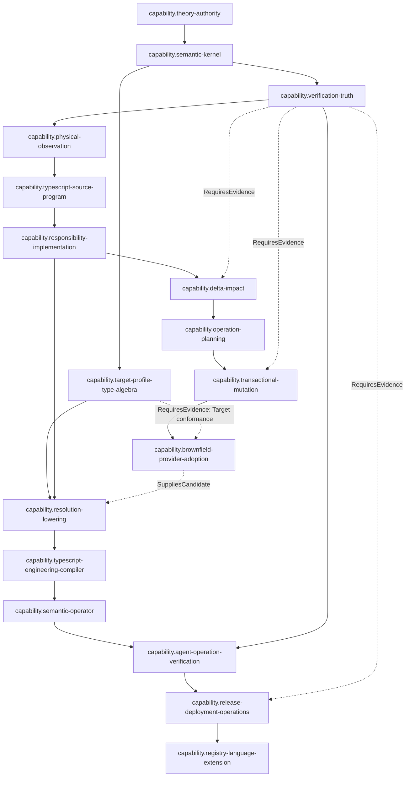

# SEC 能力与交付 DAG

## 1. 所有权

本文只拥有稳定 capability identities、节点级 entry/exit obligation refs、reversal refs 与产品交付偏序。Capability edge 的精确 relation kinds由 [Capability Relation 与交付偏序](capability-relations.md) 唯一拥有。当前工作选择、Issue、Work Package、priority、exact main、candidate、blocker、CI/Review 由 current control/live providers拥有。

Roadmap **不重新定义** Product、Design primitive、Owner/Grant/Resource algebra、Mutation state machine、Provider maturity、Claim/Gate/Result/Evidence、Implementation Resolution 或 Documentation topology。需要解释这些对象时只引用 canonical owner；否则 Roadmap 会重新变成第二 Architecture Bible。

| concern | canonical owner |
| --- | --- |
| 产品结果、非目标、maturity/support boundary | `docs/product.md` |
| universal relation/constraint/decision semantics | `docs/design-calculus.md` + children |
| 工程原则 | `docs/engineering-constitution.md` |
| Agent原则 | `docs/agent-constitution.md` |
| Domain/Owner/Operation/Authority/Resource | `docs/system-architecture.md` + children |
| target implementation / placement / source observation | `docs/implementation-architecture.md` + children |
| ImplementationWorkAdmitted | `docs/development-governance/implementation-admission.md` |
| Target/Profile/Resolution/Binding/Target Program | `docs/compiler-target-ir.md` |
| Brownfield/Provider candidate input | `docs/brownfield-import.md` / `docs/external-provider-policy.md` |
| Compatibility/Migration/Retirement | `docs/change-management.md` |
| Verification/Evidence/Review/Merge | `docs/verification-governance.md` + children |

## 2. 节点通用合同

```text
CapabilityNode = exact {
  capabilityRef,
  definitionOwnerRef,
  relationRefs,
  entryObligationRefs,
  exitClaimRefs,
  reversalRefs
}
```

```text
NodeExit(node) =
  every required exit Claim has fresh owning Evidence/Verdict
  ∧ product maturity admits the claimed state
  ∧ required design/implementation/current closures are admitted
  ∧ publication/readback/retirement obligations for this node are closed
```

Roadmap顺序不签发设计、Scope、Effect、PASS、merge、Support或完成。`ImplementationWorkAdmitted` 缺失时，可以继续纯设计/观察/有界实验，但不能以 Roadmap node 已存在为理由开始 canonical implementation write。

## 3. 硬 prerequisite DAG

这里只画 `RequiresSemantic` / `RequiresAdmission` 中真正使 downstream 能力非法的边；`SuppliesCandidate`、`RequiresEvidence`、`CalibratedBy`、`Revalidates`、`Enables` 与 current `DeliveryAfter` 不伪装成硬边。



关键裁决：`capability.brownfield-provider-adoption` **不是** `capability.target-profile-type-algebra` 的硬前驱。Brownfield/verified Provider 是 Implementation Resolution 的候选来源；Target/Profile 同时给 Provider conformance 提供验证环境。这样保留真实反馈关系而不制造语义循环。

## 4. Capability nodes

| capabilityRef | definition owner | hard prerequisite summary | unique capability-level output | exit obligation summary |
| --- | --- | --- | --- | --- |
| `capability.theory-authority` | Product + universal-law/project-adoption owners | accepted outcome/real constraints | adopted product/law/authority roots | 无并列总owner；universal law与project adoption分离；current facts不写stable docs |
| `capability.semantic-kernel` | Semantic Model | theory-authority | validated engineering semantic contracts | identity/revision/authority/unknown分型；无品牌/path核心分支 |
| `capability.verification-truth` | Verification Governance | semantic-kernel | Claim/Gate/Result/Aggregate truth contracts | empty/unknown/stale/self-proof/unsupported不能伪造PASS |
| `capability.physical-observation` | Source/physical observation owners | verification-truth | exact physical/content observations | bounded universe；unreadable/unsafe/unknown不降absent |
| `capability.typescript-source-program` | Brownfield + Source Observation | physical-observation | TypeScript language fact projections | one semantics owner；clean/incremental/cache-disabled等价；局部ActionKey |
| `capability.responsibility-implementation` | System + Implementation Architecture | source-program | Responsibility/realization/placement decisions | owner由semantic relations导出；path/package不自授权；真实Adopt consumer |
| `capability.delta-impact` | Delta/Impact | responsibility-implementation | Fact/Binding Delta + Impact | validated endpoints；unknown保守传播；不判Compatibility |
| `capability.operation-planning` | System Operation + domain owners | delta-impact | immutable PureOperationPlan | zero Effect；live Grant/Provider/Allocation不污染plan identity |
| `capability.transactional-mutation` | Semantic Mutation | operation-planning | journaled canonical transition | PurePlan/Admission分离；prepared-before-effect；CAS/readback/recovery |
| `capability.brownfield-provider-adoption` | Brownfield + External Provider | mutation admission + Target conformance Evidence when applicable | adopted responsibility / eligible Provider candidates | 真实 external corpus；candidate不自动提升authority；Resolution仍外置 |
| `capability.target-profile-type-algebra` | Compiler Target IR | semantic-kernel | Target Profile + Type Algebra | Host/Target正交；未知Target组合emit前拒绝；不依赖Brownfield存在 |
| `capability.resolution-lowering` | Compiler Target IR | Target/Profile + responsibility/requirements | ResolutionDecision + ImplementationBinding + Target Program | hard eligibility先于policy；Brownfield/Provider仅SuppliesCandidate；backend不重选 |
| `capability.typescript-engineering-compiler` | Compiler Target IR | resolution-lowering | general TypeScript target compilation | 多业务/多candidate family；round-trip/byte parity；无品牌core branch |
| `capability.semantic-operator` | Agent/User Interface + operation owners | engineering-compiler | user/Agent semantic operation projections | CLI/API/Agent不重算语义、Grant、Resolution或Verification |
| `capability.agent-operation-verification` | Development + Verification Governance | semantic-operator + verification-truth | Task/Operation/VerificationSession integration | one real orient→effect→verify→integrate→new-main readback；resume不靠聊天 |
| `capability.release-deployment-operations` | Runtime/Distribution + Change + Verification | agent-operation-verification | package/deployment/support operation truth | reproducible artifact、deploy/readback/rollback、SBOM/attestation/support evidence |
| `capability.registry-language-extension` | Distribution/Provider/Compiler owners | release-deployment-operations | governed provider/language/distribution extension | signed identity、migration/revocation、统一Resolution；不建第二semantic core |

节点表只给 capability-level contract；内部对象/公式回到 definition owner。以后 owner 内部模型演进时，不需要同步复制到 Roadmap。

## 5. 新能力的局部插入

新增语言、Provider、数据库、部署机制、Agent模型或新的产品 capability：

```text
1. prove a real capability identity / accepted FutureObligation;
2. create one CapabilityNode;
3. add only its typed adjacent relations;
4. add its entry/exit Claim refs;
5. invalidate reverse-reachable capability proofs/work selection only.
```

禁止：

- 给所有 capability 重编号；
- 修改无关节点字段以“保持总图一致”；
- 新 Provider 导致 core/roadmap 品牌 switch；
- 把 current delivery order写成 stable semantic edge；
- 为未来可能性物化 active 空 package/facade/version/runtime。

若新事实只是给既有 capability 新增 Evidence、Candidate、Calibration 或 Revalidation，不增加 hard prerequisite edge。

## 6. Current scheduling 分离

Stable capability graph只回答“哪些能力语义上/准入上依赖哪些能力”。`docs/roadmap.md`、WorkSelection、ExecutionWave、WorkPackage负责 current executable work：priority、Issue、main、resource conflict、batch、blocked/deferred/superseded等。

同一个 capability 可以经历多代工作包；一个 WorkPackage也可以在权限/资源/路径闭合时包含多个 capability work slices。两者 identity 不互相编码。

## 7. 完成

```text
CapabilityRoadmapClosed =
  every node has one stable capability identity and definition owner
  and every edge has an explicit relation kind
  and hard DAG contains only true illegality prerequisites
  and domain-internal ontology is referenced rather than copied
  and ImplementationWorkAdmitted is referenced from its sole owner
  and current scheduling is external
  and new capabilities alter only adjacent typed relations and reverse-reachable closure
```

<!-- sec-clause {"id":"capability-roadmap-root","blocker":null,"kind":"stable-decision"} -->
## 规范片段

Roadmap只拥有CapabilityNode identity、typed capability relations与entry/exit/reversal refs；领域内部Claim、Grant、Resource、Mutation、Resolution、Provider等语义只引用owner。硬DAG只保留RequiresSemantic/RequiresAdmission真前置，Brownfield/Provider通过SuppliesCandidate进入Resolution；新增能力只修改相邻typed edges和反向可达闭包。
