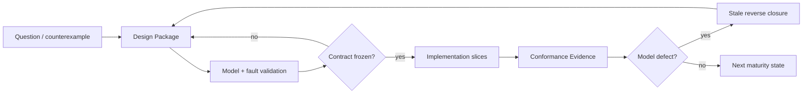

# SEC 能力与交付 DAG

## 1. 所有权

本文拥有稳定 capability DAG、节点依赖、进入/退出 Evidence、反转条件和产品完成边界。当前工作选择目录由 `docs/roadmap.md` control projection 拥有。

| 不属于本文件 | 唯一来源 |
|---|---|
| 当前 main/SHA/tree/PR/CI/Review | live provider 与 exact readback |
| 当前 Work Package、blocker、candidate | control plane 与 docs/work |
| 产品价值与非目标 | product |
| 事实种类、关系、约束、原则语言和设计演算 | design calculus |
| 通用工程原则 | engineering constitution |
| SEC owner、operation、resource 与架构实例化 | system architecture |
| logical model 到 declaration/package/file/generated artifact 的实现、局部变更和意图编译 | implementation architecture |
| 兼容、迁移、退役 | change management |
| Provider 成熟度 | external provider policy |
| PASS、Evidence、Gate | verification governance |
| 通用 Agent 行为原则 | agent constitution |
| SEC Task/Operation/Skill/Work Package 行为 profile | development governance |

路线是能力偏序，不是日期表、Issue 镜像或“代码存在即完成”的清单。

## 2. 成熟度

~~~mermaid
stateDiagram-v2
  [*] --> Proposed
  Proposed --> ContractFrozen
  ContractFrozen --> ImplementedInMain
  ImplementedInMain --> PhysicallyVerified
  PhysicallyVerified --> PackagedOrDeployed
  PackagedOrDeployed --> ProductSupported

  ContractFrozen --> Proposed: design invalidated
  ImplementedInMain --> ContractFrozen: implementation disproves contract
  PhysicallyVerified --> ImplementedInMain: environment or evidence invalidated
  ProductSupported --> PhysicallyVerified: incident EOL or provider withdrawal
~~~

| 层级 | 可证明 | 不能证明 |
|---|---|---|
| proposed | 目标与候选关系已记录 | 合同正确、可实现 |
| contract-frozen | 对象、owner、输入输出、拒绝边界已冻结 | 代码存在 |
| implemented-in-main | canonical main 含实现 | 物理环境可用 |
| physically-verified | exact subject/environment 上成立 | 可分发、受支持 |
| packaged/deployed | 可重复安装或部署 | 长期支持 |
| product-supported | 支持策略、运营、撤销与恢复闭合 | 永久有效 |

任何类型、文档、测试、提交、PR 或示例都只能提供其实际层级的 Evidence。

### 2.1 Design-to-implementation gate

| Change kind | 实现前必须冻结 | 可省略 |
|---|---|---|
| 新产品能力/跨 owner 架构/公共合同/持久状态/Effect/resource/provider/layout/evolution | `docs/design-calculus.md` 定义的完整 Design Package + SEC scenario traces；涉及实现结构时同时冻结 `docs/implementation-architecture.md` 的 entity/placement/locality/generation/migration 投影 | production code |
| 已冻结 operation 内的局部实现纵切片 | Design Package ref、exact owned closure、acceptance/settlement/proof obligations | 重做全局哲学 |
| 用于消解一个 design unknown 的 experiment | hypothesis、isolated inputs/effects、expiry、expected observation、retirement | production integration/authority |
| incident recovery | 当前状态 readback、最小安全 transition、residue/rollback | 新功能与无关重构 |

该 gate 防止边写边发现结构，但不要求每个叶节点重复全套设计；叶节点必须引用现有 frozen package，找不到则返回 design-unbound。

## 3. 唯一能力 DAG

~~~mermaid
flowchart TD
  THEORY[capability.theory-authority] --> SEMANTIC[capability.semantic-kernel]
  SEMANTIC --> TRUTH[capability.verification-truth]
  TRUTH --> PHYSICAL[capability.physical-observation]
  PHYSICAL --> SOURCE[capability.typescript-source-program]
  SOURCE --> RESPONSIBILITY[capability.responsibility-implementation]
  RESPONSIBILITY --> DELTA[capability.delta-impact]
  DELTA --> PLAN[capability.operation-planning]
  PLAN --> MUTATION[capability.transactional-mutation]
  MUTATION --> ADOPTION[capability.brownfield-provider-adoption]
  ADOPTION --> TARGET[capability.target-profile-type-algebra]
  TARGET --> RESOLUTION[capability.resolution-lowering]
  RESOLUTION --> COMPILER[capability.typescript-engineering-compiler]
  COMPILER --> OPERATOR[capability.semantic-operator]
  OPERATOR --> AGENT[capability.agent-operation-verification]
  AGENT --> RELEASE[capability.release-deployment-operations]
  RELEASE --> EXTENSION[capability.registry-language-extension]

  ADOPTION -. governed existing implementation .-> RESOLUTION
  TRUTH -. truth kernel .-> DELTA
  TRUTH -. truth kernel .-> MUTATION
  TRUTH -. truth kernel .-> RELEASE
~~~

这些是带semantic identity的能力节点，不是按数量命名的子系统。共同语义、Verification truth、事实/变化、受控行动、吸收/选择/生成、交互/开发闭环和交付/扩展由DAG关系组合；插入、合并或退役节点只改变关系与受影响closure，不重编号其他identity。

## 4. 能力节点合同

| 能力节点 | 依赖 | 唯一产物 | 最小退出 Evidence | 反转触发 |
|---|---|---|---|---|
| `capability.theory-authority` | 用户终局、现实约束 | product boundary、owner map、root DAG | 无并列总计划/owner；稳定文档无动态事实 | 核心对象或authority无法共用 |
| `capability.semantic-kernel` | theory/authority | validated Engineering Semantic Model | canonical bytes稳定；无关模型不改core | 第二identity/revision/loader出现 |
| `capability.verification-truth` | semantic kernel | Requirement/Gate/Result/Claim/Aggregate | zero-test、unknown、stale、self-proof不能PASS | consumer对同一真值不一致 |
| `capability.physical-observation` | verification truth | exact Physical Observation / Content Manifest | tracked/declared inventory无未解释遗漏；unknown不等于absent | 读取path被当identity |
| `capability.typescript-source-program` | physical observation | TypeScript Source Program Model | clean/incremental bytes等价；dynamic/opaque显式 | 正则/名字图改变TS语义 |
| `capability.responsibility-implementation` | TypeScript Source Program | Responsibility decisions、Owner DAG、Implementation/Placement decisions | owner由关系闭包导出；实际Source Program满足visibility/locality；至少一项真实Adopt | 只能靠path/品牌/人工清单 |
| `capability.delta-impact` | responsibility/implementation | Fact Delta、Binding Delta、Impact | independently validated endpoints；unknown保守传播 | comparator重新resolve或判compatibility |
| `capability.operation-planning` | delta/impact | immutable Engineering Operation plan | dry-run零Effect；caller不能提交derived authority | intent、plan、authorization混合 |
| `capability.transactional-mutation` | operation planning | journaled canonical transition | crash/CAS/rollback/recovery/readback；replay不重复Effect | mutation绕过journal/lease/fence |
| `capability.brownfield-provider-adoption` | transactional mutation | adopted Brownfield responsibility / Provider candidate | 真实外部工程conformance；至少一个governed mutation | candidate被自动提升authority |
| `capability.target-profile-type-algebra` | brownfield/provider adoption | Target Profile、Type Algebra | Host/Target正交；未知组合emit前拒绝 | 从cwd/host猜Target |
| `capability.resolution-lowering` | target profile/type algebra | ResolutionDecision、ImplementationBinding、Target Program | hard eligibility先于policy；backend不重选实现 | 库名分支或万能resolver |
| `capability.typescript-engineering-compiler` | resolution/lowering | general TS compiler result | 多类业务、provider switch、round-trip、byte parity | 新业务要求core品牌分支 |
| `capability.semantic-operator` | TypeScript engineering compiler | user/Agent semantic projections | CLI/Agent同plan；expert pin也不能绕eligibility | interface重算语义或权限 |
| `capability.agent-operation-verification` | semantic operator | Task Capsule refs、Action DAG、VerificationSession | 一次真实orient→merge→readback；resume不靠聊天 | Skill/prose/候选verifier自授权 |
| `capability.release-deployment-operations` | agent operation/verification | package/deployment/operations truth | reproducible artifact、真实deploy/rollback、SBOM/attestation | live-worktree copy或支持状态自报 |
| `capability.registry-language-extension` | release/deployment/operations | governed registry/provider/language extension | signed identity、migration/revocation、统一resolution | 新语言建立第二semantic core |

每个出口都是合取条件；未满足项保持 typed incomplete，不能由后继节点倒推为完成。

## 5. 基础真值

### `capability.theory-authority`

必须冻结：

| 对象 | 唯一性要求 |
|---|---|
| Product | 问题、终局、边界、成功判据唯一 |
| Design Calculus | Subject/Claim/Relation/Constraint、原则语言与模型演算唯一 |
| Engineering Constitution | 工程 identity/truth/owner/capability/resource/effect/proof/evolution 原则唯一 |
| Agent Constitution | Agent epistemics/reasoning/authorization/action/recovery/self-correction 原则唯一 |
| SEC Architecture | owner、operation、resource 与通用原则的项目实例化唯一 |
| SEC Implementation Architecture | entity realization、placement、change locality、intent compilation 与 migration 唯一 |
| Meta-model evolution | relation、constraint、execution/proof、materialization 可迁移 |
| Current state | 只由 live resolver；不得写进稳定路线 |

human/formal/role/boundary/enforcement/AI views 必须由同一 principles 编译；任一视图不能改变 owner、unknown 或拒绝结论。

### `capability.semantic-kernel`

semantic kernel只包含跨语言、Provider、类库和Target仍成立的语义：

- stable Entity、Fact、Assertion、Contract、Responsibility、State、Operation、Policy、Permission、Effect、Scenario、Acceptance；
- identity、authority、confidence、provenance、validity、canonical ordering、semantic revision；
- raw → strict validate → normalize → deep-freeze 的单边界；
- conflict、ambiguous、unknown、opaque 是一等状态；
- Projection、Explain、cache 可重建，不能反向写事实；
- package、library、Provider、Adapter、Binding 与 semantic identity 分域。

semantic kernel不包含语言AST、文件path、品牌类库、完整未来IR宇宙或无consumer的平台。

### `capability.verification-truth`

~~~mermaid
flowchart LR
  REQ[Requirement] --> G[Gate]
  G --> EX[Execution or reuse]
  EX --> RES[Result]
  RES --> C[Claim]
  C --> A[Aggregate]
  E[Evidence + exact subject] --> C
  A --> S{passed failed not-run unsupported invalidated}
~~~

必须区分 executed/reused/not-executed、applicable/not-applicable、required/not-required。candidate verifier、empty selection、wrong environment、stale Evidence、cleanup failure 与 unsupported provider 都不能产生 PASS。

## 6. 事实、源码、所有权和变化

### `capability.physical-observation`

唯一 Content Manifest 覆盖 repository、workspace、package、target、file、config、test、workflow、resource、artifact，并分类 tracked/untracked/ignored/generated/vendor/binary/secret/protected/temporary/opaque。

~~~mermaid
flowchart LR
  G[Git object facts] --> CM[Content Manifest]
  F[Retained filesystem facts] --> CM
  CM --> SP[Source Program]
  CM --> TI[Test Impact]
  CM --> AU[Repository Audit]
  CM --> RP[AI Read Plan]
~~~

同一 content universe 只观察一次；dirty frontier 增量读取。symlink、junction/reparse、hardlink、case、Unicode、encoding、mode 和 unreadable 保留真实状态。SEC 手写 production executable source 的目标布局为 src；历史入口只有完成 consumer migration 后才能退役。

### `capability.typescript-source-program`

| 层 | 产物 | 权威边界 |
|---|---|---|
| syntax | file/module/declaration/span/import/export | Compiler API exact snapshot |
| symbol | definition/reference/alias/re-export/merge | Program/TypeChecker |
| type | signature/generic/overload/resolution | repository-locked TypeScript |
| invocation | TypedInvocation / ExternalCallBinding | 类型正确，不推断 runtime behavior |
| candidate | call/data/control/effect/provider candidates | observed/derived，非 business authority |
| frontier | dynamic/unknown/opaque/conflict | 不得降为 absent |

事实 shard key 为 content digest + interpreter contract + resolution/config closure。Language Service、watch、worker、cache 只优化等价计算；provider unavailable 不能触发第二语义入口。

TypeScript Source Program性能出口同时要求：

- Source Program、typecheck、audit、test-impact 共用 exact Content Manifest；
- cold、warm、delta、cache-disabled clean compile 的 bytes/diagnostics 等价；
- authoring query 使用增量 Language Service；
- final frozen tree 只产生一次 ActionKey-bound full type evidence；
- Windows/Provider 物理证明使用 retained session，不为每个进程重复昂贵 shell discovery。

### `capability.responsibility-implementation`

Responsibility Cell 由 declaration SCC、single writer/issuer/parser 和 Effect→settlement→readback→recovery 闭包共同生成。

| 状态 | 含义 |
|---|---|
| candidate | 机器观察到可能边界 |
| accepted | domain owner Adopt，形成 authority |
| rejected | 明确不是该 responsibility |
| ambiguous | 多个解释不能消解 |
| opaque | 当前 frontend 无法观察 |

Owner DAG 与 public demand 由系统架构编译；CodeUnit role、visibility、PlacementDecision、Change Locality、generated/authored/opaque classification 和 ArchitectureMigration 由 `docs/implementation-architecture.md` 从同一 Source Program 与 accepted Responsibility graph 编译。path、目录、index、facade、descriptor、package 或测试不能自报 owner。

Responsibility/Implementation能力不是一次性的目录整理。每个semantic delta都先定位唯一authored change point，再生成所有可推导投影；常规单责任变化只修改一个owner，真实跨owner变化进入一个带precondition、readback、recovery和retirement的ChangeTransaction。Intent-to-Code未覆盖的部分由受相同合同约束的ManualImplementationProvider提议，不能成为第二设计owner。

### `capability.delta-impact`

~~~mermaid
flowchart LR
  A[Validated snapshot A] --> D[Fact Delta]
  B[Validated snapshot B] --> D
  BA[Binding set A] --> BD[Binding Delta]
  BB[Binding set B] --> BD
  D --> I[Impact fixpoint]
  BD --> I
  I --> V[Verification requirements]
  I --> C[Change Management]
  C --> CD[Compatibility Decision]
  C --> M[Migration obligations]
~~~

Comparator 只比较 independently validated endpoints；不重新运行 Resolver，不用包名/semver/API 相似度猜匹配或兼容。Impact 区分 definite/possible/unknown，并保留 witness、cycles、predicted/actual/full omission。

## 7. 意图、Effect和吸收

### `capability.operation-planning`

~~~text
EffectiveGrant =
  CallerCapability
  ∩ OperationPolicy
  ∩ TargetRequirement
  ∩ SourceOwner
  ∩ Scope
  ∩ ProviderCapability
  ∩ CurrentRevision
  ∩ VerificationRequirement
~~~

caller 只提交 intent/constraint/prefer/require/forbid/pin/custom；Eligibility、Decision、Binding、Delta、Impact、Compatibility、Verification、rollback 和 terminal 都由 owner 派生。

一个 operation 共享 absolute deadline、AbortSignal 和不可逆 aggregate ledger，覆盖 lock、child、retry、readback、cleanup、recovery。process/container/Git/compiler session 只供应 transport settlement；domain terminal 必须由领域 readback 产生。

### `capability.transactional-mutation`

~~~mermaid
sequenceDiagram
  participant O as Operation
  participant L as Lease owner
  participant J as Journal owner
  participant E as Effect capability
  participant V as Verification

  O->>L: acquire exact subject lease
  O->>O: reobserve and replan
  O->>J: durable intent
  O->>E: stage under shared budget
  E-->>O: physical settlement
  O->>V: prepublication proof
  O->>E: CAS publish
  O->>O: canonical readback and actual delta
  O->>V: postpublication proof
  O->>J: terminal or recovery-required
  O->>L: release and readback
~~~

journal schema、stage identity、producer provenance、pointer、rollover 与 migration 必须由同一 transition owner 管理。失败只能是：publish 前零 live change；publish 后 exact rollback；或 typed recovery-required。terminal replay 不重复 Effect。

### `capability.brownfield-provider-adoption`

~~~mermaid
flowchart LR
  A[Attach] --> L[Lift]
  L --> R[Reconcile]
  R --> AD[Adopt]
  AD --> G[Govern]
  G --> N[Normalize]

  PHYSICAL[provider-maturity.physical] --> TYPED[provider-maturity.typed-invocation]
  TYPED --> GOVERNED[provider-maturity.governed-declaration]
  GOVERNED --> OBSERVED[provider-maturity.observed-candidate]
  OBSERVED --> VERIFIED[provider-maturity.verified-provider]
  VERIFIED --> NORMALIZED[provider-maturity.normalized-projection]
~~~

Adopt 只把 existing code/Provider/Adapter 放入正式 candidate catalog，不产生最终 Binding。Normalize 必须证明 round-trip、runtime/Acceptance parity、consumer migration、rollback 与 old writer/dependency retirement。

## 8. 目标、选择和编译

### `capability.target-profile-type-algebra`

Target Profile 显式声明 language、runtime、module、delivery、package manager、persistence、database、UI、verification、deployment 与 capabilities。Host、Toolchain、Target、Runtime Environment 正交；SEC 自身 host runtime policy 不能限制 Target workspace 的目标 runtime。

Type Algebra 覆盖 primitive、nominal、enum、optional、list、map、record、union、result、async、stream 及 recursion/nullability/discrimination/serialization/target mapping。未知组合在 Resolution 或 emit 前拒绝。

### `capability.resolution-lowering`

~~~mermaid
flowchart TD
  S[Validated Application and Behavior] --> REQ[Implementation Requirement]
  TP[Target Profile and Type Algebra] --> REQ
  REQ --> CAT[Candidate closures]
  CAT --> EL[Hard eligibility]
  EL --> POL[Resolution policy]
  POL --> DEC[Resolution Decision]
  DEC --> B[Exact Implementation Binding]
  B --> TPI[Target Program IR]
  TPI --> BE[Backend AST printer formatter]
~~~

Candidate 是完整 Provider/Reference/Existing/Custom/Block-delivered closure，不是包名。Contract、Type、Target、Effect/Permission、安全、license、dependency、support 和 owner 是 hard eligibility；policy 只在合格候选中排序。Backend 不得重新选库或解释业务兼容。

Application/Behavior 只表达可验证、可 lowering 的语义；复杂算法进入 Governed Extension/Opaque Boundary。Block Capability Resolver 只解析自己的领域 binding，不拥有产品最终选择。

### `capability.typescript-engineering-compiler`

出口必须覆盖：

- state/lifecycle、reservation/concurrency、approval/policy、Governed Extension 等无关业务；
- source/test/config/artifact generation；
- Reference、第三方、repository-existing 与 Custom implementation；
- positive、negative、failure、provider switch、upgrade、round-trip；
- incremental graph 的 content/pass/profile/requirement/candidate/policy/decision/binding/provider/backend keys；
- unknown 扩大失效；clean/incremental Decision、Binding、Delta 与 bytes 等价；
- dependency/provider 升级经新 Binding → Binding Delta/Impact → Compatibility/Migration；
- 新业务主要增加 Contract/Provider/Adapter，不增加 core 品牌分支。

## 9. 产品操作面和SEC自身开发闭环

### `capability.semantic-operator`

Architecture、Scenario、State、Contract、Effect/Permission、Implementation、Impact 与 Evidence 通过 stable references 互相下钻。用户可声明 intent、constraint、prefer、require、forbid、pin、custom 和 bounded override；所有模式进入同一 Engineering Operation。

Interface 不计算 Eligibility、Binding、Delta、Compatibility 或 terminal。AI 只能提交 proposal，不能扩大 scope、permission、Effect 或 Verification。

### `capability.agent-operation-verification`

~~~mermaid
flowchart TD
  U[User outcome] --> WD[WorkDecision]
  WD --> TC[Task Capsule compiler]
  TC --> RP[Bounded Read Plan]
  RP --> SK{zero or one Skill}
  SK --> C[Candidate generation]
  C --> AD[Requirement and Action DAG]
  AD --> VS[VerificationSession]
  VS --> RV[Independent Review]
  RV --> PM[Promotion]
  PM --> MR[New-main readback]
  MR --> CL[Retirement and cleanup]
~~~

Agent Operation/Verification能力不建立general Run Kernel。Task Capsule是pure unbound content；VerificationSession只保存Task Capsule、Action/Evidence、Review、Provider、Integration的typed references。一个logical run只有一个mutable worktree和一个active candidate ref；finding产生同一run的新generation。

关键出口：

- Requirement tri-state、subject-closure ActionKey、fresh PASS reuse、fresh failure reuse、in-flight join；
- physicalStartsPerActionKey 不大于一；
- candidate control 与 active-main control 分离；
- context compression/restart 从 authority 重算，不从聊天恢复权限；
- candidate Skill/verifier/workflow 不能授权自身；
- Review subject、Promotion identity 与 Candidate generation 分离；
- exact new-main readback 后才完成；Issue/PR prose 无完成 authority；
- legacy Skill/journal/API/branch/worktree 在 consumer-zero + physical readback 后退役。

## 10. 交付和扩展

### `capability.release-deployment-operations`

Release 只从 clean exact tree、Target Profile 与 exact Binding closure 构建。package/public projection、exports、runtime assets、dependencies、licenses、native/install-script、SBOM、checksums、signing/attestation 与 publication receipt 必须闭合。

Deployment 独立拥有 config、secrets、migration、feature flag、canary、rollback、observability、SLO 与 incident。Support maturity 可因 EOL、incident、Provider withdrawal 或 physical regression 失效，并触发重新 Resolution、Delta/Impact、Compatibility 与 Migration。

### `capability.registry-language-extension`

Registry item 必须有 identity、content digest、producer trust、Effect/Permission、conformance、compatibility、migration、revocation/yank 与 supply-chain Evidence。official/private/community 是 policy，不是质量捷径。

新语言只增加 Language Frontend、Source Analysis Provider、Language Service/transform、Target Backend、Build/Runtime Adapter 与 cross-language boundary；语言私有 AST/IR 不能成为 Engineering IR，Registry 不能成为第二 Resolver。

## 11. 横切能力何时激活

| 横切能力 | 激活触发 | 必须进入的 owner | 禁止 |
| --- | --- | --- | --- |
| determinism | 两次等价计算或 durable bytes | 产生该结果的 domain owner | 全局排序工具成为第二 owner |
| identity/revision | 两个可区分 subject/state | semantic/change owner | path、名字、随机 UUID 冒充 identity |
| provenance/Explain | claim 被下游消费 | claim/evidence owner | 自报 digest 自证 authority |
| security/permission | operation 触达 trust boundary | operation/provider owner | presentation 或 caller JSON 扩权 |
| compatibility/migration | 两个真实可观察状态共存 | change management | 无 consumer 的兼容壳 |
| transaction/recovery | Effect 可部分完成或跨进程 | state/effect owner | catch 后当 absent 重做 |
| performance/resource | 有真实 latency/cost/budget | resource owner | 每层重置 timeout 或重复扫描 |
| docs/governance | 规则跨任务复用 | canonical principle owner | 在 roadmap/AGENTS 重复规则正文 |
| external tool | 缺口由成熟能力填补 | provider capability owner | 一对一 wrapper 镜像工具 |
未来价值不靠空代码保存。尚无 consumer 的合理未来需求记录为 capability obligation：目标、触发条件、必守不变量、潜在 consumer 和拒绝建立实现的原因。consumer 出现后重新进入相应阶段编译。

## 12. 受约束扩展轨道

~~~mermaid
flowchart LR
  P[Product capability DAG] --> W[Workspace Domains]
  P --> C[Reference Repository Conformance]
  P --> S[Specialized Target or Provider]
  W --> P
  C --> P
  S --> P
~~~

### Workspace Domain

~~~text
W0 inventory → W1 validated identity → W2 query/projection
→ W3 Delta/Impact → W4 governed mutation
→ W5 migration/compatibility → W6 fault/recovery → W7 supported
~~~

Repository、Documentation、Workflow/Gate、Agent Operations、Evidence、Release、Product Decision 等 domain 可在 W1/W2 先提供只读价值；进入 W3 以后必须消费产品主脊的真实 owner。

### Reference Repository Conformance

~~~text
C0 exact census → C1 classification → C2 mechanism decisions
→ C3 owner/entry/public surface coverage → C4 domain bindings
→ C5 semantic/effect/failure parity → C6 migration/readback
→ C7 retirement → C8 unexplained delta = 0
~~~

具体参考仓库由 conformance owner 登记，roadmap 不硬编码其资产路径或计数。完成门为 unclassified、undecided、missing parity、unexplained delta、unauthorized retirement 全部为零。

### Specialized Target / Provider

~~~text
target-track.corpus-architecture → target-track.physical-provider-contract
→ target-track.source-model-support → target-track.cross-artifact-impact
→ target-track.governed-mutation → target-track.resolution-lowering-roundtrip
→ target-track.runtime-compatibility-acceptance → target-track.supported
~~~

Web、Bun/Node/Edge、Persistence、Mobile、Native、Systems、Hardware、High Assurance、ML/Data都只是可能的Target/Provider轨道。它们不得改变`capability.semantic-kernel` authority，也不得建立第二compiler、Resolver、Binding comparator或Compatibility evaluator。

## 13. 实现切片与反转

一个实现切片必须纵向闭合：

~~~text
owner contract
→ production behavior
→ failure/recovery boundary
→ targeted Verification
→ consumer migration
→ replaced path retirement
→ exact-main readback
~~~

| 观察到的问题 | 返回最早失效节点 | 禁止下游补丁 |
|---|---|---|
| identity/owner不唯一 | `capability.theory-authority` / `capability.semantic-kernel` | alias、facade、第二registry |
| PASS语义分裂 | `capability.verification-truth` | 新boolean、测试自证 |
| 同一源码被重复发现 | `capability.physical-observation` / `capability.typescript-source-program` | 第三份regex/AST graph |
| 文件组织只能靠路径清单或多文件同步改一行 | `capability.responsibility-implementation` | 固定目录镜像测试、手写投影 |
| delta与compatibility混合 | `capability.delta-impact` / change owner | 万能upgrade resolver |
| plan有Effect | `capability.operation-planning` | 给dry-run加cleanup |
| crash后无法判定 | `capability.transactional-mutation` | 删除residue或重做 |
| Provider candidate自授权 | `capability.brownfield-provider-adoption` | 加allowlist名称 |
| Target从Host推断 | `capability.target-profile-type-algebra` | 平台if/else |
| Backend重新选实现 | `capability.resolution-lowering` | adapter例外 |
| 新业务修改core品牌分支 | `capability.typescript-engineering-compiler` | 增加模板组合 |
| CLI/Agent产生权限 | `capability.semantic-operator` / `capability.agent-operation-verification` | trusted flag |
| release从live tree构建 | `capability.release-deployment-operations` | 复制后补hash |
| 新语言复制语义核心 | `capability.registry-language-extension` | 跨语言同步层 |

架构变化本身是 migration：先冻结新旧 meta-model 的映射与等价条件，再 shadow、比较、切 consumer、退役旧 owner。不能在下游永久维持双写。

## 14. 执行优先级

~~~text
Priority =
  product outcome unblocking
  × causal centrality
  × affected consumer closure
  × failure severity
  ÷ lifecycle cost
~~~

优先处理能同时删除重复扫描、重复owner、重复Effect和重复Evidence的根节点。基础设施只有真实产品consumer时建设；不直接解除安全/完整性blocker的基础设施切片之后，后续最小计划必须包含直接推进product capability DAG用户可观察出口的纵切片，除非新事实改变因果图。该比例由当前Requirement DAG和cost frontier编译，不手写固定数量或priority编号。

成熟工具优先，但必须先做 capability gap、owner、security/license、operation budget、retirement census；工具输出只提供候选或 Evidence，不能替代领域 consumer。

## 15. 无代码逻辑验证

| 场景 | 路线结论 |
|---|---|
| 类型和测试存在，但没有真实 deploy | 最多 physically-verified，不能 product-supported |
| 新provider输出更丰富 | 进入`capability.brownfield-provider-adoption` candidate；不能跳过`capability.resolution-lowering` |
| 同一内容被typecheck/audit/test-impact各扫一遍 | physical observation / TypeScript Source Program出口失败 |
| TypeScript daemon 更快但产生第二 truth | 拒绝；只允许等价增量投影 |
| 旧代码有未来设计价值但无 consumer | 保存 capability obligation，不保留 active empty shell |
| browser UI 从 SEC core 退役 | core graph consumer-zero 后退役；Target browser capability仍可存在 |
| dry-run创建缓存或锁 | `capability.operation-planning`失败，不用cleanup美化 |
| child完成但handle丢失 | `capability.transactional-mutation` journal/readback；不能重做Effect |
| 两个候选都满足合同 | hard eligibility 后按 policy/tie-break 决策 |
| provider 替换且 API 相同 | 仍产生 Binding Delta，经 Impact/Compatibility |
| Agent summary声称已验证 | `capability.agent-operation-verification`拒绝，重建exact Action/Evidence refs |
| 新语言需要特殊AST | 增加frontend/provider；`capability.semantic-kernel`不变 |
| 能力节点合同被实现证伪 | 返回最早失效节点，后继 Evidence stale |

## 16. SEC-TS 首个产品完成边界

~~~mermaid
flowchart LR
  O[Exact observation] --> S[Source model]
  S --> R[Responsibility Adopt]
  R --> D[Delta and Impact]
  D --> P[Authorized plan]
  P --> M[Transactional mutation]
  M --> B[Resolution and Binding]
  B --> C[Compiler output]
  C --> U[Agent CLI operation]
  U --> V[Verification and Review]
  V --> X[Package deploy rollback]
~~~

SEC-TS 的第一个完整产品边界要求：

1. `capability.semantic-kernel`与`capability.verification-truth`闭合；
2. physical observation与TypeScript Source Program对真实TypeScript工程建立可重复模型且无重复content discovery；
3. Responsibility/Implementation至少完成一个真实Adopt；
4. predicted/actual Fact/Binding Delta与Impact可校准，Compatibility独立；
5. 一个canonical与一个Brownfield operation完成transaction/recovery；
6. 两个外部工程完成Attach→Adopt，至少一个Provider candidate、一个Normalize；
7. resolution/lowering与TypeScript engineering compiler对同一Contract解析多个无关实现并冻结唯一Decision/Binding；
8. semantic operator允许用户声明intent/constraint/prefer/require/forbid/pin/custom并解释选择、影响与迁移；
9. Agent operation/Verification完成一次真实SEC自身开发、独立Review、promotion与new-main readback；
10. release/deployment/operations产生clean package、真实deployment与rollback；
11. unknown、opaque、unsupported、Eligibility、Delta、Verification、Compatibility、Support 始终可区分；
12. 被替代 owner、路径、测试、Provider、adapter、branch、worktree 与临时状态均已按 Evidence 退役。

~~~text
ProductComplete =
  all required capability-node exits
  AND no duplicate semantic/effect/truth owner
  AND no unexplained unknown on the supported surface
  AND every Effect has settlement and recovery
  AND every public claim has independent Evidence
  AND exact distributed/deployed result is read back
~~~
