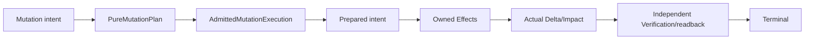
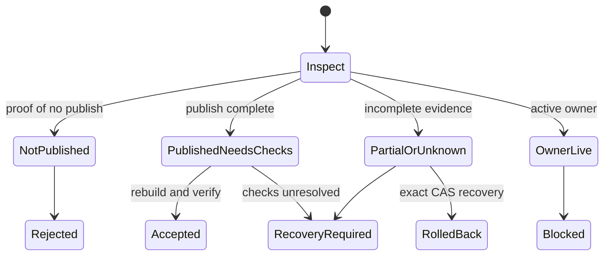

# Semantic Mutation 事务

## 1. 所有权与定位

Semantic Mutation 把受限意图在重新派生的 authority、owner、source mapping、Delta/Impact 与 Verification 边界内发布为 canonical source transition。本文拥有 transaction state machine、writer coordination、prepared intent、publication、journal、rollback/recovery 与 terminal 不变量。

Pure plan identity、planning observation、effectful planning computation、workspace overlay/writeback 与 live execution admission由 [Mutation Planning、Overlay 与 Execution Admission](semantic-mutation/planning-and-admission.md) 唯一拥有；本文只消费 `PureMutationPlanRef` 与 `AdmittedMutationExecutionRef`，不复制其字段。

| 可写 | 不可作为 caller 写目标 |
|---|---|
| Authoring Source | Engineering IR、Target IR |
| Adopted Governed Source | Projection、Artifact、Evidence |
| domain 明确授权的输入 | journal、control state、cache |

它不是 AI patch executor、任意文件 writer、artifact publisher 或 compatibility owner。

<!-- sec-clause {"blocker":"current-maturity-projection-unavailable","kind":"temporary-safety-denial"} -->
### 当前安全否认

在 generated maturity projection 未接管前，现行公开 surface 只能投影为：

| 当前已证缺口 | 当前能力结论 |
|---|---|
| legacy plan 会取 lease、建删目录、复制 workspace、写 staging | public-plan-effectful |
| production ingress 不强制不可伪造 issuer grant | not-production-authorized |
| staging 可能早于 prepared intent | staging-before-prepared-journal |
| journal 保存 caller projection且recovery authority未闭合 | authorization-recovery-unresolved |
| Workspace→Mutation 与 Mutation↔Verification owner cycles | dependency-owner-cycle-unresolved |

这些 denial 只描述 current 实现，不改变 target contract。修复后由 exact-tree maturity projection 原子迁出；测试 fixture、管理员权限、caller JSON 或 self-digest 不能临时解除。

## 2. 唯一 transaction chain



```text
MutationIntent
→ PureMutationPlan
→ AdmittedMutationExecution
→ Prepared
→ Effect/Publication
→ Actual Delta/Impact
→ Verification/Readback
→ accepted | rejected | rolled-back | recovery-required
```

`PureMutationPlan`与`AdmittedMutationExecution`是不同identity。live EffectGrant、Provider、Allocation、deadline、credential、physical preimage刷新只重新admit；只有 plan 的 immutable semantic/source inputs变化才重新plan。

## 3. 角色与权限

| 角色 | 拥有 | 不能提交/拥有 |
|---|---|---|
| Caller/User/AI/CLI | intent、target、允许参数、expectation | path/owner/Delta/Impact/risk/terminal |
| Product/Domain policy | authorization policy、semantic constraints | physical Effect |
| Trusted issuer | exact execution grant | semantic target definition |
| Operation Registry | operation discriminant、requirements、claims | transport switch |
| Source Ownership | unique owner、writable semantic region | mutation terminal |
| Pure planner | immutable semantic plan | live grant/provider/allocation/lease/staging/publication |
| Execution admission | intersect plan + grant + binding + allocation + preimage | 重写 plan语义 |
| Transaction executor | prepared intent后执行/settle | product semantics、Verification verdict |
| Journal/Recovery | durable execution facts | authority minting、IR、Evidence truth |
| Delta/Impact/Verification | actual change、affected closure、proof | source writer |

Agent Operation、Engineering Operation 与 Source Mutation Operation 是不同 identity/authority 域。

## 4. Operation Registry

每个 operation 记录：

| Facet | 内容 |
|---|---|
| identity | unique discriminant；只在真实版本 consumer 存在时 versioned |
| target | kinds、required predicates |
| caller input | 可给字段与禁止 derived 字段 |
| source | owner/adapter/mapping requirements |
| Effect | allowed/forbidden semantic regions/capabilities；physical address由binding派生 |
| invariant | preconditions、must-preserve、postconditions |
| change | expected Delta、additional-change policy |
| proof | owner-issued required Claim refs |
| settlement | idempotency、retry、rollback、recovery、compatibility |

不存在 registry entry 时 unsupported-before-write。transport/UI 不复制 operation switch。Operation definition声明 resource requirements，具体 dimension accounting由 [Resource Accounting](system-architecture/resource-accounting.md) 拥有。

## 5. Planning 与 writable layer

Pure planning与live admission严格引用 [planning-and-admission](semantic-mutation/planning-and-admission.md)：

- `Effects(PureMutationPlanCompiler)=empty`；
- 需要 filesystem/process/container/temp root 的 planning computation 是独立 admitted operation，返回 immutable receipt；
- read authority 与 EffectGrant分离；
- `WorkspaceContentView` 的effective overlay与最终 writable carrier必须有 `WritableSourceLayerBinding`；
- unsaved editor bytes与disk preimage不一致且无reconciliation时 `writable-layer-diverged`；
- Grant/provider/allocation/preimage drift只失效admission，除非它改变plan的semantic observation。

因此本文不再维护第二份 `MutationGrant` 或 Pure Plan字段表。

## 6. Apply

```mermaid
sequenceDiagram
  participant X as Executor
  participant L as Writer lease
  participant J as Journal
  participant E as Effect owner
  participant V as Verification

  X->>X: validate PurePlan + live Admission identity
  X->>L: acquire unique writer
  X->>X: reobserve writable source/owner/policy/provider
  X->>X: compare semantic-plan applicability; re-admit or replan minimally
  X->>J: publish authenticated prepared intent
  X->>E: stage owned writes/recovery material
  X->>V: prepublication claims when required
  X->>E: source/semantic CAS publication
  X->>X: live rebuild actual Delta/Impact
  X->>V: postpublication/readback claims
  X->>J: terminalize
  X->>L: release + cleanup receipt
```

Prepared intent 必须早于本 transaction 第一个 durable directory/staging/backup/source Effect。所有 execution phases共享一个 absolute deadline、AbortSignal、[mode-compatible resource ledger](system-architecture/resource-accounting.md) 与 commit fence。另一个 writer、manual edit、rebase、owner/policy/Target semantic drift 使 plan或admission按其真实依赖局部 stale；不得一律重建所有上游设计。

不同 operations 只有owner/semantic region/resource resolver证明不相交时才能并行；路径不同本身不够。

## 7. Expected、Actual、Impact

Predicted preview 属于 Pure Plan；actual 只在 Effect 后从 live rebuilt canonical state产生：

| 检查 | 失败结果 |
|---|---|
| required change 未出现 | block/recovery according to publication state |
| forbidden change 出现 | block/recovery |
| must-preserve 变化 | block/recovery |
| additional change 无 allowance | block/recovery |
| source/artifact 无 semantic provenance | block |
| unknown/opaque 超出 admitted ceiling | block |

Impact 只转发 Verification owner 签发的 Requirement/Claim refs；Mutation 不拥有 selector、ActionKey、Result 或 Aggregate。apply后的actual不能沿用predicted，也不能靠文本diff或green test忽略额外变化。

## 8. Publication 与 terminal

多文件 mutation 使用 staging、journal、commit marker 和 recovery；不做逐文件 best effort。Mutation write set 只含 authoritative source inputs；derived artifacts 由 Compiler/Runtime owner 重建，跨 revision compensation 由 Change Management 拥有。

Publication observation：

| 状态 | 处理 |
|---|---|
| definitely not published | 可安全拒绝/清本transaction stage |
| definitely published | 进入 live rebuild/readback/Verification |
| durability/publication unknown | 保留 journal/recovery material；禁止重发 |

process exit、file exists、rename success 或缺失 parent durability barrier不能单独证明 durable publication。

产品 terminal 只有：

| Terminal | 条件 |
|---|---|
| accepted | source已发布；live rebuild、actual Delta、required Verification/readback通过 |
| rejected | 未发布 live change；原因和 next action 明确 |
| rolled-back | exact prior bytes/modes/state恢复并验证 |
| recovery-required | 不能证明 accepted 或 exact rollback |

不存在 partial-success、accepted-with-warning 或 failed-but-files-written。blocked 是 planning/admission 状态，不是已开始 Effect 的 terminal。

## 9. Journal

```text
Journal owns execution facts;
Journal does not own semantic truth, grant issuance, Evidence truth or UI state.
```

| 必须绑定 | 禁止作为 authority |
|---|---|
| transaction/operation/PurePlan/live Admission refs | caller projection/self-digest |
| workspace/base/live revision、writer lease | path/ACL/admin identity |
| writable-layer/preimage proof、write set | journal自身存在 |
| prior/staged/published physical identities | expired authorization payload |
| phase、Verification refs、cleanup、terminal | test issuer |
| recovery preconditions、retention lineage | timestamp-only ownership |

Durable schema 绑定 exact byte grammar；同一 schema revision不能接受第二serialization。算法/required-key变化需要新 schema与one-way migration，不得刷新fixture或永久dual-read。

Terminal replay只返回retained result，不重做Effect。Compaction保留active、uncertain、recovery generations与terminal lineage。

## 10. Rollback 与 Recovery

### Rollback

- 只恢复本 transaction 拥有且仍匹配 published identity 的 entries；
- 恢复 journal 记录的 prior bytes/mode/absence/directory effects；
- 恢复后重建 canonical base state；
- 不覆盖后继 writer、unowned entry 或 unknown publication；
- rollback 失败继续 recovery-required。

### Recovery state machine



Recovery 幂等、可重入并绑定 exact transaction/generation。只有已开始Effect的有效 admission lineage且journal证明ownership的settlement可继续；尚无Effect的新operation必须重新授权。timeout不证明owner dead。

## 11. Verification 与 transport

Mutation 只在 prepublication、postpublication/readback 与 terminal settlement 消费 typed Verification refs。Verification owner 独立计算 applicability、ActionKey、execution、Result、Aggregate 与 freshness；双方只依赖 contract/query projection，禁止 reciprocal runtime imports。

CLI/Agent/API只调用同一 plan/apply/query/recover adapter。Transport不实现owner/path/risk/Delta/Impact/Verification/terminal switch，也不是authority issuer。无真实consumer时不保留HTTP/UI/alias route。

## 12. Retention、审计与隐私

Audit记录operation/principal/policy、grant locator、plan/admission/result digests、actual source/Fact Delta、Verification与terminal；不保存模型隐藏推理。secret、credential、source bytes、host paths、prompt与environment按classification redact/encrypt/omit。backup/journal必须有owner、permission、expiry与verified deletion condition。

## 13. 无代码逻辑验证

| 场景 | 必须得到 | 必须拒绝 |
|---|---|---|
| pure plan 创建 temp directory | separate planning computation / effectful | pure zero-Effect |
| credential/provider instance刷新，semantic inputs不变 | re-admit same PurePlan | replan all semantics |
| unsaved editor B、disk A且无writeback reconciliation | writable-layer-diverged | 按B计划直接覆盖A |
| caller 提交 owner/path/Delta | schema reject | derived authority |
| staging 先于 prepared intent | recovery blocker | 事后 journal追认 |
| source byte相同、semantic revision变 | semantic precondition stale | 仅byte CAS |
| publish成功但readback unknown | recovery-required | accepted |
| rollback target被后继writer替换 | preserve + blocker | 覆盖后继 |
| process handle lost | journal/readback | 重做Effect |
| multi-file第二项失败 | exact rollback/recovery | partial success |
| AI codemod typechecks | transform candidate | semantic parity |

## 14. 完成条件

```text
MutationClosed =
  pure-plan and live-admission identities are disjoint
  AND effective observed layer is reconciled with the writable carrier
  AND unique source mapping and writer
  AND prepared intent before first durable Effect
  AND source plus semantic CAS
  AND actual Delta/Impact
  AND independent Verification/readback
  AND exact rollback or typed recovery
  AND journal cannot mint authority
  AND terminal replay is effect-free
  AND legacy writers and owner cycles are retired
```
