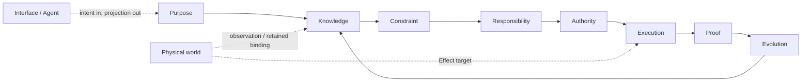
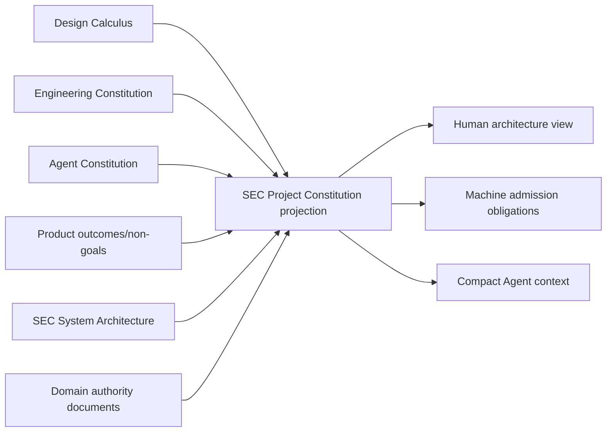
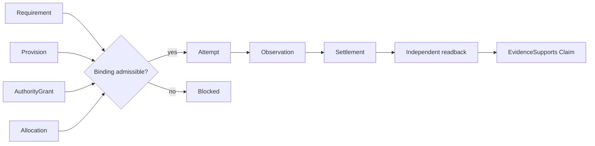
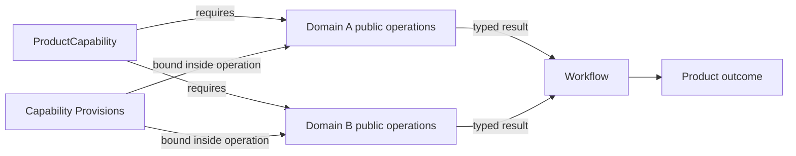
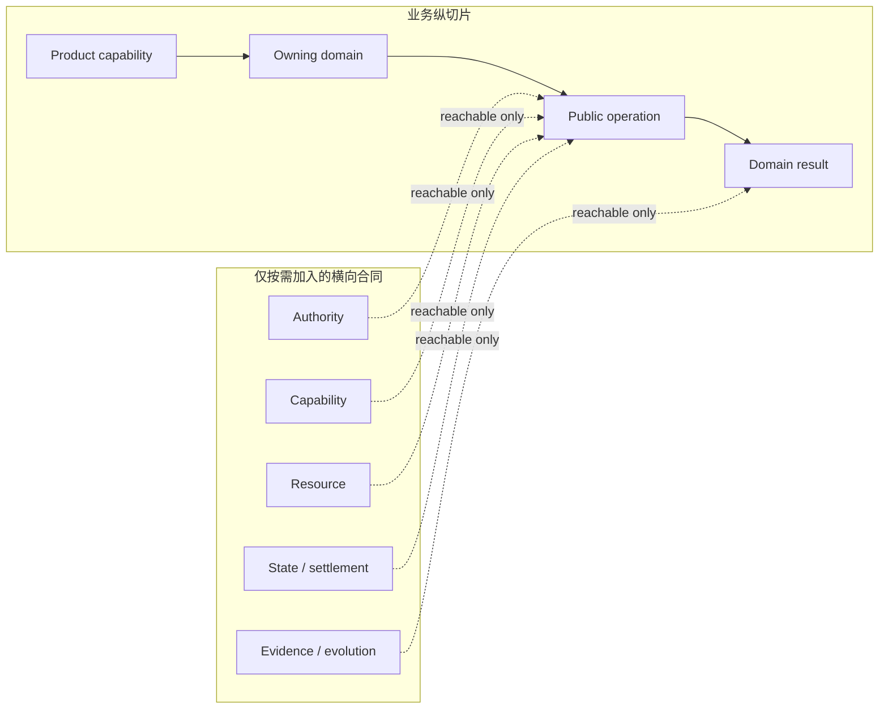
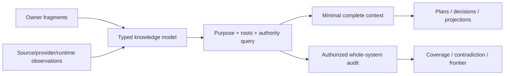
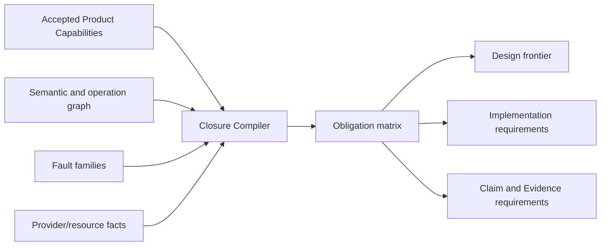

# 系统架构与权威流

本文是 system-architecture 的公共 root，拥有通用演算与工程宪法在 SEC 中的架构核、关系实例化、业务闭包和跨域硬约束。Operation/resource 与 lifecycle/proof/evolution 由本文件列出的规范片段拥有。关系与原则语言由 `docs/design-calculus.md` 拥有，普适工程原则由 `docs/engineering-constitution.md` 拥有，逻辑架构到 declaration/package/file/generated artifact 的实现映射由 `docs/implementation-architecture.md` 拥有，产品结果由 `docs/product.md` 拥有，SEC Agent 流程由 `docs/development-governance.md` 拥有；领域字段与算法由各领域 machine contract 拥有，当前能力只能由最新 `main` 与 Evidence 计算。

## 1. 架构核

SEC 把 accepted purpose、exact world observation 和可替换 capability 编译为可验证、可恢复、可演进的工程状态转换。



| 平面 | 唯一事实 | 签发者 | 不得产生 |
| --- | --- | --- | --- |
| Purpose | outcome、non-goal、不可推导取舍 | authorized Product/Domain decider | implementation、path、Effect |
| Knowledge | Subject、Definition、Observation、coverage、unknown | domain owner + interpreter/provider | permission、success |
| Constraint | invariant、admission predicate、waivability | contract/architecture owner | weighted override of hard failure |
| Responsibility | cell、owner、consumer、Requirement | responsibility compiler + domain owner | physical placement、runtime attempt |
| Authority | principal、Grant、delegation、Binding permission | authority issuer | capability availability、proof |
| Execution | Provision、Allocation、Attempt、Effect、Settlement | capability/resource/domain-operation owners | new Definition、self-verdict |
| Proof | Claim、readback、EvidenceSupports、verdict | domain readback + independent verifier | canonical mutation、authority |
| Evolution | activation、compatibility、migration、cutover、retirement | Change Management + state owner | permanent dual generation |
| Interface | normalized intent、typed projection | interface owner | second truth、resolver、writer |

架构合法性不是某一平面通过，而是全部必要平面的交集：

```text
AdmittedChange =
  PurposeValid
  ∧ KnowledgeCoverageValid
  ∧ ConstraintsSatisfied
  ∧ ResponsibilityUnique
  ∧ AuthorityValid
  ∧ CapabilityBound
  ∧ ResourcesAllocated
  ∧ LifecycleRecoverable
  ∧ ProofObligationsDeclared
  ∧ EvolutionObligationsClosed
```

任何 `unknown` 只阻断它可能影响的 Effect 或 Claim；任何 hard failure 都不能被多数 PASS、信心、测试绿色或人工评分抵消。

### 1.1 Constitution binding

本文件不重写通用原则；它只声明 SEC 如何消费三项上游权威：

| Upstream owner | SEC projection | 本文件拥有的实例化 |
| --- | --- | --- |
| `docs/design-calculus.md` | Subject/Claim/Relation/Constraint/Transition/Proof 与原则多视图合同 | SEC relation refs、compiler stages、typed frontier |
| `docs/engineering-constitution.md` | EP-IDENTITY 至 EP-ECONOMY | SEC DesignAdmission、owner DAG、Effect/resource/recovery/proof/evolution obligations |
| `docs/agent-constitution.md` | Agent 认识与行动原则 | 只由 `docs/development-governance.md` 实例化；本文件不授权 Agent |

通用原则变化先在其唯一 owner 完成语义、反例与反转审查，再重编 SEC profile；SEC 场景不能在此定义同名原则或改变其 rejection semantics。

`SEC Project Constitution` 不是第四份手写文档，而是一个无所有权的生成视图：



投影只能引用各 owner 的 identity/revision/clauses，不能保存原则或领域字段副本；它的失效由任一输入 revision 变化自动传播。

### 1.2 逻辑坐标与实现边界

本文件只实例化 SEC 的逻辑坐标；它们正交而不构成目录或 class 层级：

| 坐标 | 回答 | 例子 |
| --- | --- | --- |
| `domain` | 哪些语义必须由同一owner和不变量共同演进 | Engineering Semantics、Verification |
| `plane` | 从哪个独立责任维度判断同一事实 | Semantic、Authority、Resource、Lifecycle/Proof |
| `stage` | 哪些逻辑输入必须先存在才能产生下一结果 | S0 outcome → S9 publish/retire |
| `lifecycle` | 同一identity随时间处于什么合法状态 | requested→planned→terminal/residue→retired |
| `view` | 哪个角色只需看同一事实的哪一无增权投影 | semantic、authority、resource、proof view |

`DomainOperation` 是领域语义；`sequence` 是Workflow代数组合子；`PurePlan`是immutable逻辑产物。它们的type、file、facade、session、storage、package和composition root属于`docs/implementation-architecture.md`，不能由本文件指定。

## 2. SEC 关系实例化

关系的通用定义只在 `docs/design-calculus.md`。SEC 对象必须投影到这些关系，不得按“代码/资源/进程”建立互斥大类：

| SEC object | Subject / Address | Requirement / Provision | Observation / Settlement / Evidence |
| --- | --- | --- | --- |
| authored source | content Subject + exact tree Address | parser/type/service Requirement + compiler Provision | parsed declarations/references + fact derivation |
| manifest/template | protocol Subject + snapshot Address | strict parser/schema Provision | canonical bytes/invariants/provenance readback |
| process | attempt Subject + OS Address | process Requirement + retained execution Provision + Allocation | start/output/exit/descendants + terminal settlement |
| container daemon | external capability Subject + host Address | container operation Requirement + daemon Provision | live availability/operation/readback；不拥有业务 Definition |
| repository/hosted service | semantic remote Subject + exact revision/ref Address | repository/API Requirement + credential/endpoint Provision | records/remote readback；transport 不拥有成功 |
| cache/fact shard | derived Subject + content Address | exact ActionKey Requirement + cache Provision | validated hit/miss；不拥有 canonical Claim |
| document | accepted Definition 或 generated projection Subject | reader/audience Requirement | registry/projection/read receipt；不得混写 runtime result |
| test | Claim/Evidence scenario Subject + source Address | runner/environment Provision | behavior/effect/failure observation；名称和计数不产生价值 |
| Work Package | bounded operation-definition Subject | scope/role/obligation Requirement | activation/settlement refs；不产生全局原则 |

### 2.1 正交与相互约束

正交表示一种关系不能使另一种关系自动成立；相互约束表示 architecture compiler 对这些关系做合取验证。



Provision 不等于 Grant；Binding 不等于 Observation；exit 不等于 Settlement；Evidence record 不等于 Claim 为真。

### 2.2 Domain、ProductCapability 与 Workflow

`Domain` 是语义一致性边界：一组 Subject、Definition、Invariant、StateMachine、FailureAlgebra 与 public DomainOperation 必须由一个 owner 共同裁决并原子演进。它不是目录、package、团队、技术栈、Provider、部署单元或一个功能名称；这些只能是 Domain 的实现投影、Provision 或 Address。

```text
Domain =
  one semantic owner
  + cohesive Subjects/Definitions/Invariants
  + one internally consistent state/failure/evolution boundary
  + public DomainOperations/results
  + explicit relations to other Domains
```

边界由可观察语义决定，不由代码位置决定：

| 判定 | 结论 |
| --- | --- |
| 两组事实必须在同一 transition 中共同满足一个不可拆 invariant，否则任一中间态都无合法含义 | 属于同一 Domain；对外暴露一个 composite DomainOperation |
| 两组事实可通过稳定 public contract/result 协作，各自 state、failure、lifecycle、policy 或 evolution 能独立变化 | 分为不同 Domain；用 Workflow 或 typed relation 组合 |
| 只是共享 Git、process、filesystem、Docker、compiler 或 credential Provider | 不合并 Domain；共享的是 Capability Provision |
| 只是同一用户功能、目录、package 或团队维护 | 不能证明同一 Domain |
| 所谓 Workflow 必须读取子模块私有 state、改写其 journal 或直接调用其 Provider 才能成立 | 边界错误：要么应合并为一个 DomainOperation，要么缺少 public result/operation |



一个 ProductCapability 可以落在一个或多个 Domain；一个 Domain 也可以服务多个 ProductCapability。Workflow 是 public DomainOperation 的组合，因此既可以是单 Domain 内多个独立 operation 的编排，也可以跨 Domain；“跨领域”不是 Workflow 的定义。若若干步骤必须共享一个不可分状态机或原子 invariant，它们不是跨域 Workflow，而是一个 composite DomainOperation 的内部 Requirement DAG。

#### 2.2.1 业务分层、关系总图与最小可见切片

业务不是一个扁平总图，也不是所有 Domain 依次穿过同一组层。SEC 同时保留两个正交结构：业务能力沿 `ProductCapability → Domain → public DomainOperation → result` 纵向闭合；Authority、Capability、Resource、Observation、Settlement、Evidence 与 Evolution 等机制只在某个 operation 的真实关系可达时横向加入。



所谓“同一 semantic graph”是编译时的 typed relation universe：各 owner 分别发布自己的 immutable definition fragment，Design Compiler 在 exact revisions 上建立虚拟联合并验证跨 fragment 的 refs。它不是一个所有模块导入的对象、共享 mutable database、运行时 service locator 或要求每个调用理解全部节点的 API。



`SECSystemModelSnapshot`是content-addressed生成投影：它引用所有适用层的canonical owner facts、typed relations、Source Program/Provider observations、runtime settlements、Evidence与Evolution状态，并保留`layer + plane + domain + owner + revision`坐标。它不是新的owner、运行时数据库或固定可视化形状；tree、nested compound、DAG、hypergraph、state machine与table都是按问题生成的renderer。

一个Domain owner拥有自己的Subjects、Definitions、Invariants、State/Failure与public operation contracts；private implementation仍不可见。Workflow只引用public operation identity、guards、join与compensation，不复制被调用Domain payload。AI或编译器用purpose-bound query取得最小完整闭包；全系统审计以相同canonical refs取得最大授权coverage。两者的差异是selection与表达，不是两套图。

```text
ApplicableClosure(root, purpose, revisions) =
  leastFixedPoint(
    root,
    public typed relations allowed for purpose,
    accepted constraints and fault obligations
  )

VisibleSlice(consumer, operation, purpose) =
  render(ApplicableClosure(...), representationChosenForPurpose)
  intersect AuthorizedDisclosure(consumer, purpose)
  - foreign private state
  - foreign provider internals
  - unrelated concerns and not-applicable dimensions
```

| Consumer / path | 合法可见内容 | 必须不可见 |
| --- | --- | --- |
| Domain 内 pure algorithm | 本 Domain immutable inputs、invariants、pure helpers | Grant、Provider、journal、filesystem、全局 graph |
| 已有 immutable input 的 public query | exact public query input/result contract | 新 observation、Effect、资源 session |
| 需要 observation/Effect 的 DomainOperation | 自身语义 + 该 operation 可达的 Authority/Capability/Resource/State/Settlement refs | 其他 operation 私有状态、全 Provider catalog |
| Workflow | public operation identity、input/result mapping、join/compensation | child private state、primitive、journal、Provider |
| Verifier | exact Claims、required observations/Evidence、independence/freshness rules | producer Effect authority、业务私有实现 |
| Interface | public intent/query/result projection | graph、state store、Provider、policy重算 |

完整 `BusinessCapabilityClosure` 是设计编译时的覆盖证明，不是每个实现单元的参数列表。不可达项必须由 `not-applicable(reason)` 证明后从 slice 消失；没有因果影响的节点不得为了“统一”进入 import、runtime plan、ActionKey 或测试集合。新增关系只使反向依赖它的 slice stale，不能使所有业务重编。

高频 slice 由 compiler content-addressed materialize 并直接静态连接；运行时不重新遍历知识模型、动态发现服务或逐关系 join。切换renderer或细节层级只改变表达，共同事实的identity、meaning、blocker与unknown必须相同。若多个关系总是同 owner、同 invariant、同 transition、同 lifecycle且无独立consumer，它们可在局部形成compound value/composite operation并在实现上保持同一高内聚单元；若存在多归属或独立查询，则保留typed refs而不是强塞进containment。

### 2.3 Business Capability Closure

每个 accepted ProductCapability 必须编译为完整业务闭包，不能只定义 happy-path 功能或等实现暴露缺口后再补控制：

```text
BusinessCapabilityClosure =
  outcome/non-goal
  + Subjects/Definitions/Invariants
  + Responsibility/owner/public demand
  + inputs/outputs/data/configuration/secrets/privacy
  + StateMachine/FailureAlgebra
  + Policies/Decisions
  + Authority/permissions/delegation
  + DomainOperations/Workflow
  + Requirements/CapabilityPorts/Bindings
  + Resource/Concurrency/Time/Consistency/Isolation
  + Effects/Settlement/Readback/Recovery
  + external/provider/security/supply-chain/compliance
  + Claims/Evidence/Verification
  + audit/provenance/retention
  + performance/economy
  + compatibility/migration/retirement
  + distribution/deployment/availability/operations/support
  + Interface/accessibility/localization
  + unknown/reversal
```

Architecture Coverage Compiler 不是只遍历 concern 清单，而是生成并按可达性裁剪需求张量：

```text
ArchitectureCoverageTensor = applicable(
  ProductCapability
  × Actor/Principal/Responsibility
  × Subject/Data/State
  × LifecyclePhase
  × DomainOperation/Workflow/Effect
  × Trust/Authority/ExternalBoundary
  × Capability/Provider/ResourceDimension
  × Environment/Platform/Scale/Topology
  × ConcernFamily
  × FaultFamily
  × EvolutionState
  × Interface/Claim/Consumer
)
```

不是实际建立无穷笛卡尔积：relation reachability、Definition、not-applicable proof和closed discriminants先删除不可达组合；dynamic/opaque/external项进入explicit frontier。维度新增或某个值的可达性变化会使依赖原coverage digest的`LogicalDesignPackage` stale。

Compiler 对每个 applicable cell 生成 obligation matrix：

| Cell status | 含义 |
| --- | --- |
| `satisfied` | 有唯一 owner 和可验证合同 |
| `not-applicable(reason)` | 由 relation graph 证明该 concern 不可达；不能留空 |
| `required-unmaterialized` | 逻辑要求已接受，实现尚不存在 |
| `bounded-unknown(frontier)` | 缺观察/决策，只阻断受影响路径 |
| `violated(code)` | 违反 hard constraint，拒绝 promotion/Effect |

矩阵不是人工逐格维护。owner Definitions、semantic observations、operation/state/effect graph、Capability/Resource requirements和fault families是输入；reachability、dependency closure、constraint applicability、proof obligations与`not-applicable`由编译器生成。新增capability、state、Effect或external contract自动扩展相关行列并使原`LogicalDesignPackage` stale；具体Source Program、Provider、schema与tests属于实现编译输入。



Coverage 只对声明的 exact universe 完备；开放世界通过 explicit unknown 扩展，不以“当前没搜到”证明不存在。上面的 concern family 不是不可扩展的枚举：新增一种能改变 admission、state、Effect、settlement、Evidence、成本或用户结果的独立 concern 时，先由其 canonical owner 定义关系与故障语义，再作为 Coverage Compiler 的新输入；不得把它塞进 `misc`、自由文本或既有 family 的可选字段。

### 2.4 可推导边界

通用构件不会凭空生成业务。所有信息分为四类，且只能沿显式 transition 变化：

| 类别 | 必须从哪里来 | 可由机器做什么 | 禁止 |
| --- | --- | --- | --- |
| accepted authored truth | authorized Product/Domain decision、Definition、Invariant、Policy | validate、normalize、引用、传播、比较 | 从当前代码或测试猜业务终局 |
| observed truth | exact repository/runtime/external provider observation | parse、classify、build fact graph、收窄 unknown | observation 自升为 Definition/Authority |
| derived truth | 上述 exact inputs + canonical algorithm | owner/impact/requirements/placement/test/resource/proof/evolution 编译 | 漏输入、用名称/路径/时间猜测 |
| runtime decision/authority | live issuer、current facts、policy、scope | bind/admit/allocate/schedule/settle | stable doc、cache、AI 或 Provider 自签 |

```text
MachineDerivable = deterministic(inputs, algorithm, coverage, unknown)
IrreducibleInput = authorized preference/definition/grant OR external observation
```

一旦 Product/Domain 给出足够精确的 outcome、invariant、state、failure 和 tradeoff，owner、Requirement、合法 Provider、资源、流程义务、Effect 边界、tests、Evidence、迁移与大部分实现结构都应机器推导。若输入不足，只能输出 exact decision/observation frontier；不得由 AI 补齐偏好，也不得把“实现能跑”反推成业务定义。

细节控制不是逐条手写到流程中，而是从关系图编译：

| 权威输入 | 必然派生的控制义务 | 控制落点 |
| --- | --- | --- |
| Definition + Invariant | 合法/非法状态、failure partition、public operation | Domain owner 的纯合同与 validator |
| Operation + Effect semantics | precondition、linearization、readback、idempotency/recovery obligations | Domain operation owner |
| Requirement + Authority | eligible Provision class、narrow Grant、Binding freshness obligations | capability/authority owners |
| Resource demand + concurrency relation | conservation、ordering、deadline、fairness、release/leak semantics | resource policy owner |
| StateMachine + lifecycle | legal transitions、terminal/residue、recovery、retirement | state/lifecycle owner |
| Workflow dependency + result mapping | readiness、join、choice、compensation、bounded fixpoint semantics | workflow owner |
| Claim + independence rule | required observations、negative cases、staleness、Evidence independence | verification owner |
| External contract + security/privacy rule | endpoint/principal/credential/environment/supply-chain requirements | external capability owner |
| State evolution | activation、migration、readback、consumer-zero、retirement semantics | evolution owner |
| Outcome + cost vector + FutureObligation | alternatives、dominance、reuse/complexity existence obligations | design owner |

若某项 runtime 控制无法回溯到这张表中的 authority input 和 typed relation，它不是“实现细节”，而是隐藏的 Definition、Policy、Authority、Resource 或 Workflow，应上收唯一 owner 后重新编译。

## 3. 硬约束系统

| 约束族 | 必须证明 | 确定性拒绝 |
| --- | --- | --- |
| Shape | owner contract与domain invariant完整可判定 | invalid/unknown structure |
| Reference | refs、revisions、predecessors、receipts 属于同一 universe | dangling/foreign/stale ref |
| Identity | semantic identity 与 Address/attempt/version 分离 | path/PID/latest/label 冒充 identity |
| Uniqueness | identity、writer、parser、resolver、issuer、terminal、readback owner 唯一 | facade/alias/registry 成第二 truth |
| Authority | requested Effect ⊆ Grant ∩ operation scope；delegation 只收窄 | caller/test/projection 扩权 |
| Capability | Provision 的contract/platform/security/principal/environment语义满足Requirement | ambient/substituted Provision |
| Resource | Σ child demand/consumption ≤ parent envelope；所有终态结算资源 | 子流程扩容、未知消费 |
| Freshness | input/grant/binding/observation/readback/claim 的 epoch 相容且 active | replay、same-path ABA、stale PASS |
| Concurrency | 冲突transition有线性化点；可并行关系满足可交换性与资源约束 | double transition、lost update、deadlock |
| Effect | planned Effect语义与settlement observations完整对应，且domain readback独立 | attempt observation=success、漏settlement |
| Recovery | lost observation/partial Effect可join/readback/rollback/authorized retry | blind replay、丢弃residue |
| Proof | Evidence issuer 与 producer 分离，且只支持预声明 Claim | self-proof、projection=observation |
| Coverage | exact universe、dynamic/opaque/unknown frontier 完整 | catch-all false、unknown=absent |
| Evolution | activation、migration、cutover、consumer-zero、single active generation | permanent dual read/write、Vn alias |
| Privacy | sensitive facts、secret、credential、diagnostic有最小可见范围与retention | 隐式泄露、无界传播 |
| Economy | 新对象有独立 Responsibility 或降低全生命周期成本 | wrapper、mirror、第二 graph/cache |

约束输出只有 `admissible | rejected | bounded-unknown` 和结构化 frontier；它不签发 Definition、Grant、Binding、Result 或 completion。


## 规范片段

本文件保留 SEC 架构核、关系实例化、业务闭包与硬约束；operation、资源、状态、证明和演进由下列独立规范片段拥有。

| 片段 | 独立职责 |
| --- | --- |
| [SEC Operation、Owner 与资源架构](system-architecture/operations-and-resources.md) | 本片段拥有 operation 视图、S0–S9 编译、Knowledge、Owner DAG、capability、资源和并发。 |
| [SEC 生命周期、证明与演进架构](system-architecture/lifecycle-proof-and-evolution.md) | 本片段拥有状态恢复、identity/provenance/Evidence、reduction/evolution、逻辑投影、模型验证与实现交接。 |
