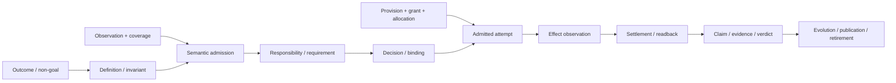
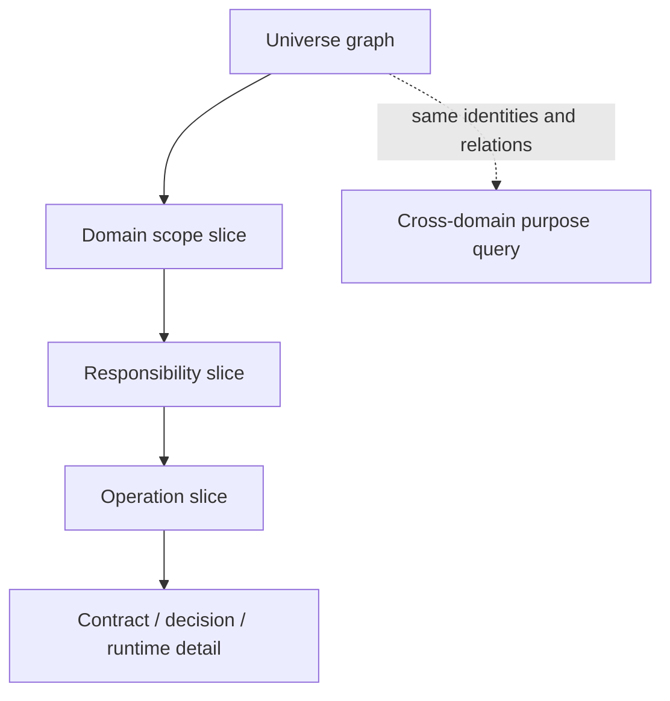
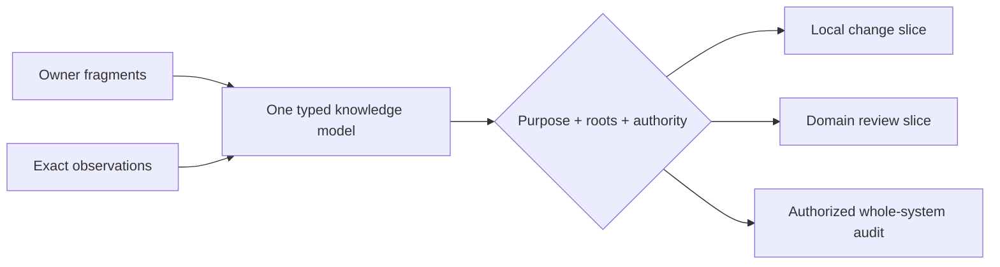

# 系统架构与权威流

本文是 SEC 逻辑架构入口，只拥有跨 domain layering 与 public reference laws。通用关系代数由 [Design Calculus](design-calculus.md) 拥有；递归 scope 与 Domain 边界由 [Scope and Domain Topology](system-architecture/scope-and-domain-topology.md) 拥有；Operation、Authority、Capability 与资源由 [Operations and Resources](system-architecture/operations-and-resources.md) 拥有；State、Evidence、reduction 与 evolution 由 [Lifecycle, Proof and Evolution](system-architecture/lifecycle-proof-and-evolution.md) 拥有。实现映射只在 [Implementation Architecture](implementation-architecture.md)。

## 1. 架构核

SEC 的逻辑因果链只有一条；各产品能力只消费其中可达的子图：



每条箭头是有 issuer、revision、constraint、coverage、failure 和 invalidation 的 typed relation。相邻命名、同一对象、同一文件、同一进程或同一测试不能替代关系。

### 1.1 因果所有权

| 事实 | 唯一裁决者 | 下游只能做什么 | 禁止捷径 |
| --- | --- | --- | --- |
| 用户结果与不可推导取舍 | Product decision owner | 解析为 capability/constraint | 从代码、Issue、测试数量反推目标 |
| Subject meaning / invariant | Domain semantic owner | 引用 exact Definition | path/type/DB schema 自报语义 |
| 合法状态与变化 | owning StateMachine / DomainOperation | 检查 pre/post 与 result | `if` 顺序、异常或 exit code 充当合同 |
| 需要与可供应能力 | Requirement / Provision owners | 计算 eligibility | ambient lookup、first-found fallback |
| 权限与本次采用 | Grant / Binding owners | 签发 exact admitted relation | Provider 可用即有权、caller DTO 自授权 |
| 实际资源与 Effect | Allocation / runtime settlement owners | 执行、计量、结算 | 静态 timeout、PID、返回值冒充终态 |
| 可发布 Claim | Claim/Evidence owner | 判 freshness、coverage、independence | producer 自证、绿色测试、formatter |
| 新代际采用 | Evolution owner | migrate/cutover/retire | `V1/V2` 名称、永久双读写 |

Authority proof 必须是有限 DAG，并终止于 active responsibility/authority generation 与有权 Product/Domain decision；不能终止于 subject 自身、candidate、path、projection、self-digest 或循环背书。

### 1.2 关系合取，而非字段捆绑

Identity、containment、lifecycle、disclosure、Authority、Address、Allocation、Observation 与 Evidence 正交；effective fact 由各 relation owner 在同一 Subject/revision 上 join：

```text
EffectiveRelation = admit(
  candidate relation,
  active RelationAuthorityAssignment,
  issuer authority,
  exact subject revision,
  applicable constraints,
  current generation
)
```

同 owner、同 invariant、同 revision/lifecycle且无独立 consumer 的关系可以共同 author 为 typed aggregate；任一 owner、权限、失效、consumer 或 transition 独立时必须用 refs。Envelope 可以缓存 join，不取得被 join payload 的 ownership。

## 2. 系统结构不是目录分类

SEC 同时使用：

1. 递归 cohesion scope，表示 Universe → Domain → Responsibility → Operation → independently-addressed Contract；
2. typed relation graph，表示 ProductCapability、Workflow、Requirement/Provision、Grant、Binding、Allocation、Evidence、Evolution、Projection 与 realization；
3. StateMachine/partial order，表示时间、并发、线性化、恢复与代际切换。

三者共享 identity，但不可互换。完整判据见 [Scope and Domain Topology](system-architecture/scope-and-domain-topology.md)。当前文档 `domain:` 标签、authority group、目录、package、团队、Provider 或阶段都只是观察输入，不能直接成为 Domain。

```text
Domain != ProductCapability != Workflow != Facet
       != Responsibility != Package != Process != Document
```

这条区分同时防止两种极端：把每个横切机制拆成 Domain，和把所有职责压进一个巨型系统对象。

### 2.1 一个全图，按目的递归切片

系统只有一个带递归scope的typed relation graph；“总图”“领域图”“operation图”“某个变量的来龙去脉”只是同一generation的不同查询结果，不是分别维护的模型：

```text
ArchitectureSlice(scopeRef, purposeRef, generationRef) = leastFixedPoint(
  scopeRef所需的containment ancestors与适用children
  + purpose允许穿越的public typed relations
  + 所有会改变结果的constraints/decisions/frontiers
  + 完成该purpose必需的observation/settlement/evidence/evolution refs
)
```



切片只能折叠不相关细节，不能删除会改变答案的边、blocker或unknown。最小pure function通常只显示Definition、behavior、constraints与claims；本地Effect再加入Requirement/Grant/Binding/Allocation/Settlement；分布式恢复流程才加入journal、lease、partial order与recovery。最大审计递归展开同一图，因此局部不会承受全系统概念成本，最大视图也不会另建第二事实源。

全局共享词汇只允许Design Calculus primitive与其已准入semantic profiles；Domain专有名只在所属scope可见，record字段只在其contract可见，runtime instance只在operation epoch可见，projection名只在consumer purpose可见。一个新名若不能指出`primary role + scope + owner + distinct laws/lifecycle + consumer/accepted obligation`，就不是概念，只能是普通value、算法步骤或应删除的别名。

```text
ArchitectureSurfaceClear(slice) =
  every visible name has one admitted role and one definition owner
  and every visible edge is required by the purpose closure
  and every collapsed subtree preserves identity/completion/frontier handles
  and no local consumer must understand an unrelated Domain or runtime facet
```

词汇按可见范围分层，而不是全部暴露为“系统概念”：

| vocabulary scope | 内容 | 可见边界 | 不能升级成什么 |
| --- | --- | --- | --- |
| universal grammar | 五个Design Calculus primitives | 所有产品共用 | service、folder、runtime object |
| shared semantic profiles | Definition、Responsibility、Operation、Contract、Workflow及通用relation specializations | 仅在对应laws适用时 | 新primitive、默认Domain |
| SEC product vocabulary | 六个accepted product Domains及其Subjects/public operations | SEC product generation | 通用kernel常量 |
| design/implementation carriers | artifacts、realizations、ImplementationUnits、ImplementationBindings | exact Target/Profile generation | semantic owner、live ExecutionBinding、runtime truth |
| runtime records | grants、allocations、attempts、observations、settlements | exact operation epoch | stable Definition、跨epoch identity |
| purpose views | human/AI/CLI/docs/query projections | exact consumer purpose/disclosure | source、Authority、第二状态源 |

因此全仓可以拥有很多局部合同字段，却不能拥有很多全局本体。复杂业务通过递归scope和typed relation增加局部内容；新增全局primitive必须证明现有代数无法无损表达，新增profile必须通过named-construct admission，新增Domain必须通过boundary proof。其余复杂度应被compiler折叠、派生或删除。

## 3. SEC 对象如何进入通用关系

对象按其在关系中的角色建模，不按“代码/资源/进程”分互斥大类：

| observed object | semantic role | physical/operational role | 不能拥有 |
| --- | --- | --- | --- |
| authored source | content Subject；Definition 的候选 carrier | exact snapshot Address；parser input | 仅凭文本成为 accepted meaning |
| manifest/schema/template | protocol/content Subject | strict parser + canonical byte readback | self-declared authority/version truth |
| process/container | Attempt/resource instance | Provision、Allocation、Effect、Settlement | Domain success、Grant、Claim verdict |
| Git/hosted service | external Subject/Provision | exact revision/endpoint/credential observation | repository/product truth |
| cache/fact shard | reusable derived or observed item | content address + invalidation | 扩大 coverage、Authority 或 Claim |
| document/interface | canonical fact或projection的 carrier | purpose/disclosure-bound rendering | 反写源事实、签发 Effect |
| test | Claim scenario + observation method | runner/environment/effect sentinel | 以名称、版本或数量产生业务价值 |
| Work Package/plan | bounded definition or pure projection | scope/obligation refs | 全局原则、runtime state、execution success |

未知对象保留其 exact observation 与 frontier；不能因没有解释器就当 absent，也不能因未来可能用就提升为 stable abstraction。

## 4. Business Capability Closure

每个 accepted ProductCapability 必须从同一关系模型编译完整闭包，而不是在实现暴露缺口后逐项补规则：

```text
BusinessCapabilityClosure =
  outcome + non-goal + actors + journeys
  + Subjects + Definitions + Invariants + Decisions
  + responsibilities + public operations + state/failure
  + inputs/outputs/data/privacy/security/compliance
  + authority/delegation + requirements/provisions/bindings
  + resource/time/concurrency/consistency/isolation
  + effects/settlement/readback/recovery
  + claims/evidence/audit/provenance
  + latency/throughput/capacity/economy/operability
  + external/provider/supply-chain/portability/interoperability
  + usability/accessibility/localization/support
  + compatibility/migration/retirement/future obligations
  + alternatives/rationale/reversal/unknown
```

这不是每个 operation 都携带的巨大 DTO。Compiler 先由 reachability 和 Definition 删除不可达 concern；每个删除必须有 `not-applicable(reason, proofRefs)`。可达但未闭合的项成为 `required-unmaterialized` 或 `bounded-unknown`，不允许空值或默认值。

### 4.1 目标与现状分开闭合

```text
TargetDesignUniverse = leastFixedPoint(
  accepted ProductCapabilities/non-goals
  + Domain Definitions/Invariants/Operations
  + public/external contracts
  + accepted Policies/FutureObligations,
  typed semantic/requirement/claim/fault/evolution relations
)

CurrentObservationUniverse = leastFixedPoint(
  exact admitted workspace/repository/external observation roots
  + production entrypoints/declarations/imports
  + packages/config/schemas/templates/assets
  + tests/workflows/build/release/support
  + durable state/writers/readers/migrations
  + process/container/network/filesystem/credential/provider Effects,
  typed observed/consumer/effect/provenance relations
  + exact coverage and bounded opaque/unknown frontier
)

ReconciliationUniverse = leastFixedPoint(
  TargetDesignUniverse + CurrentObservationUniverse,
  typed candidate/refinement/preservation/drift/surplus/unknown relations
)
```

Target compiler不得读取CurrentObservationUniverse来决定目标；Observation compiler不得读取TargetDesignUniverse来决定观察范围、业务价值或采用。只有Reconciliation compiler同时读取两个immutable generations，且不能回写任一输入。`ReconciliationUniverse`是可重建的join artifact，不是第三事实源或折中目标。三者均有独立coverage/frontier；目标设计不依赖当前实现完整，现状审计也不允许因目标不可达而遗漏现有carrier。Reconciliation join 后只有四种结论：

| target | observed | result |
| --- | --- | --- |
| yes | yes | 已有adopted origin binding才可判preserve/drift；否则只产candidate correspondence/frontier |
| yes | no | `required-unmaterialized` 或 accepted future obligation |
| no | yes | unexplained surplus / retirement candidate |
| unknown edge | any | bounded frontier；不得猜 absent、required 或 orphan |

## 5. Purpose-bound 最小闭包

最小开发操作和全仓反编译使用同一 canonical generation：

```text
ApplicableClosure(root, purpose, generation) = leastFixedPoint(
  root,
  public typed relations admitted for purpose,
  accepted constraints and reachable obligations
)

VisibleSlice = ApplicableClosure
  intersect authorized disclosure
  minus foreign private state
  minus proven-not-applicable relations
```



Presentation budget只改变展开方式；必须保留相同 identity、meaning、blocker、unknown 与 closure digest。若预算不足以表达必需意义，返回 unresolved，不生成“较小但仍 complete”的另一真相。

## 6. Coverage 与对抗

架构覆盖是按关系可达性裁剪的张量，不是人工 checklist 或无穷笛卡尔积：

```text
CoverageTensor = applicable(
  ProductCapability
  × Actor/Principal/Responsibility
  × Subject/Data/State
  × Lifecycle/Operation/Workflow/Effect
  × Trust/Authority/ExternalBoundary
  × Capability/Resource/Environment/Scale/Topology
  × ConcernFamily/FaultFamily/EvolutionState
  × Interface/Claim/Consumer
)
```

每个 applicable coverage coordinate 的结果只能是：

| status | meaning |
| --- | --- |
| `satisfied` | 唯一 owner + exact contract + required proof存在 |
| `not-applicable` | relation graph证明不可达并给出理由 |
| `required-unmaterialized` | 目标义务已接受，实现尚不存在 |
| `bounded-unknown` | observation/decision frontier未闭合，只阻断相交路径 |
| `violated` | hard constraint失败，拒绝 promotion/Effect |

Fault family 至少覆盖 identity/alias、owner/authority、schema/parser、state/lifecycle、concurrency/time、resource exhaustion/leak、partial Effect/lost handle、external/provider drift、tenant/security/privacy、projection/consumer drift、compatibility/migration/retirement、performance/scale、unknown/opaque 与 model counterexample。新反例优先扩展已有 family/predicate；只有出现独立维度才扩展代数。

## 7. 架构到实现的唯一交接

```text
Definition / Requirement --exposes--> public Contract / Port refs
ResponsibilityScope + Target --refines--> ResponsibilityRealization --carried-by--> ImplementationUnit
Requirement + eligible Provision --resolves--> Binding
State / Transition obligations --materialize-as--> pure plan + admitted execution/journal/readback obligations
Semantic result --renders--> CLI / API / IDE / Documentation view
```

实现只能选择满足逻辑合同的 realization，不能重算 Product/Domain meaning。Provider保持Provision identity，store通过state realization/binding接入，process保持runtime Attempt identity；它们都不能被ImplementationUnit或文件包含关系吞并。每个公共分支、持久字段、外部调用、资源计量与测试 Claim 都必须反向指向一个logical semantic origin；无 `semanticOriginRef/refinementRef` 的行为是 hidden authority 或 orphan。

反向地，logical carrier 尚未实现只标记 `required-unmaterialized`，不能因当前代码无 consumer而删除。具体ImplementationUnit/package/source placement、facade/index、generation和迁移由Implementation Architecture决定。

## 8. 硬约束与完成

```text
ArchitectureClosed =
  TargetDesignUniverse is exact for the accepted product generation
  and every accepted fact has one semantic owner
  and every carrier belongs to one recursive cohesion scope
  and every Domain has a current boundary proof
  and every cross-scope relation is typed and issuer-admitted
  and every operation closes state/failure/authority/capability/resource/effect/settlement
  and every positive Claim reaches independent Evidence
  and every omitted concern is proven not-applicable or bounded unknown
  and every realization traces back to an admitted carrier
  and every future obligation has owner/trigger/acceptance/review/retirement
  and no path/name/version/facade/index/provider/projection creates meaning
```

`ArchitectureClosed` 只证明设计 generation；不证明当前实现符合、迁移已发生、测试已运行或产品已发布。后续阶段必须分别产生 Implementation、Conformance、Evolution 和 Runtime Evidence，而且不能反向修改本层事实。

<!-- sec-clause {"blocker":null,"kind":"stable-decision"} -->
## 规范片段

SEC 使用一个递归 scoped typed relation model：Domain 只由不可拆 invariant/state/public-operation boundary proof建立；ProductCapability、Workflow、Authority、Resource、Provider、Evidence、Projection、Control、path、package和process均不得因分组或命名冒充 Domain。最小操作与全量审计必须从同一 generation 编译 purpose-bound closure，未知保持 typed frontier，逻辑与实现只能通过显式 refinement 连接。
