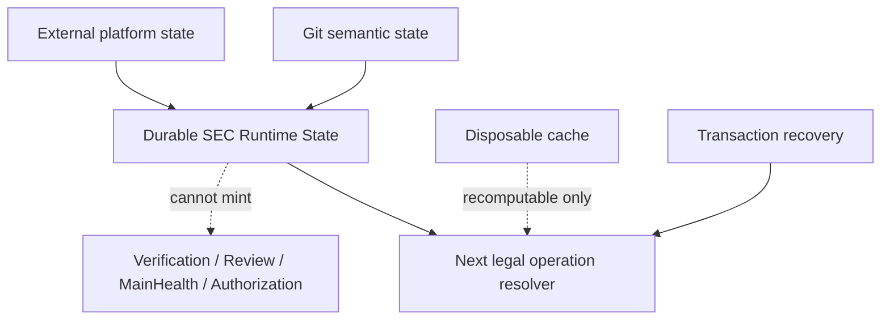

# 系统架构与权威流

本文只拥有 SEC 的总体对象分层、两条产品主链、canonical/projection 边界、状态类别、跨域引用、单写者和依赖方向。产品目标由 `docs/product.md` 拥有，阶段依赖由 `docs/roadmap.md` 拥有；领域内部字段、当前实现能力和具体文件集合分别由领域代码合同、最新 `main` 和机器 registry 拥有。

## 总体闭环

SEC 是 Engineering Workspace Compiler。它不是一条“从 YAML 生成文件”的单向流水，也不是一套自由式 Agent 脚本，而是围绕同一工程语义核心形成两个方向的闭环。

### 既有工程治理链

```text
Existing Workspace
→ Physical Workspace Observation
→ Source Program Model
→ Engineering Semantic Model
→ Responsibility / Delta / Impact
→ Operation / Authorization / Plan
→ Transactional Mutation
→ Verification / Evidence
→ Publish / Recovery / Readback
```

### 确定性工程生成链

```text
Product Intent / Contract / reusable capability
→ Engineering Semantic Model
→ Application IR
→ Behavior IR
→ Implementation Resolution
→ frozen Implementation Binding
→ Target Program IR
→ Backend
→ Source / Test / Config / Artifact
→ Verification / Evidence
```

两条链共享 Engineering identity、Responsibility、State、Operation、Policy、Permission、Effect、Scenario、Acceptance、Provenance 和 Verification truth。Brownfield 不能建立一套“源码图语义”，Generator 也不能建立另一套“模板语义”，Implementation Resolver、Block Resolver、Provider Registry和Agent/CLI interface也不能各自建立实现选择真值。

### 产品回路

```text
canonical state
→ query / machine projection / Context Packet
→ user or AI proposal
→ platform-owned Operation ingress
→ plan without live writes
→ apply under transaction and CAS
→ canonical rebuild / implementation re-resolution
→ actual Semantic / Binding Delta and Impact
→ Compatibility / Verification / Migration decision where applicable
→ accepted | rejected | rolled-back | recovery-required
→ projections reload from accepted canonical revision
```

UI、CLI、HTTP、AI Adapter 和 Provider 都只能通过同一个产品 adapter 消费该回路，不能各自维护写路径、实现选择、兼容性或成功状态。

### 双向架构审计与演化闭环

系统原则、任务原则、行动原则、当前实现和未来设计不是平行清单。总体架构只拥有它们共享的双向关系；
Task/Action Principle的适用、冲突、自纠和执行闭包由`docs/development-governance.md`拥有。各唯一owner必须把它们
编译成可双向追踪的同一图：

```text
canonical system / task / action principle / responsibility / policy
→ machine rule and rejecting compiler
→ complete target closure
→ observation / counterexample / Evidence / unknown

finding / counterexample / unknown
→ violated or missing rule
→ unique semantic owner and root cause
→ principle or design delta
→ implementation / migration / old-owner retirement
→ affected Verification and new-main readback
```

正向闭包覆盖全部受原则约束的source、test、fixture、document、config、workflow、Provider、credential、state、
cache、Effect、process、resource、performance、recovery和release对象；不能只检查当前故障文件，也不能把“未来设计”
留成没有consumer、拒绝规则和迁移终态的prose。反向闭包要求每个新反例不仅修局部实现，还要判断：现有原则是否缺失、
含糊、不可执行或彼此冲突，机器owner是否漏掉target/edge，未来设计是否会重建同类第二owner。命中已有identity时更新
唯一owner；只有证明没有现存identity才创建新contract，且必须同时给出旧owner的consumer-zero与retirement条件。

审计完整性不由文件数、命中数、测试注册数或Agent结论证明。machine Evidence必须记录principle identity、rule identity、
target universe、coverage、unresolved frontier和反向design delta；任一target类别没有producer、任一finding没有root owner、
任一design delta没有migration/retirement/verification闭包时，只能返回typed partial或unknown。后来出现的反例若揭示旧审计
漏掉了一个维度，旧complete claim立即失效，先修审计编译器和canonical原则图，再重算所有受影响结论。

### 最小因果图与图内消减

SEC 的目标不是让每层各自“有测试、有文档、有owner”，而是让整个仓库成为证明过的最小因果图。全部tracked
file、module、export、field、test、fixture、document、Skill、Work Package projection、Provider、state、cache、Effect、
Evidence和Task/Action都必须成为同一图中的节点。节点的producer/owner、semantic responsibility、canonical fact、
consumer、Effect/failure boundary、resource cost、invalidation与retirement只能从exact physical universe、唯一module/import/
consumer graph、canonical registry和真实Effect/Evidence机器派生；禁止调用者手写一份“完整 justification”来自证存在价值。

消减不得产生新组件、类型、registry、数据库、Evidence owner或持久状态。现有repository graph的每次design、review和
migration admission直接使用同一份已观察事实裁决对象，不得再次发现文件、解析import、维护path清单或接受caller声称的
tracked universe；裁决只约束当前事务并随事务终结，不形成新的账本或业务authority。每个对象只能得到一个裁决：

```text
required         独立责任或真实consumer要求存在
derivable        能从更上游canonical fact确定性生成，不得手写持久化
duplicate-owner  与另一producer竞争同一semantic identity
dominated        其proof/行为/failure space被更强且成本不高于它的对象完整包含
orphan           没有真实consumer、Effect、迁移或retirement义务
unknown          coverage或authority不足，禁止假KEEP也禁止破坏性删除
```

`derivable`改为projection，`duplicate-owner`保留唯一owner并删除其余writer/parser/registry，`dominated`合并或删除，
`orphan`删除；只有`required`保留，`unknown`形成bounded frontier。新增对象如果不对应新的真实Responsibility，必须证明
它让总代码、状态、测试、验证成本或故障空间净减少；“更安全”“便于测试”“未来可能使用”或局部green不能授权净膨胀。

`dominated | superseded` 的证明必须同时覆盖 `current semantics` 与 `owner-issued design intent`。对于将被删除或替换的
public operation，后者只能由该module的严格描述符签发，并绑定已经声明的capability operation或external entrypoint identity；
一个operation obligation同时拥有consumer support、Effect/failure、recovery、migration、retirement、aggregate resource budget
和future-support condition。普通未参与演进的内部module不需要填写占位义务。Source Program只能用同一exact graph验证这些意图，
不能根据名称、注释、历史实现、测试或新观察扩大它们；任一维度缺失、观察unknown或资源上限变宽都必须保持
`operation-obligation-unresolved | owner-decision-required`。闭合后只保留满足该envelope的最小新原语，旧API、path、schema、
test和compatibility surface同批退役。
一个版本/revision/digest/path/status字段没有独立consumer时，字段和围绕它的测试一起删除；一个测试只重演类型、strict
parser、module compiler、常量或更强Effect/readback proof时删除；一个wrapper没有新增protocol、credential、Effect、
security、compatibility或performance boundary时删除；一个Skill/WP复制machine rule或canonical principle时降为locator或删除。

架构Review只审这个compiled graph、unknown frontier与migration/retirement DAG，不再靠多轮逐文件意见发现同类问题。
Full test/audit发现新反例时修图内消减关系或semantic owner，随后重算受影响对象；禁止在原图外追加一个永久例外。
任何试图把该步骤独立成组件的实现也必须进入同一图：没有closed-universe producer、真实retention/删除consumer或旧机制
retirement时，它就是`orphan`并应删除；只有实际替代至少一个旧parser/registry/manual census并使总代码、状态、测试和验证
成本净下降时才允许保留。
任何迁移期不得让新旧两套裁决并行签发authority，旧owner必须在同一个DAG中达到consumer-zero并退役。

这套分类不是一份会漏项的静态检查表。每次裁决都必须从终局结果反向追到最小必要因果链，再正向覆盖该链上的
identity/owner、producer/consumer、状态与Effect、failure/recovery、安全与权限、并发、资源与性能、外部能力、版本与
迁移、Verification和retirement。后来出现的“新问题类别”必须能落到某个节点、关系、成本或未知边界；若不能，说明当前
因果模型不完整，先修唯一架构owner并失效旧complete结论，而不是给Agent再追加一条孤立提醒。这样测试、硬编码、性能、
重复轮子、版本泛滥和可维护性问题都由同一图自动暴露：它们分别表现为被支配proof、不可派生的第二事实、未计费资源边、
重复能力owner、无跨状态consumer的identity，以及让正确变更需要同步修改多个节点的扇出。

源码字面量只有在它本身就是不可再派生的外部协议token、物理边界或canonical事实，并由唯一owner消费时才是必要常量。
路径、版本、命令、字段、测试集合、owner清单或状态映射只要能从module/import/consumer graph、schema、registry或上游
Decision派生，就不得在调用者再硬编码；把硬编码搬进一个新registry而未删除旧事实owner仍是`duplicate-owner`。

## 四种不同身份

- **Authority**：谁有权声明、修改或裁决输入和策略。
- **Canonical state**：由确定性 producer 从受权威输入构建、验证和冻结的工程状态。
- **Evidence**：某个来源、方法、revision 与环境下的观察、测量、执行或推断。
- **Projection / Artifact**：为用户、工具、运行目标或治理消费者生成的输出。

同一个物理文件可以承载其中一种身份，但路径、格式、Git 状态或被多个消费者读取不会自动改变它的身份。Evidence 不能通过 confidence、多数票或 UI 接受动作自动成为 authoritative Fact；Projection 也不能反向修改 canonical state。

## 核心对象层

总体DAG只定义层的责任、输入输出方向和禁止的authority；领域内部shape、revision、validator、producer、current maturity与migration由各domain owner和machine contract拥有。层名不是目录、package或class命名要求。

1. **Authoring / Decision**：保存人或外部Product owner明确签发的意图、政策与约束；不直接成为代码、Binding、Effect或PASS。
2. **Physical Workspace Observation**：证明exact workspace/repository identity、bytes、layout与unknown；不解释业务语义，不写入。
3. **Source Program Model**：从同一Compiler/Language Program观察module、symbol、reference、entrypoint、capability/effect candidate和unknown；不创造semantic owner、permission或test value。
4. **Engineering Semantic Model**：拥有Entity、Fact、Assertion、Responsibility与validated snapshot；不读取physical path来推断authority，也不拥有实现选择。
5. **Delta / Impact**：比较independently validated endpoints并传播受影响Responsibility/consumer；不重跑Resolver，不签发Compatibility、Verification或Effect。
6. **Operation / Authorization / Plan**：把用户意图与owner-issued facts收敛为typed operation和authorization intersection；Plan必须pure，不能用caller projection创造path、Delta、risk或authority。
7. **Transactional Mutation**：在有效grant、CAS、journal和readback下修改Authoring/Governed Source；不发布Derived IR、Artifact、Evidence或Compatibility。
8. **Verification / Evidence**：把Requirement编译为Claim/Action/Result/Evidence并聚合；不拥有Product state、Runtime environment或merge provider。
9. **Implementation Resolution**：消费validated requirement与candidate facts，产生唯一decision与immutable Binding；不拥有package installation、Compatibility或runtime materialization。
10. **Target Compilation**：从validated Semantic/IR与frozen Binding lowering到Target Program与canonical outputs；不回读raw intent、live registry或provider状态重新选择实现。
11. **Product Surface**：CLI、Agent、API、View、Report和documentation只做bounded projection/proposal；不成为canonical writer或第二状态机。

跨层对象只能以owner-issued typed reference、revision/digest与明确unknown传递。一个层需要另一层内部字段时，先由producer发布最小projection；consumer不得反向import command/runtime、复制parser、枚举路径或根据名称/版本猜语义。任何当前实现偏离上述DAG都由exact Source Program/generated admission projection报告为maturity blocker，不能写入稳定总架构当作长期事实。

## Documentation architecture

Documentation surface只有四类互斥对象：

1. **Stable authority spec**：每个domain只保留不可从代码派生的用户结果、长期不变量、禁止authority、activation/retirement条件和跨owner引用；不得保存current implementation、文件/命令/测试清单、schema/path/version字面、provider参数、运行状态或逐故障补丁。
2. **Machine contract / registry**：类型、strict parser、module descriptor、authority registry和capability ledger拥有exact identity、ownership、path、schema、version、consumer与拒绝点；机器可观察事实只在这里一次定义。
3. **Generated admission projection**：从exact Source Program、module/authority registries、machine contracts与capability/effect census生成当前capability requirement、maturity admission、Evidence obligation、dependency/consumer closure、unknown和retirement frontier；它绑定exact tree且可重建，不读取运行结果，不进入stable prose，也不能签发Effect、PASS或完成authority。
4. **Runtime state / Evidence**：operation、Work Package、provider session、Action、journal、receipt、failure、PR/Issue和历史证据位于各自control/runtime/external owner；它消费第三层签发的obligation并拥有已观察结果。stable spec只引用其合同，不保存实例，runtime observation也不能反向改写admission projection。

依赖方向只能是 `stable decision → machine contract → generated admission projection → runtime observation / Evidence`。runtime反例可以触发stable decision revision，但不能把一次状态直接写成永久架构事实。普通实现、path、version、consumer或maturity变化只更新machine source并重生成projection；只有长期不变量或外部产品承诺改变时才改stable spec。projection/source不一致fail closed，手工修projection无效。

Documentation authority registry只保存有真实consumer的document identity、lifecycle、canonical ownership与projection dependency；audience、consumer edge、update trigger、path/module graph或maturity若可从Read Plan、Source Program或changed facts派生，就不得手工存入registry。人工review日期不证明freshness；stable历史由Git/decision Evidence保存，generated projection用exact source/tree、registry digest和renderer identity证明来源。README/navigation只作byte-exact生成投影。

Agent/Reviewer默认只消费极短router、registry定位的owner clause、machine symbols与delta，不读取整份stable doc。Operation Read Plan按decision question与unresolved frontier选择最小Markdown AST clause并绑定source digest；只有该clause不足以改变裁决时才扩展同owner相邻内容。通用admission由machine operation contract签发compact receipt，不能因“所有任务都需要治理”强制加载整份Development Governance；修改该owner自身时才读全文。缺失或歧义typed block，禁止fallback到全仓/全文预读或新建人工summary。

stable prose中的重复解释、current状态、具体执行参数和可派生清单一经识别即删除，而不是再生成一份人写摘要。section/clause索引由Markdown AST生成，不建立手工章节registry；compact/full projection必须共享同一semantic graph、unknown与blocking集合，不能各自重算事实。

### Documentation compiler 与实时同步目标

在machine owner、strict contract、producer、consumer和readback闭合前，该能力必须保持unresolved；以下内容只是activation contract，
任何navigation renderer、file-level Read Plan或人工summary都不能冒充clause/admission projection。

文档同步不是人工维护流程，而是同一exact tracked snapshot上的确定性编译：

```text
stable clauses + authority registry + machine contracts + Source Program facts + capability/effect facts
→ clause/owner/consumer/invalidation graph
→ compact Agent projection + full human projection + current admission/obligation projection
```

三种projection必须引用同一clause identity、compiler input digest与canonical semantic graph digest；compact输出只能裁剪表示，
不能改写结论、unknown、blocker、owner或activation状态。每个view另外绑定自己的view kind、selection digest与view bytes digest，
不能把不同bytes说成同一个output digest。projection自身不可手改、不可被stable文档反向引用为authority，并且在任何input digest变化时整体stale。
renderer必须同时检查orphan clause、duplicate owner、未消费registry字段、stable prose中的current/path/schema/provider镜像、
以及machine contract缺少stable decision来源；任一失败都拒绝发布README、Agent Read Plan和admission/obligation projection。

operation级documentation applicability只从trusted issuer已经绑定的Work Package authority refs、exact changed paths和同一trusted-tree
authority registry编译；projection由documentation admission owner在进程内签发并绑定tree与registry digest，普通结构对象不能冒充。
该投影只说明哪些stable decisions适用于本次operation，不产生Scope、Effect、Verification、merge或完成authority。docs doctor等只读
工作树诊断没有operation issuer时必须保持typed unavailable，但仍可编译clauses和检查文档图；不得为了显示“实时”而自造positive
admission。Source Program/module graph只派生consumer、dependency、invalidation和unknown closure，不能从目录名、路径或import反向
签发documentation owner；聚合package必须拆operation/declaration boundary，不能把多个domain owner并集写进module descriptor。

编辑期只重编译changed clause及其reverse consumer closure，保持增量结果与clean full compile byte-equivalent；frozen exact tree只生成
一次完整projection并按ActionKey复用。Agent上下文默认收到decision question相关的compact projection与symbol spans，全文仅在人类
主动阅读或修改该owner本身时加载。这样代码、合同或capability admission变化会自动更新admission/obligation projection，而不会触发stable prose同步或扩大AI上下文。已观察运行结果只由Runtime/Evidence owner另行投影，不进入documentation semantic graph，也不与其共享semantic identity。

stable spec修改必须同时给出不可派生decision的变化与受影响owner；只改变实现、路径、版本、provider、test或maturity的提交若修改
stable prose，documentation compiler应报告`derived-fact-in-stable-spec`。反过来，stable clause改变而machine contract或consumer
projection没有相应delta时报告`unmaterialized-stable-decision`。这两个方向共同阻止“文档落后代码”和“文档先替代码宣布完成”。

compiler切换前若删除current negative fact会把未授权能力误读为supported，只允许保留标记明确的temporary safety denial：它必须只
收窄能力、列出machine projection缺失这一blocker、不得签发positive maturity，并在同一projection cutover中原子迁出。positive
current claim、能力矩阵、provider参数和实现清单没有该例外。该临时规则只保护迁移安全，不能成为永久手工current-state层。

## Workspace 状态与路径类别

Workspace是IDE/Agent/Compiler共同工作的exact physical revision、toolchain和state boundary，不是业务对象名称或包装目录。Project只在Semantic Model存在独立consumer时表示workspace内工程实体；它不拥有workspace root、source root、provider、cache或write authority。

每个workspace必须由layout/physical owner机器区分：

- product/semantic authoring inputs；
- canonical executable authoring source；
- ecosystem-native toolchain inputs；
- behavior/effect/failure proofs；
- durable published artifacts与Evidence；
- disposable derived cache/index；
- identity-bound lease/journal/recovery state；
- runtime/toolchain/dependency materialization。

这些类别具有不同owner、mutability、retention、Effect与cleanup authority，不能因共享父目录或命名约定合并。具体root/path只由validated layout contract签发，stable docs、Brownfield、test、caller和cleanup tool都不得复制字符串。unknown category默认拒绝write/delete/share。

SEC repository与Target workspace是不同physical identity；各自canonical executable-source root由其layout contract唯一签发。生成或adopted source只有在同一transaction中绑定provenance后才能进入Target source tree；第二源码根、template mirror、symlink/junction alias或从命名猜出的project root均由physical/Source Program admission拒绝。
## 跨域引用

Domain 只通过 stable identity 与 revision 关联：

```text
Physical source/artifact
↔ Source Program object/span
↔ Semantic Entity/Fact/Responsibility
↔ Implementation Requirement/Decision/Binding
↔ Fact / ImplementationBinding Delta and Impact
↔ Compatibility Decision / Migration
↔ Target Program/Artifact
↔ Operation/Plan/Transaction
↔ Verification Claim/Evidence
↔ Documentation owner/consumer
↔ Workflow/Gate
↔ Agent operation
↔ Release artifact/promotion
↔ Product decision/rationale
```

禁止通过显示名称、相邻路径、同名字符串、数组位置或复制整份对象建立隐式关联。跨域 validator 必须检查引用存在、revision 兼容、owner 唯一、循环依赖和 unresolved frontier。

## 单写者与依赖方向

每个 canonical type、state、identity/revision algorithm、pipeline stage、writer、resolver、comparator、compatibility evaluator、selector、cache truth 和 public facade 只有一个 owner。合法依赖方向是：

```text
authority / validated upstream state
→ deterministic producer / resolver / comparator
→ validated downstream state
→ decision / projection / physical executor
```

Adapter、Agent/CLI interface、Provider、测试、文档和 Backend 不得反向拥有上游语义；Block Resolver、Implementation Resolver、Delta comparator、Compatibility evaluator、dependency solver和Backend也不得互相复制算法。

迁移固定执行：

```text
retain current owner
→ shadow/read-only compare
→ prove decisions/bindings/deltas/compatibility/bytes/diagnostics/effects/consumer parity
→ migrate consumers
→ switch the single resolver/comparator/writer
→ invalidate old revisions
→ delete or archive old owner
```

在 Decision、Binding、Delta、Compatibility、source bytes、diagnostics、副作用、consumer 和 failure parity 未证明前，新旧owner不能同时决定或写入同一scope/artifact。

## Repository package、物理布局与 AI 读取闭包

唯一语义 owner 不等于一个巨大文件，也不等于把所有跨域代码平铺进 `shared`。仓库的物理结构必须让系统和 AI 都能从最小、确定、机器可验证的闭包定位事实，而不是靠目录惯例、全仓预读或另一份手工路径表猜测 owner。

### 唯一模块事实与投影

每个已接入领域package在自身根目录拥有一个严格、无未知字段的最小模块描述符。机器合同只保存无法从其他事实派生、
且已有真实consumer的内容：`runtime | content` import-graph participation、仍位于package root之外的临时
`externalEntrypoints`、pre-dependency bootstrap、需要唯一性/实现闭包验证的capability claim，以及public operation被删除或替换
时不可从当前实现反推的evolution obligation。package root与package identity都由描述符物理位置派生，不重复写owner、id或
派生路径。

描述符不重新拥有canonical document authority、authority reference、layer、test ownership、AI Read Plan、实际Effect observation、
migration执行状态、公开文件清单或允许依赖清单。它拥有的operation obligation只是canonical capability owner的设计意图：必须绑定
同一描述符已经声明的capability operation或external entrypoint，并完整表达consumer support、Effect/failure、recovery、migration、
retirement、aggregate resource budget和future-support condition。物理code owner是最具体package root；语义capability owner是经
Source Program验证export/operation闭包后唯一成立的provider claim；文档与产品事实owner仍由`docs/authority.json`定位。三者不得
用同一个`owner`字段混为一谈。新增描述符字段必须同时给出真实拒绝/投影consumer、旧事实owner的退役和净复杂度下降，否则
strict parser把它视为未知字段。

`docs/authority.json`中的`consumers`只记录文档影响与阅读投影，不是TypeScript import、phase dependency或Effect调用authority；
其中的互相引用不能授权production module SCC。真实依赖方向只由同一exact Source Program production graph、
contract/computation/capability/operation/workflow/interface责任和Effect closure编译；需要跨阶段反馈时由orchestrator通过typed receipt连接，不让两个domain runtime互相import。

模块membership、TypeScript facts和import graph必须来自同一个canonical Git provider签发的NUL-safe tracked snapshot；物理递归、
ignored-directory清单、描述符数量或测试自报coverage都不能替代。依赖检查、TCB、公共投影和AI Read Plan只能消费这一张图，
不得让描述符、测试或CLI重新发现文件、解析import或手工维护第二份package/path/owner真值。重叠身份、未知tracked对象、失踪
外部入口和同一路径多owner必须deterministic fail；provider不可用时保持typed unknown。

Module Architecture从production-origin edges产生deterministic owner-pair edge、reciprocal pair、strongly connected component、exact
witness和feedback-cut projection。feedback cut只是稳定、可复算的破环候选，不得冒充全局最小cut；真实重构仍由唯一owner消费
witness并裁决。contract/computation/capability/operation/workflow/interface responsibility只在描述符intent与Source Program
symbol/consumer/Effect facts共同证明时成立；
多角色冲突、opaque Effect或事实不足一律为unknown并阻断生产DAG准入。测试edge只验证测试边界，不得进入生产SCC。

Aggregate facade也只由TypeScript事实识别：文件必须是pure re-export/declaration projection且没有module-evaluation Effect，文件名是否
为`index.ts`没有语义。跨owner consumer默认直接依赖真实declaration owner；Reduction Compiler用同一symbol graph把可消减aggregate
import投影为精确目标与机械patch。保留下来的窄facade必须拥有独立authority intersection、稳定projection、lifecycle或Effect admission，
并保持单向依赖；仅缩短路径、聚合exports或预留未来入口不能证明其存在价值。

### 物理布局合同

仓库只拥有一个canonical executable-source root；业务输入、稳定规范、host配置、行为证明、generated artifacts、Runtime State与
disposable cache分别进入不同layout category，不能伪装成第二源码根。具体root名称、descriptor名称、文件路径与package形状只由
strict layout/module machine contract签发，不写入stable prose，也不由测试、cleanup、Brownfield或Agent复制。

每个package只物化真实职责：direct declaration owner、必要的semantic/effect boundary、内部subcapability与同owner behavior proof。
没有职责就没有目录或barrel。contract/computation/capability/operation/workflow/interface等责任必须由symbol、consumer与Effect facts推导，不由目录名声明；跨package
consumer默认依赖真实declaration owner，只有执行authority intersection、stable projection、lifecycle或Effect admission的窄入口
可以成为facade。pure aggregate re-export、路径缩写和未来占位都不能证明facade存在价值。

外部能力仍保持单向责任：pure contract、physical adoption、bounded live transport、semantic owner、decision/effect/readback。
物理transport不拥有credential或业务语义，semantic owner不重新实现PATH、spawn、retained handle或provider adoption。
TCB/closure inventory只证明某个dispatcher存在于exact source closure并受审计，不能给它签发transport authority；生产源码只有
canonical physical capability owner可以直接调用native process primitive。所有其他owner必须消费其opaque retained session，
因此reviewed dispatcher、测试allowlist、固定路径或历史兼容记录都不能压制`direct-process-transport-outside-owner`。

进程资源不是命令调用点上的一组静态数字，而是绑定到一个owner-issued semantic operation的物理会话。会话在任何PATH、cwd、
executable或child discovery前验证不可伪造的operation binding，并一次性收窄wall/monotonic absolute deadline、AbortSignal、
process/input/output aggregate budget；每次child admission不可逆消费同一ledger，single-flight或显式有界并发由该ledger决定，
close只在全部child完成termination settlement后签发digest-bound receipt。业务runner不得重开deadline、退回失败attempt的资源、
接受caller duration扩大窗口、结构克隆session、注入第二command runner或用static plan/budget声明代替真实计量。

physical session只证明进程、输入输出与retained executable/cwd已经物理结算；它不证明领域成功。semantic operation必须先消费
provider settlement，再执行自身最终readback并签发domain outcome，最后才能形成terminal envelope。Hosted sandbox、Container Engine、
Git、TypeScript与本地Verification可以使用不同物理provider，但必须满足同一operation requirements；它们不得通过一个接受任意
callback/argv的通用facade互相冒充，也不得让一个provider的session成为另一个provider的credential或完成authority。

### 纯逻辑、能力原子、领域操作与流程

系统按语义与Effect边界组合，不按函数数量、目录层级或“都做成公共微服务”拆分：

- **Pure decision**只把已观察输入编译为decision、plan、digest或projection；它不读取live世界、不持久化、不执行进程，也不签发Effect authority。
- **Capability primitive**只实现一个不可再分的物理机制与其最窄identity/fence，例如retained read、bounded process或CAS publication；它不知道业务目标，并且默认是owner-private，不是供任意caller拼装的公共出口。
- **Domain operation**是最小可复用业务状态转换。它组合pure decision与必要capability，唯一拥有admission、absolute deadline、aggregate budget、idempotency、commit fence、typed failure、recovery、settlement和最终readback；只有这一层可以对外发布Effect-capable入口。
- **Workflow**只根据typed decision编排domain operation并消费receipt；不得直接调用filesystem、Git、network、container、process或其他capability primitive，也不得重算operation identity与完成语义。
- **Interface/query**只投影workflow或owner query的结果，不反向拥有领域状态、provider、默认实现或兼容策略。

SEC 位于框架、平台和工具之上：public surface表达领域意图、约束、authorization与可观察终态，不表达`argv`、PATH、容器镜像、缓存文件、SDK对象或provider选择。pure operation compiler把intent与owner facts编译为provider-neutral plan和capability requirements；capability owner随后签发exact binding。只要新binding证明相同semantic contract、Effect/failure/resource/readback obligations，领域operation无需改变即可替换框架或平台；任何provider字段进入intent或decision都构成第二业务owner。

provider原始输出不得直接进入领域状态、failure reason、Evidence或完成判断。能力边界只可投影canonical typed code、bounded counters与不可逆evidence digest；原始bytes由其diagnostic/evidence retention owner按权限和期限保存，需要调查时通过受控reference读取。TypeScript、Git、GitHub、Docker/BuildKit、filesystem与process都遵循这一规则：它们可以是领域operation的能力binding或更低层primitive，但不能成为用户业务意图、Skill适用性或workflow正确性的owner。

这里的“原子”指一个业务不变量要么完整成立、要么进入可恢复的typed状态，不表示每个函数、每次I/O或每个文件都单独公开。
同一owner内没有独立state、Effect、failure/recovery或consumer的逻辑保持内聚；只有真实边界才拆分。对外surface必须保持最少：公开query与domain operation，隐藏capability primitive和provider细节。替换外部工具时只替换capability binding；改变业务状态机时只改变domain operation；改变步骤顺序时只改变workflow，三者不得互相复制。

机器依赖方向以“左侧可导入右侧”为准：

```text
interface / workflow
  → domain operation
    → pure decision + capability boundary
      → contract / physical primitive
```

pure decision导入capability、workflow绕过operation直达primitive、primitive导入domain语义、operation把deadline或预算重新发给子步骤、
以及为每个primitive建立外部facade，均属于target-admission violation。Module Architecture必须从Source Program的symbol、Effect与entrypoint closure编译等价角色；目录名、`index`、后缀和owner自报不能证明分层。

### Typed provenance DAG、独立代际与复用

系统不存在一个包办全部身份的全局代际、全局epoch或可签发authority的mutable `latest`。代际也不是固定的线性流水线；Physical、
Source Program、authoritative Contract、Compiler、Operation和Evidence会汇合、分支、并发共存与独立失效。唯一性只表示：同一result
kind、subject和exact input key只有一个canonical producer，且其immutable result只能引用owner签发的精确上游identity。

```text
PhysicalObservationReceipt ──┐
ContentManifestRevision ──────┼─→ per-language SourceProgramGeneration* ─┐
AuthoritativeContracts ───────┘                                          ├─→ SemanticAdmission
AdoptedAssertions / UnknownFrontier ──────────────────────────────────────┘        │
                                                                                   ▼
                                                                       ValidatedSemanticSnapshot
                                                                                   │
                                      ImplementationRequirement → Decision → Binding
                                                                                   │
                                                                                   ▼
                                                                        CompilerStageResult*
                                                                                   │
                                                                                   ▼
                                                                  TargetProgram / ArtifactContent

Any immutable result ─→ BoundedProjection(query, bounds, projection contract)

OperationKey + AuthorityGrant + ProviderBindingSet
                         │
                         ▼
              AttemptNonce / Lease / Deadline
                         │
              ┌──────────┴──────────┐
              ▼                     ▼
 ProviderSettlementSet     IndependentDomainReadback
              └──────────┬──────────┘
                         ▼
                  TerminalOutcome

Claim + exact result/environment/outcome refs ─→ EvidenceRecord / VerificationResult
```

`ContentManifestRevision`只绑定transport-neutral的canonical path、mode、bytes/object digest与必要semantic metadata；相同内容从working tree、
Git tree或remote object store观察时必须相同。`PhysicalObservationReceipt`单独绑定provider session、Git locator、retained root/physical epoch、
时间与读取预算，只证明内容从哪里、怎样被观察，不能进入内容identity。Source Program按language/provider contract从content manifest签发facts和
explicit unknown frontier；新增语言只新增provider-owned selector/fact shard，不修改一个全局扩展名表或万能generation算法。Semantic Admission
将Source Program facts、authoritative Contracts和adopted assertions汇合为新immutable semantic snapshot；Evidence若需要进入语义世界，也必须经
显式admission产生新snapshot，不能修改旧snapshot。

不存在统一的`CompilerGeneration`。Requirement、Candidate、Decision、Binding、每个pure stage result、Target Program与Artifact Content分别拥有
identity；stage key只绑定精确上游refs、stage/compiler/backend contract和实际影响它的policy/provider semantic revision。attempt nonce、deadline、
execution lane、cache path、Git transport epoch与Evidence ID不得进入pure result identity。绝大多数Projection只是可丢弃的bounded函数结果，不拥有
current truth；只有真实跨进程或公共machine consumer存在时才拥有独立schema/content digest，仍不得反向成为上游authority。

`OperationKey`是domain owner签发的稳定Effect/idempotency identity；deadline变化、预算收窄、provider route切换、进程重启和resume都不得制造新业务
Effect。AuthorityGrant拥有principal/scope/capability/budget/validity；ProviderBindingSet拥有exact external binding；Attempt拥有nonce、lease与absolute
deadline。每张ProviderSettlement只能由对应requirement的provider owner签发，并绑定exact requirement、binding与attempt；
IndependentDomainReadback只能由domain/retained readback owner签发。operation coordinator只join exact provider receipt set与domain receipt并计算
TerminalOutcome；lost-handle recovery使用owner-issued recovered-readback路径，不能伪造缺失provider receipt。不同hash或WeakSet brand不能代替独立issuer/origin。

长时或可变更外部状态的本地Effect必须同时闭合两个互不替代的层：domain operation拥有业务intent、OperationKey、资源lease、成功语义、独立
readback、retry/compensation policy与唯一business terminal；Durable Local Effect Worker只拥有OperationKey级attempt claim、run/resume/worker/process
lineage、cancel、stream cursor和opaque receipt reference。worker不得接受任意argv、shell、domain callback或domain phase，不得解释stdout、目标状态或
业务成功，也不得把持久JSON提升为authority。Durable journal没有第二套`succeeded | failed | cancelled | timed-out`状态机；它只记录`owner terminal
reference | retry-admission reference | reconciliation-required observation`等attempt生命周期。真正terminal必须引用owner-issued operation settlement，
retry必须引用domain owner对当前physical epoch签发的conclusive not-applied/recovery authorization；provider handle、PID或journal bytes丢失都不能自行授权。

同一OperationKey的所有run、resume epoch与attempt共用一个线性claim journal；`runId`只拥有逻辑任务lineage，不能参与journal地址或把同一Effect分裂为
多个并发claim。客户端失去进程句柄后只能执行`join-live | consume-owner-terminal | domain-readback | reconcile`；已有start而没有owner terminal或retry
admission时禁止blind replay。worker或客户端重启后，durable record只证明曾观察到哪些references，domain owner仍必须在当前physical epoch重新readback。
一个operation含多个effectful requirement时，terminal compiler必须消费与execution plan精确相等的provider settlement set：missing、duplicate、foreign
binding或错误attempt一律拒绝；lost-handle允许settlement reference缺失，但只能由handle-independent domain readback与recovery policy裁决。聚合DAG还必须
绑定exact child terminal set和一个共享不可逆resource ledger，禁止每个child重开完整budget。固定依赖方向与锁序为`attempt claim → domain resource lease
→ provider(s) → independent domain readback → owner terminal/retry admission`；Runtime State不得反向依赖domain、Verification或Control。

WeakSet只拒绝structural clone，不证明issuer独立。Effect grant、capability binding、provider settlement、domain readback和owner terminal必须由各自owner持有的
live capability签发；operation foundation只验证并join receipt，不能公开一个让任意caller依次自签全部层级的facade。Source Program从真实symbol/import/call
graph拒绝非owner issuer、同一模块兼任provider与readback issuer、缺recovery contract、缺provider settlement set、通用worker中的argv/callback/domain import，
以及module obligation与operation contract的effect/failure/budget双写。已有完整claim/journal/readback的domain只注册其canonical contract digest，不迁移或双写
business journal。Durable byte grammar只有首个真实production writer存在后才形成兼容代际；在consumer为零时直接原子纠正当前grammar，不制造V2壳。

每个identity domain可以有多个历史immutable results并存，但只有owner-issued pointer/receipt可以声明哪个结果对某个当前subject可用。Runtime Cache
只在有界entry/byte/age budget与active-reader lease内保存可删除的加速数据；predecessor只凭producer签发的compatibility/invalidation receipt选择。
cache index、pointer、mtime、目录顺序和“最新”名称都不是authority；损坏、缺失、foreign、stale或被GC的cache回到clean computation，且结果必须
byte-equivalent。跨进程复用必须绑定完整producer implementation closure；无法观察该closure的partial或synthetic input不得发布可复用result。

任何聚合视图都只能是上述typed identities的projection，不能再创造全局generation counter。任一identity变化只失效精确引用它的下游；下游cache、
projection、operation receipt或Evidence不得重新扫描、重新哈希或重新签发上游identity。

物理迁移按完整package/consumer/test/effect闭包一次完成：发布target layout与owner binding，机械更新所有exact consumers和Impact edge，
证明target graph无unknown/duplicate/cycle后在同一migration中退役旧route。迁移状态只保存不可变identity、digest和终止条件；
不得用compatibility facade、双owner或长期alias跨越提交。

### 依赖方向与机器拒绝

package graph 的合法方向是：

```text
exported declaration owner
→ optional narrow semantic/effect boundary
→ consuming operation composition
```

同层跨域引用同样直接依赖目标 declaration owner；禁止为了路径缩短或“统一出口”先穿过re-export facade。以下状态必须由 module compiler、TypeScript import rule 或 contract test 拒绝：

- canonical executable-source root之外出现一方production代码；
- production 导入 test/fixture/private surface；
- pure contract/model 导入runtime、default provider或进程能力；
- package 通过root-level aggregate、alias或路径跳转绕过真实declaration/operation owner；
- app、test、docs、catalog或host config反向成为产品语义owner；
- 两个 package 发布同一 semantic identity、writer、resolver、parser 或 Effect；
- import cycle、barrel cycle、动态字符串 import 绕过 registry；
- contract依赖任何runtime responsibility、computation依赖capability/operation/workflow/interface、capability依赖domain operation、
  workflow绕过operation依赖capability、interface绕过workflow/operation依赖primitive，或responsibility事实unknown仍进入production DAG；
- 删除或替换public operation时缺少owner-issued obligation、observation未verified、consumer/Effect/failure义务缩小、
  recovery/migration/retirement/future-support改变，或aggregate resource budget扩大；
- bounded operation的owner-issued aggregate budget超限、子步骤重开窗口，或没有对应migration state仍继续执行。

这些是target admission invariants。任何surface classifier若把canonical source root之外的可执行源码降格为resource、无法绑定workspace
identity或没有对应machine finding，maturity必须保持unresolved；修复只能进入同一Source Program/module graph，不得增加第二路径scanner。

预算是迁移触发器，不是用更高常量永久容纳巨型 owner。超过预算的 package 必须拆成同一 semantic owner 下的 bounded physical modules；不得通过复制 owner、增加 facade 层或放宽 ceiling 规避。

### 测试物理架构

测试只保留能观察机器不变量的最小证明：public behavior、持久状态、真实 Effect/readback、failure boundary、physical safety 或跨 package contract。源码字符串、callee 名称、物理路径清单、手写 enum 镜像、sleep/wall-clock 猜测、伪造 production receipt 和无条件 skip 不是 authority。

- module-owned test与module同置；跨module/system test进入消费该边界的app，不维护镜像production目录的root tests tree；
- 一个不变量只有一个 canonical proof owner，其他 suite 消费其 typed projection，不复制断言；
- test-impact 从 module dependency、public surface、Effect 与 fixture owner 编译，不手写第二份 source/test 路径镜像；
- 能由类型、strict parser、module graph 或 closed-world registry完整拒绝的非法状态，不增加重复运行时测试；
- 测试迁移同一 delta 更新所有 imports/owner/test-impact 后删除旧路径，不保留 duplicate suite、compatibility import 或永久 alias。

### AI 最小读取闭包

AI 首次进入一个task时只读取：repository启动路由、目标package最小描述符、由现有authority owner定位的public
declaration或operation boundary、被改symbol的精确import/consumer closure、canonical owner文档和受影响测试。只有同一tracked
snapshot上的机器图给出跨package dependency、Effect、Provider、state或projection边时才扩展读取；不得从描述符臆造尚未接线的
owner/read字段，也不得为“熟悉仓库”预读整个domain、全部tests或全部Skills。

Read Plan 必须记录 package identity、descriptor digest、public/internal surface、required/conditional refs、unknown frontier 和 byte/file budget。路径相邻、同名文件、旧聊天或历史报告都不能扩张 closure。

### 一次迁移协议

物理重构按 package 批次执行，而不是按散落文件反复搬迁：

```text
freeze exact files + consumers + tests + owner
→ publish target package descriptor and required narrow operation boundary
→ move implementation/tests/fixtures as one content-addressed batch
→ update every exact consumer, test-impact edge and generated projection
→ verify no unknown, no cycle, no old import and no duplicate owner
→ delete old paths in the same batch
→ publish one frozen affected Evidence
```

迁移期间只有一个active import route。需要跨提交时，migration state只能记录immutable source/target digest、operation obligation
digest和终止条件，不能保留可执行compatibility facade或让新旧owner并行签发准入。完成退出条件是target module role与DAG已由
同一exact graph证明、所有operation obligations verified、旧consumer/import/facade/alias/descriptor为零、unknown为零，并且迁移
状态本身已退役。任何unknown必须形成typed blocker并保留迁移状态，不能被写成完成；路径移动或单次测试通过也不是完成。

## 能力成熟度

所有能力必须使用前置完整的成熟度，而不是一个“支持”标签：

```text
proposed
→ contract-frozen
→ implemented-in-main
→ physically-verified
→ packaged/deployed
→ product-supported
```

对于 Workspace Domain 可进一步使用：inventory → validated model → query/projection → Delta/Impact → Mutation → Migration → Fault/Recovery → product-supported。

文档、类型、fixture、PR 或单平台测试不能跨越后续层级。Implementation Resolution、Binding Delta和Compatibility只有在各自TypeScript contract、真实producer/consumer、migration、positive/negative/failure/property tests 和 main readback闭合后才是当前能力。

## Agent Operation System

SEC 自身开发最终使用：

```text
Universal repository policy
→ typed WorkDecision
→ Task Capsule Compiler
→ explicit Agent Role + typed Operation Envelope
→ zero or one applicable trusted Skill
→ deterministic domain decisions and physical Actions
→ VerificationSession composition and legal next transition
→ external Evidence / Review / Integration / main readback
```

Role 拥有职责和可申请权限上限；Envelope 授予当前 operation 的 exact target、path、
capability 和 completion claims；Skill 只是需要 Agent 判断的 workflow recipe。
Task Capsule 是独立 pure compiler 的不可变输出，拥有 selected work、owner/root-cause、
scope、Impact 与 Verification obligations；VerificationSession 只能引用其 ref、digest 和
revision，不能拥有 Capsule 内容、编译规则或 lifecycle。

VerificationSession 是唯一 development run coordinator，拥有 run/session identity、event、
transition、resume verification 和所引用事实的 composition；它不重新拥有 Work、Task
Capsule、Impact、Failure、Action、Evidence、Review、Provider 或 Integration。系统不建立
general Run Kernel，也不以另一个 current-phase ledger 包装这些 owner。

NextTransitionCompiler 只组合各 owner 已签发的 typed decisions：WorkDecision、FailureDecision、
ImpactDecision、ActionState、SessionState、ReviewFreshness、ProviderAvailability 与
IntegrationState。它必须是同输入 byte-stable 的 pure composition resolver，只能输出
`execute | join | wait | blocked | complete` 及前置条件，不能选择 Issue、重算 Impact、判断
failure owner、Review freshness 或 merge legality。

Repository snapshot、Work Package、Impact selection、Failure/Epoch、Verification Result、
Evidence reuse、permission intersection、Integration 和 merge legality必须由机器 owner决定，
不能重复写进多个 Skill。VerificationSession production consumer 未由 new-main canary 激活时，
只能从 Git/PR/manifest/Evidence 做 manual-shadow 恢复，不能用聊天摘要冒充外部状态。

### 开发控制面 identity 分层

开发控制面不得把内容、Git transport、Review 和发布身份压成一个 SHA：

```text
ScopeGrantId
→ CandidateContentId
→ CandidateGenerationRef
→ ActionKey / Evidence identity
→ ReviewSubjectId
→ PromotionId
→ merged main readback identity
```

- `CandidateContentId` 只绑定会改变候选内容语义的 base dependency、candidate tree、
  ScopeGrant 与 manifest semantic revision；等价内容重新 materialize 时保持不变；
- `CandidateGenerationRef` 绑定 run、单调 generation、content identity 与 exact Git head，
  用于恢复、PR transport 和 invalidation history；
- Action 只绑定其实际 subject closure；整个 candidate tree 只有在 Gate contract 真实读取
  全树时才进入该 ActionKey；
- ReviewSubject 与 Promotion 始终绑定 exact head/tree 和各自 live policy/facts，不能仅凭
  content identity 复用授权。

### 持久状态准入

domain 数量由 `docs/authority.json` 推导，state-machine 数量也不是架构常量。只有某对象同时
具备真实跨进程世界状态、外部副作用或竞争、crash recovery/CAS/lease 需求、无法从其他
canonical facts 纯计算、唯一 writer/consumer 以及 migration/retirement 时，才允许建立 durable
state machine。Evidence、freshness、health、applicability、maturity 和 next-transition projection
优先保持 immutable record、truth lattice 或 pure evaluator；不得为了展示 phase 再建状态机。

### Runtime State 与状态域分层

SEC 开发控制面区分五类生命周期域；目录位置只是物理 binding，不能把不同 authority 压成“本地状态”：

```text
Git repository semantic state
External platform state (GitHub PR/Review/status/ruleset/ref)
Durable SEC Runtime State
Disposable cache
Transaction-local scratch / recovery
```

- Git repository semantic state进入 candidate tree，受 Work Package、Review 与 Verification 治理；
- External platform state只由对应 live owner观察，不能由本地 checkpoint、PR body 或 candidate 推断；
- Durable Runtime State承载跨进程恢复所需的本机状态，不属于 repository tree，也不是 cache；
- Disposable cache只提供可重算加速，不能成为 Evidence 或 authority；
- Transaction-local scratch/recovery由具体 transaction owner决定生命周期，不能按`.tmp`等目录名机械迁移或清理。



Compaction/resume沿用同一分层，不能建立“摘要状态机”。immutable checkpoint只保存最后已知reference/digest；live adapters分别观察subagent、exec/process、workspace/control、authorization/capability、materialization/provider、external effect与artifact；pure resume compiler只组合typed observations并输出下一合法decision；effect provider只消费已claim的stable operation intent并返回start/terminal/readback receipt；Durable Runtime State只保存checkpoint、claim、cursor、receipt和artifact ownership。任何层都不得把checkpoint hint提升为live observation，或让provider presentation/error string签发`absent | not-started | completed`语义。

`runId`拥有逻辑任务连续性，`resumeEpoch`拥有control/trust/authorization代际，`operationKey`拥有语义副作用幂等性，attempt nonce只拥有一次物理尝试。四者必须分别建模；用新session、child名称、PID、path、tag或nonce替代稳定identity都会把重复effect伪装成新工作。Codex Desktop内部subagent/exec事实属于外部live provider能力；仓库runtime只有在宿主返回authenticated lineage、cursor和start/terminal receipt时才能机器消费，否则该域保持unknown并阻断effect。

pure resume candidate不是effect owner：在authenticated live adapters、durable CAS claim、cursor consume和domain-specific authorization接线前，它只能输出无权威建议，并以`effectAuthority=none`阻止任何consumer把`claim-required | join-existing | consume-terminal`直接解释为物理动作。

Canonical path、root disjointness、repository/workspace key与物理identity只由Runtime State layout capability拥有；journal、
continuation、文档和consumer不复制路径算法、环境变量名、目录树或版本token。machine projection至少区分workspace locator、
workspace state、content-addressed continuation object、Verification session/action journals与repository-scoped object store；某一类别只有
真实durable/cross-process consumer需要区分旧新grammar时才建立version域。state/cache root必须位于repository tree外且彼此物理
disjoint。lexical path不是workspace identity：workspace key绑定canonical physical identity，所有写入、替换、删除与GC都在
retained/no-follow identity上重验，防止symlink、junction、reparse point、mount、case/Unicode alias或TOCTOU改写authority。

Continuation object按 canonical bytes digest内容寻址；active pointer只表示某个 physical workspace 当前引用的
snapshot。pointer/locator/object的发布、替换、退役和journal/claim mutation使用同一 retained physical
authority，并在文件持久化后完成父目录 durability fence与exact-byte readback。GC只删除所有有效 pointer
均不可达且超过retention的对象；任何 pointer read、schema、digest、workspace binding 或物理 identity 验证
失败都 fail safe retain，而不是把损坏状态解释成“没有引用”。Runtime State可以保存恢复事实，不能签发
Verification、Review、MainHealth、IntegrationAuthorization 或 merge truth。

## 生命周期与失败

所有长期状态必须能回答：创建者、owner、revision、可变性、读者、失效规则、持久化边界、并发、清理、恢复与退役。进程退出、请求返回、文件存在或单次测试通过都不自动证明状态已提交、资源已收口或下游可以继续。

跨层失败遵循：

- 上游 validation 失败，后续 producer blocked，不生成猜测输出；
- Source observation coverage不足时保留 unknown，不伪装不存在；
- Implementation eligibility无法证明时保留unknown/unsupported/conflicted，不自动沿用旧Binding或选择近似Provider；
- old/new Binding无法比较时不生成空Delta；
- Compatibility无法证明时保持unknown，不自动进入Migration或发布；
- Projection 失败不回写 canonical state；
- Evidence 缺失或 stale 不改写事实；适用 Claim 要求它时阻止成功；
- 发布前失败不得产生 live write；
- 已发布写入失败必须证明 exact rollback，否则 recovery-required；
- cleanup/readback 失败属于结果的一部分，不能被产品断言通过覆盖；
- Full/runtime 反例暴露遗漏关系时修复 owner/rule/selector，不只追加一个全量测试。

## 架构演进约束

新增一层、一个 Domain、一个 Skill 或一个公共写入口前，必须证明：

- 它拥有独立对象、identity 和 lifecycle；
- 存在真实 producer 和 consumer；
- 不建立第二 authority、writer、loader、revision、resolver、comparator、compatibility evaluator、selector 或 pipeline；
- 有 migration、compatibility、negative/fault tests 和 retirement；
- 对当前主线的收益高于上下文、维护和验证成本。

大型未知探索只产生 Evidence。正式结果按唯一 owner 进入聚焦 Work Package；不能把完整 Spike 历史、并列总计划或未来状态机直接合并进主干。

### Architecture Evolution transaction

文件布局、package owner、公共入口、持久schema或跨域依赖方向的改变不是一组`git mv`，而是一笔可恢复的Architecture
Evolution transaction。唯一repository architecture owner必须从同一exact revision编译：

```text
old repository/source/consumer/effect graph
→ proposed canonical graph + net deletion set
→ producer/consumer/external-contract/unknown census
→ relocation + import/symbol rewrite + state migration plan
→ one workspace lease + per-effect CAS/readback
→ clean full graph equivalence and targeted behavior/effect proofs
→ baseline/provenance/owner cutover
→ old path, facade, alias, mirror and migration-state retirement
```

Plan必须绑定source revision、每个preimage/target physical identity、old/new module graph digest、unknown frontier、迁移顺序、
验证闭包和terminal deletion set。进程崩溃或任一CAS失败时，只能从durable intent继续、回滚exact prior state或返回
`recovery-required`；不得把部分移动解释为新架构，也不得删除baseline来绕过read-only protection。历史terminal transaction只作
immutable Evidence，不能继续占有后来合法迁移或退役的旧目标路径。

新反例若证明目标图仍有第二owner、反向依赖、不可恢复Effect、额外维护扇出或更低成本的成熟机制，当前target digest立即
stale并从old graph重算；禁止在错误target旁加compatibility facade、V2目录、例外或第二迁移器。完成必须同时证明新图生效、
旧图consumer-zero、unknown为零或typed blocker、净代码/状态减少，以及同一行为和failure boundary没有退化。
