# 系统架构与权威流

本文拥有通用设计演算与工程宪法在 SEC 中的逻辑实例化：跨域约束、编译阶段、责任与依赖方向、operation/resource/lifecycle/proof 闭包和架构演进。关系与原则语言由 `docs/design-calculus.md` 拥有，普适工程原则由 `docs/engineering-constitution.md` 拥有，逻辑架构到 declaration/package/file/generated artifact 的实现映射由 `docs/implementation-architecture.md` 拥有，产品结果由 `docs/product.md` 拥有，SEC Agent 流程由 `docs/development-governance.md` 拥有；领域字段与算法由各领域 machine contract 拥有，当前能力只能由最新 `main` 与 Evidence 计算。

## 1. 架构核

SEC 把 accepted purpose、exact world observation 和可替换 capability 编译为可验证、可恢复、可演进的工程状态转换。

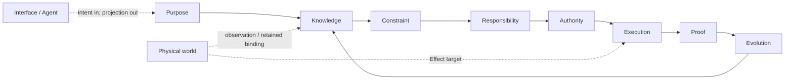

| 平面 | 唯一事实 | 签发者 | 不得产生 |
| --- | --- | --- | --- |
| Purpose | outcome、non-goal、不可推导取舍 | authorized Product/Domain decider | implementation、path、Effect |
| Knowledge | Subject、Definition、Observation、coverage、unknown | domain owner + interpreter/provider | permission、success |
| Constraint | invariant、admission predicate、waivability | contract/architecture owner | weighted override of hard failure |
| Responsibility | cell、owner、consumer、Requirement | responsibility compiler + domain owner | physical placement、runtime attempt |
| Authority | principal、Grant、delegation、Binding permission | authority issuer | capability availability、proof |
| Execution | Provision、Allocation、Attempt、Effect、Settlement | capability/resource/domain-operation owners | new Definition、self-verdict |
| Proof | Claim、readback、EvidenceSupports、verdict | domain readback + independent verifier | canonical mutation、authority |
| Evolution | activation、compatibility、migration、cutover、retirement | Change Management + state owner | permanent dual generation |
| Interface | normalized intent、typed projection | interface owner | second truth、resolver、writer |

架构合法性不是某一平面通过，而是全部必要平面的交集：

```text
AdmittedChange =
  PurposeValid
  ∧ KnowledgeCoverageValid
  ∧ ConstraintsSatisfied
  ∧ ResponsibilityUnique
  ∧ AuthorityValid
  ∧ CapabilityBound
  ∧ ResourcesAllocated
  ∧ LifecycleRecoverable
  ∧ ProofObligationsDeclared
  ∧ EvolutionObligationsClosed
```

任何 `unknown` 只阻断它可能影响的 Effect 或 Claim；任何 hard failure 都不能被多数 PASS、信心、测试绿色或人工评分抵消。

### 1.1 Constitution binding

本文件不重写通用原则；它只声明 SEC 如何消费三项上游权威：

| Upstream owner | SEC projection | 本文件拥有的实例化 |
| --- | --- | --- |
| `docs/design-calculus.md` | Subject/Claim/Relation/Constraint/Transition/Proof 与原则多视图合同 | SEC relation refs、compiler stages、typed frontier |
| `docs/engineering-constitution.md` | EP-IDENTITY 至 EP-ECONOMY | SEC DesignAdmission、owner DAG、Effect/resource/recovery/proof/evolution obligations |
| `docs/agent-constitution.md` | Agent 认识与行动原则 | 只由 `docs/development-governance.md` 实例化；本文件不授权 Agent |

通用原则变化先在其唯一 owner 完成语义、反例与反转审查，再重编 SEC profile；SEC 场景不能在此定义同名原则或改变其 rejection semantics。

`SEC Project Constitution` 不是第四份手写文档，而是一个无所有权的生成视图：

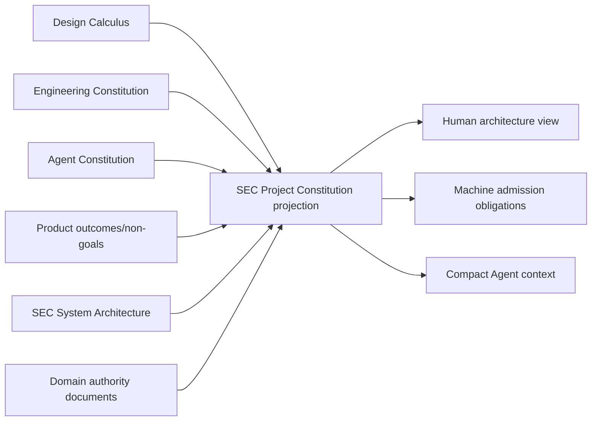

投影只能引用各 owner 的 identity/revision/clauses，不能保存原则或领域字段副本；它的失效由任一输入 revision 变化自动传播。

### 1.2 逻辑坐标与实现边界

本文件只实例化 SEC 的逻辑坐标；它们正交而不构成目录或 class 层级：

| 坐标 | 回答 | 例子 |
| --- | --- | --- |
| `domain` | 哪些语义必须由同一owner和不变量共同演进 | Engineering Semantics、Verification |
| `plane` | 从哪个独立责任维度判断同一事实 | Semantic、Authority、Resource、Lifecycle/Proof |
| `stage` | 哪些逻辑输入必须先存在才能产生下一结果 | S0 outcome → S9 publish/retire |
| `lifecycle` | 同一identity随时间处于什么合法状态 | requested→planned→terminal/residue→retired |
| `view` | 哪个角色只需看同一事实的哪一无增权投影 | semantic、authority、resource、proof view |

`DomainOperation` 是领域语义；`sequence` 是Workflow代数组合子；`PurePlan`是immutable逻辑产物。它们的type、file、facade、session、storage、package和composition root属于`docs/implementation-architecture.md`，不能由本文件指定。

## 2. SEC 关系实例化

关系的通用定义只在 `docs/design-calculus.md`。SEC 对象必须投影到这些关系，不得按“代码/资源/进程”建立互斥大类：

| SEC object | Subject / Address | Requirement / Provision | Observation / Settlement / Evidence |
| --- | --- | --- | --- |
| authored source | content Subject + exact tree Address | parser/type/service Requirement + compiler Provision | parsed declarations/references + fact derivation |
| manifest/template | protocol Subject + snapshot Address | strict parser/schema Provision | canonical bytes/invariants/provenance readback |
| process | attempt Subject + OS Address | process Requirement + retained execution Provision + Allocation | start/output/exit/descendants + terminal settlement |
| container daemon | external capability Subject + host Address | container operation Requirement + daemon Provision | live availability/operation/readback；不拥有业务 Definition |
| repository/hosted service | semantic remote Subject + exact revision/ref Address | repository/API Requirement + credential/endpoint Provision | records/remote readback；transport 不拥有成功 |
| cache/fact shard | derived Subject + content Address | exact ActionKey Requirement + cache Provision | validated hit/miss；不拥有 canonical Claim |
| document | accepted Definition 或 generated projection Subject | reader/audience Requirement | registry/projection/read receipt；不得混写 runtime result |
| test | Claim/Evidence scenario Subject + source Address | runner/environment Provision | behavior/effect/failure observation；名称和计数不产生价值 |
| Work Package | bounded operation-definition Subject | scope/role/obligation Requirement | activation/settlement refs；不产生全局原则 |

### 2.1 正交与相互约束

正交表示一种关系不能使另一种关系自动成立；相互约束表示 architecture compiler 对这些关系做合取验证。

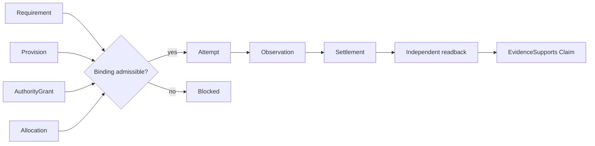

Provision 不等于 Grant；Binding 不等于 Observation；exit 不等于 Settlement；Evidence record 不等于 Claim 为真。

### 2.2 Domain、ProductCapability 与 Workflow

`Domain` 是语义一致性边界：一组 Subject、Definition、Invariant、StateMachine、FailureAlgebra 与 public DomainOperation 必须由一个 owner 共同裁决并原子演进。它不是目录、package、团队、技术栈、Provider、部署单元或一个功能名称；这些只能是 Domain 的实现投影、Provision 或 Address。

```text
Domain =
  one semantic owner
  + cohesive Subjects/Definitions/Invariants
  + one internally consistent state/failure/evolution boundary
  + public DomainOperations/results
  + explicit relations to other Domains
```

边界由可观察语义决定，不由代码位置决定：

| 判定 | 结论 |
| --- | --- |
| 两组事实必须在同一 transition 中共同满足一个不可拆 invariant，否则任一中间态都无合法含义 | 属于同一 Domain；对外暴露一个 composite DomainOperation |
| 两组事实可通过稳定 public contract/result 协作，各自 state、failure、lifecycle、policy 或 evolution 能独立变化 | 分为不同 Domain；用 Workflow 或 typed relation 组合 |
| 只是共享 Git、process、filesystem、Docker、compiler 或 credential Provider | 不合并 Domain；共享的是 Capability Provision |
| 只是同一用户功能、目录、package 或团队维护 | 不能证明同一 Domain |
| 所谓 Workflow 必须读取子模块私有 state、改写其 journal 或直接调用其 Provider 才能成立 | 边界错误：要么应合并为一个 DomainOperation，要么缺少 public result/operation |

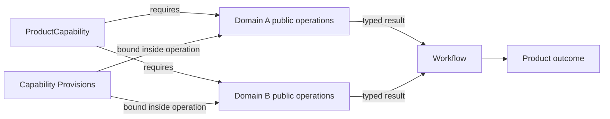

一个 ProductCapability 可以落在一个或多个 Domain；一个 Domain 也可以服务多个 ProductCapability。Workflow 是 public DomainOperation 的组合，因此既可以是单 Domain 内多个独立 operation 的编排，也可以跨 Domain；“跨领域”不是 Workflow 的定义。若若干步骤必须共享一个不可分状态机或原子 invariant，它们不是跨域 Workflow，而是一个 composite DomainOperation 的内部 Requirement DAG。

### 2.3 Business Capability Closure

每个 accepted ProductCapability 必须编译为完整业务闭包，不能只定义 happy-path 功能或等实现暴露缺口后再补控制：

```text
BusinessCapabilityClosure =
  outcome/non-goal
  + Subjects/Definitions/Invariants
  + Responsibility/owner/public demand
  + inputs/outputs/data/configuration/secrets/privacy
  + StateMachine/FailureAlgebra
  + Policies/Decisions
  + Authority/permissions/delegation
  + DomainOperations/Workflow
  + Requirements/CapabilityPorts/Bindings
  + Resource/Concurrency/Time/Consistency/Isolation
  + Effects/Settlement/Readback/Recovery
  + external/provider/security/supply-chain/compliance
  + Claims/Evidence/Verification
  + audit/provenance/retention
  + performance/economy
  + compatibility/migration/retirement
  + distribution/deployment/availability/operations/support
  + Interface/accessibility/localization
  + unknown/reversal
```

Architecture Coverage Compiler 不是只遍历 concern 清单，而是生成并按可达性裁剪需求张量：

```text
ArchitectureCoverageTensor = applicable(
  ProductCapability
  × Actor/Principal/Responsibility
  × Subject/Data/State
  × LifecyclePhase
  × DomainOperation/Workflow/Effect
  × Trust/Authority/ExternalBoundary
  × Capability/Provider/ResourceDimension
  × Environment/Platform/Scale/Topology
  × ConcernFamily
  × FaultFamily
  × EvolutionState
  × Interface/Claim/Consumer
)
```

不是实际建立无穷笛卡尔积：relation reachability、Definition、not-applicable proof和closed discriminants先删除不可达组合；dynamic/opaque/external项进入explicit frontier。维度新增或某个值的可达性变化会使依赖原coverage digest的`LogicalDesignPackage` stale。

Compiler 对每个 applicable cell 生成 obligation matrix：

| Cell status | 含义 |
| --- | --- |
| `satisfied` | 有唯一 owner 和可验证合同 |
| `not-applicable(reason)` | 由 relation graph 证明该 concern 不可达；不能留空 |
| `required-unmaterialized` | 逻辑要求已接受，实现尚不存在 |
| `bounded-unknown(frontier)` | 缺观察/决策，只阻断受影响路径 |
| `violated(code)` | 违反 hard constraint，拒绝 promotion/Effect |

矩阵不是人工逐格维护。owner Definitions、semantic observations、operation/state/effect graph、Capability/Resource requirements和fault families是输入；reachability、dependency closure、constraint applicability、proof obligations与`not-applicable`由编译器生成。新增capability、state、Effect或external contract自动扩展相关行列并使原`LogicalDesignPackage` stale；具体Source Program、Provider、schema与tests属于实现编译输入。

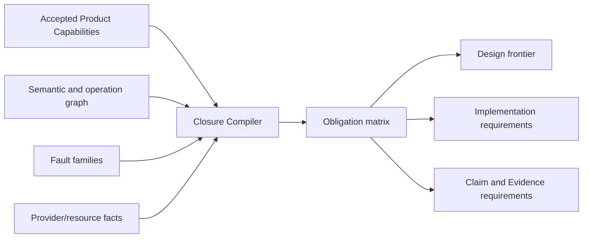

Coverage 只对声明的 exact universe 完备；开放世界通过 explicit unknown 扩展，不以“当前没搜到”证明不存在。上面的 concern family 不是不可扩展的枚举：新增一种能改变 admission、state、Effect、settlement、Evidence、成本或用户结果的独立 concern 时，先由其 canonical owner 定义关系与故障语义，再作为 Coverage Compiler 的新输入；不得把它塞进 `misc`、自由文本或既有 family 的可选字段。

### 2.4 可推导边界

通用构件不会凭空生成业务。所有信息分为四类，且只能沿显式 transition 变化：

| 类别 | 必须从哪里来 | 可由机器做什么 | 禁止 |
| --- | --- | --- | --- |
| accepted authored truth | authorized Product/Domain decision、Definition、Invariant、Policy | validate、normalize、引用、传播、比较 | 从当前代码或测试猜业务终局 |
| observed truth | exact repository/runtime/external provider observation | parse、classify、build fact graph、收窄 unknown | observation 自升为 Definition/Authority |
| derived truth | 上述 exact inputs + canonical algorithm | owner/impact/requirements/placement/test/resource/proof/evolution 编译 | 漏输入、用名称/路径/时间猜测 |
| runtime decision/authority | live issuer、current facts、policy、scope | bind/admit/allocate/schedule/settle | stable doc、cache、AI 或 Provider 自签 |

```text
MachineDerivable = deterministic(inputs, algorithm, coverage, unknown)
IrreducibleInput = authorized preference/definition/grant OR external observation
```

一旦 Product/Domain 给出足够精确的 outcome、invariant、state、failure 和 tradeoff，owner、Requirement、合法 Provider、资源、流程义务、Effect 边界、tests、Evidence、迁移与大部分实现结构都应机器推导。若输入不足，只能输出 exact decision/observation frontier；不得由 AI 补齐偏好，也不得把“实现能跑”反推成业务定义。

细节控制不是逐条手写到流程中，而是从关系图编译：

| 权威输入 | 必然派生的控制义务 | 控制落点 |
| --- | --- | --- |
| Definition + Invariant | 合法/非法状态、failure partition、public operation | Domain owner 的纯合同与 validator |
| Operation + Effect semantics | precondition、linearization、readback、idempotency/recovery obligations | Domain operation owner |
| Requirement + Authority | eligible Provision class、narrow Grant、Binding freshness obligations | capability/authority owners |
| Resource demand + concurrency relation | conservation、ordering、deadline、fairness、release/leak semantics | resource policy owner |
| StateMachine + lifecycle | legal transitions、terminal/residue、recovery、retirement | state/lifecycle owner |
| Workflow dependency + result mapping | readiness、join、choice、compensation、bounded fixpoint semantics | workflow owner |
| Claim + independence rule | required observations、negative cases、staleness、Evidence independence | verification owner |
| External contract + security/privacy rule | endpoint/principal/credential/environment/supply-chain requirements | external capability owner |
| State evolution | activation、migration、readback、consumer-zero、retirement semantics | evolution owner |
| Outcome + cost vector + FutureObligation | alternatives、dominance、reuse/complexity existence obligations | design owner |

若某项 runtime 控制无法回溯到这张表中的 authority input 和 typed relation，它不是“实现细节”，而是隐藏的 Definition、Policy、Authority、Resource 或 Workflow，应上收唯一 owner 后重新编译。

## 3. 硬约束系统

| 约束族 | 必须证明 | 确定性拒绝 |
| --- | --- | --- |
| Shape | owner contract与domain invariant完整可判定 | invalid/unknown structure |
| Reference | refs、revisions、predecessors、receipts 属于同一 universe | dangling/foreign/stale ref |
| Identity | semantic identity 与 Address/attempt/version 分离 | path/PID/latest/label 冒充 identity |
| Uniqueness | identity、writer、parser、resolver、issuer、terminal、readback owner 唯一 | facade/alias/registry 成第二 truth |
| Authority | requested Effect ⊆ Grant ∩ operation scope；delegation 只收窄 | caller/test/projection 扩权 |
| Capability | Provision 的contract/platform/security/principal/environment语义满足Requirement | ambient/substituted Provision |
| Resource | Σ child demand/consumption ≤ parent envelope；所有终态结算资源 | 子流程扩容、未知消费 |
| Freshness | input/grant/binding/observation/readback/claim 的 epoch 相容且 active | replay、same-path ABA、stale PASS |
| Concurrency | 冲突transition有线性化点；可并行关系满足可交换性与资源约束 | double transition、lost update、deadlock |
| Effect | planned Effect语义与settlement observations完整对应，且domain readback独立 | attempt observation=success、漏settlement |
| Recovery | lost observation/partial Effect可join/readback/rollback/authorized retry | blind replay、丢弃residue |
| Proof | Evidence issuer 与 producer 分离，且只支持预声明 Claim | self-proof、projection=observation |
| Coverage | exact universe、dynamic/opaque/unknown frontier 完整 | catch-all false、unknown=absent |
| Evolution | activation、migration、cutover、consumer-zero、single active generation | permanent dual read/write、Vn alias |
| Privacy | sensitive facts、secret、credential、diagnostic有最小可见范围与retention | 隐式泄露、无界传播 |
| Economy | 新对象有独立 Responsibility 或降低全生命周期成本 | wrapper、mirror、第二 graph/cache |

约束输出只有 `admissible | rejected | bounded-unknown` 和结构化 frontier；它不签发 Definition、Grant、Binding、Result 或 completion。

## 4. 四个 operation 视图

| View | 输入平面 | 回答 | 不回答 |
| --- | --- | --- | --- |
| Semantic | Purpose + Knowledge + Constraint + Responsibility | 做什么、为什么、哪个 Subject、何种结果 | 谁获权、是否执行 |
| Authority | Responsibility + Authority | 谁能对哪个 exact Subject 做哪些 Effect | Provider 是否可用、是否成功 |
| Resource | Provision + Execution | 谁供应、保留/消耗多少、怎样终止 | 业务结果、Evidence verdict |
| Lifecycle/Proof | Execution + Proof + Evolution | readback、terminal、residue、迁移、证据、退役 | 改写目标、放大 Grant |

四个 view 从同一 semantic graph 编译，共享 Subject/operation/revision，拥有各自 view kind 与 bytes digest。view 可以裁剪表达，不能增删 owner、Claim、unknown 或 blocker。

## 5. S0–S9 端到端编译


| Stage | 必需输入 | 唯一输出 | 禁止承担 |
| --- | --- | --- | --- |
| S0 | authorized outcome/non-goal/obligation | accepted purpose refs + unknown | scope、path、implementation |
| S1 | requested Subjects、observation purpose、coverage/resource bounds | exact universe + observation obligations + unreadable frontier | semantic adoption、physical mechanism |
| S2 | exact universe、observation contracts | typed observations + coverage + unknown/opaque | Definition、permission |
| S3 | owner Definitions、S2 facts、adoption rules | semantic claims/conflicts/unknown frontier | provider choice、write plan |
| S4 | semantics + consumer/effect/state/recovery relations | Responsibility Cells + Owner DAG + public demand | placement、attempt、terminal |
| S5 | intent、Cell/DAG、invariants、Claim definitions | OperationKey + Requirement DAG + pure Plan + obligations | discovery、lease、Effect |
| S6 | PurePlan、Grants、eligible Provisions、resource envelope、current state | admissible / rejected / bounded-unknown relation | business success、Evidence |
| S7 | admissible Plan与exact current facts | Effect observations + settlements + residue + readback + DomainResult | new Definition/Grant、Evidence verdict |
| S8 | Claims、DomainResult、S7 observations、exact environment | Verdict + Evidence validity/invalidation | DomainResult、mutation、publish authority |
| S9 | accepted DomainResult、required Verdict、materialization/evolution contract | artifact/projection/cutover/retirement receipt | upstream identity rewrite |

阶段是因果偏序，不是必须串行的同步程序。独立纯关系可并行求值；Effect必须满足Requirement DAG、concurrency与resource semantics。反馈只能是upstream owner接受的新request/result或new revision，不能通过隐藏状态或实现回调反向改写上游。

### 5.1 DesignAdmission

任何改变ProductCapability、Domain、public contract、owner、Effect、state、Authority、resource、recovery或evolution语义的设计，在进入实现选择前先编译：

```text
DesignAdmission = admit(
  accepted outcome / non-goal refs,
  exact accepted/observed producer-consumer-state-effect relations,
  target Responsibility / Owner DAG,
  identity / authority / capability requirements,
  resource + lifecycle / recovery rules,
  evolution / retirement obligations,
  Claim / Evidence obligations,
  bounded unknown frontier
)
```

它只返回`admissible | rejected | bounded-unknown`，不创建实现plan、state、authority或PASS。逻辑义务尚无实现时标为`required-unmaterialized`，不得反向删除义务或宣称能力已具备。

每个 accepted ProductCapability 在实现前必须从同一 `LogicalDesignPackage` 生成一个 `CapabilityDesignSlice`；它不是新的 owner 或手写规格：

```text
CapabilityDesignSlice = project(
  outcome/non-goal + domain Definitions,
  Subjects/Invariants/StateMachine/FailureAlgebra,
  public DomainOperations + WorkflowDefinition,
  actors/Authority actions/delegation,
  inputs/outputs/data/privacy/security,
  Requirements/eligible Provision classes/resource demands,
  Effects/settlement/readback/recovery,
  Claims/Evidence independence/conformance properties,
  performance/cost/SLO/operability,
  compatibility/migration/retirement/FutureObligations,
  alternatives/accepted decisions/reversal,
  coverage/unknown/implementation obligations
)
```

| Admission | 条件 | 允许的下一步 |
| --- | --- | --- |
| `design-unresolved` | 任一适用 concern/fault cell 无 owner、decision、typed unknown frontier 或 reasoned N/A | 只补观察/产品或领域决策；不得编码猜测 |
| `design-admitted` | 语义、流程、Authority、Effect、failure、resource、proof、evolution 已闭合；未实现项显式为 implementation obligation | Implementation Compiler 比较 realization |
| `implementation-admitted` | realization 保持 slice，placement/dependency/migration/verification plan 完整 | 受控实现/生成 |

代码只能实现 `implementation-admitted` obligation。编码中发现新的 actor、state、failure、Effect、resource、external dependency、compatibility 或用户可观察结果时，当前 plan 立即 stale，回到 CapabilityDesignSlice；禁止把新判断埋进 `if`、环境变量、callback、test fixture 或异常处理后再追认设计。

## 6. Knowledge：Observation、Coverage 与语义采用

### 6.1 唯一观察链

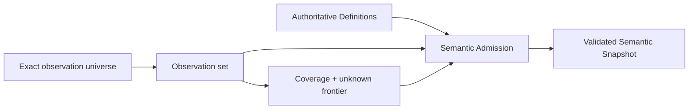

- Observation只陈述“在什么universe与coverage下观察到什么”，不自动成为Definition、Authority或Claim；
- 推导事实必须引用输入Observation、推导规则与coverage；inferred事实只有经Domain adoption才进入authoritative semantics；
- 未观察、无法解释、相互冲突和明确opaque是不同状态，均不能降为absent；
- 下游引用同一accepted observation revision，不得以第二次独立观察静默改变问题的事实边界。

### 6.2 开放世界完备性

```text
Complete(U, M, C) =
  exactCensus(U)
  ∧ everyContentClassHasInterpreterOrTypedOpaque
  ∧ everyObservationHasCoverage
  ∧ unknownFrontier(U, M, C) = ∅
```

`U`是exact universe，`M`是active meta-model，`C`是coverage。任何不可解释对象进入typed unknown；对象类别、解释器、物理snapshot、Source Program和frontier的工程表示由实现架构拥有。

### 6.3 增量与性能

逻辑结果的复用key只包含真正决定结果的输入：

```text
DerivationKey = exact accepted input revisions
              + derivation contract
              + relevant external fact generations
```

只失效依赖变化输入的推导；复用、增量、缓存或长期服务不得改变clean derivation的语义结果。共享snapshot、fact shard、Language Service、streaming budget和物理扫描策略属于实现架构，并必须refine本条逻辑等价性。

## 7. Responsibility 与 Owner DAG

### 7.1 Responsibility Cell

Responsibility Definition 只保存不能从 Source Program 推导的稳定事实：

```text
Cell identity
+ outcome / obligation refs
+ owned semantic Subjects
+ public operations
+ required issuer/readback/proof separations
+ activation / reversal / retirement conditions
```

它不保存 paths、roots、imports、tests、current consumers/providers、Effect sites 或 runtime state。Source Program 提供实际 declarations/edges；Architecture compiler join 二者产生 Owner DAG、public-surface demand 和 placement constraints。

### 7.2 SEC canonical Domain atlas

下面是由产品终局能力合同与canonical authority refs推导的目标Domain边界；它不是实现拓扑，也不表示每个文档、源码目录或部署单元都是Domain。

| Domain identity | 核心 invariant / state boundary | Public operations / results | Canonical authority ref |
| --- | --- | --- | --- |
| Repository Observation | 同一 retained snapshot、interpreter/config/provider closure只产生一个 coverage-bound事实图 | attach/lift/observe → SourceProgramSnapshot/unknown | `brownfield` |
| Engineering Semantics | accepted Entity/Fact/Assertion/Responsibility在一个 semantic revision内无冲突且owner唯一 | reconcile/adopt/validate/query → ValidatedEngineeringSnapshot | `semantic-model` |
| Implementation Resolution | hard eligibility先于policy；Decision、Binding、TargetProgram identities分离 | resolve/compileTarget → Decision/Binding/TargetProgram | `compiler-target-ir` |
| Change Analysis | exact before/after revisions产生唯一 Delta/Impact，unknown不被缩成未受影响 | compare/propagate → SemanticDelta/BindingDelta/Impact | `delta-impact` |
| Authority & Delegation | principal、Grant、delegation、use、expiry/revocation与audit obligation形成独立授权生命周期 | request/issue/delegate/revoke/observeUse → grant state/result | `system-architecture` authority profile + each Domain issuer policy |
| Resource Governance | capacity、Demand、parent/child Allocation、consume/return/leak/unknown满足守恒 | plan/reserve/consume/release/settle → resource result | `system-architecture` resource profile |
| Workspace Change | 一个 OperationKey 的Effect、journal、settlement、readback与recovery保持原子业务语义 | plan/apply/readback/recover → DomainResult/residue | `semantic-mutation` |
| Capability Catalog | Registry/Block/Port/Extension只声明可供选择的能力闭包，不选择业务实现 | resolveCapability → candidate/typed unavailable | `capability-block` |
| External Provider Lifecycle | provider identity、credential、security、conformance、maturity、retirement为同一采用生命周期 | observe/adopt/bind/retire → eligible Provision/provider receipt | `external-provider` |
| Runtime Materialization | host/target/toolchain/dependency的物理generation、readiness、settlement与recovery保持一致 | provision/materialize/readback/recover → physical result/residue | `runtime-distribution` |
| Distribution & Support | artifact set、package/deploy identity、支持成熟度、失效与退役独立于单次build | package/publish/observeSupport/invalidate → distribution/support result | `runtime-distribution` |
| Verification | Claim、required Evidence、environment、freshness、independence与Verdict不可被producer自报替代 | select/execute/evaluate/invalidate → Verdict/Evidence state | `verification-governance` |
| Evolution | compatibility、migration、cutover、rollback/forward recovery与old consumer-zero共同决定generation变更 | decide/compileMigration/cutover/retire → evolution result | `change-management` |
| Development Operations | SEC自身work selection、task/session/action/integration/continuation只组合上述public results | select/activate/execute/integrate/continue → development result | `development-governance` |

每个Domain还必须闭合自己的Subject、state、failure与下游交接；下面是目标逻辑合同，不是实现组件：

| Domain | Canonical Subjects / states | Required result partition | 只可交给下游的public meaning |
| --- | --- | --- | --- |
| Repository Observation | observation universe、observed facts、coverage、unknown/opaque | observed / partial / unreadable / conflicted | exact observation+coverage refs |
| Engineering Semantics | Definition、adopted Fact、Invariant、Responsibility、semantic revision | valid / conflicted / ambiguous / unknown | validated semantic snapshot or frontier |
| Implementation Resolution | Requirement、Candidate、Eligibility、Decision、Binding、TargetProgram | bound / no-eligible / tied / unresolved / stale | exact Decision/Binding/target refs |
| Change Analysis | before/after meaning、SemanticDelta、BindingDelta、ImpactClosure | unchanged / changed / incompatible / unresolved | exact affected Subjects/Claims/operations |
| Authority & Delegation | Principal、AuthorityPolicy、Grant、Delegation、Use、Revocation | requested / active / denied / expired / revoked / settled | exact action/Subject/scope/epoch grant refs |
| Resource Governance | Capacity、Demand、Allocation、Consumption、Return、Leak | available / reserved / exhausted / settled / leaked / unknown | exact parent/child allocation state |
| Workspace Change | DesiredDelta、PurePlan、Effect semantics、readback、DomainResult | rejected / blocked / applied / failed / recovery-required | result+state/effect observations |
| Capability Catalog | capability identity、candidate closure、eligibility facts | candidate / ineligible / unavailable / unknown | eligible Provision candidates only |
| External Provider Lifecycle | Provider、conformance、security、credential/principal、maturity | proposed / eligible / bound / degraded / retired | exact Provision+conformance/maturity refs |
| Runtime Materialization | runtime/dependency/toolchain generation、readiness、residue | ready / absent / mismatch / unresolved / recovery-required | exact materialization/readback result |
| Distribution & Support | artifact set、deployment target、support claim、drift | unpublished / published / supported / degraded / deprecated / retired | publication/support state refs |
| Verification | Claim、Evidence requirement、Evidence、Verdict、validity | pass / fail / blocked / not-applicable / stale | exact Verdict+coverage+invalidation |
| Evolution | old/new meaning、Compatibility、Migration、Cutover、Retirement | compatible / migration-required / breaking / unresolved / retired | generation transition result |
| Development Operations | work intent、selection、activation、action、integration、continuation | selected / blocked / executing / integrated / recovery-required / closed | references to underlying public results |

Domain state不能被另一个Domain的便捷结果覆盖：例如Verification PASS不把Workspace Change提升为applied，Provider eligible不把Implementation Resolution提升为bound，publication不把Distribution提升为supported，Development Operations也不能替任何Domain生成结果。

Product outcome/non-goal 是所有 Domain 的上游输入；Implementation Architecture、execution mechanism、resource accounting、documentation与Interface projection是跨 Domain 的实现或投影责任，不是新的业务 Domain。逻辑 Domain 不规定源码、package、进程或部署边界。

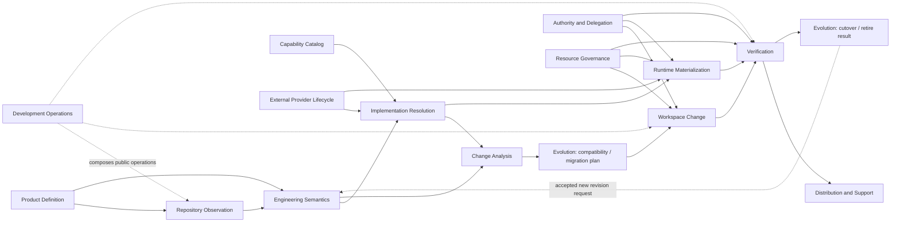

参考业务 workflows 从这些 public operation 编译，不另建跨域真相：

| Product workflow | Public DomainOperation chain | 不得旁路 |
| --- | --- | --- |
| 理解/解释既有工程 | ObserveRepository → Reconcile/Adopt → Query → Interface projection | 路径/AI直接签 semantic truth |
| Brownfield 正确变更 | Observe → Validate semantics → Resolve implementation → Delta/Impact → Apply workspace change → Verify → Publish/Evolve | Agent直接改文件、测试PASS即发布 |
| 从语义生成新产品 | Accept Definition → Resolve/Target compile → Materialize → Readback/Verify → Package/Support | Backend执行Effect或重选Provider |
| 引入/替换外部能力 | Observe candidate → Provider adoption/conformance → Resolution/Binding delta → Migration/cutover → Verify/retire old | ambient fallback、双active owner |
| 故障恢复 | owning Domain readback → PureRecoveryDecision → new admission → recover/compensate/retry → readback | generic workflow猜测状态或blind replay |
| SEC自我演进 | Development Operations组合同一Observe/Change/Mutation/Verification/Evolution operations | 建第二套dev-only source/Effect/proof语义 |

Domain atlas 的增删改只能由产品/领域 invariant、public result与独立 evolution边界证明；实现映射由下游实现架构单独编译，不能反向改变这些边界。

### 7.3 依赖层级

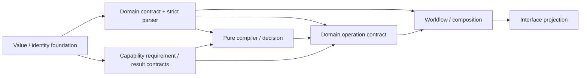

左侧是上游，右侧可依赖左侧。禁止：

- contract 导入 runtime/provider/operation；
- pure compiler 执行 Effect；
- capability 解释 domain success；
- workflow 绕过 domain operation 直达 primitive；
- interface 绕过 operation 重算 decision；
- foundation/architecture contract 反向导入 Source Program、filesystem、language provider 或 placement；
- feedback 形成 runtime import SCC；反馈必须是 typed request/result，由 orchestrator 组合。

### 7.4 Implementation projection

本层只输出 accepted Responsibility Cells、Owner DAG、logical dependency constraints 和 public demand。Facade 是否有真实边界、CodeUnit 角色、package/file placement、单一 `src/` authored root、module admission、局部变更、意图生成与架构迁移统一由 `docs/implementation-architecture.md` 编译。

路径、目录、`index`、package、测试、当前 import 和 facade 均是 implementation observation/projection，不能反向定义 responsibility。实现编译器必须证明实际 Source Program 满足本层 DAG；不能用文档路径清单、命名约定或生成 registry 替代 actual declaration/reference/effect graph。

## 8. Operation、capability 与资源

### 8.1 三层分离

| 层 | 拥有 | 不拥有 |
| --- | --- | --- |
| Capability requirement | 对观察或 Effect 所需能力及可接受 settlement 的抽象约束 | 具体 Provider、session、path、handle |
| Domain operation | OperationKey、Requirement DAG、业务 invariant、Effect semantics、readback/recovery/terminal | provider实现、跨域工作流 |
| Workflow | 一个或多个 domain operation 的依赖与补偿编排 | 子operation state/authority、primitive |

“原子”表示一个业务不变量完整成立或进入可恢复 typed state，不表示每个函数、文件或 I/O 都公开。对外只公开 query 和 domain operation；primitive/provider 细节保持内部。

### 8.2 Flow、Control、Orchestration 与 Scheduling

这些词回答不同问题，必须由不同 owner 通过 typed refs 组合：

| 角色 | 组织/控制什么 | 只消费 | 绝不能决定 |
| --- | --- | --- | --- |
| Product/Domain decider | outcome、non-goal、不可推导取舍 | intent、事实、alternatives | 实现、Provider、运行结果 |
| Domain definition owner | Subject、Invariant、State、Failure、Operation semantics | accepted decisions | Authority、Provider availability |
| Workflow composer | 一个或多个 public DomainOperations 的依赖、join、compensation | operation contracts/results | 子 operation 内部 state/Effect、primitive |
| Policy/decision compiler | eligible candidates 间的 deterministic decision | definitions、facts、policy | 签发 Authority、执行 Effect |
| Control/admission owner | 某 transition/attempt 当前是否允许 | plan、facts、constraints、refs | 改写 workflow、执行或证明成功 |
| Authority issuer | principal 对 exact Subject 的 Effect 上限 | authorized decision、scope、epoch | capability 可用性、业务成功 |
| Capability contract owner | Requirement、Provision eligibility 与 settlement semantics | domain requirements、provider facts | 修改 Domain intent、把能力可用性当 Authority |
| Resource policy owner | 资源维度、容量、共享、公平、释放与未知语义 | operation demand、current capacity facts | 业务终态、把未观测容量当无限 |
| Operation semantics owner | Effect observation与独立readback如何归约为result/recovery | plan、settlement facts、state facts | 签发Authority、独立Evidence verdict |
| Verification owner | exact Claim 与 independent Evidence 的 verdict | result/readback/evidence | mutation、retry、merge Authority |
| Interface owner | intent/query 输入和 typed projection 输出 | public operations/results | 重算 decision、绕过 admission |

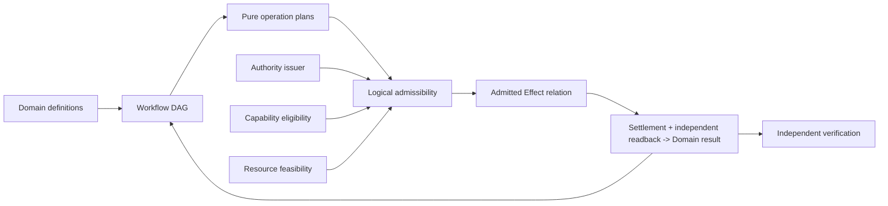

逻辑流程由 Workflow/DomainOperation owner 控制；Capability、Resource、Authority、Settlement与Verification只提供各自关系所需的事实。任何角色跨过这些边界都会形成第二workflow、self-authorized Effect或self-proof。具体编排者、scheduler、provider、store和session由实现架构选择，不能由本逻辑图预定。

控制不是一个万能 control plane。每个 admission owner 只控制其状态转换；跨域组合由 Workflow 引用各 DomainOperation 的 public result。公共 Control Plane 只能聚合 typed admission/readback projections，不能取得所有领域的 Definition、journal 或 terminal ownership。

Workflow 的 public operation 引用与 operation 内部的 Capability Requirement 是两级不同逻辑，不能压成一个万能operation：

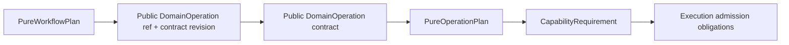

- Workflow 节点只固定 public DomainOperation identity、contract revision、input/result mapping 和 constraints；不定义operation怎样被调用或实现。
- DomainOperation声明它需要的Git/process/filesystem/network/container/compiler等Capability Requirement；后续binding/admission如何实现由实现架构拥有。
- Workflow 可以声明语义约束，例如 local-only、offline-capable、principal、latency class 或 required result semantics；只有当某个具体 Provider identity 本身是已接受的产品不变量时，它才进入 Requirement。不得用 callback、路径、环境变量或实现名字暗中选择 Provider。
- “自由控制流程”表示用typed、可组合、可验证的WorkflowDefinition控制operation、数据边、分支、并发、等待、终止和恢复；不表示Workflow拥有子operation的capability选择、state或Effect。

```text
WorkflowDefinition  = logical operations + dependencies + guards + compensation semantics
PurePlan            = typed requirements/effects/readback/result DAG; no provider/grant/allocation
PublicOperationRef  = exact public DomainOperation identity + contract revision for one workflow node
Admissibility       = current facts satisfy authority ∧ capability ∧ resource ∧ state preconditions
DomainResult        = operation semantics applied to settlement + independent readback
```

这些对象具有不同 identity/revision/owner。WorkflowDefinition与PurePlan可以跨实现保持不变；Admissibility随current facts变化；DomainResult不能由Capability提供者、记录载体或Interface构造。

Definition、Plan 与运行状态都不可原地改写：

```text
accepted Definition change -> new definition revision
same Definition + changed exact request/facts -> new PurePlan identity
same PurePlan + changed current facts -> new admissibility evaluation
running observation/effect never mutates Definition or Plan
```

事实、Capability、资源或权限变化只会使未启动的admissibility stale；它们不能热修改已运行Plan。运行中发现Plan错误或前提失效时，停止新增Effect，保留现有observation，再由原Plan/readback生成`PureRecoveryDecision`。partial/unknown Effect绝不能靠替换Plan隐去；其执行载体和持久协议由实现架构拥有。

#### 8.2.1 Workflow algebra

Workflow 不是预定义业务流程清单。系统只有一个 closed、typed 的 Workflow meta-model；实际流程数量由 accepted ProductCapabilities 编译得到，可以是零个或任意多个。当前核心代数按正交职责分为 node、composition 与 transition policy；新增组合子必须证明现有代数无法等价表达，并走 meta-model evolution，不能添加任意 callback。

| 构件 | 语义 | 必要条件 |
| --- | --- | --- |
| `invoke(operationRequirement)` | 调用一个 exact-revision public DomainOperation | public contract/ref、独立admissibility/result |
| `sequence(A,B)` / result edge | A 的指定 terminal/result 是 B 的前置并映射输入 | result mapping、freshness、B 独立 admission |
| `choose(decision,cases)` | pure Decision 选择恰好一个 closed branch | exhaustive cases、unknown→blocked |
| `parallel(nodes, completion)` | 对 bounded exact node set fan-out；按 `all | any | quorum(n)` 汇合 | 独立 Effect/lock set、共享 parent allocation、loser settlement |
| `await(requirement)` | 等待 durable signal、deadline 或既有 operation settlement | exact subject/epoch、subscription settlement、timeout/cancel |
| `boundedFixpoint(step,variant)` | 状态按可证明 variant 进行有限迭代 | bound、monotonic progress、每轮新 admission、terminal/residue |
| `compensate(failure,operation)` | 以新的有权 DomainOperation 恢复可定义 preimage | compensation grant、资源、readback；不能伪装 rollback |
| `retry(previous)` | 重新执行同一业务 intent | conclusive not-applied 或 owner-issued retry admission；unknown Effect禁止盲重试 |
| `terminate(result)` / `cancel(reason)` | 结束结果或停止新增工作并进入 descendant settlement | terminal schema、propagation、termination/readback |

`join existing operation` 是 `await(operation settlement)`；fan-in 是 `parallel(..., completion)` 的结果边；Saga 是 sequence + compensation；bounded map 是由 exact input set 编译出的 parallel。它们不需要第二套流程类型。动态节点只有在输入集合、上限、identity 和 resource demand 已进入 plan 时才合法，运行时 callback 不能扩展 DAG。

```text
Ready(node) =
  predecessorResultsMatch
  ∧ currentInputRevisionsMatch
  ∧ controlAdmissionValid
  ∧ grantBindingAllocationLive
  ∧ noAffectedUnknown
```

Workflow DAG 本身无 runtime cycle；业务循环通过 bounded fixpoint/state transition 显式表达。重试、补偿、恢复是新的受控 transition，不是 catch/while/sleep 控制流。

#### 8.2.2 Authority algebra

Authority 是独立控制平面，不是 Capability、角色名、代码可达性或一个布尔值：

```text
AuthorityGrant {
  issuer + principal
  exact Subjects + action kinds + Effect scopes
  purpose + operation/workflow bounds
  preconditions + parentGrantRef + delegationDepth
  activationEpoch + expiry + revocation
  use: single | bounded-multi
  audit/settlement/retirement obligations
}

EffectiveAuthority =
  issuerGrant
  ∩ accepted domain policy
  ∩ parent delegation
  ∩ current operation scope
  ∩ live subject/epoch
```

action kind 至少区分 `observe | decide | plan | execute-effect | verify | publish | recover | retire | delegate`；某一项存在不推出另一项。敏感读取同样要求 observe authority；公开只读信息可由 policy 显式声明为无需 grant，而不是默认“read 不算权限”。

| Owner | 唯一职责 | 禁止 |
| --- | --- | --- |
| authority policy owner | 定义哪些 principal 在何种条件下可请求哪些 action | 声称当前 grant 已签发 |
| issuer | 对 exact subject/epoch 签发、撤销、过期 grant | 执行 Effect、证明结果 |
| delegation compiler | 证明 child scope/time/actions 是 parent 的子集 | 扩权、换 principal/subject |
| admission owner | 将 live grant 与 Plan/Binding/Allocation/preimage 相交 | 修改 policy、补签 grant |
| capability provider | 只消费不可伪造 ObservationTicket/EffectTicket执行bounded attempt | 从可执行能力反推权限 |
| state/audit owner | 记录 issuance/use/revocation/settlement/retirement | 以记录存在代替授权或成功 |

Skill、AI、测试、文件所有权、Address、credential possession、Capability availability、缓存、design artifact、Workflow或caller DTO均不能签发Authority。授权响应丢失时只允许issuer/state readback；不得因caller“应该有权限”重新签发或执行。

### 8.3 单次 Effect 序列

```text
Admissible(plan, facts) =
  authoritySatisfies(plan.authorityRequirement, facts.authority)
  ∧ provisionSatisfies(plan.capabilityRequirement, facts.provisions)
  ∧ resourcesSatisfy(plan.resourceDemand, facts.capacity)
  ∧ statePreconditionHolds(plan.precondition, facts.state)
  ∧ unaffectedUnknown(plan, facts.frontier)

TerminalOutcome =
  reduce(plan.effectSemantics, effectObservations, independentReadback, recoveryPolicy)
```

`OperationKey`是同一业务意图的幂等identity；attempt、deadline、provider route、进程、session和retry都不能生成新的业务identity。逻辑只要求Effect前admissibility成立、Effect后observation与readback完整、partial/unknown进入recovery；ticket、session、journal、CAS和物理句柄属于实现架构。

### 8.4 资源守恒

每个operation声明一个不可扩大的`ResourceEnvelope`，其维度由资源语义决定：

| 资源 | 计量语义 |
| --- | --- |
| monotonic time | 一个 absolute deadline；所有 wait/read/effect/readback/cleanup/recovery消费 remaining |
| processes | admitted starts、live peak、terminal count；不得按 child 重开 |
| input/output | aggregate bytes/records；截断不等于忽略消费 |
| filesystem | entries、content bytes、metadata observations、open handles |
| memory/CPU | reservation、peak observation、release |
| network/API | requests、response bytes、rate/credential scope |
| context/tokens | selected facts/clauses、unknown expansion、output |

```text
Σ(child demands) ≤ parent envelope
Σ(actual consumption) ≤ admitted allocation
all terminal branches account for consumed, returned, leaked or unknown resources
cleanup, readback and recovery cannot create a new envelope
```

短预算等待者可以停止等待共享中的计算，但不能放宽producer的资源边界。Capability的资格事实与每次operation的资源消耗是不同关系，不能重复收费或相互冒充。

#### 8.4.1 Resource algebra

资源维度不是固定表；任意新资源先声明下列合同，再进入同一 parent ledger：

```text
ResourceDimension {
  identity + unit
  capacitySource + freshness
  kind: exclusive | countable | consumable | rate | retained | elastic-bounded
  reservability + overcommitPolicy
  shareability + isolation
  acquire/consume/release semantics
  cancellation/expiry
  leak/residue readback
  accounting precision + unknown policy
}
```

进程槽、线程、句柄、锁、端口、内存、CPU、GPU、存储、文件条目、网络、API额度、数据库连接、容器容量、上下文和时间都可按该代数实例化。credential/permission属于Authority/Capability，不因稀缺而变成Resource；它可以引用rate/quota allocation，但语义保持分离。

组合资源请求必须原子 reserve 或按固定全局顺序取得并可回滚；任何未计量维度进入 `resource-frontier`，不能假定无限。共享复用只有在 isolation、fairness、cancellation、settlement 和 leak readback 均成立时允许。

### 8.5 并发与可串行化

并发不是实现层锁的同义词。逻辑模型只规定：

- 同一Subject的冲突transition必须存在唯一linearization point，或返回typed conflict；
- 独立operations只有在Effect集合、状态前置与资源需求可交换时才可并行；
- join、cancel、retry、compensation和recovery均是显式transition，不能靠时间或“没有看到进程”推断；
- 同一Capability的并发度是Provision语义，Workflow不得通过复制Capability或新建第二Binding绕过；
- primary failure、settlement failure、residue和unknown必须分别保留，不能相互覆盖。

锁、lease、CAS、actor、queue、worker、session和durable log只是满足这些性质的候选实现，由`docs/implementation-architecture.md`比较并选择。

## 9. State、生命周期与恢复

### 9.1 状态域

状态按语义owner分域，不按Git、数据库、文件夹或host分域：

| State domain | 拥有 | 不拥有 |
| --- | --- | --- |
| semantic state | accepted Definition、Invariant、responsibility revision | runtime attempt、Evidence verdict |
| operation state | request、plan、effect observation、settlement、result/recovery | Product truth、Authority issuance |
| authority state | grant、delegation、expiry/revocation/use obligation | Capability availability、业务成功 |
| capability state | candidate、eligible Provision、Binding、conformance/maturity | Grant、Domain result |
| resource state | capacity、allocation、consumption、return/leak/unknown | 业务优先级、Proof |
| proof state | Claim、Evidence requirement、Verdict、freshness/invalidation | Mutation、publication Authority |
| evolution state | old/new generation、compatibility、cutover、retirement obligation | 正常路径的永久双generation |

同一物理载体可以承载多个状态域，但不能因此合并语义owner。载体、partition、transaction、retention与cleanup策略属于实现架构。

### 9.2 生命周期

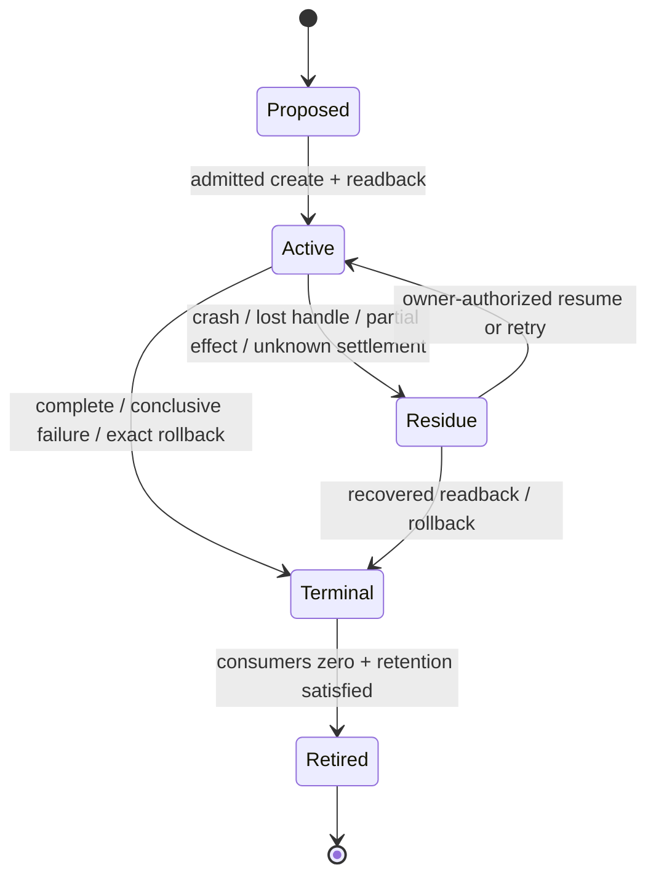

每个有跨时间效力的state必须定义creator、owner、revision、合法transition、readers、invalidation、recovery和retirement。实现必须为这些语义选择足够强的持久与并发机制；函数return、进程exit、记录存在或测试绿色都不自动构成terminal。

### 9.3 失败代数

| 失败位置 | 合法结果 |
| --- | --- |
| validation/coverage/eligibility/compatibility unknown | typed unknown/unsupported/conflicted；零 Effect |
| authority/provider/resource unavailable | blocked；Requirement 不变 |
| pre-publication failure | canonical target不变 |
| partial/post-effect failure | exact rollback receipt，否则 recovery-required |
| cleanup/close/readback failure | primary failure + settlement/residue；不得覆盖 |
| Evidence missing/stale | facts不变；依赖 Claim 不得 terminal |
| model不能表达反例 | model/plan/Evidence stale，进入 meta-evolution |

未知、权限、unsafe、deadline或解释失败不能降为`false | null | absent | mismatch`后触发Effect；durable grammar、reader与migration协议由实现架构和状态owner共同实现。

## 10. Identity、provenance、reuse 与 Evidence

### 10.1 Typed provenance DAG

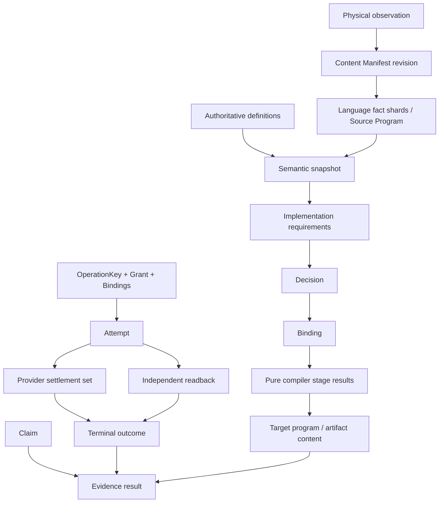

不存在统一 `Generation`：

| Identity | 只绑定 |
| --- | --- |
| Content Manifest revision | logical content set |
| Source Program generation | manifest + interpreter/config closure |
| Semantic snapshot | definitions + admitted observations/unknown |
| Decision/Binding | requirements + policy + eligible candidates |
| pure stage result | exact upstream refs + compiler/backend contract |
| Artifact content | canonical output bytes |
| OperationKey | domain Effect/idempotency |
| Attempt | one grant/binding/allocation execution |
| Evidence | Claim + exact result/environment/outcome refs |

attempt、deadline、cache path、Git session、PID 和 Evidence id 不得污染 pure result identity。

### 10.2 Derivation reuse

逻辑结果可以复用当且仅当：

```text
producer semantics exact
∧ accepted input closure exact
∧ derivation identity exact
∧ invalidation complete
∧ result remains inside the same validity interval
```

reuse不能扩大Claim、Authority或coverage；missing、stale、foreign或unknown只允许回到同一clean derivation。cache、index、pointer、mtime、fact shard、lease和GC是实现策略，由实现架构证明与clean derivation等价。

### 10.3 Evidence

Evidence 只支持预声明 Claim，不支持“整个系统正确”。Proof owner 检查 subject、inputs、environment、coverage、issuer independence、freshness 和 invalidation。implementation producer、expected profile、projection、fixture、版本数字、报告文字和同模块 self-digest 不能成为独立证明。

Verification 的 Result lattice、ActionKey、复用和 CI/merge 规则由 `docs/verification-governance.md` 拥有；Architecture 只要求其不反向拥有 source、domain result 或 authority。

## 11. Reduction 与演进

### 11.1 图内裁决

全部 source/test/document/provider/state/cache/Effect/Evidence/plan 进入同一因果图：

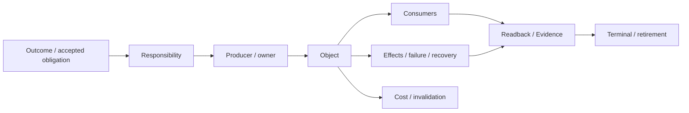

| Disposition | 成立条件 | 动作 |
| --- | --- | --- |
| required | independent responsibility、live consumer/effect/durable state，或 accepted unmaterialized obligation | 保留/实现最小闭包 |
| derivable | 可从 upstream facts 确定性重建 | 删除手写副本；生成 projection |
| duplicate-owner | 多个 producer/parser/writer/issuer 拥有同一 identity | 选 owner、迁 consumer、删其余 |
| dominated | semantics/failure/proof space 被成本不高于它的对象覆盖 | 合并后删除 |
| orphan | accepted/future/external/unknown obligation closure 全零 | 整图删除 |
| unknown | coverage/authority/future obligation 不完整 | bounded blocker；不作保留/删除结论 |

“未来会用”只有形成 owner-issued obligation、activation condition、acceptance、review/expiry 和 retirement 才是 required；comment、dead API、version suffix、test name 不是 future value。

### 11.2 版本与兼容

generation/revision只在至少一个真实consumer必须区分两个可观察语义状态时存在。单generation、原子替换、名字区分或测试自证不产生generation语义；旧态只在明确的Evolution关系中存在。schema字段、parser、suffix与迁移载体如何实现由实现架构和对应domain contract拥有。

### 11.3 一次迁移

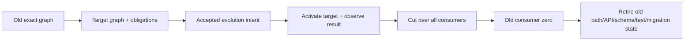

Evolution期间只有一个active authority route；旧/新generation的并存必须有明确support window、consumer集合和终止条件。失败只能进入resume、rollback、forward recovery或recovery-required；具体记录、发布和cutover机制属于实现架构。

### 11.4 Meta-model evolution

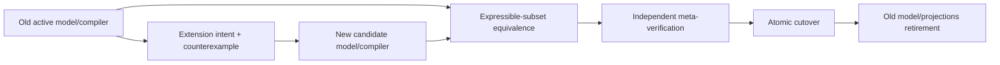

旧 compiler 只授权迁移 envelope，新 compiler 只验证 candidate post-state，独立 verifier 证明旧可表达子集等价和新增 frontier。不能用新模型自证采用，也不能永久双跑两套 truth。

## 12. 逻辑信息的权威与投影

### 12.1 信息类别

| Information kind | 只保存 | 产生方式 | 禁止保存 |
| --- | --- | --- | --- |
| Accepted decision | 不可推导 outcome/non-goal/tie-break、理由、反转条件、issuer | authorized decider 一次签发 | current path/provider/test/status |
| Stable spec | Definition/invariant/forbidden authority/activation/retirement | domain owner contract | implementation inventory、事件日志 |
| Logical DesignPackage | Domain/Operation/Workflow/State/Failure/Authority/Resource/Proof/Evolution语义 | logical compiler | 实现机制、运行结果、迁移批次 |
| Implementation DesignPackage | 逻辑设计的目标realization | implementation compiler | 新业务语义、被观察实现的inventory |
| Conformance Model | 跨逻辑与实现的性质、场景、fault与Claim obligations | conformance compiler | producer自报Verdict |
| Generated projection | applicability、roles、closures、obligation、unknown、人/AI view | projection compiler | manual edits、Effect/PASS |
| Runtime/Evidence | attempt/receipt/failure/external observations | runtime/verification owner | stable design truth |

### 12.2 Constitution binding

| Constitution | canonical owner | SEC projection owner | runtime consumer |
| --- | --- | --- | --- |
| Design Calculus | `docs/design-calculus.md` | 本文件的 relation/compiler profile | DesignAdmission 与 architecture attack compiler |
| Engineering Constitution | `docs/engineering-constitution.md` | 本文件的 SEC owner/effect/resource/evolution profile | DesignAdmission |
| Agent Constitution | `docs/agent-constitution.md` | `docs/development-governance.md` | BehaviorAdmission |

```text
EffectiveAction =
  BehaviorAdmission
  ∩ DesignAdmission
  ∩ active EffectGrant
  ∩ available Provision / Allocation
```

Agent principle 不能创造 engineering truth；engineering principle 不能授权 Agent。SEC profile 只能收窄和实例化上游原则，不能复制或改写；聊天、summary、memory、Skill 不补缺项。

### 12.3 单一语义、多种精确表达

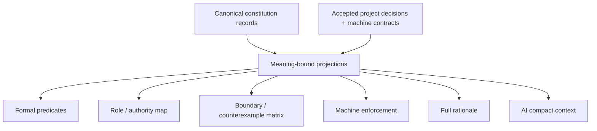

多种表达允许长度和形式不同，目的是消除歧义：

| View | 优化目标 | 必须保留 |
| --- | --- | --- |
| full rationale | 定义、推导、方案比较、反转条件 | 全部 semantic meaning |
| formal | 可判定谓词、状态机、truth table | exact constraints/unknown |
| role | issuer/owner/consumer/handoff | authority separation |
| boundary | 正反例、failure/recovery、retirement | rejection semantics |
| enforcement | type/schema/parser/lint/admission/CI | reachable machine rejection |
| AI compact | 当前 question 的最小 closure | 同一 blockers/unknown |

所有 views 引用同一 principle meaning；任何 view 增删 Claim、owner、unknown 或 blocker 都拒绝发布。完整解释可以严谨且较长，但不得复制 current facts；信息密度由按需 projection 提升，不靠删条件。

Agent bootstrap、文档生成、实时同步、载体布局和开发期admission都不是逻辑语义，统一由`docs/development-governance.md`与`docs/implementation-architecture.md`实现。本文件只规定任何投影都不能改变上述信息类别的owner、meaning、unknown与Authority。

## 13. 逻辑架构自攻与模型验证

逻辑设计必须在选择实现以前证明自身没有遗漏、混淆或自相矛盾。自攻输入只包括accepted ProductCapability、Domain definitions、Operations、Workflows、Authority、Capability/Resource requirements、State/Failure、Claims、Evolution与unknown frontier；不得用源码、测试、工具、路径或任一候选realization替设计回答。

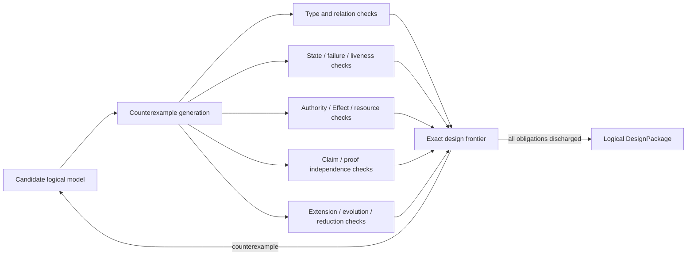

### 13.1 必须保持的性质

| Property | 形式化条件 | 反例结果 |
| --- | --- | --- |
| Semantic unity | each accepted semantic fact has exactly one owner | duplicate-owner / unresolved |
| Orthogonality | Definition、Observation、Authority、Capability、Resource、Effect、Evidence、Verdict互不冒充 | type-confusion |
| Domain closure | every Domain owns complete invariant/state/failure/public-operation semantics | domain-incomplete |
| Workflow opacity | Workflow只消费public operations/results，不可见child private state/Effect | boundary-collapse |
| No authority amplification | every Effect scope is a subset of a live issuer grant and parent delegation | unauthorized |
| Resource conservation | child demand/allocation/consumption never exceeds parent envelope | resource-unsatisfied |
| No implicit truth | unknown/opaque/conflicted cannot produce positive Claim or absent/mismatch | unresolved |
| Effect determinacy | every admitted Effect has defined settlement/readback/recovery semantics | effect-ambiguous |
| Proof independence | Claim producer alone is never sufficient Evidence | self-proof |
| Lifecycle reachability | every active state reaches terminal、residue或明确bounded wait | liveness-unresolved |
| Evolution singularity | normal semantics has one active generation and a finite old-state exit | competing-generation |
| Conservative extension | a new Domain/Target/Provider/Workflow preserves unaffected accepted meanings | meta-model-conflict |
| Reduction soundness | deletion/merge preserves outcomes、future obligations、failure/recovery与external contracts | conservation-unresolved |
| Decision completeness | every non-derived choice has issuer、alternatives、reason与reversal condition | decision-unbound |

### 13.2 逻辑 trace 演算

| Trace | 必须经过 | 合法结果 |
| --- | --- | --- |
| query | exact observation+coverage → adopted semantics → query rule | answer / unknown / conflicted |
| single-domain change | intent → pure plan → admissibility → Effect observation → readback → DomainResult | accepted / rejected / blocked / failed / recovery-required |
| cross-domain workflow | public Operation refs → dependency/result mapping → each child independent admissibility → join/compensation | workflow result / bounded partial state |
| concurrent conflict | shared Subject preconditions → unique linearization or conflict | one accepted transition / typed conflict |
| lost Effect observation | known Plan+OperationKey → current observations → recovery decision | join / completed / conclusive retry / recovery-required |
| provider replacement | unchanged Requirement → new eligible Provision → Binding delta → conformance/evolution | new binding / blocked |
| model counterexample | counterexample → dependent decisions/plans/proofs stale → extended model → equivalence over old expressible subset | new accepted generation / unresolved |
| capability retirement | accepted outcomes+future obligations → replacement/reduction proof → consumer/effect/external closure | retired / blocked / unknown |

实现方案只有在它能refine这些trace且不新增可观察Authority、Effect、state、failure或unknown时才可能被接受。锁、队列、session、journal、database、actor、进程、容器、文件与测试如何实现这些trace不属于本逻辑文档。

## 14. Logical DesignPackage 与实现交接

逻辑设计的唯一发布物是immutable、content-addressed的`LogicalDesignPackage`：

```text
LogicalDesignPackage {
  acceptedProductCapabilityRefs
  domainDefinitionsAndPublicOperations
  workflowDefinitions
  subjectInvariantStateFailureGraph
  authorityAndDelegationRequirements
  capabilityAndResourceRequirements
  effectSettlementReadbackRecoverySemantics
  claimsAndIndependenceRequirements
  evolutionAndFutureObligations
  counterexamplesAndExactUnknownFrontier
  sourceDefinitionRefs
}
```

它不包含declaration、file、package、path、framework、library、provider instance、session、store、process、container、test list、deployment topology或migration command。实现编译器可以返回多个non-dominated realization或`implementation-unresolved`，不能回写LogicalDesignPackage以迁就当前代码。

```text
LogicalArchitectureClosed =
  every accepted ProductCapability has complete Domain and Workflow traces
  ∧ every relation and non-derived decision has exactly one owner
  ∧ every State/Failure/Effect/Resource/Authority/Proof/Evolution obligation is explicit
  ∧ all applicable counterexamples are refuted, represented or bounded unknown
  ∧ no implementation choice is encoded as logical truth
  ∧ every future obligation has activation, validation, reversal and retirement semantics
```

只有该谓词成立才进入`docs/implementation-architecture.md`。实现选择、工程迁移与交付顺序属于后继设计阶段，不能出现在本Logical DesignPackage中，也不能反向决定目标逻辑。
