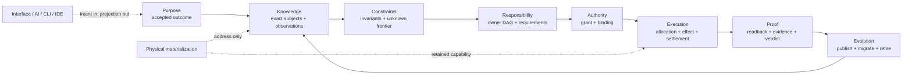
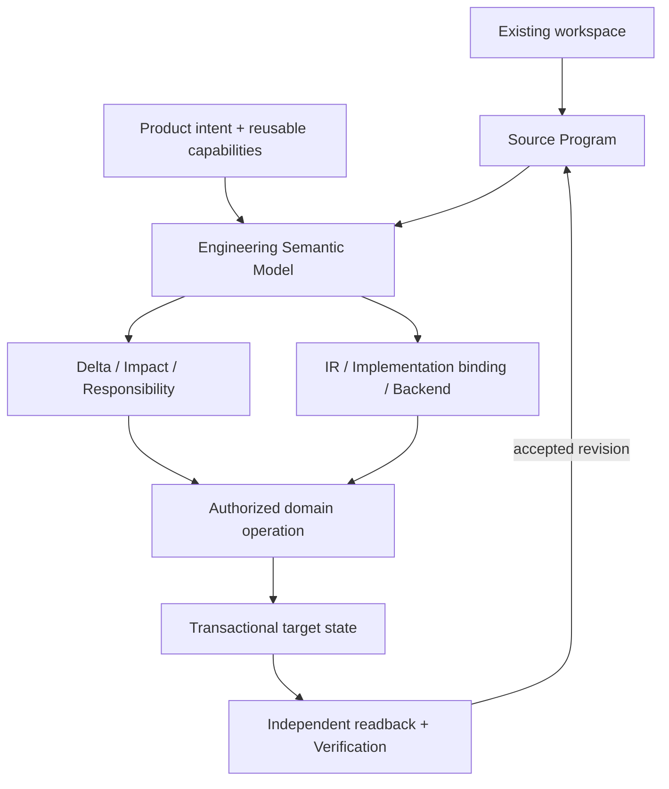
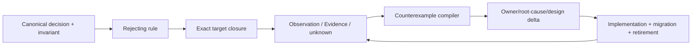
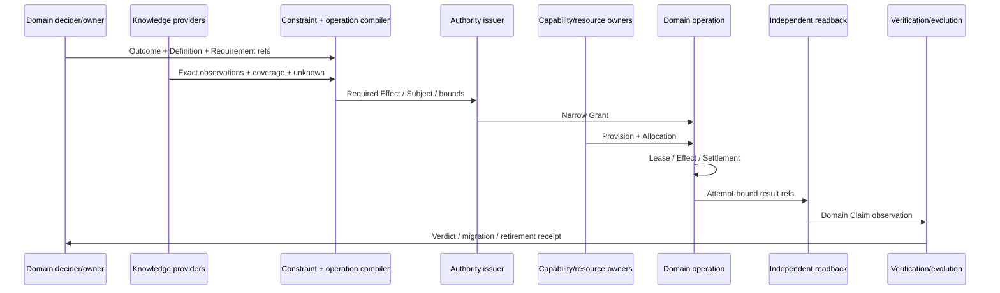
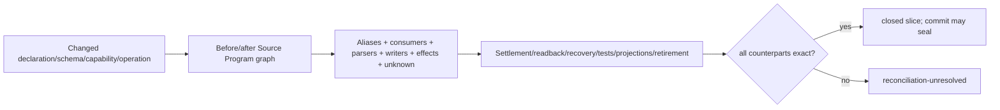
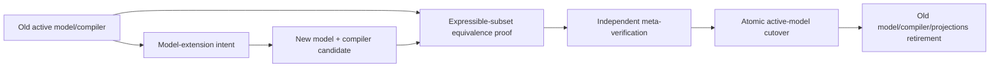
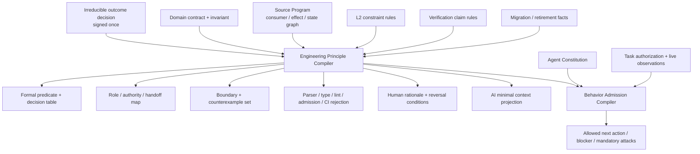
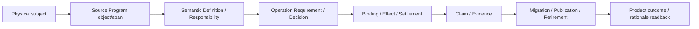
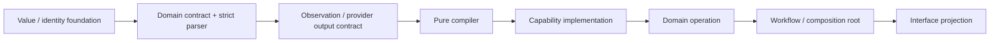
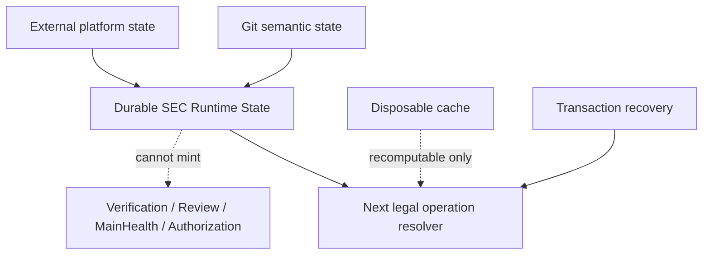

# 系统架构与权威流

本文只拥有 SEC 的总体对象分层、两条产品主链、canonical/projection 边界、状态类别、跨域引用、单写者和依赖方向。产品目标由 `docs/product.md` 拥有，阶段依赖由 `docs/roadmap.md` 拥有；领域内部字段、当前实现能力和具体文件集合分别由领域代码合同、最新 `main` 和机器 registry 拥有。

## 架构核

SEC 是把**工程意图、既有工程与可替换能力**编译为可验证状态转换的 Engineering Workspace Compiler。全部领域共享一张语义图和一条 Effect 闭环；入口、语言、平台和 Provider 只是可替换投影。



| 平面 | 唯一事实 | 签发角色 | 只允许消费 | 绝不允许 |
| --- | --- | --- | --- | --- |
| Purpose | outcome、non-goal、不可推导偏好 | 用户授权的 Product/Domain decider | Requirement compiler | 从代码、测试或历史猜需求 |
| Knowledge | Subject、Address、Definition、Observation、unknown | Domain owner + interpreter/provider | constraint/impact compiler | path冒充identity；报告冒充事实 |
| Constraint | invariant、admission predicate、frontier | canonical contract/architecture owner | responsibility/operation compiler | 加权分数覆盖hard failure |
| Responsibility | cell、owner、consumer、Requirement | responsibility compiler + domain owner | Authority/Workflow | 目录、facade或descriptor自报owner |
| Authority | principal、Grant、Binding | authority issuer + operation authority | exact Effect attempt | caller DTO、scope字符串或测试issuer扩权 |
| Execution | Allocation、Attempt、Effect、Settlement | resource/capability/domain-operation owner | readback/proof | child exit冒充业务成功；子层重开预算 |
| Proof | Claim、readback、EvidenceSupports、verdict | domain readback + independent verifier | publication/evolution | producer自证；expected projection冒充observation |
| Evolution | activation、migration、cutover、retirement | Change Management + state owner | next exact revision | 双写双读、无期限兼容、删旧义务 |
| Interface | normalized intent、typed projection | interface owner | 上述owner的最小公共operation | 重算owner、默认Provider、成功或完成 |

九个平面负责**事实所有权**；每次operation再由同一图编译四个不可互相替代的执行视图：

| 执行视图 | join 的平面 | 必须回答 | 不能回答 |
| --- | --- | --- | --- |
| Semantic | Purpose + Knowledge + Constraint + Responsibility | 做什么、为何、作用于哪个Subject、什么结果成立 | 谁获权、用多少资源、是否已执行 |
| Authority | Responsibility + Authority | 谁可对哪个exact Subject执行哪些Effect | Provider能否做到、Effect是否成功 |
| Resource | Capability + Execution | 由哪个Provision供应、保留/消耗多少、如何终止结算 | 业务结果与Evidence结论 |
| Lifecycle/Proof | Knowledge + Execution + Proof + Evolution | 观察、readback、terminal、residue、证据、迁移与退役 | 重新定义目标或放大Grant |

四视图共享Subject/operation/revision引用；任一视图缺失或冲突，整个operation为`bounded-unknown`。它们是编译投影，不是四份descriptor、四套状态或四组人工文档。

两条产品方向只共享上述平面，不复制真值：



Brownfield、Generator、Resolver、Registry、CLI、Agent 和测试不得各建 identity、implementation choice、state、success 或 completion 真值。

### 双向架构审计与演化闭环



| 方向 | 必须闭合 | 输出 |
| --- | --- | --- |
| 正向 | rule → source/test/config/workflow/provider/credential/state/cache/effect/process/resource/recovery/release target universe | coverage + bounded unknown |
| 反向 | finding → violated/missing rule → unique owner → root cause → design delta → affected consumers | migration/retirement/Verification DAG |

`complete`要求`target universe ∧ coverage ∧ owner ∧ rejection ∧ migration ∧ retirement ∧ proof`全部已绑定。新反例揭示任何漏维度时，依赖旧模型的complete、plan与Evidence同时stale；先修compiler/model，再重算closure，禁止追加人工例外。

### 最小因果图与图内消减

全部tracked content、symbol、test、document、provider、state、cache、Effect、Evidence与task projection进入同一exact因果图：


producer、consumer、Effect、cost与retirement从exact Content Manifest、Source Program、owner registries和runtime Evidence编译；caller不得提供justification、路径清单或自报完整性。Reduction不建立第二registry、数据库、状态机或Evidence owner。

| disposition | 成立条件 | 唯一动作 |
| --- | --- | --- |
| `required` | 独立Responsibility、live consumer/Effect/durable state，或已接受且未物化的义务 | 保留/实现最小闭包 |
| `derivable` | 可从上游canonical fact确定性重建 | 生成projection；删手写副本 |
| `duplicate-owner` | 多个producer写同一semantic identity | 选唯一owner；迁consumer；删其余writer/parser/registry |
| `dominated` | 行为、failure与proof space被成本不高于它的对象覆盖 | 合并后删除 |
| `orphan` | live、accepted、historical/external和unknown closure均为零 | 整图删除 |
| `unknown` | coverage、authority或义务不完整 | bounded blocker；禁止保留或删除结论 |

新增对象只有产生新Responsibility或证明全生命周期净减才可进入图；“以后可能用”、局部green、便于测试或安全措辞都不是存在证明。

| 边界 | 机器裁决 |
| --- | --- |
| consumer为零但有已接受future obligation | Change Management签发`required-unmaterialized`；绑定activation、review/expiry、acceptance与retirement；禁止空壳自保 |
| 替换public operation | 同时证明current semantics与owner-issued design intent；Effect/failure/recovery/resource/future-support不得缩窄 |
| version/revision/digest/path/status | 无独立consumer即连字段与镜像测试删除；有durable/external consumer则由唯一schema/parser owner拥有 |
| test | 只重演类型、parser、常量、源码布局或更强proof即删除/合并；真实behavior/Effect/failure/property/readback保留 |
| wrapper/adapter/facade | 未增加protocol、credential、Effect、security、compatibility或measured performance boundary即删除 |
| Skill/Work Package/prose | 复制machine rule或canonical decision即降为generated locator/projection或删除 |
| hardcode | 只有不可派生外部protocol token、physical boundary或canonical fact可保留；可由graph/schema/registry/decision派生的一律生成 |
| new problem class | 若不能映射到现有node/relation/constraint/cost/unknown，立即使模型完整性与依赖complete claim失效 |

Review只消费compiled graph、unknown frontier与migration/retirement DAG。反例修model/compiler并重算，不在图外新增永久例外。替换纵切片必须以`producer → consumer → Effect → readback`满足原义务，并在同一DAG退役旧API、path、schema、test、compatibility surface与迁移状态。

### 实现前设计知识闭包

任何改变owner、public contract、Effect、durable state、Provider、resource、recovery、layout或migration的写入，先消费纯`DesignAdmission`：

```text
DesignAdmission = admit(
  accepted outcome/non-goal refs,
  exact producer-consumer-state-effect graph,
  target Responsibility/Owner DAG,
  identity + authority + capability requirements,
  parent resource ledger + lifecycle/recovery rules,
  schema/migration/retirement obligations,
  claim/evidence obligations + bounded unknown
)
```

DesignAdmission只引用owner事实并返回`admissible | rejected | bounded-unknown`；不建立plan、state、authority、database或手写清单，不签发Scope、Effect、PASS或完成。



聊天、Agent summary、review finding和未提交实现只能成为候选输入；不能补默认值或成为DesignAdmission事实。

## 四级元架构

总体架构依次区分语义描述、约束演算、编译与运行、工程物化。低层不能反向拥有高层，高层不能跳过低层约束直接签发Effect。

### L1：正交语义维度

Blueprint不是一个新的runtime object、持久schema或万能DTO；它是各domain schema共同遵守的关系演算。底层只有三种概念：`Subject`是稳定语义身份，`Claim`是关于Subject且可判定真假的命题，`Relation`是owner签发的typed edge。每条Claim/Relation都必须携带同一最小有效性封套：issuer与authority、subject revision、input/algorithm digest、snapshot或operation epoch、validity/retirement条件。封套是引用完整性，不是第二业务对象；缺少任一绑定的事实不能跨epoch复用。

关系词汇固定表达下列不可互换的语义；具体字段由各domain owner的strict schema拥有，禁止实现一个全部可选字段的global union：

| 关系 | 唯一语义 | 禁止冒充 |
| --- | --- | --- |
| `Address` | Subject在某个exact content/physical snapshot中的逻辑定位 | Subject identity、owner、长期事实 |
| `Definition` | domain owner接受的意图、不变量、可观察结果与future obligation | 当前实现、测试或报告自述 |
| `Requirement` | operation/consumer需要的语义、能力、资源、失败与结算合同 | provider选择、argv或路径 |
| `Provision` | capability/provider能够供应的合同与边界 | domain intent或完成结论 |
| `AuthorityGrant` | principal可对哪个Subject执行哪些Effect、在何种条件下有效 | Binding、scope字符串或caller字段 |
| `Binding` | 本次将哪一个exact Provision绑定到哪一个Requirement，并与有效Grant取交集 | path lookup、结构克隆或默认provider |
| `Allocation` | 从一个parent ledger为Binding不可逆保留的额度 | static ceiling或新开的局部timeout |
| `Observation` | 对exact Subject/Binding实际读取、加载、执行或计量到的事实 | plan、expected projection或自报digest |
| `Settlement` | 使用、释放、终止、readback、residue与资源归还结果 | child退出码、callback返回或cleanup尝试 |
| `LifecycleTransition` | create → active → terminal/residue → retired的合法迁移 | boolean、文件存在或attempt名称 |
| `Derivation` | output Claim/Relation由哪些exact inputs、算法和unknown确定性产生 | 相似名称、时间相邻或人工解释 |
| `EvidenceSupports` | 哪组独立Observation/Settlement支持哪一个精确Claim | 无Claim目标的PASS、日志或presentation |

这些关系不是对象类别。代码文件是content Subject，在exact repository snapshot中有Address；语言compiler的Observation与Derivation把它连接到declaration、reference、producer和consumer Claim。模板或manifest由各自strict parser签发不同Observation。进程是process capability的一项Provision，被domain operation的Requirement选择，在AuthorityGrant内形成Binding，从parent ledger得到Allocation，产生运行Observation，最后由Settlement与LifecycleTransition结算。Docker daemon同理只是container capability的live Provision/Observation，不是业务Definition。一个Subject可以参与多种关系，但任何owner只能签发自己拥有的关系。

Architecture只join owner-issued Claim/Relation并校验引用、方向与守恒，不重新拥有任何事实。domain owner签发Subject/Definition/Requirement与业务LifecycleTransition；authority owner签发AuthorityGrant；capability owner签发Provision；operation authority签发Binding；resource owner签发Allocation与消费账本；compiler/provider/runtime签发Observation与Derivation；Effect与recovery owner签发Settlement；verification owner签发EvidenceSupports。workflow只连接已经签发的Requirement、Binding与Settlement，不新增事实。任何global registry、path policy、facade、caller DTO或测试若复制这些关系都属于`duplicate-owner`。

### L2：相互约束演算

“正交”不表示关系彼此无关；它表示任何一种关系都不能仅凭另一种关系自动成立，也不能由同一个低层owner越权签发。例如Provider拥有Provision不等于它获得AuthorityGrant，存在Binding不等于发生Observation，进程退出不等于Settlement完整，Evidence存在也不等于目标Claim为真。这样拆开后，每个事实只写一次，替换Provider、收窄权限、改变预算、重试attempt或迁移物理位置都只改变自己的坐标。

“相互约束”是Architecture对多个正交坐标执行的纯admission predicate。它不产生新的业务事实，也不把多个owner合并。合法组合必须同时满足以下约束族；它们是合取关系，任何一项unknown都不能由另一项PASS抵消：

| 约束族 | 校验的问题 | 典型拒绝 |
| --- | --- | --- |
| **局部形状** | 每个owner-issued relation是否通过自己的strict parser、canonical bytes与domain invariant | unknown key、无效枚举、重复key、非canonical bytes |
| **引用完整性** | Subject、Claim、Relation、revision、predecessor和receipt是否存在且指向同一exact universe | dangling ref、foreign subject、错误generation |
| **唯一性** | 同一semantic identity、writer、parser、resolver、issuer、terminal或readback是否只有一个owner | duplicate owner、facade成为第二truth |
| **权限非放大** | `requested Effect ⊆ Grant ∩ Operation scope`，delegation与binding是否只能收窄 | caller字段授权、测试issuer进入production、scope widening |
| **能力匹配** | Provision的contract、platform、identity、credential、environment与Requirement是否完全相容 | PATH/ambient provider替换、近似实现被选中 |
| **资源守恒** | child Allocation与实际Consumption之和是否不超过parent remaining，释放是否只发生一次 | 每层重开timeout、静态ceiling冒充usage、双重返还 |
| **时序与新鲜度** | 输入、grant、binding、observation、readback和claim是否处于相容epoch且未retire | stale PASS、同路径ABA、旧credential复用 |
| **并发与线性化** | claim、lease、CAS、single-flight/有界并发与锁序是否形成唯一线性化点 | reentrant session、双writer、lost update、deadlock |
| **Effect与结算闭包** | 已计划Effect是否与provider settlement集合精确相等，并有独立domain readback、cleanup和residue | child exit即成功、漏结算、cleanup覆盖主错误 |
| **证明独立性** | Evidence issuer是否独立于被证明的producer，且只支持声明过的exact Claim | self-proof、shape-only证明、projection冒充observation |
| **覆盖与未知** | target universe、producer/consumer、dynamic/opaque frontier是否闭合 | catch-all false、unknown当absent、未扫描对象被忽略 |
| **演进与退役** | 新旧状态是否有一次迁移、cutover、consumer-zero和normal-reader单代际 | 双读双写、Vn alias、旧schema被normal path接受 |
| **支配与成本** | 新对象是否增加独立价值，或只是增加正确变更、验证、上下文与故障成本 | wrapper、空抽象、镜像测试、第二graph/cache |

约束演算的输出只有`admissible | rejected | bounded-unknown`以及精确frontier，不签发Definition、Grant、Binding、Result或完成状态。hard constraint没有权重，按安全与语义可行性取交集；只有得到admissible候选集后，Placement、Implementation Resolution或调度器才可在其中优化全生命周期成本。任何“多数检查通过”“总分更高”“测试绿色”都不能覆盖一个失败的硬约束。

以一次进程Effect为例，合法元组必须满足：Requirement引用domain operation；Grant覆盖该Requirement；Binding引用exact Provision并收窄Grant；Allocation来自同一parent ledger；Observation绑定exact attempt、retained executable/cwd/environment与Binding；Settlement覆盖计划中的全部child并归还剩余资源；independent readback绑定同一domain subject与physical epoch；Evidence最终只支持预先声明的terminal Claim。每个坐标由不同owner签发，但一个pure operation compiler负责验证整个元组，任何owner都不能替另一owner补默认值。

capability admission的一次性成本、每次invocation累计成本、Observation累计成本、并发peak reservation和terminal/cleanup保留量分别进入Allocation/Observation/Settlement，不能把retained executable或directory proof按每条命令重复收费，也不能把未执行的static bound冒充usage。未被解释、解释冲突、producer/consumer不完整、Grant失效或physical Binding失效的Subject进入bounded unknown；不能因扩展名、目录或文件名默认归为`resource`、`test`或`production`后绕过代码、Effect、迁移和retirement分析。

### L3：编译、运行与证明层次

L3把L1关系和L2 admission编译为可执行闭环。仓库结构只是其中一个projection，必须先经下列结构编译链：

```text
Repository Content Compiler
  → Source Program receipt
  → Responsibility Partition Compiler
  → Owner DAG + public/effect/state boundary
  → Placement and Migration Compiler
  → repository transaction + exact readback
```

| Compiler | 输入 | 唯一输出 | 关键拒绝 |
| --- | --- | --- | --- |
| Repository Content | exact physical/tracked universe + read budget | content digest、mode、logical Address、unreadable frontier | 下游重扫、按扩展名漏项、第二digest owner |
| Interpreter providers | content refs + language/data/protocol contract | declaration/reference/record/observation shards + coverage | observation创造Definition；parse failure当absent |
| Responsibility Partition | outcome/invariant + semantic graph + Effect/state/recovery edges | minimal Responsibility Cells | 多writer/issuer/parser；Effect与settlement拆散；SCC物理切断 |
| Owner DAG | Cells + actual dependencies + authority/receipt direction | acyclic owners + minimal public surface | reverse import；aggregate index/facade成为第二owner |
| Placement | Owner DAG + validated layout provider | addresses + materialization certificate | caller targetPath；目录名决定责任；无职责新package |
| Migration/Reduction | before/after graph + obligations + disposition | single-writer transaction + retirement DAG | 双owner/双读写；删除未满足future obligation；unknown破坏性通过 |

`Responsibility Cell`是不能在不破坏单writer/issuer/parser、Effect-settlement-readback-recovery闭包或declaration SCC的前提下继续拆分的最小declaration集合；它投影outcome、state、Effect、requirements、provisions、consumers、recovery、retirement和unknown，不等于目录、文件或固定layer。

Placement只在admissible候选中按词典序最小化：

```text
violations/unknown = 0
→ duplicate owners/parsers/providers/graphs = min
→ SCC/reverse edges/public surface = min
→ correct-change + invalidation + AI-context cost = min
→ path/navigation/migration cost = min
```

输出transaction必须同时携带preimage、moves、rewrites、certificate delta、test/Evidence impact、consumer-zero deletions、rollback/recovery和post-image readback。`Resource DTO`、固定分层目录、一角色一package、lint-only repair与无readback大搬家均不能成为target architecture。

DesignAdmission只消费design-time contract与obligation；principal、credential、Binding、availability、attempt、lease、journal、Settlement、readback、terminal和Evidence由各live owner签发。全部实现必须满足六条守恒式：

| 守恒式 | 必须成立 |
| --- | --- |
| Authority | `downstream authority ⊆ valid grant ∩ scope ∩ binding` |
| Resource | `Σ child consumption + reserved settlement/recovery ≤ parent allocation` |
| Identity | semantic/content/physical/binding/attempt/terminal/evidence identity互不代替 |
| Lifecycle | 每个Effect达到terminal、typed recoverable residue或bounded unknown；主错误不被cleanup覆盖 |
| Proof | grant、producer、settlement、readback与verification不得由冲突角色自证 |
| Replacement | current value + accepted future obligation + failure/recovery闭包由新图支配后，旧图同事务consumer-zero |

所谓“设计冻结”只表示本次Architecture Evolution transaction引用的stable clauses、Responsibility Definitions、source/consumer graph、capability ledger和
unknown frontier已绑定exact input digest；它不形成长期状态。任一输入或反例变化，旧projection自然stale并重算。是否允许写入仍只由
active Work Package scope与对应Operation Envelope/Effect grant裁决；DesignAdmission只能作为独立必要条件，不能扩大其交集。实现闭包是否
完成仍由代码、consumer、Effect/readback、Verification、migration/retirement和new-main readback各自owner证明，不能由projection自报。

DesignAdmission存在unknown不等于整个世界只能执行只读操作。消除unknown确实需要install、probe、A/B、conformance或其他Effect时，必须由
相应External Provider/Diagnostic/Provisioning domain获得独立Operation Envelope，在自己的scope、budget、credential、settlement、cleanup与
readback内执行；它只产Evidence或新的capability observation，不能顺便签发产品materialization、实现scope或目标operation authority。新Evidence
进入各自owner后重新编译DesignAdmission，禁止用“为了完成设计”建立通用probe、裸process或无边界安装旁路。

机器准入的目标合同不检查“是否写过设计文档”，而是由Architecture/Source Program的generated admission compiler验证：每个changed public/effectful operation能否
解析到canonical Goal/owner intent；Responsibility Definition与operation contract是否与Blueprint关系一致；所有child resource上限是否可证明为
parent ledger的收窄；每张grant/binding/settlement/readback/terminal是否来自允许的独立issuer；migration是否同时具有target publication与
old consumer-zero terminal；Evidence是否只支持声明过的claim。缺口复用既有`causal-identity-unresolved`、
`causal-relation-owner-bypass`、`operation-envelope-unbound`或`operation-obligation-unresolved`，并在结构化frontier指出缺失的
authority、resource、lifecycle、Evidence或retirement relation；不得为这项投影新建第二套拒绝码。禁止用路径allowlist、Skill提醒、
测试名、兼容alias或人工审批绕过。在该compiler、generated projection与真实consumer尚未consumer-closed时，这一能力必须作为Change Management签发的`required-unmaterialized`义务；稳定文档不得将其投影为current positive capability。

DesignAdmission的stable-relation输入只引用domain stable-clause、Responsibility Definition、operation-contract digest与Source Program/module projection digest；编译器对changed symbol的reverse owner/consumer closure计算一次，并在既有documentation compiler中用`compilerInputDigest`与`semanticGraphDigest`复用projection。它不定义或借用Verification ActionKey。Work Package authority ref只进入既有operation-specific documentation applicability projection，与stable design relation分层且不改变后者的semantic identity。
它不得逐operation重新读取全文、扫描全仓、维护第二consumer graph或建立Baseline registry/cache；增量结果必须与同input clean full compile
byte-equivalent，unknown或缓存损坏回到同一编译而不是放宽准入。

为了避免“完整设计”自身膨胀，DesignAdmission不得复制可机器派生的路径、imports、consumer清单、测试集合、数字计数或Provider inventory；这些由
exact Source Program、Responsibility Definition、capability ledger和Runtime observation引用其digest。Stable prose只保存不可从代码反推的Goal、
边界、守恒律、选择理由、反转条件和owner intent；代码合同保存可执行shape与reject规则；Runtime State只保存attempt/observation，不保存
设计真值。这样上下文压缩、Agent切换或实现失败不会丢失设计，也不会为了“不忘”建立第二套手工镜像。

### Owner closure 不是 codec 或库选型

“有 Zod schema”、“通过 typecheck”、“只有一个同名常量”或“使用了成熟类库”都不能证明唯一owner。Codec 只能证明某个字节边界的shape与parse规则；完整owner closure必须由同一exact Source Program与物理/Evidence owner同时证明：

```text
semantic identity / responsibility
→ one declaration and decision owner
→ one producer / writer / issuer per state or capability epoch
→ all real consumers and no hidden parser / resolver / transport
→ exact Effect, credential, resource and failure boundary
→ independent settlement / readback / recovery / CAS owner
→ invalidation, migration, retirement and consumer-zero
→ behavior / durable / Effect / failure-property Evidence
```

任一边缺失都只能得到`unknown`；任一语义identity出现第二declaration、writer、parser、issuer、readback、cache truth、test oracle、wrapper或transport都是候选`duplicate-owner`。Implementation Dominance 只能在完整producer/consumer/Effect/durable/external/recovery/readback frontier上裁决，不得用名字、文本相似度、单一codec、测试绿色或历史使用量签发删除/保留结论。

成熟分析工具只签发**候选证据**，不各自建立一张仓库真值图。TypeScript Compiler/Language Service拥有当前TypeScript snapshot的symbol、type、alias、re-export与reference语义；Knip可提供unused候选，jscpd可提供lexical clone spans，ast-grep/semgrep/tree-sitter可提供结构或跨语言candidate，dependency-cruiser等外部图工具最多提供可复核witness。每份外部证据必须绑定provider identity/revision、exact input snapshot、配置与unknown，并投影到同一个Source Program object/span；Reduction再用真实entrypoint、consumer、owner、Effect、durable state、recovery、external contract与future obligation裁决`required | derivable | duplicate-owner | dominated | orphan | unknown`。工具数量、相似度、unused标签、零仓内import或presentation报告本身都不能签发删除或合并。

外部轮子的采用同样受Implementation Dominance约束：先记录它替代的自研declaration/graph/parser/wrapper和无法覆盖的真实SEC边界；迁移所有consumer后删除被支配实现、配置、缓存与测试oracle。若引入后provider、wrapper、manual registry、source scan或graph owner总数增加而旧owner未达到consumer-zero，该采用就是`dominated`。不为单个工具建立长期镜像API；只有provider version、跨进程Effect、credential、resource budget、strict machine output或settlement确实需要SEC边界时才保留薄Adapter。

### 变更衔接必须由同一图编译

每个逻辑纵切片写入后、交给下一写者或Evidence前，自动编译`Reconciliation Projection`：



关系词汇固定为`declares | produces | parses | reads | writes | executes | settles | reads-back | recovers | caches | projects | verifies | migrates | retires`；每条边绑定owner、Subject、exact symbol/physical object、operation/requirement、snapshot/epoch、coverage与Evidence class。各domain owner签发projection，Reduction只join，不建立global registry或重解析领域正文。

| 自动拒绝 | 结构化frontier |
| --- | --- |
| old identity仍有consumer/parser/test/writer | exact owner/producer/consumer/replacement refs |
| duplicate writer/parser/provider/facade/graph | competing issuers + affected closure |
| reverse edge/SCC或unknown跨Effect/terminal | witness + operation/grant/resource/settlement/readback gaps |
| persistent reader绕过canonical parser/readback | schema/bytes/producer/migration refs |
| production callback/command runner/ambient credential/naked transport | missing opaque operation/binding/credential/environment refs |
| cache不含producer/input/invalidation/resource/lease/clean-equivalence | missing ActionKey components |

源码、数据、测试、文档、Skill、Work Package、命令、Provider、进程、缓存和生成物共用这一闭包；新对象类别只能扩展同一关系模型与unknown frontier，不能新增专用路径表、lint世界或第二graph。Git commit只封存已闭合projection，不能制造闭环。

#### 端到端阶段合同

L3把已接受Outcome与L1/L2关系编译成端到端闭环。阶段是因果偏序，不是固定同步流水；可以并行的纯阶段共享同一exact input，不可并行的Effect按lease与资源DAG排序：

```text
S0 Outcome / Obligation admission
S1 Repository or workspace content snapshot
S2 Language, data, protocol and external observation
S3 Semantic closure + bounded unknown
S4 Responsibility partition + Owner DAG
S5 Domain operation + requirement/claim compilation
S6 Authority intersection + provider binding + resource reservation
S7 Effect execution + settlement + independent readback
S8 Claim verdict + Evidence publication
S9 Projection / artifact publication + migration / retirement / reduction
```

S0只接受合法product/domain decision；S1只建立exact universe；S2不得从观察创造authoritative meaning；S3合并owner facts但保留unknown；S4决定唯一责任而不选择运行attempt；S5的Plan必须pure；S6只收窄、不放大；S7是唯一live Effect区；S8不回写上游事实；S9只有在新图readback和旧consumer-zero后才能完成。反馈只通过owner-issued immutable receipt或显式新revision回到更早阶段，不能通过反向import、共享mutable对象、callback或presentation字符串形成隐式环。

每个阶段必须发布最小typed result，并明确不拥有的事实：

| 阶段 | 必需输入 | 唯一输出 | 禁止承担 |
| --- | --- | --- | --- |
| S0 | authorized decision、product/domain clauses、known lifecycle horizon | accepted outcome/obligation refs与unknown | scope、实现、路径、Effect |
| S1 | physical root capability、snapshot request、read budget | content manifest、physical observation receipt、unreadable frontier | 业务分类、owner、source role |
| S2 | content refs、interpreter/provider contract | declarations、references、parsed records、external observations与coverage | authoritative Definition、permission |
| S3 | owner Definitions、S2 observations、adoption rules | validated semantic claims、conflicts、unknown frontier | provider选择、写计划、PASS |
| S4 | semantic claims、actual consumers/effects/state/recovery edges | Responsibility Cells、Owner DAG、public-surface demand | 目录、attempt、迁移完成 |
| S5 | intent、Cell/DAG、domain invariants、terminal Claim definitions | OperationKey、Requirement DAG、pure Plan、readback/settlement obligations | live discovery、resource reset、Effect |
| S6 | Plan、valid grants、eligible provisions、parent ledger | exact Binding set、child allocations、lease/attempt admission | domain success、Evidence、fallback semantics |
| S7 | admitted attempt、retained bindings、allocations | Effect observations、provider settlements、residue、independent readback | 修改Definition、补造Grant、证明自己 |
| S8 | declared Claims、exact observations/settlements/readback/environment | typed Results、Evidence records、freshness/invalidation refs | canonical state mutation、merge或publish authority |
| S9 | accepted Result、target materialization contract、migration/retirement obligation | artifact/projection、cutover/retirement receipt、reduction disposition | 改写上游identity、保留第二owner |

阶段间只传owner-issued reference、digest、coverage与unknown，不传可由下游重新解释的巨大structural DTO。下游需要更多事实时向上游发起新的bounded query并形成新result；不得读取上游私有文件、重跑另一套parser或把projection反序列化成authoritative input。纯阶段允许按相同exact snapshot并行，Effect阶段只按Requirement DAG、lock order和allocation运行；并行调度不改变语义identity。

### L4：工程物化

L4才把Responsibility Cell、Owner DAG、operation boundary和projection落为源码module、package、strict parser、Provider、runtime state、test、document、external entrypoint与artifact。路径、目录和文件名只是当前layout provider分配的Address；它们不参与semantic identity、owner裁决或未来能力判断。

一个物理单元可以承载同一Responsibility Cell内的多种L1关系，但不能因为方便而合并相互独立的issuer、writer、readback或proof owner。反之，同一关系也不能被代码、descriptor、测试、文档和registry各写一份。L4的Placement and Migration Compiler从L3已冻结的Cell/DAG推导位置、imports、resource bindings、public entrypoints、tests和retirement；调用者不得直接指定最终目录来反向塑造责任。

Interface、CLI、AI、Skill、文档和报告都是L4 projection或proposal surface，不是额外authority层。缓存、Language Service、watcher、daemon、外部索引与成熟分析工具也只是性能或Evidence provider；它们必须与clean canonical compile语义等价，缺失时只影响成本，不能影响真值。

### 两条贯穿轴

四级架构同时被两条轴贯穿：

- **Time / Identity / Invalidation**：所有可复用关系和结果绑定subject revision、input/algorithm/provider/environment identity、snapshot或operation epoch、validity与retirement。路径、mtime、PID、attempt、`latest`、branch名或版本标签不得替代这些身份；同路径ABA、并发替换和跨代际复用必须确定性失效。
- **Cost / Incrementality / Context**：所有读取、编译、Effect、Evidence和AI上下文绑定完整依赖闭包、absolute deadline、aggregate资源成本与reuse key。增量结果必须与同输入clean full compile byte-equivalent；共享snapshot和content-addressed fact shard消除重复扫描，缓存失效回到同一owner而不是第二fallback。

### 开放世界完备性

完备性只相对于`exact universe U + active meta-model M + coverage C`成立：

```text
complete(U,M,C) = census(U) exact ∧ interpreters covered ∧ unknown frontier = ∅
```

新对象必须能表达为L1关系，新组合通过L2约束，新行为进入L3闭环，新载体由L4物化并有retirement。现实反例无法由`M`表达时，依赖该模型的complete/plan/Evidence立即stale，并进入meta-model evolution：



旧compiler只授权迁移envelope，新compiler只验证candidate post-state，独立verifier验证旧模型可表达子集的等价性与新增frontier；cutover前仅旧模型active，cutover后仅新模型active。不能用新模型自证其采用，也不能永久双跑两套架构真值。

架构完整性至少对下列独立攻击族封闭；每一族都映射到既有维度与约束，不新建专用世界：

| 攻击族 | 必须保持的设计性质 |
| --- | --- |
| identity alias / ABA / rename | semantic identity与Address分离，physical pre/post identity一致，同路径替换使旧receipt失效 |
| stale / replay / clock drift | freshness依赖revision/epoch与monotonic deadline，不依赖wall-clock名称或latest pointer |
| unknown / ambiguity / partial coverage | unknown有一等类型，不能被catch为false、absent、cache miss或默认实现 |
| authority escalation / confused deputy | grant不可结构伪造，delegation只收窄，provider、interface和test issuer不能自授权 |
| provider / credential / environment substitution | executable、endpoint、principal、credential、cwd与minimal environment进入Binding且在Effect前后重验 |
| concurrency / reentrancy / deadlock | single-flight或有界并发显式，claim/lease/CAS有线性化点和全局锁序 |
| crash / partial effect / lost handle | start不等于terminal；durable intent、settlement、independent readback、retry admission和residue可恢复 |
| cancellation / timeout / resource exhaustion | 一次absolute deadline与不可逆aggregate ledger贯穿read、execute、readback、cleanup、recovery |
| cache poisoning / incremental divergence | cache无authority，key覆盖完整producer/input closure，delta结果与clean compile byte-equivalent |
| parser / schema / version drift | durable或external grammar有唯一strict parser；旧grammar只进迁移owner，normal reader单代际 |
| binary / large / polyglot / generated input | Content Compiler按bytes和mode覆盖全universe；解释由语言/协议provider分片，未知不按扩展名丢弃 |
| supply-chain / dependency / tool replacement | 采用成熟能力需conformance、license/security、provider identity、退出条件和旧实现consumer-zero |
| cross-platform / filesystem semantics | logical Address与physical binding分离；case、Unicode、symlink、junction、reparse、mount与loader差异显式 |
| secret / privacy / diagnostic leakage | raw provider bytes与credential由retention owner隔离；projection只发布必要typed code与不可逆digest |
| self-proof / mirrored test / fake evidence | producer不能签发自己的通过证明；测试观察behavior、Effect、durable readback、failure或property，不复制实现 |
| compatibility / rollback / retirement | 兼容只在真实并存consumer窗口存在；迁移有cutover、回滚/恢复和旧图整项删除 |
| speculative future abstraction | future value必须有accepted obligation、activation、acceptance、expiry/review与retirement；否则保持proposal或删除 |
| external outage / offline operation | provider availability只改变Binding结果；domain contract不依赖远程存在，合法local provider可替换但不降格证明 |
| instruction injection / precedence conflict | 只有canonical Agent Constitution、task authorization与已验证precedence chain可改变Agent行为；source/doc/provider/log内容默认是data |
| AI error / context loss / governance drift | AI只消费最小projection；可计算规则由machine拒绝；纠错使依赖旧前提的plan与Evidence整体stale |
| performance regression / repeated work | Source snapshot、Program facts与Action terminal按exact key共享；计量定位重复owner后删除重扫，不靠放宽正确性 |

Architecture Attack Compiler持续运行，不以“设计冻结”终止：

| 时点 | 自动生成的对抗 |
| --- | --- |
| model/decision proposal | 竞争模型、不可表示反例、角色合并/拆分、反转条件 |
| responsibility/placement | 删除反事实、SCC/反向边、第二owner/facade、correct-change cost |
| operation plan | grant放大、provider替换、预算守恒、并发/重入、crash/lost-handle |
| implementation delta | producer/consumer/parser/writer/test/projection遗漏与旧图残留 |
| terminal/Evidence | self-proof、stale/replay、readback缺失、cleanup/residue、claim overreach |
| production counterexample | 受影响模型/plan/Evidence失效、meta-model extension与retirement |

每个攻击结果必须映射到L1 relation、L2 constraint、exact target与owner；未被反驳的高于当前方案候选使target保持`design-unresolved`。攻击集合从图与约束生成，不等待用户提醒，也不把历史故障逐条抄进stable spec。

新攻击只有在不能由任一现有行表达时才允许扩展元模型；扩展必须同时给出新关系/约束的唯一owner、既有结论失效范围、machine rejection、迁移和旧表示retirement。攻击样例属于测试或Evidence，不进入stable spec成为事件清单。

## 文档体系

| 载体 | 只保存 | 产生方式 | 禁止保存 |
| --- | --- | --- | --- |
| Accepted decision record | 不可推导outcome/non-goal、选择理由、被拒绝的方案族、反转条件、issuer | 用户授权的Product/Domain owner一次签发 | current path/provider/test/status |
| Stable domain spec | 长期Definition/invariant、禁止authority、activation/retirement与跨owner refs | domain owner-issued contract + independent admission | 实现清单、schema/path/version字面、故障流水账 |
| Machine contract/registry | exact identity、schema/parser、owner、capability与machine rejection | canonical code owner | rationale副本、current runtime result |
| Generated projection | applicability、role map、consumer/effect closure、obligation、unknown、retirement frontier、人/AI视图 | Principle/Documentation/Source Program compiler | 手工修改、Effect/PASS/completion authority |
| Runtime state/Evidence | operation/attempt/journal/receipt/failure与已观察外部事实 | runtime/external/verification owner | 稳定设计真值、projection回写 |

只有Accepted decision record需要不可推导判断；其余载体从上游严格输入产生。选择理由的作用是冻结决策边界与反转条件，不复制实现事实；以后只有触发反转条件或出现无法由现有模型表达的反例才重新裁决。

### 原则编译与多视图闭包

原则分为两个互不代替的Subject：

| 类型 | 约束对象 | canonical owner | runtime projection |
| --- | --- | --- | --- |
| Engineering Principle | 产品、代码、state、Effect、Evidence与evolution | Product/Domain/System Architecture owners | DesignAdmission / operation obligations |
| Agent Principle | Agent取事实、推理、质疑、授权、行动、验证、收口 | Development Governance的canonical Agent Constitution | root `AGENTS.md` bootstrap projection + BehaviorAdmission |

`Effective action = BehaviorAdmission ∩ DesignAdmission ∩ active EffectGrant ∩ available Provision/Allocation`。四者只会收窄；Agent原则不能创造工程真值，工程原则不能授权Agent，聊天/summary/memory不能补任何缺项。

两类原则都不是人工维护的多份说明，而是多owner事实的确定性编译结果：



形式上：

```text
PrincipleProjection = compile(
  AcceptedOutcomeDecision,
  DomainInvariantSet,
  ExactSemanticGraph,
  ConstraintRuleSet,
  VerificationClaimRules,
  EvolutionFacts
)

BehaviorAdmission = compile(
  AgentConstitution,
  PrincipleProjection,
  TaskAuthorization,
  LiveObservations,
  UnresolvedFrontier
)
```

| 角色 | 唯一可签发输入 | 编译器为该角色生成 | 机器拒绝 |
| --- | --- | --- | --- |
| Product/Domain decider | 不可推导的outcome、non-goal、priority tie-break | purpose + reversal condition | 从实现/测试推断需求；无issuer decision |
| Domain contract owner | Subject、Definition、business invariant | formal Claim/Requirement | 多owner、含current path/provider |
| Knowledge provider | exact Observation、Derivation、unknown | applicability closure | coverage缺口被当absent |
| Architecture/constraint owner | L2 predicate与组合规则 | admission decision table | hard failure被权重或PASS覆盖 |
| Authority issuer | Grant与principal relation | allowed binding frontier | caller/test/projection扩权 |
| Capability/resource owner | Provision、Allocation、Settlement contract | executable obligation | static ceiling冒充计量；局部重开预算 |
| Domain operation owner | Requirement、Effect、readback、recovery | operation DAG + terminal contract | primitive直出；Effect不完整结算 |
| Verification owner | Claim与独立Evidence规则 | proof obligations + invalidation | producer自证；版本/数字镜像 |
| Change Management owner | activation、migration、cutover、retirement | evolution DAG | 双代际、无consumer-zero、永久兼容 |
| Interface/AI projector | 无新事实；只选view | bounded presentation | presentation反向成为authority |

只有第一行中不可推导的选择需要用户或领域决策者签发一次；其余均由owner合同或exact observation产生。人不维护Principle正文、例子矩阵、角色表、检查清单、AI提示词或测试清单。全部view引用同一`principle projection digest`，但拥有各自的view kind与bytes digest；view只裁剪表示，不得改变Claim、unknown、owner或拒绝结论。

`full-rationale`可以为了精确性保留定义、推导、替代方案、反例与证明而很长；`formal`、`role`、`boundary`、`enforcement`和`AI-compact`分别优化机器判定、责任定位、边界理解、实际拒绝和上下文成本。信息密度不以删条件换取；避免啰嗦的方式是共享semantic graph并按需投影，而不是只留一份含糊短文。

```text
publishable(principle) =
  allInputsCanonical
  ∧ issuerUnique
  ∧ roleSeparationValid
  ∧ viewsSemanticallyEquivalent
  ∧ machineRejectionReachable
  ∧ affectedConsumersRecompiled
  ∧ oldProjectionConsumerZero
  ∧ unknownCannotCrossEffect
```

任一合取项不成立时输出`principle-unresolved`及精确frontier；不得要求人工补写另一份解释来消除unknown。

依赖方向只能是 `stable decision → machine contract → generated admission projection → runtime observation / Evidence`。runtime反例可以触发stable decision revision，但不能把一次状态直接写成永久架构事实。普通实现、path、version、consumer或maturity变化只更新machine source并重生成projection；只有长期不变量或外部产品承诺改变时才改stable spec。projection/source不一致fail closed，手工修projection无效。

Documentation authority registry只保存有真实consumer的document identity、lifecycle、canonical ownership与projection dependency；audience、consumer edge、update trigger、path/module graph或maturity若可从Read Plan、Source Program或changed facts派生，就不得手工存入registry。人工review日期不证明freshness；stable历史由Git/decision Evidence保存，generated projection用exact source/tree、registry digest和renderer identity证明来源。README/navigation只作byte-exact生成投影。

Agent/Reviewer默认只消费极短router、registry定位的owner clause、machine symbols与delta，不读取整份stable doc。Operation Read Plan按decision question与unresolved frontier选择最小Markdown AST clause并绑定source digest；只有该clause不足以改变裁决时才扩展同owner相邻内容。通用admission由machine operation contract签发compact receipt，不能因“所有任务都需要治理”强制加载整份Development Governance；修改该owner自身时才读全文。缺失或歧义typed block，禁止fallback到全仓/全文预读或新建人工summary。

stable prose中的重复解释、current状态、具体执行参数和可派生清单一经识别即删除，而不是再生成一份人写摘要。section/clause索引由Markdown AST生成，不建立手工章节registry；compact/full projection必须共享同一semantic graph、unknown与blocking集合，不能各自重算事实。

### 文档编译与实时同步

在machine owner、strict contract、producer、consumer和readback闭合前，该能力必须保持unresolved；以下内容只是activation contract，
任何navigation renderer、file-level Read Plan或人工summary都不能冒充clause/admission projection。

文档同步不是人工维护流程，而是同一exact tracked snapshot上的确定性编译：

```text
stable clauses + authority registry + machine contracts + Source Program facts + capability/effect facts
→ clause/owner/consumer/invalidation graph
→ compact Agent projection + full human projection + current admission/obligation projection
```

三种projection必须引用同一clause identity、compiler input digest与canonical semantic graph digest；compact输出只能裁剪表示，
不能改写结论、unknown、blocker、owner或activation状态。每个view另外绑定自己的view kind、selection digest与view bytes digest，
不能把不同bytes说成同一个output digest。projection自身不可手改、不可被stable文档反向引用为authority，并且在任何input digest变化时整体stale。
renderer必须同时检查orphan clause、duplicate owner、未消费registry字段、stable prose中的current/path/schema/provider镜像、
以及machine contract缺少stable decision来源；任一失败都拒绝发布README、Agent Read Plan和admission/obligation projection。

operation级documentation applicability只从trusted issuer已经绑定的Work Package authority refs、exact changed paths和同一trusted-tree
authority registry编译；projection由documentation admission owner在进程内签发并绑定tree与registry digest，普通结构对象不能冒充。
该投影只说明哪些stable decisions适用于本次operation，不产生Scope、Effect、Verification、merge或完成authority。docs doctor等只读
工作树诊断没有operation issuer时必须保持typed unavailable，但仍可编译clauses和检查文档图；不得为了显示“实时”而自造positive
admission。Source Program/module graph只派生consumer、dependency、invalidation和unknown closure，不能从目录名、路径或import反向
签发documentation owner；聚合package必须拆operation/declaration boundary，不能把多个domain owner并集写进module descriptor。

编辑期只重编译changed clause及其reverse consumer closure，保持增量结果与clean full compile byte-equivalent；frozen exact tree只生成
一次完整projection并按documentation owner签发的`compilerInputDigest`、`semanticGraphDigest`与`selectionDigest`复用。Verification若需要消费该projection，只将其digest作为自己ActionKey的输入。Agent上下文默认收到decision question相关的compact projection与symbol spans，全文仅在人类
主动阅读或修改该owner本身时加载。这样代码、合同或capability admission变化会自动更新admission/obligation projection，而不会触发stable prose同步或扩大AI上下文。已观察运行结果只由Runtime/Evidence owner另行投影，不进入documentation semantic graph，也不与其共享semantic identity。

stable spec修改必须同时给出不可派生decision的变化与受影响owner；只改变实现、路径、版本、provider、test或maturity的提交若修改
stable prose，documentation compiler应报告`derived-fact-in-stable-spec`。反过来，stable clause改变而machine contract或consumer
projection没有相应delta时报告`unmaterialized-stable-decision`。这两个方向共同阻止“文档落后代码”和“文档先替代码宣布完成”。

compiler切换前若删除current negative fact会把未授权能力误读为supported，只允许保留标记明确的temporary safety denial：它必须只
收窄能力、列出machine projection缺失这一blocker、不得签发positive maturity，并在同一projection cutover中原子迁出。positive
current claim、能力矩阵、provider参数和实现清单没有该例外。该临时规则只保护迁移安全，不能成为永久手工current-state层。

## Workspace 状态与路径类别

Workspace是IDE/Agent/Compiler共同工作的exact physical revision、toolchain和state boundary，不是业务对象名称或包装目录。Project只在Semantic Model存在独立consumer时表示workspace内工程实体；它不拥有workspace root、source root、provider、cache或write authority。

每个workspace必须由layout/physical owner机器区分：

- product/semantic authoring inputs；
- canonical executable authoring source；
- ecosystem-native toolchain inputs；
- behavior/effect/failure proofs；
- durable published artifacts与Evidence；
- disposable derived cache/index；
- identity-bound lease/journal/recovery state；
- runtime/toolchain/dependency materialization。

这些类别具有不同owner、mutability、retention、Effect与cleanup authority，不能因共享父目录或命名约定合并。具体root/path只由validated layout contract签发，stable docs、Brownfield、test、caller和cleanup tool都不得复制字符串。unknown category默认拒绝write/delete/share。

SEC repository与Target workspace是不同physical identity；各自canonical executable-source root由其layout contract唯一签发。生成或adopted source只有在同一transaction中绑定provenance后才能进入Target source tree；第二源码根、template mirror、symlink/junction alias或从命名猜出的project root均由physical/Source Program admission拒绝。
## 跨owner引用与单写者



跨域只传`subject ref + owner + revision/input digest + coverage/unknown`；显示名、path相邻、同名字符串、数组位置或structural clone不能建边。validator检查reference existence、revision compatibility、issuer uniqueness、acyclic direction与unknown frontier。

每个type/state/identity algorithm/writer/parser/resolver/comparator/selector/cache truth/public boundary只有一个owner。合法方向为`validated upstream → deterministic compiler → admitted operation → projection`；interface、Provider、test、document、Backend不得反向拥有语义。迁移只允许`read-only parity → consumer cutover → single-owner switch → old revision invalidation → old graph retirement`，cutover前旧owner不得签发新authority，cutover后新旧不得并行决定或写入。

## Repository package、物理布局与 AI 读取闭包

唯一语义 owner 不等于一个巨大文件，也不等于把所有跨域代码平铺进 `shared`。仓库的物理结构必须让系统和 AI 都能从最小、确定、机器可验证的闭包定位事实，而不是靠目录惯例、全仓预读或另一份手工路径表猜测 owner。

### Contract、compiler与composition依赖闭包

Contract跟随其Subject/Result的domain owner，不形成全局`contracts`层。运行依赖固定为：



| 边界 | 可做 | 不可做 |
| --- | --- | --- |
| foundation | value、reference、L2 constraint interfaces | import Source Program/filesystem/language provider/placement |
| source/interpreter provider | observe language/content，生成provider-neutral Source Program | import architecture compiler或签发owner |
| architecture compiler | 消费Source Program，生成Responsibility/Owner DAG/placement | 重解析source或执行Effect |
| composition root | 实例化已合法provider、operation与interface | 定义业务state/default/provider/success |
| facade | authority intersection、external protocol、single semantic operation、独立lifecycle/compatibility | 聚合export、缩短路径、隐藏move、future placeholder、旧import续命 |

feedback只能成为upstream-owned typed request/result或LifecycleTransition。mutual import、root/index aggregate、re-export chain、service locator、callback registry与shared mutable state形成的反向环均拒绝；同级domain直接依赖对方最窄public contract/operation，不经global facade。

### 唯一模块事实与投影

模块事实只有三项canonical input：

| 输入 | 唯一拥有 | 明确不拥有 |
| --- | --- | --- |
| Responsibility Definition | stable Cell identity、outcome/obligation refs、owned semantic Subjects、public operations、必须分离的issuer/readback/proof关系 | root/files/imports/effect sites/tests/current consumers/providers/layout/runtime |
| Source Program | membership、declarations、exports/aliases/imports、entrypoints、dynamic unknown、effect/test/resource references | semantic owner、target placement、future obligation |
| Materialization certificate | target addresses与Definition/Source Program digest的post-write readback | authoring truth、owner、compatibility |

external entrypoint由host/package/workflow interpreter观察；capability requirement由domain operation签发；future obligation由Change Management签发。任何generic descriptor复制这些事实即为第二owner。Responsibility Definition新增字段必须同时有独立语义、issuer、consumer、invalidation、machine rejection和retirement；否则为`derivable | duplicate-owner | orphan`。manual path/symbol/import/Effect relation、目录身份和descriptor自报owner均无效。

`docs/authority.json`中的`consumers`只记录文档影响与阅读投影，不是TypeScript import、phase dependency或Effect调用authority；
其中的互相引用不能授权production module SCC。真实依赖方向只由同一exact Source Program production graph、
contract/computation/capability/operation/workflow/interface责任和Effect closure编译；需要跨阶段反馈时由orchestrator通过typed receipt连接，不让两个domain runtime互相import。

module membership、语言facts和dependency graph必须来自同一个transport-neutral Content Manifest及其Source Program generations；Git tree、working tree、archive、remote object store或IDE buffer只是不同observation provider。物理递归、ignored-directory清单、descriptor数量或测试自报coverage都不能替代。依赖检查、TCB、公共投影、typecheck、test-impact、repository audit和AI Read Plan只消费这一图的bounded projection，不重新发现文件、解析import或维护第二份package/path/owner真值。重叠identity、未解释content、失踪external entrypoint和同一Subject多owner必须deterministic fail；provider不可用时保持typed unknown。

Module Architecture从production-origin edges产生deterministic owner-pair edge、reciprocal pair、strongly connected component、exact
witness和feedback-cut projection。feedback cut只是稳定、可复算的破环候选，不得冒充全局最小cut；真实重构仍由唯一owner消费
witness并裁决。contract/computation/capability/operation/workflow/interface responsibility只在Responsibility Definition与Source Program
symbol/consumer/Effect facts共同证明时成立；
多角色冲突、opaque Effect或事实不足一律为unknown并阻断生产DAG准入。测试edge只验证测试边界，不得进入生产SCC。

实现写入前必须先由同一Source Program编译**placement projection**：从目标业务operation、不可合并的semantic/authority角色、declaration/reference SCC、角色间实际会形成自授权或自证的incompatible edges、现有package owner、首个真实consumer、Effect/readback/recovery closure和retirement target，推导每个declaration应进入的最具体既有owner。角色不同不等于物理package不同；同一provider或runtime lifecycle中只有在合并后能签发自己的前置authorization、自己的完成truth或自己的replay admission时才必须拆owner。相反，只因角色名不同而一角色一目录、一descriptor或一facade，会把逻辑分层误写成物理碎片。

declaration topology只能由同一次compiler-issued Source Program receipt编译：每条reference在TypeChecker遍历时绑定精确source declaration或显式`module-initialization`，再对全仓declaration graph做一次SCC；下游不得用span、文本、名字、单文件Program或caller提供的facts反推source declaration。该topology仍只证明依赖关系，不证明owner或placement；只有它与同一snapshot的module responsibility、owner-issued causal relation、operation obligation、Effect/state/recovery/readback、consumer和retirement事实完成join后才允许给出placement。任一事实缺失时结果必须是bounded unknown，不能把“无环”“文件很大”或Agent判断升级成物理搬迁authority。

placement projection不得重新读取source、计算第二份文件bytes或以LOC、byte、declaration数量阈值签发拆分结论。exact tracked content只由Workspace Snapshot观察一次；Source Program、Module Architecture、test-impact、typecheck与audit共享其内容identity和已编译facts。物理bytes/LOC若已经由snapshot记录，只能作为调度成本、诊断和迁移优先级，不能成为owner、package、facade或split authority。是否拆分只由declaration responsibility partition、跨partition reference direction、Effect/state/failure/recovery closure、consumer与retirement义务共同决定；事实不足返回bounded unknown，不进行猜测式搬迁。

新package只有在placement projection证明全部现有owner都不拥有该职责、加入现有owner会产生incompatible edge或SCC、且新package同时拥有真实consumer和retirement replacement时才可创建。投影必须同时给出变更前后`owner/module/descriptor/facade/SCC`数量、净source LOC、被删除的旧edge与旧owner；能力图未增加而这些计数上升，或只是把同一operation identity复制到多个路径时，Implementation Dominance将其判为`dominated`并阻止写入。Task Envelope、现有目录、测试路径和worker文件清单只能收窄写权限，不能决定代码归属；发现它们与placement projection冲突时先修canonical architecture/ownership，再实现，禁止在错误位置完成后靠搬迁或alias补救。

Aggregate facade也只由TypeScript事实识别：文件必须是pure re-export/declaration projection且没有module-evaluation Effect，文件名是否
为`index.ts`没有语义。跨owner consumer默认直接依赖真实declaration owner；Reduction Compiler用同一symbol graph把可消减aggregate
import投影为精确目标与机械patch。保留下来的窄facade必须拥有独立authority intersection、稳定projection、lifecycle或Effect admission，
并保持单向依赖；仅缩短路径、聚合exports或预留未来入口不能证明其存在价值。

### 物理粒度与载体选择

Placement只在Responsibility Cell与Owner DAG冻结后选择物理粒度。决策按下表自上而下取最小满足项：

| 物理单元 | 成立条件 | 不成立时 |
| --- | --- | --- |
| independently distributed package | 独立发布/版本/许可证/trust boundary/runtime/deployment或外部consumer要求 | 留在现有package |
| internal package | 独立Responsibility Cell集合，具有真实跨Cell public consumers，合并会形成owner SCC、权限放大或独立迁移需求 | 使用同package module |
| module directory | 多个文件共同闭合一个state/Effect/parser/provider/recovery生命周期，且有私有内部边界 | 使用单module/file |
| source file | 声明具有同一owner、同一变化原因与紧密依赖；拆分能减少consumer invalidation或AI读取闭包且不增加public surface | 保持内聚 |
| private helper | 无独立identity、state、Effect、consumer、failure/recovery或替换生命周期 | 内联或与caller同置 |
| public contract/operation | 存在真实跨Cell或外部consumer，并需要稳定semantic identity或trust/Effect边界 | 保持private |
| facade/adapter | 拥有独立protocol、authority intersection、compatibility或Effect settlement | 直接依赖真实owner |
| durable state machine | 存在跨进程世界状态、竞争/Effect、crash recovery、唯一writer/reader和退役需求 | pure result、immutable record或cache |
| schema/version | 存在真实serialized/external/durable reader并需要区分并存grammar | 使用owner type；不创建版本域 |
| test | 唯一观察public behavior、durable readback、Effect、failure/recovery、physical safety或algorithm property | 由type/parser/graph rule拒绝或删除 |

文件大小、函数数量、目录深度、Agent工作范围、测试数量和角色名称只影响调度与可读性，不能独立签发任何粒度。若两个候选都满足hard constraints，依次最小化public surface、cross-cell edges、invalidated facts、迁移成本、运行资源和AI读取bytes；最后才优化路径长度与展示美观。

载体由relation和生命周期选择，不由内容外观选择：

| 内容角色 | canonical载体 |
| --- | --- |
| executable authoring source | 唯一source layout category及Source Program |
| stable non-derivable decision | owner stable clause的Intent/Formal core |
| strict domain/data/protocol contract | semantic owner type/parser；外部required location只是Address |
| behavior/failure/property proof | proof owner的co-located或cross-cell test subject |
| durable runtime world state | repository外Runtime State，带lease/CAS/migration/readback |
| disposable acceleration | bounded cache，删除不改变结果 |
| generated projection/navigation/report | 可重建artifact，不能反向成为authority |
| external host/workflow/package config | ecosystem-required address，由相应interpreter观察并由owner生成或验证 |
| target-workspace source/artifact | Target workspace的独立physical identity与provenance；不进入SEC repository源码图 |

一个内容同时承担多种角色时必须拆成各自可验证的relation，不必机械拆文件；只有mutability、issuer、retention、trust或consumer不同才拆物理载体。任何无法确定角色的content保持unknown并禁止write/delete/publish，不按扩展名或目录默认归类。

### 物理布局合同

仓库只拥有一个canonical executable-source root；业务输入、稳定规范、host配置、行为证明、generated artifacts、Runtime State与
disposable cache分别进入不同layout category，不能伪装成第二源码根。稳定root category是layout decision；category内部地址、descriptor、文件路径与package形状由strict layout/module compiler签发，不由测试、cleanup、Brownfield或Agent复制。

SEC repository的目标载体合同固定类别、不固定角色桶：

| 载体 | 允许内容 | 退出条件/拒绝 |
| --- | --- | --- |
| `src/**` | 全部手写production executable source；按Responsibility Cell与domain owner归属 | 禁止`platform/tooling/shared/modules`等无独立Responsibility的总桶；禁止第二source root |
| source-adjacent `*.test.ts` | 单owner behavior/property/failure proof，最小化AI与test-impact闭包 | 不得读取源码文本、镜像path/version/list |
| `tests/**` | 真实cross-owner、system、external protocol、process/physical integration与e2e proof | owner-local测试迁回owner；退役业务整图删除 |
| `docs/**` | accepted decision、stable spec及其不可派生rationale | current facts/paths/provider/test matrix只能生成 |
| ecosystem-required root config | package/compiler/workflow/tool的canonical machine input | strict interpreter观察；不承载业务流程或第二owner |
| generated artifacts | 可重建projection、Evidence或发布产物 | 不能反向成为authoring authority |
| repository-external Runtime State/cache | durable recovery state / disposable acceleration，物理分根 | Runtime State不能进Git；cache删除不改结果 |

最终手写production TypeScript/JavaScript在`src/`内consumer-closed；历史`platform/**`、`tooling/**`、业务型`scripts/**`或其他source root只作为一次迁移输入。生态入口直接指向`src`中的public operation或由operation graph生成；入口stub若没有外部protocol/loader要求即删除，不允许继续拥有业务逻辑。

可执行程序必须作为该canonical source graph中的显式source unit存在。任何production模块把将在当前或后续operation中被parser、compiler、
interpreter或runtime执行的程序正文藏进string、template、data payload或临时生成输入，都会形成未进入module/import/consumer/Effect分析的
第二源码图，并由Source Program admission阻断。真实test/fixture program进入其声明的test/fixture source category；纯外部协议或数据字面量只有在
不存在执行consumer且由唯一协议owner签发时才不属于源码。不得用“只在测试中调用”、临时文件、动态加载或presentation用途规避这条边界。

每个package只物化真实职责：direct declaration owner、必要的semantic/effect boundary、内部subcapability与同owner behavior proof。
没有职责就没有目录或barrel。contract/computation/capability/operation/workflow/interface等责任必须由symbol、consumer与Effect facts推导，不由目录名声明；跨package
consumer默认依赖真实declaration owner，只有执行authority intersection、stable projection、lifecycle或Effect admission的窄入口
可以成为facade。pure aggregate re-export、路径缩写和未来占位都不能证明facade存在价值。

外部能力仍保持单向责任：pure contract、physical adoption、bounded live transport、semantic owner、decision/effect/readback。
物理transport不拥有credential或业务语义，semantic owner不重新实现PATH、spawn、retained handle或provider adoption。
TCB/closure inventory只证明某个dispatcher存在于exact source closure并受审计，不能给它签发transport authority；生产源码只有
canonical physical capability owner可以直接调用native process primitive。所有其他owner必须消费其opaque retained session，
因此reviewed dispatcher、测试allowlist、固定路径或历史兼容记录都不能压制`direct-process-transport-outside-owner`。

进程资源不是命令调用点上的一组静态数字，而是绑定到一个owner-issued semantic operation的物理会话。会话在任何PATH、cwd、
executable或child discovery前验证不可伪造的operation binding，并一次性收窄wall/monotonic absolute deadline、AbortSignal、
process/input/output aggregate budget；每次child admission不可逆消费同一ledger，single-flight或显式有界并发由该ledger决定，
close只在全部child完成termination settlement后签发digest-bound receipt。业务runner不得重开deadline、退回失败attempt的资源、
接受caller duration扩大窗口、结构克隆session、注入第二command runner或用static plan/budget声明代替真实计量。
semantic operation的total duration/process/input/output预算属于parent operation ledger；单个child transport timeout只是该次物理调用的
局部上限，必须收窄为`min(parent remaining, transport ceiling)`。不得把同一个child timeout依次发给materialize、handoff、retry、readback
或cleanup而重复获得完整窗口，也不得用某个transport timeout冒充整个semantic operation的total budget。

源码闭包、物理读回、封闭执行代际和已加载实现观察是四个独立Claim。Source Program只证明exact snapshot上的可达实现；physical owner只证明某次retain/read的对象；execution-generation owner只证明被执行的封闭bytes；loaded-observation owner只在运行时完成bootstrap协议后证明实际加载。跨进程复用必须引用最后一个Claim，不能由路径、当前磁盘、child自报、serialized对象或相同digest补造。

执行实现与被处理Subject必须拥有不同physical binding。launcher消费Source Program签发的实现闭包，physical runtime只物化和retain exact bytes，domain operation绑定entrypoint、dependency generation、runtime、minimal environment与共享ledger。child只能返回attempt-bound候选和纯结果；parent在process/stream settlement、execution generation、loaded observation和domain readback全部一致后才发布结果。任何unknown、replacement、lost handle或不完整retirement形成typed residue。

physical session只证明process、input/output和retained executable/cwd/environment已结算，不证明domain成功。每个effectful Requirement由自己的provider签发Settlement，operation compiler验证settlement集合与Plan精确相等，domain owner独立readback并签发业务terminal。不同provider可以满足同一Requirement contract，但不能通过generic argv/callback facade互相冒充，也不能共享credential、readback或完成authority。

### 纯逻辑、能力原子、领域操作与流程

系统按语义与Effect边界组合，不按函数数量、目录层级或“都做成公共微服务”拆分：

- **Pure decision**只把已观察输入编译为decision、plan、digest或projection；它不读取live世界、不持久化、不执行进程，也不签发Effect authority。
- **Capability primitive**只实现一个不可再分的物理机制与其最窄identity/fence，例如retained read、bounded process或CAS publication；它不知道业务目标，并且默认是owner-private，不是供任意caller拼装的公共出口。
- **Domain operation**是最小可复用业务状态转换。它组合pure decision与必要capability，唯一拥有admission、absolute deadline、aggregate budget、idempotency、commit fence、typed failure、recovery、settlement和最终readback；只有这一层可以对外发布Effect-capable入口。
- **Workflow**只根据typed decision编排domain operation并消费receipt；不得直接调用filesystem、Git、network、container、process或其他capability primitive，也不得重算operation identity与完成语义。
- **Interface/query**只投影workflow或owner query的结果，不反向拥有领域状态、provider、默认实现或兼容策略。

SEC 位于框架、平台和工具之上：public surface表达领域意图、约束、authorization与可观察终态，不表达`argv`、PATH、容器镜像、缓存文件、SDK对象或provider选择。pure operation compiler把intent与owner facts编译为provider-neutral plan和capability requirements；capability owner随后签发exact binding。只要新binding证明相同semantic contract、Effect/failure/resource/readback obligations，领域operation无需改变即可替换框架或平台；任何provider字段进入intent或decision都构成第二业务owner。

Operation Compiler不拥有一张不断增长的operation-name到capability清单。每个domain operation owner从自己的typed intent与
canonical facts签发不可伪造的requirement descriptor，descriptor绑定semantic requirement、contract、Effect/failure、
aggregate budget、依赖关系、reuse与settlement obligations；通用compiler只验证issuer、求并集、检测冲突与环、收窄共享
absolute deadline/budget并生成DAG。CLI、hook、IDE、CI与workflow只能转交intent或已签发descriptor，不能追加、删除、重排
requirement；capability owner不能反向选择domain operation。任何中央`operation !== x`推断、命令名switch、路径存在性判断或
caller提供的普通结构对象都不是requirement authority。

命令、API、Agent tool、hook和workflow step由同一public operation graph生成。一个entrypoint只拥有协议解析、调用者身份投影和presentation；semantic operation identity、默认行为、依赖DAG、provider选择、deadline、retry与success全部来自domain operation。package script或shell文件只在ecosystem要求时作为generated transport存在，不串联业务步骤；同一operation的多个入口必须产生相同normalized intent与OperationKey。命令别名、兼容入口和旧脚本只有真实external support window时保留，并随迁移达到consumer-zero后删除。

dependency-backed runtime保持三段单向边界：pre-dependency static kernel不依赖待物化包；dependency owner在自身Effect、lease、Settlement与readback内签发materialized generation；post-admission runtime只从该generation加载完整实现。bootstrap不得返回裸路径、module对象或caller可拼装的loader authority，post-admission也不得重扫依赖、猜测安装完成或回退到第二实现。

provider原始输出不得直接进入领域状态、failure reason、Evidence或完成判断。能力边界只可投影canonical typed code、bounded counters与不可逆evidence digest；原始bytes由其diagnostic/evidence retention owner按权限和期限保存，需要调查时通过受控reference读取。TypeScript、Git、GitHub、Docker/BuildKit、filesystem与process都遵循这一规则：它们可以是领域operation的能力binding或更低层primitive，但不能成为用户业务意图、Skill适用性或workflow正确性的owner。

这里的“原子”指一个业务不变量要么完整成立、要么进入可恢复的typed状态，不表示每个函数、每次I/O或每个文件都单独公开。
同一owner内没有独立state、Effect、failure/recovery或consumer的逻辑保持内聚；只有真实边界才拆分。对外surface必须保持最少：公开query与domain operation，隐藏capability primitive和provider细节。替换外部工具时只替换capability binding；改变业务状态机时只改变domain operation；改变步骤顺序时只改变workflow，三者不得互相复制。

机器依赖方向以“左侧可导入右侧”为准：

```text
interface / workflow
  → domain operation
    → pure decision + capability boundary
      → contract / physical primitive
```

pure decision导入capability、workflow绕过operation直达primitive、primitive导入domain语义、operation把deadline或预算重新发给子步骤、
以及为每个primitive建立外部facade，均属于target-admission violation。Module Architecture必须从Source Program的symbol、Effect与entrypoint closure编译等价角色；目录名、`index`、后缀和owner自报不能证明分层。

### Typed provenance DAG、独立代际与复用

系统不存在一个包办全部身份的全局代际、全局epoch或可签发authority的mutable `latest`。代际也不是固定的线性流水线；Physical、
Source Program、authoritative Contract、Compiler、Operation和Evidence会汇合、分支、并发共存与独立失效。唯一性只表示：同一result
kind、subject和exact input key只有一个canonical producer，且其immutable result只能引用owner签发的精确上游identity。

```text
PhysicalObservationReceipt ──┐
ContentManifestRevision ──────┼─→ per-language SourceProgramGeneration* ─┐
AuthoritativeContracts ───────┘                                          ├─→ SemanticAdmission
AdoptedAssertions / UnknownFrontier ──────────────────────────────────────┘        │
                                                                                   ▼
                                                                       ValidatedSemanticSnapshot
                                                                                   │
                                      ImplementationRequirement → Decision → Binding
                                                                                   │
                                                                                   ▼
                                                                        CompilerStageResult*
                                                                                   │
                                                                                   ▼
                                                                  TargetProgram / ArtifactContent

Any immutable result ─→ BoundedProjection(query, bounds, projection contract)

OperationKey + AuthorityGrant + ProviderBindingSet
                         │
                         ▼
              AttemptNonce / Lease / Deadline
                         │
              ┌──────────┴──────────┐
              ▼                     ▼
 ProviderSettlementSet     IndependentDomainReadback
              └──────────┬──────────┘
                         ▼
                  TerminalOutcome

Claim + exact result/environment/outcome refs ─→ EvidenceRecord / VerificationResult
```

`ContentManifestRevision`只绑定transport-neutral的canonical path、mode、bytes/object digest与必要semantic metadata；相同内容从working tree、
Git tree或remote object store观察时必须相同。`PhysicalObservationReceipt`单独绑定provider session、Git locator、retained root/physical epoch、
时间与读取预算，只证明内容从哪里、怎样被观察，不能进入内容identity。Source Program按language/provider contract从content manifest签发facts和
explicit unknown frontier；新增语言只新增provider-owned selector/fact shard，不修改一个全局扩展名表或万能generation算法。Semantic Admission
将Source Program facts、authoritative Contracts和adopted assertions汇合为新immutable semantic snapshot；Evidence若需要进入语义世界，也必须经
显式admission产生新snapshot，不能修改旧snapshot。

`WorkspaceSnapshot → Source Program`是唯一source revision owner链：Workspace Snapshot一次性签发exact content/source snapshot identity，
Source Program只从该identity签发唯一semantic source revision及bounded facts。任何fact shard、incremental index或repository compilation cache
都只能是按exact content address索引的non-authoritative projection；cache miss、tamper、partial或producer drift必须回到同一owner clean compile，
不能提升cache key、mtime、目录或provider session为source revision。plan、preview、query、audit和其他read-only operation不得创建或更新cache、
journal、temporary generation、generated state或live source；需要持久物化时必须进入独立获权的Effect operation。

### 增量计算与资源证明

Content Compiler维护一张transport-neutral Merkle manifest。Git object id、filesystem retained identity、IDE buffer revision、archive entry digest等只作为各provider的Observation，最终归一为logical address、mode与content digest。baseline直接复用已验证object graph；working change只读取dirty frontier和其依赖配置；final freeze重新验证frontier、root identity与manifest digest。不得为了计算预算先额外读一遍全部bytes，也不得由下游typecheck、audit、test-impact、unused、duplicate或hardcode分析各自重复扫描。

Source Program按`content digest + interpreter contract + resolution/config closure`生成content-addressed fact shards。declaration、reference、type、entrypoint、resource、unknown与diagnostic shard可以独立失效；跨文件result的key只包含实际依赖shards。Language Service、长期worker或watcher可以维护热Program和reverse graph，进程重启后从已验证shards恢复；它们不签发source revision，失效或不可用时回到同一clean compiler。因此warm路径降低解析与模块解析成本，cold路径保持相同bytes和diagnostics，不存在第二generic/native/compiler fallback语义。

每个reader从parent Allocation消费实际entries、bytes、CPU/time、memory与I/O observation，不通过预遍历估计后再重复收费。metadata能证明无需读取content时只计metadata；语义需要bytes时流式计量并在上限前停止。共享manifest与fact shard有active-reader lease、size/age budget和producer-closure binding；GC只影响下一次计算成本。一个exact key的fresh terminal直接复用，authenticated in-flight只join，不同deadline的waiter只等待自己的remaining budget且不能放宽producer deadline。

性能Evidence同时报告cold、warm、delta、cache-disabled clean equivalence、资源peak与重复工作来源。优化只能删除重复Observation、缩小依赖闭包、改善provider实现或并行合法的pure shards；不得放宽coverage、unknown、identity、parser、deadline、readback或独立Evidence。静态命令时长和文件大小只定位成本，不决定业务正确性或物理拆分。

当一个semantic input只消费更宽Content Manifest或Workspace Observation的resolved closure时，其identity只包含实际closure、解析合同与必要外部generation；完整workspace、provider session、physical epoch和读取receipt只进入observation/evidence identity。更宽content generation可以作为保守的廉价失效索引，不能嵌入更窄pure result、冒充其业务依赖或迫使无关字节变化重签semantic identity。

不存在统一的`CompilerGeneration`。Requirement、Candidate、Decision、Binding、每个pure stage result、Target Program与Artifact Content分别拥有
identity；stage key只绑定精确上游refs、stage/compiler/backend contract和实际影响它的policy/provider semantic revision。attempt nonce、deadline、
execution lane、cache path、Git transport epoch与Evidence ID不得进入pure result identity。绝大多数Projection只是可丢弃的bounded函数结果，不拥有
current truth；只有真实跨进程或公共machine consumer存在时才拥有独立schema/content digest，仍不得反向成为上游authority。

`OperationKey`是domain owner签发的稳定Effect/idempotency identity；deadline变化、预算收窄、provider route切换、进程重启和resume都不得制造新业务
Effect。AuthorityGrant拥有principal/scope/capability/budget/validity；ProviderBindingSet拥有exact external binding；Attempt拥有nonce、lease与absolute
deadline。每张ProviderSettlement只能由对应requirement的provider owner签发，并绑定exact requirement、binding与attempt；
IndependentDomainReadback只能由domain/retained readback owner签发。operation coordinator只join exact provider receipt set与domain receipt并计算
TerminalOutcome；lost-handle recovery使用owner-issued recovered-readback路径，不能伪造缺失provider receipt。不同hash或WeakSet brand不能代替独立issuer/origin。

长时或可变更外部状态的本地Effect必须同时闭合两个互不替代的层：domain operation拥有业务intent、OperationKey、资源lease、成功语义、独立
readback、retry/compensation policy与唯一business terminal；Durable Local Effect Worker只拥有OperationKey级attempt claim、run/resume/worker/process
lineage和opaque receipt reference。没有真实issuer、consumer与处置语义的cancel、stream cursor或未来phase不进入durable grammar。worker不得接受任意argv、shell、domain callback或domain phase，不得解释stdout、目标状态或
业务成功，也不得把持久JSON提升为authority。Durable journal没有第二套`succeeded | failed | cancelled | timed-out`状态机；它只记录`owner terminal
reference | retry-admission reference | lost-handle reference`等attempt观察。真正terminal必须引用owner-issued operation settlement，
retry必须引用domain owner对当前physical epoch签发的conclusive not-applied/recovery authorization；provider handle、PID或journal bytes丢失都不能自行授权。

同一OperationKey的所有run、resume epoch与attempt共用一个线性claim journal；`runId`只拥有逻辑任务lineage，不能参与journal地址或把同一Effect分裂为
多个并发claim。客户端失去进程句柄后只能执行`join-live | consume-owner-terminal | domain-readback | reconcile`；已有start而没有owner terminal或retry
admission时禁止blind replay。worker或客户端重启后，durable record只证明曾观察到哪些references，domain owner仍必须在当前physical epoch重新readback。
一个operation含多个effectful requirement时，terminal compiler必须消费与execution plan精确相等的provider settlement set：missing、duplicate、foreign
binding或错误attempt一律拒绝；lost-handle允许settlement reference缺失，但只能由handle-independent domain readback与recovery policy裁决。聚合DAG还必须
绑定exact child terminal set和一个共享不可逆resource ledger，禁止每个child重开完整budget。固定依赖方向与锁序为`attempt claim → domain resource lease
→ provider(s) → independent domain readback → owner terminal/retry admission`；Runtime State不得反向依赖domain、Verification或Control。

WeakSet只拒绝structural clone，不证明issuer独立。Effect grant、capability binding、provider settlement、domain readback和owner terminal必须由各自owner持有的
live capability签发；operation foundation只验证并join receipt，不能公开一个让任意caller依次自签全部层级的facade。Source Program从真实symbol/import/call
graph拒绝非owner issuer、同一模块兼任provider与readback issuer、缺recovery contract、缺provider settlement set、通用worker中的argv/callback/domain import，
以及module obligation与operation contract的effect/failure/budget双写。已有完整claim/journal/readback的domain只注册其canonical contract digest，不迁移或双写
business journal。Durable byte grammar只有首个真实production writer存在后才形成兼容代际；在consumer为零时直接原子纠正当前grammar，不制造V2壳。

每个identity domain可以有多个历史immutable results并存，但只有owner-issued pointer/receipt可以声明哪个结果对某个当前subject可用。Runtime Cache
只在有界entry/byte/age budget与active-reader lease内保存可删除的加速数据；predecessor只凭producer签发的compatibility/invalidation receipt选择。
cache index、pointer、mtime、目录顺序和“最新”名称都不是authority；损坏、缺失、foreign、stale或被GC的cache回到clean computation，且结果必须
byte-equivalent。跨进程复用必须绑定完整producer implementation closure；无法观察该closure的partial或synthetic input不得发布可复用result。

任何聚合视图都只能是上述typed identities的projection，不能再创造全局generation counter。任一identity变化只失效精确引用它的下游；下游cache、
projection、operation receipt或Evidence不得重新扫描、重新哈希或重新签发上游identity。

物理迁移按完整package/consumer/test/effect闭包一次完成：发布target layout与owner binding，机械更新所有exact consumers和Impact edge，
证明target graph无unknown/duplicate/cycle后在同一migration中退役旧route。迁移状态只保存不可变identity、digest和终止条件；
不得用compatibility facade、双owner或长期alias跨越提交。

### 依赖方向与机器拒绝

package graph 的合法方向是：

```text
exported declaration owner
→ optional narrow semantic/effect boundary
→ consuming operation composition
```

同层跨域引用同样直接依赖目标 declaration owner；禁止为了路径缩短或“统一出口”先穿过re-export facade。以下状态必须由 module compiler、TypeScript import rule 或 contract test 拒绝：

- canonical executable-source root之外出现一方production代码；
- production 导入 test/fixture/private surface；
- pure contract/model 导入runtime、default provider或进程能力；
- package 通过root-level aggregate、alias或路径跳转绕过真实declaration/operation owner；
- app、test、docs、catalog或host config反向成为产品语义owner；
- 两个 package 发布同一 semantic identity、writer、resolver、parser 或 Effect；
- import cycle、barrel cycle、动态字符串 import 绕过 registry；
- contract依赖任何runtime responsibility、computation依赖capability/operation/workflow/interface、capability依赖domain operation、
  workflow绕过operation依赖capability、interface绕过workflow/operation依赖primitive，或responsibility事实unknown仍进入production DAG；
- 删除或替换public operation时缺少owner-issued obligation、observation未verified、consumer/Effect/failure义务缩小、
  recovery/migration/retirement/future-support改变，或aggregate resource budget扩大；
- bounded operation的owner-issued aggregate budget超限、子步骤重开窗口，或没有对应migration state仍继续执行。

这些是target admission invariants。任何surface classifier若把canonical source root之外的可执行源码降格为resource、无法绑定workspace
identity或没有对应machine finding，maturity必须保持unresolved；修复只能进入同一Source Program/module graph，不得增加第二路径scanner。

运行时operation的deadline/process/input/output/entry预算是Effect资源合同；源码文件大小不是模块边界。已有snapshot中的规模事实只能帮助安排迁移顺序，不能独立触发拆分。巨型文件只有在placement projection证明存在可分离的responsibility partition、单向依赖和不缩小的consumer/Effect/failure/recovery义务时才迁移到同一semantic owner下的bounded physical modules；不得通过复制owner、增加facade层、固定阈值或放宽ceiling规避。

### 测试物理架构

测试只保留能观察机器不变量的最小证明：public behavior、持久状态、真实 Effect/readback、failure boundary、physical safety 或跨 package contract。源码字符串、callee 名称、物理路径清单、手写 enum 镜像、sleep/wall-clock 猜测、伪造 production receipt 和无条件 skip 不是 authority。

- module-owned test与module同置；跨module/system test进入消费该边界的app，不维护镜像production目录的root tests tree；
- 一个不变量只有一个 canonical proof owner，其他 suite 消费其 typed projection，不复制断言；
- test-impact 从 module dependency、public surface、Effect 与 fixture owner 编译，不手写第二份 source/test 路径镜像；
- 能由类型、strict parser、module graph 或 closed-world registry完整拒绝的非法状态，不增加重复运行时测试；
- 测试迁移同一 delta 更新所有 imports/owner/test-impact 后删除旧路径，不保留 duplicate suite、compatibility import 或永久 alias。

### AI 最小读取闭包

AI 首次进入一个task时只读取：repository启动路由、目标package最小描述符、由现有authority owner定位的public
declaration或operation boundary、被改symbol的精确import/consumer closure、canonical owner文档和受影响测试。只有同一tracked
snapshot上的机器图给出跨package dependency、Effect、Provider、state或projection边时才扩展读取；不得从描述符臆造尚未接线的
owner/read字段，也不得为“熟悉仓库”预读整个domain、全部tests或全部Skills。

Read Plan 必须记录 package identity、descriptor digest、public/internal surface、required/conditional refs、unknown frontier 和 byte/file budget。路径相邻、同名文件、旧聊天或历史报告都不能扩张 closure。

### 一次迁移协议

物理重构按 package 批次执行，而不是按散落文件反复搬迁：

```text
freeze exact files + consumers + tests + owner
→ publish target package descriptor and required narrow operation boundary
→ move implementation/tests/fixtures as one content-addressed batch
→ update every exact consumer, test-impact edge and generated projection
→ verify no unknown, no cycle, no old import and no duplicate owner
→ delete old paths in the same batch
→ publish one frozen affected Evidence
```

迁移期间只有一个active import route。需要跨提交时，migration state只能记录immutable source/target digest、operation obligation
digest和终止条件，不能保留可执行compatibility facade或让新旧owner并行签发准入。完成退出条件是target module role与DAG已由
同一exact graph证明、所有operation obligations verified、旧consumer/import/facade/alias/descriptor为零、unknown为零，并且迁移
状态本身已退役。任何unknown必须形成typed blocker并保留迁移状态，不能被写成完成；路径移动或单次测试通过也不是完成。

## 能力成熟度

所有能力必须使用前置完整的成熟度，而不是一个“支持”标签：

```text
proposed
→ contract-frozen
→ implemented-in-main
→ physically-verified
→ packaged/deployed
→ product-supported
```

对于 Workspace Domain 可进一步使用：inventory → validated model → query/projection → Delta/Impact → Mutation → Migration → Fault/Recovery → product-supported。

文档、类型、fixture、PR 或单平台测试不能跨越后续层级。Implementation Resolution、Binding Delta和Compatibility只有在各自TypeScript contract、真实producer/consumer、migration、positive/negative/failure/property tests 和 main readback闭合后才是当前能力。

## 开发系统映射

SEC自身开发是同一四级架构的一项domain application，不拥有例外路径。Development Governance定义work selection、role、operation envelope、Skill applicability、session、review、integration与closeout；System Architecture只要求它们分别引用Purpose、Knowledge、Authority、Operation、Proof与Materialization owner签发的identity，不能由一个run/session/kernel重新拥有这些状态。

开发入口只提交typed intent；pure transition compiler组合各owner已签发的decision并输出下一合法动作，Effect仍由domain operation执行。Skill、聊天、branch、commit、PR、workflow、provider或绿色测试只能成为projection、transport或Evidence，不能签发scope、Effect、merge、完成或resume truth。具体对象与状态机只存在于Development和Verification Governance的machine contracts，本文件不复制其名称与阶段。

### 持久状态准入

domain 数量由 `docs/authority.json` 推导，state-machine 数量也不是架构常量。只有某对象同时
具备真实跨进程世界状态、外部副作用或竞争、crash recovery/CAS/lease 需求、无法从其他
canonical facts 纯计算、唯一 writer/consumer 以及 migration/retirement 时，才允许建立 durable
state machine。Evidence、freshness、health、applicability、maturity 和 next-transition projection
优先保持 immutable record、truth lattice 或 pure evaluator；不得为了展示 phase 再建状态机。

### Runtime State 与状态域分层

SEC 开发控制面区分五类生命周期域；目录位置只是物理 binding，不能把不同 authority 压成“本地状态”：

```text
Git repository semantic state
External platform state (GitHub PR/Review/status/ruleset/ref)
Durable SEC Runtime State
Disposable cache
Transaction-local scratch / recovery
```

- Git repository semantic state进入 candidate tree，受 Work Package、Review 与 Verification 治理；
- External platform state只由对应 live owner观察，不能由本地 checkpoint、PR body 或 candidate 推断；
- Durable Runtime State承载跨进程恢复所需的本机状态，不属于 repository tree，也不是 cache；
- Disposable cache只提供可重算加速，不能成为 Evidence 或 authority；
- Transaction-local scratch/recovery由具体 transaction owner决定生命周期，不能按`.tmp`等目录名机械迁移或清理。



跨进程恢复沿用同一分层，不能建立摘要或presentation状态机。immutable checkpoint只保存owner references与digests；live provider重新观察世界；pure resume compiler只组合typed observation并输出下一合法decision；Effect provider只消费已claim的OperationKey。checkpoint hint不能升级为live Observation，provider错误文本也不能签发`absent | not-started | completed`。

Logical run identity、trust/authorization epoch、OperationKey与AttemptNonce分别拥有连续任务、授权代际、业务幂等性和一次物理尝试。它们不得互相替代；新session、PID、path、tag或nonce不能把同一Effect变成新OperationKey。缺少authenticated lineage、start/settlement和readback时，恢复结果保持unknown并阻断replay。

Canonical path、root disjointness、workspace key与物理identity只由Runtime State layout capability拥有；journal、
文档和consumer不复制路径算法、环境变量名、目录树或版本token。durable state、cache、content-addressed object与transaction recovery拥有不同root和retention；某一类别只有
真实durable/cross-process consumer需要区分旧新grammar时才建立version域。state/cache root必须位于authoring tree外且彼此物理
disjoint。lexical path不是workspace identity：workspace key绑定canonical physical identity，所有写入、替换、删除与GC都在
retained/no-follow identity上重验，防止symlink、junction、reparse point、mount、case/Unicode alias或TOCTOU改写authority。

Content-addressed object按canonical bytes digest寻址；active pointer只表示某个physical workspace引用的
snapshot。pointer/locator/object的发布、替换、退役和journal/claim mutation使用retained physical
authority，并在文件持久化后完成父目录 durability fence与exact-byte readback。GC只删除所有有效 pointer
均不可达且超过retention的对象；任何 pointer read、schema、digest、workspace binding 或物理 identity 验证
失败都 fail safe retain，而不是把损坏状态解释成“没有引用”。Runtime State可以保存恢复事实，不能签发
domain truth、Verification、Review、Authorization 或publication truth。

## 生命周期与失败

每个长期状态必须绑定creator/owner/revision、mutability、readers、invalidation、persistence、concurrency、cleanup、recovery和retirement。`exit/return/file exists/test green`均不是terminal。

| 失败位置 | 唯一合法结果 |
| --- | --- |
| validation/coverage/eligibility/compatibility unknown | typed unknown/unsupported/conflicted；零猜测输出、零fallback、零Effect |
| old/new binding不可比 | no Delta + blocker；不沿用旧Binding |
| projection失败 | canonical state不变 |
| pre-publication失败 | 零live write |
| post-effect/publication失败 | exact rollback receipt，否则`recovery-required` |
| cleanup/close/readback失败 | 保留primary failure并组合settlement/residue；不得覆盖或宣称成功 |
| Evidence missing/stale | 不改事实；需要该Claim时阻止terminal |
| 新runtime反例 | owner/rule/model/selector与依赖Evidence stale；不只追加全量测试 |

## 架构演进约束

新增layer/domain/Skill/public write entry必须同时证明`independent Subject+identity+lifecycle ∧ real producer+consumer ∧ no duplicate authority/writer/parser/resolver/pipeline ∧ migration+failure proof+retirement ∧ lower total lifecycle cost`。未知探索只产生Evidence；Spike历史、并列总计划和未来状态机不进入主干。

### Architecture Evolution transaction

文件布局、package owner、公共入口、持久schema或跨域依赖方向的改变不是一组`git mv`，而是一笔可恢复的Architecture
Evolution transaction。唯一repository architecture owner必须从同一exact revision编译：

```text
old repository/source/consumer/effect graph
→ proposed canonical graph + net deletion set
→ producer/consumer/external-contract/unknown census
→ relocation + import/symbol rewrite + state migration plan
→ one workspace lease + per-effect CAS/readback
→ clean full graph equivalence and targeted behavior/effect proofs
→ baseline/provenance/owner cutover
→ old path, facade, alias, mirror and migration-state retirement
```

下一阶段transaction必须复用既有module/source graph、before/after Reconciliation Projection与canonical workspace write lease；relocation和
import/symbol rewrite只能从同一Source Program facts派生，并把已有domain state migration terminal作为typed input。不得引入Nx或其他第二
dependency graph、手工path/consumer表、第二workspace writer，也不得用compatibility facade、alias或新旧双route跨越迁移。

Plan必须绑定source revision、每个preimage/target physical identity、old/new module graph digest、unknown frontier、迁移顺序、
验证闭包和terminal deletion set。进程崩溃或任一CAS失败时，只能从durable intent继续、回滚exact prior state或返回
`recovery-required`；不得把部分移动解释为新架构，也不得删除baseline来绕过read-only protection。历史terminal transaction只作
immutable Evidence，不能继续占有后来合法迁移或退役的旧目标路径。

新反例若证明目标图仍有第二owner、反向依赖、不可恢复Effect、额外维护扇出或更低成本的成熟机制，当前target digest立即
stale并从old graph重算；禁止在错误target旁加compatibility facade、V2目录、例外或第二迁移器。完成必须同时证明新图生效、
旧图consumer-zero、unknown为零或typed blocker、净代码/状态减少，以及同一行为和failure boundary没有退化。
