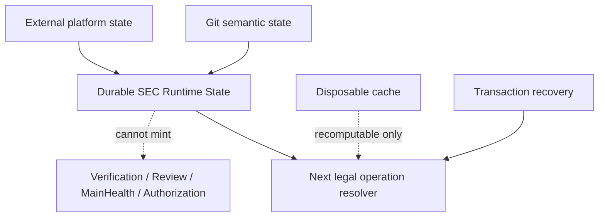

# 系统架构与权威流

本文只拥有 SEC 的总体对象分层、两条产品主链、canonical/projection 边界、状态类别、跨域引用、单写者和依赖方向。产品目标由 `docs/product.md` 拥有，阶段依赖由 `docs/roadmap.md` 拥有；领域内部字段、当前实现能力和具体文件集合分别由领域代码合同、最新 `main` 和机器 registry 拥有。

## 总体闭环

SEC 是 Engineering Workspace Compiler。它不是一条“从 YAML 生成文件”的单向流水，也不是一套自由式 Agent 脚本，而是围绕同一工程语义核心形成两个方向的闭环。

### 既有工程治理链

```text
Existing Workspace
→ Physical Workspace Observation
→ Source Program Model
→ Engineering Semantic Model
→ Responsibility / Delta / Impact
→ Operation / Authorization / Plan
→ Transactional Mutation
→ Verification / Evidence
→ Publish / Recovery / Readback
```

### 确定性工程生成链

```text
Product Intent / Contract / Block
→ Engineering Semantic Model
→ Application IR
→ Behavior IR
→ Implementation Resolution
→ frozen Implementation Binding
→ Target Program IR
→ Backend
→ Source / Test / Config / Artifact
→ Verification / Evidence
```

两条链共享 Engineering identity、Responsibility、State、Operation、Policy、Permission、Effect、Scenario、Acceptance、Provenance 和 Verification truth。Brownfield 不能建立一套“源码图语义”，Generator 也不能建立另一套“模板语义”，Implementation Resolver、Block Resolver、Provider Registry和Agent/CLI interface也不能各自建立实现选择真值。

### 产品回路

```text
canonical state
→ query / machine projection / Context Packet
→ user or AI proposal
→ platform-owned Operation ingress
→ plan without live writes
→ apply under transaction and CAS
→ canonical rebuild / implementation re-resolution
→ actual Semantic / Binding Delta and Impact
→ Compatibility / Verification / Migration decision where applicable
→ accepted | rejected | rolled-back | recovery-required
→ projections reload from accepted canonical revision
```

UI、CLI、HTTP、AI Adapter 和 Provider 都只能通过同一个产品 adapter 消费该回路，不能各自维护写路径、实现选择、兼容性或成功状态。

### 双向架构审计与演化闭环

系统原则、任务原则、行动原则、当前实现和未来设计不是平行清单。总体架构只拥有它们共享的双向关系；
Task/Action Principle的适用、冲突、自纠和执行闭包由`docs/development-governance.md`拥有。各唯一owner必须把它们
编译成可双向追踪的同一图：

```text
canonical system / task / action principle / responsibility / policy
→ machine rule and rejecting compiler
→ complete target closure
→ observation / counterexample / Evidence / unknown

finding / counterexample / unknown
→ violated or missing rule
→ unique semantic owner and root cause
→ principle or design delta
→ implementation / migration / old-owner retirement
→ affected Verification and new-main readback
```

正向闭包覆盖全部受原则约束的source、test、fixture、document、config、workflow、Provider、credential、state、
cache、Effect、process、resource、performance、recovery和release对象；不能只检查当前故障文件，也不能把“未来设计”
留成没有consumer、拒绝规则和迁移终态的prose。反向闭包要求每个新反例不仅修局部实现，还要判断：现有原则是否缺失、
含糊、不可执行或彼此冲突，机器owner是否漏掉target/edge，未来设计是否会重建同类第二owner。命中已有identity时更新
唯一owner；只有证明没有现存identity才创建新contract，且必须同时给出旧owner的consumer-zero与retirement条件。

审计完整性不由文件数、命中数、测试注册数或Agent结论证明。machine Evidence必须记录principle identity、rule identity、
target universe、coverage、unresolved frontier和反向design delta；任一target类别没有producer、任一finding没有root owner、
任一design delta没有migration/retirement/verification闭包时，只能返回typed partial或unknown。后来出现的反例若揭示旧审计
漏掉了一个维度，旧complete claim立即失效，先修审计编译器和canonical原则图，再重算所有受影响结论。

### 最小因果图与图内消减

SEC 的目标不是让每层各自“有测试、有文档、有owner”，而是让整个仓库成为证明过的最小因果图。全部tracked
file、module、export、field、test、fixture、document、Skill、Work Package projection、Provider、state、cache、Effect、
Evidence和Task/Action都必须成为同一图中的节点。节点的producer/owner、semantic responsibility、canonical fact、
consumer、Effect/failure boundary、resource cost、invalidation与retirement只能从exact physical universe、唯一module/import/
consumer graph、canonical registry和真实Effect/Evidence机器派生；禁止调用者手写一份“完整 justification”来自证存在价值。

消减不得产生新组件、类型、registry、数据库、Evidence owner或持久状态。现有repository graph的每次design、review和
migration admission直接使用同一份已观察事实裁决对象，不得再次发现文件、解析import、维护path清单或接受caller声称的
tracked universe；裁决只约束当前事务并随事务终结，不形成新的账本或业务authority。每个对象只能得到一个裁决：

```text
required         独立责任或真实consumer要求存在
derivable        能从更上游canonical fact确定性生成，不得手写持久化
duplicate-owner  与另一producer竞争同一semantic identity
dominated        其proof/行为/failure space被更强且成本不高于它的对象完整包含
orphan           没有真实consumer、Effect、迁移或retirement义务
unknown          coverage或authority不足，禁止假KEEP也禁止破坏性删除
```

`derivable`改为projection，`duplicate-owner`保留唯一owner并删除其余writer/parser/registry，`dominated`合并或删除，
`orphan`删除；只有`required`保留，`unknown`形成bounded frontier。新增对象如果不对应新的真实Responsibility，必须证明
它让总代码、状态、测试、验证成本或故障空间净减少；“更安全”“便于测试”“未来可能使用”或局部green不能授权净膨胀。
一个版本/revision/digest/path/status字段没有独立consumer时，字段和围绕它的测试一起删除；一个测试只重演类型、strict
parser、module compiler、常量或更强Effect/readback proof时删除；一个wrapper没有新增protocol、credential、Effect、
security、compatibility或performance boundary时删除；一个Skill/WP复制machine rule或canonical principle时降为locator或删除。

架构Review只审这个compiled graph、unknown frontier与migration/retirement DAG，不再靠多轮逐文件意见发现同类问题。
Full test/audit发现新反例时修图内消减关系或semantic owner，随后重算受影响对象；禁止在原图外追加一个永久例外。
任何试图把该步骤独立成组件的实现也必须进入同一图：没有closed-universe producer、真实retention/删除consumer或旧机制
retirement时，它就是`orphan`并应删除；只有实际替代至少一个旧parser/registry/manual census并使总代码、状态、测试和验证
成本净下降时才允许保留。
任何迁移期不得让新旧两套裁决并行签发authority，旧owner必须在同一个DAG中达到consumer-zero并退役。

这套分类不是一份会漏项的静态检查表。每次裁决都必须从终局结果反向追到最小必要因果链，再正向覆盖该链上的
identity/owner、producer/consumer、状态与Effect、failure/recovery、安全与权限、并发、资源与性能、外部能力、版本与
迁移、Verification和retirement。后来出现的“新问题类别”必须能落到某个节点、关系、成本或未知边界；若不能，说明当前
因果模型不完整，先修唯一架构owner并失效旧complete结论，而不是给Agent再追加一条孤立提醒。这样测试、硬编码、性能、
重复轮子、版本泛滥和可维护性问题都由同一图自动暴露：它们分别表现为被支配proof、不可派生的第二事实、未计费资源边、
重复能力owner、无跨状态consumer的identity，以及让正确变更需要同步修改多个节点的扇出。

源码字面量只有在它本身就是不可再派生的外部协议token、物理边界或canonical事实，并由唯一owner消费时才是必要常量。
路径、版本、命令、字段、测试集合、owner清单或状态映射只要能从module/import/consumer graph、schema、registry或上游
Decision派生，就不得在调用者再硬编码；把硬编码搬进一个新registry而未删除旧事实owner仍是`duplicate-owner`。

### Repository package 与文件布局

物理目录必须表达语义责任和依赖方向，不能用`shared`、`utils`、`common`或文件名惯例代替owner。
`src/system-architecture/repository-modules/contract.ts`编译每个`sec.module.json`、物理module membership和import
graph；`src/brownfield/source-program-model`再从TypeScript symbol、reference、capability与Effect graph编译typed
surface。低层module contract不得反向导入Compiler或Source Program Model。package identity由描述符所在的最具体`src/<domain>/<capability>`根直接派生；descriptor
不得重复填写owner/id或任意公开路径。descriptor只声明无法从源码推导的content/runtime类别、仓库外入口、
pre-dependency bootstrap约束和经export/consumer闭包复核的语义capability claim，不复制文件清单、consumer或测试选择。

```text
src/
  <domain>/
    <capability>/         capability-owned product, governance and infrastructure code
    sec.module.json       non-derivable import/bootstrap/capability facts only
    *.ts                  capability implementation grouped by semantic responsibility
    *.ts                  keep a small capability flat
    <subcapability>/       only when a real internal capability exists
    *.test.ts             capability-owned behavior/failure/effect proofs
catalog/                  non-code registry/source inputs
docs/                     human architecture and governance explanations
config/                   repository-wide host configuration only
```

所有一方可执行或可导入代码只能位于`src/`。`src/<domain>/<capability>`按canonical authority domain和可独立理解、变更、
测试的capability组织，不再增加`modules`、`apps`或其他技术分类层。argv/stdin/stdout/exit、host wiring和operation composition
进入其真实领域（例如`src/interface/cli`、`src/verification/ci`），不能因此拥有schema、parser、policy、Provider、credential、
journal、cache、lifecycle、业务Decision或完成裁决。小capability保持平铺；只有真实子能力才建立子目录，禁止机械创建
`contract/application/runtime/state/test-support`空层或barrel。contract/query/command是Source Program Model从符号、
consumer和Effect闭包编译出的语义类别，不由文件名、目录名或descriptor清单冒充。

公共面也不由`index.ts`、纯re-export barrel或全域facade冒充。跨capability consumer直接依赖目标owner签发的最窄行为入口；
只有入口本身执行稳定投影、authority intersection、lifecycle或Effect admission时才形成facade。facade必须保持向外单向依赖，
不能反向导入consumer、CLI或上层编排，也不能只为了缩短路径复制底层exports。零消费者facade与barrel直接图切；未来真实
consumer出现时从canonical owner建立最窄入口，不预留“也许会用”的空公共面。

测试与被保护capability同置；真正跨capability/system boundary的测试进入拥有该边界Decision的capability。测试文件不得
成为production事实源，production也不得导入test/fault provider。fixture只表达外部输入或故障，不复制canonical
常量、版本、字段表和源码布局。

当前`platform/`、`tooling/`、`scripts/`、`source/`、`control/`和root `tests/`都是迁移输入，不是合法终态zone。
每个纵切迁移必须同时搬迁owner、public API、consumer和测试；旧路径consumer-zero后删除，不新增re-export、alias、
V2目录或兼容facade。迁移完成条件是唯一capability owner、唯一公共出口、import graph闭合和旧图删除，而不是路径变更。

## 四种不同身份

- **Authority**：谁有权声明、修改或裁决输入和策略。
- **Canonical state**：由确定性 producer 从受权威输入构建、验证和冻结的工程状态。
- **Evidence**：某个来源、方法、revision 与环境下的观察、测量、执行或推断。
- **Projection / Artifact**：为用户、工具、运行目标或治理消费者生成的输出。

同一个物理文件可以承载其中一种身份，但路径、格式、Git 状态或被多个消费者读取不会自动改变它的身份。Evidence 不能通过 confidence、多数票或 UI 接受动作自动成为 authoritative Fact；Projection 也不能反向修改 canonical state。

## 核心对象层

### 1. Authoring 与显式决策

拥有产品意图、Semantic Contract、Block 引用、Policy、受治理源码、Implementation constraints、Rule-backed Override、Migration decision 和显式 Adopt decision。

Authoring Source 是可修改的权威输入，不等于所有源码。Registry source、generated artifact、cache、Evidence、IR JSON、ResolutionDecision、journal、UI state 和外部 Provider 输出默认都不是 Authoring Source。

### 2. Physical Workspace

表达 exact revision 下物理存在的对象：repository、workspace、package、file、directory、config、test、workflow、resource、generated output、runtime materialization 和 release artifact。

Physical Workspace 只回答“看见了什么、如何定位、由谁物理拥有、哪些区域不可读或受保护”，不自动解释业务 Responsibility。它必须显式保留 tracked/untracked/ignored、content/object identity、mode、encoding、symlink/reparse、case/Unicode、generated/vendor/secret/opaque 与 unknown。

Repository、Documentation、Workflow/Gate、Agent Operations、Release、Product Decision 和 Evidence Ledger 等 Workspace Domain 在出现真实 consumer 时逐域建立独立 raw/validated boundary；不能先创建一个巨型 optional Workspace object。

### 3. Source Program Model

Language、Compiler、Static、Runtime 和 Build Provider 把 Physical Workspace 提升为 observed/derived 源码模型，表达：

- workspace、package、build target、file、module；
- symbol、declaration、type、reference、source span；
- import/export、resolution、call candidate；
- control/data-flow、state/effect/error/permission candidate；
- framework/config/resource binding；
- generated、vendor、protected、opaque、ambiguous 与 unresolved region。

Source Program Model 有独立 identity、revision、validator、canonical ordering、coverage 和 provider provenance。它不是 Engineering IR，Provider 私有 ID、绝对路径或模型 confidence 不能自动成为跨重建 semantic identity。

### 4. Engineering Semantic Model

Engineering IR 是 SEC 接受的 canonical engineering semantics，拥有 stable Entity、Fact、Assertion、Semantic Contract、Responsibility、State、Operation、Policy、Permission、Effect、Scenario、Acceptance 和 semantic revision。

它回答：

- 哪些工程对象存在；
- 哪些陈述成立；
- 谁以什么 authority 和 provenance 作出陈述；
- 哪个对象承担什么责任和边界；
- 哪些未知、冲突和 opaque 必须保留。

Source observation、AI interpretation 和 Provider analysis只能产生 observed/inferred Assertion 或 candidate binding。Reconcile/Adopt 的显式 policy 决定哪些输入可以进入 canonical authority；不能通过 strongest-wins、last-write-wins 或多数票压缩来源。

### 5. Responsibility、Delta 与 Impact

Responsibility 是 Engineering Semantic Model 中的稳定工程责任对象；它绑定 owned state、operations、effects、permissions、contracts、resources、source/artifact bindings 和 lifecycle。Responsibility reconstruction 可以从 Source Program Model 生成候选，但候选保持 `authoritative: false`，直到显式 Adopt 或 canonical rule 取得 authority。

Delta/Impact authority分离并比较 independently validated endpoints：

- Fact/Assertion Delta只比较canonical semantics；
- `ImplementationBindingDelta`只比较old/new exact Binding集合；
- Semantic / Implementation Impact传播到Responsibility、consumer、Artifact、dependency、runtime、Verification、release和support surfaces；
- Change Management消费Delta/Impact与Evidence，产生Compatibility Decision和Migration，不重做Comparator；
- Actual Delta不能由Resolver、UI、Migration或测试结果提交。

实现切换不能伪装成源码文本变化，也不能自动改写Semantic Contract。Changed files、测试列表、AI 风险评分、semver和 UI 边方向都不能替代 canonical Delta/Impact 或 Compatibility。

### 6. Operation、Authorization 与 Plan

任何用户、AI 或 CLI 写请求都必须进入版本化 Engineering Operation：

```text
intent
+ semantic target
+ expected revision
+ implementation constraints / preferences where applicable
+ requested effects
+ required permissions
+ must-preserve / forbidden effects
+ verification obligations
```

平台从 caller capability、Operation Registry、semantic target、source owner、physical path/region、Policy、Provider capability、minimum Verification 和 current revision 的交集重新派生 authorization。

Planner 只读地解析 owner/path、运行 isolated transform、重建 canonical state、计算preview Resolution、Delta/Impact和Verification union，产生 immutable plan 或 blocked diagnostics。Caller 不能提交 derived path、Eligibility、Decision、Binding、Delta、Impact、risk、rollback 或 terminal status。实现选择输入只能表达受治理的constraint、preference、require、forbid、pin或custom request；所有derived结果由平台重新计算。

### 7. Transactional Mutation

Mutation 把合法 Operation 计划应用到 Authoring/Governed Source：

```text
validate expected plan
→ acquire unique writer authority
→ reread live inputs and re-plan / re-resolve
→ source + semantic CAS
→ durable journal
→ stage exact write set
→ pre-publication Verification
→ publish
→ live canonical rebuild / re-resolution
→ actual Semantic / Binding Delta and Impact
→ Compatibility / Migration checks where applicable
→ post-publication Verification / readback
→ accepted | rejected | rolled-back | recovery-required
→ cleanup receipt
```

不存在 partial-success。无法证明 accepted 或 exact prior-state rollback 时必须进入 recovery-required。Semantic Mutation 唯一拥有单次 source/canonical transaction 的 journal、publish、rollback 和 recovery；Change Management只拥有跨版本Compatibility、migration、compensation、forward recovery 与 irreversible boundary；Delta/Impact只拥有结构变化和传播事实。

### 8. Verification 与 Evidence

Verification 分离：

```text
Requirement / Claim
→ Gate definition
→ physical observation / execution record
→ owning-environment-aware aggregate
→ Decision / merge or product consumer
```

Result 至少区分 `passed | failed | not-run | unsupported | invalidated`，并独立记录 executed/reused/not-executed、applicability、environment、input closure、artifacts、cleanup、expiry 和 invalidation lineage。

Verification PASS 只证明 exact requirement 和 input closure；不能自动证明Eligibility、Compatibility、packaged/deployed 或 product-supported。Evidence Ledger 拥有 record、freshness、coverage、bias、expiry 和 references；Engineering IR 只保存 Assertion 对 Evidence identity 的引用。Provider或Implementation candidate的conformance、benchmark、安全、许可证和运行结果都是Resolution/Compatibility的输入Evidence，不是最终实现选择或迁移authority。

### 9. Implementation Resolution

Implementation Resolution 只消费validated Engineering/Application/Behavior requirements、Target capability、repository existing-stack facts、用户/组织约束、Provider/Adapter catalog Evidence与版本化Resolution Policy，产生：

```text
Implementation Requirement
→ canonical candidate closures
→ Eligibility Results
→ Resolution Decision
→ exact frozen Implementation Binding
```

它不拥有：

- 产品或业务Semantic Contract；
- Source Program观察和Provider分析事实；
- Registry trust和Block内容绑定；
- package/lock写入和安装；
- Host/Target物理支持；
- Fact/Binding Delta与Impact；
- Compatibility、Migration或retirement decision；
- Verification结果；
- Target Program打印和Artifact发布。

正确性、安全、权限、Target、许可证和dependency闭包等硬条件先过滤；unknown/conflict保持显式；优化policy只作用于合格候选；仍并列时使用稳定tie-break。相同完整输入必须产生相同Decision与Binding。Generator、Backend、Adapter、UI、Block Resolver和package materializer不得重新选择实现。

Block Capability Resolution与Implementation Resolution为上下层不同协议：Implementation Resolver可以请求一个受约束的`block-delivered`候选；Block Resolver只在其Registry/Block领域内返回冻结BlockProviderBinding，不能替产品决定原生、参考、既有、自定义或Block实现谁更优。

### 10. Target Compilation

Target compilation 只消费 validated Engineering Semantics、显式 Target Profile和冻结的ImplementationBinding：

```text
Engineering Semantic Model
→ Application IR
→ Behavior IR
→ Implementation Resolution
→ exact Implementation Binding
→ Target Program IR
→ Backend
```

- **Application IR**：目标无关的 module/service/data/state/operation/policy/effect/verification 结构；
- **Behavior IR**：SEC 能完整验证和 lowering 的受限控制流、数据流、state/effect/error/authorization/transaction；
- **Implementation Binding**：每个需要具体实现的能力所选Provider/Reference/Existing/Custom闭包及其exact revisions；
- **Target Program IR**：目标语言 package/module/declaration/statement/expression/import/export/config/resource binding；
- **Backend**：AST、printer、formatter、typecheck、package/config lowering 和最终 bytes。

每层只有一个 producer、raw/validated boundary、identity/revision、validator、canonical ordering、diagnostic 和 source map。Target Program IR和Backend不得重新读取raw Contract、live Registry或依赖catalog来选库。新层只有在真实 consumer 暴露现有层无法安全表达的 gap 时才物理落地；完整设计已冻结不等于提前实现无消费者的 IR 空壳。

历史 `Custom Slot` 不是一个可执行 capability authority。真正的 Typed Extension 必须由 canonical ExtensionContract 与 ExtensionImplementationBinding 给出 exact source/provider identity、typed capability ports、Target、transitive Effect closure 和 Verification。当前 Lock/Slot contract 没有这套 binding；现有静态检查因此只能拒绝被直接观察到的 ambient host module、dynamic load 和高风险 runtime root，不能证明“零 runtime capability”，也不能约束通过 `Database`、`Session` 等参数传入的 authority。Compiler API、Semgrep、Tree-sitter或其他 Source Provider 只观察 facts；SEC-owned evaluator 把 facts 与 binding 求交，unknown 或未授权统一 typed reject。retained physical source、observation provider、capability intent、immutable binding 和 decision/error projection必须是独立边界，任何 Provider 规则、测试 seam 或 caller option都不得扩大 grant。canonical 对象与历史 Slot 的原子退役规则由 `capability-and-block-model.md` 拥有。

### 11. Product Surface

CLI、Agent machine interface、ExplainGraph、SemanticView、Implementation View、ReviewSummary、Context Packet、Agent Task、文档、Gate、Release 和 dashboard 都是 canonical state 的消费者。

Agent/CLI interface只拥有transport、stable machine projection和bounded proposal；Operation Envelope、Role、Permission、Implementation Decision、Binding Delta、Compatibility、Verification 和 terminal result由各自 machine owner拥有。SEC Core不拥有浏览器Workbench、HTTP/SSE UI server或HTML view。

Projection 可以过滤、布局和聚合，但必须保留 stable references、revision、authority、unknown 和 Evidence freshness，不能复制或重算上游裁决。实现视图可以解释选了什么、为什么、精确版本、淘汰原因、Binding变化和升级影响，但不能把用户点击或AI建议直接变成Binding、Delta或Compatibility Decision。

### 12. Design Closure

产品意图、根因、架构和实现不是四份平行计划，而是 revision-bound 引用闭包：

```text
Product/domain authority refs
→ terminal business intent and lifecycle horizon
→ violated invariant / causal root-cause class / affected consumers
→ delta on the existing authority and architecture graph
→ implementation/capability resolution and old-path retirement
→ WorkDecision / Task Capsule / Operation
```

每层内容仍由原 owner 拥有；Design Closure只组合identity、revision、关系与unresolved状态。它不得复制业务正文、建立第二IR或提前物化无人消费的状态机。读取面由decision questions、unresolved frontier与required Evidence kinds编译；只有可能改变具体裁决的节点和反例进入执行上下文。

### 13. Operation Demand Graph

内容寻址不是一套平行架构，而是统一 Engineering Semantic Graph 中确定性节点的 identity/reuse 机制。所有开发环节遵守同一条闭环：

```text
validated Fact / Intent / Policy / Capability
→ selected Operation
→ Operation Demand Graph
→ required semantic transitions / capabilities / verification obligations
→ authorized owner Effects
→ Observation / Evidence
→ next graph revision
```

`src/control/operation/demand.ts` 是开发控制面中该图的唯一机器 owner。一个 selected
Operation 与其 validated facts 必须由该 owner 一次编译出完整 transition demand、capability demand、
verification obligation 与 graph digest；下游在 Effect 前重算并逐字比较，不能自行补 demand。多个物理改动面若
来自同一上游 operation，只是同一图节点的派生闭包，不得拆成多个 bootstrap 因果包、多个授权或多个互相漂移的
手工清单。各领域 effect owner仍只执行自己的 transition，公共图不吞并权限。

能力是图上的显式需求，不是入口默认副作用。`not-demanded` 必须产生零 package preparation、零缓存探测、
零下载、零进程和零网络。共享 preload、通用 command 名称、ambient executable/cache、调用者字段或“以后也许
会用”不能索取 Container、Network 等能力。WorkSelection 的 terminal topology transition 与测试
运行器的 compiler materialization由同一 Demand Graph compiler裁决；它们不再各自拥有一套入口启发式。

一个 canonical semantic transition 可以派生多个物理对象；这些对象必须由同一 compiler 一次产生完整
write/delete set、依赖边变化、验证需求和 Evidence identity，并由一个事务 owner 发布。若外部authority或下一
decision尚不可得，compiler必须把生命周期拆成有明确顺序的多个semantic transition，并保证每个中间revision
自身可解析；不能把跨revision的最终对象集合误当成一个立即Effect。任何单独手改派生对象、保留已消费依赖边、
只执行半个transition或让Projection反向补事实都属于非法partial transition。Git commit的原子性不能替代
transition compiler的语义完整性；候选边界必须比较prior/current graph并拒绝半事务。

流程与实现沿此边界解耦：pure process compiler只消费validated facts并输出transition、precondition、Effect
intent与readback obligation；Git index、文件系统、GitHub、container或其他replaceable Provider只执行已授权
intent并返回typed receipt，不能重算业务顺序、扩大scope或签发completion。Provider替换只改变capability与
Evidence binding，不改变状态机语义。terminal work是首个完整canary：terminal compaction退休catalog/依赖边但
保留仍被pointer绑定的manifest；successor freeze随后在一个candidate tree中发布新manifest/pointer/rolling并
退休旧manifest。open PR identity也直接由exact base/head/tree与该transition digest重算，不要求每类operation
伪装成Work Package或依赖PR prose locator。两个边界都由compiler定义，Git/文件/PR Provider只物化并观察它们。

## Workspace 状态与路径类别

路径只是物理 binding，不是跨域 identity。一个 workspace 至少区分：

- `sec.yaml`：workspace入口与显式产品约束，不复制派生路径、owner或dependency graph；
- `model/**`：Semantic Model、Policy、Block/Extension声明及其他非可执行authoring input；它不能保存TypeScript/JavaScript
  实现、生成物或运行时状态；
- `src/**`：目标程序全部可执行authoring source的唯一物理owner；generated/adopted source也只能在同一编译事务中以
  exact provenance绑定进入该树，禁止同时保留`source/code`、`project/custom`或第二份template source；
- `tests/**`：目标程序对公共行为、持久状态、Effect与failure boundary的proof，不镜像`src`物理布局；
- ecosystem-native根文件与目录（例如`package.json`、`tsconfig.json`、`prisma/**`）：目标工具链的真实输入，不包在
  `project/`、`app/`或SEC专用技术容器中；
- `.sec/artifacts/**`：Lock、Verification、Provenance、Review与其他可发布持久投影；只有对应owner可写；
- `.sec/cache/**`、派生 build info 与可重建索引：可删除、可重算、不能成为 Evidence 或 authority；
- `.sec/workspace-write-lease/**`、transaction journal、recovery state 与其他 identity-bound control state：不可按“本地缓存”整体删除；
- runtime/toolchain materialization：可重建但绑定 package、lock、provider、platform、Implementation Binding和generation identity；ambient cache 不能冒充当前实例。

因此 `.sec/**` 不是一种统一生命周期。任何清理器、fixture、worktree hygiene 或发布逻辑都必须先通过机器分类，unknown 默认拒绝删除、复制或并行共享。
SEC编译器仓库自己的`src/`只保存SEC实现；用于dogfood或演示的目标workspace必须位于独立的`examples/<name>/`根，
并在该根内使用上述native layout，不能把目标程序的`project/`、`source/`、`control/`平铺到编译器仓库根。

## 跨域引用

Domain 只通过 stable identity 与 revision 关联：

```text
Physical source/artifact
↔ Source Program object/span
↔ Semantic Entity/Fact/Responsibility
↔ Implementation Requirement/Decision/Binding
↔ Fact / ImplementationBinding Delta and Impact
↔ Compatibility Decision / Migration
↔ Target Program/Artifact
↔ Operation/Plan/Transaction
↔ Verification Claim/Evidence
↔ Documentation owner/consumer
↔ Workflow/Gate
↔ Agent operation
↔ Release artifact/promotion
↔ Product decision/rationale
```

禁止通过显示名称、相邻路径、同名字符串、数组位置或复制整份对象建立隐式关联。跨域 validator 必须检查引用存在、revision 兼容、owner 唯一、循环依赖和 unresolved frontier。

## 单写者与依赖方向

每个 canonical type、state、identity/revision algorithm、pipeline stage、writer、resolver、comparator、compatibility evaluator、selector、cache truth 和 public facade 只有一个 owner。合法依赖方向是：

```text
authority / validated upstream state
→ deterministic producer / resolver / comparator
→ validated downstream state
→ decision / projection / physical executor
```

Adapter、Agent/CLI interface、Provider、测试、文档和 Backend 不得反向拥有上游语义；Block Resolver、Implementation Resolver、Delta comparator、Compatibility evaluator、dependency solver和Backend也不得互相复制算法。

迁移固定执行：

```text
retain current owner
→ shadow/read-only compare
→ prove decisions/bindings/deltas/compatibility/bytes/diagnostics/effects/consumer parity
→ migrate consumers
→ switch the single resolver/comparator/writer
→ invalidate old revisions
→ delete or archive old owner
```

在 Decision、Binding、Delta、Compatibility、source bytes、diagnostics、副作用、consumer 和 failure parity 未证明前，新旧owner不能同时决定或写入同一scope/artifact。

## Repository package、物理布局与 AI 读取闭包

唯一语义 owner 不等于一个巨大文件，也不等于把所有跨域代码平铺进 `shared`。仓库的物理结构必须让系统和 AI 都能从最小、确定、机器可验证的闭包定位事实，而不是靠目录惯例、全仓预读或另一份手工路径表猜测 owner。

### 唯一模块事实与投影

每个已接入领域 package 在自身根目录拥有一个严格、无未知字段的最小模块描述符。机器合同只保存无法从其他事实派生、且已有真实 consumer 的内容：`runtime | content` import-graph participation、仍位于 package root 之外的临时`externalEntrypoints`、pre-dependency bootstrap和需要唯一性/实现闭包验证的capability claim。package root与package identity都由描述符物理位置派生，不重复写owner、id或公开路径。

该描述符**不**重新拥有 canonical document authority、authority reference、layer、Effect、test ownership、AI read plan、迁移状态、公开文件清单或允许依赖清单。物理code owner是最具体package root；语义capability owner是经Source Program Model验证export/operation闭包后唯一成立的provider claim；文档与产品事实owner仍由`docs/authority.json`定位。三者不得用同一个`owner`字段混为一谈。新增描述符字段必须同时给出真实拒绝/投影consumer、旧事实owner的退役和净复杂度下降，否则strict parser把它视为未知字段。

当前模块 membership 与 import graph只替代 test-impact 的手写运行时根和内容排除表，不宣称自己证明完整 tracked universe。完整仓库文件宇宙只能由 canonical Git provider签发的NUL-safe tracked records提供；物理递归、ignored-directory清单、描述符数量或测试自报 coverage 都不能替代。未来的依赖检查、TCB、公共投影和AI Read Plan只能消费同一 tracked snapshot 与纯import graph，不得让描述符重新发现文件或手工维护第二份package/path/owner真值。重叠身份、未知tracked对象、失踪外部入口和同一路径多owner必须 deterministic fail；provider不可用时保持typed unknown。

### 物理 package 形状

能力module使用下列最小形状；没有对应职责时目录不存在，不建立空层或barrel：

```text
src/<domain>/<capability>/
  sec.module.json        # 只保存不可派生的import/bootstrap/capability事实
  <responsibility>.ts    # direct declaration owner; cross-package imports resolve here
  index.ts               # optional local-only convenience, never a public surface
  <operation>.ts         # small capability files remain directly visible
  <subcapability>/       # only a real internal capability may introduce depth
  <operation>.test.ts    # behavior/effect/failure proof beside its owner
```

跨package依赖必须直接指向Source Program Model证明的exported declaration owner；`contract`只能表达数据、schema、parser和纯投影，`query`只能提供bounded read，`command`才可提供显式Effect。类别属于symbol/consumer/effect closure，不属于路径。`runtime`、`internal`、`application`、`state`等目录名同样不声明私有性；需要私有的符号不得export。`index.ts`无法保存每个re-export的真实owner与依赖类别，因此只允许package内部使用，不能成为跨package facade；Reduction Compiler用TypeScript symbol resolution把旧barrel import机械改写到真实declaration。导入任何surface都不能在module evaluation阶段读取文件、环境、PATH、credential、provider、时钟、进程、网络或构造live session。默认配置实例、物理adoption和live provider必须由显式async operation创建。测试也只消费exported declaration或owner签发的test capability，不能因为方便读取真实默认实例或source-layout。生产DAG只由production-origin edge编译；测试观察edge单独校验而不反向制造生产SCC。

外部能力 package 必须至少分离：

```text
pure contract/schema
→ versioned profile/spec content
→ physical adoption/provider capability
→ bounded live transport session
→ Git/GitHub/compiler 等 semantic owner
→ decision/effect/readback
```

物理 transport 不拥有 credential、repository、GitHub、MainHealth、WorkSelection 或完成语义；semantic owner 也不得重新实现 PATH、spawn、retained handle 或 provider adoption。

### Repository roots

仓库根只保留四种职责：`src/`一方代码、`catalog/`非代码业务输入、`docs/`人类规范、`config/`host配置。
package manager、Git、GitHub和编辑器强制要求的root文件/目录可以保留，但必须是薄host projection，语义owner仍位于
`src/<domain>/<capability>`。runtime state、cache、Evidence和generated output不进入authoring tree。

`modules`、`apps`、`platform`、`tooling`、`scripts`、`source`、`control`、`shared`、`utils`和`common`都不是capability，因此不能成为新的
代码owner。现存路径由迁移census绑定到目标module；债务ceiling只能下降，不能成为继续向旧zone写文件的预算。

### 依赖方向与机器拒绝

package layer 的合法方向是：

```text
module-private implementation
→ module public facade
→ consuming module public facade
→ app composition
```

同层跨域引用也必须经目标 package public facade。以下状态必须由 module compiler、TypeScript import rule 或 contract test 拒绝：

- `src/`外出现一方production TypeScript/JavaScript代码；
- production 导入 test/fixture/private surface；
- pure contract/model 导入runtime、default provider或进程能力；
- package 通过 root-relative 路径绕过 public facade；
- app、test、docs、catalog或host config反向成为产品语义owner；
- 两个 package 发布同一 semantic identity、writer、resolver、parser 或 Effect；
- import cycle、barrel cycle、动态字符串 import 绕过 registry；
- package/file/dependency/read/test budget 超限且没有由 canonical architecture owner签发的迁移状态。

预算是迁移触发器，不是用更高常量永久容纳巨型 owner。超过预算的 package 必须拆成同一 semantic owner 下的 bounded physical modules；不得通过复制 owner、增加 facade 层或放宽 ceiling 规避。

### 测试物理架构

测试只保留能观察机器不变量的最小证明：public behavior、持久状态、真实 Effect/readback、failure boundary、physical safety 或跨 package contract。源码字符串、callee 名称、物理路径清单、手写 enum 镜像、sleep/wall-clock 猜测、伪造 production receipt 和无条件 skip 不是 authority。

- module-owned test与module同置；跨module/system test进入消费该边界的app，不维护镜像production目录的root tests tree；
- 一个不变量只有一个 canonical proof owner，其他 suite 消费其 typed projection，不复制断言；
- test-impact 从 module dependency、public surface、Effect 与 fixture owner 编译，不手写第二份 source/test 路径镜像；
- 能由类型、strict parser、module graph 或 closed-world registry完整拒绝的非法状态，不增加重复运行时测试；
- 测试迁移同一 delta 更新所有 imports/owner/test-impact 后删除旧路径，不保留 duplicate suite、compatibility import 或永久 alias。

### AI 最小读取闭包

AI 首次进入一个 task 时只读取：repository 启动路由、目标 package 最小描述符、由现有authority owner定位的public facade、被改symbol的精确import/consumer closure、canonical owner文档和受影响测试。只有同一tracked snapshot上的机器图给出跨package dependency、Effect、Provider、state或projection边时才扩展读取；不得从描述符臆造尚未接线的owner/read字段，也不得为“熟悉仓库”预读整个domain、全部tests或全部Skills。

Read Plan 必须记录 package identity、descriptor digest、public/internal surface、required/conditional refs、unknown frontier 和 byte/file budget。路径相邻、同名文件、旧聊天或历史报告都不能扩张 closure。

### 一次迁移协议

物理重构按 package 批次执行，而不是按散落文件反复搬迁：

```text
freeze exact files + consumers + tests + owner
→ publish target package descriptor and import-pure facade
→ move implementation/tests/fixtures as one content-addressed batch
→ update every exact consumer, test-impact edge and generated projection
→ verify no unknown, no cycle, no old import and no duplicate owner
→ delete old paths in the same batch
→ publish one frozen affected Evidence
```

迁移期间只有一个 active import route。需要跨提交时，`migrating` descriptor 只能记录 immutable source/target digest 和终止条件，不能保留可执行 compatibility facade；下一批开始前必须先关闭上一批的旧路径和 unknown ledger。

## 能力成熟度

所有能力必须使用前置完整的成熟度，而不是一个“支持”标签：

```text
proposed
→ contract-frozen
→ implemented-in-main
→ physically-verified
→ packaged/deployed
→ product-supported
```

对于 Workspace Domain 可进一步使用：inventory → validated model → query/projection → Delta/Impact → Mutation → Migration → Fault/Recovery → product-supported。

文档、类型、fixture、PR 或单平台测试不能跨越后续层级。Implementation Resolution、Binding Delta和Compatibility只有在各自TypeScript contract、真实producer/consumer、migration、positive/negative/failure/property tests 和 main readback闭合后才是当前能力。

## Agent Operation System

SEC 自身开发最终使用：

```text
Universal repository policy
→ typed WorkDecision
→ Task Capsule Compiler
→ explicit Agent Role + typed Operation Envelope
→ zero or one applicable trusted Skill
→ deterministic domain decisions and physical Actions
→ VerificationSession composition and legal next transition
→ external Evidence / Review / Integration / main readback
```

Role 拥有职责和可申请权限上限；Envelope 授予当前 operation 的 exact target、path、
capability 和 completion claims；Skill 只是需要 Agent 判断的 workflow recipe。
Task Capsule 是独立 pure compiler 的不可变输出，拥有 selected work、owner/root-cause、
scope、Impact 与 Verification obligations；VerificationSession 只能引用其 ref、digest 和
revision，不能拥有 Capsule 内容、编译规则或 lifecycle。

VerificationSession 是唯一 development run coordinator，拥有 run/session identity、event、
transition、resume verification 和所引用事实的 composition；它不重新拥有 Work、Task
Capsule、Impact、Failure、Action、Evidence、Review、Provider 或 Integration。系统不建立
general Run Kernel，也不以另一个 current-phase ledger 包装这些 owner。

NextTransitionCompiler 只组合各 owner 已签发的 typed decisions：WorkDecision、FailureDecision、
ImpactDecision、ActionState、SessionState、ReviewFreshness、ProviderAvailability 与
IntegrationState。它必须是同输入 byte-stable 的 pure composition resolver，只能输出
`execute | join | wait | blocked | complete` 及前置条件，不能选择 Issue、重算 Impact、判断
failure owner、Review freshness 或 merge legality。

Repository snapshot、Work Package、Impact selection、Failure/Epoch、Verification Result、
Evidence reuse、permission intersection、Integration 和 merge legality必须由机器 owner决定，
不能重复写进多个 Skill。VerificationSession production consumer 未由 new-main canary 激活时，
只能从 Git/PR/manifest/Evidence 做 manual-shadow 恢复，不能用聊天摘要冒充外部状态。

### 开发控制面 identity 分层

开发控制面不得把内容、Git transport、Review 和发布身份压成一个 SHA：

```text
ScopeGrantId
→ CandidateContentId
→ CandidateGenerationRef
→ ActionKey / Evidence identity
→ ReviewSubjectId
→ PromotionId
→ merged main readback identity
```

- `CandidateContentId` 只绑定会改变候选内容语义的 base dependency、candidate tree、
  ScopeGrant 与 manifest semantic revision；等价内容重新 materialize 时保持不变；
- `CandidateGenerationRef` 绑定 run、单调 generation、content identity 与 exact Git head，
  用于恢复、PR transport 和 invalidation history；
- Action 只绑定其实际 subject closure；整个 candidate tree 只有在 Gate contract 真实读取
  全树时才进入该 ActionKey；
- ReviewSubject 与 Promotion 始终绑定 exact head/tree 和各自 live policy/facts，不能仅凭
  content identity 复用授权。

### 持久状态准入

domain 数量由 `docs/authority.json` 推导，state-machine 数量也不是架构常量。只有某对象同时
具备真实跨进程世界状态、外部副作用或竞争、crash recovery/CAS/lease 需求、无法从其他
canonical facts 纯计算、唯一 writer/consumer 以及 migration/retirement 时，才允许建立 durable
state machine。Evidence、freshness、health、applicability、maturity 和 next-transition projection
优先保持 immutable record、truth lattice 或 pure evaluator；不得为了展示 phase 再建状态机。

### Runtime State 与状态域分层

SEC 开发控制面区分五类生命周期域；目录位置只是物理 binding，不能把不同 authority 压成“本地状态”：

```text
Git repository semantic state
External platform state (GitHub PR/Review/status/ruleset/ref)
Durable SEC Runtime State
Disposable cache
Transaction-local scratch / recovery
```

- Git repository semantic state进入 candidate tree，受 Work Package、Review 与 Verification 治理；
- External platform state只由对应 live owner观察，不能由本地 checkpoint、PR body 或 candidate 推断；
- Durable Runtime State承载跨进程恢复所需的本机状态，不属于 repository tree，也不是 cache；
- Disposable cache只提供可重算加速，不能成为 Evidence 或 authority；
- Transaction-local scratch/recovery由具体 transaction owner决定生命周期，不能按`.tmp`等目录名机械迁移或清理。



Compaction/resume沿用同一分层，不能建立“摘要状态机”。immutable checkpoint只保存最后已知reference/digest；live adapters分别观察subagent、exec/process、workspace/control、authorization/capability、materialization/provider、external effect与artifact；pure resume compiler只组合typed observations并输出下一合法decision；effect provider只消费已claim的stable operation intent并返回start/terminal/readback receipt；Durable Runtime State只保存checkpoint、claim、cursor、receipt和artifact ownership。任何层都不得把checkpoint hint提升为live observation，或让provider presentation/error string签发`absent | not-started | completed`语义。

`runId`拥有逻辑任务连续性，`resumeEpoch`拥有control/trust/authorization代际，`operationKey`拥有语义副作用幂等性，attempt nonce只拥有一次物理尝试。四者必须分别建模；用新session、child名称、PID、path、tag或nonce替代稳定identity都会把重复effect伪装成新工作。Codex Desktop内部subagent/exec事实属于外部live provider能力；仓库runtime只有在宿主返回authenticated lineage、cursor和start/terminal receipt时才能机器消费，否则该域保持unknown并阻断effect。

pure resume candidate不是effect owner：在authenticated live adapters、durable CAS claim、cursor consume和domain-specific authorization接线前，它只能输出无权威建议，并以`effectAuthority=none`阻止任何consumer把`claim-required | join-existing | consume-terminal`直接解释为物理动作。

Canonical path、root disjointness、repository/workspace key 与物理 identity 由
`src/state/workspace/layout.ts` 唯一拥有；journal、continuation 和 consumer 不复制路径算法。
Windows、Linux、macOS 的 state/cache root 可由 `SEC_STATE_HOME`、`SEC_CACHE_HOME` 显式覆盖，但必须位于
repository tree 外且彼此物理 disjoint。lexical path 不是 workspace identity：workspace key必须绑定 canonical
physical identity，所有写入、替换、删除与 GC 都在 retained/no-follow identity 上重验，防止
symlink、junction、reparse point、mount、case/Unicode alias 或 TOCTOU 改写 authority。

```text
stateRoot/
  workspace-locators/v1/
  workspaces/v1/<physical-workspace-key>/
    active-continuation-v1.json
    verification-sessions/v2/
    verification-actions/v2/
  repositories/<repository-key>/objects/continuation-v1/
```

Continuation object按 canonical bytes digest内容寻址；active pointer只表示某个 physical workspace 当前引用的
snapshot。pointer/locator/object的发布、替换、退役和journal/claim mutation使用同一 retained physical
authority，并在文件持久化后完成父目录 durability fence与exact-byte readback。GC只删除所有有效 pointer
均不可达且超过retention的对象；任何 pointer read、schema、digest、workspace binding 或物理 identity 验证
失败都 fail safe retain，而不是把损坏状态解释成“没有引用”。Runtime State可以保存恢复事实，不能签发
Verification、Review、MainHealth、IntegrationAuthorization 或 merge truth。

## 生命周期与失败

所有长期状态必须能回答：创建者、owner、revision、可变性、读者、失效规则、持久化边界、并发、清理、恢复与退役。进程退出、请求返回、文件存在或单次测试通过都不自动证明状态已提交、资源已收口或下游可以继续。

跨层失败遵循：

- 上游 validation 失败，后续 producer blocked，不生成猜测输出；
- Source observation coverage不足时保留 unknown，不伪装不存在；
- Implementation eligibility无法证明时保留unknown/unsupported/conflicted，不自动沿用旧Binding或选择近似Provider；
- old/new Binding无法比较时不生成空Delta；
- Compatibility无法证明时保持unknown，不自动进入Migration或发布；
- Projection 失败不回写 canonical state；
- Evidence 缺失或 stale 不改写事实；适用 Claim 要求它时阻止成功；
- 发布前失败不得产生 live write；
- 已发布写入失败必须证明 exact rollback，否则 recovery-required；
- cleanup/readback 失败属于结果的一部分，不能被产品断言通过覆盖；
- Full/runtime 反例暴露遗漏关系时修复 owner/rule/selector，不只追加一个全量测试。

## 架构演进约束

新增一层、一个 Domain、一个 Skill 或一个公共写入口前，必须证明：

- 它拥有独立对象、identity 和 lifecycle；
- 存在真实 producer 和 consumer；
- 不建立第二 authority、writer、loader、revision、resolver、comparator、compatibility evaluator、selector 或 pipeline；
- 有 migration、compatibility、negative/fault tests 和 retirement；
- 对当前主线的收益高于上下文、维护和验证成本。

大型未知探索只产生 Evidence。正式结果按唯一 owner 进入聚焦 Work Package；不能把完整 Spike 历史、并列总计划或未来状态机直接合并进主干。

### Architecture Evolution transaction

文件布局、package owner、公共入口、持久schema或跨域依赖方向的改变不是一组`git mv`，而是一笔可恢复的Architecture
Evolution transaction。唯一repository architecture owner必须从同一exact revision编译：

```text
old repository/source/consumer/effect graph
→ proposed canonical graph + net deletion set
→ producer/consumer/external-contract/unknown census
→ relocation + import/symbol rewrite + state migration plan
→ one workspace lease + per-effect CAS/readback
→ clean full graph equivalence and targeted behavior/effect proofs
→ baseline/provenance/owner cutover
→ old path, facade, alias, mirror and migration-state retirement
```

Plan必须绑定source revision、每个preimage/target physical identity、old/new module graph digest、unknown frontier、迁移顺序、
验证闭包和terminal deletion set。进程崩溃或任一CAS失败时，只能从durable intent继续、回滚exact prior state或返回
`recovery-required`；不得把部分移动解释为新架构，也不得删除baseline来绕过read-only protection。历史terminal transaction只作
immutable Evidence，不能继续占有后来合法迁移或退役的旧目标路径。

新反例若证明目标图仍有第二owner、反向依赖、不可恢复Effect、额外维护扇出或更低成本的成熟机制，当前target digest立即
stale并从old graph重算；禁止在错误target旁加compatibility facade、V2目录、例外或第二迁移器。完成必须同时证明新图生效、
旧图consumer-zero、unknown为零或typed blocker、净代码/状态减少，以及同一行为和failure boundary没有退化。
