# 系统架构与权威流

本文拥有通用设计演算与工程宪法在 SEC 中的逻辑实例化：跨域约束、编译阶段、责任与依赖方向、operation/resource/lifecycle/proof 闭包和架构演进。关系与原则语言由 `docs/design-calculus.md` 拥有，普适工程原则由 `docs/engineering-constitution.md` 拥有，逻辑架构到 declaration/package/file/generated artifact 的实现映射由 `docs/implementation-architecture.md` 拥有，产品结果由 `docs/product.md` 拥有，SEC Agent 流程由 `docs/development-governance.md` 拥有；领域字段与算法由各领域 machine contract 拥有，当前能力只能由最新 `main` 与 Evidence 计算。

## 1. 架构核

SEC 把 accepted purpose、exact world observation 和可替换 capability 编译为可验证、可恢复、可演进的工程状态转换。

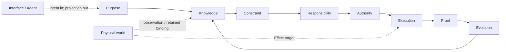

| 平面 | 唯一事实 | 签发者 | 不得产生 |
| --- | --- | --- | --- |
| Purpose | outcome、non-goal、不可推导取舍 | authorized Product/Domain decider | implementation、path、Effect |
| Knowledge | Subject、Definition、Observation、coverage、unknown | domain owner + interpreter/provider | permission、success |
| Constraint | invariant、admission predicate、waivability | contract/architecture owner | weighted override of hard failure |
| Responsibility | cell、owner、consumer、Requirement | responsibility compiler + domain owner | physical placement、runtime attempt |
| Authority | principal、Grant、delegation、Binding permission | authority issuer | capability availability、proof |
| Execution | Provision、Allocation、Attempt、Effect、Settlement | capability/resource/domain-operation owners | new Definition、self-verdict |
| Proof | Claim、readback、EvidenceSupports、verdict | domain readback + independent verifier | canonical mutation、authority |
| Evolution | activation、compatibility、migration、cutover、retirement | Change Management + state owner | permanent dual generation |
| Interface | normalized intent、typed projection | interface owner | second truth、resolver、writer |

架构合法性不是某一平面通过，而是全部必要平面的交集：

```text
AdmittedChange =
  PurposeValid
  ∧ KnowledgeCoverageValid
  ∧ ConstraintsSatisfied
  ∧ ResponsibilityUnique
  ∧ AuthorityValid
  ∧ CapabilityBound
  ∧ ResourcesAllocated
  ∧ LifecycleRecoverable
  ∧ ProofObligationsDeclared
  ∧ EvolutionObligationsClosed
```

任何 `unknown` 只阻断它可能影响的 Effect 或 Claim；任何 hard failure 都不能被多数 PASS、信心、测试绿色或人工评分抵消。

### 1.1 Constitution binding

本文件不重写通用原则；它只声明 SEC 如何消费三项上游权威：

| Upstream owner | SEC projection | 本文件拥有的实例化 |
| --- | --- | --- |
| `docs/design-calculus.md` | Subject/Claim/Relation/Constraint/Transition/Proof 与原则多视图合同 | SEC relation refs、compiler stages、typed frontier |
| `docs/engineering-constitution.md` | EP-IDENTITY 至 EP-ECONOMY | SEC DesignAdmission、owner DAG、Effect/resource/recovery/proof/evolution obligations |
| `docs/agent-constitution.md` | Agent 认识与行动原则 | 只由 `docs/development-governance.md` 实例化；本文件不授权 Agent |

通用原则变化先在其唯一 owner 完成语义、反例与反转审查，再重编 SEC profile；SEC 场景不能在此定义同名原则或改变其 rejection semantics。

`SEC Project Constitution` 不是第四份手写文档，而是一个无所有权的生成视图：

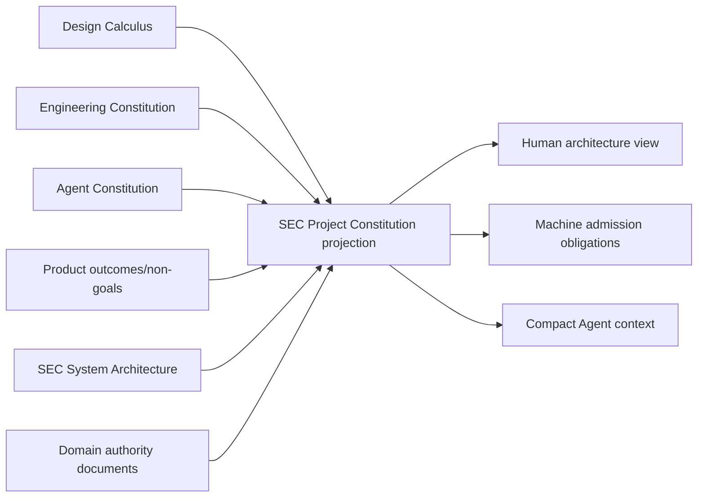

投影只能引用各 owner 的 identity/revision/clauses，不能保存原则或领域字段副本；它的失效由任一输入 revision 变化自动传播。

## 2. SEC 关系实例化

关系的通用定义只在 `docs/design-calculus.md`。SEC 对象必须投影到这些关系，不得按“代码/资源/进程”建立互斥大类：

| SEC object | Subject / Address | Requirement / Provision | Observation / Settlement / Evidence |
| --- | --- | --- | --- |
| authored source | content Subject + exact tree Address | parser/type/service Requirement + compiler Provision | parsed declarations/references + fact derivation |
| manifest/template | protocol Subject + snapshot Address | strict parser/schema Provision | canonical bytes/invariants/provenance readback |
| process | attempt Subject + OS Address | process Requirement + retained execution Provision + Allocation | start/output/exit/descendants + terminal settlement |
| container daemon | external capability Subject + host Address | container operation Requirement + daemon Provision | live availability/operation/readback；不拥有业务 Definition |
| repository/hosted service | semantic remote Subject + exact revision/ref Address | repository/API Requirement + credential/endpoint Provision | records/remote readback；transport 不拥有成功 |
| cache/fact shard | derived Subject + content Address | exact ActionKey Requirement + cache Provision | validated hit/miss；不拥有 canonical Claim |
| document | accepted Definition 或 generated projection Subject | reader/audience Requirement | registry/projection/read receipt；不得混写 runtime result |
| test | Claim/Evidence scenario Subject + source Address | runner/environment Provision | behavior/effect/failure observation；名称和计数不产生价值 |
| Work Package | bounded operation-definition Subject | scope/role/obligation Requirement | activation/settlement refs；不产生全局原则 |

### 2.1 正交与相互约束

正交表示一种关系不能使另一种关系自动成立；相互约束表示 architecture compiler 对这些关系做合取验证。

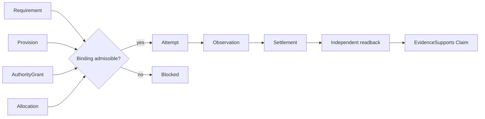

Provision 不等于 Grant；Binding 不等于 Observation；exit 不等于 Settlement；Evidence record 不等于 Claim 为真。

## 3. 硬约束系统

| 约束族 | 必须证明 | 确定性拒绝 |
| --- | --- | --- |
| Shape | owner contract、exact keys、canonical bytes、domain invariant | duplicate/unknown key、invalid enum |
| Reference | refs、revisions、predecessors、receipts 属于同一 universe | dangling/foreign/stale ref |
| Identity | semantic identity 与 Address/attempt/version 分离 | path/PID/latest/label 冒充 identity |
| Uniqueness | identity、writer、parser、resolver、issuer、terminal、readback owner 唯一 | facade/alias/registry 成第二 truth |
| Authority | requested Effect ⊆ Grant ∩ operation scope；delegation 只收窄 | caller/test/projection 扩权 |
| Capability | Provision 的 contract/platform/executable/endpoint/principal/credential/env 满足 Requirement | ambient/PATH/provider substitution |
| Resource | Σ child reservation/consumption ≤ parent ledger remaining；释放一次 | 每层重开 timeout、重复返还 |
| Freshness | input/grant/binding/observation/readback/claim 的 epoch 相容且 active | replay、same-path ABA、stale PASS |
| Concurrency | claim、lease、CAS、single-flight/bounded parallelism 有线性化点与锁序 | double writer、lost update、deadlock |
| Effect | planned Effect 与 provider settlement set 精确相等，且 domain readback 独立 | exit=success、漏 settlement |
| Recovery | crash/lost handle/partial effect 可 join/readback/rollback/authorized retry | blind replay、删除 residue |
| Proof | Evidence issuer 与 producer 分离，且只支持预声明 Claim | self-proof、projection=observation |
| Coverage | exact universe、dynamic/opaque/unknown frontier 完整 | catch-all false、unknown=absent |
| Evolution | activation、migration、cutover、consumer-zero、single active generation | permanent dual read/write、Vn alias |
| Privacy | raw bytes、secret、credential、diagnostic 有最小 retention/projection | ambient secret、raw output leakage |
| Economy | 新对象有独立 Responsibility 或降低全生命周期成本 | wrapper、mirror、第二 graph/cache |

约束输出只有 `admissible | rejected | bounded-unknown` 和结构化 frontier；它不签发 Definition、Grant、Binding、Result 或 completion。

## 4. 四个 operation 视图

| View | 输入平面 | 回答 | 不回答 |
| --- | --- | --- | --- |
| Semantic | Purpose + Knowledge + Constraint + Responsibility | 做什么、为什么、哪个 Subject、何种结果 | 谁获权、是否执行 |
| Authority | Responsibility + Authority | 谁能对哪个 exact Subject 做哪些 Effect | Provider 是否可用、是否成功 |
| Resource | Provision + Execution | 谁供应、保留/消耗多少、怎样终止 | 业务结果、Evidence verdict |
| Lifecycle/Proof | Execution + Proof + Evolution | readback、terminal、residue、迁移、证据、退役 | 改写目标、放大 Grant |

四个 view 从同一 semantic graph 编译，共享 Subject/operation/revision，拥有各自 view kind 与 bytes digest。view 可以裁剪表达，不能增删 owner、Claim、unknown 或 blocker。

## 5. S0–S9 端到端编译


| Stage | 必需输入 | 唯一输出 | 禁止承担 |
| --- | --- | --- | --- |
| S0 | authorized outcome/non-goal/obligation | accepted purpose refs + unknown | scope、path、implementation |
| S1 | retained root、snapshot request、read budget | Content Manifest + physical receipt + unreadable frontier | semantic owner、source role |
| S2 | content refs、interpreter/provider contract | declarations/references/parsed records/external observations | Definition、permission |
| S3 | owner Definitions、S2 facts、adoption rules | semantic claims/conflicts/unknown frontier | provider choice、write plan |
| S4 | semantics + actual consumer/effect/state/recovery facts | Responsibility Cells + Owner DAG + public demand | placement、attempt、terminal |
| S5 | intent、Cell/DAG、invariants、Claim definitions | OperationKey + Requirement DAG + pure Plan + obligations | discovery、lease、Effect |
| S6 | Plan、Grants、eligible Provisions、parent ledger | exact Bindings + child Allocations + attempt admission | business success、Evidence |
| S7 | admitted attempt、retained bindings、allocations | Effect observations + settlements + residue + readback | new Definition/Grant |
| S8 | Claims、S7 facts、exact environment | typed Results + Evidence + invalidation | mutation、merge/publish authority |
| S9 | accepted Result、materialization/evolution contract | artifact/projection/cutover/retirement receipt | upstream identity rewrite |

阶段是因果偏序，不是必须串行的同步脚本。相同 exact input 的纯阶段可并行；Effect 阶段按 Requirement DAG、lock order 和 shared resource ledger 调度。反馈只能是 upstream owner 接受的新 request/result 或新 revision，不能用反向 import、mutable callback 或 presentation string 成环。

### 5.1 DesignAdmission

任何改变 public contract、owner、Effect、durable state、Provider、resource、recovery、layout 或 migration 的实现前，先编译：

```text
DesignAdmission = admit(
  accepted outcome / non-goal refs,
  exact producer-consumer-state-effect graph,
  target Responsibility / Owner DAG,
  identity / authority / capability requirements,
  parent resource + lifecycle / recovery rules,
  schema / migration / retirement obligations,
  Claim / Evidence obligations,
  bounded unknown frontier
)
```

它只返回 `admissible | rejected | bounded-unknown`，不创建 plan、state、authority 或 PASS。缺少 machine producer/consumer 时，它是 `required-unmaterialized`，稳定文档不得宣称已具备。

## 6. Knowledge：snapshot、Source Program 与语义

### 6.1 唯一观察链

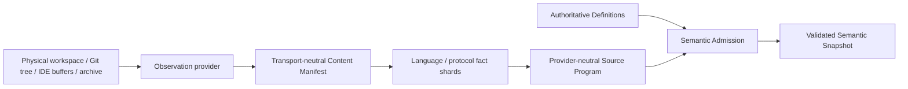

- Content Manifest identity 只包含 logical address、mode、content/object digest 和必要 semantic metadata；
- provider session、physical identity、Git locator、时间与读取预算只进入 physical observation receipt；
- Source Program 只从 manifest + interpreter/config closure 产生 declarations、references、types、entrypoints、resource/effect facts 和 explicit unknown；
- inferred facts 只有经 domain adoption 才进入 authoritative semantics；
- downstream 不重新扫描、解析或签发 source revision。

### 6.2 开放世界完备性

```text
Complete(U, M, C) =
  exactCensus(U)
  ∧ everyContentClassHasInterpreterOrTypedOpaque
  ∧ everyObservationHasCoverage
  ∧ unknownFrontier(U, M, C) = ∅
```

`U` 是 exact universe，`M` 是 active meta-model，`C` 是 coverage。无法解释的 bytes、dynamic import、generated source、binary、external endpoint 或 hidden executable text 进入 typed unknown；扩展名和目录规则不能静默排除。

### 6.3 增量与性能

Source Program fact shard key：

```text
FactKey = content digest
        + interpreter contract
        + resolution/config closure
        + actual external semantic generations
```

declaration/reference/type/entrypoint/resource/unknown/diagnostic shards独立失效。Language Service、watcher、long-lived worker 和外部 index 都是性能 Provider；cold clean compile 与 warm/delta compile 必须 byte-equivalent。cache miss/corruption/provider drift 回到同一 clean compiler，不得启用第二语义入口。

资源计量随真实读取流式消费；不能为了“预算”先全量读取一次再执行第二次。metadata 足够时不读 bytes；语义需要 bytes 时在触达上限前停止。typecheck、audit、test-impact、unused、duplicate、hardcode analysis 共享 snapshot/facts，不得各扫一遍。

## 7. Responsibility 与 Owner DAG

### 7.1 Responsibility Cell

Responsibility Definition 只保存不能从 Source Program 推导的稳定事实：

```text
Cell identity
+ outcome / obligation refs
+ owned semantic Subjects
+ public operations
+ required issuer/readback/proof separations
+ activation / reversal / retirement conditions
```

它不保存 paths、roots、imports、tests、current consumers/providers、Effect sites 或 runtime state。Source Program 提供实际 declarations/edges；Architecture compiler join 二者产生 Owner DAG、public-surface demand 和 placement constraints。

### 7.2 依赖层级

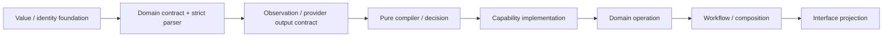

左侧是上游，右侧可依赖左侧。禁止：

- contract 导入 runtime/provider/operation；
- pure compiler 执行 Effect；
- capability 解释 domain success；
- workflow 绕过 domain operation 直达 primitive；
- interface 绕过 operation 重算 decision；
- foundation/architecture contract 反向导入 Source Program、filesystem、language provider 或 placement；
- feedback 形成 runtime import SCC；反馈必须是 typed request/result，由 orchestrator 组合。

### 7.3 Implementation projection

本层只输出 accepted Responsibility Cells、Owner DAG、logical dependency constraints 和 public demand。Facade 是否有真实边界、CodeUnit 角色、package/file placement、单一 `src/` authored root、module admission、局部变更、意图生成与架构迁移统一由 `docs/implementation-architecture.md` 编译。

路径、目录、`index`、package、测试、当前 import 和 facade 均是 implementation observation/projection，不能反向定义 responsibility。实现编译器必须证明实际 Source Program 满足本层 DAG；不能用文档路径清单、命名约定或生成 registry 替代 actual declaration/reference/effect graph。

## 8. Operation、capability 与资源

### 8.1 三层分离

| 层 | 拥有 | 不拥有 |
| --- | --- | --- |
| Capability primitive | bounded filesystem/process/network/container/compiler/Git invocation与physical settlement | domain intent、业务成功 |
| Domain operation | OperationKey、Requirement DAG、业务 invariant、Effect semantics、readback/recovery/terminal | provider实现、跨域工作流 |
| Workflow | 多个 domain operation 的依赖与补偿编排 | 子operation state/authority、primitive |

“原子”表示一个业务不变量完整成立或进入可恢复 typed state，不表示每个函数、文件或 I/O 都公开。对外只公开 query 和 domain operation；primitive/provider 细节保持内部。

### 8.2 单次 Effect 序列

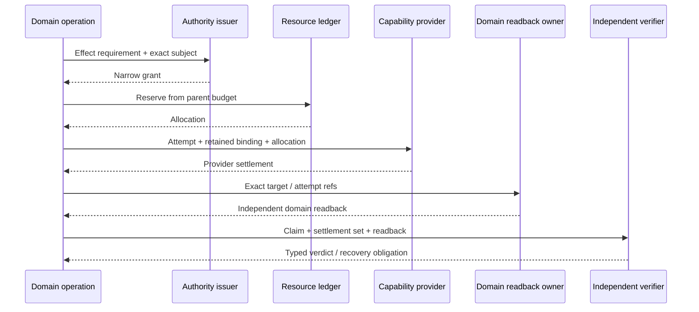

```text
OperationKey       = domain idempotency identity
AttemptNonce       = one physical try
ProviderBindingSet = exact executable/endpoint/principal/credential/cwd/environment closure
TerminalOutcome    = compile(exact planned settlements, independent readback, recovery policy)
```

deadline、provider route、PID、resume session 和 retry 不得生成新 OperationKey。

### 8.3 资源守恒

Parent ledger 至少计量：

| 资源 | 计量语义 |
| --- | --- |
| monotonic time | 一个 absolute deadline；所有 wait/read/effect/readback/cleanup/recovery消费 remaining |
| processes | admitted starts、live peak、terminal count；不得按 child 重开 |
| input/output | aggregate bytes/records；截断不等于忽略消费 |
| filesystem | entries、content bytes、metadata observations、open handles |
| memory/CPU | reservation、peak observation、release |
| network/API | requests、response bytes、rate/credential scope |
| context/tokens | selected facts/clauses、unknown expansion、output |

```text
Σ(reserved children) ≤ parent capacity
Σ(consumed observations) ≤ admitted allocation
release(allocation) occurs at most once
cleanup and readback consume the same remaining ledger
```

短预算 waiter 可以放弃等待 shared in-flight computation，但不能放宽 producer deadline。capability admission 的一次性 retained proof 与每次 invocation 的计量分开，禁止重复收费。

### 8.4 Process 与 Durable Local Effect Worker

Process session 必须绑定 retained executable、cwd、argv bytes、minimal environment、stdin/stdout/stderr bounds、deadline、termination tree 和 pre/post physical identity。裸 shell、ambient PATH/env、callback runner 或 caller-supplied function 不能进入 production Effect。

Durable Local Effect Worker 只拥有：

```text
OperationKey attempt claim
+ run/resume/process lineage
+ opaque provider/domain receipt references
```

它不接受任意 shell/argv/domain callback，不解释 stdout 或业务成功，不复制 domain phase/state machine。domain operation 独占业务 intent、lease、success/readback、retry/compensation 和 terminal。

lost handle 后只允许：

```text
join-live
| consume owner terminal
| execute handle-independent domain readback
| reconcile to typed residue/retry admission
```

有 start 无 terminal/retry admission 时禁止 replay。durable journal 证明“观察过某引用”，不能自行签发 domain truth。

### 8.5 并发与锁序

固定逻辑顺序：

```text
attempt claim
→ domain resource lease
→ provider bindings/effects
→ independent domain readback
→ owner terminal or retry admission
```

session 明确 `single-flight | bounded-parallel(N)`；编排必须遵守，不能为并发新开第二 session。所有 CAS 的 preimage/current/target physical identity 在 Effect primitive 内验证；cleanup 用 nested settlement 保留 primary failure，不覆盖或跳过 residue。

## 9. State、生命周期与恢复

### 9.1 状态域

| State domain | 拥有 | 不拥有 |
| --- | --- | --- |
| Git repository semantic state | candidate/published source and config | external PR/Review、runtime attempt |
| External platform state | hosted refs/PR/status/review/provider facts | local checkpoint 推断 |
| Durable SEC Runtime State | operation/claim/journal/recovery refs | domain truth、Verification PASS |
| Disposable cache | re-computable performance data | authority、Evidence、completion |
| Transaction-local scratch | one transaction staging/residue | durable cross-process truth |

五者物理 roots、identity、retention 和 cleanup authority 分离。root/path 由 retained layout capability 签发；lexical path、symlink/junction/reparse/mount/case/Unicode alias 不能成为 workspace identity。

### 9.2 生命周期

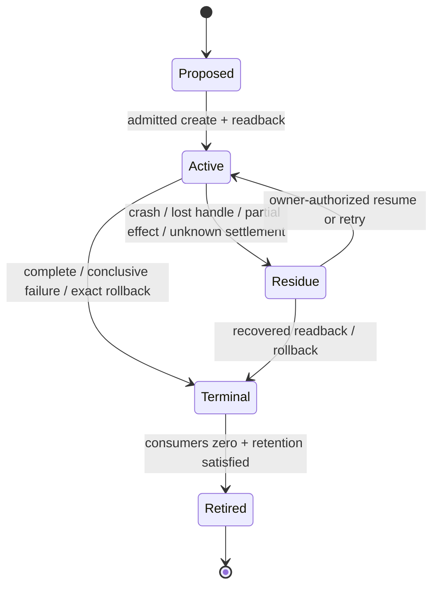

每个 durable state 必须绑定 creator、owner、revision、mutability、readers、invalidation、persistence、concurrency、cleanup、recovery、retirement。exit、return、file exists、pointer 或 test green 不是 terminal。

### 9.3 失败代数

| 失败位置 | 合法结果 |
| --- | --- |
| validation/coverage/eligibility/compatibility unknown | typed unknown/unsupported/conflicted；零 Effect |
| authority/provider/resource unavailable | blocked；Requirement 不变 |
| pre-publication failure | canonical target不变 |
| partial/post-effect failure | exact rollback receipt，否则 recovery-required |
| cleanup/close/readback failure | primary failure + settlement/residue；不得覆盖 |
| Evidence missing/stale | facts不变；依赖 Claim 不得 terminal |
| model不能表达反例 | model/plan/Evidence stale，进入 meta-evolution |

normal reader 只接受当前 active durable grammar。旧 grammar 只进入 migration owner；未知/权限/unsafe/deadline 错误不能 catch 成 `false | null | absent | cache miss` 后触发写入。

## 10. Identity、provenance、cache 与 Evidence

### 10.1 Typed provenance DAG

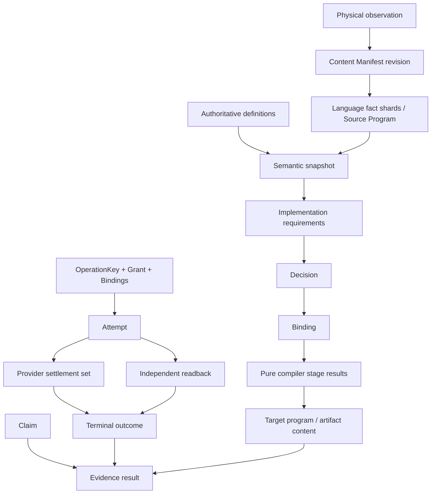

不存在统一 `Generation`：

| Identity | 只绑定 |
| --- | --- |
| Content Manifest revision | logical content set |
| Source Program generation | manifest + interpreter/config closure |
| Semantic snapshot | definitions + admitted observations/unknown |
| Decision/Binding | requirements + policy + eligible candidates |
| pure stage result | exact upstream refs + compiler/backend contract |
| Artifact content | canonical output bytes |
| OperationKey | domain Effect/idempotency |
| Attempt | one grant/binding/allocation execution |
| Evidence | Claim + exact result/environment/outcome refs |

attempt、deadline、cache path、Git session、PID 和 Evidence id 不得污染 pure result identity。

### 10.2 Cache contract

cache 可用当且仅当：

```text
producer closure exact
∧ input closure exact
∧ algorithm/provider identity exact
∧ invalidation complete
∧ bytes/shape validated
∧ active-reader lease valid
∧ size/age budget valid
```

cache/pointer/index/mtime/目录顺序无 authority；missing/corrupt/stale/foreign/GC 后回到同一 clean computation。增量结果与相同输入的 clean full result 必须 byte-equivalent。

### 10.3 Evidence

Evidence 只支持预声明 Claim，不支持“整个系统正确”。Proof owner 检查 subject、inputs、environment、coverage、issuer independence、freshness 和 invalidation。implementation producer、expected profile、projection、fixture、版本数字、报告文字和同模块 self-digest 不能成为独立证明。

Verification 的 Result lattice、ActionKey、复用和 CI/merge 规则由 `docs/verification-governance.md` 拥有；Architecture 只要求其不反向拥有 source、domain result 或 authority。

## 11. Reduction 与演进

### 11.1 图内裁决

全部 source/test/document/provider/state/cache/Effect/Evidence/plan 进入同一因果图：

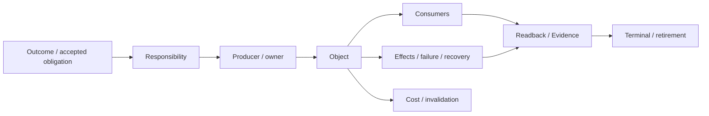

| Disposition | 成立条件 | 动作 |
| --- | --- | --- |
| required | independent responsibility、live consumer/effect/durable state，或 accepted unmaterialized obligation | 保留/实现最小闭包 |
| derivable | 可从 upstream facts 确定性重建 | 删除手写副本；生成 projection |
| duplicate-owner | 多个 producer/parser/writer/issuer 拥有同一 identity | 选 owner、迁 consumer、删其余 |
| dominated | semantics/failure/proof space 被成本不高于它的对象覆盖 | 合并后删除 |
| orphan | live/accepted/historical/external/unknown closure 全零 | 整图删除 |
| unknown | coverage/authority/future obligation 不完整 | bounded blocker；不作保留/删除结论 |

“未来会用”只有形成 owner-issued obligation、activation condition、acceptance、review/expiry 和 retirement 才是 required；comment、dead API、version suffix、test name 不是 future value。

### 11.2 版本与兼容

version/revision/schema 只有真实 durable、cross-process、external 或 rolling migration consumer 能区分两个可观察状态时存在。单 generation、原子迁移、测试自证或名字区分时删除字段/dispatcher/Vn suffix。需要版本时由 grammar owner 提供唯一 constant、literal type、strict parser、unknown-version rejection 和 migration；测试验证旧状态转换与拒绝，不镜像数字。

### 11.3 一次迁移

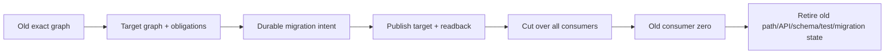

迁移期间只有一个 active authority route。跨提交只能保存 immutable source/target digest、obligation 和 terminal condition，不能保留 executable compatibility facade 或双 writer。失败必须 resume/rollback/recovery-required。

### 11.4 Meta-model evolution

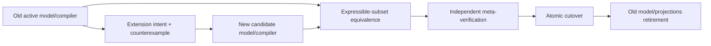

旧 compiler 只授权迁移 envelope，新 compiler 只验证 candidate post-state，独立 verifier 证明旧可表达子集等价和新增 frontier。不能用新模型自证采用，也不能永久双跑两套 truth。

## 12. 文档、原则与 Agent 投影

### 12.1 文档载体

| Carrier | 只保存 | 产生方式 | 禁止保存 |
| --- | --- | --- | --- |
| Accepted decision | 不可推导 outcome/non-goal/tie-break、理由、反转条件、issuer | authorized decider 一次签发 | current path/provider/test/status |
| Stable spec | Definition/invariant/forbidden authority/activation/retirement | domain owner contract | implementation inventory、事件日志 |
| Machine contract | identity、schema/parser、capability、rejection | canonical code owner | rationale副本、runtime result |
| Generated projection | applicability、roles、closures、obligation、unknown、人/AI view | compiler | manual edits、Effect/PASS |
| Runtime/Evidence | attempt/journal/receipt/failure/external observations | runtime/verification owner | stable design truth |

### 12.2 Constitution projection

| Constitution | canonical owner | SEC projection owner | runtime consumer |
| --- | --- | --- | --- |
| Design Calculus | `docs/design-calculus.md` | 本文件的 relation/compiler profile | DesignAdmission 与 architecture attack compiler |
| Engineering Constitution | `docs/engineering-constitution.md` | 本文件的 SEC owner/effect/resource/evolution profile | DesignAdmission |
| Agent Constitution | `docs/agent-constitution.md` | `docs/development-governance.md` | BehaviorAdmission |

```text
EffectiveAction =
  BehaviorAdmission
  ∩ DesignAdmission
  ∩ active EffectGrant
  ∩ available Provision / Allocation
```

Agent principle 不能创造 engineering truth；engineering principle 不能授权 Agent。SEC profile 只能收窄和实例化上游原则，不能复制或改写；聊天、summary、memory、Skill 不补缺项。

### 12.3 单一语义、多种精确表达

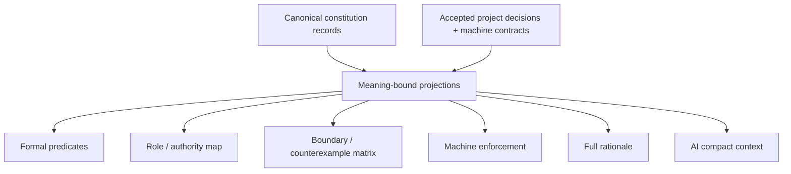

多种表达允许长度和形式不同，目的是消除歧义：

| View | 优化目标 | 必须保留 |
| --- | --- | --- |
| full rationale | 定义、推导、方案比较、反转条件 | 全部 semantic meaning |
| formal | 可判定谓词、状态机、truth table | exact constraints/unknown |
| role | issuer/owner/consumer/handoff | authority separation |
| boundary | 正反例、failure/recovery、retirement | rejection semantics |
| enforcement | type/schema/parser/lint/admission/CI | reachable machine rejection |
| AI compact | 当前 question 的最小 closure | 同一 blockers/unknown |

所有 views 引用同一 principle meaning；任何 view 增删 Claim、owner、unknown 或 blocker 都拒绝发布。完整解释可以严谨且较长，但不得复制 current facts；信息密度由按需 projection 提升，不靠删条件。

root `AGENTS.md` 是通用 Agent Constitution 经 SEC Development Governance 收窄后的 generated bootstrap projection，`owns: []`。其生成、load receipt、BehaviorAdmission、self-evolution 和 instruction/data separation由 `docs/development-governance.md` 拥有；它不成为第四份原则 owner。

### 12.4 文档实时同步

```text
stable clauses
+ authority registry
+ machine contracts
+ Source Program consumer/effect facts
→ clause/owner/consumer/invalidation graph
→ full human + compact Agent + admission/obligation projections
```

stable prose 只在不可推导 decision/invariant 改变时修改；实现/path/provider/test/maturity 变化更新 machine source 并重编 projection。stable 改变而 machine consumer 无 delta 是 `unmaterialized-stable-decision`；实现变化导致 stable prose current 镜像是 `derived-fact-in-stable-spec`。

## 13. Repository、测试与 AI 读取闭包

### 13.1 Reconciliation Projection

每个逻辑纵切片后，从 before/after Source Program 编译：

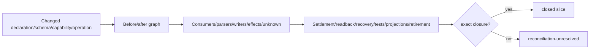

关系只用 `declares | produces | parses | reads | writes | executes | settles | reads-back | recovers | caches | projects | verifies | migrates | retires`。Git commit 只能封存 closed slice，不能创造 closure。

### 13.2 测试架构

测试存在当且仅当观察至少一种不可由更低成本 machine boundary 完全拒绝的性质：

| Test semantic class | 观察 |
| --- | --- |
| behavior | public input/output/state transition |
| durable | write → strict readback/digest/recovery |
| Effect | real/fake-provider sentinel with exact zero/nonzero side effects |
| failure boundary | typed error、abort、CAS、unknown、residue |
| physical safety | no-follow/identity/replacement/cleanup |
| algorithm/property | equivalence、monotonicity、invalidation、closure |
| protocol/external | producer/consumer compatibility |

源码文本、路径布局、函数 arity、内部数组、版本数字、测试数量、sleep 和 presentation string 不是独立 proof。能由 type、strict parser 或 closed-world graph 完整拒绝的非法状态不再增加镜像 runtime test。owner-local tests 与 source 相邻；跨 owner/system/e2e proofs 进入 `tests/**`，不镜像 source tree。

### 13.3 AI 最小读取

Agent 初始只消费：bootstrap router、accepted task/outcome、目标 owner clause、public operation、changed symbol 的 exact consumer/effect closure、unknown frontier 和受影响 tests。Read Plan 绑定 source revision、package/owner identity、required/conditional refs 与 byte/context budget；路径相邻、旧聊天、名字相似或“熟悉仓库”不能扩张读取。

## 14. Continuous Architecture Attack Compiler

### 14.1 触发与输出

| 时点 | 自动攻击 |
| --- | --- |
| goal/model proposal | competing model、unrepresentable case、delete counterfactual、reversal |
| responsibility/placement | duplicate owner、SCC、reverse edge、facade、co-change cost |
| operation plan | grant amplification、provider substitution、budget conservation、crash/retry |
| implementation delta | missed producer/consumer/parser/writer/test/projection/old edge |
| terminal/Evidence | self-proof、stale/replay、missing readback、cleanup/residue |
| production counterexample | invalidate model/plan/Evidence、meta-extension、retirement |

```text
AttackClosure =
  reverseClosure(
    changed subjects ∪ proposed claims,
    constraints ∪ authority/effect/failure/resource/evolution edges
  )
```

每个 attack 绑定 L1 relation、L2 constraint、exact target、owner 和 witness。停止条件：closure 内全部为 `refuted | mitigated | authorized-waiver | bounded-unknown`，且 ledger 允许继续。waiver 仅适用于 constraint owner 明确可豁免项；identity、authority non-amplification、semantic truth、durable integrity、Evidence honesty 不可豁免。

### 14.2 攻击族

| Attack | 预期不变量 |
| --- | --- |
| identity alias/rename/ABA | identity≠Address；pre/post retained physical identity |
| stale/replay/clock drift | revision/epoch + monotonic deadline；无 latest/wall authority |
| unknown/partial coverage | unknown 不能降为 absent/mismatch/cache miss |
| confused deputy/origin spoof | non-forgeable issuer；delegation只收窄 |
| provider/credential/env substitution | exact binding + minimal env + pre/post revalidation |
| reentrancy/race/deadlock | declared concurrency + linearization + global lock order |
| crash/partial/lost handle | durable intent + settlement + independent readback + no blind replay |
| cancellation/resource exhaustion | one parent deadline + aggregate irreversible ledger |
| cache poisoning/delta divergence | full key + clean equivalence + cache no authority |
| schema/version drift | strict owner parser + migration-only old grammar + one normal generation |
| binary/polyglot/generated source | bytes census + interpreter/opaque coverage |
| supply chain/tool replacement | conformance/security/license/identity/exit + old owner zero |
| cross-platform filesystem | retained physical binding; symlink/junction/reparse/mount explicit |
| secret/diagnostic leakage | minimal env/projection + raw bytes retention owner |
| self-proof/mirrored test | independent Claim Evidence; no implementation oracle |
| compatibility/retirement | real coexistence window + atomic cutover + migration removal |
| speculative abstraction | accepted obligation or proposal-only |
| offline external provider | domain requirement stable; legal alternative binding or blocked |
| instruction injection/context loss | canonical constitution + data/instruction separation + re-admission |
| performance/repeated scan | shared snapshot/facts/terminal; no correctness weakening |

## 15. 无代码逻辑验证

架构设计发布前必须对 safety、liveness、determinism、recoverability、extensibility 和 economy 做模型演算。

### 15.1 必须保持的性质

| Property | 形式化条件 |
| --- | --- |
| No authority amplification | every Effect has live Grant; child scope ⊆ parent scope |
| No implicit truth | unknown/opaque/conflict cannot become positive Claim |
| At-most-once business Effect | one OperationKey claim; replay requires conclusive readback/retry admission |
| Exact settlement | planned provider requirement set = settled receipt set |
| Independent proof | Claim producer ≠ sufficient Evidence issuer |
| Deterministic pure compile | same semantic inputs/algorithm ⇒ byte-identical pure outputs |
| Recoverable progress | every admitted Effect reaches terminal or typed recoverable residue |
| Single active generation | after cutover, old writer/parser/route consumer count = 0 |
| Bounded execution | all observations/effects/cleanup consume one parent ledger |
| Incremental equivalence | warm/delta output = clean output for same exact inputs |
| Extensible core | new language/provider/Target adds provider/domain facts, not brand switches in core |
| Correct-change economy | new mechanism reduces or preserves owner/scan/state/test/context cost |

### 15.2 Reference traces

#### Read-only query

```text
S0 question
→ S1 exact snapshot
→ S2 facts + coverage
→ S3 semantic answer or bounded unknown
→ projection
```

No EffectGrant, Allocation for child processes, cache write, journal or mutation is implied. If persistence is desired, it becomes a separate Effect operation.

#### Mutation with concurrent replacement

```text
pure plan(preimage A)
→ grant/binding/allocation
→ pre-effect retained readback sees B
→ CAS conflict
→ zero target Effect
→ stale plan/Evidence
```

Continuing with A, overwriting B, or translating conflict to cache miss violates Identity, Authority and Effect constraints.

#### Crash after external Effect

```text
operation claim + durable intent
→ provider start
→ client loses handle
→ current domain readback
   ├─ target exact: synthesize owner recovery terminal
   ├─ conclusively not applied: owner may issue retry admission
   └─ unknown/partial: recovery-required
```

PID absence, timeout or missing journal pointer never selects the retry branch.

#### Provider replacement

```text
Requirement unchanged
→ candidate Provision B
→ eligibility/conformance/security/license
→ new exact Binding
→ behavior/failure/readback equivalence
→ migrate consumers
→ old Binding/provider owner consumer-zero
```

Adding B beside A without cutover/retirement is duplicate-owner, not resilience.

#### Meta-model counterexample

```text
counterexample not expressible by active M
→ all dependent complete/plan/Evidence stale
→ candidate M'
→ equivalence over M-expressible universe
→ new frontier validation
→ independent cutover
→ retire M
```

Special-case flags or a second analyzer fail Single Active Generation.

#### Agent resume after context loss

```text
canonical Agent Constitution projection
+ accepted task authorization
+ current live observations
+ active operation/runtime refs
→ BehaviorAdmission
→ same legal next action or typed blocker
```

Conversation summary and memory can locate facts but cannot recreate authority.

### 15.3 SEC adversarial reference suite

以下场景是通用故障族在 SEC 的实例化，不保存 current completion。每个场景的实现状态由 exact Source Program、runtime facts 和 Evidence 计算。

#### Source、owner 与结构

| Scenario | Generic faults | Target model trace | 实现前必须证明 | 必须阻断 |
| --- | --- | --- | --- | --- |
| authored source 物理收敛到 `src/` | F13/F24 | responsibility graph → placement compiler → transactional move → consumer readback → old path retirement | imports/config/package/tests/generation/unknown closure；semantic identity 不含 path | 手工批量移动后保留 alias、第二 source root 或路径镜像 |
| `project` 与 workspace 语义 | F01/F13 | Product/Domain Subject → workspace/project Address projection | workspace=被 SEC 操作的 IDE 工作区；project 名称只在真实 domain identity 必要时保留 | 用目录名创造身份或在多处复制语义 |
| 大文件拆分 | F12/F24 | declaration/reference/effect graph → responsibility cells → acyclic internal owners | public exports 等价、反向边零、变化协同提升 | 按行数搬运、空 index、循环 facade |
| contract/index/facade | F12/F16 | real external consumers → minimal public contract → one-way facade | consumer>0、surface 收窄、无状态、无反向 import | 为“整洁”造 barrel；为解环隐藏依赖 |
| package 与顶层目录 | F12/F24 | owner DAG + lifecycle + deployment unit → package boundaries/paths | 每个 package 有独立 release/runtime/consumer 边界；否则是 cell 内目录 | 按历史 `platform/tooling/scripts` 或工具品牌分散所有权 |
| import 顺序与依赖方向 | F12/F24 | compiler symbol graph → cycle/forbidden edge → codemod plan | value/type/dynamic/re-export/callback/string-code edges 全纳入 | 仅格式化 import 文本、允许 type-only 反向环 |
| 可执行源码藏在字符串 | F13/F21 | exact bytes → embedded-program parser → second-source finding | code-bearing string 的 language/owner/consumer/unknown | 字符串逃逸 Source Program 和 impact |
| duplicate implementation/provider | F05/F12/F13 | identity clustering → consumer/effect comparison → unique owner cutover | semantic/effect/failure closure 等价或有明确差异 owner | 仅因名字不同保留两套 resolver/scanner/wrapper |
| 无当前 consumer 的未来设计 | F16/F18 | accepted future obligation → proposal-only spec → activation compiler | outcome、activation、owner、cost、proof、retirement | 以 `rg` 零盲删未来业务；active 空壳占用生产图 |

#### Capability、资源与外部 Effect

| Scenario | Generic faults | Target model trace | 实现前必须证明 | 必须阻断 |
| --- | --- | --- | --- | --- |
| repository exact snapshot | F02/F05/F07/F19 | one semantic session → ordered reads → membership/tree/ref readback → receipt | exact revision/tree、single-flight、aggregate records/output/deadline、session terminal | 多 wrapper 裸调用、每层新 session、同 session 并发非重入 |
| hosted API/credential | F04/F05/F18 | endpoint/principal/credential provision → repository binding → bounded semantic operation | immutable host/repository/principal/credential epoch；ambient variables 不可改路由 | 继承 ambient credential/config、transport 自报语义 |
| Windows external CLI | F01/F05/F08 | authenticated materialization → retained executable/cwd → child image boundary → settlement | archive/tree/loader/dependency/readback、same-handle identity、typed unavailable | PATH fallback、测试 capability 冒充 production |
| Docker daemon 启动 | F06/F08/F10/F15 | root discovery → OperationKey claim → launcher binding → durable attempt → daemon/domain readback | launcher lock address 可导出且存在；并发 join；lost-handle readback；local terminal | 空 lock path、固定 sleep、重复启动、只看 launcher exit |
| local/remote execution | F05/F18 | Requirement 保持 → eligible local or remote Provision → exact Binding | offline 时本地 provision 满足同一语义/资源/证明；不满足则 typed unavailable | “远程耗尽”直接降低验证或绕 provider |
| process 统一资源原子 | F06/F07/F08/F22 | operation context → retained process provision → child allocation → descendant settlement | wall/process/input/output/records/descendants/cwd/executable 全计量 | raw spawn、unretained 与 retained 同时公开、静态预算不计实际 child |
| long Effect/lost handle | F08/F10/F15 | durable intent → worker claim → progress → readback/join/recover → terminal/residue | at-most-once、crash points、unknown 不重试、journal retirement | caller 断开后重发、PID/lock absence=not applied |
| absolute deadline/cancel | F06/F09/F22 | top operation derives deadline once → every read/lock/effect/cleanup consumes remaining | monotonic remaining、ceiling、signal at every wait/effect、primary+cleanup errors | `NaN/Infinity`、每层重置、cleanup 越界覆盖主错误 |
| directory/content scan | F06/F19/F22 | shared exact snapshot/fact shard → streaming observations → aggregate ledger | entry/bytes/depth/time/signal；不额外预扫；incremental=clean | 只限 entries、不限 bytes；为计数全遍历两次 |
| mature tool/library adoption | F05/F13/F23 | requirement gap → stable machine interface → direct use or justified thin adapter | provenance/security/license/settlement/cost；old custom graph retirement | 自写低质 parser/scanner/wrapper；presentation 当协议 |
| developer machine tool capability | F04/F05/F18 | capability census → standing provision ledger → task binding or typed unavailable | version/source/integrity/platform/scope；安装升级是独立授权 Effect | 每任务 `Get-Command` 后临时安装；全局工具存在即获得业务 authority |
| dependency freshness/update | F05/F11/F20 | semantic requirement → eligible versions → exact lock/integrity → upgrade/migration plan | “latest”只作候选；兼容/安全/平台/行为/迁移/回滚共同裁决 | 仅因版本旧就升级；依赖锁、runtime profile 与测试不同步 |
| Bun-only runtime | F05/F20/F24 | accepted runtime profile → package/toolchain/provider closure → one generation | Node-specific public runtime consumer-zero；dependency/scripts/CI/distribution 一次切换 | 声称 Bun-only但保留 Node runtime owner或兼容双路 |

#### Compiler、facts 与性能

| Scenario | Generic faults | Target model trace | 实现前必须证明 | 必须阻断 |
| --- | --- | --- | --- | --- |
| Source Program 唯一 snapshot | F02/F12/F13/F19 | exact tree/worktree observation → declaration/reference/capability facts → shared consumers | typecheck/audit/test-impact 使用同一 revision/fact identities；unknown 显式 | 各自重扫、第二 AST graph、正则改变语义 |
| TypeScript authoring/typecheck | F05/F06/F19 | canonical checker provision → ActionKey → affected facts → incremental terminal → frozen final Evidence | provider identity/no fallback、args/environment/project/deps/tree、cold/warm/delta 等价 | generic/native 双 owner、每次 full `tsc`、daemon 复制 truth |
| Windows ACL/Runtime State proof | F06/F19/F22 | retained native OS observation → content-addressed fact → cross-process validation | 与旧强度等价、subject/ACL/host epoch/expiry、mutation invalidation | 每进程启动重型 shell、缓存 path-only PASS |
| Typecheck terminal reuse | F02/F19 | exact ActionKey → authenticated in-flight/terminal/failure → join/reuse | source/toolchain/config/dependency/environment/claims 全绑定 | 其他源码状态旧 PASS、same mtime hit、失败不变仍重跑 |
| Test Impact | F02/F12/F13/F19 | Source Program delta → canonical test predicate/consumer graph → zero-effect plan | test identity 不仅 `tests/**` 正则；cache on/off byte-equivalent；plan 无写入 | 复制测试识别器、计划写 cache、路径名字决定影响 |
| import rewrite automation | F12/F24 | semantic move plan → compiler rename/reference edits → format → graph readback | alias/re-export/config/generation/tests 全闭合；old paths zero | 手工改路径、每次再跑独立 import repair |

#### Durable contract、migration 与 lifecycle

| Scenario | Generic faults | Target model trace | 实现前必须证明 | 必须阻断 |
| --- | --- | --- | --- | --- |
| dependency transition journal | F03/F10/F11/F20 | strict current reader → typed legacy detection → one-shot migration intent → new immutable root → old evidence retirement policy | writer/parser/schema/provenance/owner physical/topology/digest/lease/CAS/readback | 同 `v1` 静默加字段、默认 null、正常路径双读、parse failure=cache miss |
| compiler-issued provenance | F01/F03/F10 | producer capability receipt → binding/stage/publish lifecycle → recovery readback | stage/active/locator 由同 owner lease 签发；foreign same-content tree 不可冒充 | stamp 自带 path 成为 authority、born/bind 在 lease 外 |
| readiness/read error | F03/F22 | strict observation → ready/absent/mismatch/unresolved discriminant | permission/reparse/deadline/IO/unsafe path 保留 typed cause，unresolved zero Effect | catch-all `false/null` 后 install/publish |
| schema/parser library | F11/F13 | domain schema owner → mature strict parser implementation → retained bytes/readback | duplicate/unknown/trailing/version/provenance/invariant；writer/reader 同 owner | 为未来“可能用”保留无 consumer library facade；手写 cast 假解析 |
| version/revision | F11/F13/F18/F20 | durable/external states census → consumer branch → current schema + migration/retirement | 至少两真实状态、reader/migration、support window；测试语义转换 | `Vn` 名字、纯数字断言、无 reader 的 format 字段、永久兼容 |
| cache/fact state | F02/F03/F19 | exact derivation inputs → content address → validator → hit/miss/retire | producer/environment/algorithm/source digest、corruption/unknown typed rejection | mtime/path/process memory 成为 authority |

#### Product graph、测试与治理

| Scenario | Generic faults | Target model trace | 实现前必须证明 | 必须阻断 |
| --- | --- | --- | --- | --- |
| Block/Slot 历史模型 | F13/F16/F20 | accepted product capability → semantic domain operations + typed ports → legacy consumer migration | 老系统真实当前价值、未来设计目的、新需求都映射且目标模型更强；consumer-zero 后退休 | 先删再设计、把品牌名保留为 core identity、换一套空抽象 |
| browser/Playwright/Workbench 退役 | F03/F16/F20 | product non-goal → full producer/consumer/artifact/provider/test census → capability graph cut | 目标工作区浏览器能力与 SEC 自身 UI/runtime 区分；仍有 consumer 则先迁移/裁决 | 只删测试、只删前端、生产 Node/browser 路径残留 |
| test value/reduction | F13/F14/F18 | test AST+symbol/effect graph → behavior/durable/effect/failure/property/protocol classes → disposition | replacement IDs、producer/consumer/external/future obligation、unknown；不按数量 | 路径/版本/arity/实现清单镜像；把所有数字或所有旧测试当垃圾 |
| business 尚未实现 | F16/F18 | accepted Definition/future obligation → target behavior scenarios → implementation frontier | 用户业务价值与 future intent 持久存在；current 能力明确未完成 | 用 current consumer-zero 删除 accepted target；测试假装闭环 |
| Semantic Mutation plan | F04/F08/F10/F14 | read-only plan 与 effectful preparation 分型 → grant/lease/staging journal → verification | public `plan` zero Effect；effectful path 有授权/settlement/recovery；caller projection 不自授权 | 把建目录/复制/写 staging 称纯 plan；journal 复用伪 authorization |
| docs/原则同步 | F13/F17/F24 | canonical constitution/domain decisions → generated human/Agent/machine projections → drift compiler | 每项只有一个 owner；current facts 不写 stable spec；views meaning-equivalent | AGENTS/Skill/说明文各复制原则；文档先替代码签能力 |
| Skill | F04/F13/F17 | non-machine-decidable judgment → bounded heuristic → machine migration when decidable | trigger/evidence/actions/stop/reversal；不提供事实/能力/权限 | 把可预见工程规则长期塞 Skill；Skill 阻止修其错误前提 |
| subagent | F04/F07/F17 | independent DAG cell → narrowed envelope → reconciliation → parent integration | 非重叠写集、exact I/O、净收益、父级验证 | 为占槽并发、子 agent 自签完成、共享文件竞写 |
| dirty worktree/integration | F02/F10/F24 | ownership/preimage census → preserve set → isolated task delta → exact integration/readback | 用户/外部/本任务状态分离；冲突语义取舍；丢失内容可追溯 | 无脑搬全部、reset/clean、靠 Git dangling object 当正常状态 |
| junction/reparse/local cleanup | F01/F08/F24 | registry ownership + retained physical root → no-follow census → exact delete plan → post-readback | target在授权root内、无live child/handle、junction本身与target分离、residue可保留 | 普通递归删除跟随junction；超时后把残留当成功 |
| commit/push/merge | F02/F08/F15 | closed logical slice → exact staged delta → commit → push/merge Effect → remote/new-main readback | 业务闭包和 reconciliation 在提交前；响应丢失只 readback；旧 refs/branches按授权退役 | 改一个文件就提交；无限等待；重复 push/merge；未授权清理 |
| hosted CI 与本地容器 | F05/F14/F18 | Claim Requirement → eligible local/hosted executor binding → Evidence normalization | 两者证明同一 Claim 时合同等价；GitHub Action 不是 Gate authority；本地环境可独立结算 | 只因 provider 绿色即 merge；远程不可用时降低 Claim |
| Git/branch 历史工作吸收 | F02/F13/F18/F24 | all refs/worktrees/commits census → semantic delta classification → smallest superset → old refs retirement | merge/superseded/evidence/experiment 分类、exact content preservation、unknown | 按 branch 名或 ahead/behind 盲合；把聊天当唯一找回索引 |

#### 场景统一伪接口

```text
compileSecScenario(scenarioId, exactFacts):
  generic := DesignCalculus.faultFamilies(scenarioId)
  principles := EngineeringConstitution.applicable(generic)
  profile := SecArchitecture.requirements(scenarioId)
  model := DesignCalculus.compile({ generic, principles, profile, exactFacts })
  return {
    purePlan: model.purePlan,
    requiredObservations: model.observationPorts,
    forbiddenEffects: model.rejections,
    proofObligations: model.proofs,
    migrationAndRetirement: model.evolution,
    unknownFrontier: model.unknown
  }
```

该接口是设计规格，不是 runtime 万能 dispatcher。领域实现仍由各 owner 拥有；architecture compiler只生成关系、obligation、rejection 和 frontier。

### 15.4 Design exit

```text
ArchitectureDesignClosed =
  product capabilities map to S0–S9
  ∧ every relation has one owner
  ∧ every hard constraint has a reachable rejection
  ∧ every Effect has resource/settlement/recovery
  ∧ every Claim has independent proof semantics
  ∧ every future obligation has activation/reversal/retirement
  ∧ reference traces satisfy all properties
  ∧ no competing owner, facade, graph, cache, state machine or prose mirror remains
```

未满足时输出 exact frontier 和 owner；不得以“设计文档已写”“测试以后补”“AI 会注意”或兼容层结束设计。

## 16. Architecture Evolution transaction

代码布局、package owner、public entry、durable schema、operation/resource contract 或依赖方向变化必须作为一次可恢复 transaction：

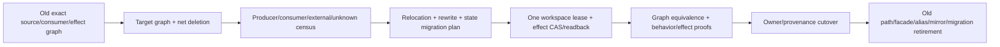

Plan 绑定 source revision、preimage/target physical identity、old/new graph digests、unknown frontier、operation obligations、verification closure 和 terminal deletion set。crash/CAS failure 只能 resume、exact rollback 或 recovery-required。完成必须证明 target active、old consumer-zero、unknown 为零或 bounded、义务未缩小、净状态/代码/维护扇出下降，并退役 transaction 自身。
