# 系统架构与权威流

本文只拥有 SEC 的总体对象分层、两条产品主链、canonical/projection 边界、状态类别、跨域引用、单写者和依赖方向。产品目标由 `docs/product.md` 拥有，阶段依赖由 `docs/roadmap.md` 拥有；领域内部字段、当前实现能力和具体文件集合分别由领域代码合同、最新 `main` 和机器 registry 拥有。

## 总体闭环

SEC 是 Engineering Workspace Compiler。它不是一条“从 YAML 生成文件”的单向流水，也不是一套自由式 Agent 脚本，而是围绕同一工程语义核心形成两个方向的闭环。

### 既有工程治理链

```text
Existing Workspace
→ Physical Workspace Observation
→ Source Program Model
→ Engineering Semantic Model
→ Responsibility / Delta / Impact
→ Operation / Authorization / Plan
→ Transactional Mutation
→ Verification / Evidence
→ Publish / Recovery / Readback
```

### 确定性工程生成链

```text
Product Intent / Contract / Block
→ Engineering Semantic Model
→ Application IR
→ Behavior IR
→ Implementation Resolution
→ frozen Implementation Binding
→ Target Program IR
→ Backend
→ Source / Test / Config / Artifact
→ Verification / Evidence
```

两条链共享 Engineering identity、Responsibility、State、Operation、Policy、Permission、Effect、Scenario、Acceptance、Provenance 和 Verification truth。Brownfield 不能建立一套“源码图语义”，Generator 也不能建立另一套“模板语义”，Implementation Resolver、Block Resolver、Provider Registry和Workbench也不能各自建立实现选择真值。

### 产品回路

```text
canonical state
→ query / projection / Workbench / Context Packet
→ user or AI proposal
→ platform-owned Operation ingress
→ plan without live writes
→ apply under transaction and CAS
→ canonical rebuild / implementation re-resolution
→ actual Semantic / Binding Delta and Impact
→ Compatibility / Verification / Migration decision where applicable
→ accepted | rejected | rolled-back | recovery-required
→ projections reload from accepted canonical revision
```

UI、CLI、HTTP、AI Adapter 和 Provider 都只能通过同一个产品 adapter 消费该回路，不能各自维护写路径、实现选择、兼容性或成功状态。

## 四种不同身份

- **Authority**：谁有权声明、修改或裁决输入和策略。
- **Canonical state**：由确定性 producer 从受权威输入构建、验证和冻结的工程状态。
- **Evidence**：某个来源、方法、revision 与环境下的观察、测量、执行或推断。
- **Projection / Artifact**：为用户、工具、运行目标或治理消费者生成的输出。

同一个物理文件可以承载其中一种身份，但路径、格式、Git 状态或被多个消费者读取不会自动改变它的身份。Evidence 不能通过 confidence、多数票或 UI 接受动作自动成为 authoritative Fact；Projection 也不能反向修改 canonical state。

## 核心对象层

### 1. Authoring 与显式决策

拥有产品意图、Semantic Contract、Block 引用、Policy、受治理源码、Implementation constraints、Rule-backed Override、Migration decision 和显式 Adopt decision。

Authoring Source 是可修改的权威输入，不等于所有源码。Registry source、generated artifact、cache、Evidence、IR JSON、ResolutionDecision、journal、UI state 和外部 Provider 输出默认都不是 Authoring Source。

### 2. Physical Workspace

表达 exact revision 下物理存在的对象：repository、workspace、package、file、directory、config、test、workflow、resource、generated output、runtime materialization 和 release artifact。

Physical Workspace 只回答“看见了什么、如何定位、由谁物理拥有、哪些区域不可读或受保护”，不自动解释业务 Responsibility。它必须显式保留 tracked/untracked/ignored、content/object identity、mode、encoding、symlink/reparse、case/Unicode、generated/vendor/secret/opaque 与 unknown。

Repository、Documentation、Workflow/Gate、Agent Operations、Release、Product Decision 和 Evidence Ledger 等 Workspace Domain 在出现真实 consumer 时逐域建立独立 raw/validated boundary；不能先创建一个巨型 optional Workspace object。

### 3. Source Program Model

Language、Compiler、Static、Runtime 和 Build Provider 把 Physical Workspace 提升为 observed/derived 源码模型，表达：

- workspace、package、build target、file、module；
- symbol、declaration、type、reference、source span；
- import/export、resolution、call candidate；
- control/data-flow、state/effect/error/permission candidate；
- framework/config/resource binding；
- generated、vendor、protected、opaque、ambiguous 与 unresolved region。

Source Program Model 有独立 identity、revision、validator、canonical ordering、coverage 和 provider provenance。它不是 Engineering IR，Provider 私有 ID、绝对路径或模型 confidence 不能自动成为跨重建 semantic identity。

### 4. Engineering Semantic Model

Engineering IR 是 SEC 接受的 canonical engineering semantics，拥有 stable Entity、Fact、Assertion、Semantic Contract、Responsibility、State、Operation、Policy、Permission、Effect、Scenario、Acceptance 和 semantic revision。

它回答：

- 哪些工程对象存在；
- 哪些陈述成立；
- 谁以什么 authority 和 provenance 作出陈述；
- 哪个对象承担什么责任和边界；
- 哪些未知、冲突和 opaque 必须保留。

Source observation、AI interpretation 和 Provider analysis只能产生 observed/inferred Assertion 或 candidate binding。Reconcile/Adopt 的显式 policy 决定哪些输入可以进入 canonical authority；不能通过 strongest-wins、last-write-wins 或多数票压缩来源。

### 5. Responsibility、Delta 与 Impact

Responsibility 是 Engineering Semantic Model 中的稳定工程责任对象；它绑定 owned state、operations、effects、permissions、contracts、resources、source/artifact bindings 和 lifecycle。Responsibility reconstruction 可以从 Source Program Model 生成候选，但候选保持 `authoritative: false`，直到显式 Adopt 或 canonical rule 取得 authority。

Delta/Impact authority分离并比较 independently validated endpoints：

- Fact/Assertion Delta只比较canonical semantics；
- `ImplementationBindingDelta`只比较old/new exact Binding集合；
- Semantic / Implementation Impact传播到Responsibility、consumer、Artifact、dependency、runtime、Verification、release和support surfaces；
- Change Management消费Delta/Impact与Evidence，产生Compatibility Decision和Migration，不重做Comparator；
- Actual Delta不能由Resolver、UI、Migration或测试结果提交。

实现切换不能伪装成源码文本变化，也不能自动改写Semantic Contract。Changed files、测试列表、AI 风险评分、semver和 UI 边方向都不能替代 canonical Delta/Impact 或 Compatibility。

### 6. Operation、Authorization 与 Plan

任何用户、AI、CLI 或 Workbench 写请求都必须进入版本化 Engineering Operation：

```text
intent
+ semantic target
+ expected revision
+ implementation constraints / preferences where applicable
+ requested effects
+ required permissions
+ must-preserve / forbidden effects
+ verification obligations
```

平台从 caller capability、Operation Registry、semantic target、source owner、physical path/region、Policy、Provider capability、minimum Verification 和 current revision 的交集重新派生 authorization。

Planner 只读地解析 owner/path、运行 isolated transform、重建 canonical state、计算preview Resolution、Delta/Impact和Verification union，产生 immutable plan 或 blocked diagnostics。Caller 不能提交 derived path、Eligibility、Decision、Binding、Delta、Impact、risk、rollback 或 terminal status。实现选择输入只能表达受治理的constraint、preference、require、forbid、pin或custom request；所有derived结果由平台重新计算。

### 7. Transactional Mutation

Mutation 把合法 Operation 计划应用到 Authoring/Governed Source：

```text
validate expected plan
→ acquire unique writer authority
→ reread live inputs and re-plan / re-resolve
→ source + semantic CAS
→ durable journal
→ stage exact write set
→ pre-publication Verification
→ publish
→ live canonical rebuild / re-resolution
→ actual Semantic / Binding Delta and Impact
→ Compatibility / Migration checks where applicable
→ post-publication Verification / readback
→ accepted | rejected | rolled-back | recovery-required
→ cleanup receipt
```

不存在 partial-success。无法证明 accepted 或 exact prior-state rollback 时必须进入 recovery-required。Semantic Mutation 唯一拥有单次 source/canonical transaction 的 journal、publish、rollback 和 recovery；Change Management只拥有跨版本Compatibility、migration、compensation、forward recovery 与 irreversible boundary；Delta/Impact只拥有结构变化和传播事实。

### 8. Verification 与 Evidence

Verification 分离：

```text
Requirement / Claim
→ Gate definition
→ physical observation / execution record
→ owning-environment-aware aggregate
→ Decision / merge or product consumer
```

Result 至少区分 `passed | failed | not-run | unsupported | invalidated`，并独立记录 executed/reused/not-executed、applicability、environment、input closure、artifacts、cleanup、expiry 和 invalidation lineage。

Verification PASS 只证明 exact requirement 和 input closure；不能自动证明Eligibility、Compatibility、packaged/deployed 或 product-supported。Evidence Ledger 拥有 record、freshness、coverage、bias、expiry 和 references；Engineering IR 只保存 Assertion 对 Evidence identity 的引用。Provider或Implementation candidate的conformance、benchmark、安全、许可证和运行结果都是Resolution/Compatibility的输入Evidence，不是最终实现选择或迁移authority。

### 9. Implementation Resolution

Implementation Resolution 只消费validated Engineering/Application/Behavior requirements、Target capability、repository existing-stack facts、用户/组织约束、Provider/Adapter catalog Evidence与版本化Resolution Policy，产生：

```text
Implementation Requirement
→ canonical candidate closures
→ Eligibility Results
→ Resolution Decision
→ exact frozen Implementation Binding
```

它不拥有：

- 产品或业务Semantic Contract；
- Source Program观察和Provider分析事实；
- Registry trust和Block内容绑定；
- package/lock写入和安装；
- Host/Target物理支持；
- Fact/Binding Delta与Impact；
- Compatibility、Migration或retirement decision；
- Verification结果；
- Target Program打印和Artifact发布。

正确性、安全、权限、Target、许可证和dependency闭包等硬条件先过滤；unknown/conflict保持显式；优化policy只作用于合格候选；仍并列时使用稳定tie-break。相同完整输入必须产生相同Decision与Binding。Generator、Backend、Adapter、UI、Block Resolver和package materializer不得重新选择实现。

Block Capability Resolution与Implementation Resolution为上下层不同协议：Implementation Resolver可以请求一个受约束的`block-delivered`候选；Block Resolver只在其Registry/Block领域内返回冻结BlockProviderBinding，不能替产品决定原生、参考、既有、自定义或Block实现谁更优。

### 10. Target Compilation

Target compilation 只消费 validated Engineering Semantics、显式 Target Profile和冻结的ImplementationBinding：

```text
Engineering Semantic Model
→ Application IR
→ Behavior IR
→ Implementation Resolution
→ exact Implementation Binding
→ Target Program IR
→ Backend
```

- **Application IR**：目标无关的 module/service/data/state/operation/policy/effect/verification 结构；
- **Behavior IR**：SEC 能完整验证和 lowering 的受限控制流、数据流、state/effect/error/authorization/transaction；
- **Implementation Binding**：每个需要具体实现的能力所选Provider/Reference/Existing/Custom闭包及其exact revisions；
- **Target Program IR**：目标语言 package/module/declaration/statement/expression/import/export/config/resource binding；
- **Backend**：AST、printer、formatter、typecheck、package/config lowering 和最终 bytes。

每层只有一个 producer、raw/validated boundary、identity/revision、validator、canonical ordering、diagnostic 和 source map。Target Program IR和Backend不得重新读取raw Contract、live Registry或依赖catalog来选库。新层只有在真实 consumer 暴露现有层无法安全表达的 gap 时才物理落地；完整设计已冻结不等于提前实现无消费者的 IR 空壳。

### 11. Product Surface

CLI、Workbench、ExplainGraph、SemanticView、Implementation View、ReviewSummary、Context Packet、Agent Task、文档、Gate、Release 和 dashboard 都是 canonical state 的消费者。

Workbench 只拥有 view/inspector、interaction、transport/session 和 bounded proposal projection；Operation Envelope、Role、Permission、Implementation Decision、Binding Delta、Compatibility、Verification 和 terminal result由各自 machine owner拥有。

Projection 可以过滤、布局和聚合，但必须保留 stable references、revision、authority、unknown 和 Evidence freshness，不能复制或重算上游裁决。实现视图可以解释选了什么、为什么、精确版本、淘汰原因、Binding变化和升级影响，但不能把用户点击或AI建议直接变成Binding、Delta或Compatibility Decision。

### 12. Operation Demand Graph

内容寻址不是一套平行架构，而是统一 Engineering Semantic Graph 中确定性节点的 identity/reuse 机制。所有开发环节遵守同一条闭环：

```text
validated Fact / Intent / Policy / Capability
→ selected Operation
→ Operation Demand Graph
→ required semantic transitions / capabilities / verification obligations
→ authorized owner Effects
→ Observation / Evidence
→ next graph revision
```

`platform/shared/operation-demand-contract.ts` 是开发控制面中该图的唯一机器 owner。一个 selected
Operation 与其 validated facts 必须由该 owner 一次编译出完整 transition demand、capability demand、
verification obligation 与 graph digest；下游在 Effect 前重算并逐字比较，不能自行补 demand。多个物理改动面若
来自同一上游 operation，只是同一图节点的派生闭包，不得拆成多个 bootstrap 因果包、多个授权或多个互相漂移的
手工清单。各领域 effect owner仍只执行自己的 transition，公共图不吞并权限。

能力是图上的显式需求，不是入口默认副作用。`not-demanded` 必须产生零 package preparation、零缓存探测、
零下载、零进程和零网络。共享 preload、通用 command 名称、ambient executable/cache、调用者字段或“以后也许
会用”不能索取 Browser、Container、Network 等能力。WorkSelection 的 terminal topology transition 与测试
运行器的 compiler/browser materialization现由同一 Demand Graph compiler裁决；它们不再各自拥有一套入口启发式。

一个 canonical semantic transition 可以派生多个物理对象；这些对象必须由同一 compiler 一次产生完整
write/delete set、依赖边变化、验证需求和 Evidence identity，并由一个事务 owner 发布。若外部authority或下一
decision尚不可得，compiler必须把生命周期拆成有明确顺序的多个semantic transition，并保证每个中间revision
自身可解析；不能把跨revision的最终对象集合误当成一个立即Effect。任何单独手改派生对象、保留已消费依赖边、
只执行半个transition或让Projection反向补事实都属于非法partial transition。Git commit的原子性不能替代
transition compiler的语义完整性；候选边界必须比较prior/current graph并拒绝半事务。

流程与实现沿此边界解耦：pure process compiler只消费validated facts并输出transition、precondition、Effect
intent与readback obligation；Git index、文件系统、GitHub、container或其他replaceable Provider只执行已授权
intent并返回typed receipt，不能重算业务顺序、扩大scope或签发completion。Provider替换只改变capability与
Evidence binding，不改变状态机语义。terminal work是首个完整canary：terminal compaction退休catalog/依赖边但
保留仍被pointer绑定的manifest；successor freeze随后在一个candidate tree中发布新manifest/pointer/rolling并
退休旧manifest。open PR identity也直接由exact base/head/tree与该transition digest重算，不要求每类operation
伪装成Work Package或依赖PR prose locator。两个边界都由compiler定义，Git/文件/PR Provider只物化并观察它们。

## Workspace 状态与路径类别

路径只是物理 binding，不是跨域 identity。一个 workspace 至少区分：

- `source/**`：开发者或受控 Mutation 拥有的 Authoring Source、Governed Source 与 Opaque Boundary；
- `project/**`：生成目标或 adopted runtime artifact；人工修改形成 Drift 或受治理 Override；
- `control/**`：Lock、Verification、Provenance、Review、Workflow 等持久治理投影；只有对应 owner 可写；
- `.sec/cache/**`、派生 build info 与可重建索引：可删除、可重算、不能成为 Evidence 或 authority；
- `.sec/workspace-write-lease/**`、transaction journal、recovery state 与其他 identity-bound control state：不可按“本地缓存”整体删除；
- runtime/toolchain materialization：可重建但绑定 package、lock、provider、platform、Implementation Binding和generation identity；ambient cache 不能冒充当前实例。

因此 `.sec/**` 不是一种统一生命周期。任何清理器、fixture、worktree hygiene 或发布逻辑都必须先通过机器分类，unknown 默认拒绝删除、复制或并行共享。

## 跨域引用

Domain 只通过 stable identity 与 revision 关联：

```text
Physical source/artifact
↔ Source Program object/span
↔ Semantic Entity/Fact/Responsibility
↔ Implementation Requirement/Decision/Binding
↔ Fact / ImplementationBinding Delta and Impact
↔ Compatibility Decision / Migration
↔ Target Program/Artifact
↔ Operation/Plan/Transaction
↔ Verification Claim/Evidence
↔ Documentation owner/consumer
↔ Workflow/Gate
↔ Agent operation
↔ Release artifact/promotion
↔ Product decision/rationale
```

禁止通过显示名称、相邻路径、同名字符串、数组位置或复制整份对象建立隐式关联。跨域 validator 必须检查引用存在、revision 兼容、owner 唯一、循环依赖和 unresolved frontier。

## 单写者与依赖方向

每个 canonical type、state、identity/revision algorithm、pipeline stage、writer、resolver、comparator、compatibility evaluator、selector、cache truth 和 public facade 只有一个 owner。合法依赖方向是：

```text
authority / validated upstream state
→ deterministic producer / resolver / comparator
→ validated downstream state
→ decision / projection / physical executor
```

Adapter、Workbench、AI、Provider、测试、文档和 Backend 不得反向拥有上游语义；Block Resolver、Implementation Resolver、Delta comparator、Compatibility evaluator、dependency solver和Backend也不得互相复制算法。

迁移固定执行：

```text
retain current owner
→ shadow/read-only compare
→ prove decisions/bindings/deltas/compatibility/bytes/diagnostics/effects/consumer parity
→ migrate consumers
→ switch the single resolver/comparator/writer
→ invalidate old revisions
→ delete or archive old owner
```

在 Decision、Binding、Delta、Compatibility、source bytes、diagnostics、副作用、consumer 和 failure parity 未证明前，新旧owner不能同时决定或写入同一scope/artifact。

## 能力成熟度

所有能力必须使用前置完整的成熟度，而不是一个“支持”标签：

```text
proposed
→ contract-frozen
→ implemented-in-main
→ physically-verified
→ packaged/deployed
→ product-supported
```

对于 Workspace Domain 可进一步使用：inventory → validated model → query/projection → Delta/Impact → Mutation → Migration → Fault/Recovery → product-supported。

文档、类型、fixture、PR 或单平台测试不能跨越后续层级。Implementation Resolution、Binding Delta和Compatibility只有在各自TypeScript contract、真实producer/consumer、migration、positive/negative/failure/property tests 和 main readback闭合后才是当前能力。

## Agent Operation System

SEC 自身开发最终使用：

```text
Universal repository policy
→ typed WorkDecision
→ Task Capsule Compiler
→ explicit Agent Role + typed Operation Envelope
→ zero or one applicable trusted Skill
→ deterministic domain decisions and physical Actions
→ VerificationSession composition and legal next transition
→ external Evidence / Review / Integration / main readback
```

Role 拥有职责和可申请权限上限；Envelope 授予当前 operation 的 exact target、path、
capability 和 completion claims；Skill 只是需要 Agent 判断的 workflow recipe。
Task Capsule 是独立 pure compiler 的不可变输出，拥有 selected work、owner/root-cause、
scope、Impact 与 Verification obligations；VerificationSession 只能引用其 ref、digest 和
revision，不能拥有 Capsule 内容、编译规则或 lifecycle。

VerificationSession 是唯一 development run coordinator，拥有 run/session identity、event、
transition、resume verification 和所引用事实的 composition；它不重新拥有 Work、Task
Capsule、Impact、Failure、Action、Evidence、Review、Provider 或 Integration。系统不建立
general Run Kernel，也不以另一个 current-phase ledger 包装这些 owner。

NextTransitionCompiler 只组合各 owner 已签发的 typed decisions：WorkDecision、FailureDecision、
ImpactDecision、ActionState、SessionState、ReviewFreshness、ProviderAvailability 与
IntegrationState。它必须是同输入 byte-stable 的 pure composition resolver，只能输出
`execute | join | wait | blocked | complete` 及前置条件，不能选择 Issue、重算 Impact、判断
failure owner、Review freshness 或 merge legality。

Repository snapshot、Work Package、Impact selection、Failure/Epoch、Verification Result、
Evidence reuse、permission intersection、Integration 和 merge legality必须由机器 owner决定，
不能重复写进多个 Skill。VerificationSession production consumer 未由 new-main canary 激活时，
只能从 Git/PR/manifest/Evidence 做 manual-shadow 恢复，不能用聊天摘要冒充外部状态。

### 开发控制面 identity 分层

开发控制面不得把内容、Git transport、Review 和发布身份压成一个 SHA：

```text
ScopeGrantId
→ CandidateContentId
→ CandidateGenerationRef
→ ActionKey / Evidence identity
→ ReviewSubjectId
→ PromotionId
→ merged main readback identity
```

- `CandidateContentId` 只绑定会改变候选内容语义的 base dependency、candidate tree、
  ScopeGrant 与 manifest semantic revision；等价内容重新 materialize 时保持不变；
- `CandidateGenerationRef` 绑定 run、单调 generation、content identity 与 exact Git head，
  用于恢复、PR transport 和 invalidation history；
- Action 只绑定其实际 subject closure；整个 candidate tree 只有在 Gate contract 真实读取
  全树时才进入该 ActionKey；
- ReviewSubject 与 Promotion 始终绑定 exact head/tree 和各自 live policy/facts，不能仅凭
  content identity 复用授权。

### 持久状态准入

domain 数量由 `docs/authority.json` 推导，state-machine 数量也不是架构常量。只有某对象同时
具备真实跨进程世界状态、外部副作用或竞争、crash recovery/CAS/lease 需求、无法从其他
canonical facts 纯计算、唯一 writer/consumer 以及 migration/retirement 时，才允许建立 durable
state machine。Evidence、freshness、health、applicability、maturity 和 next-transition projection
优先保持 immutable record、truth lattice 或 pure evaluator；不得为了展示 phase 再建状态机。

### Runtime State 与状态域分层

SEC 开发控制面区分五类生命周期域；目录位置只是物理 binding，不能把不同 authority 压成“本地状态”：

```text
Git repository semantic state
External platform state (GitHub PR/Review/status/ruleset/ref)
Durable SEC Runtime State
Disposable cache
Transaction-local scratch / recovery
```

- Git repository semantic state进入 candidate tree，受 Work Package、Review 与 Verification 治理；
- External platform state只由对应 live owner观察，不能由本地 checkpoint、PR body 或 candidate 推断；
- Durable Runtime State承载跨进程恢复所需的本机状态，不属于 repository tree，也不是 cache；
- Disposable cache只提供可重算加速，不能成为 Evidence 或 authority；
- Transaction-local scratch/recovery由具体 transaction owner决定生命周期，不能按`.tmp`等目录名机械迁移或清理。

### Development Critical Path Spine 的唯一跨领域图

下面的图是开发关键路径跨领域关系的唯一 canonical 图。它只连接既有 owner，
不建立一个可以写 Environment、Provider、Action、MainHealth 或 cleanup 状态的总管。
`docs/development-governance.md`、`docs/verification-governance.md`、
`docs/runtime-and-distribution.md` 和 `docs/external-provider-policy.md` 中的领域图只能是
本图的局部投影；局部图不得增加节点身份、状态、Effect、receipt 或恢复边。Work Package
中的实现顺序图在 package terminal 后退役，不能成为长期架构 owner。

该图统一的是最小跨域协议，不是把全仓语义压成一个 God IR。跨域只共享
`identity/revision/Claim/Authority/Provenance/Evidence/Unknown/transition receipt`；每个
bounded semantic world 仍由自己的 contract/parser/compiler 拥有语义，consumer 以自己的 port
声明所需事实，provider 只实现该 port。当前V3 whole-delta fixed-point composer验证每维由canonical
owner发布的producer identity、revision、subject digest、coverage、consumer edge与stop condition，
不能替任何维度发明业务事实。当前`sec-development-critical-path-static-analyzer-v3`是该目标的
bounded Action-admission producer：它完成exact immutable Git object tree、tracked inventory/input bytes、
manifest/document owner closure、受支持的TypeScript module graph、Action plan与dependency terminal census。其
`bounded-census-complete | bounded-verified-complete | bounded-closed`只描述该producer声明的有限输入已穷尽，不能投影为全仓
defect-class complete。每维claim已经绑定authority registry中的canonical owner record与同一analyzer的
identity/revision/source digest；regex只产生`candidate-hint`，不能产生complete coverage。V3同时强制读取manifest
base/head、Git add/change/delete/rename/copy records并生成owner/producer/consumer graph、SCC与fixed-point digest。缺少
owner-signed domain projection、workflow/config
consumer edge或retirement edge时，presentation必须保留successor gap，不能把V3结果写成全系统静态证明。
该V3 receipt以discriminated `proofScope`和`bounded-closed | required-closed | blocked`硬化声明边界；
required scope没有trusted producer时只能产生`required-proof-producer-missing`，不能降级到bounded receipt。
结构化Unknown始终保留在ledger中，但其阻断语义由consumer proof scope计算：`pre-effect`与
`effect-admission`在bounded scope也阻断，candidate hint的`none`只允许bounded Action继续，任何unresolved Unknown
都阻断required/whole-delta scope。consumer不得自行用`unknowns.length`重写该projection。
结构化Unknown、whole-delta fixed-point composer和`NonMisleadingProjection` pure compiler/parser已由同一public
contract拥有，但它们不能替代owner-signed domain producers或尚未cutover的presentation adapter。
Issue 只携带 provenance；真正进入图的计划原子是被 WorkDecision
选中并绑定 scope 的 WorkClaim。隔离 authoring 不产生共享 Effect；只有写入共同 reality、provider
或 promotion 时才进入本图的 authority 边界。

`dirty worktree`不是失败状态，而是mutable authoring事实：tracked修改、index修改与untracked草稿都必须由
`sec-git-mutable-authoring-snapshot-v1`内容寻址，供增量类型、import/consumer、状态机和影响分析复用；该投影固定
`effectAuthority=none`，不能升级成Verification、Review、merge或完成证明。exact Git object analyzer只读取声明的
commit/tree/blob，不得因无关草稿拒绝；但其实际执行producer的transitive module closure若有任一working-tree漂移，
必须返回`authoring-analysis-only`，不能由candidate自签Effect authority。真实Git/container/filesystem Effect则在另一
边界使用detached exact candidate重新证明HEAD/tree、producer/provider revision、clean state及执行后readback。
因此“提交”只负责冻结可共享revision，不是允许静态分析的前提；“整仓clean”只属于物理执行snapshot和settlement，
不是mutable authoring或不可变对象读取的全局前置条件。

任何`repositoryRoot`也不能隐式兼任三个互不相同的角色。Verification Action调用合同分别要求
`RuntimeStateRepositoryRoot`（durable journal/claim/publication）、`StaticAuthorityRepositoryRoot`（exact Git
object与静态closure）和`PhysicalExecutionRepositoryRoot`（provider进程cwd）。三者在本地可以显式指向同一路径，
但API不提供角色间fallback；测试临时状态目录、detached candidate和宿主执行目录不得相互冒充。静态根不是Git
authority时必须在Effect前typed block，不能把这个正确拒绝改成测试特例。

静态复用的单位不是test case、runner调用或聊天回合，而是
`StaticGenerationKey = head tree + analyzer producer revision + canonical owner/input closure revision`。
同一key只允许一次exact inventory/blob/module/owner/producer census；不同Action只从该generation、自己的
normalized plan和dependency terminal纯派生`ActionStaticAdmission`。authoring snapshot可运行相同pure compiler，
但只能产生diagnostic；冻结后由exact-tree producer重新绑定generation，不重做与tree无关的Effect。若一个claim已经
由完整static Evidence证明，selector直接发布static terminal，不创建claim、provider lease或进程。只有Git、权限、
filesystem、process、container、network或crash recovery等剩余物理Unknown才编译VerificationAction。

冻结内容也不冻结权限。Scope/plan/ActionKey固定“想做什么”，live operation-specific authority固定“现在是否仍可做”；
后者必须在首个Effect前重读principal、resource、preimage/current、epoch和expiry，随后由claim/lease/CAS串行化。
权限stale、revoked或unknown只使该Effect blocked/recompile，不污染已经冻结的内容generation，也不得靠重新freeze
把失效权限变回有效。

当前V3已经共享同一进程内的exact repository census，并让Action authority绑定自己的plan；但runner仍会在一个
Action生命周期内多次启动Git freshness读，部分状态机测试也仍通过production wrapper支付首次repository census。
因此目标图中的`StaticGeneration → ActionStaticAdmission`尚未完全切开：在pure kernel/in-memory state port与唯一
production Git canary接线、并以结构性计数证明“一generation一次census”前，文档和Review只能标记为
`implemented-partial`，不能通过提高raw test timeout或重复执行宣称完成。

```mermaid
flowchart TB
  authoringEpoch["Mutable authoring epoch<br/>content-addressed dirty snapshot; Effect authority = none"]
  authoringStatic["Authoring static projection<br/>incremental type/import/state checks; reusable diagnostics"]
  frozenTree["Frozen exact tree<br/>one validation publication boundary"]
  demand["Demand / exact delta<br/>Owner: Work and Impact"]
  validationSet["RequiredClosure ∩ MissingOrStale<br/>one deduplicated ActionKey set"]
  staticGeneration["Exact-tree static generation<br/>one census per head/tree/producer revision<br/>inventory / owners / module graph / producer closure"]
  actionAdmission["Action-specific static admission<br/>pure derivation from generation + plan + dependency terminals"]
  targetStatic["CURRENT V3: whole-delta fixed-point composer<br/>exact delta graph; missing domain receipts remain typed gaps"]
  dependencyEvidence["Static dependency Evidence<br/>exact terminal + event digest"]
  staticClosure["PreEffectStaticClosure / effect-admission<br/>Action-bound 12-dimension census"]
  requiredScope{"Required proof scope satisfied?"}
  staticReceipt["Durable static publication<br/>immutable object + ActionKey current pointer"]
  spec["EnvironmentSpec + dependency closure<br/>Owner: Runtime / Dependency"]
  capability{"Provider capability selection<br/>Owner: external capability ledger"}
  local["Exact local generation<br/>Effect: none; identity readback"]
  offline["Exact offline cache restore<br/>Effect: provider-owned materialization"]
  remote["Only missing remote acquisition<br/>Effect: provider-owned network"]
  material["Content-addressed build / image / generation<br/>Receipt: provider ensure"]
  action["VerificationAction / ActionKey<br/>Owner: Verification Action"]
  staticEnough{"Can the required claim be proved statically?"}
  staticTerminal["Static proof terminal<br/>no process/provider start"]
  observe{"Existing Action observation<br/>fresh PASS / fresh failure / authenticated in-flight / missing-stale / unknown"}
  reusePass["reuse PASS terminal"]
  reuseFailure["reuse failure terminal"]
  join["join authenticated owner"]
  execute["execute once<br/>resource class + exact provider"]
  liveAuthority{"Live operation authority current?<br/>frozen plan cannot answer this"}
  claim["VerificationAction claim<br/>one ActionKey / physical root"]
  lease["Provider consumer + resource lease<br/>generation-bound credential"]
  start["Durable start receipt<br/>before physical Effect"]
  capabilityGrant["Opaque one-shot Effect capability<br/>provider-issued; non-serializable authority"]
  physicalEffect["Selected physical Effect provider<br/>container / host filesystem / BuildKit / Git"]
  effectEvidence["Immutable provider terminal Evidence<br/>settlement + output/failure digest"]
  journalTerminal["Journal terminal CAS<br/>binds exact Evidence digest/ref"]
  agreement["Evidence + journal agreement readback"]
  release["Consumer/resource release<br/>only after agreement"]
  blocked["typed blocked<br/>Effect: none"]
  receipt["Dynamic-to-static publication<br/>canonical terminal / ensure / bounded failure + invalidation"]
  consumer["Observer / settlement / closeout<br/>Owner: exact consumer"]
  terminal["Operational terminal<br/>active namespaces = zero"]
  clean["Physical clean<br/>exact readback receipt"]
  gc["GC pending<br/>only exact eligible residue"]
  retain["Retain and block<br/>foreign / active / unknown / unauthorized"]

  authoringEpoch --> authoringStatic
  authoringEpoch --> frozenTree
  frozenTree --> demand
  frozenTree --> staticGeneration
  demand --> validationSet
  validationSet --> actionAdmission
  staticGeneration --> actionAdmission
  demand -->|exact manifest-base/head delta| targetStatic
  actionAdmission --> dependencyEvidence
  targetStatic -. missing authenticated domain projections block required scope .-> dependencyEvidence
  dependencyEvidence --> staticClosure
  staticClosure --> requiredScope
  requiredScope -->|exact required scope closed| staticReceipt
  requiredScope -->|producer missing / unknown / scope mismatch| blocked
  staticReceipt --> spec
  staticClosure -->|typed static Unknown| blocked
  spec --> capability
  capability -->|present and exact| local
  capability -->|local absent; offline complete| offline
  capability -->|only exact missing closure| remote
  local --> material
  offline --> material
  remote --> material
  material --> action
  action --> staticEnough
  staticEnough -->|yes; complete static Evidence| staticTerminal
  staticTerminal --> receipt
  staticEnough -->|no; physical fact remains| observe
  observe -->|fresh passed| reusePass
  observe -->|fresh failed| reuseFailure
  observe -->|authenticated in-flight| join
  observe -->|missing or owner-authorized stale| execute
  observe -->|corrupt, unknown, unauthenticated| blocked
  execute --> liveAuthority
  liveAuthority -->|current operation-specific grant| claim
  liveAuthority -->|stale / revoked / unknown| blocked
  claim --> lease
  lease --> start
  start --> capabilityGrant
  capabilityGrant --> physicalEffect
  physicalEffect --> effectEvidence
  effectEvidence --> journalTerminal
  journalTerminal --> agreement
  agreement --> release
  release --> receipt
  reusePass --> receipt
  reuseFailure --> receipt
  join --> receipt
  receipt --> consumer
  consumer --> terminal
  terminal -->|owner settlement complete| clean
  terminal -->|known reclaimable residue| gc
  gc -->|idempotent owner settlement| clean
  consumer -->|foreign, active, unknown, unauthorized| retain
  blocked --> retain

  classDef partial stroke-dasharray: 6 4,color:#6b7280;
  class targetStatic partial;
```

#### 为什么主图必须是这些状态：反例到不变量

下面不是第二套lifecycle，而是主图关键节点/边的因果索引。左侧保存反复出现的可观察反例，中间给出唯一机制根因，
右侧绑定主图中的永久不变量和machine rejection。后续实现、Review或文档删改必须同时证明反例空间仍被覆盖；只让当前
case变绿、删除报错代码或把timeout调大不能移除右侧不变量。

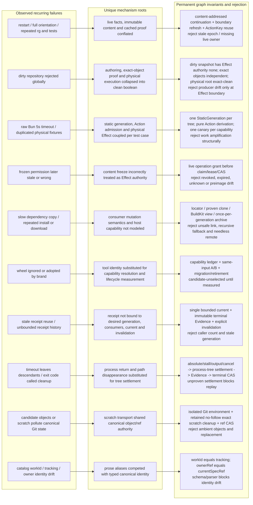

#### 设计决策因果图集与展开规则

上面的因果索引只显示十个根因族；下面四张图把历史反例表中的每一项展开为稳定的
`D01..D28`设计决策。`Dxx`不是新的状态或owner，只是review locator：每个locator必须同时
指向主图节点、领域projection、canonical machine owner和一个可观察的拒绝/恢复结果。若某次
修改删除了机制，却不能证明相应`Dxx`的反例空间已经由更强不变量覆盖，Review必须拒绝。

图的层级固定为：

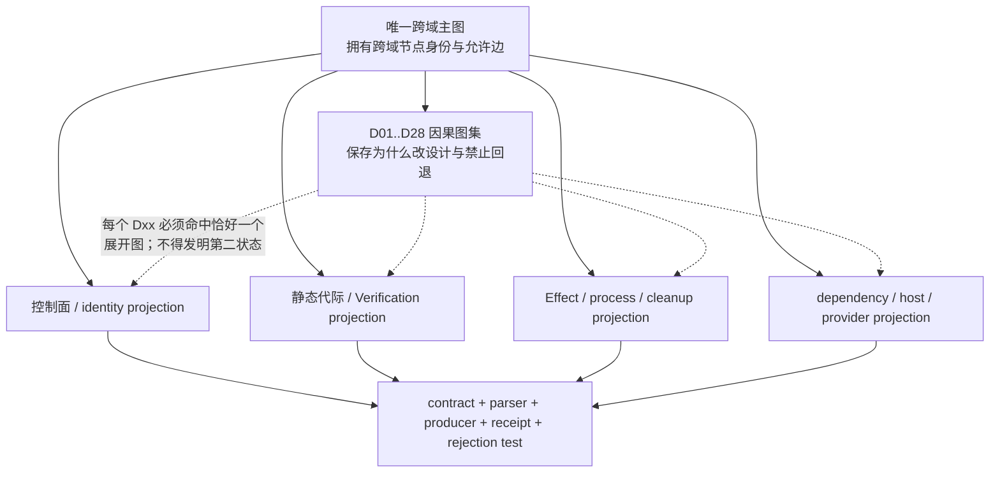

#### 顶层原则到因果与资源图的不可丢失映射

`docs/development-governance.md`拥有`DG01..DG16`的规范含义；本图只把每项原则投影到其主要`Dxx`因果与`Rxx`实际资源，保证“哲学”不能脱离可执行状态、物理对象和拒绝结果。一个原则可以约束多个节点，但不得在这里重定义。

`principleRegistrySemanticDigest: sha256:6a65c7ed272e8bdec8c73101c7b5e7a330d4a974972042cab18d1aaad06e4dc4`

```mermaid
flowchart TB
  DG01["DG01 类级根因"] --> Droot["D01..D28 counterexample closure"]
  DG02["DG02 PreEffectStaticClosure"] --> R09["R09 StaticGeneration / admission"]
  DG03["DG03 dynamic-to-static"] --> R10["R10 Evidence / journal"]
  DG04["DG04 statically computable architecture"] --> R06["R06 contracts / owner registry"]
  DG05["DG05 one logical validation cost"] --> D03["D03/D04/D05/D27/D28"]
  DG06["DG06 mature capability census"] --> D09["D09/D19/D26"]
  DG07["DG07 host/dependency reuse"] --> R13["R13/R14/R15/R16"]
  DG08["DG08 resource lifecycle"] --> R21["R01..R21 settlement/GC"]
  DG09["DG09 frozen content, live permission"] --> R20["R20 live grants"]
  DG10["DG10 hard authority entry"] --> D06["D06/D18/D22"]
  DG11["DG11 one main graph + projections"] --> R22["R22 docs/diagrams"]
  DG12["DG12 independent exact-head review"] --> R22
  DG13["DG13 bounded subagent analysis<br/>external live-resource binding: typed unknown"] --> R23["R23 subagent provider resource<br/>owner currently unresolved"]
  DG14["DG14 non-misleading projection"] --> D20["D16/D20/D23"]
  DG15["DG15 place every business before implementation"] --> D28["D28/R24 pre-freeze import placement"]
  DG16["DG16 documentation closure before completion"] --> R22

  Droot --> R22
  R09 --> R10
  R06 --> R09
  D03 --> R10
  D09 --> R15
  R13 --> R21
  R20 --> R10
  D06 --> R10
  R23 -. "no false binding to continuation R08" .-> R22
  D20 --> R22
  D28 --> R22
```

`DG16`把“提醒AI写文档”从提示偏好提升为完成状态门：每个问题的canonical result必须产生
`DocumentationClosure = invariant + rootCause + decision + graphPlacement + resourcesAndVariables + behaviorOwner +
failureRecovery + verificationBoundary + truthfulStage`。任何Agent/Worker reconciliation、独立Review或closeout缺少该
closure时只能返回`documentation-closure-missing`并指出缺项，不能输出resolved/implemented/complete。该closure只证明
知识与实现投影一致，不替代代码Evidence、Review、Scope、settlement或merge authority。

#### 实际资源—行为—状态总索引

所有流程图中的方框最终必须落到下列实际资源类。`Rxx`是资源locator，不是路径别名；路径、tag、
branch name、PID或container name只有与表中的identity共同验证后才可定位资源。每个资源都必须由其
唯一owner提供`birth/current/acquire-observe/release/retire/absence`中适用的行为，其他owner只能消费
receipt，不能直接删除或改写。

| ID | 实际资源 | canonical identity / physical carrier | 允许行为与唯一owner | terminal / recovery事实 |
| --- | --- | --- | --- | --- |
| R01 | mutable source/index/untracked authoring bytes | repository physical identity + path + bytes/index stage digest | Git authoring owner观察、编辑、冻结；static diagnostics只读 | frozen commit/tree或明确保留的dirty snapshot；不能签发Effect authority |
| R02 | Git commit/tree/blob object graph | object format + full object id + exact bytes | Git object provider批量inventory/read；promotion owner创建可达object | exact object readback；scratch object不可进入canonical object env |
| R03 | branch/candidate/provider-ledger refs | repository/remote + full ref + expected old object id | ref ownerCAS create/advance/delete | remote/local exact readback；name或命令exit不证明promotion/absence |
| R04 | primary/candidate worktree | Git common-dir identity + worktree registration + physical directory identity + HEAD/tree | worktree ownerbirth/register/mutate/settle/remove | registry与physical absence双readback；dirty/foreign保留 |
| R05 | isolated Git scratch/index/object environment | retained no-follow directory chain + isolated Git env digest | Git observer/transaction owner创建、使用、精确删除 | exact retained inventory absence；禁止ambient object/ref污染 |
| R06 | Work catalog/current spec/manifest/authority registry/docs | tracked blob digest + schema identity + workId/tracking/ownerRef/currentSpecRef | document/control-plane parser选择与投影 | valid selected receipt或typed unresolved/invalid；prose不能扩权 |
| R07 | canonical SEC Runtime State namespace | repository locator + host/boot + namespace schema/revision + no-follow root identity | Runtime State ownercreate/read/CAS/fsync；业务owner写自己的对象 | current/settlement/retention receipt；不是cache、Git repo或execution cwd |
| R08 | continuation/live-boundary snapshot | upstream producer + exact base/head/tree/manifest/scope digest | continuation owner发布、按boundary失效、terminal退役 | stale/retired/active pointer；只含context-compression authority |
| R09 | StaticGeneration与ActionStaticAdmission objects | generation/action/plan/producer/owner/input digests | static producer一次发布；pure compiler派生；runner只消费 | immutable bytes + current pointer；drift退役，不能靠process cache代替 |
| R10 | VerificationAction claim/start/journal/Evidence | ActionKey + physical-root identity + provider revision + event/Evidence digest | journal唯一writer；provider只发布自身Evidence | terminal agreement或typed settlement-pending；started unknown禁止重放 |
| R11 | `.tmp`/`.sec`/test fixture/generated-state generation | owner namespace + durable birth + retained physical identity | 对应generation ownercreate/use/release；GC只消费eligible receipt | exact absence或cleanup-pending；目录名/前缀不证明ownership |
| R12 | process tree、pipes、ports、locks、filesystem handles | host/boot + root process start identity + job/group/tree observation | observed-process owner spawn/signal/terminate/drain/settle | root close + streams drained + tree/port/handle settled；否则retain/block |
| R13 | dependency generation / materialized modules | manifest+lock+install config+toolchain+platform+full closure digest | Dependency ownerresolve/materialize/publish；consumer只lease locator/view | readiness binding + target readback；consumer-zero后owner retirement |
| R14 | Bun/package download cache与offline archive | provider version + cache namespace + content/archive digest | package/cache provider填充、读取、按budget GC | cache miss只失效acquisition；命中不成为dependency authority |
| R15 | OCI layout、image manifest/config/layers与Docker image projection | EnvironmentSpec + OCI content digests + daemon identity + immutable image ID | image materializer/registry ownerbuild/import/project/readback | OCI current、image ID readback或typed missing；tag不是identity |
| R16 | BuildKit builder/node/cache records | EnvironmentSpec-derived builder revision + endpoint/daemon + cache ID/sharing | BuildKit providercreate/solve/prune自己的eligible records | solve receipt/provenance与provider GC readback；cache不成为source truth |
| R17 | container、volume/mount/namespace/cgroup | provider generation + daemon + immutable IDs + exact HostConfig/mount/cgroup | container providercreate/start/exec/stop/remove | descendant/container/ID+name absence；prefix prune与foreign adoption禁止 |
| R18 | remote Provider generation ledger | API host/principal/repository + fixed ref + commit parent/tree/payload digest | provider ledger owner按expected-old CAS逐Effect推进 | generation-chain验证与terminal CAS删除；local projection不能替remote |
| R19 | GitHub Issue/PR/Review/check/artifact/default ref | host/repository + node/app/run/artifact/ref identities | 对应GitHub live ownerobserve或operation-specific授权写入 | API readback；评论、PR body、status name不自证Review/merge/completion |
| R20 | WorkDecision/MainHealth/ScopeGrant/IntegrationAuthorization | normalized live facts + issuer/principal/resource/preimage/epoch/expiry digest | 各自control-plane owner签发；Effect owner临界点重验 | current grant或typed stale/revoked/unknown；冻结内容不冻结权限 |
| R21 | ensure/settlement/closeout/retention/GC receipts | desired generation + prior current + consumers + Effect/Evidence + invalidation digest | 资源owner写single current；observer/consumer只读并确认agreement | bounded current + immutable terminal Evidence；consumer-zero后精确退役 |
| R22 | architecture/docs/diagram projections与Review findings | tracked source digest + authority registry owner + exact reviewed head/tree | canonical doc owner维护；independent Reviewer只签finding/Review receipt | docs-doctor + exact-head Review；图或文字不能推进实现阶段 |
| R23 | external subagent live resource | parent/child lineage + role + provider child id + live status/cursor + inherited scope/principle digest | 当前只允许A0观察与收集untrusted finding；外部provider尚无canonical lifecycle owner | owner未cutover前固定为typed unknown，不得伪装成R08 continuation、delegation receipt或完成authority |
| R24 | import graph canonicalization plan/receipt | exact mutable source digest + import parser/transform revision + ordered edit digest | import transformer在authoring epoch纯派生并只改计划内文件；freeze sentinel与commit hook只读拒绝 | zero-delta canonical readback或一次transform后的exact readback；hook首次发现漂移是流程finding而非正常路径 |

资源之间的行为通道只有以下五类；这张图解释“怎么组织”，并把读、纯计算、物理Effect、发布和退役
分开。任何直接跨越两级的捷径都必须在机器contract中有等价receipt，否则属于禁止边：

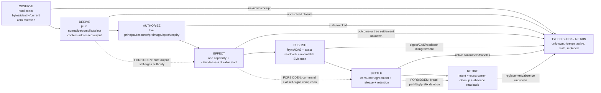

资源拓扑按物理宿主展开；同一逻辑资源跨边界时必须产生新的projection receipt，不能把本地路径、
Docker context名或GitHub显示文本直接带过边界：

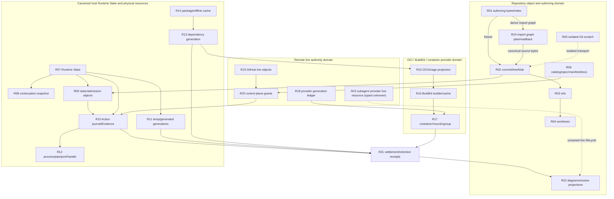

Import canonicalization在authoring与freeze之间只有一个位置；commit hook是同一owner的最后read-only
sentinel，不是首次发现或自动修复owner。`D28`记录本次“提交时才发现三文件import drift”的反例：

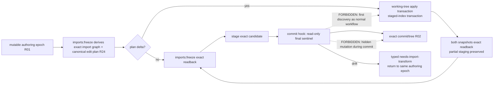

`pre-push`不再重复运行import compiler：push只传输已经提交的immutable tree，重复检查mutable index既不能证明
被push对象，也会把同一静态工作第二次计费。原生`git commit`仍由单一pre-commit zero-write sentinel兜底；正常
入口在到达hook前已经完成上述双snapshot transaction与readback。authoring selector固定为`HEAD→working/index`；
trusted base→candidate的全闭包属于最终frozen-tree Evidence，不能在每次amend中重复执行。
成功readback发布`R24` workspace receipt，绑定HEAD、exact index bytes与provider revision；pre-commit命中receipt只做
身份比较，receipt缺失或任一字段漂移才重新进入pure compiler，receipt本身不能授权commit或promotion Effect。

#### R24 Import authoring 的完整状态、资源与恢复投影

R24的semantic owner是`platform/dev-runner/import-organizer.ts`中的pure TypeScript transform与双snapshot编排；
`platform/dev-runner/import-transform-transaction.ts`只拥有durable source transaction和freeze receipt transport；
Git index的物理发布仍由staged organizer的exact preimage/lock/readback负责。三者不是三个业务owner：plan语义只写一次，
working-tree、index与receipt是同一plan在不同物理资源上的projection。`imports:check`保留zero-write final/tree检查；
`imports:apply`是显式working-tree子操作；正常开发只调用`imports:freeze`，不要求人手工串联两条命令。
本projection逐项展开`development-governance`中的`R24-I01..R24-I10`合取，缺任一项都不是完整import lifecycle。

| 变量/资源 | exact identity或carrier | writer / reader | 为什么存在、何时失效 |
| --- | --- | --- | --- |
| `authoringBase` | 当前worktree的full `HEAD^{commit}` | freeze/sentinel只读Git | commit/amend只改变`HEAD→mutable`；HEAD一变旧receipt立即stale，避免每次重算trusted-base历史delta |
| working-tree TypeScript snapshot | selected path + ordinary bytes digest | import apply transaction写计划内source；editor/authoring读取 | 代表完整当前编辑语义；不能用index bytes覆盖，否则partial staging丢失 |
| staged TypeScript snapshot | index stage-0 mode + blob OID + path，selection=`HEAD→index` | staged organizer以index lock/CAS发布；pre-commit只读 | 代表真正将进入commit的语义；unmerged stage或index drift fail closed |
| project/import context | exact tsconfig bytes + program inputs + TypeScript provider revision | pure organizer读取 | 决定import排序/组合结果；provider或context变化使旧plan不可复用 |
| `ImportOperationPlanV1` | intent/scope/base/provider/config/ordered target preimage+replacement digest | pure compiler唯一生成 | 把动态compiler结果转成静态可审计计划；没有writePaths即semantic NOOP |
| source transaction journal | `.sec/import-transform-transactions/<transactionId>/` | import transform transaction | prepare/publish/readback/rollback/crash recovery；未知或未结算residue阻断新writer |
| authoring freeze receipt | `.sec/import-authoring-freeze/current.json`，schema=`sec-import-authoring-freeze-receipt-v1` | 非hook freeze durable replace；hook只读 | 字段固定为`authoringBase/indexDigest/providerRevision/receiptDigest`；只加速sentinel，不签发commit、Scope或promotion authority |
| managed hook generation | Git common dir `sec-managed-hooks-v2/generation-<digest>` | installer发布并要求exact file set | canonical集合只有`pre-commit`；任何多余retired hook使generation stale，禁止subset验证复用 |
| final candidate import Evidence | trusted base + immutable candidate tree + provider/config/closure digest | final Verification Action | 覆盖整条candidate；不能被authoring receipt或hook PASS替代 |

```mermaid
stateDiagram-v2
  [*] --> unplanned: mutable authoring delta
  unplanned --> planning: derive HEAD to working/index targets
  planning --> workingTreeCanonical: NOOP or source transaction accepted + readback
  planning --> recoveryRequired: source journal/readback/rollback unknown
  recoveryRequired --> planning: same transaction reconciled; no new plan writer
  workingTreeCanonical --> indexCanonical: staged NOOP or index lock/CAS + readback
  indexCanonical --> receiptCurrent: publish HEAD/index/provider receipt + exact readback
  receiptCurrent --> committedTree: HEAD/index/provider exact at pre-commit
  receiptCurrent --> receiptStale: HEAD, raw index bytes, or provider revision changed
  receiptStale --> hookFallback: zero-write staged compiler check
  hookFallback --> committedTree: canonical
  hookFallback --> unplanned: needs-import-transform
  committedTree --> receiptStale: commit advances HEAD
  committedTree --> [*]: final immutable-tree check owns whole candidate
```

状态变量和行为保持以下硬边界：

| 当前状态/观察 | 允许动作 | 禁止动作 | recovery / next state |
| --- | --- | --- | --- |
| no selected TypeScript delta | 发布NOOP plan、继续index readback | 启动full candidate compiler、改source/index | `receiptCurrent` |
| working-tree plan有writePaths | 只对exact preimage执行一次durable replacement | formatter全文件改写、把index语义灌入working tree | accepted后readback；冲突进入`recoveryRequired` |
| staged snapshot非canonical | 在独立candidate context计算并以index lock发布blob | `git add .`、覆盖unstaged业务字节、hook中写index | `indexCanonical`或typed index drift |
| valid current receipt | 比较HEAD、raw index digest、provider revision | 启动TypeScript、下载依赖、写任意文件 | exact则commit；不exact转`receiptStale` |
| missing/corrupt/stale receipt | 运行一次zero-write staged check | 把缺receipt等同import错误、自动写入hook | canonical可提交；非canonical回到同一authoring epoch |
| commit成功 | 旧receipt因HEAD变化自然stale | 把authoring receipt升级为final candidate Evidence | 下一epoch重算实际delta；final check独立消费immutable tree |
| crash/unknown transaction residue | 原transaction owner按journal对账/rollback | 创建第二writer、删除未知目录、重复apply | exact terminal readback后才能新plan |

这套设计是从已发生反例反推而来，不是任意流程偏好：

| 历史反例 | 第一性根因 | 新不变量 | 明确禁止的回退 |
| --- | --- | --- | --- |
| commit hook第一次发现三文件import drift | 正常authoring没有前置canonicalization owner | `imports:freeze`自动完成双snapshot事务；hook仅兜底 | “失败后再手工imports:apply再commit”成为标准流程 |
| hook里自动改index | commit Effect内部隐藏mutation，working tree/index语义分叉 | hook zero-write；mutation只发生在显式authoring freeze | 恢复旧的mutating pre-commit organizer |
| 每次amend扫描`main→candidate` | 把历史已证明delta与本次authoring delta混成一个selection | 本地=`HEAD→mutable`；final Evidence=`trusted base→tree` | 为每次保存/amend重跑整个PR import graph |
| pre-push重复import检查 | mutable index不是push对象，不能证明immutable commit | push零import工作；final consumer检查tree | 在pre-push复跑compiler或dependency ensure |
| checkout/merge/rewrite eager ensure | Git事件不等于真实operation demand | 每个operation按demand graph local reuse→missing ensure | 状态变化即下载/复制/重建依赖 |
| 删除hook后旧generation仍执行 | installer只验证expected subset，未拒绝retained residue | generation目录必须与canonical hook集合精确相等 | “应有文件都在”即视为managed |
| receipt命中仍花数秒 | fast readback经过TypeScript/dependency重路径 | fast path只读HEAD/index/package version/receipt | receipt前无条件`deps:ensure`或import compiler加载 |

当前candidate实现阶段为`implemented + focused-local-verified + not-yet-independent-reviewed`：双snapshot freeze、
durable receipt、fast sentinel、retired hooks、exact-generation检查与generated-state注册均已实现；authoring receipt命中
实测约0.26秒。该数字只描述当前Windows宿主的一次本地观察，不是跨宿主预算Evidence。最终candidate-wide
`imports:check`、独立exact-head Review、merge与new-main readback仍分别拥有自己的阶段，不能由本节文字升格。

任务启动、续跑与选择流程把`R06/R08/R19/R20`展开如下。其设计原因是`D01/D15/D16`：
会话、聊天和candidate不能替代live default、MainHealth与WorkDecision，也不能因上下文压缩机械重跑全量
Issue/catalog census。

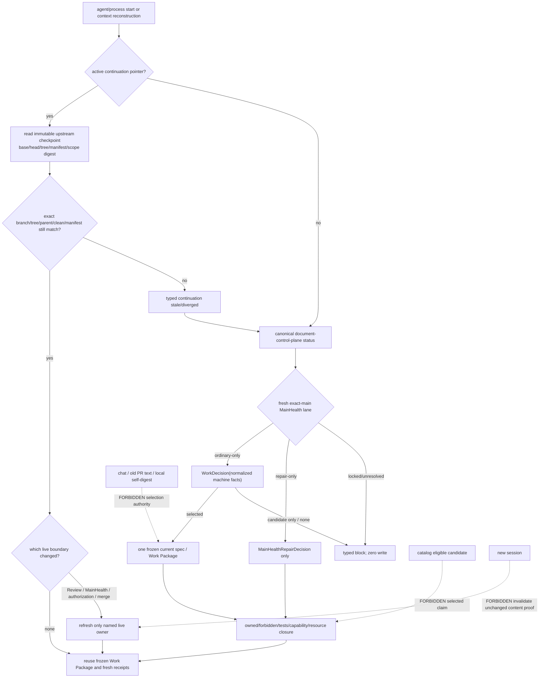

Review、promotion、new-main readback与最终清理把`R02/R03/R04/R10/R19/R21/R22`展开如下。
这张图同时说明“测试通过、PR存在、merge命令成功、worktree remove退出0”为什么都不是完成：

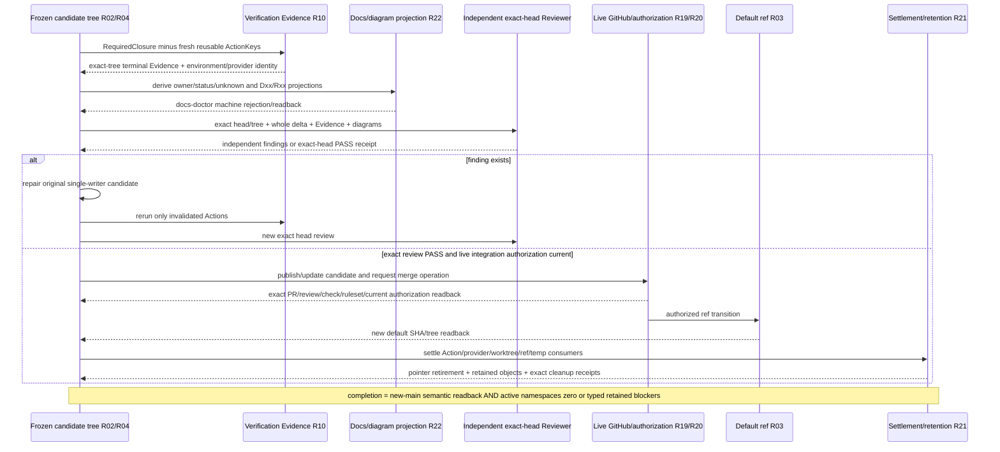

控制面、identity与静态完整性展开：

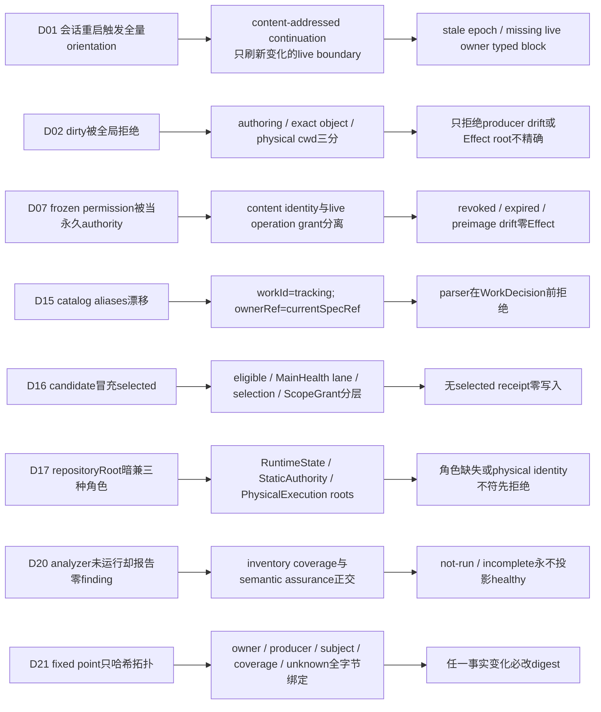

静态代际、测试选择与Verification展开：

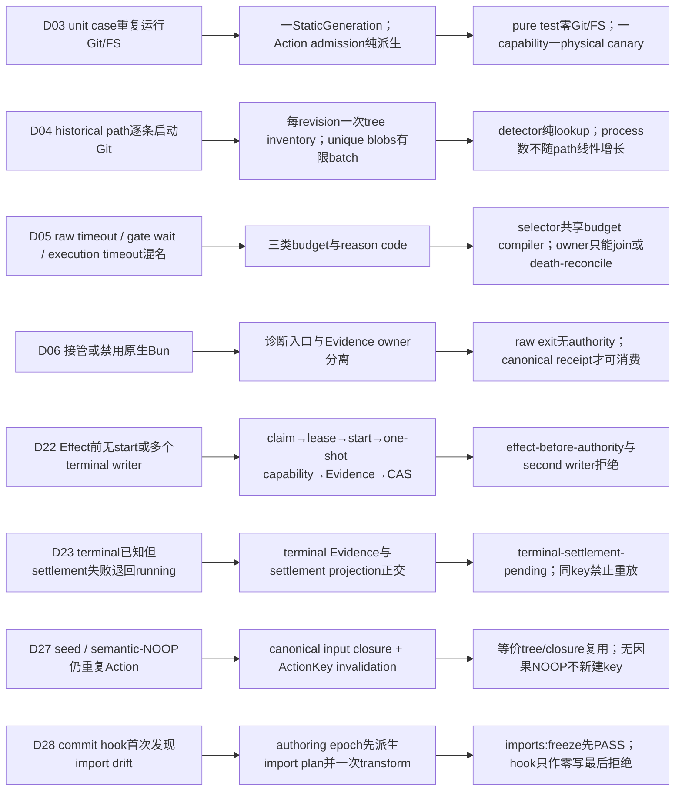

物理Effect、进程与资源退役展开：

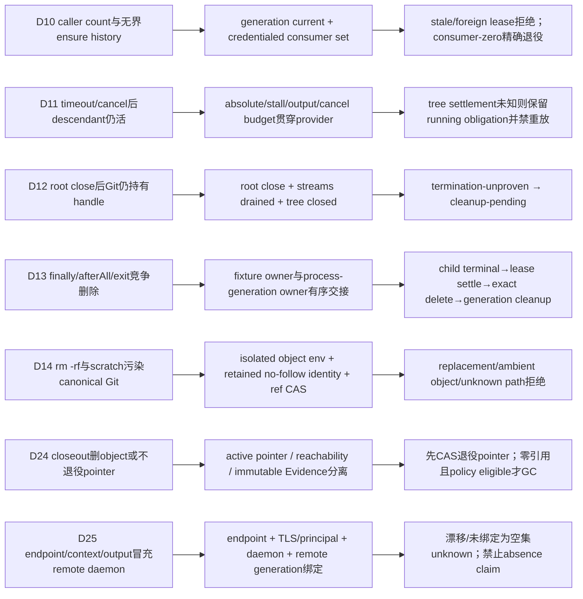

依赖、宿主、sandbox与外部能力展开：

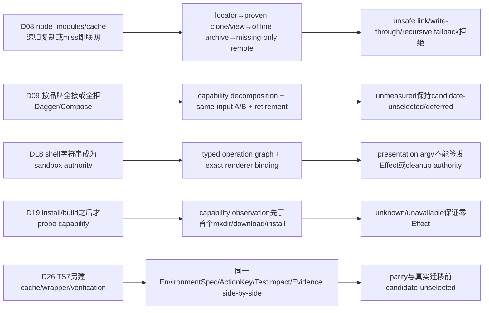

领域文档必须展开而不是复制上述节点：Verification文档拥有`D03/D05/D06/D11/D22/D23/D27`
的Action状态与Evidence边；Runtime文档拥有`D08/D10/D12/D13/D14/D17/D24/D25`的物理
materialization和retirement边；external-provider文档拥有`D09/D19/D25/D26`的capability
resolution。`D01/D02/D07/D15/D16/D20/D21`只由本文件及其canonical contract定位。

| 反例/旧错误设计 | 主图修订理由 | canonical machine owner | 复发时必须看到的结果 |
| --- | --- | --- | --- |
| 每次启动重新拉全Issue、全仓`rg`、全量测试 | 会话被当成事实epoch，fresh proof没有内容身份与失效谓词 | continuation/live boundary、TestImpact、ActionKey | 未变化事实复用；仅变化boundary刷新；缺少live owner时typed block |
| 任意dirty都拒绝静态分析 | 把mutable authoring、Git object和physical cwd压成一个布尔值 | Git mutable snapshot、static analyzer、physical provider | unrelated dirty允许object proof；producer/input drift只降为authoring-only；Effect要求detached exact clean |
| 状态机单测运行Git/FS并撞Bun默认5秒 | static producer与pure consumer耦合，模块加载、Action构造和case cleanup按case数量放大physical work | StaticGeneration、ActionStaticAdmission、Verification kernel、logical-root test port、唯一exact-tree canary | pure runner 24 cases零Git/目录/Runtime fsync/process；hostile Git/index/execution/reuse/dirty rejection合并为一generation canary；唯一slow suite/TestImpact owner已注册 |
| pure timeout测试真实等待50/150ms并随case数放大 | deadline scheduling、Abort delivery与physical settlement被压成一次墙钟sleep | `VerificationActionDeadlinePortV1`只拥有schedule/abort；journal/provider/process-tree owner仍拥有结果与settlement | provider先取得signal；deterministic deadline只abort并返回同一failure；running unknown或terminal-settlement-pending保持不变，禁止timeout自证资源消失 |
| repository audit对每条历史path分别`cat-file/rev-parse`并同步阻塞 | revision/path lookup没有先编译成一次immutable tree/blob census，伪async无法被调度或取消 | Git observer + repository-audit semantic analyzer | 每个exact revision一次inventory、唯一object IDs有限batch读取、后续detector纯lookup；process启动数不随manifest path线性增长 |
| direct selector落回Bun默认timeout、heavy gate等待也恰为5秒 | execution budget、gate lease wait和raw runner timeout三种事实未类型化，错误文本被混为一种“超时” | TestImpact/resource scheduler + observed process + gate lease owner | 三类reason code与Evidence分离；所有canonical selector共享预算compiler；重复owner只能join/death-reconcile，不能盲目延时重跑 |
| 截获/禁用原生`bun test` | 把诊断入口当成Evidence owner，既破坏生态又不能补齐业务闭包 | canonical dev/CI runner与Evidence consumer | 原生Bun可诊断；Review/Gate/merge只接受canonical receipt，raw exit永不授权 |
| frozen Scope/permission永久有效 | 内容identity与live principal/resource/preimage authority被混淆 | operation-specific authorization + claim/lease/CAS | Effect前重读；stale/revoked/unknown阻断，不通过重新freeze洗白 |
| 每次复制`node_modules`或cache miss即联网 | 未区分只读、可写隔离、container与跨宿主consumer | Runtime/Dependency + provider capability | locator优先、offline archive其次、仅缺失remote；unsafe hardlink/link/write-through/recursive fallback拒绝 |
| 看到Dagger/Compose就全接或全拒 | 品牌替代capability decomposition、A/B和retirement成本 | external capability ledger + Implementation Resolution | 未取得同条件Evidence时`candidate-unselected/deferred`；采用必须退休旧glue且无第二authority |
| ensure receipt可由caller count复用并持续增长 | receipt未绑定generation/current/consumer credential与retention | provider lifecycle owner | 单一bounded current；stale receipt、foreign consumer、unknown lease拒绝；consumer-zero后精确退役 |
| timeout/cancel后子进程仍在，命令退出即称清理 | 没有process-tree与physical settlement状态 | process provider + Verification journal | tree settled后才有terminal Evidence；settlement unknown保留terminal/residue并禁止同key重放 |
| root Bun child关闭后Git descendant仍持有cwd/handle，清理报EBUSY | root close被误当整棵process tree terminal，streams/descendants未settle | one observed-process capability | terminal必须同时满足root close、streams drained、tree closed；unproven termination保留fixture并进入cleanup-pending |
| test `finally`、preload `afterAll`和`process.exit`都删除同一temp generation | fixture child与process generation存在竞争cleanup writer | fixture lifecycle + process-temp lifecycle | child tree terminal→fixture lease settlement→exact delete/readback→process generation cleanup；exit fallback只记录pending，不无条件删 |
| `rm -rf` scratch或candidate object进入真实object/ref库 | 路径名/创建者自述被当作物理ownership | Git observer、retained no-follow、candidate/ref owner | scratch generation birth时retain identity；exact inventory delete/readback；canonical object/ref只经隔离/CAS |
| catalog alias漂移导致选错任务 | prose/历史字段与current spec竞争identity | Work catalog/WorkDecision schema | `workId !== tracking`或`ownerRef !== currentSpecRef`在选择前invalid，不能靠聊天或receipt伪造 |
| catalog候选被报告成已选择、`main-health-unresolved`时仍推进 | eligibility、selection、health与effect authority被压成一个“下一任务”结论 | MainHealth + WorkDecision + ScopeGrant各自owner | candidate只证明eligible；ordinary/repair/locked互斥；没有selected receipt时零写入 |
| Runtime State临时目录被当作Git repo或执行cwd | 一个`repositoryRoot`暗中兼任三种authority | typed RuntimeState/StaticAuthority/PhysicalExecution roots | 任一root缺失或角色不符在journal/Effect前拒绝，禁止fallback |
| shell字符串被测试解析为sandbox/cleanup authority | presentation transport被当成typed operation graph | sandbox operation contract + renderer binding digest | validator从typed phase/operation/descriptor推导；argv只允许exact renderer投影 |
| capability在install/build后才探测 | Effect先于provider selection，失败后才知道宿主不支持 | capability ledger + provider preflight | 首个mkdir/download/install前完成current capability observation；unknown/unavailable零Effect |
| repository audit在analyzer没跑时报告零finding | inventory coverage与semantic assurance被合并，`not-run`被当健康 | repository audit contract + exact analyzer | coverage/assurance独立；failed/not-run/incomplete永不投影为healthy |
| fixed-point digest只绑定拓扑不绑定事实内容 | 同一node/edge名称可掩盖subject/revision/coverage变化 | whole-delta fixed-point composer | digest绑定全量canonical fact bytes、owner/producer/consumer/unknown与stop condition |
| provider Effect前没有durable start，或另一个writer补terminal | issue/execute/observe/release与journal authority折叠 | Verification runner/provider/journal | claim→lease→start→one-shot capability；Evidence先发布；唯一terminal CAS writer，第二writer拒绝 |
| terminal已知但release/settlement失败被投影回running | execution result与资源收口混成一态 | terminal Evidence + settlement projection | 保留terminal/Evidence，状态为`terminal-settlement-pending`，不得重放或伪装未执行 |
| 已有`settled` receipt的复用仍发布observe/release pending | runner把settlement当作每次调用的命令序列，而不是单调durable current | VerificationAction runner reconciliation + journal settlement current | 精确匹配`actionKey/executionBindingDigest/evidenceDigest/providerRevision`时零observe/release/execute Effect复用；任一漂移typed block，禁止终态倒退 |
| closeout删除static object或完全不退役pointer | reachability、active pointer和immutable Evidence生命周期未分离 | trusted closeout + Verification retention owner | settlement后只CAS退役active pointer；共享/immutable object与Evidence保留到零可达且policy eligible |
| remote Docker/provider把context名、TCP/SSH endpoint或命令输出当daemon identity | transport endpoint、TLS/principal、daemon和remote ledger未绑定 | external provider ledger + remote CAS generation | 每次Effect复用exact endpoint/principal/daemon；未绑定TLS或generation drift为unknown，禁止把空集当absence |
| TS7另建下载、cache、checker wrapper或验证流水 | 新工具被当成新authority而非既有spine consumer | Implementation Resolution + EnvironmentSpec + ActionKey | side-by-side parity前保持candidate-unselected；采用后仍消费同一dependency/cache/TestImpact/Evidence owner |
| seed、semantic-NOOP或等价tree仍重复Action | 调度attempt/会话被放进证明identity，等价输入不能复用 | canonical input closure + ActionKey + Evidence invalidation | seed是输入时精确绑定并复用；不影响closure的NOOP不产生新key，不机械重跑 |

这张因果索引本身也受`NonMisleadingProjection`约束：表中的“不变量”表示目标合同；是否已经实现、验证、Review、合并
必须分别引用对应receipt。当前`VerificationAction runner → pure kernel`切分已在candidate完成并局部验证，
exact-tree物理断言已归并到一个canary并注册唯一slow budget/TestImpact owner；其他StaticGeneration consumer和
exact-head Review仍是partial，不能因图已补齐就报告完成。

主图到机器owner的定位固定如下。`current status`只是当前candidate的不可误导投影；只有exact-head Review、merge和
new-main readback receipt才能推进它，文档修改本身不能推进状态。

| 主图节点/边 | canonical contract / producer | durable consumer或readback | current status |
| --- | --- | --- | --- |
| Mutable authoring snapshot | `platform/git/authoring.ts` / `readGitMutableAuthoringSnapshotV1` | TestImpact与authoring diagnostics；固定`effectAuthority=none` | candidate-implemented-unreviewed |
| StaticGeneration | `platform/shared/development-critical-path-contract.ts` + `tooling/sec-dev/development-critical-path.ts` | runner的Action admission | implemented-partial：generation header object已durable publication；仍缺generation-key locator、可供跨Action纯派生的shared payload与prepublication coalescing |
| ActionStaticAdmission / static closure | `createDevelopmentCriticalPathStaticAnalysisReadbackV2`、`consumeDevelopmentCriticalPathStaticAnalysisAuthorityV2` | `tooling/sec-dev/verification-action-runner.ts` | implemented-partial：Action/plan-closure/static-generation绑定已进入closure/pointer/retention；Action-specific derive仍先于early join |
| Required Action set / normalized plan | `platform/shared/test-impact-contract.ts` + `platform/shared/verification-action-ci-contract.ts` | canonical dev/CI runner | candidate-implemented-unreviewed；raw Bun不是receipt owner |
| dependency/cache materialization | `platform/shared/environment-materialization-contract.ts` + `tooling/sec-dev/environment-cache-lifecycle.ts` | provider current/physical receipt、consumer credential | provider-specific candidate-implemented-unreviewed；host/container route仍按capability逐项证明 |
| provider selection / Dagger、Compose、BuildKit | `docs/governance/external-capability-ledger.yaml` + `platform/runtime/environments/sec-linux-verification-v1/spec.json` | Implementation Binding与provider receipt | BuildKit selected；Compose migration-unverified；Dagger candidate-unselected；Kubernetes not-required |
| VerificationAction / ActionKey | `platform/shared/verification-action-contract.ts` | `tooling/sec-dev/verification-action-journal.ts` | candidate-implemented-local-focused-verified：`ExecutionBinding`统一绑定三根physical identity、plan closure、static generation、provider并贯穿flight/start/capability/Evidence/terminal；durable typed settlement current单调且exact settled reuse为零Provider Effect；exact-head Review尚未发生 |
| process timeout/tree settlement | `platform/shared/process.ts` + `platform/shared/observed-process.ts` | provider terminal Evidence | candidate-implemented-unreviewed；仅canonical consumer接线后才可替代root-child close |
| Evidence → journal terminal → settlement | `tooling/sec-dev/verification-action-runner.ts` + journal contract | CI result、observer、closeout | candidate-implemented-local-focused-verified；settlement-pending只补observe/release且不得重放；settled exact reuse不重复Provider Effect；production process-tree consumer仍partial |
| closeout/static pointer retirement | `scripts/codex/trusted-runtime-closeout.ts` + journal retention receipt | new-main/retention consumer | candidate-implemented-unreviewed；只退役active pointer，immutable object/Evidence保留 |
| retained cleanup / GC | `platform/shared/physical-no-follow.ts` + `tooling/sec-dev/generated-state-lifecycle.ts` | exact absence/physical-clean receipt | bounded owners implemented；每个新增temp/provider资源仍需单独接入，禁止generic recursive delete |
| stage truth | `platform/shared/development-critical-path-contract.ts` / `NonMisleadingProjection` | CLI、Review、PR、文档presentation | contract implemented；统一presentation adapter仍partial |

#### Git领域的逻辑、能力与实现投影

Git不是一个`repository.ts`对象，也不是“能运行git命令”的泛化authority。它在主图中只拥有以下
bounded projection；业务决策、Work scope、Verification PASS和cleanup authorization均在域外：

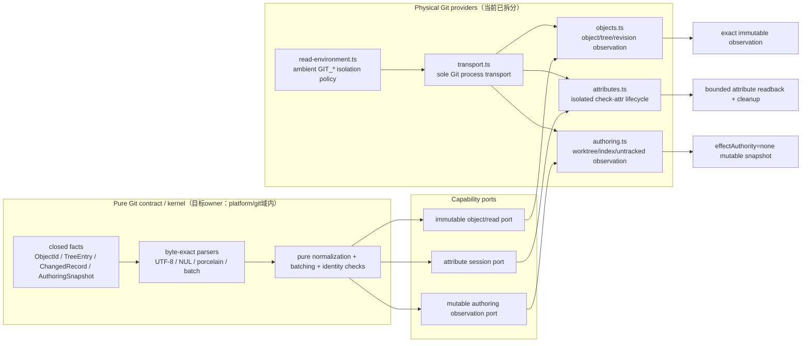

| 层 | 可包含的信息 | 禁止包含的信息 | 当前实现状态 |
| --- | --- | --- | --- |
| contract/kernel | object/tree/record类型、canonical parser、排序、batch预算、错误closed union | cwd、环境变量、进程、文件句柄、Git命令执行 | partial：纯parser/batching仍与`objects.ts` provider同文件；不得迁回`platform/shared`，等待合法domain path replan |
| capability port | 输入/输出fact、budget、failure、freshness、resource obligation | shell argv authority、业务PASS、scope grant | partial：函数边界存在，typed port仍需从provider实现中抽离 |
| transport provider | exact cwd/argv/env/input/output/status和bounded bytes | Git语义决策、owner/Work/Verification状态 | implemented-candidate：`transport.ts`是唯一Git process入口 |
| object provider | exact commit/tree/blob/config/status观察与readback | mutable authoring授权、cleanup授权 | implemented-candidate：`objects.ts`；仍含待迁出的pure kernel |
| attribute provider | isolated attribute source、temp/index资源、no-follow cleanup receipt | 通用object API或worktree writer | implemented-candidate：`attributes.ts` |
| authoring provider | index/worktree/untracked bytes的只读快照与内容身份 | immutable object proof、Effect authority | implemented-candidate：`authoring.ts` |
| consumers | StaticGeneration、TestImpact、audit、release source、settlement | 重新解析presentation或直接启动Git形成第二owner | migration in progress；结构测试拒绝旧façade与跨域transport consumer |

这里的“完全分开”以依赖方向和Effect可达性判定，不以文件名判定：pure kernel的transitive closure不得
到达process/fs/environment provider；provider只把exact machine bytes交给kernel并返回typed observation；
orchestrator只组合receipt，不能重新解释Git输出。当前五个physical owner已实施，但pure kernel仍留在
`objects.ts`，所以Git分层只能报告`implemented-partial`，不能因删除`repository.ts`报告完成。

#### Static-first federation fixed point

目标compiler不能把文件名命中、空数组或调用者给出的path list当作closure proof。它从有限的exact
repository universe构造单调事实集：

```text
F0 = exact base/head/tree + whole changed records + selected WorkClaim/manifest
   + authority registry + canonical producer revisions + tracked-path census

F(n+1) = Normalize(F(n)
   ∪ definitions/constructors/parsers
   ∪ import and reverse-consumer edges
   ∪ state-transition edges
   ∪ storage/current-pointer writers
   ∪ filesystem/process/network/container/Git Effect edges
   ∪ receipt/proof/credential consumers
   ∪ owner/document/test/projection edges
   ∪ recovery/retirement edges
   ∪ typed unknowns)

stop only when digest(F(n+1)) == digest(F(n))
```

递归依赖先压缩为SCC；每个node/edge只进入集合一次，排序、owner resolution与digest normalization均为
canonical，因此算法对有限tracked universe必然终止。closure digest至少绑定base/head/tree、whole changed-record
digest、manifest、authority registry、producer revisions、sorted facts和sorted unknown ledger。add/change/delete、
rename/copy的source与destination都属于whole delta；manifest owned paths只作预测，不得裁掉真实consumer。

每个事实节点必须携带`nodeId/ownerRef/producerRef/subject/revision`；每条边必须携带
`edgeId/consumerRefs/effectClass/receiptRef/recoveryRef/retirementRef/staticOrDynamic/invalidationPredicate`。
无法静态解析的dynamic import、reflection、computed path、presentation parser或外部状态不能消失，必须生成：

```text
Unknown {
  unknownId, subject, ownerRef, producerRef, missingEdge, sourceLocations,
  requiredAuthority, blockingEffect, inputRevision, freshness,
  invalidationPredicates, recoveryOwner, minimumResolution
}
```

duplicate owner/writer、缺consumer/release/settlement、caller-supplied zero/boolean proof、effect-before-intent、
cancel-before-physical-settlement、无界history/namespace scan、未绑定issuer、未声明dynamic edge或缺retirement任一
成立时，昂贵Effect准入必须为`blocked`。动态观察只在发布`subject + producer/provider/policy revision + provenance +
terminal/settlement + freshness + invalidation`的immutable projection后才能成为后续static input；session或consumer
变化本身不使其失效，真实binding漂移才重观测。process liveness、Docker daemon、ACL/reparse、remote ref、network、
lock与physical absence仍是最小dynamic obligation，不能由static cache伪造。

每条实线边都必须有一个唯一的输入 owner、Effect principal 和可读回的结果；虚构“全局
manager”不能补齐缺失事实。具体绑定固定如下：

| graph surface | semantic owner | allowed Effect | durable result | recovery / retirement owner |
| --- | --- | --- | --- | --- |
| EnvironmentSpec / dependency closure | Runtime / Dependency contract | none | immutable desired identity | source owner重新编译closure |
| exact-tree static closure | 当前V3：Development Critical Path analyzer + whole-delta fixed-point composer；领域事实仍由canonical owner projection产生 | isolated Git blob/tree reads only；不得执行domain operation | V3绑定base/head/tree、whole changed records、tracked inputs、manifest/document owner、module graph、Action plan、dependency terminals、owner/producer/consumer graph、SCC/fixed-point与structured Unknown；缺少domain-signed Effect/recovery/retirement projection时required scope阻断 | exact绑定漂移才重新分析；缺少domain producer时保留typed gap；closeout只读回，不能从plan事后重算 |
| Provider capability selection | external capability ledger + exact provider contract | none | capability decision/plan digest | provider policy重新观察；未知即block |
| local/offline/remote materialization | selected provider | 本地运行投影、离线exact artifact与远端缺失获取是三个独立机器事实；exact cache read、restore或仅获取缺失项 | state-bound ensure receipt和current exact generation | 同一provider幂等恢复；禁止compatibility字段把本地投影与离线artifact折叠；terminal cleanup先发布单一bounded settlement current，再在consumer-zero后retire active pointer |
| VerificationAction / ActionKey | Verification Action contract、runner和journal | ActionKey先绑定absolute/stall/output/cancellation budget和exact physical head/tree policy；`claim → provider consumer lease → durable start → opaque one-shot capability`后至多一次physical start，runner的AbortSignal必须透传到process-tree settlement | provider terminal Evidence先落盘，唯一journal terminal writer再同时读回start/Evidence并CAS绑定；settlement失败保留terminal/Evidence且投影为`terminal-settlement-pending`，不得伪装running或重放 | Evidence缺失/冲突、start-without-terminal、physical-root drift或settlement-unproven进入原owner reconcile；禁止caller callback、自哈希receipt或第二terminal writer签发终态 |
| observer / settlement / closeout | consuming domain owner | 只消费已发布receipt后执行其授权Effect | settlement、MainHealth、closeout或retirement receipt | consumer从immutable receipt恢复，不重复上游Effect |
| operational terminal / GC | generated-state、worktree、ref、provider各自owner | exact retained/no-follow删除或provider-native retirement | physical-clean或gc-pending readback | active/foreign/unknown保留；只有exact eligible residue可重试 |
| rebuildable TestImpact cache | TestImpact semantic owner；Runtime Cache只提供physical capability | current module closure的authority-bound atomic replace；不得直接path write | 单一有界current envelope，不是Evidence或selection authority | 每次完整module observation淘汰stale entry；损坏或缺失只触发重建 |
| post-merge MainDelta | verified-candidate Evidence owner产生closure，remote-main observer独立产生exact Git tree；transition owner只在两棵tree内容寻址相等时转移closure | none；任一tree drift、非canonical transition或journal/Evidence冲突不得carry forward | identity transition digest、MainDelta decision与绑定candidate Evidence的新MainHealth receipt | drift、unknown或terminal conflict执行完整MainHealth；禁止无tree-equality proof从candidate复制main facts |

trusted container 路径遵守同一 single-writer 边：宿主上的 trusted analyzer/runner 是唯一
static object、ActionKey pointer、claim、queued/running 与 terminal journal writer；容器只接收一个已授权
gate 的 canonical argv/environment并返回物理 terminal observation。容器不得运行第二个
VerificationActionRunner，不得把 container-local Runtime State 提升为 authority，不得 bind-mount 宿主
canonical state 给 candidate，也不得用 raw `docker cp`/tar 覆盖 journal。宿主把 provider terminal 通过
同一 runner CAS 后才生成 Evidence，closeout始终消费宿主 publication。host base checkout 与被验证的
candidate 不得混为一个 Git subject：宿主先用 Git shared-object clone 建立 disposable exact candidate
projection，固定 candidate HEAD/tree、base ref 与 offline default-branch ref 并读回 clean identity；analyzer
只从该 projection 的 exact tracked blobs 派生 closure，而 durable journal/CAS 仍写入原 authority root。
这条 projection 复用 Git object database，不复制工作树依赖，也不把 shared object locator 提升为 authority。

Sandbox隔离语义也不由presentation字符串拥有。canonical plan先发布phase-owned typed operation graph：namespace、
runtime-copy closure、tmpfs/chroot、retained-input bind、privilege drop、bounded runtime exec与exact residue cleanup；
shell command/argv只是该图的内容寻址transport projection。普通`execute`只消费FD 3的candidate archive，
`bootstrap-execute`才额外消费FD 4的dependency archive。validator和测试按结构化role、descriptor、target、
read-only flags与policy digest证明边界，不得再用shell空格、路径拼写或renderer子串签发authority。

static publication 的终态与 Action terminal 分离：`published-active → terminal-observed →
operational-terminal → retirement-intent → pointer-retired → object-gc-eligible → physical-clean`。
只有所有真实 consumer 已释放、settlement durable、canonical retention 已满足时才可退休 pointer；CAS
object 还必须通过全 namespace pointer census 证明 zero-reference。malformed、reparse、foreign replacement、
identity drift 或无法认证的 crash residue一律 retain并 typed block；删除失败只进入可由原 owner重试的
`gc-pending`。每个领域生命周期仍属于其canonical owner：VerificationAction由journal/runner拥有，
dependency archive由Runtime/Dependency cache lifecycle拥有；二者只复用 Runtime State no-follow/CAS
physical authority，不建立第二 GC owner，也不把 external Runtime State 错注册为 repository generated state。
#398 candidate已把dependency archive接到
`durable birth/current → physical publication → owner handle → acquire-before-SUT-effect →
terminal/never-started/recovery release → aggregate-budget retirement → exact physical settlement`，并将
cache-local receipt降为immutable physical projection；在frozen exact-head验证、独立Review、merge和new-main
readback完成前，这仍是`implemented-unverified`，不得表述成`main`能力。其他尚未接通generation-bound
consumer的provider仍只能发布`NO_PRODUCTION_CONSUMER` typed blocker；“数组当前为空”、unit-test helper或
事后补写永远不能解释成consumer-zero。

该lifecycle的timeout只拥有“允许重新观察”的调度语义：materializer/consumer的durable lease同时绑定host、boot、PID与
process-start identity，只有boot替换、process缺失或PID复用的动态death proof才能驱动expected-current recovery；live或
remote/unknown owner即使超时也不能被steal。resource-scoped bytes、identity-scoped current、birth/rebirth intent、GC
intent、physical absence与settlement构成一条可重放状态链；read/hit/GC不能为观察missing而先创建entry，首次GC必须在
intent前证明archive binding，intent后的每个崩溃cutpoint则按exact residue继续。retired registration/settlement是有界
immutable history，由aggregate reconciliation压缩，不在rebirth中跨记录半删除。

静态证明拥有类型、依赖闭包、状态分区、非法状态拒绝以及`not-applicable`；真实执行仅承担
Git、Docker/BuildKit、Windows/Linux filesystem、权限、持久化和crash recovery等不能静态证明的
Effect。`fast/slow`只是资源调度投影。所有大对象cache必须位于canonical Cache root且不具备
authority；所有receipt、claim和跨进程恢复事实必须位于canonical Runtime State且不得因cache
丢失被伪造。任何实现或独立审查若发现第二套ActionKey、provider ensure、receipt current pointer、
test-impact cache、MainHealth freshness、cleanup state machine或重复跨领域图，必须按竞争owner处理，
不能以“适配”保留。

dependency节点的物理投影固定为一条而不是三套复制器：Bun只在canonical compiler generation执行一次
frozen resolution/install；host只读consumer经exact locator复用；container writable consumer经BuildKit
bind/cache/overlay物化。Bun cache、BuildKit cache和OCI layout都是可丢失的加速substrate，唯一语义仍是
EnvironmentSpec、lock/toolchain identity与content-addressed binding。Windows NTFS不具备ReFS block clone时
不得降级为无界递归copy；缺少可写隔离能力只能typed-block或选择container provider。

OCI layout同样不是无主cache entry：provider必须在首次可见publish前持久化绑定provider ref/object、ledger、
generation、lease与terminal obligation的durable generation；ensure receipt再绑定该exact generation，
stop/recover只能在consumer-zero与provider absence readback后把它转为terminal settlement。Docker tag、image、
OCI layout或BuildKit cache任一单独存在都不能自签current，也不能靠删除其中一个对象证明生命周期已结束。

整个spine的目标不变量是`PreEffectStaticClosure → minimal physical observation → dynamic-to-static publication`：exact
tracked owner closure先从唯一contract派生types/schema、imports/reverse consumers、dependencies、closed states、
Effect capabilities、storage、resource/budget/timeout与retirement edges。所有静态可判定的竞争owner、缺边、非法
state、unbounded collection、unconsumed receipt和重复实现必须整类闭合后才允许昂贵Effect；unknown则typed block。
代码以closed union、pure compiler、显式registry/capability与thin Effect shell保持图可计算，禁止用反射、动态路径、
presentation string或第二份手工清单隐藏semantic edge。真实Git/filesystem/provider/process observation完成后立即发布
内容寻址、带provenance和明确invalidation predicate的静态projection；会话或consumer变化不触发重跑，只有绑定输入
真实漂移才重新动态观察。当前V3只实现上述bounded Action-admission子集，不能用路径正则命中的文件存在性、空
`defectClasses`或dependency PASS宣称目标fixed point已经实现；#398同一package的refrozen implementation closure
只负责接通各canonical owner的projection、consumer与validator，不把这些语义迁移给spine owner。尚未有producer的
repository-wide fixed-point事实继续是typed blocking Unknown，不能因文件已纳入scope就宣称完成。该不变量是本图所有节点的共同准入，
不是另一张架构图或另一套工程计划。

本图同时是人类与机器的唯一洞察入口：每项顶层哲学保留独立identity、invariant、Evidence和失败语义，并与其余
原则共同约束每条edge；全局成立条件是全部独立不变量的conjunction，不得把若干新要求先合并成一个原则，再用它
替代全仓已有约束。每个扩展必须能从同一typed graph投影owner、invariant、consumer、Effect、
Evidence、unknown、recovery和retirement。主线外finding由只读subagent消费exact static closure并返回bounded
finding projection，不能把旁支上下文、第二writer或第二计划带回spine；静态分析自身的coverage、unknown和stop
condition也必须成为本图可验证的静态输入。

同一图的目标态还必须投影不可误导的阶段边界：`observed → inferred → planned → implemented → locally verified →
independently reviewed → merged → new-main readback`只允许由对应canonical receipt前进。节点标题、CLI/Agent提示、
文档和PR状态只能显示已到达的最强阶段；未来方案、局部测试、candidate、command exit或cache current不能越级生成
完成语义。`platform/shared/development-critical-path-contract.ts`唯一拥有`NonMisleadingProjection` schema、receipt
kind、pure compiler、parser与typed gap；它只能从调用者交付且通过canonical parser的source receipt投影最强阶段，
不能签发领域receipt。当前presentation adapter尚未cutover，因此CLI/Agent/PR/文档仍必须直接引用projection及其
source receipt，不能自行重算或升格。`NonMisleadingProjection`与本图其他原则分别存在，任一阶段伪报都使整体
conjunction失败。

所有跨owner输入先由产生它的canonical parser/validator整值验证，再交给spine组合；consumer不得复制
reason union、capability/role mapping、resource profile或freshness规则。每个mutable current transition都必须
绑定expected-current digest/epoch并由同一owner的lease或CAS串行化；terminal retry绑定原outcome/transition
identity，consumer release绑定owner签发的credential，legacy与successor registration不得同时可写。

retained deletion把handle能力与生命周期显式分开：identity-only leaf handle不能承担directory durability；
Linux descendant directory使用no-follow且可`fsync`的directory fd，Windows使用FileId/final-path/reparse
fence。完整inventory proof是有界metadata，不是O(entries) live kernel handles；validation与effect各自可按
O(depth) retained directory cursor重新验证单个entry，任何resource budget不足都必须在destructive Effect前
typed block。provider同理把EnvironmentSpec resource profile、Buildx flags、runner process witness和terminal
settlement都绑定到一个desired/receipt owner；remote offline不证明local process absent，command exit code也不
证明physical absence。

测试文件名、`fast/slow`标签和raw runner默认timeout都不是正确性事实。唯一test-impact/Action owner先产生
required closure，再由resource-class scheduler选择并发度、workspace lease与canonical timeout；同一logical run
只发布一个terminal或bounded failure fingerprint。输入与failure fingerprint未变时复用失败，调度资源变化只允许
重放受影响Action；禁止为了“全看一遍”把互相争用workspace/provider的slow files塞进raw并发union。CLI/package
alias必须由contract证明能路由到真实canonical command；stale alias的usage failure是control-plane finding，不能
被解释成cleanup已经执行。

ephemeral in-flight join不是只按semantic `ActionKey` 的全进程单例；它必须同时绑定canonical real physical
repository/workspace root。相同root和ActionKey可以join，不同physical root即使ActionKey相同也必须各自产生
独立claim与terminal，避免一个fixture、candidate或repository错误消费另一个root的物理执行结果。

Environment与Provider capability只属于`execute` disposition的RequiredClosure：fresh PASS、fresh failure已经绑定
产生它的environment，authenticated in-flight由原provider claim拥有，因此reuse与join不得因为当前离线、cache缺失
或provider不可达而重新物化。只有missing/stale Action进入execute时才按`local exact → offline exact → remote missing`
申请资源；此时consumer传入`required=false`也不能绕过canonical provider capability。post-merge closeout优先核对
immutable Verification Evidence terminal与现存journal terminal；journal已合法retire时由artifact提供durable terminal，
两份terminal冲突则禁止carry-forward；同一exact plan的本地queued/running/invalidated/cancelled只可能是更早或跨host
projection，不能降级已经重新通过session/head/plan current validation的immutable FINAL artifact。

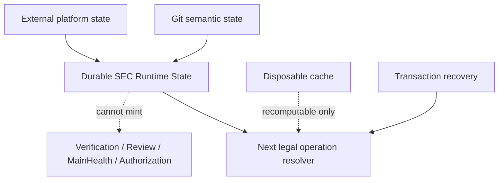

Compaction/resume沿用同一分层，不能建立“摘要状态机”。immutable checkpoint只保存最后已知reference/digest；live adapters分别观察subagent、exec/process、workspace/control、authorization/capability、materialization/provider、external effect与artifact；pure resume compiler只组合typed observations并输出下一合法decision；effect provider只消费已claim的stable operation intent并返回start/terminal/readback receipt；Durable Runtime State只保存checkpoint、claim、cursor、receipt和artifact ownership。任何层都不得把checkpoint hint提升为live observation，或让provider presentation/error string签发`absent | not-started | completed`语义。

`runId`拥有逻辑任务连续性，`resumeEpoch`拥有control/trust/authorization代际，`operationKey`拥有语义副作用幂等性，attempt nonce只拥有一次物理尝试。四者必须分别建模；用新session、child名称、PID、path、tag或nonce替代稳定identity都会把重复effect伪装成新工作。Codex Desktop内部subagent/exec事实属于外部live provider能力；仓库runtime只有在宿主返回authenticated lineage、cursor和start/terminal receipt时才能机器消费，否则该域保持unknown并阻断effect。

pure resume candidate不是effect owner：在authenticated live adapters、durable CAS claim、cursor consume和domain-specific authorization接线前，它只能输出无权威建议，并以`effectAuthority=none`阻止任何consumer把`claim-required | join-existing | consume-terminal`直接解释为物理动作。

Canonical path、root disjointness、repository/workspace key 与物理 identity 由
`platform/shared/sec-runtime-state-contract.ts` 唯一拥有；journal、continuation 和 consumer 不复制路径算法。
Windows、Linux、macOS 的 state/cache root 可由 `SEC_STATE_HOME`、`SEC_CACHE_HOME` 显式覆盖，但必须位于
repository tree 外且彼此物理 disjoint。lexical path 不是 workspace identity：workspace key必须绑定 canonical
physical identity，所有写入、替换、删除与 GC 都在 retained/no-follow identity 上重验，防止
symlink、junction、reparse point、mount、case/Unicode alias 或 TOCTOU 改写 authority。

```text
stateRoot/
  workspace-locators/v1/
  workspaces/v1/<physical-workspace-key>/
    active-continuation-v1.json
    verification-sessions/v2/
    verification-actions/v2/
  repositories/<repository-key>/objects/continuation-v1/
```

Continuation object按 canonical bytes digest内容寻址；active pointer只表示某个 physical workspace 当前引用的
snapshot。pointer/locator/object的发布、替换、退役和journal/claim mutation使用同一 retained physical
authority，并在文件持久化后完成父目录 durability fence与exact-byte readback。GC只删除所有有效 pointer
均不可达且超过retention的对象；任何 pointer read、schema、digest、workspace binding 或物理 identity 验证
失败都 fail safe retain，而不是把损坏状态解释成“没有引用”。Runtime State可以保存恢复事实，不能签发
Verification、Review、MainHealth、IntegrationAuthorization 或 merge truth。

## 生命周期与失败

所有长期状态必须能回答：创建者、owner、revision、可变性、读者、失效规则、持久化边界、并发、清理、恢复与退役。进程退出、请求返回、文件存在或单次测试通过都不自动证明状态已提交、资源已收口或下游可以继续。

跨层失败遵循：

- 上游 validation 失败，后续 producer blocked，不生成猜测输出；
- Source observation coverage不足时保留 unknown，不伪装不存在；
- Implementation eligibility无法证明时保留unknown/unsupported/conflicted，不自动沿用旧Binding或选择近似Provider；
- old/new Binding无法比较时不生成空Delta；
- Compatibility无法证明时保持unknown，不自动进入Migration或发布；
- Projection 失败不回写 canonical state；
- Evidence 缺失或 stale 不改写事实；适用 Claim 要求它时阻止成功；
- 发布前失败不得产生 live write；
- 已发布写入失败必须证明 exact rollback，否则 recovery-required；
- cleanup/readback 失败属于结果的一部分，不能被产品断言通过覆盖；
- Full/runtime 反例暴露遗漏关系时修复 owner/rule/selector，不只追加一个全量测试。

## 架构演进约束

新增一层、一个 Domain、一个 Skill 或一个公共写入口前，必须证明：

- 它拥有独立对象、identity 和 lifecycle；
- 存在真实 producer 和 consumer；
- 不建立第二 authority、writer、loader、revision、resolver、comparator、compatibility evaluator、selector 或 pipeline；
- 有 migration、compatibility、negative/fault tests 和 retirement；
- 对当前主线的收益高于上下文、维护和验证成本。

大型未知探索只产生 Evidence。正式结果按唯一 owner 进入聚焦 Work Package；不能把完整 Spike 历史、并列总计划或未来状态机直接合并进主干。
