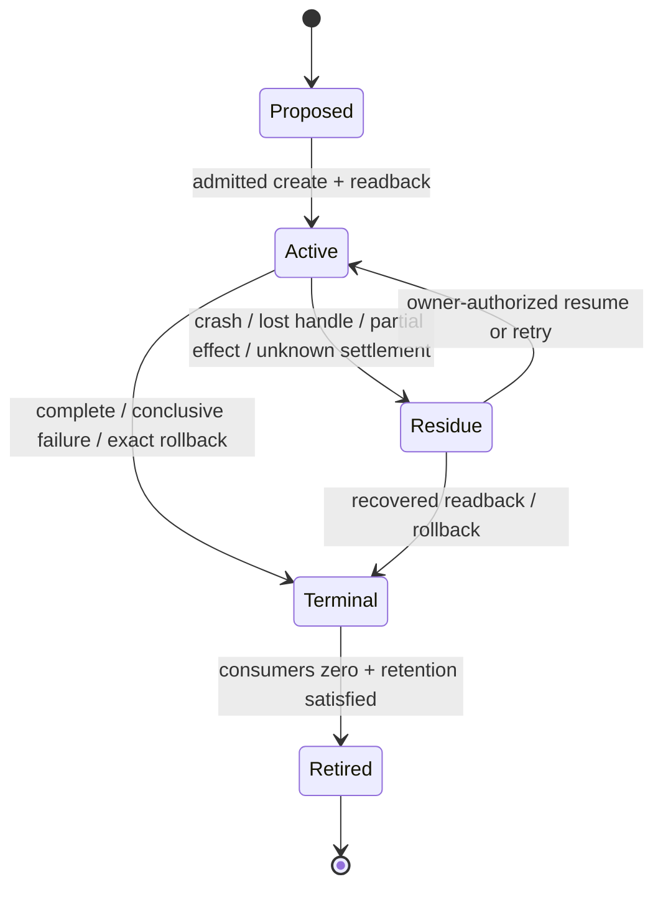
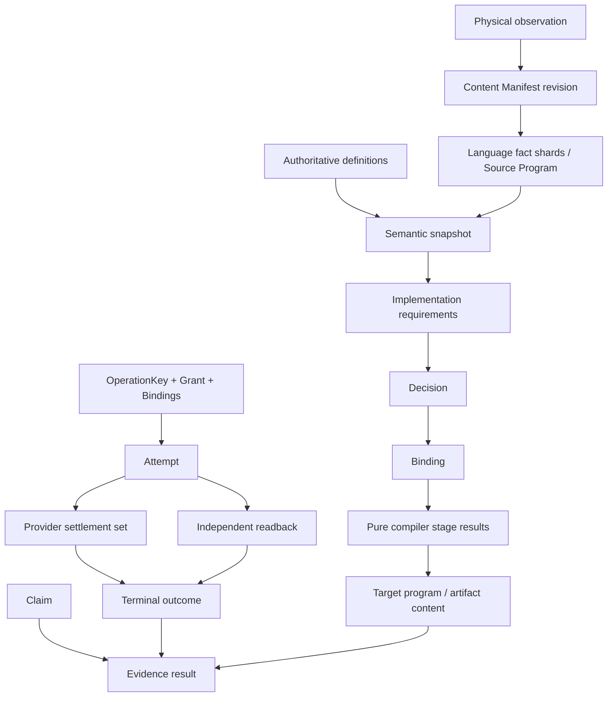
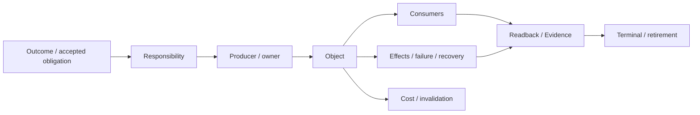
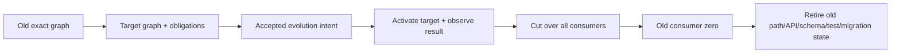
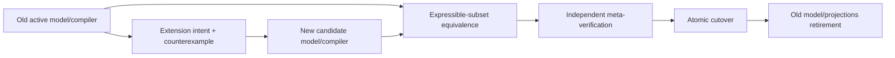
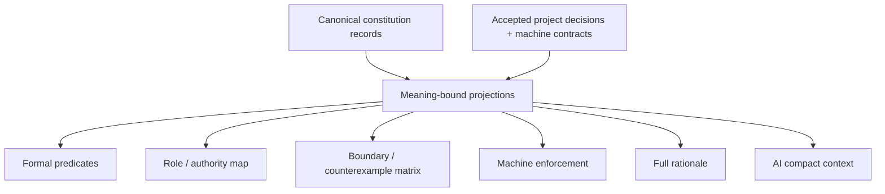
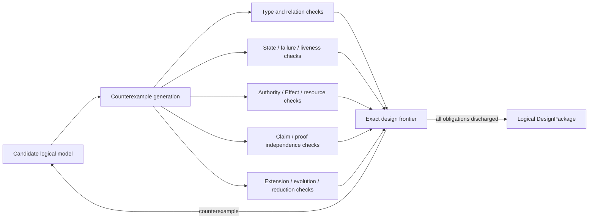

# SEC 生命周期、证明与演进架构

本片段拥有状态恢复、identity/provenance/Evidence、reduction/evolution、逻辑投影、模型验证与实现交接。

本片段与 [owner root](../system-architecture.md) 共享同一 domain，但只拥有 registry 分配给本片段的 ownership keys；跨片段语义使用引用，不复制定义。

## 9. State、生命周期与恢复

### 9.1 状态域

状态按语义owner分域，不按Git、数据库、文件夹或host分域：

| State domain | 拥有 | 不拥有 |
| --- | --- | --- |
| semantic state | accepted Definition、Invariant、responsibility revision | runtime attempt、Evidence verdict |
| operation state | request、plan、effect observation、settlement、result/recovery | Product truth、Authority issuance |
| authority state | grant、delegation、expiry/revocation/use obligation | Capability availability、业务成功 |
| capability state | candidate、eligible Provision、Binding、conformance/maturity | Grant、Domain result |
| resource state | capacity、allocation、consumption、return/leak/unknown | 业务优先级、Proof |
| proof state | Claim、Evidence requirement、Verdict、freshness/invalidation | Mutation、publication Authority |
| evolution state | old/new generation、compatibility、cutover、retirement obligation | 正常路径的永久双generation |

同一物理载体可以承载多个状态域，但不能因此合并语义owner。载体、partition、transaction、retention与cleanup策略属于实现架构。

### 9.2 生命周期



每个有跨时间效力的state必须定义creator、owner、revision、合法transition、readers、invalidation、recovery和retirement。实现必须为这些语义选择足够强的持久与并发机制；函数return、进程exit、记录存在或测试绿色都不自动构成terminal。

### 9.3 失败代数

| 失败位置 | 合法结果 |
| --- | --- |
| validation/coverage/eligibility/compatibility unknown | typed unknown/unsupported/conflicted；零 Effect |
| authority/provider/resource unavailable | blocked；Requirement 不变 |
| pre-publication failure | canonical target不变 |
| partial/post-effect failure | exact rollback receipt，否则 recovery-required |
| cleanup/close/readback failure | primary failure + settlement/residue；不得覆盖 |
| Evidence missing/stale | facts不变；依赖 Claim 不得 terminal |
| model不能表达反例 | model/plan/Evidence stale，进入 meta-evolution |

未知、权限、unsafe、deadline或解释失败不能降为`false | null | absent | mismatch`后触发Effect；durable grammar、reader与migration协议由实现架构和状态owner共同实现。

## 10. Identity、provenance、reuse 与 Evidence

### 10.1 Typed provenance DAG



不存在统一 `Generation`：

| Identity | 只绑定 |
| --- | --- |
| Content Manifest revision | logical content set |
| Source Program generation | manifest + interpreter/config closure |
| Semantic snapshot | definitions + admitted observations/unknown |
| Decision/Binding | requirements + policy + eligible candidates |
| pure stage result | exact upstream refs + compiler/backend contract |
| Artifact content | canonical output bytes |
| OperationKey | domain Effect/idempotency |
| Attempt | one grant/binding/allocation execution |
| Evidence | Claim + exact result/environment/outcome refs |

attempt、deadline、cache path、Git session、PID 和 Evidence id 不得污染 pure result identity。

### 10.2 Derivation reuse

逻辑结果可以复用当且仅当：

```text
producer semantics exact
∧ accepted input closure exact
∧ derivation identity exact
∧ invalidation complete
∧ result remains inside the same validity interval
```

reuse不能扩大Claim、Authority或coverage；missing、stale、foreign或unknown只允许回到同一clean derivation。cache、index、pointer、mtime、fact shard、lease和GC是实现策略，由实现架构证明与clean derivation等价。

### 10.3 Evidence

Evidence 只支持预声明 Claim，不支持“整个系统正确”。Proof owner 检查 subject、inputs、environment、coverage、issuer independence、freshness 和 invalidation。implementation producer、expected profile、projection、fixture、版本数字、报告文字和同模块 self-digest 不能成为独立证明。

Verification 的 Result lattice、ActionKey、复用和 CI/merge 规则由 `docs/verification-governance.md` 拥有；Architecture 只要求其不反向拥有 source、domain result 或 authority。

## 11. Reduction 与演进

### 11.1 图内裁决

全部 source/test/document/provider/state/cache/Effect/Evidence/plan 进入同一因果图：



| Disposition | 成立条件 | 动作 |
| --- | --- | --- |
| required | independent responsibility、live consumer/effect/durable state，或 accepted unmaterialized obligation | 保留/实现最小闭包 |
| derivable | 可从 upstream facts 确定性重建 | 删除手写副本；生成 projection |
| duplicate-owner | 多个 producer/parser/writer/issuer 拥有同一 identity | 选 owner、迁 consumer、删其余 |
| dominated | semantics/failure/proof space 被成本不高于它的对象覆盖 | 合并后删除 |
| orphan | accepted/future/external/unknown obligation closure 全零 | 整图删除 |
| unknown | coverage/authority/future obligation 不完整 | bounded blocker；不作保留/删除结论 |

“未来会用”只有形成 owner-issued obligation、activation condition、acceptance、review/expiry 和 retirement 才是 required；comment、dead API、version suffix、test name 不是 future value。

### 11.2 版本与兼容

generation/revision只在至少一个真实consumer必须区分两个可观察语义状态时存在。单generation、原子替换、名字区分或测试自证不产生generation语义；旧态只在明确的Evolution关系中存在。schema字段、parser、suffix与迁移载体如何实现由实现架构和对应domain contract拥有。

### 11.3 一次迁移



Evolution期间只有一个active authority route；旧/新generation的并存必须有明确support window、consumer集合和终止条件。失败只能进入resume、rollback、forward recovery或recovery-required；具体记录、发布和cutover机制属于实现架构。

### 11.4 Meta-model evolution



旧 compiler 只授权迁移 envelope，新 compiler 只验证 candidate post-state，独立 verifier 证明旧可表达子集等价和新增 frontier。不能用新模型自证采用，也不能永久双跑两套 truth。

## 12. 逻辑信息的权威与投影

### 12.1 信息类别

| Information kind | 只保存 | 产生方式 | 禁止保存 |
| --- | --- | --- | --- |
| Accepted decision | 不可推导 outcome/non-goal/tie-break、理由、反转条件、issuer | authorized decider 一次签发 | current path/provider/test/status |
| Stable spec | Definition/invariant/forbidden authority/activation/retirement | domain owner contract | implementation inventory、事件日志 |
| Logical DesignPackage | Domain/Operation/Workflow/State/Failure/Authority/Resource/Proof/Evolution语义 | logical compiler | 实现机制、运行结果、迁移批次 |
| Implementation DesignPackage | 逻辑设计的目标realization | implementation compiler | 新业务语义、被观察实现的inventory |
| Conformance Model | 跨逻辑与实现的性质、场景、fault与Claim obligations | conformance compiler | producer自报Verdict |
| Generated projection | applicability、roles、closures、obligation、unknown、人/AI view | projection compiler | manual edits、Effect/PASS |
| Runtime/Evidence | attempt/receipt/failure/external observations | runtime/verification owner | stable design truth |

### 12.2 Constitution binding

| Constitution | canonical owner | SEC projection owner | runtime consumer |
| --- | --- | --- | --- |
| Design Calculus | `docs/design-calculus.md` | 本文件的 relation/compiler profile | DesignAdmission 与 architecture attack compiler |
| Engineering Constitution | `docs/engineering-constitution.md` | 本文件的 SEC owner/effect/resource/evolution profile | DesignAdmission |
| Agent Constitution | `docs/agent-constitution.md` | `docs/development-governance.md` | BehaviorAdmission |

```text
EffectiveAction =
  BehaviorAdmission
  ∩ DesignAdmission
  ∩ active EffectGrant
  ∩ available Provision / Allocation
```

Agent principle 不能创造 engineering truth；engineering principle 不能授权 Agent。SEC profile 只能收窄和实例化上游原则，不能复制或改写；聊天、summary、memory、Skill 不补缺项。

### 12.3 单一语义、多种精确表达



多种表达允许长度和形式不同，目的是消除歧义：

| View | 优化目标 | 必须保留 |
| --- | --- | --- |
| full rationale | 定义、推导、方案比较、反转条件 | 全部 semantic meaning |
| formal | 可判定谓词、状态机、truth table | exact constraints/unknown |
| role | issuer/owner/consumer/handoff | authority separation |
| boundary | 正反例、failure/recovery、retirement | rejection semantics |
| enforcement | type/schema/parser/lint/admission/CI | reachable machine rejection |
| AI compact | 当前 question 的最小 closure | 同一 blockers/unknown |

所有 views 引用同一 principle meaning；任何 view 增删 Claim、owner、unknown 或 blocker 都拒绝发布。完整解释可以严谨且较长，但不得复制 current facts；信息密度由按需 projection 提升，不靠删条件。

Agent bootstrap、文档生成、实时同步、载体布局和开发期admission都不是逻辑语义，统一由`docs/development-governance.md`与`docs/implementation-architecture.md`实现。本文件只规定任何投影都不能改变上述信息类别的owner、meaning、unknown与Authority。

## 13. 逻辑架构自攻与模型验证

逻辑设计必须在选择实现以前证明自身没有遗漏、混淆或自相矛盾。自攻输入只包括accepted ProductCapability、Domain definitions、Operations、Workflows、Authority、Capability/Resource requirements、State/Failure、Claims、Evolution与unknown frontier；不得用源码、测试、工具、路径或任一候选realization替设计回答。



### 13.1 必须保持的性质

| Property | 形式化条件 | 反例结果 |
| --- | --- | --- |
| Semantic unity | each accepted semantic fact has exactly one owner | duplicate-owner / unresolved |
| Orthogonality | Definition、Observation、Authority、Capability、Resource、Effect、Evidence、Verdict互不冒充 | type-confusion |
| Domain closure | every Domain owns complete invariant/state/failure/public-operation semantics | domain-incomplete |
| Workflow opacity | Workflow只消费public operations/results，不可见child private state/Effect | boundary-collapse |
| No authority amplification | every Effect scope is a subset of a live issuer grant and parent delegation | unauthorized |
| Resource conservation | child demand/allocation/consumption never exceeds parent envelope | resource-unsatisfied |
| No implicit truth | unknown/opaque/conflicted cannot produce positive Claim or absent/mismatch | unresolved |
| Effect determinacy | every admitted Effect has defined settlement/readback/recovery semantics | effect-ambiguous |
| Proof independence | Claim producer alone is never sufficient Evidence | self-proof |
| Lifecycle reachability | every active state reaches terminal、residue或明确bounded wait | liveness-unresolved |
| Evolution singularity | normal semantics has one active generation and a finite old-state exit | competing-generation |
| Conservative extension | a new Domain/Target/Provider/Workflow preserves unaffected accepted meanings | meta-model-conflict |
| Reduction soundness | deletion/merge preserves outcomes、future obligations、failure/recovery与external contracts | conservation-unresolved |
| Decision completeness | every non-derived choice has issuer、alternatives、reason与reversal condition | decision-unbound |

### 13.2 逻辑 trace 演算

| Trace | 必须经过 | 合法结果 |
| --- | --- | --- |
| query | exact observation+coverage → adopted semantics → query rule | answer / unknown / conflicted |
| single-domain change | intent → pure plan → admissibility → Effect observation → readback → DomainResult | accepted / rejected / blocked / failed / recovery-required |
| cross-domain workflow | public Operation refs → dependency/result mapping → each child independent admissibility → join/compensation | workflow result / bounded partial state |
| concurrent conflict | shared Subject preconditions → unique linearization or conflict | one accepted transition / typed conflict |
| lost Effect observation | known Plan+OperationKey → current observations → recovery decision | join / completed / conclusive retry / recovery-required |
| provider replacement | unchanged Requirement → new eligible Provision → Binding delta → conformance/evolution | new binding / blocked |
| model counterexample | counterexample → dependent decisions/plans/proofs stale → extended model → equivalence over old expressible subset | new accepted generation / unresolved |
| capability retirement | accepted outcomes+future obligations → replacement/reduction proof → consumer/effect/external closure | retired / blocked / unknown |

实现方案只有在它能refine这些trace且不新增可观察Authority、Effect、state、failure或unknown时才可能被接受。锁、队列、session、journal、database、actor、进程、容器、文件与测试如何实现这些trace不属于本逻辑文档。

## 14. Logical DesignPackage 与实现交接

逻辑设计的唯一发布物是immutable、content-addressed的`LogicalDesignPackage`：

```text
LogicalDesignPackage {
  acceptedProductCapabilityRefs
  designRationaleIndexRefs
  domainDefinitionsAndPublicOperations
  workflowDefinitions
  subjectInvariantStateFailureGraph
  authorityAndDelegationRequirements
  capabilityAndResourceRequirements
  effectSettlementReadbackRecoverySemantics
  claimsAndIndependenceRequirements
  evolutionAndFutureObligations
  counterexamplesAndExactUnknownFrontier
  sourceDefinitionRefs
}
```

`designRationaleIndexRefs`只引用`docs/design-calculus.md`定义的typed explanation traces与其生成索引；本package不得重述来源、目的、候选、避免故障、后果、证明或反转理由。由此每项逻辑语义既可回答“为什么存在/来自哪里”，又不会让逻辑文档成为Product decision的第二owner。

它不包含declaration、file、package、path、framework、library、provider instance、session、store、process、container、test list、deployment topology或migration command。实现编译器可以返回多个non-dominated realization或`implementation-unresolved`，不能回写LogicalDesignPackage以迁就当前代码。

```text
LogicalArchitectureClosed =
  every accepted ProductCapability has complete Domain and Workflow traces
  ∧ every relation and non-derived decision has exactly one owner
  ∧ every State/Failure/Effect/Resource/Authority/Proof/Evolution obligation is explicit
  ∧ all applicable counterexamples are refuted, represented or bounded unknown
  ∧ no implementation choice is encoded as logical truth
  ∧ every future obligation has activation, validation, reversal and retirement semantics
```

只有该谓词成立才进入`docs/implementation-architecture.md`。实现选择、工程迁移与交付顺序属于后继设计阶段，不能出现在本Logical DesignPackage中，也不能反向决定目标逻辑。
