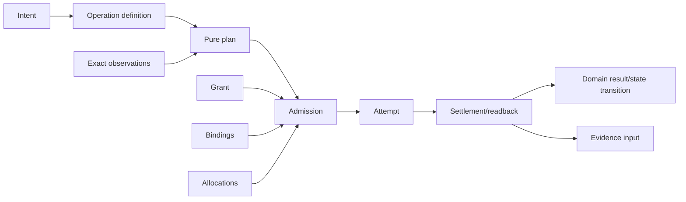
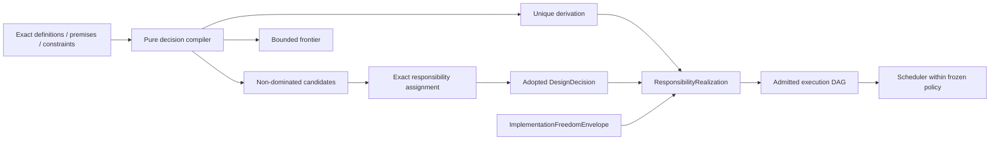

# Operation、Owner 与资源关系

本文只拥有通用 Operation、Responsibility、Authority、Capability、Resource 与 Workflow 关系。Domain 集合由 [递归系统拓扑](scope-and-domain-topology.md) 编译；物理 process/container/dependency实现由 implementation architecture 拥有。

## 1. Operation 的四个分型

```text
Operation =
  | OperationDefinition
  | PureOperationPlan
  | AdmittedExecution
  | OperationObservation
```

| variant | owner/input | 包含 | 禁止 |
| --- | --- | --- | --- |
| `OperationDefinition` | Domain/Workflow owner | intent grammar、pre/post、state/failure、requirements、idempotency、result | Provider、live grant、path、current state |
| `PureOperationPlan` | deterministic plan compiler | exact definition/input/observation refs、requirement DAG、readback/recovery、resource ceilings | Effect、ambient discovery、opaque handle |
| `AdmittedExecution` | authority/capability/resource admission | exact plan、grant、bindings、allocations、preimage、opaque tickets | 重算 Definition、扩大 scope、business success |
| `OperationObservation` | runtime/state owners | attempt、settlement、readback、DomainResult refs、residue | 修改 plan、自签 Evidence/Verdict |

同一个可变 `Operation` 对象不得跨四个角色。每次转交都是新 identity、exact input refs 和 closed result；plan不能在执行时被callback热改。

## 2. 从意图到结果



```text
OperationPlanKey = digest(
  definitionRevision,
  normalizedIntent,
  immutableObservationRefs,
  policyAndRequirementRevisions,
  targetProfileRef
)
```

live grant、provider generation、allocation、preimage 和 environment进入 `AdmittedExecutionKey`，不污染 pure plan identity。相同 exact key可复用纯结果；Effect复用还必须由 operation journal和readback证明 terminal/join语义。

## 3. Observation、Coverage 与 Unknown

```text
ObservationResult =
  | observed { subjectRef, valueRef, methodAndEnvironmentRefs }
  | absent { subjectRef, completeUniverseAndMethodRefs }
  | mismatch { subjectRef, expectedRef, actualRef }
  | unresolved { subjectRef, reasonRef, affectedClosure, closurePredicate }
  | expired { subjectRef, deadlineOrFreshnessRef }
  | unsafe { subjectRef, capabilityOrBoundaryRef }
```

`absent`要求对声明 universe 的完整观察；异常、权限、deadline、reparse、unsupported和parser unknown不能折叠为false/null/cache miss。多个 consumers需要同一 source/content/physical事实时共享一个 exact observation generation；各自重扫既浪费资源，也制造互相漂移的世界。

Coverage 是对 universe/method/environment的关系，不是百分比：

```text
Coverage = exact {
  universeRef,
  observedSubsetRef,
  methodAndCapabilityRefs,
  completenessClaimRef | unknownFrontierRef
}
```

## 4. Responsibility 与 Owner DAG

```text
ResponsibilityAssignment = exact {
  responsibilityRef,
  ownedSubjectAndDecisionRefs,
  publicDemandRefs,
  issuerAndLifecycleRefs,
  completionPredicateRef
}
```

每个 semantic fact、writer、parser、resolver、linearization point、terminal decision 和 public operation恰有一个 active assignment。assignments 构成有限 DAG并终止于有权 Product/Domain decision；source、path、团队、compiler、projection和self-digest不能自授权。

`owner`是可验证的Responsibility/issuer relation，不等于某个人、团队、文件、class或常驻service。它可以由被治理的machine authority执行，但必须具有唯一identity、scope、decision/transition rights、lifecycle与replacement规则；组织变化或实现替换不自动改变semantic ownership。

需要多方同意时，唯一assignment可绑定threshold/quorum/segregation-of-duties policy；这形成一个compound issuer和一个linearization protocol，而不是多个竞争owner或last-write-wins。任一participant只拥有其份额，无法单独签发combined decision。

ResponsibilityScope是逻辑责任的最小内聚scope；其owner由独立ResponsibilityAssignment绑定，其实现由implementation compiler派生ResponsibilityRealization。Owner DAG只表达“谁定义/采用/签发”，不表达import、runtime call、证明、文件树或组织汇报线。

### 4.1 Decision control

系统不设置一个能重算所有设计的中央“架构owner”。每个不可推导变量由一个exact `ResponsibilityAssignment`控制；其他owners只能提供typed constraints或premises，不能共享最终写权。选择只有四种合法来源：



| resolution | 谁控制 | 允许产物 | 禁止 |
| --- | --- | --- | --- |
| closed derivation | rule/contract owner定义算法，compiler对exact inputs求值 | derivation + proof refs | compiler偏好、人工暗选 |
| governed decision | 该decision dimension的ResponsibilityAssignment | DesignDecision | 文件作者、团队惯例、当前实现反推 |
| local freedom | 上游owner签发的ImplementationFreedomEnvelope | envelope内任一conformant realization | 改变public trace、failure、authority、state、resource或compatibility |
| frontier | 尚无合法controller可完成 | alternatives + affected closure + closure predicate | 默认值、first-found、scheduler/Provider/AI代选 |

多个constraint issuers不等于多个decision owners。Product owner约束用户结果与不可推导产品取舍；Domain/state/contract owners约束语义、状态和public trace；resource/security/platform owners提供各自边界；Design Compiler求交、剪枝和证明。若仍剩多个非支配候选，只有该变量的assignment可以采用；若assignment缺失则保持frontier。

结构、算法和并发分别按其可观察性定位控制权：

| decision dimension | 上游不可被实现改写的约束 | 最终采用者 | runtime权力上限 |
| --- | --- | --- | --- |
| semantic scope / Domain boundary | meaning、invariant、state/failure、public operation | Domain boundary assignment；compiler只能证明候选partition | 无 |
| public contract / schema / version | consumer、durability、compatibility、disclosure | contract/evolution assignment | parser只执行当前合同 |
| algorithm / data representation | public behavior、precision、determinism、complexity/resource ceilings | 可唯一推导则compiler；否则responsibility assignment；完全等价才属local freedom | executor不能换算法族 |
| ImplementationUnit / package / placement | responsibility、dependency DAG、trust/lifecycle/release、change-locality cost | implementation responsibility assignment或唯一derived result | loader/build tool不产生边界 |
| state / consistency / linearization | state machine、failure algebra、tenant/security invariants | state responsibility assignment | store/provider只实现已选模型 |
| concurrency / ordering | semantic partial order、commutativity、idempotency、fairness、resource bounds | operation/state assignment接受policy；compiler导出execution DAG | scheduler只在admitted ready set内选顺序 |
| resource / timeout / backpressure | parent ledger、service objective、safety ceiling | resource assignment | allocator只收窄，不能重置parent budget |
| provider / mechanism / process | Requirement、security/identity/environment、settlement contract | Binding assignment从eligible Provisions中选择 | Provider只供应与结算，不解释业务结果 |
| Claim / verification method | exact Claim semantics、independence、coverage、freshness | Claim owner声明；Evidence owner观察；Verdict owner判定 | runner/PASS不产生Claim或Authority |
| migration / cutover / retirement | preservation、reader/writer generations、recovery、consumer-zero | Evolution assignment | migrator只执行admitted transition |

因此“由谁控制”是可计算关系：`decision variable → applicable constraints → unique assignment or derivation → realization ref`。它不是一个人的总权力，也不是隐藏在class、文件夹、orchestrator或workflow里的自由裁量。

## 5. Workflow、Control、Orchestration 与 Scheduling

四者不能混成一个“流程引擎”：

| construct | 唯一职责 | 不拥有 |
| --- | --- | --- |
| WorkflowDefinition | 用 public operations/result mappings组成业务过程 | child private state、Provider、live resource |
| Control compiler | 把 definition、exact observations和policy编译为 immutable plan/admission decision | Effect、DomainResult |
| Orchestrator | 按 admitted DAG 调用 capabilities并汇总 settlement | policy、Authority、业务重算 |
| Scheduler | 在已准入 ready set 内按显式 policy选择顺序/并发 | 新 work、scope、hidden priority |

```text
WorkflowExpression =
  | invoke(operationRef, inputRef)
  | sequence(expressions)
  | parallel(expressions, concurrencyRequirement)
  | choose(decisionRef, branches)
  | await(observationRequirement)
  | compensate(resultRef, compensationRef)
  | terminate(resultRef)
```

表达式是closed AST，不接受任意 callback、shell文本或运行时注入代码。循环必须是有variant/bound的state machine或显式feedback relation；普通workflow DAG保持无环。跨Domain只传 public input/result/ref，不读child journal或private state。

## 6. Requirement、Provision、Binding 与 Allocation

```text
Requirement  = operation needs a semantic/physical capability with constraints
Provision    = provider can supply a capability under stated conditions
Binding      = this eligible provision satisfies this exact requirement
Allocation   = resource owner reserves bounded capacity for this operation
AuthorityGrant = issuer permits the principal to act on exact subjects/scope/epoch
```

五者不可互换：Provider可用不代表caller有权限；Binding不代表资源已保留；Allocation不扩大Grant；执行成功不证明业务完成。

```text
AdmittedExecution =
  PurePlan
  ∩ valid AuthorityGrant
  ∩ eligible ProvisionBindings
  ∩ conserved ResourceAllocations
  ∩ exact current state/preimage
```

任何一项unknown/expired/stale都只产生 typed refusal。test object、serialized receipt、environment、PATH、tool output、cache和presentation不能伪造opaque capability。

## 7. Authority algebra

```text
EffectiveAuthority =
  intersection(
    principal authority,
    delegated scope,
    operation definition ceiling,
    subject/preimage binding,
    capability ceiling,
    temporal/epoch validity
  )
```

delegation只能收窄，不能通过多层组合再放大；issuer closure有限、无环、可撤销。read、observe、plan、execute、publish、verify、merge、cleanup等权限分开；拥有物理write capability不等于拥有semantic mutation或completion authority。

## 8. Resource algebra

资源维度由 Requirement声明，可扩展但必须守恒：

```text
Allocate(parent, child_i) => Σ reserved(child_i) <= parent.remaining
Consume(child)            => monotonically increases consumed
Return(child)             => only unused reservation returns
Settle(parent)            => every child is terminal or typed residue
```

时间使用parent单调absolute deadline；retry、cleanup、readback和recovery不得重置预算。输入条目/字节、输出、process、network、memory、CPU、锁、provider配额等在实际操作中流式计量；没有理由预扫同一内容两遍。共享immutable content与运行allocation分离：多个consumer可引用同一generation，但各自Attempt仍有独立allocation/settlement。

## 9. Effect、并发与恢复

```text
EffectClosed =
  intent durable before Effect
  and exact preimage/authority/binding/allocation fence immediately before Effect
  and attempt identity retained or journaled
  and bounded settlement plus independent readback
  and state transition/domain result only after legal settlement
  and cleanup preserves primary failure and records residue
```

冲突由 state/subject/operation relations推导：可交换的 independent effects可并行；共享writer、non-reentrant capability、same subject/preimage或capacity ceiling要求序列化。并发政策显式进入plan，不能由 `Promise.all`、线程数或工具默认值暗中决定。

必须生成的组合攻击族包括 duplicate/late delivery、lost handle、partial settlement、deadlock/livelock、starvation、priority inversion、retry storm、thundering herd、provider outage、split brain、external mutation和cascading resource exhaustion。故障闭包来自关系组合，不靠品牌案例列表。

## 10. 完成

```text
OperationSystemClosed =
  every operation variant is disjoint and exact
  and every semantic owner assignment is unique and acyclic
  and every workflow uses only public operations
  and every admitted execution is the exact grant/binding/allocation/preimage intersection
  and resource conservation holds through settlement/recovery
  and every Effect terminates as result or typed residue
  and unknown never becomes absence, success or fallback
```

<!-- sec-clause {"blocker":null,"kind":"stable-decision"} -->
## 规范片段

Operation Definition、Pure Plan、Admitted Execution和Observation/Result必须分型；Responsibility、Authority、Capability与Resource各有唯一owner并以typed relations组合。Workflow只编排public operations，runtime只能执行已准入计划，任何unknown不得降级为absence或fallback。
