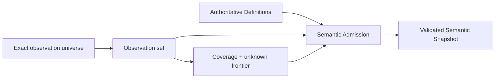
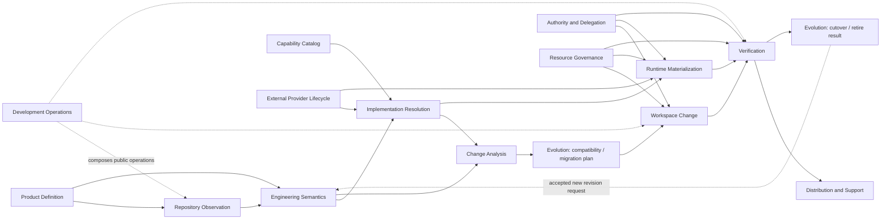
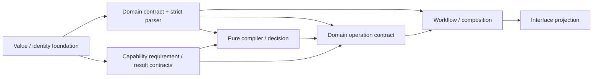
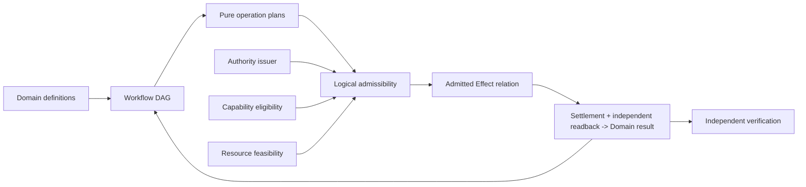
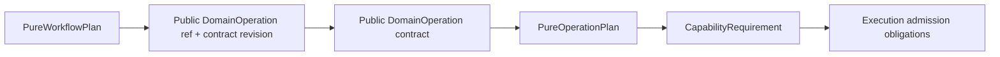

# SEC Operation、Owner 与资源架构

本片段拥有 operation 视图、S0–S9 编译、Knowledge、Owner DAG、capability、资源和并发。

本片段与 [owner root](../system-architecture.md) 共享同一 domain，但只拥有 registry 分配给本片段的 ownership keys；跨片段语义使用引用，不复制定义。

## 4. 四个 operation 视图

| View | 输入平面 | 回答 | 不回答 |
| --- | --- | --- | --- |
| Semantic | Purpose + Knowledge + Constraint + Responsibility | 做什么、为什么、哪个 Subject、何种结果 | 谁获权、是否执行 |
| Authority | Responsibility + Authority | 谁能对哪个 exact Subject 做哪些 Effect | Provider 是否可用、是否成功 |
| Resource | Provision + Execution | 谁供应、保留/消耗多少、怎样终止 | 业务结果、Evidence verdict |
| Lifecycle/Proof | Execution + Proof + Evolution | readback、terminal、residue、迁移、证据、退役 | 改写目标、放大 Grant |

四个 view 从同一 semantic graph 编译，共享 Subject/operation/revision，拥有各自 view kind 与 bytes digest。view 可以裁剪表达，不能增删 owner、Claim、unknown 或 blocker。

## 5. S0–S9 端到端编译


| Stage | 必需输入 | 唯一输出 | 禁止承担 |
| --- | --- | --- | --- |
| S0 | authorized outcome/non-goal/obligation | accepted purpose refs + unknown | scope、path、implementation |
| S1 | requested Subjects、observation purpose、coverage/resource bounds | exact universe + observation obligations + unreadable frontier | semantic adoption、physical mechanism |
| S2 | exact universe、observation contracts | typed observations + coverage + unknown/opaque | Definition、permission |
| S3 | owner Definitions、S2 facts、adoption rules | semantic claims/conflicts/unknown frontier | provider choice、write plan |
| S4 | semantics + consumer/effect/state/recovery relations | Responsibility Cells + Owner DAG + public demand | placement、attempt、terminal |
| S5 | intent、Cell/DAG、invariants、Claim definitions | OperationKey + Requirement DAG + pure Plan + obligations | discovery、lease、Effect |
| S6 | PurePlan、Grants、eligible Provisions、resource envelope、current state | admissible / rejected / bounded-unknown relation | business success、Evidence |
| S7 | admissible Plan与exact current facts | Effect observations + settlements + residue + readback + DomainResult | new Definition/Grant、Evidence verdict |
| S8 | Claims、DomainResult、S7 observations、exact environment | Verdict + Evidence validity/invalidation | DomainResult、mutation、publish authority |
| S9 | accepted DomainResult、required Verdict、materialization/evolution contract | artifact/projection/cutover/retirement receipt | upstream identity rewrite |

阶段是因果偏序，不是必须串行的同步程序。独立纯关系可并行求值；Effect必须满足Requirement DAG、concurrency与resource semantics。反馈只能是upstream owner接受的新request/result或new revision，不能通过隐藏状态或实现回调反向改写上游。

### 5.1 DesignAdmission

任何改变ProductCapability、Domain、public contract、owner、Effect、state、Authority、resource、recovery或evolution语义的设计，在进入实现选择前先编译：

```text
DesignAdmission = admit(
  accepted outcome / non-goal refs,
  exact accepted/observed producer-consumer-state-effect relations,
  target Responsibility / Owner DAG,
  identity / authority / capability requirements,
  resource + lifecycle / recovery rules,
  evolution / retirement obligations,
  Claim / Evidence obligations,
  bounded unknown frontier
)
```

它只返回`admissible | rejected | bounded-unknown`，不创建实现plan、state、authority或PASS。逻辑义务尚无实现时标为`required-unmaterialized`，不得反向删除义务或宣称能力已具备。

每个 accepted ProductCapability 在实现前必须从同一 `LogicalDesignPackage` 生成一个 `CapabilityDesignSlice`；它不是新的 owner 或手写规格：

```text
CapabilityDesignSlice = project(
  outcome/non-goal + domain Definitions,
  Subjects/Invariants/StateMachine/FailureAlgebra,
  public DomainOperations + WorkflowDefinition,
  actors/Authority actions/delegation,
  inputs/outputs/data/privacy/security,
  Requirements/eligible Provision classes/resource demands,
  Effects/settlement/readback/recovery,
  Claims/Evidence independence/conformance properties,
  performance/cost/SLO/operability,
  compatibility/migration/retirement/FutureObligations,
  alternatives/accepted decisions/reversal,
  source/purpose/rationale trace refs,
  coverage/unknown/implementation obligations
)
```

| Admission | 条件 | 允许的下一步 |
| --- | --- | --- |
| `design-unresolved` | 任一适用 concern/fault cell 无 owner、decision、typed unknown frontier 或 reasoned N/A | 只补观察/产品或领域决策；不得编码猜测 |
| `design-admitted` | 语义、流程、Authority、Effect、failure、resource、proof、evolution 已闭合；未实现项显式为 implementation obligation | Implementation Compiler 比较 realization |
| `implementation-admitted` | realization 保持 slice，placement/dependency/migration/verification plan 完整 | 受控实现/生成 |

代码只能实现 `implementation-admitted` obligation。编码中发现新的 actor、state、failure、Effect、resource、external dependency、compatibility 或用户可观察结果时，当前 plan 立即 stale，回到 CapabilityDesignSlice；禁止把新判断埋进 `if`、环境变量、callback、test fixture 或异常处理后再追认设计。

## 6. Knowledge：Observation、Coverage 与语义采用

### 6.1 唯一观察链



- Observation只陈述“在什么universe与coverage下观察到什么”，不自动成为Definition、Authority或Claim；
- 推导事实必须引用输入Observation、推导规则与coverage；inferred事实只有经Domain adoption才进入authoritative semantics；
- 未观察、无法解释、相互冲突和明确opaque是不同状态，均不能降为absent；
- 下游引用同一accepted observation revision，不得以第二次独立观察静默改变问题的事实边界。

### 6.2 开放世界完备性

```text
Complete(U, M, C) =
  exactCensus(U)
  ∧ everyContentClassHasInterpreterOrTypedOpaque
  ∧ everyObservationHasCoverage
  ∧ unknownFrontier(U, M, C) = ∅
```

`U`是exact universe，`M`是active meta-model，`C`是coverage。任何不可解释对象进入typed unknown；对象类别、解释器、物理snapshot、Source Program和frontier的工程表示由实现架构拥有。

### 6.3 增量与性能

逻辑结果的复用key只包含真正决定结果的输入：

```text
DerivationKey = exact accepted input revisions
              + derivation contract
              + relevant external fact generations
```

只失效依赖变化输入的推导；复用、增量、缓存或长期服务不得改变clean derivation的语义结果。共享snapshot、fact shard、Language Service、streaming budget和物理扫描策略属于实现架构，并必须refine本条逻辑等价性。

## 7. Responsibility 与 Owner DAG

### 7.1 Responsibility Cell

Responsibility Definition 只保存不能从 Source Program 推导的稳定事实：

```text
Cell identity
+ outcome / obligation refs
+ owned semantic Subjects
+ public operations
+ required issuer/readback/proof separations
+ activation / reversal / retirement conditions
```

它不保存 paths、roots、imports、tests、current consumers/providers、Effect sites 或 runtime state。Source Program 提供实际 declarations/edges；Architecture compiler join 二者产生 Owner DAG、public-surface demand 和 placement constraints。

### 7.2 SEC canonical Domain atlas

下面是由产品终局能力合同与canonical authority refs推导的目标Domain边界；它不是实现拓扑，也不表示每个文档、源码目录或部署单元都是Domain。

| Domain identity | 核心 invariant / state boundary | Public operations / results | Canonical authority ref |
| --- | --- | --- | --- |
| Repository Observation | 同一 retained snapshot、interpreter/config/provider closure只产生一个 coverage-bound事实图 | attach/lift/observe → SourceProgramSnapshot/unknown | `brownfield` |
| Engineering Semantics | accepted Entity/Fact/Assertion/Responsibility在一个 semantic revision内无冲突且owner唯一 | reconcile/adopt/validate/query → ValidatedEngineeringSnapshot | `semantic-model` |
| Implementation Resolution | hard eligibility先于policy；Decision、Binding、TargetProgram identities分离 | resolve/compileTarget → Decision/Binding/TargetProgram | `compiler-target-ir` |
| Change Analysis | exact before/after revisions产生唯一 Delta/Impact，unknown不被缩成未受影响 | compare/propagate → SemanticDelta/BindingDelta/Impact | `delta-impact` |
| Authority & Delegation | principal、Grant、delegation、use、expiry/revocation与audit obligation形成独立授权生命周期 | request/issue/delegate/revoke/observeUse → grant state/result | `system-architecture` authority profile + each Domain issuer policy |
| Resource Governance | capacity、Demand、parent/child Allocation、consume/return/leak/unknown满足守恒 | plan/reserve/consume/release/settle → resource result | `system-architecture` resource profile |
| Workspace Change | 一个 OperationKey 的Effect、journal、settlement、readback与recovery保持原子业务语义 | plan/apply/readback/recover → DomainResult/residue | `semantic-mutation` |
| Capability Catalog | Registry/Block/Port/Extension只声明可供选择的能力闭包，不选择业务实现 | resolveCapability → candidate/typed unavailable | `capability-block` |
| External Provider Lifecycle | provider identity、credential、security、conformance、maturity、retirement为同一采用生命周期 | observe/adopt/bind/retire → eligible Provision/provider receipt | `external-provider` |
| Runtime Materialization | host/target/toolchain/dependency的物理generation、readiness、settlement与recovery保持一致 | provision/materialize/readback/recover → physical result/residue | `runtime-distribution` |
| Distribution & Support | artifact set、package/deploy identity、支持成熟度、失效与退役独立于单次build | package/publish/observeSupport/invalidate → distribution/support result | `runtime-distribution` |
| Verification | Claim、required Evidence、environment、freshness、independence与Verdict不可被producer自报替代 | select/execute/evaluate/invalidate → Verdict/Evidence state | `verification-governance` |
| Evolution | compatibility、migration、cutover、rollback/forward recovery与old consumer-zero共同决定generation变更 | decide/compileMigration/cutover/retire → evolution result | `change-management` |
| Development Operations | SEC自身work selection、task/session/action/integration/continuation只组合上述public results | select/activate/execute/integrate/continue → development result | `development-governance` |

每个Domain还必须闭合自己的Subject、state、failure与下游交接；下面是目标逻辑合同，不是实现组件：

| Domain | Canonical Subjects / states | Required result partition | 只可交给下游的public meaning |
| --- | --- | --- | --- |
| Repository Observation | observation universe、observed facts、coverage、unknown/opaque | observed / partial / unreadable / conflicted | exact observation+coverage refs |
| Engineering Semantics | Definition、adopted Fact、Invariant、Responsibility、semantic revision | valid / conflicted / ambiguous / unknown | validated semantic snapshot or frontier |
| Implementation Resolution | Requirement、Candidate、Eligibility、Decision、Binding、TargetProgram | bound / no-eligible / tied / unresolved / stale | exact Decision/Binding/target refs |
| Change Analysis | before/after meaning、SemanticDelta、BindingDelta、ImpactClosure | unchanged / changed / incompatible / unresolved | exact affected Subjects/Claims/operations |
| Authority & Delegation | Principal、AuthorityPolicy、Grant、Delegation、Use、Revocation | requested / active / denied / expired / revoked / settled | exact action/Subject/scope/epoch grant refs |
| Resource Governance | Capacity、Demand、Allocation、Consumption、Return、Leak | available / reserved / exhausted / settled / leaked / unknown | exact parent/child allocation state |
| Workspace Change | DesiredDelta、PurePlan、Effect semantics、readback、DomainResult | rejected / blocked / applied / failed / recovery-required | result+state/effect observations |
| Capability Catalog | capability identity、candidate closure、eligibility facts | candidate / ineligible / unavailable / unknown | eligible Provision candidates only |
| External Provider Lifecycle | Provider、conformance、security、credential/principal、maturity | proposed / eligible / bound / degraded / retired | exact Provision+conformance/maturity refs |
| Runtime Materialization | runtime/dependency/toolchain generation、readiness、residue | ready / absent / mismatch / unresolved / recovery-required | exact materialization/readback result |
| Distribution & Support | artifact set、deployment target、support claim、drift | unpublished / published / supported / degraded / deprecated / retired | publication/support state refs |
| Verification | Claim、Evidence requirement、Evidence、Verdict、validity | pass / fail / blocked / not-applicable / stale | exact Verdict+coverage+invalidation |
| Evolution | old/new meaning、Compatibility、Migration、Cutover、Retirement | compatible / migration-required / breaking / unresolved / retired | generation transition result |
| Development Operations | work intent、selection、activation、action、integration、continuation | selected / blocked / executing / integrated / recovery-required / closed | references to underlying public results |

Domain state不能被另一个Domain的便捷结果覆盖：例如Verification PASS不把Workspace Change提升为applied，Provider eligible不把Implementation Resolution提升为bound，publication不把Distribution提升为supported，Development Operations也不能替任何Domain生成结果。

Product outcome/non-goal 是所有 Domain 的上游输入；Implementation Architecture、execution mechanism、resource accounting、documentation与Interface projection是跨 Domain 的实现或投影责任，不是新的业务 Domain。逻辑 Domain 不规定源码、package、进程或部署边界。



参考业务 workflows 从这些 public operation 编译，不另建跨域真相：

| Product workflow | Public DomainOperation chain | 不得旁路 |
| --- | --- | --- |
| 理解/解释既有工程 | ObserveRepository → Reconcile/Adopt → Query → Interface projection | 路径/AI直接签 semantic truth |
| Brownfield 正确变更 | Observe → Validate semantics → Resolve implementation → Delta/Impact → Apply workspace change → Verify → Publish/Evolve | Agent直接改文件、测试PASS即发布 |
| 从语义生成新产品 | Accept Definition → Resolve/Target compile → Materialize → Readback/Verify → Package/Support | Backend执行Effect或重选Provider |
| 引入/替换外部能力 | Observe candidate → Provider adoption/conformance → Resolution/Binding delta → Migration/cutover → Verify/retire old | ambient fallback、双active owner |
| 故障恢复 | owning Domain readback → PureRecoveryDecision → new admission → recover/compensate/retry → readback | generic workflow猜测状态或blind replay |
| SEC自我演进 | Development Operations组合同一Observe/Change/Mutation/Verification/Evolution operations | 建第二套dev-only source/Effect/proof语义 |

Domain atlas 的增删改只能由产品/领域 invariant、public result与独立 evolution边界证明；实现映射由下游实现架构单独编译，不能反向改变这些边界。

### 7.3 依赖层级



左侧是上游，右侧可依赖左侧。禁止：

- contract 导入 runtime/provider/operation；
- pure compiler 执行 Effect；
- capability 解释 domain success；
- workflow 绕过 domain operation 直达 primitive；
- interface 绕过 operation 重算 decision；
- foundation/architecture contract 反向导入 Source Program、filesystem、language provider 或 placement；
- feedback 形成 runtime import SCC；反馈必须是 typed request/result，由 orchestrator 组合。

### 7.4 Implementation projection

本层只输出 accepted Responsibility Cells、Owner DAG、logical dependency constraints 和 public demand。Facade 是否有真实边界、CodeUnit 角色、package/file placement、单一 `src/` authored root、module admission、局部变更、意图生成与架构迁移统一由 `docs/implementation-architecture.md` 编译。

路径、目录、`index`、package、测试、当前 import 和 facade 均是 implementation observation/projection，不能反向定义 responsibility。实现编译器必须证明实际 Source Program 满足本层 DAG；不能用文档路径清单、命名约定或生成 registry 替代 actual declaration/reference/effect graph。

## 8. Operation、capability 与资源

### 8.1 三层分离

| 层 | 拥有 | 不拥有 |
| --- | --- | --- |
| Capability requirement | 对观察或 Effect 所需能力及可接受 settlement 的抽象约束 | 具体 Provider、session、path、handle |
| Domain operation | OperationKey、Requirement DAG、业务 invariant、Effect semantics、readback/recovery/terminal | provider实现、跨域工作流 |
| Workflow | 一个或多个 domain operation 的依赖与补偿编排 | 子operation state/authority、primitive |

“原子”表示一个业务不变量完整成立或进入可恢复 typed state，不表示每个函数、文件或 I/O 都公开。对外只公开 query 和 domain operation；primitive/provider 细节保持内部。

### 8.2 Flow、Control、Orchestration 与 Scheduling

这些词回答不同问题，必须由不同 owner 通过 typed refs 组合：

| 角色 | 组织/控制什么 | 只消费 | 绝不能决定 |
| --- | --- | --- | --- |
| Product/Domain decider | outcome、non-goal、不可推导取舍 | intent、事实、alternatives | 实现、Provider、运行结果 |
| Domain definition owner | Subject、Invariant、State、Failure、Operation semantics | accepted decisions | Authority、Provider availability |
| Workflow composer | 一个或多个 public DomainOperations 的依赖、join、compensation | operation contracts/results | 子 operation 内部 state/Effect、primitive |
| Policy/decision compiler | eligible candidates 间的 deterministic decision | definitions、facts、policy | 签发 Authority、执行 Effect |
| Control/admission owner | 某 transition/attempt 当前是否允许 | plan、facts、constraints、refs | 改写 workflow、执行或证明成功 |
| Authority issuer | principal 对 exact Subject 的 Effect 上限 | authorized decision、scope、epoch | capability 可用性、业务成功 |
| Capability contract owner | Requirement、Provision eligibility 与 settlement semantics | domain requirements、provider facts | 修改 Domain intent、把能力可用性当 Authority |
| Resource policy owner | 资源维度、容量、共享、公平、释放与未知语义 | operation demand、current capacity facts | 业务终态、把未观测容量当无限 |
| Operation semantics owner | Effect observation与独立readback如何归约为result/recovery | plan、settlement facts、state facts | 签发Authority、独立Evidence verdict |
| Verification owner | exact Claim 与 independent Evidence 的 verdict | result/readback/evidence | mutation、retry、merge Authority |
| Interface owner | intent/query 输入和 typed projection 输出 | public operations/results | 重算 decision、绕过 admission |



逻辑流程由 Workflow/DomainOperation owner 控制；Capability、Resource、Authority、Settlement与Verification只提供各自关系所需的事实。任何角色跨过这些边界都会形成第二workflow、self-authorized Effect或self-proof。具体编排者、scheduler、provider、store和session由实现架构选择，不能由本逻辑图预定。

控制不是一个万能 control plane。每个 admission owner 只控制其状态转换；跨域组合由 Workflow 引用各 DomainOperation 的 public result。公共 Control Plane 只能聚合 typed admission/readback projections，不能取得所有领域的 Definition、journal 或 terminal ownership。

Workflow 的 public operation 引用与 operation 内部的 Capability Requirement 是两级不同逻辑，不能压成一个万能operation：



- Workflow 节点只固定 public DomainOperation identity、contract revision、input/result mapping 和 constraints；不定义operation怎样被调用或实现。
- DomainOperation声明它需要的Git/process/filesystem/network/container/compiler等Capability Requirement；后续binding/admission如何实现由实现架构拥有。
- Workflow 可以声明语义约束，例如 local-only、offline-capable、principal、latency class 或 required result semantics；只有当某个具体 Provider identity 本身是已接受的产品不变量时，它才进入 Requirement。不得用 callback、路径、环境变量或实现名字暗中选择 Provider。
- “自由控制流程”表示用typed、可组合、可验证的WorkflowDefinition控制operation、数据边、分支、并发、等待、终止和恢复；不表示Workflow拥有子operation的capability选择、state或Effect。

```text
WorkflowDefinition  = logical operations + dependencies + guards + compensation semantics
PurePlan            = typed requirements/effects/readback/result DAG; no provider/grant/allocation
PublicOperationRef  = exact public DomainOperation identity + contract revision for one workflow node
Admissibility       = current facts satisfy authority ∧ capability ∧ resource ∧ state preconditions
DomainResult        = operation semantics applied to settlement + independent readback
```

这些对象具有不同 identity/revision/owner。WorkflowDefinition与PurePlan可以跨实现保持不变；Admissibility随current facts变化；DomainResult不能由Capability提供者、记录载体或Interface构造。

Definition、Plan 与运行状态都不可原地改写：

```text
accepted Definition change -> new definition revision
same Definition + changed exact request/facts -> new PurePlan identity
same PurePlan + changed current facts -> new admissibility evaluation
running observation/effect never mutates Definition or Plan
```

事实、Capability、资源或权限变化只会使未启动的admissibility stale；它们不能热修改已运行Plan。运行中发现Plan错误或前提失效时，停止新增Effect，保留现有observation，再由原Plan/readback生成`PureRecoveryDecision`。partial/unknown Effect绝不能靠替换Plan隐去；其执行载体和持久协议由实现架构拥有。

#### 8.2.1 Workflow algebra

Workflow 不是预定义业务流程清单。系统只有一个 closed、typed 的 Workflow meta-model；实际流程数量由 accepted ProductCapabilities 编译得到，可以是零个或任意多个。当前核心代数按正交职责分为 node、composition 与 transition policy；新增组合子必须证明现有代数无法等价表达，并走 meta-model evolution，不能添加任意 callback。

| 构件 | 语义 | 必要条件 |
| --- | --- | --- |
| `invoke(operationRequirement)` | 调用一个 exact-revision public DomainOperation | public contract/ref、独立admissibility/result |
| `sequence(A,B)` / result edge | A 的指定 terminal/result 是 B 的前置并映射输入 | result mapping、freshness、B 独立 admission |
| `choose(decision,cases)` | pure Decision 选择恰好一个 closed branch | exhaustive cases、unknown→blocked |
| `parallel(nodes, completion)` | 对 bounded exact node set fan-out；按 `all | any | quorum(n)` 汇合 | 独立 Effect/lock set、共享 parent allocation、loser settlement |
| `await(requirement)` | 等待 durable signal、deadline 或既有 operation settlement | exact subject/epoch、subscription settlement、timeout/cancel |
| `boundedFixpoint(step,variant)` | 状态按可证明 variant 进行有限迭代 | bound、monotonic progress、每轮新 admission、terminal/residue |
| `compensate(failure,operation)` | 以新的有权 DomainOperation 恢复可定义 preimage | compensation grant、资源、readback；不能伪装 rollback |
| `retry(previous)` | 重新执行同一业务 intent | conclusive not-applied 或 owner-issued retry admission；unknown Effect禁止盲重试 |
| `terminate(result)` / `cancel(reason)` | 结束结果或停止新增工作并进入 descendant settlement | terminal schema、propagation、termination/readback |

`join existing operation` 是 `await(operation settlement)`；fan-in 是 `parallel(..., completion)` 的结果边；Saga 是 sequence + compensation；bounded map 是由 exact input set 编译出的 parallel。它们不需要第二套流程类型。动态节点只有在输入集合、上限、identity 和 resource demand 已进入 plan 时才合法，运行时 callback 不能扩展 DAG。

```text
Ready(node) =
  predecessorResultsMatch
  ∧ currentInputRevisionsMatch
  ∧ controlAdmissionValid
  ∧ grantBindingAllocationLive
  ∧ noAffectedUnknown
```

Workflow DAG 本身无 runtime cycle；业务循环通过 bounded fixpoint/state transition 显式表达。重试、补偿、恢复是新的受控 transition，不是 catch/while/sleep 控制流。

#### 8.2.2 Authority algebra

Authority 是独立控制平面，不是 Capability、角色名、代码可达性或一个布尔值：

```text
AuthorityGrant {
  issuer + principal
  exact Subjects + action kinds + Effect scopes
  purpose + operation/workflow bounds
  preconditions + parentGrantRef + delegationDepth
  activationEpoch + expiry + revocation
  use: single | bounded-multi
  audit/settlement/retirement obligations
}

EffectiveAuthority =
  issuerGrant
  ∩ accepted domain policy
  ∩ parent delegation
  ∩ current operation scope
  ∩ live subject/epoch
```

action kind 至少区分 `observe | decide | plan | execute-effect | verify | publish | recover | retire | delegate`；某一项存在不推出另一项。敏感读取同样要求 observe authority；公开只读信息可由 policy 显式声明为无需 grant，而不是默认“read 不算权限”。

| Owner | 唯一职责 | 禁止 |
| --- | --- | --- |
| authority policy owner | 定义哪些 principal 在何种条件下可请求哪些 action | 声称当前 grant 已签发 |
| issuer | 对 exact subject/epoch 签发、撤销、过期 grant | 执行 Effect、证明结果 |
| delegation compiler | 证明 child scope/time/actions 是 parent 的子集 | 扩权、换 principal/subject |
| admission owner | 将 live grant 与 Plan/Binding/Allocation/preimage 相交 | 修改 policy、补签 grant |
| capability provider | 只消费不可伪造 ObservationTicket/EffectTicket执行bounded attempt | 从可执行能力反推权限 |
| state/audit owner | 记录 issuance/use/revocation/settlement/retirement | 以记录存在代替授权或成功 |

Skill、AI、测试、文件所有权、Address、credential possession、Capability availability、缓存、design artifact、Workflow或caller DTO均不能签发Authority。授权响应丢失时只允许issuer/state readback；不得因caller“应该有权限”重新签发或执行。

### 8.3 单次 Effect 序列

```text
Admissible(plan, facts) =
  authoritySatisfies(plan.authorityRequirement, facts.authority)
  ∧ provisionSatisfies(plan.capabilityRequirement, facts.provisions)
  ∧ resourcesSatisfy(plan.resourceDemand, facts.capacity)
  ∧ statePreconditionHolds(plan.precondition, facts.state)
  ∧ unaffectedUnknown(plan, facts.frontier)

TerminalOutcome =
  reduce(plan.effectSemantics, effectObservations, independentReadback, recoveryPolicy)
```

`OperationKey`是同一业务意图的幂等identity；attempt、deadline、provider route、进程、session和retry都不能生成新的业务identity。逻辑只要求Effect前admissibility成立、Effect后observation与readback完整、partial/unknown进入recovery；ticket、session、journal、CAS和物理句柄属于实现架构。

### 8.4 资源守恒

每个operation声明一个不可扩大的`ResourceEnvelope`，其维度由资源语义决定：

| 资源 | 计量语义 |
| --- | --- |
| monotonic time | 一个 absolute deadline；所有 wait/read/effect/readback/cleanup/recovery消费 remaining |
| processes | admitted starts、live peak、terminal count；不得按 child 重开 |
| input/output | aggregate bytes/records；截断不等于忽略消费 |
| filesystem | entries、content bytes、metadata observations、open handles |
| memory/CPU | reservation、peak observation、release |
| network/API | requests、response bytes、rate/credential scope |
| context/tokens | selected facts/clauses、unknown expansion、output |

```text
Σ(child demands) ≤ parent envelope
Σ(actual consumption) ≤ admitted allocation
all terminal branches account for consumed, returned, leaked or unknown resources
cleanup, readback and recovery cannot create a new envelope
```

短预算等待者可以停止等待共享中的计算，但不能放宽producer的资源边界。Capability的资格事实与每次operation的资源消耗是不同关系，不能重复收费或相互冒充。

#### 8.4.1 Resource algebra

资源维度不是固定表；任意新资源先声明下列合同，再进入同一 parent ledger：

```text
ResourceDimension {
  identity + unit
  capacitySource + freshness
  kind: exclusive | countable | consumable | rate | retained | elastic-bounded
  reservability + overcommitPolicy
  shareability + isolation
  acquire/consume/release semantics
  cancellation/expiry
  leak/residue readback
  accounting precision + unknown policy
}
```

进程槽、线程、句柄、锁、端口、内存、CPU、GPU、存储、文件条目、网络、API额度、数据库连接、容器容量、上下文和时间都可按该代数实例化。credential/permission属于Authority/Capability，不因稀缺而变成Resource；它可以引用rate/quota allocation，但语义保持分离。

组合资源请求必须原子 reserve 或按固定全局顺序取得并可回滚；任何未计量维度进入 `resource-frontier`，不能假定无限。共享复用只有在 isolation、fairness、cancellation、settlement 和 leak readback 均成立时允许。

### 8.5 并发与可串行化

并发不是实现层锁的同义词。逻辑模型只规定：

- 同一Subject的冲突transition必须存在唯一linearization point，或返回typed conflict；
- 独立operations只有在Effect集合、状态前置与资源需求可交换时才可并行；
- join、cancel、retry、compensation和recovery均是显式transition，不能靠时间或“没有看到进程”推断；
- 同一Capability的并发度是Provision语义，Workflow不得通过复制Capability或新建第二Binding绕过；
- primary failure、settlement failure、residue和unknown必须分别保留，不能相互覆盖。

锁、lease、CAS、actor、queue、worker、session和durable log只是满足这些性质的候选实现，由`docs/implementation-architecture.md`比较并选择。
