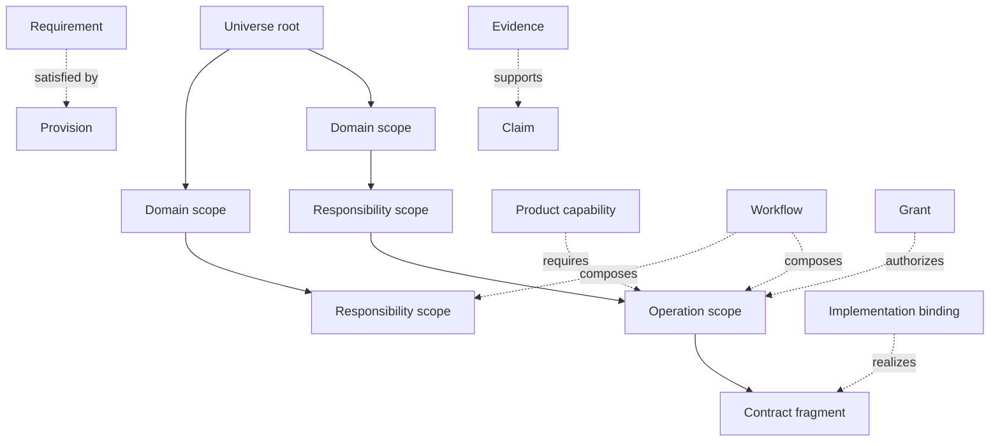
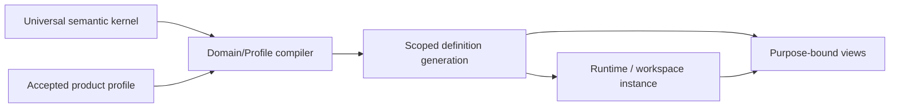
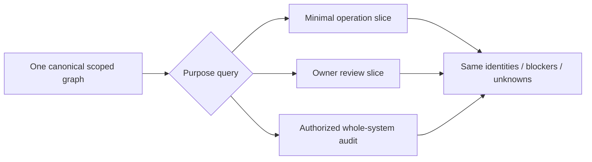

# 递归系统拓扑与 Domain 边界

本文拥有 SEC 的递归语义 scope、Domain 边界证明、跨 scope 可见性与边界粒度裁决。它不枚举源码目录、package、Provider 或当前文档标签作为 Domain；Operation、Authority、资源、结算与证明分别由同 domain 的其他片段拥有。

## 1. 一个模型，两种正交拓扑

SEC 的 canonical model 是带递归 scope 的 typed hypergraph，而不是平铺模块表，也不是只有父子关系的一棵目录树：



两种拓扑不可互换：

| 拓扑 | 唯一用途 | 合法结构 | 禁止用途 |
| --- | --- | --- | --- |
| cohesion/ownership containment | 表示共同 invariant、owner 与局部完成边界 | 每个非根 scope 恰有一个 parent，递归展开 | 表示依赖、多归属、调用、证明或物理目录 |
| typed relation graph | 表示 requires、composes、binds、grants、allocates、observes、proves、projects、evolves | DAG、超边、状态机；循环必须有显式 SCC/反馈语义 | 偷建第二 containment、共享 mutable graph 或运行时 service locator |

`path`、文件夹、package、process 和 deployment 都是后续 Address/realization；它们不能反向产生 semantic parent 或 Domain identity。

### 1.1 通用内核、产品 Profile 与运行实例

SEC 的通用性来自分离，而不是把所有行业名词塞进一个全局模型：



| partition | 包含 | 绝不包含 |
| --- | --- | --- |
| universal kernel | Subject、Definition、typed relation、constraint、operation、state、authority、capability、resource、observation、settlement、evidence、evolution 的闭合语法与不变量 | Git、Docker、TypeScript、浏览器、某业务实体、某目录、某团队 |
| accepted product profile | outcomes、non-goals、业务 Subjects/Definitions、不可推导取舍、Target/支持窗口/FutureObligations | 当前进程、路径、缓存、临时 Provider discovery |
| compiled definition generation | 递归 scopes、DomainBoundaryProof、public operations、requirements、claims、realization obligations | mutable runtime state、ambient environment |
| runtime/workspace instance | exact content view、grants、bindings、allocations、attempts、observations、settlements、active state | 新 Definition、暗含 Domain、永久修改通用 kernel |
| purpose-bound view | 某 consumer 被授权且完成其目的所需的最小闭包 | 第二事实源、扩大 Authority、遗漏 blocker/unknown |

项目、行业和未来需求只能增加 profile facts 或在明确 meta-model evolution 后增加一种通用 construct；不得向 universal kernel 加品牌分支。SEC 自身仓库只是该模型的 self-hosting profile，不享有特殊语义。

这里列出的Authority、Capability、Resource、Observation、Evidence等不是更多根 primitive。通用语法只有Design Calculus定义的`Subject | Statement | Relation | Constraint | Transition`；Proof、Frontier与前述名称都是这些primitive的closed semantic profiles，拥有不同laws、issuer和failure semantics，但不会各自生成一个全局service、Domain、folder或base class。只有新的需求无法由现有primitive及其组合无损表达时，才允许meta-model增加primitive。

## 2. 递归 scope 代数

```text
SemanticScope =
  | UniverseRoot {
      universeRef,
      acceptedConstitutionAndProductRefs,
      completionPredicateRef
    }
  | CohesionScope {
      scopeRef,
      parentScopeRef,
      scopeKind: domain | responsibility | operation | contract,
      ownedCarrierRefs,
      boundaryProofRef,
      completionPredicateRef
    }
```

`scopeKind` 是语义角色，不是任意分类标签：

| kind | 成立条件 | 不应升格的对象 |
| --- | --- | --- |
| `domain` | proper semantic subset；一个语义 owner；共同 Invariant/StateMachine/FailureAlgebra；稳定 public operations/results；可独立演进 | 技术栈、工具、Provider、目录、团队、流程阶段、文档主题 |
| `responsibility` | 对一组不可再分的决策或状态事实负责；有唯一 owner 与 public demand；无需独立 Domain 生命周期 | 每个类、每个字段、每个 consumer |
| `operation` | 一次有 pre/post、Requirement DAG、linearization、idempotency 与 typed result 的行为闭包 | command、函数、进程、脚本步骤 |
| `contract` | 有独立 consumer、revision/invalidation 或外部/durable 边界，值得单独寻址 | 无独立读者的 DTO、版本别名、facade、index |

本文及下游使用的`DomainScope`、`ResponsibilityScope`、`OperationScope`与`ContractScope`都只是`CohesionScope`在对应`scopeKind`下的限定称呼；它们不定义第二schema、第二identity或额外containment tree。

不存在“为了导航而建”的空 scope。只有同时满足下式才创建 child：

```text
SubscopeRequired(child, parent) =
  properSubset(child.carriers, parent.carriers)
  and cohesive(child.invariants, child.owner)
  and independentlyAddressable(child.publicContract or completion)
  and lifecycleBenefit(child) > crossReferenceCost(child)
```

否则它只是 parent 内的 typed aggregate、普通value或生成视图。行数、作者人数、目录美观和当前 package 都不是 `SubscopeRequired` 的输入。

同一现实referent若在多个bounded context中具有不同meaning、invariant或lifecycle，必须形成不同的context-scoped Subjects，并以`corresponds-to | translates-to | synchronized-by`等typed relation连接；不得让同一semantic carrier拥有多个containment parent，也不得强行共享一个万能DTO。translation本身需要owner、information-loss/failure语义和evolution合同。

外部业务域不复制进本Universe：

```text
ExternalScopeBinding = exact {
  externalAuthorityAndScopeRef,
  admittedPublicContractRefs,
  identityTranslationAndDisclosureRefs,
  observationCoverageAndUnknownRefs,
  supportAndEvolutionRefs
}
```

本系统只拥有binding与本侧operation，不拥有外部Definition/private state。外部scope不可观察部分保持frontier；Provider可用或API返回成功不使其成为本地Domain。

## 3. 不属于 containment 的系统角色

以下角色通过 typed relation 连接 scope；不得为了“层次清晰”伪装成 Domain：

| role | 回答 | 与 Domain 的关系 |
| --- | --- | --- |
| Constitution / Design Calculus | 什么关系和推导在所有工程中都合法 | universe 约束；不拥有业务状态 |
| ProductCapability | 用户需要什么可观察结果 | 可跨多个 Domain 引用 public operations |
| Decision / Policy | 哪个不可推导取舍被谁采用 | 约束候选与 transition；不充当 mutable state store |
| Workflow | public operations 的 sequence/choice/join/compensation | 可在单 Domain 或跨 Domain；不读 private state |
| Requirement / Provision | 需要什么、谁能供应什么 | 每个 operation 按需绑定；共享工具不合并 Domain |
| Authority / Resource / Evidence / Evolution facet | 对同一 Subject 或 Attempt 的正交控制关系 | relation family；只有其自身存在独立业务状态机时才可能形成一个 Domain |
| Responsibility realization | ResponsibilityScope 在某 Target 上的派生实现投影 | refinement；无独立semantic identity，不重写 Domain meaning |
| Projection / Interface / Documentation view | 为 consumer 呈现同一事实 | 无增权、无写回、无第二 owner |
| Operational Control | 当前选择、session、pointer、queue、run 状态 | 活跃状态 partition；不进入 stable Domain Definition |
| Proposal | 尚未采用的候选设计 | 生命周期角色；不能被路径或文档状态提升为 authority |

同一概念可以在不同关系中出现，但一个具体 record 必须有唯一 role。比如 process 是 Provision 产生的 Attempt 资源实例，不是“Process Domain”；Git 是 external Provision，不是 repository truth owner；Verification 对 Claim/Evidence 的状态机可以成为 Domain，而 `proves` 关系仍是通用 facet。

## 4. Domain 边界编译

Domain 不是设计者列清单得到的。编译器在 accepted Product/Definition 图上枚举满足硬约束的 partition，再做多目标裁决：

```text
DomainCandidateUniverse =
  accepted Subjects
  + Definitions / Invariants
  + StateMachines / FailureAlgebras
  + public Operations / Results
  + Authority and information boundaries
  + FutureObligations

DomainPartitionHardConstraints(P) =
  every admitted semantic fact has exactly one owner
  and no indivisible invariant crosses independently committable domains
  and every cross-domain edge uses a stable public operation/result/relation
  and no domain reads another domain's private state, journal or primitive
  and tenant/security/consistency/authority boundaries are preserved
  and every domain has a non-empty responsibility and completion predicate
```

一般hypergraph partition是NP-hard；compiler不得声称对任意大图做无界全枚举。可执行算法是：

```text
compileDomainBoundary(graph, budget):
  validate exact carrier/relation/owner coverage
  contract must-cohere hyperedges into atomic components
  add must-separate constraints for authority/security/tenant/evolution boundaries
  decompose independent connected components recursively
  derive admissible cut candidates only at public-demand/relation boundaries
  use hard-constraint propagation + dominance bounds to prune
  solve each bounded ambiguous cut by exact branch-and-bound/ILP/SAT or equivalent
  compose component Pareto frontiers and verify the whole partition
  if proof/search budget exhausts: return bounded unresolved frontier + lower/upper bounds
```

预处理和无歧义传播对graph size为线性/近线性；指数成本只允许落在无法由约束化简的bounded ambiguous cut上。每个selected partition附带hard-constraint certificate、dominance witness或明确的owner decision；heuristic/community score只能排序候选，不能签发边界。增量输入只使包含变化carriers及其constraint/relation reverse closure的components stale，其余proof复用。

候选满足硬约束后，才比较全生命周期成本：

```text
BoundaryCost(P) =
  crossBoundary(protocol + translation + consistency + failureMapping
                + latency + authorization + evolution)
  + withinBoundary(coordination + cognitiveLoad + contention
                   + releaseCoupling + blastRadius)
  + futureChangeCost(accepted FutureObligations)
```

选择规则：

1. 违反硬约束的 partition 直接拒绝；
2. 被另一候选在全部成本维度支配的 partition 删除；
3. 唯一未被支配且有 owner 接受其不可推导取舍时，签发 Domain decision；
4. 多个 Pareto 候选仍存时输出 typed frontier，不由目录、命名或实现便利暗选；
5. 新 Product obligation、public contract、state/evolution 或 measured cost 变化只使反向可达的 boundary proof stale。

```text
DomainBoundaryProof = exact owner-issued {
  domainRef,
  memberCarrierRefs,
  cohesionInvariantAndAtomicTransitionRefs,
  publicOperationResultRefs,
  independentStateFailureAuthorityEvolutionRefs,
  acceptedFutureObligationRefs,
  competingPartitionCostVectors,
  rejectedCandidateReasonRefs,
  reversalPredicateRefs,
  exactInputGenerationRefs,
  proofDigest
}
```

“现在只有一个 consumer”不能证明永远合并；“未来可能有用”也不能证明永远拆分。前者必须纳入 accepted FutureObligation，后者必须有 owner、trigger、acceptance、review/expiry 与 retirement。

## 5. 当前名称不构成 Domain 证据

当前文档 header/registry 的 `domain` 只是一代 documentation owner-group/addressing 标签。它不得被 Domain compiler消费为边界事实。迁移时按实际 carrier role重新分类：

| current label 所描述的内容 | target role | Domain 判定 |
| --- | --- | --- |
| 工程/Agent 宪法、Design Calculus | universal law / calculus | 永不因文档分组成为业务 Domain |
| Product | Universe 的 accepted outcome/decision root | 是 Domain 输入，不是 Domain 清单 |
| System / Implementation Architecture | typed architecture/refinement contract | 是编译与视图责任，不自动成为 Domain |
| Semantic model、Target IR、Delta/Impact、Brownfield/Source Program | definition/relation/compiler/observation responsibility | compiler或analysis责任本身不是Domain；只有所服务的semantic state/public operation满足边界证明才成为Domain组成 |
| Capability/External Provider、Runtime/Distribution | cross-domain requirement/provision/realization responsibility | 工具、host、distribution和resource facet不能按主题升格；只有独立operation/support state边界可进入相应Product Domain |
| Semantic Mutation、Change Management、Verification | 有状态operation/evolution/proof责任候选 | 只有独立invariant/state/failure/public result边界成立时才可能形成Domain，不因名称预判 |
| Documentation、CLI、Agent interface | source/projection/interaction responsibility | 无状态投影不是 Domain；有独立状态与操作时重新证明 |
| Development Governance、current control、Roadmap、Proposal、navigation | process policy/control/lifecycle/projection | 不得成为稳定业务 Domain Definition；其自身运行状态仍由对应control owner管理 |

因此任何手写的“canonical Domain atlas”都是非法第二状态源。唯一可用结果是：

```text
DomainMap = generated {
  exactUniverseAndDefinitionGenerationRefs,
  rootAndRecursiveDomainScopeRefs,
  boundaryProofRefs,
  publicCrossDomainRelationAndWorkflowRefs,
  unresolvedBoundaryFrontierRefs,
  mapDigest
}
```

`DomainMap` 不是全局运行时 registry。它是可验证编译结果；每个 consumer按 purpose读取最小闭包。

SEC当前target product generation的accepted partition input由[Product Domain partition](../product.md#产品-domain-partition)唯一拥有。该表是owner Decision/Definition source；本层负责验证boundary proofs并生成map，不能因现行authority groups、文档路径或实现模块另增Domain。

## 6. 最小与最大视图来自同一递归图

本层直接消费根合同定义的`ApplicableClosure`与`VisibleSlice`，只把query roots专用化为recursive scope refs、把relation filter专用化为该purpose准入的typed relations、把disclosure ceiling专用化为consumer/operation binding；不得在Domain层重定义selection算法。



折叠节点必须保留 identity、boundary、completion、blocker/unknown digest 与 expansion handle。展示预算只能改变表达细节，不能改变 selection、Claim、Authority 或 completeness。最小流程与全量反编译因此不维护两张图。

同一kernel按适用关系生成不同复杂度，不把最大系统成本强加给最小业务：

| system/purpose | 最小可见闭包 | 不适用时不会生成 |
| --- | --- | --- |
| pure deterministic library | definitions、exact function behavior、constraints、claims | grant、resource ledger、journal、migration、Provider runtime |
| local Effect operation | operation、authority、capability、resource、settlement/readback | distributed lease、cross-Domain saga |
| distributed/domain workflow | public operations、consistency boundaries、allocation、recovery/evolution | child private state、unrelated Domains |
| embedded/offline target | target/profile、local Provisions、resource/failure limits | network/hosted Provider branches |
| stochastic/adaptive system | population/environment/model/policy revisions、statistical/robustness claims、feedback guardrails | exact-function-only proof assumptions |
| arbitrary brownfield repository | exact content/source observation、coverage/unknown、target-current reconciliation | adoption、mutation或retirement authority，除非另行签发 |

因此“通用”不是每次展示所有facet，而是任意规模都使用同一identity和relation laws，并由applicability compiler删除不相关闭包。

## 7. 物理组织由语义拓扑编译

文档、源码和 package 的物理层次都从 `SemanticScope + realization profile` 派生；它们不是同一棵树，也不要求一对一：

| realization | 默认优化目标 | 必须保持 |
| --- | --- | --- |
| 文档 fragment | purpose-bound context cost、owner review locality、链接稳定性 | semantic refs、唯一 owner、递归 scope |
| source ImplementationUnit | change locality、编译/测试影响、dependency direction | public contract、private state、Effect boundary |
| package |独立发布/依赖/版本/平台边界的真实收益 | 不因目录方便复制 contract 或 owner |
| runtime process/service | fault isolation、resource/authority settlement | logical operation 与 Domain result不被 transport重定义 |

`Domain ≠ folder ≠ package ≠ process ≠ document`。允许同一 Domain 编译出多个 ResponsibilityRealizations，也允许一个物理进程承载多个 Domain adapter；前提是 semantic owner、state与failure隔离仍可证明。

## 8. 完成条件

```text
ScopedSystemTopologyClosed =
  every carrier belongs to exactly one recursive cohesion scope
  and every Domain has a current DomainBoundaryProof
  and every non-containment dependency is an exact typed relation
  and every cross-domain edge terminates at a public contract
  and every scope has a completion predicate and bounded unknown frontier
  and every minimal/maximal view derives from the same DomainMap generation
  and no document label, path, package, facade, Provider or projection creates meaning
  and every physical placement traces to an admitted realization decision
```

任一条件失败时只阻断受影响 slice；不得以增建 Domain、复制 facade、补路径清单或全局读图掩盖边界缺失。
