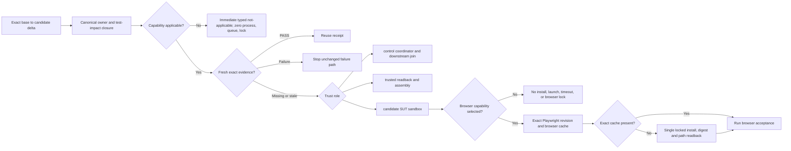

# Verification、Evidence 与 CI 治理

本文拥有不同验证层证明什么、Requirement/Gate/Result/Claim/Aggregate/Evidence的稳定身份边界、Implementation conformance、Impact选择、失败复用、trusted bootstrap和merge authority。具体测试文件、suite、command、timeout、并发、selector、当前schema revision和physical Gate结果由机器合同、runner、workflow和最新 `main` 拥有。

Verification可以为Implementation Resolution、Binding Delta、Compatibility和Migration提供Evidence，但不拥有Resolver、Delta comparator或Compatibility evaluator。

## 当前合同与后继平台

必须区分两层：

### Verification Truth Kernel

统一合同族使用：

```text
passed | failed | not-run | unsupported | invalidated
```

并独立表达：

- executed / reused / not-executed；
- applicable / not-applicable / unsupported / unresolved；
- Gate identity、Claim definition、owning environment和proof identity；
- order-independent aggregate；
- exact input/revision/environment/artifact/command/cleanup binding；
- duplicate、missing、unknown、stale和self-proof fail closed。

该语义是当前canonical contract方向。某个writer、adapter、artifact或CI consumer是否已经完整迁移，仍必须从最新代码和Evidence验证；稳定文档不把局部实现扩大成全系统完成。

### 后继 Verification Platform

以下能力只有对应contract、producer、consumer、migration、tests和Work Package进入 `main` 后才是现实能力：

- 完整Execution Ledger；
- Evidence DAG/CAS；
- Development Run Journal；
- 统一Hermetic Runtime和resource allocator；
- 自动persistent reuse/resume/flake governance；
- 跨Host/Target/Implementation/Release的完整Observation catalog；
- 机器化Review finding/merge decision平台。

目标设计被接受不等于实现完成。CLI、PR summary、文档或Skill不得把未来状态名投影成当前PASS。
T2 trusted-cutover epoch只有在 integrated candidate 与 new `main` 完成 exact commit/tree/
merged-tree readback，并由 ordinary candidate canary 证明新路径后，才把 Action、Session、
Review和merge authorization从目标变为active capability。轮换中的Work Package identity只由
Document Control Plane拥有；候选分支中的manifest、类型、测试或workflow不构成激活证明。

## 验证对象与层级

- **Requirement / Claim**：要证明的exact性质、owner、subject、inputs和applicability；
- **Gate Definition**：如何在声明环境和capability下观察或执行该Requirement；
- **Observation / Execution**：一次physical执行、合法reuse或明确not-executed事实；
- **Result**：该Observation的五态结果、reason、cleanup和artifacts；
- **Aggregate**：按Claim、owning environment和proof identity组合多个Results；
- **Decision**：Mutation、Implementation Resolution、Compatibility、merge、release、support等上层consumer对Aggregate和其他事实作出的决定；
- **Evidence**：支撑Result/Claim/Decision的exact记录。

一个绿色命令不是完整Verification对象；一个Aggregate PASS也不能自动证明Implementation eligibility、Binding Delta、Compatibility、packaged/deployed或product-supported。

## 测试层

- **Unit**：pure builder、selector、resolver、comparator、index、normalizer、formatter和安全边界；
- **Contract**：公共schema、CLI、package、CI、error、IR、Requirement/Candidate/Decision/Binding/Delta和inter-owner shape；
- **Integration**：Workspace pipeline、Implementation Resolution、Binding Delta/Impact、artifact flow、transaction和跨owner集成；
- **E2E / slow**：真实Git、filesystem durability、server、browser、native host、package、Provider和发布路径；
- **Property / Model**：输入空间、幂等、round-trip、状态机、fixed-point、排序、tie-break、Delta direction和反特化；
- **Fault / Recovery**：crash/persistence boundary、TOCTOU、cache invalidation、rollback/recovery和资源收口；
- **Mutation / Test-quality**：校准关键validator、authorization、eligibility、Delta/Impact fail-closed和selector是否真正被断言覆盖。

测试层由要证明的性质、真实副作用、状态冲突、资源和环境决定，不由目录名、一次duration或“看起来像集成”决定。

真实browser/server/native/durable acceptance即使偶尔很快仍属于physical layer；反之，位于acceptance目录但不请求browser capability的contract test不应被迫启动无关browser。Gate definition和fixture实际需求共同决定capability。

## 不可违反的不变量

- 未运行、缺失、skipped、超时、取消、平台不匹配、scope mismatch、stale、损坏或candidate self-proof都不是PASS。
- `not-applicable`必须有可信applicability proof；它不等于required但没有执行。
- zero-test/empty selection只有在Target/Gate contract证明不适用时才能not-run；否则invalidated/unresolved，不能passed。
- executed/reused result只有在Claim owning environment满足时才能支持该Claim。
- Aggregate状态与Claim输入顺序无关；duplicate/missing/unknown identity fail closed。
- 一项Check只证明它绑定的exact candidate、Binding、Delta/Compatibility subject、profile、environment和input closure。
- 测试主体通过但cleanup/readback/receipt失败，整个Gate仍未通过。
- changed path、owner、required Gate、ImplementationBinding、Delta或Evidence unresolved时fail closed。
- 失败不能通过删除测试、弱化assertion、无边界增加timeout、重复运行直到绿、自动换Provider或把unsupported当skipped消除。
- Provider manifest、类型声明、文档、下载量、单次示例和AI生成测试都不是conformance PASS。
- verifier、selector、Resolver、Delta comparator、Compatibility evaluator、Evidence validator或merge authority的candidate不能只用自身新实现授权自身。
- CI workflow是executor/adapter，不拥有第二套Gate定义、result truth、Eligibility、Delta、Compatibility或test inventory。
- Local cache、聊天、PR body、branch、commit ancestry和人工checkbox不是merge或Implementation Evidence。

## Result 与 Claim 真值

### 五态

- **passed**：required execution或合法reuse对exact input closure证明成立；
- **failed**：已执行但断言、运行、cleanup或Evidence完整性不满足；
- **not-run**：可信applicability/Impact证明无需执行，或尚未执行但如实保留；
- **unsupported**：执行环境/Provider缺少声明能力；是否阻断由上层Requirement/Implementation/Compatibility/Support contract决定；
- **invalidated**：过去结果或当前selection因输入、环境、规则、coverage、identity、Binding、Delta subject或信任变化而失效。

状态和execution disposition正交。`not-run`可以是not-executed，`passed`可以来自合法reuse；但reuse必须保留原execution/environment/input Evidence并满足当前invalidation rules。

### Claim definition

Claim至少绑定：

- claim identity/revision和owner；
- subject/requirement/input digest；
- required/optional Gates；
- owning environment集合或matcher；
- applicability与not-applicable proof；
- invalidation rules；
- supported/required contribution semantics。

Gate的passed状态不能越过Claim environment、identity或applicability。Non-owning observation可以保留为Evidence，但不能poison或支持owning Claim。

### Aggregate

Aggregate固定使用声明的status lattice和deterministic reason selection。Order、Map insertion、duplicate overwrite和first-non-pass都不能改变结果。

Empty Claims、empty required Gates、zero physical observations、cleared supportedClaims、mixed proof identity或unknown contribution默认不能passed。

Aggregate只计算Verification truth，不拥有Mutation terminal、Implementation Resolution、Binding Delta、Compatibility、merge、release或Support decision。

## Gate identity 与 Execution Ledger

Gate definition和一次运行实例分离：

- **Gate contract**：identity、revision、owner、applicability、inputs、capabilities、dependencies、command/runner、timeout policy、Evidence output和invalidation rules；
- **Execution record**：exact candidate/input/Binding/Delta-subject revisions、runtime/OS/arch/filesystem、toolchain/provider/dependency authority、环境、开始/结束/cleanup、result、artifacts和receipt。

一次执行的唯一 ActionKey 只包含会改变证明语义的 producer、normalized operation、
input closure、environment/tool/provider/contract revision、result schema和dependency topology；
branch名、PR编号、聊天、显示标题、session ID、wall-clock、pid、临时路径和scheduler lane
不能成为语义key。

`input closure` 必须是该 Action 实际读取的 subject closure，不得无条件加入整个 candidate
tree、manifest raw bytes或所有依赖拓扑。只有 Gate contract 真实观察全树时，whole-tree digest
才属于该 ActionKey。等价 commit 重新 materialize 而 `CandidateContentId` 与 subject closure 未变时，
ActionKey 保持不变；exact-head Review、Session revision 与 Promotion 仍重绑新的 Git head。

所有正式 producer 必须从同一个 canonical builder 生成 ActionKey。Selector 只拥有“哪些
scope required”；producer 把 scope 规范化为 Action；runner 只消费经过验证的 ActionPlan。
CI gate ID、raw argv、scopeId、evidenceIdentity、journal path或workflow run ID不能与
ActionKey并列成为第二套执行真值。

同一 ActionKey 的正式 hosted 请求必须进入由 trusted resolver 重算 key 的全局 producer
临界区：只有该 hosted owner 可以物理执行，其他 Agent、CLI 和 workflow 请求只能 dispatch、
join 或复用同一个 immutable terminal origin。client payload、完整 ActionPlan digest、本机
workspace lease 与进程内 map 都不能成为全局 owner；本地 dev-runner 只能产生显式不同
execution-environment revision 的反馈 Action，不能满足 formal hosted Evidence。全局 producer
在临界区内先完整查找并验证既有 terminal origin，零条时才执行；冲突、重复或未知 provenance
一律 fail closed。claim/journal/lease 只是可恢复 machine state，不是 Evidence；丢失它们
最多失去 resume 能力，不能制造或改写 Verification Result。Hosted owner在执行前必须先发布并
readback immutable ActionKey start marker；marker存在而terminal origin缺失表示physical outcome
unknown，必须BLOCKED并通过新的显式producer/environment epoch形成新ActionKey，不能对同key
自动重跑。start marker同样只是machine state，不能被解释为PASS或terminal Evidence。

正式解析对每个 required ActionKey 只能得到一个结果：fresh PASS `reuse`、fresh FAIL
`reuse-failure`、authenticated in-flight `join`、missing/stale `execute`、start-without-terminal
`blocked-unknown-outcome`。`not-applicable` 在 Requirement 层由 proof 决定，不制造 Action；Impact
`unresolved` 必须扩大 closure 或 BLOCK。全局 hard invariant 是
`physicalStartsPerActionKey <= 1`；fresh terminal、in-flight 或 unknown outcome 的物理执行次数都
必须为零，不能用 retry、new session 或不同临时路径绕过。

Hosted provider machine state只有一个pure contract和一个窄GitHub transport owner。trusted
resolver从base重算ActionKey；job concurrency只能由该输出投影，并必须保留pending请求而不
cancel/replace。provider对exact candidate SHA的status history做完整分页，`pending`只表示
start tombstone，一个neutral terminal status只锚定已认证terminal artifact；status不能复制
五态Result，也不能成为required Check、Evidence或merge authority。每次POST至多一次，网络、
分页、creator、context、run/App或artifact origin存在任何歧义都只能BLOCK。start已存在而
terminal artifact缺失时永久禁止同key再次physical spawn；exact terminal artifact已存在而
terminal status缺失时只允许repair status，executor调用次数仍为零。artifact过期或删除后，
status仍阻止重放，但不能凭digest恢复或复用原Result；需要跨retention复用时必须另行冻结带
conditional insert和长期bytes的provider，不能把status提升为永久Evidence。

Provider availability不是effect authority，也不是Session准备阶段可缓存到结束的布尔值。Review
request、hosted verification dispatch、GitHub publication、merge和closeout的authority只来自各自的
operation-specific authorization、idempotency、recovery和exact readback contract。effect owner紧邻
physical provider effect只重新读取canonical availability epoch，且仅当当前epoch明确标记对应
capability为unavailable时作为negative circuit breaker阻止重复尝试；availability ledger不得产生
positive claim、role或effect permit。expired、unknown、unverifiable和degraded既不能支持正向
authority，也不自行否定已经由该operation contract授权的一次调用；其provider attempt/readback成为
新的availability evidence。较早的prepare、selector或Review观察不能授权较晚effect；已存在的
authenticated in-flight exact ActionKey只能join或readback，不能再次physical spawn。这样provider
状态既不会被Session复制成第二真值，也不会在检查与实际副作用之间形成TOCTOU窗口。

一次external Session协调多个Action时，协调者必须先在受信workflow内发布并精确读回一个
canonical parent dispatch-plan artifact；它绑定repository、external parent run/attempt、trusted
workflow ref/SHA、当前maintain/admin human principal以及按ActionKey排序且无重复的proposal集合。
每个internal Action event只携带proposal和该parent artifact的provider locator/provenance，属于
at-least-once wake-up而不是authority。child run必须先验证当前GitHub Actions App/Bot身份，再从
provider独立读取parent run、job/step、artifact metadata、archive bytes与payload，确认external
Session事件、trusted base、human权限、plan digest和唯一member全部一致；payload自陈的parent
字段、同一App的其他workflow或`repository_dispatch`发送者身份都不能单独授权执行。合法event
重放只能join同一ActionKey，不能产生第二producer或扩大parent plan。

trusted resolution、credential-free candidate execution和fresh trusted terminal assembly必须是
三个隔离hosted job。candidate只接收normalized physical target与精确input，环境中不含GitHub、
Actions、OIDC、status、artifact-finalization或merge capability；它只能产生untrusted raw output。
fresh assembler从trusted base验证subject/plan/argv/environment/process settlement与raw transport，
然后生成唯一canonical terminal artifact/Result。candidate-owned脚本或同一runner残留不能发布
terminal Evidence。

其中candidate physical operation必须位于独立OS sandbox：private root与writable tmpfs、只读且
已认证的input/tool closure、不同uid/gid、独立mount/PID/network namespace与新`/proc`、空
capability set、`no-new-privileges`、受限CPU/memory/process/file资源，以及关闭除受控
stdout/stderr外的继承descriptor。host workspace、runner temp、GitHub command file、provider
socket、credential和parent process state不得在sandbox root中可见；仅把input复制进private
workspace后执行一个normalized operation。trusted facade必须在start marker前验证sandbox
capability，并在实际SUT host再次验证；terminate后强制杀死并readback全部descendant与residue，
随后才可在sandbox外生成raw Result和cleanup receipt。任一隔离能力不可证、超时、资源越界或
cleanup不完整时，不执行或不重放同一ActionKey，并只产生`unsupported | invalidated | cleanup-failed`
等非PASS事实；环境denylist、同用户子进程、只读host root或普通temp目录都不能替代这条边界。
未经验证的archive不得先在host workspace展开；trusted facade先验证raw bytes、entry type/path、
link target、重复与大小边界，再在private root内展开。候选不能用自己的package/registry配置在
provider job中物化依赖；当Work Package禁止package/toolchain变化时，只能从exact trusted-base
package/lock物化并绑定dependency closure，package变化则需要单独授权的install sandbox与新的
environment epoch。candidate stdout/stderr也只是untrusted bytes，必须bounded capture并转义或
编码，不能直接进入GitHub workflow command channel、`GITHUB_OUTPUT`、env/path或artifact控制面。

CI Evidence 必须记录 canonical Action closure、五态 Result、execution disposition、exact
environment/input、cleanup与artifact reference。合法 reuse 保留原始 proof identity；已知
failure可以复用为失败事实，但 `not-run`、`unsupported`、`invalidated`、stale、cleanup失败
或旧schema记录不能被包装或重解释为PASS。迁移期间的 legacy scope/evidence identity
必须明确只读且有consumer-zero删除门槛，不能长期双写两个结果源。

## VerificationSession、Scope 与 MainHealth

VerificationSession 是一次 frozen candidate 从定向到合并/readback 的唯一运行状态机，
不是第二个Task Capsule、Result、Review或Integration owner，也不是 general Run Kernel。稳定
`sessionRevision` 与 `sessionId`、candidate generation、event ID和时间戳分离，至少绑定：

- exact repository/default base commit与tree、`CandidateContentId` 与
  `CandidateGenerationRef`；
- `taskCapsuleRef/digest/revision`、manifest semantic/raw digest、ScopeGrant 与 exact
  CandidateScopeAttestation；
- canonical Action plan/key closure、profile、environment和trust revision；
- Review policy、MainHealth revision以及所消费Evidence/authorization references。

Manifest是scope proposal，不是自授权。`ScopeGrantId` 固定 trust epoch、manifest semantic
revision、exact authorized/forbidden write set、capability/resource bounds 与 base authority；trusted
resolver 为每个 exact base/head/tree 产生 `CandidateScopeAttestation`，证明 candidate diff/effects
仍是 grant 子集。manifest semantics、write set、authority 或 capability变化必须产生新 grant；
仅 transport/head 变化时产生新 generation、attestation 与 sessionRevision，不能扩大 scope。
PR body、pointer或候选自己修改的manifest不能给自己扩权。

`CandidateContentId` 绑定 base semantic/tree dependency、candidate tree、ScopeGrantId 与 manifest
semantic revision；`CandidateGenerationRef` 绑定 run/session、单调 generation、content ID 与 exact
head commit。相同 content 被不同 commit metadata 重新 materialize 时 content ID 不变。旧 exact-head
Review、CandidateScopeAttestation、Session revision与Promotion stale；Action/Evidence仅在其 subject
closure、contract、environment或trust input变化时失效，不能因 transport churn global invalidate。

identity contract至少等价于：

```text
CandidateContentId = H(
  identitySchemaRevision,
  baseDependencyClosureDigest,
  candidateTree,
  ScopeGrantId,
  manifestSemanticRevision
)

CandidateGenerationRef = {
  runId, sessionId, generation,
  contentId, baseCommit, exactHeadCommit, candidateTree,
  candidateScopeAttestationDigest
}

ReviewSubjectId = H(
  baseCommit, exactHeadCommit, candidateTree,
  candidateScopeAttestationDigest,
  reviewPolicyRevision, reviewFactsSnapshotDigest
)

PromotionId = H(
  CandidateGenerationRef, evidenceAggregateDigest,
  ReviewReceiptDigest, trustRevision, expectedLiveMain
)
```

`baseDependencyClosureDigest` 由trusted-base dependency/Impact owner计算，不能由candidate缩小；
`manifestSemanticRevision` 由canonical Work Package parser产生，不能用raw formatting或路径别名替代。
consumer边界固定为：Impact/Action builder消费content与subject closure，Session/PR transport消费
generation ref，Review只消费ReviewSubject，merge gate只消费Promotion。任一consumer不得用上游较弱
identity替代自己要求的exact identity。

Work selection先由trusted ScopeGrant、Task Capsule 与 Session外部记录授权；candidate tracked
pointer不是运行期授权源。Document Control Plane只纯编译manifest、prospective pointer与rolling-plan
bytes。candidate稳定后，显式Candidate Materializer在isolated temporary Git index中把这些bytes与
implementation blobs应用到trusted base，`write-tree`、`commit-tree -p <base>`、验证exact
one-parent/content binding，再以expected-old ref CAS发布并readback。任何 object/tree/commit/ref
阶段失败都从immutable inputs恢复或保持旧ref，不创建successor worktree。

Candidate 中的 pointer/rolling/manifest 是 `ProspectiveControlProjection`；只有 live default/main
commit 中的byte-exact control facts才能成为 `ActiveMainControlState`。worktree projection只是可丢弃
视图，projection失败只能产生 `CANDIDATE_PROJECTION_FAILED`，不能让 live main进入
`activation-in-progress`。pure check/freeze不得写source、index、mtime或Git object database；只有
显式 materialize/transform operation可写。Session只消费已经进入immutable commit/PR head/tree并
通过ref readback的generation。

`prepare`在hosted dispatch前从同一selector生成local quick-only feedback closure，并用独立
`local-dev-runner` environment revision交给canonical Action runner。local Action只在exact clean
PR-head worktree执行，journal可join/reuse但不是Evidence；complete local PASS才允许进入Review/
hosted transition，running为WAITING，失败或ambiguous expired claim为BLOCKED。local OS/toolchain/
ActionKey和aggregate digest不得进入formal hosted Session revision或伪装成hosted PASS。

MainHealth是对exact default commit/tree的live ledger，状态仅为
`healthy | degraded | locked`，并绑定failure fingerprints、owner、content-addressed repair Work Package、
expiry、allowed lane和trust revision。无法完整读取、过期或revision不匹配一律视为`locked`；普通
candidate不得吸收unrelated baseline/verifier/selector defect。一个fresh ledger先由MainHealth owner
互斥投影为`ordinary-only | repair-only | locked`：只有`ordinary-only`调用WorkDecision与Issue catalog；
`repair-only`只调用pure `MainHealthRepairDecision`并把exact repository/default/main/tree/trust、ledger、
owner、failure fingerprints与manifest identity交给document-control；`locked`不调用任何选择器。
repair路径因此不依赖全Issue census，也不能与ordinary选择同时运行。

raw `repository_dispatch` event不是MainHealth action credential；normalized check必须包含workflow run ID/display
title，policy必须验证exact-main request operation ID与唯一event-specific title。main push不直接排队Linux job：
控制面必须先完成provider active三角色census，再为readback后的exact main发布一次canonical dispatch，避免runner在
active publication前被push job抢占。其他dispatch的同名skipped job是nonmatching noise，不得把activation producer
自身变成MainHealth blocker。唯一MainHealth compiler只在恰好一个matching terminal check时收敛：成功是healthy，
受支持的终态失败是degraded；duplicate、nonterminal、unknown status/conclusion或其他event都是locked。语义failure fingerprint排除
check id/event等transport identity以保持等价观察稳定。adapter必须先闭合bounded pagination与shape；MainHealth
source digest绑定policy与canonical matching subset，nonmatching provider noise不参与health decision也不引起
provenance churn。完整raw response若需审计，必须由独立provider observation receipt owner签发，不能在
MainHealth compiler里复制transport authority。

MainHealth的GitHub check/App投影与Linux物理计算不是同一authority。required workflow可在固定
`self-hosted + Linux + X64 + sec-linux-verification-v1` capability profile上执行；runner必须由canonical lifecycle owner
按exact release/base-image/Node archive/Python archive-inspection runtime/final image digest建立，operation结束即注销和删除。一个atomic
provider lease下固定运行`control/trusted/sut`三个隔离角色：任何dispatch并join下游producer的
Session或integration coordinator必须在control，不能占用被等待的唯一trusted executor；trusted
readback不能复用candidate SUT容器。SUT外层构造域只有`CHOWN/SETGID/SETPCAP/SETUID/SYS_ADMIN/SYS_CHROOT`，
用于direct unshare、private tmpfs chroot、降权和清空bounding set；候选域仍为UID/GID 65532、zero-capability、
NoNewPrivs、无网络且看不到runner根或继承FD。control/trusted保持capability空集。GitHub继续拥有event、repository、App与
check transport identity，但hosted runner quota不拥有Linux结果语义。物理executor变化必须进入
environment/provider revision；相同semantic Action在相同toolchain、sandbox与platform profile下可复用，
不得因branch、PR、amend或squash identity机械重跑。当前local runner仍通过GitHub Actions投影formal result；
在`trusted-local-readback` producer正式上线前，普通local process或self-digest文件不能签发MainHealth。local、remote
或未来Darwin provider只替换同一operation的受治理execution binding，不修改workflow/job/check语义。

持久self-hosted runner绝不消费由caller选择workflow/ref的`workflow_dispatch`或`workflow_call`仓库字节。
只执行当前trusted default内容的诊断与release-main workflow必须由default-branch
`repository_dispatch`加载workflow，在checkout前用GitHub API把`context.ref/context.sha`重新绑定到实时
default branch，并禁用checkout credential persistence。任何非default release/candidate都只能作为
authenticated archive进入`execute-verification-action-sut`的private tmpfs chroot，或使用一次性disposable
runner；禁止先checkout候选再在持久runner root执行`bun install`、测试或仓库script。archive inventory由
镜像内显式冻结的Python 3.12.3标准库`tarfile`在解压前验证checksum、entry type、path/link、mode、payload
bound和trusted content digest；构建配方必须先离线导入`hashlib/json/tarfile`，镜像label、最终image ID与
provider revision共同拒绝版本、模块或配方漂移，不再存在隐式可执行依赖。

`sec-linux-verification-v1`只表达已验证的Linux能力，不表达机器位置。local与remote self-hosted provider
通过同一umbrella label、角色label和conformance接线；canonical lifecycle在注册token前以remote CAS lease
要求该profile全仓唯一。lease所在checkout的`origin` fetch URL与全部effective push URL必须都解析为与runner
API目标相同的`owner/name`；start、status、stop和recovery都对完整repository runner/container inventory做集合
相等验证。GitHub label按其真实case-insensitive语义规范化，umbrella、任一role、operation、保留name或ID任一命中
即进入eligible全集；不同大小写、意外第四实例、local state缺失或lease缺失都不能从census中消失。provider base name
预留最长role suffix，确保lease发布前最终instance name已满足100字符上限。任何额外eligible对象均分类为external
maintainer mutation，保留lease且拒绝继续。因而Provider切换不会改写五份Workflow。Node/runner进入content-addressed image，
同一final image ID不重复下载；cache miss才执行exact archive下载和digest校验，结果身份漂移即形成新provider
revision。Playwright/Chromium是该profile可提供的条件子能力：现有test-impact owner把
`project-base`、runtime dependency、runtime host等因果source映射到browser slow closure；selector在启动
测试进程前一次性编译closure，未命中browser的变化立即标记not-applicable，不创建浏览器进程、不等待浏览器
timeout，也不抢安装锁；命中时才按锁定Playwright revision读取或填充provider-independent browser cache。
operation closeout只注销并删除三个exact runner/container与remote lease，默认保留已验证final image和
content-addressed cache。显式image retirement必须先证明零owned container和exact image ID，只删除已superseded的
SEC revision；全局Docker prune、prefix/glob删除和其他工程对象永远不属于该lifecycle authority。

### Capability Delta选择图

角色不是“只有三类可执行文件”：`control/trusted/sut`是进程与证据的信任域，Bun、Node、Git、Docker、
Playwright/Chromium及测试二进制仍由各自tool/dependency closure精确绑定。一次candidate只编译一次
base→candidate delta，后续执行只取`RequiredClosure ∩ MissingOrStale`；已fresh PASS直接复用，fresh failure
直接停止同一无效路径，not-applicable在启动Provider或等待锁之前立即形成typed skip。

SEC 的平台目标是一套平台无关的 Truth Kernel、Action/Result/Evidence identity 与控制状态机，加上按真实
物理语义划分的 replaceable execution adapter；它不是把所有东西都塞进 Linux，也不是让每个平台重复跑
同一 closure。当前能力矩阵是：

| capability | owning environment | exact proof | selection rule |
| --- | --- | --- | --- |
| semantic/control | 当前 Windows 主控制工作区，未来可迁移 | schema、selector、DAG、ledger、authority、pure contract | 同一 ActionKey 只执行、join 或 reuse 一次 |
| windows-native | Windows x64 | NTFS/reparse、PowerShell、Windows process/native host | Linux/WSL不能替代 |
| linux-native-runtime | Docker Linux x86_64 | Ubuntu toolchain、namespace、cgroup、Linux filesystem/process | WSL2只作Docker substrate，不另算一份Evidence |
| web-runtime | impact选中的真实Chromium/Playwright provider | navigation/render/runtime acceptance | 非browser closure在selector内立即not-applicable，不安装browser |
| darwin-native | 当前无provider | Darwin专属filesystem/process/runtime | 未命中Darwin owner时not-applicable；命中时typed unavailable，禁止Linux冒充PASS |

因此“全平台”表示公共contract、identity、错误和provider conformance可移植；某次delta只消费其Requirement
声明的owning environment。WSL2、Docker VM与container属于同一Linux provider实现层，不是三个验证环境。
local与remote executor共享`sec-linux-verification-v1`、environment revision、cache与conformance，切换只
替换受控provider binding，不修改Workflow、job或Claim identity，也不允许双writer。



该图是local/remote provider共同消费的唯一选择语义。位置切换只改变provider lifecycle binding；delta、owner、
role label、cache identity和skip receipt不变，因此不需要反复改Workflow或为remote另建一套测试定义。
Linux capability只在provider/sandbox revision或对应owner发生变化、缓存Evidence缺失/过期时重证；普通业务delta
不会重新校准Linux substrate。Playwright也只有browser closure命中且exact revision cache缺失时才下载，缓存命中
直接复用；不存在“每次运行先等待安装再决定skip”的路径。

`sandbox-v5`保留并延续v4已冻结的CPU聚合边界：outer SUT cgroup固定2 CPU，unit wall bound固定3600秒且
`--kill-child=KILL`关闭全部descendant，所以整棵进程树最多消费7200 CPU秒；同值`RLIMIT_CPU`只是冗余的
per-process ceiling，不能被描述为聚合controller。trusted-bootstrap candidate job也必须由exact base checkout中的
固定CLI创建authenticated archive，并调用同一namespace/chroot command plan；candidate checkout只作数据，不能在
runner root执行install、script或test。base lock/package驱动的`--ignore-scripts`依赖物化可复用runner私有content cache，
cache不会挂入candidate chroot，候选也不能写入或读取它。冷下载只允许一个确定性的收敛例外：第一次安装必须先
精确分类为Bun tarball extraction失败，才可在同一exact base、lock、runtime、环境和私有cache上原地重试一次，
让已经落盘的合法package cache完成收敛；lockfile、权限、磁盘、进程或其他错误一律零重试，第二次 extraction失败
也立即terminal。`attempts=1|2`与恢复分类必须进入trusted-bootstrap SUT物理operation digest，不能靠日志或人工解释
把失败改写成PASS，也禁止为该恢复清空整个content cache并重复下载全部依赖。

Bun可把exact-base依赖中的嵌套`file:`包实现为指向同一`node_modules`内部的绝对symlink；该host路径不能进入
可迁移archive，也不能通过放宽absolute-link规则进入sandbox。dependency source始终是只读subject，禁止为了transport
改写symlink、创建同目录temporary name或用path rename替换安装结果。trusted bootstrap在打包前以retained no-follow
root/parent/leaf读取完整依赖树，流式冻结每个ordinary file的physical identity、size与canonical content digest；每个
link的raw target必须由retained link fd上的`readlinkat(fd, "")`读取，不能从parent/name二次解析。archive writer只从这些
retained directory/link fd读取，并且只在tar header中把lexically仍严格
位于同一exact `node_modules`根内的absolute link投影为relative link。打包后必须对同一physical root重新做完整快照，
并把archive中的每个dependency path、kind、link target和logical content digest逐项与打包前快照比较；root、ancestor、
link或target替换、ABA恢复、断链、外逃、非POSIX、special entry、foreign/missing entry或entry/byte上限均fail closed。
physical snapshot与archive projection digest共同进入SUT operation identity；archive仍由独立raw inventory验证全archive路径、
cycle、required inputs和字节边界。package名称、随机安装路径、source mutation或单独两个无逐项对应关系的摘要都不得成为
例外或transport authority。raw inventory完成后，launcher必须以`O_NOFOLLOW` ordinary-file fd重新读回exact archive digest，
只把该retained fd继承为固定child fd；namespace不能再次解析host archive pathname。namespace从retained fd把字节复制到
private tmpfs，复制后和chroot extract前分别重验operation绑定的archive digest，随后关闭全部host fd。pathname替换、rename
away/restore、同名ABA或in-place写入至多使private copy digest不匹配而terminal，不能让未经验证的dependency bytes进入SUT；
execution receipt的pre/post input readback也必须来自同一retained fd，而不是恢复后的pathname。

### 重复缺陷封闭规则

Review finding只有在同一根因的完整机器闭包落地后才算关闭：canonical owner中的不变量、production拒绝路径、
focused正向与负向contract、test-impact归属、provider/runtime精确身份和TCB因果闭包必须同时更新。当前持久runner
尤其强制以下五项：caller-selected ref在checkout前被event与live-default binding拒绝；镜像所用每个可执行能力都由
构建探针、label、final image ID、capability ledger与provider revision共同声明；selector必须在进程、队列、下载和锁
之前产生not-applicable；下载只在content cache miss时以有限重试执行；TCB仅在普通source/import/dispatcher全部稳定后
apply一次，此后只运行zero-write check。provider repository与runner eligible-set必须是exact identity和exact set，
不能只验证expected subset。任一层缺失都不能以单个happy-path测试或Review回复宣称完成。
`imports:apply`只拥有确定性的import/declaration ordering，不拥有全文件格式化或语义改写；authoring阶段只有
`imports:check`报告真实delta时才执行一次apply。任何source-lock或故障注入测试必须锚定函数/AST identity或唯一语义
token，禁止依赖两个import相邻、空行、缩进或formatter输出；canonical import合法重排后仍失败的测试属于测试合同缺陷，
不得通过关闭organizer、反复格式化或手工改回排版解决。

所有post-main consumer同样不得复制MainHealth判断。IssueDisposition readback把完整normalized check inventory、
exact new-main commit/tree/trust和fresh observation时间交给canonical compiler/lane resolver，只接受
healthy ordinary-only ledger并引用其ledger digest；`length === 1`、只验appSlug或局部name/status filter都是
competing authority，必须由test/source-lock阻止。

`allowedLanes`和repair decision只表达exact ledger的语义路由限制，不是physical executor、Scope、
Evidence、Review、IntegrationAuthorization或merge authority。document-control所称无active package必须由
current pointer manifest candidate bytes与fresh exact-default bytes raw-byte相等、digest一致来证明已经published；
此时repair rolling只退休该completed active并原序保留全部未完成candidates。default缺失、mismatch、stale、
unresolved、截断或容量溢出一律fail closed。manifest path/package/base/tree/trust全绑定且现有Work Package授权时
才可冻结该projection；后续仍须
通过exact Scope、Session、Evidence、独立Review、authorization、hosted merge与new-main readback。
先前的manual bootstrap已安装production repair route，但其trusted-main generation尚缺少对exact-default
published active的退休能力，因而无法从bounded candidate capacity移除已经发布的旧active。当前由exact
main/tree/health/failure fingerprint绑定的content-addressed repair package，是补齐这一capacity defect的唯一且
最后一次manual-bootstrap bridge；它的exact new-main readback完成后，future degraded generation只走production
repair route，不保留caller JSON、手工pointer staging或第二repair package入口。该例外由能力缺口与exact base
共同界定，canonical verification authority不得用轮换中的Work Package ID重新定义或延长它。

删除一个旧输入时，candidate tree中的consumer-zero不能让`base..candidate`删除路径失去test-impact归属。
允许在唯一test-impact registry中保留一个只覆盖该迁移代的exact deletion-impact transition：只有trusted
base/head、Git `removed` record、base ordinary-blob mode/OID与head absence全部匹配才选择focused tests；
路径字符串本身没有ownership。它不保存或恢复旧bytes，不签发Evidence/Scope/authority，也不是兼容alias；同路径
re-add、modify、wrong base/blob/mode或缺失exact observation全部保持unresolved。删除进入exact default后，未来
candidate的base与record已不可能匹配，该transition行为自动失效并可随普通registry变更退休；
未知`docs/evidence/**`路径仍保持unresolved并fail closed。

`TestImpactTransitionObservation`只由唯一exact Git diff/blob observer从外层已经冻结的base/head编译；
caller path数组、可注入JSON、默认`HEAD`或另一次ref解析都不是transition Evidence。CI、risk、affected、
Scope与VerificationSession consumer必须整值验证base/head、canonical records、derived paths、删除blob
mode/OID和head absence；测试注入只允许与同一次exact changed-record seam逐值相等，path-only seam不能携带
transition。`TestImpactTransitionDigest`进入Scope proposal；ScopeAuthorization revision继而进入Action plan，
同一digest同时进入Session proposal，所以hosted request既有的expected Scope/Action/Session digests已经绑定
完整transition而无需新增第二个wire schema字段。trusted prepare、hosted reconstruction与local quick从同一
candidate identity重派生并比较该链；顺序或transport变化先canonicalize，base/head/record/blob/mode/status
任一变化都产生新identity或fail closed。

## Implementation Conformance 与 Resolution Evidence

Implementation Resolution可以消费Verification Evidence，但不能自己制造或改写Result。至少区分：

```text
Provider declaration
→ Conformance Requirement
→ physical Gate / Observation
→ Verification Result / Aggregate
→ Eligibility input
→ Resolution Decision
```

### Conformance Claim

一个Provider/Adapter/Reference/Custom candidate的conformance Claim至少绑定：

- exact Provider/package/version/integrity/Adapter/config revision；
- Semantic Contract/capability subset和Type Algebra references；
- Target/Host/Toolchain/Runtime owning environments；
- input/output/error/cancellation/timeout/retry/idempotency/serialization semantics；
- Effect、Permission、resource、network、process、filesystem、secret和telemetry边界；
- dependency/peer/native/install/build closure；
- positive、negative、boundary、failure和cleanup cases；
- coverage、unsupported/opaque和invalidation rules。

通过一个API示例、typecheck、unit test或单一happy path不能支持完整conformance Claim。

### Eligibility 与 Verification 的边界

- Verification owner只回答exact Claim在exact环境下的五态Result/Aggregate；
- External Provider policy决定Evidence是否足以注册正式candidate；
- Compiler Implementation Resolution把Result、Support、Target和Policy作为hard eligibility/optimization输入；
- Resolver不能把`not-run`、`unsupported`、`unknown`或stale Evidence解释为eligible；
- Result passed也不自动选择candidate，不能越过用户/组织constraints或其他hard conditions；
- candidate未被选择不使其conformance Result失效；Binding或环境变化则必须按invalidation rule失效。

### Benchmark Evidence

性能、内存、bundle、启动、构建、延迟或成本只有绑定：

```text
candidate / Binding revision
Target / Host / Toolchain / hardware
workload / dataset / corpus
warm-cold / cache / concurrency mode
sample count / distribution / outlier policy
measurement tool / method / uncertainty
expiry / invalidation
```

后才能参与`performance`等ResolutionPolicy。单次wall-clock、作者benchmark、不同机器对比或只选有利样本不能成为排名truth。

### Reference 与第三方 parity

Reference Provider和第三方Provider宣称满足同一Contract时，必须消费同一Target-independent conformance suite，再分别执行Target physical acceptance。Reference实现是oracle/fallback候选，不因由SEC维护而自动更可信；第三方实现也不因生态成熟而免除负向和供应链验证。

## Binding Delta 与 Compatibility Evidence

Verification不比较old/new Binding，也不签发Compatibility。固定关系是：

```text
validated old/new Binding
→ Delta/Impact owner produces ImplementationBindingDelta and Impact
→ Verification executes required conformance / behavior / package / runtime Claims
→ Change Management consumes Delta + Impact + Results
→ Compatibility Decision / Migration
```

Verification Claim可以绑定old Binding、new Binding或exact Delta item，证明：

- old/new Contract conformance；
- Adapter是否恢复旧timeout/retry/error/serialization/Effect语义；
- Target、dependency、native、install/build和package surface；
- consumer/runtime/behavior parity或明确差异；
- migration/rollback/compensation前置条件。

但Verification Result只证明该Claim，不得：

- 重新生成或修改`ImplementationBindingDelta`；
- 把测试绿解释为Delta为空或Behavior兼容；
- 把未运行/unsupported/partial结果解释为Compatibility；
- 选择Provider、Adapter或Migration路线；
- 用new implementation的自带tests单独授权自身Compatibility。

## Impact、Applicability 与选择

选择最小充分Verification的输入包括：

- canonical Entity/Fact/Responsibility、public contract和state writer；
- Source Program Model coverage和opaque/unknown frontier；
- Implementation Requirement、Candidate、Decision、Binding、`ImplementationBindingDelta`和Implementation Impact；
- Compatibility Decision/Migration obligations（已存在时）；
- Generator/Artifact和source ownership；
- Target Profile、Type/Behavior/Program IR和Backend；
- Host/Toolchain/Provider/platform capability；
- configuration/resource、Gate/test和release surface；
- Documentation/Agent/Workflow trust root；
- Support obligations。

已证明无影响的Gate可以合法not-run；可信key未变化且invalidation条件未触发的result可以reused；存在影响时运行最小充分闭包；unknown/unresolved阻止成功。

相对于当前 dependency/Impact model revision，执行集合固定为：

```text
Execute   = RequiredClosure ∩ MissingOrStale
Satisfied = RequiredClosure ∩ FreshPass
Failed    = RequiredClosure ∩ FreshFailure
Join      = RequiredClosure ∩ AuthenticatedInFlight
Blocked   = Unresolved ∪ UnknownPhysicalOutcome ∪ InvalidAuthority
```

Known unnecessary、fresh proof、same failure 与 authenticated in-flight 可以保证不重复；opaque/
dynamic frontier 无法证明无影响时只能扩大或阻塞，不能承诺超出当前 model 能力的“全知最小集”。

`affected` selector只编译delta、owner和test-impact closure；它不得为了判断skip而启动测试、浏览器、
Linux provider、安装锁或完整Gate。普通fast test可以合并为bounded shard，但包含复制仓库、真实子进程、
TCB/物理恢复或其他长时状态机的文件必须在canonical process-isolation registry中成为单文件
invocation，使failure receipt的`selectedTestFiles`精确等于失败文件，而不是整个普通shard。failure
receipt只拥有diagnostic定位，`replayAuthority=none-diagnostic-only`；修复后必须重新编译当前delta的
affected closure，并只把精确旧失败与修复新增影响合并。裸argv、旧receipt或Agent手选清单不能跳过
新影响，也不能把局部authoring PASS升级为formal Evidence。

开发循环只运行被当前编辑直接影响的owner-local sentinel；昂贵的Program、物理恢复、Linux或浏览器
closure必须等candidate source、manifest和生成锁全部冻结后，编译成一个并行frozen union且只执行一次。
调用方传入的测试workspace namespace只拥有父级containment identity；每次fast执行必须派生唯一、bounded、
run-owned子namespace，且终态cleanup只能删除该子namespace。重叠、嵌套、恢复或同Gate的其他invocation
不得复用或删除调用方/兄弟namespace。Gate预建子namespace时必须持有一个live kernel-exclusive supervisor
generation（Windows Global mutex加命名pipe challenge，或Linux abstract Unix socket challenge），并在任何mkdir
effect前durable publication完整的nonce、派生名、issuer、原仓库与execution snapshot绑定、canonical外部projection
path/device/inode与lease binding；effect成功、
result未发表时只可adopt该exact intent，issuer轮换则先retire旧generation并在下一次create前发表新intent。
Gate只向该supervisor的直接runner传递一次性assignment；assignment同时绑定nonce派生名、OS parent process、
supervisor generation、exact namespace与child device/inode和canonical digest。Gate只能以retained snapshot
parent创建namespace，并对durable preparation绑定的namespace执行handle-relative exclusive child create；runner
只能inspect/adopt Gate预建的exact namespace与child，缺失、替换或parent ABA必须在零create、零delete状态失败。
Linux creator必须把从filesystem root到授权parent的完整physical ancestor chain编译成同一个create transaction：
打开每个下一component前先在当前retained parent建立kernel mutation watch，逐项比对授权device/inode，且全部
ancestor watches必须一直持有到`mkdirat`、retained child、parent fsync及最终relative same-inode readback结束。
首个effect前与授权edge相关的event projection必须为空，之后只接受当前parent上exact name的一次
directory-create事件；无关sibling event不扩大也不撤销authority。任一层
ancestor或parent的move/delete/recreate、child replacement、watch invalidation
或queue overflow都不得把replacement签入preparation/assignment。Windows以root-relative create返回的handle作为
同一effect witness；两种backend都必须把witness异常保留为可恢复residue而不是采用后验pathname identity。
runner必须先从自身execution snapshot位置反推唯一
原仓库projection，再向该generation持有的canonical kernel endpoint消费一次challenge，之后才可执行首个workspace
effect；Gate必须在接受child outcome或持久化successful child evidence前，从同一process-local challenge server
一次性读回该exact assignment已消费，exit 0不能替代consumption receipt。assignment由runner进程内claim一次并在
全部managed child环境显式清空。固定公开环境字符串、self-digest
JSON、caller-selected projection root、另一个进程自己的Set或nested process新建的兄弟目录都不是
跨进程authority。终态cleanup只消费同进程opaque token与一次冻结、bounded、metadata-only的no-follow物理
inventory，不得读取ordinary-file内容；entry/deadline exhaustion必须fail closed。Windows/Linux通过retained
parent/leaf identity删除exact child；普通Darwin authoring只能使用identity-checked scoped rename/remove，
caller-assigned trusted Gate在没有Darwin retained backend与owning-host Evidence时必须在首个mkdir前typed
unavailable。Windows与Linux的preparation及mkdir-effect/result窗口必须由父进程真实hard-kill持有kernel
supervisor的进程，再由fresh supervisor验证stale projection、exact child与foreign sibling的收敛；正常finally、
人工stale JSON或synthetic throw不能替代该Evidence。scan后
出现的replacement或foreign sibling必须保留并fail closed，禁止把已检查路径、caller-selected root或recursive
rm升级为删除authority。lease获取失败必须投影为path-free的固定phase与system code，禁止用
空details丢失故障阶段，也禁止把宿主路径或原始异常文本写入receipt。
测试夹具中的production logger必须被捕获并断言，未断言的mock日志不得写入用户终端或伪装成真实
execution。frozen union之后若发生finding修复，只失效failure invocation与该修复delta新增的impact边；
不得因命令组织、生成物更新或报告格式变化重新执行输入闭包未变的PASS。

Semantic Impact、Implementation impact、repository/test impact、physical platform applicability、Compatibility和release impact是不同producer。它们可以组合，但不能互相冒充。

Full/Release是selector校准backstop。若Full发现affected漏选，缺陷属于relation/ownership/selector：必须登记漏边、补permanent regression并失效依赖旧selector的Evidence，而不是只把漏掉的测试永久塞进Full。

通过exact source read、source-lock、文件census或其他动态读取消费实现、但不形成静态import边的测试，必须由该source的唯一test-impact owner显式登记为direct consumer；generic fallback只处理尚无owner的未知输入，不能替代这条边。若source属于privileged runtime，owner同时组合canonical TCB fast closure；不得靠固定调用次数、整套Full或重复测试清单维持偶然通过。一个测试只能约束自身声明的contract/owner以及明确共享的boundary；不得在同一测试中顺带用source-layout字符串冻结无关owner的行为。无关行为由其唯一owner的行为contract证明，并由该source自己的impact edge选择。有限权限证明约束的是封闭operation及其exact subject/provenance/dataflow，包括中间parser的fail-closed语义；只验证callee名称、参数数量、局部变量名或危险命令黑名单都不是权限证明。

当operation subject由进程环境选择时，环境输入也是authority dataflow：唯一私有reader必须绑定exact key与读取次数，所在bounded module必须把冻结Node/Bun runtime允许的全部acquisition（`process.env`、`globalThis.process.env`、Node `global.process.env`、`node:process`、`import.meta.env`、`Bun.env`及`bun`模块的named/namespace `env`）归一为一个`ProcessEnvironment` capability，并沿canonical capability graph census其环境对象及父能力槽的写入、删除、更新、动态索引、别名、整值传播或反射替换；外部模块若是某个runtime namespace的canonical alias，其namespace、named export以及直接或多级`export *` surface必须统一复用该runtime的property derivation，且遵守显式own export优先级，不能维护第二份手工能力表或把benign export整体taint。`RuntimeGlobal`、`RuntimeProcess`、`RuntimeImportMeta`与`RuntimeBun`只可按封闭属性词表取得所需下一层能力，未分类属性、自别名或未来新增入口一律fail-closed，且caller不得在observation前重写preimage。把某一种环境拼写视为普通可注入参数、只检查reader正文、依赖变量名或只约束子对象而不约束其他acquisition与父槽，均不能证明subject未被candidate改写。

只验证lowering、SCC、field sensitivity、frontier或其他证明机制的synthetic fixture若有意省略完整production authority owner，必须声明为`rejected`并断言其唯一预期violation-code集合；不得把这种夹具命名或解释为canonical positive，也不得复制一份不断漂移的production实现来换取零finding。只有读取完整canonical owner或由唯一canonical fixture constructor生成的正向场景可以断言零finding；机制夹具出现新的错误类别时仍须失败，从而同时避免假PASS与无关消息/数量耦合。

跨进程contract fixture不得把`Error.stack`、console格式或OS/runtime堆栈文本当作语义transport：同一boundary-scoped pure contract/compiler/renderer/parser把已知safe failure映射为closed-schema、bounded、redacted envelope，未知、超长、带host path或任意code的错误只得到固定sanitized projection；parent严格解析exact keys、byte/code-point bounds、canonical encoding与允许tuple，再按`name`、nullable typed `code`与`message`断言。stack只属于调试diagnostic；Node、Bun、Windows或Linux省略message、改变frame或换行时不能改变同一failure的contract identity，也不能用文本substring重新分类authority。

## Candidate、Epoch 与 Failure

```text
Authoring → Candidate → Frozen → Published/Merged → Readback
```

只有Frozen candidate content和冻结Binding可以签发最终Evidence。source/manifest semantics/profile、
Requirement/Candidate catalog/ResolutionPolicy/Binding/BindingDelta subject、required Gate、Claim
definition、Action subject closure或trust input变化，会产生新content/epoch或只失效其依赖
descendants。仅 exact Git head/transport变化总会失效CandidateScopeAttestation、Review、Session
revision和Promotion，但不得自动失效 ActionKey 未变的Evidence；最终 Aggregate仍必须重新绑定新的
exact generation。

Failure record至少包含：code、phase、Gate、owner、invariant、exact input、minimal reproduction、failure fingerprint、invalidated Evidence、cleanup state、next action和retry policy。

输入与failure fingerprint未变化时复用失败并停止；重复运行同一确定性失败不是进展。Transient retry必须绑定可观察因果变化，例如锁owner退出、网络/外部服务恢复、cache按authority重建或runner incident结束。

重复同类frozen invalidation要求proof reset，回到reproduction、owner、contract、fixture、Resolver、Delta comparator、Compatibility evaluator或test architecture；再次出现说明需要redesign，不能继续补丁循环。

### 静态编译证明不是代码测试

TypeScript `typecheck`拥有source与public contract在指定compiler/toolchain下可构造的静态证明；unit、
integration、browser、provider与runtime test拥有行为证明。二者不可互相替代，Independent Review也不能
代替compiler求值。用户要求“不运行代码测试”时，默认只移除会执行产品或fixture行为的test，不移除纯、
零写的compiler proof；只有用户显式禁止静态编译器执行时才可省略，并且该generation只能标为
`progress-only / compiler-proof-missing`，不能表述为healthy、verified或completed。

普通TypeScript delta只在source、generated trust closure与imports最终稳定后运行一次post-delta typecheck，
不在每个finding后重复。same-input compiler failure直接复用；修复后只执行被该delta失效的compiler proof，
不因此升级到affected、full、release或nightly。自动MainHealth若发现此前省略的compiler defect，该failure是
新的exact-main事实并进入content-addressed repair lane；长期A0任务按new-main epoch自动继续，不能把
Independent Review PASS、manual merge成功或用户未再次输入“继续”解释成任务完成。

## Hermetic Runtime

每个physical Gate的资源生命周期目标为：

```text
prepare → allocate → execute → terminate
→ cleanup → readback → receipt
```

资源先分类：immutable-copyable、rebuildable、identity-bound、process-bound、non-copyable-control-state、external-capability或unknown。Unknown默认拒绝复制、共享或并行。

Workspace、`.sec`子域、temp/cache、port、process group/Job Object、browser、database、environment、network、logs和residue都有唯一owner。复制workspace时identity-bound lease/journal/control state不能当普通目录复制；rebuildable cache也不能被发布成Evidence。

执行不受信Provider/package/install/build/test/runtime代码时，需要独立credential-free sandbox、bounded filesystem/network/process/resource和cleanup Evidence。普通临时目录、Node VM、browser context或静态lint不构成恶意代码sandbox。

Hermetic Runtime、resource allocator和cleanup receipt需要独立真实consumer驱动。现有测试有隔离行为不代表统一runtime已完成。

## 反馈与 Gate 层级

```text
focused failing sentinel
→ affected local closure
→ candidate pre-freeze
→ frozen hosted Quick / selected Risk
→ virtual merge / Release Full backstop
```

这不是每次都全跑的固定流水。普通编辑循环只运行会被后续修改自然失效的focused proof；browser、native、durable、package、Provider conformance和release Gate等candidate稳定后由selector运行一次。

不同变化类型使用最小充分门禁：pure validator、docs owner、trust root、Resolver、Delta/Impact、Compatibility、Provider、runtime/package和formatter的Evidence要求不同。统一重门禁会拖慢开发且不增加证明；统一轻门禁会假绿。

性能目标与正确性Gate分离。单次wall-clock只提供诊断；结构性工作量、固定环境的多样本基线和可重复回归才可形成性能裁决。

编排性能使用分离指标，不能把worktree和ref混成一个比率：

```text
MutableWorktreeAmplification = mutable worktrees / active logical runs
ActiveRefAmplification = active candidate refs / active logical runs
FindingSuccessorWorktreeCount
ActionExecutionAmplification = physical Action starts / unique required missing ActionKeys
```

前两项正常目标均为 `1.0`，finding successor worktree目标为 `0`，Action execution目标为
`1.0`。candidate generation数量只作诊断；同root cause反复frozen invalidation触发proof reset/
redesign，而不是禁止合法 finding generation。

## Evidence DAG 与 Run State

Evidence可以形成DAG：node引用inputs、Requirement/Gate contract、environment、producer、Result、artifacts和predecessors。相同未失效node可复用；failure node可复用为诊断但不能变PASS；组合旧baseline Evidence必须同时证明intervening diff coverage和delta validation。

Independent Review 不建立并列顶层 lifecycle state machine。Review request 是具有
`ReviewRequestActionKey`、provider effect、start/terminal observation 与 immutable receipt 的
external Verification Action；provider selection/availability与receipt freshness由各自pure resolver
计算。Review Action可以消费previous receipt、unchanged-byte proof、finding-fix delta 与
cross-boundary Impact以减少重复读取，但每个新 `ReviewSubjectId` 必须由独立principal签发新的
full-candidate exact-head ReviewReceipt。旧approved hunks与新delta不得由机器拼装成新批准。

Development Run State记录run/capsule/event/transition/resume；Verification Evidence记录proof。二者必须通过typed references连接，不能把Run Journal变成第二Verification Result，也不能把Evidence文件当作当前执行状态。

Session journal使用append-only hash chain和单调transition记录可恢复进度；所有外部副作用
必须有stable operation identity和provider readback receipt。journal与本机`wx` claim只能
帮助同一runner恢复，不能授予跨host mutation authority。普通resume只查询、join或重新
dispatch下一合法hosted transition；同一Action不重复spawn，同一Review head不重复请求，
同一hosted Gate不重复dispatch，同一authorization不重复merge，同一closeout operation不重复发布。

Trust epoch rollover是resume的强制边界而不是一个新的Verification Result：exact new-main readback后旧
Session/Review/Evidence/authorization全部失效，长期A0立即从new-main canonical control facts重建下一
session并继续。它不得携带旧PASS来覆盖新Requirement，也不得因为旧epoch已终止就把仍有合法下一动作的
用户任务标记完成或要求人工重启。只有control unresolved/invalid、external authority或independent Review
不可用、必须用户决策等typed blocker才允许结束自动推进。

这些平台未完整实现时，分散日志、计划文档和聊天摘要不能被称为统一Ledger。

## Trusted Bootstrap

Verifier、selector、Resolver、Delta comparator、Compatibility evaluator、docs-doctor、Skill/Agent contract、Evidence validator、workflow和merge gate等trust-root candidate不能用自身新增规则自证。

Trusted base-side runner把candidate Git tree当不可信输入，在无凭据、只读source、独立writable root中运行旧authority下的回归和adversarial vectors。Bootstrap Evidence绑定trusted verifier revision、candidate tree、runner image、lock/dependency、platform、plan、output/cleanup digest。

Candidate自带测试只能作为补充，不能授予自身合并权或把自己的Resolution、Delta、Compatibility结果标为正确。Trust migration成功后必须从新main重新加载trust root；旧会话/Review/Evidence不能继续授权新epoch。

长期 trust root 分三层，且不建立第二 Verification pipeline：

- **Tier 0 Transition Root**：只拥有Git object/ref exact identity、CAS/readback、principal
  verification、canonical digest/schema primitives、old→new TCB closure comparison 与 transition
  receipt；
- **Tier 1 Evolvable Verification TCB**：selector、ActionKey/Evidence、Review validator、merge gate、
  docs/toolchain/provider policies；
- **Tier 2 Product**：普通产品与工程实现。

Tier 1变化由旧trusted owner计算affected trust closure，candidate nodes只作untrusted SUT，Tier 0
验证node receipts与完整new-TCB aggregate后签发`TrustEpochTransitionReceipt`；未受影响node可以
内容寻址复用。只有Tier 0自身变化才进入manual break-glass。selector、docs-doctor、Provider逻辑、
test-impact或merge policy不得逐步回流Tier 0形成bootstrap monster。

trust-root policy registry只拥有static path、runtime entrypoint与reviewed boundary等人工策略输入；
不得复制或手工维护import graph派生的causal module清单。`TCB_CLOSURE_LOCK.modules`是唯一frozen
causal-runtime identity，runtime consumer必须把它与registry policy经同一纯compiler组合成trust-root
view。bootstrap/release的pre-check只能从exact trusted-base generated lock读取该清单，并在后续由
trusted runtime重算、校验；registry/lock双列表、人工同步或“补漏路径”均属于 competing owner。
contract内用于防止关键安全面被移出closure的required-surface下界属于policy invariant，不是完整
import-graph inventory；它不得被用于枚举closure，也不随普通依赖边扩张而同步更新。

任何新privileged runtime entrypoint进入registry时，其source owner的affected-test closure必须按引用
组合唯一`TRUSTED_VERIFIER_TCB_FAST_TESTS`，使generated-lock、trust-root与canonical CI sentinel成为
不可遗漏的直接consumer；`declared-only` owner不得依赖import discovery补边，也不得复制一个较小的TCB
测试清单。这只是跨owner consumer edge，不建立第二个TCB owner或手工module inventory。

registry发生受权变更时，显式apply writer必须能加载pure closure compiler并计算next lock，不能因模块加载
阶段把旧lock与新registry提前组合而自锁；production trust-root延迟到首次真实消费时严格组合registry与
checked-in lock，generator则在publication前对next closure执行同一完整校验。该延迟只解决合法迁移顺序，
不提供lenient trust view、fallback或双owner；普通consumer读取旧组合仍立即fail closed。

如果old-main generated closure lock已经落后于同一Git tree，base-first checker仍不得把它升级为
PASS，也不得因自身lock失配而形成不可恢复死锁。它只可在failure集合严格由每个既有module的
`blob + content digest`成对substitution以及唯一closure-digest差异构成时继续收集candidate SUT，
并固定输出`manual-bootstrap-required`；module增删、edge、loader、dispatcher、registry或任意未知
差异仍是hard failure。manual transition必须绑定exact base/head/tree、通过candidate lock纯检查、
独立exact-head Review与远端tree parity，且不得伪造ordinary Session/Review/Authorization receipt。

Git hook是执行上下文，不是hook安装生命周期入口。所有managed hook必须显式设置同一个active
marker；dependency bootstrap在该marker下即使首次物化依赖也不得递归安装hook。pre-push只执行
零写imports seal与TCB closure check；generated lock仍只能由显式apply writer更新。这样普通push
在进入provider前拦截causal-runtime/lock漂移，而break-glass仍保持独立、稀有且可审计。

## Property、Fault 与 Flake

- Pure property优先覆盖identity/revision/normalization/serialization、Fact/Binding Delta、Impact、Requirement/Candidate/Decision/Binding、Compatibility rule、state machine、fixed-point、deterministic ordering、tie-break和clean/incremental parity；
- Property失败要shrink并保存最小反例、seed、producer revision和replay入口；
- Physical fault遍历prepare/write/fsync/publication/terminal/cleanup/recovery等持久化边界；
- retained或path-sensitive effect必须先冻结从authority root到effect leaf的完整identity、liveness、effect和readback chain，
  再一次性枚举watch建立前、每个component打开边界、effect前后及terminal readback的替换窗口；同一根因不得按
  Reviewer逐次发现的单个leaf/parent/ancestor窗口局部结案，fault corpus必须证明整条chain而不是当前反例；
- Windows、Linux、macOS、WSL和不同filesystem capability的Evidence不互相替代；
- Retry只收集flake Evidence；多次中一次绿不能改写失败；
- Quarantine必须有owner、expiry、替代coverage和退出条件；
- Mutation testing只用于高价值pure kernel/validator/authorization/eligibility/delta/compatibility/fail-closed/selector校准，不进入普通save loop。

开发控制面cutover的contract/fault corpus至少覆盖：same content/different commit得到相同
CandidateContentId但不同GenerationRef；两个writer对同expected-old ref只有一个CAS成功；在object、
tree、commit、ref publication、readback与worktree projection每个边界crash后可确定恢复；scope扩张
无法沿用旧ScopeGrant；旧Review不能授权新generation；ActionKey未变时fresh PASS/FAIL不重新执行；
start-without-terminal永久阻止同key replay；candidate projection失败不改变ActiveMainControlState；
provider epoch在prepare后、effect-start前失效时physical provider调用为零；merge response丢失后只
readback且不第二次调用effect。历史v2-v6 run必须可replay成一个run、一个mutable worktree、一个
active ref与多个immutable generations。

## Evidence 与 Provenance

- Artifact Provenance：文件或产物从哪里来；
- Fact Provenance：semantic assertion为什么成立；
- Verification Evidence：某个exact execution证明了什么；
- Runtime Observation：某个环境实际发生了什么；
- Provider/AI Evidence：带coverage、freshness和不确定性的候选解释；
- Resolution Evidence：Requirement、candidate、Eligibility、policy、measurement和淘汰原因的引用；
- Delta references：old/new endpoint、Comparator revision、Delta item和Impact witness；
- Compatibility Decision Evidence：规则、Delta、Result、环境与用户decision references。

Predicted Impact、planned selection、Eligibility、Resolution Decision、actual Delta、Compatibility Decision、executed Result、Aggregate和上层Decision是不同对象。它们之间必须有显式references，不能复制字段后当作同一事实。

代表成功或可消费provider artifact的contract fixture必须通过当前canonical constructor、reducer与finalizer
生成完整对象；手写旧schema片段、payload与metadata自相矛盾的fixture只能用于明确的malformed负向用例，
不能替代目标authority boundary。source-lock必须约束真实因果阶段、唯一调用数和effect前后顺序，不能以
跨阶段token禁令误杀合法的pre-effect guard；merge/readback后的观察面仍保持writer capability为零。
共享test fixture使用独立的最小test-impact owner，只选择其直接consumer与selector contract，不得挂入
无关的宽production closure，也不得成为无owner的selection空洞。

## Merge Authority

Review-Stable Barrier 在expensive hosted Gate前必须terminal-clear，并在签发merge authorization
前重新读取。Review receipt绑定exact head/tree/scope/policy、独立principal stable identity、
reviewed commit、完整分页快照和thread/request-change digest；head不变但review、thread、policy
或pagination状态变化同样会使receipt stale。可信GitHub App的稳定app/node identity或独立
human exact-head APPROVED可以成为principal，显示名、PR summary、self-review或未绑定commit
的COMMENTED状态不能单独授权。

可信Codex App的clean verdict只由稳定语义前缀
`Codex Review: Didn't find any major issues.`分类；其后可选的单行祝贺语与About帮助块都必须命中
当前trust revision的closed provider-presentation grammar。任意自然语言无法证明不是finding，因此新的
provider文案只会使Review等待，必须由canonical owner显式升级grammar与negative后才可接纳。consumer仍须
独立验证App stable identity、唯一reviewed-commit locator及provider解析得到的exact head/tree；同一行或
About块内的finding、近似前缀、控制字符、重复或歧义locator、错误App及head/tree漂移全部fail closed，
禁止用重试挑选文案或用开放字符集/长度上限替代闭合语法。

`PromotionId` 绑定exact CandidateGenerationRef、candidate tree、ScopeGrant/attestation、Action
closure/Aggregate、fresh exact-head ReviewReceipt、trust revision与expected live main。content ID
相同不能复用旧Promotion；任何exact transport、Review facts、Evidence aggregate或live-main变化都
必须重算。Promotion/Integration transaction吸收remote merge、tree parity、remote closeout、
local-main readback与leased cleanup；branch/worktree closeout只作为该transaction的physical Actions，
不建立第二完成状态机。

Merge前由 trusted workflow 中的 canonical merge-gate 唯一重算：current base/head/tree/manifest/profile、trusted scope、Action
closure、required Claims/Evidence、Review、unresolved blocking threads、REQUEST_CHANGES、
MainHealth、ruleset/trust revision、dependency、Binding、Delta/Compatibility requirements和
default-branch组合。任一unknown、分页不完整、drift或过期都fail closed。

只有该merge-gate满足全部条件后才可签发provenance-bound、single-use、bounded-expiry的
IntegrationAuthorization receipt；commit status、Check、PR body、journal terminal或管理员
身份本身都不是该receipt。签发与消费必须位于同一个trusted hosted integration operation和
repository/default-branch全局临界区内；serialized authorization JSON不能离开该边界后再由
本地CLI解释为mutation capability。该operation在effect前重新读取live facts，验证trusted
workflow/ref/run/artifact provenance、receipt未消费且完全匹配，使用expected-head squash merge，
不改写candidate，不使用`--admin`或其他authorization bypass。普通CLI只可proposal、dispatch、
join、status或导出已有projection，不能持有raw merge/branch/comment mutation port。

Integration effect owner是provider创建的exact repository/workflow/run/attempt identity和在effect
前durably publish/readback的marker，不是本地JSON、claim、lease、issue comment或wall clock。
只有当前invocation新建并精确读回marker时可以发布authorization receipt并尝试merge；PR仍OPEN时，
任何existing、expired、reused、ambiguous或conflicting marker都永久BLOCK第二次effect。issue
comment只是带exact non-null App/source-run provenance的receipt/readback，不能提供唯一性CAS。
完整comment inventory的actor解析与publisher authority必须分层：观察层接受GitHub普通login及`Bot`类型的
`<app-slug>[bot]` provider语法，使无关App评论不会阻断inventory；授权层仍须重验冻结的bot login/id/node、
App id/node/slug、workflow与run provenance。扩大可观察语法不得扩大任何comment的effect authority。
机器评论producer必须逐字段投影closed schema，禁止把含额外caller字段的对象spread进serialized ledger；
同一production observation consumer必须用完整publication identity执行producer→publish→parse→reuse round-trip，
并拒绝repository或任何exact key漂移，不能只测试构造器或依赖TypeScript excess-property检查。
closed payload新增authority字段必须发布新schema与marker，禁止原地改形。旧Review-request V1只允许由严格
legacy parser识别已知历史字节并作为只读stale observation跳过；旧V2同样只保留严格历史解析，V1/V2
request digest均不得参与当前复用或授权。当前V3是Actions App发布的repository/session/operation/head/tree/
run-bound non-triggering locator，不含`@codex review`。唯一触发评论由已认证maintainer侧`prepare`在local quick
PASS、fresh artifact仍不存在且Review barrier仍waiting时发布或精确复用，绑定同一Session、request operation、
head与tree；local failure、provider schema block、已有hosted artifact或Actions principal都不得触发。
wake-up与locator都只是at-least-once signal/audit projection，不能签发Review、Scope、Gate、merge或effect authority。
remote marker成功后到physical merge前不得访问本地journal/cache；public GitHub adapter也只能
暴露typed observe/ensure transaction，raw comment/review-request/dispatch/merge ports保持私有。

全局integration group必须保留多个pending operation而不是以新pending静默替换旧请求。OPEN
lane在任何effect前要求current default仍等于Session base；若merge请求后runner崩溃，fresh host
从original trusted-base workflow、merged PR、exact authorization comment ID与merge marker进入
MERGED recovery lane，此时不再要求current default等于旧base，但必须证明该merge commit/tree
仍属于live default history且绝不第二次调用merge endpoint。

合并成功必须证明merged tree与verified candidate tree相等，随后以stable closeout operation
复用既有branch lifecycle的纯inventory、preparation与recovery primitives；VerificationSession
仍是唯一physical closeout owner。`branch-lifecycle`不得暴露finalize命令、mutation barrel、raw
runner/context、effect-start issuer、permit consumer或remote/local ref mutation API。未合并的
orphan、closed-unmerged与superseded分支只能产生只读审计、准备或BLOCKED结果，不能发布
integration closeout receipt，也不能执行remote/local mutation。

authorization与closeout publication都必须从GitHub全分页、可信
App/source-run provenance和byte-exact provider receipt恢复；本地operation store只可作cache。
closeout在branch mutation/POST前同样必须durably publish/readback一个stable pre-effect marker和
跨fresh-host byte-stable recovery bundle；只有该marker当前owner可执行一次。lost response、空的
暂时inventory或local claim不能许可第二次POST/delete；exact receipt存在则reuse，否则ambiguous
attempt永久BLOCK。重复finalize同一receipt不得重复发布、删除或产生新的语义receipt；
already-absent只在exact merge/authorization/operation、PR-recorded head/tree和live history已证明时
表示既有effect，而不是一次新的closeout事实。

所有门禁闭合时及时合并，不为表现“仍在开发”继续修改正确candidate。

Merge后必须从新 `main` 读取实际类型、行为、Decision/Binding、Delta/Compatibility、artifacts和支持面，关闭absorbed/superseded结构，归档Work Package，并完成可证明安全的branch/worktree/temporary workflow cleanup。信任根切换还必须重载new-main TCB/trust revision、拒绝旧Session/Review/Evidence/authorization，并由ordinary candidate canary证明新路径。PR body、历史branch、commit ancestry或旧Evidence不能替代readback。
