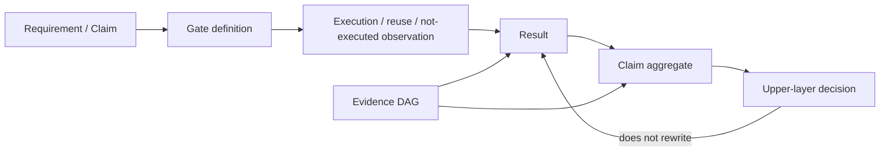
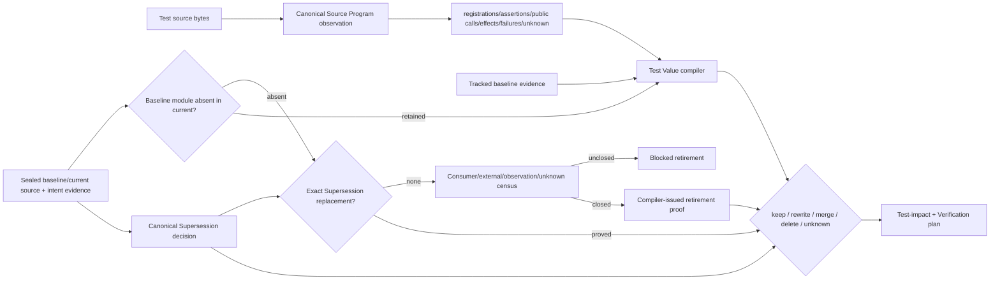

# Verification、Evidence 与 CI 治理

本文是 verification-governance 的公共 root，拥有 Verification truth kernel、invariants、test semantics 与 Claim/Gate contract。Action execution/session 和 Evidence/Review/merge 由本文件列出的规范片段拥有。具体 tests、commands、timeouts、providers、schema revisions 和 current results 由 machine contracts、exact `main` 与 Evidence 拥有。

## 1. Truth kernel

### 1.1 对象关系



| Object | Owns | Does not own |
| --- | --- | --- |
| Requirement/Claim | exact property、subject、inputs、owner、applicability | execution |
| Gate Definition | how to observe Claim under declared environment/capability | Result truth |
| Observation | physical run、legal reuse、or not-executed fact | aggregate decision |
| Result | five-state verdict、reason、cleanup、artifacts | Mutation/merge |
| Aggregate | deterministic composition for one Claim/environment/proof identity | upstream facts |
| Decision | consumer choice: mutation/compatibility/merge/release/support | Result mutation |
| Evidence | immutable facts supporting exact Claim/Result/Decision | authority by existence |

`green command ≠ Result PASS ≠ Claim PASS ≠ upper decision ≠ product support`。

### 1.2 五态

| Status | Exact meaning |
| --- | --- |
| passed | required execution or legal reuse proves exact input closure |
| failed | executed, but assertion/runtime/cleanup/readback/Evidence integrity failed |
| not-run | trustworthy applicability says unnecessary, or honestly not executed |
| unsupported | declared environment/provider lacks required capability |
| invalidated | former result/selection no longer matches input/environment/rule/coverage/identity |

execution disposition 与 status 正交。missing、skipped、timeout、cancel、zero tests、stale、self-proof、unsupported 都不能自动映射为 passed。not-applicable 必须有 trusted applicability proof。

### 1.3 Aggregate

```text
Aggregate(claim) =
  deterministicLattice(
    exact required Gate identities,
    owning environments,
    contribution semantics,
    duplicate/missing/unknown checks
  )
```

输入顺序、Map insertion、first-non-pass 和 duplicate overwrite 不得改变结果。empty Claim/required Gates/physical observations、mixed proof identity 或 unknown contribution 默认不能 passed。

## 2. Verification invariants

| ID | Rule | Rejection |
| --- | --- | --- |
| V-SUBJECT | 每个 Result 只适用于 exact subject/input/environment/contract | subject-mismatch |
| V-APPLICABILITY | not-run/not-applicable 需要独立 proof | applicability-unproven |
| V-COVERAGE | duplicate/missing/unknown/partial fail closed | evidence-closure-incomplete |
| V-ENVIRONMENT | non-owning environment observation不能支持 owning Claim | environment-nonowning |
| V-CLEANUP | behavior通过但cleanup/readback失败则Gate未通过 | settlement-incomplete |
| V-INDEPENDENCE | verifier/selector/validator/merge candidate不能自授权 | self-proof |
| V-SEPARATION | eligibility/delta/compatibility/release/support各有自己的decision owner | proof-overreach |
| V-IMMUTABILITY | historical Evidence不可改写；stale只影响可用性 | evidence-mutated |
| V-REUSE | reuse仅在完整ActionKey/invalidation closure相同 | stale-reuse |
| V-FAILURE | 同输入确定性失败复用；retry需可观察因果变化 | retry-without-change |
| V-EFFECT | candidate executor无credential/status/merge/finalization authority | executor-authority-escape |
| V-MERGE | merge需single-use live authorization + exact readback | merge-unproven |

## 3. Test semantics

### 3.1 Layer由性质决定

| Layer | Proves |
| --- | --- |
| Unit | pure builder/selector/resolver/comparator/normalizer/safety property |
| Contract | public schema/API/CLI/package/inter-owner shape and rejection |
| Integration | pipeline、resolution、impact、artifact、transaction、cross-owner |
| E2E/slow | real Git/filesystem/server/native/package/provider/release |
| Property/model | algebra、round-trip、idempotency、ordering、fixed-point、anti-specialization |
| Fault/recovery | crash/TOCTOU/cache/CAS/rollback/resource settlement |
| Mutation/test-quality | whether critical validator/selector/fail-closed branches are actually observed |

真实 capability 决定层，不由目录名或单次 duration 决定。

### 3.2 Test existence

一个 test 只有观察下列至少一项才可能 required：

```text
public behavior
| durable write→strict readback/recovery
| real Effect and zero/nonzero sentinel
| typed failure/recovery
| physical safety
| algorithm/property
| external protocol compatibility
```

source text、path layout、function arity、private array、Vn/数字、test count、sleep、presentation string 和 implementation list 不是独立 Claim。

### 3.3 Test observation 与 disposition



Test Value 不重解析 source、不签发 production behavior/Effect/owner。动态注册/import/assertion unknown 保持 unknown。

| Disposition | Admission |
| --- | --- |
| keep | test exists and retains unique Claim/cost value |
| rewrite | replacement IDs exist; semantics/failure/effect closure preserved |
| merge | target test dominates all Claims/counterexamples and replacement IDs exist |
| delete | producer/consumer/external-contract census all zero; no replacement |
| unknown | any missing observation/owner/external/future obligation; blocks destructive deletion |

`AssertionDominance(B,A)` requires B to cover A’s Claim、subject、input/counterexample space、Effect/readback、failure、environment and applicability at no worse required cost. Similar title/path/code is irrelevant.

consumer-zero 整文件退役 proof 的适用集合由同一 sealed baseline/current 文件事实派生，只包含基线存在而当前已移除、且尚无 exact Supersession 替代 disposition 的测试模块；仍保留或已被证明合并覆盖的模块不需要再证明 consumer-zero 退役，也不能因此产生退役阻塞。完整基线身份仍必须绑定 receipt。保留文件中的注册删除、改写或合并继续由 Test Value 与 Supersession 校验，不能通过保留空壳文件绕过观察义务；真正移除且无替代的模块仍须闭合 consumer、外部合同、观察与 unknown，才能签发退役证明。

退役签发前必须从 sealed baseline/current evidence 重算并核对 canonical Supersession decision，绑定两侧 source、model、test compilation 与 intent evidence；可重算的摘要或 caller 提供的 disposition 只表示数据，不能豁免退役义务。替代判断不符时拒绝签发，回到同一 evidence owner 重新编译。

### 3.4 全仓 test audit

Complete audit input：

| Required census | Must include |
| --- | --- |
| paths | all tracked paths + missing/untracked/unknown ledger |
| registrations | test/it aliases、each expansion、conditional skip、dynamic unknown |
| graph | canonical imports/test-impact/public symbols |
| semantics | assertions、fixtures、effects、failures、properties、readback |
| authority | test-only provider/credential/clock/lifecycle/receipt issuers |
| mirrors | source/prose/path/version/list/number expectations |
| cost | process/network/fs/state/time/resources |
| disposition | owner evidence + replacement IDs + producer/consumer/external census |

compact report只聚类 presentation；raw census/findings/blocking count 与 Evidence digest不变。新反例暴露缺维度时，旧 audit Evidence invalidated，修 compiler 后重算受影响 closure。

production 不导出普通 caller 可取得的 ForTests command runner/provider/credential/Effect callback/lifecycle writer/cache reset/receipt issuer。test control 位于 test-only package；真实 race/crash actor 由 production owner签发 bounded single-use non-authority capability。

## 4. Claim 与 Gate contract

Claim：

```text
claim identity/revision + owner
+ subject/requirement/input digest
+ claimSemanticsRef
+ for relational claims: trace arity + admitted input differences
  + principal observation partition + declassification relation
+ required/optional Gates
+ owning environments
+ applicability proof
+ contribution semantics
+ invalidation rules
```

Gate：

```text
Claim/Requirement refs
+ semantic inputs
+ capabilities/dependencies/resources
+ execution/settlement/readback procedure
+ Result mapping
+ artifacts/retention
+ invalidation
```

Gate 不以 command/runId/journal path 作为 identity。

单轨迹Gate只能贡献单轨迹Claim。noninterference、observational equivalence、cross-tenant isolation或declassification等relational Claim必须由同一Claim contract生成关联trace tuple与独立relational oracle；分别运行两次再比较presentation output、或把两个PASS聚合，不能提升为relational Evidence。未覆盖的输入对、scheduler、fault或principal view进入exact frontier。


## 规范片段

本文件保留 Verification truth kernel、invariants、test semantics 与 Claim/Gate contract；执行复用和 Evidence/merge 由下列规范片段拥有。

| 片段 | 独立职责 |
| --- | --- |
| [Verification 执行、复用与 Session](verification-governance/execution-and-session.md) | 本片段拥有 Action identity/execution/reuse、Impact selection、Candidate/Scope/Session/MainHealth、failure/retry、typecheck 与 hermetic runtime。 |
| [Evidence、Review 与集成证明](verification-governance/evidence-and-integration.md) | 本片段拥有 Evidence/provenance/Review、trusted bootstrap、property/fault/flake、merge authority 与 completion。 |
