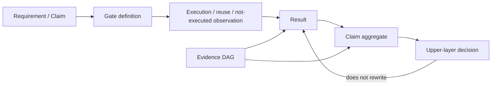
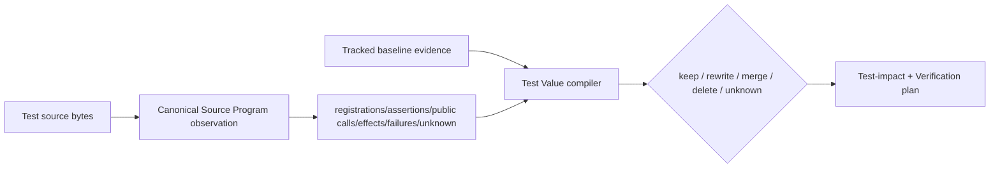
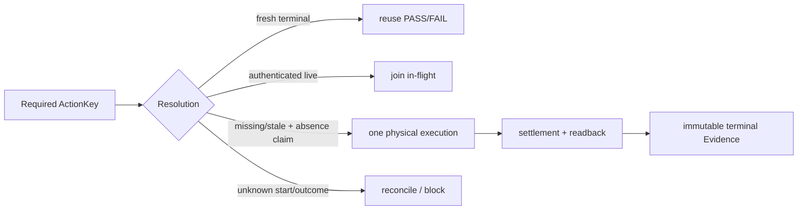
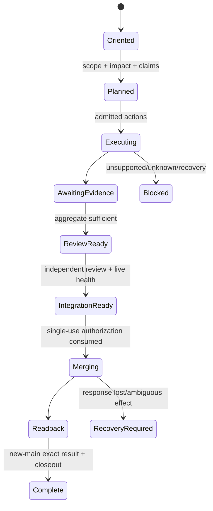
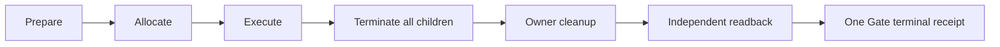
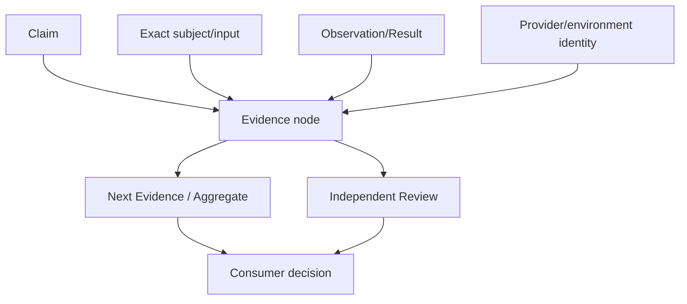
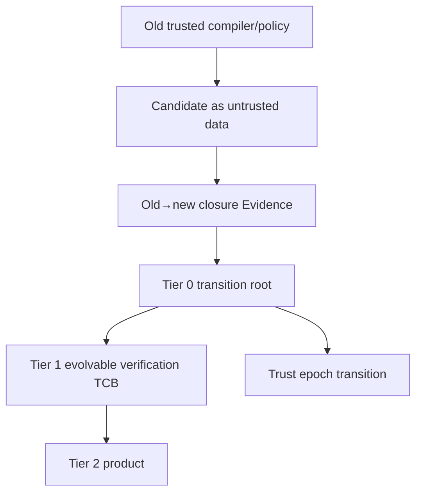
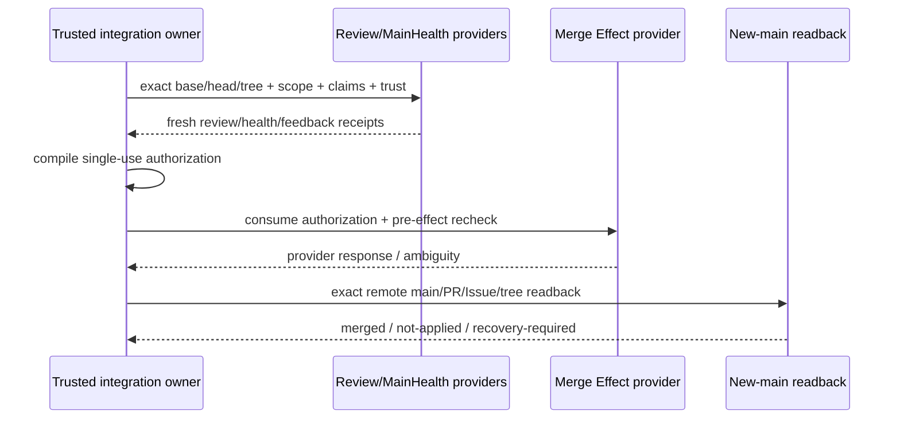

# Verification、Evidence 与 CI 治理

本文拥有 Requirement/Gate/Observation/Result/Claim/Aggregate/Evidence 的身份和真值、验证选择与复用、trusted bootstrap、Review 和 merge proof。具体 tests、commands、timeouts、providers、schema revisions 和 current results 由 machine contracts、exact `main` 与 Evidence 拥有。

## 1. Truth kernel

### 1.1 对象关系



| Object | Owns | Does not own |
| --- | --- | --- |
| Requirement/Claim | exact property、subject、inputs、owner、applicability | execution |
| Gate Definition | how to observe Claim under declared environment/capability | Result truth |
| Observation | physical run、legal reuse、or not-executed fact | aggregate decision |
| Result | five-state verdict、reason、cleanup、artifacts | Mutation/merge |
| Aggregate | deterministic composition for one Claim/environment/proof identity | upstream facts |
| Decision | consumer choice: mutation/compatibility/merge/release/support | Result mutation |
| Evidence | immutable facts supporting exact Claim/Result/Decision | authority by existence |

`green command ≠ Result PASS ≠ Claim PASS ≠ upper decision ≠ product support`。

### 1.2 五态

| Status | Exact meaning |
| --- | --- |
| passed | required execution or legal reuse proves exact input closure |
| failed | executed, but assertion/runtime/cleanup/readback/Evidence integrity failed |
| not-run | trustworthy applicability says unnecessary, or honestly not executed |
| unsupported | declared environment/provider lacks required capability |
| invalidated | former result/selection no longer matches input/environment/rule/coverage/identity |

execution disposition 与 status 正交。missing、skipped、timeout、cancel、zero tests、stale、self-proof、unsupported 都不能自动映射为 passed。not-applicable 必须有 trusted applicability proof。

### 1.3 Aggregate

```text
Aggregate(claim) =
  deterministicLattice(
    exact required Gate identities,
    owning environments,
    contribution semantics,
    duplicate/missing/unknown checks
  )
```

输入顺序、Map insertion、first-non-pass 和 duplicate overwrite 不得改变结果。empty Claim/required Gates/physical observations、mixed proof identity 或 unknown contribution 默认不能 passed。

## 2. Verification invariants

| ID | Rule | Rejection |
| --- | --- | --- |
| V-SUBJECT | 每个 Result 只适用于 exact subject/input/environment/contract | subject-mismatch |
| V-APPLICABILITY | not-run/not-applicable 需要独立 proof | applicability-unproven |
| V-COVERAGE | duplicate/missing/unknown/partial fail closed | evidence-closure-incomplete |
| V-ENVIRONMENT | non-owning environment observation不能支持 owning Claim | environment-nonowning |
| V-CLEANUP | behavior通过但cleanup/readback失败则Gate未通过 | settlement-incomplete |
| V-INDEPENDENCE | verifier/selector/validator/merge candidate不能自授权 | self-proof |
| V-SEPARATION | eligibility/delta/compatibility/release/support各有自己的decision owner | proof-overreach |
| V-IMMUTABILITY | historical Evidence不可改写；stale只影响可用性 | evidence-mutated |
| V-REUSE | reuse仅在完整ActionKey/invalidation closure相同 | stale-reuse |
| V-FAILURE | 同输入确定性失败复用；retry需可观察因果变化 | retry-without-change |
| V-EFFECT | candidate executor无credential/status/merge/finalization authority | executor-authority-escape |
| V-MERGE | merge需single-use live authorization + exact readback | merge-unproven |

## 3. Test semantics

### 3.1 Layer由性质决定

| Layer | Proves |
| --- | --- |
| Unit | pure builder/selector/resolver/comparator/normalizer/safety property |
| Contract | public schema/API/CLI/package/inter-owner shape and rejection |
| Integration | pipeline、resolution、impact、artifact、transaction、cross-owner |
| E2E/slow | real Git/filesystem/server/native/package/provider/release |
| Property/model | algebra、round-trip、idempotency、ordering、fixed-point、anti-specialization |
| Fault/recovery | crash/TOCTOU/cache/CAS/rollback/resource settlement |
| Mutation/test-quality | whether critical validator/selector/fail-closed branches are actually observed |

真实 capability 决定层，不由目录名或单次 duration 决定。

### 3.2 Test existence

一个 test 只有观察下列至少一项才可能 required：

```text
public behavior
| durable write→strict readback/recovery
| real Effect and zero/nonzero sentinel
| typed failure/recovery
| physical safety
| algorithm/property
| external protocol compatibility
```

source text、path layout、function arity、private array、Vn/数字、test count、sleep、presentation string 和 implementation list 不是独立 Claim。

### 3.3 Test observation 与 disposition



Test Value 不重解析 source、不签发 production behavior/Effect/owner。动态注册/import/assertion unknown 保持 unknown。

| Disposition | Admission |
| --- | --- |
| keep | test exists and retains unique Claim/cost value |
| rewrite | replacement IDs exist; semantics/failure/effect closure preserved |
| merge | target test dominates all Claims/counterexamples and replacement IDs exist |
| delete | producer/consumer/external-contract census all zero; no replacement |
| unknown | any missing observation/owner/external/future obligation; blocks destructive deletion |

`AssertionDominance(B,A)` requires B to cover A’s Claim、subject、input/counterexample space、Effect/readback、failure、environment and applicability at no worse required cost. Similar title/path/code is irrelevant.

### 3.4 全仓 test audit

Complete audit input：

| Required census | Must include |
| --- | --- |
| paths | all tracked paths + missing/untracked/unknown ledger |
| registrations | test/it aliases、each expansion、conditional skip、dynamic unknown |
| graph | canonical imports/test-impact/public symbols |
| semantics | assertions、fixtures、effects、failures、properties、readback |
| authority | test-only provider/credential/clock/lifecycle/receipt issuers |
| mirrors | source/prose/path/version/list/number expectations |
| cost | process/network/fs/state/time/resources |
| disposition | owner evidence + replacement IDs + producer/consumer/external census |

compact report只聚类 presentation；raw census/findings/blocking count 与 Evidence digest不变。新反例暴露缺维度时，旧 audit Evidence invalidated，修 compiler 后重算受影响 closure。

production 不导出普通 caller 可取得的 ForTests command runner/provider/credential/Effect callback/lifecycle writer/cache reset/receipt issuer。test control 位于 test-only package；真实 race/crash actor 由 production owner签发 bounded single-use non-authority capability。

## 4. Claim 与 Gate contract

Claim：

```text
claim identity/revision + owner
+ subject/requirement/input digest
+ required/optional Gates
+ owning environments
+ applicability proof
+ contribution semantics
+ invalidation rules
```

Gate：

```text
Claim/Requirement refs
+ semantic inputs
+ capabilities/dependencies/resources
+ execution/settlement/readback procedure
+ Result mapping
+ artifacts/retention
+ invalidation
```

Gate 不以 command/runId/journal path 作为 identity。

## 5. Action identity、execution 与复用

### 5.1 三层 identity

| Identity | Contains | Excludes |
| --- | --- | --- |
| Authoring input | language/provider/config/dependency generation + actual source/module closure | attempt time、Git transport |
| Attempt envelope | ActionKey + attemptId + deadline + lease + provider binding + settlement | pure semantic identity |
| Frozen Evidence | exact candidate content/generation only when Claim observes it + environment/result | cache/authoring identity as proof |

```text
ActionKey = hash(
  canonical producer revision,
  normalized operation,
  actual subject closure,
  Gate/Claim contract,
  environment/tool/provider semantics,
  dependency topology
)
```

branch、PR、session、wall clock、PID、temp path、lane 不进入 ActionKey。whole-tree digest 只在 Gate 真正观察 whole tree 时进入。

### 5.2 Resolution



Action builder纯计算，不为构造 key retain executable、启动 process/container或创建cache。terminal miss 且 runner 赢得唯一 start claim 后才取得 physical capability。start marker无terminal是 unknown outcome，不能靠新session/deadline/temp path replay。

cache hit/miss不签发 Result；provider availability只是negative circuit breaker，不是Effect authority。

## 6. Impact 与验证选择

```text
RequiredClosure =
  changed semantic subjects
  → direct consumers
  → public surface / state / Effect / fixture / Claim dependencies
  → applicable Gates

ExecutionSet = RequiredClosure ∩ MissingOrStaleActionKeys
```

Impact只传播可证明关系；unknown edge产生保守 blocker/backstop，不允许假精确。plan/query zero Effect：在dependency preparation、cache write、process/provider start、network/fs mutation前返回selection。

Gate梯度：

```text
focused sentinel
→ affected authoring closure
→ candidate pre-freeze
→ frozen selected risk / hosted quick
→ virtual merge / release full backstop
```

不是每次固定全跑。昂贵 Evidence 在 candidate frozen 后按 ActionKey 生产一次；同输入 PASS/FAIL/in-flight 分别 reuse/stop/join。

## 7. Candidate、Scope、Session 与 MainHealth

### 7.1 Identity chain

```text
Authoring → CandidateContent → FrozenGeneration → Published/Merged → New-main readback
```

content identity 与 transport generation 分离。Impact/Action消费实际 content closure；Session/PR/Review/Promotion消费各自要求的 exact generation。head变更会使 Review/attestation/Promotion stale，但不自动使语义未变的 ActionKey stale。

### 7.2 Scope

| Object | Owns |
| --- | --- |
| Scope proposal | requested paths/capabilities only |
| Scope grant | exact base、authorized/forbidden Effects、resources、trust epoch |
| Candidate attestation | candidate delta/effects ⊆ grant |

manifest/PR/candidate/self-digest 不能扩权。scope或authority变化产生新 grant。

### 7.3 VerificationSession

Session 只协调并引用 Task Capsule、Scope、Action/Result/Evidence、Review、MainHealth、Integration；不复制其字段/authority。Managed Continuation只reconcile事实和下一transition。



每个 external Effect 前重读 operation-specific grant/provider/deadline。journal帮助恢复，不创造 Result/Review/merge truth。

### 7.4 MainHealth

同一 fresh exact default observation互斥投影：

| State | Legal route |
| --- | --- |
| ordinary | work selection / ordinary operation |
| repair | only owner-issued repair decision |
| locked | no work selection/effect |

incomplete/stale/duplicate/provider-conflict/unknown → locked。MainHealth是external/default ledger，不是Session cache或candidate baseline。

## 8. Failure、retry 与 proof reset

Failure record：

```text
code + phase + Gate + owner + invariant
+ exact input + minimal reproduction + fingerprint
+ invalidated Evidence + cleanup state
+ next action + retry policy
```

| Condition | Action |
| --- | --- |
| same input + same deterministic fingerprint | reuse failure; stop repeat |
| observable transient cause changed | bounded retry |
| provider/process started, terminal missing | join/readback/reconcile; no replay |
| repeated frozen invalidation same root | proof reset to owner/model/fixture/selector architecture |
| cleanup/readback failed | preserve primary + settlement residue |

删除test、弱化assertion、无界加timeout、重复到绿、换Provider或unsupported→skipped 均不能消除 failure。

## 9. Typecheck 与行为测试

Typecheck证明指定 compiler/toolchain下 source/public contracts 可构造；behavior tests证明运行行为。两者不互替。

普通 TypeScript delta：

```text
stabilize source/import/generated closure
→ run affected/incremental canonical compiler proof
→ reuse same-input terminal
→ one frozen full proof only when Claim requires
```

不得每个 finding 后裸 full typecheck；也不得用 Review/test 代替 compiler proof。用户省略行为测试不自动省略 pure zero-write compiler proof；显式省略时只能标 `compiler-proof-missing`。

## 10. Hermetic Runtime 与 effectful-test supervisor



resource classes：immutable-copyable、rebuildable、identity-bound、process-bound、non-copyable-control-state、external-capability、unknown。unknown 不复制/共享/并行。

effectful-test supervisor绑定 exact Action/child plan、one absolute deadline、aggregate budget和cancellation。primary failure/cancel/deadline 后停止新admission，终止已启动 children，settle streams，cleanup/readback，再发布 terminal。Promise timeout、parent exit、finally log 不足。

untrusted package/build/test/provider需要 credential-free sandbox、bounded fs/network/process/resources和cleanup Evidence。temp dir、Node VM、browser context或lint不是恶意代码 sandbox。

## 11. Evidence DAG、provenance 与 Review



Evidence node immutable/content-addressed，引用 exact subject、Claim/Action contract、environment/provider、Result、artifacts、predecessors和invalidation。known failure可复用为failure fact，不变PASS；跨baseline组合需intervening Impact coverage。

Provenance kinds：

| Kind | Answers |
| --- | --- |
| Artifact | bytes/object从哪里来 |
| Fact | assertion为什么成立 |
| Verification | exact execution证明了什么 |
| Runtime | environment实际发生什么 |
| Provider/AI | candidate explanation + coverage/unknown |
| Resolution | requirements/candidates/eligibility/decision reasons |
| Delta | old/new/comparator/item/impact witness |
| Compatibility | rules/Delta/results/environment/user decision |

Review是独立Verification Action，绑定 exact subject、principal、owner/consumer/Effect/recovery/doc closure和unknown。prose只解释 typed findings。

## 12. Trusted bootstrap



| Tier | Owns | Excludes |
| --- | --- | --- |
| 0 | Git object/ref identity、CAS/readback、principal、digest/schema primitive、TCB transition receipt | selector/product policy |
| 1 | selector、ActionKey/Evidence、Review validator、merge gate、docs/toolchain/provider policies | product behavior |
| 2 | ordinary product/engineering implementation | trust migration authority |

candidate tree是immutable untrusted data；old-main provider/compiler读取 blobs并计算 affected closure，不执行candidate compiler。candidate tests仅补充，不授权自己。只有 Tier 0自身变化进入manual break-glass；Tier 1按old trusted owner + T0 receipt迁移。

registry只保存不能从 import/source graph 推导的 static policy lower bounds；不提交 generated module/blob lock。Git hook是authoring convenience，不是TCB authority。

## 13. Property、fault 与 flake

| Technique | Contract |
| --- | --- |
| property | identity/normalization/round-trip/state/fixed-point/tie-break/clean-delta equivalence |
| shrink | preserve minimal counterexample + seed + producer revision + replay |
| fault | enumerate persistence/effect/identity chain boundaries, not one discovered leaf at a time |
| cross-platform | Windows/Linux/macOS/WSL/filesystem evidence independent |
| retry | records flake Evidence; one green never overwrites failure |
| quarantine | owner + expiry + replacement coverage + exit |
| mutation testing | calibrate critical pure validators/authorization/selector only |

effect identity chain fault corpus覆盖 authority root→component open→pre-effect→post-effect→terminal readback 的每个 replacement/crash window。

## 14. Merge authority



Authorization input：

```text
exact base/head/tree
+ Scope grant + candidate attestation
+ required Claim/Evidence aggregate
+ fresh independent Review
+ blocking feedback cleared
+ MainHealth + trust/ruleset
+ dependency + applicable Binding/Delta/Compatibility refs
```

PR body/comment/status/journal/admin identity/local JSON/serialized receipt 不授权 merge。authorization 是 provenance-bound、single-use、bounded-lifetime live capability。response lost/ambiguous 时只readback，不 replay。

成功需 merged tree=verified candidate tree，并协调 remote main、PR/Issue disposition、branch/worktree closeout与new-main readback；各 physical Effect 仍由自己的owner执行。cleanup unknown/foreign residue阻断completion。

## 15. 无代码逻辑验证

| Scenario | Required outcome | Forbidden conclusion |
| --- | --- | --- |
| test body pass, cleanup fails | failed + primary/cleanup Evidence | passed |
| ActionKey same, previous deterministic fail | reuse fail | rerun until green |
| same content, new Git commit | semantic Action may reuse；Review/Promotion rebind | all Evidence stale or all reusable |
| start marker, no terminal | join/readback/unknown | new attempt |
| zero selected tests, applicability unknown | invalidated/unresolved | passed |
| provider unsupported for optional Claim | honest unsupported contribution | skipped/pass |
| provider unsupported for required Claim | aggregate non-pass | automatic fallback |
| candidate changes selector itself | old trusted selector evaluates candidate | candidate self-pass |
| plan command would create cache | reject as Effectful plan | cache is harmless |
| failed review text parser, status green | review unresolved | merge allowed |
| merge response lost | exact remote readback | second merge call |
| new-main differs from verified tree | recovery/incident | complete |
| stronger test covers same happy path but not old failure boundary | no dominance | delete old test |
| typecheck pass | static contract proof only | runtime behavior verified |

## 16. 完成判据

```text
VerificationClosed(claim) =
  claim/gate identities exact
  ∧ applicability/coverage complete
  ∧ ActionKey and environment exact
  ∧ execution/reuse disposition valid
  ∧ Effect settlement + cleanup + readback complete
  ∧ Evidence independent/fresh
  ∧ aggregate deterministic
  ∧ consumer decision does not overreach Claim
```

Merge/Release/Support 还需各自 authority、Effect 和 readback；Verification PASS 不能替代。
