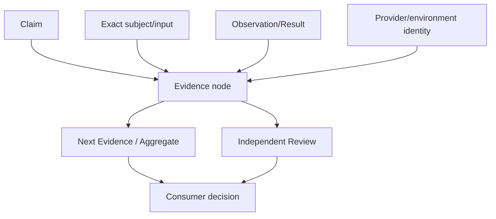
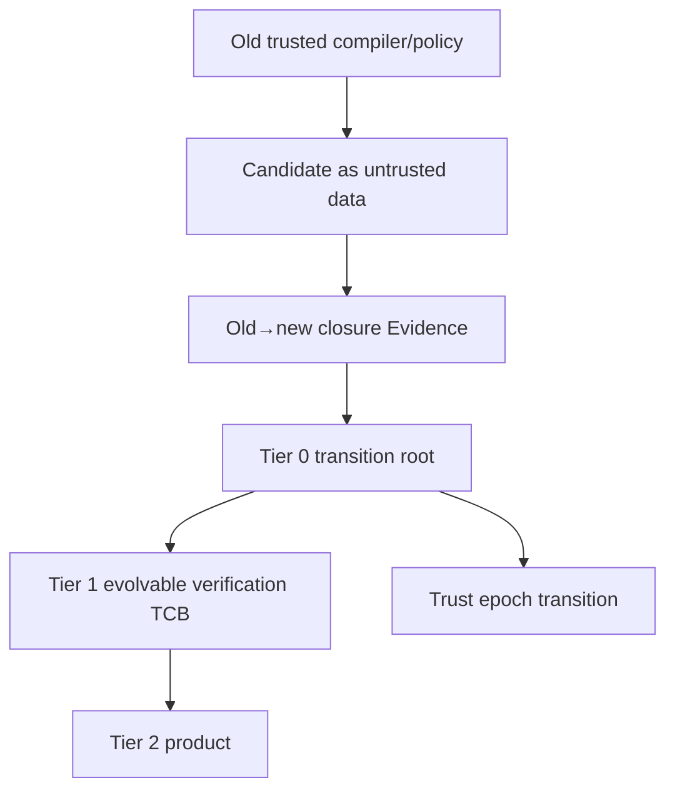
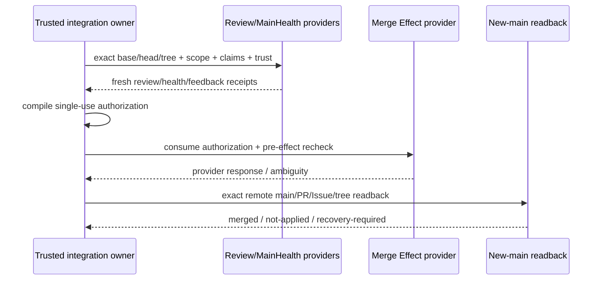

# Evidence、Review 与集成证明

本片段拥有 Evidence/provenance/Review、trusted bootstrap、property/fault/flake、merge authority 与 completion。

## 11. Evidence DAG、provenance 与 Review



Evidence node immutable/content-addressed，引用 exact subject、Claim/Action contract、environment/provider、Result、artifacts、predecessors和invalidation。known failure可复用为failure fact，不变PASS；跨baseline组合需intervening Impact coverage。

Provenance kinds：

| Kind | Answers |
| --- | --- |
| Artifact | bytes/object从哪里来 |
| Fact | assertion为什么成立 |
| Verification | exact execution证明了什么 |
| Runtime | environment实际发生什么 |
| Provider/AI | candidate explanation + coverage/unknown |
| Resolution | requirements/candidates/eligibility/decision reasons |
| Delta | old/new/comparator/item/impact witness |
| Compatibility | rules/Delta/results/environment/user decision |

Review是独立Verification Action，绑定 exact subject、principal、owner/consumer/Effect/recovery/doc closure和unknown。prose只解释 typed findings。

本地 closeout 的 Review 缺失只产生 `WAITING_REVIEW`；读取 Review 不隐含向维护者发送评论的权限。通知属于独立的消息 Effect，需要明确授权并由相应 Provider 执行与读回，不能隐藏在验证准入路径中。

## 12. Trusted bootstrap



| Tier | Owns | Excludes |
| --- | --- | --- |
| 0 | Git object/ref identity、CAS/readback、principal、digest/schema primitive、TCB transition receipt | selector/product policy |
| 1 | selector、ActionKey/Evidence、Review validator、merge gate、docs/toolchain/provider policies | product behavior |
| 2 | ordinary product/engineering implementation | trust migration authority |

candidate tree是immutable untrusted data；old-main provider/compiler读取 blobs并计算 affected closure，不执行candidate compiler。candidate tests仅补充，不授权自己。只有 Tier 0自身变化进入manual break-glass；Tier 1按old trusted owner + T0 receipt迁移。

manual break-glass 是明确获权的外部 operator transition，不是 candidate 新增的自接收分支。它绑定 frozen base/head/tree、Tier 0 changed closure、old-main checker 的实际结果与 unknown、真实本地或托管执行证据以及独立 exact-head review；由已认证且具备维护权限的 provider principal 执行 expected-head CAS。changed closure 从 old trusted Tier 0 roots 与 exact base/head Git diff 得出，不依赖缺失的 manifest；无法证明的 causal closure completeness 必须作为 unknown 纳入明确获权的 operator disposition，不能自报完整。manual disposition 与证据摘要进入 operator/provider 创建的不可变 merge commit，其 tree 等于已验证 candidate tree、parent 等于 frozen base；随后回读 merged principal、commit、parent、tree 与 default ref。PR prose、status 与本地 JSON 不能替代该不可变对象。它不冒充 Actions envelope 或 MainHealth，不把缺失的自动 issuer 写成通过；迁移后新 main 仍须由当前正常 owner 生成 fresh MainHealth。Provider 拒绝或 revision 漂移使这次 transition 停止，不能伪造检查或变更保护规则。

registry只保存不能从 import/source graph 推导的 static policy lower bounds；不提交 generated module/blob lock。Git hook是authoring convenience，不是TCB authority。

## 13. Property、fault 与 flake

| Technique | Contract |
| --- | --- |
| property | identity/normalization/round-trip/state/fixed-point/tie-break/clean-delta equivalence |
| shrink | preserve minimal counterexample + seed + producer revision + replay |
| fault | enumerate persistence/effect/identity chain boundaries, not one discovered leaf at a time |
| cross-platform | Windows/Linux/macOS/WSL/filesystem evidence independent |
| retry | records flake Evidence; one green never overwrites failure |
| quarantine | owner + expiry + replacement coverage + exit |
| mutation testing | calibrate critical pure validators/authorization/selector only |

effect identity chain fault corpus覆盖 authority root→component open→pre-effect→post-effect→terminal readback 的每个 replacement/crash window。

## 14. Merge authority



Authorization input：

```text
exact base/head/tree
+ Scope grant + candidate attestation
+ required Claim/Evidence aggregate
+ fresh independent Review
+ blocking feedback cleared
+ MainHealth + trust/ruleset
+ dependency + applicable Binding/Delta/Compatibility refs
```

PR body/comment/status/journal/admin identity/local JSON/serialized receipt 不授权 merge。authorization 是 provenance-bound、single-use、bounded-lifetime live capability。response lost/ambiguous 时只readback，不 replay。

成功需 merged tree=verified candidate tree，并协调 remote main、PR/Issue disposition、branch/worktree closeout与new-main readback；各 physical Effect 仍由自己的owner执行。当前任务已授权且声明承担的 cleanup obligation 存在 unknown/foreign 冲突时，不得声称该清理已完成；不能因此扩大删除范围。范围外的历史资源与未知 consumer hold 应保留并明确报告，不构成全部删除后才能完成当前交付的前提，也不能冒充本次运行已经 settlement 的证据。

squash completion 由同一 merge completion owner 验证 Provider 实际观察的唯一 parent 等于已验证 base；不能从预期 merge method 推定父提交。local closeout 消费同一次 GitHub commit observation 的 tree/parents，并通过已有 repository-bound GitHub ref owner 读回当前主线；本地可变的 `origin` 名称不能签发远端仓库身份，无需为了这些观察先写入本地 objects 或 remote-tracking refs。本地主线同步仍由独立 workspace/branch Effect owner 负责。

## 15. 无代码逻辑验证

| Scenario | Required outcome | Forbidden conclusion |
| --- | --- | --- |
| test body pass, cleanup fails | failed + primary/cleanup Evidence | passed |
| ActionKey same, previous deterministic fail | reuse fail | rerun until green |
| same content, new Git commit | semantic Action may reuse；Review/Promotion rebind | all Evidence stale or all reusable |
| start marker, no terminal | join/readback/unknown | new attempt |
| zero selected tests, applicability unknown | invalidated/unresolved | passed |
| provider unsupported for optional Claim | honest unsupported contribution | skipped/pass |
| provider unsupported for required Claim | aggregate non-pass | automatic fallback |
| candidate changes selector itself | old trusted selector evaluates candidate | candidate self-pass |
| plan command would create cache | reject as Effectful plan | cache is harmless |
| failed review text parser, status green | review unresolved | merge allowed |
| merge response lost | exact remote readback | second merge call |
| new-main differs from verified tree | recovery/incident | complete |
| stronger test covers same happy path but not old failure boundary | no dominance | delete old test |
| typecheck pass | static contract proof only | runtime behavior verified |

## 16. 完成判据

```text
VerificationClosed(claim) =
  claim/gate identities exact
  ∧ applicability/coverage complete
  ∧ ActionKey and environment exact
  ∧ execution/reuse disposition valid
  ∧ Effect settlement + cleanup + readback complete
  ∧ Evidence independent/fresh
  ∧ aggregate deterministic
  ∧ consumer decision does not overreach Claim
```

Merge/Release/Support 还需各自 authority、Effect 和 readback；Verification PASS 不能替代。
