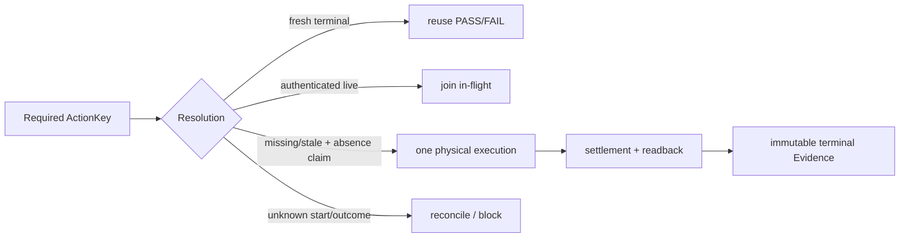
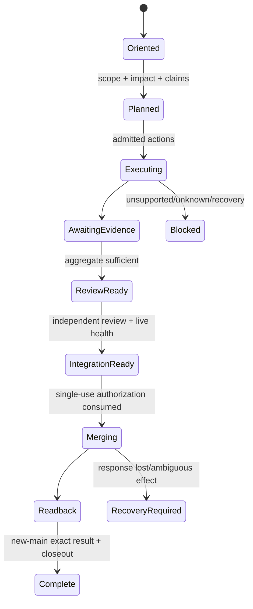
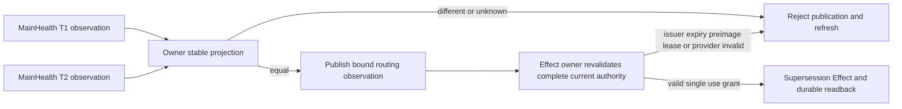
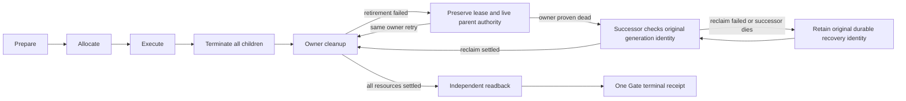

# Verification 执行、复用与 Session

本片段拥有 Action identity/execution/reuse、Impact selection、Candidate/Scope/Session/MainHealth、failure/retry、typecheck 与 hermetic runtime。

## 5. Action identity、execution 与复用

### 5.1 三层 identity

| Identity | Contains | Excludes |
| --- | --- | --- |
| Authoring input | language/provider/config/dependency generation + actual source/module closure | attempt time、Git transport |
| Attempt envelope | ActionKey + attemptId + deadline + lease + provider binding + settlement | pure semantic identity |
| Frozen Evidence | exact candidate content/generation only when Claim observes it + environment/result | cache/authoring identity as proof |

```text
VerificationActionKey = ActionKey(
  canonical producer revision,
  normalized operation,
  actual subject closure,
  Gate/Claim contract,
  environment/tool/provider semantics,
  dependency topology
)
```

branch、PR、session、wall clock、PID、temp path、lane 不进入 ActionKey。whole-tree digest 只在 Gate 真正观察 whole tree 时进入。

### 5.2 Resolution



Action builder纯计算，不为构造 key retain executable、启动 process/container或创建cache。terminal miss 且 runner 赢得唯一 start claim 后才取得 physical capability。start marker无terminal是 unknown outcome，不能靠新session/deadline/temp path replay。

cache hit/miss不签发 Result；provider availability只是negative circuit breaker，不是Effect authority。

## 6. Impact 与验证选择

Verification复用System Architecture唯一的`RequiredExecutionClosure`与`ExecutionSet`。本Domain只提供verification roots：changed semantic subjects → direct consumers → public/state/Effect/fixture/Claim dependencies → applicable Gates；不复制通用closure或reuse公式。

Impact只传播可证明关系；unknown edge产生保守 blocker/backstop，不允许假精确。plan/query zero Effect：在dependency preparation、cache write、process/provider start、network/fs mutation前返回selection。

测试读取生产文件或启动本地程序的关系，由同一 exact Source Program 的 observation producer 签发，并与静态 import 共同参与 consumer closure；它们保持独立的关系种类，不伪装成 import。调用绑定必须由现有 Program/TypeChecker 证明，目标必须属于同一 snapshot；动态参数、外部目标和无法证明的绑定保持 unknown。普通测试 helper 继续传播到可执行测试，不能被误当成遍历终点。

仅编译的测试输入必须同时属于 compiler-issued test 集合与 module graph，且没有 runtime consumer 或 entrypoint 义务，才可交给既有 typecheck Gate。文件后缀本身不构成豁免；selection resolved 也不代表 Gate 已执行或通过。未知诊断只报告实际未解析的路径，不能用全部 changed paths 代替精确 frontier。

Gate梯度：

```text
focused sentinel
→ affected authoring closure
→ candidate pre-freeze
→ frozen selected risk / hosted quick
→ virtual merge / release full backstop
```

不是每次固定全跑。昂贵 Evidence 在 candidate frozen 后按 ActionKey 生产一次；同输入 PASS/FAIL/in-flight 分别 reuse/stop/join。

## 7. Candidate、Scope、Session 与 MainHealth

### 7.1 Identity chain

```text
Authoring → CandidateContent → FrozenGeneration → Published/Merged → New-main readback
```

content identity 与 transport generation 分离。Impact/Action消费实际 content closure；Session/PR/Review/Promotion消费各自要求的 exact generation。head变更会使 Review/attestation/Promotion stale，但不自动使语义未变的 ActionKey stale。

### 7.2 Scope

| Object | Owns |
| --- | --- |
| Scope proposal | requested paths/capabilities only |
| Scope grant | exact base、authorized/forbidden Effects、resources、trust epoch |
| Candidate attestation | candidate delta/effects ⊆ grant |

manifest/PR/candidate/self-digest 不能扩权。scope或authority变化产生新 grant。

### 7.3 VerificationSession

Session 只协调并引用 Task Capsule、Scope、Action/Result/Evidence、Review、MainHealth、Integration；不复制其字段/authority。Managed Continuation只reconcile事实和下一transition。



每个 external Effect 前重读 operation-specific grant/provider/deadline。journal帮助恢复，不创造 Result/Review/merge truth。

### 7.4 MainHealth

同一 fresh exact default observation互斥投影：

| State | Legal route |
| --- | --- |
| ordinary | work selection / ordinary operation |
| repair | only owner-issued repair decision |
| locked | no work selection/effect |

incomplete/stale/duplicate/provider-conflict/unknown → locked。MainHealth是external/default ledger，不是Session cache或candidate baseline。

Publication 的 T1/T2 比较由 MainHealth owner 的同一 stable projection 编译：绑定 exact repository/default branch/main/tree、Runtime authority、本地物理 preimage、hosted health epoch 与 producer provenance，以及 repair/supersession 的语义和持久身份。重新采样产生的时间戳及其派生 byte digest 不改变 publication identity；provider、subject、preimage 或 prepared Effect identity 改变必须使比较失败。测试联合观察复用此投影，test-origin capability 仍不能调用 production publication。



Stable equality 只裁决 publication；完整 hosted bytes、有效期、issuer/permission、local preimage、mutation lease 和 prepared intent 仍由原 supersession Effect admission 与 recovery owner验证，不能用 stable digest替代。

## 8. Failure、retry 与 proof reset

Failure record：

```text
code + phase + Gate + owner + invariant
+ exact input + minimal reproduction + fingerprint
+ invalidated Evidence + cleanup state
+ next action + retry policy
```

| Condition | Action |
| --- | --- |
| same input + same deterministic fingerprint | reuse failure; stop repeat |
| observable transient cause changed | bounded retry |
| provider/process started, terminal missing | join/readback/reconcile; no replay |
| repeated frozen invalidation same root | proof reset to owner/model/fixture/selector architecture |
| cleanup/readback failed | preserve primary + settlement residue |

删除test、弱化assertion、无界加timeout、重复到绿、换Provider或unsupported→skipped 均不能消除 failure。

## 9. Typecheck 与行为测试

Typecheck证明指定 compiler/toolchain下 source/public contracts 可构造；behavior tests证明运行行为。两者不互替。

普通 TypeScript delta：

```text
stabilize source/import/generated closure
→ run affected/incremental canonical compiler proof
→ reuse same-input terminal
→ one frozen full proof only when Claim requires
```

不得每个 finding 后裸 full typecheck；也不得用 Review/test 代替 compiler proof。用户省略行为测试不自动省略 pure zero-write compiler proof；显式省略时只能标 `compiler-proof-missing`。

## 10. Hermetic Runtime 与 effectful-test supervisor



resource classes：immutable-copyable、rebuildable、identity-bound、process-bound、non-copyable-control-state、external-capability、unknown。unknown 不复制/共享/并行。

effectful-test supervisor绑定 exact Action/child plan、one absolute deadline、aggregate budget和cancellation。primary failure/cancel/deadline 后停止新admission，终止已启动 children，settle streams，cleanup/readback，再发布 terminal。Promise timeout、parent exit、finally log 不足。

本地 slow suite 的 `logicalRunTimeoutMs` 由 test-budget owner 拥有，表示一次 admission 至观察器 terminal settlement 的总预算；Bun per-case timeout 不得延长它。依赖准备先由既有 dependency owner 完成。执行 compiler 绑定 owner-issued Source Program projection、对应 budget generation、唯一 suite/files、cwd 与 canonical argv；普通 DTO、缓存 WeakSet 或自写 digest 不能签发成员身份或执行权限。令两个 provider capability acquire/binding 前固定的 admission 时刻为 `A`、总预算为 `L`、既有 settlement margin 为 `M`，则 `Dlogical = A + L`、`Dchild = Dlogical - M`；child requirement context 绑定 `Dchild`，observer context 绑定 `Dlogical`，绝对期限参与同一 opaque context 的 digest。retain、observer arm/ready 与后续耗时均只缩短剩余窗口，不能从后续 acquisition 时刻或 ready barrier 重新计时。observer physical owner 先准备 retained roots 与 binding，绑定 operation 后才启动 worker。

同一 semantic operation 由 retained command provider 与 repository observer physical owner 分别绑定 child 与 observer requirements，收齐 bindings 后才能执行；只准一个 Bun child，沿现有 ProcessResourceSession ledger 结算。runner 保留套件准入与预算来源验证；physical observer 只消费既有 foundation 签发的 single-consumer requirement binding context、exact operation 和自身 retained capability，不能反向导入测试策略。prepared observer 只保留物理 roots/binding，不接受 caller deadline；arm 从 operation 的绝对期限与 context 的 duration ceiling 得到剩余窗口。该 bound contract 的时长由已准入 operation 约束，普通命令和未绑定 observer 仍受五分钟上限约束，caller 数字不能扩大权限。slow/full lane 按唯一 suite registry 逐 suite 消费这一入口；exact slow files 无唯一归属、来源未签发、身份漂移、重复消费、过期或取消均在 Effect 前拒绝。不得保留含义模糊的 suite `timeoutMs` alias、全 slow 文件共用无归属 child 或第二执行器。宿主是否 GitHub Actions 不参与本地执行语义。

test invocation retirement 开始后禁止新 generation；子资源清理失败保留其 recovery lease
及仍有效的 parent physical authority，已结算资源不在重试中重复删除。只有全部子资源与
lease 结算成功才释放 parent authority。死 owner 接管消费
[Workspace physical authority](../runtime-and-distribution.md#11-workspace-physical-authority)
的持久恢复身份与确认协议。普通异常测试不证明连续进程退出的恢复；必须验证原
generation 经再次接管仍可按原身份回收，且 foreign/identity-unknown residue 保留。
恢复失败不是 terminal。

untrusted package/build/test/provider需要 credential-free sandbox、bounded fs/network/process/resources和cleanup Evidence。temp dir、Node VM、browser context或lint不是恶意代码 sandbox。
