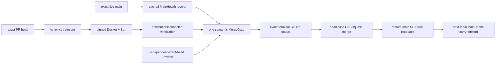

# SEC 静态收敛与信任闭包

本 Work Package 只承载当前单一正式收口候选的最终结果，不继承历史 integration 分支中 540 个过程提交的工程权威。候选必须始终从本清单绑定的精确 `main` 重新导出最终树；历史提交只保留追溯价值。

本包覆盖当前已经完成的静态架构收敛，以及为其进入 `main` 所必需的 TCB、MergeGate 与 GitHub 平台强制边界闭包。任何测试、Review、MainHealth、Gate、bootstrap 或 merge 结论都必须来自真实物理执行，不能由本文档或静态分析自证。

GitHub Actions 只是一种可选 trusted execution adapter，不是 Verification、IntegrationAuthorization 或 main authority 的唯一语义 owner。Canonical local trusted runtime 直接复用固定 OCI image、Bun 与现有 VerificationSession/ActionKey/MergeGate contracts；依赖安装完成后断网执行，Evidence、MainHealth、Gate 与 status receipt 全部写入仓库外 SEC Runtime State。它不注册 self-hosted Actions runner，也不消耗 Actions minutes 或 artifact quota。

跨会话续跑不再拥有独立状态机。第一次接力只消费上游真实 Git/GitHub snapshot 形成的 `sec-local-continuation-checkpoint-v1`，运行 `bun run dev:continue -- --handoff <external.json> --json` 完成一次精确 admission，并把 immutable snapshot 写入仓库外 SEC Runtime State CAS；之后同一物理工作区只运行 `bun run dev:continue -- --json`。本地 candidate 变化不机械触发 GitHub census，只有外部 authority boundary 或明确 external change 才由 invalidation compiler 指向相应 live owner。任务终态自动退役 active pointer，并按 reachability/retention 回收不可达 snapshot。

Runtime State 与 Git repository tree、GitHub platform state、cache 明确分层。Continuation snapshot、VerificationSession journal、VerificationAction journal/claim 都属于 durable runtime state，不再长期散落于 repository `.tmp`；transaction-local scratch/recovery 是否位于工作树仍由其自身 owner 和生命周期决定，不能把“清理缓存”简化成机械移动所有 `.tmp`。journal 所需的路径解析保持为最小 adapter，不依赖 continuation CAS/locator/GC store。

当前 private/free provider 不提供 ruleset/branch-protection API，这一能力事实不能再伪装成永久等待条件。当前 maintainer-rooted integration profile 只声称它实际拥有的保证：one exact authenticated principal、terminal status readback、PR head SHA compare-and-swap、squash tree equality与remote `main`物理读回；`claimsNoBypassEnforcement=false` 是正式合同字段。若未来 provider 暴露 ruleset 或 dedicated Integration principal，直接把新的可观察 enforcement receipt 加入同一 policy owner，不建立第二套 Gate。

TCB 的网络出口只有一个 canonical GitHub API dispatcher。其 origin/redirect contract 在 Effect 前验证，TypeScript symbol-aware closure census区分局部同名值与全局网络能力，并把 direct-call owner identity、ordinal、live census 写入 generated lock；禁止裸 `fetch`、别名、computed/optional access、第二 network owner或手工修改 generated region。

`bun run sec:closeout -- --pr <number>` 是 candidate closeout entrypoint；`bun run sec:main-health` 是同一 owner 的显式 clean exact-main entrypoint。两者复用同一个固定 image、Docker endpoint、runtime workspace 和 receipt publisher，不形成第二条实现。相同 exact main 的 immutable MainHealth receipt 与相同 Session/ActionKey 的 Action Evidence 均按内容寻址复用；observation freshness 不使底层证明过期，只有 exact main、candidate tree、dependency closure、review authority 或 toolchain identity 真正变化时才重新执行相应最小缺口。

冻结顺序固定为 source normalization → generated TCB lock → read-only checks/Evidence。Import transform 等 normalizer 仍有 delta 时禁止生成内容寻址锁，避免同一候选因命令顺序自我失效并重复验证。
