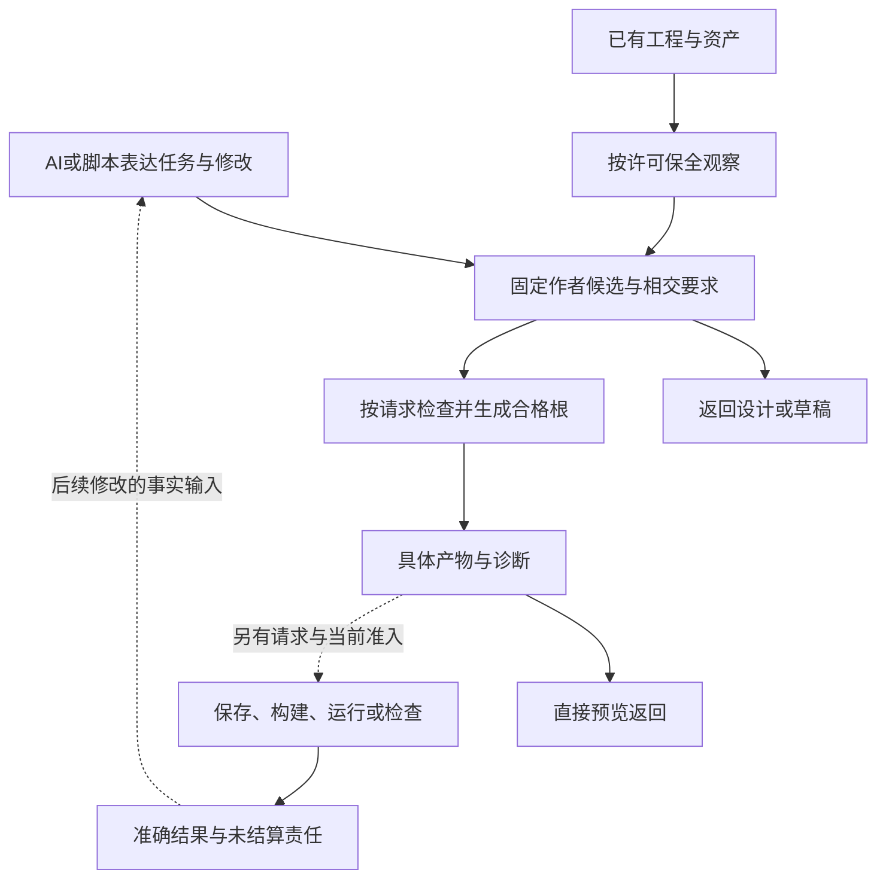

# 目标术语与质量属性

> **阅读范围**：采用范围内的设计规范；实现状态另查未决。

<details>
<summary>本页内容</summary>

- [简洁性的两个实际对象](#简洁性的两个实际对象)
- [语言支持与逆向能力的判定对象](#语言支持与逆向能力的判定对象)
- [原目标不变时的方案与优雅性判断](#原目标不变时的方案与优雅性判断)
- [作者源、产品规格与候选的准确含义](#作者源产品规格与候选的准确含义)
- [SEC 项目定位与系统范围](#sec-项目定位与系统范围)
- [工程目标、使用场景与成果类型](#工程目标使用场景与成果类型)
- [术语与命名](#术语与命名)
- [质量属性与工程场景](#质量属性与工程场景)
- [语言无关与表达自由的产品判据](#语言无关与表达自由的产品判据)
- [完整工程能力与最小作用范围](#完整工程能力与最小作用范围)
- [怎样裁决一个方案真正更好](#怎样裁决一个方案真正更好)
- [产品范围、作者形式与首个验证载荷](#产品范围作者形式与首个验证载荷)
- [意图、确定含义与自动实现不是三个强制作者层](#意图确定含义与自动实现不是三个强制作者层)
- [复用减少新增责任，短视图减少重复交互](#复用减少新增责任短视图减少重复交互)
- [广义工具范围与前端层次](#广义工具范围与前端层次)
- [合同代号与作者动作的明确区别](#合同代号与作者动作的明确区别)

</details>


## 简洁性的两个实际对象

作者面简洁包括**持久作者内容**和**当前操作成本**。默认采用无差额直接引用、普通函数值固定参数、可确定的类型/别名推导；已有显式约束不擅自删除，未确定语义不靠默认掩盖。完整机制由[语言合同](../领域/计算基础/紧凑表示与程序范式.md#compact-author-contract)拥有。

初次打开库仍须读取其真实合同，库维护者的工作不能隐藏。可使用同一成熟库的其他语言是公平基线；减少返回注解和一层调用壳，只证明这些重复可省，不单独证明SEC的语言或全工程成本占优。验收同时包含缺功能、类型歧义、批量变更、诊断、生成及后续回源，不能只展示一个两字段请求。

## 语言支持与逆向能力的判定对象

“支持一种语言”必须说明是原生读取、源码编辑、语义提升、目标生成、生态调用还是受管往返。原生维护任务先以TS的完整修改闭环评价其工程价值；新产品的作者成果以结构化需求到完整实现的接合评价。两者不互相代替，也不以语言名单长度评价。Java暂缓；C/Rust的角色由[路线](../演进/实施/主线前沿与准入.md#language-roadmap)决定，不属于同一个“最好语言”分数。

“强逆向”在本产品中首先是保原源、理解实际结构、正确修改和持续重生成；恢复历史原意是另外的推断问题。来源已保存时的维护能力不能借任意无来源恢复的困难被取消；仅有源码映射又不能被称为全功能回源。编辑类别、共享作用范围、原始信息和失败保全必须能实际观察。

## 原目标不变时的方案与优雅性判断

语言、框架、编译器与工作台是实现分类，不是质量等级。一次函数调用可能只是普通库，也可能在定义语义下被阶段化和特化；图可能是可编辑源，也可能只是投影；低层IR不能恢复已丢失的业务意图。术语不能替代实际输入、保持关系、产物与生命周期。

方案比较先固定单一作者源、支持域内独特算法、多目标含义、精确控制及全资产等相交硬目标，再判断剩余代价。只得到多语言调用而没有同一算法跨目标、只得到Wasm而未得到所需源码、只显示短摘要但维护量更大，都不能作为原目标已经满足。

优雅性按独立决定、重复权威、普通任务的操作长度、规则局部性、错误可定位性、目标与依赖成本和退出负担判断。不把这些不同量纲任意求和；低工作量也不能补偿硬目标失败。第一次创作、参数修改、非预装新算法、跨目标输出、失败修复和退出分别比较，框架基线可以使用同等成熟库及工具。

固定解释与上下文时，并非所有独特信息都能无损缩短。相同长度n的二进制结果有2^n种，长度小于n的二进制描述仅2^n−1个；一一可解码时不能都更短。该计数只排除无条件全域压缩，不否定通过共享库、已有上下文和明确委派缩短常见需求，更不授权删除原要求。

### 底层相似性与新增价值的验收

检查器里的绑定、类型、控制和目标代码与普通编译器相似，是它承担相同责任的结果；这本身不是产品优势。库调用短也不是SEC独有收益。以同库、同目标、同保证的成熟语言方案为基线，分别核对：本次新写的业务逻辑、重复转写上游算法、实际新适配、长期公共封装、工具自动派生内容和后续维护。相同数据不在不同表里重复计数，不用某个比值代替所有成本。

下面四个问题构成新增封装的具体验收：

1. 能直接使用的上游能力，是否被要求先补一份同义SEC源或转发函数？
2. 新项目只是改变参数或组合，是否因此增加平台原语、公共业务包或全目录检索？
3. 更换目标或运行布局，是否重复维护同一业务算法；差异是否真正必要且可定位？
4. 此任务只要求单目标、没有独立跨产物收益时，普通成熟库方案是否已经更小？

前三项有无必要新增就修供给或接口，不以示例足够通用抗辩。第四项成立时，可在真实任务授权下采用较小原生工程路径；不能一方面保留单源多目标要求，另一方面用只完成单目标的基线宣布全部等价。

生态实现会增长，SEC没有消灭所有未来算法的承诺。它应当减少重复创造、重复包装和重复维护，并让每个新定义落在已有可组合机制内。实际收益未知时准确保留；为了解释新功能写出的低层范本，不列为“需求开发已显著简化”的依据。

## 作者源、产品规格与候选的准确含义

本规范把口语中的“设计源码”收敛为**作者源**：开发者用SEC定义自己目标程序或工程的文本、结构化定义及其明确原生资产。当前产品意图主面选择结构化JSON模块，`.sec`仅是可选计算/实现文本前端；这项表示选择不替代用户的简洁与开放目标。它是产品交付以后AI实际创建、读取和修改的内容，不是SEC实现者维护的这套Markdown设计书，也不是后端已经生成的TS/Java文件。

同一份作者源可以只给类型和要求、尚无行为实现，也可以给出足以生成的函数或工程声明。这是内容的完成状态，不能因此说作者语言本身还没有选。设计书中的`.sec`围栏是未来作者形式的规范样例；只有真实工具处理过具体输入，才有对应候选、制品或运行证据。

| 对象 | 谁使用、保存什么 | 怎样改变 | 不由它证明什么 |
|---|---|---|---|
| SEC产品设计规范 | 本包保存语言、编译、工具和宿主的当前选定设计 | 规范修订、理由和相交消费者一起改变 | 存在软件实现或当前账户授权 |
| 作者源 | AI保存目标工程的独特定义、规则、算法和接受的选择 | 编辑实际源或有前像的差异 | 所需库/后端已实现、全部要求已满足 |
| 作者候选快照 | 一次具体编辑的不可变内容；一个候选也合法 | 新编辑产生新快照；选择关系可以指向它 | 需要另造多套程序比较、必须先审批才能预览 |
| 编译表示和计划 | 从源、任务和固定绑定派生 | 输入变化后重算或合格复用 | 第二份需要作者手工维护的源码 |
| 目标产物 | 精确生成出的代码、配置、映射和相应引用 | 从相应源重建；接管编辑权要显式处理 | 已检查、已写回、已运行或已部署 |
| 实现备选 | 在同一任务约束下比较的算法、提供者和目标安排 | 有范围的设计/绑定选择 | 普通每次编译都必须全局重新选择 |

“候选”必须带对象说话：**产品方案备选、作者内容快照、实现路线备选、待采用产物**不是同一个状态机。当前产品采用的结构化作者形式是本设计选定的实施基线；可选`.sec`只在相应计算或实现任务中适用。两者的成本与使用效果未验证，不等于每次任务都重新选择作者形式。后续改结构合同或可选文法必须明确解释、范围、理由和迁移，不能靠把所有东西永久称为候选来规避决策。

这里也不将作者源等同自然语言承诺。可以保存未形式化需求作为原始要求；确定构建消费已给出明确解释的部分。需求尚未确定时，服务指出相交选择；已经明确时，服务执行解析和生成，不让模型每轮重新猜测。

## SEC 项目定位与系统范围

### 项目身份与软件目标

SEC 是通用工程编译器。当前以AI/脚本为首期客户端组织工程意图、规则、逻辑、数据、约束、责任和实现选择；后续人类客户端采用同义协议；可检查的工程模型保存已采纳含义；编译器把能够确定推导的部分展开为实际目标工程。存量工程的精确接入、渐进重建和受控演进，与新工程创作共用这条主链。

SEC 是项目与软件系统的稳定名称。意图表达、原生源码、图形编辑、知识模型、验证与治理分别服务于下列目标；任何单项优化都需要评估对其他已接受能力的影响。

| 目标 | 可观察结果 | 不足以证明达成 |
|---|---|---|
| 高层工程创作 | AI能够表达任务语义、计算结构或事务规则，并控制真实实现条件；不重复维护可推导内容 | 自然语言完整、函数数量或持久服务数量不能单独证明任务完成 |
| 确定性工程实现 | 固定可解释的候选或已采纳模型、规则、绑定和目标可重建实际制品 | 输出接口空壳；每次构建仍临时猜关键行为 |
| 存量工程连续性 | 源字节、依赖和未知边界可保全；已支持区域可重建和演进 | 只收集文件名；拷贝 ZIP 就声称理解 |
| 多目标与往返 | 输出分别说明原生/混合依赖模式与完整/部分/阻塞完成程度；修改有来源对应与差分验证 | 生成新语言包装器却依赖隐藏旧运行时 |
| 工程安全与正确性 | 权限、并发、事务、资源、失败、恢复和验证按实际风险闭合 | 命令退出零；一次正向测试 |
| 可扩展与局部修改 | 新领域/后端/Provider主要通过稳定合同进入；改变相关依赖才失效 | 没有真实消费者的万能插件接口 |
| 生命周期收益 | 相同需求下减少重复决定、重复实现、重复验证和返工 | 代码行、文档数、模型调用数单独优化 |
| 设计积累 | 重要选择可追到依据、替代关系、保留约束与反例；修改有明确处置 | 文件备份或目录映射被当作语义综合 |

### 输入与产物

输入包括已采纳的工程模型、设计候选、现有工程观察、目标画像、可用能力和质量约束。输入方式包括 AI 工具调用、结构化 API、图形编辑、显式原生语言前端、中立语义文本和有权决定。没有一种序列化或作者界面天然拥有产品中心。

产物由本次输出决定：可以是一个计算函数、完整计算库、设备程序、编译器或应用。源码、配置、依赖、接口、数据模式、检查义务和可恢复变更只在有消费者时生成，不要求每份产物都带数据模式、发布或持久变更。解释、建议、诊断和证据是重要产物，但不能替代用户请求的实际工程制品。

### 明确不等同的状态

设计候选不等于已采纳定义；定义不等于已有实现；成功编译不等于写回完成；写回完成不等于通过验证；验证通过不等于在所有环境受到支持。每个状态必须以其实际对象、revision和证明范围表达。

不完整工程允许存在。仅当缺口进入所选输出或请求的保证闭包时才阻断该输出；无关模块不因为另一模块尚未设计就失去编译能力。完整输出不得以空函数、默认许可、空迁移或假测试填补必需缺口。

### 任务语义、业务规则与技术实现

“业务”在事务示例中特指审批、工单、账户与持久领域规则，不作为所有软件的泛称。本文通用表述使用**任务语义**：图像变换、压缩格式、编译器诊断、物理仿真和用户交互都有任务语义，但不因此需要业务实体、租户、Outbox或服务。

大程序不是按函数数划成无数业务。分解依据是独立变化、共享约束、数据结构、计算阶段、资源寿命与接口消费者；一次矩阵乘法和一个审批请求不是同一种Operation。计算本身的正确性、数值、复杂度、存储布局与调度，都是一级工程设计问题，不是补在“业务代码”后面的实现杂项。

三种状态必须分开：SEC管理候选与产物的开发状态、目标算法的缓冲/图/迭代状态、事务应用的持久领域状态。第一种不应被复制进每个目标元素，第二种不自动生成数据库，第三种才按相应事务合同处理。详细计算机制在[计算结构与算法实现设计](../领域/计算基础/计算结构与算法.md)。

SEC 开发仓库与用户目标工程是不同的工作区。用于开发 SEC 的 GitHub、CI、测试运行器和工作包是自托管画像，不定义用户工程的业务语义。为目标生成的数据库、框架、运行库也不进入 SEC 通用核心的默认加载图。

首个实现可以是单机工程工具；团队、远程执行、多租户和隔离网按对应用户与风险启用，但其兼容和扩展边界必须预先表达。未来义务必须有来源、触发条件、接受标准和退出条件；它保留设计选择权，不强迫今天部署全部设施。

### 中立全作者路径与分维度优劣

在已经声明支持的语义、库与目标范围内，允许整个应用由中立源创作，目标代码由工具生成；不要求固定比例的原生区域，也不以“成熟库内部是原生代码”将任务转交给作者。已有原生接入是迁移和互操作能力，不是中立表达完整性不足的永久补丁。

SEC的内部复杂度、作者必须作出的决定、模型实际上下文、编译时间、目标运行成本、生态维护和不可逆风险是不同维度。内部更多检查有可能减少错误，也可能只是增加负担；字符更短有可能减少输入，也可能增加含糊与搜索。比较应使用同等正确性、同样成熟库、同样后续变更及真实所需保证；不与刻意徒手展开的程序比较。

全工程“最优”没有脱离目标、支持范围、数据、负载与偏好的统一标量。当前以先满足硬语义与权利条件、再比较相关成本和可替换性作裁决。这个判断不免除继续寻找更好设计，也不将所有内部假设永久冻结。

### 产品目标与候选设计不能同时被优化器改写

设计比较先固定任务接受域、可观察结果、禁止项和已经委派的自由，再比较方案。一个候选能够编译、具有完整文档或更多静态保证，不自动说明它解决了用户原问题。把所有输入拒绝、只支持一个例子、删除错误难例、悄悄增加人工步骤，都可能改善局部指标，却未满足原目标。

质量排序不是无条件逐项最大化的全局字典序。语义与真实权利等硬条件是相应任务的底线；在底线之上，不要求先取得所有可能的证明、隔离和恢复设施，才开始优化当前任务的等待、易用性或成本。硬实时任务把截止期作为硬条件；离线纯函数没有因此引入数据库可用性指标。需要更强保证时明确接受其成本，而不是把当前“正确”暗改为“所有理论都要先证明”。

采用默认为：满足当前不可补偿要求，复用已有合法边界和成熟工具，选择具有明确失败出口的较小实现；只有当前任务有收益依据或必要性时才分层、特化或新增基础设施。决定的有效范围与反转条件保留。新需求或硬反例触及根边界时可以重构；仅出现一个局部更快候选不自动迁移全部工程。

比较覆盖创建定义、第一次生成、再次修改、错误定位、采用/运行与退出。完整费用按[组合预算](../编译/查询增量与性能.md#端到端预算的组合规则)计算，相同输出接口下仍检查格式转换、共享资源和后续成本。没有相关数据时报告条件选择，不制造“综合分最高即最优”。

### 作者负担不能以规范完备抵消

中立语义、多目标和开发者自由是产品目标；词法、纯函数式表面、显式字段和具体语法是实现手段。细网格函数可以说明可表达与可检查，但不能证明比采用同等类型、边界、数值与库的成熟语言更省工作。不得从“新语言已有文法”推导“作者应该迁移”，也不得从“由个人或小团队设计”推导“任何局部优势都不可能”。举证责任在新增机制一方。

结构有三种用途：内部结构帮助工具分析，源码结构帮助维护，任务结构帮助开发者只决定当前需要的事。模块、语法树或关系图存在，只能说明前两种有相应表示，不能自动证明第三种已经成立。若作者仍需同时处理原算法、额外类型转换、画像选择、重复合同和后端约束，则系统可能比对照增加负担。

对所选任务，先区分作者必须给出的独特含义、已有源能推导的内容、已委派的实现自由、真正未决定的产品选择。工具承担后两类中的合法解析与选择，但不得伪造缺失的事实或隐式改变风险。已有字段、签名、效果与关系不重复录入；真正独立的需求不会因实现可观察而被删除。需要审查的细节可展开，不要求常规任务重新决定所有内部策略。

正式采用一种作者形式，必须同时展示相同任务和保证的成熟语言/库基线，以及SEC的首次创作、下一次参数改变、一次非预装结构变化和故障修复。分别记录需要的新决定、需维护的独立事实、实际修改位置、必须读取的合同、诊断成本、构建/运行和迁移成本。定义制作、库开发和后端成本不能从总成本里消失，冷启动不能与已熟悉基线或暖缓存混比。没有真实数据时，只能裁决明显的重复与强制前置，不能给出总收益数字。

采用门槛不是每个示例都必须字符更少：更强保证可能合理增加说明；收益要绑定用户确实要求的保证。若满足相同要求时一种方案仅多了包装、同步点和新概念，又没有其他实质收益，它不应成为强制路径。若有多维权衡，明确当前任务选择而不是造任意总分。这个门槛不撤销零原生作者目标；对应中立作者面不合格时应修抽象和交互，不能把问题默认退给开发者写另一语言。

### 范式、表达规模和抽象收益分别验收

面向过程、函数式、面向对象和声明式是不同组织机制，不能按名字判高低。程序通过函数封装本来就可以获得抽象；函数式递归也可能暴露过多实现；一个声明式调用只在真实合同把实现自由留给工具时才减少作者决定。支持while不意味着所有任务都应当写循环；支持maxByKey也不意味着独特算法再不用代码。

完整语言、库词汇、目标描述符、项目公开接口和当前任务上下文分别记录。关键词数量有限不证明学习容易；库名不计为关键字也不使其含义零成本。不能通过把特殊机制改成普通函数或JSON键，在统计上得到“语法没增加”，却隐瞒新增的使用、错误和维护责任。

判断一个抽象是否达标，固定完整任务和同等成熟工具，比较作者必须作出的独立决定、需要持续维护的独立事实、一次变化涉及的位置、所需概念和交互，以及新库/编译方法的成本。行为、资源、目标生成与诊断也必须满足；不把不同量纲编成任意总分。

| 检查 | 合格方向 | 不合格反例 |
|---|---|---|
| 结果关系 | 已覆盖任务主要表达所需关系与独特参数 | 每次“每组取最大”都编写相交的嵌套扫描 |
| 实现自由 | 合同外的算法、缓冲和容器由工具合法选择 | 所谓高层表单仍要求填全部循环和临时结构 |
| 独立控制 | 真正影响结果的筛选、平局、范围显式或准确继承 | 用“智能选择”隐藏未决定行为 |
| 变化局部性 | 参数/组合变化只维护一个作者位置和真实消费者 | 参数在源、意图JSON、生成策略中同步三份 |
| 总体负担 | 计算库创建与维护、模型读取、失败修复和目标成本 | 只统计暖会话短句柄或第一次生成 |
| 反例与退出 | 普通算法仍可直接写，低效表面可以修正 | 为维护词数拒绝循环，或为维护DSL而禁用成熟库 |

在相同任务/保证下，若方案只是给原程序增加语法、描述符和同步，没有独立收益，就不应强制采用。多目标、资产联动可以构成额外价值，但必须作为单独维度证明；不能由它们自动抵消作者面明显多余的成本。高层主体与过程基线并存时明确谁是推荐调用面、谁是实施或自由定义见证，不能以基线可表达就关闭作者简化问题。

[SICP过程抽象](https://sicp.sourceacademy.org/chapters/1.1.8.html)说明函数本身可以隐藏实现；[数据抽象](https://sicp.sourceacademy.org/chapters/2.1.html)强调使用方只依赖所需数据性质。这些是对范式标签和表示泄漏的机制参照，不是本系统采用收益的证明。

### 设计取舍与反证

固定模板最便宜，但难覆盖独特业务与存量工程。纯 AI 直接改代码灵活，却难稳定保存已接受的工程关系。强制新 DSL 有可分析优势，也有生态和作者成本。本设计采用共享语义、多个入口与分层生成，代价是模型协议、映射和目标适配需要长期维护。

若真实任务证明建模成本长期超过避免的重复工作，相关领域应允许直接原生实现或更轻模板；若新目标必须修改全部核心算法，则扩展协议应被重设计。任何这些局部裁决都不自动改变 SEC 的完整产品追求。

## 工程目标、使用场景与成果类型

### SEC解决的工程问题

SEC把原本散落在需求、源码、配置、依赖、测试、运行事实和人员判断中的工程含义组织起来，支持AI与人设计、存量重建、确定性推导、目标生成、受控修改、验证、恢复和长期演进。源码是重要产物，但不是全部成果；档案、实验或模型表也不是产品目的。

### 不同“模型”不可混称

| 名称 | 谁产生 | 用途 | 不代表 |
|---|---|---|---|
| AI基础模型 | 模型提供方 | 理解、候选推理、编写、反例搜索 | SEC的规范、事实根或权限根 |
| 工程设计候选 | AI、人、规则或导入器 | 表达意图、行为、责任、数据、约束与待决选择 | 已经被项目接受或可以执行 |
| 已采纳工程模型 | 通过采纳协议的设计事务 | 成为解释、生成、变更和验证的确定输入 | 每个目标都已有实现；全部现实已知 |
| 编译中间表示 | 编译器按固定规则推导 | 服务特定分析、降低和制品生成 | 作者必须手工填写的全部表格 |
| 运行状态模型 | 目标系统观察/状态owner | 描述订单、任务、资源等实际状态 | 工程设计自动被运行事件重定义 |
| 手写试验模型 | 参考实验作者 | 检验某个接口/生成规则/事务机制 | AI已经能自主组织完整工程 |

能力报告分别说明设计候选生成、模型采纳、IR 推导和目标制品生成。手工试验输入的执行结果只能支持其已覆盖的机制，不能用作 AI 设计质量证据。

### 交付给设计者的内容

交付应首先使读者可以判断当前方案如何工作、为何如此选择、什么场景会失效、怎样扩展以及何时改变决定。图、接口、状态机、算法、失败、性能、恢复和权衡服务于这件事。

研发实验用于检验方案，原文用于追溯。它们不能挤占当前设计，更不能通过样例数量、归档容量或测试总数替代工程综合。另一方面，不能因为一个样例对用户没有直接使用价值，就取消SEC原本的代码生成能力或所有验证实践。

### 工程创作、存量演进与验证反馈



本图表示产品用例可选分支，不是用户必须完成的流水线。首期客户端为AI/脚本；候选无需先正式采纳即可在其合法范围生成，实际运行不由预览自动触发。
已有工程不能被迫重写后才接入；已明确模型不重新调用AI猜实现；需要设计的缺口不能由模板隐藏默认值填充。可复用库优先于重复生成大量实现；独特算法可在明确自由包络内创作并固定，然后进入相同验证与构建链。

### 工程综合的验收

每项重要选择都能回答：旧问题是什么、哪种机制解决、较简单替代为何不足、采用了哪些假设、代价由谁承担、最强反例是什么、需要哪种证据、什么条件导致局部修订或根迁移。没有这些信息的术语和目录不计作设计完成。

<a id="control-terms-precision"></a>
### 控制协议的术语和图示记号

以下术语用于阅读现行协议，具体数据联合和转换规则仍由原规范拥有；不新增公共API或运行时字段。图中的短符号只在该图声明的对象域内有效，不视为另一套全局标识。

| 术语 | 在本规范中的具体含义 | 必须区分的对象 |
|---|---|---|
| 状态所有者（state owner） | 有权串行化某个对象状态转换的实现责任方，可以是对象、模块或受信服务 | 组织负责人、资料作者、物理机器以及只有读取权的观察者 |
| 实例代（generation） | 同一逻辑键下的一次实际对象实例；比较时使用不可混淆的身份 | 内容修订、协议版本、重试编号、权限及外部操作身份 |
| 线性化点 | 一个并发操作对同一协调域呈现生效的确定点；图中由critical片段或明确比较更新标出 | 网络发出时刻、回调到达时刻、磁盘耐久点及跨服务全局事务 |
| 使用保护（pin） | 对已固定实例及其实际依赖持有的存活责任，直到最后相关使用结束 | 对旧代码执行效果的授权；安全撤销仍单独检查 |
| 排空（drain） | 关闭指定的新准入后，完成、取消或移交已经接纳的工作 | 无条件等待所有未来输入，或者立即释放所有对象 |
| 结算（settlement） | 将结果、资源、外部接受状态及后续恢复责任核实并分别归属 | 函数返回、请求超时、进程退出或只得到成功状态码 |
| 观察切面 | 明确对象、成员、版本或位置范围内取得的一次观察基础 | 任意来源的同时快照，以及其后一直有效的当前状态 |
| 依赖闭包 | 对指定边类型和起点按其传递规则求得的依赖集合 | 工作区全部文件、组织清单或无边类型的一张总图 |
| 支持判定 | 当前证据在其前提和覆盖范围内能否支持某项具体义务 | 命题必定真／假；依据不足不等于已找到反例 |
| 受影响范围 | 因准确输入、规则或支持变化而需要重新检查的消费者集合或健全上界 | 仅按同名、同目录或最近修改时间推测的范围 |

“已记录、已设计、已实现、已检查、已采用”必须带实际对象与范围；任何一项都不能直接替代后一项的证据。规范中的要求强度不由形容词决定：必须项说明承担主体、触发条件、动作和禁止后果；建议项说明取舍与允许偏离的条件。表示行为的箭头标明是数据传递、调用、状态转换还是静态依赖，不能以一条未说明的边兼指全部关系。

## 术语与命名

### 用词依据

“开源项目”描述协作、维护与分发方式；“软件系统”描述架构和行为；“软件产品”描述交付给使用者的能力及质量。开源与产品不是互斥分类。ISO/IEC 25010:2023 使用软件产品质量模型；Apache 的项目说明也区分项目社区与其发布的软件产品。这里只借鉴术语，不表示 SEC 获得任何组织认证。来源见[外部依据](../依据/来源/构建分发与迁移.md#构建内容分布式与迁移)。

SEC 的稳定名称是 **SEC**，描述为**通用工程编译器**。讨论上游协作时用“SEC 项目”，讨论组件、协议和运行时用“SEC 系统”，讨论面向使用者的能力、质量和支持时可以用“软件产品”。不因当前输入方式、后端、研究方法或审计主题而更名。

### 项目、工程与输出

| 术语 | 精确定义 | 排除的混淆 |
|---|---|---|
| SEC 项目 | 开发、维护和分发 SEC 的开源协作活动及其责任关系 | 用户目标工程的业务组织 |
| SEC 系统 | 工程表达、模型、编译、执行、验证和演进机制的组合 | 某份文档目录或某个后台进程 |
| SEC 开发仓库 | 实现 SEC 的源码、测试、设计和发布输入 | 用户导入的源码自动迁入的目录 |
| 用户目标工程 | 使用者希望分析、生成、修改或移植的工程及其依赖和资产 | 必须公开的上游贡献 |
| 工作区 | 具有明确内容层和写入边界的开发环境 | 项目身份、单一磁盘目录或 Git 提交 |
| 工程制品 | 编译、构建、迁移或发布输出的版本化结果 | 输出存在即表示已验证 |
| 发布 | 将精确制品向声明渠道提供的操作与状态 | Git 标签存在、测试通过或部署成功 |
| 部署 | 将精确制品绑定到具体运行环境 | 编译或源码导出 |
| 软件产品 | 向使用者提供的功能、质量、支持和交付能力的集合 | 商业付费、专有许可或企业管理平台的同义词 |

`ProductProfile` 等现有合同标识不因中文术语调整而全局改名。它描述目标能力、约束和支持选择，不是账单模型。若真实语义改变，按接口兼容流程迁移，而不是搜索替换字段。

### 模型、知识与含义

| 术语 | 定义 | 不能据此宣称 |
|---|---|---|
| AI 基础模型 | 提供理解、候选推理或编写能力的外部模型 | 拥有项目采纳或执行权 |
| 工程设计候选 | 尚未采纳的目标、逻辑、数据、约束或实现选择 | 已成为生效规范 |
| 已采纳工程模型 | 经采纳事务形成的当前工程含义 | 每个目标都已经有实现 |
| 观察 | 在指定输入范围、方法、环境和版本下取得的数据 | 不可观察部分不存在 |
| 断言 | 带来源和适用范围的命题 | 发布者身份能使其自动为真 |
| 需求 | 希望满足并可据以验收的结果或约束 | 已选定完整实现 |
| 中间表示（IR） | 服务特定分析或降低阶段的结构与语义 | 作者必须手写全部内部结构 |
| 源码方言 | 保留某种语言或领域独有含义的表示 | 已自动获得公共可移植语义 |
| 目标画像 | 目标语言、运行时、能力与约束的声明 | 当前宿主环境或临时 Provider 实例 |

“生成模型”不单独用于能力声明；分别说明候选生成、模型采纳、IR 推导或制品生成。“解析工程”区分字节捕获、语法解析、符号分析、语义提升和业务意图重建。

### 身份、状态与控制

| 术语 | 含义 |
|---|---|
| 身份（Identity） | 对象是谁；不由显示名或路径单独决定 |
| 修订（Revision） | 同一对象的一次明确内容或含义变化 |
| 代际（Generation） | 一组可共同解释或发布的修订集合 |
| 版本（Version） | 消费者用于区分兼容语法或协议的标识 |
| 纪元（Epoch） | 状态、执行或授权的一次代际标记；不是时间区间，也不替代持久模式版本 |
| 有效区间（Validity interval） | 在声明时钟与解释规则下的起止条件；与纪元、截止期限分别记录 |
| 前像（Preimage） | 计划或写入预期的原状态 |
| 权限授权（Grant） | 主体可对指定对象执行哪些操作的授权 |
| 能力供给（Provision） | 某实现可提供的能力及其条件 |
| 绑定（Binding） | 为某需求选定的精确实现闭包 |
| 资源分配（Allocation） | 当前执行的资源预算、租约或配额分配 |
| 副作用（Effect） | 超出纯计算返回值、需要管理的可观察状态改变 |
| 结算（Settlement） | 确认执行、子任务、资源与残留的实际状态 |
| 读回（Readback） | 从拥有实际状态的接口读取执行后事实 |
| 围栏（Fencing） | 由接收写入的一端拒绝过时执行者的机制 |

语义责任、代码维护责任、仓库权限和运行授权是不同关系。“owner”须按上下文译为定义责任方、状态写入方、资源管理方或代码维护者，不能用一个词代替所有权限。

### 证据与承诺

设计提出机制；实现提供可执行代码；测试提供特定输入下的观察；验证检查已定义声明；用户确认检查实际使用结果。某一项成立不自动推出其他项。

文中的“完整”须说明对象集合；“精确”须说明封闭范围；“原子”须说明观察者和提交点；“最小”须说明代价或偏序；“独立”须说明共同原因边界；“最优”须说明候选空间、目标和证明。缺少这些条件时改用可核验描述，不用形容词补证据。

### 命名兼容

术语表只解释语义，不批量迁移公开 API。文档标题变更保留链接映射；字段变更要有读写版本、迁移、错误和废弃策略。中文说明是当前维护源，标识符和协议字面量保留原文。

## 质量属性与工程场景

### 1. 优先级

SEC 的质量属性按以下约束顺序处理：

1. 语义正确性与数据完整性；
2. 权限、安全与隐私；
3. 可恢复性与可判定完成状态；
4. 确定性、可追踪和可验证；
5. 局部演进与可扩展；
6. 可操作性与可观测性；
7. 性能、成本与易用性。

硬约束不能由性能收益或用户偏好抵消。不同量纲不直接相加为伪精确总分；选择先过滤硬资格，再比较成本向量的非支配候选。

### 2. 关键质量场景

#### 2.1 局部变化

**刺激**：修改一个函数体，但其公开契约不变。  
**期望**：按已证明依赖重建相关事实、分析、目标片段和测试；内联、跨模块优化或反射读取函数体时也必须传播。精确范围外的独立结果保持，健全过近似允许额外失效。  
**验证**：干净编译与增量编译在声明标准下等价；失效闭包无漏边；额外失效量作为性能指标，不与健全性混为一条必需最小性证明。

#### 2.2 导出契约变化

**刺激**：修改一个被多个模块消费的公开类型。  
**期望**：反向可达消费者、实现绑定和验证义务失效；不相关领域保持有效。  
**验证**：依赖图和语言解析真实捕获类型级关系，不只依赖文本 import。

#### 2.3 信息缺失

**刺激**：构建配置不可读或某语言前端不支持一个构造。  
**期望**：产生有原因、有范围的 `Unknown`；继续执行不依赖缺口的安全工作；阻止受影响的肯定结论。  
**验证**：缺失不序列化为空集合，不以默认值静默填补。

#### 2.4 多文件变更中崩溃

**刺激**：第一文件提交后进程死亡。  
**期望**：依实际日志和读回判定已知提交范围，检测后继写者；能安全继续则恢复或前滚，仍无法判断则保留未结算责任并进入有权处置；不保证所有故障都能判定，也不谎报原子成功。  
**验证**：每个事务箭头前后故障注入。

#### 2.5 外部 Provider 超时

**刺激**：远端调用超时，但远端可能已执行。  
**期望**：进入 `UncertainCompletion`，通过幂等记录、回执或权威读回协调；不得直接重复效果。  
**验证**：模拟响应丢失、重复、乱序和迟到结果。

#### 2.6 新语言接入

**刺激**：增加 Java 前端。  
**期望**：若既有公共语义和扩展协议能承载该语言，则新增前端、画像、映射和符合性证据即可；不能承载的新语义允许受控核心演进，不能以“零修改”迫使丢失语言含义。  
**验证**：扩展边界检查与跨语言黄金向量。

#### 2.7 新后端接入

**刺激**：为同一已采纳工程语义或可移植程序表示增加 Rust 目标降低与后端。  
**期望**：从公共语义生成该目标自己的 `TargetProgramIR`，新增降低、源码映射和目标符合性；不重新决定业务意图，也不忽略目标特有表示差异。  
**验证**：跨后端行为声明、数据布局和错误模型符合性。

#### 2.8 编辑器覆盖层

**刺激**：分析基于未保存编辑器内容，写入目标却是磁盘。  
**期望**：检测 `WritableLayerDiverged`，要求保存、IDE 写回、重新规划或显式协调。  
**验证**：不能把基于缓冲区的计划直接写到旧磁盘前像。

#### 2.9 资源耗尽

**刺激**：磁盘接近满、内存压力升高、Provider 配额耗尽。  
**期望**：提前背压并保护有限的结算、恢复及必要审计预算；优先停止可延后工作。保留也耗尽或存储完全失败时，停止新作用并保留可取得的状态，明确报告无法完成记录/恢复的范围；不能承诺任意资源故障下仍不阻断恢复。  
**验证**：软阈值、硬阈值和恢复保留故障测试。

#### 2.10 供应链撤销

**刺激**：已采纳依赖被发现恶意。  
**期望**：阻止新绑定，撤销相关证据和制品资格，计算受影响闭包，替换或隔离，并清点历史派生物。  
**验证**：签名、来源、SBOM 和撤销传播演练。

### 3. 性能模型

性能目标必须绑定工作负载和硬件画像，不能凭空写固定数字。最低应测：

端到端墙钟时延为请求进入到完成读回的单调时钟差；并行或流水化阶段不能直接相加。若八个阶段严格串行、互不重叠且没有未计入等待，才有其耗时之和等于总时延。一般执行图按关键路径、排队时间、I/O 等待和协调开销分析；CPU 时间和墙钟时间分别报告。

```text
T_wall = terminal_monotonic_timestamp - accepted_monotonic_timestamp
CPU_work = sum(nonoverlapping_cpu_intervals_across_workers)
```

第一个式子单位为时间，两个时刻必须使用同一可比较计时域；第二个式子统计各工作线程不重复计数的 CPU 区间，不将子进程汇总与其线程区间再次相加。

同时测量：

- 冷启动与热增量；
- 文件数、符号数、关系数、候选数；
- 反向闭包大小；
- 内存当前值和峰值；
- 内容存储与缓存命中；
- 子进程与网络次数；
- 人工等待和批准延迟；
- 故障恢复时延。

性能优化不能改变身份、依赖、效果、权限和证据语义。

### 4. 可维护性场景

任何新增能力应回答：

- 新类型放在哪个领域模块；
- 是否改变内核代数；
- 是否需要新 IR variant；
- 哪些 pass 消费它；
- 哪些旧数据需要迁移；
- 哪些证据会陈旧；
- 哪些消费者需要切换；
- 何时可删除兼容层。

若每次新增语言、Provider 或业务规则都要修改中央 switch，则扩展模型失败。

### 5. 质量属性冲突

| 冲突 | 裁决原则 |
| --- | --- |
| 精确观测 vs 低延迟 | 允许分层观测，但覆盖不足必须显式；不得伪装完整 |
| 最小修改 vs 生成确定性 | 以语义保持和人工区域保护为硬约束，再优化变更规模 |
| 缓存复用 vs 权限隔离 | 语义输入进入键；租户隔离与实时读取/执行资格另验，无法证明可共享则不共享 |
| 自动化与实际准入 | 按真实政策选择预授权、当前核验及必要复核；高风险绑定准确对象、范围和条件，不以风险标签一律要求人工或一次性批准 |
| 通用 IR vs 语言特性 | 公共语义 + 受控特有扩展，不做最低公分母或万能节点 |
| 可回滚 vs 外部不可逆效果 | 明确补偿和前滚，不把补偿称为真实撤销 |
| 分布式吞吐 vs 一致性 | 按不变量选择协议，不因基础设施可用而默认分布式 |

## 语言无关与表达自由的产品判据

“语言无关”指公共工程含义和变化规则不以TS或其他目标为定义；不表示没有作者文法，也不表示任意现有语言都已经自动互译。“先支持TS”是实施顺序，不是将TS代码、类型或库变成所有工程必须采用的语义。

“能表达语义”有层次：要求描述可接受结果，定义体描述具体行为，绑定选择一种实现，执行证据描述真实发生。任一种普通语言的程序也有语义；问题不是是否叫代码，而是能否直接保存本工程的目标、约束和自由算法，避免被迫写成目标代码生成器，且更换目标不改这些含义。

简洁、准确与开放同时追求：常用内容用高层定义，独特逻辑可直接细化，确定部分无需重复填写。要求含糊时不把一个简短词当完整规格，准确部分也不强迫写冗余JSON。实际成本与保证范围分别比较，不能用关键字数量或包体积签发“完美”。

## 完整工程能力与最小作用范围

产品的“工程简化”至少要让一个被选能力贯穿作者、规则、真实提供者、目标、作用、失败与连续变更；一个纯函数或一个Schema通过不能代替这个出口。[事务应用画像](../领域/状态关系与流/事务与交付.md)是当前有界闭环：它允许零原生应用作者，仍要求真实目标能力；小函数保持独立，不强迫所有工程变成分布式系统。

整体最优以具体目标和约束裁决。优先取消重复作者源、隐藏业务决定和无消费者设施；保留真正的权限、数据一致性和恢复责任。原生＋成熟框架同样可用，性能与维护比较采用同等正确性；代码更短、关键词更少或文件更多都不是单独的产品成功判据。

声明式operation是业务定义，运行Operation是一次真实调用，开发工具Operation是工程修改过程；三者通过类型化引用接合，不用裸字符串混合。aggregate不是微服务，decision不是独立证明器，subscription不是已送达收据。

## 怎样裁决一个方案真正更好

比较对象是同一任务及其后续变化，不是某页规范、一次模型输出或一个微基准。先固定输入域、允许结果、必要保证、目标环境、现有成熟工具和工作完成边界，再提出候选设计。未经用户决定的业务差异不能作为“优化”混进比较。

### 比较流程

**先检查硬资格。**正确性、真实权限、必需恢复、数据保全和目标能力不满足的候选移出可采用集合，仍保留具体失败原因；不能用省token抵消数据丢失。

**再拆出真实成本。**作者需要的新决定和重复维护、实际模型输入输出与轮次、服务端解析/搜索/编译、目标构建、运行资源、诊断修复、兼容迁移分别记录。环境有明确价格/容量时可以形成相应同量纲费用，但不同主体的风险与时间不强行加成一个分数。

**选择当前默认。**没有实测时采用机制清楚、成本可界定、可逆且能完成当前任务的较小方案，并保存假设。已有支配关系可直接排除：同样保证下只新增重复源和无用服务的方案没有优先理由。其余非支配方案依用户已接受偏好选择，未接受差异则保留有限决定，而不是反复要求用户决定所有可推导参数。

**取得最能反转结论的证据。**先针对真实瓶颈设计比较，例如当前主要慢在全量重复解析，就测共享解析前后，而不是只测字符串拼接。比较正常首次任务、一次参数变化、一次非预装结构变化和一次错误修复，失败、超时和迁出成本不从分母删除。实验是否执行由任务授权决定，本设计任务只交付比较规格。

**按结果更新设计。**若某抽象只让第一次更长但显著减少持续同步，可在该范围保留；若长期成本仍高且无独立保证，就简化作者形式或减少所选建模范围。支持域内的中立全作者目标不因某个低效实现被取消，缺设计或缺后端要修其实际位置。

### 规格篇幅和产品开销各有正确目标

完整规则、类型推导、状态转换和异常处理可以占多页；这是设计者要交付的信息。日常AI任务只取得与当前变化相交的定义和诊断。减少文档字数不能作为提高产品速度的代理指标；也不能因为文档已经详尽，就宣称产品成本已经较低。

操作步骤和反例用于复核实现选择；采用收益由完整任务的实际对照判断。后续事实反驳某个默认时，修改对应规则及其消费者，保留成立的公共语义，不反复更换整个产品定位。

## 产品范围、作者形式与首个验证载荷

SEC的产品范围是语言无关的工程语义创作、分析、组合、实现选择、生成和受控持续演进。`.sec`是当前中立作者文本；函数、契约、高层声明和独立要求是不同含义，不由语句数量决定是否“有意图”。原任务只描述结果时保持实现自由；已有精确行为时直接编译；缺口可以由有边界的创作/选择闭合，不能每次构建重新猜测。

当前先以计算库承载一条低副作用路径，这是首个验证载荷，不是将产品重新定义为计算库。封装、包、真实消费者、再次修改与自用必须一同接合；后续事务、关系、状态、时间、资源、部署等仍由相交规范承担。技术设计继续完整覆盖这些层面，实施先后不删除产品目标。

范围决策分四层：长期产品目标、版本能力承诺、当前实现切片、验证案例。案例不能缩小上层要求，也不能把它未涉及的层面标记成已完成。计算载荷可证明某个编译和开发闭环，不能证明整个工程抽象全部可用；事务载荷同样不能成为所有程序的必经门槛。

架构完备的当前判据是每个承诺范围都有作者输入、正常/失败、真实依赖、实现和退出路径；最优的比较另以相同任务和成本为准。对任意未来要求永不大改没有无条件保证；具体可替换承诺由[根稳定协议](../架构/协作与状态边界.md#先稳定什么怎样限制返工)和[封装库](../作者/组合/模块封装与复用库.md)共同承担。

## 意图、确定含义与自动实现不是三个强制作者层

**意图是开发者希望成立的结果、关系和限制；语义是相应表达在固定解释下允许哪些行为。**同一份精确意图可以直接承担语义定义。生态成熟所要减少的是作者反复书写可共享的含义、低层实现和重复决定，不是让系统没有语义，或把尚未决定的行为隐藏到生成器中。

下面三种开发均为正常路径，不按贡献者永久分工：使用已有定义时只写实例差异；现有定义不够时用同一作者语言定义局部行为与组合；确有新基本含义时完成相应扩展的规则与后端。一个开发AI可以在同一任务中承担前两种；第三种只有在该任务确实授权扩展产品时进入。普通新业务不必修改SEC核心，库作者也不必把小函数命名为“大意图”。

### 成熟生态里还需要作者提供什么

| 情况 | 作者实际需要给的内容 | 系统负责的内容 | 不能从中推出什么 |
|---|---|---|---|
| 定义与项目约定已覆盖要求 | 调用对象、实例参数和本次真实差异 | 解析已绑定定义、继承缺省、类型/效果分析、选定实现与生成 | 每次必须重读库全部实现或手填派生关系 |
| 行为已有明确合同，但多个实现合格 | 可以完全不点名目标轮子；需要时增加硬要求或偏好 | 在授权候选内选择并固定实际Binding | 多个实现等于意图有歧义 |
| 新的业务差别尚未决定 | 写明或接受这一差别；允许委派时由AI作有依据的明确选择 | 展示最小区别、推荐、影响与缺项 | 一个未定输入自动等于false、零或任意最佳实践 |
| 存在独特算法或可复用结构 | 在同一.sec中写函数、类型或组合；必要时局部具体化 | 保持绑定、检查与后端责任；独特行为成为新的可复用定义 | 自由表达只能通过原生补洞，或每个新算法都须新增关键字 |
| 实际状态、权限、数据或设备未知 | 给可获得的真实来源，或接受明确条件设计 | 有权观察并按当前阶段使用 | 文本说“安全”“最快”“已授权”就得到现实事实 |

**精确不要求唯一机器程序。**固定观察范围的稳定排序可以由多个算法实现；这只是实现自由。反之，“让结果更好”而没有误差、排序、约束或已授权目标时，仍可能有会改变任务的含义未定。允许的行为集合可以有意保留选择，但需要由合同或委派明确谁有权选择。

单一作者源也不要求删除独立需求。用户请求、已有接口或接受的政策确实独立约束实现时，保留其实际来源与版本；若函数源本身已是唯一要求，则直接引用它，不复制一份Requirement文本。原始自然语言可以作为解释来历保留，确认后的具体语义由对应作者区域拥有；后续编辑不得让原始摘录和语义源各自成为竞争规则。

输出区分目标程序、配置、资源与实际执行。短源码只要求程序内容；完整发行才闭合所有必需成员；代码已生成不表示文件已采用，文件已采用不表示目标业务已执行。完整处理由[完成与缺省算法](../作者/组合/跨软件需求合同.md#11-意图进入同一作者源的完成与缺省算法)和[作者闭环](../开发/需求到交付主链.md#意图优先开发的实际闭环)规定。

### 生态成熟的判据不是模板数量

成熟生态至少要有可复用的精确定义、可扩展的组合与局部下探、实际目标实现、固定解释与版本、可用诊断及升级路径。新增未引用库不应扩大当前任务的模型输入或重建范围。用共享定义少写重复内容是收益；将工作移给另一个AI每次临时猜程序不是确定重建。对照须允许成熟语言使用相同等级的库与工具，比较完整冷暖任务和连续变化。当前未执行这种收益实验。

## 复用减少新增责任，短视图减少重复交互

当前质量目标分两项判定。**实现复用**衡量哪些成熟能力原样采用、Adapter承担什么差额、哪些既有证据真正覆盖而无需重做。**操作减负**衡量作者维护、冷启动、每次必要阅读、输入输出、修错和恢复的总成本。复用库多不等于产品已正确；工具参数短也不等于作者源已简洁。

“真实完成”应说明完成的是设计修改、工具实际运行还是目标工程实际采用。本设计包的修订可以是真实文档工作，但没有运行SEC就没有实际产品运行结论。条件已足够的设计应立即裁决，不以一切都待测试拖延；真正的耗时、可用性或已发生效果要由对应事实取得。

## 广义工具范围与前端层次

当前“计算项目”泛指具备输入、规则、处理和结果的软件项目，包括格式转换、校验、文件工具、UI、业务规则和复杂算法，不专指数值计算/HPC，也不等于无状态无I/O。任务规模、领域与作用性质正交；“业务”只是用户希望软件完成的实际目的，不自动意味着数据库事务。

“中立语义”规定程序含义；“作者前端”规定通过什么形式建立它；“SDK”可以是普通运行库、构造中立程序的前端，或目标代码生成器。这三类SDK不能互相冒充。当前`.sec`是可选中立计算文本前端，不是用户的独立产品目标或结构输入的前置；宿主SDK能够构造模型属于技术备选，当前不采用。精简一次任务的投影又是另一层，不产生第二份作者程序。

“设计收束”指当前责任、接口、决定和文档归属稳定，已解决的有限设计从待决退出，未来扩展与当前支持分清；不是把所有细节删成短文，也不是对一切未来要求作无条件最优保证。设计包大小、关键字数、问题父条目数与链接数都不能单独证明好坏，需检查新增独立信息和实际剩余工作。

## 合同代号与作者动作的明确区别

`sec.object/1`表示对象语义合同的第1兼容代，不是.object文件、对象版本或独立服务。`sec/object`表示导入模块，`sec.object-body/1`表示结构编码；规则内容和方法实现另有精确修订。它们的[完整解释与默认组合](../领域/计算基础/紧凑表示与程序范式.md#合同标识默认语言组合与按需能力)由语言章唯一维护。

统一的判据是作者源、模块/类型/效果、当前解释、变更和目标接合使用同一套规则；不是将所有状态改成一个容器。收束的判据是当前范围可从入口落实到数据、算法、错误、目标与验收设计；不是要求所有未来库完成，也不是给每个新词追加一个引擎。编码准入、本地可用、生产采用分别判断。

