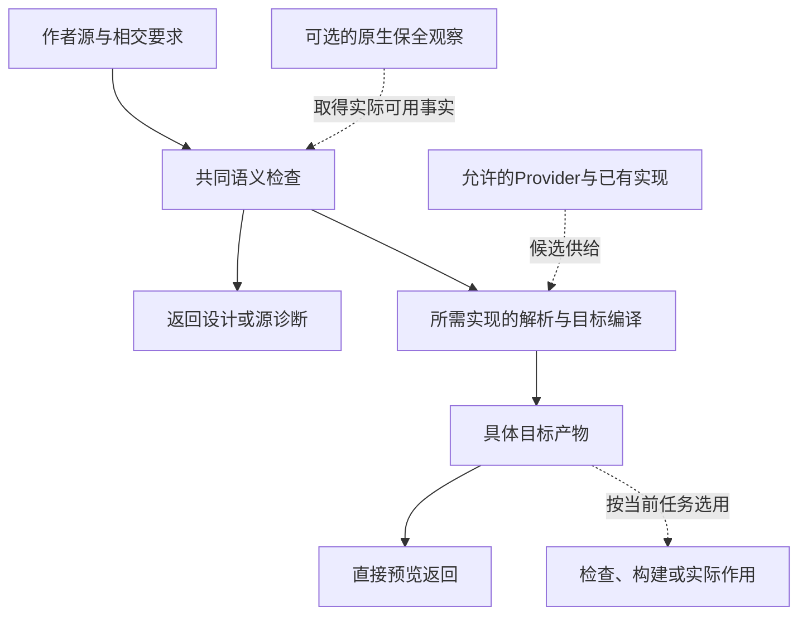

# 共享语义关系与能力

> **阅读范围**：采用范围内的设计规范；实现状态另查未决。

<details>
<summary>本页内容</summary>

- [图的角色、投影与消费合同](#图的角色投影与消费合同)
- [共同原因与独立性模型](#共同原因与独立性模型)
- [关系、约束、转换与固定点](#关系约束转换与固定点)
- [决策风险包络与信息价值](#决策风险包络与信息价值)
- [利益相关者、权利、风险与不可补偿约束](#利益相关者权利风险与不可补偿约束)
- [反馈控制、收敛、稳定与振荡](#反馈控制收敛稳定与振荡)
- [安全案例、危害与不可逆效应](#安全案例危害与不可逆效应)
- [对象存在必要性与删减演算](#对象存在必要性与删减演算)
- [能力依赖图与局部插入](#能力依赖图与局部插入)
- [规范元模型](#规范元模型)
- [负关系、冲突、替代与排斥](#负关系冲突替代与排斥)
- [错误、诊断、结果与可恢复性](#错误诊断结果与可恢复性)
- [组合边界摘要与义务闭合算法](#组合边界摘要与义务闭合算法)
- [领域边界证明与分区编译](#领域边界证明与分区编译)
- [不同控制与状态域不能按同名合并](#不同控制与状态域不能按同名合并)
- [管脚连接与共同组合规则的接合](#管脚连接与共同组合规则的接合)
- [组合算法如何取得领域实际含义](#组合算法如何取得领域实际含义)
- [层级状态组合的摘要与独立义务](#层级状态组合的摘要与独立义务)
- [关系边界摘要的具体消费者](#关系边界摘要的具体消费者)
- [计算程序的连接与边界](#计算程序的连接与边界)
- [实例、时间与导数的跨域边界](#实例时间与导数的跨域边界)
- [信息关系的类型及真实消费者](#信息关系的类型及真实消费者)

</details>


## 图的角色、投影与消费合同

“图”是关系的表示方式，不是一个默认的全系统数据库、执行器或作者格式。以下区分沿既有作者、查询、产物和运行对象形成，不增加新的GraphIR，也不要求每个表达式登记到永久图。一个需求若已经由短文本和确定调用完成，就不先制造完整图形操作。

| 图的角色 | 节点、边与当前依据 | 正确消费者与边界 |
|---|---|---|
| 作者管脚与结构 | 固定候选中的声明、表达式出现、参数/结果角色、区域和连接 | 结构编辑进入唯一作者源；数据边仍须保存条件激活、求值次数和作用域 |
| 静态语义与分析 | 类型、引用、效果、约束及已选域的关系 | 用该域算法求连接、影响或固定点；不是运行时每个值的永久记录 |
| 编译查询与动作 | 具体查询键、阶段结果、实际前置和共享等待 | 只调度就绪的编译工作；与源函数递归和目标并行不同 |
| 目标运行与资源 | 一次运行的激活、状态转移、事件、资源占有和完成 | 保持该运行的时序、错误与寿命；相同名称不复活旧激活或授权 |
| 依据与说明 | 声明、方法、实际结果、假设、来源与支持关系 | 检查相交论证，按政策复用；有来源不等于正确，有支撑边不等于独立 |
| 目标与工作编制 | 接受目标、必要义务、AND/OR、条件、前置和当前工作项 | 安排设计或实施；排程边不进入产品运行，不让优先级取消硬要求 |
| 文档插图与导航 | 规范对象的解释性投影，以及文件/章节的引用 | 帮助定位和理解；Mermaid箭头、锚点和画布坐标不签发执行、写入或保证 |

同一个对象可以出现在多幅图中，但它们以准确引用接合，不复制竞争的作者定义。不同图的边只有在明确的转换规则下才能组合。调用A使用B的数据、B引用某份权限说明、该说明链接一份部署文档，不能由跨图可达性推出A被允许部署。

### 边方向、组合和循环怎样确定

每一种实际关系由其拥有者规定端点种类、方向、顺序/基数、条件、传递及失效规则。`A RequiresSemantic B`以消费者指向前提；为调度生成“B结果就绪后A可运行”的前置边时，需要显式倒向和资格检查，不能只拿原箭头做拓扑排序。既有RelationType字段描述关系，不能凭一个`allowed`标签豁免混合图的作用域、时序或资源检查。

环的判断作用于**具体目的、关系集合、条件和输入代际下的投影**：模块互引收签名，分析环执行该偏序上的固定点；严格完成前置的循环返回相交冲突；运行中的等待环按实际占有和恢复协议处理。目标递归函数不在编译时无限展开。某个图可按DAG处理，不表示所有关系都是DAG；给出有向图也不意味着其算法能够终止。

多重边只有语义相同、计数无意义且无独立来源时才能折叠。两次调用不是一个调用的两条画线；一次不可变值的两处消费不是两次计算；事件的一对多还要规定广播、竞争或复制。纯数据依赖不够时，继续保留原激活区域、先后和资源合同，而不是把这些含义藏进布局。

### 局部图怎样生成而不丢失关键条件

先固定任务根、候选或观察代际、解释版本和允许披露范围，选择已有查询协议中的源/合同/影响视图。实际语义分析读取它所需的完整依赖，展示范围可以更小；不能反过来让画布显示预算决定分析正确性。

再按实际关系展开相交对象，必要的边界合同、错误、条件与待定保留。视图需要准确区分：本次请求范围内完整；预算或深度截止；尚未读取；不支持；以及允许披露的访问限制。精确不存在只能来自足够完整的实际范围。不能公开的对象，其数量、ID、摘要或“隐藏了N项”也不能因为图边界说明而泄露。

折叠节点后形成的摘要边必须标明它是组合路径或边界摘要，不能伪装为新的直接调用、授权或执行线。只有组合合同成立才说明传递保证；用户展开时按同一基础读取其支持路径。改变折叠、排序或坐标是展示变化；空间位置本身属于业务的图像/几何领域另按它的含义处理。

关系视图默认是只读派生。需要修改时，使用本次视图提供的精确端点或原文位置，经[共同编辑协议](组合/结构编辑与身份保持.md#管脚视图的端点激活与合法连接)构造新候选。结构模型本来就是该区域作者源时，修改该结构；文本是作者源时回写文本。不存在“图先改成功，源码以后再同步”的第二条写路径。

旧句柄、错误区域、未知映射或违反当前条件时保留原源，返回具体缺项。可合法保存的错误草稿仍按原草稿协议处理；图全部连通、无环或布局漂亮都不使它获得类型正确或可执行资格。新候选产生后旧视图继续说明旧基础，不在后台换成最新内容。

### 需要保存和不需要保存什么

临时图只保存当前查询和编辑需要的局部引用、结果及寿命。作者身份、真正的依赖和恢复责任在其原拥有者中保存；不为一幅图新增权威头、GraphStore或全工程日志。缓存键包含实际解释、输入与关系范围；单纯布局变化只影响展示。文档插图的维护由[图文一致性规则](../维护/图表与阅读派生.md#图表与正文的共同维护)承担，不是产品图的运行协议。

一个反例足以检验层次：源`if x == 0 then 0 else 10 / x`的数据可用性不能使除法提前；编译器却可以并行分析两个分支；文档可以只画正常路径，但不能由此说另一个分支不存在。三种图使用同一源，不承担同一种顺序。

## 共同原因与独立性模型

### 1. 多个结果不等于独立证据

多个 Agent、测试、审查者或 Provider 可能共享同一源码、模型、训练数据、提示、fixture、oracle、基础设施或错误假设。数量不能替代独立性。

### 2. IndependenceGraph

```text
IndependenceSubject =
  Producer | Model | Dataset | Prompt | Toolchain | Oracle
  | Fixture | Infrastructure | Organization | HumanDecision

IndependenceEdge =
  shares-source
  | shares-model
  | shares-oracle
  | shares-environment
  | shares-assumption
  | derives-from
  | financially-dependent-on
  | same-authority-root
```

### 3. Claim 级独立性

独立性不是全局布尔值。两项 Evidence 可以对一个 Claim 独立、对另一个 Claim 相关。例如不同语言实现可独立检验 lowering，但若共享同一错误规范，则不能独立验证产品目标。

```text
IndependenceAssessment = exact {
  claimRef,
  evidenceRefs,
  sharedCauseRefs,
  independenceDimensions,
  residualCommonCauseRisk,
  requiredMitigations
}
```

### 4. 组合规则

- 同一模型多次采样增加重复性，不自动增加独立性；
- 不同品牌但同底层模型不能算完全独立；
- 同一测试 oracle 驱动的两个实现无法发现 oracle 错误；
- 人工 reviewer 若只看 AI 摘要而不看对象，仍共享 AI 错误；
- 不同基础设施、不同实现、不同方法和不同权威根可以减少共同原因，但不能证明零相关。

### 5. 独立复核最低边界

独立review执行期间必须固定其被审候选、oracle、验证策略和所需授权条件；review不能在同一次结论里暗改对象或自签合并。人员/Agent之后可以在另一个有权作者任务中修正候选，但那会产生新基础并按政策重新审查。review输入绑定exact candidate，输出保留findings和覆盖范围。必要时引入异构方法：形式证明、参考实现、物理测试、用户验证和安全攻击，而不是增加同类 reviewer 数量。

### 6. 验证

- 三个同模型 Agent 一致；
- 两个不同实现共享错误测试；
- 两个 CI runner 共享损坏缓存；
- reviewer 与作者共享同一生成上下文；
-独立物理 readback 推翻所有软件层自报；
-共同原因被发现后，既有 aggregate 必须降级。

## 关系、约束、转换与固定点

### 1. 类型化关系

关系类型定义端点、方向、属性、传递性和失效语义：

```ts
interface RelationType<A extends string, B extends string> {
  readonly typeId: string;
  readonly fromKind: A;
  readonly toKind: B;
  readonly cardinality: 'one-one' | 'one-many' | 'many-one' | 'many-many';
  readonly acyclicity: 'required' | 'allowed' | 'fixed-point'; // 仅在该关系声明的目的与投影内解释
  readonly reverseInvalidation: InvalidationRule;
}
```

不能把以下关系都写成 `dependsOn: string[]`：

- 语义前置；
- 执行准入前置；
- 候选供给；
- 验证；
- 校准；
- 调用；
- 数据流；
- 所有权；
- 发布顺序；
- 迁移兼容。

不同关系具有不同成环和失效规则。

### 2. 约束含义、判定方法与决定权分开

`Constraint`描述当前要求允许什么，不按“用求解器、模型检查、监控还是人工复核”分类。证明和运行检查是可更换的方法；改变方法不能暗改原要求。检查计划沿现有`Assurance.plan`的`Obligations + CheckRequests`返回，实际结果进入`CheckRecord`；选择与处置权沿Task和接受关系处理，二者都不成为程序含义的互斥种类。已有持久编码按其固定合同读取，解释变化通过明确迁移进入，不因当前概念模型修订而静默重解释。

当前语义使用**有类型的域与投影＋谓词或关系＋适用范围**。叶约束引用现有精确语义方法：值／输入输出关系、结构关系、状态变化、允许轨迹、资源界、数值误差、分布或多运行之间的性质。上层通过`All/Any/When/ForEach/Exists`等内部逻辑构造组合；这些名称说明分析值，不是新增`.sec`关键字、用户必填的另一套JSON或世界需求种类清单。类型系统和领域方法定义叶节点参数、有效域、阶段、错误、可读取状态及来源。

其中`All`是共同满足，不是运行顺序；`Any`是允许的备选，不是都要执行；`When`的条件来自所选状态／输入／轨迹，不因一次运行未触发就永久删除其义务；量化域固定且有类型，空域有效也不自动满足任务的存在性或进展要求。有限可判定检查、带前提推导、形式证明、有限模型检查、运行监控和统计检查按真实声明另选；未知不是false，更不是不需要遵守。

例如“其他文件不得写”属于写入帧条件，“返回时其他文件内容相同”属于前后值关系，二者不等价；“不发布旧结果”属于安全性质，“输入稳定后最终发布当前结果”还需要进展及环境前提。具有相同字段或同一种数据类型，不足以决定这些区别。完整输入、作者形态、组合与实现接合由[跨软件意图合同](组合/跨软件需求合同.md#cross-software-intent-contract)拥有。

### 3. 硬约束与偏好

```text
Eligible(c) = all hard constraints satisfied
```

只有 `Eligible` 候选进入偏好比较。偏好可以按成本向量、风险、兼容、维护、性能和用户选择排序，但不能复活不合格候选。

### 4. 转换系统

```ts
interface TransitionSystem<S, E> {
  readonly stateDomain: StateDomainRef<S>;
  readonly initialPredicate: PredicateRef<S>;
  readonly terminalPredicate: PredicateRef<S>;
  readonly transitionRelation: TransitionRelationRef<S, E>;
  readonly invariants: readonly ConstraintRef[];
  readonly finiteEnumeration?: EnumerationEvidenceRef<S>;
}
```

状态域可以是有限枚举或有解释的结构化/无限域，有限模型检查才要求相应有界枚举及覆盖依据。纯状态转换只需其状态、输入、结果与失败语义；权限、revision、幂等与恢复只在涉及工程采纳或实际效果时实例化，不给每次纯函数求值创建Operation。

### 5. 三类环

#### 5.1 禁止环

- 规范 owner 相互定义；
- 权限签发者依赖被授权对象反向授权；
- 构建制品依赖自身未固定 revision。

#### 5.2 允许的结构环

- 递归类型；
- 模块互相引用；
- 领域对象双向关联。

它们通过稳定身份和分阶段解析处理，不意味着运行计算无限循环。

#### 5.3 固定点环

调用图、数据流、别名分析、影响传播和部分约束求解需要固定点：

```text
state_0 = bottom
state_{n+1} = F(state_n)
直到 state_{n+1} = state_n
```

必须定义：

- 状态空间和偏序；
- `F` 是否单调；
- 有限高度或 widening；
- 工作队列和增量调度；
- 收敛证据；
- 迭代、时间和内存上限；
- 未收敛时的 `Unknown` 或保守结果。

`bottom` 的含义取决于所选偏序：可能表示尚无知识、空可达集合或其他抽象元素，不能统一当成“现实不存在”。Unknown 在某些知识序中可以是 bottom，在保守 may 集合中也可能需要 top；初始化和 join 必须与实际抽象解释合同一致。

### 6. 影响固定点

```text
seed = changed subjects
while queue not empty:
  subject = pop(queue)
  for relation in reverseEdges(subject):
    if relation.invalidationRule applies:
      mark target stale
      enqueue target if newly stale
```

影响传播必须按关系类型执行，不能把所有边都当作相同传递依赖。

### 7. 冲突与不满足核心

只有可信判定方法已证明声明范围内不满足时，才返回可复核的不满足核心；该方法可以是求解器、有限穷举、规则检查或直接逻辑矛盾，不强制所有简单冲突调用SMT。超时、资源耗尽、工具错误、unsupported 与 unknown 不是 UNSAT。核心大小的最小化单独报告：子集极小不等于基数最小；未完成最小化时保留已证明核心及预算，不贴“最小”标签。

```text
UnsatCore = {
  constraints,
  provenance,
  affectedGoals,
  relaxablePreferences,
  nonRelaxableRequirements,
  possibleRepairs
}
```

对已证明冲突说明约束组合、修改权限与代价；对未知说明覆盖、预算、原因和已有见证。未能找到方案不能伪造冲突组合。

### 8. 验证

- 关系端点类型检查；
- 要求无环的投影做 SCC 检测；
- 固定点分析做收敛和差分测试；
- 删除任一依赖边的故障注入，验证漏失检测；
- 增加无关边，验证不会产生假失效；
- 非单调转换拒绝进入需要单调固定点的求解器；
- 约束核心通过独立求解或变形测试复核。

## 决策风险包络与信息价值

### 1. 风险不能被成本向量吞并

成本描述预期资源和维护负担，风险描述不确定情景中的损失、尾部事件、可检测性、可逆性和恢复时间。两者相关但不等价。

### 2. 风险对象

```text
DecisionRiskEnvelope = exact {
  candidateRef,
  scenarioRefs,
  consequenceDimensions,
  knownBounds,
  likelihoodModelRef | none,
  tailAndCatastrophicClasses,
  detectability,
  timeToHarm,
  containmentAndBlastRadius,
  reversibility,
  recoveryTimeAndResources,
  evidenceConfidence,
  modelUncertaintyRefs,
  unknownFrontierRefs,
  valueOfInformationRefs,
  riskPolicyRef
}
```

没有可校准概率模型时，`likelihoodModelRef` 为空，禁止制造精确概率。

### 3. 决策方法

根据证据选择：

| 情况 | 方法 |
|---|---|
| 完整概率和效用可用 | 期望效用并保留尾部约束 |
| 只有区间概率 | 区间支配、鲁棒优化 |
| 只有情景集合 | 情景支配、最坏界、minimax regret |
| 灾难损失不可接受 | 先作为 hard constraint 淘汰 |
| 关键未知可低成本减少 | 先执行信息获取实验 |
| 不可逆且证据弱 | 延迟提交、影子运行、灰度或人工升级 |

### 4. 信息价值

先判断信息能否改变行动、能否在不可逆点前取得，以及实验自身风险。没有统一效用尺度与可信概率模型时，保留“可能改变哪些候选排序、成本/时延/风险边界”的向量，不把风险、时间和资源直接相加。

只有同一效用单位、决策集合 A、未知状态 θ、可采集证据 Y、先验和似然模型均明确时，才可计算：

```text
EVSI = E_Y[max_{a∈A} E[U(a,θ) | Y]] − max_{a∈A} E[U(a,θ)]
NetValue = EVSI − CostUtility(experiment, delay, experiment-risk)
```

`U` 与 `CostUtility` 必须同单位；后者转换规则需要有权接受，且不重复计算已包含在 U 的损失。硬安全约束不因期望净值为正而放宽。没有这些前提时不填精确数字。

### 5. 风险聚合

不同主体、环境和时间尺度的风险不能简单求和。聚合必须保留：

- 不可补偿维度；
- 尾部类别；
- 共同原因；
- 相关性；
- 级联路径；
- 恢复资源竞争；
- 无法同时成立的情景；
- 证据质量。

### 6. 反例

- 平均延迟改善但极端请求触发内存耗尽；
- 失败概率低但后果是不可恢复数据损失；
- 每个服务风险可接受，但共享数据库使故障相关；
- 回滚可用的前提依赖同一故障平台；
- 安全控制减少攻击面，却让事故恢复无法进行；
- 灰度流量没有代表关键租户和峰值环境。

### 7. 完成条件

决策只有在硬约束通过、风险包络可审计、未知显式、信息获取策略合理且有权主体接受残余风险时，才可进入 binding。可逆动作记录反转/恢复；不可逆但合法且被接受的动作明确不可逆点、隔离/补救边界和授权，不虚构回滚。要求可恢复的硬合同仍不能被风险接受覆盖。

## 利益相关者、权利、风险与不可补偿约束

### 1. 为什么总成本不足

工程决策的获益者、付费者、风险承担者、数据主体、操作者和无发言权受影响者经常不是同一个主体。只优化总成本或平均收益，会掩盖集中伤害、权利侵犯和外部性。

### 2. 利益相关者模型

```text
Stakeholder = exact {
  stakeholderRef,
  roles,
  affectedOutcomeRefs,
  rightsAndObligationRefs,
  consentAndRepresentationRefs,
  benefitAndHarmDimensions,
  recourseAndAppealRefs,
  jurisdictionRefs,
  knowledgeState
}
```

角色不是永久身份。一个人可以同时是用户、数据主体、审批者和受影响第三方；每种关系有独立作用域。

### 3. 不可补偿约束

```text
NonCompensableConstraint =
  | PhysicalSafetyBoundary
  | IrreversibleDataLossBoundary
  | FundamentalRightBoundary
  | LegalProhibition
  | UnauthorizedPrivacyExposure
  | TrustRootIntegrityBoundary
  | ExplicitProductNonGoal
```

违反此类约束的候选直接淘汰，不能用速度、收入、用户数或多数偏好抵消。

### 4. 利益分布

```text
StakeholderImpact = exact {
  decisionCandidateRef,
  stakeholderRef,
  benefitVector,
  harmVector,
  concentration,
  reversibility,
  timeToImpact,
  detectability,
  consentStatus,
  recourseCapability,
  externalityRefs,
  unknownFrontierRefs
}
```

平均值只是一种 projection。决策还必须检查最坏受影响主体、集中度、不可逆性和是否存在补救。

### 5. 决策顺序

```text
可行性
→ 不可补偿约束
→ 权利、授权和法域
→ 风险包络
→ 利益分布
→ 生命周期成本 Pareto
→ 有权取舍
```

不得先算总分再用“惩罚项”表示法律或安全。

<a id="6-冲突和人工裁决"></a>

### 6. 冲突和有权裁决

相互冲突的合法权利或产品目标不能由技术系统偷偷决定。系统应输出：

- 冲突的准确主体和约束；
- 可行候选；
- 每个候选的伤害、受益、风险和不可逆点；
- 缺失信息和获取信息的成本；
- 有权决策者与必要的复核或申诉路径；
- 决策的有效期与反转条件。

### 7. 验证

至少覆盖：

- 总收益高但少数主体遭受不可逆伤害；
- 调用者有权使用系统但无权代表数据主体；
- 多数偏好与法律禁止冲突；
- 风险转嫁给外部团队或未来维护者；
- 删除或迁移使用户失去申诉和恢复；
- 同一主体角色变化导致授权过期。

## 反馈控制、收敛、稳定与振荡

### 1. 一次写入不等于持续收敛

控制器、调和器、自适应系统、缓存刷新和自动修复持续比较目标与当前状态。它们需要反馈稳定性模型，而不只是普通事务。

### 2. ControllerContract

```text
ControllerContract = exact {
  desiredStateRef,
  observedStateMethodRef,
  reconciliationFunctionRef,
  controlIntervalAndDelay,
  convergenceOrBoundedOscillationClaim,
  idempotencyAndMonotonicityRefs,
  hysteresisAndDebounce,
  rateAndResourceLimits,
  conflictResolution,
  staleObservationPolicy,
  partitionBehavior,
  safeAndDegradedStates,
  humanInterventionBoundary
}
```

### 3. 故障机制

- 反馈延迟造成过冲；
- 两个 controller 同时拥有同一 writer；
- desired state 自身由 observed state 错误反推；
- retry 和 autoscale 正反馈放大故障；
- stale cache 导致反复创建和删除；
- 控制器无法区分外部人工修改与漂移；
- 恢复动作被另一个 controller 立即撤销；
- 资源耗尽使控制循环饥饿。

### 4. 稳定性策略

按领域使用：单调收敛、固定点、hysteresis、deadband、rate limit、backoff、leader/fencing、single writer、priority 和 bounded retry。不能把所有控制器统一为“直到等于目标不断重试”。

### 5. 终态

持续系统通常没有永久 terminal，只能形成：

```text
converged-at-observation
stable-within-envelope
oscillating-within-bound
under-reconciliation
degraded
blocked
unsafe
```

所有状态绑定观察时间和环境。

### 6. 验证

- 观测延迟和乱序；
- 两个控制器竞争；
- 目标频繁变化；
- 部分分区；
- 资源上限；
- 手工 override；
- 反复失败的补偿；
- 控制器重启后恢复；
- 新旧 controller 版本并存。

## 安全案例、危害与不可逆效应

### 1. Safety 不等于 Security

Security 关注未授权主体和攻击；Safety 关注系统在正常、故障和误用状态下是否造成不可接受损失。一个没有攻击者的正确授权操作仍可能造成灾难。

### 2. 安全对象

```text
SafetyCase = exact {
  lossRefs,
  hazardRefs,
  unsafeControlActionRefs,
  causalScenarioRefs,
  safetyConstraintRefs,
  mitigationAndRuntimeMonitorRefs,
  verificationAndOperationalEvidenceRefs,
  residualRiskAcceptanceRef,
  changeAndInvalidationRefs
}
```

### 3. 不可逆效应

```text
IrreversibleEffect =
  data destruction
  | external publication
  | credential disclosure
  | financial transfer
  | physical actuation
  | legal notification
  | trust-root replacement
  | permanent user exclusion
```

不可逆并非绝对无法补救，而是不能在当前资源和时间窗内恢复到同等前态。它触发按风险选择的授权与控制审查。双重控制、模拟、备份、分批、监控和人工介入只有能控制该风险且代价可接受时启用；不是每个不可逆动作都机械叠加全部控制，也不能把备份当作恢复任何外部效果。

### 4. Unsafe Control Action

即使控制动作本身合法，也可能因以下条件危险：

- 不应发出时发出；
- 应发出时未发出；
- 时序、持续时间或顺序错误；
- 作用范围过大；
- 环境假设不成立；
- 反馈延迟导致过度控制；
- 恢复路径与主路径共因失败。

### 5. 运行时监控

无法静态证明不自动意味着可由运行监控保证。只有所需性质在现有观测下可监控，检测与反应能在危害窗口内完成，并且控制动作本身有效时，才生成相应 monitor、安全态、限流或人工接管义务。监控还需资源、独立失效和遗漏分析；不可观测或检测必然太迟的性质须缩小承诺、增强可用证据或阻断相关危险效果，不能用“将来监控”放行。

### 6. 验证

- 参数合法但 blast radius 超出预期；
- 软件在旧目标环境中安全，在新环境中溢出；
- 回滚脚本依赖已失效控制面；
- 双重批准来自同一被攻陷身份；
- 监控延迟使危害在告警前完成；
- 安全停机本身破坏不可丢失状态。

## 对象存在必要性与删减演算

### 1. 目的

工程系统会不断积累类型、服务、接口、字段、缓存、文档、兼容层和控制状态。SEC 应为对象给出可检验的必要性依据并安全删除不再必要的对象；没有全局最简形式证明时，不把工程裁决称为“已证明不可压缩”。

### 2. Disposition

```text
ObjectDisposition =
  required
  | derivable
  | duplicate-owner
  | dominated
  | migration-only
  | historical-only
  | orphan
  | conditional
  | optional
  | unknown
```

### 3. 删除反事实

必要性必须相对于已接受的结果、保证范围、资源预算与替代方案判断。逐项询问：删除或用更简单机制替换后，哪条已接受义务会失败？失败能否给出可复核见证？是否可由已有 owner 派生或承担？

`required` 绑定当前承诺、画像及已比较的可行替代：删除且不替换会破坏必需义务，才可以在这个范围标为必要。它不要求证明世界上不存在更简单实现，也不把当前必要固化为永久唯一。缓存带来一点速度优势、抽象对一种未来变化有利、或删除会使某个局部指标稍差，都不足以把对象提升为不可压缩核心。优化在已接受性能/资源约束确实需要时才是条件必要；未知负载下标为待测，不虚构 Pareto 证明。

相同事实/规则的竞争 owner 必须合并；相同主题的模型定义、执行协议、失败恢复和独立验证可以保留，因为其输入输出与失效条件不同。可由唯一源生成的索引和视图不得成为第二规则拥有者。

各项选择的成立条件、删除后果、更小替代与重新裁决条件融合在《设计理由》中，不另存一套要求用户维护的必要性账本。

### 4. 不允许的判断

- 零静态 import 就当 dead；
- 文件很旧、很大或位于 `.tmp` 就删除；
- 新实现存在就删除旧实现；
- 相似代码自动抽成 universal helper；
- 没有当前调用就删除低频恢复路径；
- Issue 关闭就删除证据；
- 无法解释就归入 orphan。

### 5. FutureObligation

未来能力只有在存在 owner、触发条件、必要性证据、验收、反转、预算和退役时才影响当前设计。未激活义务保留语义关系，不物化空运行结构。

### 6. 净删除

删除与替换先分类。纯派生缓存可以在确认可重建、无额外恢复责任后移除；同义文档移除后保留规则拥有者；未使用的空层可在核对真实消费者后直接删，不要求先制造新机制。

真正退役一项活跃实现时，检查本次范围内的旧消费者、旧写入口、兼容支持和恢复残留，并迁移其必要规范与验收。只有确实由新机制承担旧义务，才把新机制采纳作为前提。仍受支持的旧版本不要求全球清零；其责任必须由所选保留或兼容方案承担。增加facade后仍有双重规则、双写和旧负担，不算消除原复杂度。

删除低频恢复、合规或维护路径前仍需对应的保留判断，不能以静态import为零代替。细化条件见[文档编写与维护](../维护/组织修改与来源保全.md#修改删并与来源保全)及[兼容迁移与退役](../演进/兼容迁移与退役.md)。

## 能力依赖图与局部插入

### 1. 目的

通用工程编译器需要持续接入新语言、新后端、新 Provider、新验证器、新优化遍和新目标平台。扩展若依赖无类型的 `dependencies: string[]`，会把“需要”“供给”“校准”“验证”“交付顺序”混成一条边，最终形成假依赖、错误环和全局失效。

本文定义能力图的关系类型、解析规则和局部插入条件。

### 2. 能力对象

```ts
interface CapabilityDefinition {
  readonly capabilityId: CapabilityId;
  readonly kind: CapabilityKind;
  readonly semanticContract: ContractRef;
  readonly inputKinds: readonly TypeRef[];
  readonly outputKinds: readonly TypeRef[];
  readonly effectProfile: EffectSet;
  readonly resourceProfile: ResourceProfileRef;
  readonly compatibilityRange: CompatibilityRange;
  readonly owner: DomainModuleRef;
}
```

能力定义说明“可以提供什么语义”。具体实现、当前健康、授权、资源可用量和成熟度证据不进入该定义。签名中的 effectProfile/resourceProfile 描述语义需求，不是实时授权或资源余额。成熟度绑定具体 Provision、实现 revision、目标范围、评估政策和证据引用；只改变证据不必改变 CapabilityDefinition。

### 3. 关系类型

```ts
type CapabilityRelation =
  | RequiresSemantic
  | RequiresAdmission
  | SuppliesCandidate
  | ConsumesOutput
  | Validates
  | CalibratedBy
  | ConflictsWith
  | Supersedes
  | CompatibleWith
  | DeliveryAfter
  | OptionalEnhancement;
```

| 关系 | 含义 | 是否要求无环 | 是否传播失效 |
| --- | --- | --- | --- |
| `RequiresSemantic` | 解释本能力需要另一语义定义或已完成前提，边另标角色 | 严格完成前置须无环；声明互引可成组链接 | 按实际依赖 |
| `RequiresAdmission` | 执行时需要权限、资源或环境能力 | 声明可互相引用；实际等待必须另检占有、先后与进展 | 准入结果失效 |
| `SuppliesCandidate` | 为实现需求提供一个候选 | 否 | 仅影响候选闭包 |
| `ConsumesOutput` | 使用另一能力的产物 | 视产物图而定 | 按实际输入传播 |
| `Validates` | 为目标能力提供证据 | 可双向引用但不可相互自证 | 证据失效 |
| `CalibratedBy` | 用另一能力的结果校准参数或质量 | 可成反馈环 | 需固定点或分代 |
| `ConflictsWith` | 两能力在同一作用域不能同时活动 | 无方向 | 触发选择冲突 |
| `Supersedes` | 新能力替代旧能力 | 要求有向无环 | 迁移传播 |
| `CompatibleWith` | 给定生产者输出/写模式能被指定消费者读取或调用；方向和模式显式 | 有方向；共同部署不等于双向兼容 | 范围变化时重评 |
| `DeliveryAfter` | 工程排期建议 | 不进入语义依赖 | 不传播语义失效 |
| `OptionalEnhancement` | 提升质量但非硬前置 | 否 | 只影响相关优化 |

兼容记录绑定 producer、consumer、合同版本范围、方向、运行/读取模式和证据。A 能读取 B 不推出 B 能读取 A；两方共同部署需要另外证明共享资源和状态约束。不可把同一个无向“兼容”边用于滚动升级与数据回滚。

### 4. 能力图投影

系统不维护一张“所有边都相同”的 DAG，而是从同一类型化图生成不同投影：

```text
SemanticDeclarationGraph + StrictCompletionDAG
AdmissionRequirementGraph
CandidateSupplyGraph
VerificationGraph
MigrationGraph
DeliveryPlan
```

`RequiresSemantic` 边必须声明是可先收集签名的引用，还是必须先完成解释/初始化的严格前置。声明图先登记名字、显式签名与待补全头；按相交语言规则完成类型、主体/效果和公开接口后才发布可调用结果，递归需要的签名显式给出；实际初始化是否允许循环由语言合同决定。严格完成前置在压缩合法声明组后构成DAG；不能用“有环”直接拒绝互递归类型或函数。

单调分析环按固定点语义求值，非单调规则需另一明确求解合同。`Supersedes` 对特定版本替换方向保持无环；验证边可双向引用，却不能拿双方各自未获证的结论构成无种子自证。循环分类的共同条件见[能力解析](../演进/适用性与能力协商.md#有限闭包与能力解析算法)。

### 5. 局部插入

普通扩展若能由现有公共语义表达，新增能力 `C` 的预期修改范围是：

- `C` 自身定义；
- `C` 声明的关系；
- 直接消费或选择 `C` 的注册边；
- `C` 的符合性、权限、资源和迁移材料；
- 因新候选出现而真正需要重评的解析结果。

普通扩展不得要求修改所有既有能力的枚举、中央 `switch` 或手写总表。若新语义确实无法由公共接口保留，记录反例并演进核心及真实受影响消费者；局部插入是有前提的目标，不是禁止修正错误核心的铁律。

```text
Add(C)
→ Validate(C)
→ Compile typed edges
→ Check affected graph projections
→ Re-evaluate reverse-reachable bindings
→ Existing unrelated capabilities unchanged
```

### 6. 注册和发现

能力发现产生 `CapabilityObservation`，不能直接产生已采纳能力：

```text
Discovery
→ Observation
→ Contract parsing
→ Eligibility
→ Conformance evidence
→ Adoption decision
→ Provision
```

目录扫描、环境变量或 Provider 自报只证明“发现了候选”。它们不能绕过签名、兼容、权限、许可证、沙箱和验证。

### 7. 候选供给与目标画像

语言前端、编译后端、存量实现和 Provider 都可以供给候选，但不能反向拥有目标语义：

```text
TargetProfile + ImplementationRequirement
→ CandidateClosure
← Built-in / Existing / Brownfield / Provider / Synthesized
```

目标画像可以在没有某个 Provider 的情况下定义；Provider 的符合性则需要相应目标契约。这避免“先有 Provider 才能定义目标”和“先有目标才能验证 Provider”的假循环。

### 8. 能力成熟度

能力定义不承载统一成熟度阶梯。针对精确 Provision/实现 revision/画像，分别记录合同是否已知、符合性与影子/现场证据、适用资格；运行健康、信任撤销和生命周期另作正交状态。

一次健康降级不删除历史符合性证据；撤销可以直接发生而不先“降级”；某 revision 退役不代表同一能力的新 revision 退役。采用 [系统成熟度与现实边界](../状态/前沿与登记规则.md) 的证据轴与降级规则，只物化真实消费者需要的视图。

### 9. 能力选择

选择过程：

1. 根据需求和目标画像计算可达候选闭包；
2. 应用 `RequiresSemantic` 和兼容关系；
3. 应用硬资格、权限和环境限制；
4. 排除冲突组合；
5. 对剩余组合比较成本向量；
6. 生成带解释的解析决定；
7. 记录未选择候选及淘汰原因。

排期关系和流行度不能使不合格候选获胜。

### 10. 能力组合

复合能力使用现有members、inputWiring、boundaryContracts、combinedEffects、combinedResources和compositionClaims关联成员、连接与派生结果。字段是内部关系视图，不是作者必须再填写的同义模型。成员保证只有经过下文的[边界闭合](#组合边界摘要与义务闭合算法)才可能成为组合保证。

类型/协议、错误和取消、重试幂等、权限、共享资源、隐私及恢复在实际相交处逐项验证。一个纯函数不建立空恢复合同，一个持久变更也不能只用函数形状替代原子义务。未使用的成员不会进入当前输出；实际初始化、动态发现与共享状态继续属于真实依赖。

### 11. 反向失效

| 变化 | 应失效对象 |
| --- | --- |
| 能力语义契约变化 | 语义依赖者、相关候选和绑定 |
| Provider 实现 revision 变化 | 使用该实现的绑定、执行和证据 |
| 成熟度降级 | 超出新适用范围的绑定 |
| 新增候选 | 仅在策略要求重新择优时重评相关需求 |
| 删除候选 | 使用者和需要它的候选闭包 |
| 排期变化 | 不使语义或验证结果陈旧 |
| 验证器变化 | 其签发的证据与资格 |
| 兼容范围变化 | 受影响的组合 |

新增候选是否使既有合法绑定陈旧由解析策略决定。`stable-until-invalid` 策略不因更优候选出现自动切换；`continuously-optimize` 策略可重评，但必须受迁移成本和风险约束。

### 能力关系投影



箭头有明确角色：实线为本例的内容产生/消费，虚线标注可选来源或按需动作。它不是所有请求都先观测、再生成、再发布的阶段链，也不把提供者供给关系当成授权关系。
实际活动集合由本次输出根和条件选择；领域义务、作用准入、候选供给与执行先后不能从这幅投影互相推导。

### 12. 图算法

按本次问题选择实际算法，不建立每个请求必须执行的图分析清单：

| 当前问题 | 具体算法与结束结果 |
|---|---|
| 连接或解释一条已使用关系 | 核端点、方向、基数、条件与可见性；拒绝具体非法连接 |
| 有模块互引或严格前置 | 分别对该投影求SCC；签名互引按分阶段规则解，严格等待有环按实际协议处理 |
| 实现尚有选择 | 沿真实候选与版本约束形成有限问题，执行本章和实现搜索章的合格选择 |
| 取得固定点分析 | 使用该域的偏序、传播函数和预算；未收敛准确保留范围 |
| 输入或规则改变 | 只按各关系失效方向和实际条件传播，不遍历所有种类的边 |
| 真实迁移或退役 | 对相交消费者求迁移可达与残余责任；普通编译不执行迁移分析 |
| 解释缺能力 | 给实际缺口与依赖；只有完成对应最小化才称最小缺失集 |

先有正确全量算法。真实规模与变化负载需要时增加分片索引、增量SCC或其他策略；对照只证明实际比较的输入和范围，不用抽样通过宣称全域一致。

### 13. 故障场景

- 两个能力互相声明 `RequiresSemantic`；
- 旧能力与新能力相互 `Supersedes`；
- Provider 自报支持但符合性证据只覆盖子集；
- 适配器吞掉取消，导致组合后孤儿进程；
- 一个新候选使全系统所有绑定无条件陈旧；
- 排期边误入语义 DAG；
- 验证器同时依赖并验证同一实现而无独立性；
- 能力被撤销但缓存注册表仍返回可用。

### 14. 验收条件

- 每种关系有独立语义、成环和失效规则；
- 既有扩展语义可以承载的能力可局部注册；新根语义须通过版本化核心演进；
- 无中央枚举要求修改所有消费者；
- 候选供给不拥有目标语义；
- 组合具有边界声明和组合证据；
- 增量图结果与全量图一致；
- 新增无关能力不改变既有结果；
- 撤销在真实端点生效，退役在明确范围内处理消费者、历史解释和恢复义务；
- 所有解析决定都能解释使用了哪些关系和证据。

### 候选实现与资格接入

能力定义和实现资格仍分开：解析器输出所选Provider、依赖解释、资格Claim引用及未解缺口，不因名字/Schema匹配直接授予执行。[工程情境组合与能力协商](../演进/适用性与能力协商.md#工程情境组合与能力协商)规定精确版本和效果集合协商；[证据缺口驱动的设计与取证闭环](../运行/保证/要求证据与裁决.md#证据缺口驱动的设计与取证闭环)规定资格证据如何生产和失效。

有限参考解析器按显式绑定或唯一最高策略rank选择一个候选，再闭合依赖；依赖失败时返回未解决并允许重编候选计划，不证明所有替代均失败。生产选择器可在预算内对替代候选回溯，保留访问集、已证实冲突和未搜索集合；不能用注册顺序消除多解。

## 规范元模型

### 核心范围

核心给工程实体、引用、修订、来源、类型化关系、诊断和变更提供共同协议，不预先枚举世界名词。程序语义仍由 SEC 语言、原生方言和领域扩展定义。

`Subject/Statement/Relation/Constraint/Transition` 可以作为规范与知识的建模工具，但不要求每个表达式都包装成五类治理对象；编译器的表达式、语句、类型与符号应有适合遍历和类型检查的具体结构。

### 三种状态不混用

已接受程序定义有一个明确生效版本；观察可以多来源且冲突；AI 推断和搜索候选可并存。联邦知识模型可以容纳第三方规范冲突，但不能让一次普通构建的同一函数同时拥有互不相容的函数体。

### 共享合同

共同基础包括稳定引用、内容身份、语义修订、可达依赖、来源映射、问题定位、支持状态和演进关系。运行凭证、租约、进程号、临时路径和模型会话不进入程序语义身份。

语法合法、类型合法、目标可降低、测试通过与行为证明是不同状态。注册一个扩展只说明编译器认识其语义，不赋予任何源码写入或事实签发权。

### 理由与反证

过小核心会让各模块重做引用和错误协议；过大核心会使新增语言必须改中央枚举。准入新核心概念要说明公共不变量、真实消费者、扩展为何不足和删除后果。多个独立消费者是避免过拟合的强证据，不是机械数量门槛；首个消费者暴露不可绕过的核心安全或身份缺陷也必须修根。仅属局部领域、可由组合定义或原生实现表达的内容不因名字重要进入核心。

若新增语言必须改通用 pass 的品牌分支，核心不够可扩展；若一个简单函数必须实例化社会选择与风险对象，核心过度抽象。

### 对象层与实现层的收敛约束

公共元模型定义稳定引用与组合边界，不自动将每个AST节点、分析临时值或普通函数参数升为工程实体。仅在编辑、独立消费者、影响、证据或迁移确有需求的粒度提升；其余采用紧凑结构和共享引用。派生视图只读，不能为方便查询复制出第二个可写定义源。权威、观察、派生、控制四类角色见[统一架构](../架构/协作与状态边界.md)，详细表示清单由[中间表示族](../编译/表示/表示族与跨层保持.md#中间表示族与按输出阶段提升)维护。

## 负关系、冲突、替代与排斥

### 1. 正向关系不足

只有 `requires`、`provides` 和 `contains` 无法表达真实工程中的互斥、冲突、替代、废弃和不可共存。把所有负关系藏在自由文本中，会导致 selector、resolver 和 migration 各自重复推断。

### 2. 关系族

```text
NegativeOrEvolutionRelation =
  | ConflictsWith
  | MutuallyExclusiveWith
  | IncompatibleWith
  | ForbiddenBy
  | Replaces
  | Supersedes
  | DeprecatedBy
  | Retires
  | Invalidates
  | Shadows
```

每种 relation 必须定义方向、对称性、传递性、作用域、revision、证据和失效语义。

### 3. 关键区别

| 关系 | 含义 | 不能推导 |
|---|---|---|
| ConflictsWith | 两个候选在同一组合中违反资源、权限、路径或语义约束 | 任一候选本身错误 |
| MutuallyExclusiveWith | 产品或策略只允许选择一个 | 永久全局互斥 |
| IncompatibleWith | 给定版本/画像下接口或语义不能共同成立 | 无迁移可能 |
| ForbiddenBy | 被不可补偿约束直接禁止 | 只是低优先级 |
| Replaces | 新对象承担旧对象职责，需迁移和消费者切换 | 旧对象已退役 |
| Supersedes | 新决定覆盖旧决定的适用范围 | 物理实现已删除 |
| DeprecatedBy | 仍可使用但不再首选并有退出计划 | 已无支持 |
| Retires | 完成消费者和残留清零 | 新路径只是存在 |
| Invalidates | 某结果因输入或规则变化不再有效 | 结果曾经错误 |
| Shadows | 新机制只读对照旧机制 | 已取得写权或发布权 |

### 4. 组合规则

关系带来源、采纳状态、版本、组合范围及具体约束。外部声明先作为候选，只有有权政策或真实约束支持时才影响正式选择；不能因为某插件声称与另一插件冲突就禁用对方。已接受的 `A requires B` 与同范围 `A conflictsWith B` 同时存在时是模型冲突，不能暗选一条。`Replaces`与`Retires`之间按实际状态、支持范围与恢复义务选择迁移/切换/拒绝路线；需要运行状态机时明确阶段，不把纯定义替换强制变成影子部署。consumer-zero仅在已声明封闭集合内成立，安全撤销可先限制旧入口。详见[兼容迁移](../演进/兼容迁移与退役.md#兼容迁移切换与退役)。

### 5. 局部性

新增负关系只使其端点、组合候选和反向依赖者 stale。不能给全局能力目录增加一个版本号后全部重算，除非 relation policy 本身是全局共同输入。

### 6. 验证

- 已采纳的对称冲突即使只记录一条边，也应阻止不合法的共同选择；不阻止双方各自合法使用，更不能让未经验证的第三方声明禁用既有能力；
- 版本范围变化只影响匹配范围；
- replacement 未完成迁移时旧消费者仍合法可见；
- deprecated 不能被误投影为 retired；
- shadow 结果不能授权切换；
- unknown compatibility 不能解释为兼容。

## 错误、诊断、结果与可恢复性

### 1. 设计原则

错误是协议和状态机的一部分，不是随意文本。任何跨模块、跨进程或持久边界都返回结构化结果。

### 2. 结果类型

```ts
type Outcome<T> =
  | { kind: 'ok'; value: T; evidence?: readonly EvidenceRef[] }
  | { kind: 'rejected'; errors: readonly FailureError[] }
  | { kind: 'partial'; value: T; gaps: readonly KnowledgeGap[] }
  | { kind: 'uncertain'; state: UncertainState; recovery: RecoveryRef };
```

`partial` 只用于明确允许部分结果的操作，且缺口范围必须可见。持久效果不能用 `partial` 掩盖不确定提交。

### 3. 错误分类

```text
InvalidInput
NotFound
Conflict
Unauthorized
Forbidden
Unsupported
Ambiguous
IncompleteObservation
UnsatisfiedConstraint
ResourceExhausted
DeadlineExceeded
Cancelled
DependencyUnavailable
ExecutionFailed
VerificationFailed
UncertainCompletion
DataCorruption
InternalInvariantViolation
```

每个错误定义：

- 稳定错误码；
- 所属领域和 owner；
- 用户可见消息键；
- 结构化详情 schema；
- 是否可重试；
- 是否可能已产生效果；
- 允许的恢复动作；
- 敏感字段和脱敏；
- 兼容与废弃策略。

### 4. 诊断模型

```ts
interface Diagnostic {
  readonly code: string;
  readonly severity: 'info' | 'warning' | 'error' | 'fatal';
  readonly messageKey: string;
  readonly primaryLocation?: SourceLocation;
  readonly relatedLocations: readonly SourceLocation[];
  readonly subjectRefs: readonly SubjectRef[];
  readonly causeRefs: readonly DiagnosticRef[];
  readonly explainGraph?: ExplainGraphRef;
  readonly possibleRepairs: readonly RepairCandidateRef[];
}
```

人类语言文本由 `messageKey + locale` 派生；错误码和结构化字段不翻译。

### 5. 完成状态与错误分离

```text
ExecutionCompletion =
  NotStarted
| Running
| EffectMayHaveOccurred
| ConfirmedSucceeded
| ConfirmedFailed
| Uncertain
| Recovering
| Settled
```

“超时”“取消”“连接断开”描述调用者观察，不直接说明效果完成状态。

### 6. 异常边界

语言内部异常只允许在单一实现模块内短暂存在。跨公共边界前必须归一化为 `Outcome`。禁止：

- 让客户端解析异常文本；
- 把所有错误映射为 `InternalError`；
- 丢失 Provider 原始回执；
- 把未知转为 false；
- 把不支持转为空结果；
- 仅凭退出码判断持久效果。

### 7. 因果链

错误包装保留：

```text
RootCauseObservation
→ AdapterDiagnostic
→ DomainError
→ ApplicationOperationResult
→ LocalizedPresentation
```

每层可以增加上下文，但不能删除完成状态、可重试性和敏感边界。

### 8. 修复候选

诊断可以包含可执行修复候选，但候选不是自动授权：

```text
RepairCandidate = {
  targetProblem,
  proposedDelta,
  assumptions,
  requiredAuthority,
  effects,
  risk,
  verificationPlan
}
```

选择后仍进入正常编译、计划、准入和验证链。

### 9. 验证

- 所有 public operation 枚举每类结果；
- 未处理 union variant 产生编译失败；
- Provider 错误映射做黄金向量和故障测试；
- 敏感字段脱敏做负向测试；
- 取消、超时、响应丢失和进程死亡分别测试；
- 错误 schema 向后兼容；
- 本地化文本变化不改变错误身份；
- 恢复器只消费结构化状态，不解析日志。

## 组合边界摘要与义务闭合算法

本节负责“局部已满足，接起来还是否成立”。它消费已有Definition、Requirement、Relation、ImplementationBinding与Claim，不创建平行合同数据库。默认是在单进程查询中按需派生摘要，完整类型/算法正文仍只有一个拥有者。域特有的解释由显式版本的接口提供；普通新函数不增加编译器业务分支，也不让AI手填全部摘要。

### 投影哪些实际信息

`BoundaryView`是这里对现有数据的内部视图名，不是新作者构造。一个投影绑定subject和revision、被消费的使用方式、解释画像与依赖。以下信息只在相交时出现，缺失与不适用有不同含义。

| 信息 | 准确含义与来源 | 消费者怎样使用 |
|---|---|---|
| 输入域与外部假设 | 类型、数值/形状/单位范围、前置、读取许可、阶段和环境假设 | 判断上游和环境能否提供；不能只匹配类型名字 |
| 保证与结果分支 | 对正常结果、业务失败、异常、取消、部分状态分别说明关系 | 只把已获得相应依据的结论传向后续；失败分支不借用成功后置 |
| 保持与观察范围 | 不变输入、状态拥有者、可见顺序、身份、错误与隐私 | 检查共享状态和变换不能改变哪些观察 |
| 作用与寿命 | 调用时机、外部能力、实例、借用、并发完成和释放条件 | 保证消费者使用期间实际对象仍然有效，状态不被无权共享 |
| 表示与连接 | 源/目标类型、布局、设备位置、编码、版本和转换 | 明确哪些是逻辑等价、哪些需真实适配，转换不是免费边 |
| 资源与质量 | 有来源和量纲的时间、内存、数值误差、风险或吞吐合同 | 由对应组合规则处理，不统一相加或取最大 |
| 证据与未决 | 方法、假设、覆盖、当前资格、具体开放义务 | 不把供应者自己的声明或证据名称直接升级为全系统通过 |

声明的合同与已验证保证分别保存。首次可由源码、库规范和明确要求投影，再以当前支持的直接规则、分析或外部方法取得结论；没有证据不会抹掉合同，也不会让合同自动成立。原生不透明组件可以用受支持的外部合同参加组合，缺项精确落在未知的行为维度，而不是无条件相信名字。

### C0至C6的有限闭合过程

**C0 固定检查问题。**取得任务的要求修订、当前候选、所选输出、调用方式、目标及检查预算。设计预览和实际执行是不同问题；必要条件和后置观察按阶段区分。没有输入域资料时标出具体域未知，不凭几条案例构造全输入域。

**C1 取得接口投影。**从当前输出根沿真实调用、值、状态和契约依赖提取所需信息，读取结果及其依赖一起发布。已知库直接解析，不经过AI能力搜索。缺解释接口时保留内容并返回该方法不支持；其他可用方法和独立输出仍可继续。

**C2 生成连接义务。**每条实际连接先检查参数/返回位置、名义身份和编码，再检查输入域、错误流、效果、持有期、共享不变量及允许的调度。插入一个转换会生成一个有自身前置、作用、结果和成本的适配候选，不能默默收窄输入或扩大权限。只消费数值的端不必取得全部上游审计信息；受任务要求约束的来源或隐私则仍需保留。

**C3 按真实条件求解。**无环的保证依赖按拓扑顺序处理；对每个前提寻找可追溯的上游条件保证、固定输入事实或准确环境见证；政策只确定接受条件和所需保证，不把声明变成物理事实。逐项得到满足、违反或未知。直接范围/类型关系可以由普通分析解决，只有需要更强推理时才调用相应方法。运行检查只能闭合确实可观测且在危险作用前能检查的条件；如果原任务承诺该输入成功，新增一个拒绝它的guard不能算完成任务。

**C4 联合检查反馈与共享。**调用递归、类型递归、固定点、计算循环和外部等待不是同一类环。单调静态分析可以按其已定最小不动点处理；有状态反馈的安全合同应提供初态与共同不变量，检查初态和一步保持；要求进展时另检查变元、公平性或相应时间模型。模块化递归推理采用有根据的规则并检查其前提，不能要求所有合法递归都必须无环，也不能凭互相引用两条尚未成立的Claim闭合。无法模块化证明的有限区域可以联合作为一个检查单元；仍未知就保留开放义务，不改写为不适用。

**C5 组合整体预算和效果。**按实际调度、资源别名、同提交域、时间及数值模型汇总。消费者的错误放大、暂存输入、异步在途缓冲和协议转换都进入组合；只有声明上限且有依据的成本才用于证明硬预算。具体数值与资源代数由[端到端预算](../编译/查询增量与性能.md#端到端预算的组合规则)拥有。

**C6 发布本次结论。**返回已闭合的要求、反例和对应连接、开放假设、适用输入/环境、方法与依赖。源码结构可生成不等于整个任务成立；设计有条件可行不等于取得运行许可。旧结果仍留在旧输入版本下，当前变化只更新相交结论。预算耗尽必须说明哪项仍未处理、已完成到哪一层以及更小继续问题，不反复返回无内容的“待验证”。

C1的投影和C3—C6的支持工作表共同遵守[义务身份与消解](../编译/组合前提与进展闭合.md#obligation-identity-discharge)及[领域摘要传递](../编译/组合前提与进展闭合.md#domain-summary-contract)：同节点可复用计算，但不同条件、见证、出口、单位和保证的义务分别判定；后来变强时重新入队。无种子循环、有根据归纳、正常进展和共享预算继续由该篇细化。它消费本节的唯一BoundaryView，不要求作者填写第二套合同或证明图；运行检查、公开宿主进口和内部实现缺项分别处理。

### 顺序组合的可检验条件

设A在输入x、其外部假设成立时正常返回y，并保证关系`G_A(x,y)`；B只有满足`P_B(y)`才承诺正常工作。要从任务入口集合D内复用这项正常保证，需证明对于真实到达连接的x、y：`x∈D ∧ P_A(x) ∧ G_A(x,y) ⇒ P_B(y)`，并分别闭合A所需环境。这里的式子只处理正常结果；错误、未返回和外部作用沿各自分支处理，不能从蕴含推出总终止。

若连接有转换H，使用H实际产生的z及其关系代替y，不省略H的定义域、精度与执行成本。若A的合同太弱，即使实际程序可能满足B，也只能得到“当前依据不足”；可以精化A摘要、检查实际组合或提供运行验证，不强迫重写A的公共接口。

在任务已经要求饱和输出的例子中，`0≤x≤255`经过`x+16`得到`16≤y≤271`，不能直接提供给只接受0至255的编码器。可以把合法的饱和步骤纳入作者定义或经接受的推导。若任务从未决定饱和还是拒绝，则将这项差异交给有权选择，而不是自动补Clamp。仅因两端类型都是Int不能闭合；仅增加`x≤239`的前置，也不能满足原任务全部输入。

### 契约替换与演进

新提供者要替代旧提供者，先固定实际使用域和被观察的保证。它须接受使用域内原来承诺的输入，保持消费方依赖的结果/错误/效果/寿命；隐私和权限需要不能超出原许可。一个局部使用者从未传入某些值，可以按该使用域取得局部替换资格，而不宣称公开API全域兼容。

记录字段一样、二进制ABI相同、一次样例相同，都不是这项保证的替代品。算法实现或证明方法改变时，只撤销它真正影响的资格；没有变化的输入和内容仍可复用。新需求从两个旧独立区域之间增加关系时，先合并新图中的受影响闭包，再重算分区和比较，不能只重算任一旧分量。

### 实现、规模与反向验收

基础实现采用工作表、实际反向依赖和每个使用点的稀疏摘要。一个简单函数可能只有一项类型连接；不把整个表存入每个表达式。前提检查结果可按内容、域、解释和方法复用，去除或更换依赖时按已定删除算法失效。用于外部独立保证的记录按实际需要持久化，普通中间摘要留在内存或可重建缓存。

至少检查：全都拒绝是否错误通过；上游域比下游宽；两个成功后置彼此提供前提却没有初态；取消时仍有借用；两个合法组件合起来超过内存；转换新增远程传输；完整输出被静默截断；实际限定使用域使本来不兼容的提供者成为合法局部替换。正常可连接输入也要完成，不能用越来越保守的拒绝代替能力。

[AGREE](https://loonwerks.com/tools/agree.html)展示以组件假设和保证进行组合推理的实际工具机制；它处理特定模型，不证明SEC全部领域可以靠同一算法解决。[MLIR接口](https://mlir.llvm.org/docs/Interfaces/)说明通用分析可消费显式接口而不在核心枚举每个操作；接口存在也不自动认证实现语义。SEC的域规则与可信边界由本规范另行承担。

## 领域边界证明与分区编译

### 1. Domain 不是目录

Domain 是围绕实际独立责任、共同约束、数据/计算结构与演进边界划分的语义范围。纯计算域可以没有持久状态、账户或事务；只有实际存在的state、failure、authority和公开交互参加划分。文件夹、包、进程、团队、文档主题和技术栈是观察输入或实现映射，不能代替语义依据。

### 2. 硬约束

```text
DomainPartitionHardValid(P) =
  every accepted definition has one unambiguous write protocol within its context
  and observations/assertions retain their distinct sources and conflict-resolution scope
  and every cross-domain indivisible invariant has a qualified common commit or coordination mechanism
  and every cross-domain interaction uses a stable public contract
  and no domain reads another domain private state or journal
  and authority, tenant, consistency and privacy boundaries are preserved
  and every domain has non-empty responsibility and task-appropriate acceptance conditions
```

### 3. Must-cohere 与 Must-separate

`must-cohere` 首先约束不变量的原子执行/一致性边界，不直接等同语义 Domain、源码包或进程必须合并。同一线性化点、私有状态、原子迁移和失败代数可以产生共同协调义务；若所选共享事务、协调协议或已验证分解能满足义务，则可保留语义分域。只有替代协调无法满足已接受合同，才把语义合并作为必需候选。

`must-separate` 来自：独立 authority root、隐私/租户隔离、不同一致性模型、不同支持生命周期、不可共享 trust boundary 和明确产品边界。

### 4. 分区算法

一般 hypergraph partition 可能是 NP-hard，不能宣称无限规模全局最优。可执行流程：

```text
验证输入与 owner coverage
→ 根据所选原子执行/协调模型处理 must-cohere 超边；不可分部分才收缩
→ 加入 must-separate 约束
→ 分解独立连通分量
→ 在既有公开边界或有实际消费者的新边界提案处产生候选cut
→ 检查新增边界的输入/输出、保持、协调、迁移与适配代价
→ 对未来约束和边界状态可比较者作约束传播与合格剪枝
→ 对有界歧义区使用 branch-and-bound / ILP / SAT
→ 组合 Pareto 前沿
→ 全局重新验证
→ 返回选定分区或 bounded frontier
```

### 5. 成本维度

候选通过硬约束后，比较：协议与翻译、失败映射、授权边界、延迟、协调、认知、发布耦合、迁移、恢复、blast radius 和未来义务。每一维保留单位、来源和不确定性，不直接相加。

### 6. DomainBoundaryProof

```text
DomainBoundaryProof = exact {
  domainRef,
  semanticCarrierRefs,
  ownerAndInvariantRefs,
  stateFailureAuthorityRefs,
  publicOperationAndContractRefs,
  mustCohereAndMustSeparateWitnessRefs,
  competingPartitionRefs,
  objectiveVectorRefs,
  selectedDecisionRef,
  reversalPredicateRefs,
  inputDependencyClaimRef
}
```

### 7. 局部演进

新增或删除关系先更新图与真实读域；一条新关系可能连接两个旧分量，受影响范围按新图及旧消费者的并集确定，再重算相交分区。新增Provider、路径、文档或实现模块本身不自动重划Domain；新共享不变量、信任/寿命边界、实际消费者或有证据的共变/成本条件才触发相应重评。分区候选的最优性资格和已有内容是否有效分别失效。

### 8. 验证

- 同文件中两个独立领域不能因共址合并；
- 不同文件的同一事务责任不能因路径分开；
- 多租户私有状态不能通过共享缓存破坏边界；
- 一个现实对象在两个 bounded context 中具有不同语义时，使用两个 context-scoped Subject 加 translation；
- 预算耗尽返回未探前沿；任务只要求可行且政策允许时，可以采用已经过完整硬资格检查的方案，同时声明有界搜索范围；要求最优证明时不能用启发式结果代替。

## 不同控制与状态域不能按同名合并

语义身份使声明可以跨变更引用；它不要求每个目标数据元素都持久化。计算中的值依赖、循环携带、缓冲别名、同步关系与布局分别按其合同解释；业务实体关系、事务读写和消息因果关系也分别解释。它们可进入共同的类型化关系框架，但“有箭头”不允许同一种遍历/调度算法解释全部边。

一个大程序按真实消费者、不变量、数据结构、计算阶段和生命周期划分。边界需要细化时可以分层，但不把每个函数强制升格Domain或每个采样升格Operation。模块分区与实际事务/同步/部署域允许不同，不要求一对一。当前计算机制的唯一详细规则见[计算结构](../领域/计算基础/计算结构与算法.md)。

## 管脚连接与共同组合规则的接合

[管脚合同](组合/定义与接口.md#控制逻辑能力管脚与库绑定)是本章BoundaryView的一种任务投影，不建立第二套类型或保证摘要。端点类型、激活、基数与区域检查通过以后，仍按C0—C6闭合实际值域、作用、寿命及共享不变量；连接的几何走向没有额外语义。

以一个结果向两个消费者连接为例：生产者若在同一次激活中已返回普通不可变值，可以引用同一值；若作者复制的是调用定义，则需要保留两次激活；若连接是流，则由广播或竞争消费合同解释。没有明确分发合同不默认推断。资源类型还须满足拥有/借用和最后使用条件。这些差异进入消费者的真实依赖；不以“同一根边”合并效果。

结构与文本入口均在既定区域语义下产生该关系。相同连接若一个入口视为函数参数、另一个视为异步发送，属于前端解释冲突，不能通过取较低保证掩盖。不同目标保持的是已接受的行为，不要求画面位置、源行号和目标函数个数一一对应。

## 组合算法如何取得领域实际含义

C0—C6不从所有节点的字符串标签推测含义。它向本次固定EngineImage的方法请求当前使用点的BoundaryView；方法必须返回真实输入域、正常/失败保证、效果/寿命和实际依赖。没有合格摘要时可以采用已声明的保守合同、将有限相交区域联合作检查，或保留未知；不能为通过连接自动缩窄原任务输入。

领域产生自己的计划，公共组合器只承担真实跨域边界、版本、公共符号与产物归属。网格领域给访问和数值，事务领域给共同提交与交付，状态领域给激活和转移；核心不把它们统一成相同“边执行一次”的算法。多个独立计划都声称输出同一路径时，必须选定生产者或真实组合器，同字节本身不消除所有权冲突。方法调用和汇合字段见[共同协议](../编译/内核/领域方法与整体根.md#领域方法的共同调用协议)。

## 层级状态组合的摘要与独立义务

状态模型对外提供的BoundaryView至少区分：模型版本、允许输入及其来源、稳定配置与上下文不变量、所需输出/活动能力、终止与预算策略，以及相交错误。纯advance的返回保证是逻辑状态与计划，不是所有计划已经执行。依赖它的调用方不能仅因函数效果为空就消去未来作用义务。

静态组合先检查树的单父、compound唯一初态、parallel区域、合法多目标、历史与回调类型；微步工作配置允许过渡性不完整，Stable边界才要求全配置合法。两个正交区没有相交退出集合，不证明它们对C的更新交换，也不证明活动可共享一个设备或文件。实际运行可接受范围需要完整摘要，缺方法时保留具体输出缺项。图只具有有限节点，不能证明任意C与事件队列的可达空间有限；模型检查范围单独声明。

## 关系边界摘要的具体消费者

[关系合同](../领域/状态关系与流/关系查询与维护.md)为BoundaryView提供输入模式、重数/键、None层次、顺序、回调定义域、源切面和披露范围。`Bag<Int>`不能因元素类型相同当作`List<Int>`；SQL外键不能越过当前行安全域证明存在性；反连接需要对应右侧范围完整。

组合器先核上游实际保证，再为转换建立自己的义务。例如不可信原生行解码完成后才取得有限值资格；聚合后的count不自动成为可公开数据；仅有各源快照只能保证版本向量，不签同一全局时点。循环关系的有限可达性由明确节点域和最小结果解释，删除后不能让循环引用自行保留事实。

这些摘要由实际调用点派生。无关系任务不生成行身份或查询计划；共同结构也不抹掉查询内的错误、顺序与状态语义。

## 计算程序的连接与边界

计算边界至少区分值/批次/流/资源句柄，以及控制激活与数据就绪。两个模块数据类型相同仍需核顺序、重复、单位、形状、错误、拥有权、位置和生命周期。记录这些已声明且相交的维度，不要求每个局部算术填同样一张表。

C0—C6使用原BoundaryView组合。控制密集程序的分支不被提前，迭代模块带初态和停止，数组模块可保留索引/访问域，外部解码器与设备方法带真实作用。一个共享类型化框架不等于共享一张全DAG执行图，也不意味着数据在两台设备之间免费传递。

图分析、布局和场景是可独立变化的定义，但其结果必须属于同一图基础；同样的节点ID不允许把旧组号贴给新图。迭代优化中“停止”必须说明收敛、达到目标、预算、取消或数值失败。前者不能由后者冒充。全系统先采用正确、可替换的组合，再按真实预算优化，而不是每次连接都强制最优规划或数据库事务。

## 实例、时间与导数的跨域边界

组合摘要按实际消费保留：对象的引用/可变性/构造阶段与方法槽；流的数据出现、顺序、需求、时间域和完成条件；AD的输入空间、导数种类、数值政策与残余寿命。不把它们全部归为普通纯函数结果，也不要求未使用能力的程序携带全部摘要。

对象值若供可重算求导使用，需要在原请求域内取得明确不可变输入；流旧任务迟到不能更新新对象会话；反向计算取消后仍在设备访问的缓冲不能供后继流重用。相交合同不能满足时回到真实生产者与消费者，不能用一个“数据已经准备”节点抹掉寿命和时间。

完整机制分别见[对象](../领域/对象与控制/对象构造与分派.md)、[流](../领域/状态关系与流/背压与事件时间.md)、[微分](../领域/数值/自动微分与线性化.md)；此处只拥有连接条件。


<a id="information-relation-consumer"></a>
## 信息关系的类型及真实消费者

跨域信息边采用[关系类型与推导边界](../信息/对象关系与配置基线.md#3-关系不是一类万能dependson)。本章的关系机制继续负责命名域、组合和有限能力；机器抽取的普通提及不得伪装成imports、mustPrecede、supports或authorizes。反向边可派生，不能手工独立维护相反结论。

影响分析、调度、证据和GC使用各自确切边集合及覆盖。如果适配器未识别某关系且该边可能影响所要求的完整保证，返回对应能力缺项或保守相交闭包；只读展示未知边可以继续，不因保全一种新关系自动接受其执行语义。
