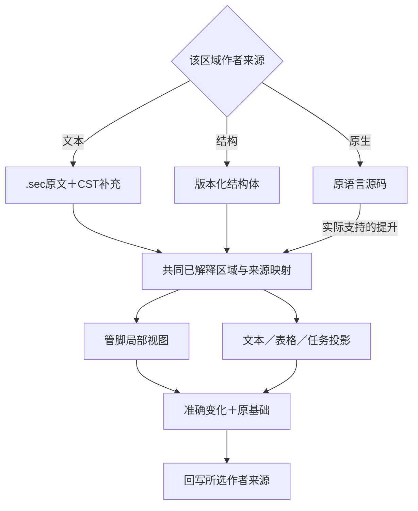
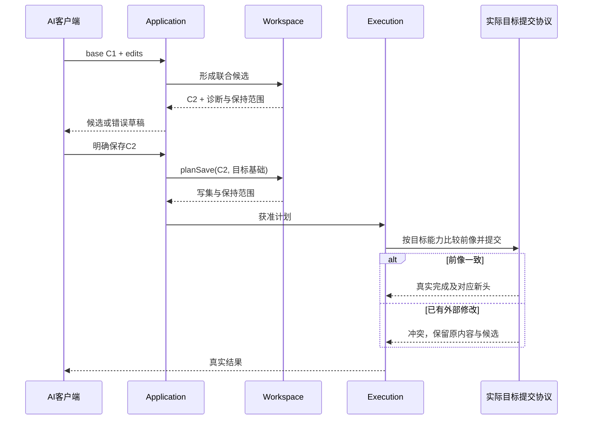

# 工程实体与持久表示

> **阅读范围**：采用范围内的设计规范；实现状态另查未决。

<details>
<summary>本页内容</summary>

- [本章解决什么](#本章解决什么)
- [作者源不是产品方案投票](#作者源不是产品方案投票)
- [可持续编辑的来源保留与目标草稿](#可持续编辑的来源保留与目标草稿)
- [五层不能混为一个“工程形式”](#五层不能混为一个工程形式)
- [片段函数与工程使用同一输入合同](#片段函数与工程使用同一输入合同)
- [实际工作区及其默认所有权](#实际工作区及其默认所有权)
- [三份作者文件的共同规则](#三份作者文件的共同规则)
- [合同标识的实际存放与读取顺序](#合同标识的实际存放与读取顺序)
- [一个最小作者模块与解释边界](#一个最小作者模块与解释边界)
- [稀疏作者模型与组合展开](#稀疏作者模型与组合展开)
- [意图、定义、绑定和观察的同源保存](#意图定义绑定和观察的同源保存)
- [接受依据与候选源的精确关联](#接受依据与候选源的精确关联)
- [全工程准备视图：多项目、多解析域与同一来源](#全工程准备视图多项目多解析域与同一来源)
- [从作者文件到可编译输入](#从作者文件到可编译输入)
- [编码、摘要与数值](#编码摘要与数值)
- [基础结构模块的实际体合同](#基础结构模块的实际体合同)
- [多种作者界面如何编辑同一工程](#多种作者界面如何编辑同一工程)
- [草稿、未知扩展与局部工作](#草稿未知扩展与局部工作)
- [原生编辑、差异和合并](#原生编辑差异和合并)
- [迁出、备份与替换条件](#迁出备份与替换条件)
- [本合同的反例与后续验证](#本合同的反例与后续验证)
- [机制依据及其边界](#机制依据及其边界)
- [副本分支与权威重建](#副本分支与权威重建)
- [文本作者的角色与构建入口](#文本作者的角色与构建入口)
- [工程声明的源权威与画像保存](#工程声明的源权威与画像保存)
- [计算数据与长期作者身份](#计算数据与长期作者身份)
- [作者资产进入候选与保存的具体事务边界](#作者资产进入候选与保存的具体事务边界)
- [库包沿现有工程与锁保存](#库包沿现有工程与锁保存)
- [全工程资产、控制差异与交换编码的关系](#全工程资产控制差异与交换编码的关系)
- [完整作者资产与局部任务投影](#完整作者资产与局部任务投影)
- [内存作者快照怎样成为实际编译输入](#内存作者快照怎样成为实际编译输入)
- [成品中的候选头与输入补取归属](#成品中的候选头与输入补取归属)
- [作者前端与源归属](#作者前端与源归属)
- [工程信息的选择与持久表示边界](#工程信息的选择与持久表示边界)
- [产品需求定义作为作者资产与输出根](#产品需求定义作为作者资产与输出根)

</details>


## 本章解决什么

本章拥有实际编辑、保存、比较、构建和迁出的作者工程合同，不把存储格式等同操作界面。当前选择是**按责任分片的意图/Block结构源、原生资产和精确规则绑定**。新产品的意图定义直接采用严格JSON模块，源体合同见[结构化意图](../结构化源码.md)；工具从标签、管脚和真实差异形成准确结构。既有计算文本/原生代码仍可作为明确选择的供给或作者区域，AST与视图由该区域唯一真源派生。没有两份同义源、强制迁写或`.sec`词法前置。临时短单位可在明确上下文中使用，数据库只有被明确采用为作者存储时才拥有相应范围，不与文件争写。

本章中的 `sec.project/1`、`sec.author-module/1`、`sec.binding-lock/1` 是本设计定义的第一版草案合同，不是已经发布或通过软件符合性验证的协议。字段含义、解析顺序、错误与演进在设计阶段确定，不等获得实现许可后才设计。已退役的有限一般程序示例不参与现行格式解码。

协议草案与已发布协议的区别，不意味着可以随意解释字段。修改本草案要同步检查相关例子、客户端和兼容设计；正式发布时再冻结版本，并执行本章规定的符合性验证。实现、SDK、迁移程序和运行实验不是本设计包的内容。

## 作者源不是产品方案投票

“设计源码”在使用说明中统一解释为[作者源](../../产品/术语与质量属性.md#作者源产品规格与候选的准确含义)。它可以是目标工程的完整实现，也可以是只有接口/约束的未完成设计。保存载体相同，完成状态不同：有缺口的源可以保留与分析，所选输出的可达行为有实现或合格绑定后才生成相应程序。

文件或已选编辑缓冲是当前作者内容；candidateRef是工具在需要分析、生成或应用时对这些字节、语言和相关输入形成的一次冻结引用，不要求作者每次击键提交协议。形成新候选不要求产生新业务方案，保存旧候选也不要求复制全部文件。内部可以使用结构共享或内容寻址，必须保证返回的引用解析到正确内容，不能以此推出每个表达式都需要全局身份或永久存储。

选择一份候选以后，是接受/保存关系指向其内容，而不是把它转译成第二份“正式设计源码”。AST、SemanticIR和TargetProgramIR按需派生。目标TS/Java是产物，不反向取得作者权；必须手修时先选择回源修正或明确接管区域，不能让两份文件同时声称可独立维护同一规则。

预览和候选保存允许早于目标工程的正式采纳。源目录写入、模型采纳、产物写回、Git集成和部署各使用其实际动作与权限；当前基础MVP只提供已说明的保存/输出路径，不通过一个source字段偷偷增加“采纳所有业务”的能力。

## 可持续编辑的来源保留与目标草稿

作者文件仍只有一个拥有者。受管目标的手动修改不是重写ArtifactSet，而是对准确旧产物形成TargetDraft；[写回协议](../../编译/表示/编辑与受管回源.md#managed-edit-roundtrip)将其映到新作者或已有目标控制。草稿中的未处理内容不能丢失，未完成回源也不能被下一次生成覆盖。

工程承诺跨会话可编辑时，既有锁、来源内容、生成规则和必要映射补充一起纳入保存根。它们可由内容引用共享，不在每个源文件里插入大段元数据，不增加作者必填的逆向清单。缓存丢失只重建可重建索引；真正不可重建的作者字节/呈现差额不能按缓存删除。

导出的维护工程可以携带经许可的来源引用和必要补充；只输出目标源码的发行包不默认包含私有作者、工具密钥或受限上游材料。接收者没有来源时，可以显式把代码作为新的原生作者源继续维护，但不能凭目标字节获得原定义身份或无损恢复声明。

### 同一任务计划不增加一份持久作者模型

EditPlan/RealizationPlan引用当前作者、独立要求和已绑定实现，不是第三份源码。实现分配、临时需求组合和推导签名可重建；准确而独立的要求、作者主动固定的选择、真实源变化及维持回源所需材料仍沿原位置和保存合同持久化。只有计划改变，没有作者/绑定/独立要求差异时，不为展示进展创建同义文件。

同批源、控制和所需锁更新可一起成为作者候选；现实磁盘是否可以共同原子写入由宿主决定。所有读取前像属于实际缓冲或磁盘层，不把已保存的外部修改再次当作未采用候选覆盖。任务取消不删除原作者和未结算操作资料，计划只释放它自己不再使用的临时保留关系。

## 五层不能混为一个“工程形式”

| 层 | 当前设计 | 不能替代的部分 |
|---|---|---|
| 可表达的含义 | 类型、行为、关系、状态、约束、需求、实现选择和用户自定义语义 | 文件扩展名不能定义执行与正确性 |
| 作者操作 | 首期AI/脚本操作意图定义、管脚及局部差异；有需求才查询或作结构化变更；未来其他客户端可消费同一语义 | 不按主体类别永久分配界面或权限 |
| 长期作者资产 | 语义模块、原生文件、资源、解释规则、依赖绑定、必要需求与理由 | 聊天和可丢弃索引不能代替作者资产 |
| 交换与存储 | 新产品采用分片严格JSON意图/Block模块与精确绑定；计算文本、原生资产按各自已选合同保留 | JSON不自动赋予语义、实现、权限或保证；不强制所有工程资产转成JSON |
| 派生与运行 | IR、索引、目标AST、检查计划、制品、操作记录与证据 | 不把它们全部变成作者需要手工同步的第二份源 |

“不以代码为唯一入口”不是消灭代码。算法可以保留为原生程序；结构化一般程序也是程序。自然语言可以是设计资产，但确定构建只读取已经保存并明确解释的语义与规则，不在每次构建时重新让模型解释旧聊天。

## 片段函数与工程使用同一输入合同

编译单位不以“是否已经创建工程目录”定义。输入可以是表达式、声明、完整函数、上下文区域、模块或多个模块的所选输出根；它们使用同一Definition/引用、类型规则、目标绑定与结果语义，不建立“片段编译器”这一套平行内核。本文把这组既有输入的请求投影称为 `UnitInput`，不是新持久身份系统或要求用户手填的另一份工程文件。

| 请求内容 | 最小需要的上下文 | 可以返回什么 |
|---|---|---|
| 闭合表达式 | 语言/规则、目标、显式常量与必要预期类型 | 表达式文本、类型与相应诊断 |
| 完整函数或声明 | 参数/返回、引用的类型与函数、所用目标能力 | 独立声明或带必要类型/导入的单模块 |
| 上下文中的语句/表达式 | 精确外层版本与语法类别、可见绑定、控制流与生命周期条件 | 绑定原位置的候选补丁；未闭合部分不得冒称独立可运行 |
| 模块/库 | 公开根、模块可见性、实际传递依赖和目标画像 | 一个或多个源码文件及所请求的接口/依赖说明 |
| 应用/工作区 | 本次输出与作用范围涉及的上述内容及实际宿主合同 | 有限产物集合；写回或部署另行请求 |

`UnitInput`的实际信息包含输入内容或固定引用、`form`语法类别、`context`、目标及布局要求。字段可以由已有会话/目标引用解析，不能省略后从可变cwd、隐式全局或“最新项目”猜测。新建临时单位无需projectId、磁盘清单、Git、数据库、用户账号操作表；若要保存为现有工程的一部分，再映射到已定义的模块和变化合同。`sec.project/1`与`sec.binding-lock/1`中的projectId仍是那两种持久文件的必需字段，不偷偷把旧格式的必需性改掉；独立单位使用内存上下文的实际绑定，不制造虚假projectId来满足不适用的格式。

### 临时句柄与作者保存的边界

context/candidate/artifact引用不等于永久归档、授权或已经看过内容。服务读取后开始处理，必须在同一生命周期协议内固定所需内容根；保留原文草稿和生成结果可以有不同期限。已进入实际作用的前后像与恢复意图不是普通候选缓存，按[引用保留规则](../../开发/工具协议/客户端与并行会话.md#引用生命周期执行占用与草稿保存)保护。

显式保存草稿可以保留非法或未完成文本；不得为了让模型有效而用最后一次合法AST重新打印、覆盖它。若某次apply需要合格生成物，其要求另由实际产物绑定承担；保存文本并不代表采纳含义。撤销访问后，字节仍保留也不向无权主体披露。

### 上下文是语义前提不是全工程复制

绑定器识别自由值、自由类型、公开符号与隐式语言能力，逐项选择参数、明确捕获、原生导入、同批局部定义或未决引用。读取和写入、按值和按位置捕获、可变别名、借用寿命不能只凭变量名判断。函数体引用`price`，只说明需要绑定它，不说明可以读取模型进程中某个同名全局变量。类型签名不是运行对象已有效的证明；对可信类型化调用方可按合同检查，对不可信输入另有边界解析与失败合同。

原生JS/TS区域输入还要记录其strict/script/module模式、this/super/arguments/new.target、async/generator与await/yield、return及标签break/continue的目标；其他原生语言记录各自实际控制与清理上下文。中立区域按中立语言作用域、类型、效果与控制出口记录，不能全都套用JS字段。不能统一包一层函数就声称保持含义：return可能原本退出外层函数，移动调用可能改变this，跨await捕获可能改变寿命。不具备精确区域转换能力时，允许保全草稿并返回`context-required`或要求显式完整函数；这限制当前输出保证，不把所有片段永远排除出产品范围。

从片段生成独立函数是显式转换：把可合法外化的自由值变参数、类型变显式引用，定义结果与控制退出，再核对捕获和效果。不能外化的资源/控制流保留为上下文补丁。输入含未知原生调用时，继续保留未知效果与目标依赖；不因为片段短而豁免其真实语义。

### 已绑定上下文与无工程默认

上下文是不可变内容与解释映射，不是模型的隐含记忆：语言/目标画像、公开类型/符号、显式导入、必要外层控制语义和实际版本都能解析。短context引用由服务签发并限制到租户、任务和可披露范围；持有引用不授予永久读写许可。固定别名不会因库目录后来多了同名项而重新绑定。

临时无工程模块可以在启动时一次绑定本地默认画像，不造projectId。source的完整签名和显式import使它自足到该已声明环境；陌生自由变量、缺少可用包或不明目标必须诊断。导出为长期作者资产时保存实际所需的源码、类型/导入和锁；若继续依赖上下文，应报告context-required而不称自足。

多个同时活动的任务各自携带基础；所谓“会话已经知道”不能成为跨任务串用的后门。上下文被回收或限制改变后可重取内容与语义，但不得复活旧授权或用latest替换旧基础。

### 临时创作与后续保存

临时单位在会话内获得局部身份和不可变候选引用；没有跨会话承诺就不增加持久日志。上下文/句柄过期时返回明确原因，不从同名内容猜回旧对象。用户要求保存、共享或在其他任务引用时，才执行正式身份与作者源持久化；若需重分配身份，返回旧临时引用到新引用的映射，不自动导入旧权限。

依赖内容与解释规则仍须能在本次调用中解析，体积小不等于没有闭包。只读取实际所选语言检查要求的范围：原生模块级checker可能必须检查整个模块，片段独立性不能伪造精确局部结果。相交范围之外的问题可分别报告；不能把模块级检查局限抹成“全工程通过”。

### 输出形式与作用范围彼此独立

可请求内联文本、AST/结构视图、单模块、文件集合或插入补丁。`form`决定产物的语法和依赖契约，`applicationTarget`才说明真实写入位置；两者不混为一路径。仅返回代码可以完全无文件写入，生成补丁也不是补丁已应用。完整目标源码结构见[目标源码组织与生成策略](../../编译/目标/成员布局与完整产物.md)，操作入口见[AI工具面](../../开发/工具协议/六工具与请求.md#ai工具面的具体设计)。

最小反例包括：未绑定变量被替换为undefined；把区块return包成内部函数return；把捕获局部资源搬到模块级；把查询上下文当写权限；片段句柄失效后按名字命中另一对象；所有简单请求必须创建项目目录。正确反向情形是：一个闭合函数在无工作区状态下取得源码，随后以明确映射加入模块，不重建第二套事实。

## 实际工作区及其默认所有权

新工程默认可以采用一个`src/`作者目录；其名称不决定语言。中立、原生或结构作者由已声明的范围与解释识别，不强制分放model、native、app或lib。现有工程保留其真实路径，除非用户明确请求移动。

```text
my-project/
  src/                  中立或原生作者模块，按显式范围解释
    main.sec
    convert.sec
  sec.project.json      持久工程的身份、源范围、模块与输出要求
  sec.lock.json         工具维护的精确语言、依赖和目标解析结果
  assets/               实际需要的非源码内容
  generated/            只在要求保存生成物时创建
  .sec/                 缓存、视图或恢复有实际需要才建立相应子目录
```

该树只是新工程默认，不是资格检查或所有项目的固定模板。`app/`可用于入口编排，`lib/`可用于共享模块，`apps/`和`packages/`可用于多产品工作区，但目录存在不自动建立应用、独立包、权限或版本。没有发布消费者就不创建包清单或注册中心。目录路径是定位，作者权与可删性来自真实范围和前像。

### 渐进布局与最小持久工程

| 使用规模 | 作者实际需要维护 | 工具可以承担 |
|---|---|---|
| 临时表达式/函数 | 当前source与必要参数，环境来自固定context | 内存候选、解释与实际调用，不建目录或projectId |
| 一个自足脚本 | 可直接保存`main.sec`，接收方有明确语言环境 | 固定工具/环境提供解释；要携带精确构建关系时再保存配套绑定 |
| 多模块工程 | `src/`中的真实模块与独立要求 | 从明确创建/移动形成modules与sourceScopes，锁保存真实解析，不逐定义抄字段 |
| 带资源工具 | 再增加实际资产、输出根与格式规则 | 完整发行成员、内容引用、缺资源诊断与不相交文件保全 |
| 独立复用包 | 只有实际分发时声明公开出口和依赖要求 | 解析已有生态或固定SEC内容包，不先建设市场、账号或服务 |
| 多应用工作区 | 在明确根范围内组合真实子工程 | 子工程身份与共享依赖的实际连接，不把文件夹名当包协议 |

两个JSON承担不同职责：project保存要求/定位，lock保存已经选中的精确结果。它们不能重复保存函数体或两套版本选择；普通改函数不重写锁，只有解析输入或实际选择改变才更新相交绑定。工具可以自动维护机械字段，作者仍可查看实际差异。

单文件没有旁车锁仍可以作为源码保存或交付，只是它的解释来自接收环境；不能同时声称已经携带了原工程完整精确绑定。需要跨机器重建或保存长期身份时，把必要定位与锁一并放入同一保存候选。不能只为了让一个表达式运行，就强制创建两个磁盘文件；也不能为减少文件数把可变“latest”藏到远端账户。

### 包管理的最小责任

`import "./convert.sec"`是本地模块连接；它不触发包发布或外部版本求解。用户自己的几个模块可以作为一个库使用，而没有独立版本、下载或注册中心。

外部依赖优先由其成熟生态工具解析。SEC记录实际采用的包入口、原生锁内容、解析器/目标版本及得到的内容，不能再用自己的另一套semver解释得出竞争结果。原生锁和SEC锁存在时前者是其生态解析输入，后者引用它的精确内容及实际消费，不各自手填一遍依赖真相。更新依赖采用一次获准的解析流程；导入、打开工程和类型检查不自动下载或执行安装脚本。

需要分发纯SEC库时，可用已有不可变内容获取与本章绑定模型，携带公开出口和所需语义；这是必要的包读取能力，不推导必须建设公共商店、搜索平台、账号和发布服务器。签名、许可证和实际可信来源依其声明核对，包名不代替内容或权限。

### 源范围与嵌套工程

范围项必需 `root`、`kind` 与 `editSource`，可选 `include`、`exclude`。`root` 是相对工程根路径：以 `/` 分隔，`.`仅允许单独表示工程根，不允许空段、`..`、绝对根或NUL。`kind` 区分 `semantic`、`native`、`asset`、`design`、`generated`，这是源的存储角色，不是对业务领域的封闭分类。

`editSource` 是带 `mode` 的对象：`file`表示该范围的文件是作者源（原生代码和结构化JSON均可）；`projection`附带已解析的`producerRef`，表示内容由该生产者根据其全部声明输入派生；`derived`表示只读派生内容，不接受直接作者修改。生产者可以依赖多个源，不以“一个编辑拥有者”误推成“一个输入”。混合文件的更细区域与源映射由对应语言适配器声明；没有区域能力时不能默许并行双写。

`include`和`exclude`是相对该范围根的模式数组，缺省分别为`["**"]`与`[]`；先匹配包含，再应用排除。以`/`分段，`*`只匹配段内零个或多个字符，`?`匹配段内一个Unicode标量，独立段`**`匹配零个或多个路径段，其余字符按字面处理；不继承某个宿主glob库对方括号、花括号或反斜线的额外语法。模式按实际保存的大小写与标量比较；宿主不能区分的路径别名另行诊断，不把两个逻辑名字默合为两个文件。此规则只列普通文件成员，不执行工作区配置。

版本库内部控制目录以及`.sec/cache`、`.sec/state`不通过普通作者源扫描吸收；需要访问它们时使用对应的显式只读观察或恢复接口，并单独授权。不能靠宽泛的`**`把恢复内容、秘密或版本库对象自动变成可分发作者源。

重叠范围必须给出唯一拥有者或显式只读引用；不能以声明顺序让后者偷偷覆盖前者。嵌套工程具有自己的项目身份、解释锁与根范围；父工程通过公开边界引用它，不同时把子工程文件重新认领为父模块。一个目录可以仅用于导航；路径不是语义身份。

符号链接、大小写折叠、Unicode等价路径、文件/目录冲突与根外地址由宿主能力合同处理。没有明确支持时诊断并保全，不静默跟随读取别处秘密。解析依赖可以产生外部获取计划，但打开工程不自动下载、安装或运行依赖。

### 短作者源保存与签名归属

import默认别名、推导参数/返回及静态函数值都来自[精确语言修订](../../领域/计算基础/紧凑表示与程序范式.md#compact-author-contract)。保存继续写原文本和实际模块/规则锁，不自动创建一份展开的程序、签名源或意图JSON。需要记住曾被接受的公开接口时，保存其准确内容引用与接受关系；它是版本证据，不是要求用户双写的第二份接口。

没有新算法的导入根、直接别名、有参数差额的lambda和完整自定义fn共同属于当前工程。仅改常量不更新语言选择，升级解释才核旧注解与省略形式的含义。代码已经被外部编辑器保存时仍不重复apply；投影显示的完整类型不改变这一拥有关系。

## 三份作者文件的共同规则

根必须是对象，`schema` 是确切合同版本。本文标为必需的字段不允许用 `null` 代替缺失；可选字段省略采用本文规定的默认，不以“实现习惯”另给含义。未声明的根字段不能静默忽略后写回；保留原字节并报告未知合同，扩展应进入命名空间化的 `extensions`。

项目、模块、定义和锁节点的身份都是其作用域内不透明、不可复用的标识。显示名、路径、内容摘要和修订另存。首次建立需要稳定引用的边界时由工具分配；临时局部变量不需全工程身份。删除后重建同名内容不自动复用旧身份；独立复制建立新身份，普通引用保留目标身份。

外壳标识字符串不能为空、不得包含控制字符；比较使用保存的精确Unicode标量序列，不做默示大小写折叠或NFC变换。身份长度、字符串总量、节点数和递归深度由已声明读取预算限制，超额返回资源诊断而不是改变语言含义。字段名和协议字面量精确匹配；人类显示名与机器身份分别存储。

所有路径都是定位，不是读取许可。所有 `policyRequests` 都是请求，不是授权。所有摘要都说明算法与编码域，不把校验和当签名。承载原生代码的文件保持原编码与语言合同；不把整段代码转写为巨大JSON字符串树。

### 工程清单 sec.project/1

| 字段 | 必需性与类型 | 精确职责 |
|---|---|---|
| `schema` | 必需，字面量 `sec.project/1` | 文件解释版本 |
| `projectId` | 必需，不透明字符串 | 工程逻辑身份；根的物理实例另有宿主身份 |
| `sourceScopes` | 必需，范围项数组，可以为空 | 定义允许发现的作者与派生区域，不代表已经读完 |
| `modules` | 必需，模块ID到路径的对象，可以为空 | 当前显式模块入口；同一模块不能映射两个竞争写源 |
| `targets` | 可选，对象，默认空 | 输出根、目标画像和规则请求；无目标仍可阅读与设计 |
| `defaultTarget` | 可选，目标键 | 仅引用已声明目标；省略时不猜唯一发布目标 |
| `policyRequests` | 可选，对象，默认空 | 项目请求的自动化、验证与数据政策，由有权环境准入 |
| `annotations` | 可选，命名空间对象，默认空 | 作者说明；语义分类由已绑定语言定义决定 |
| `extensions` | 可选，命名空间对象，默认空 | 新的已声明扩展，不改变上述字段原义 |

每个`targets`值必需`profileRef`与`outputRoots`：前者引用解释其目标与保持条件的画像，后者是当前目标的输出根引用数组；可选`parameters`仅按画像定义解释。没有输出根仍可保存未完成设计，但不能称为可生成目标。画像缺失时保全声明并报告待解析，不以某个默认后端代替。

`outputRoots`的基础作者画像采用引用对象，而不是未解释字符串：`{"moduleId":"m1","export":"pay"}`选择一个公开导出；`{"moduleId":"m1"}`选择该模块全部公开导出。缺少export与空字符串不是同一含义，空字符串拒绝。moduleId必须能在本次modules/绑定范围解析，export必须是实际公开符号；可执行函数根也接受语言已检查合格的静态函数值，由CallableIndex给出调用合同，不以源码是否含fn判定；不能借已知私有ID绕过可见性。选择全部公开导出时记录导出集合依赖，新增导出可能影响生成；选择单一导出仍要按语言要求检查模块声明与必要调用闭包。目标语言和源码布局由profileRef及其有类型参数解释，不从moduleId的拼写推导。

临时文件候选可由工具的files输入一次建立，真正持久保存时由工具分配或迁移模块身份并形成清单。上述对象在清单中保存，不要求AI每次生成短代码都重复构造它。相同输出根可以对应多个目标，但每份产物和检查分别绑定。

`modules` 是模块身份到位置的定位索引，不复制定义。移动模块只改变定位并核查公开路径消费者。目录发现模式可以生成候选索引，但必须记录扫描根、排除项和实际成员；没有扫描到不等于不存在。构建捕获后使用固定成员集合，不能编译中途读到新模块却继续使用旧输入身份。

<a id="imported-output-roots"></a>
### 导入模块出口可以直接作为生成根

`modules`保存本工程**作者源**的ID与位置，不是要求所有依赖拥有本工程文件。已由当前锁或固定上下文明确导入的模块，可以通过原有`outputRoots`的`moduleId/export`选其公开出口；此时它读取为ImportedModuleView，不写出同义`.sec`模块。外部没有源代码，不等于没有真实定义或实现。

解析顺序固定：先解析本工程modules与导入绑定，建立有来源的模块联合；同ID分别指向不相容作者和外部内容时报告冲突，不按发现顺序覆盖。输出根必须位于本次明确可读、可用的绑定范围，并具有实际公开出口。知道某个私有ID或在全局缓存找到同名项，不取得导出/读取权。

没有自有算法的工程可以使用空modules和sourceScopes，目标根只引用合格的导入出口。新的项目内业务差异出现时，再加入真实源及相应定位。不能先造一个空`main.sec`或无体转发来满足P1；也不能将供给引用当成永久锁外查询。

项目的公开名字和目标形式沿既有稀疏控制保存。精确合同/方法/原生模块/工具及使用点在原锁中解析；内部UseBinding从它们派生，不增加新的project根字段、第三个文件或每函数手写模型。相邻库调用的组适配保存在实际方法供给中，共同信息不复制到每个应用。

这项解释收敛了`moduleId必须能在modules/绑定范围解析`的既有条件。旧读取器实际若仅支持本地modules，应明确报告未支持的导入根能力，不能忽略绑定生成空项目；模式字面量未变不证明所有历史实现自动支持新补齐的算法。语义变更按草案精确内容绑定和版本协议处理。

首次持久保存共同处理：作者字节若有、模块/导入定位、已接受的目标要求、语言/供给锁及实际资产；生成目录不进入作者modules。多目标共用同一公共定义，目标实现各自绑定，不能只锁一个目标再以同名推导另一个目标具备能力。

### 语义模块 sec.author-module/1

| 字段 | 必需性与类型 | 精确职责 |
|---|---|---|
| `schema` | 必需，字面量 `sec.author-module/1` | 外壳格式，不替领域语义定义 |
| `moduleId` | 必需，不透明字符串 | 与清单键一致 |
| `namespace` | 必需，字符串 | 名称查找范围，不代替身份 |
| `dialects` | 必需，别名到语言要求的对象 | 每项包含语言身份、版本约束；精确解释由锁绑定 |
| `imports` | 可选，别名到模块要求的对象，默认空 | 每项指明模块身份及来源模式；公开符号另由导出限制 |
| `definitions` | 必需，定义ID到定义对象的对象，可以为空 | 保存作者定义，不复制分析和编译结果 |
| `exports` | 可选，公开名到定义引用的对象，默认空 | 没有公开声明就没有隐式全模块导出 |
| `annotations` / `extensions` | 可选，默认空 | 与共同规则一致 |

语言要求中的`languageId`标识语言或已选择的组合。字符串`constraint`是该来源定义的一个精确发布选择符，例如`"1"`只选择该符号指向的版本，不自动成为任意`1.x`范围；它本身不是内容摘要，也不证明来源的该符号从未被重指。成功解析后，既有锁节点必须同时固定规则revision和content，后续构建用锁定内容。`sec.object/1`中的兼容代号与此字段的选择符是不同槽位，不用字符串相同推导内容相同。需要范围求解时，采用显式`scheme`和`expression`对象并绑定该协议，未支持的scheme不得由宿主包管理器猜测。工作区导入记录`mode: workspace`与`moduleId`，外部导入记录`mode: locked`与`moduleId`及相应约束；导入发生位置由模块ID、别名与引用角色定位，在锁的bindings中解析，不靠显示名偶合。

别名不能为空且不得包含分隔冒号；`kind`按第一个冒号分为别名与定义种类，后者的合法拼写由所选语言定义，不让宿主猜测另一语言。

一个定义包含 `kind`、`name` 和 `body`；`kind` 使用 `dialectAlias:kindName`，由精确语言合同定义 `body` 字段、类型、顺序、约束、可引用位置与有效草稿。`name` 是可改显示/查找名，不用名称作为唯一连接身份。通用外壳不预列全球业务种类；新增用户函数和组合沿当前画像已有kind及定义体表达，不为每个新业务注册kind。真正新方言的kind只有在明确启用的新画像与精确解释合同下才可参与检查和生成，未知kind仅保全且返回相应支持边界。通用值、泛型、资源与异步的默认语义见[语言合同](../../领域/计算基础/通用计算与任务语义.md#产品级复合类型调用与资源的具体默认设计)；JSON对象排序不决定字段构造表达式的执行顺序。各语言的具体节点Schema仍需按语义合同版本化，不能拿旧有限示例的格式当已发布全语言实现。

语言合同负责判断某个定义是类型、函数、状态机、关系、外部绑定还是其他角色。一般表达式可保持紧凑树；原生实现使用源引用和导出符号；高层领域行为使用相应领域结构。只有承担稳定外部引用、共同约束或迁移责任的内部边界才分配持久子身份。

外壳定义引用使用可区分的值：模块内为`{"definitionId":"…"}`，跨模块为`{"import":"别名","export":"公开名"}`，不能同时出现两种形式。只有语言标为引用的位置才按引用解释，普通业务对象恰好同名的字段不是链接。跨模块解析只通过公开导出，不用已知私有ID绕过可见性。导出可以引用本地定义或明确转导已公开的导入；转导需经过实际权限与循环解析检查，未解析的转导不能自称已绑定。解析结果绑定精确模块与定义。作者可以输入名称或临时标签，但保存可构建快照前必须记录唯一解析结果。名称歧义返回候选，不按字典顺序默选。创建后尚未决定的引用保存为显式草稿空洞，不伪装成一个不存在的已绑定ID。

`imports` 的来源模式分为 `workspace` 与 `locked`。前者引用本次作者快照里的模块ID；后者通过锁节点选择不可变外部内容。两者都可以形成合法的声明循环；加载签名后再核对引用，不要求模块内容摘要递归包含对方摘要。模块初始化或生成执行是否允许环，另按实际语言的执行合同判断。

### 成品边界和结构默认的保存

结构化复合定义的`parameters`、`subjects`、`terms`与可选`exposes`均属于本模块definitions中的body；没有独立接口镜像。value参数的显式default按[有限默认协议](../结构化源码.md#closed-parameter-defaults)解释；module exports仍指向定义，不改成逻辑主体引用。目标请求按准确公开边界与画像选输出，不从文件名推为函数、CLI或服务。

默认使用与显式同值均保留自己的作者来源。省略默认的文件在保存后仍可省略，固定值由准确规则解释/绑定获得；普通参数编辑不为每个条款另建锁节点。升级默认所属定义，检查所有相交消费者；实际采用旧定义或显式固定值的消费者不因目录里出现新默认而改义。

来源未改且只选择另一成品形式时，共同需求模块复用，目标要求、适配和真实配置按根变化。规格包完整、运行库完整与独立应用完整有不同剩余进口条件；同一文件清单不能用一种全局completed包办。当前设计范本的targets为空是明确的目标缺额，不等于它的产品要求被取消，也不得捏造目标引用。

### 绑定锁 sec.binding-lock/1

| 字段 | 必需性与类型 | 精确职责 |
|---|---|---|
| `schema` | 必需，字面量 `sec.binding-lock/1` | 锁记录解释版本 |
| `projectId` | 必需，字符串 | 防止将另一工程锁误当本工程选择 |
| `resolutionInputs` | 必需，摘要描述 | 覆盖依赖要求、语言要求、目标/解析政策及环境选择，不覆盖无关正文排版 |
| `bindings` | 必需，发生位置到节点ID的对象 | 每个导入/语言/目标请求实际选择哪个节点，不只按包名合并 |
| `nodes` | 必需，节点ID到节点记录的对象 | 内容、精确解释、依赖边和获取位置 |
| `extensions` | 可选，默认空 | 已协商的解析补充，不能自授信任 |

每个节点记录 `kind`、`subjectId`、`revision`、`content` 与 `dependencies`。`content` 包含摘要算法、摘要值、字节长度及格式；取得多文件内容时引用一份排序规则明确的清单，清单列相对路径、大小和字节摘要。`dependencies` 指向本锁内节点ID。获取位置是可替换提示，不把可变下载URL当成内容身份；获取后仍核对实际字节。

节点可以表示语言定义、库、生成规则、后端、目标或工具输入。发生位置不同的同名依赖可以合法选择不同节点；需要共享类型身份或单实例资源时，再由合同要求统一，不能因为名字相同自动去重。节点ID标识锁内记录，不要求等于递归依赖摘要；先定义节点，再定义边，最后对无自摘要字段的整份锁产生外置摘要，因此有环依赖不形成哈希自指。

普通工作区正文修改只改变本次源码快照，不要求每打一个字重写锁。改变导入要求、语言版本、目标或实际影响解析的政策才使对应选择陈旧；重新解析生成一个可审查的锁候选。固定构建不得静默升级依赖。撤销或新证据可使原绑定失去执行资格，但不改写它历史上选择了什么；重新选择必须形成新绑定。

锁不包含原始秘密，也不能保证所有物理环境都已被封闭。实际调用工具的宿主映像、ABI、系统库、环境和外部读取由相应构建输入与证据合同补齐。没有取得这些条件时，可以保存作者工程，但不能宣称已经可字节重现。

### 默认语言组合不增加一份手写配置

新建项目或短源上下文由已选发行提供一个语言入口，该入口的精确依赖包含基础和有限对象规则；位置到节点的选择仍由`bindings`维护，构成仍由`nodes.dependencies`维护。结构模块可以通过`dialects`显式描述已经固定的解释，普通AI文本请求不重复手填这份闭包。公开格式不增加第二个语言开关表。

首次建立时读取发行的真实默认并固定；以后默认变化不改变旧模块。明确升级形成新锁候选，检查词法、公开类型和消费者。已知签名不需要的运行组件不会因语言入口含对象规则而变为产物成员。库导入固定所用符号及语义，不修改当前parser。完整职责见[语言组合](../../领域/计算基础/紧凑表示与程序范式.md#合同标识默认语言组合与按需能力)。

## 合同标识的实际存放与读取顺序

合同标识保存在解释和编码的元数据槽位，不作为每个业务文件或类名的一部分。普通文件可叫`src/convert.sec`、`src/pricing.sec`；app/lib仅为可选业务目录，重命名不选择新语言，也不升级规则。以下复用既有字段，不新增配置文件、`intentLanguage`、`defaultLanguage`或每定义一个开关。

| 内容位置 | 真实字段或语句 | 表达什么；谁维护 |
|---|---|---|
| 普通`.sec`作者文件 | 函数、类型、调用和已选构造；无需强制语言头 | 保存程序及独特决定；模块的解释由已固定context或锁绑定 |
| 工具首次输入或初始化 | `context`，需要显式选择时为`sourceLanguage: "sec.object/1"` | 选择解释入口；后续客户端沿固定上下文工作，不能各调用自行升级 |
| 结构作者模块 | `schema: "sec.author-module/1"`；`dialects.s.languageId: "sec.object"`、`dialects.s.constraint: "1"` | schema选外壳，dialects选解释要求；通常由作者适配器生成而非AI手填 |
| 结构定义体 | 既有`body.representation`，如`sec.object-body/1` | 选择该定义体的解码合同，不代替语言语义或当前权限 |
| `sec.project.json` | `schema: "sec.project/1"`、`modules`、`sourceScopes`、`targets` | 身份、源位置和输出要求；根schema不是对象语言选择，现行根没有第二个语言字段 |
| `sec.lock.json` | `schema: "sec.binding-lock/1"`；`bindings`指向`nodes`；节点含`subjectId/revision/content/dependencies` | 保存实际语言/库/方法绑定及精确内容；初始化器、解析器和保存协议负责 |
| `.sec`中的库导入 | `import "./pricing.sec" as pricing`或已定义模块入口 | 选择要复用的定义；既非文件头语言切换，也非目标底层轮子选择 |
| 发布内容或提供者登记 | 该语义定义及实际方法的既有身份、修订和内容 | 提供规则本身；不能只保存一个代号而没有规则和方法 |

结构片段`{"dialects":{"s":{"languageId":"sec.object","constraint":"1"}}}`只是完整模块的一部分，不是可直接代替整个模块的对象。`/1`是约定的入口/合同标识；分开的`languageId`和选择符按该协议解析，不通过对任意路径字符串粗暴按斜杠切分获得。

**读取过程。** 先取得实际项目/候选或片段上下文；由`modules`定位模块而非猜目录。结构源从自己的语言要求解析，文本源从该模块的语言使用点绑定取得解释。沿`bindings`定位锁节点，核所用规则的revision/content和依赖，再解析作者字节。显式请求与已有源绑定冲突时形成解释变更候选，不覆盖旧源；`body.representation`还要与该语言允许的体合同匹配。

**首次保存。** 只有会话中的语言选择尚不足以让文件长期可重建。保存者把模块定位与语言使用点的精确锁选择共同纳入作者保存候选；不能只保存`.sec`字节后声称环境也已保存。独立短片段不必建立磁盘工程；需要分享并重建时，导出对应的固定上下文/锁内容，或由接收者明确采用自己的解释，不宣称自动等义。

**失效和缺失。** 只有文件而没有解释依据时，可以保全和按明确请求检查；不能按`class`词出现来猜版本。原规则内容缺失时按读取许可取得准确内容，取得不到则返回该依赖缺项；不把同名最新版本当替代。改变语言选择时核词法、类型和消费者；只改业务参数而解释未变，不重写语言锁。公开诊断可同时显示可读名称与精确标识，正常任务不要求作者记忆代号。

**必要成本。** 稳定标识承担可寻址解释和兼容，其存在合理；把它复制到每个定义、源码文件名、应用参数或另一份需求清单则没有这个必要。锁和源的不同责任应保持，所谓一份作者事实不意味着删除构建所需的版本输入。

## 一个最小作者模块与解释边界

下例是本合同的静态写法，不是可运行样例或完整字段Schema。`team.workflow` 是用户自己提供并锁定的语言定义，不要求系统官方预装；该定义约定 `state-set` 的 `states` 和 `initial` 字段，验证 `initial` 必须属于 `states`。

```json
{
  "schema": "sec.author-module/1",
  "moduleId": "module:ticket",
  "namespace": "helpdesk",
  "dialects": {
    "wf": {"languageId": "team.workflow", "constraint": "1"}
  },
  "definitions": {
    "definition:ticket-status": {
      "kind": "wf:state-set",
      "name": "TicketStatus",
      "body": {"states": ["open", "closed"], "initial": "open"}
    }
  },
  "exports": {"TicketStatus": {"definitionId": "definition:ticket-status"}}
}
```

此例只表达状态集合，尚未定义关闭权限、输入原因、重开、持久事务或代码生成。给它增加一个未知字段不能自动获得这些能力；必须使用语言定义中有明确解释的规则、操作或原生绑定。实例通过JSON语法检查也不能证明领域验证、编译和执行已经存在。

完整工单变化见[完整工程设计示例](../../../examples/范本角色与原导览.md)。人可以编辑规则表，AI可以提交相互引用的变化，两者无需直接手填上面的对象身份。客户端最终使用[成组修改协议](../../开发/工具协议/候选修改与批量.md#语义增量临时身份与前提)生成同一作者结果。

## 稀疏作者模型与组合展开

作者工程不用在“全部普通代码”和“全部JSON节点”之间二选一。当前默认保留四类不能互相替代的作者信息：不可从实现反推的需求/约束；可复用组合定义与实例参数；独特的中立或自愿原生程序及其他资产；精确解释与实现绑定。它们仍使用前述模块/锁/原生文件，不增加另一套源格式。

一个功能实例引用确定的SEC定义，只写真正差异参数、连接和主动要求；目标实现未被作者固定时由编译器解析并锁定，不要求每个实例填写原生实现引用。由同一组合产生的内部结构、目标代码、关系索引和上下文是派生物；原生函数的AST/实际签名由成熟语言观察产生，不再次要求AI手填同一事实。独立“要求的签名/精度/效果”仍是约束，不能因实现当前不同就自动改成实现状态。

结构化模块不保存每个原生循环和局部变量的镜像；需要具体源码时按符号与范围读取。跨语言或特定领域需要额外表示时，必须声明语义保持与对应关系，不能默认所有目标共享同一个最低共同AST。派生图可以临时很大，是否持久化及驻留由查询与存储策略决定。

生成子对象由实例身份与定义内稳定局部身份定位；列表重排或文件改名不自动重建其业务身份。规则版本变化时，原身份保留、迁移或新建须由规则合同决定。没有持久消费者的临时AST继续使用本次局部身份，不膨胀成独立全局工程对象。

原生源码、组合和共享合同没有三份互相竞争的编辑真相。生成区回源修改，正式接管时转移作者所有权与重建声明。规则不能在每次构建时召唤AI重写自定义算法。原生资产和规则可完整导出，控制日志是否保留取决于尚未结算的作用，不能因“退出编译系统”一并抹掉。

粒度的不同维度由[意图与组合](../组合/定义与接口.md#意图粒度与可复用功能组合)规定；体量口径由[性能](../../编译/查询增量与性能.md#作者体量派生体量与模型上下文)拥有。本节不以JSON大小声称工程更省上下文。

## 意图、定义、绑定和观察的同源保存

一个声明的“意图视图”和“语义视图”不是两个独立可写实体：前者解释当前要达成的性质与选择，后者解释同一来源的精确允许行为。正文、类型和实例参数共同形成作者含义；编译IR、边界摘要和依赖索引为派生。语义并不必然等于一份更长的显式树。

| 内容 | 权威来源及存储默认 | 谁可以修改 | 修改后谁需要更新 |
|---|---|---|---|
| 原始请求或独立要求 | 原字节和精确引用；没有独立来源不创建镜像文件 | 当前委派允许的要求修改 | 相交的接受关系、候选检查与结论 |
| 库定义与实例差异 | 对应.sec文件或另一个明确作者区域 | 库作者、项目作者及其授权AI | 使用到该公开或私有内容的分析、展开与产物 |
| 明确目标控制 | 既有控制记录或一个可靠作者表面，二者只选一个 | 控制修改权限与任务允许范围内 | 相交Binding、布局和目标满足检查 |
| 自动得到的类型、关系、有效值 | 可重建内存或缓存；来源指向原定义和规则 | 只能通过重新推导改变 | 声明读取该投影的消费者 |
| 已选实现与解析锁 | 实际选择和精确依赖；不是另一份算法源 | 合法解析、明确重选或升级过程 | 实现/工具/环境相交的产物与资格 |
| 实际运行状态和证据 | 原观察、方法、对象、范围；按责任保存 | 受信观察和结算协议 | 当前资格、诊断与恢复，不反写原要求 |
| 尚未解决的设计问题 | 本设计包中的单一[问题登记](../../状态/前沿与登记规则.md#已知问题主登记) | 设计维护者依据反例和处置规则 | 实施范围、相关规范和采用条件 |

原始请求有独立约束力时保留其版本；只提供一份完整源要求生成时，不为证明独立性强制另写同义规范。图形或自然语言摘要修改要产生对真实作者区域的候选差异；生成区不能直接成为第二份作者源。代码、配置、二进制资源和说明文档可以都属于同一候选，但不是它们都必须被改写成同一种语法。

### 采纳、重新解释和跨会话

候选C保存内容；是否接受其某项要求由独立的接受关系决定。新候选可以同时修改行为、控制和资产，保存成功不自动证明它替代旧要求有权，也不表示已部署。只有在实际要求变更被允许时，更新指向相应新片段的接受关系；其他独立要求保持原引用。

语言解释、库缺省或规则升级时，先在旧解释下保留原内容和关系，再生成新解释候选及差异；无法取得唯一映射的部分保留待决。重启会话只重取必要内容、绑定、未决和当前权限，不读完历史对话，也不默用新的latest重演旧决定。当前原生作者、派生内容、外部资产和控制仍由既有合同分别承担，新增视图不等于新增数据库。

## 接受依据与候选源的精确关联

当前作者资产还可能包含要求、政策或独立验收。保存方式不是给每个函数创建一份镜像Requirement，而是在已有声明或文档来源上建立精确版本的采纳关系。原要求与实现源在同文件时，可以引用原片段及其内容身份；实现修改生成新候选，旧采纳关系不会因路径相同而指向新内容。

跨软件关系约束沿同一持久化方式保存：若含义已由函数/状态/关系定义和实参决定，Requirement只引用该固定定义与来源；若原任务还有独立保持或进展要求，保存它的准确源片段和所接受的解释关系。CompletionView与RequirementTerm是绑定后的分析值，不另外生成requirements.json或可独立改写的意图源码。已接受的类型化解释实际参与生成或检查时，其精确方法/参数与源版本必须能由原绑定和记录恢复；不得只保留聊天摘要后每次重猜。

首次还没有正式保存需求时可以在任务内固定，跨会话采用则纳入既有保留根。必要保留的解释不能当作可随时丢弃的普通缓存；但不因此把所有派生检查、全文和本轮过程都永久保存。没有记录到的独立选择保持未定，不从现在实现反向补成历史需求。

创建任务时，受信请求选择使用哪一组现有要求；工具记录对应来源与解释，而不让任意项目注释成为授权政策。没有长期上下文的小函数，仅以本次明确源与请求为基础。需要跨会话继续时，保存最低限度的要求引用、候选关系、实际绑定和未决项；不保存全部聊天或复制全文到每个任务。

候选采用若真的变更要求，要求身份与新内容、采纳主体和相交消费者要在同一逻辑变更里一致，不能先移动“当前要求”指针再用它验证尚未接受的实现。文件写源与数据库写源各有原有提交协议；无持久采用时关系保持内存即可。历史要求仍需在所承诺复现和责任期间可解析，纯可丢缓存不承担这项唯一存储责任。

源身份、内容摘要、契约摘要和使用点边界摘要不等价。增加注释可以改变精确字节而不改变行为；同样结果也可能来自另一种授权前提。缓存只对所声明的等价关系复用；不能用一个“semanticHash”代替未定义的全程序行为等价判断。


<a id="project-prepared-view"></a>
## 全工程准备视图：多项目、多解析域与同一来源

### 它是已有输入的派生视图，不是第四份作者文件

工程不是一个全局`Map<path,module>`。同一路径、同一段源码，在不同项目身份、导入解析、语言规则或原生工具配置下可能具有不同含义；同一中立模块也可能被两个目标共享而不需要检查两遍。本节把这些条件落到`PreparedJob`内部的`projectView`，不修改`sec.project/1`根字段、不增加一份需要人或AI维护的工程拓扑JSON。

`workspace`从固定作者/原生工作集形成位置与拥有关系；`application/prepare-job.ts`组合本次根和允许的上下文；`semantics`读取已经固定的解释；`compiler`从这些输入形成实际依赖。此视图中不存在可在编译过程中自行改变的cwd、当前编辑器、latest锁或可变目标配置。

| 内部字段 | 精确来源与内容 | 消费者和有效范围 |
|---|---|---|
| `projectInstances` | 工程逻辑身份、实际作者候选/固定原生快照、清单和锁内容引用；一个逻辑工程的两个分支具有不同快照 | 模块定位、来源解释、诊断；不以同projectId把不同候选并成一份 |
| `ownership` | 既有sourceScopes与已支持区域适配形成的文件/区域唯一作者、只读引用或生产者关系 | 捕获、候选编辑、回源、保存；这是职责，不是读取授权 |
| `moduleLocations` | 已取得的模块ID→实际源位置，以及其所属projectInstance；导入模块继续为已有ImportedModuleView | 源读取和公开引用；不把外部库复制进本地modules |
| `resolutionDomains` | 已绑定解析器、锁使用点、原生配置及其继承链、搜索根/条件/实际成员观察 | 解析请求、类型身份与负依赖；仅记录真正影响本域解析的输入 |
| `rootSelections` | 本次选中的项目/公开根、目标画像、所需阶段、保持要求与原AND/OR接受关系 | 分解工作与聚合RootResult；未选根不被默加为当前成功条件 |
| `producerInputs` | sourceScope中的producerRef与真实工具合同、输入、输出覆盖；尚无结果时指向原ToolResultNeed | 生成源和生成资源；不把未运行生产者的输出当作者文件已存在 |
| `coverage` | 已取得成员、明确排除、精确不存在、无权、未知及扫描/缓冲快照范围 | 全工程声明、查找和后续补取；缺少记录不等于不存在 |

字段中需要跨进程运输的引用沿原引用编码，纯进程内可以直接是只读值。时间、会话名、调用者显示标签不进入语义身份；披露和执行许可仍在各自边界验证。项目没有锁文件时，可以使用已有固定上下文作为输入，但不得在长期保存时漏掉重建所需绑定。

### 模块身份、模块出现与可共享分析

一次模块使用由`(projectInstance, moduleId, resolutionDomain, interpretation)`定位，记作内部的`ModuleUse`。`projectInstance`已固定具体作者/导入基础；`interpretation`固定实际语言及相交方法。它只是已有模块在本次解析中的出现，不给作者增加新ID，也不是另一个持久模块模型。

源码字节与词法规则相同，可以共享不带私有位置或身份的解析结果；绑定/类型分析只有在名义身份、实际导入选择与语义环境相容时才共享。同内容的两个独立项目不因此拥有同一个私有类型、同一个可变单例或同一读取权。反之，两个目标使用相同的中立规则和导入语义时，目标键不同本身不应强迫两份前端分析；只有真正影响解释的目标条件才进入这一阶段。

原生TS的一份源可能分别处于不同模块解析选项、条件导出或库声明集合中。此时保留两份有来源的分析出现；不能把其中一份类型检查贴给另一份构建。若两个消费者要求共享运行单例或同一名义类型，则由原UseBinding/边界合同核同一实际供给；发生冲突时要求明确一致版本、隔离或真实转换，不靠相同包名消除差别。

循环依赖不递归计算“我的内容哈希包含你的哈希再包含我”。仍先固定内容节点和有作用域的引用，再编码无自摘要字段的有限输入图；阶段查询记录它实际消费的投影。完整候选引用说明来源关系，不要求每个算术查询把整个候选散列加入键。

### 源发现与嵌套的确定算法

**W0 定位。** 从明确请求、当前已固定上下文或实际原生工作区取得工程入口。没有入口的片段按原UnitInput处理；不能为了复用工程路径强制建磁盘项目。外部工程的配置读取器是被选方法，不能把扫描遇到的任意`package.json`或脚本自动执行。

**W1 建拥有关系。** 读取当前sourceScopes、已支持原生成员规则及显式嵌套边界。先识别已知子工程、控制目录和派生区域，再解释普通作者成员。普通目录中的另一个清单只是候选发现，未经本次工作区规则采纳不自动取得父工程的源权。一个物理文件被两个可写区域认领且没有细区域能力时，停止相交写入；允许只读引用或分别隔离的副本。

**W2 捕获。** 通过原工作集协议取得打开缓冲及文件内容，保留每份模型/磁盘版本与真实覆盖。打开缓冲中的删除、零长度文件和零命中并非“没有覆盖”，不得回退到磁盘旧内容。全目录清单、精确文件请求、解释器查找的不存在性是不同观察；不能用前者未知推导后者缺失。

**W3 解析作用域。** 按模块发生位置和当前锁/原生配置建立resolutionDomain；相同路径经两个合法不同域使用时不互相覆盖。父工程仅通过子工程公开边界进入；跨边界读取私有实现需要实际许可和明确用途，不能自动导出。共享依赖由原锁/原生包管理器给出，不另造一套竞争版本求解器。

**W4 固定根。** 读取现有targets与本次选择，明确是仅源检查、目标生成、完整打包还是构建/运行所需输入。无输出目标仍允许阅读、修改和源检查；只因全仓还有一个未选择的失败目标，不阻止独立根。但本次请求确实要求整个发行集合时，不能在失败后缩成“任一根成功”。

**W5 交给编译器。** 发布只读projectView及实际读集。未捕获依赖以Needs返回，由application形成后继准备态；工作线程不能从当前目录任取新文件后继续冒用原基础。取得的复合快照只承诺其真实捕获范围，不伪称多个独立文件在同一物理时刻原子读取。

**W6 再次变化。** 重命名/移动先保持合法的源身份对应，再重新解析受影响的相对导入、配置成员、资源引用和输出映射。只变位置可以保留不消费位置的分析；相对导入目标改变、公开导出变化或新文件遮蔽旧解析时，绑定必须改变。删除后新建同名文件没有显式迁移依据时是新来源，不能借名字复活旧编辑权或恢复前像。

### 无法组合的工程并不被伪装成完整图

没有可用原生配置读取器时，可以保全文件并使用已支持的有限源操作；调用成熟原生构建工具也可以在明确权限下完成其真实构建。此时SEC不知道的内部依赖仍是未知，不能宣称已经支持精确最小重编译、跨文件语义重构或完整可移植再生成。已知内容、原生工具能力和SEC深维护能力分别返回。

多个项目只能取得部分输入时，projectView仍可包含独立完整部分；需要同一个公共类型、配置组合或发行成员的根保留缺项。运行权限、网络许可与许可证资格不能由导入成功推导。全工程编译的图分解、生成源循环与产物成员算法分别由[编译闭包](../../编译/内核/领域方法与整体根.md#whole-project-compilation)和[目标成员对账](../../编译/目标/成员布局与完整产物.md#artifact-membership-reconciliation)拥有。

## 从作者文件到可编译输入

顺序是：保全获准输入字节、导入资料与读取覆盖；检查外壳版本、编码与资源上限；作者模块读取实际声明/主体，导入模块建立只读公开视图；共同收集签名并解析名称与绑定；检查真实主体、调用边界和所需不变量；固定精确输入与锁引用；按所选输出调用普通降低、外部调用或合格方法。没有作者算法的根不会因缺源文件而被跳过。

语言定义的数据载入不执行其过程扩展。确需执行自定义验证器、宏、生成器或构建工具时，建立显式计算/工具请求，由隔离、资源和权限合同约束，并记录其输入和结果。单靠 `trusted: true` 或 `optional: true` 的候选字段不能将程序提升为受信代码。

可编译候选不必先采纳为正式目标。采纳检查本次有权选择与精确基础；编译检查本次输入和输出合同。候选成功不自动推进工作树或部署。文件库中可用不可变内容集合与单一条件更新引用发布所选模型快照；数据库画像可用事务。二者的共同保证是明确读者看到哪个模型代际，不是让普通目录获得多文件原子写入。

## 编码、摘要与数值

本节仅针对结构化JSON文件编码：使用UTF-8、严格JSON对象、有效Unicode标量，拒绝重复成员名及无穷/非数JSON数字。缺失、`null`、未知、冲突各有语义；字段是否允许它们由合同明确。未知不是给每个值套一个庞大状态对象，只有确实存在不完整性的位置需要标记。

外壳计数与索引仅接受可互操作的安全整数。结构化交换中的业务整数使用 `{"type":"core:int","decimal":"…"}`，规范十进制不允许前导加号、多余前导零或负零；十进制定点用带类型的整数系数与整数刻度，是否保留刻度本身由领域语义决定。目标浮点可用明确格式的位表示保存负零、无穷或NaN负载，而不是把它们塞进不合法的JSON数字。单位量同时绑定数值类型、单位身份和换算版本，不靠字段名猜单位。

精确字节摘要、结构摘要与语义摘要分开。结构规范化可以选RFC 8785的JCS，但必须实际遵守其UTF-16属性排序、数值规则与不执行Unicode规范化的要求；普通语言的 `sort_keys` 不能仅凭名称冒称JCS。本文的带类型大数表示避免把任意精度数字交给有限精度JSON解析器。

语义摘要是所属语言定义的投影，明确排除哪些纯装饰字段、保留哪些顺序与默认。目标布局、文档正文、编译注解或授权数据在实际消费者使用它们时不能排除。语义投影函数版本也进入身份；没有可信投影时以全部相关内容保守绑定，不能凭字段名叫 `annotation` 就认定无影响。

## 基础结构模块的实际体合同

`sec.author-module/1`外壳不自行定义body。基础中立函数、类型、常量、端口和绑定采用[sec.semantic-body/1](../组合/结构编辑与身份保持.md#结构体格式与精确字段)：有序表达式、类型项、词法绑定、条件区域和hole具有明确编码。结构适配器直接向共同分析提交这些定义，不先生成文本再解析；文本前端也向同一语义规则提交定义。其他领域仍用其真实体合同，不把基础树当成所有状态/流/关系的万能图。

外壳的来源/版本与body的表示版本、解释语义分别固定。一个结构对象有正确schema但内部kind未知时，可以保全，不能自动取得编译资格。普通AI参数修改使用局部句柄和单项增量，不需要读取或输入整个结构对象。作者命名与绑定身份分开：长期声明沿原规则保存，表达式发生位置只是当前定义的局部身份。

## 多种作者界面如何编辑同一工程

<a id="fig-author-representations"></a>

### 图解：多表示围绕一个作者拥有者

同一作者区域选择一种可写来源；投影箭头不是第二份写权。转换拥有者时需完成保全和显式切换。



**语义权威来自被选定解释的作者内容，不来自文件后缀。** 新产品结构作者使用`sec.author-module/1`及该领域的体合同，当前意图体由结构化意图规范定义；明确采用计算文本的区域可使用紧凑`.sec`。图形、表格、文本与JSON没有一个跨任务的普遍优胜者。一个项目按非重叠作者区域选择角色，不要求全部先转为某一种表示。

| 区域的作者方式 | 实际保存 | 另一种入口怎样修改 |
|---|---|---|
| 文本拥有作者权 | 原字节、编码和必要声明身份；CST/语义视图派生 | 结构编辑基于精确源与位置/身份映射，产生保全原文的源增量 |
| 结构模型拥有作者权 | 版本化声明、连接、参数、紧凑算法节点及必要注释 | 图和表改同一模型；文本投影只在相应构造有可靠逆向时允许修改 |
| 原生文本拥有作者权 | 对应原语言的原文与实际解释 | 原生CST适配修改；中立观察保留不能提升的未知 |
| 不完整或未知内容 | 原字节或原结构载荷及已知诊断 | 可保存、比较；只改适配器能定位且不会破坏未知的区域 |

`authorRole`、精确内容、解释绑定和当前修订是现有区域合同的含义，不要求每个函数再写四个字段。JSON只有存储/交换规则，具体节点、参数和连接仍由语言定义。合法的结构作者不必为了编译先打印成`.sec`再解析；两种前端在已支持语义范围内进入同一类型化模型。反过来，未知结构也不会因为外壳合法就获得执行资格。

### 通过结构修改文本的正常路径

固定base与当前作者区域后，应用层把已经解析的结构变化交给[局部CST回写算法](../组合/结构编辑与身份保持.md#从语义改动到文本字节的确定回写)。输入是原字节、精确语言/CST版本、绑定映射与本批变化；输出是新作者字节、实际映射和诊断。由此复用同一解析、类型、效果与契约规则，不创建图形版宽松检查器。

字面量和名字优先只替换对应token；复杂表达式修改在可保全的最小语法容器一次合成，再重解析和比较实际绑定。无操作返回原字节；不同语句可能都类型正确，仍需检查引用、激活和求值次数。只读图布局默认不参与程序行为；业务空间坐标有自己的领域解释。

结构请求格式、句柄或权限非法时拒绝该请求，原作者不变。已正确定位的新文本不完整时，可以形成新草稿并保留原字节，不能拿旧AST覆盖；适配器不能保全时返回`AUTHOR_EDIT_UNSUPPORTED`和相交范围。开发者仍可用文本或明确的整区域候选继续，而不是被迫转成原生应用作者。

混合区域、写权转移与真实磁盘前像继续由本章后续合同负责。CST提供位置和原文保全机制，不自动提供业务等价证明或整个工作区的物理事务。

### 作者方式切换是一次明确的迁移

1. 固定原作者修订、语言与所有未保存内容，保留回退对象。
2. 取得目标表示的覆盖合同，转换受支持对象，并保留注释、未知扩展、原始片段和声明谱系。
3. 在相同语言/观察下检查转换后的含义及所有引用。检查不了的区域保持旧拥有者或报告缺项，不假装全域等价。
4. 在一个候选中改变相交区域的唯一作者位置，并更新消费者定位；旧表示成为只读投影或按已接受规则移除。
5. 采用时比较原修订和当前写权。并发变化则重基或冲突，不能让文本、数据库和图各自提交为同一区域的新真相。

一份JSON导出只是交换快照，除非完成上述转移，不取得原文本作者权。相同语义可以采用不同字节表示；是否产生相同目标字节，还取决于布局、命名、注解等真实输入。这里承诺的是有支持范围的解释和编辑，不宣称任意图、任意源码和任意JSON都可以无损互换。

首期AI可以使用结构增量，无需人类拖线界面；未来界面也必须遵守同一候选与写回合同。布局坐标等编辑元数据按实际消费者保存，不复制整套算法作为另一份作者源。

### 文本没有手填ID时如何维持身份

首次接入为真正需要独立引用的声明分配身份；普通局部AST节点只在当前解析域定位。后续propose绑定精确base，按编辑记录和无歧义的结构对应延续身份；重命名/移动会更新定位与公开绑定，不自动换实体ID。文本相同不表示对象同一，相似名字也不是合并身份的证据。

必要的声明映射保存为随作者谱系保留的元数据，内容仅为“哪份源中的哪个声明对应哪个身份及其基础”，不复制类型、函数体或生成图。只处理独立临时函数时映射可留在会话中；跨会话引用、迁移或身份比较确有消费者时才持久保存。导出长期可移植工程时同时保全这份必要映射或同义稳定标识。

若外部编辑删除并重建、交换同名声明，或复制代码使对应不唯一，保全全部文本并返回映射候选/冲突；仅相交的身份依赖与写回受限制，纯文本解析不必全局停止。丢失映射后可以重新分析内容，但不能声称恢复了旧权限、旧编辑谱系和旧证明对象；需要显式重新绑定。保留全部历史文本也不能代替身份发行合同。

公开导出名属于接口而非创建身份；重命名仍会影响按名称消费的外部工程。规则升级、格式化或目标切换不得重分配所有源声明身份。更小替代是在无长期引用任务中完全不持久化这张映射；不得为每个表达式建立全局账本。

## 草稿、未知扩展与局部工作

语法不完整的文本先作为原始草稿保全，保留解析错误和位置。最后一个有效模型可以辅助显示，但必须标为旧视图，不能在保存时替换当前原始字节。结构合法但定义不全时，用语言规定的空洞、未决引用或冲突对象表达，不填充可运行空实现以获得绿色。

读取器遇到未知根版本，保全原文件并停止相应解释；遇到已知外壳中的未知定义或扩展，按已绑定语言的影响与保全合同裁剪能力。可以读取、显示和复制，不意味着可以优化、改写或生成。扩展自身声明“可忽略”不具有可信性；可信的解释合同还必须说明忽略对哪类输出没有影响，以及往返时如何保存原载荷。

局部工作需明确边界已闭合。未知对象可能引入全局注册、默认规则或跨模块依赖时，不能仅因当前调用图没有边就宣布无关；扩大受影响范围或阻止依赖该解释的输出。确有封闭模块边界的其他输出仍可继续。客户端分别显示解析覆盖、可操作范围和未观察范围，不用一个总体最低分替代这些区别。

## 原生编辑、差异和合并

原生源码保持其语言语义；SEC可以使用成熟工具解析与补丁，但不宣称从任意源码恢复全部需求。生成区域手改只经已支持的逆向映射回源，或显式接管为作者源。源位置变更需要核查公开导入路径、资源寻址及其他实际路径消费者；身份稳定不保证行为不变。

Git文本合并是通用退路，文本无冲突不代表语义约束成立。语义合并基于原基础、两侧变化和当前联合约束；删除与引用、重命名与外部导出、默认值与旧调用、不同对象的共同预算都可能冲突。不能仅按文件、字段或两两兼容决定整批采纳。

无关修改可以重新校验后自动重基；依赖读取、定义解释或批准基础改变时重新解析相交内容。证据与批准是否保留，按它们实际绑定的主张和前提决定，不全部复制，也不一律清零。撤销是从当前状态提出逆向候选；已发生外部效果另由恢复与补偿合同处理。

### 局部具体化的作者资产

高层实例可以保存精确定义引用、参数，以及本实例确实需要的局部定义/实现选择；细节由[渐进具体化](../组合/抽象与开放定义.md#通用表达与渐进具体化)解释，仍使用原模块与Definition身份，不新增必备目录或外壳版本。只查看展开不产生新的源文件。结构差异必须指向明确基础和稳定子身份，不按易变行号或数组下标长期重放。

重复模式只有一份定义；各实例的例外仍是作者内容。差异表示不断膨胀时可以选定独立局部定义，明确其不再自动继承相应上游实现；不能把所有旧展开和每次修订都当新源永久保留。撤回未发布的具体化可恢复旧引用，已被其他对象依赖或产生外部作用的变化仍按共同撤销协议处理。

作者文本、语义摘要、已选实现与展开视图不必物理存成四份。能可靠派生的只存来源和必要绑定；无法由高层定义重建的原生实现及独特政策必须保留。迁出可以保全完整实现，但不能由此证明它仍能唯一映射回原高层意图。

## 迁出、备份与替换条件

迁出分别报告四种交付：作者资产保全；可解释并解析的工程；绑定依赖与环境后的可重建工程；仍有未结算操作时的恢复责任转移。取得第一种不能自动声称后三种完成。锁能定位依赖但内容可能受许可、访问权或不可用镜像限制；应给清单和缺项，不伪造可独立重建。

正常作者导出不携带秘密、全部聊天、工具日志和派生缓存。受保护资产按披露政策处理；被省略内容会影响复建时说明相应能力损失。存在未结算效果时，安全结算或明确接收方的恢复义务后再迁移控制，不删除恢复根来让包显得更小。

编码或存储替换采用固定源快照、候选转换、身份与语义比较、反例、准入、切换写源、读回与旧消费者退役。不能同时开启文件和数据库的独立作者写权。旧格式仍有合法消费者或恢复职责时保留所需解释；没有对应责任就不强制永久双写。

| 替代 | 适合条件 | 代价与重新裁决依据 |
|---|---|---|
| 单一原生文本 | 算法编辑、生态与现有流程主导 | 若工程含义可由少量外部约束表达，不强制全面模型化 |
| 新文本DSL | 某领域专家输入显著更自然 | 承担完整语言服务；不能为统一形式迫使所有资产翻译 |
| 投影式数据库 | 容量、协作、查询和事务需求成立 | 必须设计可导出快照、离线、版本管理与退出，不维持竞争写源 |
| 当前分片混合默认 | 本地可移植、原生复用与多入口编辑 | 文件过碎、合并冲突或往返成本过高时按责任调整；不以文件数越少越好裁决 |

## 本合同的反例与后续验证

设计应拒绝：模块头与清单ID不符；相同身份在两个活动文件中出现；绑定锁来自另一项目；一个依赖发生位置误用同名的另一版本；语言变更后沿用旧解析；模块互相引用却要求循环哈希；未知扩展被格式化器删除；未完成缓冲被旧有效树覆盖；JSON数值静默舍入；生成文件被自动当成作者源；没有旧消费者证明就删除迁移解释器。

应允许：没有目标的设计工程；纯原生项目；冻结候选生成而不采纳；工作区普通正文变化不重做无关依赖选择；合法递归声明成组绑定；人或AI不用GUI查询与编辑；不联网保全缺依赖工程；独立封闭模块继续生成；完整作者资产可离开SEC继续使用。

这些是协议、客户端、存储和编译实现的验收设计，不是本次已执行的软件验证。完整领域节点语义仍由相应语言定义拥有；新领域可以扩展，不由本外壳列举尽世界。默认协议已作设计决定，是否满足大规模使用和迁移性能需要真实实现与工作负载证据。

## 机制依据及其边界

[RFC 8259](https://www.rfc-editor.org/rfc/rfc8259)用于数据编码与互操作边界；[RFC 8785](https://www.rfc-editor.org/rfc/rfc8785)用于明确选用JCS时的结构规范化。[MPS基本概念](https://www.jetbrains.com/help/mps/basic-notions.html)提供存储与编辑投影分离的机制参照；[MLIR方言定义](https://mlir.llvm.org/docs/DefiningDialects/)说明可定义类型与操作的扩展方式，不构成本设计必须采用这些软件的决定。[Git条件更新引用](https://git-scm.com/docs/git-update-ref)支持单一快照引用的前像更新机制；多个引用即使联合提交，也不能由此断言并发读者不会看到部分更新。资料于2026-09-06核对；来源证明其自身机制，不认证本章组合或未执行的实现。

## 副本分支与权威重建

版本库克隆/分支默认是同一作者谱系的另一工作副本：既有定义ID保留，新建定义分配新身份；分支和基础修订区分候选，不为了复制文件重写整个引用图。把某业务对象复制为另一个独立对象时才分配新对象ID，并按明确映射处理内部与外部引用。新工程fork可以保留导入来源与追踪映射，但必须明确哪些身份仍共享、哪些成为新域；不能按文件夹名猜测。

作者内容身份与运行控制实例分开。复制目录、虚拟机或备份，不复制当前工作区的写租约、活动能力、授权会话、外部部署所有权或可再次发送的出站权限。恢复程序先进入隔离模式，按[备份恢复与权威重新加入](../../运行/持久化提交与恢复.md#备份恢复与权威重新加入)处理拒旧与外部协调；普通源代码克隆仍可立即用于无作用设计和分析。

丢失身份元数据时保留可读源码和内容证据，重新建立明确映射或视为新导入，不按同名自动签发旧身份。团队迁移采用写权转移和冲突协议，不要求所有人停止阅读；业务编辑身份与宿主控制域各自演进，避免修一次路径就让全部类型改变。

## 文本作者的角色与构建入口

本次产品意图作者使用结构化模块；选择[中立计算合同](../../领域/计算基础/文法类型与求值.md#语言无关的作者合同与当前规格)的区域可以使用`.sec`文件约定；已有`.ts/.java/.py/...`属于各自原生语言，仍可直接观察、编辑和原生构建。`.sec.ts`不是全工程管理方式，只能在显式启用的TS生成器适配中存在。

输入绑定分别保存sourceLanguage、semanticProfile、targetProfile与实施工具身份。没有上下文的新工具协议使用公开固定的中立源默认；原生后缀只能在已定义映射中选择原生前端，冲突须诊断，不根据代码外观或模型猜测改变解释。旧工具版本不静默重新解释裸source。

一个完整函数可以只以内联source存在，不造projectId、文件清单、构建脚本和控制库。保存成工程后，中立定义与原生资产按责任分片；同一含义不同时手工维护两份源码。当前工程清单及锁保持其既有结构合同，目标选择和实现绑定不写入每个函数体。

目标选择产生自己的Binding与制品身份，不反向修改作者修订。相同定义输出TS和Java时，保持同一语义身份不等于输出字节相同，也不等于所有后端都合格。外部原生库、运行库与生成器的实际依赖进入各自绑定，缺项准确报告。

从其他作者前端迁入不是改后缀：只对已具备保持依据的静态数据和受支持表达式形成中立候选。原生特征和代码片段保留原语言身份，不能自动变为可移植函数。旧源与新候选通过准确基础和所有权转移保持单一作者来源；没有真实采用事实的备选提案，不触发用户源码迁移或删除。

## 工程声明的源权威与画像保存

`aggregate/decision/operation/subscription`保存于选择`sec.transaction/1`的普通`.sec`作者文件，完整规则见[事务作者规格](../../领域/状态关系与流/事务与交付.md)。可与同画像中的普通type/fn共同组织，不要求一个声明一个文件，也不另写一份JSON事务流程。基础表达式小输入仍不需要工程目录。

项目或会话必须固定实际组合语言画像、所用定义与目标绑定。`sourceLanguage`是输入解释，target是输出选择；仅把后缀改成.sec不改变当前解释合同。规则标签、事件槽和聚合字段拥有需要时的稳定子引用，显示位置和格式不是其身份；移动或升级中的不明确对应走原身份协议，不猜测继承。

生成模式、SQL迁移候选、处理器、Outbox编码和部署连接引用同一声明与布局计划。它们是派生物，不成为第二作者源。真实运行数据库保存业务值、版本、请求结果与待办；它与SEC开发工作区中的候选/操作库是不同的权威域，即使使用相同数据库软件也不互相读写私有表。

删除或变更作者定义不意味着立即删除运行数据、历史解码或未结算事件。作者变更先形成新的候选和所需迁移；运行采用与保留按明确目标决定。缓存目录不能承担活动业务意图的唯一存储。

## 计算数据与长期作者身份

图像尺寸、迭代初值、算法规则和目标布局可以是作者定义或输入参数；具体像素、工作队列元素和目标临时内存通常是运行数据，不逐项建立持久作者对象。要检查某条索引/依赖时可以生成临时分析节点，结束后按消费者释放，不成为AI的必填模型。

用户的库定义可以存在而没有实例；不属于本次输出的定义不删除，只是不物化。可重建的缓存、尚未启动的可选实现、持久恢复资产按不同保留规则处理，不因它们都在同一工程路径下就共同清理。源画像、输出选择、运行激活与当前授权不共用一个开关。

## 作者资产进入候选与保存的具体事务边界

<a id="fig-candidate-save"></a>

### 图解：候选编辑和真实保存时序

建立候选不改变工作树；真实保存重新核目标前像。图中的提交服从实际原子域或可恢复文件组，不承诺多文件瞬间原子；部分失败进入原恢复协议。用户并发变化不是自动重试时可被覆盖的旧内容。



作者资产的主数据是所选区域的文本或结构源。身份索引、展开树、类型和目标布局是派生；规则锁保存实际选择，不镜像函数体。当前文件画像与数据库作者画像各自只有一个写源，迁换时转移写权，不同时编辑两份事实。

### 创建与修改

内存新建接收原文、语言/角色和合法路径，分配候选身份及需要的声明对应；路径只是定位，声明身份不由显示名拼成。多文件先收齐一个批次再建立互相导入关系。语法错误可保存为草稿，非法编码/路径或未授权的范围不进入候选。

基于候选C修改时，输入至少能取得C的精确源、编辑目的与变更。服务在临时副本依次应用编辑，保留原文件中的无关字节；完成后形成C'和实际差异。来源对应明确的重命名/移动可延续声明身份，删除重建或模糊外部编辑不能仅凭相似内容认作同一对象。

独特需求、独特算法、共享关系和被接受的选择可以同文件保存，不要求四份对象。可以从源码准确推导的签名、调用和实际类型进入观察或派生；独立的业务要求保留为要求，不能因当前代码做错了而反向修改。

### 外部工具已经写过作者文件时

有权编辑器或AI工具直接写作者文件后，SEC做的是按[工作集合同](../../开发/原生维护/导入观察与原生资产.md#text-workspace-capture)观察和捕获，不是再次执行同一个写入。语法错误、检查失败或取消不得触发把文件恢复成上一个候选；当前字节就是要保全的作者工作。需要应用另一候选时再比较当前实际前像。

直接编辑不是取消长期精确绑定：语言/依赖变化仍要更新相应清单或锁候选，普通函数变化不重写锁；外部移动只能按实际映射延续身份。缓冲未保存与磁盘未变可以同时成立，任何报告均标明本次读取哪个层。没有共同文件系统事务时，多文件已经逐个写入不能称为原子发布，但可以把取得的有限版本组作为一个不可变分析输入。

### 保存到持久作者源

save-source指定实际目标、目标前像与候选内容。计划只含明确作者写集和必要规则/身份映射；比较前像与当前许可后，用所选目标的发布/恢复协议提交。一个纯函数的内存预览不走此步骤。持久保存含错误的草稿允许存在，但不把它采纳为合格行为。

作者源、规则锁与必要的身份映射有共同更新条件时，使用一个合格组处理；只是排版变化不要求重选工具锁。引用对应记录既不能丢掉声明谱系，也不能成为第二个手工AST。新保存成功的候选不能顺带宣称目标程序已经重新生成、检查或部署。

### 后续导出与退出

导出按四个层次给内容：原始作者资产；解释这些资产所需的版本/库绑定；可重建的产物与映射；确有未结算责任时的恢复资料。只要求导出源码时，不强制携带全部历史日志。迁出以后生成程序能够独立运行的条件由真实运行依赖决定，不要求SEC后台常驻。

删除源定义前先计算真实引用和当前根，公共消费者存在就形成相应迁移或明确缺项。未被某次输出使用的用户定义不是自动垃圾。删除可重建缓存与删除活动恢复资料使用不同协议，不能以一次清理命令通杀。

恢复一份较旧作者快照只恢复那份内容和谱系，不恢复旧授权或让未提交操作自动重新执行。当前权威与已发生作用另行确认。

## 库包沿现有工程与锁保存

库模块仍以普通.sec为作者源。包的公开路径、发布标签、必要的依赖要求与显式变体由`sec.project/1.extensions["sec.library/1"]`表示，完整字段由[封装与库](../组合/模块封装与复用库.md#8-包描述公开导出和版本绑定)拥有。该扩展不改变旧根字段，也不是另一份函数体/类型树。语言/库/生成器/运行目标的具体内容沿现有锁节点绑定。

本地模块共享可以只用相对导入，无需package字段和发布动作。跨包访问先经过导出表再取得模块公开接口；已知内部路径、模块ID或构造器名不能绕过封装。opaque私有表示与公开语义身份分别保存；内容相同的两个独立实例不自动合并，私有字段更换也不自动重写所有使用者的类型名。

库的语义、源API、运行ABI、持久编码与真实权限分别演进。接口稳定不证明旧数据可由新表示读取；恢复旧包不恢复旧权限。构建缓存可以复用界面分析，实际目标仍依赖实现字节。

## 全工程资产、控制差异与交换编码的关系

作者内容包括.sec定义以及真实需要的配置、资源、文档与其他文件。其完整生命周期由[全工程资产与非源码管理](资产与非源码.md)拥有。sourceScopes仍然是有权发现的范围，不强迫对全部文件手填分类；targets只是本次输出选择，不改写每份文件的作者所有权。

任务要求和显式目标控制是作者决定；有效默认、能力映射、实际Binding和文件清单由工具生成。当前稀疏覆盖使用`sec.project/1.extensions["sec.controls/1"]`；其唯一字段合同、作用域、reset和读取次序由[控制持久编码](../组合/稀疏控制与目标限定.md#稀疏控制的持久编码)维护，不在此再复制一套记录。该记录的target是已声明的生成目标键，不是apply的物理targetRef。没有独立覆盖就没有该扩展，源码实参、函数体与require/ensure不再抄成控制记录。

控制改变与源改变属于同一个作者候选，但可以只影响其中一方。第一次长期保存具有控制的临时源时，一并保存模块定位、实际需要的稳定声明/出现映射、稀疏覆盖以及锁中相应解释/描述符选择。下一会话从这些真实内容恢复，不从聊天或同名字段重猜；若现有适配无法保存某个细粒度映射，则明示保存缺项或按有权选择扩大为私有定义。不得创建随行号漂移的伪身份。工作区落盘仍使用共同保存计划和前像，不因元数据体积小就免除并发处理。

JSON是当前若干外壳的编码选择，不是所有作者表达、输入或内部对象都要转成JSON。Schema是结构/取值规则的一种实现；语义、授权、默认计算和执行状态必须由其规范与实际处理器承担。跨边界协议在首次提供相应消费者时就需要准确版本，不等第二个消费者才补；纯内部结构无需先建立独立公共Schema。

结构编码按其真实版本解释。不同格式不能仅更换标签就宣称兼容；存在旧消费者时，继续绑定旧合同或执行明确迁移。例子的长期留存不证明读取器存在，也不能认证新协议。

## 完整作者资产与局部任务投影

每个区域保持每区域唯一作者来源：文本、结构模型或原生资产由其原合同管理。AI任务视图不是第四种作者持久格式，不要求保存一份精简.sec和一份展开.sec。对已经共享的库，源只记录真实引用和实例差异，展开按需派生；不能以后台文件不可见为由重复维护全部含义。

局部编辑所需S/M保存在现有候选和来源映射，写回使用原作者补充而不从摘要重建。空编辑保留原字节。复制短视图到其他项目不携带原权限或有效绑定；迁出必须按用途携带真实源、依赖及必要身份，不仅导出界面看到的几行。视图全部丢失不影响有实际源和锁时重建；原源丢失则不能用一个旧editRef冒称完整恢复。

## 内存作者快照怎样成为实际编译输入

快照存储取得作者字节的拥有权，外部可变buffer在入口复制或实际转移，发布后只读；候选只替换发生变化的内容引用，未变资产共享原内容。不把TypeScript readonly或浅freeze当成字节已不可变的证据，具体接口见[阶段值所有权](../../架构/装配/模块与运行实例.md#阶段值的物理所有权与取消)。内联函数可以仅有本次模块身份，不为迁就旧Block合同增加空Block、状态和数据库。

旧Block作者、独立中立模块和原生单位在内部SourceOwnerRef中分型；对外旧版本保持解码规则，新模块走明确归属与体合同。保存源、形成编译结果和保存工作区锁是不同动作。生成阶段没有写入能力，真正save-source/apply仍通过原前像与恢复协议；没有收到公开保存请求就不把内存候选写入工程。

## 成品中的候选头与输入补取归属

作者内容由workspace接管，候选C只标记一次不可变内容集合，不等于当前工作区头。保存计划从C与实际目标形成，只有execution通过HeadStore或真实文件协议提交。compiler、投影视图和后台索引都没有第二条直接写头通道；同一范围多个合法C可以并存，但竞争更新必须比较真实前像。

请求期间补捕获依赖只改变PreparedJob的输入后继，不原地修改C的作者字节。此前没有取得的模块可以新增；已固定引用或准确缺失的范围若产生矛盾，就明确新观察/新基础，不把新旧世界放进同一输入身份。自然语言解释修改作者要求时走新的候选与接受关系，不伪装成补读。

三类权威分开：文件作者在原文件有唯一来源；结构作者在相应结构内容有唯一来源；HeadStore只记录选择哪个版本及原子更新，不创建另一份可自由编辑的函数体。真实出处、布局、检查和外部运行分别有自己的引用。完整存储与发布流程由[物理归属](../../架构/装配/模块与运行实例.md#工作区内容可变头证据和作用的物理归属)拥有。

## 作者前端与源归属

当前新建产品意图区域直接使用已声明的JSON结构模型，计算源可明确选择`.sec`，日常默认由[作者基线](../可替换表示与适用范围.md#当前作者面实施基线与决策状态)确定。原生作者区域继续绑定自己的实际语言，不因扩展名相似、安装一个包或任务提及SDK而变成构造程序。未选SDK不进入项目默认、锁或能力列表。

同一区域只保存一个可写作者来源。前端切换属于显式迁移，须固定旧解释、源补充、未知内容和真实映射，再转移写权；现有区域不随产品默认自动迁移。工具任务投影、基础语义体、目标源码均保留其派生身份，不为新增前端再建立一份同步作者源。


<a id="project-information-selection"></a>
## 工程信息的选择与持久表示边界

项目源成员仍由本章工作区/模块/锁合同拥有，发行成员由ArtifactSet拥有。研究、讨论、数据窗口、检查报告和旧运行可以与其关联，但不能因进入[信息目录](../../信息/信息类别与生命周期路由.md)而自动成为项目编译输入、安装包成员或可编辑作者区域。

跨域复验/移交需要独立清单时，application按[配置基线步骤](../../信息/对象关系与配置基线.md#baseline-selection)从原ProjectView、Binding、证据和运行引用形成只含真实选择的视图。纯本地源编辑可不持久化这份视图；要求可离线恢复时才取得准确成员和保留责任。没有取得的外部输入明确缺项，不用空文件或自造URL填齐。

## 产品需求定义作为作者资产与输出根

同一ModuleRevision现在可含公开design。其原始文本是唯一产品作者源，绑定后的RequirementTerm、主体代换和方法选择是派生分析，不另存一份可竞争修改的requirements.json。outputRoots沿原moduleId/export选取该公开定义；生成时要求相应产品根方法，不能将它登记为CallableIndex或直接compute-eval。

实现供给可以是已存在的包，也可以是按原委派创作并采用的DefinitionRevision。后者及其真实输入/方法由原Binding与保留责任维持；不要求每次把全部算法粘回产品源。只修改生成代码不能自动改变硬需求；受管改动需要说明是实现等价变更还是需求变更，再回各自唯一拥有者。完整示例见[工作台意图源](../../../examples/结构化工作台/说明.md)。
