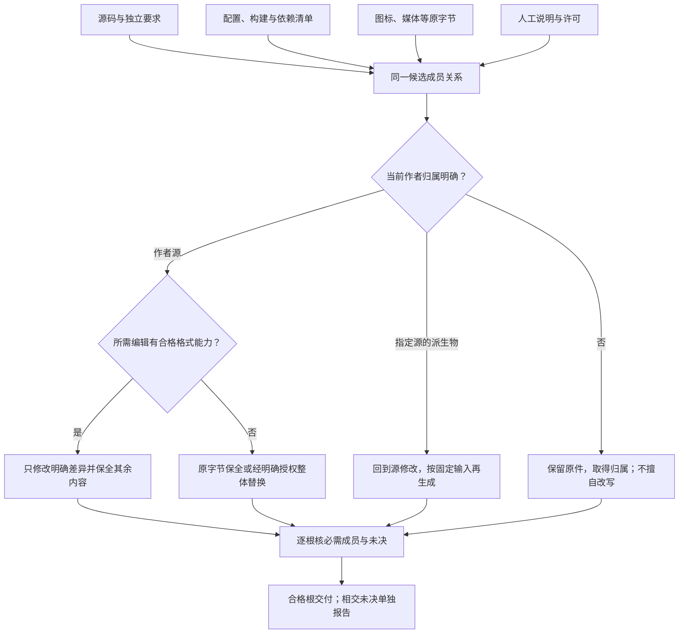
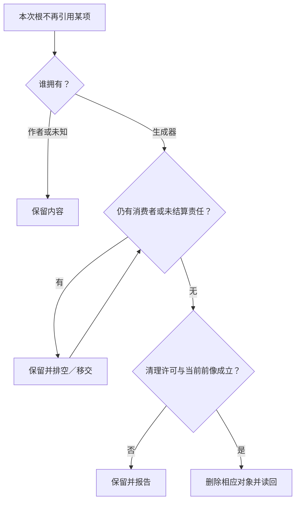

# 全工程资产与非源码管理

> **阅读范围**：采用范围内的设计规范；实现状态另查未决。

<details>
<summary>本页内容</summary>

- [逆向修改不只覆盖代码](#逆向修改不只覆盖代码)
- [1. 管理范围不以文件后缀或可解析性为门槛](#1-管理范围不以文件后缀或可解析性为门槛)
- [2. 资产合同采用正交维度，不用一张互斥类型表代替全部](#2-资产合同采用正交维度不用一张互斥类型表代替全部)
- [3. 最小资产视图与表示保全](#3-最小资产视图与表示保全)
- [4. 资产所有权：保留、生成、混合与外部状态](#4-资产所有权保留生成混合与外部状态)
- [5. S0至S7：从接入到完整修改的正向流程](#5-s0至s7从接入到完整修改的正向流程)
- [6. 非文本和移动仍使用原六工具](#6-非文本和移动仍使用原六工具)
- [7. 源、配置、资源和依赖的一次联合变更](#7-源配置资源和依赖的一次联合变更)
- [8. 配置与生成的细节不留给偶然宿主行为](#8-配置与生成的细节不留给偶然宿主行为)
- [9. 各种不需要、未知和旧责任怎样退出](#9-各种不需要未知和旧责任怎样退出)
- [10. 验收轨迹与当前边界](#10-验收轨迹与当前边界)
- [资料与取舍](#资料与取舍)
- [11. 意图改变时谁拥有源码以外的结果](#11-意图改变时谁拥有源码以外的结果)
- [任务局部视图不成为整工程的替代副本](#任务局部视图不成为整工程的替代副本)
- [实现主链消费资产的保持范围](#实现主链消费资产的保持范围)
- [全资产在成品模块间的交接](#全资产在成品模块间的交接)
- [关系报表的数据输入和输出成员](#关系报表的数据输入和输出成员)
- [计算工程的数据制品与运行输出](#计算工程的数据制品与运行输出)
- [全生命周期信息的资产接入](#全生命周期信息的资产接入)
- [空目录、版本控制与交付的不同能力](#空目录版本控制与交付的不同能力)
- [开发者修改的不仅是源码：资源、配置、模板与说明](#开发者修改的不仅是源码资源配置模板与说明)
- [文件重组、原生解析与实际发布](#placement-change-contract)

</details>


本章拥有“工程中每一种内容怎样纳入、解释、修改、生成、交付和退出”的共同资产合同。文件观察的实际捕获由[导入观察](../../开发/原生维护/导入观察与原生资产.md)承担，修改与恢复由[持久化提交](../../运行/持久化提交与恢复.md)承担；本章定义调用方如何选择对象、所有权和动作。


由不同主体或外部适配生成的代码、依赖和资源先进入[目标贡献汇合](../../编译/目标/成员布局与完整产物.md#supply-artifact-composition)。只设一个当前目标配置的写入拥有者；不能各库单独覆盖package.json、构建文件或资源索引。源范围可以没有算法文件，实际资产仍然有完整归属。缺必需资源限制相交发行根，不把源签名通过代称完整工具交付。

## 逆向修改不只覆盖代码

受管目标中的配置、样式、资源URL和生成文档按实际生产者映射回源；原本是作者文件的资产直接编辑。相同字符串不证明相同来源，阈值12、图片宽度12和版本12不能由全仓替换同时修改。生成器对没有可靠格式写回方法的区域保留草稿与具体缺项，不用整文件重印吞掉注释或未知字段。

代码回源后，将受影响资产纳入同一候选及完整成员集合。人工README/图标未被本次接受要求改变时保原内容；并发变化按前像和三方关系处理。来源映射本身不授予读取私有资源的权限，分发维护材料不得泄露原工程未授权内容。

## 1. 管理范围不以文件后缀或可解析性为门槛

SEC管理的是工程资产及其关系，不只是.sec、TS或某种AST。文件、目录、符号链接、外部只读引用、大对象、运行数据、工具状态各有生命周期。未知格式可以原字节保全、比较、复制和在权限内替换；“暂时不能理解内容”不等于“不能管理它”。反过来，已经能解析JSON也不等于可以安全修改其中的业务。

默认不搬迁原目录，不将所有文件转成JSON，不为每个文件创建业务对象。小工程的资产清单由有权扫描和已有构建输入派生；作者仅保存覆盖默认的角色、生成规则、分发和隐私选择。明确要求保全的空目录、可执行位、链接对象或其他元数据也属于输入，不依赖Git能否天然跟踪它们。

## 2. 资产合同采用正交维度，不用一张互斥类型表代替全部

每项按需要具有：逻辑定位与物理种类；作者来源；内容身份或外部版本；解释器与读取能力；允许动作；真实依赖；分发范围；数据敏感性；保留与恢复责任。一个PNG同时可以是用户作者资产、打包输入和敏感内容；这些角色不互相覆盖。

| 常见内容 | 默认作者/来源 | 合法管理与变更方式 | 特别边界 |
|---|---|---|---|
| 中立源码与原生代码 | 对应源文件 | 原文或语义编辑、编译和映射 | 不双写源与AST；保留未知区和未保存缓冲 |
| JSON/YAML/TOML/XML/INI配置 | 原配置，或明确生成定义之一 | 保全解析树和注释；字段级候选；重新校验 | 重复键、锚点、顺序和覆盖规则按格式解释，不任意排序重写 |
| 构建/依赖/锁/CI/容器/安装文件 | 原配置或生成规则 | 依相交能力共同生成、比较并应用 | 读取不执行脚本；锁由实际解析产生，不手编一个假“已安装”结果 |
| HTML/CSS/模板/样式与UI资源 | 原资产或上游设计 | 使用实际解析器和目标规则，联动引用 | 选择器、URL、转义、模板阶段不当成普通字符串拼接 |
| 图片/音频/视频/模型/字库/二进制资源 | 原字节或实际生成器 | 复制、替换、转换候选、元数据观察 | 转码和去元数据是显式变化；不能全局文本补丁 |
| CSV/数据集/本地样本/模型权重 | 固定内容或受信引用 | 取得版本/分片、验证编码与结构、按需转换 | 采样不代表全量；列类型推断不自动成为独立业务真值 |
| 数据库/消息/设备与外部状态 | 实际服务的读取/变更协议 | 快照、迁移、读回、订阅及准入 | 活数据库不能被当普通文件直接复制为一致备份 |
| 文档/注释/图表/许可证 | 作者文档或可定位事实源 | 文本编辑、链接更新、从公开合同派生局部内容 | 说明不自动变成命令；不可推导理由不从代码伪造 |
| 版本库内部对象、索引、refs与工作区设置 | 实际版本控制工具 | 通过对应读取与版本变更协议，保留关联和锁 | 不直接编辑.git内部二进制索引或把blob清理当普通文件删除 |
| 第三方vendored依赖/子模块/大文件指针 | 具体外部版本和许可 | 保全来源与内容绑定，生成升级候选 | 指针不是实际内容；没有下载或安装许可不隐式获取/执行 |
| 构建输出/声明/映射/包 | 明确生产者 | 根据输入生成和逐项读回 | 输出消失不自动许可删旧文件；一个逻辑输出只有一个选定生产者 |
| 缓存/日志/临时文件 | 当前工具或运行 | 明确预算与有效期后回收 | 可重建缓存与活跃恢复前像、必要业务结果不同 |
| 秘密/凭证/签名密钥 | 真实秘密管理者 | 只保存不泄露值的引用，执行时窄范围解析 | 不进模型提示、普通摘要目录、产物和源码；变化资格按安全协议处理 |
| 未知文件与特殊文件 | 原对象 | 普通文件可字节保全；链接按链接处理 | 设备/FIFO/socket默认不读取成无限文件；未知不递归执行 |

此表是范围索引，真正动作由后文协议决定。没有账户、数据库或远程服务的程序不创建这些对象；它的文档、图像和构建文件仍然是完整工程的一部分。

## 3. 最小资产视图与表示保全

AssetView是现有WorkspaceSnapshot/FileObservation/Artifact的稀疏投影，不再建一张永久资产数据库。必要字段为：本次定位与根范围；file/directory/symlink/external等种类；可用内容版本；观察的编码和元数据；作者/生成/外部/运行角色；所选允许动作与缺口。只有真实消费者需要稳定外部引用时才增加长期资产身份，普通路径列表可由扫描派生。

精确字节、逻辑解码值和格式化表示分别记录。UTF-16文件、BOM、CRLF和混合换行在无语义编辑时原样保留；字段编辑通过有能力的格式适配器修改目标区域。格式适配器不能保全注释或未知字段时，返回“只能整份候选/只保全”的能力，不假装局部写回成立。

Git索引、工作区字节、过滤后的检出内容可能不同。Git属性能驱动行尾/编码转换及clean/smudge程序，因此版本库blob摘要不自动等于目标读取字节。读取器要绑定实际层与转换规则；执行过滤器必须作为受控工具动作。未安装的LFS/外部对象不会被指针替代为已取得的完整二进制。

符号链接默认保存链接本身的目标字节与元数据，不跟随越出根；硬链接的别名影响必须检查。大小写冲突、Unicode文件名规则、Windows保留名、可执行位、权限/xattr等根据目标文件系统画像决定。宿主不支持某项必需属性时，保留候选并报告该属性缺项，不以“文件内容一样”签发完整迁移。

### 媒体、字体、文档容器与压缩资产的解释边界

非文本字节仍由原Asset/Artifact拥有；这里增加的是按需派生的**解释视图**，不是第二媒体数据库。扩展名、HTTP `Content-Type`、magic/sniff结果、container format和内部codec分别保留；任何一个都不能单独证明其余项。

```text
MediaAssetView = derived {
  sourceAssetAndContentRef,
  suppliedTypeAndOrigin,
  detectedContainerOrFormatAndMethod,
  decoderProviderAndRevision,
  streamTrackFramePageOrMemberStructure,
  codecPixelSampleAndCompressionProfiles,
  colorOrientationTimingAndLayoutMetadata,
  fontOrTextRenderingMetadata?,
  privacyAndActiveContentMetadata,
  decodedResourceBoundsAndCoverage,
  unsupportedOrAmbiguousFeatures
}
```

**类型识别。** 文件名后缀只是locator提示；网络supplied MIME与基于字节的computed/detected type分开。某格式允许脚本、宏、外部引用、字体、ICC profile、嵌套压缩或附件时，成功解析头部不自动授权加载这些内容。内容嗅探本身有安全语义，不能把未知字节猜成可执行HTML/script再自动运行。

**图像。** 原始压缩字节、decoded pixel raster和显示结果分开。width/height、bit depth、pixel format、alpha、orientation、animation/frame timing、ICC/CICP/color space/transfer function和metadata都可能改变真实显示/处理。EXIF orientation等“只在metadata”的字段可以改变视觉结果；去metadata、auto-rotate、color conversion、resize/crop分别是Transformation。看起来一样的PNG/JPEG/WebP/AVIF字节可以不同，字节相同也只证明同一内容，不证明所有decoder/rendering stack输出相同。

**音频/视频。** container与codec分开；一个container可含多video/audio/subtitle/data track。packet/frame timestamp绑定其time base，不能把frame序号、PTS/DTS、wall clock和恒定FPS互换。variable frame rate、edit list、rotation/display matrix、channel layout、sample rate、color/HDR metadata和字幕时序都进入实际消费合同。只改封装(remux)和重新编码(transcode)是不同Transformation；转码可能损失质量、metadata、时间或无障碍轨道。

**字体。** font file、family/style显示名、face/collection成员、glyph coverage、OpenType feature、variation axes/instance、script/language shaping、metrics与最终glyph run分开。变量字体同一字节在不同axis coordinates可产生不同轮廓和metrics；font fallback/shaping engine变化也可改变布局。subset/font conversion形成新Artifact，必须保持所需glyph/features/metrics并单独处理license/embedding限制；family name相同不能合并不同字体制品。

**归档/文档容器。** ZIP/TAR/package/PDF/Office等container展开前先固定原字节并施加member count、compressed/expanded bytes、nesting、path length和CPU/time预算；member path经过目标平台路径规则，拒绝absolute、`..`逃逸、非法symlink/hardlink和碰撞。声明大小、CRC/hash或目录结构不能单独防zip bomb/解压资源耗尽。PDF/SVG/Office等可能含active content、remote resource、embedded file或字体；读取/渲染/执行分别授权。

### 转换、质量与可重现性

媒体转换继续使用原Candidate/TransformationView/Artifact链。至少说明输入内容、tool/codec revision、options、目标format/profile、保留/删除metadata、color/timing/layout policy、lossless/lossy类别、质量Oracle、资源和输出成员。

```text
MediaTransformationClaim = exact {
  sourceAssetRefs,
  transformProviderAndRevision,
  formatCodecAndOptionRefs,
  semanticPreservationScope,
  metadataPreservationOrRemoval,
  qualityMetricAndThresholdRefs?,
  deterministicOutputClaim?,
  outputArtifactRefs,
  verificationEvidenceRefs
}
```

“lossless codec”只在其定义域说明解码媒体值保持，不自动保持container metadata、文件字节、track ordering或颜色解释。视觉/听觉近似等价也不能代替byte identity。若release要求reproducible artifact，编码器版本、硬件路径、线程/随机/metadata timestamp等真实非确定输入必须固定或规范化；只要求质量范围的媒体可以允许字节不同，但结果资格按quality Claim而不是hash equality给出。

metadata stripping是隐私/产品变换，不默认安全：去GPS可能仍保留缩略图、XMP、文件名或可识别像素/音频；同时某些metadata是正确显示/无障碍/版权所需。由相应DataUse/Requirement决定保留和删除，而不是一个`stripAllMetadata=true`通用规则。

### 解码器、渲染器和资源安全

媒体parser/decoder面对不可信复杂字节时作为Provider运行，输入大小小不代表解码输出小。预算至少覆盖展开字节/像素/帧数/采样、维度乘法溢出、递归container、CPU/GPU、内存、临时磁盘和外部fetch；无法安全预估时使用受限streaming/隔离并保留partial/unsupported。decoder crash、OOM或格式不支持是Provider结果，不把源资产标成“业务无效”除非对应Requirement确实要求该decoder/profile。

## 4. 资产所有权：保留、生成、混合与外部状态

**作者管理。** 工具默认保全，只有本次明确变更才修改。自动生成器不能认领同路径上的既有文件。

**生成管理。** 一个输出根有精确的生产者、源和实际内容集合。重建只更新其真正拥有的成员；缺省不存在的输出不是删除授权。首次采用生成所有权要比较原文件与新内容，并明确旧人工修改如何保留、迁入作者定义或转为显式补丁。

**混合管理。** 只有能识别稳定区域、保留其他字节并有三方合并能力的适配器才允许区域混写。注释标记本身不足以证明区域归属，恶意或重复标记要拒绝。不能可靠区分时选择整文件候选、拆出生成文件或显式转移所有权。

**外部/运行管理。** 数据库、远端对象、设备和服务由对应读取及作用协议处理。它们可以与工程文件共用任务与依赖，但不进入同一个假“多文件原子写入”。

覆盖来源是实际作者要求、已有构建规则与当前准入，不是仅根据扩展名猜测。新目录未有规则时保守采用作者保全；缺明确生成所有权则不清理。

## 5. S0至S7：从接入到完整修改的正向流程

<a id="fig-asset-closure"></a>

### 图解：全资产的来源、拥有者与完整根

关系表示输入和生产责任，不要求将所有字节语义化。未知格式保全，运行数据与作者配置分开。



**S0 固定任务。** 确定目标根、要改变的含义、返回/保存/发布目的和读取写入许可。未指定上传、安装、运行时，不因配置中有脚本而执行它。

**S1 建立当前清单。** 枚举有权范围、应用明确排除、记录成员、链接及缺失/拒绝；文件过大用固定内容引用，目录异动则重取受影响成员或标为弱观察。不把权限拒绝当不存在。

**S2 选择能力。** 按格式与任务选择byte-preserve、structured-read、structured-edit、regenerate或external-operation。每一项能力都绑定实现与版本；不存在合格编辑器时仍可保全，不先要求把未知资产迁写成.sec。

**S3 找相交关系。** 从实际解析、构建清单、manifest、资源引用和生成声明取得数据/配置/成员依赖。图片路径也可能藏在代码字符串中；没有可靠解析时给出保守范围或未解析引用，而不是用全仓字符串替换作为证明。

**S4 形成候选。** 修改主作者来源，派生源码、清单、资源映射和其他输出。保持未改字节和元数据。生成的删除必须单列原成员、拥有者与当前前像；外部数据迁移生成独立计划。

**S5 复核。** 检查文件格式、重复生成、引用、大小与元数据、目标构建和独立任务要求。解析可以现在做；需要运行外部工具时按本次授权。没有目标执行就不报告“已运行”。

**S6 采用。** 保存候选或对精确目标执行相应写回。按真实原子域分组；普通多文件目录采用已设计日志与恢复，版本目录可采用指针切换，外部服务使用它自己的协议。不是所有目标同时原子可见。

**S7 读回与后续。** 读回实际字节、元数据、引用与必要服务状态；记录真实完成和残余；新任务依据当前输入重算，旧操作恢复依据原意图。源包、部署包、备份包各自选择成员。

合法纯资源替换可以只走读取、候选与保存；全流程不是每文件八次调用。阶段可融合，但相交的数据与副作用不能被省略。

## 6. 非文本和移动仍使用原六工具

现有files路径到文本/null用于UTF-8源草稿；它不足以表达二进制、符号链接和受控元数据，本版不拿这条方便接口冒称全资产已支持。

通过propose的已有draft通道定义资产变更变体：kind固定为asset-change，base指精确候选，entries为非空有序列表。每项为put、move、remove、set-metadata之一，确切字段在下表定义。所有path/from/to位于当前逻辑根，显式beforeRef与从base推导的前像共同检查。普通文件put使用text或contentRef；不可变contentRef来自真实已上传/有权存储字节，不在JSON中base64复制大对象。move使用两端前提，不用删除加新增冒充身份已保持。元数据只接受目标画像声明的范围，目录删除还要封闭成员。

外部取得内容需要实际可用的上传/对象存储提供者；没有提供者时设计可保存为有缺口候选，工具不能虚构contentRef。链接对象通过put的kind=symlink及linkTarget表达，只创建链接，不隐式读取链接目标。普通二进制替换最小操作是已有base、path和新contentRef，其余精确事实由工具补入。

候选发布是批次完整的；实际应用依目标的提交能力，允许可恢复阶段而不声称全局原子。同批中更名并改引用先在候选图里完成；外部并发修改与未知引用分别诊断。目录删除不能吞掉新增文件，旧临时删除任务也不能作用于同路径的新物理实例。

该draft的顶层恰含kind、base和entries。条目是以下有判别的联合，不用同一个含糊path字段同时表示源和目标：

| op | 必需作者字段 | 系统从base取得与需要时才补的条件 |
|---|---|---|
| put | path；kind缺省为file，file时text/contentRef恰一；symlink时linkTarget；directory时仅需path与显式kind | 现有对象或不存在前提、种类和当前允许元数据；新文件编码由固定格式画像或明确encoding决定；目录不得带内容或链接目标 |
| move | from、to | 两端对象/不存在和同候选内引用、身份映射；目标冲突拒绝，不覆盖 |
| remove | path | 对象种类与前像；目录需要精确成员集合，新增成员阻断原删除 |
| set-metadata | path、非空metadata | 目标宿主实际支持的属性和值，比较原属性并独立校验权限 |

beforeRef为各条目的可选显式前像约束；省略时从精确base推导，不表示无条件写入。move的beforeRef是含from/to各自引用或明确缺失的对象，其余是单对象引用；与base不一致直接拒绝。put的kind为file、symlink或directory，省略时是file。directory条目必须含op=put、kind=directory和path，可按共同规则带beforeRef及有权限的metadata；不得含text、contentRef、linkTarget或encoding。symlink必须有linkTarget，不能带text、contentRef或文件encoding；file必须在text/contentRef中恰选一个且不得带linkTarget。未知kind与不适用字段在形成可应用候选前拒绝，不先尝试作用再回滚。编码变化必须明确且当前适配器支持；text只运输已经正确解码的文本，任意字节使用contentRef。未知字段与不适用字段拒绝，不忽略。

同批顺序先解析为一组候选操作。对相同对象的多次修改须能证明具有明确顺序与前像，rename链可规范化，循环交换使用临时身份和候选映射；无法消歧则返回冲突而不是“最后一条覆盖”。实际写回仍在申请时复查当前工作区，不把base的存在条件当永久事实。


### 结构编辑只产生它真正拥有的源变化

结构作者模块作为已定义内容格式进入本资产协议；基础body由[结构作者规范](../组合/结构编辑与身份保持.md)读取。文本作者通过结构修改时，最终候选仍只改对应作者字节，图布局不额外生成一份业务源。结构作者导出`.sec`也不自动将导出文件变成另一个可独立写入的权威。

改名可能涉及模块导入、代码引用和有明确定义的资源绑定。注释、普通字符串、图标或配置中恰好出现相同文本，不自动是引用；各格式适配器提供真实关系。不能把局部rename扩大成全工程字符串替换。原文无法可靠定位的区域可保全为未知，生成缺项准确限制对应结果，而不是重印全部文件以制造一次成功编辑。

候选中同时修改源与相交说明/资源是完整批次，磁盘写入仍分别比较实际前像；结构同义检查和文件恢复协议都不能替代另一项责任。

## 7. 源、配置、资源和依赖的一次联合变更

例：一个图像工具把算法改成需要新的解码能力，同时更换界面图标。初态中有.sec算法、公开接口、现有构建清单、README和assets/logo.png。

AI只提交两项独特改变：算法要求与新图标字节。编译器在已有允许范围选择合格解码实现，生成相应调用与依赖清单候选；资源适配器保留新图标内容，更新其实际引用；公开接口文档中由签名派生的部分同步变化，人工理由保持原文。锁由实际选择形成；没有包解析器不能伪造具体锁字段。

预览应显示：作者算法改变；实现采用哪种库及原因；哪些依赖/构建/接口产物变化；图标引用与字节替换；README中哪块派生、哪块没有触碰；尚未执行的安装/构建。没有理由修改CI就不修改；不因发现一张图像就重压缩所有图片。

并发修改README时，三方适配只改可靠定位的派生区；无法合并则保留双方并报冲突。图标在预览后被替换，应用检查前像，不能拿旧许可覆盖新字节。新库需网络下载而本次只允许离线，保留当前可行实现或报告相交缺项；不静默联网。

这条轨迹中，SEC库与第三方轮子是两层：算法可以由用户自己的.sec模块复用，具体编码器由后端绑定；开发者不必手写生成源码，也不必维护一份JSON版图像算法。

## 8. 配置与生成的细节不留给偶然宿主行为

配置覆盖按实际语言、项目与目标合同处理，不能普遍使用“最后读到覆盖”。重复键、集合合并、YAML别名和字符串插值由对应适配器保留。JSON Schema的default是说明性注解，不自动填值；读取器要显式执行已接受默认并显示来源。

归档文件默认可按原字节保全；要求展开时，对条目路径、链接、文件数、总解压大小和嵌套深度设实际预算，在隔离候选中检查冲突后再产生写回。压缩大小小不意味着展开成本小；未知或越界条目不能直接写出目标根。

构建规则保存输入、主要输出、副产物、动态依赖文件、目标环境、工具和参数。输出清单变化使相应目录成员依赖失效；删除旧副产物必须确认当前所有权与前像。CMake的OUTPUT/BYPRODUCTS/DEPFILE等不同角色说明文件生成不只是“运行一个命令”；SEC采用这些区别，不要求所有工程都用CMake。

引用重写使用实际格式AST/CST或规则：模块导入、资源URL、打包清单、安装路径和文档链接分别处理。任意字符串可能是数据而非路径；仅凭相同文字不能批量替换。无法判定的引用作为具体未知或保全区返回，而不是偷偷丢掉。

## 9. 各种不需要、未知和旧责任怎样退出

<a id="fig-asset-retirement"></a>

### 图解：生成资产退出与保留责任

流程只用于明确清理的生成拥有内容；未引用的用户文件不是垃圾，恢复资产不是普通缓存。



没有被选择的文件可以继续作为用户资产存在，但不进入本次产物；未知格式默认保全，并限制相交自动变换。未要求的日志、Schema、证据图、CI模板、数据库目录不生成空壳。

部署包通常含目标运行所需字节及许可资料，不带密钥、缓存和SEC控制状态。库源包含公开作者源、必要私有实现、已声明资源和精确依赖；“private”不等于不需要分发实现。备份包还需要独立保留当前恢复义务，但备份不会恢复已撤销权限。各包成员由不同目的选择，不能统一zip整个工作区。

曾生成而已不再选择的文件，只有本次明确清理、仍由同一生产者拥有且未被人工改写时才移除；否则显示旧输出/人工接管候选。活动日志、在途消息、唯一恢复副本按自身义务留存，不通过删除配置取消。大对象引用尚在不代表字节永远存在，过期在构建前取得或准确失败。

## 10. 验收轨迹与当前边界

正常轨迹覆盖：未知二进制保全；原编码文本的局部修改；更名与多个真实引用；源变更带出配置和依赖；生成物缩减但不误删人工文件；不启用的设施不生成；退出时清单与实际成员匹配。

反例覆盖：符号链接越根、硬链接别名、大小写碰撞、错误层的Git摘要、过滤器执行、YAML重复键丢失、只复制活数据库文件、版本控制大对象指针未解析、secret混入源码包、只改清单不改内容、自洽但属于另一意图的结果、旧清理任务删除新文件、解析不了就转成空对象。

这些是设计验收。默认采用现有格式工具与字节保全；不存在合格格式写回就给精确有限能力，不强求一次实现全部格式。所有文件可以进入管理范围，自动理解/修改/生成能力逐项兑现；范围限制不能被写成“这个文件永远不属于工程”。

## 资料与取舍

[Git属性](https://git-scm.com/docs/gitattributes)说明行尾、编码和过滤器影响不同层字节；[CMake自定义命令](https://cmake.org/cmake/help/latest/command/add_custom_command.html)说明输出、副产物和依赖的不同角色；[SQLite事务](https://www.sqlite.org/lang_transaction.html)限定实际事务能力；[JSON Schema注解](https://json-schema.org/understanding-json-schema/reference/annotations)说明default不自动填值。它们是机制来源，不认证SEC，也不要求用户工程安装这些全部工具。

## 11. 意图改变时谁拥有源码以外的结果

一个请求要求“输出完整模块并更新使用说明，其他资源不变”时，源、文档和资源分别保留自己的作者与生成角色。可从公开接口派生的文档区域由生成规则拥有；人工理由、许可证和历史说明保持原文。图片或模板被请求修改时进入同一候选，但它们不必被改写成.sec。

生成闭包只包含本次完整交付实际需要的成员。未被引用的用户资产不是垃圾；失去消费者的旧生成物也只在原拥有者、前像和清理请求成立时删除。预览产物清单与真正应用范围分开，一个候选既有源码又有数据库操作时也不取得全局原子提交。

自然语言把“改文档”作为设计交付时，只写获准的设计文件；它不能被全资产能力解释成同时运行构建脚本和修改部署。实际执行依旧按每个目标来源、权限和后像处理。无法理解某种资产格式，可以保全、定位和有权字节替换；尚不能结构化修改属于对应问题登记，不通过删文件来取得表面完整。

## 任务局部视图不成为整工程的替代副本

AI只改一个源参数时，未展示的图标、许可证、配置和其他源仍在原候选与资产闭包中；它们由生成与发布的真实消费者决定是否读取和携带。短视图不能被当成完整目录，以缺失为由删除未展示成员。

成熟格式适配器优先复用，但读/写能力及注释、未知字段、编码和元数据保全分别声明。只会解析值的工具不能自动承担保全写回。二进制继续通过真实内容引用变更，模型无需为缩短任务面而看到base64。完整归档的成员依据与当前AI展示范围分别比较，缺实际资源时不能靠源码检查通过认证完整发行。

## 实现主链消费资产的保持范围

纯编译输入由实际SourceBlob和必要资产引用组成，不从模型短视图恢复未展示文件。内存预览没有文件写权限；准备读取可以产生明确NeedInput，已选输出成员仍按本章计算。TS虚拟Host只使用捕获的配置、包和lib，不能通过默认宿主把未授权文件带进构建。

输出sink独立保存候选字节与成员；未知或失败生成不覆盖旧文件。原生文档和图片没有实际相交变化时保持内容与元数据；需要发布时，代码成功不替代资源闭包。实际写入继续使用原资产与恢复协议，不把compileFrozen的produced标记当发布许可。

## 全资产在成品模块间的交接

workspace持有固定资产与区域作者关系；semantics/格式适配提供本次可读、可编辑和引用关系；compiler汇合每个输出根的实际成员；execution执行获准写回；assurance记录格式、构建和原要求的真实检查。AssetView不是新数据库，也不能让格式适配器绕过作者前像直接写盘。

产物清单封存之前，核对每个成员的内容可用性、目标路径、生产归属、必需元数据、引用和公开分发范围。字节已经在ContentStore不等于该成员已经被正确列入本次包；同名的两个生产者也不能各自成功后最后覆盖。合格的源码根可以单独返回，缺必需图标的完整应用根仍缺项。

产物成员的存在与检查/采用资格分别保存。检查撤销不改变图标或源码字节，文件实际损坏则改变内容可用性并失效真实消费者。外部数据库、设备与远端状态继续使用自己的观察/作用合同，不加入一个假“所有资产同时提交”。

## 关系报表的数据输入和输出成员

资产清单可以成为[关系库](../../领域/状态关系与流/关系查询与维护.md)的有限输入，但AssetView/作者候选与目标Bag/ViewState不合并。扫描未读完、没有权限或文件消失时，不能发布为完整关系；同一个文件有两个标签也不自动变成两份文件。

数据集与表格的字段由实际codec解释。重复行、空值、编码和顺序保留；不因列名为id就推断唯一。生成报表时固定来源版本、查询、模式和输出格式，复用原产物集合拥有者。只改数据条件不能顺便重写CI、图标或手工理由。数据到CSV/JSON的转换及表格公式处理有明确目标策略，不能自动篡改原值；真正写出仍执行原前像与资产协议。

## 计算工程的数据制品与运行输出

计算工程的输入数据、源程序、构建产物、运行结果和观察记录分别有实际来源。静态样本可以是作者资产；用户每次选择的大文件是运行输入；运行得到的SVG或报告是该次RunRecord的输出；构建得到的可执行文件是源码产物的派生成员。它们共用不可变内容协议，不因此在每个数组元素上建立资产身份。

计算任务的完整包成员从入口依赖、目标构建和分发范围导出：所需库、运行资源、字型/样式、入口与许可不能遗漏，调试信息和检查样本只在交付目的需要时包含。运行数据不默认打进发行包；凭证和工作区控制状态不进入包。一个无需图标的纯库不被完整GUI包的成员条件阻塞。

新版本结果在隔离区构成完整引用，再由本次输出请求采用。目录导出保护已有人工文件；未完成写出不标为完整文件。大文件、流和二进制不经过文本patch；要暂存/外存算法时，需要真实空间和许可，当前暂停数据库不代表可以无限写临时磁盘。运行中间缓冲默认不是永久资产，只有检查点、复用或诊断确有需要时保留。


<a id="information-asset-routing"></a>
## 全生命周期信息的资产接入

[信息类别路由](../../信息/信息类别与生命周期路由.md)给出非源码信息的具体去向；本章仍拥有实际捕获、变更和交付协议。一个对象可以被源工程、证据、发布和恢复等多个目的引用，但发行成员只取实际ArtifactSet，不把“已索引”对象全放进安装包。未知格式、受限来源和不可冻结活数据按原有限能力及覆盖保全，不能用“全部信息统一管理”升级为全量复制或全格式编辑。

普通文档直接使用原file分支，不新增document操作；目录创建使用上面已明确的directory分支。信息提取、关系登记和检索投影属于已有候选/观察结果，只有明确的作者采用或实际作用才改变对应真源。跨命名域引用的取得与完整基线按[引用解析](../../信息/对象关系与配置基线.md#information-ref)处理。


<a id="empty-directory-persistence"></a>
## 空目录、版本控制与交付的不同能力

`put(kind=directory)`能在候选/支持的工作区表示空目录，不证明当前版本控制、压缩格式或发布器会保留它。[Ubuntu的git-ubuntu说明](https://ubuntu.com/project/docs/how-ubuntu-is-made/processes/git-ubuntu/empty-directories/)明确区分Git的tree对象可表示空树与常用index/前端操作不能可靠保留空目录；它还记录了某些构建要求目录真正为空、占位文件反而会破坏构建的场景。本章不简化成“Git内部完全没有目录”。

调用方先声明需要的是当前工作区存在、从作者源重新创建、发行成员保留，还是新检出后直接存在。workspace/adapters核对应能力，不能用本地mkdir成功替代后面三项。确需持久描述时使用该工程已定义的资源/生成/交付清单中的目录项或构建规则；清单本身必须是明确拥有的作者信息，不能只留在过期候选或工具记忆中。未定义合适清单且目标必须直接保留时，返回该持久/发行能力缺项，不先伪造一个新格式字段。

默认不偷偷添加`.gitkeep`或其他占位文件，因为它改变目录成员；用户允许非空占位且真实消费者接受时才采用该替代。可以在受权构建/安装阶段重建目录，但必须记录这与原样检出之间的保证差别。明确的空目录加入ArtifactSet精确成员与验证范围；仅比较文件哈希不证明它存在。这个限制不阻止独立文件改动或当前目录的合法创建。

<a id="developer-asset-route"></a>
## 开发者修改的不仅是源码：资源、配置、模板与说明

现有asset-change及files继续承担实际差异，目录/二进制/链接分支不变。开发面应允许一次候选共同新增API、帮助消息、图标、测试数据、配置及说明；每项保持原作者拥有者、内容角色和许可，不要求为“小资源”注册一个业务对象平台。只改一个普通文本仍用最小入口；需要引用原二进制时取得真实contentRef，不能把摘要当已有内容。

配置编辑使用原工具的解析、注释/顺序和继承规则。支持schema/类型时可给字段补全、当前值和来源；schema不足以证明路径存在、目标可用或权限成立。动态配置需要执行才能解释时，先保全原文，只有明确获准才能加载；不因为文件叫config就把顶层函数当无作用。把显式值删除以恢复缺省，和把值设成当前缺省，保留未来语义区别。

模板/生成器的作者源、输入和生成结果分别显示，更新模板先用原依赖关系找真实消费者；不能把所有同名generated文件都覆盖。多输出共同资源要由真实共享拥有者协调，单独更新一个目标不清理另一个未选目标的文件。用户手改受管输出，先保留目标草稿和选择回源/接管路径，再处理冲突。

文档与消息跟随实际行为变化：API名/参数/错误、CLI帮助、退出码、配置缺省、权限提示、安装/恢复说明和示例的消费者一并评估。设计中的命令标设计，实际发布才给对应可运行步骤；不因文件能通过Markdown校验就报告命令已执行。翻译沿唯一中文源和版本关系，新增消息未翻译可准确回退或阻止要求完整语言的发行，不悄悄显示旧义文本。

目标软件的视觉布局、键盘操作、资源可访问性和媒体许可是该软件真实功能，不能因SEC本身不做GUI而从目标工程遗漏。SEC可以保全/生成/修改相关资产并调用已绑定检查，不能凭存在文件就认证视觉或无障碍达标。实体设备图纸、数据库迁移、模型权重和服务配置需要领域方法的继续处理，不能从通用put派生现场部署权限。

删除资源前按真实成员、引用与恢复用途判断；清理unused仅在相应消费者发现完整且方法保持时提出。空目录按原重建/检出/发行能力分别对待；不能以占位文件或删除空目录改变构建要求。复用第三方素材/模板时保留实际来源和分发义务，替换后重核相交制品，清理缓存不等于撤回已发行素材。

<a id="placement-change-contract"></a>
## 文件重组、原生解析与实际发布

本节细化既有asset-change与作者编辑，不新增公共MovePlan、目录事务服务或平行写入接口。主体延续、内容是否变化、解析上下文是否变化、公开地址是否保持、执行资格是否仍成立必须分别回答。修改主位置不等于任意消费者不受影响；路径成为解析/资源/协议输入时，即使字节未变，相交结果也须重新评价。

### 创建、移动、拆并的准备

先固定原base、实际源根/模块/锁与必要未保存缓冲；确认区域的当前作者拥有者、目标前像、目标支持的文件名/链接/权限/原子能力，以及本次允许触及的范围。文件变更仍用本章已有`put / move / remove / set-metadata`条目；字段、缺省、顺序和beforeRef不在此重定义。拆分/合并由真实语言或格式适配器产生同一基础的准确编辑，不能仅改路径假装语义已迁移。

放置预检要涵盖实际消费者：相对import与re-export、package边界/exports/imports/type、tsconfig/rootDir及解释选项、构建标签/输入glob、原生插件发现、工作目录/ancestor lookup、模板、动态加载、测试/fixture/runfiles、资源URL/CSS引用、源码映射、CLI脚本、文档链接和已发布地址。对路径字面值使用其真实语义，不做跨文件字符串替换。读取不存在文件、目录枚举与新增上级配置也是依赖；只查原文件的import者不足。

准确分析能证明边界内等价时只重核相交义务；未知动态消费者时扩大到其模块、包或真实运行画像。未能枚举且存在外部支持承诺时，采用有明确委托的兼容地址或停止该破坏性切换，不把“搜索零命中”称为外部消费者清零。Git给出的rename候选可辅助审查，但不是对象连续性或语义等价证据。

### 候选、验证与写回

workspace先形成新候选，包括名字/位置、实际引用修改、必要module/构建/发现配置及相交测试/文档链接；生成的新图和索引从候选重算。身份延续映射由原主体/区域及操作依据核定，内容摘要按实际新字节计算；不能因旧ID未变直接复用原ActionKey或旧来源坐标。源码实际已由外部编辑器保存时，以真实观察纳入新基础，不再无条件重复apply。

静态检查包括：成员无缺失/覆盖、文件与目录冲突、大小写/Unicode别名、可见性/静态方向、公开入口、生成者与作者唯一性。类型、运行、真实文件系统、发布包和恢复验证分别绑定其条件；未运行只保留未取得义务，不能让目录检查替所有行为检查。代码位置和名字在同一完整消费者切片中一起更新，不先留下断链的半迁移供别人继续。

只有明确请求保存或写产物后，application才把候选和目标交原execution重新核权限、真实前像和资源。作用意图、必要恢复材料先保全；实际Provider执行后按原操作身份读回文件、成员、元数据和状态。目录里实际有什么不能反过来替代原先选择的完整成员集合。

### 并发、文件系统与未知结果

同一文件系统上一个rename的原子性不等于整个多文件修改、Git ref、数据库和远端系统共同原子。多个文件须使用Provider实际提供的事务/交换边界；没有则分项记录、保留失败与恢复，不能把UI的一次“移动”包装成无条件all-or-nothing。跨设备通常走有权复制到staging、验证字节和元数据、切换可用引用、确认旧消费者/写者退出后退役原件，不能先删唯一源；具体步骤随Provider能力变化。

仅大小写改名、名称互换或重叠目录移动须在候选中归一化目标冲突，物理执行可使用独占临时名称及明确恢复点。目标已被他人创建、源被编辑、父目录被链接替换、权限/挂载变化、磁盘满、进程持有文件或外部响应丢失，均不能被普通重试吞掉。路径词法合法不证明物理根内；打开、解析和写入之间的竞争需要实际根句柄/无跟随等能力或受限环境保证。

中断后先查原operation及真实前后像，识别未开始、部分完成、已完成但未回执、仍在途或未知。仅对仍有资格且安全的缺段继续；未知非幂等动作不盲重发。回滚不覆盖后来独立编辑，新格式旧写者不能安全处理时优先前滚或隔离。旧构建/运行/打开缓冲继续持有自己的精确源与制品；名称腾空不等于可复用旧身份、解除保留或清理恢复日志。

链接、硬链接、Git控制目录、LFS指针、外部只读挂载和其他提供者只按已声明能力处理。未物化大对象不能声称已完整迁移；不跟随链接复制秘密、不通过共享硬链接修改原缓存。空目录、模式位、BOM/行尾和过滤器需要时进入保持条件，不能因内容文本相同省略。

正常轨迹、跨包改变含义、目标冲突、仅大小写改名、跨设备中断、未知外部结果、旧缓冲写回、只读/生成区域、撤权与缓存失效分别构成验收。原生机制依据见[文件位置与原生工具](../../依据/来源/工程信息组织依据.md#native-placement-evidence)，本节是产品要求，不声称所有宿主能力已实现。
