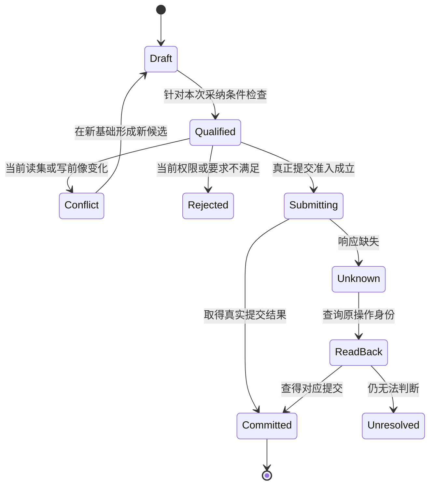

# 身份知识与模型采纳

> **阅读范围**：采用范围内的设计规范；实现状态另查未决。

<details>
<summary>本页内容</summary>

- [要求陈述和观察结论的不同采纳](#要求陈述和观察结论的不同采纳)
- [时间、因果、一致性与不确定完成](#时间因果一致性与不确定完成)
- [知识状态、事实与权威](#知识状态事实与权威)
- [身份、修订、代际与来源](#身份修订代际与来源)
- [模型采纳事务与一致性](#模型采纳事务与一致性)
- [项目组成与表示等级](#项目组成与表示等级)
- [从证据到可消费事实的裁决算法](#从证据到可消费事实的裁决算法)
- [精确意图的接受关系与派生语义更新](#精确意图的接受关系与派生语义更新)
- [文档、数据与运行资料的跨域引用](#文档数据与运行资料的跨域引用)

</details>


## 要求陈述和观察结论的不同采纳

同一任务中的“应当”与“当前是”分别取得身份。观察器可以报告函数实际返回值域、目标布局和端口响应；这些事实不能自动改变用户已经接受的结果要求。模板、代码注释和外部文档里的政策，只是其来源的陈述，未获当前权威采纳前不成为运行权限。

采纳处理先对齐对象、范围、版本与陈述角色，再检查本次主体是否有权修改这一角色。实现编辑只改变候选定义；要求修订改变后续任务的接受基准；证据替换只影响被支持的声明与资格。明确的联合修改可以共同采纳，但仍保存各自关系和真实变化，不能靠一个全局revision掩盖某项未获准的改义。

算法上，保留当前接受关系；应用候选后计算受影响的要求、定义、策略和独立验收；对每一关系分别检查来源与新前提；最后在原采纳提交点一起发布合法关系。发生冲突时返回具体未接受差异，不用新候选证明它自己有权。没有状态写入的纯生成只读取这些关系，不初始化知识治理服务。

一个原任务允许多种实现时，有权政策可以自动决定可逆选择；真正缺事实的业务条件仍然保持未知。默认选择的来源、有效范围及重开条件由现有Binding承担，不新增“最佳实践”这类不可追踪权威。

## 时间、因果、一致性与不确定完成

### 1. 时间戳不是因果

墙钟可能漂移、回拨、精度不足或来自不同主机。事件发生时间、观察时间、提交顺序、因果顺序和有效期必须分离。

```text
TemporalCoordinate =
  EventTime
  | ObservationTime
  | MonotonicAttemptTime
  | LogicalOrder
  | RevisionOrder
  | ValidityInterval
  | Deadline
```

### 2. 因果关系

```text
CausalRelation = produced-by | observes | happens-before | depends-on
               | invalidated-by | compensates | retries-after
```

因果依据是程序顺序、消息发送/接收、明确依赖、或在声明一致性模型内的提交关系。Revision/CAS 提供该 owner 的版本和竞争关系，不自动给出所有外部事件的全局顺序；逻辑时钟数值较小也不能反推真实因果。

单调时钟用于同一 `ClockDomain` 内测量经过时间，不是跨主机因果证明。时间戳接近或大小关系不能代替消息与事务证据。

### 3. 一致性合同

领域必须明确选择：线性一致、顺序一致、因果一致、会话一致、最终一致、快照隔离或其他模型。不能写一个泛化 `consistent=true`。

```text
ConsistencyContract = exact {
  subjectUniverse,
  readAndWriteOperations,
  orderingGuarantees,
  visibilityRules,
  conflictResolution,
  stalenessBounds,
  partitionBehavior,
  recoveryAndReadback,
  unsupportedCases
}
```

### 4. 不确定完成

外部请求 timeout、进程句柄丢失、网络分区和 crash 可能使结果既不能证明成功，也不能证明失败。此时状态必须是 `completion-unknown` 或 `recovery-required`。

处理不是统一“先查一次再重试”。按[目标幂等协议](../../运行/持久化提交与恢复.md#幂等授权与出站交付协议)选择：可查询时读取精确结果；目标在当前去重窗口提供同键效果保证时可以同键重试；两者都不具备则保留未知并协调/补偿。不得换新请求身份盲目重发，也不得把一次陈旧的不存在观察当成已经排除原效果。

### 5. 截止时间

每个有界逻辑请求先固定总时间窗口；其attempt使用 `ClockDomainDeadline = {clockDomainRef, monotonicDeadline}`。同一时钟域内，attempt期限不晚于请求总期限，子步骤不晚于所属attempt期限。排队、退避、重试及交付均计入原窗口，不能按新attempt身份重新取得完整时长；没有发生重试的单次调用可以直接使用同一个期限，不强迫额外对象。不要把一台主机的单调时钟读数直接发给另一台主机比较。

跨进程或跨主机交接明确传递剩余 duration、传播开销处理和接收端时钟域；接收端据自己的单调时钟建立局部期限。严格端到端上界还依赖传输延迟、调度与时钟漂移的界；没有这些界时只承诺相应局部预算和超时行为，不假装存在全局硬期限。

墙钟仍用于证书、授权和业务日期的有效期判断，但必须声明时间权威、偏差容忍及不确定时的拒绝/查询策略；它不承担无假设的跨主机单调推理。持久任务不能把进程重启前的单调读数当作重启后的有效期限。

恢复跨进程请求的剩余时间须由原持久约定、可信时间依据及其误差界重新确定；无法确认时保留过期/未知判断，不以重启时刻建立新的完整业务窗口。原请求的待结算作用继续沿恢复合同处理。期限改变影响后续资格，不改变已经发生的结果、花费或副作用。

请求超时停止新业务工作，不等于外部 Effect 已取消。当前 attempt 的清理/读回使用已预留预算；预算不足时持久化恢复义务并报告 `recovery-required`。之后的恢复工作经过独立准入、权限与预算，只用于确认/收敛未决效果，不能偷偷续跑已过期业务或把原请求改成成功。

### 6. 反例

- API 超时后重复创建两份资源；
- 两个服务墙钟顺序与真实提交顺序相反；
- 最终一致索引被当作强一致权限源；
- stale read 触发错误补偿；
- 超时取消主进程但子进程继续产生 Effect；
- 事务已提交但客户端丢失响应后执行回滚脚本。

### 7. 验证

需要时间回拨、跨时区、网络延迟、乱序、重复、分区、进程崩溃、确认丢失、ABA 和旧 leader 晚到等故障测试。

## 知识状态、事实与权威

### 1. 知识状态

```ts
type KnowledgeState<T> =
  | { kind: 'known'; value: T; provenance: ProvenanceRef }
  | { kind: 'unknown'; reason: UnknownReason; scope: ScopeRef }
  | { kind: 'conflicting'; alternatives: readonly AssertionRef[] }
  | { kind: 'ambiguous'; interpretations: readonly T[] }
  | { kind: 'opaque'; boundary: OpaqueBoundaryRef }
  | { kind: 'unsupported'; capability: CapabilityRef }
  | { kind: 'stale'; previous: T; invalidatedBy: readonly ChangeRef[] }
  | { kind: 'invalid'; diagnostics: readonly DiagnosticRef[] };
```

`null`、空数组和异常不能替代这些状态。

### 2. 事实、声明和决定

| 对象 | 含义 | 能否直接授权效果 |
| --- | --- | --- |
| `Observation` | 某观察器在特定覆盖下看到什么 | 否 |
| `Inference` | 根据规则、统计或模型推导的候选 | 否 |
| `Definition` | 有权主体接受的规范含义 | 仅作为规则输入 |
| `Requirement` | 必须满足的条件 | 否 |
| `Decision` | 有权主体在候选间作出的选择 | 仍需执行准入 |
| `Claim` | 可被验证的命题 | 否 |
| `Evidence` | 针对声明的证明材料 | 否 |
| `Verdict` | 在适用范围内对声明的裁决 | 可作为提升条件，不直接执行 |
| `Grant` | 对具体效果的授权 | 是，但还需其他准入条件 |

### 3. 观察覆盖

观察必须带：

```text
ObservationCoverage = {
  requestedScope,
  observedScope,
  excludedScope,
  inaccessibleScope,
  unsupportedScope,
  budgetExceededScope,
  freshness,
  observerRevision
}
```

“没有观察到”先保留观察范围。统计性观察可以在已声明检出能力下支持有限风险判断；用于创建、去重、权限或其他强前提的“不存在”，必须来自相应键/范围在明确版本和许可下已完成的权威读取，并在实际提交点重新验证。具体取得和失效规则见[快照协议](../../开发/原生维护/导入观察与原生资产.md#精确缺失与弱否定证据)。

### 4. 权威根

系统区分：

- 工程通用规则定义权；
- 项目采纳某规则 revision 的决定权；
- 产品目标和优先级决定权；
- 领域定义权；
- 仓库、分支和发布治理权；
- 外部发行者对其资源的事实权；
- 运行目标对最终状态的读回权。

项目可以决定“采用某工程规则”，但不能因此拥有该通用规则的普遍真值。

### 5. 冲突

冲突不能由最后写入或来源数量自动解决。解析需要：

```text
ConflictResolution =
  AuthorityPrecedence
| ScopePartition
| RevisionSupersession
| EvidenceDominance
| ExplicitDecision
| RemainConflicting
```

不同来源一致可提高置信，但不能把多个低权威推断自动升级为定义。

### 6. 陈旧传播

当输入、算法、政策、权限或环境变化时：

```text
Known(previous)
→ Stale(previous, invalidatedBy)
→ Recompute or Revalidate
→ Known | Unknown | Conflicting | Invalid
```

陈旧不是错误，也不是继续可用的已知。消费者必须声明是否允许陈旧读取和最大陈旧窗口。

### 7. AI 与启发式

推理方法与有权行动者是不同坐标。AI、命名启发式、统计模型或人工直觉的推断本身只提供Inference、候选关系/约束、澄清与反例，不因说得确定就形成可信事实、许可或独立保证。

人和AI都可以通过有权主体的实际委派与政策提交、修订、采纳或执行规定范围内的变化。身份来自真实认证，不从候选里的角色名推断。定义、决定、授权或Verdict能否成立分别检查其来源与签发条件，不以“由AI参与”一律拒绝，也不以“由人参与”自动放行。

自主检查与修错是正常开发；某声明要求独立证据时才按其合同分离方法和角色。采纳后保留原候选、采用的假设、精确基础与有权决定，不能让批准把错误观察改成物理事实。

### 8. 不变量

- 缺信息不等于不存在；
- 可用工具不等于有效事实；
- 事实不等于决定；
- 决定不等于执行授权；
- 工具成功不等于声明通过；
- 多数来源不等于高权威；
- 推断必须保留替代解释和反证条件；
- 任何知识提升都有签发者、范围、revision 和失效条件。

### 9. 并存状态与视图投影

上面的 tagged union 是一次查询的摘要视图，不是所有知识对象的完整存储代数。过期断言也可能互相冲突；某子区域 opaque，同时另一子区域因预算不足未观测。完整记录保留各断言、范围、原因、freshness、覆盖与诊断，查询再按明确策略选择一个主摘要并附其余信息。

`unsupported` 表示某能力/环境不能完成所需操作，不等于命题为假；`invalid` 表示记录或推导不合法，不等于现实不存在。运行环境错误、数学类别边界、实例无解证据与预算耗尽分别保留，禁止为了塞进单一枚举而丢弃决定性事实。

## 身份、修订、代际与来源

### 1. 身份与演进坐标

| 概念 | 含义 | 典型变化 |
| --- | --- | --- |
| `Identity` | 仍然是同一个语义对象 | 名称、地址、表示变化不改变 |
| `Revision` | 同一对象内容或状态的不可变修订 | 接口、定义、源码内容变化 |
| `Generation` | 一组对象或派生物的协调发布快照 | 工程观测、系统定义、索引发布 |
| `Epoch` | 权限、租约、领导权或运行窗口 | 撤销、重新选主、会话重建 |
| `Version` | 对外兼容和支持承诺 | 公共协议或持久格式演进 |
| `Attempt` | 一次物理执行尝试 | 重试、恢复、换 runner |

这些概念不能用一个字符串 `version` 混用。

### 2. 身份坐标

稳定身份由领域合同决定，不能默认从易变物理位置推断：

默认稳定身份为“不可变的分配作用域＋该作用域内的创建标识”。这里的作用域是身份发行域，不是可以重命名的显示命名空间；`kind`、当前模块位置和外部地址是受校验的属性/绑定，不默认参与会随编辑改变的身份拼接。若领域明确选择外部协议身份，单独记录该合同及复用规则。

同一对象的内容修订、名义类型含义、运行实例和当前写入权分别绑定。保留同一实体ID不能让改变含义的类型自动兼容，也不能让恢复的控制库自动重新获得写权；见[类型与实例身份](../../领域/计算基础/通用计算与任务语义.md#类型与包实例的身份)和[副本分支与权威重建](清单模块与绑定锁.md#副本分支与权威重建)。

物理路径、数据库主键、URL、进程 ID 和 Provider handle 通常是 `Locator` 或 `Binding`。若领域或外部协议明确把其中一项选作身份组成，则必须保存该选择和重命名/复用规则；不能靠“路径不是身份”抹去真实公共合同。

没有在源文本中显式写ID，不代表删除了身份义务。声明的首次发行、基于精确编辑的续用、丢失映射后的重新绑定，唯一见[文本身份](清单模块与绑定锁.md#文本没有手填id时如何维持身份)；本文只规定身份含义，不再让每个消费者从名称或内容重新发行。

### 3. 内容身份

不可变内容使用指定编码和摘要算法。编码版本、用途域与载荷必须采用无歧义结构或长度前缀，而不是拼接两个任意字符串：

```text
ContentRef = { hashAlgorithm, encodingId, domainTag, digest }
DigestInput = encodeFramed(domainTag, encodingId, canonicalBytes)
```

编码合同定义对象字段顺序、集合与序列区别、数值范围、缺失/null、未知字段和 Unicode 策略。选择 RFC 8785/JCS 时，采用它的 UTF-16 属性名排序、数值序列化及原样保留 Unicode 规则；不能额外偷偷做 NFC，也不能把 Python 的 `sort_keys=True` 命名为完整 JCS。领域需要归一化时，先显式执行版本化语义转换，再对转换结果编码。

摘要相等是在选定算法碰撞风险可接受的假设下的内容一致性证据，不是数学上无碰撞的字节相等证明，更不证明领域对象同一或来源可信。本文档包的 SHA-256 校验是字节完整性检查，不是签名认证。

### 4. 来源图

```ts
interface ProvenanceNode {
  readonly nodeId: string;
  readonly subject: SubjectRef;
  readonly revision: RevisionRef;
  readonly producedBy: ActionRef | AuthorityRef | ObservationRef;
  readonly inputs: readonly ProvenanceEdge[];
  readonly algorithm?: AlgorithmRevisionRef;
  readonly environment?: EnvironmentRef;
}
```

来源图是 DAG；若真实计算含循环，记录循环求解定义和收敛回执，而不是在来源边中制造无限环。

### 5. 派生身份

派生物的输入身份与复用资格采用[可达输入闭包与负依赖](../../编译/查询增量与性能.md#可达输入声明依赖证据与负依赖)，不再在此定义另一套 ActionKey。

动作键包含该合同确定的依赖键材料、解释规则和不可变输入；全局工程 generation 只有真实参与动作语义时才进入键，否则仅作来源。精确闭包与健全过近似都可在各自证明范围内支持复用，后者允许额外失效；跟踪到的一条执行路径不自动代表完整依赖。

### 6. 移动与重命名

对象移动的正确结果：

```text
SemanticIdentity 不变
AddressBinding 产生新 Revision
依赖物只在实际读取地址时失效
SourceMap 更新
```

标题、目录或文件名变化不能自动制造语义删除和重建；但公开导入路径、`__FILE__`、资源查找和外部路径身份等真实消费者必须进入影响分析。稳定对象身份不等于行为一定不变。

### 7. 外部身份

外部协议若规定不可变公共标识，可以作为接受的身份组成部分。系统仍应保存：

- 发行者；
- 作用域；
- 格式 revision；
- 解析和验证规则；
- 撤销或重用风险；
- 本地映射。

不能假设 URL、包名或远端数字 ID 永不重用。

### 8. 删除与墓碑

删除是状态变化，不是本地缺失：

```text
Tombstone = {
  identity,
  deleteGeneration,
  scope,
  authority,
  reason,
  retention,
  propagationRequirements
}
```

恢复备份、离线重联和迟到消息先应用有效墓碑，防止对象复活。

### 9. 不变量

- 同一身份的修订形成可追踪序列或明确分支；
- 不同身份不能仅因内容相同合并；
- `Attempt` 失败不改变纯计划身份；
- `Epoch` 被替换或撤销使相应资格失效；时间到期另由有效期合同判断，不重写历史；
- `Version` 在首次持久化或跨边界交换时就定义解释版本；内部瞬时结构不强制建立发布版本；
- 来源缺失使结论变为未知或不可信，不由缓存补足；
- 任何复用都必须证明输入、算法、环境和权限适用性。

### 参数角色、语法出现和绑定身份

[基础结构作者](../组合/结构编辑与身份保持.md)新增的局部键是已有身份规则的限定使用：声明ID标识定义；参数角色键标识该定义的形参；调用实参出现键标识一次求值位置；端点句柄只在某个候选/映射中定位。它们都不等于目标程序的运行调用ID或持久业务操作。

重命名首先解析真实绑定，收集定义与已解析引用，再模拟新的名称环境。存在捕获或同级冲突就返回具体问题；同类型、同字节片段或同一显示名字都不允许合并不同绑定。公开名字与参数标签仍有接口责任，稳定ID不免除兼容处理。参数插入后，原角色键不能按新下标移到另一个参数。

一次结构编辑成功只产生新作者候选及映射。外部文本改动无法确定对应时可以继续保全并分析新字节，但不能重用旧端点签发实际写回。共同支持范围的文本/结构转换保留原声明谱系；独立创建的同义模块不是原工程的身份延续。

## 模型采纳事务与一致性

### 为什么仅比较总 revision 不够

只比较全项目revision会让无关修改互相阻断；只比较被写实体又会漏掉读写冲突和幻读。例如事务先确认“没有第二个审批者”再创建审批规则，另一事务同时添加审批者，两者写不同实体也可能破坏唯一性。采纳必须检查实际语义读取及集合约束，不只检查写路径。

### 事务对象

`DesignTransaction`包含工作区/租户范围、基础快照、稳定请求ID、规范请求摘要、正读取集合、负读取集合、查询/范围读取、写前像、语义操作列表、所需权限、受影响验收和理由引用。认证主体由入口证据提供，不能接受候选自己填写一个批准者字段作为权限。

一个实体引用含稳定ID和预期revision。负读取记录“在明确命名空间与条件下不存在”，不是整个开放世界不存在。范围读取记录规范查询定义与观察结果摘要；结果包含成员身份及影响该断言的revision。实作可用命名空间版本做保守检测，但不能用不相关的全工程版本冒充精确依赖。

### 状态与提交



本图只表示一项明确的采纳/提交，不是所有草稿都须先变成正确程序。保存错误草稿有独立合同；Unknown不能按Rejected或未提交解释，后续恢复沿原意图而非创建一次重复作用。
1. 捕获候选对象并在受限解析边界验证，不执行其中代码。
2. 在一致读快照上验证引用、类型、行为、影响和当前权限。
3. 到提交点重新检查正读取、负读取、集合读取及全部写前像。
4. 将候选补丁应用到临时逻辑视图，对受影响不变量重新校验。删除实体必须处理所有已知引用或明确阻断，不能产生悬空边。
5. 将新定义、墓碑、必要来源与幂等结果组成一个提交单元；在所选存储的单一条件提交点发布新可见模型引用。数据库画像用事务，文件画像用已准备好的不可变快照和条件更新引用；不把普通多文件写回当成这个原子点。
6. 提交后按请求ID读取已存结果。网络/进程响应丢失不重做同一语义操作。

对于没有读交集和写交集且全局不变量不相关的事务，可以在提交时基于最新快照重新校验后采纳；不能把旧补丁静默自动合并。共享不变量跨多个实体时，其查询版本或锁必须进入验证。

### 不变量目录也是提交依赖

校验对象A时，不仅记录已执行规则的内容，还记录“哪些规则适用于A”的选择目录、匹配范围或等价版本。另一事务新增跨A、B的不变量，即使没有改变A、B的值，也会使旧校验前提陈旧。提交时在相同原子边界复查这一选择；不能只校验旧读集里已经存在的约束。

用户可定义新的约束和分析器，但解析器成功、规则签名存在、或规则自己报告通过，不替代对应保证；受限可判定规则可以硬检查，其他规则保留有方法的证据义务。新规则不会自动回写历史结论，现有对象是否需要迁移由其生效范围决定。

### 幂等与不确定完成

幂等身份、规范载荷与清理边界采用[统一幂等合同](../../运行/持久化提交与恢复.md#幂等域)。相同键同载荷只在当前披露许可下读取原结果；相同键异载荷拒绝。执行尝试和网络追踪不改变原意图，记录缺失或过期不能自行解释为从未提交。

提交响应丢失时先查询操作记录；记录证明已提交就返回其revision。记录不存在且无法排除提交可见性延迟时返回未知并按存储合同读回，不能让调用者自行猜失败。本地事务库、不可变快照引用与远程副本各按自己的读回一致性处理；不能从一个映射推断另一映射的可见性。

### 读取与写权限

计划读取权限与写回权限分离。敏感源码进入模型或 AI 上下文前有披露边界；获准读取不授予采纳、导出或修改。模型变更权限也不授予目标工程物理写入。不同权限的撤销分别使相应缓存、设计会话或执行准入陈旧。

### 边界取舍

按冲突范围串行最简单，实体CAS更局部却不足以维护跨实体谓词。共同合同要求读集/范围与新后置不变量在同一提交判断内成立，不要求特定数据库。

文件作者模式先固定全部选中源及锁的不可变内容，校验后条件更新一个指定模型头；读者固定该头所指快照，不读一半新一半旧文件。若采用Git，单一引用的旧值比较可承担该提交点，但不自动修改工作树，也不等于人们已经选择将业务主分支推进。普通工作树应用仍走文件恢复协议。持久请求结果可置于同一个不可变提交对象内；并发失败的孤立候选按保留策略回收。

数据库作者模式在事务中保存上述内容与可见引用。若文件仅为其导出就不再独立接受作者写入；反之本地数据库只做索引/恢复时不能成为第二个可编辑语义主库。需要跨多个独立头共同原子可见，应增加一个组合快照引用或采用实际具备该保证的存储，不能从多次CAS推导出来。

[Git条件引用更新](https://git-scm.com/docs/git-update-ref)明确单一引用的旧值校验；其多引用事务仍可能让并发读者观察部分更新。因此本处的原子性限定到固定单一模型头的参与读者，宿主权限与耐久条件另行验证。

不将每次纯查询写成事务。草稿可本地保存并有未决项；只有改变生效含义才走采纳。多个候选可并存，但一个具体构建所见的生效对象不能有未裁决的同身份版本。

### 必测故障

两事务写同对象；读A写B与另一事务修改A；负读取后对象出现；范围中新增匹配项；删除后重建同ID的ABA；无关实体更新；相同幂等请求重试；同键异载荷；权限撤销；验证器失败；事务中断；提交后确认丢失；事件重复消费；跨租户请求重用ID。每项分别检查模型变化、结果身份、事件和恢复状态。

### 历史、快照与幂等域的实现收敛

同一模型提交保存必要历史或不可变祖先引用，不只覆盖当前值。记录绑定作用域、实体ID、revision、类型、内容与删除状态；历史表是数据库映射，不是文件画像的强制布局。快照保存明确读集合与版本；项目总头作为观察来源，不进入无关局部内容身份。

将已提供的不可变输入组成内存快照可以是纯计算，不需要数据库或写权限。读取文件/外部内容是观察，保存或发布快照是持久效果；分别启用相应宿主能力。复制可变输入不自动取得原子读保证，捕获必须说明实际切面及必要复查。摘要可检测变化，不签发采纳权限。

身份来自受信宿主，不来自请求体中的自报principal。模型采纳使用[统一幂等域](../../运行/持久化提交与恢复.md#幂等域)：操作类型进入规范请求摘要，不另变成能绕开同键冲突的键分量。纯草稿编辑仍不需要生产事务。

旧格式若未记录主体，迁移时保留原始记录并隔离到明确的历史命名空间，不能猜测补写真实授权。未保存的历史无法恢复；现存实体只能标记为升级时捕获，不能冒充完整历史日志。

实体kind不能在普通set中静默替换。类型迁移需要单独合法变更，而不是维持旧ID却使引用含义改变。更完整的授权与幂等行为见[幂等授权与出站交付协议](../../运行/持久化提交与恢复.md#幂等授权与出站交付协议)。

### 结构合同 /2 与提交检查的边界

历史载荷`sec.design-transaction/2`的范围见[旧提交投影](../../../examples/合同历史与范围.md#示例与检查的使用)；它不是当前所有编辑的公开请求。它是采纳事务的有限交换投影，不是上文全部上下文的自足容器。受信主体、基础快照、权限、领域规则和范围查询定义从类型化调用上下文绑定，不能由载荷自报真实性。

同一事务每个实体 ID 最多一项最终写入；需要多步编辑时，先在候选逻辑视图组合，再输出一次最终写，不能用数组顺序悄悄决定重复 set/delete 的含义。正读与明确负读不得冲突；写入的 expectedRevision 若与同实体正读并存，必须相同。create 使用 null 前像并要求提交时不存在；delete 必须有存在前像且 body 为 null；普通 set 不改变已有实体 kind。

`ranges` 的键绑定受信上下文中的不可变查询定义/命名空间，值是该查询成员及相关 revision 的规范摘要。字符串是摘要不代表查询定义存在，更不证明无幻读。提交点在同一原子隔离范围内检查读/负读/范围/写前像、授权和候选后置不变量；先查后写若无共同原子边界仍会竞争。

没有写项可以表示合法无修改候选；不能因此证明一次未提供内容的业务任务已完成。幂等摘要覆盖上述语义与前提，并与受信工作区/主体作用域绑定。

/1→/2 不自动升级未核验请求：增加显式 schema 标识后重验；重复写、冲突读集或不明确删除必须由调用者重新形成合法候选，不能静默丢写。旧幂等记录保留原版本和原摘要，新版本不以同一 key 猜测等价。

## 项目组成与表示等级

### 一个工程可以拥有多种表示

项目同时容纳原始资产、原语言结构、公共可操作语义、候选推断和表示对应。它们不是同步提升的线性等级。公共 IR 不必理解每一段原生语义，原生资产也不能因被拷贝而被宣称已经理解。

| 表示 | 能支持什么 | 不能推出什么 |
|---|---|---|
| 原始字节与资产清单 | 保全、恢复、调用原构建 | 语义理解或目标迁移成功 |
| 原生CST/AST/类型与模块图 | 原语言分析、定位与变更 | 完整业务意图已恢复 |
| 原生方言IR | 语言特有操作与约束 | 所有目标均可表达 |
| 公共工程/行为IR | 已支持部分的跨表示操作 | 未提升区域也受到同样保证 |
| 已采纳作者源 | 人、AI、图形维护同一含义 | 既有原生实现已自动退役 |

### 区域是编辑权和映射的边界，不是强制细化到每个节点

在选定工作区、语义区域和上下文内，每次构建只使用一个明确的编辑来源。区域可以是模块、文件、函数、配置子树或受可靠映射支持的片段；没有精确节点映射时，较大区域是合法保守边界。不能一边只有函数级映射，一边宣称任意表达式可安全双向编辑。

来源引用至少解析到区域身份、上下文、源种类、源revision、映射revision与受影响约束。定义型、原生型、候选型和生成型区域分别保留。不同目标或配置下的有意变体可以并存，但必须显式选择上下文；“单一来源”不禁止合法变体。

迁移前原生源是权威；迁移后作者模型可以成为权威。切换通过候选映射、原生/生成差分、受影响消费者检查与采纳完成。直接修改生成文件形成漂移或待导入候选，不能静默让模型和文件共同决定下一次结果。AI推断不能自行改来源归属。

### 工程当前状态是一组有关系的引用

```text
DesiredDefinitionRef
CompiledResultRef -> input refs + rule/binding refs + target + artifact manifest
VerificationRefs -> exact subject + method + environment + coverage
AppliedObservationRef -> mutation/publication operation + observed tree
DeployedObservationRef -> environment + release + authoritative readback
```

这些引用允许不同步，不要求一个“工程revision”把所有事物锁在一起。关键约束是使用结果时检查关系：声明测了哪个产物；计划拟写哪个产物；读回实际得到什么。若存在同等性/保持证据，可以在其明确范围内引用不同字节的等价结果；没有该关系则旧 PASS 对新产物为陈旧，不能自动复制。

编译新模型不会推进Applied/Deployed指针；取消部署不会撤销已经采纳的模型历史；恢复必须重新观察真实目标。集合绑定只在对应结果、写回或发布边界形成，不把全工程头塞入每个局部查询键。

### 紧凑工程对象

节点数量不是知识价值。内部表达式、临时分析和可重建IR使用紧凑结构、共享引用与延迟投影；不要让每个加法都带完整权限、审计和迁移对象。稳定身份、来源和独立生命周期只提升到实际编辑、依赖、共享不变量、证据或跨消费者边界。作者仍能展开细节；隐藏展示不等于丢弃语义。

### 失败与验收

验证原生/生成双写、映射过粗、重复权威、上下文歧义、模型新而产物旧、产物新而证据旧、写回完成但部署旧、确认丢失与重试。允许明确的落后状态，拒绝混合成功。保全、解析、分析、提升、编辑与目标降低分别报告；残留旧运行时和桥接依赖继续可见。

## 从证据到可消费事实的裁决算法

本算法解决“消费者现在可以依赖什么”，不建立宣称开放世界全知的事实表。输入是同一命题族的Assertion集合、消费者所需声明、精确对象/修订/范围、解释规则和被接受的裁决协议。输出是保留全部来源关系的消费结论，以及仍需完成的条件。实际声明与历史观察不被原地改写。

### 命题和证据怎样对应

先把主体、谓词、对象、单位、时间域、环境和量化范围显式对齐。一个样本的“值为0”和全部数据的“均为0”不是互斥备选，而是量化范围不同。实数近似、精确整数、统计估计也不能仅凭打印值相同而合并。解释版本不兼容时，先产生翻译/对应义务，不能立即投票。

事实记录只拥有内容和来源；消费者资格由本次所需范围判断。Observation保存提供者实际读取；Inference保存规则、前提与推导；Definition在草稿时是作者候选，只有相应采纳才成为指定范围的规范输入；Grant由真实授权机制处理。文档声明不能因出现在这个集合里就获得执行权。

### 裁决步骤

**K1 整理身份与重复。**按真实来源身份和版本去重同一次观察的副本，保留不同时间和范围。一个消息被多个页面转引不变成多份独立支持。

**K2 对齐含义。**使用本次接受的解释和明确单位转换，将可以比较的声明分组。无法对齐的保留ambiguous/unsupported或opaque原因，不删除原载荷。单位和范围转换有损时记录实际损失。

**K3 检查适用性。**对每份支持材料判断主体、输入、方法、环境、时效、撤销、假设和覆盖是否匹配。失效材料保留历史解释，但移出当前可以签发该结论的支持集合。实际终止的检测失败与没有执行检测分开。

**K4 应用相交的裁决关系。**明确且有权的规范选择可以决定采用哪个规则；现场状态的读回优先关系按其真实资源协议处理。算法推导只有前提全部合格时才可派生。不能以权力决定数学结果，也不能以多数证据覆盖范围更准确的反证。合法互相矛盾的来源形成冲突，直到有足够范围的后续观察或有权规则决定解决。

**K5 产生最窄可用结论。**若某个明确值及其解释获得所需支持且没有适用的未处理反证，返回known及支持范围；只取得边界合同返回opaque边界；缺支持返回unknown及缺失项；多解释无法选定返回ambiguous；相同解释下有冲突返回conflicting；输入结构非法返回invalid。实际存储保留可并存原因，单标签只作消费者摘要。

**K6 生成下一步与失效依赖。**当前事实引用实际前提、选择目录与方法。新的相交观察、规则或撤销出现时，只使依赖结论重新待裁决，不删除旧事实。需要补什么按下表产生具体工作，而不是泛泛的“更多证据”。

| 当前不足 | 可以执行的下一步 | 条件不具备时保留什么 |
|---|---|---|
| 没取得内容 | 读取获准键/范围或取得对应输入 | 未覆盖范围与现有可用内容 |
| 含义歧义 | 对齐单位、解析版本或要求有权选择具体解释 | 全部实际备选与冲突位置 |
| 假设未证实 | 查询该假设的真实来源，或在显式假设下输出条件性设计 | 假设绑定的结果，不升级现实保证 |
| 证据过期 | 重取相交观察或重运行实际方法 | 历史结论及本次不可用原因 |
| 能力未实现 | 指向所需合同与可替代方法 | 设计义务，不伪造运行材料 |
| 发生反证 | 确定受影响范围，修原规则/模型并重新验证 | 失败轨迹和不相交结果 |

### 正常与异常的确定边界

只有已知提供者目录、合法输入和有限规则时，本次解析可以遍历到固定点并返回；若包含不终止程序或外部询问，则采用对应方法预算和有限结果，不要求先判断全世界知识。对于纯编译，只需固定作者定义和实际语义条件，不必取得现场业务授权。对于已发生作用的结算，所需读回不能由设计定义替代。

书面例：观察器取得空目录列表，但该列表的覆盖说明排除了隐藏目录。结论只支持可见集合为空，不能推出整个工作区为空。另一个提供者对具体路径p的成功版本化查询返回absent，则在该读取时点支持p不存在；创建时仍交给目标比较协议。两个结论可以同时正确，不需要将其中一个硬改成错误。

默认采用显式协议与确定规则，复杂多源权威系统仅在真实参与者需要时启用。代价是未知不会被快速压成一个布尔值，收益是下一步和可用范围可定位。若某领域有更强、廉价且可验证的直接证明，可替换对应方法，输出合同保持。

## 精确意图的接受关系与派生语义更新

原始任务、作者定义、事实观察和实现绑定是不同角色的来源，但不要求四份同义文本。每条接受关系引用真实陈述的位置与版本。AI对自然语言的解释是候选；在本任务已经委派的范围内可接受其具体设计，无委派的公开行为保持待决。接受的是确切内容，不是“某个模型通常可靠”。

对候选变更先求相交要求，再判断：只改变合法实现；改变契约表示但可证明不改变要求；确实改变已接受行为；或者当前方法不足。第一种继续原任务；第二种保存对应关系；第三种需要实际允许的要求变更；第四种保留准确缺项。源码和要求同文件时分别引用真实片段，不因保存整个文件就自动同意所有意义变化。

更新派生语义时，先固定全部实际读取，完成新分析后发布新投影；旧投影仍绑定旧源。不同解释版本没有显式迁移就不共用一个规范对象。来源变化但值相同仍更新依赖；真实反证只使相交资格重审，不抹掉历史内容，也不自动回写源。

并发情形：AI依据库L1形成局部候选，另一任务升级到L2。新候选可以仍明确绑定L1继续比较，不得只按包名替换为L2。要采用L2时在新基础上重核公共语义、私有依赖及相交消费者。固定源、含义、真实权威和目标实现分别有版本，不能用一个总revision替代所有条件。


<a id="cross-information-identity"></a>
## 文档、数据与运行资料的跨域引用

[信息引用与配置](../../信息/对象关系与配置基线.md)沿用本章的主体/revision、观察覆盖和事实角色，附加的namespace、fragment、locator仅在真实跨边界消费者需要时补齐。相同字节允许在合格存储内复用，不合并主体、授权、采用或来源；目录移动不改变主体，主体拆分才需新身份和有范围的后继对应。

InformationSelection是一组既有对象的解析选择，不是新的全局知识真值。晚到事实、历史纠正、旧发行继续采用与新默认同时存在时，分别沿本章时间和采用合同解释。持有不可变引用只保证可识别，不能证明仍可取得、兼容、当前可披露或可执行。
