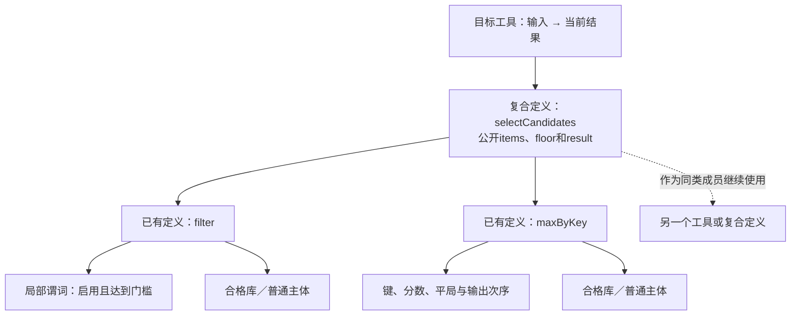

# 可复用定义与公开接口

<a id="block边界与管脚"></a>

> **阅读范围**：采用范围内的设计规范；实现状态另查未决 · [共同上下文](抽象与开放定义.md)。

<details>
<summary>本页内容</summary>

- [意图粒度与可复用功能组合](#意图粒度与可复用功能组合)
- [意图、逻辑与可编译工程模型](#意图逻辑与可编译工程模型)
- [控制逻辑、能力管脚与库绑定](#控制逻辑能力管脚与库绑定)
- [工程组成、配置、数据与依赖](#工程组成配置数据与依赖)

</details>


## 意图粒度与可复用功能组合

<a id="block-composition-contract"></a>

**本节规定定义怎样封装、连接与继续复用；产品需求主面现由[需求作者](../需求含义与实现责任.md)明确，而非由普通函数或画布代替。**开发任务先确定需要改变的行为，再按[操作选择](../../开发/用途与任务范围.md#authoring-route)使用源差异、精确值槽或结构连接。所需实现分解可由开发AI提出，由编译器核对；使用者不先选择全部成员。既有函数、模块和领域定义可以组合，复合结果在相应语义下仍可继续使用；这项闭包性质不是图形操作比文本更优的证据。

`.sec`是当前可实施的中立文本前端，结构是对应支持域的作者编码，图是按任务取得的投影或编辑方式。没有合适封装时，开发AI可以创作普通主体，必要时沉淀为本项目定义；不新增业务原子枚举、需求语言或强制包装。

block是现有Definition在组合中的角色，**不新增`block`关键词、BlockManager、通用运行时对象或独立清单**。普通函数和模块已经可以拥有这个角色。构造状态、启动活动和普通函数调用分别遵守原语义；外形都是方框不使它们具有相同生命周期。

### 本次请求不是永久能力目录

“制作本地工具”“筛选候选”“改变转换精度”是任务；对应实现可以是一处参数变化、几个定义的组合或一个新算法。系统先将已接受要求与真实来源对齐，再形成具体候选。固定重建不重新调用AI解释原句，不按任务名字猜算法。

**不建立所有需求原子的并集作为产品前置。**集合并集不会记录连接方向、顺序、重复、绑定、状态或条件。`subtract(a,b)`与`subtract(b,a)`使用相同构件，却通常结果不同；两个独立调用与一次调用的两次引用也不是同一个程序。需要的是有明确解释的组合规则，而不是只把功能名装进一个集合。

“原子”要注明观察边界：对调用者，不打开的复合库也可以是一个原子；对库维护者，它由更小定义组成；对后端，最终操作来自所选执行语义、目标库和实际指令。前一种原子不要求物理上不可分，最后一种也不等于面向用户的业务词。

现行八类工程构造继续是**声明、引用、实例化、连接、约束、绑定、组合、输出**。八是当前共同职责的划分，不是已经证明最小的机器指令集、八个新关键字，或“世界只有八类需求”。一个版本的词法和组合规则可以有限；同一规则允许重复、嵌套、参数化和用户定义，因而能够产生不断增加的有限程序。目标、数据域和观察要求尚未固定时，没有依据给出“全部需求恰好N个原子”的数值。

生态中的定义数量会增加，但只有当前引用及其实际检查依赖进入任务。不能要求普通使用者查询全目录，也不能为新业务名字增加一套语义管理对象。确有当前规则无法表达的观察或作用时，更新其准确语义与目标合同；普通新函数不升级语言。

### 不同粒度不应一一对应

| 粒度 | 当前划分依据 | 不由此推出 |
|---|---|---|
| 任务 | 接受结果、保持项及允许动作 | 一句话必须成为一种永久block类型 |
| 对外block边界 | 实际消费者使用的输入、输出、效果和独立变化 | 一个函数必须包装成类、一个block必须独立发布 |
| 内部组成 | 已有定义的使用点、局部值和具有明确解释的区域 | 每个运算和局部变量都要全局身份 |
| 运行实例 | 显式状态、活动、会话及拥有关系 | 配置相同的两个实例可以自动合并 |
| 分析与失效 | 真实读取和保证消费者 | 作者展开深度等于编译分析深度 |
| 修改与提交 | 修改范围、共同不变量和实际前像 | 一个文件只能一个事务，或两个文件必然独立 |
| 文件、包与部署 | 共变、公开版本和真实隔离需求 | 一条连线意味着RPC或一个后台服务 |

当成员共享不同的变化原因、权限或生命周期时，可以分成不同边界；当每次正确修改都要同时打开几个只在名义上分离的部件，应重新检查分割。不能按行数、关键词数或固定端口数决定粒度。图距离不等于影响距离，一条边也可能使整个连通性或公开合同改变。

### 可复用功能定义不是另一个万能顶层类型

| 实际内容 | 唯一来源／消费者 | 普通使用者需要提供什么 |
|---|---|---|
| 定义身份和精确版本 | 既有Definition与绑定 | 已知定义直接引用；名称解析由工具完成 |
| 外部边界 | 原函数签名、领域接口和已接受合同 | 本次输入、必要参数、真实差异 |
| 正常实现 | 一份作者主体，或已有合格实现方法 | 使用已有实现时不重写；创造新行为时维护主体 |
| 内部成员和连接 | 原表达式、区域或领域结构 | 按当前层修改，不另写一份展开树 |
| 目标与资源限制 | 实际独立要求和显式稀疏控制 | 仅固定需要控制的选择 |
| 实际源码与资源产物 | Compiler及其合格组合器 | 查看、采用或明确接管，不手工同步同义副本 |

一个函数体既可以是普通算法，也可以是别的定义的组合。基础函数的多个输出使用已有记录或元组式领域类型返回，字段投影不重复调用生产者；不增加新的多返回机制。状态、流、资源等接口保留已有载体与事件语义，不把它们强制塞进普通纯函数。

所谓“隐藏底层”，隐藏的是调用方不需要决定的实现，不是输入域、公开效果、错误、顺序、资源占用或未实现状态。摘要可以保守，未知必须准确保留。私有源码不足以取得所需保证时，可以由工具在有权范围内下钻；不能把未读到的部分解释成无效果、无限容量或保证已成立。

### 复合定义对外仍是定义

<a id="block-closure"></a>

给定固定的成员定义、使用点、参数和连接，组合器先选定对外入口与结果，并处理穿越边界的引用；再检查类型、求值／激活、效果、寿命、共同要求和输出归属。必要的适配本身是有合同的定义，不能是一条无成本、无失败的箭头。

只有在相应入口能够被已有语义解释、公开参数已经绑定或明确保留为参数、内部引用合法、输出可产生且实际要求满足时，才形成该范围的可生成复合定义。其调用方式与普通定义相同。内部还缺实现时仍可保存为草稿；保存复合外壳不获得运行资格。

外部使用者依赖这个复合定义的公开边界，不需要知道它有几层。这个结果可以继续作为更大组合的成员。有限层级没有固定三层或五层；作用域、引用、组合种类与展开条件继续生效。函数递归保留为调用，不能为了呈现完整树而无限展开。

<a id="fig-block-closure"></a>

图的实线表示定义包含与调用，不表示独立服务或运行并发；最下层是当前不打开的实现，并非全球最小原子。



这项封闭性不是“任意几块接起来都正确”：一个输出是拥有资源，另一个成员需要两个独占拥有者；一个流没有水位保证，而下游要求精确最终结果；一个成员可能联网，而外部禁止联网，这些组合不能直接成立。可以增加合法的共享、复制、限界或其他适配；没有适配就返回真实缺口，不删除外部要求。

### 管脚只暴露当前边界的必要决定

管脚来自真实公开合同，不通过遍历私有成员将所有可调项提升为外部参数。一个输入可以是普通值、类型化函数、已有结果或具有明确领域意义的端点；不同角色分别检查。

| 管脚关系 | 正常处理 | 必须保留的反例 |
|---|---|---|
| 值输入与参数 | 校验类型／值域，按源次序求值并绑定一次 | 单个结果扇出不重放生产调用 |
| 函数值输入 | 保留参数、结果、潜在效果、捕获与调用次数合同 | 传递函数不在装配时执行函数体 |
| 分支／调用激活 | 使用已有if、匹配、调用和区域语义 | 输入齐全不允许提前执行未选分支 |
| 事件与流 | 明确订阅、分发、缓冲、顺序、时间与停止 | 两条线不默认表示广播或两次独立消费 |
| 资源输入输出 | 校验拥有、移动、借用、最后使用和停止 | 单个独占资源不能因扇出而复制拥有权 |
| 错误与完成 | 继承原计算／业务／取消／结算合同 | 没画错误线不表示会自动吞掉错误 |

上述是端点角色，不是每块都要填写的六组数组。普通函数的签名和主体足以派生的内容由工具取得；只有真正的独立要求才另外保存。一个无参纯值定义可以没有可调管脚。只提供数据结果的block不需要启动和停止端口。

对一个使用点要开放内部参数，执行[边界编辑](结构编辑与身份保持.md#block-boundary-edit)：新增类型化形参并替换准确位置，调用方传回原值来保持原行为，再对实际需要的位置修改实参。不是给每个内部字段设置`public:true`，也不默认扩大共享库接口。

### 无需为每种细节开发新插件

| 本次差别 | 当前采用的最小动作 | 完成位置 |
|---|---|---|
| 已有公开参数改变 | 改当前使用点实参或准确任务槽 | 原作者源，检查并生成新候选 |
| 已有定义连接变化 | 修改作用域内绑定与调用表达式／领域连接 | 同一主体及其共享约束 |
| 组合可复用 | 抽取完整表达式或有语义的区域为私有定义，必要时明确导出 | 同一Definition体系，不先创建包市场 |
| 内部参数需要对外控制 | 显式暴露准确角色，回填旧值保持未改调用 | 新接口与真实消费者共同形成候选 |
| 只有一个使用点特殊 | 先参数或组合；不足时私有派生并只替换该引用 | 固定原基础，保留本地差异和升级关系 |
| 原定义的公开行为改变 | 更新该定义及真实消费者的接受关系 | 不能用“实现优化”掩盖需求改变 |
| 没有封装的新算法 | 在当前中立语言写主体，再按实际用途封装 | 不要求官方新增业务原子 |
| 新的不可表达观察 | 定义或修订相交语言／目标语义 | 明确未覆盖范围，不用名字冒充实现 |

原生资产仍是合法选择和存量入口，不作为中立能力不足时的通用强制出口。工具对原生签名的观察不改变独立要求；“必须精确”“不能联网”不能因现有实现做不到而被重写。所需依据不足只限制相应声明，其他独立且获准的工作仍可继续。

### 展开、修改和更新的合同

**查看展开**只产生同一源的局部视图。默认显示当前边界、一级内部组成及必要的公开合同；更深层按本次问题取得。隐藏实现的缺口、关联效果和尚未读取的范围不能被省成成功。画布位置默认只是视图，不是控制顺序。

**编辑组合**使用现有source/files/edits、准确结构增量或editRef；不新增`connect`顶层工具和并行写源。已知原文可直接修改，只有需要端点定位时才查询。声明收集先于引用，批次局部标签由系统解析，作者不生成全局随机ID。

**保留身份**依据明确修改映射。定义身份、调用出现、运行激活和局部节点分别保留；长期内部定位只在确需引用时保存。新复制的状态实例不得重贴原实例身份；两个同配置实例也不能被代码去重合成一个运行对象。

**采用新实现或升级**比较原合同、类型／ABI、效果、布局、持久数据、资源和在途责任。公共边界保持时调用方可以不改作者源；实际内联、目标或依据变化仍可能需要重编译。改变私有源码不自动改变旧运行实例。局部派生按原上游B、本地L、新上游U处理，冲突保留，不以最新名称覆盖。

**真正修改生成物**仍要回源或明确转移区域写权。某个具体优化没有逆映射，不妨碍通过原定义修改；它也不证明任意目标文件都能自动还原成原block层级。

### 三种出口与有意保留的进口

模块exports导出可被引用的定义；复合需求exposes公开准确逻辑主体；运行函数、消息、资源和资产入口由真实目标合同给出。结构类型恰好相同不能合并这些层，也不能按同名Subject合并不同实例。规格库无须有运行入口，运行库须有实现或明确合格依赖，独立应用还须闭合必需宿主。

父级组合不会自动转导子项的全部exposes。需要开放时由父级声明/传递同一主体并显式暴露，必要时先进行边界编辑；不读取子定义私有ID。库依赖公开宿主接口可以保持完整，不要求把真实宿主复制进库。反过来，未定义的进口不是“开放组件”而是缺额。完整合同见[成品边界](../成品形态与公共边界.md#3-必须分开的四个公共边界)。

### 组合自由不等于组合自动正确

组合检查与优化检查分开。先按固定语义形成正常可执行组合，再决定是否能够消除边界、内联、融合或共享存储。保留block并不强制运行时框架；擦除block也不删除来源映射与必要公开边界。

类型相容只是一项条件。缓存接在授权检查之前可能泄漏；重试与外部付款相连可能重复作用；先完成filter再maxByKey，与逐项融合可能具有不同失败顺序。控制、效果、时钟、资源和共同不变量均按实际消费者取得。不能用一张所有节点已绿的图证明整个任务成立。

作为可替换边界，复合定义必须不加强调用方前提，不削弱已接受结果、错误与效果要求，并满足承诺的寿命和资源条件。这里的保持由实际分析、成熟供给或相应验收承担；未知可以保守保留，不能凭方法注册、字符串名称或同类型签名自证。

### 首期选择与通用语义的关系

组合能力的有限实施范围是：既有函数／模块的调用、参数修改、必要的局部展开和私有抽取，均进入共同检查与编译。它不是全部产品的实施顺序；产品先按[需求到产物的开发协议](../../开发/需求到交付主链.md#intent-to-product)贯通真实任务。复杂异质子图的自动抽取只在该动作被请求时成为相交义务。

TS可以是首目标，但公共行为不因此成为TS元编程。有限共同算法再用第二语言核对数值、数组、错误、闭包及初始化映射。不同目标的缺项按根返回；不能只连几个原生调用就宣布全部中立算法已具备。

对当前源范围，普通主体足以承担实现时直接编译；已有高层结构需要保留时用其合格方法。无必需方法则保全设计并指出实际缺口，不强行生成空节点。纯编译没有写工作区的权利，已有数据库和外部效果的恢复责任也不会因当前使用图式组合而消失。

### 当前取舍与可复用依据

本组合子系统选择**有限组合规则＋开放定义＋递归封装＋按需实现**，不将无限需求逐条列成平台原子；这一选择不指定全部任务的作者界面。SICP关于复合过程与组合闭包的机制说明支持“构成物仍可作为同类构件使用”；Ptolemy的复合actor说明层级可以容纳不同内部模型，但转换边界仍须有明确执行合同。SEC不因此引入每块director、Ptolemy运行时或一种全图调度语义。具体来源与使用边界见[来源目录](../../依据/来源/设计依据与资料边界.md)。

主要代价是必须维护准确的接口、编辑映射和实现供给；它们不是零成本。相同领域库在成熟语言中也可以获得高层简洁，SEC的额外价值仍由单源多目标、可靠局部修改和全资产联动判断。若维护一个block必须重复填写实现、完整端口树和生成配置，或新业务持续增加核心关键词，重开的是该边界与表示设计，而不是继续扩充业务原子表。


## 意图、逻辑与可编译工程模型

### 1. 不是从一句话直接跳到实现

“审批订单”同时隐藏了资格、状态、权限、金额单位、并发、拒绝、通知失败、数据保留和可观察结果。AI 可以推理这些候选设计；系统不能把模型补充的每条假设都当成用户明确要求。

工程对象至少区分：用户给定事实与要求；从现有工程观察的事实；AI 推断；明确采纳的设计选择；规则推导的实现；运行时观察与证据。相同文字出现在不同类别中，取得的权限和可信程度不同。

### 2. 工程模型的内容边界

| 面 | 必须表达的含义 | 典型来源 | 不应强制创建的情况 |
| --- | --- | --- | --- |
| 结果与验收 | 目标、非目标、保留能力、验收观察 | 用户、领域合同 | 不为每条内部变量造需求 |
| 结构与责任 | 模块、所有权、接口、依赖 | AI/人设计及原生观察 | 不把每个文件当服务 |
| 数据与类型 | 单位、空值、约束、版本、标识 | 模型与库 | 不把显示标签当身份 |
| 行为与状态 | 控制流、状态机、事件、事务 | 明确设计或领域规则 | 纯函数不生成持久状态 |
| 错误与恢复 | 可重试条件、补偿、未知完成 | 能力与行为合同 | 不为无效果表达式建 journal |
| 权限与效果 | 角色、数据范围、写入、网络 | 已授权政策与操作合同 | 生成候选不意味着可部署 |
| 实现与目标 | 实现要求、选择政策、绑定、目标特性 | 可复用画像与采纳选择 | 不绑定临时凭证或 PID |
| 验证与生命周期 | 声明、方法、证据、兼容、退役 | 需求与目标生成 | 不把声明验证方法当验证通过 |

它们是可分模块的语义合同，不是一张所有节点都要填满的大表。

### 3. 从草稿到可生成的状态

```text
Draft → FrozenCandidate → StructurallyValid → SemanticallyChecked
                                  ↓
      GenerationReady(selected outputs, target, rule closure)
                                  ↓
              MaterializedCandidate → VerifiedWithinScope

Adopted、Applied、Published另按目的、权限与对应证据记录；
不是上述纯候选生成必须逐个经过的前置阶段。
```

状态是相互关联的事实，不必强制一个对象逐格串行保存。不同模块可处于不同状态；一个模块未决定数据库不应阻止无关纯逻辑的检查。全工程正式输出只能按声明的根集合及传递依赖裁决，不能把部分可生成伪装成整个产品完成。

`Adopted` 不等于不存在任何未决实现。一个逻辑合同可先被采纳，但所选后端还没有实现。此时可以查询、设计、生成不依赖该缺口的部分；不能对必需缺口生成默认返回值。

### 4. 可编译语义闭合

对每个所选输出根，沿依赖收集必须的行为、数据、错误、效果和目标要求。每个决定项须落入以下一项：

- 冻结候选中显式指定的值或行为；正式采纳状态另行判断；
- 由版本化、适用性已证明的规则推导；
- 在已采纳自由包络内按固定策略选择；
- 由已绑定现有/人工/AI 实现承担；
- 明确未决并阻断相应输出。

因此可编译不要求“用户手写每个函数体”，也不要求“所有选择都有唯一数学解”。规则可以在合法实现之间确定选择，但不能替用户添加业务语义。稳定排序只解决真等价选择的复现性，不能掩盖实际性能、安全或行为差异。

```text
GenerationReady(root) =
  all required semantic decisions are assigned or legally derivable
  and target capability bindings close the required behavior
  and unresolved assumptions do not intersect required output obligations
  and each artifact has an authorized generation/implementation route
```

这是所选输出的结构与语义闭合条件。受限语言可以通过静态解析、类型与依赖校验确认闭合，不必先运行生成目标；闭合不等于生成器语义保持、目标运行正确或生产性能成立。后者分别取得其所需证据，不用运行证据循环阻止此前的合法生成。

### 5. 示例：AI 组织的是行为，不只是语法

```text
业务对象：订单
初始状态：待审批
操作：批准
前置：调用者具有审批权限；订单仍为待审批；金额满足已采用规则
成功：状态变更与审计事件在同一数据库事务提交
竞争：版本不符则返回冲突，不覆盖他人操作
重复：同一作用域/主体/请求身份且载荷相同，在当前披露许可内读回先前结果
后续：通知通过事务外发件箱发送；失败不撤销已批准状态
```

这段是人类可审阅的设计投影。真正编译使用类型化对象与引用，不每次重新用模型解释这段文字。AI 可以生成上述对象、状态边、表达式和能力绑定请求；工具补引用、验证闭合并展示影响。

### 6. 自由包络和剩余实现

一个排序算法可在稳定性、时间空间上界和输入域内选择实现；业务审批阈值则不是算法自由。把“留给 AI 实现”表达为带接口、可变状态、允许效果、错误、数据访问和验证义务的受治理实现区。

AI 提供该实现后，保存确切源码/模型和来源，重新解析与验证，再进入后续确定性构建。未来有成熟规则后，才将该区迁回确定性生成；不是每次构建重新采样。

### 7. 版本和局部修改

意图、定义、规则、目标、观察修订和执行epoch分开。修改提示词不直接改变已采纳工程；规则变化使实际消费者失效。只用于身份验证的凭证更新重查准入；凭证若同时决定租户、可见数据或外部结果，相应读取与结果隔离也更新，但原始秘密不写入公共键。纯显示布局可不影响业务；有语义的布局仍进入实际依赖。

外部源码修改触发重新观察及协调，不直接覆盖目标定义。新业务义务可以改变领域边界，但需给影响与迁移；不能承诺所有变化永远只改一处。

### 8. 最强反证与撤销条件

若高层操作 API 仍要求 AI 手写冗长底层图、每次编辑都需要全图重审、或功能无法表达而只能塞自由字符串，则当前语义层不合格。反向极端是任意自然语言字段都可通过而由生成器猜测；这同样不合格。需要通过相同任务的多入口实验、错误定位、局部变更和闭包缺口测试调节粒度。


## 控制逻辑、能力管脚与库绑定

### 管脚是类型化边界，不是万能包装

类型化管脚保留为SEC的一种**组合观察与准确编辑方式**；仅在该任务需要关系或端点操作时采用，不成为普通创作的必经步骤。一个组件可以公开有限输入、结果、错误、事件、流或资源需求；作者连接这些边界、设参数、进入局部定义修改算法。组件不必是进程、服务、类或独立发布包，一个普通函数也能在相关视图中作为组件显示。只有实际需要独立引用、替换或共享约束的边界才持有稳定管脚身份；不将每个加法和临时变量物化成长期工程对象。

同时区分三件事：**图显示了什么；作者通过哪个协议修改什么；哪份内容是长期作者源。**只显示管脚不自动取得写权；通过结构增量改一个管脚，也不要求后台新增一份与源码独立演进的图文件。`.sec`是首期常用紧凑文本，图/表/结构输入是同一语义的有条件入口，JSON是其中一种载体。每区域的实际作者归属由[多表示协议](../工程源/清单模块与绑定锁.md#多种作者界面如何编辑同一工程)决定。

| 管脚种类 | 完整意义由什么决定 | 不能被一条连线省略的内容 |
|---|---|---|
| 调用的参数、结果与错误 | 函数/操作签名、激活、求值顺序、正常和异常退出 | 先取得函数值与参数；调用一次还是重复调用；返回与未返回不同 |
| 事件发布与接收 | 事件类型、订阅身份、顺序、交付和重复政策 | 生成事件不等于完成接收方作用；丢弃与停放须有合同 |
| 数据流 | 元素、时基、边界、缓冲、背压和取消 | 单订阅、复制、广播和竞争消费不相同；连多条线不能暗选其中一种 |
| 资源能力 | 有类型句柄、拥有/借用/共享、可用状态与释放条件 | 引用不是权限，资源复制不是复制数值，异步仍在用时不能回收 |

这些种类共享端点定位和连接检查的基础，而不共用`Port<any>`的执行含义。软件管脚也不是物理电线；端点拥有者规定其方向、输入域、基数、阶段、错误与观察条件。普通参数的类型来自签名，不要求作者重复填写管脚类型；读取器把它派生为接口视图。

### 少量控制逻辑从何而来

作者直接表达独特条件、算法、参数和关系。已有库/领域定义承担重复语义，目标生成器承担其已经定义的连接与代码。新函数或新的组合增加作者内容，不增加顶层工具。缺库、缺后端与缺基本语义分别登记，不能将一个没有实现的组件名字当成完整能力。

组件可以嵌套：外层只暴露公共合同，内部使用更多组件或普通表达式。公开只读、私有隐藏和编译器可分析是不同维度；库维护者有权修改私有源，消费者通过合同组合。一个库不因在图上只显示一个框，就丧失内部可修改性。

### 连接检查

一条连接至少由**当前基础、所属组合、生产端、消费端及连接种类**确定。服务从名称或当前查询返回的短引用解析实际对象，不让AI手写哈希。端点的稳定角色标识与显示名分开；插入一个参数不能使旧数字下标突然指向另一个角色。对仅当前表达式有效的端点，局部定位已经足够，不分配全局数据库身份。

接口视图的最小字段由服务派生：端点定位由当前定义/发生位置/角色组成，附当前版本、管脚种类、方向、类型或合同引用、必需性/基数、合法阶段及是否存在明确缺省。连接引用双方端点与所属区域；声明需要稳定外部使用时沿原身份协议保存，局部图可用当前候选内短引用。字段不是全部必填给AI：函数签名可确定类型和顺序，就不重复输入；资源和流才展开其额外合同。界面颜色、图坐标和线条样式默认不进入这份执行关系。

连接处理依次进行：

1. 在精确基础中解析双方声明、作用域、公开性和阶段；外部不可见内容不因知道ID而暴露。
2. 按连接种类检查输入输出、单位/编码、错误、基数、调用方式、资源寿命和允许效果；硬要求共同满足。
3. 缺一个必需输入时保存可定位草稿和缺口；有语言定义的缺省就解析该缺省及其来源；不补零或任选第一条边。
4. 多生产端汇入单值参数默认冲突。需要选择、合并或归约时，通过有明确顺序/代数合同的定义表示，不让画布顺序成为隐式合并器。
5. 由所属区域判断控制与依赖。分支未选择的调用不执行；只连数据边不能取消原先的求值顺序。调用递归、固定点、反馈和等待环分别采用已定义规则，不能统一按无环检查拒绝或统一准许。
6. 在候选中形成这项语义增量，重新检查相交组合及其消费者，再由作者适配器写回唯一来源。失败时原候选保持，可返回新的不完整草稿；不会先修改一半实际文件。

如果输出值来自一次已经执行的生产者，同一次激活内的多消费者引用可以共享该值，前提是值与资源合同允许；这不等于将源码中两次独立调用合并为一次。两个同配置的有状态实例也不能合并。流输出的多消费者需要显式分发合同；资源句柄的多条线要检查借用和共享，不凭连线数量取得可复制性。

### 一个没有外部依赖的管脚与源码共同例

```sec
fn gain(x: Int, factor: Int) -> Int = x * factor;

fn clip(x: Int) -> Int =
  if x < 0 then 0 else if x > 255 then 255 else x;

export fn adjust(x: Int) -> Int = clip(gain(x, 2));
```

局部结构视图可以显示`adjust.x → gain.x`、常量`2 → gain.factor`、`gain.result → clip.x`、`clip.result → adjust.result`。这是同一表达式的连接解释，不是另一份作者算法。图中的布置和颜色默认是编辑展示信息；真正语义顺序由表达式和区域规则决定。

AI已知函数时直接写上述调用；需要改连接时查询本组合的`contract`，取得调用出现和factor角色句柄，提交[set-input的确定载荷](结构编辑与身份保持.md#三类精确结构编辑沿原协议进入)。当前源为文本时，适配器定位字面量2并替换为3；结构为作者源时只改对应literal。保留函数名、签名与其他内容，形成一个新候选，再按请求预览；不在画布与文本分别写两次。

基础表示采用有序表达式、词法绑定和激活区域；管脚图从它按需投影。if分支、短路右侧、闭包主体和普通调用的孩子虽然都可以显示连线，却有不同的执行时点。数据边拓扑排序不是基础程序的解释器。要把一个未绑定调用结果供两个消费者共享，必须形成明确的一次求值和let关系，不能因线有两个终点暗中复制或合并计算。其他领域的流/事件图按其自身合同继续存在。

对单次输入40，factor=2时结果80，改为3后120；输入200在两者下都饱和为255。结果恰同不删除参数变化或来源变化。该例是书面合同，不是已运行结果。

需要把`gain`替换为有外部作用的定义时，先检查签名、效果与激活。连接类型相同不能自动沿用原纯计算的融合、重排或复用资格。需要一项值返回同时接到两处时保持本次求值身份；作者复制了两个调用节点时仍然是两次调用。

### 库与目标适配

领域库拥有能力语义和接口；目标适配选择实现这些含义的语言、轮子或框架。已锁定且合格的工程构建直接消费绑定。多个实现能满足相同合同，可按已委派政策选择；真正未决定的行为或没有授权的选择才返回待决。偏好不能抵消硬约束，进程内调用、FFI、外部进程与服务调用有不同的实际成本和失败条件。

这些模型可参考MLIR的操作/值/区域与接口分工，但不将软件管脚全部限制为SSA边；不同区域和外部协议仍拥有自己的语义。[表示与区域机制](https://mlir.llvm.org/docs/LangRef/)。这也不要求首期引入MLIR运行库。

### 设计理由与反证

当前保留管脚抽象，同时默认让小算法使用紧凑文本或局部结构变化。好处是组合关系可直接检查，算法无需展开成无界画布；代价是结构编辑器要有真实的绑定、作用域与往返适配。适配不覆盖的构造只能只读显示、保全或返回具体缺项，不靠重新打印丢掉未知内容。

反查至少包括：两次发送被误合并、单次采样被错误复制、分支外提前激活、单值输入接多生产者、资源重复消费、流默认广播、未知节点藏有全局规则、失效基础将字面量改错位置。任何一种发生都修对应连接或前端合同，不退化为“图只有展示没有真实含义”。


## 工程组成、配置、数据与依赖

### 逻辑组成

工程包含规范性意图/逻辑模型、原生实现区、能力绑定、目标画像、验收要求、来源对应、草稿与执行状态。它们有不同 owner 和生命周期，但不要求每项单独建服务或文件。

当前本地产品作者直接使用明确结构体编码的意图/Block模块；已选计算文本、原生代码、普通高层定义和必要独立要求各自只维护一次。结构化模块使用版本化分片JSON，原资产不因它而迁移。文件权威与数据库权威是有明确迁移协议的替代模式，不同时独立双写。作者资产、目录、引用、读写和迁出规则见[工程实体与持久表示](../工程源/清单模块与绑定锁.md)；不把`src/*.sec`固定成所有工程必需布局。

### 分区

| 内容 | 更新者 | 是否可丢弃重建 |
| --- | --- | --- |
| 采纳的意图、逻辑与决定 | 语义采纳机制 | 不能当缓存删除 |
| 原生人工/AI 实现 | 对应源码 owner | 不能靠生成器覆盖 |
| 目标画像、库与依赖绑定 | 实现解析 owner | 失去后不能猜原选择 |
| 生成源码与视图 | 生成规则及物化 owner | 仅在输入完整且无手改时可重建 |
| 构建/分析缓存 | 对应缓存 producer | 删除只能损失性能 |
| 授权、事务、恢复、证据 | 运行或保证 owner | 按自身保留规则，不与缓存共删 |

### 配置与秘密

配置模式、默认值、可覆盖范围和 target mapping 是模型。环境秘密是受控运行绑定，不能把值写进可分发模型或生成源码。影响语义的配置进入构建闭包；仅运行时注入的值进入运行观察和安全约束。

### 依赖与生成

模型声明需要的能力、接口与约束；解析器选择精确实现闭包；后端产生对应包、模块和构建文件。现有 dependency lock 可经观察和采纳进入目标绑定，不从 ambient node_modules 偷推实现。

数据模式可以派生类型、校验、存储映射和迁移候选；实际迁移必须受现状数据、兼容、资源与恢复条件约束，不因 Schema diff 能生成 SQL 就直接执行。

### 反证

删除“缓存”后无法恢复原设计；同一依赖由多个 generator 更新；Secrets 被写入快照；一个语言后端引入全局 Node/Bun 依赖；两个目标读写同一路径。任一发生都需要重划分区或绑定，而非补一个文件名例外。
