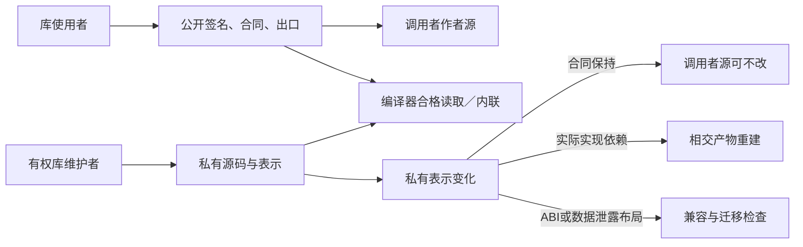
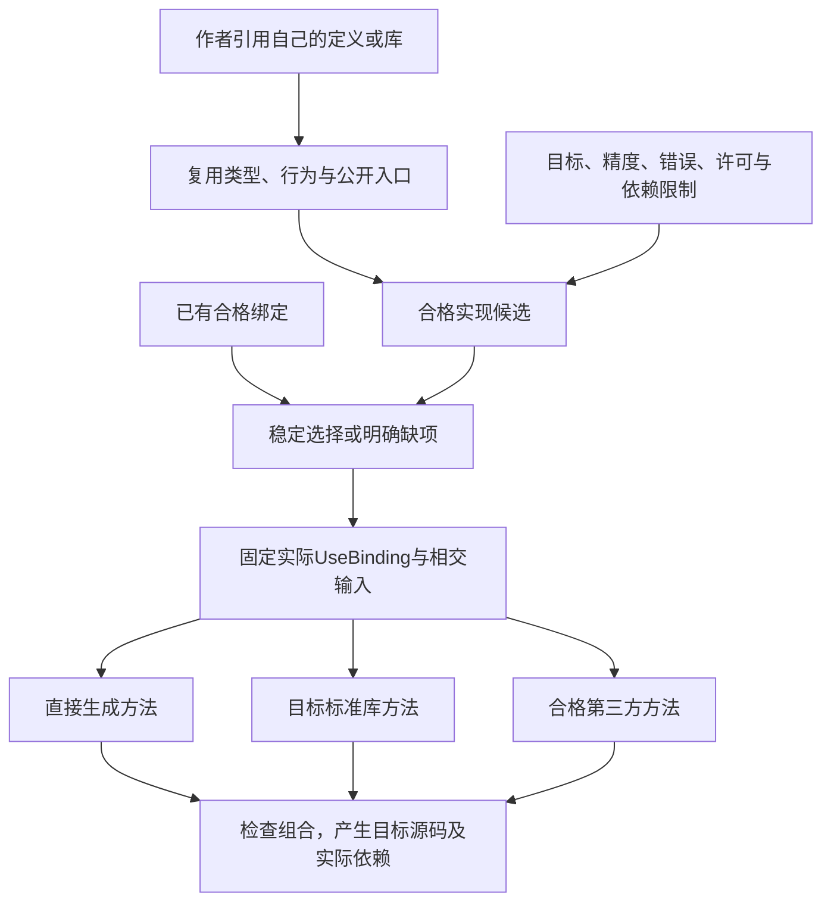

# 封装、模块与库演进

> **阅读范围**：采用范围内的设计规范；实现状态另查未决。

<details>
<summary>本页内容</summary>

- [库内重构与公共名字的具体操作](#库内重构与公共名字的具体操作)
- [1. 为何封装是基础，而不是最后加上的方便功能](#1-为何封装是基础而不是最后加上的方便功能)
- [2. 模块可见性与稳定公开门面](#2-模块可见性与稳定公开门面)
- [3. 不透明类型的最小作者方式](#3-不透明类型的最小作者方式)
- [4. 接口投影、分别编译与变化传播](#4-接口投影分别编译与变化传播)
- [5. 封装、接口、类与复用分别怎样提供](#5-封装接口类与复用分别怎样提供)
- [6. 从函数到功能库：直接复用意图的结构](#6-从函数到功能库直接复用意图的结构)
- [7. 基础库、领域库、目标库与应用库](#7-基础库领域库目标库与应用库)
- [8. 包描述、公开导出和版本绑定](#8-包描述公开导出和版本绑定)
- [9. 库使用、抽取、包装和发布的正向过程](#9-库使用抽取包装和发布的正向过程)
- [10. 升级矩阵：什么可以留在边界内](#10-升级矩阵什么可以留在边界内)
- [11. 封装也是自举的第一类真实消费者](#11-封装也是自举的第一类真实消费者)
- [12. 设计验收与最强反例](#12-设计验收与最强反例)
- [资料与当前取舍](#资料与当前取舍)
- [13. 封装不决定全部文件形态和关键词集合](#13-封装不决定全部文件形态和关键词集合)
- [可复用的是参数化的关系及其实现，不是无限业务名字](#可复用的是参数化的关系及其实现不是无限业务名字)
- [使用库时隐藏的是实现负担，不是需要决定的行为](#使用库时隐藏的是实现负担不是需要决定的行为)
- [普通库与编译型定义的共同路径](#普通库与编译型定义的共同路径)
- [需求关系与过程实现的边界](#需求关系与过程实现的边界)
- [库升级与固定解释实例的接合](#库升级与固定解释实例的接合)
- [值操作见证与查询库的封装边界](#值操作见证与查询库的封装边界)
- [作者前端不同不改变库的公共封装](#作者前端不同不改变库的公共封装)
- [从局部算法形成库的实际次序](#从局部算法形成库的实际次序)
- [语义合同与库分发的边界](#语义合同与库分发的边界)
- [产品源码的模块边界与记录更新](#产品源码的模块边界与记录更新)

</details>


本章拥有“定义如何封装、库如何被创建和使用、实现怎样在边界后替换”的完整合同。语言表达式及主文法由[语言体系](../可替换表示与适用范围.md)拥有；包内容沿[工程清单与绑定锁](../工程源/清单模块与绑定锁.md)保存；兼容和作用由各自规范承担。本章不是新注册平台，也不另建一套事实、候选或权限模型。

`opaque` 修饰与 `sec.library/1` 扩展分别承担表示隐藏和包级声明。公开函数、名义类型、模块与库绑定按本章组合，不由包名或结构字段授予读取私有表示的权利。

## 库内重构与公共名字的具体操作

库维护者有权改私有源，不意味着可以只对名字作全文替换。`rename`按[绑定保持算法](结构编辑与身份保持.md#名称重构的正向算法)更新真实引用，检查内层捕获、导入别名、公开门面与具名实参；类型相同不是引用相同。换私有表示也仍受opaque与公共合同限制，结构编辑不提供绕过表示权限的通道。

私有重命名若不影响任何公开观察，可以只使相关源码映射、诊断和生成布局变化；已经发布的公开名改变需要消费者或兼容门面处理。创建兼容别名是独立方案，不因rename请求自动增加额外公共入口。库中的函数值参数本身没有形参名字合同，间接调用不能因为库里存在一个同名函数就被当成具名调用。

包外隐藏消费者只返回可披露的影响/兼容缺项。持有某个结构ID既不授予读取库私有源码的权限，也不证明它已在当前候选中存在。

## 1. 为何封装是基础，而不是最后加上的方便功能

封装保护的是一组允许客户端依赖的含义，并隐藏可独立改变的选择。只把代码放进文件或将函数名标为export，还不足以取得这种效果。若调用方仍依赖字段布局、私有函数、初始化副作用、偶然遍历顺序或未承诺的异常，它就会随内部变化受影响。

一个真实边界需要共同给出：公开名称及类型、合法输入、正常与错误结果、效果和寿命、实例关系、明确的性能或顺序承诺、版本与表示要求。没有相交条件的纯函数可以只有签名和行为，不能机械填满所有维度。公共合同的内容来自真实源、独立要求和已选定义；签名视图由工具派生，不维护第二份完整手写源码。

本章区分五种单位：函数/类型定义是语义单位；模块是可见性与解释单位；包是版本与分发单位；组件是合同及生命周期单位；进程/服务是隔离和部署单位。它们可以多对多映射。一个库可以只含一个模块，一个应用也可以有很多模块而仍是单进程。类库是可复用API集合，不要求每个库都以class声明。

## 2. 模块可见性与稳定公开门面

默认未export的声明仅本模块可见；export使名称可沿合法模块引用访问。公开类型与公开构造器不是一个开关：普通记录/和类型可以公开其表示，opaque类型只公开名义身份和参数。对普通显式导入，先解析当前模块快照与路径，再取得公开签名，再检查使用点；知道私有身份或源路径不会绕过访问规则。

包的公开子路径由第8节的exports表决定。跨包只能通过该表引用模块；在同一包内部，可以通过相对路径导入其他内部模块的export声明。内部模块的export不等于全包对外开放。没有单独包声明的短程序采用当前工作集作为本地包范围，不强迫创建发布清单。

包门面可以把`example/range`映射到同一稳定模块ID的实际位置。库内部移动文件时，更新定位和内部导入；外部说明符不变。该门面不是自动转导所有目录，也不复制函数实现。函数所属模块改变则需要明确的语义移动/别名映射；仅复制文件并保留一个同名函数，不证明其身份相同。

不存在的导出、私有访问、歧义、循环的纯别名且无实际声明、未激活的画像分别诊断。声明环可以先收集签名；值初始化仍遵守自己的顺序与循环规则。任何public门面都不能暗中执行安装或初始化脚本。

## 3. 不透明类型的最小作者方式

基础语言新增一个类型声明修饰位置：

```sec
export opaque type Range = { lo: Int, hi: Int };
```

`opaque`仅在类型声明头、`type`之前解释为修饰词；它不是新的运行对象、工具或处处保留的关键字。普通标识符仍可使用该名字。完整文法仅由语言规格维护；本章定义其模块语义。旧解释器没有该能力时准确返回不支持，不能忽略修饰后公开表示。

当前有界范围允许命名记录和命名和类型的表示封装，允许现有显式类型参数。任意类型的透明别名不在这个修饰的首个范围；需要包装Int时可用单字段记录，目标可在保持合同后消除无用包装。分组括号不改变opaque身份。修饰无export时仍是模块内定义，不隐式获得外部可见性。

### 3.1 定义侧与使用侧有不同的合法观察

定义模块内拥有表示：可以按已检查的字段构造、读取和匹配；预期类型为Range的记录字面量可建立Range。使用模块只能持有、传入、返回、放入合法容器，并调用已公开的操作；不能读取lo/hi、以同字段记录伪造、匹配隐藏构造器，或从同布局类型强转。

不透明类型默认没有结构相等、排序、哈希、格式化和序列化。需要这些行为时公开有合同的函数或显式编码器；函数名不是自动正确性依据。否则更换内部结构可能改变相等或泄露秘密。公开显示函数的返回是一个普通公开值，它只承诺该函数说明的观察，不恢复全部私有访问。

模块隐私保护正常源程序的抽象边界，不等于恶意同进程机器码隔离、代码保密或真实授权。分发源码可能允许人在磁盘上看见实现，但客户端不得将它当作可依赖公共API。运行库面向不可信原生调用时，需要私有品牌、闭合构造器或句柄校验；TypeScript类型擦除本身不是运行防伪。

模块外无法构造，只减少不变量的建立入口，不自动证明这些入口正确。定义模块仍可写错构造函数、公开错误的观察或返回不合法状态；具体构造、不变量和操作合同仍按普通检查与保证规则处理。记录公开所有字段时，客户端可以直接构造合法类型形状；该类型声称的额外语义同样不能仅凭名义名字成立。

### 3.2 合同与表示分开，但不能产生类型混用

声明身份由稳定定义谱系定位，类型使用的语义身份还关联公开合同版本和类型实参；声明ID、合同版本与某个实际运行表示分别记录，不能把它们合成一个永远不变的数字。私有字段重排不自动重命名公共抽象类型；公开类型含义改变则形成显式的新合同关系。实际运行或编译实例还绑定包内容、目标布局和ABI。两个版本名字相同，不因此可以交换运行值。只有统一到同一实例、证明兼容的ABI或显式转换，才允许跨版本值连接。

公开合同不能直接暴露私有字段作为客户端必须解析的表达式。需要可引用性质时，公开一个合法观察/谓词及其合同，或者表达为独立抽象性质；无法形成公开闭包就诊断，不偷偷公开实现。证明器可以在有权限的验证范围读取内部表示以证明公共保证，但证明结论必须通过公共边界陈述，不能让所有消费者默认依赖完整实现。

不透明类型可以包含另一个私有类型；客户端只依赖外层抽象。某个内部变动若影响终止、错误、效果、资源上限或主动承诺的编码，它就不是单纯的表示优化，仍按行为/ABI改变处理。

### 3.3 构造和使用的完整例

```sec
// module range.sec
export opaque type Range = { lo: Int, hi: Int };
export type RangeError = Reversed();

export fn make(lo: Int, hi: Int) -> Result<Range, RangeError> =
  if lo <= hi
  then Result.Ok({ lo: lo, hi: hi })
  else Result.Err(RangeError.Reversed());

export fn includes(r: Range, x: Int) -> Bool = r.lo <= x && x <= r.hi;
```

```sec
// another module
import "example/range" as range;

export fn accepts(x: Int) -> Bool =
  match range.make(0, 100) {
    case Result.Ok(r) => range.includes(r, x);
    case Result.Err(_) => false;
  };
```

合法构造0至100后，50被接受，101不被接受；反向端点100至0得到Reversed。调用方尝试`r.lo`或直接构造Range均得到表示不可见诊断。上面的分支是作者选择的错误策略，不是工具自动吞掉错误。

下一版本可以把表示改成`{ start: Int, width: Int }`，make保存lo及hi-lo，includes判断start<=x且x<=start+width。因为使用精确Int，表达式没有被定宽溢出改变；旧客户端源只通过make/includes交互，在公共行为不变且重新构建的条件下不需要改动。它仍可能需要重编译，已有运行值、二进制和保存数据不自动获得兼容。

这就是“以后大多改局部”需要的实际封装，不是仅把函数装进文件。

## 4. 接口投影、分别编译与变化传播

<a id="fig-library-visibility"></a>

### 图解：库使用、库维护和编译读取的不同边界

三类读取范围由实际任务与权限决定；封装不禁止库维护者改变自己的私有实现。



处理过程：先加载每个模块声明；构造含公开名字、名义类型、签名、效果、契约引用和初始化要求的SignatureView；验证公共引用能经合法门面解析；在定义模块内检查全部实现；对消费模块只提供公开投影；最后链接实际实例与目标布局。SignatureView是派生值，不是新的作者文件格式。

接口指纹绑定规范化公开合同及实际公开依赖。实现指纹绑定私有主体和所需生成输入。两者均不替代内容摘要、原始版本或真实性证据。接口未变时，可以复用只消费接口的分析；已经内联、专门化、引用实现证明或共同链接的产物仍按实际依赖失效。库更新不能因“签名一样”让旧内联代码继续被说成包含了新修复。

契约不可从实现自动删弱。包声称兼容而实际改变错误顺序或输入接受域时，仍是违规。对外仅函数形状稳定，不足以建立替换关系；同等调用前提内的正常、失败、效果、进展和已承诺资源都在范围内。

## 5. 封装、接口、类与复用分别怎样提供

| 需要的能力 | 当前采用的中立机制 | 默认与边界 |
|---|---|---|
| 隐藏表示、保持不变量 | 模块＋opaque类型＋构造/操作函数 | 普通数据可以继续公开；不强制每个类型opaque |
| 无状态复用 | 函数、泛型、局部组合与库 | 普通新算法不用增加内核分支 |
| 实例方法 | 接收实例值/受限句柄的函数；可返回捕获实例的函数记录 | 独立创建不因同配置而合并状态 |
| 替换接口实现 | 参数化函数或具有明确函数字段的记录；构建期可用既有Provider合同 | 保持签名、效果、契约与实例寿命；记录不是授权凭据 |
| 子类型或多态使用 | 既有泛型、变体分派、显式接口字典 | 不靠原型链推定可替换，不加入全局自动实现搜索 |
| 状态与资源对象 | 中立值状态转换；确有外部资源时采用资源/端口画像 | 不把可变资源伪装成普通不可变值 |
| 代码复用继承 | 默认复用可采用组合与委派；开发者明确需要继承时按对象语义与目标映射处理 | 基础文法未含完整继承不等于产品不提供控制；对象合同和相交缺项见[能力映射](稀疏控制与目标限定.md#7-class先判断开发者要求的是哪种事) |

基础值与函数可以独立使用，当前有限对象合同另有单实现父链、多接口和显式覆盖；两者共用模块与类型责任，不将全部对象功能交回原生。若某个当前必需语义超出既定范围，应设计相交机制；若只是调用外观的改进，必须保持名字解析、覆盖与父调用规则，不顺手增加共享布局或多继承耦合。

接口上新增一个必需函数会影响所有实现方；仅添加默认方法也可能引入名称或调度冲突。接口在演进时使用能力协商、独立可选接口或明确主版本迁移，不用无限可选字段掩盖未实现。原生Java生成类仅是目标容器，不自动证明中立语言支持相同继承和反射。

### 5.1 接口字典的具体例

```sec
export type Renderer<T> = { render: (T) -> Text !{} };

export fn describe<T>(value: T, renderer: Renderer<T>) -> Text !{}
= renderer.render(value);
```

调用者可以传入符合类型、纯度和实际行为合同的函数字段记录。泛型主体只使用公开的render操作，不依赖某个实现的私有记录。替换实现是参数或Binding变化，非全局自动查找。需要带状态的实例时，闭包可以捕获已允许的不可变值；可变资源使用受限句柄和相应效果/生命周期，而不是通过记录外形绕过这些规则。

记录类型是接口形状，独立要求可以进一步约束输出、错误与成本。新增必需字段会影响实现者；单纯多一个同名方法也未必兼容。因此首期以显式参数和组合为默认，不立即引入隐式全局typeclass解析、继承线性化或运行时反射。确需这些机制时分别设计，而不是用“类库”这个名称一次承诺它们全已支持。

## 6. 从函数到功能库：直接复用意图的结构

本章封装的是**开发者自己的SEC作者内容**。一个精确小函数可以成为库；类型、规则、算法、工程组合、资源和非源码文件也可以进入包。不要求先长成大功能，不按一句需求的长度划分库边界。函数/模块/包/组件/运行实例彼此独立，具体安排由真正的引用、兼容和生命周期决定。

### 需求封装的调用与具体化协议

**需求与意图直接由自己的SEC封装来承载，不另造需求语言、意图语言或逐项镜像记录。** “需求”说明这次接受什么，“意图”说明要达到或改变什么，“语义”是所用表达的准确含义；这些角色可以由同一调用、参数和合同承担。底层类、循环和库选择是实现内容，只有它们确属作者主动要求时才成为该使用点的硬限制。

普通调用表达已定义的行为，带参数的记录表达该行为的具体选择，公开合同规定值域、错误、效果和保持范围，组合保留跨部分的顺序与关系。模型构造函数可以返回已经定义的领域值，由相应方法降低；这不意味着任意普通函数调用都在编译期执行。相同封装不能因为出现在“需求面”就丢失其求值、状态和副作用规则。

**实际处理次序：**

1. 固定当前任务及已有作者源。只有真正独立的接受要求另保留来源，不为每个函数复制一个需求文件。
2. 从已导入或明确选定的定义解析公开合同。定义和实例是一对引用关系，不把库主体展开为一份应用作者副本。
3. 写入本次实参、连接、算法回调和必要覆盖。类型、效果和绑定能从此取得的由工具推导；已决定的默认不重问。
4. 检查调用前提与应用的独立要求是否共同满足。有定义但缺实现，保留该实现缺项；有两个合格实现，按已委派规则选择，不因此要求用户另作业务选择。
5. 直接源实现由既有编译器检查与降低；领域定义调用已绑定的相应方法；外部实现使用精确的实现绑定。缺失方法不按函数名字猜测，不执行任意库初始化来“发现意图”。
6. 候选、选中实现和产物保留其已有对应。参数修改回参数，私有实现修改回库，只有结构要求变化才改目标控制；生成物不成为第二份手写真相。
7. 对相交约束和消费者重新核对，保持未改源、身份、公开行为和资产。无法保持时指出具体冲突，普通可修订草稿仍可保存。

**现有价格规则的完整接合。** [语言范本](../../领域/计算基础/紧凑表示与程序范式.md#可复用规则与工程内实例)已定义`PriceRule`与`payable`。应用维护门槛500和优惠20，调用`pricing.payable(total, retail)`；不维护一套PriceCalculator类、缓存字段或目标生成器。total=499时返回499，total=500时返回480。将优惠改为30，门槛处返回470，其余契约不变。这里的数字是规则推导，不是运行成绩。

若需求改成“按百分比且涉及小数舍入”，原固定金额参数不够：定义比例与舍入的准确行为或组合新的函数，而不是把它塞进`discount`或修改旧库后仍称原语义。若只是现有算法慢，改私有实现或所选策略即可；若需要一个有独立身份和长期状态的计价会话，可以使用或创建对应封装，其类实现仍不必由每个调用者重复编写。

**缺少现成定义时的确定选择。** 先用已有函数、类型、库和组合定义所需行为；存在真正未决定的业务差别时，根据实际委派给出并采用有依据的选择，或保留精确待决。仅缺实现方案时，已有合格提供者可以被自动绑定；没有供给时，开发AI可以在获准创作的同一作者源内实现新定义，再固定它。确定构建不重新调用AI猜需求。普通封装不够表达基本含义时才扩语义，不能为每种业务增加官方关键字。

**显式要求与候选实现不能互相吞并。** 将`ensure 0 <= result && result <= total`写出，仅给出一个范围，不能单独决定所有价格规则。若原任务已经规定精确满减，则满足这个弱条件不代表满足原任务。相反，原任务确实授权任意满足条件的结果时，也不要求唯一数学解才能编译。缺少具体运行输入与缺少行为定义同样分开，参数化函数本来就可以先生成。

**这种封装不是模板封死。** 使用者可以传入行为、组合定义、维护私有实现或建立有权局部派生；需要新增公开参数须有真实差异，不因维护者修bug就增加配置。下探到类或算法后，仍在同一作者与编译体系内；它不会迫使其他已封装部分也展开。

### 四种行为的权限和修改范围

| 当前主体与动作 | 能做什么 | 改动怎样传播 |
|---|---|---|
| 库使用者编写普通调用 | 依赖公开含义与明确扩展点，普通代码不能读取opaque字段 | 公共合同保持时调用源码不变；实际内联和目标仍按依赖重建 |
| 库作者或受委派AI维护库 | 读取有权源码，直接修改私有函数、字段与规则 | 创建库的新候选修订，检查公共义务与真实消费者；无需增加公开参数才能修bug |
| 应用作者做本地特化 | 固定上游精确版本，建立应用内局部定义或受控源码差异 | 差异只属于本地实例；不回写共享上游，不让私有外部引用变成公共API |
| 编译器优化已绑定实现 | 有权读取库实现并内联、专门化或调整布局 | 保持含义并记录真实实现依赖；不把完整展开塞进AI上下文 |

封装一般增强局部修改能力，而非削弱它。真正限制的是“一个外部使用者无约束地依赖私有细节”，不是“作者不能修改私有实现”。共享库的修改影响许多用户，源头是共享事实和合同，不能靠声称局部就消除；不要求影响全平台无关模块。

### 一个完整局部修订过程

Range库公开make/includes，内部使用lo/hi。维护者将其改成start/width：先固定源与公共合同；在定义模块内修改实现；对外仍用同一操作和类型含义；对签名消费者复用合格分析，对内联消费者重建目标；已发布二进制和保存数据按实际ABI/编码处理。调用者不需要手工修改每个调用，也不需要编辑生成的Java/TS字段。

若只是某个应用需要新端点策略：优先把真实业务差异作为参数或已有组合；其余情况创建该应用自己的函数，引用公共操作；需要改变上游私有结构而没有公开能力时，在有权源码范围建立局部派生版本。它保存基线、自己的编辑以及原公开合同，不凭空获得上游后续修改。更新采用基线/本地/新上游三方合并；发生语义冲突就指出具体规则。差异长期稳定且有独立消费者时提取新公共版本。没有必要的修改不造新包，不无限堆叠十层补丁。

### 目标轮子与SEC库是两种绑定

`import "my/range"`通常选择用户已知的SEC定义，它表达要复用哪份语义。其内部调用或公开端口可以由编译系统选择合格目标库，作者不必写某个npm、Maven或系统库名称。需要固定目标实现、兼容特定接口或禁止某依赖时，使用[最小控制](../需求关系与能力边界.md)；内部锁保存实际选择。显式import某个原生库是允许路径，不是默认语义作者的必经路径。

封装与可供优化性不冲突：公开接口限制源程序合法依赖，源包可以同时含私有实现供工具处理。二进制-only库没有可读源码时只能利用真实接口及其保证；这限制的是具体分析，不是所有库天生都不透明。

<a id="复合block直接作为用户自己的库"></a>
### 复合定义直接作为用户自己的库

一组有明确行为的调用可以先成为模块内私有函数，再按实际共享需要公开。它与叶函数使用相同参数、结果、约束和绑定协议，不必标为“大意图”、注册独立kind或编写专用后端。完整定义归[block组合合同](定义与接口.md#block-composition-contract)，抽取和新增参数归[边界编辑](结构编辑与身份保持.md#block-boundary-edit)。

库使用者只给当前实参与真实差异；维护者在有权范围内打开内部；编译器读取实际必要实现。三种责任不产生三份同义源。显式把私有参数变为公开接口时才增加稳定承诺，不通过反射内部字段自动暴露一切。

包装只有带来新公开合同、稳定组合、独立变化或实际消费者时才保留。原函数已经具有合适边界，只改变显示名或折叠视图，不再增加同名转发层。普通源调用图不应为展示方框而强制先编译到一套全局原子节点。

### 直接公开函数值与固定业务参数

[简洁作者合同](../../领域/计算基础/紧凑表示与程序范式.md#compact-author-contract)允许普通公开函数直接作为值复用，或通过静态lambda固定本次业务参数。没有差额的`export let run = upstream.run;`是公开引用，不要求再维护同义函数体；有参数差额的lambda只保存实际实参与调用，类型和捕获由工具补全。当前型化、阶段、递归和契约规则仍要满足，别名不是对未知原生getter/可变导出的安全认证。

公开契约由真正的定义拥有。转发不删除原入口的require/ensure，也不自动复制成另一套业务要求；使用点需要额外条件时用其普通声明表达。调用者无须为了部分固定参数手写类、创建Builder、注册方法或建立独立包。发生独特算法时继续用普通fn/领域结构，并可按真实复用需要提取。

库维护者仍承担实现与合同，成本必须计入整体；如果成熟语言同样能够直接表达，则不把函数值和推断本身算成SEC独占收益。验收对应[两文件完整范本](../../../examples/实现校准/简洁计算与TS往返.md#compact-author-example)，不再只比较一个经过展开的库主体与短调用。

## 7. 基础库、领域库、目标库与应用库

基础隐式类型仍由语言规范定义；标准纯库承载文本、序列、结果和数值的有限合同；结构计算库承担形状/边界/访问；事务库承担选定的提交及交付语义；目标运行库提供必要实际能力；应用库保存用户自己的规则与组合。不同类别可以共用包机制，但不共用默认权限。

核心仅为真实不可由已有构造表达或不能高效合法实现的原语提供受检边界。用户库不因其位于官方命名空间而天然可信，也不因未知名字就需要新工具。普通编译只读已经解析的依赖闭包；陌生语义按使用点查询，无关库增长不增加每次模型输入。

当前设计库仍不是完整发行。首次产品发行应列出每个实际导出的签名、定义域、错误、效果、复杂度适用前提、目标和源/实现版本；没有实现就标为设计，不能通过一个import名字制造可用性。对不需要的库不链接、不初始化；主动要求的代码或类型依赖未满足时不能偷偷裁掉。

### 普通本地模块不启动一套包生态

`src/pricing.sec`可直接被同工程另一个模块相对导入；它已经是可复用库内容，不因没有lib目录或独立版本而失去封装。`src/`是新多模块工程的默认导航，不规定模块权限；已有app/lib/model目录保持。一个模块复用于多个工作区时，才选择本地路径、工作区包或实际分发合同。

只有独立消费者、版本和分发需要时才建立包身份及公开出口。当前不建设公共注册中心、账号、评分、签名商城或第二套第三方依赖求解器。目标npm/Maven等依赖使用被选择的成熟工具，SEC记录实际锁/解析结果、内容和使用点；不并行维护相互竞争的版本真相。

导入声明创建名称关系，不默认运行作者模块I/O。顶层纯常量可静态求值；需要状态或资源的库提供明确构造/关闭入口，应用持有实例并将依赖传入。模块级名字不自动变成跨项目共享可变全局。

## 8. 包描述、公开导出和版本绑定

<a id="fig-package-role"></a>

### 图解：语义库与目标实现库的绑定关系

开发者可以指定实现，也可以委派自动选择；版本锁保存实际选择，不让每次调用重新搜索生态。



不新增与sec.project并行的工程真相。本章采用既有`sec.project/1.extensions["sec.library/1"]`保存库发行附加信息。没有对外分发的本地模块不必使用此扩展。包内容仍由sourceScopes/modules和现有内容清单取得，源码本身仍是唯一作者内容。

| 字段 | 类型、必需性与解释 |
|---|---|
| package | 必需的非空稳定名称，作为查找名而非密码学身份 |
| version | 必需的明确发布标签；相同标签绑定不同内容属于冲突，不按获取顺序覆盖 |
| exports | 必需的对象；键为`.`或`./`相对公开子路径，值含现有moduleId及可选export；省略export选择该模块公开集，私有成员不能在这里被转公开 |
| requests | 可选、默认空；依赖别名到Request记录，准确字段见下文；同一导入只保留版本/来源/角色等源中不能唯一推导的决定 |
| variants | 可选、默认空；命名变体到Variant记录，准确字段见下文；引用现有目标与参数Schema，不自造无类型配置宇宙 |

`Request`恰含`package: Text`、`role: author | generator | check`，以及二者之一：`revision: Text`或`constraint: {scheme: Text, expression: Text}`。名称非空；revision是所选提供者可解析的精确内容引用，不将任意发布标签当成内容摘要；scheme解释expression，未知scheme返回对应缺项。别名是本包解析作用域内的非空查找名，不替代下游模块的真实身份。角色不同可有不同别名；同一别名重复定义拒绝。硬约束先过滤再选择，当前锁仍精确绑定最终内容。

`Variant`恰含可选`targetRef: Text`和可选`parameters: {schemaRef: Text, value: Value}`，至少存在一项；每个value按照所引用的已绑定参数Schema检查，未知字段与互斥选项按该Schema处理。targetRef选择现有目标画像，并不改变源解析语言；value不能自造权限、覆盖需求或替换私有编译器对象。库源码已要求的语言/语义由原language要求负责，不由Variant反向改变。新扩展字段在本版本拒绝，未来须显式版本演进。

一个局部库发布描述可以是如下**既有工程清单的扩展片段**；`m-range`应是该清单中真实存在的模块ID，不能从文件名伪造：

```json
{
  "sec.library/1": {
    "package": "example/range",
    "version": "1.0.0",
    "exports": { ".": { "moduleId": "m-range" } }
  }
}
```

它位于原`extensions`中，不是第二个根清单。未指定requests或variants采用空对象；无依赖的小库不因此多出依赖配置。这个新扩展尚无机器Schema或读取器，示例仅依据正文人工/静态结构核对，不能借旧12组Schema声称已验证其实现。

role固定为`author`（当前目标程序会使用的源依赖）、`generator`（编译期提供者）、`check`（明确检查才使用）。同一包承担多个角色时列出多个发生位置，不能因为检查工具用过它，就默许目标运行依赖。编译器已经能从源确定的模块引用不另抄入requests；requests仅承担版本约束、来源与显式别名选择。

公开子路径不含绝对路径、`..`、NUL或模糊通配符；exports只重定向公开门面。新字段由该扩展版本解释，未知语义不能默忽略。清单中的声明不授予下载、安装、网络或执行权限，也不取消目标依赖的真实许可义务。

包路径的匹配在规范化前拒绝NUL、绝对路径和上跳段，不用消除`..`后再命中公开门面。同包相对导入不能越过包根，外包入口必须先命中exports。含`export`选择的出口只提供那个原公开名称，使用者仍通过导入别名限定该名称；它不自动创建default、不重命名，也不重新开放被选定义使用的私有辅助。包内模块列表变化会影响相应枚举根，未引用模块不变成全部任务的运行依赖。

检查结果保留可区分原因：格式/画像不支持、模块或包入口不存在、私有访问、私有表示构造或匹配、公共签名未闭合、名义实例错配、版本/选项冲突、缺目标能力和检查未完成。这些作为现有诊断的类型化原因，含源位置与实际引用；不新增作者需要选择的一组控制动作。相交诊断不泄漏当前主体无权读取的内容。

版本范围只是选型输入。采用后由既有绑定锁固定每个发生位置对应的精确内容、解释、目标和变体。已锁普通重建不重新查询最新包。多个同名版本可以在不交换名义类型、实例或全局资源且目标允许时共存；跨边界需要同一种类型或唯一提供者，就要求统一或显式转换，不能按显示名字强合并。

本画像不把互斥后端、安全检查和数值行为合成可任意求并集的feature flags。单调附加功能只有在API与行为相容且无权利扩大时才可合并；否则选定一个变体、分离实例或报告冲突。Cargo的feature组合采用加法式惯例，恰好说明“启用选项直接取并集”依赖前提；不能对SEC所有选择照搬。

## 9. 库使用、抽取、包装和发布的正向过程

**本地使用。** AI创建普通模块，export需要共享的定义；其他模块显式import。前端构造签名，消费者检查公开合同，目标链接实际实现。此时零注册中心、零发布审批、零额外运行服务。

**提取。** 确定实际消费者和需要稳定的API；将可变实现藏入私有模块或opaque表示；保留公开类型和行为；建立稳定包出口；在同一候选中更新真实导入。不存在消费者就不为假想复用先拆包。

**包装。** 固定作者内容、公开子路径、实际依赖和目标声明；检查公开类型闭包、路径、引用与源角色；形成不可变包候选及对应说明。只请求包装时不上传、不执行安装脚本，不把私有凭证或恢复状态装进包。

**发布。** 只有实际请求并具备发布权限时，调用已绑定分发提供者。现有六工具的save-source/write-output只保存或输出明确内容；注册中心发布属于真实支持的提供者操作，不能暗加一个工具模式。没有该提供者时可以交付本地包，不冒称已公开发行。

**采用升级。** 固定旧新公开合同和实际使用点；分类源兼容、行为、ABI/表示、数据、目标环境和权限变化；选择升级或保持；重新绑定并检查真实受影响消费者；通过后明确切换。允许同一候选比较，不让目标运行时随意取latest。

**退出。** 停止新绑定、处理在用值和历史数据、保留所需解码/迁移能力，再回收无消费者内容。危险版本可先限制新执行；旧包存在不意味着继续有执行权。纯库也不需要为了退役执行数据库补偿。

## 10. 升级矩阵：什么可以留在边界内

| 变动 | 调用方源码 | 仍需检查和动作 |
|---|---|---|
| 私有函数拆分、opaque内部表示更换，公开行为不变 | 不应要求修改 | 重新生成/链接真实实现，检查ABI及已持有值，不复用旧内联结果 |
| 新增未使用导出 | 原明确名称调用保持 | 全导出根或反射/成员枚举依赖可能更新 |
| 公共名字移动 | 通过稳定包门面保持，或显式迁移 | 不是仅改文件名，别名循环和实际身份须核对 |
| 收紧输入、增加必需参数/接口槽 | 可能必须修改 | 作为破坏性改变或新接口，不能贴patch标签就允许 |
| 改错误、效果、时序、数值、默认 | 可能影响语义 | 按真实合同决定，而不是只做类型diff |
| 私有布局改变但ABI/序列化公开 | 源可能不改，运行连接仍可能破坏 | 保留/迁移编码或同时更新相交边界 |
| 新后端/新提供者 | 中立作者源通常不改 | 新目标完整映射与提供者资格，不能继承旧目标的通过 |

SemVer可以传达维护者的兼容意图，不能自行证明以上关系。兼容检查预算结束应保留未知与具体受影响对象，不自动判断安全，也不迫使重写全系统。公开类型布局、字段开放与依赖泄漏会限制未来变更，这是应在首次API设计时主动处理的成本。

## 11. 封装也是自举的第一类真实消费者

SEC自身也使用本章模块与库机制。首个自用单元应来自实际已有职责且能够隔离回退，比如无控制效力的诊断呈现或纯集合计算；不能仅为自举新造一个无消费者库。当前没有读取在线仓库，具体文件由未来获准实施时取得真实前像后选择。

自用通过只提高相应单元的采用状态；不授权候选修改自己的可信检查器。标准库可以由种子编译器编译，中立编译器源码以后也可以用SEC表达，两者共用包/版本规则。完整编译器的种子、阶段、对照与回退见[编译器自举](../../编译/内核/确定性与自举.md#编译器自举可信根与版本演进)。

## 12. 设计验收与最强反例

一条完整验收轨迹应从本地封装开始，另一个模块只通过公开入口消费；生成两个目标的有限共同域；改变私有表示后保持调用方源；改变公共输入或序列化时得到准确兼容差异；把库用于SEC自身一个受控单元并保留独立回退。

反例包括：从同形记录伪造opaque值；私有字段进入公共契约；修复私有算法却命中旧内联缓存；两个包版本的资源实例被误合并；包内部private依赖泄漏到公共ABI；移除库同时丢掉在途恢复需要的解码器；隐藏按钮却可绕过执行权限；安装包改变词法解释；对照环境完全不使用公共API却被宣传为真实可替换。

缺少opaque实现时，必须准确报告支持缺项，不退回默认全公开；缺包发布能力不阻断本地库；缺独立验证不声称自举可信。简化是让调用方依赖更少而不是保存更少必要规则。真正改变全局语义或运行模型仍需要相交架构迁移，本章不提供“所有未来变化绝不重构”的保证。

## 资料与当前取舍

[OCaml 5.2模块类型](https://ocaml.org/manual/5.2/modtypes.html)清楚区分抽象类型、公开表示和类型别名；[Rust可见性](https://doc.rust-lang.org/reference/visibility-and-privacy.html)说明私有实现路径与公开重导出可分开。它们支持封装机制，不认证SEC的语法或类型实现。

[Cargo兼容性](https://doc.rust-lang.org/cargo/reference/semver.html)区分公开API、类型布局、泛型与工具环境；[Cargo features](https://doc.rust-lang.org/cargo/reference/features.html)说明依赖选项的组合前提。本章只采用相交机制，不复制Rust的全部模块或trait系统，也不把访问文档当实际SEC支持。

## 13. 封装不决定全部文件形态和关键词集合

opaque是既有草案的一种表示封装入口，保留当前含义；它不意味着每种新库性质都要增加一个新关键词。公开行为、可推导私有表示和目标结构控制分别设计。包可以带数据、模板、图像、样式、文档、许可证和代码；输出与发布按[全工程资产](../工程源/资产与非源码.md)的实际角色取成员，不强迫每个文件装入语义节点或被降成源码。

如果某个封装方案需要调用方反复填写实现类型、构造布局或现有签名，它没有减少依赖，必须重新拆分默认与显式约束。若修复的是库内部功能，就直接修改该库源；若变化是目标生成形式，就修改目标规则；若是外部使用者提出新公开行为，则演进公共合同。三种问题不能一律让调用方去手修目标源码。

## 可复用的是参数化的关系及其实现，不是无限业务名字

库可以公开普通算法，也可以公开已有语义域中的关系/状态模型与对应实现。共同关系例如“在原身份上建立逆索引”“只发布当前修订结果”“对集合做单射名称变换并保持内容”，不是报价、账户或订单的专用原子。实现者按当前范围给出有类型参数、保持条件、失败、资源和下一次修改；使用者只提供本次独立参数。

相同关键字或API不证明关系相同。文字模板从“搜索”改名“渲染”不自动满足原资源和时限；可取消任务模板也不能替代每项命令必须执行的队列。复用以真实定义身份、条件与观察域为依据。

普通组合无专用生成器仍能使用；领域变换方法只在具有实际分析/生成收益时提供。参数化关系缺实现时明确缺口，不能只新增一个短函数名充当成果。源已有完整含义时不再写同义的要求树；独立要求则不能在优化主体时被一同删除。选型、包装准入与F流程继续使用原算法。

## 使用库时隐藏的是实现负担，不是需要决定的行为

消费者通常只读实际公开合同与本次差异；维护者只展开获准的相交实现。读取器可以从真实导出、类型和已有合同取得签名视图，不先建立一份同义`.sec`主体。已有代码供给与运行条件足以满足当前要求时，直接固定并链接它；没有源主体不是缺实现，只有声明而没有实际供给才是缺实现。

<a id="semantic-supply-boundary"></a>
### 语义责任与实现供给不是同一份工作

| 内容 | 必须有的东西 | 不要求重复建设的东西 |
|---|---|---|
| 公共含义 | 所选值域、正常结果、失败、顺序、效果与寿命的准确解释 | 为已有同义规则再写一份自然语言、JSON和源码 |
| 基础语言实现 | 相交构造的检查、目标映射与必要运行支持 | 自研所有后端、GC、字符库、容器和算术实现 |
| 目标计算能力 | 符合当前要求的真实函数、库、引擎或生成结果 | 将每个成熟算法重新用`.sec`实现 |
| 业务差异 | 现有供给没有决定的政策、算法或组合 | 一种完整排列组合对应一个官方业务包 |
| 对外封装 | 确有消费者的稳定合同或独立变化边界 | 仅为了SEC命名、图形方框或目录整齐的同名转发函数 |

“自己的源码可以封装”是一项能力，不是“先把别人所有源码迁入SEC，再允许复用”的要求。第三方实现由原提供者维护，应用作者维护真正独特的行为，SEC维护需要统一的合同与接合。一个主体由第三方语言实现，不产生第二份应用作者源；但它的依赖、许可、表示、运行平台和可替换范围仍进入实际绑定。

语义合同可以引用已接受的标准或上游规范，不必由SEC重新措辞定义全部行为。只有意图、值域或观察确实不同的部分才补充规则。函数同名、签名相同或类型检查通过，不足以证明效果、失败和计算结果一致；不能自动把未知行为转换成“兼容”。

### 封装准入与供给复用的具体结果

对一个已固定使用点，沿既有F流程判断，结果落在原Definition、Binding、MethodSpec和LoweringResult中，不新建封装注册系统。

| 取得的真实关系 | 采用什么 | 实际新增内容 |
|---|---|---|
| 既有绑定仍符合任务 | 原样复用绑定 | 当前调用/输入差异；不重新搜索或重写主体 |
| 供给的公开含义与传递表示可直接满足 | 直接导入和目标调用 | 精确引用与必要类型视图；无需手写转发函数 |
| 公共含义相同，只有名称、参数位置或编码不同 | 可核对的薄适配 | 真实转换与错误/寿命处理；纯机械部分可生成 |
| 需要新增结果政策或组合 | 最小项目内定义，引用已有供给 | 真正的政策和组合；默认不独立发布 |
| 既有供给不能表达必要行为 | 编写该差额的普通主体或实现相交方法 | 一份实际新实现；不先移植全部库 |
| 合同仍有决定性未知或目标缺真实能力 | 保留候选、来源和具体缺口 | 不生成空成功，不强制用另一语言手工补洞 |

新增包装至少应提供一种可识别价值：公共含义归一、必要的表示/生命周期转换、真实安全边界、反复使用的组合、目标可替换性或确有消费者的稳定接口。没有这些差别的`secX -> upstreamX`优先直接绑定；确需保持已有公开名字时，优先别名或重导出，只有观察要求需要才生成运行转发。

包装的必要性由实际消费者决定，不采用“必须两个调用者才准抽取”的机械阈值。一个调用点也可能需要稳定外部接口；多个调用点共享同一错误抽象，也不证明应当保留。已经对外承诺的接口退役仍处理原消费者，不能为了减少文件突然删除兼容责任。

### 适配整组共同合同，不逐个重写全部函数

一个库内多个函数若共享真实的值表示、布局、设备、调用约定和错误/资源规则，可以复用同一组适配。符号名称、参数和导出可从成熟工具取得；按各自实际合同补充不一致项。不能因为某个方法合格，就宣称整库所有方法合格；泛型、回调、异步和状态字段分别核对。

内部不强制把每次调用的输入转换成“SEC通用对象”再转回。相邻操作可以保持同一原生表示时直接传递；存在真实编码、设备或生命周期边界时才转换。同一次流水线能共享合法转换结果时复用；源可变、区域不同、寿命不足或权限不同则不能错误共用。数据拷贝和传输仍计入成本。

这减少的是重复适配，不是承诺一个适配器识别任意库。生态中的实现和规则仍会增长；产品必须保证新普通业务不增加核心分支，不要求所有语义×所有目标先完成，也不让所有已接库进入每次AI上下文。尚无相交映射的目标保留具体缺项，不能以“生态应当已覆盖”为由隐去。

消费者通常只读相关合同；本地新增调用和转换按[剩余责任](../../运行/保证/要求证据与裁决.md#成熟成果复用与剩余验证责任)处理。不要求每个调用点重新证明整个上游，也不把引用上游文档当作本地映射已经正确。普通源能自由定义与成熟供给先行是两个同时成立的条件。

### 供给不是只写在理由里：链接与源码所有权

合格外部模块在P2作为[ImportedModuleView](../../架构/装配/源绑定与解释映像.md#supply-physical-layout)参与符号链接，其UseBinding由既有Binding在实际使用点和目标下解析。没有同义作者body，不经过伪造空函数、隐式Any或强制Host总表。公开合同不足仍然保留未知，不能从这个联合类型推出全部上游实现已合格。

对于完全复用的应用，原生或公共语义模块的出口可作为[目标根](../工程源/清单模块与绑定锁.md#imported-output-roots)，不要求应用先包一层SEC转发。应用确有稳定门面时由生成器输出。要维护新的业务政策时再写本项目源，反复复用成熟算法不是一次新的库发布。

一个调用适配可能生成数条构造/调用/格式语句，它仍是相交API差额，不是算法重新实现。适配作者负责一次性声明真实顺序、实例范围、失败和依赖，使用方不复制这份方法。跨目标成功输出一致，不代表目标失败已自动等价；精确要求异常/取消形式时还需对应错误合同。

### 共同需求分配到供给，不以库数量证明完整

一次任务可能由多个既有定义共同满足。每个局部实现的前提和贡献沿原RealizationPlan关联到真实要求，不让库的“支持”声明代替整体组合检查。两个相同名称不自动共享状态；一个状态更新器和它的逆向索引必须消费同一数据修订；取消接口存在不证明旧缓冲已经可释放。

普通绑定仍可直接使用，没有专用生成方法也可编译真实主体。缺少必要主体时给出有限创作请求，并在收到具体源以后继续共同编译；不把一个尚未安装的新库名写成完成。范围与算法详见[计划闭合](../../编译/实现选择与设计搜索.md#executable-intent-plan)，同义函数包装仍按本章原准入规则删除或省略。

## 普通库与编译型定义的共同路径

本节规定同一份定义如何在普通编译、领域特化、跨目标及局部精化之间保持一致，不新增库注册平台、公开操作或必须填写的元模型。普通函数仍可只有名称、参数、主体和必要类型。定义者不因要复用就必须写解析器、编译器或多份目标代码。

<a id="普通主体优先附加方法只承担额外能力"></a>
### 已有供给不重写，普通主体不需要专用生成器

**F0 固定使用点。** 取得实际定义版本、实参、接受要求、目标和允许的实现策略。目标源码的拼写与数据布局只有已明确要求时才成为硬条件；一般调用不增加全世界优化搜索。

**F1 确定含义和供给来源。** 分别取得当前公共含义与实际实现。已有普通主体按所属语言解释；没有主体但已有合格外部实现或领域方法时，直接消费其固定合同和绑定，不制造同义`.sec`转写。既没有主体又没有合格供给的要求仍可保存，但不能只凭函数名生成猜测实现。使用者不重复抄写共同合同。

**F2 保留必要高层结构。** 使用点与定义有可识别的关系、索引、状态或时间含义，并且某个真实分析／生成者需要它时，保留相应结构直到被消费。普通加法无需先注册“大意图”；高层库也不应在分析前全部展开成失去含义的标量调用。

**F3 区分固定与动态。** 固定值可以作为特化参数，实际输入留作目标参数。只有已授权、在其输入域有定义、预算内且保持错误与效果时才在构建阶段计算；普通导入不执行用户模块。不能把未知运行分支当成构建阶段布尔值。

**F4 选择合格实现。** 已有绑定仍合格就沿用。新供给先核现有实现的直接或薄适配路径，再考虑必要组合和确实缺少的主体；这一步发生在要求作者重写成熟算法之前，不是写完以后才作优化。成本比较仍由实现解析负责，不以原生或中立标签无条件排优先级。候选可为普通主体、成熟目标库、已有跨目标编译器或领域降低。附加方法绑定确切定义及输入／效果前提，不按同名识别，也不因自报“保持”就跳过资格。使用既有MethodSpec、Binding与LoweringResult，不创建平行协议。

**F5 完成降低和检查。** 执行所选转换，收集真实新节点、运行依赖和资产。新增行为重新检查；目标表示有不同数制、文本、别名或生命周期时，明确转换而不是借用宿主默认。形参映射不改变实参源码求值顺序。

**F6 失败与回退。** 领域优化缺失或超额时，若普通主体满足当前要求，就编译普通主体；它仍是中立应用源码，不是强迫用户写原生。硬要求必须具有特定布局、数值、时限或内存界时，普通主体也要满足；不满足就返回相交缺项而非静默降级。两个路径都没有时保持作者候选与准确诊断。

**F7 持续变化。** 使用点参数变化先使用原公开接口，不改公共定义；真正改变库公共行为时更新其实际消费者。一个使用点有独特行为，依下节选择参数、回调或私有定义，不自动复制整库。已生成树没有独立写权。上游升级与本地变化先核两边的来源、语义和保留义务，不能按版本号或后写入者覆盖。

## 需求关系与过程实现的边界

过程抽象把重复算法放入函数，使使用者只消费合同；它有真实价值，不因含有循环或递归而低级。但支持过程抽象不等于已把任务提高到需求层。普通新需求若属于已有可组合关系，却仍要求作者选择嵌套扫描、临时表和遍历顺序，缺的是该关系的可用定义，不是再换一个产品名称。

当前采用：已覆盖任务优先表达结果关系、参数和必要约束；实现者维护具有正常执行路径的库定义；编译器在保持合同的范围选择策略。独特行为继续使用普通函数/对象/控制，不被强制变成约束求解。三者可以位于同一源码体系，不产生RequirementIR、另一份意图文件或全部用户必须阅读的中间计划。

接口有函数调用外形，不足以判断它是面向过程还是声明式。`sort`可以承诺次序而不固定排序算法；一个叫`intent`的函数也可能要求逐项描述全部步骤。判断看作者固定了哪些可观察关系、还被迫决定哪些可委派实现，不看函数名或语句数量。

### 有限可复用合同：按键取极值并保留来源次序

`sec/seq`增加一个普通定义`maxByKey`，不是关键词、语言画像、独立服务或每个新业务的专用生成器。它覆盖有限序列中的分组极值选择；基于同一源位置的first/last平局与输出次序固定在合同中。其他复杂排名、top-k、流窗口和近似比较仍按各自既有合同处理，不将一个函数扩成任意查询模板。

```text
maxByKey<T>(
  items: List<T>,
  key: (T) -> Text !{},
  score: (T) -> Int !{},
  keep: Text
) -> List<T> !{}
```

输入使用`List`既定的有限值、元素资格与捕获合同。`keep`只有`"first"`、`"last"`两种合法值；它是普通参数，不是新词法或任意配置。公开整数仍为中立精确Int，文本按精确Unicode标量序列相等，不隐式大小写折叠、规范化或转成宿主浮点。普通不可变记录可以直接使用。带作用的getter、共享可变别名和不可复制资源不能仅凭宿主readonly伪装成此输入；值与资源资格沿原类型规则处理。

**结果定义。** 输入位置是本次序列的局部序号`i`，不是永久工程身份。对每个出现的键，取最大score；score相等时，first取最小i、last取最大i。将被选位置按i递增输出。返回新列表并保留对应元素值，不深复制记录或对象，不改变输入。空输入在验证keep后返回空；不存在需要返回的空组，也不为每个输入增加全局ID。

设`I_k={i | key(items[i])=k}`，每组按`(score(items[i]),i)`的字典序取最大，得到last结果；first将第二项改为`-i`。输出再按所选原位置递增。这个数学定义给出所需结果，不要求作者手写排序、表或扫描计划。只对有限、成功求值的输入描述正常结果；下面规定计算失败与进展。

**参照求值与失败。** 普通实参先服从语言求值规则；进入定义后验证keep，再按原输入位置依次求key、score，每个回调对每次出现各调用一次。键/分数都正常取得后才进入该出现的比较；遇到计算失败，保留准确的回调和出现位置，不返回截断列表。回调空效果不证明其终止：不终止时不伪造结果，有执行预算时按原取消/资源合同结束。预算与分配错误不是无匹配，不回退到first或数值0。输入实参若是`filter(...)`，过滤阶段先完成；不能无条件把两个阶段融合。

**当前基线算法。** 在输入保留不可变、可以再次遍历的条件下，先按原次序求键与分数，在私有字典中保存每个键当前胜出的分数、位置和值。新分数大则替换；相等时只在last下替换。完成后建立胜出位置集合，再遍历原输入，仅输出集合中的位置。第二遍不重新调用key/score。最终结果完整后才发布，私有临时表按正常或失败路径释放；不新增真实外部作用。

**正确性依据。** 处理任意前缀后，每个字典项都是该前缀中该键按已定排序的极值；初始化、严格更大时替换和平局规则逐步保持这个不变量。第一遍完成得到每键唯一胜出位置，第二遍只筛这些位置且保留输入顺序，因此同时满足极值、平局、完整性与输出次序。此为算法推导，不是执行结果。

**资源与替代。** 令n为输入长度、g为实际键数。采用合格散列表时，基线期望进行O(n+g)次字典/集合操作；额外状态O(g)，另计结果、输入保留、文本哈希/相等和任意精度整数比较的真实成本。散列最坏情况不是线性保证。可以选择平衡树、先物化再排序或其他合格实现；没有相应成本或稳定性条件时不宣传固定线性时间。原输入不能重读时，保存所选项后按原位置排序是另一条有成本的合法路线，不偷偷重放有作用数据源。

**编译与普通定义。** 普通调用有基线主体即可生成，不要求应用作者写MethodSpec或后端。可选方法通过精确定义绑定识别这个关系，在保持回调次数/错误次序/数值与资源要求时采用索引、排序或已有库。不能仅凭函数名碰巧相同就特化。即使表达的结果与某段普通递归相同，也不自动重写任意旧程序：旧程序可能重复调用部分函数或有不同失败顺序，需要相应等价前提。

**与现有操作的关系。** `distinctBy`保留其first/last合同和调用形式，不强迫旧程序迁写；把rank固定为常数可以得到对应的结果关系，但实现不能借此添加可观察的回调。`filter`、排序、分组、极值和序列位置是可组合机制，不为“最高分”“最低价”“最新版本”各造一种语言词。最低整数可通过明确且精确的rank变换表达；任意Text排名、偏序和浮点NaN不由此自动覆盖。

**作者与内部层次。** 用户只维护筛选、键、分数和平局要求；图或任务视图省略实现，完整定义仍可在库维护任务下取得。出现真正的新偏好或多元素约束时先组合现有定义，不能把没定义的`keep:"best"`塞进接口；不能把存在maxByKey就扩张为每个任务都能写成一个短调用。

**边界反例。** 禁止高分的disabled项参与选优；禁止用键首次插入位置作为输出次序；重复相同记录仍按出现位置处理；所有负分也要选真实最大值，不能把初值设成0。key或score失败时不产出看起来完整的部分集合。选择first/last、最大/最小或输入筛选变化是行为改变；仅换索引或布局才属于保持行为的实现选择。

**成熟参照与公平对照。** [PostgreSQL窗口](https://www.postgresql.org/docs/18/tutorial-window.html)把分区、窗口内部顺序和最终输出顺序区分；[Scala序列API](https://www.scala-lang.org/api/current/scala/collection/Seq.html)提供groupMapReduce等组合。它们支持此类抽象已有成熟机制，不证明SEC发明了分组或比同等库调用更短，也不把数据库或Scala引为必需运行时。

### 单个使用点的控制、精化与退出

首先确认改动是行为选择、保持行为的实现策略，还是纯目标布局。库已经提供准确参数/回调时，只改使用点。构成组合即可完成时，新函数引用原定义，不复制其主体。只有独特算法无法由原公开扩展点表达时，才按有权源码范围建立一个本地定义或提取受影响部分；这不要求另写编译器插件。

本地定义默认私有，公开类型继续引用原类型身份。需要复制的实现依赖、私有类型、自由值、资源和许可证必须可合法取得；拿不到私有表示时，不能靠展开缓存恢复越权源码。存在公开组合路径就采用；否则保存相交缺项，而不伪称复制一段打印文本已经封装成功。

“最高分、同分取最后”替代“直接取最后”改变了行为，不是保持语义的specialization。它需要相应要求被接受，调用方只重接本次允许的使用点；其余调用保持。优化一个已经固定算法则必须满足原合同。若局部控制会影响共享类型ABI或单实例资源，工具展示该共同边界，选择合格适配或明确共同修改，不能承诺字面上只改一个调用即可。

上游基础B、本地作者L和新上游U分别固定。本地只是参数/组合时直接检查新接口；存在局部复制或差异时，比较B→L与B→U及其实际绑定、调用和要求，不单靠文本冲突。能够正确合并才形成新的本地候选并更新基础；冲突时保留L，报告受影响部位与可行选择。放弃继续跟随上游时，保留独立本地源及必要来源/许可，不再保存一份无消费者的同步差异。撤销局部行为必须满足当前已接受要求，不能只把调用改回旧名字就称任务完成。

普通主体路径不承诺最低成本。它满足行为但不满足硬资源约束时仍不合格；合格优化可以由库/后端维护者提供，并绑定确切定义与前提。使用者无需同时写原函数、生成模板、目标实现和对它们的同义配置。

### 能复用但不能无条件融合的例子

源含义是先对有限输入全部执行`map(f)`，成功后再对中间列表全部执行`filter(p)`。输入为`[a,b]`；`f(a)`成功、`f(b)`发生计算失败F且不正常返回，而`p(f(a))`会发生计算失败P。

分阶段原语义先得到F，根本不执行p。融合成逐项`f`后立即`p`会先得到P。两者最终都失败不构成等价。仅声明没有外部I/O也不能证明它们相同。

因此，融合需要当前合同允许的失败观察、非终止与资源关系。能证明相交回调有定义且相关观察保持时可以融合；不能证明时采用原顺序或另一保持方案。用户不能被迫修改正确需求来配合优化器。这项反例由共享效果、区域与目标协议共同消费，不是新库专有的一套错误机制。

### 替换整段编译供给的准确入口

复用一个现有多目标编译器不是仅调用其打印器。使用前固定它实际接受的输入、版本、库与构建阶段，核类型和值域、求值和失败、对象与内存、目标集合、来源／诊断、确定输出及运行依赖。相交语义能直接委派时复用；只差少量明确转换时提供窄适配；需要用大量兼容层重新实现原语义时，与当前直接后端按整体成本比较。

替换可以发生在整个可移植基底、某个领域或单个目标后端，不要求所有工程一次迁写到该供给的表面语法。反过来，不得声称通过任意内部IR就能无成本接入所有编译器；所选API和转换本身是准确的实现义务。尚无证据的供给留在技术比较，不加入默认依赖锁。

## 库升级与固定解释实例的接合

公开语义库更新、目标实现更新和工具自身升级是三种可能独立的变化。发布新库不会原地替换旧请求已经选中的定义；先形成新的精确绑定与EngineImage，再由新请求或明确升级候选采用。旧操作和旧源仍按其解释范围处理，安全撤销的实际准入另行生效。

普通库只是内容时不运行初始化代码。具有编译期方法的包按照[领域方法协议](../../编译/内核/领域方法与整体根.md#领域方法的共同调用协议)声明真实输入、输出、阶段与运行类别；它不能因为是用户自己的库就直接改全局类型表或工作区。共享纯定义可以复用，两份有状态Provider或不同包实例的资源不因版本/内容相同自动合并。

相同接口而实现变化时，使用者源可以保持；已内联、读取私有语义或依赖旧保持依据的产物仍按实际读集更新。包摘要只是内容定位，是否安全替换依然看公共含义、目标ABI、数据和当前环境。

## 值操作见证与查询库的封装边界

关系库的[ValueOps合同](../../领域/状态关系与流/关系查询与维护.md)只能实现已经接受的类型相等和表示，不能因可注入函数就修改公开类型含义。opaque维护者可以提供合格操作；普通使用者没有表示权限时不自动派生结构相等、排序或编码。已知有限类型可自动派生，通用函数采用明确With入口传入见证，而非核心新增隐式类型类。

Bag随自己的语义/编码版本使用；两份关系合并前检查值操作兼容。换私有哈希算法可以保持作者和公共相等，已有桶按实际实现依赖重建；改变大小写、NULL映射或相等类会改变行为，必须接受新合同并处理旧物化状态。不能只提高包版本号就把旧频次表无条件继承。

## 作者前端不同不改变库的公共封装

.sec和结构定义可以直接封装为普通库；原生库经实际语义与目标适配使用。当前没有必须采用的嵌套SDK。库门面公开中立合同，使用者不依赖库内部表示；目标依赖、构造工具和检查工具仍按角色绑定。

一个库的内部作者形式可以迁移，但应保留所承诺的公开身份、值、错误、效果与目标接口；私有调试位置和发行源码变化另记录。已内联旧实现的产物依赖真实内容，接口不变不能复用旧内联结果当新版本。外部消费者没有使用私有表示时不要求改源码，公开ABI或持久编码暴露表示时另需保持/迁移。

共同定义维护和单一调用处具体化是两种不同修改。前者更新真实消费者，后者形成带明确上游基础的局部定义；不修改派生树后仍宣称原源能够重建。私有函数抽取采用[精确抽取合同](结构编辑与身份保持.md#私有函数抽取与局部内联)，不必先包装成大意图。
## 从局部算法形成库的实际次序

先按[私有函数抽取](结构编辑与身份保持.md#私有函数抽取与局部内联)把一段合法区域形成同模块私有定义；保留调用位置、自由绑定与效果。出现真实复用消费者后，再决定公开哪些类型和操作，建立模块出口及依赖。独特算法可以一直保持普通函数，不要求新建包。

跨模块公开时重新检查自由类型、opaque表示、私有引用、初始化和许可。调用者不得依赖隐藏表示，维护者仍可修改自己的私有定义。局部参数变化、私有重构、公开行为改变、包发行分别处理；不将每次提取helper升级成一个新能力服务或新的产品目标。

## 语义合同与库分发的边界

`sec.object/1`是语言能力合同，`sec/object`是实际可导入的命名模块，两者不以路径相似取得同一身份。默认语言已含class时，作者只写class即可；只有使用该模块的效果名或before内在函数时才导入。普通业务函数形成自己的模块/库，不为每个组合新建语义画像、服务或单独发布体系。

语言组合和库的实际修订由现有锁固定，兼容代号不是精确安装结果。发行可以共同分发基础与对象方法，运行成员仍按真实消费保留。更换私有对象表示时检查公开字段/方法、before所依据的槽合同、内联与目标布局；公开调用者不改作者源的条件不扩大为无须重编译。before只允许定义者可见的字段投影，不能成为窥视隐藏表示或复制整个堆的反射接口。


<a id="author-module-boundaries"></a>
## 产品源码的模块边界与记录更新

[作者结果](../../领域/计算基础/作者表示与实现分工.md)按实际变化秘密和契约拆模块，不将所有数据集中为一个永远增长的全局Model仓库。范本在单实例纯事件循环内采用一个根状态，是明确应用策略；共享库只依赖它需要的记录/回调，设备驱动、数据库和编译器不因此必须改为同一种reducer。

模块提供可见性与解释/名字范围；包负责发布与版本选择；运行实例负责活动身份和资源；进程负责相应隔离和物理生存。它们没有固定一一对应。抽象用户只需引用实际公开定义，功能维护者仍能下钻其真实主体；没有源码的外部库须保留准确合同、版本、许可和能力，不能编造可下钻内容。

`with`只更新具有可见表示且符合资源规则的记录。opaque消费者即使从某处知道字段名也不能更新；应调用类型拥有者的公开方法。公开透明记录添加必需字段可能影响构造者；已有局部更新保存未修改字段并不自动使所有消费者兼容，也不保持尚无证据的不变量。保留型别身份、序列化、实际ABI与版本迁移分别处理。
