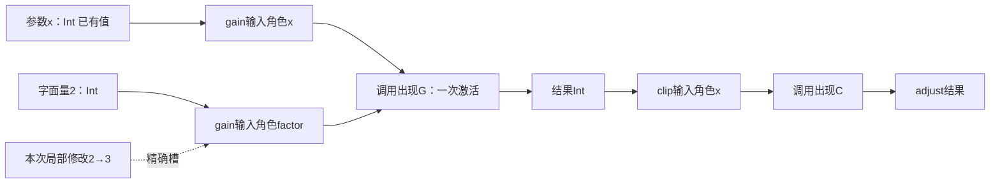
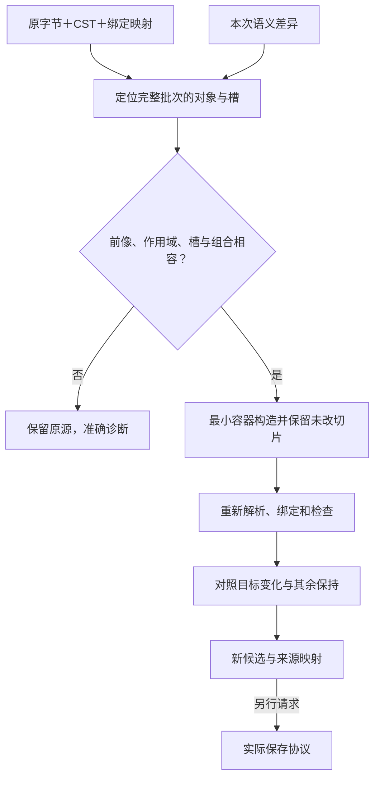
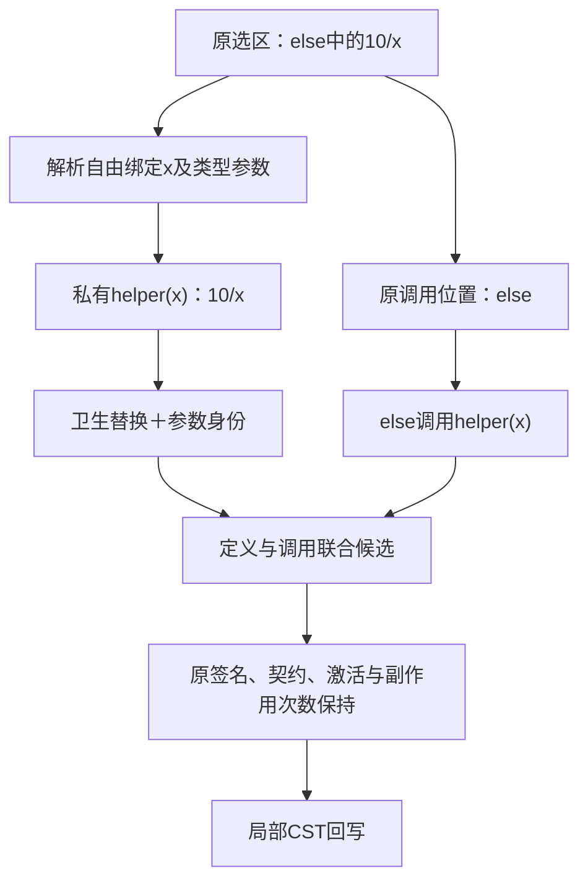
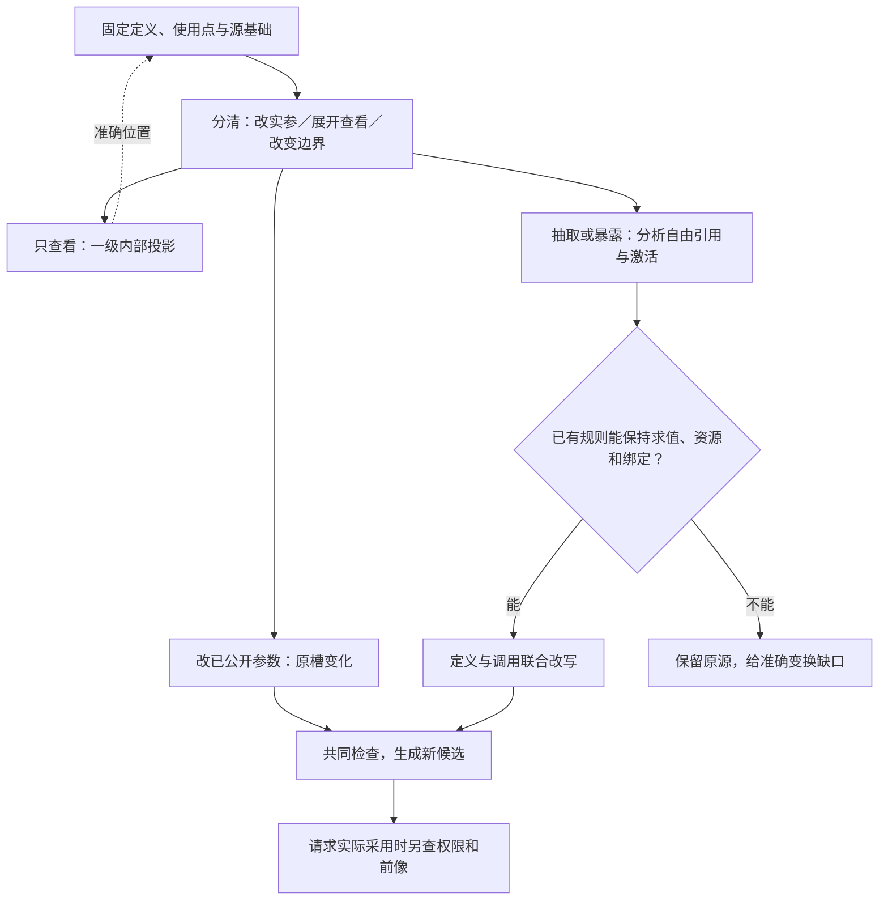

# 结构作者与语义编辑

> **阅读范围**：采用范围内的设计规范；实现状态另查未决。

<details>
<summary>本页内容</summary>

- [需求形状的局部编辑与原作者位置](#需求形状的局部编辑与原作者位置)
- [结构编辑与受管目标回源的边界](#结构编辑与受管目标回源的边界)
- [范围与当前选择](#范围与当前选择)
- [一次出现、一次求值与一个定义分开](#一次出现一次求值与一个定义分开)
- [结构体格式与精确字段](#结构体格式与精确字段)
- [基础表达式的结构与执行区域](#基础表达式的结构与执行区域)
- [一个完整的结构作者模块](#一个完整的结构作者模块)
- [读取器、绑定器与共同检查的实际过程](#读取器绑定器与共同检查的实际过程)
- [通用局部控制的结构编码](#通用局部控制的结构编码)
- [管脚视图的端点、激活与合法连接](#管脚视图的端点激活与合法连接)
- [三类精确结构编辑沿原协议进入](#三类精确结构编辑沿原协议进入)
- [名称重构的正向算法](#名称重构的正向算法)
- [从语义改动到文本字节的确定回写](#从语义改动到文本字节的确定回写)
- [结构与文本作者权切换及混合工程](#结构与文本作者权切换及混合工程)
- [结果、诊断与下一步](#结果诊断与下一步)
- [并发、版本与缓存的接合](#并发版本与缓存的接合)
- [整批作者变化的落实、重基与发布](#整批作者变化的落实重基与发布)
- [预算与较小实现](#预算与较小实现)
- [连续开发与独立复核情形](#连续开发与独立复核情形)
- [当前取舍与后续义务](#当前取舍与后续义务)
- [已读机制与采用边界](#已读机制与采用边界)
- [有类型任务槽是现有结构修改的简写](#有类型任务槽是现有结构修改的简写)
- [实现读取器与编辑器的接合位置](#实现读取器与编辑器的接合位置)
- [私有函数抽取与局部内联](#私有函数抽取与局部内联)
- [Block边界编辑的确定改写](#block边界编辑的确定改写)
- [扩展前端的接入边界](#扩展前端的接入边界)
- [对象与领域结构编辑的实际边界](#对象与领域结构编辑的实际边界)
- [固定语言组合与对象契约的同义入口](#固定语言组合与对象契约的同义入口)
- [日常作者服务：定位、补全、格式化、修复与全工程重构](#日常作者服务定位补全格式化修复与全工程重构)
- [记录更新的源码与结构往返](#记录更新的源码与结构往返)
- [开发中的补全、改签名、格式化和联合重构](#开发中的补全改签名格式化和联合重构)

</details>


[Code-OSS 连续修改](../../../examples/原生维护/Code-OSS搜索替换.md#developer-files)与[整条开发链](../../../examples/原生维护/Code-OSS搜索替换.md#sec-pipeline)是本章的实际消费者。作者源码批次及其语义读集仍由 workspace 物化；目标工具运行时对搜索命中的替换是另一份 Plan，不能把其模型版本填成作者 Candidate，也不能用纯文本前像匹配代签符号或任务语义保持。

本章拥有基础中立程序的结构体编码、求值区域、管脚投影与结构修改回到作者源的具体合同，接合[作者文件](../工程源/清单模块与绑定锁.md)、[语言体系](../可替换表示与适用范围.md)、[共同变化](../../开发/工具协议/候选修改与批量.md#语义增量临时身份与前提)和[转换保持](../../编译/表示/表示族与跨层保持.md)。编码标签不是语言关键字；精确编辑操作通过共同候选协议进入。

## 需求形状的局部编辑与原作者位置

共同要求中的关系、规则表、状态条件、保持帧和目标控制可以呈现为局部可编辑视图，但是否可修改取决于真实来源映射。每个编辑位置沿既有对象/角色/版本定位，保留类型、作用域、允许取值和实际消费者；不是任意中文短语都能通过通用setter写进程序。

改值映射到现有editRef或准确源；改关系映射到既有语义变化；改目标形式映射到原control-change；改声明或实现直接形成源码候选。独立需求有自己的作者位置时一并修改接受关系，不通过改生成物或改检查答案绕开它。没有确定改写器时允许同源文本修改，但不能报成结构操作成功。

需要联合修改的跨对象不变量先形成整批计划，再按同一基础检查与发布。重命名引用、反向索引、当前结果接受条件不因为分在两个文件里就独立；中间错误草稿保留。仅改变展开、折叠和图布局不改变需求或编译根；有业务坐标含义的对象按其领域规则解释。

完整来源、候选与回写算法沿本章原规则，需求的逻辑含义引用[唯一合同](跨软件需求合同.md#cross-software-intent-contract)，不增加另一种作者编码。

## 结构编辑与受管目标回源的边界

本章的结构操作修改真实作者区域；从生成TS取得的节点不能仅因形状相似就当成同一个作者节点。目标修改先经[EditCorrespondence和I-R协议](../../编译/表示/编辑与受管回源.md#managed-edit-roundtrip)确定原定义、使用点或目标控制，再进入本章已有改输入、替换、重命名和私有抽取。精确目标偏移仍只是定位，不是写权或唯一逆变换。

结构重构的保持分析继续检查激活、求值次数、位置捕获、状态身份和资源；来自目标的局部请求不能通过“只复制一段代码”跳过这些条件。一个源节点映到多个输出出现时，声明级和使用点级修改分开。无法保证时保存可继续修复的目标草稿和范围冲突，不通过移除未知节点得到绿色。

## 范围与当前选择

当前具体闭合`sec.semantic/1`中函数及其基础值表达的结构作者路径：参数、类型引用、契约、有序表达式、函数值、调用、条件、匹配、记录和列表。类型、常量、端口与绑定的声明也有结构槽位，但其合法含义仍由原语言规范规定。本章不将事务、时间流、任意原生AST或并行图自动解释成基础表达式；它们保留自己的明确画像和体合同。

普通开发可以一直只写紧凑`.sec`文本。结构作者不要求先写文本；两种入口直接进入同一组绑定和类型/效果规则。机器操作一个输入时只传该输入的变化，不重发整棵树。结构化交换可以比源文本长，适合适配器、交换和结构作者存储；它不能被当成AI每次必须手填的表。

当前选用**有序表达式树＋显式绑定引用＋有作用域的子区域**作为基础作者表示。调用图、数据依赖图、作用域索引和画布都是它的相交投影。目标低层可以再变成SSA、控制流图或其他适用表示。这样不以一个无执行顺序的全局DAG代替源程序，也不要求所有高层领域降成基础函数才能存在。

## 一次出现、一次求值与一个定义分开

| 身份或关系 | 具体用途 | 生命周期与限制 |
|---|---|---|
| 声明身份 | 某个函数、类型或公开能力是谁 | 需要长期引用时沿原身份协议保存；复制定义产生新身份 |
| 参数/绑定键 | 某一作用域内的值由哪个绑定给出 | 当前定义体内唯一；长期被管脚引用时保留对应关系，不分配平台业务ID |
| 表达式出现键 | 源文中的哪一次调用、常量或选择 | 同一候选的局部定位；内容相同不合并为一次出现 |
| 求值激活 | 某次函数调用或区域进入时发生的计算 | 是目标程序运行语义，不为每次运算建立SEC持久任务 |
| 端点句柄 | 本次视图里可读/可改的参数、结果或条件位置 | 绑定候选、定义、出现、角色和映射版本，不是权限凭证 |
| 物理字节范围 | 实际需要替换的作者片段 | 绑定原字节与编码；不是跨版本的永久语义身份 |

同一表达式出现不能同时成为两个语法父节点的孩子。需要使用一个已经计算的值两次，先有一个实际参数或`let`绑定，两个引用指向该绑定。需要执行两次调用，就保留两次出现。不能将相同JSON对象、相同源码或相同摘要当成可自动共享的目标计算。

因此，结构存储允许共享不可变元数据，但不能借物理对象共享改变求值次数。反过来，后端能够证明某次公共子表达式消除合法时，可以优化；那是有前提的变换，不是解析器的默认解读。

## 结构体格式与精确字段

`sec.author-module/1`仍是结构模块外壳，其`dialects/imports/definitions/exports`继续使用[既有字段合同](../工程源/清单模块与绑定锁.md#语义模块-secauthor-module1)。本章定义该外壳内基础定义的`body`，用`representation: "sec.semantic-body/1"`选择结构编码。这个字符串标识编码合同；解释含义仍来自实际锁定的`sec.semantic/1`，不能通过更换representation暗改数值或执行规则。

以下字段是设计中的判别联合，未知字段不静默忽略。没有采用这个结构体的旧领域定义，继续按其原体合同解释；不能给任意旧body加这个标签就宣布迁移完成。JSON重复对象键在解码入口拒绝；对象成员次序不是执行顺序，顺序始终用数组或固定语义槽表示。

### 声明体

| 外壳kind的基础角色 | body中的必需内容 | 可选内容与精确缺省 |
|---|---|---|
| `s:function` | representation、params；无expression时还必需returns | 有expression时returns可省并按有限作者规则推导；typeParams默认空；effects缺省为主体推导；requires/ensures为空数组；expression缺省是要求声明，不是空函数 |
| `s:type` | representation、definition | typeParams默认空；opaque默认false；definition为alias、record或sum三选一 |
| `s:constant` | representation、expression | annotation省略时推导；允许合格函数引用或被动lambda，仍须通过静态构造与捕获检查 |
| `s:port` | representation、params、returns、effects | effects即使为空也必须显式给出；不接受expression；参数位置不因此取得默认具名调用合同 |
| `s:binding` | representation、target、expression | target是实际端口/实现槽引用，expression通过原BindingExpr限制；不生成对外授权 |

这里`s`只是当前模块把精确语言绑定到的别名，不是特殊保留字。function的`params`是有序数组，每项为`{key,name,type}`，参数类型必需；port的`params`是有序TypeTerm数组，不虚构基础端口语法没有声明的形参名。lambda参数项为`{key,name,type?}`：单个未标注参数或显式带类型列表沿原文法；多参项若省略类型，只能先作为待补类型的结构草稿，不能以结构入口暗增基础语言能力。`typeParams`每项为`{key,name}`，当前作用域不重复。公开参数名参与具名调用合同，key承担身份；二者不能任意互换。

key在单个定义体的对应命名空间内唯一，为非空有限字符串；引用的完整身份由定义与该key共同决定，不要求所有模块的局部键全球唯一。没有key的子表达式可以首次分配局部键，但同一出现被赋予两个现存键时要核对对应，不自行合并。名称满足所选语言词法，公开名另由模块出口检查。结构kind与body字段的合法组合是有限表，不允许function携带type.definition等不适用字段。

binding声明的外壳名称仅用于自身记录定位，真正绑定对象由body.target确定；bind不进入模块公开导出。类型声明的外壳导出仅能指向合法定义；外壳namespace是定位信息，不隐式开放名字或取得任何权限。

`effects`为实际能力/效果符号引用的集合表示，重复拒绝。声明里省略effects允许按主体推导；没有expression也没有已接受实现合同的声明无法从空白推导为空效果，而是保留待定。函数**类型**里省略effects沿基础规范为空上界；两处不能共用一个无上下文的补默认函数。

`requires/ensures`顺序保留。`result`只在所属函数的后置区域可读。无expression的函数可以存作设计要求；主体中存在hole表示尚未完成的草稿。这两种状态都不能以补零获得目标实现。

### 作者省略与内部完整数据的区别

[简洁作者合同](../../领域/计算基础/紧凑表示与程序范式.md#compact-author-contract)同样适用于结构源。`returns`缺省是推导请求，显式TypeTerm.hole是作者保存的未完成类型；二者都不是Any，也不是已满足的接口。无函数主体时缺returns仍不构成可调用声明。lambda的单个未标注参数可以通过相邻固定约束推导；多参语法、递归与名义类型限制不变。

源结构省略的字段在解码结果中记录来源，不在保存时补回作者JSON。推导完整类型进入HeaderIndex/BodyAnalysis，生成器只能消费真实完成结果。显式注解即使等于推导结果也保留；请求固定签名时才将新注解写入源。旧body修订不认识推导槽时返回不支持，不能以相同representation标签混用新旧规则。

文本省略的导入别名只影响文本解析；结构外壳的imports键已经是准确别名，不新增第三种导入身份。文本→结构投影可以展示这个已解析别名，但不能据此让两份表示都取得独立作者权。

### 类型项

下文TypeTerm（记作T）指本节类型项，Expr指下一节表达式，Pattern指模式，R指引用项，K指所属定义内的局部键，N指满足该命名槽规则的名字。每个类型项恰好选择一种构造：

| 形状 | 意义与合法条件 |
|---|---|
| `{core: "Int"}` | 来自本次基础画像的预置类型；Bool、Unit、Never、Text、Bytes采用各自名称；未知core拒绝解释 |
| `{core: "List", arguments: [T]}` | List/Option参数数为一，Result为二；参数是类型项，不把任意字符串当类型 |
| `{decl: R, arguments: [T...]}` | R为本地或导入公开类型引用；实参数量与可见性检查，空参数可省略 |
| `{parameter: K}` | 当前显式量化类型参数的key，不能引用值参数或别的定义私有参数 |
| `{record: [{name:N,type:T}, ...]}` | 匿名结构记录；字段唯一，数组保留声明次序；不是同布局名义类型的强制转换 |
| `{function: {parameters:[T...], returns:T, effects:[R...]}}` | 函数类型；参数位置有序，效果省略为空上界；嵌套返回类型由结构明确分组 |
| `{hole: {expected:"type", rawText?:Text}}` | 类型草稿空洞；不能在生成或证明中作为Any、Never或任意已满足类型 |

具名类型声明的`definition`为`{alias:T}`、`{record:[...字段...]}`或`{sum:[{key,name,fields:[T...]}...]}`。别名沿现有透明规则；record/sum在该声明处分配名义身份。opaque仅适用于record/sum，构造、字段和匹配仍检查表示权限，编码字段不能伪造这种权限。

### 引用项

类型项的decl引用只允许解析到类型声明的本地/导入引用；effects只允许对应效果或能力定义；binding的target只指实际端口/实现槽，不能使用局部值或结果引用。表达式中的`ref`字段仅接受下列之一：`{binding:K}`引用合法局部绑定；`{definitionId:D}`引用本模块声明；`{import:A,export:N}`引用实际导入的公开符号；`{constructor:{type:T,name:N}}`引用具名和类型构造器；`{resultOf:D}`引用当前后置区域的正常结果。

继承外壳的定义引用与普通业务记录分开。只有明确标为引用的槽位解释它们；一个业务对象恰好含有definitionId、import或binding字段，并不因此成为工程链接。外部引用经过导入与公开合同解析，已知私有ID不绕过封装。

`{binding:K}`不是“在整张图里找到同名节点就能用”。读取器必须检查该key的声明区域、绑定时点和当前使用区域。初始表达式不能读自己尚未建立的let绑定，兄弟分支的局部值也不可直接读取。

## 基础表达式的结构与执行区域

所有表达式都有`tag`；可带候选局部`key`。作者未给key时由适配器分配；它不进入普通源码。每个孩子是一个表达式出现，参数与引用按各自规则编码。

| tag与必要字段 | 正常求值 | 子区域与编辑限制 |
|---|---|---|
| `literal`：type；除Unit外需value | 取得Int、Bool、Text或Unit基础值 | Int用规范十进制字符串，允许负号，零只编码为0；不经过IEEE754解析丢精度；Unit不接受value |
| `reference`：ref | 读取当前可见声明或绑定 | 不执行引用所指的函数体；不重放let初始化 |
| `unary`：operator、operand | 先求operand一次，再作原运算 | operator限现有!、+、-；类型和错误沿基础规则 |
| `binary`：operator、left、right | 普通算术/比较先left再right | &&/||的right为有条件激活区域；不是普通先求两参的库调用 |
| `call`：callee、arguments | 先callee，再按arguments数组顺序求实参，最后调用 | 每项为`{key?,value,label?}`；label只用于有具名合同的声明；同值实参仍各自求值 |
| `field`：receiver、name | 求receiver一次，再读该语言的字段 | 中立值字段与原生getter不是同一操作；基础结构不偷装原生行为 |
| `record`：fields | 按数组次序求各字段一次 | 每项`{name,value}`；重复字段拒绝；名义构造由预期类型及表示权限决定 |
| `record-update`：receiver、fields | receiver一次，随后按数组顺序求更新值一次，构造同类型新记录 | fields非空、每项`{name,value}`；准确字段/名义身份/表示权限/资源条件见基础语言；不作深合并或原生对象写入 |
| `list`：items、tail? | items从左到右，最后求tail并拼接 | tail必须List；相同元素多次出现不自动去重 |
| `let`：binding、initializer、continuation | 在旧环境求initializer一次，绑定后进入continuation | binding为`{key,name,type?}`；其值可被多个使用点读取；initializer不是全图可重排节点 |
| `if`：condition、then、otherwise | condition一次，随后只进入一个分支 | 分支结果经父if产生；内部局部不能直接跨区域逸出 |
| `region`：bindings、expression | 依次计算块中每条绑定，最后计算expression | bindings每项为`{binding:{key,name,type?},initializer:Expr}`；同块重名拒绝，内嵌region可合法遮蔽；不把一个块错误消去 |
| `lambda`：params、expression | 创建闭包；调用时才执行expression | 在原文法允许省略类型的地方由预期类型或有限主体约束补齐；捕获按真实引用派生，不手填第二份捕获清单 |
| `match`：subject、arms | subject一次；按数组顺序选首个匹配 | 每项`{key?,pattern,expression}`；模式绑定只在该分支有效；覆盖另行检查 |
| `hole`：expected、rawText? | 没有可执行值 | 本表达式槽expected必须为expression；类型项与模式hole分别为type/pattern；保留草稿与位置，拒绝对应完整生成 |

字面量type限可由当前基础词法直接表达的Int、Bool、Text、Unit。Bytes等通过有合同的基础库构造，不把JSON任意数组悄悄变成一个额外字面量语义。上表类型项可表示Never，但不存在正常的Never字面量。Bool的value必须为JSON布尔值，Text必须为合法Unicode标量串且不隐式规范化；Int的value字符串采用`0`或`-?[1-9][0-9]*`，不接受指数、前导正号、前导零或负零，原始字面量写法需要保全时放入源补充而非改变数值。Int字符串允许任意精度的有界输入，实际长度受读取预算；超额是资源错误，不舍入。

模式也以tag判别：wildcard、unit、empty-list没有附加含义字段；literal带type/value并采用相同值规则；bind带`binding:{key,name}`；cons带`head:{key,name}`与`tail:{key,name}`两个不同绑定；constructor带`constructor:{type:T,name:N}`与`patterns:[Pattern...]`；hole带expected="pattern"和可选rawText。cons不接受任意子表达式，constructor参数数与所属变体一致；empty-list与unit不需要value。模式可带局部key作定位，其他未声明字段拒绝。模式不能放任意调用或属性读取；同模式重复绑定拒绝，裸名字仍表示绑定而不是猜同名构造器。既有覆盖算法直接消费这个模式，不另写图形版匹配规则。

`region`精确对应基础BlockExpr，不是可任意声明新执行语义的插件点。无局部let的块使用空bindings；最终expression必需，因此它不把`{}`空记录解释成Unit。裸LetExpr用let节点，显式块用region保留同块重复检查及嵌套遮蔽。分组括号可以在语义中规范化，实际括号、分号、注释和行尾由CST补充保全；不能只靠有序值树恢复原字节。

结构引用保留绑定键，同时检查名字在当前语义作用域中的可见性。这个基础可往返子域不允许通过内部key偷读在对应文本中已被遮蔽而不可命名的局部。需要暴露该值时先在可见处绑定别名，或进行明确联合重命名。其他专有结构画像可以设计不同的引用规则，但不能冒充与当前`.sec`基础域同义。

`operator`只取原前缀和二元运算符集合；单一binary不承担任意函数语义。位置实参必须在具名实参之前；字段/参数名的字符串只能用于已有命名槽，不是通用代码入口。结果引用的函数身份与当前ensure区域相交验证；更内层lambda的捕获若使结果值逃出该后置检查的允许范围，按基础合同限制，而不是自动保存一个运行结果快照。

### 四个直接反例

**分支不可以被拓扑排序提前。**`if x == 0 then 0 else 10 / x`在x=0时正常返回0。将除法节点提升到共同前置会产生原来不存在的除零。类型完全相同也不能改写激活条件。

**共享引用不是复制调用。**`let v = next(); v + v`调用一次next；`next() + next()`调用两次。next在此是一个由上下文固定的有作用函数，用来描述区别，不宣称库存在。结构编辑不能把其中一个自动当另一个。即使纯函数没有外部作用，也还需要考虑陷阱、非终止和资源。

**未用值不等于可删除计算。**在已有语法中`fn spin() -> Int = spin();`以及`fn stalled() -> Int = let ignored = spin(); 0;`的后者不正常返回；删除let初始化会得到0。这是书面运行语义反例。

**同类型同名不等于同一绑定。**`fn sample(x: Int) -> Int = let y = 10; x + y;`对输入3得到13。仅用字符串替换将x改名为y，会使末尾变为`y + y`并得到20。正确重命名检查实际绑定关系，不能只重新通过类型检查。

## 一个完整的结构作者模块

下面与文本`export fn safeQuotient(x: Int) -> Int = if x == 0 then 0 else 10 / x;`表达同一基础行为。它没有外部业务库依赖；`constraint:"1"`仍须在上下文中解析到本版精确语言定义，不将裸版本标签当内容摘要。

```json
{
  "schema": "sec.author-module/1",
  "moduleId": "module:ratio",
  "namespace": "example",
  "dialects": {"s": {"languageId": "sec.semantic", "constraint": "1"}},
  "definitions": {
    "definition:ratio": {
      "kind": "s:function",
      "name": "safeQuotient",
      "body": {
        "representation": "sec.semantic-body/1",
        "params": [{"key": "p-x", "name": "x", "type": {"core": "Int"}}],
        "returns": {"core": "Int"},
        "expression": {
          "tag": "if", "key": "e-choice",
          "condition": {
            "tag": "binary", "operator": "==",
            "left": {"tag": "reference", "ref": {"binding": "p-x"}},
            "right": {"tag": "literal", "type": "Int", "value": "0"}
          },
          "then": {"tag": "literal", "type": "Int", "value": "0"},
          "otherwise": {
            "tag": "binary", "key": "e-div", "operator": "/",
            "left": {"tag": "literal", "type": "Int", "value": "10"},
            "right": {"tag": "reference", "ref": {"binding": "p-x"}}
          }
        }
      }
    }
  },
  "exports": {"safeQuotient": {"definitionId": "definition:ratio"}}
}
```

这个完整对象用于说明实际可解码结构，不是推荐AI每次输入这一长段。普通作者仍可只提交一行文本，结构作者可由工具创建该模型；第二次只改e-div.left。两种首次独立创建可以分配不同内部身份，语义对照使用明确的对应映射；不能借同样行为认定同一作者谱系。公共名、名义类型身份、效果和要求不能被alpha重命名比较擦掉。

本章的同义判断先比较声明关系、规范表达式和可观察合同，再按需要检查目标行为。它不是声称任意两种程序的等价性已经有完备算法。若一侧已经优化，比较还需那项变换的保持关系，不能只看结构不同就报告错误。

## 读取器、绑定器与共同检查的实际过程

**E0 固定输入。**从候选或不可变内容取得原字节、外壳、精确语言与表示版本，当前许可和读取预算另外取得。结构版本未知时仅保全，不能把它作为基础表达式猜读。

**E1 解码形状。**拒绝重复键、非法Unicode、错误判别、重复必需字段和超额输入。递归采用有界工作栈；记录每个表达式、模式和绑定出现。未提供的可选项按本合同补缺省，不由宿主反序列化习惯决定。

**E2 建立声明。**先收模块、类型、函数/函数值和端口的名字及显式/待推导签名，再按共同补全规则处理，区分工作区导入与锁内容。随后分配或恢复需要保留的声明身份；type、value、effect和构造器名称空间沿基础规则。

**E3 建立局部可见性。**从参数环境下降到let、region、lambda、if和match的区域。initializer在引入新绑定前检查；region中的let依序更新同块环境并拒绝同块重名；每个分支独立扩展环境；lambda捕获只能来自此处真实可见的外部绑定；resultOf仅在对应后置区域可用。跨定义只经合法声明引用，不携带别的函数局部值。

**E4 共用静态判断。**调用原类型、模式、效果与契约规则。结构入口没有跳过opaque检查、输入类型或契约定义性的特殊通道；省略effects与显式空effects不同。不能解析的引用和hole形成具体开放项，不作为成功前提。

**E5 形成共同表示与视图。**得到同一类只读语义节点与位置补充；按需派生管脚、引用和影响。画布坐标仅在其拥有者明确定义为业务空间时参与含义。通常的图布局不决定求值顺序。

**E6 交付。**结构形状合法但语义未完整，可形成带诊断的作者草稿；解码结构不合法则拒绝这个结构请求并保留原输入用于诊断。生成只选择无开放缺口的真实输出闭包；不完整模块不能凭全图看起来连通取得支持。

若需要引用的语言定义或库还未取得，返回指定绑定缺项。解码与读合同不自动执行该包的生成代码或任意初始化；外部分析器执行仍走实际宿主准入。无相关画像的普通函数不启动其他领域插件。

## 通用局部控制的结构编码

基础`sec.semantic-body/1`保持原结构；固定的新通用组合使用对象扩展体的方法修订，继续复用同一ModuleRevision、名字和表达式。新增局部控制不要求函数先变为class。读取器首先核精确解释和编码方法修订，旧解码器不以同一`/1`标签猜读未知节点。

扩展`region`采用有序`statements`与可选`expression`；旧`bindings/expression`仍可读取为同义局部let序列，但两种列表不能同时给出。顺序、控制出口及清理范围由[局部控制](../../领域/对象与控制/控制流与存储寿命.md)唯一规定。字段如下：

| 节点 | 必需字段 | 解释与检查 |
|---|---|---|
| local-declaration | binding、initializer、mutable:Bool | mutable=false对应let，true对应var；创建前先在旧环境求初始化 |
| local-write | bindingRef、value | 只更新当前可见可变绑定，不按同名字符串定位 |
| while | key、condition、body | key是本函数内控制目标，Bool条件先于每轮体 |
| break / continue | target | target由词法绑定得到；只准同函数最近循环，不借内部ID跨函数跳转 |
| return | functionRef、value? | 绑定当前函数/方法/lambda；缺value为Unit |
| expression-statement | expression | 保持一次求值与错误/非终止，普通值丢弃不是删除计算 |

函数检查另外记录出口，不把return伪装成普通值。闭包捕获local-write所用绑定时保留位置身份，不能因值相等自动合并两个槽。任意跨域移动仍需新作用域和资源保持；当前私有抽取只承诺无外向控制出口的表达式，不能把return提取后改成退出新helper。

## 管脚视图的端点、激活与合法连接

<a id="fig-pins-detail"></a>

### 图解：管脚包含值、出现、角色与激活

示例只显示adjust的纯值组合。参数绑定的复用与复制一次调用是不同动作，画布位置不改变执行含义。



管脚查询是现有`sec.query(view:"contract")`的局部投影，不新增一个工具。结果只返回本次对象的必要部分：候选与解释引用，定义/出现句柄，端点角色，类型/效果来源，激活区域，可修改模式和已有的绑定。只有需要显示的端点分配句柄，不导出完整世界图。

调用节点的端点包括callee、实际实参位置、结果和相交的错误。参数接口的角色键与实参出现键不同：前者对应声明参数，后者固定该次调用中的求值位置。工具按已解析签名连接二者，公开名字用于具名调用。后续插入参数不能把旧角色键解释成新数组下标；参数重命名也不能忽略实际具名调用者。

表达式出现的结果与已经绑定的值分别标明。参数、合法let绑定或已声明区域输出可作为**当前可用值**连接；一个尚未执行的call节点不是现成可复制值。将它的图输出连到另一个消费者，必须有明确的共同激活和一次求值安排。当前基础编辑不自动引入该共享：需要作者明确构造let或使用已验证的重构计划。

连接检查顺序为：定位候选与端点；核读/写权限及作者拥有者；核端点种类和单值基数；核绑定可见性与激活；核类型/效果/资源；按源适配形成候选；重解析与重绑定；发布实际差异与诊断。后两项失败不修改真实工作区。

函数递归引用是声明依赖，不在作者表达式树里建立循环物理指针。另一个明确的数据流画像可以采用带延迟的循环，但它的调度、初始值、时间和缓冲由该画像承担。本章不能因为接受函数递归就接受所有反馈图。

## 三类精确结构编辑沿原协议进入

以下补齐`sec.semantic-change/1.operations`中基础程序的一个有界公开子合同。其余资产、控制和领域编辑仍使用自己的已声明变体；未知op拒绝，不动态寻找同名执行器。schema/base/purpose/groups/preconditions继续由[共同变化](../../开发/工具协议/候选修改与批量.md#语义增量临时身份与前提)拥有。

| op | 必需字段 | 明确行为 |
|---|---|---|
| `set-input` | `node`、`input`、`value` | 替换该出现中一个现存的值槽；不隐式调整参数数量和其他求值位置 |
| `replace-expression` | `at`、`value` | 替换一个明确表达式或函数主体；当前要求、签名、其他声明和资产不随之改写 |
| `rename` | `subject`、`name` | 保持指定绑定身份，修改其定义与已解析使用；公开接口与具名调用按下节处理 |

value恰选一项：`{source:Text}`、`{tree:Expr}`或`{from:ValueHandle}`。source按目标槽的精确语言、词法作用域和表达式类别解析，不运行，不解释成自然语言；tree按本结构合同读取；from只使用在目标位置真实可用且允许读取的**绑定值**。from不表示复制原源码、重新调用生产者或从某次运行日志读取历史值。node/input/at/subject为本次base内真实可解析句柄，不能由同名字符串绕过候选归属。

`set-input`的input由端点视图给出：普通运算使用left/right/operand等固定角色；函数参数用实际参数角色键或本次实参槽。没有实参的位置先创建明确的新调用/主体，不能以参数默认名直接追加。缺省输入只按语言已定义规则处理；基础函数没有默认参数语法时，结构路径同样不自动添加它。

经现有propose.draft适配的请求可以省略changeId，由服务创建并返回；需要响应丢失后重用原身份时必须携带原changeId，仍核相同基础和内容。内部/序列化长期交换保留完整变化身份。purpose从当前任务继承，客户端自报更强purpose无效。纯候选引用到期后不能凭旧changeId创造一份伪称相同的身份映射。

所有既有句柄先在base中解析，再构造联合候选；operations的排列用于明确同批组成和新建内容引用，不意味着每项都在前一项的新文本中重新按路径搜索。对同一槽两次不同替换、删除父节点同时修改已删除后代等非可合成变化，拒绝冲突；表达式的整体替换与其中的改名需要共同重构计划，不能“最后一项覆盖”。无冲突的改签名与改调用可以一起形成草稿或合格候选，最终才作整体语义检查。当前三个操作不兼任创建声明、任意移动和抽取函数；这些能力仍可用现有整段源码候选表达，完整结构操作合同另有开放义务。

### 一次真实形状的管脚修改

先有原文：

```sec
fn gain(x: Int, factor: Int) -> Int = x * factor;
fn clip(x: Int) -> Int = if x < 0 then 0 else if x > 255 then 255 else x;
export fn adjust(x: Int) -> Int = clip(gain(x, 2));
```

假定已有查询对候选c1返回了gain调用出现n7、它的factor输入p2。这些引用是示例值，不是实际签发的工具引用。修改仅需：

```text
sec.propose({draft: {
  schema: "sec.semantic-change/1",
  base: "c1",
  operations: [{op: "set-input", node: "n7", input: "p2", value: {source: "3"}}]
}})
```

文本作者适配器把当前2替换成3；结构作者适配器只改相应literal值。两者产生新候选，旧c1不变。结果返回新候选、实际改动与必要诊断，不回传整棵结构。工具内部映射不让AI再提供函数签名、参数类型或数字摘要。

如果只知道源码而不需要结构查询，继续使用原有`edits`更短；没有理由先强制调用query取得n7。若当前factor已在外部变为4，旧基础不会被自动当成当前工作树；候选编辑与真正apply的前像分别检查。

结构入口不适用任意新语言时仍保全其原源；这项限制不能被包装成原生作者必需。已能用中立文本表达的新算法可以直接用文本继续，结构适配缺口单独登记。

## 名称重构的正向算法

**R0 固定真正绑定。**根据subject取得定义/局部绑定、公开角色及当前所有可检查消费者；不能按全文同名搜索确定对象。

**R1 求受影响名字。**收集定义token、解析到它的引用、具名实参标签、已声明导出与相交资源绑定。注释、字符串数据和另一个同名局部不默认改；文档链接或反射名确为消费者时进入各自合同。

**R2 模拟新环境。**在候选中改名并重新解析绑定关系。若某个原引用被新局部捕获，或出现同级冲突，返回RENAME_CAPTURE/NAME_CONFLICT与位置。默认不为了完成用户要求顺便改名其他作者绑定；需要联合改名时形成明确的多操作候选。

**R3 处理公共接口。**公开函数名或具名参数名改变属于接口差异，稳定ID不使它成为无行为变化。当前已知客户可以一起更新；不可读或外部客户保留准确的兼容义务。实际语言允许合格转发时可另行提出兼容门面，不隐式制造别名与运行分派。

**R4 保全写回。**按文本CST或结构作者更新最小必要范围，保留声明身份；重新检查类型/效果/契约与实际引用映射。新名字违反词法、与内建解释冲突或映射不可恢复时给出相应诊断。

**R5 发布与继续。**返回本次语义变化和目标影响；缓存仅复用真正不相交输入。公开名改动可能重建目标门面，私有改名也可能改变诊断/源码映射，但不等于必须重算所有数值分析。

参数位置重排另行处理：具名实参先按原源码顺序求值，再分配参数槽；不能为了打印新参数表排序而重排有作用表达式。函数类型没有具名合同的间接调用，按位置解释。插入参数时既有角色键仍指原参数；删除实际使用的参数要修改调用，不能保留旧数字索引偷偷指向另一项。

## 从语义改动到文本字节的确定回写

<a id="fig-cst-roundtrip"></a>

### 图解：结构变化回到真实作者字节

新增源片段只在最小必要语法容器打印；随后检查变化与保持范围，不从短摘要重新生成整文件。



文本作者的基线算法是**局部CST修改与有限重解析**，不是打印整模块。实际输入为固定原字节B、解析/CST版本、身份映射M、语义改动Δ和当前文本保全合同。

1. 将所有目标先定位到B中的出现，确认范围、种类和作者归属。结构op不能改生成目标或其他未知文件。
2. 计算每项改动的源token范围。字面量/名字优先只替换token；需要改变表达式结构时选能够重新解析且保留作用域的最小语法容器。
3. 对重叠编辑求共同语法容器，一次构建最终候选；同一槽冲突不采用后到覆盖。定义与引用可以在同一批一起改变，类型检查最终候选而不是错误地拒绝每个中间步。
4. 根据父运算优先级添加所需括号，生成该容器的文本。未改子节点、注释和空白优先保留原切片；仅由后端生成的新私有名字按绑定卫生分配。
5. 对所有不相交字节拼接成B'，再用同一语言重解析和重新绑定。比较Δ要求的对象关系及未改区域，不只比较类型是否通过。
6. 形成新候选和映射M'。后续正式写回在实际目标重新比较前像，纯候选阶段不动工作树。

**无操作回写**必须返回原字节。**变化后的回读**要得到所接受的Δ及已声明规范化，不要求恢复一次任意优化的唯一上游意图。语义树不足以恢复的注释、括号、BOM或行尾来自真实补充，不从格式器猜。

源字符串本身语法不完整时，text作者可以得到准确的新原文草稿，其他未改字节仍保留；结构作者将它保存为带原文和目标类别的hole。这样保存并不使新引用、契约或目标产物合格。前像/句柄非法、版本不匹配或越权则拒绝请求，不以草稿名义修改错对象。

一个格式适配器没有能力精确修改该容器时，返回AUTHOR_EDIT_UNSUPPORTED及支持范围；可以选择原文编辑或明确的整区域候选，但不能自动全仓格式化。CST范围精确也不代表行为映射唯一，仍需对应增量检查。

## 结构与文本作者权切换及混合工程

切换复用[作者方式迁移](../工程源/清单模块与绑定锁.md#作者方式切换是一次明确的迁移)：固定旧源和未保存内容；按本结构体转换；保全非语义补充和长期引用；检查解释；在同一候选中转移该区域写权。需要物理保存时仍按目标前像提交。

对于无法转换的内容，当前采用**明确区域保留**：可转换定义转为结构，未支持定义仍由原文拥有。区域边界必须有可可靠定位的来源和写入协议；无法切开的单文件就保持全文件原文作者，不假称一半转换已经安全。一个定义内不能存在两个独立可写的权威副本。

查看结构、导出JSON、生成目标程序均不转移作者权。结构作者导出的文本只有在具备回读及映射时可作为可编辑投影；否则是明确的只读导出。默认不每次保存同时写完整文本、结构树、全图和历史映射四份内容。

无关未知扩展可以按可信影响合同保全；可能注册全局符号、改变默认或影响作用的未知不因当前视图没有画边就排除。部分程序范围允许继续，正是因为已证明其输入/解释闭合，而不是因为忽略了未知。

## 结果、诊断与下一步

| 情况 | 返回内容 | 下一步与保持范围 |
|---|---|---|
| 结构完整、绑定和语义合格 | 新候选与本次差异，可继续请求预览 | 旧候选与真实目标不变 |
| 程序类型错或主体hole | 新草稿、具体诊断和影响根；不挂旧artifact冒称新产物 | 作者修改相交位置；已独立闭合根可按原规则生成 |
| 表示版本或节点kind未知 | 保全原载荷、对应支持缺项 | 使用原支持路径或实现该合同；不执行猜测 |
| 句柄/base不匹配 | STALE_STRUCTURAL_REF，无新候选覆盖 | 重新读取当前视图或显式重基 |
| from值不在目标可见区域 | SCOPE_ESCAPE，无错误接线 | 显式返回值、参数化或重写相应结构，不跨区偷读 |
| 想复用一次未绑定调用的结果 | EVALUATION_PLAN_REQUIRED | 形成明确let/控制调整，再检查实际行为变化 |
| rename造成捕获或未处理的接口改变 | 具体冲突或兼容缺项 | 选择新名字、联合修改或版本迁移 |
| 字节写回无法保持 | AUTHOR_EDIT_UNSUPPORTED | 保留原文；可提出整区域候选但不自动接管 |
| 结构合法但读取/分析预算结束 | 方法未完成及覆盖；已有字节保全 | 加预算或缩小请求范围；不把未知当不存在 |

有保持承诺的rename、已有值from连接与普通source创作不同：前者不能发布已经知道违背该操作语义的重构；后者可以保存错误源码以便继续编辑。它们对同一程序含义采用相同检查，不需要在所有操作目的下采用相同的接受策略。

以上诊断是本版设计的稳定类别，消息可更具体；不是已运行错误日志。view/resultRef均受当前披露权限检查，错误不能泄露隐藏定义的名字和存在性。非法请求的定位可以只给可见输入位置，内部记录保留真实原因。

## 并发、版本与缓存的接合

所有句柄都绑定候选及映射版本。新候选中的同名定义不能让旧句柄自动指向它；自动重基要先证明对应关系并返回实际基础。源角色、语言或定义版本变化先使相交映射失效，不能重用旧字符位置。

结构改变的共同候选一次发布；不是每个token一份事务。多个工作者可分析不相交定义，公共符号、批次映射和最终产物仍由其既有拥有者汇合。相同生成字节不意味着源映射、控制来源或任务证明相同，这些消费者分别更新。

内容哈希共享、表达式出现身份和目标求值共享分开。可比较的结构哈希要绑定解释、名义类型/公开合同和实际有序边；规范化可以消除无语义的对象成员顺序，不能消除call实参顺序或if区域差别。代码生成使用已有稳定布局输入，不将本次随机分配的查询句柄加入公开名字。

<a id="whole-change-materialization"></a>
## 整批作者变化的落实、重基与发布

本节实现现有`materializeIntentChange`，消费[准确计划](../../编译/实现选择与设计搜索.md#executable-intent-plan)。既有source/files/edits、结构变化、目标回源和直接工作集在绑定后共用这些保持规则；普通文本差异无需先建立完整关系计划。

### M0—M7：从固定计划到一份可继续的作者候选

**M0保留基础。** 在既有内容保留协议内固定原候选C0、当前候选C1、所需原文/结构、规则和实际读集，之后锁外进行计算。句柄失效时先取得精确内容；取得不了返回NeedsInput或准确失效，不按名字寻找当前对象代替。这里不锁住整段编译或等待外部AI。

**M1核真实变更。** 原前像与当前C1分别比较。读集不仅包含将要写入的字节，还包含计划依赖的类型、关系基数、允许输入、公开签名、集合成员及负查找。没有文本重叠不意味着语义前提不变。比如规划器认为每节点最多一个前驱，C1已经允许多个，必须ReplanRequired，不能继续生成单个prev字段。

**M2构成联合动作。** 同一位置的编辑先按准确绑定去重或报告冲突；父子范围重叠时交同一个表示适配器在共同容器内一次构造。给参数改名与修改其全部引用可以是一份动作组，不能按旧偏移逐条覆盖。整文件输入缺省不删除未列文件；删除必须显式。结构来源不能另行改写同一区域的文本镜像。

**M3私有物化。** 先在固定输入上取得sourceSteps的实际AuthorDelta，目标生成方法仍留待compiler执行；再在C1的结构共享分支上应用整批变化并建立新映射，不改C0/C1。selectedUses中的本批标签通过新映射解析，在类型/效果封存后建立真实UseBinding，不提前赋予调用资格。创建主体时先取得真实内容；只返回“准备实现函数X”的方法不是完成的作者差异。工具机械补足导入/绑定时仍保留可省写法；类型推导结果、分析树与Frame不自动回灌到作者文件。

**M4共同检查。** 收齐本批声明再处理引用，允许改签名和调用在同一批闭合。普通创作可以保留语法/类型错误，返回CandidateWithDiagnostics；声称保持的重命名、改线和抽取如果已经发现违反其保持合同，返回MappingConflict，不把它称为成功重构。取得草稿不能推进已采用头，旧产物不贴到新草稿。

**M5重基和失效。** C0之后C1只有与本次真实读写不相交的变化，保留它们并对新候选共同检查；同槽冲突返回双方和需要处理的实际范围。输入论域、规则、含义或方法前提变了，要求重新计划相交部分，而不是将差异视为普通文本合并。被接受的独立要求不由作者程序自改；新计划引用新的接受关系后才可继续。

**M6封存。** 原文、结构和身份映射完整后发布新的不可变候选C2；发生内部故障或取消时不发布半张映射。已经存在于编辑器的未保存文字仍由编辑器拥有，工具不得因为本次物化失败把它删除。允许保留的独立草稿按已有协议返回其准确来源，不称为整批完成。

**M7进入所请求后继。** 预览/检查只处理当前选择的根；generated-edit按原I-R规则完成必要再生成，其比较基线是C1的当前输出加本次重基变化，不是旧目标全文。真实写回重新核磁盘/宿主前像与当前权限；候选原子发布不等于多文件磁盘事务。直接编辑已经保存的原内容不为了流程完整再执行一次保存。

### 部分成功的边界

可独立草拟的两处改变可以分别保留候选，但任务要求两者共同维持不变量时，不能自动采用其中一半。新增反向查询和修改对应写入操作，需要共同保持正反关系；只生成查询函数而遗漏更新路径，函数能够编译也不是该能力完成。

计划的某个独立输出根缺供给，不取消另一个真正不依赖它的根；判断独立要包含共享初始化、公共类型、资产和原任务AND要求，不只看文件夹。结果携带准确剩余责任，由application按现行工具投影，不新增全局事务、队列或第二份意图日志。

## 预算与较小实现

设输入编码字节为B，结构节点数N，局部/声明引用数E。结构解码、重复键/局部键检查、子树所有权和引用索引可采用工作栈与哈希索引，以B、N、E及各字段长度为实际工作来源；需要排序的规范输出另计排序代价。类型统一、模式覆盖和任意契约推理不因此获得线性复杂度保证，分别沿原预算合同处理。

第一次实现可以每模块完整重新检查，CST补丁只覆盖必要字节。无需先实现跨进程增量、完备等价证明、可编辑任意目标源码或可视化画布。优化发生在实际需求和测量后；语义一致与作者保全不能延后。

候选和长期绑定仅按真实用途持久化；一个短函数的局部句柄可以在内存存在。大图分页按区域和请求返回，切片必须标明覆盖；不能将“没有返回的边”当成“没有边”。

## 连续开发与独立复核情形

以下是设计验收轨迹。期望来自本章和基础语言，不从某个新生成器输出反推。

| 情形 | 期望与可观察反例 |
|---|---|
| 文本/结构各建立safeQuotient | 相同输入0得到0，2得到5；独立谱系不强求内部ID或目标字节相同 |
| 将分子10改为20 | 修改一个字面量；输入2由5变10；x=0仍不执行除法 |
| 把除法移到条件外 | 检查到激活变化；不能作为无行为改变的重构自动采纳 |
| gain.factor的文本与管脚各从2改3 | 同一基础及布局下候选行为对应；40从80变120，200仍255 |
| 两个相同调用显示为相似框 | 保留两次出现；没有额外依据不合并求值 |
| 一次let的值接到两处 | 共享值，初始化只一次；编译不创建两个调用 |
| rename x为被内层y遮蔽的名字 | 拒绝捕获；纯字符串替换仍能类型通过不是正确重构 |
| 公开具名参数重命名 | 更新已解析标签，保留外部客户兼容缺项；ID稳定不等于API不变 |
| 在参数表中间插入参数 | 原端点角色仍指原参数；旧数组下标不能指新项 |
| 同批改签名和调用 | 最终一起检查；不因中间临时不匹配拒绝合法原子候选 |
| 不完整表达式后保存 | 保留新草稿原文，旧artifact不换标签；无修改部分字节不变 |
| 同步期间外部改了同一字面量 | 旧前像冲突；选择读回当前或明确重基，不默默覆盖 |
| 已知声明旁有未知扩展 | 按真实影响合同保全，缺完整性不伪称所有根可生成 |
| 文本转结构再无操作返回 | 原补充完整时原字节保持；缺补充只承诺规范文本，不称原文恢复 |
| 无布局历史、两份不同作者表示 | 可以产生合法源码；未取得同一布局基础不承诺同字节 |
| 高层语义图有状态反馈 | 交由实际画像处理，不塞入基础表达式树并拓扑排序执行 |

## 当前取舍与后续义务

与平面无序节点图相比，有序表达式和区域增加了执行信息，但避免用户每次手填通用控制线及其所有约束。与只能文本相比，结构作者有真实可解码的体与局部操作，不是只能查询的装饰图。与把每次修改转换成完整JSON树相比，已有文本和短结构增量减少重复作者输入。

代价是两个前端、源补充、作用域映射和重构判断需要实际实现。首期允许有限可写域，但支持范围必须精确；类型化框架本身不证明全部领域编辑已经成立。完整异步/对象/事务/关系结构作者体、各原生CST适配、复杂移动/抽取的最小文本补丁仍是实际义务，沿原U记录分范围跟踪，不因本章出现而全部关闭。

## 已读机制与采用边界

[MLIR LangRef的区域与作用域](https://mlir.llvm.org/docs/LangRef/#regions)说明包含操作决定区域含义，控制流区域与图区域不同；本章借鉴层次区域，不采用其全部SSA编码作作者界面。[Racket语法对象](https://docs.racket-lang.org/guide/stx-obj.html)保存位置与词法绑定，支持名字不是纯字符串的判断；不要求所有SEC程序使用宏。[LibCST元数据](https://libcst.readthedocs.io/en/latest/metadata.html)区分节点身份、位置、作用域与引用，并避免同一节点对象出现在树中两次；不因此强制SEC每次深复制全部节点。[Python AST文档](https://docs.python.org/3/library/ast.html#ast.unparse)明确AST生成的文本未必等于原文，解析也不完成全部作用域检查；用于限定回写承诺，不以Python语义替代中立语言。[RFC 6902](https://www.rfc-editor.org/rfc/rfc6902.html)定义顺序Patch并忽略未知操作成员，不能用它代替带显式激活、权限和语义前置的增量。

## 有类型任务槽是现有结构修改的简写

完整body继续承担结构作者与交换，不要求AI重发。对已有可见标量槽，服务可以返回[editRef](../../开发/工具协议/候选修改与批量.md#已定位值的紧凑编辑分支)；新值被确定解码为现有literal，再进入同一set-input、绑定、CST回写与检查。其基础、出现、角色、映射和类型由原候选确定，不从模型自报推断。

只保留一个值的显示不会删除它的完整父表达式。引用或枚举的语义来自实际库/语言合同；未解析的数据不先签发可写句柄。字符串值不当source，函数体仍走source或tree路径。短入口不兼任抽取函数、创建声明、变更激活和跨区移动；这些需要各自已有协议或完整作者候选。

## 实现读取器与编辑器的接合位置

基础体解码的当前实现选择见[编译P1](../../编译/内核/编译值服务.md#p1读取的具体步骤)：严格配置成熟JSON树/visitor解析，先检查解码后的重复键、语法错误和资源，再按本章有限联合构造模块。不从容错结果或JSON.parse后已经覆盖掉的对象推断原输入无重复；新依赖未安装不称已具备能力。

文本与结构入口共同产出ModuleRevision，统一的绑定/类型/效果使用同一有限模块索引；目标转换新引入节点后补查。编辑端持有精确base与CST/结构映射，消费[短ticket处理器](../../开发/工具协议/候选修改与批量.md#短值处理器的内存接口与真实重试范围)产生的同一SemanticChange。ticket不是新表达式身份，不进入目标命名，也不替代原出现与绑定关系。

内部poison仅用于抑制连锁诊断，不是公开hole的任意满足类型；两者都不能到达完整生成根。源错误草稿与编码非法分别返回，不能为了共用一个decoder把错误源码变成合法空结构。

## 私有函数抽取与局部内联

<a id="fig-extract-scope"></a>

### 图解：抽取保持分支、捕获与一次求值

箭头表示重构关系而非运行顺序。helper调用必须留在原激活区域；自由绑定是参数来源，不重放生产该值的调用。



本节给出一个不再留给实现者猜测的常用重构：把同一模块内一个完整表达式抽成私有函数，再用调用替换原出现。它复用已有源码批次、签名和CST回写，不增加全局关键字或顶层工具，也不默认增加新的公共op。一般创作仍可直接提交完整函数；本节的保持承诺只覆盖满足条件的重构。

### 输入、输出与保持范围

输入为精确作者基础、选中表达式出现、拟定私有名称和当前任务要求。选区必须对应一个完整表达式；参数、条件、分支、lambda内部均按真实激活区域定位。字符串范围没有解析到完整表达式时，返回定位诊断，不向外猜测扩大选区。

输出为：新私有定义、原位置调用、源对应变化、影响与保持检查结果。二者组成同一候选批次；原函数的公开名、签名、require/ensure、效果上界及其他资产保持。新函数默认不导出、不设置新的运行契约、不产生静态初始化。需要把它变成公共库是另一项明确变化，需补公开类型与兼容判断。

本有限重构处理基础中立值、函数值和正常的同步表达式。相交外部资源的借用/移动、可变捕获、原生控制跳出、反射或调用栈观察，不凭基础规则接受；只能由对应语言/资源保持方法放行。没有这些方法时仍可保留手工候选，但不能标为保持式自动重构。运行内存和时限有硬要求时，新增调用的成本也要满足；不能仅以返回值相同代签。

### X0—X7：确定处理算法

**X0 固定。**将所有选择解析到同一候选的源码字节、ModuleRevision和表达式出现。复用读集、解释与目标约束，锁外做分析；实际写入仍走既有前像协议。

**X1 检查边界。**确认选区不切断绑定或模式，位于可命名的词法区域；不移动到if、短路、match或lambda之外。只有表达式体发生抽取，所在调用的实际执行位置保持。声明自身的契约区域中含有特殊result引用时，本有限重构不改变其归属。

**X2 取得自由绑定。**遍历选区，扣除其中定义的参数、let和模式绑定。读取的是Binding身份而非字符串。外部局部值按首次词法出现排序成为形参；相同绑定只形成一个参数。它们必须在原出现处已可用，形参实参只引用这些已有值，不能把子表达式、getter或尚未执行的生产者当成免费实参提前计算。模块声明与导入保持原解析关系。

**X3 构造签名。**使用已检查类型形成形参/返回类型；仅复制确实自由的类型参数并维持原身份对应，不能把首次实例类型固化成泛型定义。函数值参数保留潜在效果与契约入口。私有名与局部参数避开冲突；没有用户指定名时采用同一模块内稳定的可读名字，不传播临时句柄到公开输出。

**X4 建立主体。**复制选区的语法内容并将外部局部引用替换成新形参绑定；内部绑定进行卫生改名，模块引用保持解析对象。保留子表达式次序、分支、调用出现次数和错误。原位置仅替换成一次私有调用，不能顺便共享其他相似调用、删未用表达式或进行常量折叠。

**X5 联合检查。**在私有事务树中同时加入定义与调用，重新绑定并检查类型/效果。原公开契约不变；新增函数无自动前后条件，避免引入不同的运行失败。用显式参数代换和绑定对应，检查抽出主体与原选区在本结构域内一致；此处可检查的结构保持不被宣传为任意程序等价证明。

**X6 回写。**原选区注释随归属规则进入函数体或保留调用点，无法确定的注释不删除而是在候选中标明位置。未改区域使用原字节切片；新增函数与调用形成一个完整批次。身份映射标记原表达式迁入新定义、原位置新增调用；不能给两个出现同时保留同一个语法父节点身份。

**X7 发布。**返回候选差异、保持范围与必要诊断。仅要求设计时交付规则与范本；已实现工具中的重构请求可返回候选，但不自动修改真实工作树、升级依赖或运行程序。发生当前工作区冲突时，按原候选基础处理，不以新名称重新搜索猜测位置。

算法遍历所选表达式和必要引用，再执行相交模块检查；不要求扫描所有未相关库。缺类型或映射时返回这项保持方法的准确缺项，普通源码创作仍可继续。查询/诊断预算在本次工作中共同计量，不为每一步重置预算。

抽取选区之前还要查询自由绑定是不可变值还是可变位置。当前值表达式抽取不能把读取共享var的表达式改成“先传一次数值，再在helper里反复使用”而丢失原重入或更新。也不能把内部闭包移到返回位置后仍保留原无外逸摘要。缺少该位置/资源保持方法时，返回这项自动重构的准确缺项，普通作者仍可提交明确的联合源码候选。

内联后不能只删除调用节点的潜在效果；须保留每次真实访问、实参一次求值及原控制目标。字段、lambda和循环出现的结构编码保持不变，本项强化现有X1/X5的接受条件，不增加一个结构操作或关键字。

### 正常轨迹与必须拒绝的错误重构

原作者源：

```sec
export fn safeQuotient(x: Int) -> Int =
  if x == 0 then 0 else 10 / x;
```

选择else中的`10 / x`，抽取为同模块私有函数：

```sec
fn quotient(x: Int) -> Int = 10 / x;

export fn safeQuotient(x: Int) -> Int =
  if x == 0 then 0 else quotient(x);
```

当x=0时，调用仍在未激活分支中，结果为0；x=2时结果为5。错误重构若先写`let q = quotient(x);`再判断，就会在x=0时除零，必须拒绝。这里不需要证明quotient对全部整数总定义；要保持的是原位置和原调用条件，而不是新增x!=0的公开输入要求。

原区域已经有`let v = next(); v + v`时，选取`v + v`可以把已绑定v传入新函数，next仍执行一次。选区本身包含`next() + next()`时，应保留两次调用；不能为了复用把它改成一个实参。next是此处用于区别求值次数的抽象函数，不声称基础库已有这个函数。

抽取lambda体时，新调用仍在lambda内部；不得在闭包构造时预先计算。抽取含两个同名而不同Binding的区域时，按身份分别传参并卫生改名，不能按名字合并。两次不同的分支各有相似表达式时，本操作只处理选中的出现；全局去重复用另需自己的保持依据。

### 反向内联与边界

私有直接调用可反向内联，但必须先保留callee求值与全部实际参数的源码次序。实参可能失败、产生效果或不终止时，即使形参未被使用，也不能删除其求值；形参被使用两次，也不能复制求值。可用同一作用域中卫生let绑定保存实际参数，再替换函数体。

有实际函数契约时，内联保留进入检查、正常返回检查及错误顺序；没有消解依据就不删除检查。递归函数一次内联只能展开所选一次，不能无限展开。动态分派、反射或不在有权源内的函数，使用其既有语言规则，不因名字可见就允许读取/改写私有实现。

这种抽取/内联不改变业务定义，但可能改变私有栈、编译成本和目标布局。目标调试需要把helper位置回指原源；若任务将原生栈外观或确切分配列为观察，必须保留或明确不接受这次重构。默认稳定布局沿用，不能借抽取重排无关文件。

完整抽取的公开快捷op、跨模块自动迁出、成员方法抽取及任意资源借用不在本有限协议中。实际客户端可以用已有files/edits形成这里规定的联合候选；未来快捷op只做编码简写，不另定义一种重构语义。正常参数修改继续用set-input，无法保持的手工程序改变不冒领本重构的保证。

<a id="宿主sdk作为中立作者前端"></a>

<a id="block-boundary-edit"></a>

## Block边界编辑的确定改写

本节实现[分层block合同](定义与接口.md#block-composition-contract)的有限编辑动作，不增加持久模型和公共工具。系统将编辑意图落实为既有source/files/edits或已定义的结构操作；工具未提供的专用重构不能仅凭新增操作名视为已支持。所有结果是新候选，工作区采用仍另查前像。

### 展开与定位

对一个已解析的定义或使用点，`query`的`contract/source`视图分别取得外部合同或主体。合同视图展示当前参数、结果、公开效果与保证、保持项和必要缺口；主体视图可按当前模块实际结构呈现一级成员及边界关系。它不改变源。已有source信息足够时不额外查询；句柄与分页按原协议，不添加一个必须枚举全图的入口。

内部节点引用绑定原候选、定义和出现。被折叠节点仍有真实依赖；缺权限时不披露私有源，工具在有权范围完成检查或返回准确缺口。跨分支引用、不可见值和未取得的调用结果不能仅凭图上存在一个端口连入。

### 把组合封装成可复用block

默认处理一个完整表达式，或一个能按所属语言明确解释的连续区域。先应用既有X0—X7私有抽取算法，保持同一词法控制点；不将任意图框选区域假定为单入口函数。具体处理为：

1. 固定原主体、选择范围、要求和读写权限，取得其中的自由值、自由类型、效果、退出目标和输出消费者。
2. 普通不可变值可以成为形参；可变位置保持原别名／闭包捕获或使用已定义的位置合同，不能变成当时值的副本。资源、返回或循环出口跨界时只采用已经具备保持规则的变换，否则保留原源并给准确不可抽取范围。
3. 建立私有定义，参数顺序来自实际依赖和原求值安排；其结果是原表达式值，多个真实输出通过已有返回记录承担。不要增加原来没有的调用、检查、序列化或运行分配承诺。
4. 在原激活位置用一次调用替换选择区。重连的是对应绑定引用，不做全文件同名字符串替换，不提前执行分支内计算。
5. 联合检查新定义和调用方，再以最小CST范围回写；结构作者直接形成同义结构变化。新候选包含完整批次，错误草稿与可生成资格分别处理。
6. 只有用户当前需要共享时才公开定义或加入包出口；本地私有block不需要独立包、发布版本或注册平台。类型／ABI可见性和其他消费者按原导出合同检查。

抽取可能引入真实调用帧、闭包环境或不同调试栈。已接受要求如果固定栈深、分配、ABI或可观察堆栈，必须由合格内联／表示方案保持，或准确报告不满足；不能把数值结果相同当成任意资源与调试观察都等价。

折叠画布并不自动执行这次抽取。已经存在一个函数边界时，收起内部展示只改视图；无需重新生成一份同名函数。反向内联按原算法保存实参求值、契约、资源、异常和非终止，不自动批准任意优化逆变换。

### 将内部决定暴露为一个公开管脚

给定准确内部位置、所需参数名和目标使用范围，先判定这是值参数、函数参数、状态、资源，还是仅目标控制。目标布局选择进入原控制合同，不伪装成运行参数。

**常量值的完整支持路径：**选中一种已解释类型的字面量；检查新名称与公共接口；新增相同类型形参；仅将选中的出现替换为该形参；受影响调用先补入原字面量，再进行本次选择的值修改。同值的其他字面量不自动替换。若只修改一个调用，先建立私有派生，不能顺带改变公共库的所有调用。

**复杂表达式不能无条件外提。**例如`if x==0 then 0 else 10/x`中的`10/x`若改成外部普通实参，会在进入函数前执行。需要保持延迟时，采用已有函数值参数，在原位置调用它，并明确捕获与调用次数；无法保持资源、退出和别名时，不提供“无行为改变”的自动重构。作者可以直接定义新的合法边界，系统仍检查它的新含义。

删除管脚要求所有使用点有准确处理；重命名使用既有绑定安全规则；参数重排只重排角色映射，原实参求值次序不变。没有目标读写权限、外部消费者尚未取得或公开契约冲突时，只在准确范围形成候选，不宣称全生态兼容。

<a id="fig-block-edit"></a>

此图是作者变化流程；实线表示产生或检查候选，虚线表示同源定位，不表示真实文件已写入。



### 边界替换的接受规则

在同一调用边界选择替代定义，先对齐参数角色、结果、名义类型、公开身份、错误、作用、时序、容量和寿命。可以添加满足要求的适配，但适配也进入真实依赖和成本。当前任务要求严格行为保持时，不能将更强前置、可能新增的外部作用或不同错误顺序称作兼容；改变任务本身另有接受关系。

原输入只能使用一次的生产者，不能因替代需要两路输入而复制执行；流不能默变广播；旧回调和状态实例必须按原代际结算。新定义已安装但尚未取得当前目标的合格实现时，保存候选并报告根缺项，不生成空成功处理器。

## 扩展前端的接入边界

当前作者选择由[语言基线](../可替换表示与适用范围.md#当前作者面实施基线与决策状态)唯一规定。本章的有效输入是已有文本/结构与局部编辑合同；不发行`sec.host-builder/1`或`@sec/author`，不再维护未采用SDK的函数表、类型声明和实现队列。这里保留旧锚点仅供已发出文档链接定位，不表示该备选仍是活动规范。

以后确实采用新前端时，适配器必须产生既有ModuleRevision、精确前端绑定、源对应与实际读集，复用同一静态判断及目标保持；它不能仅凭宿主AST或类型提示签发中立语义正确。原始作者文件继续是唯一源。阶段、捕获、求值次数和未知保全是接入合同的一部分，不通过扩展名或库加载顺序推断。没有新前端的合格实现时，不自动切换现有区域解释。

嵌套作者 SDK 的机制比较与当前不采用理由由[D02](../../决策/设计理由-目标与核心.md#d02-中立语义与可替换作者表示)维护。

## 对象与领域结构编辑的实际边界

[对象结构体](../../领域/对象与控制/对象构造与分派.md#结构作者体与文本编辑的对应)通过新表示标签明确字段写、构造与分派，不修改原基础表达式树的解释。字段/方法重命名沿真实槽身份，构造主体抽取不得使this逸出，方法内联继续保留接收者、实参次序和继承契约。新结构不具备可靠CST回写时，普通文本联合候选仍可用；不能把这一限制写成必须改原生程序。

流窗口参数和AD模式也是可定位作者内容，短编辑只替换实际槽；修改窗口长度可能使旧运行状态无效，修改导数种类可能改变任务，不按小文本差异推导无行为变化。端点图保留这些相交合同，画布简化不修改源。

## 固定语言组合与对象契约的同义入口

新通用模块按[默认语言组合](../../领域/计算基础/紧凑表示与程序范式.md#合同标识默认语言组合与按需能力)解析；旧基础专用模块继续其精确解释。`sec.object-body/1`是结构编码，不是与文本竞争的对象语言；解码器复用ClassBody、字段与方法的原合同以及共同ModuleRevision、绑定、效果和目标规则。

`obj.before`在结构中仍是普通call引用实际库内在符号，不增加全工程新tag；构造/后置检查按[对象规则](../../领域/对象与控制/对象构造与分派.md#前态契约一个明确入口而非整堆快照)验证位置、投影、类型和禁止逸出。已知内部key不绕过私有字段权限，不把字符串before当作特殊能力。参数或字段重命名沿真实绑定回写两种输入，生成的capture只是派生计划，AI不维护其变量表。


<a id="developer-author-services"></a>
## 日常作者服务：定位、补全、格式化、修复与全工程重构

本节复用现有CST、类型/效果、绑定身份、EditCorrespondence、semantic-change及有限抽取/内联规则；不扩大它们已经承诺的语义保持域。服务的正常输出是说明、候选项或可审查编辑，不是直接写宿主或调用外部程序的授权。

### 导航和说明要定位到实际出现

定义、引用、调用者/被调用者、类型/效果说明和实现绑定，均以准确工程实例、模块出现、源修订与位置为基础。同名重载、多重实现或共享定义返回可解释集合，不按显示名选第一个。引用查询分别说明静态准确、保守可能、未取得和动态未知范围；全文搜索结果只表示文本出现。关联资料可用origin/contract继续展开，不能把来源说明当可执行实现。

非法草稿可以用容错语法树显示已确定符号和原文范围；旧有效AST只可作为明确旧版参考。位置包含真实编码与端点约定；UTF-8字节、UTF-16单位和屏幕字素经原坐标表换算。定位同一文件的新位置需要真实对应；无法对应则回到源差异，不在同一行号直接应用旧操作。

### 补全与参数帮助的采纳合同

补全输入是当前源/位置、词法可见项、期望语法/类型、已选语言修订和本次预算。先给可验证的实际符号/关键字/契约及其来源；推导提示是只读派生，不默认回写全部类型。生成式建议另标未核候选，不将其与真实库成员混同。静态探测不调用getter、宏脚本或目标函数；需要实际生成器时作为工具效果另行准入。

用户选择一项后，服务解析它的替换范围及所有附加编辑（如import、名称消歧、必要配置）；检查当前前像并形成一个既有批次，再检查相交含义。不能只应用主插入而漏掉所需导入，也不能凭新补全请求覆盖旧缓冲。若合法补全是多占位片段，占位尚未填写时仍是可保存草稿；不宣称可生成。语言服务没有该能力时，普通源编辑和已有类型诊断仍可使用。

### 格式化和整理导入

格式化由明确格式与修订的方法作用在选定范围；默认保留范围外原字节、注释、未知扩展和作者有意短写法。没有语义保持能力的printer不能仅凭AST可解析就全文件重印。无法处理的非法区保留或返回不支持的准确范围；不能通过删除坏文本获得“格式化成功”。

整理导入要区分类型导入、值导入、仅效果导入和初始化顺序；真正无用的项由对应语言绑定/效果判定，不是文本计数为零。格式插件、配置求值和编辑器executeCommand都可能产生工具作用；先识别实际方法，可信且获准才运行，结果作为候选。LSP返回同时含edit和command时，两部分分别归属，不把后者藏在“应用修复”。

### R0—R6：从动作意图到准确候选

R0固定声明/出现或文本范围和用户选择（如newName、目标模块、签名变化）；R1取得方法、前提和实际读取范围；R2沿真正绑定查消费者、导入、公开出口、配置、序列化名和资源引用；R3生成完整修改组与准确保持/变化说明；R4核当前基线并物化同一批次；R5重新解析相交声明/类型/效果和目标合法性；R6返回候选、准确差异、未知外部消费者和下一步。失败保留输入与局部推导，不把前半批写进真实工程。

更名保持绑定身份，但不保证外部协议名、反射字符串或持久数据字段无变化；这些可能需要兼容别名/数据迁移，不能由字符串替换认证。文件移动要同步相对导入、大小写/路径别名、构建入口、资源及真实名称身份。签名变化包含默认值/调用顺序/错误语义/所有权和外部用户，不只更新参数数量。抽取/内联沿已经定义的局部值函数规则；跨模块资源捕获或未知原生副作用未获保持依据时给出准确受限方案，不假装所有高阶重构已实现。

对多个候选动作的批量采纳，冲突按读写集、定位和依赖关系计算，不仅比较文件名。格式化、语义修复和全仓改名若改到同一范围，应在新基础上重新解出后者，不能顺序盲贴旧offset。一次fix-all仅收取与任务相交且可自动决定的清晰修改；需要新业务规则、删测试或忽略错误的动作必须显露真实选择，不以preferred之名强行采用。

### D0—D5：诊断与修复的往返

诊断绑定生产者、被检查主体/方法、覆盖分区和发布代；严重度不替代阶段和证据等级。D0接纳到自己的主体；D1确认是否属于当前请求；D2取得必要原文和规则；D3对当前前提计算修复候选；D4应用到候选而非现场并复查；D5更新相交诊断或保留失败。旧diagnostic参数只能作为线索，不能当当前源仍有同一错误的证明。

一生产者对一个完整覆盖分区发布空结果，只清该分区旧诊断；工具崩溃、局部扫描、截断和未运行不能用空数组清掉旧错误。来自另一生产者的类型/测试/安全诊断不相互覆盖。可以聚合相同原因帮助阅读，但保留不同主体、方法、范围和独立来源；相同文本不等于同一缺陷。

修复再次失败时区分新引入问题、旧问题仍在、方法无能力和任务要求矛盾。达到确定固定点或没有进展时退出修复循环；保留手动原文编辑、换合格方法、明确改要求或保留不支持范围的途径。修复服务不自行批准需求改变。


<a id="record-update-node"></a>
## 记录更新的源码与结构往返

本版`record-update`归入原基础表达式族。形状是`{tag:"record-update", key?, receiver:Expr, fields:[{name:Ident,value:Expr},...]}`，采用真实结构JSON时各名/字符串照标准编码；上述写法是字段说明，不是可直接解析的JSON。字段项有源顺序，不按名字排序。只接受声明字段，未知附加语义拒绝；至少一项，名字唯一。其类型、名义身份、可见性、求值和资源规则由[基础语言](../../领域/计算基础/文法类型与求值.md#record-update-expression)唯一拥有。

字段更名需要一起修改所属记录声明、可见构造、读取、更新、解码和实际消费者。更新中的同名字符串是被所属记录类型解析的字段，不把工程中全部字符串批量改名。选择某个字段的值可以作为普通编辑位置，但完整更新的receiver与其相交类型条件也属于检查上下文。

目标中合成的未改字段只对应“从base保留”语义，不在作者结构里新建一串维护节点。回源增加一个明确更新项时，先检查实际字段和类型；目标修改无法判断是复制原字段还是改变值、或破坏求值顺序时保留目标草稿与候选，不按相似度默选。旧精确解释没有该节点时不能让对象体解码器静默接收，体标签、语言修订及生成/反向方法能力共同固定。

<a id="developer-refactor-completion"></a>
## 开发中的补全、改签名、格式化和联合重构

rename、私有抽取/内联和M0—M7继续拥有原算法；本节补开发者实际请求的组合。保持式重构要求声明保持范围；主动改行为只要求准确呈现新行为与原要求关系，不伪造等价证明。辅助查询可以形成实际EditPlan，普通作者也可以直接给同义source/files，之后用同一检查与生成。

### R-S0—R-S6：一个接口变化怎样连同消费者完成

R-S0固定定义、真实语言绑定、公开性、任务目的和原签名，确定这是保持式改写还是已接受的合同变化。R-S1解析静态消费者、具名参数、重载、实现/覆写、默认值、反射/序列化/外部导出及对应测试/文档；未知消费者不自动删除，公开影响只有实际封闭范围或明确兼容路径才可声称全工程完成。

R-S2构造新参数与结果/错误合同，显式迁移规则按形参身份而非显示顺序对应。新增必需参数要在每个实际调用提供合法表达式；不能用0/null填满求通过。默认表达式属于调用侧还是被调方、何时求值及效果由原语言决定；不把同一个默认式移到不同阶段。改变公开参数名时具名调用者与文档同步，独立调用栈的动态消费者列为边界。

R-S3重写调用时保持原先实参的求值次数、顺序、可能错误和资源转移。把`f(logA(), logB())`从参数(a,b)改成(b,a)，直接生成`f(logB(), logA())`会变序；若原语言允许，可先按原顺序绑定临时值，再按新映射调用。删一个实参也不能自动删掉其可观察计算；移出的Own/Borrow及激活范围必须仍合法。没有合法临时绑定位置、原异常路径或借用生命周期不能保持时，拒绝保持式计划或明确作为行为改变，不能以类型都相同作为证据。

R-S4新返回/错误形状传播到真实匹配、调用和公开边界；模式匹配的新增变体不能只用万能default吞掉，需实际处理或显式接受未知策略。R-S5把定义、消费者、import、资产/配置、用例与说明形成同一候选组，原始错误草稿可以保存但不报完成。R-S6重新解析/绑定、类型效果与相交案例；公开兼容要有真实桥接策略、调用者范围和退役条件，不为每次私有重构强造版本适配层。

### 补全和快速修复的保持边界

补全可以在不完整CST的可靠局部作用域工作。候选排序优先实际可绑定且满足当前位置约束的项，明确区分拼写近似与已验证适用；尚缺依赖、泛型实参或效果许可的项给理由，不将其当已匹配。代码模板只是带待填处的作者内容，不额外产生授权或实现。

补全插入与imports共享相同原版本，按[范围批次](../../开发/工具协议/候选修改与批量.md#editor-edit-normalization)一次物化。建议收下后重新分析，不假设completion计算时的类型永远有效。快速修复可以改真实拼写、补明确丢失的参数、定位正确已有导入或加入必要局部表达式；默认不能把Error改成Any、禁用检查器、删除失败断言或改独立Requirement让结果变绿。

### 格式化与导入整理不是万能无害动作

格式化只在已明确的语言与格式方法下改变所选允许的表示；BOM、换行、注释、字符串、预处理/指令、原生未知片段和生成标记有真实保全合同。不能解析整个片段时保留原文，可格式化确实独立的完整容器，否则拒绝相交范围，不丢失未知token后再排版。打印出相同AST也不自动证明反射、注释指令或源文本消费相同。

导入整理先区分类型导入、运行导入、纯副作用导入、重导出和资源导入；未被静态名字使用不证明无副作用。按字母排序可能改变模块初始化顺序；合并路径别名可能改变绑定。方法不能证明保持的部分原样保留，删除/重排仅对真实规则允许的集合实施。失败时可返回小范围有效改动建议，不默默格式化整个仓库，也不为一致外观改写所有正确历史样例。

文件移动同时处理真实import/资源/公开出口/测试定位；大小写或别名碰撞按实际宿主处理。移动没有建立身份对应就只是删除加创建，不能给出“引用身份保持”的结论。跨模块Extract到库必须保留初始化、可见性与所有权，不能把任意捕获变全局单例来凑接口。
