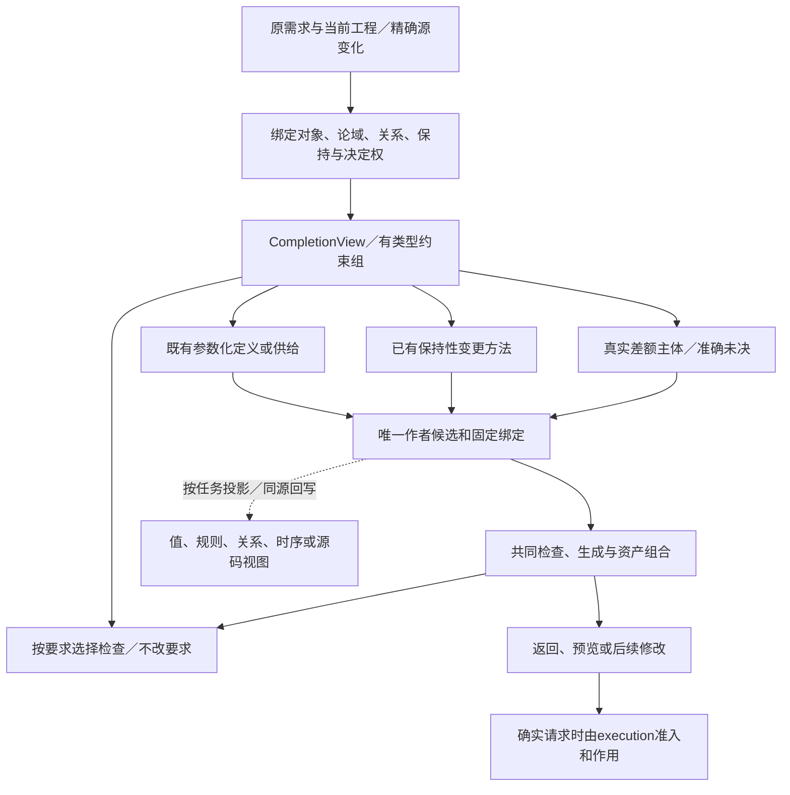

# 跨软件需求合同

> **阅读范围**：采用范围内的设计规范；实现状态另查未决 · [共同上下文](../需求关系与能力边界.md)。

<details>
<summary>本页内容</summary>

- [10A. 跨软件意图、行为与开发动作的共同合同](#10a-跨软件意图行为与开发动作的共同合同)
- [11. 意图进入同一作者源的完成与缺省算法](#11-意图进入同一作者源的完成与缺省算法)

</details>


## 10A. 跨软件意图、行为与开发动作的共同合同

<a id="cross-software-intent-contract"></a>

本节拥有**不同软件任务中重复出现的需求关系、保持条件、组合方式和开发变更**。类型推导、短函数调用、领域库和管脚是它的消费者或表达方法，不替代这层设计。当前选择是在既有`Requirement/Constraint/CompletionView/Definition`上补齐具体含义与实现，不增加一份独立可写的IntentIR、业务原子目录、专用IDE或第七个工具。

### 10A.1 统一的是要求与变化的结构，不是所有程序的执行图

一次任务先区分三个对象：**产品要表现的行为、开发过程中要改变的工程内容、此次现实中获准执行的动作**。三者可以关联但不相等。“给工具增加删除所选文件的能力”是在设计目标程序；“现在删除工作区文件”是现实作用。前者的目标写权限不授予后者，生成一条操作也不表示该操作已经发生。

不同任务可以具有同样的要求形状：裁剪图像、变换表格和改写AST都涉及输入到输出的关系及保持项；搜索预览、渲染和增量诊断都可能需要“只发布当前修订结果”；文件改名、节点重定位和公开符号重命名都要定位对象、计算映射、处理碰撞并保留未改关系。但它们的叶操作、数值、身份和失败行为不同。复用共同组合与检查，领域方法仍解释自己的对象；不能用一个万能`transform`字段把区别藏起来。

| 任务中真正的信息 | 准确内容 | 原数据拥有者与省略规则 |
|---|---|---|
| 对象与论域 | 文件集合、输入值、实例、时间域、版本或实际消费者；哪些状态参与比较 | 既有引用和候选确定；不从模糊名字或全局目录猜对象 |
| 希望成立的关系 | 输出、状态变化、结构、轨迹、资源或跨运行之间的条件 | Requirement引用已接受定义或新候选；只有独立信息单独存放 |
| 适用条件与量化 | 对全部哪些输入／发生／对象成立；哪些情况下激活 | 使用固定的类型和域；不凭一个样例替全部输入 |
| 保持与可变范围 | 不可写位置、前后等值投影、语义兼容、布局及允许变化 | 由当前任务和公开边界取得；无信息时不能把“其他不变”无限外推 |
| 尚可决定的自由 | 表示、算法、策略或具体值；谁可以在其中选择 | 既有强度、缺省与委派规则；偏好不覆盖硬条件 |
| 来源与状态 | 原要求、解释规则、决定关系、是否已绑定、推导与未决 | 沿既有SourceRef与接受关系；未解释自然语言不伪装成形式约束 |

上表是分析投影，不是作者每次填写六栏。既有函数／关系定义已经唯一确定的含义直接引用；运行参数尚未有值可以正常编译；新独特关系没有表达或委派时，不能从短名字恢复出来。

### 10A.2 当前共同要求形状及直接作用

下表是当前分析能力的开放分类，不是封闭的业务全集，也不声称每类都能自动求解。组合节点只路由到真实参数域和合格方法；未注册的含义可保全，不能冒称已解释。

| 要求形状 | 必须表达的区别 | 适用任务与准确失败条件 |
|---|---|---|
| 值与输入输出关系 | 映射、选择、归并、排序、编码、误差；求值和失败次序是否可观察 | 图像变换、文本与文档、编译、数值工具；同结果不等于允许修改输入或改变错误 |
| 结构与依赖 | 身份、集合／重数、顺序、包含、引用、逆关系、可达性、约束 | 场景图、代码、布局、文件、数据结构；字段齐全不证明引用一致或关系完整 |
| 状态与交互 | 当前状态、触发、守卫、转移、输出、可变域和回滚条件 | 编辑会话、设备、应用行为；同界面动作不证明同样生命周期 |
| 时间与进展 | 先后、直到、最终、期限、迟到、重入、取消与真实完成 | 预览、流、任务运行；仅禁止坏事不排除永远不完成 |
| 资源与作用 | 拥有、借用、容量、外部效果、最后使用、准入与结算 | 文件、内存、设备、并发；只读值类型不证明无写入或同步 |
| 表示和接口 | 目标布局、编码、ABI、名字、类型、序列化和平台观察 | 多目标及原生接入；只改形式也可能改变公开约束 |
| 多运行与比较 | 确定性、非干扰、统计要求、策略／性能相对比较 | 随机算法、安全隔离、优化判断；不能把单条轨迹监控冒充多运行保证 |

有限的逻辑构造可以复用，不说明上表就是最小数学原子数。具体高层要求可以是多个形状共同作用；同一个“取消”可能同时涉及状态、发布次序、设备活动和内存释放。不存在把业务词列成集合就完成这些交互的捷径。

### 10A.3 组合的语义与非空进展

设要求节点的域、投影、绑定与定义性已经固定：

- **共同满足。**`All(A,B)`保留两组独立来源；不因A更严格就删除B要求的有效输入。检查需同时覆盖交互，不能把分别合格等同于组合合格。
- **允许替代。**`Any(A,B)`保留至少一种完整合格路径；不是把A、B都排成实现前置。固定实现后仍保留选择依据，不由完成先后决定业务。
- **条件激活。**`When(P,A)`要求P成立的相应对象满足A。P的定义域、读取时点和未知状态明确；未知不被当作false。任务同时需要“至少有一次P”时另保留存在性义务。
- **全体与存在。**`ForEach(D,A)`不自动提供并行；对象之间可能碰撞、共享状态或资源。`Exists(D,A)`不能用空D满足。集合、重数和顺序按D的真实类型解释。
- **行为顺序。**运行`Seq(R1,R2)`由合法中间状态连接两个转移关系，R1失败是否进入R2、部分变化和清理必须由所选合同规定。它与逻辑All不是一个运算。
- **并发与作用域。**Parallel保留共享状态、冲突、资源和允许交错，不是简单笛卡尔积。隐藏内部状态只减少外部观察，不删除真实效果、权限或资源。
- **保持。**NoWrite约束实际写操作；SameValue约束结束时投影相同；SameBehavior约束规定观察域的行为相同；SamePresentation只管选定字节或布局。写后还原满足某种SameValue，却可能违反NoWrite、触发监听或改变时间戳。

“只发布当前结果”必须与实际进展条件一起解释：在输入最终稳定、当前计算终止且执行获得公平调度的前提下，最终发布当前结果或明确的当前错误。程序永不发布虽然不会发布旧结果，仍不能通过此任务。硬期限需要实际环境与成本界，不能由逻辑eventually自动得到。

### 10A.4 最小作者面不是一套万能表单

当前开发面继续允许直接编辑真实源；共同意图视图从需求、已有合同与来源派生。它先显示**对象、所要变化、必须保持和真实未决**，而不是要求用户排列所有实现块。完整算法体、签名、结构与端点在需要时展开；已知精确文本可直接改，不先查询图。

| 已绑定的要求 | 默认呈现及编辑单位 | 必须保留的内容 |
|---|---|---|
| 值／映射 | 原表达式、函数输入与参数、字段策略 | 真实值域、失败和顺序；不用伪造全新业务关键字 |
| 条件策略 | 条件与结果的有限规则表，或原match/if | 覆盖、重叠、优先级及未知；行排列何时有义须明确 |
| 结构关系 | 当前关系、逆向查询、作用域和实际邻接；必要时管脚图 | 身份、基数、共享、未读范围；布局不擅自成为执行次序 |
| 状态／时间 | 状态、允许事件、发布策略、进展和取消边界 | 模型不是所有软件唯一外形，不强迫全部程序使用状态图 |
| 保持性改写 | 当前行为与所允许的实现差额 | 等价域、帧、实际成本和调用方；类型相同不足以保持 |
| 运行或工程作用 | 实际目标、前像、授权与未结算责任 | 不将设计程序的能力与执行该能力混用 |

这使用现有`query(view="contract"/"origin"/"impact"/"state")`的相交结果，以及source/files/edits、editRef、结构变化和目标控制。表中不是新增公开view枚举或新请求字段；适配器不支持某种精准编辑时，仍然可直接改原源并得到范围明确的检查。

给出自然语言要求时，开发AI先将它与已有语义定义对齐。已经有准确来源的内容引用即可；新假设作为候选，按原委派决定或保留待定。显示的中文句子不是编译器自动执行的DSL。没有可解释的条件，不给形式保证；可以继续保存设计并完成独立工作。

### 10A.5 数据、接口与固定实现流程

在既有`CompletionView`中增加可选的语义需求组：`scope`绑定源／目标及版本，`meaning`引用上述有类型要求表达，`frame`只含独立保持条件，`decisions`引用现有委派与取值，`sourceMap`定位真实作者内容。已经被同一Requirement完整拥有的字段只引用，不复制。临时组合摘要存在当前分析内存；需要持久解释或接受时沿原Requirement/SourceRef保存，不创建另一套意图数据库。

实现接口采用下列顺序。它们是现有模块中的函数合同，不是本轮已经运行的代码：

```text
bindIntentScope(Task, Candidate, Requirements, Context)
  → BoundCompletion | AmbiguousSubject | NeedsInput | InvalidMeaning
composeIntentConstraints(BoundCompletion, SemanticMethods, Budget)
  → EffectiveGoals + Frames + Obligations + ReadSet
     | Conflict | NeedsMeaning | AnalysisIncomplete
planIntentChange(EffectiveGoals, ExistingSource, Bindings, Authority, Budget)
  → NoChange | EditPlan | RealizationPlan | NeedsAuthorContent
     | NeedsInput | NeedsDecision | PlanConflict | PlanningIncomplete | UnsupportedScope
materializeIntentChange(Plan, CurrentFrozenBase, RepresentationMethods, Budget)
  → ExistingCandidateDelta | CandidateWithDiagnostics
     | ReplanRequired | NeedsInput | MappingConflict | MaterializationStopped
```

`bindIntentScope`固定对象与观察域，区分targetProgram/developmentOperation，不以层号改变原值或权限。`composeIntentConstraints`检查类型、定义性、量化与时态域，先共享显式同义关系，再调用能处理该域的有限检查；没有适用算法时保留准确未判定，不以字符串不同报矛盾，也不假装求得全局最小冲突核。

`planIntentChange`按已有约束及编辑目的取得合法动作：原槽改值、现有关系连接／移除、同一声明的约束增删、稀疏目标控制、合格供给切换、保持性改写、生成新的差额主体、观察或现实运行。组合的输入和结果都必须绑定真实定义，不按动词或函数名字猜行为。默认保持已有来源，选不需新增定位和重复内容的合格动作；若多个动作会产生未委派的可观察差异，指出差异，不用算法评分暗改要求。

实现匹配分三条正向路径：**同一参数化语义定义且参数足够确定**，直接实例化其已绑定方法；**有明确变换规则和适用前提**，产生已有源/结构修改并检查新增区域；**新行为不能由已有规则完成**，由获准开发AI创作当前语言中的实际主体，继续用原要求核对。不是每个输入意图都先注册插件，更不是调用任意求解器必然产生代码。候选搜索固定当前真实供给及预算，普通重建只读已经接受的结果。

`NoChange`只在作者含义、来源、强度和固定选择都没有变化时成立；新显式固定恰好等于旧默认，不可因目标字节相同被删除。`materializeIntentChange`按[整批落实算法](结构编辑与身份保持.md#whole-change-materialization)只形成现有候选差异；`NeedsAuthorContent`是交给当前获准开发AI的有限创作需求，不是编译器内部运行任意模型。源文字、公开语义、目标表示和实际文件作用分开：改图的显示布局不改程序；增加目标行为不会立刻运行它；取得分析结果也不写工作树。需要实际动作时由application进入原execution准入，不由上述纯分析函数执行。

#### 有类型要求组的内部形态与消解次序

现有Constraint概念模型在内部以以下有限联合实现。`Ref`来自固定语义定义，`Apply`的实参可以是已绑定值、投影或合法的函数/关系引用；`binder`只在其body内有效，和目标程序局部变量及权限主体不是同一身份。此联合没有新文件Schema，不要求任意旧编码直接兼容。

```text
RequirementTerm =
    Apply(meaningRef, typedArguments, scopeRef)
  | All(terms)
  | Any(terms)
  | When(conditionRef, term)
  | ForEach(binder, domainRef, term)
  | Exists(binder, domainRef, term)
```

直接JSON作者的all/any/when/forEach/exists及局部bound编码，由[有限组合合同](../结构化源码.md#finite-requirement-composition)拥有；它只承担准确有限设计输入，不改变此处一般关系、运行条件与动态域的语义。实例化保留量词顺序和共享主体，语法支持不自动取得求解完备性。

构造前检查每个引用实际存在或明确待读，参数和值域、时间域、相等和量纲与该meaningRef相符。`All([])`为真，`Any([])`为假，空域ForEach为真、Exists为假；任务的成功可达/输出存在条件不由这些恒等式删除。精确的布尔求值与逻辑公式有差别：运行谓词可能失败或不终止，只有被证明在当前域有定义或明确提升为逻辑关系时才可无条件用于对称逻辑化简。未知定义性进入未判定结果，不能将`A && B`任意重排成`B && A`。

`composeIntentConstraints`先完成词法/类型绑定和纯逻辑结构检查，再应用有前提的恒等化简，再取得当前域的方法摘要，最后建立未解义务及来源。不得在绑定前按字符串去重。结构等价可以共享分析，独立接受来源不能被删掉。一般化量词不枚举无限域；只有提供有限枚举或合格规则才采用相应求解。

含义供给使用原MethodSpec提供三类可选能力：`validateMeaning`校验定义性及相容范围，`matchRealization`给出候选及残余义务，`planChange`给出同源修改及保持条件。名称仅说明现有方法角色，不是新公有协议。某项没有第二/第三方法时仍可作为已知要求检查，也可以由AI形成普通源码；不得宣称存在自动生成/结构编辑。Methods返回的是数据和依据，不获得宿主作用权限。

已经确定的目标特化、运行框架与计划器可以消费某些关系，而不是全体要求必须被单个求解器处理。多个生产者共同实现All时，应验证组合后的行为交集及资源，而不是简单拼接它们的输出源文件。若实现约束仍有不明的冲突，保留明确输出根的未定资格，不以另一个来源的通过覆盖。

<a id="fig-intent-relations-flow"></a>

图说明相同来源如何支持需求、实现与作者视图。实线是数据和分析交接；“请求执行”不自动发生。



图未展开各领域方法内部实现；New路径可以保留待定草稿，不能因进入Candidate节点就被认定可生成。Assurance执行新工具检查也须沿application/execution，图中的分析依赖不是权限。

#### 需求匹配必须产出可落实计划，而不是只返回一种方案名称

`EditPlan/RealizationPlan`的固定输入、作者变化、方法前提、目标贡献和剩余义务由[计划实现合同](../../编译/实现选择与设计搜索.md#executable-intent-plan)唯一规定。每个实际要求出现保留自己的来源；能共用公式分析时共享计算，不能删除独立要求或其强度。计划中的“拟由某方法实现”只是责任关联，不是该要求已经满足。

创建一项新能力时，目标程序所需的读写归到该程序效果；修改哪些作者文件归到AuthorDelta；此次可以运行什么归到实际动作请求。三者的读写集合具有不同对象类型，不能把“生成器要编辑文件”误报为目标程序违反NoWrite，也不能把目标程序有文件写功能当作当前工具的写许可。

简单明确的源码差异直接使用同一候选和相交检查，不要求先完整反演出RequirementTerm。关系驱动计划用于真正需要合成/选择/重构的任务；其结果仍然是原source/files/edits、控制、绑定或结构操作。不同入口一旦完成准确绑定，就使用同一[类型与效果封存](../../编译/内核/编译值服务.md#callable-effect-closure)和按根产物，不退回满注解作者面。

### 10A.6 跨动作共用的变更语义

一个开发动作的最小内部合同是：准确主体、原基础、要新增/删除/替换的含义、保持域、修改范围和来源。支持单个位置、单个定义、已接受的使用者集合、有限集合及其关系；不能用同一名字或图上邻近代替作用域。

对允许采用单轨迹细化的性质，细化可以在原允许行为中选择更小集合，仍须保持原任务要求的输入、成功、进展和资源；不是把全部输入改成禁止。涉及多次运行间的非干扰、概率分布/相关性或开放上下文时，行为集合收窄本身不保证这些性质，需要[性质所对应的保持关系](../../编译/性质保持与开放环境.md#property-preservation-scope)。放宽可能改变公开合同，需要相应接受。替换实现要在明确观察域保持；新增能力通常同时增加目标入口与未改旧入口的保持义务。移动/重命名主要改定位与绑定；去掉一个元素需要检查所有真实引用和外部消费者。

动作不一定可交换。两个不同文件的修改仍可能共享同一公开类型；两个同槽相同结果也可能来自不同固定要求；先删后建与先建后删可能有不同作用。只有独立读写和共同不变量条件成立才合并。目标程序的补偿不等于开发工具的撤销，逆向恢复也不创造已发生作用的自动逆操作。

### 10A.7 失败、持续修改与实现完成条件

所有结果区分对象不明、含义未解释、相互冲突、缺合格供给、缺精确改写、当前无权、真实环境缺项和检查未完成。运行参数尚未有值不是语言缺项；旧实现不能满足新增硬时限是实现资格变化，不是需求要被删除。

当前作者面实现必须能在**至少本章规定的结果关系、结构保持、状态/时间发布与开发修改**之间复用同一分析和动作通道，完成初次创建、一个参数或规则变化、一个跨对象冲突和一次源/目标连续修改。不能只实现“函数签名变短”就关闭U004/U046；也不以完成这些有限族冒称所有需求都可自动合成。

再次修改时，原源和已接受的要求分别固定：改维度或类型会使关系重检查；只改展示不重算语义；真实环境变更按其读集失效。若新要求改变了关系本身，在唯一拥有者改写，再同步实现、检查方法、对外摘要与图。没有消费者或独立语义的投影不持久保存。

采用依据：TLA+的状态、行为与细化有助于分开结果、进展和实现；Dafny的frame明确写入范围与结束时等值不是同一承诺；Alloy展示结构字段必须用额外关系约束连接。它们支持这些机制区别，不自动提供本节实现或证明所有领域可由一套逻辑求解。精确来源、日期和限界归[资料目录](../../依据/来源/设计依据与资料边界.md)。


## 11. 意图进入同一作者源的完成与缺省算法

本节拥有“哪些作者信息可省、由谁补、何时选择、何时仍未定”的具体协议。它接入原A1—A4、T0—T6和B0—B6，不新增第七工具、运行数据库或一份必须由开发者填写的意图文件。完整自然语言解释发生在AI创作端；正式source仍按已声明的作者语言解析。下列状态和视图只按相交任务派生。

### 11.1 输入、最小内部视图和输出

输入是任务目的与允许作用、作者候选或首次输入、固定解释上下文、所选输出根、已接受的相交要求、可用资源与选择委派。自然语言未解释时可以先作设计候选；固定构建不再次把同一段对话交给模型猜一次。

`CompletionView`是现有Requirement/Definition/Binding/SourceRef的临时投影。只有需要跨边界引用或解释时才保存相应关系，不为每个加法分配永久记录。

| 信息 | 具体角色与来源 | 省略时如何处理 |
|---|---|---|
| 使用点及范围 | 本次函数、实例、资产或目标根，绑定候选修订 | 从明确选择与源引用解析，无法唯一定位才保留对象歧义 |
| 要求项 | 有类型谓词、值域、允许轨迹、帧条件或明确未解释要求；来源和解释版本 | 没有独立要求时以实际作者定义为准，不制造镜像规格 |
| 语义位置 | 参数、公开合同、局部行为、实现槽、运行输入或纯展示 | 由定义合同标明，不能用名称猜测 |
| 强度和选择权 | 硬条件、软偏好、已接受缺省、可委派自由、候选假设 | 未授予的决定权不从“省略”取得；不在每个槽位填主体 |
| 当前内容 | 明确值或表达式、范围、缺少/未知/冲突的原因 | 保留原状态，不转为空值或默认成功 |
| 推导关系 | 实际读取、规则、适用条件和得到的结果 | 没有推导就不写假证明；实现合同是声明而非已验证证据 |
| 保留关系 | 源位置、局部覆盖、接受关系和已选实现 | 作者决定回写唯一作者位置；派生值进入结果，选型进入锁 |

输出为一个新的或复用的不可变作者候选、有效语义投影、合法的待实现槽或已选绑定，以及按根和动作列出的开放事项。结构合法、语义选择充分、实现具备、当前可执行和所需保证成立分别返回；不能合成“信息完整”一个布尔值。

### 11.2 I0至I8：从请求到可以继续的真实结果

**I0 固定本次问题。**确定当前是设计、候选生成、检查还是作用；读取实际可见基础。自然语言请求保留原文字与来源，AI所作解释另有明确候选。项目文档、注释和第三方描述不能自己成为高于当前任务的指令。

**I1 解析已知名称与真实范围。**source沿锁定文法，普通导入和参数由编译器解析。自然语言中的“它、以前、保持原样”先借助明确选择、来源版本和可见工程定位。唯一明确引用可以确定；有两个会改变结果的对象时保留这两个选择及其区别。无关库的增加不改变这一步输入。

**I2 形成足以改变结果的差异项。**先调用[共同需求绑定与组合](#cross-software-intent-contract)，得到准确对象、要求关系、观察域和保持条件；再从本次编辑与依赖提取输入域、正常结果、错误、顺序、效果、资源和外部表示的相交变化。一个源中的require已有独立接受依据时检查其是否被削弱；实现内部的假设不反过来覆盖用户要求。不能要求每个小函数重新生成一份完整需求书。

**I3 合并已决定内容。**逻辑共同满足、允许替代、条件与量化使用共同合同；运行顺序和并发不使用同一合并。按每种字段的已发布规则取得要求、定义、实例和当前固定缺省。硬条件共同满足；相同内容可以共享记录但保留独立来源与作用域。相反条件形成具体冲突，不取“更严格的一项”然后继续，因为那可能排除了原任务必须接受的输入。

**I4 推导可确定内容。**名字、类型、效果上界、形状、访问范围、公开导出及可检查的规则求值由对应工具处理。先安装真实读集，再判断结果是否同值。任务外的新数据、规则或目录成员没有相交关系时不进入本次上下文。不能确定的推断保留方法/假设与覆盖，不升级成固定事实。

**I5 处理缺省与委派。**缺省只是被接受策略中的优先候选；先检查其适用性和全部硬条件，再采用。目标实现槽有多个合格候选时按既定政策选择，不要求用户证明实现唯一。未有委派的公开行为差别，交AI形成有依据的建议或交给有权主体；其余设计继续。当前作用预算不足，不获得通过写默认值来绕过的许可。

**I6 定位真正缺口。**把剩余问题分为行为未决、尚未取得运行输入、真实环境未知、语义/接口缺设计、库或目标缺实现、当前无权、证明方法或预算不足。普通函数参数将在目标运行时传入，是已定义的动态输入，不是编译缺陷。缺口只依赖到本次必要根才影响该根；共享不变量的成员作为真正共同组处理。

**I7 发布所需候选与说明。**由planIntentChange选择已有合法变更种类，再由materializeIntentChange形成现有候选；它不是第二次解析整套程序。形成的源变化、控制覆盖和资产变化共同绑定旧基础。给开发者新改变的含义、从何处继承、工具做出的有影响选择以及真实未决；默认不回显所有推导。只有正式要求的设计选择才更新接受关系；只保存草稿不授权部署。未解释自然语言可以作为要求来源继续保存，但不能给相交强保证签发已满足。

**I8 进入相应下一阶段或结束。**设计请求交付具体方案与未决项即可；生成请求在真实行为实现和目标映射闭合后继续；检查执行所选方法；作用重新取得当前授权与前像。需要补决策时返回该项的替代、后果和可继续动作；预算用尽保存现有内容，不保持线程或提交锁无限等待。

### 11.3 每类“省略”的不同含义

| 表面未写的东西 | 当前解释 | 合法下一步 |
|---|---|---|
| 已接受库合同里的稳定顺序 | 继承同一版本合同 | 直接使用，不复制到每次调用 |
| 没有要求算法或目标库 | 保留实现自由 | B0—B6自动选择并固定，不凭此改变公开行为 |
| 函数参数的具体运行值 | 动态输入已经由签名与契约描述 | 生成接收该参数的程序，运行时再传值 |
| 可推导的类型或内部布局 | 推导项或实现选择 | 工具推导，必要时显示依据 |
| 字段显式None/null/空串 | 按所在类型的真实值处理 | 不将“有值但为空”改成“没写” |
| 没有说明重复项保留政策，且无定义或委派 | 行为未决 | 提出明确比较，或在设计层保留开放要求 |
| 目标明确禁止网络但没有本地实现 | 必需能力尚不具备 | 保留设计并标目标缺项；不把网络默当回退 |
| 没有实际授权或运行结果 | 外部事实缺口 | 取得真实许可/观察，不能在源码中补出 |

### 11.4 合并算法与缺省漂移

对每个实际使用点，先确定描述符和所有适用的硬约束，再计算有效域。值相等只说明内容可去重，不撤销来源本来的独立约束。集合条件由定义的集合演算处理；有顺序的规则保留顺序；部分记录沿字段合同合并；排版和私有布局偏好采用有版本的默认优先级。没有可用合并规则的字段返回缺设计，不采用通用JSON深合并来掩盖语义。

硬约束不一致时输出实际冲突关系；未运行的求解不声称已得到最小冲突核。输入域允许为空的类型定义可以成立，但任务要求至少一个成功用例时，不能用空域蕴含证明交付。多个实现都满足完整合同，则没有“必须澄清”的理由；只有未委派的可观察差异才待决。

对标为“可覆盖标量”的控制，先收集当前使用点的所有实际来源，去掉没有适用性或没有设置资格的项；显式硬require已经进入硬集合，不在软优先级里。普通明确实参的值也是该调用已经给出的含义；除非其参数合同本来定义为软选择，否则不能因本文使用“参数默认”而将实参降格为可随意覆盖的偏好。 [结构参数default](../结构化源码.md#closed-parameter-defaults)属于省略后的确定值，不属于本段可回退的软候选；不能因硬条件冲突就尝试另一层默认。软缺省采用描述符锁定的顺序：对象局部prefer、已实例化的组合参数默认、目标画像默认、项目默认、库定义默认、后端保守默认。描述符可以声明更窄的来源集合或专有顺序，但必须版本化，不能由加载先后决定。同一优先级只有一个值或全部等价才选它；不同值返回来源冲突，或使用已明确授权的有界择优规则，不能随字符串排序任选。没有候选时保持未定；有候选而不满足硬条件时，在允许的下一层候选中继续，全部不合法则返回明确缺项。集合、记录、顺序规则及无法定义这种覆盖含义的字段不套此标量流程。

形成优先候选之后再校验全部硬条件。新的源码显式设置与上层硬要求矛盾时报告冲突，而不是把更具体当成更有权。旧缺省已进入锁或接受关系时，安装新库不重解释旧构建；明确升级使其进入差异。显式固定恰等于缺省的值，仍保留“即使以后缺省改变也保持”的意义。reset仅移除本层作者覆盖，随后重新解析实际父来源，不修改已经执行的历史操作。

[CUE的缺省机制](https://cuelang.org/docs/howto/specify-a-default-value-for-a-field/)证明缺省与普通约束需要明确组合规则；该机制只提供一层偏好，不能直接当成SEC多级策略的实现。这里没有采用CUE作为强制运行依赖，也没有执行其示例。

### 11.5 新抽象、封装与生态的实际制作责任

完整定义要有其实际相交的参数和值域、效果与错误、允许替换范围，以及实现或明确待实现关系；需要长期身份时才给实例/子身份。正常例与区别反例用于核对该合同，不成为每个调用的字段。创建、复用、局部具体化和更新按[封装协议](模块封装与复用库.md#需求封装的调用与具体化协议)进行，普通项目可自行维护，不以公共市场为前置。

独特算法是作者资产，不是可随时丢弃的临时AI输出；共享规律抽取为库，调用方只保存实例差异。库升级时先保持公开要求，再重算依赖私有实现的产物。抽象不够用时局部具体化，保留精确上游和本地源；差异过大则形成独立局部定义。不能把已下探部分丢回不受控代码，又继续宣称原定义可完整重建。

### 11.6 反向案例与条件进展

需同时检验六条可复核轨迹：完整合同有两个合格实现仍可完成；缺少实际业务差别时不任选；新库缺省与旧项目要求冲突时不移除旧要求；自然语言解释两次不同不改变已接受源；无后端的独立输出仍能保存设计；同一源的样例通过不自动证明全部原任务。

对固定有限输入、可结束的规则和有界工具，I0—I8每步新增一个决定、一个诊断或结束到当前目的的结果；没有新依据时不重复同一询问和搜索。不能强制任意递归或任意用户谓词都先证明终止，昂贵方法在相应预算下保留准确状态。可生成不要求“全世界信息已经完整”，只要求本次所需行为与实现责任已经有合格路径。

### 11.7 开放项怎样落到实际作者位置

I5的输出必须能指向一个实际承担含义的位置，不能停在“可能使用某框架”。下面是当前固定的路由：

| 开放项 | 必须产生的设计成果 | 谁取得或生成 |
|---|---|---|
| 需求可由原调用的实参表达 | 新实参及对结果的准确差异 | 开发AI创作，workspace固定候选 |
| 所需语义已定义，但库尚未实现 | 满足该语义的普通主体或具体MethodSpec；声明和实现缺口分开 | 开发AI／库维护者，不让编译器假装有方法 |
| 原接口不能表示合法新行为 | 局部函数／类型／已有领域结构与相交调用；有实际复用才扩大公共接口 | 作者在既定语言中定义 |
| 只有目标外形未定 | 描述符的require/prefer及实际target使用点 | 控制读取器与目标方法消费 |
| 允许多个同义实现 | 按既有合格绑定或固定有界选择策略取一个 | compiler；选择结果入Binding |
| 真正缺少语义构造 | 值域、调用／作用、错误、资源、编辑和目标合同的相交增量 | 语言／领域规范，不能只增加关键词 |
| 输入、工具或权限是运行事实 | ContentNeed、ToolResultNeed或当前准入缺项 | application/execution，不由AI补一份假事实 |

来源保留输入、输出、独立要求和明确假设。只有自己选了某技术，不能反向把它写进REQ作为用户命令。协议不会要求每个用户输入一张这个表；它约束的是设计者和工具内部的完成责任。

**有限抽象分类。**类型系统使用现有值、记录／变体、序列、引用、函数、效果和领域结构；它们不是一个“所有需求原子的并集”。同样的构件集合可以有不同绑定、顺序和状态。逻辑数据结构、物理表示、索引／缓存和生命周期分别有消费者；双向索引是某些查询性能的选择，不证明所有单向结构缺少必需语义。当前不设全世界需求原子总数，也不将每一种新业务提升为语言kind。

**不变量。**相同目标和同一接受依据下，完成开放项不能删除原硬要求、缩小必须接受的输入、丢失错误或新增未授权作用。有效但未具体的内容可保存；相交的可生成根必须具备真实主体或方法。CUE的不完整值机制只支持前一种分工，不代签任意算法合成。
