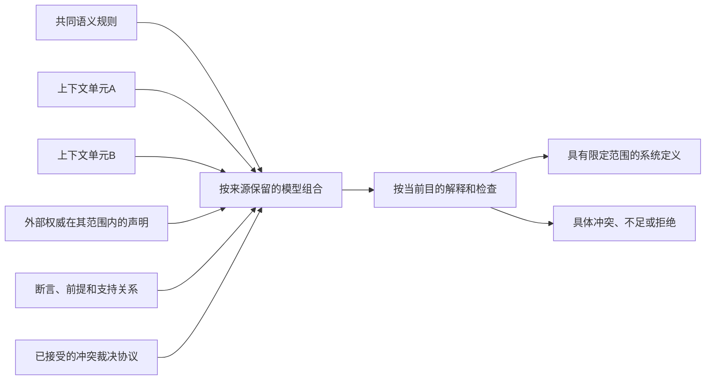

# 身份协调与可观测性

> **阅读范围**：理论与反例；不是运行产品承诺。

<details>
<summary>本页内容</summary>

- [联邦模型组合的适用边界](#联邦模型组合的适用边界)
- [分布式协调、共同知识与不确定完成](#分布式协调共同知识与不确定完成)
- [单一系统定义、单一真值与单一权威的反例](#单一系统定义单一真值与单一权威的反例)
- [精确观测、因果识别与依赖闭包边界](#精确观测因果识别与依赖闭包边界)

</details>


本篇按实际机制保存来源或理论论证，保留各条自己的版本、前提及采用边界；它不是另一个现行产品合同。

## 联邦模型组合的适用边界

### 1. 适用问题

本方案用于确有相互独立上下文、竞争事实来源或不同适用政策的辅助设计。普通项目的生效模型仍可以单一而明确。以下组合是可选择的分析能力，不替代 SEC 工程模型与编译接口；同一输出必须明确采用哪个上下文。

```text
FederatedDesignAnalysis =
  Open-World Problem Discovery
  + Federated Engineering Model Portfolio
  + Purpose-Bound Compilation
  + Bounded Decision and Synthesis
  + Controlled Effect Runtime
  + Assumption-Bound Assurance
  + Evolution and Architecture Refusal
```

### 2. 顶层输入

```text
FederatedAnalysisRequest = {
  intentCandidates,
  stakeholderAndAuthorityContext,
  observationCuts,
  selectedModelCells,
  targetAndDeploymentProfiles,
  candidateProviders,
  hardConstraints,
  riskAndUnknownBudgets,
  searchAndProofBudgets,
  requiredAssurance,
  effectReversibilityClass
}
```

### 3. 联邦模型组合



边是来源和解释输入，不把所有断言当成可同时成立的事实。组合上下文不合并双方权限；外部权威只承担它真实覆盖的对象和范围。
一个 ModelCell 可以是：

- 产品领域；
- 法域；
- 安全域；
- 租户；
- 语言语义；
- 物理平台；
- 组织治理；
- 外部系统；
- 历史代际；
- 候选未来模型。

### 4. 辅助设计流程

```text
整理设计问题 → 选择相关观察和上下文 → 保留冲突与来源
→ 检查已知适用规则和有界可满足性 → 产生设计候选
→ 按约束、风险和预算比较 → 明确未探索范围
→ 采纳具体设计或安排安全实验 → 交给现有编译/执行协议
```

适用性检查只能识别已实现的语言片段、已知冲突和有界规则；不存在可对任意输入正确判定可判定性的通用预检器。无法归类返回未知；某问题类不可判定也不意味着当前实例必然无解。

### 5. 分析对象

```text
ModelPortfolio
ModelCell
AssertionSet
ResolutionProtocol
PurposeBoundSystemDefinition
ObservationCut
InputDependencyClaim
DecisionProcedureProfile
SearchContract
ImpossibilityWitness
AssumptionLedger
TrustedComputingBaseGraph
StabilityEnvelope
StrategicActorModel
ConstraintCompatibilityAnalysis
ResidualUnknownBudget
ArchitectureRefusal
```

这些对象不是要求所有最小项目都持久化完整实例。ApplicableClosure 只物化当前目的所需部分。

### 6. 统一性的新判据

```text
FederatedAnalysisConsistency =
  one shared kernel law family
  and typed model-cell boundaries
  and one resolution protocol per adjudicable semantic question
  and no hidden authority amplification
  and all purpose definitions trace to portfolio cells and assumptions
  and all effects use common admission/settlement laws
  and all assurance states preserve uncertainty and TCB
  and conflicts remain local
  and infeasible requests can terminate without fabricated solutions
```

本分析模块不声称：

- 一个全局系统定义；
- 每个客观事实一个组织 owner；
- 所有模型内部一致；
- 所有请求有解；
- 所有依赖可精确发现；
- 所有证明无外部假设。

### 7. 局部演进的新条件

局部性只在 `LocalityEnvelope` 内成立：

```text
LocalityEnvelope = {
  dependencyEvidenceLevel,
  modelCellBoundary,
  strategicFeedbackStatus,
  validityHorizon,
  hiddenDependencyRisk,
  externalAuthorityStability,
  commonCauseScope
}
```

变化超出 envelope 时，系统必须扩大重验证范围或重新编译 ModelPortfolio，不能强行维持局部承诺。

### 8. 设计最优性的修订

```text
DecisionOutcome =
  verified feasible candidate
  | non-dominated portfolio
  | robust satisficing candidate
  | experiment needed
  | normative decision needed
  | impossible
  | undecidable
  | unknown
  | architecture refused
```

“最优”只能作为带边界的结果属性。

### 9. 执行边界

每个 effect 仍需：

```text
PurposeBoundDefinition
+ chosen candidate/decision
+ PurePlan
+ current Grant
+ eligible Capability
+ Resource Allocation
+ current Preimage
+ Assumption/Unknown acceptance
+ Recovery/Compensation/Irreversibility contract
```

若当前请求与未解决冲突或不可接受未知相交，禁止执行。

### 10. 保证边界

本模块可请求的保证为：

> 在声明的模型单元、观察切面、假设、故障模型、资源、时间、法域和验证范围内，SEC 不把未解决冲突、不可判定、未知、未执行、未结算或未验证状态伪装成成功，并只在当前保证包允许的边界内产生效果。

保证仍需对应模型与执行证据，不能由上述字段集合或结构校验自动签发。

### 11. 最小系统与最大系统

最小纯函数工程可以只包含：

```text
明确且冻结的单一候选/模型 + 所请求的目标编译；检查和正式采纳按任务启用，无需联邦分析模块
```

高风险跨法域自主系统可能需要全部模型。统一架构不强迫前者承担后者的治理税。

### 12. 采用条件

确有多上下文冲突且项目需要跨上下文推理时，可以采用下列边界：

> 允许多个模型、多个权威和多个不确定切面共存；能够按目的编译出最小兼容系统；能够证明哪些结论只在何种假设下成立；对已证明不可满足的实例或特定请求无法取得所需保证时，能够限制对应自动化；问题类别缺少通用判定器，不等于当前实例没有可构建实现。

## 分布式协调、共同知识与不确定完成

### 1. 根裁决

在异步网络、节点故障和不可靠通信下，SEC 不能普遍承诺：

- 所有正确节点最终在有限时间达成共识；
- 远端超时能区分“没执行”和“执行但响应丢失”；
- 所有参与者获得对完成状态的共同知识；
- 一致性、可用性和分区容忍在所有操作上同时最大化；
- 故障检测器永远准确；
- 跨独立外部系统的效果具有无条件 exactly-once 终态。

这些不是实现质量不足，而是依赖故障模型和通信假设的基本边界。

### 2. CoordinationClass

每个跨节点或跨组织 operation 必须先声明：

```text
CoordinationClass =
  | SingleAuthorityLinearizable
  | ConsensusUnderAssumptions
  | QuorumConvergent
  | CausallyConsistent
  | EventuallyConvergent
  | CompensatingWorkflow
  | HumanCoordinated
  | CoordinationUnattainable
```

```text
CoordinationAssumptions = {
  synchronyModel,
  failureModel,
  membership,
  authentication,
  quorumIntersection,
  clockAssumptions,
  stableStorage,
  retryAndDedupe,
  externalEffectSemantics,
  livenessDependencies
}
```

### 3. FLP 与活性边界

在完全异步模型中，即使只有一个进程可能崩溃，确定性共识也可能无法保证终止。工程修订：

- “共识协议”不自动等于 liveness；
- 超时、随机化、部分同步和 failure detector 是附加假设；
- 每个共识 Claim 必须列出 safety 与 liveness 的不同条件；
- 网络分区期间可以保持 safety 而失去 availability，或反之；
- 不允许把测试环境中的稳定延迟推广成全网同步假设。

### 4. CAP 不是三个产品标签

一致性与可用性的取舍只在发生分区时成为不可同时满足的要求。系统必须按 operation/数据类型选择：

- 哪些操作必须拒绝或排队；
- 哪些读取允许陈旧；
- 哪些状态可使用 CRDT；
- 哪些 effect 需要单一 authority；
- 哪些用户结果可以补偿；
- 哪些冲突需要人工解决。

不能给整个产品贴一个 `CP` 或 `AP` 标签后结束设计。

### 5. 故障检测永远带怀疑

进程沉默可能来自：

- 崩溃；
- 网络分区；
- 队列阻塞；
- 长 GC；
- CPU 饥饿；
- 时钟异常；
- 权限或路由变化；
- 响应已完成但回程丢失。

因此 `FailureDetectorObservation` 只能输出 suspicion、freshness 和 evidence，不能直接签发“节点永久死亡”。资源回收、leader 切换和重试必须使用 fencing、quorum 或外部 authority。

### 6. 共同知识与最终完成

即使双方反复确认，通信可能在最后一个确认后丢失，因此对“双方都知道且知道对方知道”的无限共同知识不能在有限不可靠通信中普遍达成。

工程上：

- 用户界面中的“已提交”必须说明本地、服务端、法定或不可逆终态；
- 双方协作不能只靠最后一个 ACK；
- 可使用可查询的权威账本、稳定交易 ID 和补偿，而不是试图用无限确认获得绝对共同知识；
- 某些跨组织动作只能进入 `pending-finality`。

### 7. Exactly-once 的作用域

```text
ExactlyOnceClaim = {
  identityScope,
  effectBoundary,
  atomicityMechanism,
  deduplicationAuthority,
  retryProtocol,
  readback,
  retentionHorizon,
  failureAssumptions
}
```

消息只处理一次不等于业务效果只发生一次；业务去重不等于外部银行、邮件、设备或人工动作可回滚。若 effect 边界不受同一原子协议控制，只能提供：

- at-most-once attempt；
- at-least-once delivery；
- idempotent effect；
- deduplicated result；
- compensating workflow；
- uncertain completion + authoritative readback。

### 8. 分布式观测

SEC 应使用：

```text
ConsistentCut
CausalFrontier
MembershipEpoch
InFlightMessageSet
ClockUncertainty
```

而不是无条件 `ExactGlobalState`。一致切面证明某个可能的全局状态，不证明它对应同一物理瞬间。

### 9. 架构拒绝条件

如果业务同时要求：

- 网络分区时永远可用；
- 所有操作强一致；
- 无冲突和无补偿；
- 有限确定延迟；
- 任意节点故障；
- 不允许丢请求；
- 外部效果绝不重复；

且不接受额外同步、单点 authority、等待或业务折中，则输出：

```text
CoordinationUnattainable
```

不能通过文档语言把不可能要求包装成“高可用设计”。

<a id="10-验收-1"></a>

### 10. 验收

- 每个分布式 Claim 带故障和同步假设；
- safety 与 liveness 分开；
- timeout 不推断 absence；
- failure detector 结果不直接删除资源；
- partition、duplicate、reorder、lost response、stale leader、quorum split 全部有测试；
- 外部 Effect 的 exactly-once 声明具有完整边界；
- 无法满足时返回正式不可能结果。

## 单一系统定义、单一真值与单一权威的反例

### 1. 根裁决

“一个系统定义代际、每项规范事实一个 owner”在封闭技术子系统中有强价值，但不能直接推广到开放社会技术系统。现实中可能同时存在：

- 不同法域的相互冲突要求；
- 产品、安全、隐私、审计和运营主体的独立否决权；
- 多方组织没有共同上级；
- 相同对象在不同上下文中含义不同；
- 多个可靠来源给出相互矛盾的观察；
- 历史事实无法由任何单一主体拥有；
- 争议尚未解决但系统仍需提供有限功能。

若强制将这些状态压成一个全局一致图，会发生两种错误：

1. 隐藏冲突，选一个主体冒充真理；
2. 遇到任意冲突后让整个系统逻辑爆炸或完全不可用。

### 2. 从单一图改为联邦模型组合

```text
ModelPortfolio = {
  sharedKernelRevision,
  modelCells,
  crossCellContracts,
  assertionSets,
  resolutionProtocols,
  unresolvedConflicts,
  purposeCompilationRules
}
```

每个 `ModelCell` 绑定：

```text
context
jurisdiction
stakeholders
subject universe
definitions
invariants
authority roots
validity horizon
assumptions
private state boundary
```

`PurposeBoundSystemDefinition` 从组合中选择完成特定目的所需的最小兼容切面，而不是宣称整个世界只有一份规范。

### 3. 一个事实一个 owner 的修订

保留以下规则：

- 每个可变状态 writer 有唯一线性化 owner；
- 每个 parser/schema/状态机实现有唯一规范 owner；
- 每个正式决议有唯一 resolution receipt；

删除以下过强规则：

- 客观事实的真值由一个组织 owner 决定；
- 多个权威断言不允许并存；
- 任何语义问题必须立即归约为一个值。

修订为：

> 每个可裁决语义问题恰有一个规范化 `ResolutionProtocol`；协议可以消费多个来源、否决权、quorum、优先级、时效和争议状态，并输出决议或显式未决。

### 4. AssertionSet

```text
AuthoritativeAssertion = {
  assertionRef,
  propositionRef,
  issuerRef,
  source/observation refs,
  context,
  validity,
  authorityDimension,
  confidenceOrProofClass,
  revocation,
  challengeStatus
}

AssertionSet = {
  propositionFamily,
  compatibleAssertions,
  conflictingAssertions,
  dominance/precedence relations,
  unresolvedFrontier
}
```

系统查询不得因存在矛盾而推出任意命题。需要采用冲突容忍、上下文分型或可辩驳规则，而不是默认经典逻辑全局一致性。

### 5. ResolutionProtocol

```text
ResolutionProtocol = {
  semanticQuestionRef,
  admissibleIssuers,
  evidenceRequirements,
  precedenceRules,
  quorumOrVetoRules,
  jurisdictionRules,
  conflictHandling,
  appealAndReopen,
  terminalAndExpiry,
  decisionAuthority
}
```

可能结果：

```text
Resolved(value, receipt)
ConditionallyResolved(value, assumptions)
ContextSplit(cellValues)
Conflicted(assertionRefs)
Underdetermined(frontier)
NonJusticiable(reason)
```

### 6. Polycentric authority

某些问题必须由不同权力中心共同约束：

- 安全团队不能单独修改产品目标；
- 产品团队不能单独豁免法律；
- 平台管理员不能自行签发语义正确；
- 独立 verifier 不能同时生产被验证对象；
- 外部监管者可能拥有独立否决边界；
- 用户可能拥有撤回同意或申诉权。

统一系统应允许多中心并存，通过精确交集、否决、阈值或分权程序生成决议，而不是发明一个超级 owner。

### 7. 身份也可能有争议

稳定 `SubjectRef` 对工程对象有用，但现实身份可能经历：

- split / merge；
- 法律主体重组；
- 数据主体身份争议；
- 两个系统错误合并同一人；
- 同一物理设备更换逻辑所有者；
- 历史记录缺失导致无法确认延续性。

因此：

```text
IdentityClaim
IdentityCriterion
IdentityEvolution
IdentityDispute
```

必须分开。`SubjectRef` 是系统引用，不自动证明现实同一性。

### 8. 何时仍可生成单一系统定义

只有当：

```text
purpose scope bounded
+ selected model cells compatible
+ all required conflicts resolved or explicitly isolated
+ authority protocol complete for required decisions
+ assumptions accepted
+ unresolved frontier does not intersect requested effects
```

才生成：

```text
PurposeBoundSystemDefinition
```

该产物是用途受限快照，不是宇宙真值。

### 9. 验收

- 允许两个权威来源在冲突状态下同时存在；
- 查询只返回受影响命题的冲突，不污染无关事实；
- writer 唯一性与事实多来源不再混淆；
- 法域不同可生成不同 PurposeBound 定义；
- 决议有申诉、撤销和重开；
- 无共同 authority 时输出 `NormativeConflict` 或 `NonJusticiable`；
- 不通过隐藏优先级制造伪统一。

## 精确观测、因果识别与依赖闭包边界

<a id="1-根裁决-11"></a>

### 1. 根裁决

SEC 可以对受控文件集合、内容寻址制品或数据库事务建立精确快照，但不能对开放分布式现实承诺一个无条件“精确当前世界”。现实可能包含：

- 远端服务在观测过程中变化；
- 网络分区和消息延迟；
- 无法访问的内部状态；
- 人类意图和未来行为；
- 动态代码、反射、插件和未声明文件；
- 物理设备、模拟量和传感器误差；
- 不存在性和负依赖；
- 主体因被观察或被政策约束而改变行为。

因此 `ExactObservation` 必须降格为一种 observation class，而不是所有输入的默认名称。

### 2. ObservationCut

```text
ObservationCut = {
  subjectUniverse,
  method,
  consistencyClass,
  temporalBounds,
  coverage,
  positiveObservations,
  negativeObservationClaims,
  inaccessibleFrontier,
  measurementUncertainty,
  observerEffects,
  provenance,
  invalidationConditions
}
```

`consistencyClass` 至少包含：

```text
AtomicSnapshot
ConsistentDistributedCut
BoundedSkewCut
CausallyOrderedTrace
SampledWindow
PointObservation
ProviderReportedState
HumanAssertion
ModelInferredState
UnknownConsistency
```

下游不得把不同 class 合并为同一种“当前事实”。

### 3. 不存在性比存在性更难证明

观察到文件、事件或状态可以提供正证据；“不存在任何隐藏依赖”“没有其他消费者”“无外部调用者”通常需要更强的封闭世界假设。

```text
NegativeDependencyClaim = {
  proposition,
  closedWorldBoundary,
  enumerationMethod,
  freshness,
  blindSpots,
  invalidationTriggers,
  proofClass
}
```

没有 `closedWorldBoundary` 时，只能输出：

```text
not-observed-within-coverage
```

不能输出：

```text
globally-absent
```

### 4. 输入依赖不能普遍精确推导

动态反射、运行时生成、环境变量、网络响应、时钟、随机源、文件不存在性、未建模硬件和用户行为会使静态闭包不完整。动态 tracing 又只能覆盖已执行路径。

因此：

```text
DependencyEvidenceLevel =
  | ProvenExact
  | SoundOverapproximation
  | BoundedExhaustive
  | StaticApproximation
  | DynamicallyObserved
  | DeclaredByProvider
  | Assumed
  | Unknown
```

```text
InputDependencyClaim = {
  actionRef,
  positiveDependencyRefs,
  negativeDependencyRefs,
  environmentDependencyRefs,
  dynamicFrontierRefs,
  evidenceLevel,
  soundness/completeness,
  validityHorizon,
  invalidationTriggers
}
```

### 5. 局部性保证按等级成立

| 依赖证据 | 可作出的局部性声明 |
| --- | --- |
| `ProvenExact` | 无交集变化不影响结果 |
| `SoundOverapproximation` | 可能多失效，但不应错误复用 |
| `BoundedExhaustive` | 只在有界状态/路径内成立 |
| `DynamicallyObserved` | 只对观测路径提供经验支持 |
| `DeclaredByProvider` | 依赖 Provider 诚实性和合同证据 |
| `Assumed` | 必须进入保证假设和风险 |
| `Unknown` | 不得用于正式缓存命中或影响裁剪 |

原来的局部性定理只能对前两类中的声明范围成立。

### 6. 因果识别不是相关性

即使系统准确观测到 A 后出现 B，也不能自动推出 A 导致 B。共同原因、选择偏差、反馈和策略响应可能产生相同关联。

```text
CausalClaim = {
  interventionOrNaturalExperiment,
  causalGraphAssumptions,
  identifiabilityStatus,
  adjustmentSet,
  interferenceAssumptions,
  effectEstimateOrBound,
  sensitivityAnalysis,
  competingExplanations
}
```

无法识别时，应输出区间、部分识别或 `CausallyUnresolved`，不能把统计相关性写进规范根因。

### 7. 观察会改变被观察者

在 AI、市场、组织和安全系统中：

- 发布检测规则会诱导规避；
- 指标成为考核后行为围绕指标优化；
- 用户看到推荐后改变选择；
- 攻击者根据控制面反馈调整策略；
- 资源配额改变请求模式。

因此 `ObserverEffect` 和 `PolicyFeedback` 必须进入长期 observation model。

### 8. 分布式“当前状态”只能是切面

对多个节点，系统可以获得一致切面或因果前缀，但不一定存在一个可即时读取的物理全局时刻。必须保存：

- 节点版本；
- 因果顺序；
- 消息在途状态；
- 时钟不确定性；
- 观测开始与结束；
- 哪些状态属于同一线性化点；
- 哪些只是最终一致投影。

### 9. 修订后的 ActionKey

本篇的研究边界不另定义动作键。现行规则唯一见 [可达输入闭包与负依赖](../../编译/查询增量与性能.md#可达输入声明依赖证据与负依赖)：键只包含规范依赖材料、算法与实际语义输入；证书身份、审查文本和观察时间另参与资格判断。

相同键不自动可复用，健全过近似可以安全但多失效。静态/动态/Provider 声明是方法标签，不是足以独立签发复用的证明等级。

<a id="10-验收-6"></a>

### 10. 验收（精确观测、因果识别与依赖闭包边界）

- 所有 observation 声明 consistency class；
- 不存在性声明带封闭世界边界；
- 静态与动态依赖分别记录；
- unknown dependency 禁止正式缓存命中；
- 因果声明有可识别性状态；
- 分布式状态不使用“精确现在”无条件措辞；
- 策略主体和观察干预进入模型；
- 定期 full clean、随机审计和外部挑战用于发现隐藏依赖，但不冒充完备证明。
