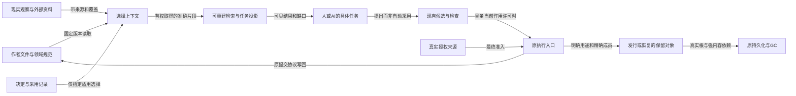

# SEC全体系信息结构

> **阅读范围**：采用范围内的设计规范；实现状态另查未决。

<details>
<summary>本页内容</summary>

- [1. 当前决定：分责真源、类型化关联、配置化选择、按需投影](#1-当前决定分责真源类型化关联配置化选择按需投影)
- [2. 信息量和文档量不能共用一个指标](#2-信息量和文档量不能共用一个指标)
- [3. 物理目录只负责定位，不承载全部分类](#3-物理目录只负责定位不承载全部分类)
- [4. 一个对象可以出现在多种视图中](#4-一个对象可以出现在多种视图中)
- [5. 同一概念的几种状态不能被“最新版”吞掉](#5-同一概念的几种状态不能被最新版吞掉)
- [6. 规模扩展不等于中心化元数据无限增长](#6-规模扩展不等于中心化元数据无限增长)
- [7. 控制面与材料的边界](#7-控制面与材料的边界)
- [8. 信息结构的完成与反转条件](#8-信息结构的完成与反转条件)
- [信息责任图：共享入口不合并权威](#信息责任图共享入口不合并权威)
- [竞争结构的具体取舍与重新选择条件](#竞争结构的具体取舍与重新选择条件)
- [文件组织的完成条件与适用尺度](#organization-contract)

</details>

本篇拥有SEC自身工程、SEC产品内所管理工程、外部协作与长期运行之间的**信息组织合同**。它不拥有语言含义、编译算法、业务事务或授权；这些仍由原十职责的规范承担。目标是在不牺牲独立信息的前提下，让不同主体能找到准确版本、理解依据、完成变更，并能解释缺失、冲突、失效和退出。

这里采用的是当前目标下有理由的架构，不是对未知未来唯一最优的宣言。规模、参与方、权属或媒介变化可触发后面的转换条件；尚未启用的未来资料类型有接入责任，不生成空服务。

<a id="information-architecture"></a>
## 1. 当前决定：分责真源、类型化关联、配置化选择、按需投影

**同一含义只在其范围内有一个规范拥有位置；同一事实可以有多个相互冲突的观察；同一内容可以服务多个入口，而不复制出多份可独立改义的规范。** “一个真源”不是一个中央人员决定物理事实，不是把全部资产放进一张图数据库，也不是所有信息都转成Markdown。

逻辑上区分四件事：

| 层 | 负责什么 | 本地最小落点 | 不承担什么 |
|---|---|---|---|
| 作者与现实真源 | 人/AI写的源码和理由、配置、实际提供者的状态、原始观测与证据字节 | 原文件、原库、原提供者 | 不由索引副本反向替换；物理权限不等于有权改义 |
| 身份、关联与选择 | 哪个对象的哪个版本、在哪个配置下、关系由谁声明且支持什么 | 现有引用与锁；确需长期定位时的文档身份/基线清单 | 不创造新领域语义，不替代原始载荷 |
| 计算和检索投影 | 文件树、依赖、影响、全文/语义检索、API/任务/角色视图 | 可重建索引、进程内查询或现有Provider | 不因搜索命中变成规范、证据或授权 |
| 交付与保留 | 为源码发行、部署、复验、长期引用、恢复选择实际成员并保护内容 | 既有ArtifactSet、ContentStore、OperationStore及目的性manifest | 不把所有历史打入每个包，不把普通引用当永久保留令 |

三个系统范围不合并：SEC自身的代码/文档工程；某个用户的目标工程；多个工程与组织共同采用的发行配置。它们可使用相同协议，但身份命名域、信任边界、写入拥有者、费用与删除责任分开。

首选物理实现是原文件与版本控制加上需要的稀疏元数据；全局查找是跨提供者查询，不是全局强事务。纯本地文档无需安装数据库。真实产品需要跨重启操作恢复时，使用已设计持久层；不因为设计了信息目录就启动它。

## 2. 信息量和文档量不能共用一个指标

必须分别计量人工规范、作者源码、唯一内容、历史版本、发布制品、运行/实验数据、索引和缓存，以及物理副本。行数受换行、语言、表格与自动生成影响，不作为知识量、正确性或目标配额。文本规范详细程度由语义消歧决定，不能从TB级资料库推导应写TB的说明书。

可用的容量估算先固定口径。例如以下只是可复算情景，不是SEC预测：200 MB的有效事件输入每小时产生、持续30天，逻辑输入为200×24×30=144,000 MB，按十进制为144 GB；保留原始与一个同尺寸派生各一份、再各有三个实际物理副本时是864 GB，尚未计索引、压缩、历史重处理或纠删码。若源日志采样、压缩或分区保留不同，必须重新按每类内容计数，不能把上述乘数当常数。

容量账分`uniqueLogicalBytes`、`versionedLogicalBytes`、`physicalBytesByStore`、`rebuildableBytes`、`nonReconstructibleBytes`，每项标明范围和测量切面。逻辑多引用不增加唯一字节；跨租户不能为了去重泄露另一租户是否拥有相同内容。备份、副本与可重新生成结果也不能互相代签耐久性。

[信息组织来源与取舍](../依据/来源/工程信息组织依据.md)保存大型工程资料实例及核验边界。没有可支持的需求、统计样本或成本模型时，不设“最终应该多少行”的配额；这不撤销详细规范或机器派生的价值。

## 3. 物理目录只负责定位，不承载全部分类

本章定义SEC所管理信息的责任与生命周期，不再兼作这份文档库的详细目录。当前包的维护架构由[文档架构](../维护/文档架构.md)拥有，阅读从[主题入口](../README.md)开始；以下只给三种材料的物理分界。

```text
SEC/
  README.md / AGENTS.md      当前阅读入口、任务读取约束
  docs/                     产品、作者、编译、开发、运行、领域、信息、演进
                            以及决策、状态、依据、文档维护
  examples/                 当前结构化作者源与有明确范围的各类范本
  alternatives/             未采用为主面的可选文本方案
SEC/.documentation/         当前基线、文档身份与派生清单；不保存历史旧址路由
独立依据档案/               原会话、历史恢复与本次详细核对；非日常必读
```

目录前缀用于阅读位置，不是实现先后或价值等级。语言与领域语义分开，是因为共同求值/组合规则和特定事务、时间、关系、数值机制有不同修改责任；不是认为领域内容次要。共享语义和身份属于工程模型，不与目标运行对象共用同一个状态机。来源、理论、D理由可以互引，但外部结论、形式推导和当前工程采用不因此合并。

大型范本按完整使用场景拆分，资料按实际机制分题，原父入口保留概念与导航。单个规范内部仍按对象、状态、算法、消费者、反例组织；长而内聚的协议不因文件超过某尺寸强拆。拆分触发是独立拥有者/独立变更/独立读取需求；合并触发是相同合同被重复维护，而不是为了目录整齐。

产品代码所在仓库可按实际工程采用`src`、`tests`、`docs`等普通位置，信息层读取真实布局，不要求搬迁到本包目录。构建制品到选定制品存储，运行数据到所选Provider，秘密到真实秘密管理者，工作回执到独立工作材料。完整去向见[类别路由](信息类别与生命周期路由.md)。

## 4. 一个对象可以出现在多种视图中

按任务：首次理解、修改接口、定位错误、选实现、生成/回源、发布、值班恢复、解释旧版本、移交/退出。按系统：语言、编译、执行、存储、适配、领域能力。按信息角色：规范、观察、决定、证明/实验依据、授权、未决。按时间：当前工作、明确发布、历史配置、在途操作。按主体：作者、维护者、审查者、操作者、使用者、AI子任务。

这些是选择谓词，不是要求为每一维造一份目录。用任务入口定位唯一拥有者，再按需要展开消费者、理由、证据和残余；读者无需首先浏览全库。API使用者可能只需完整字段与错误合同，维护者还要看到算法及ABI条件；不能因为使用者不看算法而删去它。

关系图是局部投影。节点可能是源文件、合同、具体运行或研究命题；边有明确类型。折叠只改变展示，不改变底层必需依赖、授权、顺序或完成。当前Markdown中的图源可以按需显示，不为了完成信息组织另建GUI。

## 5. 同一概念的几种状态不能被“最新版”吞掉

规范v3、实现提交c7、在产品R2中采用的规范v2、一次测试t9、运行中的旧制品a4、研究候选v4可以同时存在。它们由[基线选择](对象关系与配置基线.md#baseline-selection)关联；不使用一个`status=approved`替全部维度。

跨仓、跨数据集配置是各命名域的精确选择向量，不是假定同一墙钟时刻取得的一致全球快照。配置自洽、内容可用、兼容成立、检查完成、允许部署分别报告；“全部版本已固定”不能推出接口互相兼容。升级新默认只影响新准备态，旧运行仍按原制品解释。

历史归档不进入默认当前搜索结果，但显式钉住的历史版本可以是当前发行、复验或恢复的合法依赖。不能把存储层的冷归档状态误当语义上的不适用；它的取回成本、权限与缺失风险要单独说明。

## 6. 规模扩展不等于中心化元数据无限增长

| 实际条件 | 选择的结构 | 启用前要确认 | 未采用的过度方案 |
|---|---|---|---|
| 单人/单进程文档与源码 | 原文件、Git、目录及少量稳定身份；按需全文搜索 | 字节/编码、链接、身份、备份目的 | 每段文字一行数据库，每查询永存日志 |
| 多进程本地恢复 | 原持久元数据和不可变内容层，索引可重建 | 锁、提交、pin、实际文件系统、备份与拒旧 | 仅靠Git提交替操作恢复，或所有读取都开事务 |
| 多团队/权限边界 | 按权属与提交域分区，提供者联邦 | 身份命名域、披露、配置选择、离线边界 | 复制所有私有资料到一个全公司知识库 |
| 大量制品/数据 | 分片manifest、范围读、对象存储、分层保留 | 完整成员、介质完整性、成本、取回/删除能力 | 把二进制base64塞Markdown/向量索引 |
| 高频遥测/实验 | 事件/数据原系统、时间窗、采样、聚合与准确血缘 | 丢弃/迟到、隐私、重处理、可复验所需原数据 | 永久保存每条调试消息，或聚合后假装原始无损 |
| 外部档案与监管/取证 | 目的性只读清单、版本保全与独立恢复能力 | 适用义务、范围、可控制副本、密钥与解释器 | 默认永久保留全部内容，或仅存URL称已保全 |

是否引入全文服务、图索引或向量检索，以真实查询任务、变更频率、延迟、权限和维护成本判断，不以“百万行”设一刀切门槛。完全不建新的知识平台、仅做好现有源码/文档/制品工具接合，是必须持续保留的竞争方案。独立检索服务只在可观察收益覆盖失效、安全、备份与运维成本时采用。

## 7. 控制面与材料的边界

外部网页、源代码注释、工具返回、聊天、邮件、PDF和模型生成文本都只能作为有来源的输入。文件放进`docs`目录不是接受动作；规范实际效力来自明确采用和范围。操作指南中的命令可以被分析，但不能自动执行。模型“建议采用”形成候选，不能提升成Grant或证明。

最少元数据按消费者产生：对话临时推导可以是正文；跨文长期规范需要稳定定位；跨组织证据需要主体、版本、方法和校验材料；大量时序数据需要分区和窗口而不是每个标量的永久身份。具体必需字段见[引用与配置](对象关系与配置基线.md)，各实际域可以保留自己的表示。

## 8. 信息结构的完成与反转条件

当前信息架构已决定的范围包括类别去向、引用/关系/配置、接入查询派生、保留恢复、文档迁移与原模块接合。实际产物仅是本设计库的整理、索引和静态核对。真实运行库、搜索服务、ACL执行、远程事务、长期恢复及产品净收益没有因此完成。

出现新媒介、新主体权限、无法表示的关系、不可恢复依赖、真实查询失败、重复维护或收集成本压倒用途时，先修正相交模型/路由与消费者，再决定是否更换物理分区。不得仅为维持本目录外观而把异常信息硬塞进现有类别；未知类型按原字节和有限观察接入，不自动被接受、执行或删除。

<a id="fig-information-roles"></a>
## 信息责任图：共享入口不合并权威

本图的箭头标出读取、选择、交付或真实控制，不表示无条件执行。源的事实角色、当前作用许可与存储保护分开；图省略每个Provider自己的事务、格式和字段，完整合同在各机制篇。



Q不是第二份作者工程，D不是G，来源O不是已证事实的集合，B不是全库快照。只有实际变更请求才进入C/E；普通读取可在H结束，纯内存结果无需为了本图创建持久保留根。

<a id="information-architecture-tradeoffs"></a>
## 竞争结构的具体取舍与重新选择条件

| 竞争方案 | 真实优点 | 当前不作为主结构的原因；何时适用 |
|---|---|---|
| 一份巨型全文 | 顺序携带上下文、无跨文件管理 | 独立主题、权限、维护和查询边界混合；适合固定版阅读导出，不适合作为全部资产唯一源 |
| 每条事实一张原子卡片 | 精确组合、独立更新和引用 | 上下文、否定与共同前提容易拆散，登记成本转移给作者；有成熟模式且确需独立消费时才细化 |
| 全部按软件/业务分类 | 实例容易找 | 共同编译/身份机制被复制，跨业务演化难以同步；用于范本和目标工程空间，不接管公共规范 |
| 全部按十模块排文档 | 代码责任直观 | 需求、理由、实验、跨域语义与用户任务不全是模块内部资料；模块是关系和责任维度，不是唯一信息树 |
| Wiki或富文本站点作主库 | 协作搜索便利 | 不能假定具备精确基线、导出、权限回查和结构化diff；具备真实机制且用户愿意承担平台依赖时可作编辑器，不改唯一源原则 |
| DITA/CCMS全面结构化 | 主题复用、多受众和变体发布有成熟机制 | 当前作者和维护负担不值得强制XML/CMS；若大量产品变体和同步出版成为真实瓶颈，可对该出版域采用，不重写SEC语义 |
| 全量知识图谱/RDF平台 | 跨域关系和联合查询表达强 | 自动抽取不保证边正确，授权/一致性/模式成本仍在；先用轻量关系索引，实际联邦需求形成后采用对应实现 |
| 全量事件溯源保存一切 | 某些状态可重放、有取证价值 | 秘密、成本、许可、外部效果和无法重放的环境不能被消除；仅实际恢复/审计域采用，不能代替当前可读规范 |
| 只有语义向量搜索 | 不记准确名称也能发现相关候选 | 不能可靠回答精确版本、负条件、完整覆盖或权限；可补充发现，最终从准确原件和合同取结论 |

当前选择不是因为目标小而放弃扩展，而是让扩展沿真正不同的数据与责任发生。引入分布式索引、对象存储、翻译系统或CMS的触发，是实测的读取延迟、重建成本、并发编辑冲突、画像数量、权限边界或发布需求；不是先预测一个TB数再建立所有平台。

没有单个结构能同时把作者工作、读取跳数、原件存储、所有关系检索、强一致和全部保留成本都变成零。这里给出可持续改变实现而保持信息和引用含义的结构；若实际工作证明某个共同拥有者经常被不同角色独立修改、或片段需要持续补回同样上下文，就分别拆开或合并，不用“架构完美”拒绝反证。

<a id="organization-contract"></a>
## 文件组织的完成条件与适用尺度

本体系的组织单位不是唯一一棵全局目录树，而是**各真实根中的作者位置、对象/版本关系、原生构建与作用边界，以及有覆盖说明的任务视图**。主位置回答日常维护在哪里；语义责任回答谁定义和解释；写入协议回答谁能在当前前像上修改；组织人员或团队回答谁受托维护。四者有关联但不互相代替。共享文件可以有多个维护者，不能从单一物理父目录推导唯一决策人；相同字节也可以有多个合法分发副本。

清晰性按实际任务验收：读者能定位准确主体与版本，解释它为何出现在此处、由哪个源维护、使用了哪些条件、哪些内容未取得，以及下一步实际改什么；不能用目录浅、名字短、图无环、点击少或总文件数少代替这些结果。同样不能承诺任意未来任务都有唯一最清晰视图。不能可靠分类的材料保留未知和原位置，不自动归入shared或misc掩盖缺口。

不同布局的选择先满足写入归属、公开地址、原生加载/构建、支持平台、权限与完整成员等硬条件；在合法候选中，优先保持已有效的地址与共同修改局部性，再比较真实导航、审查、变更与构建成本。没有可区分证据时保留原布局或既定确定性规则，不制造全局最优评分；真实责任变动、消费者痛点或新约束才触发重划。代码责任的具体落位由[物理架构](../架构/装配/模块与运行实例.md#physical-placement-contract)拥有，用户工程沿[原源范围](../作者/工程源/清单模块与绑定锁.md#实际工作区及其默认所有权)，生成目标沿[目标布局](../编译/目标/成员布局与完整产物.md)，不能互相复制树形模板。

整个功能可能横跨semantics、compiler、assurance、adapters、测试和规范。这是功能视图的关系，不自动要求将这些文件搬进一个feature目录。反之，一个独立规则与其局部测试确实共同演化时，不因文件扩展名不同而强行拆散。目录层级、构建包、发布包、进程、运行实例和组织团队分别有自己的粒度；只有真实同边界时才复用同一分区。

不建立新的全局EntityGraph服务或逐符号手写数据库。已有Source Program、module描述、源范围、锁、规范和原生工具分别提供其事实；反向引用、可见树、影响、测试/文档导航是有输入绑定的派生。跨源事实以现有引用接合，不通过给每项都分配全局UUID解决实际无法识别的问题。失去索引仍应能够读取原生源和适用合同；确需索引才能完成的查询明确报缺项，不把原材料一起宣布不存在。
