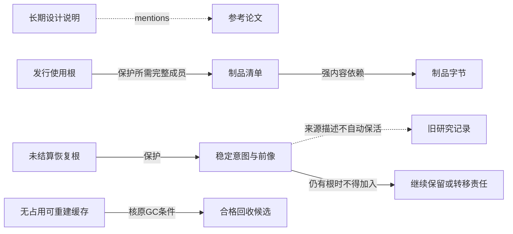

# 信息存储、保留与恢复责任

> **阅读范围**：采用范围内的设计规范；实现状态另查未决。

本页内容

- [1. 语义关联与内容保活必须分开](#1-语义关联与内容保活必须分开)
- [2. 根登记和删除竞争](#2-根登记和删除竞争)
- [3. 热、温、冷是存储状态，不是知识效力](#3-热温冷是存储状态不是知识效力)
- [4. 数据规模、预算和压力处置](#4-数据规模预算和压力处置)
- [5. 保留、隐私删除与取证冲突](#5-保留隐私删除与取证冲突)
- [6. 恢复的对象不只是字节](#6-恢复的对象不只是字节)
- [7. 存储/索引/工具迁移](#7-存储索引工具迁移)
- [保留图：语义边与物理删除资格](#保留图语义边与物理删除资格)
- [物理表示、可重建性与恢复等级的独立检查](#物理表示可重建性与恢复等级的独立检查)

本篇补充**哪些信息因何保留、如何选择存储和何时允许退出**；原ContentStore、CAS、pin、事务发布、GC、备份与权威重新加入算法仍由[持久化提交与恢复](../运行/持久化提交与恢复.md#核心数据存储与提交协议)唯一拥有。这里不重建数据库，不以信息目录代替实际锁或存储保证。

## 1. 语义关联与内容保活必须分开

“R引用过论文P”“编译结果B由源S产生”“恢复操作O仍需前像X”都是关联，但保留责任不同。若全部`derivedFrom`或文档超链接都递归pin，任何长期笔记都可能保活无限历史；若只pin顶层manifest，实际恢复又可能丢子内容。

保留请求由真实拥有者按目的声明，使用现有根/pin协议落实，不只新增一条图边：

| 保留目的 | 必需内容闭包 | 释放条件和限制 |
|---|---|---|
| active-read | 本次实际读取的内容及解释必要部分 | 消费者结束/租约安全失效；不能提前释放仍在使用的内容 |
| publish/use | 所选产物/基线实际承诺可读取的成员 | 真实消费者与支持义务结束或转移；发布头删除不自动清除他方引用 |
| reproduce | 明确复验Claim所需源、工具、环境、数据或替代证据 | 承诺结束或有权降低为不可复验；非确定外部过程不能只保生成脚本 |
| recovery/idempotency | 稳定意图、作用身份、前后像、未结算结果、必要拒旧与依赖 | 目标已安全结算/转移且满足重试与离线拒旧合同；不能普通TTL回收 |
| custody/hold | 经实际规则要求保全的对象/区间、来源与解释 | 满足具体范围和解除条件；不臆造永久保留所有资料 |
| author/history | 作者实际保留的源版本与必要谱系 | 按明确版本/隐私/协作政策选择；未引用作者文件不是垃圾 |
| cache | 可从当前允许源重新计算的结果 | 无消费者占用且缓存策略允许；不包括仅存一份的理由或证据 |

保留类型只是政策/目的接口，最终GC只信任受协调域保护的真实根与pin。引用的域适配负责说明哪些边对该目的具有**强内容依赖**，哪些只是信息导航。未知关系影响闭包判定时，保守保留相交域或拒绝该完整承诺；不能将未知当弱边逃避保护。

可循环逻辑关系使用访问集合做可达分析；没有外部根的循环可以成为垃圾，不用简单引用计数永久保活。内容寻址manifest不能直接要求自身内容摘要形成自引用固定点；逻辑对象ID/关系revision表达循环，字节manifest按可构成的有向结构编码。签名/自摘要放在分离封装，防止校验文件必须先知道自身最终摘要。

## 2. 根登记和删除竞争

根请求的最小作用内容是：准确对象/内容代际、控制域、目的和范围、拥有者、必要强依赖、释放条件及来源依据。临时纯读可内存实现；长期恢复根必须持久。不同物理副本的存在，不等于它们共享一个可原子更新的根目录。

新增根、实际发布、读者占用与回收候选协调沿原`Live → Reclaiming → Removed`与代际CAS执行。遍历到所有强子引用后才承诺完整闭包；根目录变化必须重核或经等价屏障处理。外部提供者不支持条件删除或代际隔离时，限制并发重用，不能只在本地增加一个版本号。

新发布所依赖的旧内容正处于回收中时，可以等待再重新供给、在真实允许边界撤销回收，或拒绝该发布；不能先返回发布成功再找字节。释放原根前必须确认后继保护已经生效；补偿失败保留实际责任，而不是在finally里删唯一源。

## 3. 热、温、冷是存储状态，不是知识效力

热层可放活动输入、常用索引、近期恢复资料；温层放仍支持发行与可复验材料；冷层保存明确长期责任。具体介质、本地/远端、副本/纠删码、备份频率和期限由用途、恢复时间、读取频率、风险和成本决定，不给全项目一个固定TTL。

一份冷归档规范仍可能是运行中旧发行的准确合同；一份热缓存也可能已经过期。调用方先判断语义选择，再判断字节可用性、当前读取权和预计取回能力。没有明确时限证据就报告未知延迟，不承诺秒级恢复或无限保留。

小内容与大blob分开并非绝对按尺寸切一刀。事务一致性和读取方式可能使小前像需要同库，而大媒体可按对象版本引用；分区依据实际原子域、权属和访问模式。迁移前核请求、清单、索引与GC都使用同一可验证对象代际。

## 4. 数据规模、预算和压力处置

预算按真实资源计量：存储字节、下载/上传、解压与解析、索引空间、CPU、并发、保留根数量、恢复预留、Provider配额。费用是估计还是实际账单分开；预算只使用获准用于本工程的成本数据，不得为了补齐估算擅自读取无关个人财务。缩短上下文不减少背后数据保留与计算成本。

压力到来先限制新增低优先级派生/并发，回收确实可重建且无占用缓存，再按已接受政策降低可丢遥测或归档不活跃资料。不能为构建成功删除唯一恢复前像、秘密撤销资料或承诺保全的原始证据。必须保留的内容超过可用资源时，拒绝新增相交作用、记录具体不足并允许独立只读/设计工作；不能让保护本身无界占满磁盘。

遥测可降采样，但应记录采样/丢弃策略及实际缺口；审计/恢复journal不隐式降级为采样流。全局去重可能跨权属泄露存在性或放大删除耦合，因此默认只在同允许的控制域和可说明的共享关系内去重。压缩、去重和聚合分别记录，不把有损汇总叫无损压缩。

## 5. 保留、隐私删除与取证冲突

删除首先区分禁止访问、撤销采用、索引删除、逻辑墓碑、物理字节删除、备份过期以及外部副本。不同阶段分别报告。对象有真实保留义务时，按其法域/协议/目的限制访问并说明未能物理删除的范围；无具体法律输入时不代写法定期限或自动裁决冲突。

不可变、WORM或hold只按对应提供者合同保护指定对象版本；更新为新版本不抹去旧版，删除标记也不等于旧字节消失。已导出的第三方副本或读取者记忆不在本系统删除保证内。秘密泄露需要轮换/撤销真实凭证，单纯删Git提交或搜索索引不能挽回已有副本。

墓碑、摘要、关系邻接和删除理由也可能敏感，披露与保留受自己的限制。恢复备份时先取得其之后的删除/撤销前沿；无法取得则限制相交披露与写入，不恢复成默认公开。多个Provider只部分删成时保留实际分项状态及下次合法动作，不写一个总`deleted=true`。

## 6. 恢复的对象不只是字节

可恢复包按目的固定：所需作者/制品/状态字节，准确成员和内容校验，模式与解释版本，依赖/工具或可取得性，密钥和信任根可用性，操作意图与拒旧信息，必要许可和恢复说明。只存外部URL/散列、只保存schema、只复制正在写的数据库，都不自动满足复原。

恢复在隔离位置先读回并解释；不能派发旧outbox、沿用旧租约或把旧Grant当当前。没有最新拒旧依据时，恢复内容读取可以与恢复写权分别开放；新控制域也不能自行恢复旧副作用的准确完成状态。无法查询/去重的外部非幂等操作保留未知，按有权风险裁决，不新建ID再发一次假装查回。

备份存在、校验可读、内容可还原、语义可解释、目标可安全重新加入，是五个独立结果。定期复验频率由实际风险与恢复要求选择，本次文档设计没有部署自动备份或演练任务。

## 7. 存储/索引/工具迁移

迁移选择单一当前写权：旧Provider继续服务固定快照，新Provider隔离导入与验证；验证相同主体/revision/字节/关系和必要恢复根后，在受控入口切换新写权。短期双读用于对照，不能无协议双写然后以最后时间戳合并。

回退需核新系统已经产生哪些不可逆作用和旧系统能否理解新增版本。只能读旧格式的旧读者不得重印新格式删掉未知信息。格式/算法/身份变更分别迁移；摘要算法替换建立可核对应，文档搬家保留身份，业务主体拆分才产生新主体。

只有准确源、读取资格、解释及必要生成工具仍可取得，且该结果没有额外证据或复验责任时，索引才可以按声明的等价等级清空重建；重建相同查询能力不自动意味着逐字节相同。源已灭失、提供者不再开放历史快照或旧模型不可取得时，现存切片不得自动列为可再生缓存。源字节、真实批准、外部签名和不可重放的观察不可从索引重造。导出移交时给完整性、取得范围和未取得外部依赖；新的保管者实际接受前，原系统不能把“已导出文件”当责任移交完成。

## 保留图：语义边与物理删除资格

实线是已取得的真实保护，虚线只是文档提及或来源关系。图只说明边的用途；并发标记、代际删除与写屏障由原GC正文规定。

论文是否需要保存取决于明确复验/保管目的，并非一律不保存。仅有manifest保护而漏掉CODE也不合格。删除CACHE不证明秘密已从第三方副本擦除；NOTE的存在不使所有研究历史永久不可删除。

## 物理表示、可重建性与恢复等级的独立检查

Git/LFS、对象存储、事件库和检索服务可以各保留自己的载体；统一引用不强制复制到中心仓。LFS指针可进入源码版本而大内容存于另一处，备份指针不证明原件已备份。当前源与内容制品、协作/运行记录、可再生读模型、秘密和独立备份分别有真实拥有者；同一物理存储可承载多个角色，不因此共享同一个授权或事务。

压缩、去重、增量与采样四种手段不能混同：无损压缩需要可用解码方法；跨版本增量需要仍可取得的必要基底；去重需要真实强引用与安全域隔离；采样改变可推断范围。增量链失去一个关键基底可同时影响多版，源的去重收益不能抵偿另一租户的存在性泄露。报告物理字节、唯一逻辑字节、保留窗口和可重建性时分别计量，不把重复副本称为新增设计知识。

原件存续、格式可解释、软件可重建、实验可复验、目标可安全重新加入，是独立结果。签名针对原字节时，重排或格式转换所得新表示不能沿用原签名的字节保证；保留输入、方法、输出、损失与对应关系，必要时对新对象另外签发。勘误另存为关联后继，不把旧失败报告改写成现在的正确结论。OCFL等版本清单可以作为归档域实现选择，但本地ZIP＋明确清单已足以交付本设计库，不强制逐文件包装为新档案对象。

加密擦除只在必要密钥确已销毁、不存在其他明文或可用密钥副本且实际算法/实现符合所需条件时提供其有限保证。它不等于移除一个目录；解除检索引用也不证明模型参数已经遗忘训练数据。这些是采用前需落实的能力和责任，不是本包已执行的擦除行为。

| 失败情形 | 恢复依据与实际动作 | 不能伪造的结果 |
|---|---|---|
| 原文误删、只剩摘要 | 从精确原版本/备份取得；没有原件时保留摘要证据和缺口 | 重写一份相似文字不叫恢复原文 |
| 内容校验失败 | 隔离损坏副本，从独立正确副本读回；没有则报告丢失范围 | 换一个版本下载后继续沿用旧身份 |
| 只丢元数据而字节仍在 | 从备份清单、来源与可信对应恢复；未能定属的内容隔离 | 同一摘要自动重建所有原许可/主体/发生记录 |
| 提供者退出且只有URL | 取获准固定副本/真实导出，缺失仍明确 | 目录中有链接就承诺永久可读 |
| 解释器或格式工具不可用 | 保留原件、已知格式/版本和可得替代；分开报告可取与可解释 | 编出合理字段当成原内容 |
| 摘要或日志含秘密 | 先限制访问、轮换/撤销真实凭证，再处理相交副本和保留冲突 | 删一段正文就称泄露已撤回 |
| 多个backup目录同域失效 | 使用实际剩余独立副本；没有就确认不能恢复的范围 | 目录名backup提供容灾保证 |
| 发布响应丢失 | 按原意图、准确清单与目标头查回，不重发通知假装查询 | 已发布不等于全部读者已下载或采用 |

这些条目细化本章原恢复合同，不重建另一套journal、GC或权限流程。对象数很多和单对象巨大导致不同瓶颈：前者增加元数据、索引、权限与GC工作，后者增加局部读取和整体改写成本；分块应服从访问单元及完整语义，不能以统一KB阈值处理全部数据。跨提供者的慢源可让独立根先返回合法部分，但必需源缺失仍阻止相交强结论。
