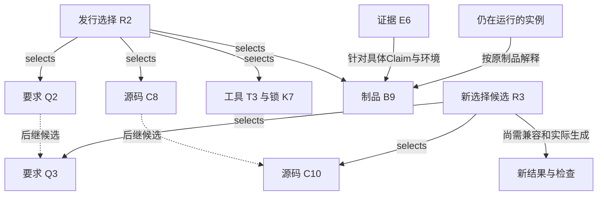

# 信息对象、类型化关系与配置基线

> **阅读范围**：采用范围内的设计规范；实现状态另查未决。

本页内容

- [1. 引用包含什么，什么时候才需要](#1-引用包含什么什么时候才需要)
- [2. 一个引用的解析必须返回精确状态](#2-一个引用的解析必须返回精确状态)
- [3. 关系不是一类万能dependsOn](#3-关系不是一类万能dependson)
- [4. 信息状态与效力分别维护](#4-信息状态与效力分别维护)
- [5. 配置基线是选择向量，不是一个全局版本号](#5-配置基线是选择向量不是一个全局版本号)
- [6. 连续修改的具体例子](#6-连续修改的具体例子)
- [7. 演进、引用兼容与安全边界](#7-演进引用兼容与安全边界)
- [选择与版本图：新默认不篡改旧运行](#选择与版本图新默认不篡改旧运行)
- [可独立消费的单元、属性继承与冲突对齐](#可独立消费的单元属性继承与冲突对齐)
- [适用条件、事实权威与载体树的限定](#适用条件事实权威与载体树的限定)
- [关系形状、身份层次与视图出现](#relation-shape-contract)

本篇细化现有SubjectRef、Revision、Assertion、AssetView、PreparedJob与ArtifactSet在**跨信息域联接**时的合同；不是一套替换产品模型的KnowledgeGraph。基本身份、时间和事实角色仍由[身份知识](../作者/工程源/身份断言与采纳.md)拥有。目录索引可实现本篇的有限投影，不需要先实现所有长期协议。

## 1. 引用包含什么，什么时候才需要

普通同版本文档可使用相对路径和锚点。需要跨移动、跨仓、发布、验证或恢复引用时，在原SubjectRef之上按实际场景固定以下分量；纯进程内值不为此序列化。

| 分量 | 含义和取得者 | 何时必需 | 不可混用对象 |
|---|---|---|---|
| namespace | 提供者/项目/权属命名域，由真实上下文取得 | 多工程、外部引用、隔离 | 显示项目名、目录路径 |
| subject | 逻辑对象身份，继承已有对象；新文档长期引用时一次分配 | 持续编辑、移名、外部引用 | 内容摘要和标题 |
| revision selector | 明确revision，或在配置下才能解析的概念引用 | 精确复验、生成、已发布材料必须固定 | `latest`、时间戳、分支名 |
| content identity | 算法+摘要+长度+编码层或提供者版本，指向确切字节 | 完整性、CAS、制品引用 | 主体、当前权利、语义等价 |
| fragment | 有意义的子对象/稳定条款/坐标；必要时附解释器与上下文 | 逐条追踪、回源、证据定位 | 不带版本的行号、搜索排名 |
| configuration | 原项目/发行/操作选择的上下文引用 | 同一概念有不同版本和变体时 | 全局最新版本 |
| locator | 可更新的存储定位候选，可能暂不可用 | 实际取得字节 | 权威身份和永久存活承诺 |

普通文件无需每次填写以上字段；workspace从当前项目、锁和快照补齐。本设计库的文档身份清单只记录现行文档身份与位置，不维护历史拆并谱系；标题/行号/散列由解析派生。其他产品对象确需的拆并历史由其原生命周期合同承担，不能借本库的精简规则删除。身份清单迁移时保留原值，不能重新按排序或内容散列编号。未有稳定条款ID的普通段落使用**固定revision内的位置**，不假装改文后还是同一条。

## 2. 一个引用的解析必须返回精确状态

内部`resolveInformationRef(ref, selection, readAuthority, requiredFidelity)`由workspace/adapters执行。成功返回确切主体/revision、解释版本、可用载荷、当前可披露范围与保留/读取保护；失败区分`ambiguous`、`notFoundWithinCompleteScope`、`unavailable`、`notDisclosable`、`unsupportedFragment`、`contentMismatch`和`selectionConflict`。实际外部返回是否可区分不存在与拒绝依披露政策；内部不能把两者混同。

“引用位置变化”可以更新locator而不改主体；“主体拆成两项”产生新身份与`splitFrom`，旧引用返回多个有范围的去向，不能静默选第一项。“两个副本内容相同”可共享受允许的字节存储，但不自动合并主体、许可、来源或采用状态。去重只消除已确定的物理/表示重复。

内容摘要的算法、编码层与长度一起记录。文本值相同与BOM/CRLF/压缩字节相同不同；摘要算法升级建立可验证对应，不改旧引用语义。哈希不提供作者认证、执行证明或保密；低熵敏感值的摘要也不能公开。

### 从定位到消费：同一个引用按用途取得，不偷换其版本

`requiredFidelity`选择已有解析的实际要求，不是调用方可以自签的“精确”标签。workspace固定任务所选命名域、主体、修订、片段和解释，再让实际提供者返回其能够取得的范围。定位与消费分开处理如下：

| 消费用途 | 可以接受的定位变化 | 消费前还须满足 | 不能借定位成立的结论 |
|---|---|---|---|
| 找当前说明 | 按有来源的移动/拆分关系找到继承页 | 当前可读取、片段真实；多去向明确返回 | 继承页就是旧原文或新规则已经被采用 |
| 解释旧作者源或复验旧结果 | 镜像、缓存、存储搬迁可换locator | 所选原修订、准确字节、片段语境和解释仍一致 | 默认页已更新，所以按新语义读旧内容 |
| 为本次生成选实现 | 在固定快照内找到实际定义/方法 | 调用角色、合同版本、前提、效果、资源及目标保持成立 | 名称或签名相同便能替换旧方法 |
| 判断某条证据可用 | 原证据的准确副本可由新位置取得 | 仍对应此Claim、被测主体、输入和方法范围；相交撤销另查 | 文档标记supersedes即可转移旧通过 |
| 发起现实作用 | locator可按实际提供者协议变化 | 当前授权、资源身份、最终前像、操作及重试协议 | 导航成功或旧读权自动允许新写入 |

解析有六个明确交接。第一，应用层固定本次目的和选择，而不是将查询中的`latest`带进后续可变读取。第二，workspace取得选定对象和必要内容；别名只给定位线索，同名目标和其他租户内容不补缺。第三，核内容域、片段与必要上下文，完整文件存在不等于片段可消费。第四，语义/编译/保证各按实际用途核相交合同，不让公共解析器代做“所有性质正确”的判定。第五，只把经本用途核验的准确输入交给消费者，并记录实际依赖、覆盖和保留责任。第六，有效性变化时区分已封存的历史结果、当前显示资格和新的作用准入；不原地改写旧解释。

若Q@2移址后取得的确为Q@2原字节，且解释与读取资格仍成立，可以继续复用，不要求制造一次语义迁移。若旧地址现在返回Q@3，即使标题和函数签名相同，也不能充作Q@2；取得Q@2或形成明确新选择后再核相交消费者。Q@2已经拆成两份时，导航可返回两处，但准确语义迁移必须取得拆分映射与实际需要的上下文；没有时分别报告缺项，不按列表首项消歧。

运行任务所需版本与当前阅读页可以不同。离线仍有准确旧内容时可以完成合格的纯分析；缺失的仅是说明页镜像，不强迫阻塞独立输出。任务需要的实际实现、合规证据或目标前提缺失时则保留对应义务。没有全范围读取能力不能将`unavailable/notDisclosable`替换为“不存在”；输出给调用者的细分仍受当前披露政策限制。

## 3. 关系不是一类万能dependsOn

每条需要被机器消费的关系至少具有两端精确引用、命名空间化类型与版本、解释上下文、产生者/依据，以及本关系的覆盖范围。反向关系默认是投影，不另存一个可独立改义的副本。关系可直接由代码/清单/实际分析派生；没有消费者的每句自然语言不强制变成关系记录。

| 类型示例 | 准确含义 | 能支持的推导 | 不能支持的推导 |
|---|---|---|---|
| `defines` | 该文档单元拥有此合同在该版本的定义 | 定位唯一规范及变更拥有者 | 规范已实现 |
| `refines` | 在声明前提下细化另一个要求/模型 | 复用明确保持证明或检查 | 只因标题更具体便优先 |
| `implements` | 某实现针对某合同的对应声明 | 找候选消费者、安排符合性检查 | 行为一定正确 |
| `uses`/`imports` | 已解释输入依赖 | 相应输入变化可能失效 | 是执行前置、是授权或要永久保留 |
| `mustPrecede` | 具体任务的严格执行前置 | 调度及非法前置环诊断 | 普通递归类型非法 |
| `derivedFrom` | 结果使用了这些输入和方法 | 来源追溯、派生失效/删除影响候选 | 自动pin所有祖先或完全可重建 |
| `supports`/`contradicts` | 证据在前提下支持/反对具体Claim | 辩护和重开 | 签名即真实、赞成数决定事实 |
| `selects` | 配置选择特定版本/变体 | 明确解析与复现 | 版本之间兼容、允许运行 |
| `supersedes` | 新定义在指定范围代替旧定义 | 同范围采用后的当前选择 | 抹去旧发行、旧观察或旧义务 |
| `retainsFor` | 真实拥有者按某目的保护内容 | 交给现有GC根保护协议 | 仅靠描述边阻止物理删除 |
| `observedAt`/`performedBy` | 观察与活动、主体的对应 | 定位方法和原材料 | 墙钟先后等于因果、主体签名等于结果成立 |
| `authorizes` | 有效授权链对具体动作的约束 | 原Grant准入的一项输入 | 从知识目录自行生成新许可 |
| `mentions`/文档超链接 | 阅读导航或普通提及 | 找相关材料 | 编译依赖、证明、执行前置、保留义务 |

关系扩展先定义两端域、意义、是否有序、重复/删除规则、推导与否定边界、版本及消费者。不认识的关系可原样保全并显示其未知类型；涉及完整影响/保留计算时不得当成“没有边”。相同两个对象可有多类关系，不因端点相同删除独立语义。

## 4. 信息状态与效力分别维护

观察值、接受定义、设计候选、决定、证据、判定、授权仍为原来的不同对象。`documentState=accepted`最多说明该文档在定义范围被采用；`implementationState=notVerified`仍可能成立。不能让一张全局状态枚举把已设计、已实现、已验证、已发布、已部署和实效混成顺序单链。

提出变更保留原记录；接受按原采用协议形成后继。错误事实被纠正后，原观察仍能解释“当时为何这样判断”，但默认当前读者看到修正与适用范围。对外材料若省去已知反证，不能因每句字面为真就称完整支持。

事实有效时间、记录时间、revision顺序、操作单调时间沿原时间合同分开。晚到观测不必是最新事实；纠正历史区间也不应重写原记录时点。没有跨Provider因果协议就没有全局因果顺序。

## 5. 配置基线是选择向量，不是一个全局版本号

已有PreparedJob.projectView拥有用户任务固定输入，ArtifactSet拥有产物成员。本篇增加的`InformationSelection`只是它们与合同、证据、资料版本的关联视图，不是第三份作者源或每次必填文件。

需要独立跨域保存时，内部清单包含：`selectionId`、目的、所属控制域、`members`（命名域+主体→精确revision/变体）、`relationSnapshotRefs`、解释版本、取得覆盖、创建依据和所需保留引用。材料总量太大时用分片清单，父清单固定分片及完整成员条件。外部活数据用明确时间窗/游标/水位及观察覆盖，不声称冻结永远增长的数据源。

创建按以下具体步骤完成：

1. application从当前任务确定必须参与的系统、角色和范围；可选背景材料不强制进入编译键。
2. workspace/adapters按各提供者取得精确选择和实际覆盖，记录无法取得、权限限制和动态变化。分支名先解析再固定；没有固定读取能力则只提供相应弱快照。
3. 归并同一主体的选择。同版本可共享；不同版本只有明确变体/隔离空间允许并存。否则返回具体`selectionConflict`，不以读取顺序覆盖。
4. semantics/compiler/领域检查按真实关系核兼容：API、语义、配置、数据模式、ABI、来源映射及声明必需成员。引用都存在只是第一项。
5. 请求需要可复验或可恢复时，原ContentStore/OperationStore为必要字节和解释取得真实保护；仅“外部URL可见”不能满足离线复验保证。
6. 完整清单先构成不可变候选；发布头使用原持久协议的条件更新。成功后返回清单与分项覆盖/资格，不向读者暴露半填充清单为完整基线。

这个序列不包含跨提供者强事务。如果一侧只能提供当前值，必须选择两次验证与准确弱保证、使用该提供者的快照能力、等待或拒绝强一致要求。不能用本地锁伪造外部快照。

## 6. 连续修改的具体例子

发行R2固定需求Q@2、语言L@5、源码C@8、工具链T@3、依赖锁K@7、运行资产A@4和生成物B@9；测试E@6针对B@9以及指定环境。未来Q@3和C@10出现时，R2不自动改变。维护分支先形成R3候选，证明未受影响成员可复用，受影响消费者重新取得。

若E@6结果是通过，只能支持其明确Claim及环境，不能直接转贴B@10。两个制品字节碰巧相同，也要检查测试绑定的是字节性质还是构建来源/安装/策略性质；能复用哪些证据依Claim决定，不统一拒绝或全部接受。

把库A的旧文档归档而R2仍固定它时，R2保留该版本的取回义务；默认阅读首页仍指新文档。删除一个无用HTML视图不影响其Markdown规范，但只有HTML保留了某条独立理由时，删除前必须把理由并回真源。该情形要记录为丢失风险，不能以“HTML应当是派生”假定现实已经如此。

## 7. 演进、引用兼容与安全边界

`latest`可以用于用户明确询问当前信息的选择策略，解析后本次响应仍记录实际revision。稳定链接/别名不是采用授权；旧路径搬家不改变对象含义，跨租户目标变化不能沿别名自动取得新读取权。

迁移导出保留主体/revision关系、内容字节或明确外部缺口、解释版本及必要许可。恢复只能恢复历史信息，当前授权、撤销和外部已发生操作必须从真实控制源核对。登记类型扩展不自动安装解析器；未知版本按可保全/可读取/可编辑/可执行分别声明。

现行文档注册文件只承担当前文档身份与位置；不保存拆分谱系或旧址路由。章节索引是派生，普通Markdown链接仍直接可用。没有解析注册器时，用户可按新路径读全文，不能声称外部旧URL已被网站自动重定向。

## 选择与版本图：新默认不篡改旧运行

以下对象名是设计例，不是已构建发行。实线表示精确选择或被测绑定，虚线表示候选演进，不代表旧对象被原地修改。

R3有完整成员并不证明兼容；NEW不能复制E6的通过结论。旧运行保持B9的来源映射，文档默认页面更新也不改变这个绑定。内容引用是否构成GC强依赖由实际使用/恢复目的决定，不从箭头方向自动推导。

## 可独立消费的单元、属性继承与冲突对齐

**位置单元和含义单元不同。** 一个标题至下个同级标题的行范围，可以准确定位文本，但不能自动证明该范围足以独立理解。字段说明还可能需要父结构的互斥约束；恢复步骤还需要前像、后像、状态表及哪些动作不可重放；表格单元不能丢掉表头、单位或上方的适用条件。索引切片只用于发现，最终修改或正式论证须取齐相交上下文。无法判定闭合时返回缺项或继续读取父域，不让一个token窗口取得规范效力。

读取单元通过原引用表达“实际取得范围”以及“仍需要的上下文引用”。application沿原关系展开定义、否定、例外、完整类型、必要消费者和反例；访问集合的键包含精确对象、修订、解释画像与消费角色。相同对象在不同画像中不能因已访问而遗漏；真正递归可以停止重复展开而保留原关系。达到预算时保留已发现各独立分支的最小完整信息与缺口，不把缺了一项前提的片段包装成完整合同。

**稀疏属性的继承必须逐属性定义。** 文档范围、语言版本、单位和所属工程可从准确父上下文取得；正文不需重复手填全部元数据。继承值与显式值不兼容时返回冲突，不能一律最后写入胜出。公有目录不会使私有来源公开；局部许可不会越过其作用范围向所有子对象传播；内容属性、规范角色、保留保护和真实Grant不能共用一种继承算法。

**判定两个说法是否矛盾前**，先对齐命名域、逻辑对象、选定修订、字段/命题、量词与单位、有效时间、目标画像和陈述角色。规范要求与实际失败观察并存，可能说明实现不符合，而不是两个规范互相矛盾；旧版本允许与新版本禁止可以在各自发行中同时成立。没有同域依据时保留Ambiguous，不能按文件mtime、检索排名、转载数或看起来更正式的排版裁决。

导航可沿A→B→C到达C，但不由此得到A依赖C、A获准读取C或证据对C的传递。改位置只影响相交定位；改单位会影响解释、数据/图表与译文；撤权会影响展示、摘要和命中统计。每类关系按其真实消费者传播，不把全部关系压成一个传递的dependsOn，也不因局部前提未知把整个宇宙永久标成脏。

**同值与同源的例子。** 相同TS字节在不同依赖锁中可共享词法解析，不能只凭字节共享类型结论；两份复制的实验报告不形成两次独立实验。文本归一、OCR、翻译、压缩、源码反编译都要保留准确输入、方法和覆盖，多个相同片段的哈希不能自行消歧其原位置。相反，规则措辞修正或文件移名可能仍属同一逻辑对象的后继，哈希变化本身不裁决语义变化。

## 适用条件、事实权威与载体树的限定

适用性按所选对象/修订及实际条件求值；未知条件保留未知，无权取得不能变成“不适用”。版本比较使用对应生态的真实解释，不能用字符串顺序代替；多个条件按显式合取/析取组合。判断某维修程序、平台适配或发布视图不适用，不撤销源中原要求，也不授权操作。

唯一规范编辑位置只负责避免竞争性改义，不能取消独立观察与反证。两个检测结果冲突时，分别保留主体、输入、时间、方法及覆盖，再定位分歧；“一个事实一个权威”不能让其中一个提供者自动抹掉另一个结果。关系图可以索引这些来源，但自身不是证明器。

导航目录可以是视图，真正的部件包含、词法作用域、资源拥有和状态嵌套则可能属于语义。用关系数据库、文件链接或图索引实现相同的有型关系均可；不得由关系丰富直接推出必须新建中央图数据库。

## 关系形状、身份层次与视图出现

“所有对象都是图节点”只能是通用表达能力，不是强制每个对象进入一个全局图库。关系类型必须连同命名域、端点角色、选择/修订、推导方法、已知覆盖和原拥有者一起解释；其基数、环约束与变更语义在该关系的原合同中声明。

| 关系与范围 | 形状或检查条件 | 不能推导的结论 |
|---|---|---|
| 单一所选作者根中的直接目录包含 | 目录条目形成树；多根形成森林；symlink/硬链接另作为地址关系处理 | 不代表全部对象只有一个维护者或全系统是树 |
| 一个当前可写区域的作者归属 | 同一作用域存在唯一当前写入决议；多生产输入和多个维护人允许 | 不要求一个生成物只有一个输入，也不从CODEOWNERS名单自动取得写权 |
| 严格必须先于、固定动作输入产生顺序 | 适用子图无环；缺边/未知边另报 | 局部DAG不证明死锁不存在、资源足够或全系统进展 |
| 递归定义、符号引用、反馈或允许返回的状态转换 | 依原语言/算法/控制合同允许环；需要时用SCC和明确收敛/终止条件 | 不能把严格先后环“压缩”成合法递归，也不保证反馈稳定 |
| 派生来源与历史版本 | 记录准确活动与版本的因果方向；循环行为用循环定义及实际阶段观察表达 | 不要求含相互引用的对象递归计算彼此内容哈希 |
| 实现、使用、支持/反驳、文档说明、测试覆盖 | 可多对多，保留类型、条件和证据强度 | 不从合并各类型后出现的环推导模块违反静态边界 |
| 保留、访问与授权 | 使用原保留/访问关系及当前决议；不是全部语义边的闭包 | 知道ID、能在图上看到或存在引用都不等于能读/改/运行 |

同一主体可在多个视图中出现，显示出现位置不是新的主体。客户端可用“选择基础＋目标引用＋关系路径或本地出现位置”区分两个显示项，但这只是视图内部定位，不成为公共实体ID、授权或跨修订延续证明。两个不同主体有相同标题/内容仍要分开；同一主体的两个准确修订也不能因导航合并而混用。

继续区分逻辑主体、修订/解释、准确内容、物理地址、尝试/运行代与原生外部标识。只把需要长期引用的对象赋予稳定身份，临时局部值沿原表示即可。普通移动可以延续主体并改变地址；跨命名域转移、拆分、合并、复制和删除后重建各按实际延续合同处理，不用内容相似或Git重命名候选自动决定。原生协议确以路径/限定名定义身份时，移动可能就是破坏性变更，需显式兼容或重绑定。

不同内容域的摘要保留各自算法、编码和字节范围。SEC新内容profile由[身份规范](../作者/工程源/身份断言与采纳.md)拥有；Git OID、外部制品/REAPI摘要与当前文档校验继续按原生合同。不以“统一身份”强迫同一hash覆盖对象连续性、源码字节、解析上下文和执行尝试。
