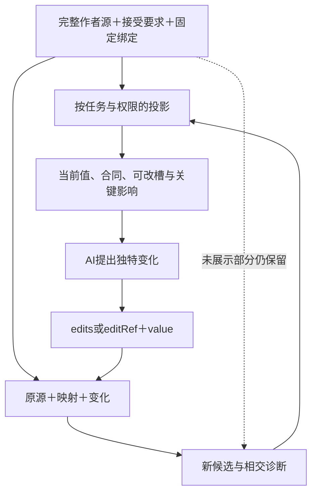

# 上下文取得与任务投影

> **阅读范围**：采用范围内的设计规范；实现状态另查未决 · [共同上下文](需求与作者上下文.md)。

本页内容

- [AI是可受委派的开发者，不自行扩大任务](#ai是可受委派的开发者不自行扩大任务)
- [一个任务相关视图，不复制四套上下文](#一个任务相关视图不复制四套上下文)
- [不让模型重新承担已由工具确定的决定](#不让模型重新承担已由工具确定的决定)
- [上下文生成与完整性边界](#上下文生成与完整性边界)
- [任务接受依据和组合诊断的最小投影](#任务接受依据和组合诊断的最小投影)
- [任务上下文怎样实际组装与逐步补全](#任务上下文怎样实际组装与逐步补全)
- [紧凑协议不省略的语义边界](#紧凑协议不省略的语义边界)
- [短输入不省略实际比较对象](#短输入不省略实际比较对象)
- [完整工程变化的最小决策视图](#完整工程变化的最小决策视图)
- [任务投影的读取编辑和回写协议](#任务投影的读取编辑和回写协议)
- [减少模型输入与减少作者维护是两项验收](#减少模型输入与减少作者维护是两项验收)
- [从全量工程信息取得具体任务上下文](#从全量工程信息取得具体任务上下文)

## AI是可受委派的开发者，不自行扩大任务

当前首期只有AI/脚本开发客户端；后续其他客户端仍共享工程对象和变更协议，不在首期实现人类编辑体验。AI可以组织需求、提出模型、创作算法、比较实现、执行获准检查并提交或应用有权的修改，不是只能填表或提建议。哪些选择能自动采纳由真实政策与委派决定，不由“这是AI”一概否定，也不由模型说“我是开发者”自动许可。真实观察、授权根和必要的独立复核各有来源；人也不能凭作者身份绕过这些边界。

每次工作先绑定目的、范围、禁止项、数据披露、允许的作用和预算。只设计时，AI 可以修改设计候选和交付文档；不能因为发现可运行原型有价值就自行实现。授权实现时可以修改候选源码，但不能顺便集成、发布或改权。任务目的的扩大需要真实用户请求或既有有效政策，不从模型自行生成的计划取得。

同一规则适用于所有入口和子代理，不能在 GUI 里受限而通过工具接口绕过。用户持有本地工程的管理权时可以选择退出某项管理范围；系统如实缩小保证，不以锁死原生资产维持控制。

## 一个任务相关视图，不复制四套上下文

### 图解：完整作者源与最小任务投影

展示省略不修改完整源；模型只创作真正差异，工具完成定位、展开与保持检查。

任务目标、作者源、候选、实际结果分别由原责任保存；面向模型的内容是对这些数据的一次**任务投影**，不是新增的作者源、语言或压缩IR。完整规范、完整源码可以按需保存，AI每次仅取得当前决定所需的合同、可修改位置与变化。内部分析仍然读取实际必要依赖，不以模型看到了多少字决定语义闭包。

三层明确分工：**作者源**决定程序和主动控制；**任务投影**决定本次展示与允许提出的局部变化；**编译IR**承载真实分析或降低所需的不变量。投影中的省略号、折叠实现和摘要没有资格覆盖未展示的作者内容。完整处理见[任务投影协议](#任务投影的读取编辑和回写协议)。

小函数原文已经是最短可用材料时直接给原文。大型模块先给相关公开合同和本次变化；只有诊断、改算法或接口依据不足时展开相交实现。不能只给一个不熟悉的名字再要求AI猜含义，也不把全部底层展开、锁和日志附在每次工具返回。

## 不让模型重新承担已由工具确定的决定

任务属于已经定义的筛选、分组、极值、窗口、状态或其他可组合关系时，先给该关系的准确调用与本次差异，不默认展开嵌套扫描或临时变量。需要修改定义实现时才展开算法。词汇增长按所用符号局部取得，不自动加载全部库；但陌生名字必须给准确合同，不能把短提示变成猜谜。一个短editRef只减少运输，长作者主体仍需单独审查；不得拿模型没看见的复杂度当作已经消除。

先从任务根与真实来源区分五种内容：作者明确差异、已经接受的定义/缺省、可确定推导、已委派实现选择、仍影响结果的开放项。AI只对需要创作或决定的部分工作；普通解析和展开在工具内完成。五种是结果解释角色，不是每个请求的五个必填数组。

正常响应以任务变化为中心：哪些含义改变，哪些来源保持，实际生成或作用到了哪里，剩余什么问题。库来源、目标绑定、类型或完整影响图可通过已有query投影展开。结果字段省略只减少重复展示，不能把重要的未知、违反或部分作用省掉。

成熟生态中的调用方可只写一个已有定义的参数变化；新算法作者在同一语言中写真正逻辑；新库贡献者维护完整合同与实现。角色可以在一个AI任务中变化，不要求普通使用者了解库全部内部，也不要求库作者的复杂工作从总成本中消失。

当原任务要求保持排序，而候选只改变库版本，AI需要看到排序合同是否变化；若没有变化，只看到相关采用和成本。若新的规则改变相同值的未来固定关系，也要显示来源差异。真正未解释的要求进入开放项，不能只凭短摘要给出全任务满足。

已有语义解释不因模型会话重启而重做；新的自然语言创作可能有不同候选，当前被接受的结果一旦固定便沿精确输入重建。模型记忆不是源库；所有“以前约定”在需要用于决定时要解析到已有记录或当前有权重作选择。

## 上下文生成与完整性边界

先从当前任务对象选择相关定义与直接边界，再沿该动作实际需要的依赖扩展。已知硬约束、负读取、范围查询、冲突与影响当前动作的未知必须保留。预算内优先展开决定性材料，其他范围保留继续查询方式与截断标记。

这里最多能检查“已声明读取合同中的必要项是否被提供及其修订是否有效”。不能证明模型理解了全部知识，不能证明整个开放世界不存在遗漏，也不能要求所有设计任务先消除全部未知。

预算不足时允许继续无关或可逆的设计，给出局部结果与未满足义务；需要该缺失事实的危险作用则不准入。安全未知、权限隐藏和不存在是不同结果。权限不允许公开存在性的对象不暴露具体名称、数量或可猜测摘要。

恢复会话时返回原目标、当前候选、发生变化的事实、失效的证据和待决动作。聊天摘要不是恢复权威，模型换了也不改变工作状态。参考句柄和缓存中的许可不能跨会话自动复活。

## 任务接受依据和组合诊断的最小投影

AI取得的是当前要改变的含义，不是所有实现备选和证明图。bootstrap/context在受信边界绑定任务目的、当前要求及候选；查询结果只展开被编辑对象、相交合同、未满足连接和可选后续动作。一个接口已经有明确输出保证时，下游不必默认读取其全部实现；保证太弱或证据不足，再定位性地下钻。

组合失败时的默认诊断包含四件事：哪条任务要求仍然有效；哪个生产者在哪个使用点提供了什么；消费者需要什么；有哪些在当前权限和目标内可行的修复。例：“增加16的结果可到271，但编码器只接收0至255；原任务规定饱和。请在该连接实现饱和，或提出明确目标变更。”不用先返回整棵IR，也不能只给`invalid`。

诊断可能包含受限信息。服务先检查披露权限，提供允许范围内的冲突与定位；不允许枚举的对象不通过反例或候选名称泄露。授权服务无法披露细节时仍保存内部可审计原因，由有权主体处理；不能为了模型自助而扩大其读取范围。

父任务分解时沿现有子任务委派携带要求引用和编辑范围。子代理可以提出新的实现与设计假设，不能以它自己的测试期望修改父任务的接受标准。拼接多个子候选时重新检查跨分支连接和共享约束，不以“每个代理都报告完成”合并绿色。

普通已知函数不新增一次强制query；声明或上下文能提供所需事实就直接处理。观察摘要更新但数值相同，只有消费相应来源/资格的AI说明需要刷新；上下文保留的引用不自动证明模型已经读过内容。模型、缓存或实现选择更换都不自动重置已消耗预算或任务范围。

## 任务上下文怎样实际组装与逐步补全

本节的C1—C5合并到下方[任务投影协议](#任务投影的读取编辑和回写协议)：固定任务与基础、取得实际决定边界、按权限形成可读可改视图、按预算分段、保留原源补充并回写。旧入口保留用于定位，不再维护第二份完整上下文算法。

每次继续应当新增相交事实、缩小一个未决点、产生精确候选，或者准确结束。无变化地反复读取、重新总结同一源不算进展。用户要求全量设计审查时仍需实际分段读取该范围；任务接口可短，不能代替完整规范审读。

## 紧凑协议不省略的语义边界

默认中立source由服务取得准确文法、类型和基础库；AI不需要复制整份类型树或先寻找全部能力。修改传base与差异，声明身份延续由共同映射处理；映射歧义只返回实际相交部分，不根据名字“猜对”后继续写。

拿到源检查通过、TS产物a1、Java产物a2时，AI收到的是不同主体的结果。工具应直接给出所需artifactRef与可披露诊断，不能要求AI从多个类似路径中猜“最后一个”；小产物直接返回正文，大产物才分页。目标尚缺不取消源设计，源检查通过也不授予作用。

契约写明、逻辑在假设下通过、目标案例实际通过和已写入文件是不同结论。AI可以继续修正实现或要求，但改变要求的权限不能由修复代码任务自动取得；后置条件失败也不能通过抹去先前外部作用解释成没有执行。

## 短输入不省略实际比较对象

普通源与已绑定函数无需重新查询整个能力目录。只在请求目标diff时以compareTo给出那一份真实父产物；其他预览不多带字段。工具返回实际未覆盖的嵌套模式、契约入口错误或目标策略缺项，AI修改相交作者源，不通过选择一份旧通过结果掩盖新失败。

服务固定正在处理的内容引用，AI不手填pin、证明消解记录或每个节点的身份。明确保存可以保留不完整草稿；上下文引用过期、不可读或被回收时返回真实原因，不暗换最新工程。六工具和任务目的不变，不把定向补充设计变成产品实现。

## 完整工程变化的最小决策视图

AI默认看到相交的作者源和合同，不是生成器私有计划。对[工程操作](../../领域/状态关系与流/事务与交付.md)，共同视图按四件事提供必要信息：这次业务含义改变了什么；哪些状态和记录必须共同成立；什么会在提交后独立发生；当前哪些实现/权限/证据不足。没有实际相交时不展开其余项，普通纯函数不读取运行协调手册。

原定义和绑定已经已知时，直接改源或差异，名称、版本、生成布局、稳定子身份由工具解析。改一个规则不要求AI重建整套状态机；确实改变原子域、目标或交付顺序时则不能只给局部文本假装影响有限。

任务上下文与源码中的actor不同：前者约束当前AI能做什么，后者由目标应用的可信身份创建。用户准许AI设计权限规则，不等于AI取得该规则代表的生产权限。仓库注释、事件负载、模型摘要、原生提供者自述都不能向任一层注入更高权威。

历史待办续做按原始业务事件和执行版本解释；新的AI会话不必阅读全部旧聊天，也不能把重新推理的方案当成旧操作的精确意图。需改变意图时产生新候选或有权迁移，不重贴旧ID。

## 任务投影的读取编辑和回写协议

任务投影由已有 query、候选、来源映射与语义增量承担，不新建 ContextIR、另一本简写源码或常驻压缩服务。展示数据可在内存中构造；缓存只在有复用收益时保存。任务投影不是把全源码压成自然语言后再反向猜回，而是**隐藏部分仍在原源，修改只针对已明确的槽或源范围**。

### 必要数据与默认处理

输入是当前任务目的、不可变作者基础S、所选语言与库绑定、当前披露许可、可用预算，以及该客户端本会话已经实际取得的内容。保存的映射M记录来源对象、槽位/语法范围、映射版本、可接受变化和必要检查。S和M由工具持有；AI不用重新发送其完整内容，M也不赋予授权。

输出默认由三个可缺省部分组成：本次需要理解的合同或局部源；确定的可编辑值及其定位；必须知道的变化、冲突或未决。一个枚举项可附短editRef，一个完整算法修改可直接附源码。仅有引用不使模型自动理解；首次相关合同要给内容，已取得且不变时只补差异。服务端“已经缓存”与模型“本会话已经读到”分开。

### P0至P7的正向算法

**P0 固定任务。** 取得当前S、请求目的与许可；确定此次是读、改参数、改算法、检查还是实际作用。无基础的新建程序直接接收完整小源，不凭空制造可编辑句柄。

**P1 找真实决定。** 从要改对象沿类型、库合同、公开输入输出与实际消费者找影响此次选择的条件。稳定库内部已由合格合同承担的细节不默认向AI展开；无法确定决定是否满足时，再读相交内部或交给有能力的方法。内部所需读集允许大于模型展示集，二者分别记录用途。

**P2 选择最小可用呈现。** 已知原文的唯一小修改用文本差异；已定位的标量/枚举用确切编辑槽；算法主体用原语言的紧凑源；接线用有限管脚；纯解释用有来源摘要。选择同时计入查询、回答、模式说明与后续修复成本，不以单次最短字符作为全部目标。

**P3 保留必须可见的区别。** 本次可能改变的顺序、误差、效果、权限请求和任务范围不能只显示一个含糊“优化”。已知但不宜披露的约束由服务检查，在允许范围内给可行动诊断；不能为了给更详解释泄露存在性、名称或秘密。不相交的底层结构保持折叠。

**P4 签发定位。** 对明确可编辑槽生成绑定S、对象、语义角色、映射修订、值域和编辑类型的句柄。句柄只说明在哪个基础上提出什么变化，不允许任意调用、执行代码或跳过当前读写许可。大对象仍用已有内容引用，不把字节base64化塞回提示。

**P5 处理输入。** 短值按描述符解码，不按代码解释；算法源按所属语言解析；结构请求按已有联合读取。先核完整输入，再降低成原semantic-change；不能因为短请求省去旧基础、作用域、共享约束或原要求检查。

**P6 回到唯一源。** 使用S及其未展示部分、M与本次Δ修改实际作者源；重新解析和绑定，检查允许的变化与保持范围。只形成新候选，不覆盖活动工作树。视图有遗漏不是删除授权；修改会扩大到公开客户时给出真实影响。

**P7 返回与结束。** 小修改返回新候选、原基础和语义差异；代码仅在请求时或判断必需时展开；运行状态准确保持未执行。源后续改变，旧视图不自动改指最新。可继续在仍可取得的旧快照上建分支，必须明确是哪个基础；要应用到当前树仍比较真实前像。过期且无法取得原源或映射时返回重新定位，不从摘要恢复缺失源。

### 可回写性与三个反例

设read(S,M)得到V，update(S,M,Δ)得到新候选S′。这只定义在该映射实际支持的变化内，不宣称任意自然语言摘要都有逆函数。空Δ返回原作者字节；有效Δ的回读必须显示所接受的新值及声明允许的规范化；被替换范围以外的作者内容保持，关联修改必须有明确生成/重构规则与可见影响。

**相同短句，不同基础。** 两个视图都显示`keep=first`，但一个来自项目A，另一个来自项目B，或绑定的排序合同不同。值相同不使句柄可互换；M与S必须区分。

**隐藏字段不是删除。** 只展示一个函数参数时，提交新值不清空同一文件的许可说明、其他函数和原注释。直接重写完整文件时则须取得对应源与明确写入范围，不能将投影作为完整文件提交。

**隐藏依赖变化。** 过滤函数名字未变，库的错误/排序合同改变。即使视图文字尚可压成同一行，分析和更新资格仍取决于实际库修订；缓存不能只使用显示文本摘要作为ActionKey。

### 冷启动、异常、成本与退出

没有任何上下文时，提供所选语言与工具的最小实际合同及当前任务所需符号；不传世界词表，不以模型训练知识自动代替刚升级的规则。模型或会话重置后，按真正需要补回内容；服务记录传输不声称知道模型理解。

读集完整但展示超预算时，先拆可独立决定的变化或扩展上下文能力；共同条件不能安全压入当前窗口时保留明确未决。代码语法错误可以按原草稿规则保存；失效定位、非法值、权限与映射不可用分别返回。故障不会改成使用最新默认或覆盖同名文件。

计量完整冷/暖轨迹：必要说明、查询、输入、返回、拒绝、重试、检查、恢复和重新定位；源码作者维护量、磁盘、内存、模型上下文四种体量分别报告。没有实际AI实验，不从短输入推断成功率。读取原源码更省时就直接读取；这个机制不强制所有任务使用抽象视图。

来源参照：LSP的代码动作允许先提供有限动作信息，再按请求解析较贵的编辑；此处只复用按需解出结果的组织方法。版本与能力协商仍须实际成立；LSP编辑不是SEC的语义保持和授权证明。[原始说明](https://github.com/microsoft/language-server-protocol/blob/gh-pages/_specifications/lsp/3.18/language/codeAction.md)。

## 减少模型输入与减少作者维护是两项验收

任务投影减少每轮读取和修改的冗余，不自动缩短第一次写出的程序。如果一个SEC作者模块仍重复原生代码、类型、事实表和同义契约，必须删并相同作者责任，不能仅将其藏到模型看不见的文件中。结构交换体与派生IR允许较长，独立必须维护的内容则逐项说明收益。

当前默认：可推导声明不重复录入；共享规则作为一个真实库定义维护；实例只写独特差异；暂未支持的高层算法仍可直接写中立源。没有规定的业务含义不能由压缩器补造；用户不承担所有内部分析注解；没有必要的边界不添加封装壳。公开独立要求与实际实现发生冲突时仍分别保留，不能以去重删掉要求。

直接使用相同成熟库的普通语言可能具有同样短的调用。SEC必须另外证明共享约束、跨产物和连续修改的收益，不能把它与故意不用库的低层展开作比较。当前不接受“未来生态会强”作为增加当下无收益必填项的理由；U019继续保留实际成本义务。

同等任务、同等库和相同保证下，一种作者形式若只增加独立录入或绕路而无对应收益，不把它强制为该任务默认。应修订那项表面、推断、库或组合规则，而不是以“文法已定”为由让作者承担额外负担。当前任务投影只解决已定义行为的相交交互，不能代替这项作者面裁决。

## 从全量工程信息取得具体任务上下文

[信息接入与检索](../../信息/接入检索与派生.md)为本章提供真实来源切片、版本、覆盖与当前可披露范围；ContextBundle仍是当前任务投影，不是工程全集。减少本次显示量不得删除仓库里的独立信息，也不得让未展示规则变成不适用。名称不明确先查对象/精确词与相关关系，语义相似仅生成候选；要改合同就读完整相关定义、错误、前提与消费者。

规则、来源、作者要求、推断和工具输出保留实际角色。回传与委派时不将受限来源的标题、命中数或关系邻接泄露给无权主体；相交撤权在下一受控返回边界复核，已送出的字节不能被下一步拒绝“撤回”。保存审查所需的公开输入/输出和来源即可，不默认采集全部对话或私密推理。
