# 规则装载与任务恢复

> **阅读范围**：采用范围内的设计规范；实现状态另查未决 · [共同上下文](需求与作者上下文.md)。

<details>
<summary>本页内容</summary>

- [任务启动的原则装载与动作检查](#任务启动的原则装载与动作检查)
- [接到继续设计时的自主工作协议](#接到继续设计时的自主工作协议)
- [语言与资料的主动维护边界](#语言与资料的主动维护边界)

</details>


## 任务启动的原则装载与动作检查

本协议的规范拥有者是本节。AGENTS只提供短入口，README只定位责任；要求正文和领域规范仍拥有完整含义。协议由当前任务执行者和相应宿主承担，不要求目标程序的每次函数调用读取本设计包，也不先建设规则数据库。

### 装载对象与最小任务状态

维护SEC设计文档时，启动范围包括[产品要求](../../产品/产品要求与工作约束.md)的全部条目及[根原则](../../产品/原则总纲与归属.md)的完整规则。先逐条判相交，再局部加载详细机制；不能只搜索“当前主题”就遗漏只设计、保全、清理、来源和权限这些跨主题要求。使用SEC开发另一个项目时，采用那个项目的实际要求和范围，不复制本设计的全量问题登记。

当前任务只保存一份工作状态：实际输入与规范版本、当前目的、允许及禁止动作、相交要求及条件、已取得的领域段落、未取得的必需内容、修改对象及待核消费者。它是既有任务上下文的投影，不是作者源、权限令牌或永久审计图。短摘要保留条件和例外，并指向完整原文；摘要从未取得过的部分不得填成“已核对”。

### L0至L6的实际过程

| 步骤 | 输入与动作 | 完成条件及下一步 |
|---|---|---|
| L0 固定任务 | 取得当前用户请求、平台边界、可访问包或工作区版本与当前决定 | 识别设计、实现、检查、运行和发布；技术提醒只触发比较，不转成采用或执行权限 |
| L1 全体筛查 | 完整取得要求与根原则，对每条判定适用、条件未激活、无关、冲突或缺信息 | “未读”不能归到无关；历史未取得另记覆盖范围，不要求用户重说当前已有内容 |
| L2 沿责任展开 | 读取机制拥有者、接口、消费者及对应来源记录，执行[来源R0—R7](../../依据/来源/设计依据与资料边界.md#研究结论的保存复用与失效协议)的相交判断 | 搜索片段只作定位；前提未变复用，动态采用或缺决定性事实才定向外查；不等用户点名 |
| L3 固定工作约束 | 合并可兼容条件，按根章处理真正冲突；记录当前采用与明确未决 | 硬要求不按加载顺序覆盖；一项不可判定不使所有无关设计停机 |
| L4 在动作点检查 | 候选前核原目标与改动；工具前核允许动作、当前目标、读写披露和必要前像 | 只设计不启动产品实验；真实执行端检查权限，提示文本和已读记录不是授权 |
| L5 在交接处恢复 | 新用户输入、模型或子任务交接、上下文压缩、规则版本变化时重新定位相交原文 | 同版本且仍实际可用内容可复用；无法确认就补读，不把摘要“必须遵守全部”当完整规则 |
| L6 在交付前核回 | 重新检查全体要求、实际差异、语言组合、消费者与来源归属；完成[文档交付检查](../../维护/组织修改与来源保全.md#交付前的约束与正文检查) | 已发现冲突当次修正；外查、继承与未取得分别报告，正常交付不复制整张研究/规则台账 |

完整规范可以长，装载可分批读取。提示预算不足时拆分当前工作单元、记录准确继续位置和已读范围；不缩小用户的原目标，不随机截掉否定条件、例外或未解决的约束。作用所需信息未取得时停止该作用；已经具备前提的其他设计可继续。

### 委派与长任务恢复

子任务接收明确目标、原始基础、可读写范围、相交约束原文或可取得的定位，以及所需交付。父任务的“只设计”不能在子任务中变成“编写并运行验证程序”。规则更新后，相关子任务的旧结果须重新判适用；无关结果不因另一个领域变化而全部作废。

子任务结果是实际产物、理由和开放问题，不是“完成”标签。父任务合并时复核跨文件接口、共同资源、作用域及源归属。多个代理共享同一遗漏时仍然是同一遗漏，不能按代理数量提高独立性。

上下文压缩或会话恢复时，恢复摘要只承载导航和当前状态：输入版本、目的、当前决定、已有成果、未完成和下一个位置。执行者再次取得当前完整要求与相交规则，不能借旧摘要撤销当前新消息。未保存的真实工作须明确交接，不能以一次总结冒充文件已写入。

### 规则变化与真实约束的生效边界

修改规则文件形成的是候选。它在同一次任务内不能自行扩大许可，也不能通过删掉验收条件让自己的结果通过。真正改变要求需有实际来源；修正错误工程原则需同时修拥有者和消费者，编号没有不可修改特权。

来源可读不等于来源可信。任务认可的规范可以指导设计，但网页、附件、仓库注释和下级AGENTS不得从数据通道提升为平台或用户授权。文件哈希可证明读的是哪个版本，不能证明模型已理解、记住或遵守。

**文档能规定读取与复核程序，不能独自保证任意模型永久遵守。** 当前方案将可机器判定的动作边界交给实际宿主，将语义一致性留给具名的审查责任；两类都有独立的采用与验证义务。没有安装实际约束网关时，不把本文称为已经强制执行的系统。

### 入口适配，不依赖某个客户端的偶然行为

有自动AGENTS加载的客户端，也必须核其工作目录、嵌套覆盖、大小上限和版本读取方式。没有自动加载的客户端，由启动调用显式提供AGENTS并执行L0—L2。文内链接不是自动递归装载指令；短路由的作用是告诉执行者还必须读哪些正文。

Codex官方说明其AGENTS发现与工作目录、覆盖文件及读取上限相关，规则链在会话启动时建立；故更新后的正文和子目录规则需在实际客户端确认重新取得。这里采用发现边界，不将本包更高优先级化，也不为全部客户端复制若干竞争规则文件。见[官方AGENTS规则](https://developers.openai.com/codex/guides/agents-md/)与[来源记录](../../依据/来源/设计依据与资料边界.md)。


## 接到继续设计时的自主工作协议

<a id="fig-constraint-load"></a>

### 图解：约束在长任务与委派中的恢复位置

这是文档执行者的工作协议，不注入目标函数。摘要提供定位，实际动作需要的条件必须真实取得。

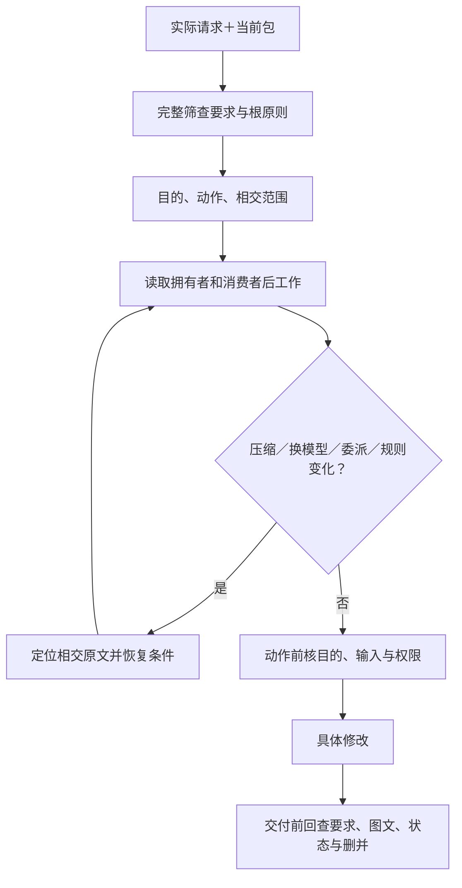
```mermaid
flowchart TB
 Req["实际请求＋当前包"] --> Read["完整筛查要求与根原则"]
 Read --> Scope["目的、动作、相交范围"]
 Scope --> Work["读取拥有者和消费者后工作"]
 Work --> Handoff{"压缩／换模型／委派／规则变化？"}
 Handoff -->|是| Restore["定位相交原文并恢复条件"]
 Restore --> Work
 Handoff -->|否| Gate["动作前核目的、输入与权限"]
 Gate --> Change["具体修改"]
 Change --> Review["交付前回查要求、图文、状态与删并"]
```

用户说“继续分析/优化”时，设计AI先读取本包AGENTS、当前范围、[目标到问题总览](../../状态/前沿与登记规则.md#目标到问题的总览)和[工作前沿](../../演进/实施/主线前沿与准入.md#问题优先级与当前可推进前沿)。随后从已知缺口与尚未验证的目标关系选择有因果依据的交付，不等待用户提供新的名词或故障例。

一次自主发现至少包括两条不同方向的检查：从目标正向推导必要动作/数据/接口；从产物、失败和现有机制反向追问目标与承担者。再对共同输入、版本、权限、资源、时间和恢复构造扰动，检查邻近机制是否有同构问题。用户指出一个class或资产问题时，除了修该点，还应检查公共/私有、库发行、目标表示和所有权等真实相交问题；不是无边界地遍历所有领域，也不是只把用户原句换成一条U记录。

可利用同一模型的不同审查角色，但它们不是独立证据来源。若调用了真实独立工具或研究者，才按真实来源说明独立性。每项新推断保留理由、最强反例与当前范围；有完整方案时改原规范，没有方案时先登记明确缺口和下一份设计。不把设计任务扩成运行验证。

上下文不足时，保留当前固定输入、已读范围、已作决定、开放边界与下一项引用，按主题继续读取；不将“读了标题”写成“核对全部规则”。新会话必须实际能取得当前包或持久来源；不能用文本承诺平台自动记住或在会话外持续执行。用户只需提供新目标、真实偏好或权限变化，不应作为发现常规机制遗漏的唯一来源。


## 语言与资料的主动维护边界

设计任务涉及语言机制时，先读[能力裁决与组合准入](../../作者/需求关系与能力边界.md#4-完整语言能力的当前裁决)，按实际共享绑定、类型、存储、控制、阶段与目标检查。用户提到while，不只加一个while；用户没有提到闭包、泛型或清理，也要沿真实交点检查它们。已经采用的规则无新反证不重选，未采用方案不因资料出现而进入产品。

全部参考采用同一来源协议。相交原始规范可能来自语言、系统、数学、库、工具或界面，不以名字熟悉与否决定是否登记。没有新增依赖的普通设计可只复用稳定来源；当前版本和实际能力断言仍需外部事实。只记录“已读”不能证明已理解或遵守；当前工作流不宣称会在会话结束后自行联网运行。

## SEC自身仓库开发的行为准入、工作身份与恢复

本节只规定 **SEC 自身仓库实施与自举** 怎样把本章的通用任务约束接到现有机器控制面；它不是所有使用 SEC 的目标工程都必须拥有的第二套 Work 系统，也不改变产品、作者、编译、验证和执行各自的规范拥有者。仓库现有 `WorkDecision`、`TaskCapsule`、`OperationReadPlan`、Skill applicability、Operation envelope 等名字只有真实代码消费者仍存在时才作为 self-hosting profile 的实现载体保留；迁移完成后可以换表示，不能反向要求 086 迁就旧载体。

<a id="engineering-behavior-routing"></a>
### 工程行为：共同规则、操作、Skill 与客户端指引

工程行为覆盖设计读取、任务选择、实现／重构、测试设计、验证、审查、提交、推送／集成、恢复和退出；不等于每项行为都需要一个 Skill。共同规则（Universal Policy）由产品要求、原则与本章拥有，`AGENTS.md`提供入口；确定性选择、身份、准入、证据和结算交回已有类型化 operation／领域 owner。只有无法由它们决定的有界判断才进入既有 Skill；客户端角色指引只约束该次角色，不成为另一套政策或作用许可。

| 行为与触发 | 读取／判断入口 | 实际结果与执行 owner |
|---|---|---|
| 新任务、恢复、范围或规则变化 | `AGENTS.md`与本章相交装载；已有同版完整读取可复用 | `dev:status`按下述源码检查点／正式工作分流取得所需观察与continuation；读取本身不产生active Work或Effect权 |
| 确有全仓审计要求或跨域缺陷 | [repository-audit](../../../.agents/skills/repository-audit/SKILL.md) | `audit`及Source Program的准确tree census；普通局部读取不冒称全仓覆盖 |
| 公共合同、所有权或生命周期需重算 | [architecture-evolution](../../../.agents/skills/architecture-evolution/SKILL.md)；系统性行为偏航交[heuristic-governance](../../../.agents/skills/heuristic-governance/SKILL.md) | 原规范／类型／状态owner裁决，按文档写入准入保留或修正文；不为纯实现变更制造新规范 |
| 已冻结scope内实现、修复、重构 | [worker-development](../../../.agents/skills/worker-development/SKILL.md) | Task Capsule／Operation Envelope限定纵切片；原producer/consumer及资源owner承担实现，不因Skill存在扩大写集 |
| Claim需要新case或oracle判断 | [test-design](../../../.agents/skills/test-design/SKILL.md) | requirement／assurance与CasePlan拥有测试语义；仅执行或重跑已有测试不重新设计oracle |
| 引入／替换外部能力、通用机制 | [external-capability-governance](../../../.agents/skills/external-capability-governance/SKILL.md) | 原能力台账与Provider owner分别承担采用、物化、凭证和实际作用；跨owner不自动扩大权限或新造work |
| 验证和证据复用 | 原selector与VerificationSession；需设计测试才进入test-design | `check`／`test`／`typecheck:verified`执行RequiredClosure；`typecheck`仅编辑反馈；已有PASS／确定性FAIL／in-flight按准确ActionKey复用／停止／join |
| 独立审查冻结候选 | [exact-head-review](../../../.agents/skills/exact-head-review/SKILL.md) | ReviewSubject绑定head/tree及required revisions；Role配置、报告标题与绿色测试不代签独立性或Gate |
| 分工及角色交回 | [task-delegation](../../../.agents/skills/task-delegation/SKILL.md) | 主线程保留集成与原任务责任；角色交回不等于用户任务完成，保留单写者和更窄scope |
| 提交、推送、合并、发布 | 原明确授权终态与当前准入；无需为每个命令新增Skill | `dev commit`／`commit:recover`拥有提交；远端传输、integration与`sec:closeout`各消费本身准入／读回；不得从Skill推导push／merge／release权 |
| 失败、取消、恢复及资源退出 | [failure-recovery](../../../.agents/skills/failure-recovery/SKILL.md)定位根因与恢复owner | 原operation、branch/worktree、generated-state及资源owner结算；`dev:continue`只是续作投影，不能签发新权限；未结算制品不能被通用清理删除 |

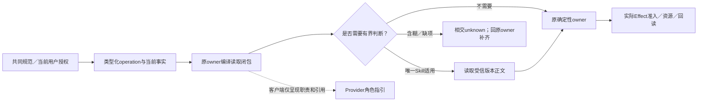
```mermaid
flowchart LR
  Rules["共同规范／当前用户授权"] --> Operation["类型化operation与当前事实"]
  Operation --> ReadPlan["原owner编译读取闭包"]
  ReadPlan --> Choice{"是否需要有界判断？"}
  Choice -->|不需要| Native["原确定性owner"]
  Choice -->|唯一Skill适用| Skill["读取受信版本正文"]
  Choice -->|含糊／缺项| Block["相交unknown；回原owner补齐"]
  Skill --> Native
  Native --> Admission["实际Effect准入／资源／回读"]
  ReadPlan -. "客户端仅呈现职责和引用" .-> Role["Provider角色指引"]
```

**采用与拒绝。** 采用共同规范→typed operation/envelope→零或一个相交Skill→客户端指引的责任方向，减少相互冲突的规则副本。拒绝一份“全行为万能Skill”、仅凭角色名加载全部Skill、把审查/提交/清理另建授权系统，以及从candidate指引签发自己的采纳资格。新事实改变scope或根假设时，重新选择相交判断；不以加载顺序或更长提示词替代裁决。

**当前接合与未完成范围。** 现有纯Skill evaluator只消费role、operation kind、候选及准确修订；目录覆盖只是候选提示。合法的`a0/design`在多个候选未收窄时保持ambiguous，零候选可为none-required，不造兜底Skill。生产hosted activation当前只接`worker/implement`；其他角色的元数据登记不证明同等生产准入已接通。`.codex/agents/*.toml`是当前客户端指引，未有生成器与实际装载证据时不称其为已生成、已验证的通用政策投影。适用性选择回执不证明正文已读取、理解或被Provider强制；不能补造ReadReceipt。

**候选隔离与复核。** 修改Skill、其操作owner或Provider指引时，候选内容仅是被审查对象，沿既有quarantine使用受信修订。路径分类无法证明`.codex/`文件永不包含指令：`config.toml`可直接携带developer instructions，也可引用角色配置；即使当前只有普通设置，仍保守纳入该命名空间的启发式路由与候选隔离。这不将配置提升为Skill authority，也不修改其实际sandbox设置。命名空间分类不证明已取得配置引用的完整闭包；指向域外文件的配置引用必须由原读取／装载owner绑定受信来源后才能消费，未知引用不能按普通文件默认取得指令资格。当前没有生产装载闭包证明时如实保留该缺口，不为本次分类添加第二配置解析器。对应有限检查位于[Skill合同测试](../../../tests/contract/agent-skills.test.ts)、[适用性测试](../../../tests/unit/skill-applicability-decision.test.ts)与agent runtime入口测试；它们分别检验路由、选择和真实入口，不证明所有工程行为都已自动执行。主分支前进后撤销旧代作用资格，已有Review/Evidence保持原绑定并由原owner判断失效和复用，不全部销毁也不自动升为新代授权。

### 事实、决定、计划、授权和完成必须分层

SEC 自身开发的一次机器任务按下列信息组合，不允许任何一层替代另一层：

| 输入或载体 | 可以决定 | 不能决定 |
|---|---|---|
| 用户目标、non-goal 与明确授权 | 本任务要达到什么、作用上限 | 当前仓库事实、实现已经正确 |
| live Git／工作区／Provider 观察 | 当前 base/head/tree、dirty、能力与外部状态 | 产品目标、设计采用、完成 |
| `WorkDecision` | 当前 ordinary work 的合法选择与优先级 | 设计真值、Effect 权限、PASS |
| `TaskCapsule` | 纯任务规划内容和需携带的稳定引用 | Scope、写权、实现完成 |
| `OperationReadPlan` | 本次行动所需的最小完整读取闭包 | 修改许可、事实 owner 的含义 |
| Skill applicability | 零或一个当前仍不可机器化的有界判断程序 | 事实、决定、权限、Evidence |
| Operation envelope | actor、role、operation、subject、预算与禁止作用的上界 | 新增父任务没有的能力 |
| Effect／Provider 准入 | 某次真实作用是否可以开始 | 产品要求和设计本身 |
| settlement／readback／独立检查 | 实际发生了什么、相应 Claim 是否成立 | 反向改写原目标 |

因此仓库行为准入可以表示为同一批现行 owner 的交集，而不是一个新总控对象：

```text
AllowedRepositoryAction =
  accepted task authorization
  ∩ current live facts
  ∩ applicable 086 design constraints
  ∩ selected work identity when selection is required
  ∩ operation envelope
  ∩ effect/capability admission when an Effect is required
  ∩ current resource and safety bounds
```

任一相交项为 unknown、stale、conflicted 或明确禁止时，只阻断依赖它的动作。Issue、PR、branch、聊天、rolling projection、测试绿色、commit 或 Agent 自述都不能补足缺失交集。当前实现如果以 `MainHealth = ordinary | repair | locked` 之类的机器状态先行约束工作选择，该状态只负责它已有的控制面消费者；稳定 086 文档不保存某一时刻的 current main，也不把该枚举推广成所有项目的产品状态模型。

已经明确授权的仓库终态形成持续到 settlement 与 readback 的作用义务，不能在本地验证、commit 或某条传输路径失败后退回等待用户重复下令。若 Provider 以保护规则拒绝直接更新默认分支，而同一内容可经任务分支与 PR 到达原授权终态，则创建最小任务分支、推送、创建 PR、等待必需检查并按既有合并合同收口，属于该已授权作用的传输闭包；路径切换不得扩大内容、受众、权限或发布范围。只有新路径需要 force、修改保护规则、额外发布或其他超出原作用上限的效果时，才阻断该新增效果并请求相应授权。

<a id="source-checkpoint-publication"></a>
### 独立源码检查点与正式采用分流

独立源码检查点保存已经明确授权、可审查的准确源码，不声明正式工作激活、验证通过或产品采用。其授权与作用边界是固定仓库、base／必要前像、唯一writer、完整owned paths及准确非默认分支；提交与推送分别消费当前用户授权及原Effect owner的准入。**正式工作选择、active Work Package／operation、MainHealth、完整Gate及共享控制投影不是这条源码发布路径的前置。**缺失这些结果不阻断独立源码检查点，也不因此补签或伪造它们。反之，本地Git、提交规范化、所用传输Provider或真实凭证／保护拒绝仍只由原owner处理，不能借分流绕过。

`dev:status -- --source-checkpoint --base <exact-sha> --expected-head <exact-sha> --owned-path <exact-path>`是现有状态入口的独立只读模式，可重复给出准确owned path；它不读取formal Work或MainHealth，也不调用GitHub观察来决定本地源码是否可以进入下一owner。它读取固定base的仓库／默认分支身份与Git源码事实，核base ancestry、expected HEAD、非默认本地ref，以及提交差异、index、工作树和untracked的完整路径集（rename/copy包含两端），并重复观察以暴露漂移。参数是待核scope，输出是观察而非授权；路径匹配也不能证明dirty字节属于调用者。唯一writer、完整前像及dirty归属必须在原任务与实际写入边界核实。输入不完整、对象未知、非祖先base、HEAD漂移、未归属路径、默认分支或共享active／rolling／Work Package投影变更均返回阻断或观察失败，不以未观测当通过。

源码稳定后，由既有`development.commit` owner冻结并复验准确parent、ref、index/tree，消费canonical normalization与提交Effect；未完成原生Git操作、未知提交／推送结果和未结journal仍由原owner恢复，不由status提前判为已结算。取得exact head/tree独立源码审查后，在已授权的准确分支进行正常传输并读回远端ref及内容。默认分支更新、保护修改、force、额外发布、凭证设置都不属于源码检查点。会触发hosted检查的发布仍遵守已有证据预算；push成功只证明源码入库，保留未验证项。

正式activation、Work Package freeze、Gate、adoption与merge继续走原正式`dev:status`、工作选择、Scope/Effect和受信证据入口；检查点的status、commit、Review或远端存在不成为正式资格。集成owner在实际base与窗口就绪后生成共享投影，核当前main delta相交闭包，并复用仍有效的源码与focused证据；旧审查和Gate不得冒充新组合树的通过。

选择这条分流是因为源码保全／审查运输与正式采用具有不同结果及前置；强制先恢复完整控制面会让已授权修复被它正在修复的依赖锁住。保留原提交和传输owner比新增发布授权registry更小，也避免第二writer。独立性无法成立、scope变更或正式作用被请求时，返回相交原owner重算，不扩大检查点资格。这条status模式只实现观察与路由，不声称用户授权、语义审查或所有宿主API已经由机器统一强制。

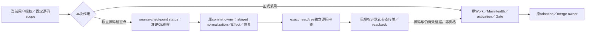
```mermaid
flowchart LR
  Task["当前用户授权／固定源码scope"] --> Route{"本次作用"}
  Route -->|独立源码检查点| Local["source-checkpoint status：准确Git观察"]
  Local --> Commit["原commit owner：staged normalization／Effect／恢复"]
  Commit --> Review["exact head/tree独立源码审查"]
  Review --> Push["已授权非默认分支传输／readback"]
  Route -->|正式采用| Formal["原Work／MainHealth／activation／Gate"]
  Push -. "源码与仍有效证据，非资格" .-> Formal
  Formal --> Adopt["原adoption／merge owner"]
```

本仓库 `development.commit` 只拥有独立单父提交，不拥有 Git merge、cherry-pick、revert 或 rebase 的续跑与结算。本仓库 candidate owner 在冻结 index 前以及 journal/object/ref 作用前，以 worktree-specific Git directory 的原生 no-follow 观察拒绝未完成操作状态；两次观察消费同一个判定，不用 index 未变代理操作已结束。原生 Git 操作必须由其原入口完成或明确退出；文件树相同不能证明 ancestry 已合入，不能把 staged merge tree 包装成单父提交后宣称合并完成。历史消息文件和 `ORIG_HEAD` 不单独构成活动操作。

开发提交 journal 退役必须同时比较准确字节和物理 FileId，并在原生删除作用前重新核验；进程内 mutation lease 不能代替这个比较。Windows 的保留只读句柄以 `share-read` 排除写入与删除，因此不能在该句柄仍存活时另开删除句柄：journal owner 先释放观察句柄，物理删除 owner 再用同一受保留父目录约束的可读删除句柄完成字节与 FileId 栅栏和删除回读；该 CAS 路径不得为取得删除权先投影文件 ACL。删除作用前的分享冲突或内容/身份漂移保留 journal；作用后的缺席回读或父目录 flush 失败属于未知结算，必须按原 operation 重新观察，不能宣称 journal 必然仍在或重新执行删除。不把盲目重试、裸路径删除或放宽分享模式作为恢复。Linux 的 `unlinkat` 只删除名字，现有能力不能在非合作并发换名/写入下签发准确字节 CAS，因此当前退役返回 typed capability-unavailable 并保留 journal，直至原生命名空间与写入排他合同具备；这不是跨平台完成。此接合仅说明当前自举 journal 的安全边界；更大范围的恢复与状态所有权演进仍由相交唯一 owner 重算，不从该实现反推产品通用事务规则。

该 Linux 缺口是未完成的迁移义务，不是可长期保留的正常降级：每个 ref 的 journal 有有限尝试上限，无法退役会确定性耗尽写入能力。目标协议由 `development.commit` 独占 journal 语义，以每个 attempt 一个私有 Git ref 指向不可变 canonical blob；Git Provider 在原 operation 授权下提供精确旧 OID 的创建、更新、删除和持久读回，不能把仅检查后的 `unlinkat`、进程锁或加大上限当作替代。旧文件 journal 先只读发现与逐 attempt 分类；迁移必须绑定原字节、物理身份、目标 blob/ref 和恢复切点，未结算或无法准确退役的旧文件保留并报告 typed blocker，不让它成为第二个活动 writer。新协议未通过受信 Provider、Linux 故障切点及旧代际迁移验证前，现行文件协议和 capability-unavailable 结果不变。

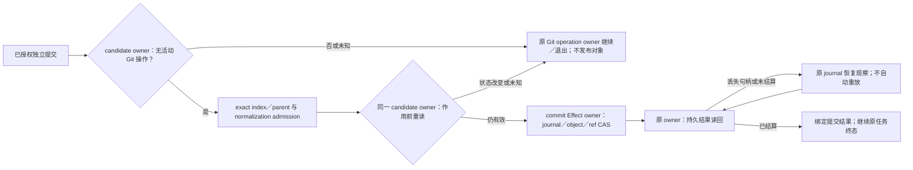
```mermaid
flowchart LR
  Request["已授权独立提交"] --> Preflight{"candidate owner：无活动 Git 操作？"}
  Preflight -->|否或未知| Original["原 Git operation owner 继续／退出；不发布对象"]
  Preflight -->|是| Frozen["exact index／parent 与 normalization admission"]
  Frozen --> Fence{"同一 candidate owner：作用前重读"}
  Fence -->|状态改变或未知| Original
  Fence -->|仍有效| Effect["commit Effect owner：journal／object／ref CAS"]
  Effect --> Readback["原 owner：持久结果读回"]
  Readback -->|丢失句柄或未结算| Recovery["原 journal 恢复观察；不自动重放"]
  Recovery --> Readback
  Readback -->|已结算| Terminal["绑定提交结果；继续原任务终态"]
```

默认分支身份、仓库质量证据和本机执行能力必须分别按所证明的对象消费。默认分支的准确 SHA/tree 不表示检查通过；注册的仓库检查结果不表示本机容器可用；本机容器的运行回执也不能替代仓库检查。未被某动作要求的本机能力不能因观察失败而否决该动作。需要容器、宿主文件或服务的操作仍须取得对应能力并验证物理身份，不能借文档操作获准而跳过这些条件。

必要证据缺失时，恢复入口负责请求或加入同一准确对象的证据生产，并回读实际结果；请求本身不签发健康状态。修复准入机制自身的工作不得要求该机制先恢复正常，应保留受明确授权、有界修改、独立审查和结果回读约束的恢复路径。该路径只覆盖已证实的失效依赖，不能将未完成的产品交付连带判为通过。

<a id="github-credential-transport-decision"></a>
### GitHub 凭证与异步传输：采用、拒绝与平台边界

仓库状态、开发 runner 与受信 closeout 入口可通过 `--github-credential-store <绝对目录>` 显式选择当前操作工作树之外的 GitHub CLI 私有配置资源；未选择时保持标准凭证来源。选择只绑定资源，不扩大 GitHub 权限或替代工作准入。凭证 owner 不从 ambient `GH_CONFIG_DIR`、HOME、XDG 或普通 token 变量取得该绑定；Linux 标准位置从有效 OS 账户查询，显式位置以 no-follow 目录身份、当前用户所有权和私有访问检查接入。显式后端当前要求 Linux 目录模式 `0700`，已有 `config.yml`、`hosts.yml` 为同用户、单链接的普通 `0600` 文件；不读取配置内容来签发目录资格。固定 token 读取仍只准入 repository-maintenance 的既有 Actions 身份；Verification session 传输另准入准确的 compiler-pr-validation／repository_dispatch 与 merge-gate／workflow_run 身份，核对 github.com、仓库、main ref、workflow SHA、run 与 attempt，且只作凭证来源准入，不代替原 CI owner 的 live run、actor 与 Effect 授权核验。固定 token 读取与同一操作内的 Verification session HTTP 传输共同消费该资源绑定；只有固定 `gh auth token` 凭证子进程取得该保留目录，HTTP 请求通过原类型化 GitHub API session 消费最小凭证，仓库身份与凭证资源身份分别绑定，读取前后重新核验；fresh-process handoff 必须重新准入同一物理身份，不能仅重用路径或继承环境。回调失败保持原错误与结算责任，作用开始后的资源漂移属于 settlement 未决，不能标成可安全重放的前置拒绝。当前 Windows 显式私有配置后端返回 `unsupported-platform`，标准 Windows 认证不受影响；具有私有读取权限证明的后端才能扩展同一合同，写者可信不能代签凭证保密。凭证的保存、撤销和退役仍由已授权的原生 GitHub CLI 及用户拥有，秘密不进入工作树、普通缓存、日志或交付制品。

这里的共同绑定只复用[凭证生命周期](../../运行/权限与资源管理.md#密钥秘密凭证与身份会话生命周期)与[执行准入／结算](../../运行/权限与资源管理.md#准入分配执行与结算的正向协议)，不创建新的权限签发者。Verification session 的远端读取、证据制品下载和 hosted wake-up dispatch 保持不同的实际作用类别，分别绑定准确 repository、固定 GitHub endpoint、所需操作授权及输入／输出／期限预算；能取得凭证不表示可以派发验证，也不表示制品已经可信。返回数据仍由各观察与 Evidence owner 核对来源、对象和完整性。无显式选择时保留标准来源合同；显式选择失败不能回退到 ambient token、其他配置目录或更宽 Provider。

调用方必须等待所有仍使用该绑定的异步操作及[进程资源结算](../../运行/发布运行与资源生命周期.md#进程树端口浏览器容器与数据库资源)，再释放所拥有的目录和可执行资源；请求返回、Promise 拒绝或直接子进程退出均不代签整项资源已结算。回调错误不能跳过最终身份／私有性重验或释放尝试，多个独立失败各保留其责任，公开诊断不泄露秘密。fresh-process 恢复携带显式选择及预期物理身份，在新进程重新准入；该交接不携带秘密，不产生外部维护者资格，也不将旧 Work／验证结论自动提升为新代次 authority。

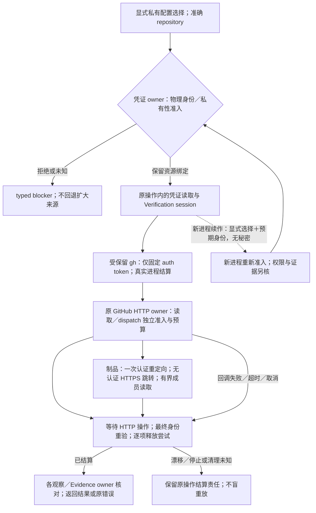
```mermaid
flowchart TD
  Select["显式私有配置选择；准确 repository"] --> Admit{"凭证 owner：物理身份／私有性准入"}
  Admit -->|拒绝或未知| Block["typed blocker；不回退扩大来源"]
  Admit -->|保留资源绑定| Scope["原操作内的凭证读取与 Verification session"]
  Scope --> Token["受保留 gh：仅固定 auth token；真实进程结算"]
  Token --> Request["原 GitHub HTTP owner：读取／dispatch 独立准入与预算"]
  Request --> Artifact["制品：一次认证重定向；无认证 HTTPS 跳转；有界成员读取"]
  Request --> Settle["等待 HTTP 操作；最终身份重验；逐项释放尝试"]
  Artifact --> Settle
  Request -->|回调失败／超时／取消| Settle
  Settle -->|已结算| Result["各观察／Evidence owner 核对；返回结果或原错误"]
  Settle -->|漂移／停止或清理未知| Pending["保留原操作结算责任；不盲重放"]
  Scope -. "新进程续作：显式选择＋预期身份，无秘密" .-> Readmit["新进程重新准入；权限与证据另核"]
  Readmit --> Admit
```


#### 为什么采用这一凭证方案

本项是仓库接合层对[REQ021](../../产品/产品要求与工作约束.md#req021)、[REQ028](../../产品/产品要求与工作约束.md#req028)及[组合保证](../../决策/设计理由-约束与演进.md#d63-组合保证显式检查边界而非叠加绿色)的采用：保持准确主体、最小披露、异步进展和资源结算，不由凭证取得改变作用权限。

| 状态 | 方案与理由 | 复核位置与重开条件 |
|---|---|---|
| 采用 | 固定 token 获取保留异步、受保留的 `gh auth token` 进程；Verification session 观察与 dispatch 扩展原类型化 GitHub HTTP operation owner，使用封闭 query／REST 操作、准确repository、独立read／dispatch作用与预算，避免第二网络执行器 | [HTTP验证测试](../../../tests/unit/github-api-verification.test.ts)、[operation session测试](../../../tests/unit/github-api-operation-session.test.ts)与[凭证测试](../../../tests/unit/github-api-credential.test.ts)；新增操作、消费者或取消路径时重核闭包 |
| 拒绝作为网络后端 | 将全部 Verification 网络请求迁入精简环境的 retained gh 子进程。凭证命令可运行不证明相同隔离环境中的API网络可达；继承全部环境或代理秘密来弥补不满足最小披露。保留合格的固定token获取，网络复用原HTTP owner | 网络环境差异是可检验反例；能读取viewer或某个PR只证明相应请求，不代表完整closeout、dispatch或正式Gate已成立 |
| 采用 | 制品先在认证API取得唯一允许重定向，再通过准入的HTTPS无认证请求读取；重验id／name／run／size／hash，使用锁定yauzl的lazy exact-member读取，不写盘解压 | [制品与重定向反例](../../../tests/unit/github-api-verification.test.ts)覆盖来源、字节预算和成员边界；拒绝跟随任意多跳、转发Authorization或另写ZIP解析器。锁定版本与依赖许可由包输入承担 |
| 拒绝 | 另建同步 spawn 路径或用 Atomics 阻塞等待 Promise；前者产生不同生命周期／凭证规则，后者阻塞同一事件循环所需的异步进展。把整个调用链改为可等待，而非伪造同步完成 | 相交调用者必须等待观察、分页、制品与 dispatch 结果；不以类型断言或未等待的 Promise 数组代签结算 |
| 采用 | Linux 标准 home 从有效 OS 账户原生查询取得；环境中的 HOME／USER／LOGNAME 不拥有账户事实 | [启动前污染与原生查询失败测试](../../../tests/unit/linux-user-home.test.ts)覆盖 Bun 环境值影响及缺记录、非法指针／编码等拒绝分支；宿主 ABI 或运行时改变时重新验证 |
| 拒绝 | 直接信任 ambient HOME、GH_CONFIG_DIR、XDG 或普通 token；显式配置选择失败后切换来源 | 环境值不是资源绑定或授权；[私有配置测试](../../../tests/unit/github-credential-store.test.ts)核身份、私有性、交接及失败结算 |
| 有界采用／平台未满足 | Linux 显式私有目录只在上述身份与读取私有性条件成立时使用；Windows 显式后端仍拒绝 | 不能用 writer ACL 证明秘密不可被其他主体读取；只有具备 reader 私有性证明及同等恢复测试后才能采用 Windows 后端，标准 Windows 认证不因此撤销 |

这里的“采用”指机制决定，链接指相交验证入口，不表示某个候选已经通过全部测试、合入或发布；验证结论仍绑定其准确树与平台。

<a id="repository-local-verification-placement"></a>
### 验证责任与运行位置分离：本地优先及旧拓扑退出

仓库验证默认在本次明确选定的本地计算机执行；“本地”相对于调用者选择的执行环境，不等于某位用户的桌面或特定操作系统。验证要求及[运行位置与阶段合同](../../运行/验收/会话集成与结果复用.md#21-验证义务运行位置和作用阶段)由原 `VerificationSession`、Action 及其证据拥有者确定，运行位置由组合入口明确选择；共享准备函数不得用缺省参数偷偷选为 GitHub Actions。本地准备、执行、发布与合并是不同作用阶段，选择本地不新增发布或合并权限。

**采用的最小部署是一个本地协调入口，加上按所选 Action 实际需要创建和结算的临时执行边界。** 控制作用、独立验收和候选执行是权限及证据责任，不是三台常驻机器、三个注册 runner 或三个必建服务。同一计算机可以按顺序承担这些步骤；共享物理宿主不允许候选取得协调者的凭证、写权限或结果签发能力，也不消除方法真正需要的独立来源。是否必须新进程、只读快照、隔离命名空间或独立宿主，按实际威胁、方法和可强制能力决定，不按角色名推定。

| 原拥有者 | 本地入口必须消费的义务 | 不能从运行位置推得的结论 |
|---|---|---|
| Git、工作范围与 Session | 准确 base/head/tree、前像、有效 scope、当前工作及所选 Action；准备只产生准确准备结果 | 当前目录、分支名或本机权限不授予采用和合并权 |
| 工具链与物理执行 | 实际可执行映像、依赖代际、显式环境、资源与时间预算、取消和全部子进程终态 | 已安装某命令不证明它是受信版本或可安全复用旧结果 |
| 仓库观察 | 在需要严格零写的阶段保持覆盖完整、连续且可结算的物理观察能力；由平台选择返回实际 provider binding | Linux/Windows 字样、事件零计数和前后 hash 相同均不签发严格保证 |
| 源码分析与候选执行隔离 | 按方法固定读取域、禁止修改域、凭证不可达、网络及资源限制，并读取真实执行边界和清理结果 | 普通 `spawn`、私有路径或 chmod 不能冒充不可绕过的隔离 |
| 保证、审查与集成 | 原生产者的准确 Evidence、必要独立审查、MainHealth 及预期主体作用前重验 | 本地测试绿色或远端 workflow 绿色均不能独自代签完整 Gate |

正常顺序为：选择运行位置与准确主体；由原准备 owner 读取事实并编译缺失/陈旧的 Action；为每项实际需求解析并准入宿主能力；复用、执行或 join；由各资源 owner 结算并回读；最后只进入当前授权的发布或集成阶段。准备命令不得为取得“可执行”状态而运行候选、启动沙箱、发布状态或合并。编辑反馈维持其原有限范围，不因为从正式本地入口旁边启动就取得受信资格。

远端恢复协调者代表原人类授权主体产生 terminal Session 时，实际 producer、transport actor 与 Scope issuer 分别保持真实身份：恢复协调者的 bot run/attempt 和实际权限不能被改写成人类，也不从 Scope issuer 继承权限。原直接人类产物沿原来源及当前权限合同验真；受委托的恢复产物使用原 Session artifact owner 的有限独立解释，完整绑定恢复信号、原请求、Scope、Session 与 Action closure，并将这些关系纳入制品完整性域。解释选择和摘要只核形状与关系，不签发委托或作用资格；新含义不能作为可忽略字段塞入旧载体。读写及退役方向遵守[授权与证据载体的版本解释](../../演进/兼容迁移与退役.md#authority-bearing-format-migration)。

受委托产物的真实消费者由原 native 来源 owner 重新核验准确的生产 run/attempt、固定 job、finalize/upload 阶段、受信 workflow/base、Actions App 与实际 actor，并沿保存的原因独立回读 emitter、已完成 Action 的 terminal/resolution、原 parent archive/request 及人类当前权限。资格绑定准确制品字节、实际 producer 和该原因，不由 caller JSON、人类姓名、权限字段或旧进程对象恢复；历史读取也不能借用当前事件文件冒认产物来源。缺档、过期、身份漂移或授权依据未知时保留相交 unknown 和原恢复责任。派发恢复信号只唤醒原 Action；执行仍由 child 独立重建当前准入并核 claim/ticket。HTTP 已进入而结果未知时，不因未见 provider 状态、reducer 状态变化或换进程而推定未发送并自动重发；真实 carrier/outcome 的 join 与此前 HTTP 是否结算分别声明。

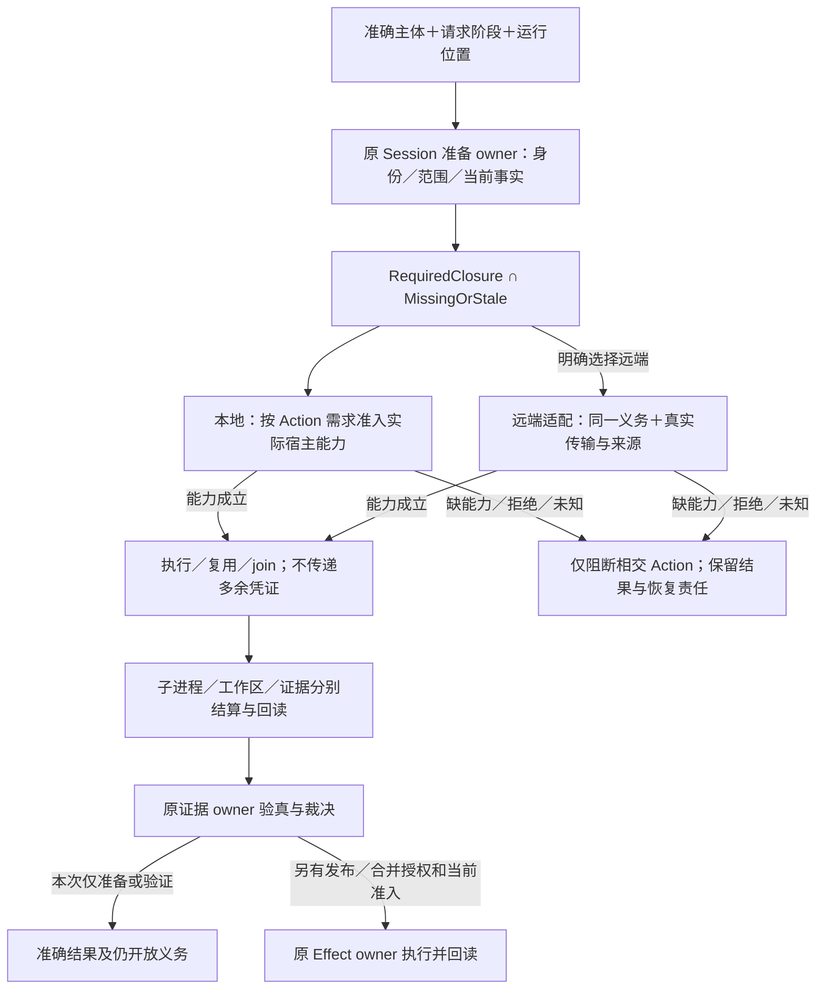
```mermaid
flowchart TB
  Request["准确主体＋请求阶段＋运行位置"] --> Prepare["原 Session 准备 owner：身份／范围／当前事实"]
  Prepare --> Plan["RequiredClosure ∩ MissingOrStale"]
  Plan --> Local["本地：按 Action 需求准入实际宿主能力"]
  Plan -->|明确选择远端| Remote["远端适配：同一义务＋真实传输与来源"]
  Local -->|能力成立| Execute["执行／复用／join；不传递多余凭证"]
  Remote -->|能力成立| Execute
  Local -->|缺能力／拒绝／未知| Blocked["仅阻断相交 Action；保留结果与恢复责任"]
  Remote -->|缺能力／拒绝／未知| Blocked
  Execute --> Settle["子进程／工作区／证据分别结算与回读"]
  Settle --> Assess["原证据 owner 验真与裁决"]
  Assess -->|本次仅准备或验证| Result["准确结果及仍开放义务"]
  Assess -->|另有发布／合并授权和当前准入| Effect["原 Effect owner 执行并回读"]
```

仓库 `verification-session prepare --pr <n> --request-output <path>` 缺省选择本地，显式 `--execution local` 同义；原准备 owner 固定准确候选并生成准备请求，仅写调用者指定的输出，不执行验证或合并。`--execution hosted` 才选择已实现的远端准备路径。既有 hosted `status`／`resume` 必须明确选择 `--execution hosted`。本地 `status`／`resume` 只投影保存请求和原 owner 已有的持久验证记录，不创建运行状态、不访问远端或启动验证；记录不存在只能表示未观察到，已保存记录只说明绑定对象的历史计算结果，不能证明当前候选、活的资格或集成许可。`resume` 返回下一步准确入口，明确本次尚未执行，不能把本地请求交给 hosted reader。本地准备输出使用独立 `sec-verification-session-local-preparation-v1` envelope，固定 `executionPlacement: local` 与 `authorityStage: preparation-only`；hosted reader 在取得运行状态、Git、凭据或远端 Provider 前拒绝该 envelope，显式 hosted 参数不能覆盖已保存的本地放置。缺 placement 字段的旧准确 hosted schema 只在显式 hosted 入口保持原恢复语义，不由缺字段推导远端选择；本地输出不得使用该旧外层 schema。请求输出的 `preparation-only` 与 `not-run` 范围必须保留。已获准的本地验证从原 `sec:closeout --verification-only --request <path>` 进入；该入口只接受本地准备 envelope，重新观察准确候选并准备当前 Session/Action 环境，逐项比较保存请求的全部身份与摘要后才调用原 SourceTransition。验证沿用原租约、当前主体重读、尝试／计算／采纳日志与资源结算，在持久 artifact 回读后结束，不签发集成许可、不发布远端状态或合并；缺少实际能力保留准确失败及已完成记录。需要作者决定时以同一入口显式提供准确 `--test-author-comment` 并重新核验，保存请求不能代替当前决定。完整集成仍由原 `sec:closeout --pr <n>` 单独选择，保留原恢复与作用准入；`--request` 不得与完整 closeout 混用，不能从准备、只读续接或验证选择推得完整 closeout 授权。

本地能力缺失返回准确的 `unsupported`、`unavailable` 或未决，不检查远端 runner 是否在线来代替本地事实，不隐式 dispatch、轮询或切换机器。远端是显式选择的执行后端；所需 GitHub API 读取、源码/制品运输和最终仓库作用分别按实际请求准入，不要求先注册远端执行器才能做独立本地分析。此前已经开始的远端操作按其原主体、来源和回执继续恢复；不能将本地请求误交给 hosted resume，也不能因新默认值不同而丢失旧操作。

固定 `control/trusted/sut` 三实例新建拓扑退出支持范围。旧 `start` 仅保留无作用的明确退役响应，不再申请 registration token、创建容器或发布初始生命周期；既有 `status` 保持只读，`recover` 与 `stop` 保持原准确 ID、租约、当前权限和终态回读，不能以退役为名删除未知或忙碌资源。已经提交的 routing intent 可以由原恢复 owner 结算，未提交的 provisioning 继续按其原退出规则处理；这不重新开放新建。旧镜像、依赖和制品只在真实消费者与恢复责任清零且取得相应授权后退役。

选择这一结构是为了去掉无必要的常驻拓扑和远程前置，同时保留原方法需要的保证。拒绝把三角色合并为一个持有所有凭证并直接运行候选的普通进程，也拒绝删掉 hosted provider revision 中的角色字样来伪称旧证据已适用于新边界。旧 Action、Session、镜像和恢复状态保留原身份解释；新的执行边界必须有自己的真实 provider 身份，不能靠重命名复用资格。本地受信镜像与工具链的最终供给应只含实际所需组件，不以 Actions runner 注册、监听器或三实例生命周期为依赖；已采用固定镜像的字节在新供给真实物化、验真并迁移前保持原身份，不编造替代 digest。

<a id="repository-observation-runtime-decisions"></a>
### 仓库观察与测试进程：采用边界、反例与待验证方案

本项消费[观察覆盖 D65](../../决策/设计理由-约束与演进.md#d65-观察切面按一致性和覆盖使用)和[物理假设 D66](../../决策/设计理由-约束与演进.md#d66-保证依赖模型工具与物理假设)。严格零写要求区分“未观察到事件”“当前内容相同”和“期间没有写入”；执行器则必须同时保持准确程序映像、每文件隔离、资源预算及真实停止，不因宿主限制降低原保证。平台中立的观察 owner 只选择和保留真实后端，所有消费方使用该后端签发的 requirement、contract 与 provider identity；Windows 后端的有效身份不因接口解耦重签，未实现的平台没有默认降级后端。

| 状态 | 方案与裁决理由 | 仍需证明的边界 |
|---|---|---|
| 拒绝作为严格零写证明 | 单凭 Linux inotify 零事件或前后内容相同签发通过。目录外 hard-link 写入后恢复的 ABA 可绕过所选目录事件；共享 mmap 写入也可能不产生对应事件，甚至留下持久内容变化 | 更多递归 watch、轮询或延迟等待不自动补足全部写通路；反例要求回到实际覆盖，而非调整“零事件”的名称 |
| 未满足／待验证 | Linux 严格连续观察的合格后端。没有覆盖并发、别名、映射写入及启动／退出缺口的真实机制和证据时，保持 typed capability／unsupported 拒绝 | 内核能力、更强隔离或其他后端只是待比较方案，不在证明前宣布已采用；较弱观察可准确报告，但不能替代严格合同 |
| 采用的身份要求 | 受保留执行器跨父、子、孙进程交接时，验证实际 bytes、同一 sealed image 与原来源关系；仅复制路径、fd 数字或环境字段不构成 provenance | [进程资源测试](../../../src/adapters/runtime-state/physical/runtime/process-resource-session.test.ts)与物理 retained-file 测试负责映像、漂移、失效句柄和多跳交接；环境只传递候选定位，真实 descriptor 才参与验证 |
| 拒绝 | 为避开 Bun 并行 isolate 内部 posix_spawn 的失效路径而关闭隔离、合并全局状态，或回退到未保留的磁盘可执行路径 | 单次启动成功不证明后继 isolate 仍能找到并执行同一映像；测试全局状态、PID、资源和清理边界不能因此丢失 |
| 候选方案／待验证 | 由 SEC 现有 retained process owner 为每个测试文件启动独立进程，仍消费现有选择、wave 与并发上限 | [测试 runner 策略测试](../../../tests/unit/test-runner.test.ts)及真实并发 retained-process 场景应共同证明选择完整、隔离、波次／预算和后继进程身份；局部测试不签发整体受信 Gate |

本节保存长期裁决、反例与重开条件，不保存现场日志或某次测试数量。具体实现候选未满足上述义务时，保留其未验证状态；禁止以文档采用词或局部成功覆盖未满足的正常执行路径。

本仓库 `bun run check -- --affected` 的编辑反馈先由 Git authority 签发准确 `HEAD`、index、worktree、Provider 与 changed-path 观察，再决定是否需要 Source Program。changed-path 集为空时，`bun run check -- --affected` 形成 `not-applicable` 计划，保留 Git identity 并把 source observation identity 明确记为不存在；它不为了证明空集而构造 TypeScript Program、测试投影或第二套空模型，后续真实 Effect 仍须按原边界重读 Git。全部 changed-path 均属文档验证且不属于 Source Program/tool 输入时，同样只签发 Git-bound `docs:doctor` 计划，不构建 ProjectInput、Source Program 或测试投影；`.documentation/documents.json` 与 `baseline.json` 仍走语义路线。其他非空变更必须将同一进程内签发的 Git selection 与原 session、base 和 transition 绑定后才能进入完整 Source Program；普通对象、路径摘要或调用方声称的文档列表不能触发快速路径。

昂贵验证只对准确对象生产一次。相同 source tree、tsconfig、依赖 generation、compiler/provider 与环境的受信 typecheck PASS 按既有 ActionKey 回读；任一输入变化才重新执行 compiler。当前用户授权的临时编辑期命令 `bun run typecheck` 直接运行仓库锁定的 `@typescript/native` TypeScript 7 原生编译器，而不是 `typescript` 6 的 JS `tsc`；它复用仓库外、按 checkout 与原生版本分离的 build-info，并打印进度与编译器耗时。本地 `bun run check -- --affected` 所选的 typecheck 步骤调用同一原生入口，不再暗中执行旧受信 checker；源码影响选择仍须独立完成准确证据。该命令只报告该次编辑反馈，不签发 VerificationAction、Git/依赖 authority 或最终 Gate。`bun run typecheck:verified` 保留原受信 owner，`bun run check -- --scope full` 明确消费该入口；原生缓存文件不进入候选或交付。Repository Audit 同时保留当前绝对库存和 transition enforcement：unknown、candidate、dominance、test finding 与 architecture violation 的绝对集合供迁移和审查，不得在 exact self-comparison 中再次冒充本候选新增失败；阻断只消费准确 before/after 的 finding delta、reconciliation、architecture evolution、test retirement 与 supersession receipt。比较缺失、不可比、观察退化或 receipt 未决仍 fail closed，不能借“历史存量”规则把真实新增回归放行。

当前性能欠账须由既有 affected selector 与 Source Program owner 消除：除准确空集和纯文档闭包外，`bun run check -- --affected --plan` 仍会取得全工作树快照并构建完整 TypeScript Program；执行模式先在零写入围栏内取得 Git-only 选择，结束该围栏后才按选择准入依赖；准确空集跳过依赖，纯文档闭包仍取得所需运行时依赖但跳过 Source Program，其他语义路径继续编译。可能写入的 materialization 不能移进零写入围栏。受信 typecheck 为求 ActionKey 又先解析模块，cache miss 后重新构造 Program。阶段日志分别记录 Git selection、依赖代际、快照、ProjectInput、Source Program、fact identity 和 checker 的耗时。受信 typecheck 的快键若改用保守输入上界，必须覆盖新增、删除、改名、负依赖解析、嵌套 package/tsconfig 与依赖 generation，并在 miss 时以真实 Program 反核；不能以已知 import 列表、路径后缀或裸 `tsc` 创造第二权威。已完成的依赖顺序修复和纯文档 Source Program 跳过，不消除其余语义路径的完整分析与重复解析欠账；临时原生编辑反馈不替代最终受信验证。

<a id="repository-native-typecheck-reuse-decision"></a>
#### 受信原生检查复用：暂缓独立前置协议，先审既有产物接合

当前保留原候选验证与合并后 MainHealth 的各自检查；**暂缓**为省一次检查而新增 pre-Session 启动、独立私有工作区、完整复制、原生专用调度与恢复桥的整套方案。该方案增加了真实准备、解析域核验、资源保留与退役工作，却没有同一终局操作的净收益依据；调用方切换 Runtime State 根还可能隐藏原根中的 pending attempt，当前根的物理身份验证不能证明另一根没有未结算工作。解析域完整性、真实隔离平台及跨 reader 资格同样不能由编辑期类型诊断或局部 custody 测试代签。这是未具备采用资格，不是原生检查不可复用的证明，也不授权为优化先建设通用 enrollment／根迁移框架。

优先调查的较小方案是：由**既有候选 gate／container 的原产物 owner**在退役前导出真实原生子 Action 的结果、准确输入、诊断、原始产出时间与来源，再由 MainHealth 的实际读者独立核对当前输入、方法和信任资格。外层 gate PASS 不能充当子 Action terminal，候选 JSON 和摘要不能签发生产者权威；不存在或不可认证的已引用产物应拒绝复用，不能因此隐式新开前置任务。该接合仍是待资格方案，不因已有 artifact reader 或设计描述而视为已运行。

重开实施须先证明这个既有 owner 接合能保持原 Action 身份、导出先于销毁、当前输入／策略资格、全部真实读者及失败结算，并比较所省检查与新增捕获、验证、复制、持有和恢复的完整成本。若不能在这个边界内取得资格和净收益，就继续原检查；独立成立的源码分析优化不以采用该整套方案为前置。

### 仓库动作闭包：一个候选、各自的唯一 owner

本仓库的脚本、Hook、CI workflow 与人工入口只能投影下表已有动作，不因入口数量生成多套状态。动作之间传递 exact subject、需求和已结算结果；不能传递“上一步跑过”的口述结论。一个 logical run 只维护一个可变候选，冻结后任何内容变化产生新的 head 与失效闭包，而不是在旧 head 的证据上补跑几个检查。

| 动作 | 唯一事实／决定 owner 与输入 | 产物和可继续条件 |
|---|---|---|
| 定向 | Git 与文档控制面读取 live main、candidate、dirty 归属、Work Package 和未结算 operation | 准确 continuation route；unknown 只阻断依赖它的作用 |
| 编辑反馈 | Git changed-path owner 决定是否需要 affected；原生 TS7 只给本机快速类型反馈 | 可供编辑的诊断，不产生候选 Gate；空集和纯文档闭包不构造 Source Program |
| 冻结验证 | VerificationSession 编译 `RequiredClosure ∩ MissingOrStale`，按[显式运行位置](#repository-local-verification-placement)由测试责任目录、依赖代际与各 Action owner 生产结果 | quick 需可靠影响选择；full 直接覆盖完整 fast/slow 清单，不再为选全量扫描 affected；同一 ActionKey 的 fresh PASS 或 authenticated in-flight 复用／join |
| 独立审查与合并 | 审查 owner 绑定 frozen exact head；集成 owner 消费 Gate、Review、Scope/Effect 与当前 main | expected-head/tree merge 及 main readback；提交、PR 或绿色检查均不是合并终态 |
| 发布 | 发布 owner 从已合入的 source revision 构造、安装、验真并提升 artifact | 发布构建不由普通合并隐式启动；测试 fixture 的构建只属于相应测试证据 |
| 退役 | 原 dependency/generated-state、branch 与 worktree lifecycle owner 按各自 receipt 结算 | 无活跃竞争 writer、未结算 effect 或物理残留；unknown 以 typed blocker 留存 |

每个实际命令与子动作共享可核对的父子阶段：开始、等待／复用／join、物理执行、结算、回读和终态均报告墙钟时间；静默长阶段定期报告仍在运行及已耗时，失败也输出最后已知阶段和总时长。阶段并行时墙钟总时长取父动作起止观察，不求子阶段之和。进度只做展示和诊断，不得写回 ActionKey、工作授权或受信 PASS；没有可关联的原始观测就报告 unknown。依赖准备、typecheck、测试和发布若处在不同 subject 或环境，不能为减少日志中的次数而跨边界借用结果。

入口收敛按消费者迁移而非别名堆叠：已被 full inventory 覆盖且无独立 Claim 的 affected Gate 退出 full；缩小的 affected 路径继续保留它的精确选择与 fail-closed。脚本级串联只投影同一动作图，不得重新决定要求或强制 cold materialization。旧 Hook、workflow、手动命令和恢复路径逐一核实际消费者，确认 terminal receipt 与回读后才退役重复动作；不删除仍证明不同 Claim 的 Gate，也不以跳过受信验证换速度。

受信根自身迁移时，候选不能签发自己的采纳资格。SEC 自举允许已有明确授权的外部维护者消费旧受信检查器的实际结果、未能证明的范围、真实候选执行证据和独立精确版本审查，执行有界迁移。该动作绑定 base/head/tree 与受信根变更闭包，由已认证的维护者身份按预期 head 比较后合并；不可变合并提交保存处置及证据边界，其父提交必须等于冻结 base、树必须等于已验证候选，随后回读提交、身份与默认分支。候选范围清单只约束归属和测试选择，不产生 active Work 身份、健康、自动集成授权或通过结果。旧检查器要求人工迁移或仍有未决时必须如实保留；不能将它改写成绿色 CI、降低普通验证要求或修改保护设置。迁移后的新 main 仍由当前正常拥有者生成新的健康证据。

外部维护者迁移所需的候选提案由现有文档控制面的显式 `proposal-only` 路径编译。当前指针所指清单须与准确默认分支中的内容逐字节相同，活动解析为 `none / matching-default-blob`；目标是不同身份且 `tracking:none` 的后继清单，按[清单版本与候选绑定](#repository-work-package-format-and-binding)核对本次准确默认分支：V1 的清单 `base` 必须相等，V3 则由本次 Freeze 的原 tuple 绑定准确 base/tree。指针、滚动计划、旧指针清单退休、索引发布与回读仍由同一编译器和事务拥有者完成。机器投影绑定准确 main/tree 与目标清单身份，明确标记 `authority:none`；结果及恢复日志保持 `PROPOSED`，摘要只保护表示完整性。

<a id="repository-work-package-format-and-binding"></a>
#### Work Package 清单格式与候选绑定

仓库清单由[原 Work Package 解码器](../../../src/adapters/self-hosting/control/task/contract/work-package.ts)按显式 `schema` 读取。共同必需字段为 `schema`、`id`、`tracking`、`manifestState:frozen`、`requiredProfile:quick|full`、`ciRevision`、`tasks`、`forbiddenPaths`、`acceptance`、`tests`；`authorityRefs` 是可选的规范文档 UUID 列表，激活入口仍要求它存在并向受信身份表核对。任务归属、路径互斥、测试路径、字符串、YAML 与当前 CI revision 的原严格检查继续适用。

| 清单版本 | `base` 与兼容合同 |
|---|---|
| `codex-development-work-package-v1` | 必须保存小写 40 位 Git SHA 的 `base`；消费者将它与独立观察到的本次准确 base 比较，漂移即拒绝 |
| `codex-development-work-package-v3` | 禁止 `base` 字段；稳定计划与本次运行的 base 分开，由各动作的原 owner 独立绑定准确 base/tree 与候选 |
| 已退役的 `codex-development-work-package-v2` 或未知版本 | 拒绝；不能复用旧 V2 的 `evidenceComposition` 含义，也不从缺少 `base` 推断为 V3 |

两个可读版本都拒绝未知字段及混合形状。清单路径继续是 `config/repository/work-packages/<id>.md`；`manifestDigest` 对**整份原始字节**计算 SHA-256，含 frontmatter、正文、验收文字和换行。V3 只消除稳定计划内的重复 base，不创建归一化摘要、第二份绑定表或授权记录；相同清单字节可以参与不同候选，但它不能证明候选的基线、准入或证据相同。pointer、唯一当前清单及后继原子替换／旧清单退役仍按[原控制面](../../../config/repository/README.md)处理；同路径同字节清单已在 default 时仍是 `none/matching-default-blob`。

运行绑定保持三个独立生命周期。Freeze 的本地 tuple/journal 保存准确 base/tree、PRE index、candidate tree、清单与控制字节，通过原 CAS、终态回读及退役完成一次本地事务；它不等待未来 VerificationSession，也不作为常驻激活数据库。激活 PRE/FINAL 的原持久回执另外保存并验证受信 base/tree、候选 head/tree、清单与控制摘要、scope、WorkDecision 和 provider provenance；FINAL 重读 PRE 所指对象及当前事实，基线、控制或范围漂移不能沿旧 PRE 继续。VerificationSession 则由其受信入口独立观察准确候选、清单、依赖、权限、Review 和 MainHealth，生成本次 Session/Action 的绑定；这里没有从激活回执直接读入 Session 的新接口。清单字节未变不使旧 head/base 的 Review、Gate 或 Session 成为当前通过；只按各原证据 owner 的实际输入和资格复用仍有效部分。

下图只表示准确对象的生产／观察与 Freeze 的局部结束；边标签不签发权限，也不要求激活与 Session 按图的位置顺序运行。各入口的失败、恢复和退休条件继续由其原 owner 承担。

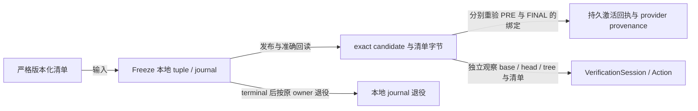
```mermaid
flowchart LR
  Plan["严格版本化清单"] -->|输入| Freeze["Freeze 本地 tuple / journal"]
  Freeze -->|发布与准确回读| Candidate["exact candidate 与清单字节"]
  Freeze -->|terminal 后按原 owner 退役| Retired["本地 journal 退役"]
  Candidate -->|分别重验 PRE 与 FINAL 的绑定| Activation["持久激活回执与 provider provenance"]
  Candidate -->|独立观察 base / head / tree 与清单| Session["VerificationSession / Action"]
```

格式迁移先部署兼容读者：读者变更自身仍使用 V1 Work Package，经原准入、审查与集成后，回读实际 trusted main 的 commit/tree 与受信运行闭包。只有该读者闭包已采用，原 Work Package owner 才能为另一后继工作生成 V3 清单并重新准入；不原地改写已冻结的 V1 清单，不让候选内的新解析器授权自己的 V3。旧读者遇到 V3 仍拒绝，保留原候选与有效证据，先补齐受信读者采用再恢复。该迁移不改变唯一活动包、作用前 CAS、主干漂移检查或后继退役，不据此宣称多活动工作的分配与互斥已经实现。

<a id="repository-freeze-native-index-decision"></a>
**文档冻结的原生 Git 方案。** 采用既有 Git scratch owner 持有的可写私有 index，通过原生 `update-index`／`write-tree` 形成候选树，真实 repository PRE 仍为受保留只读输入，最终发布仍由原文档控制 owner 的 journal、CAS 与读回承担。私有 index 的锁与替换归受保留父目录；不能把受限只读文件句柄直接当可替换输出，也不能让原生工具改变真实 PRE。严格输入／NEXT 编解码、对象类型与存在性、准确路径、环境隔离及原预算继续保留。

不采用被其替代的手工逐目录树重建、子树结果缓存、符号 delta 续接与专门扩额冻结框架作为并行生产路线：原生 Git 已承担树构造，额外模型会重复承担树语义、观测和恢复成本。这个理由支持删除重复机制，不证明所有平台已通过，也不从进程数减少推出完整提交或发布更快。现有平台、非合作外部 writer／ABA、资源及终态未知边界仍适用。只有真实原生接口缺口、不能保持的观察合同或同等保证下的完整成本证据推翻当前选择时才重开；须由同一 owner 给出最小差额与退出，不因历史候选已写成而重新启用。

文档控制的独立生产冻结入口只在持久 `terminal` journal 已回读后结束其有界 Git 读取会话；终端验证与 index／恢复残留退役是同一 operation 的独立有界续接。续接重新取得工作区租约与 Git 读取能力，核对原 journal、manifest、候选树和物理路径后才退役，且仅在两段均结算后报告冻结成功。journal 发布前失败不虚构恢复对象；发布后到最后删除 journal 之前的失败保留已存在的 journal 与未退役残留供同一 operation 恢复。最后删除 journal 后的屏障或空目录退役失败属于终态未知：后续入口仅能按无跟随物理目录核查退役空根，旧 operation 的完成须另由准确投影与作用回读证明，不能凭 journal 缺席补签。新会话不能刷新写入阶段的预算、跳过终端回读或重复发布作用。

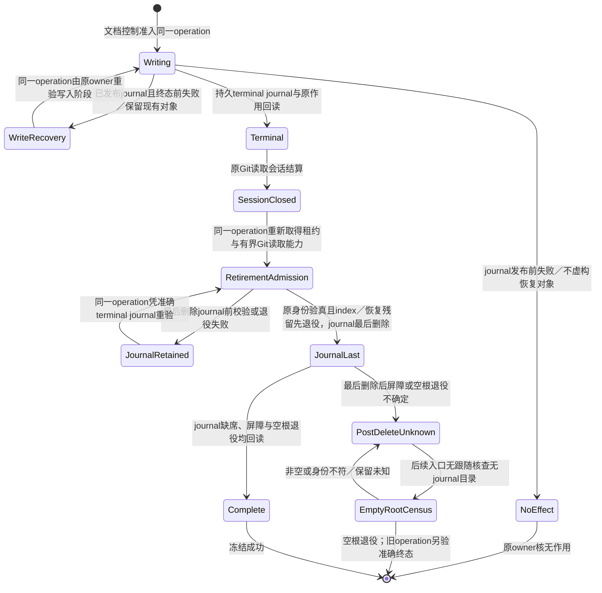
```mermaid
stateDiagram-v2
  [*] --> Writing: 文档控制准入同一operation
  Writing --> NoEffect: journal发布前失败／不虚构恢复对象
  NoEffect --> [*]: 原owner核无作用
  Writing --> WriteRecovery: 已发布journal且终态前失败／保留现有对象
  WriteRecovery --> Writing: 同一operation由原owner重验写入阶段
  Writing --> Terminal: 持久terminal journal与原作用回读
  Terminal --> SessionClosed: 原Git读取会话结算
  SessionClosed --> RetirementAdmission: 同一operation重新取得租约与有界Git读取能力
  RetirementAdmission --> JournalRetained: 最后删除journal前校验或退役失败
  JournalRetained --> RetirementAdmission: 同一operation凭准确terminal journal重验
  RetirementAdmission --> JournalLast: 原身份验真且index／恢复残留先退役，journal最后删除
  JournalLast --> Complete: journal缺席、屏障与空根退役均回读
  JournalLast --> PostDeleteUnknown: 最后删除后屏障或空根退役不确定
  PostDeleteUnknown --> EmptyRootCensus: 后续入口无跟随核查无journal目录
  EmptyRootCensus --> PostDeleteUnknown: 非空或身份不符／保留未知
  EmptyRootCensus --> [*]: 空根退役；旧operation另验准确终态
  Complete --> [*]: 冻结成功
```

文档冻结的 Git index 在发布前按准确 PRE/NEXT 字节与恢复制品判定作用切点；日志已到 `index-published` 或更后阶段时，原生 Git 可能只刷新 index 的 stat/cache 字节，恢复改以无 `index.lock` 且外部 scratch `write-tree` 等于日志绑定的候选树证明已发布状态，不重放 index CAS。日志、指针、滚动计划和恢复制品仍各按原始字节及身份验真；树漂移、锁或异物保留为未结算，不能凭相同文件名继续作用。

并发工作使 main 前进时，已提交且来源可核验的候选只有在旧 base 位于新 main 的第一父系链上，且该链每一代的 current-state、活动指针、滚动计划、指针所指清单与工作选择源相对旧 base 均保持相同 Git 字节，才能沿原文档控制 owner 重绑同一 Work Package。新候选必须是新 main 的直接单父提交；旧滚动投影须绑定旧 base 与可核验的候选源提交、树、清单和控制字节，目标 package、tracking 与清单路径保持同一身份。任一代控制字节变化（包括后来回退）仍须取得新 WorkDecision 或已发布投影的原有权威，不能把旧候选投影冒充 main 发布事实。重绑只重新签发准确 main 与候选的控制投影，不延用旧 head 的审查或 Gate 结果。

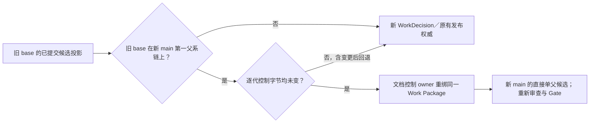
```mermaid
flowchart LR
  Candidate["旧 base 的已提交候选投影"] --> FirstParent{"旧 base 在新 main 第一父系链上？"}
  FirstParent -->|否| Decision["新 WorkDecision／原有发布权威"]
  FirstParent -->|是| Control{"逐代控制字节均未变？"}
  Control -->|否，含变更后回退| Decision
  Control -->|是| Rebind["文档控制 owner 重绑同一 Work Package"]
  Rebind --> Fresh["新 main 的直接单父候选；重新审查与 Gate"]
```

提案不接收或产生 WorkDecision、MainHealth repair、激活回执或集成授权；普通激活仍消费真实工作选择，选择失败不能隐式降级为提案。重试与恢复拒绝跨提案／激活路径消费日志，已有激活日志继续按原合同恢复。提案合入默认分支后，指针清单与默认分支内容相同仍只表示没有活动任务，不会因文件已经发布而自动获得执行权限。

### 当前仓库载体的保留与退出

`WorkDecision`、Task Capsule、Read Plan 等当前结构已经存在真实 TypeScript producer/consumer 时，文档收敛不能先删语义再留下孤立代码，也不能因代码存在就恢复旧文档为 authority。实现融合遵循：

```text
086 owner meaning
→ census current producer / parser / consumer / test
→ classify each existing carrier as preserve | adapt | replace | retire
→ shadow / migrate consumers when representation changes
→ remove the old writer/parser only after consumer-zero and readback
```

载体若只是把 086 已有关系投影给当前控制面，应保持派生身份；若它拥有 086 中不存在且确有消费者的独立语义，先把那项语义归入本规范的唯一 owner，再决定实现表示。路径、schema 名、版本号和测试数量都不能成为保留理由。

### 继续、失败与新 main

恢复任务只从持久、可重新取得或 live 的事实重建：当前 086 规则、仍有效的用户目标/授权、exact base/candidate 身份、未结算 operation 引用，以及该边界要求重新读取的 Provider 状态。聊天摘要、checkpoint prose 和“刚才已经通过”只能定位这些对象，不能恢复权限或完成状态。

同一输入和同一根因的确定性失败默认复用失败，不靠抬 timeout、换 shell 或新 requestId 重试；Provider handle 丢失、外部响应丢失或部分 Effect 先按原 operation 身份 readback／join／recover。只有相关输入、事实或重试准入真的改变，才产生新尝试。发布到新 main 或 trust epoch 变化会使旧的 Effect grant、Review/Integration 授权和依赖旧 head 的结果失效；如果用户的长期目标和授权仍成立，系统从新 main 自动重新定向，不要求用户重复说“继续”。

### Hosted maintenance 与远端 ref 退役

仓库远端维护由原 branch-lifecycle owner 决定 exact ref 的恢复、前像、CAS 与结算。默认入口是 `sec-repository-maintenance-request-v2` 的一次有界 `workflow_dispatch`：请求绑定 repository、准确 expectedMainSha 与 1..64 个互不重复的 exact-ref operation；每项仍是一条 branch 与一个 expectedHeadSha。64 沿用既有维护请求的有限 operation 上限，另将整个 request 限为 60 KiB UTF-8、序列化 dispatch inputs 限为 65,535 bytes，超限在调用 Provider 前拒绝，不隐式拆成多次作用。ref/comment 混合与 caller 注入 authority 字段均拒绝。一个 runner 共享 checkout、锁定依赖安装、完整 recovery bundle 及结果 carrier；批次不是跨 ref 原子事务，结果逐项结算。

本地 CLI 从明确的 JSON 文件读取整个请求，以当前真实 GitHub User 和 maintain/admin 权限核对仓库、live main 后发送一次 workflow_dispatch；它不创建公开评论，也不暗中退回旧评论运输。请求、body digest、reviewer prose 或调用者提供的 login 都不是权限。原 GitHub capability owner 重新读取 native event 与 exact live run/attempt，绑定 sender、actor、默认分支 workflow、main SHA 和 request digest；CLI 将 canonical request digest 作为 request_digest 输入，再计算含 requestDigest 与准确 resumeReceipt（fresh为null）的 execution_digest 并固定 run title，原 owner 必须同时核 native event、执行方式与 GitHub API run.display_title 中的准确 execution digest，防止仅改写本地 event 文件借用真实 run 身份签出另一计划，并在每个真实 effect 的原能力入口复核权限。`author_association` 不是准入条件。低权限、Bot、App 代发、错误默认分支、run/event/body 漂移或无法取得来源证据都 fail closed。CLI 消费 dispatch API 返回的 exact run ID 与 URL；响应丢失或结果格式未知时先读回原 run/request，不盲重发。使用现有凭据；fine-grained credential 若缺 Actions(write) 则明确阻断，不自动添加 scope 或保存新凭据。GitHub workflow 自身只取得 actions:read、contents:write、pull-requests:read，新的 ref lane 不取得 issues:write。

本地直接执行与 hosted transport 共用同一 lifecycle owner，但直接执行必须同时具有真实 maintainer capability 和 owner 可验真的持久 recovery provider。仅有本地 bundle、文件路径、Library ID 或手写 receipt 不能代替持久来源证明；当前 local CLI 未装配该 provider 时明确返回这一缺口，并指出一次 hosted batch 的受支持路径，不伪装已在本地删除。采用一次 hosted batch 是为了复用原生 Actions artifact 而免去逐 ref 评论、workflow 与恢复打包；如果未来原 owner 能直接消费受信的其他 durable provider，再扩展对应能力后端，不另建并行 authority 系统。

逐项内容分类保持明确：`transport-only` 仅接受 transport/*；`closed-pr-superseded` 绑定准确 closed PR、原 head branch 与 SHA；`main-tree-identical` 要求 exact target tree 与当前 main tree 完全相同，不能由语义相似或 squash 推断。tree 不同、没有准确 closed-PR head 绑定的旧 ref 使用 `reviewed-plan-superseded`，内联 v4 maintainer-adopted semantic review 绑定 exact repository、branch、head commit/tree、current main commit/tree、git merge-base(head,currentMain) 的 commit/tree、完整 merge-base→head source-delta path-set count/digest、approved verdict 与空 unknowns。reviewer 字段保留审查说明，其文字不自证独立审查者身份；真实采纳主体来自原 capability owner 对本次不可变计划的验证。review owner 重验 native Git objects、merge-base 与路径集后签发进程内 evidence，transport 不签发内容处置权。固定 source/object 检查在一个批次内共享；main、active Work、open-PR consumers、maintainer permission、carrier存续与 exact ref old OID 仍在各 effect 边界重新读取。

旧 v1 请求、v3 评论审查和相应真实运行证据保持其原始解释，供原 owner 读取与处理未结责任；新 workflow 不再订阅 repository_dispatch 或 issue_comment，也不执行旧 comment lane。新 v2 批次拒绝引用可改写的 review comment，避免 immutable plan 与 mutable comment 撤销语义混同。旧评论删除能力不得因版本迁移自动获得新的实际删除授权。CodeQL findings 继续消费 GitHub Code Scanning 的原生 check/alert 权威，不新增第二条 projection workflow。

### 评论运输垃圾退役

评论卫生分成两个不同 authority lane，禁止再把 GitHub Actions installation token 当成通用 Conversation 管理员。

**历史 comment 请求只读兼容。** v1 的 exact-comment-retirement 仍可解析 1..64 条互不重复的 #313 exact comment 身份，用于解释原请求与历史证据；解析不签发新的 comment 删除权限。旧自动 trigger 清理入口及其无消费者实现随新 ref workflow 一并退役，不再承诺当前 hosted CLI 提供该 DELETE lane。旧 SHA 的运行仍保留其原有作用、失败与回读解释，未结责任不会因为新源码删去 helper 而被视为已完成。其他独立 comment owner 和通用 GitHub API 保持自己的准入与作用边界；不为保存历史 parser 重新增加 comment job、公开评论或自动删除。

**PR Conversation hygiene lane** 不走 repository-maintenance DELETE。真实运行已经证明：`github-actions[bot]` 对普通 PR Conversation 评论（包括维护者自己的 `@codex review` 以及其他 GitHub App 的 Codex summary/setup/quota 消息）会收到 GitHub `403 Resource not accessible by integration`。因此当前 adopted 动作是：由已连接的 maintainer identity 对明确的运输噪声执行正文退役，将其替换成不可见 HTML tombstone；评论对象本身仍存在，不能报告为物理删除。已观测的 disposable prose 仅包括精确 review-trigger 命令、Codex review summary、environment setup hint 与 quota/upsell transport；扩展该集合必须重新核作者、用途和 consumer，不能按年龄或 bot 身份泛删。

CodeQL projection、真实 review submission、inline finding/thread、人工裁决、事故/失败复盘以及仍被 current owner 引用的 evidence 不属于运输噪声，不做 tombstone。对被平台权限阻塞的物理删除，保留最短 blocker receipt（HTTP status、owner、run/artifact）即可；不得留下整批原始 JSON 继续污染 #313，也不得把 tombstone 表述成 delete。

一个 exact-ref 批次按下面的有界状态推进：

```text
fixed maintenance batch
→ native workflow event / exact live run / current maintainer permission 由原能力owner核验
→ live main 与 active Work Package observation 必须 resolved
→ 全量准确 source/review/object 检查；独立项的 conflict 不取消其他已合格项
→ 完整 open-PR census（最多 2×100；超过 200 个 open PR fail closed）
→ 一份包含所有原计划 exact tips 完整历史的 Git bundle，无外部 prerequisite
→ Linux hosted 私有根内 staged preparation + recovery.bundle + recovery.bundle.sha256
→ 原生 artifact upload、API identity/实际expires_at读回、按exact ID下载
→ 原lifecycle owner重新核bundle摘要、checksum、git bundle verify与全部expected heads
→ fresh每项effect前与terminal边界重读捕获run/current permission / main / active Work / open PR / carrier / exact old OID
→ 仅fresh先持久化effect-started，再执行GitHub updateRefs exact-old-OID CAS；resume在原provider层也拒绝CAS
→ 持久化effect-returned，再独立读取ref absence / consumers / main
→ 逐项结果写入同一原子receipt；正常结束、失败和中断均保留已经产生的责任
```

每项结果分别表示 retired、blocked、unsettled、absent-unattributed 或 converged-observed，并独立记录 targetState（absent/present/unknown）与 effectOutcome（acknowledged/unknown/not-attempted）。批次 targetConverged 计数准确读回为absent的目标；completed 只计CAS有ACK且当前guards均结算的retired，两者不得互相代签。没有原 effect receipt 的 ref absent 不能签作本次成功。有 CAS 返回证据但终态回读中断时，续接重新检查当前 guards；只有曾经 effect-started 而缺 CAS 返回时，即使现在 ref absent，也只报告 converged-observed，保留本次作用归因未知，计入targetConverged但不计入completed；不能因因果未知把已观察的目标收敛说成目标未达到。续接消费原结果 artifact 的 exact ID、archive digest、run/attempt，并由原 owner 检查来源 workflow、main、repository、完成状态与 archive bytes；外传 JSON/results 不能自签已作用事实。所有 resume 项均只读回并结算观察，绝不执行CAS，包括原 receipt 中尚未开始的项；这使旧locator重用或分叉不能再次签发删除。尚未开始的目标必须由新的明确fresh计划按当前身份、source、recovery与mutable guards完整重新准入，本流程不自动创建或提交新计划。新 dispatch 的 receipt 继续保留原 progress 与 resumeReceipt 证据；已经认证的absence observation单调进入同一progress，不被后续target结果覆盖丢失。每项至多记录effect-started、effect-returned、absence-observed与recreation-observed各一次，总进度边界为4N；已认证重建也须单调保存。原ACK删除之后，若观察到ref重建再缺席，不能拿原ACK把新对象签成retired，只保留当前target收敛与unsettled或absent-unattributed归因，completed不增加。原 workflow 的 run_attempt 大于1被拒绝；恢复须使用带原 receipt locator 的新显式 dispatch，不能用平台rerun或替换本地resume字段退回fresh作用。恢复载体仍绑定其最初fresh execution digest，不能错用当前resume run的身份。

recovery preparation 和 effect 执行保持两阶段。首次执行先建立一份完整 bundle，再原生上传并下载验真；续接直接重用原 recoveryPreparation 与 carrier，不重新打包已消失的 refs。公开载体中的路径字段不产生物理路径 authority；hosted 固定私有根在调用前必须缺席，创建时拒绝 symlink，下载位置也由 transport 固定，真正 recovery bytes 的解释归 branch-lifecycle。使用同一个请求不等于取得 effect 权，原 owner 对输入、权限、mutable guards 与 provenance 的拒绝仍保持。

恢复 artifact 默认申请保留 30 天，这只是明确的保留策略请求，实际截止由 Provider 的 created_at/expires_at、expired 与 artifact identity 读回决定；结果 receipt 保存准确 carrier 和截止，不声称“写了30天就已保存30天”。成功后不自动删除唯一 recovery carrier，未完成、部分失败与未知作用也不触发删除。提前退役需另有原 owner 已核实的恢复替代或明确保留义务结算；到期或 carrier 失效后相关 effect/续接阻断，重新取得可验真的恢复条件。结果 artifact 只含同一批次的 preparation、carrier locator、progress 与逐项结果，不复制 bundle，也不成为第二 branch truth。

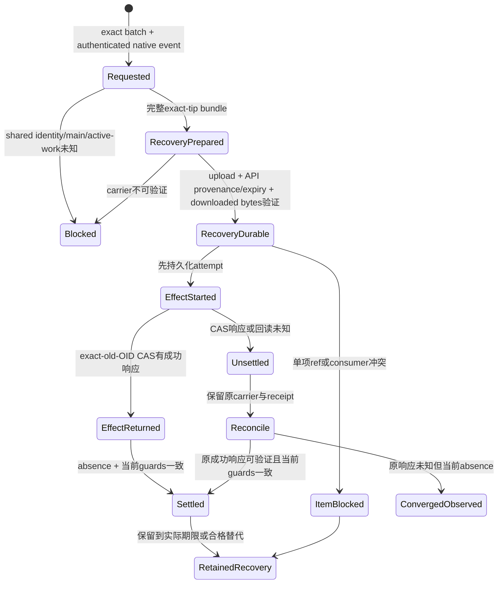
```mermaid
stateDiagram-v2
  [*] --> Requested: exact batch + authenticated native event
  Requested --> Blocked: shared identity/main/active-work未知
  Requested --> RecoveryPrepared: 完整exact-tip bundle
  RecoveryPrepared --> RecoveryDurable: upload + API provenance/expiry + downloaded bytes验证
  RecoveryPrepared --> Blocked: carrier不可验证
  RecoveryDurable --> ItemBlocked: 单项ref或consumer冲突
  RecoveryDurable --> EffectStarted: 先持久化attempt
  EffectStarted --> EffectReturned: exact-old-OID CAS有成功响应
  EffectReturned --> Settled: absence + 当前guards一致
  EffectStarted --> Unsettled: CAS响应或回读未知
  Unsettled --> Reconcile: 保留原carrier与receipt
  Reconcile --> ConvergedObserved: 原响应未知但当前absence
  Reconcile --> Settled: 原成功响应可验证且当前guards一致
  Settled --> RetainedRecovery: 保留到实际期限或合格替代
  ItemBlocked --> RetainedRecovery
```

不同批次只在真实相交 ref 的 exact-old-OID CAS 上竞争；没有全仓固定 concurrency 队列，也不用整个 batch hash 假装锁住所有交集，不另建分布式锁。一个批次中共享权限、main、carrier 或 provider预算失效时停止后续依赖项；独立单项 blocker 保留逐项结果。批次不保证并发事务快照，删除后出现新消费者、main 漂移或回读失败仍是 unsettled，由原 owner 根据新事实恢复或裁决。

辅助工作树退役先由 generated-state 与 compiler-dependency owner 结算受管 `node_modules` locator，再由 `worktree-physical-closeout` 删除 Git 登记和物理目录；不得直接以 `git worktree remove` 作为完整清理。Windows 上受管 locator 是 Junction，原生 Git 可能先注销 worktree 再因该 reparse point 返回 `Invalid argument`，形成未登记的物理残留；这种残留不能被第二次 Git 命令证明已清理，也不能未经目标与 link target 回读就递归删除。

编译依赖的可复用物化身份消费有效的安装配置，不因 `bunfig.toml` 只含非安装配置或文件缺席而拆成两代；同一运行中的输入栅栏仍检查该文件存在性与准确内容，防止观察后替换。linked worktree 的 locator 与物理 generation 分属 consumer 和 source owner：恢复只以记录的 owner root、当前 canonical generation、准确绑定和物理身份重建源资格。故障若发生在新 locator 已发布、生命周期登记尚未完成，原 transition owner 在这些条件复核后补完登记，不把“缺少登记”解释成外来对象并永久阻断清理。源 owner 换代后旧 generation 缺席而 consumer locator 悬空时，locator 生命周期 owner 仍以未跟随的准确链接身份、目标路径和缺席事实签发退役，再从当前源 owner 取得新代；共享 consumer census 只允许各 root 回收自己的 canonical generation，其他 root 的记录只参与对应 owner 的使用人数判断。

工程依赖的项目链接和隔离副本直接消费编译器已认证的 runtime materialization，不再生产 `.shared-deps` 投影。Bun 安装缓存位于 Runtime Cache 的 `bun-install`，可由多个工作树同时使用；清理它须由同一 owner 协调安装与清理，并在物理回读后报告完成。在该共同准入和结算能力建立前，`deps clean --bun-cache` 与 `deps clean --all` 于任何删除前返回 `IMPORT-AUTHORITY-004`，不能把旧 `.shared-deps/.bun-cache` 当成当前缓存或报告空操作成功。`deps clean --shared` 只退役已登记的旧共享目录；未知或未登记目录保持保护。

本地分支/工作树 closeout 的 recovery 只保护尚未结算的破坏性作用，不是默认永久归档；hosted exact-ref carrier 另按上文的明确保留期限与可验真替代条件处理。bundle、checksum、authorization、receipt、worktree operation generation 与 retained proof 由 branch-lifecycle owner 按同一终态释放：本地分支删除已有 durable receipt、对应 merge commit 可从 receipt 绑定的准确 main 到达且当前 ref 仍缺席后，释放该 operation 的 bundle family，并按 branch 与内容摘要回收没有 pending preparation、journal、receipt 或其他 lifecycle evidence 的裸重复 bundle；一旦存在 lifecycle evidence，必须由对应 branch receipt 或全部 operation journal 各自绑定的 `completed` receipt 证明整个 family 终态，缺少 preparation 不能降级成可回收；默认 recovery 根为空时一并退役。worktree evidence 只有在 receipt chain 为 `completed`、目标目录和 Git admin 都物理缺席、且本地分支 authority 已消失时才回收；同一 authorization 绑定的 generated-state retention root 也在验证原 receipt 与物理身份后同期退役，空的 worktree evidence owner 不继续残留。编译依赖的 stage intent 由 dependency owner 在工作树物理退役准入前核实终态、stage 与注册关系、准确字节和物理身份后退役；active、partial、异物或漂移保持原位。generated-state 在搬迁 `.tmp` 前完成依赖域退役，避免失去已绑定 generation 的原始路径。`residue`、`prepared`、活分支、仍有 active recovery proof 的不兼容旧代际和未知内容保持。当前 field-bearing／fieldless 恢复使用已采用的 authorization schema，不为这次历史终态兼容另造竞争 writer、宽松 parser 或新的授权入口。这是当前恢复路径的具体选择，不是永久禁止格式演进。新增必填含义是否进入原载体的新版本，或由独立 owner artifact/receipt 承担，按[授权与证据载体的版本解释](../../演进/兼容迁移与退役.md#authority-bearing-format-migration)核其签发责任、生命周期、原子关系及真实消费者；未完成该迁移前，现行字节格式、验真算法和下述历史恢复边界不变。当前 field-bearing writer 与历史 fieldless bytes 均由同一 canonical parser按各自原始字节和 operation 算法验真，但只有原始记录确实缺少 generated-state 字段的历史对象，才可在已有同 authorization 的 unregister 成功与 durable retirement phase 后，于同一 workspace write lease 内经过初始与 effect-boundary 两次回读，确认 target、Git admin、tombstone、retained proof 和 retirement fence 全部缺席，无删除作用地补签 `completed`；显式 `null` 不能冒充 fieldless 历史事实，任一对象重现即 typed blocker。历史 authorization 除该终态收敛与退役自身 evidence 外，不取得删除其他对象的 authority。不得把未知 `.tmp`、依赖状态或普通目录手工搬入 recovery 根来绕过 closeout；它们必须先由原 generated-state/dependency owner 分类并结算，不能结算时返回 typed blocker。

编译依赖阶段意图的退休在首个文件删除前持久发布绑定三阶段原字节与物理身份的标记；任一删除切点中断后，原 dependency owner 在相同协调租约内认证标记并续退。普通读取遇到该标记必须返回明确恢复入口，不把缺少阶段文件误判为外来残片。

本地 `refs/heads/*` 删除由唯一 Git 物理 owner 执行：branch-lifecycle 与托管验证的消费者先取得准确内容与恢复准入，并在作用前持久化 bundle、authorization 或对应 journal；作用时持有共享 Git common-dir 的协调租约，复查工作树绑定与准确旧 OID，再用原生 `update-ref` 旧 OID 比对事务删除，独立回读 ref 与工作树后签发结果。消费者的进程、输入和输出预算必须由该物理 owner 的实际事务上限与准确输入测量签发；同时需要 repository-root 租约时，先取得 common-dir，再取得 repository-root，并把同一个 common-dir token 传给物理删除，避免相反锁顺序。已被工作树绑定、前像漂移、租约失效或回读不确定时保留 ref 与恢复责任，不能把远端删除或进程退出解释为本地结算。协调租约排除参加该协议的 SEC writer；Git 的 ref 事务不能把任意外部原生 Git 的 worktree 绑定纳入同一原子操作，外部竞态若使终态不明则保留证据并报告 outcome unknown，不签发完成。

已合并分支的 closeout inventory 另绑定本次 operation 的准确 PR 编号、head branch、head SHA 与 base branch。普通发现仍按物理分支及 open PR 选择相关对象；作用前、作用后及恢复回读由原 inventory owner 按编号重新向 Provider 读取这个目标，即使本地与远端 ref 都已缺席，也保留终态所需的准确 merged 见证。列表与准确回读重复或矛盾、仓库／head／状态漂移、观察不可用或原有列表额度耗尽均阻断完成；选择器仅限定观察对象，不签发删除或完成权限，也不允许复用旧 PR JSON 代替新回读。

merged/retained residue closeout 在同一 common-dir 与 repository-root 租约内、ref CAS 前，由 `development.commit` owner 分类并退役目标 ref 的全部提交 journal；ref 已缺席的续跑也执行同一前置检查。任一 journal 的 applied 回读、准确字节/物理身份退休或能力不可证实时，保留 ref 与 recovery 并返回 typed blocker，不能先删 ref 再借已消失的 reflog 补判提交结果。

关闭但未合并的准确 PR head，只有在 head 是当前 main 的原生祖先或其树与可达 main 的准确锚点相同时，才可用 main-absorption proof 结算；证明绑定 commit/tree 和持久摘要，作用前重验 live Git 关系。不能由这些原生关系证明的差异仍需覆盖完整路径集的维护者采纳审查，不能把 PR 关闭或旧分支名当作内容吸收。proof 已按终态退役后，重启从已认证终端 receipt 与当前 Git 关系回读，不能凭文件缺席自行重签完成。没有准确 PR head 的本地 ref 只在调用者明确选定分支及旧 OID 后进入 retained closeout；内容等价是删除资格而不是选择授权，未选 ref 保持，已落盘授权按原目标集合续跑。

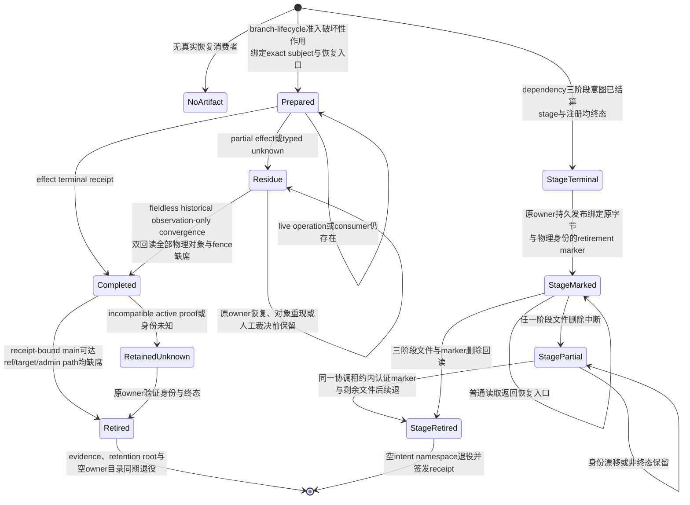
```mermaid
stateDiagram-v2
  [*] --> NoArtifact: 无真实恢复消费者
  [*] --> Prepared: branch-lifecycle准入破坏性作用<br/>绑定exact subject与恢复入口
  Prepared --> Prepared: live operation或consumer仍存在
  Prepared --> Completed: effect terminal receipt
  Prepared --> Residue: partial effect或typed unknown
  Residue --> Completed: fieldless historical observation-only convergence<br/>双回读全部物理对象与fence缺席
  Completed --> Retired: receipt-bound main可达<br/>ref/target/admin path均缺席
  Completed --> RetainedUnknown: incompatible active proof或身份未知
  Residue --> Residue: 原owner恢复、对象重现或人工裁决前保留
  RetainedUnknown --> Retired: 原owner验证身份与终态
  Retired --> [*]: evidence、retention root与空owner目录同期退役
  [*] --> StageTerminal: dependency三阶段意图已结算<br/>stage与注册均终态
  StageTerminal --> StageMarked: 原owner持久发布绑定原字节<br/>与物理身份的retirement marker
  StageMarked --> StagePartial: 任一阶段文件删除中断
  StagePartial --> StageRetired: 同一协调租约内认证marker<br/>与剩余文件后续退
  StageMarked --> StageRetired: 三阶段文件与marker删除回读
  StageMarked --> StageMarked: 普通读取返回恢复入口
  StagePartial --> StagePartial: 身份漂移或非终态保留
  StageRetired --> [*]: 空intent namespace退役并签发receipt
```

任务只有在 086 对应 owner 已能观察到目标结果、候选与所需 Claim 闭合、真实 Effect 已结算和读回、旧竞争 writer/route/临时状态按要求退役或留下明确 blocker 后，才能报告该范围完成。绿色测试、commit、push、PR、merge response、Issue close 或 clean worktree 中任意一个都只是相应层事实。
