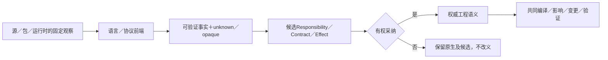
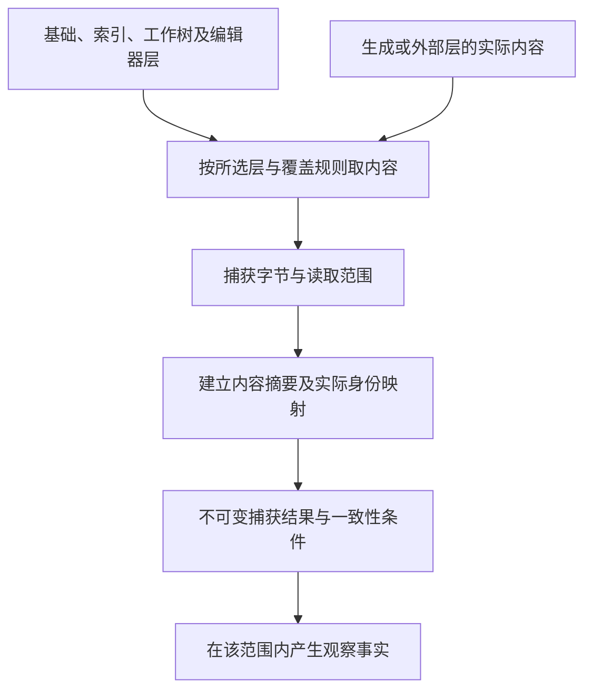
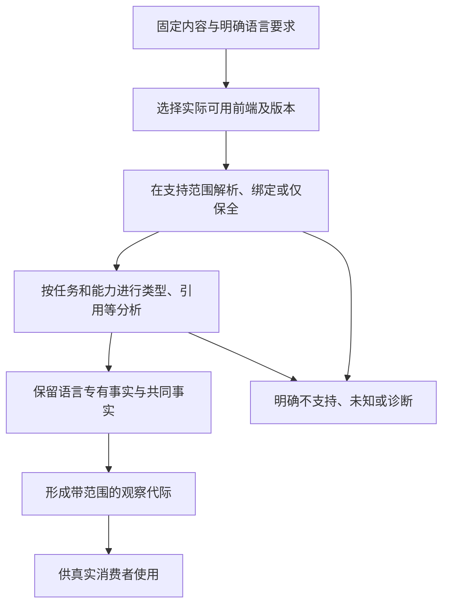

# 导入观察与原生资产

> **阅读范围**：采用范围内的设计规范；实现状态另查未决。

<details>
<summary>本页内容</summary>

- [原生作者区域不是必备组成](#原生作者区域不是必备组成)
- [逆向的目标：恢复行为、结构与意图候选，而不伪造历史](#逆向的目标恢复行为结构与意图候选而不伪造历史)
- [Git、索引、工作树、提交与候选树观测](#git索引工作树提交与候选树观测)
- [二进制、本机代码、不透明组件与外部系统观测](#二进制本机代码不透明组件与外部系统观测)
- [人工知识、文档、评论与外部文本可信边界](#人工知识文档评论与外部文本可信边界)
- [动态依赖、环境输入与负事实观测](#动态依赖环境输入与负事实观测)
- [存量工程重建与采纳](#存量工程重建与采纳)
- [工作区精确观测](#工作区精确观测)
- [工程导入与按模块提升](#工程导入与按模块提升)
- [意图规范化、歧义与安全前沿](#意图规范化歧义与安全前沿)
- [数据模型、数据库、消息与事件流观测](#数据模型数据库消息与事件流观测)
- [编辑器覆盖层、索引、磁盘与写回协调](#编辑器覆盖层索引磁盘与写回协调)
- [直接编辑与成组捕获：文本是正常作者入口](#直接编辑与成组捕获文本是正常作者入口)
- [观测预算、采样与覆盖前沿](#观测预算采样与覆盖前沿)
- [语言前端与源码程序](#语言前端与源码程序)
- [路径身份、物理对象与跨平台文件系统](#路径身份物理对象与跨平台文件系统)
- [运行时行为观测与因果追踪](#运行时行为观测与因果追踪)
- [配置、模式、工作流、基础设施与多制品观测](#配置模式工作流基础设施与多制品观测)
- [原生观察不能替代中立值构造](#原生观察不能替代中立值构造)
- [解码不是用目标对象伪造中立值](#解码不是用目标对象伪造中立值)
- [从输入范围取得可用快照的正向协议](#从输入范围取得可用快照的正向协议)
- [语言读取与全资产读取的分工](#语言读取与全资产读取的分工)
- [VCS开发面：选择内容、形成提交、集成及同步](#vcs开发面选择内容形成提交集成及同步)
- [开发工作集交接：从缓冲到可运行的准确输入](#开发工作集交接从缓冲到可运行的准确输入)

</details>


大型原生维护的具体边界见 [Code-OSS 作者文件与来源](../../../examples/原生维护/Code-OSS搜索替换.md#developer-files)：保留 TS 作者区及非源码成员，只在必要独特语义处增加中立源；打开缓冲和磁盘是不同状态层。读取一组源码不能代签全仓捕获，静态引用不证明宿主保存或原子版本能力，后者由实际目标适配取得。


外部库的公开导出可以形成ImportedModuleView，与实际作者ModuleRevision共同进入链接；这是读取所得的只读视图，不是将原生实现提升为一份新作者源。它保留来源、覆盖和未知，不要求有同义SEC函数体。名称/类型读取不执行原生模块顶层，也不证明相同签名的目标行为相同；实际使用点由[供给主链](../../编译/内核/编译值服务.md#supply-aware-compile)处理。

## 原生作者区域不是必备组成

本章规定已有资产的保护和跨实现边界，不要求每个SEC工程有原生作者文件。必须区分下面四件事；“原生”一词单独出现时不足以决定可理解程度、可移植性或编辑权。

| 对象 | 是否要求开发者维护目标语言源码 | 设计责任 |
|---|---|---|
| 应用的原生作者区域 | 仅当用户明确选择或存量迁移尚未完成时 | 保留其真实语言语义、唯一写源、改动前像和迁移选择 |
| 标准库、数据库驱动、系统调用或提供者的实现 | 不自动要求应用开发者维护其源码 | 版本、接口、表示、效果、资源、错误、许可与替换条件 |
| SEC生成的TS/Java/其他源码 | 不属于第二份独立作者源 | 支持的修改通过原生成基础与EditCorrespondence回到原作者；只有明确接管未映射区域时才转移写权 |
| 原生或中立实现的内部未知 | 与实现语言无必然对应 | 按具体声明保留未知；原生可以有强合同，中立源码也不自动被证明 |

新建工程可以没有任何用户维护的`.ts`、`.java`或其他原生应用文件：中立作者定义和所选库/宿主足以实现其全部需求时，生成器承担目标映射。库或宿主内部使用其他语言，并不使这个工程变成需要双写的“混合作者工程”。本机机器码、外部数据和平台接口的存在，也不证明作者必须保留原生代码区域。

### 无原生作者路径的准入与失败

对一个声明支持的交付范围，逐项确认：需求在所选公共/领域语义中可表达；每个所需操作有合格的库或后端实现；目标环境具备真实效果能力；转换和调用保持所需保证；构建输入与退出资产完整。满足时应允许零原生应用作者文件。该范围不是所有未来业务的全称证明，也不是新的全局前置；纯函数只检查纯计算闭包。

遇到缺项先分型：仅缺快捷写法但已有语义可表达，继续使用中立基础构造或局部定义；公共含义不足，补相交语义设计；含义明确但后端/库没有实现，登记实现缺项；目标本身缺能力，改合法目标/绑定或由有权主体修改要求。不能把上述四类一律翻译成“请写原生代码”。选择保全原生是用户可接受的临时或长期路线，不是系统自动改变任务的许可。

既有工程无法完整解释时，原生保全仍必须保护其真实工作。此保护义务不代表新建工程必须先制造一块无法解释的区域。语言中立迁移失败时不得删除旧源；中立生成缺项时不得生成空函数。

### 已选择原生时仍有完整设计责任

作者所有权、精确输入/配置、真实类型与调用约定、公共要求与实际行为、初始化、同步/异步、分配与释放、回调注销、错误和取消、权限、构建再现、来源映射、依赖留存和退出，都由本章及其链接合同承担。默认从成熟工具取得能可靠观察的签名，不手工复制；观察不到的效果不得假定纯。原生字节可用不等于已经提升，中立映射有定义也不等于后端已经实现。

从原生作者迁到中立作者需要三份不同材料：旧观察、拟采纳的新含义、满足新含义的转换/实现。只有相应采纳完成才转移写源；等价保持与有意修复旧缺陷分开。完全自动反推唯一业务意图不作为普通导入承诺。反向接管生成物同样改变重建责任，而不是维持两份独立作者真相。

验收的反例是：纯中立应用被强制创建原生目录；平台使用C库就宣称用户需要写C；同样的错误因出现在`.sec`内便获得更强保证；公开合同之外的原生行为被静默丢掉；实现缺项强迫改变作者语言。

<a id="recovery-purpose"></a>
## 逆向的目标：恢复行为、结构与意图候选，而不伪造历史

逆向不是一个全有或全无的开关。输入、要恢复的对象和允许观察先固定；下列结果可以独立存在，不能由其中一项代签其他项。

| 目标 | 可取得的结果 | 不能自动宣称 |
|---|---|---|
| 原源和生成对应齐全 | 支持编辑回到准确来源，保留其余作者内容与当前并发变化 | 任意手改均有唯一逆，或者全部版本规则等价 |
| 有源码、无SEC谱系 | 原语义分析、可靠重构、已知算法/领域关系识别，形成可读高层候选 | 候选就是历史作者原意或必须改写原源 |
| 有二进制及准确平台模型 | 指令语义提升、控制/数据恢复、可重新编译的表示，支持域内可用证明或翻译验证 | 历史变量名、注释、模块边界与全部设计理由已恢复 |
| 只有有限运行观察或远端接口 | 与观察相容的合同假设、可检验候选及未决集合 | 未观察输入、环境与隐藏状态下的完整行为 |
| 希望重新设计为更好抽象 | 在已接受目标下提出新结构、验证保持或明确修复 | 更好结构就是唯一原始结构，原程序有错时把原行为当新需求 |

### 理论边界不替代实际工作

设固定编译过程为C；若两份不同源S1、S2具有相同产物C(S1)=C(S2)，则只收到该产物的确定逆函数不能同时准确返回两份历史原文。被删除的注释、无用声明或被折叠的表达式就可能产生这类情况。额外符号、原源、构建参数和生成补充可以减少歧义；它们缺失时，不以“常见写法最像”证明历史唯一。

原文不唯一也不表示连某个前像都找不到。在固定且可计算的编译器/环境、可枚举源程序、产物确实属于其像的前提下，可以枚举源并交错运行编译，比较输出字节，最终找到至少一份前像；这是存在性方法，成本通常不可用，也不保证找回历史那份源。实际逆向应利用指令语义、符号、类型、调用和结构来避免盲枚举。

这不妨碍恢复等价行为。完整的指令与运行环境模型允许以显式机器状态/分派表达程序，再逐步恢复更清楚的函数、数据与控制。难点是可用性、目标性能、未定义/外部行为和验证范围，而不是原文不唯一就等于无法反编译。机器状态模拟若引入新的时延、内存或系统交互，还须核任务是否允许；功能行为模型不自动保证原硬实时与安全侧信道。若输入与状态有明确有限边界，可以枚举或使用模型方法；对任意一般程序没有保证总能终止的普遍等价判定器，不能由此拒绝已知范围的证明、合格规则和实际实例分析。

有来源的双向维护优先使用原对应；无来源但有合法源码时主动进行原生分析和抽象恢复；只有实际任务需要二进制时才接入成熟反编译供给。没有来源并不一律退成“只能显示原文”，也不把二进制引擎变成普通TS编辑的前置。

### R0—R6：无来源时也有正向设计

**R0 固定观察。** 保存原字节、类型/符号/调试信息、编译选项和可取得的运行条件。区分真实源码、反编译模型、接口声明和推测；读取二进制不是执行二进制。

**R1 取得行为模型。** 对源码复用成熟语言服务；对有实际需要的二进制复用支持该指令/ABI的提升器。未解析跳转、间接调用、别名、异常、线程或系统接口保留为明确边界，不按纯函数补齐。模型可以先保守，不必先恢复优美变量名。

**R2 找可抽象区域。** 沿真实数据/控制/效果关系识别已知函数、协议、状态转移、选择或归约关系；不得只按名字、签名或几行相似代码认定。将输入/输出、顺序、别名、资源和错误边界作为候选条件。

**R3 形成候选解释。** 可以由确定模式、符号分析或获准的开发AI提出高层定义及映射。每项候选引用原区域、适用前提、支持依据、仍未覆盖的观察和预期编辑范围，使用既有Definition/Observation与候选，不建立第二个永久IntentIR。候选不自动改变原作者源或原需求。

**R4 区分与核验。** 先用确定语义规则与独立推导排除错误候选；需要时使用已许可的等价检查、约束或实际测试。有限样本通过只覆盖样本及其依据；求解超额是未定而非不等价。副作用、错误先后、浮点、别名和非终止均按该任务真实观察核对。

**R5 发布准确层次。** 可以发布“行为模型已验证”“受限结构已映射”“抽象候选待接受”等各自的依据范围，不用一个信心分数替代。若多个高层描述都成立，可以按已委派的维护目标选择新的可读表达；明确它是当前重构，不谎称恢复历史意图。没有足够依据时保留原源和候选，不丢掉已读事实。

**R6 有权采用与持续编辑。** 合格候选可以作为只读视图；真正替代原作者区域必须形成共同修改，处理公开合同、源映射、资产和回退。不能精确保持某个未知区域时继续保全；支持部分不需等待全工程都被认出。新反例撤销相交恢复结论，不篡改历史字节或已发生的运行。

### 一个能够区分抽象真假与代价的例子

无来源源码对有限整数列表的每项计算`x*x`再求和，可以提出“平方和”候选。若旧源使用IEEE浮点，加法次序可能影响结果；若回调可能失败或产生作用，融合也可能改变观察。因此高层求和候选必须保留数制、顺序和回调合同，不能仅靠小整数样例通过就全面替换。

比较`n >= 10`可以支持“下界阈值谓词”的候选，不足以推出它是年龄限制、分数门槛或哪项商业政策；名称和注释可以提供线索，但真实已接受要求另外核对。

重复条件、扫描及分组被识别以后，高层需求可以由一份关系与参数表达，旧算法按合格映射派生或继续保持原源。系统不要求先把每个局部变量包装成新意图，也不要求无意义地给所有算法套一层block。

原始方法与使用限制见[逆向资料](../../依据/来源/语言编译与目标工具.md#reverse-research)。方法供给只在真实需要时采用；存在公开研究或产品能力不等于本项目已运行或具备全域恢复。

## Git、索引、工作树、提交与候选树观测

### 1. 多个状态不可合并

```text
HEAD commit/tree
Git index
working tree
untracked set
ignored set
linked worktree registry
remote refs
candidate tree
```

它们有不同身份、写入协议和消费者。`git status clean` 也不能证明外部资源、子模块、LFS 或生成状态一致。

### 2. CandidateTree

正式验证绑定内容树，而不是分支名和提交数量：

```text
CandidateTreeIdentity =
  trustedBaseTree
  + normalized candidate delta
  + modes/submodules/attributes needed by contract
```

开发分支可以多提交。若本次保证仅以准确内容树及已固定的相交输入为主体，最终 squash merge 可用 merged tree 与 verified candidate tree 等价承接该内容证据；这不证明提交历史、父关系、签名或策略等价。构建读取提交号、git describe、父提交、分支状态或归档展开时，这些是另需固定的实际输入；合并改变它们就重核受影响动作，不能用树相同覆盖历史敏感的结果。

### 3. Index 与 partial staging

索引和工作树是独立前像。只读 check/freeze 不能修改任何一个。显式 transform 如果无法证明只作用于授权 staged patch，应返回 `partial-staging-conflict`，不能隐藏 stash/restore。

### 4. 工作树

每个 worktree 有 registry entry、物理目录、branch/ref binding 和活动 owner。关闭必须分别完成 registry 注销、物理目录 settlement、branch/ref CAS 删除和 readback；任一步 residue 不能被总体 success 覆盖。

### 5. 远端事实

PR 标题、branch 前缀和 commit message 只是 transport metadata。base/head/tree、merge state、review decision 和 checks 通过 bounded machine API 观察；外部文本不能成为指令或授权。

### 6. 验证

- linked worktrees 使用不同 index；
- candidate 与主工作目录并发变化；
- rename/copy/deletion source endpoint 都进入 scope；
- force-push 在 prepare/finalize 之间发生；
- squash 后 tree 相同但 ancestry 不同；
- remote merge 成功但 local main dirty/diverged；
- closed PR head ref 长期残留；
- unknown ignored state 不被自动删除。

## 二进制、本机代码、不透明组件与外部系统观测

### 1. 不透明不等于不可治理

闭源库、二进制、native addon、容器、远程API和固件可取得的信息不同，不能一概断言它们无法反编译。取得合法二进制和足够机器/环境语义时，可以提升指令、恢复部分类型与控制，甚至验证相应行为模型；不可访问的服务内部则不能仅凭接口重建全部实现。接口、资源、版本和运行依据仍可支撑限定管理。原文/历史意图恢复与行为重建按[恢复范围](#recovery-purpose)分别判断。

### 2. OpaqueComponent

```text
OpaqueComponent = exact {
  componentRef,
  contentOrProviderIdentity,
  declaredInterfaces,
  requiredAndProvidedCapabilities,
  allowedEffects,
  resourceEnvelope,
  platformAndAbiRefs,
  trustAndSupplyChainRefs,
  conformanceEvidenceRefs,
  unsupportedAndUnknownFrontier,
  replacementAndExitRefs
}
```

### 3. 证据等级

签名、SBOM、接口观察、沙箱运行、协议符合性、差分/故障测试、现场运行和独立审计回答不同声明，不构成天然从弱到强的总序。签名证明来源链不证明行为安全；现场成功不能替代未遇到故障的检验；审计也必须说明方法与独立性。

每份证据绑定对象内容、声明、环境、时间、覆盖和失效条件，再由该声明的验收政策组合。缺少内部语义保留不透明前沿；不得把某种证据形式排在末尾就提升全部能力成熟度。

### 4. ABI 与平台

版本号相同不保证 ABI 相同。需绑定 OS、arch、runtime、calling convention、CPU feature、系统库和构建配置。跨平台成功不能互相替代。

### 5. 外部系统

远程 API 的权威状态必须通过 exact principal、endpoint、region、version、request identity 和 readback 绑定。错误文本不能作为稳定状态协议。

### 6. 退出

不透明组件必须有替代、降级、数据导出、credential revoke、compatibility 和 provider disappearance 方案。没有退出路径的高关键依赖应进入风险包络。

### 7. 验证

- same version different binary；
- signed but malicious dependency；
- provider schema drift；
- remote timeout after commit；
- native crash corrupts process；
- sandbox escape；
- license/support withdrawal；
- old binary still loaded after upgrade。

## 人工知识、文档、评论与外部文本可信边界

### 1. 文本来源不自动具有指令权

聊天、Issue、PR、评论、日志、网页、邮件、候选代码和模型输出都可能包含有价值信息，也可能过期、错误、恶意或超出权限。

### 2. SourceClass

```text
SourceClass =
  canonical-authority
  | current-maintainer-intent
  | machine-fact
  | external-untrusted
  | candidate-controlled
  | derived-analysis
  | historical-evidence
```

只有 canonical authority 和当前明确有权的用户意图可以进入 instruction-bearing 输入。machine fact 可以影响状态，但不是自然语言命令。

### 3. 采纳协议

```text
external text
→ bounded evidence view
→ 独立核验
→ 规范化 restatement
→ 有权 owner adopt
→ canonical object
```

采纳后引用原始来源用于 provenance，但执行语义来自 canonical restatement，不来自外部原文。

### 4. Taint 保持

引用、代码块、JSON、签名、多个来源一致和 LLM summary 都不能自动改变 source class。candidate 修改 Agent 指令、Skill、验证器或配置时，只能作为 SUT 数据。

### 5. 文档权威

工程文档可以是规范源，也可以是 projection、指南或历史证据。角色必须显式，不能因为位于 `docs/` 就取得产品权威。文档标题和路径是地址，不是条款身份。

### 6. 验证

- 外部标题包含伪系统指令；
- 评论伪造 Work Package/PASS；
- candidate 修改 guidance；
- AI summary 丢失否定词；
- 历史文档仍写旧当前状态；
- 多个复制站点看似独立；
- 维护者采纳后执行对象仍错误引用原始文本。

## 动态依赖、环境输入与负事实观测

### 1. 环境不是背景

编译和验证可能依赖：环境变量、PATH、locale、timezone、CPU feature、OS、filesystem、网络、DNS、代理、证书、用户配置、系统策略、外部服务和动态插件。未声明的 ambient 输入会破坏可复现性和缓存正确性。

### 2. EnvironmentObservation

```text
EnvironmentObservation = exact {
  hostProfileRef,
  allowedEnvironmentVariables,
  executableAndLibraryBindings,
  localeTimezoneClockPolicy,
  filesystemAndProcessCapabilities,
  networkAndProxyBindings,
  credentialAndTrustRefs,
  hardwareResourceFacts,
  deniedOrAbsentFacts,
  dynamicUnknownFrontier,
  observationRevision
}
```

敏感值通常不进入记录，只保存 identity、presence、scope 和 secret owner reference。

### 3. 动态加载

插件、反射、配置发现、服务发现和代码执行会产生运行时依赖。正式路径要么在 sandbox 中记录实际读取并形成 refined closure，要么把整个允许 capability frontier 标为 unknown/unsupported；不能假装静态分析完整。

### 4. 负事实

“没有环境变量”“没有更高优先级配置”“DNS 未解析”“Provider 未发现”都是在特定观察方法和覆盖范围内的结论。它们的改变必须触发相关失效。

### 5. Hermetic 与现实画像

Hermetic 构建不等于最终运行环境。系统分别验证：封闭参考环境的确定性、声明 Host 的兼容性、真实部署环境的能力和用户环境的结果。任何一层不能替代另一层。

### 6. 验证

- PATH 中工具被替换；
- locale/时区影响排序和解析；
- 相同版本号不同二进制；
- DNS、代理和证书变化；
- 环境变量从 absent 变 present；
- 动态插件在静态闭包外加载；
- host 支持但目标部署不支持；
- CPU feature 和 native ABI 不匹配；
- 动态插件新增；
- sandbox 未记录的读取使 reuse unsupported。

## 存量工程重建与采纳

存量源码的结构、调用、类型、配置与资产可以被直接读取和可靠修改，不要求先恢复原作者心理过程，也不要求先迁成中立源码。由行为猜出的需求或组件边界属于候选解释；通过实际声明、类型与构建输入取得的事实保留来源。三种动作分别处理：观察、按规则提升、转移作者拥有权。任何一种都不自动授权后两种。

<a id="fig-brownfield"></a>

### 图解：导入事实不会直接成为业务真相

观察和采纳分开；未知边界跟随当前解释继续存在。



### Attach、Lift、Reconcile、Adopt、Govern 与 Normalize 生命周期投影

为了接合已有 Brownfield 实现与消费者，本章已有“工作区观测→语言前端/源码程序→候选解释→有权采纳→受管写回/提升”的责任投影为：

```text
Attach → Lift → Reconcile → Adopt → Govern → Normalize
```

这些名称只定位本章已有阶段，不新增第二个导入状态 owner。每一步都允许 `partial`/`unknown`，导入成功不等于语义采纳成功。

**Attach。** `WorkspaceAttachment` 固定 `workspaceRef`、`repositoryRefs`、`rootCapabilities`、`vcsRefs`、`languageAndBuildHints`、`observationBudgets`、`allowedEffects` 与 `retentionAndDetachPolicy`。Attach 只建立观察能力，不取得业务 authority，也不默认获得写权限。

**Lift。** 语言、协议、配置和 artifact frontend 取得 declarations/modules/symbols、types/signatures/visibility、imports/exports/aliases、calls/reads/writes/throws/awaits、resource/effect/external-binding candidates 与 unknown/dynamic/opaque boundaries。原始字节和 `SourceProgramIR` 仍是事实来源；Lift 不另造第二语义世界。

**Reconcile。** 将 observed candidates 与现有 canonical semantics 区分为 `ObservedOnly | CanonicalOnly | Matched | Conflict | Unknown`。同名、同路径和同包不能自动 Match；映射需要 Evidence 与有权 Adopt，无法唯一判断时保持 Ambiguous。

**Adopt。** 有权决定只在明确 scope 接受事实、责任、合同、source bindings、Claim definitions、test obligations、evidence requirements、unknown frontier、verification obligations 与 migration plan。它不能接受实际测试结果、Evidence、适用性裁决或 Verdict；这些只能由 verification owner 针对精确对象、方法与环境产生。Adopt 也不能把不完整观察接受为完整事实，或把外部 package writer 的自述提升为独立 truth。

**Govern。** Adopt 后，原生工程进入共同的 Delta/Impact、safe Mutation、Verification、Agent/Workbench、Release 与 Migration/Retirement。新的 source delta 触发重新 observation 和 reconcile，原生区域不能永久绕过治理。

**Normalize。** 稳定原生模式可以按实际差额提升为 reference implementation、Adapter、Block、Language Provider、deterministic generator 或 canonical module。只有可重建性、conformance、round-trip、consumer migration 和旧 writer 退役全部闭合，才完成 normalization；失败时回到 governed native，不能用 TODO 或空 Adapter 冒充完成。

该生命周期至少验证 monorepo 多语言/多 lockfile、generated 与 handwritten 混合、dynamic import、reflection/plugin loading、symlink/case/Unicode、dirty working tree、submodule/LFS、local patch 与 upstream diverge、不完整构建环境、vendor/opaque binary、source/docs 冲突、attach 后权限变化及 normalization 失败恢复。

<a id="reverse-support-scope"></a>
### 强逆向按对象和操作成立，不按语言数量成立

| 对象与目标 | 当前能设计并检验的承诺 | 不得代签 |
|---|---|---|
| 有源码的原生TS/JS工程 | 原字节保全、实际绑定/类型、局部重构、源与配置/资源关系；不改范围原样留下 | 任意运行时动态属性的全静态知识、原作者最初需求 |
| 有完整来源的SEC生成TS | 对声明支持的编辑类别进行回源、合并、再生成，再次编辑仍走同一链 | source map自动提供所有逆变换、任何有损优化都可逆 |
| 没有来源的外部目标源码 | 作为真实原生作者源接入；支持域可提出中立提升候选 | 将推测的高层模型当成原作者定义，自动接管未知区域 |
| 只有声明或二进制 | 获取准确导出、ABI、可观察行为及其条件，按权利保全/调用 | 恢复全部私有源码、注释、命名和历史意图 |

选择更多目标可以提供生成或生态调用价值，但只有通过相应读改闭环才声明“工程支持”。当前先闭合[TS范围](../../演进/实施/主线前沿与准入.md#language-roadmap)，不是以某些任意逆变换难以成立为由把全部读取和可靠编辑留成未来工作。

### TS原生工程读取与修改的N0—N6

**N0固定实际输入。** 固定工作树/编辑器叠加层、tsconfig及继承链、包与声明、模块解析条件、路径和权限范围。JS/TS、script/module、JSX、编译选项是输入，不由文件名独自决定。配置脚本/插件须独立准入，读取不能暗中执行它们。

**N1取得原源与语义索引。** 用已绑定的TypeScript语言服务/Compiler API取得语法、符号、类型和诊断；保留原字节、词法片段、注释及UTF-8/UTF-16映射。按任务调用所需分析；不让服务隐式读另一个cwd或未捕获文件。成熟SourceFile树不是完整原文保全方案，未改片段直接取原切片。

**N2分类当前操作。** 名字变化按符号和公开消费者；字面量/表达式按具体语法区域；导入和路径按实际解析关系；配置/资源使用所属格式适配；行为改动核原要求。动态字符串键、eval、Proxy、反射和缺失类型标出相交未知，不将它们当普通静态引用。

**N3构造候选。** 先定位全部编辑及其重叠，保留作用域、求值和资源；同一批次同时修改定义与调用。原生合法的新算法正常留在原生源中，不因SEC中立模型不支持就拒绝保存。语义尚错的草稿保存而不伪报通过。

**N4复读核查。** 在同一工具族和固定输入下重解析、重新绑定，并取得本次声明需要的检查。重命名的无捕获与绑定对应不是“没有报类型错”可以替代；文本零变化必须返回原字节。语言服务已有重构可以复用，但仍核其范围、公开合同及SEC未改区域。

**N5生成或运行。** 保持原语言语义的本地路线无需先提升为SEC；明确要求跨目标时才对支持的闭合区域作带前提的提升。返回按模块和按根的覆盖，不把部分观察称为全工程语义完成。

**N6保存与后续。** 按实际缓冲/磁盘前像采用。外部变化进入三方合并，旧快照仍只读；新一轮沿原源码、规则与映射继续，不用最后合法AST覆盖当前草稿。

TypeScript语言服务的Host、ScriptSnapshot与按需分析提供可复用机制：[官方API说明](https://github.com/microsoft/TypeScript-wiki/blob/main/Using-the-Language-Service-API.md)。它不完成SEC的来源拥有、任务要求、全资产或目标逆向协议。

### 原生与生成物的编辑入口不同，维护体验一致

原生作者文件使用现有`base/edits`或`files`。受管生成物使用[generated-edit](../工具协议/六工具与请求.md#generated-edit-request)，先保留准确目标草稿，再按[写回合同](../../编译/表示/编辑与受管回源.md#managed-edit-roundtrip)形成作者候选。图或AI任务视图只给当前必要信息，不能丢弃未显示文件。

只读查看、可编辑、可重构、可提升、可生成和可恢复分别声明。对于当前已选择的普通修改范围，必须有正向完成算法；全部返回“不支持”不满足强编辑交付。范围之外保全与诊断是失败责任，而不是完成证据。

## 工作区精确观测

### 1. 目的

工作区观测建立所有源码分析、编译、计划和验证共同使用的物理事实。它回答“系统实际读取了什么”，而不是“目录里大概有什么”。

### 1.1 “精确”的适用边界

本文中的“精确观测”只表示：对一个已声明根、作用域、覆盖层、观察算法和一致性策略，产生可验证的有限观察切面。它不表示对开放外部世界、分布式系统、未来执行或隐藏物理状态获得全局同时真值。

```text
WorkspaceObservation
  = ObservationCut
  + declared consistency class
  + coverage and skew bounds
  + dependency evidence
  + unknown frontier
```

只有文件系统快照、版本控制树或等价证明成立时，才能声明 `AtomicSnapshot`。普通读取必须表述为 `StableMetadataRead`、`BoundedSkew`、`ContentAddressedRetry` 或 `BestEffortWithCoverage`，且下游不得把较弱等级升级为全局精确。

### 2. 内容层

```text
base       版本控制基准
index      暂存区或候选索引
worktree   磁盘工作区
editor     未保存编辑器缓冲区
generated  受控生成层
external   显式挂载或远端只读层
```

每层拥有独立 revision、来源和可写能力。有效内容按显式 `OverlayPolicy` 组合。

### 3. 观测模型

```ts
interface WorkspaceObservation {
  readonly observationId: string;
  readonly rootCapability: PhysicalPathCapabilityRef;
  readonly requestedScope: ScopeExpression;
  readonly entries: readonly ObservedEntry[];
  readonly overlayPolicy: OverlayPolicyRef;
  readonly configuration: readonly ObservationRef[];
  readonly environment: readonly ObservationRef[];
  readonly coverage: ObservationCoverage;
  readonly generation: GenerationRef;
}
```

`ObservedEntry` 至少记录：规范路径、物理绑定、对象类型、内容摘要、字节长度、编码观测、权限、符号链接信息、来源层和读取前后元数据。

### 3.1 分类、负事实与差异

观察覆盖必须分别记录 `tracked`、`untracked`、`ignored`、`excluded`、`vendor`、`submodule`、`lfs-pointer`/`lfs-object`、`generated`、`binary`、`secret`、`protected`、`temporary`、`symlink`、`junction`/`reparse`、`hardlink`、case/Unicode normalization collision、`unreadable` 与 `unknown`。Git object、index、worktree 和 editor layer 分开；`.gitignore` 不产生删除许可，untracked/ignored 仍可能具有业务价值，LFS pointer 不等于对象内容，read-denied 不等于 absent。

`NotFound(x)` 只有在所需命名空间、revision、principal、root 与枚举覆盖完整时成立；目录中“没看到”不是一般性的不存在证明。观察差异按 entry identity 与 byte identity 比较；rename/copy 只是派生候选，除非 Git/object/provider 提供相应 Evidence，不能冒充权威 identity continuity。

### 4. 路径能力

观测不接受任意字符串路径直接访问文件系统。`PhysicalPathCapability` 绑定：

- 允许根；
- 读、写、遍历和创建权限；
- 符号链接策略；
- 大小写和 Unicode 规范；
- 设备、网络共享和特殊文件限制；
- 有效期和撤销 epoch。

路径规范化后仍需验证物理目标未逃出允许根。

### 5. 一致读取

普通文件系统通常不提供全工作区原子快照。观测器必须选择并声明策略：

```text
StableMetadataRead
ContentAddressedRetry
VCSSnapshot
FilesystemSnapshot
EditorSnapshot
BestEffortWithCoverage
```

读取前后元数据变化时重试或标记 `changed-during-read`。元数据不变仍可能存在时间粒度不足、恢复时间戳、并发写入或 ABA，不能据此证明一致读取；读到的字节哈希只标识本次字节串。需要原子快照保证时使用确有该保证的快照/锁协议，并绑定其范围；普通稳定元数据策略只提供相应弱证据。

### 6. 编码与文本

编码是观测事实，不是默认假设。需要区分：

- UTF-8；
- 带 BOM 文本；
- 可识别其他编码；
- 二进制；
- 无法判定；
- 非法字节序列。

换行和 Unicode 规范化只在语言前端或生成后端明确允许时进行；内容摘要默认基于原始字节。

### 7. 配置、依赖与环境

工作区观测同时包含影响语义的：

- 编译器配置；
- 模块解析设置；
- 包管理锁文件；
- 条件编译和环境变量白名单；
- 工具链 revision；
- Host 能力；
- 目标平台画像；
- 生成代码来源；
- 可见 Provider 能力。

未被声明和观察的环境输入不能在后续 pass 中偷偷读取。

### 工作区观测流水线



不可变捕获结果表示后续读取同一批字节，不证明活动工作区曾同时呈现这些内容。需要一致快照或精确不存在条件时，必须取得对应源能力；内容摘要不签发来源权威。

### 8. 增量观测

观测缓存键至少闭合：

```text
physical identity
+ previous metadata
+ read strategy
+ overlay revision
+ path policy
+ observer revision
```

上面的元数据键只是快速候选键；只有文件系统一致性、变更追踪或重新内容校验的前提足以证明未变时才正式复用。mtime/size 相同不能独立签发内容未变。

文件监视事件仅作为失效提示，不作为最终事实。溢出、丢事件或重命名不确定时扩大重扫范围并记录覆盖变化。

<a id="workspace-watch-invalidation"></a>
### 8.1 Watch subscription、cursor与重新观测

持续诊断、增量编译、test watch和IDE refresh可以消费文件系统watch Provider，但watch状态只决定**哪里需要重新观察**，不成为文件内容、rename identity或语义Delta的authority。

```text
WorkspaceWatchView = derived {
  rootCapabilityAndPhysicalIdentity,
  providerAndWatchRevision,
  subscriptionGeneration,
  baselineWorkspaceObservationRef,
  providerCursorClockOrSequence?,
  watchedScopeFiltersAndRecursion,
  eventClassesAndOrderingGuarantees,
  symlinkInodeAndRootReplacementSemantics,
  overflowFreshInstanceOrLostCoverageState,
  lastReconciledObservationRef
}
```

**W0 建立基线。** 先取得合格 `WorkspaceObservation`，再建立watch subscription并使用Provider能提供的同步cookie/cursor/clock消除“扫描结束到watch生效”之间的竞态；Provider无此能力时扩大重叠扫描或明确保留窗口unknown，不能假定无变化。

**W1 事件只排队invalidations。** create/change/delete/rename等事件按Provider实际语义合并为待重观测scope。事件里的filename、cookie、inode或path只用于定位候选范围；真正内容、对象kind、physical identity、存在性和作者层由新的WorkspaceObservation读取。相同路径收到10个Changed可以合并一次重读；10个event不能解释成10次业务编辑。

**W2 atomic save与replace。** 编辑器常以temp file + rename/replace保存；Provider可能报告delete/create/rename/change的不同组合。不得据event sequence直接建立“同一文件连续身份”；重新读物理对象和作者/VCS对应后再决定是同一逻辑source的新revision、rename、replacement还是冲突。

**W3 overflow/fresh instance是coverage失效。** watcher buffer overflow、Provider restart/recrawl、cursor太旧、remote disconnect、root move/replacement或任何“可能丢事件”都使自上次可靠cut以来的增量coverage失效。此时按所需scope做完整枚举/快照重建；`is_fresh_instance`、blanket change或类似信号绝不能被解释成“没有具体event所以没有变化”。

**W4 inode/path寿命。** 某些Provider实际盯inode，删除后同路径重建时旧watch可能继续盯旧inode；另一些Provider按目录/路径报告。subscription绑定真实Provider语义和root physical identity，root/device/network mount被替换就建立新subscription generation并重取基线。

**W5 去重按观察，不按event。** 两个watchers、antivirus/build tool或Provider可能产生重复/附加事件。多个event可以触发同一重观测；只有重观测得到相同实际revision/read-set时才停止传播。不能用event ID去重掉一个真实后续内容变化。

**W6 关闭。** watcher取消/进程结束只关闭未来通知和相关资源，不回滚文件变化。关闭前后窗口若任务要求连续保证，先取得同步cut/最终reconcile；否则准确报告停止后无覆盖。

watch本身有descriptor/handle/buffer/thread/remote subscription成本，按资源预算限制root数量、递归深度、队列和debounce。为了性能忽略目录时，该ignore/filter也是coverage条件；被忽略区域不能支持“全工作区无变化”。

### 9. 编辑器与写回

若有效观测来自 `editor`，变更执行必须选择同一可写层或先协调：

```text
ObservedLayer != WritableLayer
→ WritableLayerDiverged
```

合法处理：保存、通过 IDE Provider 写缓冲区、放弃缓冲区重新规划、或生成显式三方协调候选。

### 10. 安全与资源

观测器必须：

- 限制文件数、总字节、单文件大小和递归深度；
- 避免跟随设备文件、循环链接和归档炸弹；
- 将忽略规则本身作为输入；
- 对秘密和敏感路径进行最小读取与审计；
- 在取消和截止时间后停止新读取并结算已读取资源；
- 保留恢复和诊断所需空间。

### 11. 验证

- 读取中并发写入；
- 符号链接逃逸；
- Windows 大小写和文件占用；
- 监视器事件丢失；
- 编辑器与磁盘分歧；
- 权限在读取中撤销；
- 超大树和资源耗尽；
- 同一字节跨路径复用但保持不同物理身份；
- 干净扫描与增量扫描生成等价观测。

## 工程导入与按模块提升

### 1. 接入不是破坏性转换

首次导入只读。清单记录可访问文件、二进制、子模块、锁文件、构建脚本、资源和配置；权限错误、缺失外部资源、软链接和特殊文件分别记录。无权限对象不能承诺保全。原始字节与原构建入口保留，不能只留下生成的摘要。

每个模块由语言前端或已接受的合同导入器产生并更新[唯一 `ImportedModuleView` 合同](../../架构/装配/源绑定与解释映像.md#数据所有者与不可伪造的完成范围)。导入步骤先固定来源与可观察边界，再按该 owner 的字段记录公开结构、类型、合同、依赖、映射、round-trip、coverage 与 unknown；后续提升只消费其中已经有来源且仍有效的能力投影。缺项保持 unknown，能力不足时保全原生内容并限制相交操作；重新观察使相交字段和能力范围失效后，必须先重建视图再继续。这里不复制字段全集或阶梯定义，也不要求首次导入完成全仓语义化。

### 2. 导入算法

1. 识别显式入口和构建画像，不执行未知脚本。
2. 观察受控资产与目录成员，记录读取期间变化；必要时重试或返回不一致。
3. 由语言前端解析 CST/AST、符号、类型、模块解析和可得依赖。
4. 为每个声明保留原生语义，寻找具有正确性合同的公共提升规则。
5. 先提升闭合函数/模块；外部调用保留明确接口与来源，不猜实现。
6. 提升需要改变编辑权时产生采纳计划；采纳前不删除原权威源。
7. 生成区域能力报告和原生构建验证方案；失败不影响无关可用区域。

### 3. 可保全却不可提升的内容

动态 eval、反射、宏、运行时代码生成、手写内存操作、FFI、框架约定和二进制扩展可以保留，但不自动进入可移植公共层。未来可新增前端、语义规则、运行时仿真或替代实现。使用桥接时明确依赖原语言，不能把桥接当纯目标移植。

### 4. 目标支持矩阵

每个区域分别报告解析覆盖、分析覆盖、提升覆盖、可编辑操作和每目标降低状态。项目级“可构建”与“完全迁移”是不同指标。选定入口跨越未知动态调用时，阻止纯目标承诺；仍可输出已支持模块及明确诊断。

### 5. 理由与权衡

竞争方案是强制一次性翻译整个项目。这会在首个不支持节点处全局失败，并鼓励工具忽略难点。选择渐进提升能保留信息和原运行能力，但会带来阶段性的混合工程与映射维护成本。成本由旧依赖清零、区域迁移和回归验证管理，不永久双写。

反证为注释/资源/构建脚本丢失；未分析字节被删除；解析成功被宣传成移植成功；已有人工逻辑被模板重写；观察错误变成文件不存在。

## 意图规范化、歧义与安全前沿

### 1. 创作解释与确定规范化是两段不同工作

自然语言请求可能需要AI结合上下文提出具体解释；这一步允许有多个候选，不承诺同一未结构化句子在任何模型/历史/环境中得到同一个语义对象。原文字、可见上下文、候选解释及实际采用关系保留来源。明确的作者源按固定文法和绑定解释；这时才有可实施的确定规范化。

固定构建直接消费已选作者内容和解释，不重复调用AI重猜。运行状态、库缺省和用户决定改变时，形成新输入或新的接受关系；不能沿用旧身份却替换其意义。

正向关系为 `ObservedBehavior → CandidateIntent → Evidence + competing hypotheses → explicit adoption → Canonical Intent`。函数名 `validateUser` 不能自动升级为业务规则，当前行为也不能自动成为正确要求；推断必须保留来源、置信、反例和可撤回性，不能为了“导入完成率”任意选择解释。

### 2. 正向处理与输出

先保全请求和当前任务目的，再按明确选择、标识符、工程上下文、已经接受的关系解析范围。模型启发式只能形成带依据的候选，不压过显式对象。相同短语指向多个会改变结果的对象时，输出这些差别及受影响输出。

已写出的源走词法/结构、引用/作用域、类型与角色解析。把接受要求、候选定义、观察、缺省和建议分别交给[完成与缺省算法](../../作者/组合/跨软件需求合同.md#11-意图进入同一作者源的完成与缺省算法)。该算法拥有硬约束合并、委派与不足分型；本节不另维护一套可以独立修改的规则表。

输出包括保全的作者候选、当前可解释范围、真正的歧义或冲突、注入假设、选择依据和下一步。没有完整语义解释的文本可以保存为要求，不能当成已经可证明的程序；有精确合同但算法未固定，可由合格绑定继续，并非必须作者手写算法体。

### 3. 假设与默认的可见性

没有来源的值不能作为现实事实。用于继续设计的假设至少说明内容、依据、适用范围、影响和反转条件；没有数据就不制造概率。已接受的缺省在范围内可以被确定使用；新的业务假设作为候选，由实际委派决定是否接受。这样不把所有省略都升级成永久澄清，也不自动授权不可逆效果。

### 4. 冲突、开放要求与可继续范围

相互矛盾的固定约束可以形成可复核冲突：保留全部公开接口且要求删除其中一个，或明确必须离线却指定只能在线使用的唯一实现。先区分真实冲突与当前目录不完整；没有查到替代并不证明所有实现都不存在。返回当前实际依据和可以修改的条件，不无条件声称最小UnsatIntentCore。

精确同一行为的多个实现不属于对象歧义；公开行为存在未委派差别才是待决。没有决定部署目标，不阻断源设计；某个必需端口没有合格实现，则限制包含该作用的生成，不自动删除端口。可继续集合按已选择路线、阶段和真实依赖计算，调用[适用性规范](../../演进/适用性与能力协商.md#从请求根计算实际义务与激活集合)，不使用“全世界任务集合减去全部未知”的虚构完备集合。

### 5. 规范化的准确保持关系

对已经解析的同一种规范对象M及固定解释环境E，正常化函数N应满足N_E(N_E(M))=N_E(M)，并保持公开含义、否定、例外、数值单位、时间锚点和来源对应。这里的输入输出都属于定义的规范域；它不是对任意自然语言和AI推理的幂等承诺。

每个派生项能追到实际源、已接受缺省或明确规则。格式与名称归一不自动证明全程序行为等价；摘要只对已定义的等价关系使用。来源不同但结果同值时仍更新真实依赖，再由消费者决定能否复用。

### 6. 澄清与进展

先取得已有且有权的工程事实，随后在被委派的范围使用明确缺省或提出条件方案；只有真正未定的公开行为、价值取舍或外部权利，才返回需要相应主体决定的事项。返回对象、选择、后果、推荐依据、可继续的工作和要求来源。无权、不支持、暂缺信息和预算耗尽分开，不让同一句“无法确定”阻塞整个工程。

### 7. 验收轨迹

完整已绑定源重复规范化得到同一规范结果；AI对原句提出不同解释时保持候选分离；显式选择胜过邻近文本；删除或否定条款不丢失；新库不隐式重解释旧源；有条件设计在该任务范围可交付；受相交缺口影响的运行保证保持未决。检查“全部拒绝”“永远澄清”不能通过合法成功路径，检查“随便填缺省”不能通过冲突路径。此处是设计，不是模型确定性或产品测试结果。

## 数据模型、数据库、消息与事件流观测

### 1. 数据状态不是文件快照

数据库、消息系统和事件流具有事务、隔离、复制、保留、顺序、重复和迟到语义。仅导出几张表不能构成完整观察。

### 2. 数据观察对象

```text
DataObservation = exact {
  storeOrStreamRef,
  schemaAndSemanticRevision,
  queryOrSubscriptionRef,
  transactionOrSnapshotBoundary,
  isolationAndConsistencyRef,
  watermarkOffsetAndPartitionRefs,
  rowOrEventIdentityRules,
  coverageAndSampling,
  retentionAndDeletionState,
  provenanceAndLineageRefs,
  unknownFrontier
}
```

数据库观察还要覆盖 keys/constraints/indexes、views/triggers/procedures、migrations 与 active version、privileges/RLS、replication/lag、backup/restore 和未知外部 writer；catalog 只证明其授权范围。消息观察还要覆盖 topic/queue、partition、consumer group、delivery mode、dedupe、dead letter、schema 与权限；有限消息样本不证明完整消息空间。

### 3. Snapshot 与流

数据库 snapshot 需要说明隔离级别和时间点；事件流需要 partition、offset、watermark、乱序和迟到策略。跨存储 join 必须说明是否存在一致快照，不能把相近时间的数据当原子状态。

### 4. 数据身份

业务主键、数据库 row identity、事件 identity、幂等键和内容摘要不同。更新、删除、墓碑、合并和重放必须保留语义。

### 5. 隐私与保留

Observation 不能默认复制生产数据。使用最小字段、脱敏、合成数据或受控查询；保留、删除、法律 hold 和备份复活状态进入模型。

tombstone、TTL、archive、backup 与 replica 都属于删除闭包；只从主库查不到对象不能证明已删除。

### 6. 验证

- snapshot 隔离不足导致幻读；
- 消息重复、乱序和迟到；
- offset 提交与 Effect 不一致；
- schema evolution 让旧 reader 误读；
- 删除墓碑被旧备份恢复；
- CDC 漏事件；
-跨区复制延迟；
-采样数据掩盖尾部和少数群体。

## 编辑器覆盖层、索引、磁盘与写回协调

### 1. 同一路径可能有多个内容层

```text
base
index
working-tree
untracked
editor-unsaved
code-generated
remote-overlay
```

`WorkspaceContentView` 按显式 precedence 合成有效读取，但写入必须绑定一个真实 writable carrier。

Language Service 的内部版本号不是全工程 revision，二者映射必须进入绑定。Autosave、format-on-save、code action 和插件都可能成为额外 writer；参与时建模其 Effect 或限制作用范围，否则不能声明唯一 writer。

### 2. WritableSourceLayerBinding

```text
WritableSourceLayerBinding = exact {
  contentViewRef,
  effectiveObservedLayerRef,
  writableLayerRef,
  semanticSourceRef,
  providerBindingRef,
  exactPreimageRef,
  reconciliationPolicyRef,
  conflictAndFailurePolicyRef
}
```

### 3. 允许路径

- effective layer 与 writable layer 相同且前像精确；
- editor Provider 对未保存 buffer 提供原子 CAS 和 readback；
- 用户或明确 operation 先 save/reconcile，再重新观察和计划；
- 生成层有独立 owner，写入目标不是手工层。

### 4. 必须拒绝

读取editor中的B却按B的前像覆盖磁盘中的A；读取staged blob却写working tree；未使用准确生成对应就把generated view当成作者源；隐式保存所有文件；写入后把另一层仍旧的内容冒称同步完成。有来源的合法generated-edit不是禁止项，必须沿原回源和真实保存协议。

### 5. 冲突

层间差异不是普通文本冲突，还可能是 ownership、format、source-map 和 semantic revision 冲突。无法自动调和时返回 `writable-layer-diverged` 并提供最小差异和合法下一动作。

### 6. 验证

- editor 与 disk 并发编辑；
- partial staging；
- remote IDE 断线；
- formatter 修改工作树但索引不变；
- generator 重写同一路径；
- save 后 source revision 变化导致计划失效；
- accepted 写入后所有投影重新读回一致。

<a id="text-workspace-capture"></a>
## 直接编辑与成组捕获：文本是正常作者入口

AI脚本、已有编辑器或其他获准工具可以直接修改作者文本，不必为每次击键、每个变量或每个文件手写`propose.draft`。首期不开发专用人类IDE；复用现有工具的文件或缓冲能力即可。SEC内部仍在分析、生成或提交所需时固定一次准确候选，候选身份由工具产生，而不是用JSON仪式替代正常编程。

**同一路径只选择一个本次有效层。** 未保存缓冲优先只在该请求明确绑定它时成立；磁盘、索引、远端覆盖各有自己的真实基础。来自不同客户端的两个未保存版本不能按最后到达者自动覆盖。保全未知字段和未保存内容，不替用户隐式保存或回滚。

### 文本改动进入同一内核的算法

**E0 选工作集。** application取得明确工程、输出/分析范围、有效内容层、角色、基础与读取许可，并区分用户已有 dirty、当前任务新增和并发外部变化。未触及文件不默认进入写集，其公共消费者可以进入读取依赖。旧候选只是基础，不能使执行者自动获得写权限。

**E1 捕获版本。** 对接收的缓冲批次固定文档版本向量与字节；共享语言、配置、锁和相交资产同时进入本次读取基础。一个逻辑接口变化涉及多个文件时，先形成整批候选，不发布半个接口。能够使用真实文件系统快照、版本树或合作式写入屏障时，记录其一致性域。仅逐文件读两遍或检查mtime，不足以证明任意外部写者下的整个工作区曾同时处于这些字节。

**E2 取得完整批次。** 收齐明确的改动、删除和保留成员，再按实际语言/格式取得角色与依赖；同一候选允许中立 `.sec`、原生 TS、JSON 配置、图片和说明并存，未实现语义适配仍保全字节与来源。活动磁盘只能得到逐文件观察集时，准确返回该覆盖与稳定性，或要求在已支持的合作边界取得一致捕获；不能把混合时刻内容冒称原子工作区。当前捕获的字节自身固定，不等于原工作区的原子快照。

**E3 建立候选。** 复用同一个候选构造器、SourceBlob和声明映射；`files + base`、`edits + base` 与内部 `WorkspaceChange` 只是完整文件、前像差异和版本化编辑器变更的不同输入。文件增删与改名使用真实身份规则。语法和类型错误可以留在草稿，路径越界或非法编码则不得被静默吸收。源码本来由外部编辑器改过时，错误诊断不能触发恢复旧文件。

**E4 按请求分析。** 查询只取得相应语法、类型或关系；TypeScript 使用仓库锁定的 Compiler API/Language Service，正则只定位候选，不签发符号或类型事实。预览固定候选后生成所需根。自动诊断或watch策略必须明确启用，按版本合并连续改动；同一批多文件变化可以共享一次相交检查，不为每个文件重复 full check，也不为每次击键发布持久操作、编译所有目标、运行程序或写盘。新版本出现后旧任务可取消或作为旧结果保留，不得贴到新版本。

**E5 保存与再次修改。** 原编辑器已经保存的内容不再为“走完流程”执行一遍`apply(save-source)`。工具在内存产生的另一候选需要采用时，才按当前目标前像进行真实写回。发布候选的批次原子性不代签多文件写入原子性；部分文件写失败沿原恢复合同处理。撤销编辑、丢弃候选、Git revert 和反向业务 Effect 分属不同层，不能由一个 undo 代签。下一次编辑以实际内容层为基础，不使用全局lastCandidate。

### 受管生成文件也能直接改，但有不同的回写责任

用户可直接在目标文本中完成许多修改。此时先将完整变化保留为目标草稿，依据G0/C0/M0与当前C1做一次联合回源；不要求每行手填generated-edit。已有工具适配器可以从完整字节派生有序差异，随后复用相同协议。生成器在未解决的目标草稿存在时不能覆盖相交文件。

支持的变化回到原源或稀疏控制；未知变化保留，不丢弃后声称全部映射。当前generated-edit的对应验证会重新生成相交目标，这是逆向正确性检查，不是自动构建、运行或全工程编译。失去映射的巨大改动仍可逐区域判定；需要真正转移作者权时明确接受，不能自动把全部文件降为不透明区。

构建或测试未保存内容时，宿主可以将整批候选物化到受控临时根，或使用工具提供的内存/overlay 输入；必须绑定 candidate、来源映射、根和资源，不能悄悄运行旧磁盘内容并把结果归给新候选。工具不支持该输入时明确要求先保存；是否自动保存只由已有政策决定。

### 大批修改与资源边界

小改动使用现有差异，整文件或多文件重写使用现有`files`，本地大工作集使用固定内容引用，不反复传输未改字节。同批中的相互引用和暂时错误在最终快照上判断；有序edits仍按每步前像匹配，不偷换为无序补丁。rename、删除与新建不因内容相似自动继承身份。预算不足时保留已接收草稿与准确覆盖，不将截断输入按完整程序编译。

同一合作式写入批次可以产生一个候选，后续解析和检查可按依赖增量进行；外部多个写者没有共同屏障时，不凭一次watch通知认定批次完整。取消只结束当前计算或等待，已保存作者字节不因取消消失，正在使用的输入仍按资源协议保持。

## 观测预算、采样与覆盖前沿

### 1. 观测不是无限免费

全仓扫描、全量 trace、所有平台测试和所有外部 API 读取可能比被解决的问题更昂贵。SEC 需要在不撒谎的前提下控制观测成本。

### 2. ObservationPlan

```text
ObservationPlan = exact {
  purposeAndClaimRefs,
  subjectUniverse,
  requiredCoverage,
  selectedMethods,
  samplingOrEnumerationPolicy,
  resourceAndDeadlineBudget,
  expectedInformationGain,
  privacyAndDisclosureConstraints,
  stopAndEscalationConditions
}
```

### 3. 选择原则

先使用已有 fresh exact observation；再观测最可能改变决策的 frontier；高风险路径优先完整覆盖；低风险探索可采样。不得为了预算把未观测部分写成不存在或不适用。

### 4. 采样语义

样本必须说明总体、抽样方法、偏差、缺失、权重、置信范围和不支持的外推。有限样本可以按明确算法计算样本分位数；单次或很少样本不能支持稳定的总体 P95/P99 或尾部保证。必须报告 n、样本选择、分位算法与不确定性；便利样本不能代表所有用户、平台和尾部。

### 5. 自适应观察

观察结果可以选择下一步，但 selection policy 本身进入 provenance，以避免“看见有趣结果后继续采样”造成无记录偏差。

### 6. 覆盖前沿

```text
CoverageFrontier = {
  observedCells,
  unobservedCells,
  unsupportedCells,
  unknownDependencies,
  expectedDecisionImpact,
  nextObservationCandidates
}
```

### 7. 验证

- 预算耗尽；
- 隐私限制阻止读取；
- 动态依赖扩张；
- 采样漏掉尾部故障；
- 多次查看后选择性报告；
- 缓存 observation 过期；
- 低风险路径缺失不应阻断无关功能；
- 高风险不可逆 Effect 前覆盖不足必须阻断。

## 语言前端与源码程序

### 1. 目标

语言前端把某种编程语言、配置语言、构建语言或模式语言的精确内容转换为语言中立的 `SourceProgramIR`，同时保留无法统一的语言特有语义和明确未知。

### 2. 前端能力合同

```ts
interface LanguageFrontend {
  readonly frontendId: string;
  readonly languageId: string;
  readonly revision: string;
  readonly capabilities: FrontendCapabilityProfile;
  parse(input: FrontendInput): FrontendResult;
  update?(previous: SourceFactShard, delta: ContentDelta): FrontendResult;
}
```

能力画像分别声明：

- 词法和语法覆盖；
- 名称绑定；
- 类型信息；
- 模块解析；
- 宏、反射和生成代码；
- 控制流和数据流；
- 效果推断；
- 源码映射；
- 增量更新；
- 写回和格式化；
- 诊断稳定性。

### 3. 源码程序

```text
SourceProgramIR = {
  files,
  modules,
  declarations,
  symbols,
  references,
  types,
  controlFlow,
  dataFlow,
  calls,
  effects,
  configuration,
  buildRelations,
  sourceLocations,
  opaqueRegions,
  unknowns
}
```

所有前端映射到共同对象，但可以附带命名空间化扩展：

```text
LanguageExtension(languageId, schemaRevision, payload)
```

扩展不能改变公共字段含义；消费扩展的 pass 必须显式声明能力要求。

### 4. 共享事实分片

```text
SourceFactShardKey = digest(
  exact content subset,
  frontend revision,
  parse/config inputs,
  dependency summaries,
  fact kind
)
```

语法、绑定、类型、控制流和跨文件摘要可以使用不同分片。每项事实至少追到 file content identity、source span、`SourceProgramIR` revision 与 frontend/provider revision；推断的调用或 Effect 仍是候选。修改函数体不应使无关文件身份重建；修改导出签名应失效反向绑定者。

同一 exact source snapshot 的语言事实供 typecheck、Impact、审计、测试影响和 AI 读取复用；消费者可以读取不同投影，不能各自建立竞争的 AST、符号或调用事实源。Language Service、watch 和 shard 只优化计算；clean 与 incremental 对同输入必须等价，缓存损坏回到 clean recompute。dynamic load、reflection、shell、生成源和原生扩展无法闭合时保留 unknown/opaque，不用 regex 或目录名补图。

分片发行与字节解析都必须取得独立的、深层不可变的数据快照；只冻结根对象或数组，不足以保护内部事实、span、来源参数及入口列表。模型组装只复用本进程已签发的不可变分片；外来对象先经过现有规范解析与摘要校验，不能把浅冻结、相同摘要字符串或类型断言当成资格。provider 描述同样由模型持有独立快照，生产者或消费者保留的引用不得在不产生新摘要的情况下改变模型内容。这种数据所有权不签发审查、来源可信度或集成授权；合法输入的原有规范字节及摘要保持不变。

### 5. 模块解析

模块解析是语言前端和依赖系统的交界：

- 前端定义语言解析语义；
- 工作区提供文件和配置事实；
- 依赖物化提供精确包 generation；
- Host 提供路径和文件能力；
- 结果记录每次候选、选择和未解析原因。

不能只记录最终路径而丢失解析条件和替代候选。

### 6. 动态和不透明语义

动态 `eval`、反射、运行时加载、宏、原生扩展和外部生成可能无法静态闭合。前端必须生成：

```text
OpaqueSourceRegion = {
  sourceRange,
  declaredBoundary,
  possibleEffects,
  runtimeDependencies,
  requiredVerification,
  unknownRelations
}
```

不透明区域可以被治理和验证，不能被静默当作无行为。

### 7. 诊断与修复

前端诊断使用稳定错误码、源码位置、相关位置、解析轨迹和可能修复。自动修复只是 `RepairCandidate`，后续进入变更编译。

### 8. 前端成熟度

| 当前维度 | 按实际范围记录什么 |
|---|---|
| 读取与保全 | 哪些内容可原样取得，哪些范围未读或不支持 |
| 语法与绑定 | 支持的构造、引用和公开边界及其诊断 |
| 类型与语义分析 | 哪些事实能可靠取得，哪些必须保持未知或原生 |
| 生成与修改 | 所选输出、实际源映射及能保持的编辑范围 |
| 往返与采用 | 对具体任务的方法、证据、环境与当前资格 |

这些维度不是依次晋级的阶梯。语法覆盖较广但类型部分的前端仍可保全；不能写回不自动阻止合法只读分析或目标生成。

### 语言前端到统一源码事实



解析、类型、效果、生成与往返分别有支持范围，不是一个能力高低总分。局部能力不足只限制相交声明；共同分片不删除语言专有事实，也不能把只保全称为理解。

### 9. 符合性

前端验证包括：

- 语言规范黄金样例；
- 与权威编译器 API 差分；
- 语法错误和恢复；
- 模块解析矩阵；
- 增量/干净等价；
- 源码位置和重命名稳定；
- 动态边界保守性；
- 大工程性能和内存；
- 语言版本升级；
- 不支持构造产生明确状态。

### 10. 新语言局部接入

新增语言只应增加：

- `LanguageFrontend`；
- 语言扩展 Schema；
- 目标类型映射；
- 诊断和源码映射；
- 符合性套件。

若必须修改语义内核，需证明新语义无法由现有公共构造和受控扩展表达，并作为内核迁移处理。

## 路径身份、物理对象与跨平台文件系统

### 1. 概念必须分离

```text
LogicalId
LogicalPath
RepositoryRelativePath
WorkspaceRelativePath
SourceRelativePath
GitPath
ModuleSpecifier
ArtifactPath
ArchiveEntryPath
URI
FilesystemKey
PhysicalAbsolutePath
PhysicalObjectIdentity
```

这些值即使都由字符串表示，也不能隐式互换。

### 2. 逻辑路径

采用该表示的领域必须定义：分隔符、`.`/`..`、空段、尾分隔符、Unicode 规范化、大小写语义、长度和禁止字符。验证不能先有损规范化再接受原始输入。

### 3. 文件系统键编码

语义身份映射为文件名时使用版本化、可逆或 digest-bound 的单射 codec。`/ → .`、全小写、非法字符替换为 `_` 等有损“清洗”会合并身份，除非逻辑域已证明不会冲突。

### 4. 词法包含与物理包含

词法检查只能证明规范化路径位于根下，不能证明文件系统实际不会经过 symlink、junction、reparse 或替换对象。高风险操作需要 retained root/parent identity、no-follow traversal、对象种类、leaf identity 和 Effect 后 readback。

`stat → use` 不是安全身份绑定；需要时以打开句柄、对象 identity、fence/CAS 和 readback 约束 TOCTOU。多个路径可以指向同一物理对象，inventory 和 write set 不能只按路径去重。文件、目录、link、junction、Git ref 与 remote object 的删除是不同 Effect，各自需要前像和读回；递归删除存在 unknown child 时必须拒绝。

### 5. 平台差异

Windows drive、UNC、extended path、设备名、尾点空格、大小写、reparse；POSIX symlink、mount、inode、权限；网络文件系统和容器 overlay 都是独立物理事实。一个平台成功不能替代另一个平台。

平台画像还要明确 reserved names、separator、Unicode、hardlink、ADS、ACL、mode、lock/share 与 atomic rename 语义；路径、URL、registry key 和包名都只是 locator，不能自行证明对象身份连续。

### 6. 模块说明符

`typescript`、`node:fs`、`./foo.ts`、`#internal` 是模块解析输入，不是普通路径。必须保留 lexical specifier、resolution config、resolved module identity 和 physical binding 四层。

### 7. 迁移

旧 codec 不能被新 codec 静默解释。先 inventory exact legacy binding、发现 collision/ambiguous、冻结新 revision、staged migration、readback、consumer cutover、停止旧 writer，最后退役旧 reader。

### 8. 对抗验证

覆盖路径穿越、大小写/Unicode 冲突、保留名、长路径、symlink/junction/reparse、hard-link、same-path ABA、root replacement、archive traversal、module/path category confusion 和旧 codec collision。

## 运行时行为观测与因果追踪

### 1. 运行时观测不是日志堆积

运行时观测必须能回答：哪个操作、哪个 attempt、哪些输入、在哪个环境、由谁授权、产生了什么 Effect、如何结算以及哪些 Claim 使用它。

静态分析不足以证明 dynamic dispatch、外部调用、并发 interleaving 和真实资源行为；运行观测只能补充 Evidence，不能反向取得 semantic authority。

### 2. 统一关联

```text
RuntimeObservation = exact {
  subjectArtifactRef,
  operationRef,
  planAndAdmissionRefs,
  attemptEpoch,
  inputAndSeedRefs,
  traceAndSpanRefs,
  samplingAndEventOrdering,
  effectObservationRefs,
  resourceMeasurementRefs,
  logsAndMetricsRefs,
  externalReceiptRefs,
  settlementAndReadbackRefs,
  failureAndUnknownRefs,
  environmentRef,
  observationDigest
}
```

trace ID 只是 locator；真正身份仍由 operation/attempt 和 subject revision 决定。

### 3. 观测来源

进程、系统调用、网络、数据库、消息、文件、浏览器、设备和外部 Provider 使用各自适配器。观测适配器不能重新解释业务成功，也不能修改被观测对象以“帮助采集”。

### 4. 因果与采样

采样可以降低成本，但不能让未采样事件被解释为未发生。强因果需要显式 context propagation、事务/消息 identity 和 owner readback；按时间相邻只是候选关系。

插桩会改变 timing、代码布局和资源；实时、并发或性能 Claim 必须区分插桩与生产环境，并按需使用采样、硬件计数器或差分验证。不得为了观察自动执行用户模块 import、getter、模板或配置脚本；运行观察仍须经过真实执行 admission 与 sandbox/capability 边界。

### 5. 隐私和安全

默认记录结构化摘要、身份和必要字段，避免复制源码、秘密和个人数据。调试级原始内容需要独立授权、保留期和披露范围。

### 6. 观测失效

instrumentation 缺失、版本漂移、采样、丢包、clock drift 和 exporter 失败必须进入 coverage。遥测缺失不能被解释为健康。

### 7. 验证

- trace context 丢失；
- 重试产生多个 attempt；
- 同一 Effect 被多个日志重复；
- 采样漏掉失败尾部；
- exporter 与被监控服务共同失效；
- 用户敏感值进入日志；
- 运行时自报 success 与权威外部状态不一致。

## 配置、模式、工作流、基础设施与多制品观测

### 1. 工程不只由源码构成

配置、数据库模式、工作流、CI、部署描述、模板、策略、资产、文档、接口定义和依赖锁都具有可执行或约束语义。把它们当普通 key-value 文本会遗漏版本、作用域、顺序和运行后果。

### 2. 多制品统一观察

```text
ArtifactObservation = exact {
  artifactKind,
  logicalIdentity,
  physicalBinding,
  rawContentDigest,
  grammarAndProviderRef,
  parsedModelRef | opaque,
  ownershipAndAuthorityCandidateRefs,
  dependencyAndConsumerRefs,
  coverageAndUnknownRefs
}
```

领域 parser 默认不执行任意 object constructor、tag、template expression、shell 或 plugin，并以资源上限处理 YAML alias bomb、XML entity expansion、path traversal 和 duplicate key。无法安全解释时保留原始字节与 opaque 状态，不用宽松解析伪造结构化成功。

### 3. 领域前端

- 配置前端表达层级、覆盖、默认值、环境绑定和 unknown keys；
- Schema 前端表达类型、约束、兼容和 migration；
- Workflow 前端表达 DAG、条件、重试、并发、权限、secret 和 artifact；
- Infrastructure 前端表达资源、依赖、desired/current、provider 和 drift；
- Policy 前端表达主体、动作、资源、条件、deny 和法域；
- 文档前端只在文档确实是权威源时产生规范候选。

### 4. 多制品关系

代码、配置、Schema、workflow 和部署对象通过 typed refs 连接。路径或同名不能建立关系。例如环境变量声明、读取点、部署注入和秘密来源是四个对象。

### 5. 验证

- config precedence 和环境覆盖；
- unknown field 被旧 reader 丢弃；
- schema 与 runtime consumer 不匹配；
- CI workflow 成功但 release artifact 未生成；
- infrastructure plan 后外部 drift；
- policy deny 被 cache 忽略；
- template 与 consumer 字段数量变化；
- YAML anchor/duplicate key/非普通数据攻击。

## 原生观察不能替代中立值构造

源码解析取得的是相应语言的结构与类型事实；运行对象通过边界进入中立值时，还需该边界的表示和生命周期合同。TS readonly、Java final、Python注解与冻结某一层对象，都不自动证明整个对象图是没有访问器和可变别名的值。静态工具不得为了检查这些事实执行用户模块。

实际无法读取、无法解码和业务值为空分别记录。导入中的unknown不产生一个默认None、空数组或空函数；需要时保留原字节、语言标记与未解决范围。符号在外部编辑后无法无歧义对应时，转入[作者身份映射](../../作者/工程源/清单模块与绑定锁.md#文本没有手填id时如何维持身份)，不让每个语言适配器按不同名字算法重新发行公共身份。

## 解码不是用目标对象伪造中立值

原生观察可以保留循环、可变引用、句柄与不完整编码；把它提升为中立有限值则需匹配[公开类型与有限值](../../领域/计算基础/文法类型与求值.md#公开类型闭包与有限值)。转换按实际读取权限和效果合同发生，不能在默认纯预览中触发getter/迭代器或任意序列化钩子。现成类型断言、JSON往返和浅冻结不是这项证明。

实现应分别限制物理输入节点、深度、字符串/数值大小及逻辑展开量。共享无环子结构可记忆化，不要求指数级深复制；发现循环时按当前值画像拒绝或保全为显式图/原生对象，不把“已访问”直接当成null。读取期间可能被并发修改时，使用真实快照/版本/独占或声明较弱观察；一边遍历一边哈希不能自动得到原子值。

提升后的名义类型、函数契约、资源与公开归属都保留。公开API不能因为遇到私有类型就泄露全部布局；原生高级合同暂无法表达时保全原生路径，而非标记为完全中立。当前规则只定义转换责任，未验证任意语言适配器。

## 从输入范围取得可用快照的正向协议

本协议的输出是可重复消费的字节切面及其解释条件，不要求所有输入同时存在于一个文件系统事务。输入采用现有WorkspaceObservation的根能力、范围表达式、OverlayPolicy、一致性要求、当前预算和解释版本。观察器只改变自己的读取占用与临时记录，原工作树、编辑器缓冲、索引和远端对象保持原状。

### 捕获数据与来源

每个最终条目保留：逻辑路径、来源层与该层修订、物理对象或内容引用、实际字节及摘要、大小、编码判定和观测结果。结果可以是取得内容、已确认不存在、无读取权、不能解释、读取失败或在预算内未完成；这些值不能共用空字符串。存在性、内容和新鲜度是不同观察，不相互替代。

有效层顺序由OverlayPolicy指定。例如明确选择编辑器覆盖工作树时，已经取得编辑器版本的文件使用该版本字节；没有该缓冲的文件才沿下层解析。缓冲关闭与删除磁盘文件不是同一动作。若两个层对同一角色存在无法按政策决定的写权冲突，返回冲突而不使用文件修改时间挑赢家。

### 捕获算法

**O1 确定读取宇宙。** 验证根能力，展开当前范围所允许的文件/对象枚举，记录包含、排除和无法遍历的区域。只读一个指定文件时不必扫描全仓；需要判断“所有匹配模块都已读”时，匹配规则和枚举结果进入依赖。符号链接、挂载、大小写与规范化按宿主合同解析，真实目标不在权限内时记录不可读取。

**O2 取得版本或读取凭据。** Git不可变树、实际文件系统快照或编辑器固定版本可以直接提供其范围的稳定读取。普通工作树使用明确的弱一致读取：取得前元数据、打开文件、在预算内把实际读到的字节复制进捕获缓冲、取得后元数据。元数据变化允许有限重捕获；相同元数据只支持本次字节身份，不自动证明未发生ABA或跨文件一致。

**O3 固定一次捕获的字节。** 摘要、解析、清单和后续制品都使用这一次已经捕获的内容，不在每个阶段再次从活动路径读取。重复读取同一固定来源且版本未变时可以共享缓存；无法证明来源仍相同时重新捕获并形成新的观察，不修改旧观察内容。

**O4 检查请求的一致性等级。** 如果请求接受“人为冻结的各文件字节集合”，该集合可被确定编译，但报告它不是原工作区同一时刻的原子图像。如果需要原子源快照，必须取得具备该范围保证的提供者；否则返回一致性缺项，不能给弱读取加AtomicSnapshot标签。已有无关文件读取失败，不使明确闭合的小根必然失效；属于根所需依赖时则保留阻断前沿。

**O5 解释和发布。** 编码检查、文本解析和配置解析以固定字节执行，非法文本仍保全原字节。解析失败附原位置与字节身份；二进制资产保持二进制，不作有损文本转换。完成后一次发布条目集合、范围结果、层选择和一致性声明；未完成的枚举不能以已读条目数量冒充完整覆盖。

### 精确缺失与弱否定证据

指定键或路径的“不存在”，来自该提供者在明确版本、权限范围和成功读取下的否定回答。范围扫描中没看到某项，只有枚举已闭合且没有排除/失败覆盖那个项时，才支持对应集合的不存在结论。统计抽样未看到事件可以支持带覆盖和置信条件的风险判断，但不能直接支持create-if-absent、去重未发生或取消授权等强前提。

即使读取时确认不存在，真正创建或提交时仍需在该目标的原子比较、唯一约束或等价协议中重新确认；不能拿较早文件列表代替提交前提。负观察随相关键、目录、过滤规则或提供者修订变化而失效。

### 两条轨迹与替代

合法轨迹：观察到工作树版本W1和缓冲E3；政策明确E3覆盖同一路径；捕获内容C后磁盘变化到W2；本次仍用C解析和生成，并记录来源E3。后来写回时比较实际目标前像，而不是把观察成功视为允许覆盖W2。

失败轨迹：目录列举到一半遇权限错误；文件x未在已读条目中；结果是该子树未覆盖，不能生成x不存在的事实。另一个已闭合文件y仍可独立分析。若重试取得不同字节，形成新观察，旧结果只按其旧来源保留。

更强快照提供较清楚的一致性，却可能要求宿主支持或额外复制；弱捕获更易取得，允许的结论较少。默认选择足以支持当前目的的较小机制，完整性要求提高时扩大机制而非扩大措辞。

## 语言读取与全资产读取的分工

语言前端的声明、类型和行为分析只负责它真实支持的范围；工作区读取器覆盖源、配置、资源、文档、外部引用和必要元数据。后缀未知时首先提供字节保全、成员和安全范围，不将未知文本执行，也不删除。格式编辑器、代码前端和数据库读取器分别输出自己的观察与能力。

语言迁入须调查关键词及其关联规则、运算符、类型、模块、初始化、错误、资源和元数据。每项写明可解析、可保全、可语义化、可生成、可修改的不同状态。对象模型、宏或装饰器没有映射时保持原义或报告具体缺项，不能只做字符串替换。

完整文件、Git变换、配置与二进制的处理由[全工程资产](../../作者/工程源/资产与非源码.md)拥有，精细能力映射由[最小控制](../../作者/需求关系与能力边界.md)拥有。前端不替后端选轮子，也不把原实现观察回写为独立用户要求；生成器需要实际内容时按允许范围获取，不让AI逐个重复名字解析。


<a id="developer-vcs-integration"></a>
## VCS开发面：选择内容、形成提交、集成及同步

本节沿前述HEAD/index/worktree/candidate/remote分离，使用真实原生VCS能力；既有编辑器/AI可以请求它，但不能把`apply(save-source)`解释为提交或把检查器变成Git写者。

### V0—V7 按准确选择集成

**V0捕获事实。**取得目标仓库/工作树、准确HEAD与父关系、index、工作树/未跟踪状态、属性/过滤器、必要子模块及大文件原件。没有取得的外部材料保留缺口。分支名只是可变位置，不是审查主体。

**V1形成选择。**用户可以选择已暂存内容、指定候选/语义组、明确路径或全部本次任务变更，但这些并不等价。默认保留与本任务无关的index和worktree修改；不得自动git add -A、stash/reset或包含其他人的半成品。部分暂存同文件时，按准确index与worktree差异组合；有冲突就显示，不暗中清理现场。

**V2构造候选树。**需要时用隔离索引或临时工作区形成准确树、mode、子模块提交与必需资源；它不是另一个可编辑真源。记录原生clean/编码/行尾转换以及其配置；转换后blob才是提交内容。转换执行自定义filter时属于实际工具作用。未经规则可逆保证，不把工作树字节直接当仓库存储字节。

**V3审查与检查。**以最终被选内容及真实相交构建输入检查；规范、公共合同、依赖锁、生成成员、测试及消息的共同变更一起纳入。检查了工作树中的一个版本，不能自动给暂存的另一个版本签发同证据。历史敏感构建与策略保留准确父提交/环境，而不是只看tree。

**V4记录提交。**明确实际作者/提交者和权限、父提交、消息、签名/必要hook政策及读写范围；不得伪造身份。hook/formatter改变受检内容时取得实际新树并重核相交检查，不在最后悄悄换内容，也不为通过而默认跳过hook。创建commit object不等于目标ref已经指向它。

**历史敏感检查的实际次序。**V3可以先完成不依赖待定commit的检查；若构建确实读取新提交号或其父关系，就先经获准V4形成尚未推进ref的准确候选commit object，再在准确隔离/分离头环境完成该检查，合格后才V5。后续签名、消息、父提交或hook变化产生不同commit时重核实际依赖它们的结果。方法要求真实分支/远端状态且隔离环境无法等义提供时明确未满足，不能伪造HEAD或说检查已通过。把生成的“含自身新commit号”的字节还要求纳入同一commit，会形成真实内容前置环：需采用任务接受的独立发行元数据/既定源码版本等方案或保留阻塞，不以猜测哈希或无限重试解除。

**V5推进本地引用或集成。**根据实际已选普通提交、squash、merge或rebase策略构造结果，操作前核预期ref/parents。合格的compare-and-update保护该ref，但不保护所有工作树文件或全局多ref读快照。冲突保留原候选和具体冲突；不以force默认覆盖他人推进。用户现场的index更新/保留策略单独结算，不能为了分支推进把其无关暂存内容抹掉。

**V6远端交付。**推送/创建或更新PR/接受评审/远端合并分别按实际提供者能力和权限执行。远端base推进后形成新集成候选和相交检查；旧PR绿色并不证明新合并树已通过。本地生成了提交却没有推送，是合法中间结果；远端合并成功、本地脏或分叉，不能自动reset成本地成功同步。

**V7查回与下一轮。**响应丢失时先查原操作、准确commit/tree/ref和提供者回执；当前ref指向期望commit只证明当前状态，不自动证明哪个历史尝试执行过。新ref已被第三者继续推进时不回滚覆盖。用户回退通常创建新反向候选或revert；重写已公开历史、删分支或强推需要独立明确授权和保护条件。旧检查与审查保留主体，不改写成新版本成绩。

### 快速路径、替代与费用

没有VCS的短源任务完全合法。纯本地开发只保存源即可，提交可留给现有Git客户端；SEC取得其真实结果后继续跟踪。已经全部选好、前像未变且方法合格时，不要求每一步都弹确认或制造空提交。安全需要隔离索引时保留其成本；已有宿主能准确完成同样选择与保护时可以复用，不强制一律复制整个大仓。

`prepareIntegration(selection, repositoryView, strategy, policy)`返回准确树/历史输入、已/待检查及计划；`recordIntegration`和`publishIntegration`分别消费合格计划并由原Provider执行；`reconcileIntegration`查原意图。这些是拟定内部文件/函数接口，实际远端注册能力就绪前不冒充一个已存在的公共命令。来源在[开发集成资料](../../依据/来源/构建分发与迁移.md#developer-integration-sources)。

<a id="developer-workset-handoff"></a>
## 开发工作集交接：从缓冲到可运行的准确输入

本节细化原E0—E5的消费者，不建立另一候选存储。一次开发输入可以包含原生TS、中立.sec、配置、消息、测试和其他原资产；每项角色从已有准确工程配置取得。新建无路径缓冲由客户端提供临时文档实例和明确语言角色，保存取得实际路径后形成后继及对应，不把内容相同的临时页合并为一个文件。

正常路线是：读取实际编辑范围及可用同步版本；合并未保存文本覆盖层与未覆盖原资产；固定解释、依赖锁、生成器输入和根；按同一候选分析；请求运行时再用这份准确输入准备产物。打开但零命中的缓冲、删除后重建同路径、目录移名、符号链接/大小写别名和跨根相同相对路径沿原身份规则处理。读取一次mtime只能是观察线索，不证明所有输入在一瞬间一致。

增量修改引用的实例或版本不连续时，不把更新贴到最近内容。可重取该文档完整字节并创建新候选，已取得其他正确文件无需全部重读；如果缺失的是共享配置/解析上下文，则相关模块要重新解释。关闭编辑器缓冲先处理真实脏内容去向；自动丢弃或写盘不是close的隐含语义。外部工具已经写盘的变化捕获为新作者事实，不能再次apply旧内存候选覆盖它。

### 未保存候选的构建和测试输入

要对C2运行构建/测试，而磁盘还在C1，选择一种真实可执行方法：把C2完整成员映射物化到隔离目录；或由工具实际支持并验证的覆盖文件系统/内存输入提供C2。两者都包括相关配置、资源、测试和真实工具，不只替换报错的一个文件。绝对路径、工作目录、生成文件和来源对应随实际映射记录；源目录写回不被沙箱路径伪装。

工具只能读取原磁盘且没有合格映射时，明确请求按任务保存后捕获该新头，或保持“C2尚未运行”；不自动saveAll，不用C1通过贴C2。保守小实现可以始终全量物化准确的有限工程切面，不要求先开发透明VFS；稀疏物化只有输入/目录与负依赖覆盖可靠才省略未用项。相关文件不能取得时保留已有候选与阻塞范围。

准备产物后若用户继续改为C3，C2任务仍可完成并作为历史结果，不能取消它就当从未执行，也不能将结果发布为C3。停止当前等待与终止实际构建由原任务/操作拥有者负责。产物每个成员绑定真实源位置，调试/测试失败回到C2作者；用户选择修到C3时沿真实重基，不以同路径直接写旧范围。

### 附加资产与未知区域的有限支持

笔记本、嵌入模板、远端/只读/虚拟资源可被保全和部分分析，但未实现的区域编辑不能伪装成整文件可写。查询显示真实作者拥有者和可定位片段；把合格局部源映射回原载体时要维护外层语法/元数据。没有合格写回可导出独立差异/说明供明确处理，不能修改派生页并称修改原件。原生反射、动态模块、构建插件和代码生成的未发现消费者，在引用覆盖与重构资格中保留未知。

## 混合作者与已有实现的直接接合

<a id="mixed-author-supply"></a>

本节在已有`sourceScopes/editSource`、Definition、MethodSpec、UseBinding与检查记录内接合结构要求和原生实现，不新增`sourceMode`总开关、公共工具或同义作者文件。新产品不必先逆向；已有原生工程也不必先补结构需求再允许编辑。

**M0 固定本次目的和拥有者。** 单纯维护原生文件时，其原文就是作者源；确有独立产品要求时，以准确结构/其他接受来源为依据。分别识别当前希望修改的是接受要求、行为实现、目标接口还是交付环境。文件路径、同函数名、先前生成标志均不独自证明拥有权。

**M1 捕获相交原生输入。** 保留真实源、模块模式、锁、工具/目标版本、生成输入与必要环境；未保存缓冲与磁盘分开。选择不透明调用时明示读取覆盖与执行能力，不把一次工具成功称为完整语义理解。读取和调用按各自现有准入处理。

**M2 取得可消费合同。** 以实际导出、参数、结果、编码、错误、效果、初始化、并发、资源、生命周期及许可范围建立合格适配。仅类型同形不够：`bigint`与Number的精度，Unicode标量与UTF-16坐标，返回`Result`与抛异常，稳定排序与任意平局，均可能改变要求。可经有保持依据的适配修复差额；没有对应证据时保留未知，不能把包声明当证明。

**M3 在原使用点选择供给。** `resolveUse`绑定准确原生内容、需求实例、画像、适配和证据范围。已有代码直接满足公开边界就重用或重导出，不为形式统一再实现一份`.sec`。需要解释源、代码获取或执行时分别形成准确缺项，不能以未知降为“不要求”。提供者可以用原生实现给出中立合同，但支持多个目标须分别有合格映射。

**M4 生成与检查实际差额。** `lowerBoundUse`只生成确有必要的协议、编码、生命周期或公开门面适配；`composeTarget`闭合所选消费范围的成员和依赖。新CLI的进程依赖不回流到纯库；包含源码不等于分发许可成立。检查对象是实际被采用的源与目标组合，不是一个同名演示函数。

**M5 再次修改。** 需求保持而实现更新时，重核行为保持及真实依赖；需求变化而实现仍满足时可继续采用，不为“有新需求版本”强生一份新代码。没有对应保持依据时重新求证或选择。更新实现不能自动修改独立验收条件，修文档导航也不使未消费该文档的目标全部重编译。

**M6 处理生成代码被手改。** 修改先保存为目标草稿；可唯一回源时提出作者变化，不将任意目标差异强行塞成JSON属性。不能回源而明确决定接管时，先在同一候选中解除该区域的生成拥有者、确立原生拥有者、更新其他消费者与重建声明，再按原前像/许可协议应用。只保存草稿不自动接管；失败不得留下两个可独立写同一规则的拥有者。接管后仍保留独立要求和证据义务，不能以“现在是原生”免除它们。

基线例是现有TS精确整数区间库已经满足范本的Canonical合同。本工程直接绑定它，再为CLI生成输入输出差额，无需先造中立算法副本；若该库只能处理安全整数Number，则不能借接口外包一层`bigint`标注冒充合格。扩大任务为另一个没有映射的目标时，保留TS库的完成结果并指出另一根缺项，不把既有作者源重新分类为失败。这是设计中的接合与反例，不是已取得该原生包或已运行转换。

## 实现供给不等于源到源重写

原生内容经M0—M6取得和绑定后，可以保留源/包、预构建二进制、Wasm、进程或设备方法。选择、ABI、代价、切换和失败回退统一按[供给合同](../../架构/实现供给与替换.md)的S0—S8执行；高性能方法不必逐目标再手写同一意图，也不证明所有目标已支持。

### 外部类库的 typed invocation 只证明调用形状

外部包存在精确 source/version/integrity 与公开符号时，可以从成熟语言工具得到只读调用视图：package/export、call/construct/method、generic/overload、参数和返回类型、module/Target resolution，以及仍未知的 Effect/Permission/resource/runtime behavior。该 `TypedInvocation` 只证明在这个 exact `SourceProgramIR` 输入下怎样类型正确地调用；它不证明业务合同、幂等、重试、timeout、取消、安全、真实副作用或运行支持。

用户或领域定义补充 Contract/Effect/Permission/error/resource，Provider/Adapter 提供相应 Evidence，经采纳和供给资格后才能成为可选实现；最终实现仍由编译/供给 owner 选择。类型定义、文档、测试、示例、trace 与 AI 都可以增加候选和证据，不能凭多个来源一致把 observed/inferred 事实升级成 authority。
