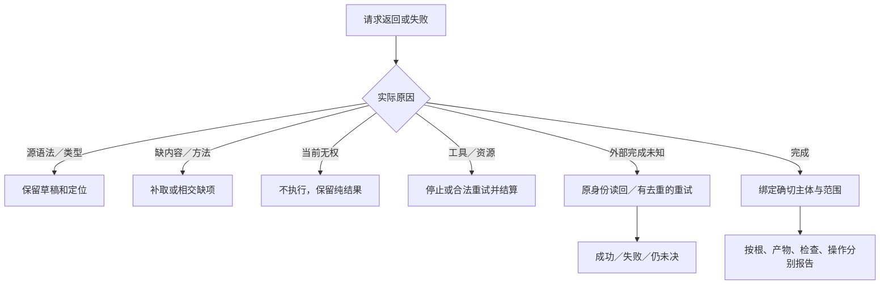

# 操作语义、接口与批处理

> **阅读范围**：采用范围内的设计规范；实现状态另查未决。

<details>
<summary>相关主题与上下文</summary>

- [同一工具合同连接需求计划与简洁作者](#同一工具合同连接需求计划与简洁作者)
- [同一六工具消费跨软件需求，不增加用户操作语言](#同一六工具消费跨软件需求不增加用户操作语言)
- [候选引用的含义与固定开发会话](#候选引用的含义与固定开发会话)
- [同一任务在六工具间的接受关系](#同一任务在六工具间的接受关系)
- [计算构建、运行与定点观察的可选操作扩展](构建运行接口.md#计算构建运行与定点观察的可选操作扩展)
- [从候选直接运行的有限扩展](构建运行接口.md#从候选直接运行的有限扩展)
- [有限交互调试：sec.debug-session/1](交互调试接口.md#有限交互调试secdebug-session1)
- [统一的是含义，不是一个强制大信封](#统一的是含义不是一个强制大信封)
- [AI工具面的具体设计](#ai工具面的具体设计)
- [面向任务的操作族](#面向任务的操作族)
- [客户端适配不复制领域规则](客户端与并行会话.md#客户端适配不复制领域规则)
- [语义增量、临时身份与前提](候选修改与批量.md#语义增量临时身份与前提)
- [基础视图与陈旧变化的处理](候选修改与批量.md#基础视图与陈旧变化的处理)
- [JSON补丁、文本补丁与领域操作的边界](候选修改与批量.md#json补丁文本补丁与领域操作的边界)
- [联合候选、部分接受与真实作用](候选修改与批量.md#联合候选部分接受与真实作用)
- [撤销、重试与跨会话继续](候选修改与批量.md#撤销重试与跨会话继续)
- [本节的验收与反转条件](候选修改与批量.md#本节的验收与反转条件)
- [结果按独立维度表达](#结果按独立维度表达)
- [版本、请求与幂等](#版本请求与幂等)
- [远程、事件与重连](客户端与并行会话.md#远程事件与重连)
- [CLI 与 IDE 适配](客户端与并行会话.md#cli-与-ide-适配)
- [批量与部分接受](候选修改与批量.md#批量与部分接受)
- [待决选择与错误合同](#待决选择与错误合同)
- [安全与可逆选择](#安全与可逆选择)
- [验收设计](#验收设计)
- [功能级变化如何复用共同增量](候选修改与批量.md#功能级变化如何复用共同增量)
- [工程声明的有限入口与语义差异](候选修改与批量.md#工程声明的有限入口与语义差异)
- [计算任务与未启用能力的接口语义](客户端与并行会话.md#计算任务与未启用能力的接口语义)
- [多客户端、当前结果与准备态后继](客户端与并行会话.md#多客户端当前结果与准备态后继)
- [六个工具的处理器步骤与返回责任](#六个工具的处理器步骤与返回责任)
- [封装库与自举不增加第七个工具](#封装库与自举不增加第七个工具)
- [控制差异与非源码资产沿同一候选协议进入](候选修改与批量.md#控制差异与非源码资产沿同一候选协议进入)
- [意图视图、补全结果和问题引用的接口接合](候选修改与批量.md#意图视图补全结果和问题引用的接口接合)
- [管脚与结构编辑仍消费同一操作合同](候选修改与批量.md#管脚与结构编辑仍消费同一操作合同)
- [已定位值的紧凑编辑分支](候选修改与批量.md#已定位值的紧凑编辑分支)
- [六工具在最终模块中的单一执行路径](#六工具在最终模块中的单一执行路径)
- [重构计划沿现有作者批次交付](候选修改与批量.md#重构计划沿现有作者批次交付)
- [开发面到原六工具的输入归一与能力对账](候选修改与批量.md#开发面到原六工具的输入归一与能力对账)
- [进程输入与终端尺寸：sec.process-session/2](交互进程接口.md#进程输入与终端尺寸secprocess-session2)
- [可选作者辅助：定位、补全与有基础的编辑建议](作者辅助接口.md#可选作者辅助定位补全与有基础的编辑建议)
- [编辑器范围批次不能直接当作顺序edits](候选修改与批量.md#编辑器范围批次不能直接当作顺序edits)
- [结构化意图作者复用原输入](#结构化意图作者复用原输入)

</details>

### 分题阅读

- [候选修改与批量](候选修改与批量.md)
- [客户端与并行会话](客户端与并行会话.md)
- [构建运行接口](构建运行接口.md)
- [交互调试接口](交互调试接口.md)
- [交互进程接口](交互进程接口.md)
- [作者辅助接口](作者辅助接口.md)

<details>
<summary>本页内容</summary>

- [同一工具合同连接需求计划与简洁作者](#同一工具合同连接需求计划与简洁作者)
- [同一六工具消费跨软件需求，不增加用户操作语言](#同一六工具消费跨软件需求不增加用户操作语言)
- [候选引用的含义与固定开发会话](#候选引用的含义与固定开发会话)
- [同一任务在六工具间的接受关系](#同一任务在六工具间的接受关系)
- [统一的是含义，不是一个强制大信封](#统一的是含义不是一个强制大信封)
- [AI工具面的具体设计](#ai工具面的具体设计)
- [面向任务的操作族](#面向任务的操作族)
- [结果按独立维度表达](#结果按独立维度表达)
- [版本、请求与幂等](#版本请求与幂等)
- [待决选择与错误合同](#待决选择与错误合同)
- [安全与可逆选择](#安全与可逆选择)
- [验收设计](#验收设计)
- [六个工具的处理器步骤与返回责任](#六个工具的处理器步骤与返回责任)
- [封装库与自举不增加第七个工具](#封装库与自举不增加第七个工具)
- [六工具在最终模块中的单一执行路径](#六工具在最终模块中的单一执行路径)
- [结构化意图作者复用原输入](#结构化意图作者复用原输入)

</details>


完整语言与文件开发路线见[语言体系与开发规格](../../作者/可替换表示与适用范围.md)。本章仅拥有工具与变化含义；六个工具不能替代语法、标准库和目标合同，也不以JSON字段数量证明作者操作面完整。


## 同一工具合同连接需求计划与简洁作者

关系驱动的内部EditPlan/RealizationPlan最后进入现有source/files/edits、结构变化、control-change或绑定候选；直接文件编辑可以跳过重新规划而使用相同检查。内部新增NeedsAuthorContent、ReplanRequired和分项调用资格不是新的作者语法或顶层工具，公共响应通过原诊断/状态/来源位置准确说明，不能将新内部数据直接当成客户端已经协商的字段发送。

propose形成一份可继续的候选，不因计划关联要求就自动运行整个流程；generated-edit仍仅作回源所需的相交再生成。已请求的多个动作由application按当前权限和依赖统一协调，一项失败只阻止真实依赖的后继。多文件语法/类型草稿可以整批保存；保持性结构操作失败则保留原文和冲突，不用普通草稿许可掩盖错误重构。

独立Requirement变更不从普通源码写入权自动取得。给定目标程序增加文件操作与本次执行文件操作分别核对象和授权；可用源码、生成结果、检查和实际操作继续绑定各自版本。


## 同一六工具消费跨软件需求，不增加用户操作语言

当前`query(view="contract")`可以返回对象当前的结果、关系、保持及选择条件；origin/impact/state分别沿原输入取得来源、影响和阶段。此处没有新增公开view枚举，也没有要求每次返回全部语义树。工具只呈现有权、真实取得的相交内容，不把未展示对象判为不存在。

开发AI或编辑器将准确差异交给原source/files/edits、editRef或相应draft联合。内部`planIntentChange`的计划只能降低成已有请求和语义/源编辑，不可被execution作为任意method字符串执行。修改公开要求需取得其实际接受关系，修改代码本身不授予放宽原验收的权利。

propose形成候选，需求中的“运行时要删除/发送/启动”不触发本次真实作用。preview按当前请求生成，check按原声明选择方法，apply/operation沿原权限与前像完成现实动作。生成物回源可能进行必要再生成核对，仍不是自动执行目标软件。多文件和中间错误草稿继续沿既有批量规则，不要求逐条需求都先全面通过才能保存。


## 候选引用的含义与固定开发会话

六工具中的candidateRef统一指**用户作者内容快照**。它与本产品作者语法是否已选、搜索器是否比较多个后端没有同一生命周期。一次preview内联source可以只有一个候选；修改产生新引用不是要求生成多个功能版本来挑选。

当前接口字段按本章v2为实施基线；字段尚未编码不表示实现者可以另选默认语言、将save-source当部署或让类型检查自动修改候选。真实实现与行为验证分开于这次规范决定。基础语言范围、可用库、工具和目标的精确版本由上下文/发行包绑定，模式号相同但内容不同的未发布草案不能混用。

前端对相同snapshot和相同有效输入执行同义操作。明确接受一个目标变更时，修改对应要求关系；只改算法时保留原要求。不需要另一次人工批准的政策不得被界面强制审批，实际缺少决定的情况也不能仅靠生成成功补成接受。

[固定的完整开发会话](../../../examples/连续开发/组合结构与任务轨迹.md#作者源从首次创建到下一次修改的固定会话)是工具与MVP共同验收对象。实际测试只能在获准实现后运行；在此之前，范本用于检查字段、源语法、版本和结果角色是否有空白。成功、非法、缺库、陈旧基础、取消与保存草稿都要沿同一协议返回，不能只演示顺利生成。


## 同一任务在六工具间的接受关系

本节不增加第七个工具，也不新增每次必填字段。现有context/base/candidateRef和受信会话保存任务要求的精确引用；候选、目标产物和作用仍各有自己的身份。没有可解析任务关系时，接口只能声明其实际检查的层级，不能推断所有用户目的已经满足。

| 入口 | 接合行为 | 实际退出与保持 |
|---|---|---|
| query | 返回当前任务在该对象上的接受依据和实际边界，按权限展开展示 | 只读，不将查询到的候选规格自动采纳为目标 |
| propose | 原子形成候选并分类源/合同/要求/案例差异；不要求AI另填分类表 | 原接受关系和旧候选保持；需求变更成为明确候选 |
| preview | 按所选目标组合输入域、实现及布局；内联源走同一路径 | 可返回生成源码和条件，不把生成阶段标为任务满足 |
| check | 固定被问的声明和实际主体；若存在独立要求，区分候选自身检查与要求检查 | 原案例与要求不随失败改写；未请求行为/环境检查明确不扩大结论 |
| apply | 将指定候选或产物作用于目标，复核本次目的、有效前像与所需资格 | 保存作者文件不等于接受新要求；应用代码不等于目标业务运行 |
| operation | 原控制分支查询/取消/恢复；已协商的计算扩展另可启动具体构建、产物运行或候选即时求值 | 新作用须事前准入；重试保留原意图，预览和源码应用不自动运行 |

直接`check(types)`仍只负责其原类型层级，不默加无法实现的万能需求求解器。需要任务级结论时，由既有Claim和验证计划对实际要求分别执行所选方法，并返回明确覆盖。显示内容是实际关系的投影；新增字段和结果分支按公开协议版本协商，不能靠兼容解码器忽略必需语义。

分组接受时，按被保留的修改重新求组合闭包。共享接口的一半修改可能单独生成但不再满足原任务，因此界面允许保存该草稿，却不能直接认定原功能完成。真正独立的输出根可以完成并取得自己的结论；总任务的未完成范围同时保留，不用全局失败抹掉成果。


## 统一的是含义，不是一个强制大信封

人、CLI、API、IDE、图形和 Agent 对同一目标应使用相同的引用、校验、并发、权限及完成语义。入口可以有不同的交互与粒度，不需要每次键入字符都创建持久 Operation。

短查询只需要其对象、版本、查询范围和读取许可，可以同步返回。候选编辑需要基础、变化与约束。外部作用才需要稳定操作身份、目标、前像、效果、资源、尝试和恢复。跨会话任务需要持久保存有关状态。把这些字段全部强制加入每个普通函数调用，会制造与风险无关的成本。

目的、目标、身份、版本、幂等与当前许可分开。目的不是权限；相关事务身份不是传输请求 ID；内容摘要不是对象权限；操作类型不是一次操作；截止时间不是版本。


## AI工具面的具体设计

首期保留`sec.query`、`sec.propose`、`sec.preview`、`sec.check`、`sec.apply`、`sec.operation`六个工具投影，不再按业务能力扩充顶层列表；它们是设计草案，不是已安装SDK。有限工具表并不足以保证短输入：作者载荷同样必须采用源文本或真实局部差异，不能把本应一次库调用的内容序列化成完整Definition树。MCP可承载这些调用，JSON只是传输容器，不要求业务程序也写成JSON节点。

| 工具 | 默认作者输入 | 承担的工作和边界 |
|---|---|---|
| `sec.query` | 具体引用、所需投影；查找时给局部范围和问题 | 读取/解释实际需要内容；已知符号不先查询目录；全局搜索仅在请求需要时启用 |
| `sec.propose` | `source`、多文件`files`、带`base`的差异，或真实`editRef`及新值 | 形成候选、分配必要身份、补真实依赖；不修改现有目标 |
| `sec.preview` | 内联`source`、`candidateRef`、冻结`context+entry`或结构型`draft`四选一 | 规范为同一候选，返回代码/差异和必要诊断；默认不执行业务、不写目标 |
| `sec.check` | 实际候选/产物与所请求的方法 | 静态检查或经准入的工具检查；不修改对象或独立期望 |
| `sec.apply` | 候选与准确目的/目标，宿主已有基础可用固定引用 | 本v2仅保存作者源或写回选定产物；采纳/发布属于另行声明的领域操作，不能用未知mode偷渡 |
| `sec.operation` | 已有操作引用；或明确协商的计算/调试分支 | 原控制仍有效；计算及有限调试按各自合同，旧权限不恢复、事实不重写 |

普通闭合模块可一次`preview(source=...)`取得输出。已有固定上下文时使用`source+context`；修改已存在的候选时使用`base+edits`或`base+files`。裸`source`分支不接收`base`，不能将互斥分支混填。上述短输入已经足够，不重新传类型、目标、规则锁、输出身份和签名。结构型`draft`保留供确实需要图编辑/交换的消费者，不是默认快捷方式；其与source得到的候选必须同义。

`source`默认完整模块，表达式和区域使用真实context提供的语法类别、自由绑定和控制出口。v2对没有显式解释的裸source规定语言ID为`sec.semantic/1`；该ID与实际解释器/语言合同的精确内容不是一回事。服务在已声明的能力或发行绑定中取得对应修订并固定到候选；没有合格修订时返回语言实现/绑定缺项，而不是猜TS、联网取latest或执行输入。target另按本次固定默认决定，无目标时可形成源候选但不声称已生成。临时模块不要求工程目录；服务返回实际解释引用，迁出保留必要绑定。

缺依赖时不得把预览自动升级成全网搜索、包安装或执行作者模块。既有本地内容的名称/导入解析由编译服务完成；需要新外部内容或不可信过程时，返回准确缺项和作用要求。允许的复合请求可以一次完成相应动作，但每项实际作用仍独立准入，不为纯分析强制人工确认。

### 参数由谁提供

AI提交业务源或变化、无法推导的要求及真实作用目的。服务通过实际基础与锁完成解析、身份、读集、类型观察与生成；宿主提供当前权限和预算。不能要求AI维护source、signature、context.types、composition.steps四份同义内容。

`context`是服务实际签发的不可变、受作用域约束的引用；它绑定语言/工具画像、可见内容及其版本、导入/别名与输出默认。它不包含长期授权，也不等于模型已经读过其内容。不同任务、租户和目标不能通过同名短引用串用。到期、撤权和必要输入改变分别返回诊断；不悄悄从当前cwd、环境变量或latest恢复。

自然语言用于形成候选，确定生成不反复解释自然语言意图。源中的名字经词法作用域和锁定导入解析，不凭模型给出的`r:...`自述成功绑定。画像已有的语义提示只在首次使用或版本改变时提供；重要未知仍需明确，不以省token隐藏。

### 最小结果而非万能信封

短任务默认返回所请求的代码或差异、候选引用、必要诊断和一个明确产物阶段标记；例如`stage=generated-unchecked`只表示源码已产生，不能读成检查或应用成功。没有请求的构建/行为/部署阶段不重复列五份`not-requested`对象；完整分层状态仍在同一结果中按需展开，未知与部分输出必须显式出现。

不默认重复回显输入、整份IR、锁清单、完整来源图和整段输出解释。任务只改一处时可返回与固定基础绑定的差异；要取得完整源码时仍能直接读取。小产物不要为“节省字数”只返回裸ID并制造额外往返；大内容截断必须给范围和继续位置。

成功压缩不能把相同文本在`content`和`structuredContent`中重复注入模型；协议要求兼容表示时由适配器去重或明确标记，实际模型上下文仍计入成本。工具schema本身也进入冷启动和重复提示成本，不能只缩短一个字段后宣称任务已经便宜。

### source和结构draft的准入与兼容

这是未发布工具草案中的当前作者协议选择；不是给已经发布的旧Schema静默加字段。内联source、已有candidateRef、已冻结context+entry、显式结构draft为互斥输入分支；source分支可以附其环境context，但不能再带candidateRef或entry。完整分支和字段见[v2调用字段](#v2调用字段与控制动作)，禁止静默选其中一份忽略冲突输入。source是UTF-8有效文本，并受字节、解析深度、节点及展开预算限制；接收失败先返回诊断，不落入任意解释器。

会话可一次固定默认画像，完整模块只提交source；同会话并发候选仍以明确不可变context/base区分，不能用一个全局lastCandidate猜本次基础。修改带前像；新建闭合模块无须伪造旧基础。旧结构请求可以继续走自己的适配器，但只有共同可表达范围才承诺同义。稳定源字节优先保全，生成/格式化是明确动作，不借解析重排原生文件。

外部过程的check、作者保存、目标apply都继续由各自合同决定实际作用。表面上只传source，不能被执行端解释为“运行这段脚本”。工具schema简短也不能把任意kind交给动态执行器而失去封闭语义。

### propose、draft与普通文本编辑的准确分工

`propose`形成有明确基础的新候选；不意味着接受全部需求、保存工作树、全量编译、构建或运行。`draft`是其互斥输入中的一种字段，内部以kind区分结构、控制或generated-edit等变更；它不是必须先创建的一份独立作者文件，也不是每个普通源编辑必须携带的套层。

已有文本差异使用edits，整文件/多文件使用files，局部值修改可用已经取得的editRef；客户端还可以从真实编辑器或工作区[成组捕获](../原生维护/导入观察与原生资产.md#text-workspace-capture)，复用相同候选构造器。后者是现有宿主输入能力，不新增公开工具联合或另造一个未经定义的transport字段。

| 路径 | 默认做什么 | 不隐含什么 |
|---|---|---|
| 普通作者source/files/edits | 捕获整批、建立必要映射，返回候选与当前已取得诊断 | 所有目标生成、运行、保存；不是返回候选就必须全类型检查通过 |
| 类型化结构/控制draft | 校验自身前提和解释，形成相应作者/控制差异 | 仅字段合法就声称所有后端已履行 |
| generated-edit | 保留目标草稿，回源与重基，按I-R6再生成相交范围验证对应 | 完整工程构建、案例运行、工作树写入 |
| preview/check/operation/apply | 按各工具选定对象完成相应动作 | 自动执行这几类动作的全链 |

同一次合法多文件编辑先组装最终草稿再检查互相引用，不能因修改中途的暂时错误迫使逐函数恢复绿色。细粒度补丁与整文件代换有各自成本；不知道old的唯一匹配时优先取得真实文件或用完整文件，不强迫AI手造几十个节点ID。普通批处理不改变edits的有序匹配语义，不把files未出现路径当成删除。

### v2调用字段与控制动作

`sec.ai-tools/2` 定义裸 source 的默认语言及多目标产物选择，不能由旧版本读取器静默猜读。未知顶层字段按协议诊断，解码支持与实际方法支持分别报告；合同示例不构成服务符合性证明。

| 工具 | 本版本字段与互斥条件 | 准确结果 |
|---|---|---|
| sec.query | at?、find?、view?、limit?、cursor?；view为source/contract/diagnostics/impact/origin/state，默认contract；limit默认20、范围1—200；游标续同一查询 | 当前可披露内容与覆盖；已知符号无需先查询 |
| sec.propose | 六选一：source,name?,sourceLanguage?,context?；base,edits；context,entry；显式draft；files,base?；editRef,value。可给return=summary/diff/source，默认summary | 同一公共语义候选与诊断，不含默认物理作用 |
| sec.preview | 四选一：source,name?,sourceLanguage?,context?；candidateRef,entry?；context,entry；显式draft。另有target?、compareTo?及return=code/diff/summary，默认code；return=diff时compareTo必需，return为code/summary时不得传compareTo | 候选与实际artifactRef、所请求源码/差异/诊断；不执行目标或写入 |
| sec.check | candidateRef；artifactRef?；methods为types/cases的非空无重复集合，默认types；cases必须有casesRef和artifactRef | 无artifact时types只查源语义；有artifact时检查该产物的目标类型/构建条件；cases只运行精确目标案例 |
| sec.apply | candidateRef、mode=save-source/write-output、targetRef、base、requestId；write-output必须有artifactRef，save-source不得有artifactRef | 当前授权下的操作身份与真实读回；产物选择不授予权限 |
| sec.operation | 基础分支为operationRef、action=status/cancel/resume/rollback；`sec.compute-run/1`协商计算start联合，`sec.debug-session/1`另协商debug-launch/debug-attach及debug控制联合 | 当前可披露状态；新作用必须显式请求；基础v2不因本表描述扩展就接受未知字段或恢复方向，不支持的恢复方向仍不能靠改名执行 |

本表是基础分支；[可选作者辅助](作者辅助接口.md#authoring-assist-contract)为query增加准确位置的互斥分支，为显式draft增加author-edit变体。只有协商该准确能力并有真实消费者的端才接受，原六选一和既有默认不被隐式改义。

sourceLanguage只选择作者解释，如`sec.semantic/1`基础入口、`sec.object/1`当前基础＋局部控制＋有限对象入口或显式原生前端；新通用项目/会话可在初始化时一次固定对象入口，客户端沿实际context使用。没有context也没有显式解释的v2裸source仍保持原基础默认，不因看到class或导入sec/object就自动升级。target只选择已绑定生成画像；targetRef仍表示实际写入位置；artifactRef标识实际生成内容。不能把这四者合成一个“language”或“target”来掩盖身份。真实适配版本由服务/锁解析，不让AI自行填摘要。

先按显式sourceLanguage或冻结context/已给文件角色确定解释；三者冲突时诊断，不按文本猜语言。没有任何解释信息的裸source在v2采用`sec.semantic/1`。name省略后再按已选解释生成虚拟名称：中立源为snippet.sec，已选TS为snippet.ts；不能先赋snippet.sec再把显式TS误判为冲突。显式原生路径按冻结映射使用，不给已有目标覆盖许可。候选已绑定源解释，重新preview不能传sourceLanguage改写它，只能选择目标。target省略时用本次固定默认；没有明确后端时返回target-required，仍可创建/分析语义候选，不默认把它当TS。

同一候选可生成多个目标，生成A不会删除B，也不会修改语义源。artifactRef绑定作者候选、实际读取闭包、目标画像、工具、布局、实际成员与字节；检查器在处理请求时核对全部相交绑定。即使当前只看到一个产物，也不能把其他候选或旧布局下的产物冒充本次结果。check的目标检查/cases以及write-output显式选择artifactRef，不读取“最后一个”或依当前缓存数量解释同一请求。

edits保持有序非空的{path,old,new}：old非空且在该步候选文件恰好匹配一次，零或多次报EDIT_NOT_UNIQUE；new可为空。普通多文件原文通过下述files分支处理，结构变更继续使用既有semantic-change适配。propose的return=diff必须有明确作者base；preview的diff使用下述compareTo产物前像，不能要求一个未在其协议中定义的base字段。运行失败不能修改期望；省略未请求状态不等于全部完成。

真实bootstrap/context按需固定语言合同、基础库、目标、作用范围与预算，不是另一个无限工具。拿到上下文不表示AI已理解全部内容或取得权限。公开陌生合同可以局部查询，确定名字解析不需要每次模型搜索。

<a id="generated-edit-request"></a>
### 受管生成物修改的准确输入

在现有`sec.propose`的显式`draft`联合下，新增经能力协商的`kind: "generated-edit"`。这是实际新增的请求分支，不是旧客户端只要忽略新字段便兼容；没有相应解码和处理能力时返回明确Unsupported，仍可保留原始目标改动。六个顶层工具不变，不新增反向编译服务。

| 字段 | 必需性与准确含义 |
|---|---|
| `kind` | 必需，`generated-edit` |
| `base` | 必需，当前作者候选C1；可以与产物原作者C0不同，三方处理不得省略 |
| `artifactRef` | 必需，原受管生成物G0及其真实来源；不是编辑后的字节，不是“当前最新输出” |
| `edits` | 必需，非空有序`{path,old,new}`数组，path在G0成员中；old非空且每步唯一匹配，new可为空；同原文本差异规则 |
| `scope` | 可选，`occurrence`为默认，只改变请求定位的出现/使用点；`definition`明确要求提出相交定义全部消费者的变化 |

示例请求完整形状：

```text
sec.propose({draft: {
  kind: "generated-edit",
  base: "C1",
  artifactRef: "A0",
  edits: [{path: "out/threshold.ts", old: "10n", new: "12n"}],
  scope: "occurrence"
}})
```

C1、A0是示例引用，实际由工具产生且必须可读取。输出仍使用已有候选/诊断/来源返回形式；内部处理结果为以下互斥联合，适配层只呈现实际存在的成员，不创建通用大信封：

```text
Mapped { candidateRef, changedAuthorRefs, affectedTargets, diagnostics }
Pending { targetDraftRef, sourceBaseRef, locations, cause, requiredDecision }
Conflict { targetDraftRef, sourceBaseRef, conflicts }
Rejected { cause, locations }
```

`Mapped`表示目标差异已全部解释并形成作者候选；所选程序仍可能需要后续运行检查，不能将它解释为产品验证通过。`Pending`保留目标草稿但没有可发布的完整回源结果；cause明确区分TargetSyntax、MissingOrigin、MissingRule、UnmappedEdit、NeedsAcceptance与MethodFailure。没有需要用户决定的内容时`requiredDecision`为空，不把工具故障冒成用户需求不清。结构请求非法或路径不属于原产物则Rejected，不用部分成功吞掉条目。严格原字段联合与返回选项的实际序列化必须随该扩展一起实现。

处理器沿[I-R0—I-R8](../../编译/表示/编辑与受管回源.md#managed-edit-roundtrip)：固定C0/G0/M0/C1，形成T*，按来源角色与规则写回，重基、再生成并发布C2。状态和草稿保留使用原引用生命周期；新分支不具有保存或运行权。编辑器直接修改磁盘生成物时，先捕获该版本为目标草稿并对G0计算同类差异，不能修改不可变ArtifactSet或提前转移作者权。

只改原生作者TS文件可直接编辑并捕获，也可走普通`base/edits`或`files`；只改公开名可以直接用已有`control-change`；知道原作者槽时直接源编辑更小。自动路由依实际拥有者和输入关系，不让调用者为一次小改动手选所有层。

对单个目标出现请求与共享源定义相冲突的情况，默认给出安全的局部候选或准确范围冲突，不能扩大为定义变化。反过来，显式definition请求也仍须核消费者与授权，并不保证所有调用方可自动迁移。检查和实际应用继续使用C2及对应新产物，不对A0原地打补丁后声称它仍是旧内容。

### 多文件作者输入与文件级修改

`files`补齐同一工程中创建、分拆、移除作者文件的常用路径。它是`sec.ai-tools/2`未发布草案的一项显式修订，不是第七个工具，也不是目标文件写入许可。preview仍消费内联单源或已有候选；多文件先由propose形成一个共同候选，不隐含执行和物理写入。

`files`为路径到源字符串或null的非空映射，路径是候选逻辑根内的普通相对路径，遵守现有规范化、冲突、预算与作者拥有者规则；拒绝重复JSON键、路径别名、目录/文件碰撞、绝对路径和越界段。一次创建中两个模块可以互相引用；所有文件合并到候选后统一建立声明与名称关系。

无base时，值必须全部为源字符串，建立新的多文件候选；它不声明磁盘同名文件不存在，也不抢占已有路径。这个简明入口的新文件采用明确的`.sec`中立角色；要新增其他语言或混合结构区域，使用已带真实语言角色的context/draft适配，不能只凭未知后缀运行解析器。

有base时，字符串是该路径的完整新作者文本，null表示删除已存在作者文件。已有文件保留base绑定的语言/区域角色；新增`.sec`文件采用中立角色。删除不存在、未观察或受保护路径须诊断，不把未知当absent；不得经files移除恢复状态、目标产物或其他任务的文件。文件重命名在简明入口是删除加新建，**不保证自动保持语义身份**；需要可靠身份迁移时使用原语义变更/移动协议。外部引用和公开路径改变仍检查真实影响。

`files`与source、edits、draft、entry/context输入分支互斥；base只在该分支作为已有候选的前像，不是目标工作区的base。服务原子形成整批的一个新候选，不在半批时公开可生成结论。源语法或类型尚不完整可保留为带诊断的草稿；路径、编码或权限结构非法则拒绝该批，不悄悄丢掉其中一个文件。

对已有单处修改继续用edits更省输入，不强迫发送整个文件。检查、预览和实际apply继续核对各自对象，后端不会因为新作者文件出现自动在工作树中创建它。

```text
sec.propose({files: {"model/a.sec": "export fn one() -> Int = 1;",
                     "model/b.sec": "import \"./a.sec\" as a; export fn two() -> Int = a.one() + 1;"}})
  → 同一候选c1
sec.propose({base: "c1", files: {"model/note.sec": "export let version: Int = 2;"}})
  → 新候选c2，c1不变
```

这是设计示意，不是已经存在的工具返回。操作协议提供完整开发原文的投递路径，函数、类型、绑定和执行含义仍由[语言规格](../../作者/可替换表示与适用范围.md)拥有。

### 一次开发中的准确调用

以下是设计调用形状，不是已安装接口；只设计任务不执行它们：

```text
sec.preview({source: "export fn twice(n: Int) -> Int = n * 2;", target: "typescript"})
  → candidateRef c1，artifactRef a-ts，所请求源码，generated-unchecked
// 仅在当前任务明确选择Java时才请求该条件性目标；它不是默认开发步骤。
sec.preview({candidateRef: "c1", target: "java"})
  → 同一c1，artifactRef a-java，或明确的目标能力缺项
sec.preview({source: "export const twice = (n: bigint) => n * 2n;",
             sourceLanguage: "typescript", target: "typescript"})
  → 原生输入独立候选，不冒称它已成为中立算法

sec.propose({base: "c1", edits: [{path: "snippet.sec", old: "n * 2", new: "n * 3"}]})
  → c2，旧c1不变
sec.preview({candidateRef: "c2", target: "typescript", return: "diff", compareTo: "a-ts"})
  → artifactRef a2-ts，差异绑定a-ts和a2-ts
sec.check({candidateRef: "c2", artifactRef: "a2-ts", methods: ["types", "cases"], casesRef: "cases7"})
sec.apply({candidateRef: "c2", artifactRef: "a2-ts", mode: "write-output",
           targetRef: "workspace7", base: "b7", requestId: "change-12"})
```

语义体可以同时携带require/ensure和普通算法；字段来源、所需保证和目标选择分别维护。纯预览只在内存形成候选，不因多语言增加数据库、构建脚本或任务服务。真实外部工具检查和写回才需要当前权限，代码字符串不签发执行许可。

小结果直接返回所请求代码，大结果按范围与游标展开。generated-unchecked、invalid、blocked、partial准确区分；checked绑定实际检查，applied绑定实际操作。候选来源与输出布局都可解释，但不默认重复把输入、IR、锁、旧状态全文返给AI。

### 当前接口需要验收的完整闭环

画像及本地基础库已绑定的正常短任务，零额外能力发现调用；AI直接提交[紧凑短函数](../../../examples/连续开发/组合结构与任务轨迹.md#一次调用的设计形状)，服务解析导入并生成结果。修改keep后仍只传局部源码或差异；换上下文或接口发生歧义时只查询相关合同，不列全球目录。冷启动必须把真实画像与陌生库提示计入，而非假定模型天然记住它。无工程片段、模块和已有工程路径使用同一规则。

本画像的字段、互斥、缺省与控制枚举已按[v2调用字段](#v2调用字段与控制动作)确定；未来需实现读取器和符合性检查，不能以未实现为由继续把这些作者选择留空。这里没有运行工具或创造实际candidate/context引用。


## 面向任务的操作族

| 用户行为 | 规范作用 | 返回 |
|---|---|---|
| 看现状与解释 | 查询获准范围、取得来源和覆盖 | 有版本的事实、诊断、未知和展开引用 |
| 编辑或提出设计 | 在指定基础创建候选增量 | 候选、冲突、影响与待决项 |
| 比较或选择实现 | 在明确约束和预算内搜索、比较 | 候选与依据、覆盖和推荐，不自动授权 |
| 预览和生成 | 推导所选输出 | 候选制品、差异、来源和缺口 |
| 检查 | 对指定对象运行获准验证 | 实际结果与声明适用范围 |
| 接受定义或选择 | 依据相应权责接受精确对象 | 新定义修订或明确拒绝 |
| 应用、集成或发布 | 执行精确目标的获准计划 | 操作身份、发生的作用、结算及读回 |
| 取消、继续或恢复 | 改变允许继续的行为或执行恢复意图 | 真实状态和下一步条件，不改写历史 |

领域可定义自己的操作合同，但通过固定工具与固定调用/变化构造引用，不把每个领域动作注册成新模型工具。新增真正的协议动词才需要工具协议版本演进；已有工具内任意未知kind也不能被当作万能执行入口。纯操作不经过 AwaitingAdmission→Running→Verifying 的完整持久流程。


## 结果按独立维度表达

结果区分请求是否被理解和接受、产物是否存在、检查结果是否符合当前声明、外部作用是否发生、是否仍需恢复。没有操作被请求与操作失败不同；旧通过、当前失效、无法观察也不同。

适合的公共结果包含对象与候选引用、实际输出、诊断、未知和覆盖、相关检查、效果与恢复状态以及允许继续的动作建议。大对象按引用传输。建议动作不携带永久授权，也不保证列表在状态变化后仍完整；调用时必须重查。受限结果只能给出有权披露的解释。

草稿结果可以是部分可用；选择多个输出时逐项报告。不能用一个成功成员掩盖其他必需成员失败，也不能让一个无关输出失败阻止所有已完成的独立结果。


## 版本、请求与幂等

跨会话持久候选和序列化交换从出现时就需要明确格式与语义版本，不能等第二个外部消费者出现才发现无法解释旧数据。内部瞬时结构可以按编译单元演进；公开协议和持久语义不等同。

普通可显示的未知扩展字段可以按版本政策保全。影响安全、效果、类型或状态的未知枚举与必需字段不能一律透传后视为支持；需要明确协商、降级或拒绝。读取旧内容与执行旧规则分开。

重试同一效果须使用原操作身份和相同作用域、规范载荷、目标与幂等条件。载荷变了就是新意图。计算缓存可以跨等价输入复用，不代表两个独立请求拥有同一 OperationRef，也不复用许可。


## 待决选择与错误合同

待决请求保存对象、问题、可选范围、推荐、后果和有权角色；恢复时核对候选没有变化。无法取得必要决定时保存待决状态并继续独立范围，不强迫全部任务停止。审批不由请求里的 approved 字段签发。

错误使用稳定原因码、实际对象、已知事实、未知、是否产生作用及安全下一步。类型非法、能力不支持、前像陈旧、权限拒绝、预算不足、操作失败和不确定完成分别表达。原始堆栈只作受限调试材料，不能承担状态机或泄露完整工程。


## 安全与可逆选择

数据上传先进入获准的内容范围，不自动解压、安装或执行；路径、资源 URI、命令参数、下载和剪贴板都需要相应边界。跨项目或租户的结果复用不仅比较内容，还检查可见性。工具声称安全不替代受信宿主判断。

接口保持最小必要信息。一次本地查询不需要完整长期日志；一次真实外部写入则不能省掉其恢复身份。默认采用最小合同，出现真实持久、跨主体或跨环境需求后补相应机制，不凭“统一”强制全用户负担。


## 验收设计

等价规范输入在各入口产生等价语义，不要求独立调用拥有相同时间、身份或回执。需要检查无副作用查询、陈旧基础、未知字段策略、重复请求、超时后读回、事件缺口、撤权、部分批量、同文件不同区域、跨文件共同约束、权限隐藏以及设计目的提前完成。未完成的产品实验不能由协议字段完整性替代。

<a id="block动作不增加一组竞争工具"></a>
### 组合编辑不增加一组竞争工具

需求解析、任务分解和候选创作由开发AI／应用层承担；`source`仍然是准确语言源码，不接收任意自然语言并直接执行。现行六工具消费精确作者内容与实际引用。没有新增“执行意图”“选块”“自动完美”的隐式入口。

参数用已有edits或editRef；结构连接用已定义的semantic-change；新算法用source/files；目标覆盖用control-change。相应读取器仍核基础、绑定、作用域和权限。组合视图可以提供有效编辑，不能由图形布局决定求值或将“显示了一个block”当作已授予调用能力。

未来成品对自然语言可提供一个上层客户端，但它只在相同任务与委派内调用这些工具；不形成第二个宽松内核。当前协议字段及错误继续以本章现行表为准。


## 六个工具的处理器步骤与返回责任

<a id="fig-result-dimensions"></a>

### 图解：失败类别与合法继续位置

该决策图用于处理结果，不将不同主体合成一个全局成功状态。纯草稿可以保留，缺权限不改成不支持。



字段表规定能传什么，本节规定实现收到请求之后实际怎样处理。所有工具先执行协议检验和当前内容访问判断，再使用共同候选/绑定服务；不是六套各自判断真值的引擎。处理过程中取得的内容被占用至结果返回或显式转交，引用到期不使正在处理的字节突然被替换。

| 工具 | 正常步骤 | 结束时提供 | 保持不变 |
|---|---|---|---|
| query | 固定at和过滤→取得当前可披露范围→按view读实际内容→按limit分片并绑定cursor | 内容、覆盖和继续位置；空结果也记录实际过滤与范围 | 作者、目标和已完成操作 |
| propose | 规范化一条输入分支→固定base或新建范围→隔离应用整批→解析角色/声明→形成新候选及诊断 | candidateRef、请求的摘要/差异/源码、必要身份对应 | 旧候选及真实文件；无基础的候选不抢占现有路径 |
| preview | 复用propose或已有候选→按输出根解析目标→完成纯编译；确需外部生成/工具计算时使用已有宿主准入，否则返回该处缺项→形成Artifact→需要时与compareTo比较 | 精确artifactRef、代码/差异与分阶段诊断 | 作者候选、工作树、部署；已生成的其他目标产物 |
| check | 固定候选、可选产物和案例→核对相交来源→选择实际方法→外部方法经宿主准入→记录Verdict | 每方法结论、覆盖、实际环境与需继续事项 | 被检主体和独立案例期望 |
| apply | 解析mode→固定内容/目标/base/请求身份→授权后查原操作→必要时建立持久意图→条件应用→读回 | operationRef、实际结算和残余 | 未在写集内的内容；旧操作历史 |
| operation | 按当前披露权读实际意图→验证action是否支持→status读回或进行准入后的cancel/resume/rollback→结算 | 当前真实状态与下一合法动作 | 原请求含义和已发生事实，不因换action制造新成功 |

query跨提供者的页值、确定前缀、未显示预取项和终结算法由[Provider页组合](../../信息/接入检索与派生.md#provider-page-composition)承担，外部仍只使用本章limit/cursor及原结果覆盖。没有各源下界时可返回带范围的局部结果，不把它改标为全局首屏；cursor不可恢复时给准确失效结果，不悄悄从当前latest续上。

### 批次、草稿和错误的顺序

参数类型、互斥分支、字节预算或路径结构非法时，在创建候选之前拒绝。访问不允许时，不通过差异或错误泄露不可见对象。合法文本但语法或类型不完整，可以形成draft；诊断与原始字节共同保存。生成需要的某一输出闭包不合法时，该输出不完成，独立闭合输出按各自状态返回。

差异对同一不可变base按顺序应用；每一步在当时的候选文本里核对old唯一性。第k步失败时整批不发布为新有效候选，前k−1步只在临时区存在；可以提供失败定位和可恢复编辑内容，但不伪称部分请求已应用。请求本身明确独立组时，才按共同增量合同分别完成。

目标差异的compareTo必须属于可披露的实际旧产物，并与被比较的目标/布局关系相容。没有合法目标产物基础时返回NO_ARTIFACT_BASE，与本章目标差异合同一致；作者源差异缺基础才使用NO_DIFF_BASE。调用者可请求code，服务不暗中构建一个历史产物凑基础。返回空diff意味着两个被比较对象在该差异语义下相同，不表示内容和所有证据都永久有效。

### 错误怎样推动下一步

IMPORT_UNRESOLVED返回缺少的显式导入和所查范围，作者可补定义或绑定；TYPE_MISMATCH返回源位置、期望与实际类型，修改相交内容；TARGET_UNSUPPORTED返回缺哪项目标映射，可换获准目标或继续源设计；SOURCE_STALE返回当前可披露前像与原基础差异，可重基；PROVIDER_FAILED保留候选与工具原因，处理环境而非删业务；AUTHORITY_DENIED说明被拒的作用范围，纯读取或设计是否仍可继续按当前权限判断。

这些是既有诊断类别的职责说明，具体错误码沿对应版本合同，不通过新增任意字符串动作绕过六工具。每个错误在规范拥有者处有原因、可用结果和下一步。重复同一失败且输入未变时直接使用原观察；新内容、新方法或真实恢复前提变化后才重新尝试。

### 进展和状态裁决

每个已准入内部阶段消耗预算并完成一个有限步骤。需要外部决定时，返回等待条件和可继续引用，而不是把线程、锁或模型轮次无限占住。调用失败可以重试传输，但只有原逻辑请求身份和目标合同允许时重试作用。取消在作用之前阻止启动，作用之后记录实际已发生内容并交给结算/恢复。

整体success由本次工具及目的定义，不由所有可能阶段共同定义。propose的成功可以是保全了带诊断草稿；preview的generated-unchecked只证明形成源码；check通过只覆盖实际方法；apply完成才有相应目标读回。调用者可以请求更完整的结果投影，规范正文可以详尽，日常响应不必重复全部内部状态。


## 封装库与自举不增加第七个工具

读取和检查遵守当前候选所绑定的画像修订。新opaque修饰在不支持的旧解释器中返回相交不支持，不能忽略修饰后把全部字段公开。query的contract视图默认呈现合法公开接口，source视图在实际读取许可内才展开实现；二者共用真实定义身份，不产生一份手工接口模型。

创建库仍可使用source/files和原edits/draft。包出口扩展是已有工程清单内容，普通模块不必声明它。preview能生成源码或已支持的包制品，apply只执行现有save-source/write-output两种作用，不因内容包含发布配置就上传仓库。分发、部署、自修改等更强动作经实际支持的提供者与授权协议进入，不能把未知mode塞入六工具绕过解释。

自用目标也采用candidateRef、artifactRef和当前目标前像；被替换的编译器不能更改当前操作的恢复意图。切换某个实现或语言版本形成新的绑定，不以更新服务进程中的“当前编译器”就重解释旧候选。生成完成与正式采用依然是两个事实。


## 六工具在最终模块中的单一执行路径

entry只做版本协商、载荷解码与有限呈现；application固定本次目的和上下文。query从workspace/compiler/assurance读相交视图；propose先由semantics或格式方法产生真实AuthorDelta，再由workspace封存；preview调用固定编译服务并在获准时补输入；check先取得义务与方法计划，真实工具交execution；apply取得精确SavePlan或ArtifactSet并调用execution；operation查询/取消/恢复已有实际操作。

上述路径使用[最终模块合同](../../架构/装配/模块与运行实例.md#最终逻辑模块与公开接口)，不新增公开工具字段。公共结果中的源、生成、检查和实际作用是相应对象的投影，不是一个可由entry自行修改的总状态。compiler不会因为preview请求希望显示checks就伪造已运行；检查记录后到可以更新其查询视图，不改ArtifactSet身份。

NeedInput只让application取得指定范围的内容或工具结果；不会把模型返回的一串命令提升成执行动作。补输入发生冲突、image已不适用或当前无权时，保留真实缺项与独立结果。短editRef仍只修改精确基础；需要更新工作区头时另用真实apply前像，不通过“同一会话”跳过比较。


<a id="structured-intent-entry"></a>
## 结构化意图作者复用原输入

完整模块可经原`files`提交准确JSON，已存在的模块经同一`base/files`或精确`edits`形成候选；不在`source`字段里按首字符猜语言。解释由范围/模块外壳和已固定上下文决定，裸文本的旧协议仍按旧合同处理。临时结构模块无需伪造永久项目，但要有足以解释外壳、定义、引用和目标的实际上下文；需要保存迁出时才产生真实清单/锁。

辅助管脚视图从同一Definition参数及公开Rule字段取得；已有`set-input`或编辑计划指向本源的参数发生。`use`实参对象不是运行动作指令，`require/prefer`字段不签发权限。接受结构变更后进入原候选构造、类型/组合与需求检查，再调用原preview/check；缺目标画像、方法和当前授权分别报告。结构解码、候选合法、可生成、已作用各自有状态，不能一个解析成功就串通后续。

没有新公共工具、新JSON-RPC、独立需求存储或双写文件。字段完整规范见[结构合同](../../作者/结构化源码.md)；文件/目录、文本顺序patch、原生编辑批次和已有process-session/2、authoring-assist/1仍保留各自精确协议。
