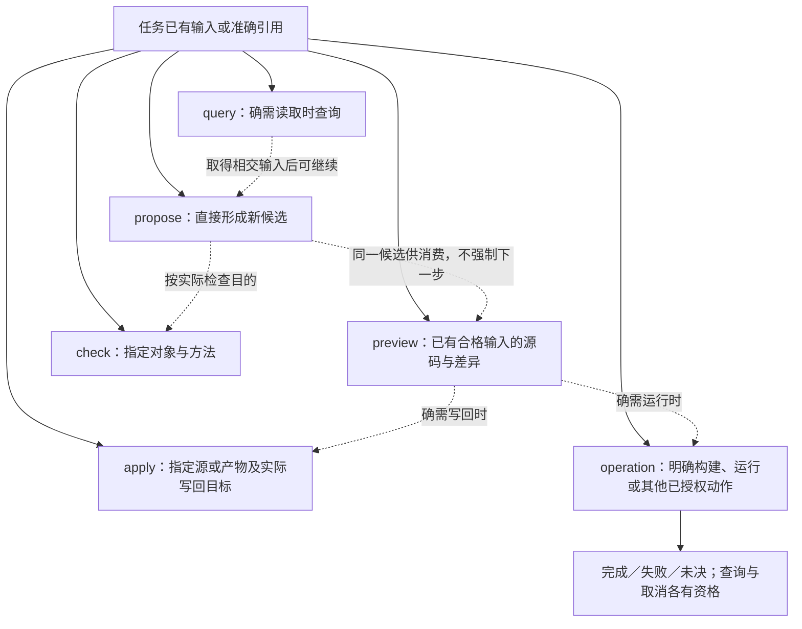

# 构建运行接口

> **阅读范围**：采用范围内的设计规范；实现状态另查未决 · [共同上下文](六工具与请求.md)。

<details>
<summary>本页内容</summary>

- [计算构建、运行与定点观察的可选操作扩展](#计算构建运行与定点观察的可选操作扩展)
- [从候选直接运行的有限扩展](#从候选直接运行的有限扩展)

</details>


## 计算构建、运行与定点观察的可选操作扩展

<a id="fig-six-tools"></a>

### 图解：六工具按目的分流，不是一条强制流水线

实线是可能的结果依赖；分支必须由真实请求启动。operation包含已有的可协商计算启动，不由preview暗中运行。



`sec.compute-run/1` 是复用 `sec.operation` 的能力合同。`sec.ai-tools/2` 的 `operationRef＋status/cancel/resume/rollback` 控制分支保持；服务只有声明并实现本扩展后才接受 `action:start`。不支持时明确返回缺项，不能忽略启动字段并伪装成查询。

构建和日常运行通过本节启动合同进入实际执行；`preview`不隐式运行，`check(cases)`只承担所选案例检查，不作为任意运行接口。此合同覆盖有限构建、运行与观察；交互式断点、暂停读取和单步由另行协商的[有限调试合同](交互调试接口.md#debug-session-contract)承担，修改栈帧/变量及任意求值不包含在这两个合同中。

### 精确输入联合

| kind | 必需字段 | 可选字段 | 含义与禁止混用 |
|---|---|---|---|
| `compute-build` | action=`start`、kind、artifactRef、requestId | return=`summary`或`outputs`，默认summary | 构建该份已生成的源码/资源产物，工具与构建入口由其精确绑定取得；不接受entryRef、argumentsRef或observationRef，不默默安装缺失依赖 |
| `compute-run` | action=`start`、kind、artifactRef、entryRef、argumentsRef、requestId | observationRef；return=`summary`或`outputs`，默认summary | 运行已具有相应可调用形态的精确产物；指定实际入口与不可变类型化输入；可请求已绑定的有限观察 |

顶层只接受本表字段。缺少目标构建策略、运行器、入口、参数或观测能力时返回具体缺项，不按文件名执行shell、不从源码猜`main`、不读取全局latest。artifactRef不必是机器码：JavaScript模块、JVM包、可执行文件、Wasm实例包或合格的调用库均可由各自Runner消费，但每份制品必须明确其形态与实际依赖。

`entryRef`由该产物的公开入口目录解析，可以复用已知短名；短名必须在该产物内唯一，解析后绑定真实符号与调用合同。参数按入口类型与编码解码，运行时类型错误不能通过强制转换绕过。`argumentsRef`定位已经实际存在的固定输入内容及编码，空参数也使用明确的空输入对象；应用/SDK可以先通过现有内容入口创建引用并与运行请求合并为一次客户端用例，不要求AI手写内容哈希。没有内容服务时，返回具体取得方式或缺项，不能编造一个引用。

入口中的文件和设备参数是受控引用或合法的实际路径绑定，不是原文字符串自动获得的权限；CLI标准输入、环境、工作目录由Runner的已接受画像从本次准备输入取得。省略不表示继承整个宿主环境。输出默认留在本次隔离内容区；作者工作区和部署目录没有自动写入授权。

`requestId`在启动前由客户端/SDK建立并随重试保持。同主体、同作用域和同ID但不同精确输入是冲突。只需要有限内存运行的会话可以用有明确窗口的本地去重记录，不为每次函数求值建设数据库；要跨崩溃恢复请求身份，则必须实际保存原意图和结果。记录丢失不能证明没执行：纯可重放动作可以明确作为新尝试重算，真实外部副作用按照原有幂等、读回与恢复合同处理。

### 从请求到真实结果的操作过程

**R0 检查协商和目的。**解析联合、实际当前任务、控制窗口和许可。设计/只生成任务没有获得运行许可时，只交付计划和缺项，不启动Runner。源码里的`approved`、artifactRef和已有测试通过都不是授权。compute-eval只在该分支明确选择时准备入口；原compute-run仍拒绝未准备的源码产物。

**R1 固定内容与身份。**解析产物、真实成员、入口、输入、工具/Runner和观测方法；使用原内容保留协议固定本次读者，拒绝引用失效、交叉候选或不满足的入口类型。与已有同键操作对照后，返回其实际状态或创建本次操作，不能先执行再记去重身份。

**R2 准备执行。**选择已绑定的合格本地Host，限制可读内容、可写隔离目录、进程/设备/内存/时间和输出大小。下载、依赖安装或远程发送不是准备阶段默认动作；确有必要则形成独立获准作用，未获准就停止在明确缺项。

**R3 执行并观察。**构建进程只构建本产物，不接受无关作者树写权；运行进程消费解码后的入口参数。进度是有界临时流，完整输出与退出分别收集。启动超时、业务计算失败、工具故障、取消、期限结束和未知停止分开。定点观察只在明确边界读取，不能默认执行任意getter或用户表达式。

**R4 核输出并结算。**构建结果验证声明成员后形成新的ArtifactSet，保留原源码产物；它不等于行为检查通过。运行结果形成独立RunRecord，绑定产物、入口、输入、实际环境和正常/失败/未结算状态；outputRefs、必要错误与有限观察随记录返回。进程exit=0仅是其中一项事实，不自动认证全部任务要求。

**R5 释放与继续。**调用者按`operationRef`查询或取消。确认实际停止/隔离/移交之后释放资源，未停止就继续记录责任。`resume`只适用于Runner明确支持的暂停或恢复状态；不能复活任意退出进程。`rollback`不能撤销已经发送的外部数据或已被其他程序观察的结果；只对原合同支持的作用采用对应恢复方向。

### 观察、剖析与调试的准备规则

`observationRef`定位已存在的ObservationPlan，不是任意脚本或一个隐含编译器开关。它最少绑定：被观察产物和入口；方法/Runner能力；观察种类`boundary-values`或`profile`；实际源选择器；值编码与采样；数量/字节/时间预算；数据披露范围；完整性要求。某方法同时产生值与成本时逐项记录覆盖，不能用一次profile代替任意变量快照。

不需修改制品的成熟观察器可以直接接到同一artifact。必须插桩或增加调试信息时，先由已有生成/构建接口形成一份明确的**派生观察制品**，再为它建立ObservationPlan；不能在运行原artifact的请求里悄悄换成不同字节。新制品保存原源与转换关系，不成为第二份作者源码。

没有真实适配能力时返回`OBSERVATION_UNSUPPORTED`，不回传缓存中的旧值。优化删除或融合的中间值不可恢复时返回对应不可用原因；需要更强观察就明确重建更少优化的制品，运行所得也不能冒充原优化运行的历史。源码位置、目标位置和实际暂停/样本代际分别绑定。

大数组先返回形状和已取得的有限摘要；统计本身需要扫描时计入真实额外计算。观察限额用尽，默认停止收集并标为范围不完整，目标仍可在其运行限额内继续。任务把完整观察规定为硬要求时，缺观察使该声明未满足；不能因此修改目标结果或无限扩展日志。运行性能记录写明冷/暖构建、加载、拷贝、计算、同步和输出阶段，带观察的性能不是无观察版本的确定成本。

交互式调试的实际入口、暂停引用、断点配置、单步与终止由[sec.debug-session/1](交互调试接口.md#debug-session-contract)定义，源映射和实际DebugDriver分别在其拥有者接合。本compute-run扩展不接收这些未协商字段，也没有任意控制台求值。DAP的能力协商、launch/attach区分和暂停引用寿命是复用依据，不是SEC的运行证据。[DAP机制](https://microsoft.github.io/debug-adapter-protocol/overview)。

### 正常调用、错误和再次修改

以下引用是范本中的占位符，不是实际签发的引用。假定已有当前源码制品a-src、合格工具与本地运行许可：

```text
sec.operation({
  action: "start", kind: "compute-build",
  artifactRef: "a-src", requestId: "build-1"
})
```

构建完成得到a-run；实际入口目录给出run-main，输入内容已固定为in-1：

```text
sec.operation({
  action: "start", kind: "compute-run",
  artifactRef: "a-run", entryRef: "run-main",
  argumentsRef: "in-1", requestId: "run-1"
})
```

返回op-run；`sec.operation({operationRef:"op-run",action:"status"})`读取准确结果。`sec.query(at=outputRef,view=state/source)`按实际可读类型取得摘要或内容；不默认回显全输入。观察输出属于这次运行；新候选产生新artifact，新执行产生新记录，不能把旧run的局部值换标签。

出现数学错误，定位作者或相应变换；缺少运行库，定位目标/构建绑定；进程未停止，定位执行状态；正常输出但违反独立要求，交给assurance评估。没有必要启动数据库、消息总线或通用证据服务。反之，没有Runner和真实产物时，该合同只能作为设计保存，不能说已经执行过“真实计算”。


## 从候选直接运行的有限扩展

沿`sec.operation`增加需明确协商的`compute-eval`启动分支。它与原`compute-build/run`不同：后者运行已经准备好的产物，前者明确授权“准备该候选入口并运行”。不存在自动将任意source当脚本执行的回退。

| 字段 | 类型／必需性 | 实际含义 |
|---|---|---|
| action / kind | 必需；start / compute-eval | 显式启动准备与运行；未声明支持的服务拒绝 |
| candidateRef | 必需 | 不可变作者候选，包含精确语言与模块基础 |
| entryRef | 必需；SourceEntryRef | 该候选中准确的可运行公开根；不同于compute-run产物入口，不以同名互换 |
| argumentsRef | 必需 | 已存在的类型化输入；表达式零参数也有明确空输入，可由客户端工具自动提供 |
| requestId | 必需 | 发送前建立的请求身份；同ID不同候选/入口/参数冲突 |
| target | 可选；沿既有目标选择合同 | 显式合格执行目标；省略采用候选上下文的固定策略，不按扩展名猜；targetRef仍只用于原写入目标，不复用为执行器标识 |
| return | 可选summary / outputs | 与既有计算分支相同的展示选择，默认summary |

**简洁作者输入。**短导入、推导签名和被动函数值继续经source/files/edits或本地捕获进入；query可以展示推导签名及来源，但不要求客户端将其另存为作者树。未取得语言修订时报告解释缺项，不自动改写成旧长源；普通propose不因推导而自动运行。批次中的不完整源继续保留，未列出的路径不等于删除。

SourceEntryRef在本分支使用已有输出根引用的单入口子集：`{moduleId: 非空模块身份, export: 非空公开名}`，两个字段都必需，不接受仅moduleId、原生路径或任意表达式字符串。模块在candidateRef的固定模块集合中解析，export须为已完成类型/效果检查的模块级公开可调用定义，包括普通fn及[简洁作者合同](../../领域/计算基础/紧凑表示与程序范式.md#compact-author-contract)允许的静态函数值；非函数常量、待推导类型和有作用顶层初始化不合格。静态合同、类型与效果取得后再解码参数。私有函数先用正常作者编辑建立获准入口，不借已知定义ID绕过封装。客户端可从已有候选/contract查询填入，作者不必手工造moduleId。无工程表达式先按既有UnitInput形成局部候选和准确入口，同样不需要磁盘projectId。

compute-eval本有限分支不接受observationRef；需要探针或剖析时先取得所准备产物，再沿原compute-run的精确观察合同执行。普通运行返回的边界输出与诊断不等于全程序探针。

一次调用可隐藏机械准备，但结果分别保存准备出的ArtifactSet、RunRecord、实际输出与缺项。准备失败不出现“已运行”；执行失败不抹掉已经得到的制品；请求取消后已发生的外部作用继续按原operation结算。处理器按[按入口运行](../../编译/内核/运行准备与最小实现.md#按入口准备运行与解释执行策略)执行，复用原保留、准入与运行，不创建第七工具或第二操作日志。

服务重试同一请求时沿原精确意图和结算状态读回，不重新执行有作用的程序。候选不变但参数改变是新运行；参数相同不等于程序无作用，不能用纯编译缓存跳过实际动作。旧compute-run仍然只消费可调用产物，旧客户端不因未知kind而默认进入eval。

仅采用无外部作用的有限值域时，可以只在内存返回结果；涉及文件、设备、网络或持久状态时仍须当前权限。用户说“不要全编译”只选择更小准备范围，不取消语言检查、外部边界和真实资源条件。
