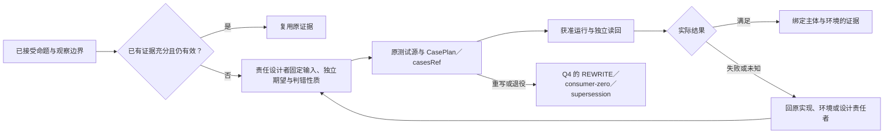

# 测试发现与执行

> **阅读范围**：采用范围内的设计规范；实现状态另查未决 · [共同上下文](../运行/保证/要求证据与裁决.md)。

本页内容

- [开发者测试面：发现、选择、固定期望、运行与复跑](#开发者测试面发现选择固定期望运行与复跑)
- [开发检查、案例发现与失败后再修改](#开发检查案例发现与失败后再修改)
- [测试的主位置、方法维度与回到真源](#test-placement-contract)

## 开发者测试面：发现、选择、固定期望、运行与复跑

本节是原V1—V6和`check(methods=["cases"])`的具体消费者，不新建测试框架或第二套Verdict。开发者可以指定一例、一文件、一组、受影响范围或全选；使用实际测试框架的发现、运行、调试和覆盖能力。工具支持某个运行模式不等于所有案例都支持该模式。

### Q0—Q6 形成真实casesRef

**Q0确定目的与主体。**普通功能案例、契约、性质、兼容、回归、安全、负载和基准是不同请求。固定候选、准确目标、方法/环境及需要覆盖的范围。source的types可以先做，cases必须有对应artifact，不能因用户说“测试”而运行整个工作区所有脚本。

**Q1取得发现能力。**先读取已有准确清单或静态声明。运行模块、参数工厂、装饰器、框架插件、配置或外部服务才能发现案例时，这是实际工具作用：先准备隔离、权限和预算，由原execution/宿主Provider执行。query仅读取已有发现结果，不能把执行藏在展开测试树。开发者可以选择直接运行已知入口，但它只证明该运行实际范围。

**Q2保留发现结果。**每例标识含测试提供者、准确源/声明及参数实例，不按显示名称或数组序号跨版本冒认。目录包含父子范围、实际可用的run/debug/coverage等画像、已发现/未展开/不支持/发现失败及来源。空结果与已穷尽分开；动态参数集合改变使旧选择需要重新解析。

**Q3固定选择。**显式case IDs、范围和排除规则解释在一个发现快照中。父节点“全选”表示覆盖请求，不能只选择当前已加载孩子；按需展开取得完整范围，不能取得就保持覆盖不足。受影响测试是由真实依赖或保守规则选择的子集，不冒充完整回归。多分片固定分配成员与种子；不能靠重复分片补覆盖数量。

**Q4固定独立期望。**保留每例输入/fixture、oracle或性质、允许差异、随机种子、环境、运行顺序/隔离条件与清理责任。成熟框架可以把它们保存在真实测试源和配置，SEC只引用，不复制成第二套案例源码。生产builder、formatter、catalog或命令路由若沿同一生产调用链生成actual与expected，二者相等只证明共同实现自洽，不能充当独立oracle；应改用固定公共合同、独立实现、外部读回或明确的性质/变形关系。两个生产结果基于不同输入、模式或往返方向的比较可以是有效性质，但测试必须让这项差异和所证命题可见，不能仅复读同一结果。Source Program的Test Value只对能证明共同生产lineage且没有直接生产actual的正向等值oracle签发阻断finding，不用词法相似或函数名字猜测。删除/放宽断言、更新golden或snapshot是显式作者变更；符合新要求时可接受，但必须显露理由、旧反例与所支持命题的变化，不由测试器自动批准自身输出。删除测试若由现有测试重写其有价值义务，仓库owner必须以exact baseline digest、替代测试路径和理由形成一次性REWRITE决策；Test Value把它编译到当前source revision、baseline census、registration id与owner-decision digest。决策不列runner命令、不创造测试inventory，baseline变化后不再活动；没有替代者的DELETE和严格超集MERGE仍只能由Source Program的consumer-zero或supersession receipt签发。

**Q5封存选择引用。**宿主`prepareCaseSelection`把发现引用、选择、准确期望、runner/profile、环境/fixture及覆盖要求封存为casesRef。它是已存在casesRef的生产接口，不是作者要手工造的哈希。缺少必须发现/输入时返回Needs，冲突给准确对象。选择被签发不代表实际用例已执行或具有执行权。

**Q6运行与对账。**原check消费candidateRef/artifactRef/casesRef；其实际结果按被选例及框架组合语义记为满足、反例、跳过/不适用、取消、基础设施失败或未完成，并附executed/reused。重试产生新的attempt，失败历史保留，flaky不改成首次成功；重试用新的随机种子时明确变了实验。先选后被工具过滤的案例仍是未运行，不凭框架进程exit 0宣称全部覆盖。

### 开发者怎样继续

测试设计先判断已有证据是否在同一主体、环境、观察与权限边界下充分覆盖接受条件；等价覆盖和严格超集都可以复用，源码变化只使实际依赖的结果重新判定有效性。新增案例必须补足具体必要观察，其独立期望或性质能区分一个现实错误实现；已有性质已提供区分条件时，不强制造一个专门反例。夹具只建立待证明转换之前的状态，不能预先完成该转换再以终态断言自证。可逆且不改变行为的文本修改没有新增验证义务时，不为文件变化机械创建测试。

图表示测试证据的设计与消费责任，不新建执行状态机。设计语义不足时由原责任者补齐，普通实现者不得自行改接受条件；已有授权仍成立时继续原任务。测试文件身份由已有发现规则决定；声明位置本身不能证明文件存在、普通文件属性或执行已发生。

Source Program 的运行时依赖观察仍由 exact TypeScript Program 负责绑定：隔离外部 ambient declarations 的工作区只对已知 Node/Bun intrinsic `process`、`Bun` 使用无本地 symbol 的运行时合同；参数、局部、导入或仓库声明的 shadow 不取得该身份。测试修饰器工厂自身不是案例；直接链式调用只由最终注册调用拥有 title、callback 和断言，不能把 `skipIf` 的条件调用重复计入案例清单。

模块图描述可证明的导入、再导出与类型依赖，不独自证明任意程序没有副作用。模块图与完整语义事实消费同一exact TypeChecker的加载调用分类，不能各自凭名称识别`require`。字面量加载及不可变别名保留准确依赖；缺少操作数与计算操作数保留为未解决，而不是空依赖或编译器异常。加载解释合同进入编译器身份，合同变化后旧事实分片不得以相同身份复用。TypeScript前端保留`import("…")`类型表达式和`typeof import("…")`的类型边；同一目标存在值导入时，运行时成员取并集，不被后出现的类型边抹除。计算得到的动态导入、已识别但解析根未知的原生加载器以及语法失败进入`unresolvedFiles`，已有准确边与反向消费者仍保留。不得静默丢弃未知路径，不把`createRequire`的实例解析根猜成本文件目录；普通同名函数或参数也不凭名称取得CommonJS加载器身份。边界门禁不能将缺边解释为闭合，受影响选择须保守扩大或返回未解决；观察不足本身不是High finding，缺陷严重度仍由具体违反的不变量、反例和影响决定。

失败到源的定位携带准确artifact/源、测试输入、期望、实际结果和必要运行日志。可只重新跑失败/受影响例，但共享fixture、顺序依赖或进程污染要求整个相交组时不能强拆；新的源版本需要重新核选择与期望，不能按旧测试显示名对接。调试测试要有真实测试入口与适配，不能把私有测试函数强当公开compute-eval入口。

覆盖率分别标记行/分支/函数、实际插桩和范围；覆盖过不等于验证正确，未测文件不得被分母消失。基准固定输入、环境、预热、测量方法与比较基线；调试器/覆盖插桩的额外成本不能归为原运行性能。历史结果可以按V3复用，但不能把“没有新运行”伪装成刚执行一次。

终止测试时结算其真实进程、fixture、临时文件及外部资源，报告清理失败；不因为框架叫test就允许删除任意目录或发出生产请求。零个适用义务可以得到“无适用项”，只有已有合格证据能满足原义务时才给复用通过；零用例本身永不证明测试通过。

VS Code的官方Testing API提供懒发现、运行/调试/覆盖画像及现有框架接合，这是可复用界面机制，不是SEC必须实现该GUI或安装特定框架的决定。具体来源和采用范围在[开发客户端资料](../依据/来源/工作台与替代路线.md#developer-surface-sources)。

**参数案例的身份补充。** 两个参数展开实例即使打印相同名称或相同值，也不自动视为同一案例。若runner把它们定义为两个执行实例，发现结果保留其准确实例/出现身份及所属发现代；进程内偶然数组位置只有在该固定发现结果内才可作区分。重新发现改变次序后不能把旧数字当长期ID，须由真实runner稳定标识或重新选择并解释变化。复制结果或失败重试也不是新独立案例。

## 开发检查、案例发现与失败后再修改

开发者要的是知道本次修改是否达到明确目的，以及下一步改哪里，不是每次填一套检查框架。类型检查仍用原check(types)，只有请求目标时检查具体artifact；案例沿原casesRef与artifactRef进入check(cases)，不把自然语言要求或目录名自动当成已执行案例。

### T0—T7：从选择到准确结论

**T0 选择目的与真实源。** 固定当前候选、待测目标、真实接受标准、所选检查方法和资源/执行许可。仅检查类型的任务不加载测试进程。按当前光标运行最近案例、上次失败集合、命名集合、受影响集合或全部已发现集合，选择来源明确；它们不是同一个覆盖声明。

**T1 读取已有测试入口。** 使用工程已经采用的测试配置、源模式、标注或工具能力，不重新维护一份容易分叉的测试配置。静态枚举可由合格只读解析器进行；框架加载、执行模块、插件扫描、参数化fixture展开或连接外部服务可能有作用，不能放在query/补全下偷偷运行。静态发现未完返回该事实，不用空列表表示零测试。

**T2 动态发现的明确路径。** 需要执行时，先按原生成/构建流程准备包含准确测试源/配置与已绑定工具的发现入口，沿获准compute-run执行该入口取得不可变发现记录；发现进程的网络/文件/数据库作用遵守其实际画像。application/assurance读取记录并核其对应候选、目标、方法和范围，形成实际casesRef供原check消费。发现器尚不能在同一绑定上列举时不伪造casesRef，不为绕过而把未知selector叫精确案例。静态可列举或已有合格记录时跳过该次执行；不要求所有测试先执行一次发现。

**T3 准备准确CasePlan。** 内部沿原检查计划固定定义/出现身份、选择/排除、发现依据、输入与独立期望、运行器/参数/环境、fixture资源、随机种子和限额；计划内容可由真实框架和任务自动形成，不要求作者手写哈希。重复测试名、参数化实例和新版本同名案例不按名字合并。未保存候选按[工作集运行输入](原生维护/导入观察与原生资产.md#developer-workset-handoff)物化或真实覆盖，不能读取磁盘旧版。所需产物尚未生成则返回依赖步骤，不由check暗中换目标。

**T4 执行与清理。** 开始前登记真实运行与独占fixture责任，执行匹配的准确案例；动态运行时注册集合若偏离固定发现，记录不匹配/新增与未执行范围，不能默默扩大或缩小选择。并行仅在fixture隔离或共享合同允许时启用，清理失败独立记录；超时取消按真实任务/操作规则结算，不当作断言失败。没有合格执行器时保留已有源分析和明确未运行。

**T5 收集分项结果。** 区分通过、断言失败、被明确排除、跳过、发现失败、启动/工具错误、取消、超时、未结算。整套零案例不是“全部行为正确”；任务明确允许空选择时可完成该选择，但不得覆盖要求必须验证的性质。失败重跑保留每次尝试、环境及顺序；一次绿不能抹去已见不稳定，隔离不稳定用例必须显露剩余风险，不能删掉分母。

**T6 回到真实作者。** 测试差异/堆栈沿具体artifact和所有转换来源回到其作者候选；优化后无法对应准确声明该限制。修复源、修改独立要求、更新快照期望和更换环境是不同变化。批准源编辑不自动批准“接受新快照”；确实要求更新预期时先展示实际行为差异和原接受依据，再形成完整候选。可以自动重跑本任务已获准且绑定仍适用的纯/隔离检查，不能借此不断触发真实外部效果。

**T7 再选和发布。** 新C3按真实影响选择检查；精确选择以合格读集/消费者覆盖为依据，否则保守扩大到相关目标或明示用户选择，不把启发式test-impact当作完整排除证明。缓存只复用相同主体、方法、输入/环境与资格的记录，存在非确定环境时说明证据性质。结果发布到原请求槽，新/旧运行不能相互清除。

### 覆盖、性能与开发完成判断

覆盖按实际源/制品、工具、插桩、测试选择和测量单位返回。分支覆盖、行覆盖、接口案例覆盖及需求覆盖不同；不同平台、版本或插桩路径的数字不能直接相加。无来源映射的生成行不得冒作作者行；未测区域、跳过用例、崩溃前部分数据和工具不支持保留为单独范围。

开发体验可测首次有效反馈、完成整个修改的墙钟时间/读取与调用量、需手填的必要信息、误改/恢复成本及重复任务收益。冷启动、暖缓存、小片段、大工程、多文件改签名、失败修复和迁出分别记录；保持同一功能、成熟供给和接受标准，不用只看成功样例的平均数制造“更快”。完成设计、实现工具、通过具体范围和用户采用四层分开。

本节复用成熟测试运行器而不是重建测试语言；测试发现与运行/调试/coverage以及复用已有框架配置的区分参考[官方Testing API](../依据/来源/工作台与替代路线.md#developer-test-and-build-sources)。该资料不证明SEC测试已执行。

## 测试的主位置、方法维度与回到真源

普通局部测试与实际被验证责任共置，例如`src/contracts/content-digest.test.ts`对应该责任的内容摘要合同。这不是要求每个源码文件必有同名测试；一个性质可以跨多个实现文件，一个文件也可以由多个独立方法观察。把所有测试搬到src不是目标；原生发现、测试运行依赖、平台与隔离边界同样限制合法位置。

跨职责的完整用户场景、真实发行/宿主组合由`tests/`中的场景拥有者组织；仅为表达unit、integration、property、security、slow、platform或requiredness而复制多套树不成立。这些维度来自原方法、环境/资源和义务，可在视图中交叉筛选。保留现有目录不代表已语义核定其中每例归属；移动旧测试先辨认真实观察边界和所有fixture/配置消费者，再形成完整切片。

私有fixture就近放置；共享fixture由实际测试支持边界维护一份，消费者显式引用。只读昂贵材料可按准确内容共享，可变数据库/工作树/缓存/进程按执行组隔离；共享可变状态需要既有租约/事务与结算合同。helper只隐藏机械准备，不预先计算待证明结果或把关键前置与副作用藏起来。文件后缀只有在真实工具发现或宿主画像确需区分时承担筛选，不能从后缀推断权限。

作者维护原生测试源码、oracle及实际配置，只声明不能推导的特殊条件；无需给每个私有test手填全局ID、依赖图、哈希与Claim账本。跨位置长期引用的公共性质沿原稳定身份，普通私有例子沿准确声明/发现身份。显示标题、参数出现序号、源码位置与真实attempt仍分开；rename之后能证实连续性才复用历史，不靠同标题强合并。

测试浏览结果把方法、所支持义务、被观察入口、fixture/环境、原始报告、反例与覆盖分别链接到其真源。反向关系按准确发现与报告派生；没有明确Claim的私有测试可以由模块合同及具体失败含义说明用途，不为了目录完整而造要求。原生配置的完整发现与可见目录需要对账，UI未展开或低权限隐藏的项不能从required分母消失。

物理构建与工具供给由[正式构建组织](../演进/实施/安全构建发布与环境.md#native-build-organization)承担；它不替代本章CasePlan/casesRef与CheckRecord。迁移只改变主位置时不修改oracle、缩减义务、删除反例或解除平台要求。测试无法运行或工具粒度不足时保留方法缺口/保守扩大，不以整理后数量更少证明质量更好。
