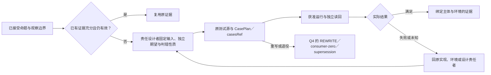

# 测试发现与执行

> **阅读范围**：采用范围内的设计规范；实现状态另查未决 · [共同上下文](../运行/保证/要求证据与裁决.md)。

本页内容

- [开发者测试面：发现、选择、固定期望、运行与复跑](#开发者测试面发现选择固定期望运行与复跑)
- [开发检查、案例发现与失败后再修改](#开发检查案例发现与失败后再修改)

## 开发者测试面：发现、选择、固定期望、运行与复跑

本节是原V1—V6和`check(methods=["cases"])`的具体消费者，不新建测试框架或第二套Verdict。 上游先按[验证义务与方法选择](../运行/验收/方法与独立证据.md#verification-obligation-selection)判定是否需要物化案例；本开发面不把全部Verification转成TestCase。性质、变形、差分、模型和故障方法只要实际生成案例，都消费同一[TestResponsibility](../运行/验收/测试生成与形式方法.md#test-responsibility-binding)合同。开发者可以指定一例、一文件、一组、受影响范围或全选；使用实际测试框架的发现、运行、调试和覆盖能力。工具支持某个运行模式不等于所有案例都支持该模式。

### Q0—Q6 形成真实casesRef

**Q0确定目的与主体。**普通功能案例、契约、性质、兼容、回归、安全、负载和基准是不同请求。固定候选、准确目标、方法/环境及需要覆盖的范围。source的types可以先做，cases必须有对应artifact，不能因用户说“测试”而运行整个工作区所有脚本。

**Q1取得发现能力。**先读取已有准确清单或静态声明。运行模块、参数工厂、装饰器、框架插件、配置或外部服务才能发现案例时，这是实际工具作用：先准备隔离、权限和预算，由原execution/宿主Provider执行。query仅读取已有发现结果，不能把执行藏在展开测试树。开发者可以选择直接运行已知入口，但它只证明该运行实际范围。

**Q2保留发现结果。**每例标识含测试提供者、准确源/声明及参数实例，不按显示名称或数组序号跨版本冒认。目录包含父子范围、实际可用的run/debug/coverage等画像、已发现/未展开/不支持/发现失败及来源。空结果与已穷尽分开；动态参数集合改变使旧选择需要重新解析。

**Q3固定选择。**显式case IDs、范围和排除规则解释在一个发现快照中。父节点“全选”表示覆盖请求，不能只选择当前已加载孩子；按需展开取得完整范围，不能取得就保持覆盖不足。受影响测试是由真实依赖或保守规则选择的子集，不冒充完整回归。多分片固定分配成员与种子；不能靠重复分片补覆盖数量。

**Q4固定独立期望。**保留每例输入/fixture、oracle或性质、允许差异、随机种子、环境、运行顺序/隔离条件与清理责任。成熟框架可以把它们保存在真实测试源和配置，SEC只引用，不复制成第二套案例源码。生产builder、formatter、catalog或命令路由若沿同一生产调用链生成actual与expected，二者相等只证明共同实现自洽，不能充当独立oracle；应改用固定公共合同、独立实现、外部读回或明确的性质/变形关系。两个生产结果基于不同输入、模式或往返方向的比较可以是有效性质，但测试必须让这项差异和所证命题可见，不能仅复读同一结果。Source Program的Test Value只对能证明共同生产lineage且没有直接生产actual的正向等值oracle签发阻断finding，不用词法相似或函数名字猜测。删除/放宽断言、更新golden或snapshot是显式作者变更；符合新要求时可接受，但必须显露理由、旧反例与所支持命题的变化，不由测试器自动批准自身输出。删除测试若由其他测试承担重写后的责任，沿现有Test Value owner形成一次性REWRITE作者决策。该决策绑定准确的旧／新commit、tree、Source Program与测试编译身份、实际发现的registration id、各自责任owner、变化的定义输入，以及原有Claim／ProofObligation／MethodSelection组成的TestResponsibility；相同引用与修订不得指向冲突内容。类别、生产路径、capability名、标题、断言数量或测试体哈希只能定位候选，不能独自证明旧义务被保留。REWRITE明确是作者判断，不标成语义等价、严格超集或旧成功断言仍受覆盖。历史仅绑定路径的批次不自动授权新的修订；没有替代者的DELETE须沿原退役 owner 证明当前 consumer closure 为空，并按[已接受基线责任合同](../演进/实施/安全构建发布与环境.md#已接受基线责任的源码表示)逐 binding 取得 obligation-retired／not-applicable 的合格判断；空模块原 consumer-zero 路径保持原义。对于没有基线出现的新测试，INTRODUCE仅接纳真实比较中新增的准确registration id与各自当前TestResponsibility，不代替任何旧义务，也不授权退役。决策不列runner命令、不创造第二份测试inventory。

**仓库迁移与外部作者输入。** 完整输入未变的同一编译可以保留准确自比较。普通变化中，原发现位置及已观察定义输入未变的旧测试记为`retained-unassessed`；未评估的必要性、未知读取前沿与运行时共享状态隔离仍显式保留，不因此获得证据复用、义务覆盖或退役权。比较分别核对本次新增／变化的finding与历史finding。测试、oracle、已知helper／fixture、负资源路径、目录读取范围、Bun preload或根dotenv路径发生交集变化时，要求准确受影响范围的作者判断；被测实现变化是否需要新执行仍由原VerificationAction选择与证据规则决定。不能因callee出现在actual一侧就把它当作纯SUT：它也可能生成输入或执行oracle。只有已接受的责任／方法边界才能单独识别被测目标；本切片未铺设持久的原源角色解析，legacy导入闭包变化须用有界retain-unassessed作者判断继续，不要求给未改测试全面补写Claim。同文件内注册位置或序号移动时，活作者可对准确旧／新registration作`retain-unassessed`判断，但同owner、路径与完整注册内容必须在两侧清单中各自唯一，且形成一对一对应；重复内容、歧义或注册内容变化不能沿此路径保留。该判断仍覆盖完整变化定义输入并重新绑定当前主体与作者权限；内容匹配只限定作者判断的对象，不自动证明责任等价，不恢复旧批准或执行证据。原同registration判断保持其历史表示。真正无界且身份未变的历史未知前沿只按未评估迁移债务保留，不声称完整输入闭包已获证明。根dotenv不在源码快照时保持未观察状态，不能据此推定文件不存在或加载已禁用；不为判断而读取秘密值。新增模块仅继承准确未变的共享未知前沿时显露该债务；新模块自身的未知前沿或共享前沿变化仍需处理。全量模块membership／发现清单身份保留为inventory证据，不混入逐测试共享语义比较；局部未知按准确definition-input身份比较，不能被旧共享unknown遮蔽。共享输入的完整Git路径交集另行绑定，连快照之外的dotenv／负资源变化也会使原共享债务失效。活作者判断仅能让准确受影响路径上的未知债务继续：必须覆盖该路径全部当前registration，保留原unknown与finding对账，不赋予覆盖／等价／复用／退役证明。新增或变化的已知Test Value违规、缺失编译上下文与test-observation-receipt-unresolved协议失败继续阻断。

仓库级作者输入保存在候选之外，避免把批准修订写回被批准源码形成固定点。首个生产路径消费明确指定的同仓库PR评论：GitHub provider观察真实作者身份、当前maintain/admin角色、准确评论正文／编辑版本与PR归属，Test Value owner采用其有界语义；payload自身的owner或hash不产生权限。定义输入未变但SUT依赖变化的旧测试可批量作有界`retain-unassessed`判断；需要改写责任时使用REWRITE与准确责任绑定，不要求每例单独请求用户批准。

**源码事实、作者采用与集成的完整流程。** 本用例服从既有[职责与静态依赖方向](../架构/装配/模块与运行实例.md#需求关系变更计划与实现的实际接合)、[单一验证会话和合法复用](../运行/验收/会话集成与结果复用.md#验证会话结果复用与主分支健康)及[证据接纳](../运行/保证/解释与证据接纳.md#evidence-acceptance-steps)。application协调本次业务步骤与需要什么结果；assurance拥有义务、适用性及采用决定；execution拥有准入、预算、取消、尝试与结算；具体TypeScript／Git／文件／进程／容器适配器实现窄端口；entry只解码与呈现，bootstrap装配。这里补齐本业务的接合，不建立新的流程控制器、缓存权威或任务台账。

本业务的可发现控制入口固定为`src/application/source-program-transition.ts`的`runSourceProgramTransition`。它直接表达固定输入、inspection／integration目的、取得／复用／join事实、并行独立验证的等待、活作者判断及最终分支；返回observed、accepted、needs-author、blocked、incomplete、cancelled或failed，并保留各子结果和真实失败。inspection只返回观察，不能产生集成采用。CLI、受信closeout和相应E2E案例消费同一入口；bootstrap注入原能力端口，源码编译、资格判定和资源状态机不搬入入口。入口可以等待独立结果，但不得代签权限、重置预算或自行恢复缓存／attempt。

阅读视图从该入口实际消费的有类型控制结构、端口合同、原owner声明和已观察Action／结果关系派生，由既有Operation Read Plan组装到当前任务视图；不复制为另一张手写业务规则表，也不拿产品ExplainGraph替代。视图在同一处展开步骤、条件分支、数据依赖／并行等待、owner及实际effects／写域、预算／恢复、复用／失效和代码／测试关系。未取得的绑定、资格或实际执行直接标注未知；超链接提供定位，不代替关系内容或完整性证据。

现有过渡接线先在普通验证容器计算源码Action，再在未执行SUT的新私有容器重算并取得活资格。第二次计算保护了真实隔离边界，不能直接删掉后接受第一次的JSON。目标接线把这个合格私有生产者前移为源码Action的**首次物理执行**：取得一次已结算的源码事实，再做作者采用和Session聚合。首次执行已满足所需生产资格时，不再为同一命题安排“普通计算后再资格重算”；旧的未合格Action结果仍须走原独立新attempt，不能追认它已受隔离。该变化不声称历史运行已采用新路线。

1. **固定输入与必要范围。** 用例固定repository、base/head及各自tree、采用解释器、分析画像、编译器／配置／依赖与测试定义输入，形成原Action及Session引用。Q4请求只产生测试义务转换必需的源事实、测试观察、Test Value差分、退役和supersession；一般候选finding、实现dominance及整程序比较不作为隐藏前置。未请求部分显式为`not-requested`，完整模块清单、未知前沿及必要负依赖不能伪装为空。既有作者的必要性／重写／退役决定可以在此确定所需业务判断；定位信息仍须绑定后续实际发现的registration，不能据此发明测试身份或Claim。测试作者判断不清除整程序生产finding，不自动证明实现签名等价；原整程序比较保持原语义。
2. **由原Action owner选执行、复用或等待。** 只消费同一ActionKey下当前仍合格的完整结果；正在执行且可认证的同一代次join，确定性失败保留，缺件／陈旧才取得新执行。source-only ActionKey不包含后来作者payload和批准观察；这些值只在采用点加入。来源、隔离或保管不能证明时返回相交unknown，不能把文件存在或相同digest当作事实生产资格，也不能把普通Action journal的终态擅自升级为发布资格。
3. **首次即合格地取得事实。** 原私有权威workspace由采用基线的代码和显式Bun配置启动，禁止自动dotenv加载；候选只作为准确数据，计算域不执行SUT、不挂载SUT可写共享依赖缓存。Source Program owner各自取得所需的current/baseline事实，并在准确同revision时使用已有同一编译复用；不同revision仍保留独立身份、完整失效条件和必要比较。原保留Bun worker、协议读回、generation退役、容器setup／owner-operation／cleanup结算及采用代码的实际加载证据继续存在。只有完整事实和全部所需结算都成立，宿主原issuer才签发活观察；其结果可以包含业务阻断或待作者输入。
4. **计算完成与业务通过分开。** 源码Action的完成只表示准确事实已完整产出并由真实生产者核验。编译失败、deadline、取消、缺失输出、协议错误或未结算资源仍是失败／未完成；“需要作者判断”“仍有finding”留在独立的条件评估和采用结果，不能让它们阻止已完成事实进入正确的后续消费者，也不能把完成标成Q4或Gate通过。CI对该Action的状态解释须消费此明确结果合同，不能继续仅用表达业务阻断的退出码代替事实生产状态。
5. **在真实事实之上采用活作者判断。** 用例取得候选外的作者输入；GitHub provider核同仓库PR、真实身份、当前角色、正文及编辑版本。原Test Value／transition owner重新解释准确事实并作REWRITE、INTRODUCE、有界retain-unassessed或基于原已接受完整责任的retire判断，保留完整变化定义输入与未知。原私有relocation配对由这一解释重新建立，不能从反序列化结果恢复；GitHub凭据不传入源码计算或SUT容器。仅作者输入变化时，未失效的合格源码事实继续使用，只重新观察权限及计算采用；新增finding、缺失上下文及未满足义务仍阻断。历史已带作者解释的评估继续要求原解释一致，不重写旧事实。
6. **汇合实际必需的验证与效果。** 其他RequiredClosure动作按其真实依赖执行／复用／join；缺作者决定只阻断依赖它的采用、最终Gate和效果，不给独立检查建立伪前置。原Session将首次合格源码Action的准确输出、物理attempt和采用结果接合到完整Action计划，不再在普通SUT容器重复执行这项源码Action，也不以caller skip开关或伪造PASS补齐计划。发布／合并前仍重新观察主体、评论、权限、review和main条件；普通测试执行证据、MainHealth同修订inventory及expected-head效果保持各自义务。

无替代 Q4 退役使用[唯一 TestResponsibility 基线字面量合同](../演进/实施/安全构建发布与环境.md#已接受基线责任的源码表示)：原 BASE 已接受责任、当前 requirement 语义采用和物理生产资格是不同输入。删除评论只定位旧接受事实，不能补造旧责任；纯 `conditional-candidate` 不能成为 compiler-issued DELETE 权限。先在原输入下采用 reader／policy，再允许 v2 使用；缺基线接受事实的 legacy 仍 unknown。删除多 case 模块首例时，后续移位的真实 case 仍需原唯一一对一内容与 owner 约束的 relocation 判断，不能随删除一并消失。

**保管、失效和恢复。** 可复用对象是由原生产／接纳owner持有并核验的事实及准确输入关系，不是另一份全局baseline缓存。身份至少覆盖两侧源码／清单与负依赖、实际生产者／解释器、编译器、配置、依赖代际、定义输入、环境及隔离画像；任一真实依赖变化按原失效规则重评。作者角色或评论变化使采用资格失效，不单独改变未受影响的物理计算身份。事实完整性、来源、未撤销、适用范围及声明有效窗口仍须在消费点成立。

当前活观察和qualification的私有issuer关系可以在其真实宿主寿命内复用；进程退出、仅剩历史或SUT可写JSON时，不能恢复这种关系。跨进程恢复必须由已有Action／execution owner从可认证的原attempt、结果写权限、围栏、物理结算和当前保管读回，而不是新增文件注册表或凭hash签发。当前接线尚不能证明这种恢复时，明确保留缺口并取得一次新的合格首次计算；不能先再做一遍无资格的普通计算。准确baseline未来若要跨不同候选复用，仍须满足下节的真实后续消费者和合格保管条件，本流程不自动启用其事实包。

同一运行在准备前由原operation owner固定一个有限聚合deadline；current、baseline、后续比较、worker和读回共享剩余池，子操作受其原有限上限及父deadline共同裁剪，结算保留原独立份额。聚合容量由原operation唯一声明并在准备前读取；物理worker的上限与结算预留保持独立。它不能从单个worker的容量推定完整比较的容量，也不能被解释为所有仓库的固定性能保证。显式更短的请求仍生效；阶段切换、缓存命中、晚到回调及恢复都不能重置原deadline。取消、超时和未知完成按[原尝试最终性](../运行/持久化提交与恢复.md#attempt-finality-and-retry)及[资源结算](../运行/发布运行与资源生命周期.md#当前计算运行主线与结果寿命)处理：先观察／停止／结算，保存真实失败；有据可继续时由原owner接续或签发后继attempt，不无限等待、不盲重放，也不将未完成源事实用于采用。

历史Gate JSON仍可读取和校验，但不能通过改schema、删除可选标记、重算hash或调用纯Evaluate工厂获得发布权限。独立saved-result发布CLI不把文件解码视为授权。原hosted工作流尚未完整接入本transition Action／保证，不能据其运行宣称没有测试变化；该生产路径仍是未决。旧bundle若未选择该Action，与新Session身份不同，须沿原会话迁移；未改变测试义务时无需作者评论。此审计不代替先前测试执行的生产者／隔离保证。

闭环验收覆盖一次合格生产被实际复用、业务待决而事实完整、作者变化不重算未变源事实、主体／工具／定义输入变化真实失效、污染输出／克隆JSON不能恢复资格、旧表示不被重写，以及短预算、取消、部分输出、资源未结算和迟到结果。首个正常使用必须完成准确原候选的事实→作者判断→Session接纳链；单个helper测试或一次延长后运行成功不代替这条链。

**基线事实缓存的采用决定。** 对一次评估后即退役、缓存不被后续合格消费者保留使用的新权威容器，不采用无条件发布基线事实包。写出、编码、回读与结算只有冷写成本，不能减少本次已经完成的基线分析；缓存命中也只消除其实际覆盖的计算，不能把仍须执行的程序绑定、测试观察与仓库投影算作已省工作。当前选择是沿原分析与新权威执行边界完成必要结果，不为没有消费者的未来命中增加强制交付步骤。

共享缓存的内容摘要和准确键用于完整性核对与失效判断，不认证语义事实由谁正确产生。同一操作系统用户下的SUT能够写入共享缓存时，即使目录在候选树外、权限为仅所有者访问、包内生产者摘要完全匹配，也不能据此签发新权威资格。生产者源码的准入观察只说明观察切面的源身份，不证明运行进程已经加载或执行这些字节。隔离生产者的真实执行、物理receipt、退役与宿主采用仍由上文原owner承担，不能被缓存JSON或调用方摘要替代。

仅用于本地诊断或历史分析的缓存复用可以作为独立范围评估，但不由此决定自动启用，也不升级为发布或Gate的活资格。重新考虑基线事实包发布，须先定位在缓存寿命内真正消费它的后续操作，或已有合格保管链所覆盖的跨操作消费者；由现有缓存与执行owner绑定实际生产者、编译器、配置、依赖和准确源码身份，保留exact与predecessor复用的区别、陈旧输入拒绝、失败回退及资源结算。还须证明所省计算覆盖新增读取、编码、保管、资格核验和恢复成本，并明确哪些阶段仍会运行。没有这样的消费者、事实产生可信性与完整成本依据，保持本决定，不另建缓存权威或以单项命中率重开强制路径。

同次编译内，不采用当前按共享依赖尾部重分组的测试观察候选。有界同输入比较保持完整输出一致，却未显示该阶段变快；单次样本既不证明普遍收益，也不足以认定统计性回退。它只省去部分遍历、输入投影与排序，逐测试完整定义输入集合及其摘要仍须生成。冷分析成本继续由原Source Program owner承担；重开此优化须证明真实省工覆盖分组、集合复制、合并和保留内存成本，并保持循环、准确上下文排除、未知读取及原操作期限。此决定不否定已有同次编译索引或其他已证明净收益的复用，也不把完成共享尾部当成完成全量分析。

**已保存评估的条件追踪查询仍待资格。** 只读查询已有 Source Program Transition Assessment，可以沿原 producer 的条件责任、Claim 与选择关系提供双向查看；不从代码依赖推导业务必要性，不把 expected-head 相等或保存 JSON 重新签发为当前活资格。当前独立查询候选暂缓采用：现有有界发现未取得可用的已完成评估供真实消费者正向使用，不能用合成载荷、解析器通过或缺件拒绝代替这个接合，也不宣称所有历史都没有产物。

重开时先取得已有且来源可核验的准确评估，或复用原本就必须执行的 producer 结果，由原 owner 保持关系类型、准确 subject、缺失／错误与有界查询；不为了验证查看器另外启动一次全仓分析。正向查询可用、当前资格和完整业务映射分别报告，尚无独立使用价值时保留原入口，不仅因候选已经写出而发布新 CLI。

**Q5封存选择引用。**宿主`prepareCaseSelection`把发现引用、选择、准确期望、runner/profile、环境/fixture及覆盖要求封存为casesRef。 同时绑定每项所选ProofObligation与VerificationMethodSelection的准确身份和修订；相同方法名但Oracle、环境或接纳规则变化时，旧casesRef及其证据重新判定，不能只按testId复用。它是已存在casesRef的生产接口，不是作者要手工造的哈希。缺少必须发现/输入时返回Needs，冲突给准确对象。选择被签发不代表实际用例已执行或具有执行权。

**Q6运行与对账。**原check消费candidateRef/artifactRef/casesRef；其实际结果按被选例及框架组合语义记为满足、反例、跳过/不适用、取消、基础设施失败或未完成，并附executed/reused。重试产生新的attempt，失败历史保留，flaky不改成首次成功；重试用新的随机种子时明确变了实验。先选后被工具过滤的案例仍是未运行，不凭框架进程exit 0宣称全部覆盖。

### 开发者怎样继续

测试设计先判断已有证据是否在同一主体、环境、观察与权限边界下充分覆盖接受条件；等价覆盖和严格超集都可以复用，源码变化只使实际依赖的结果重新判定有效性。新增案例必须补足具体必要观察，其独立期望或性质能区分一个现实错误实现；已有性质已提供区分条件时，不强制造一个专门反例。夹具只建立待证明转换之前的状态，不能预先完成该转换再以终态断言自证。可逆且不改变行为的文本修改没有新增验证义务时，不为文件变化机械创建测试。

```mermaid
flowchart LR
  Claim["已接受命题与观察边界"] --> Coverage{"已有证据充分且仍有效？"}
  Coverage -->|是| Reuse["复用原证据"]
  Coverage -->|否| Design["责任设计者固定输入、独立期望与判错性质"]
  Design --> Cases["原测试源与 CasePlan／casesRef"]
  Cases --> Run["获准运行与独立读回"]
  Run --> Result{"实际结果"}
  Result -->|满足| Evidence["绑定主体与环境的证据"]
  Result -->|失败或未知| Repair["回原实现、环境或设计责任者"]
  Repair --> Design
  Cases -->|重写或退役| Retire["Q4 的 REWRITE／consumer-zero／supersession"]
```

图表示测试证据的设计与消费责任，不新建执行状态机。设计语义不足时由原责任者补齐，普通实现者不得自行改接受条件；已有授权仍成立时继续原任务。测试文件身份由已有发现规则决定；声明位置本身不能证明文件存在、普通文件属性或执行已发生。

Source Program 的运行时依赖观察仍由 exact TypeScript Program 负责绑定：隔离外部 ambient declarations 的工作区只对已知 Node/Bun intrinsic `process`、`Bun` 使用无本地 symbol 的运行时合同；参数、局部、导入或仓库声明的 shadow 不取得该身份。测试修饰器工厂自身不是案例；直接链式调用只由最终注册调用拥有 title、callback 和断言，不能把 `skipIf` 的条件调用重复计入案例清单。

模块图描述可证明的导入、再导出与类型依赖，不独自证明任意程序没有副作用。模块图与完整语义事实消费同一exact TypeChecker的加载调用分类，不能各自凭名称识别`require`。字面量加载及不可变别名保留准确依赖；缺少操作数与计算操作数保留为未解决，而不是空依赖或编译器异常。加载解释合同进入编译器身份，合同变化后旧事实分片不得以相同身份复用。TypeScript前端保留`import("…")`类型表达式和`typeof import("…")`的类型边；同一目标存在值导入时，运行时成员取并集，不被后出现的类型边抹除。计算得到的动态导入、已识别但解析根未知的原生加载器以及语法失败进入`unresolvedFiles`，已有准确边与反向消费者仍保留。不得静默丢弃未知路径，不把`createRequire`的实例解析根猜成本文件目录；普通同名函数或参数也不凭名称取得CommonJS加载器身份。边界门禁不能将缺边解释为闭合，受影响选择须保守扩大或返回未解决；观察不足本身不是High finding，缺陷严重度仍由具体违反的不变量、反例和影响决定。

失败到源的定位携带准确artifact/源、测试输入、期望、实际结果和必要运行日志。可只重新跑失败/受影响例，但共享fixture、顺序依赖或进程污染要求整个相交组时不能强拆；新的源版本需要重新核选择与期望，不能按旧测试显示名对接。调试测试要有真实测试入口与适配，不能把私有测试函数强当公开compute-eval入口。

覆盖率分别标记行/分支/函数、实际插桩和范围；覆盖过不等于验证正确，未测文件不得被分母消失。基准固定输入、环境、预热、测量方法与比较基线；调试器/覆盖插桩的额外成本不能归为原运行性能。历史结果可以按V3复用，但不能把“没有新运行”伪装成刚执行一次。

终止测试时结算其真实进程、fixture、临时文件及外部资源，报告清理失败；不因为框架叫test就允许删除任意目录或发出生产请求。零个适用义务可以得到“无适用项”，只有已有合格证据能满足原义务时才给复用通过；零用例本身永不证明测试通过。

VS Code的官方Testing API提供懒发现、运行/调试/覆盖画像及现有框架接合，这是可复用界面机制，不是SEC必须实现该GUI或安装特定框架的决定。具体来源和采用范围在[开发客户端资料](../依据/来源/工作台与替代路线.md#developer-surface-sources)。

**参数案例的身份补充。** 两个参数展开实例即使打印相同名称或相同值，也不自动视为同一案例。若runner把它们定义为两个执行实例，发现结果保留其准确实例/出现身份及所属发现代；进程内偶然数组位置只有在该固定发现结果内才可作区分。重新发现改变次序后不能把旧数字当长期ID，须由真实runner稳定标识或重新选择并解释变化。复制结果或失败重试也不是新独立案例。

## 开发检查、案例发现与失败后再修改

开发者要的是知道本次修改是否达到明确目的，以及下一步改哪里，不是每次填一套检查框架。类型检查仍用原check(types)，只有请求目标时检查具体artifact；案例沿原casesRef与artifactRef进入check(cases)，不把自然语言要求或目录名自动当成已执行案例。

### T0—T7：从选择到准确结论

**T0 选择目的与真实源。** 固定当前候选、待测目标、真实接受标准、所选检查方法和资源/执行许可。仅检查类型的任务不加载测试进程。按当前光标运行最近案例、上次失败集合、命名集合、受影响集合或全部已发现集合，选择来源明确；它们不是同一个覆盖声明。

**T1 读取已有测试入口。** 使用工程已经采用的测试配置、源模式、标注或工具能力，不重新维护一份容易分叉的测试配置。静态枚举可由合格只读解析器进行；框架加载、执行模块、插件扫描、参数化fixture展开或连接外部服务可能有作用，不能放在query/补全下偷偷运行。静态发现未完返回该事实，不用空列表表示零测试。

**T2 动态发现的明确路径。** 需要执行时，先按原生成/构建流程准备包含准确测试源/配置与已绑定工具的发现入口，沿获准compute-run执行该入口取得不可变发现记录；发现进程的网络/文件/数据库作用遵守其实际画像。application/assurance读取记录并核其对应候选、目标、方法和范围，形成实际casesRef供原check消费。发现器尚不能在同一绑定上列举时不伪造casesRef，不为绕过而把未知selector叫精确案例。静态可列举或已有合格记录时跳过该次执行；不要求所有测试先执行一次发现。

**T3 准备准确CasePlan。** 内部沿原检查计划固定定义/出现身份、选择/排除、发现依据、输入与独立期望、运行器/参数/环境、fixture资源、随机种子和限额；计划内容可由真实框架和任务自动形成，不要求作者手写哈希。重复测试名、参数化实例和新版本同名案例不按名字合并。未保存候选按[工作集运行输入](原生维护/导入观察与原生资产.md#developer-workset-handoff)物化或真实覆盖，不能读取磁盘旧版。所需产物尚未生成则返回依赖步骤，不由check暗中换目标。

**T4 执行与清理。** 开始前登记真实运行与独占fixture责任，执行匹配的准确案例；动态运行时注册集合若偏离固定发现，记录不匹配/新增与未执行范围，不能默默扩大或缩小选择。并行仅在fixture隔离或共享合同允许时启用，清理失败独立记录；超时取消按真实任务/操作规则结算，不当作断言失败。没有合格执行器时保留已有源分析和明确未运行。

**T5 收集分项结果。** 区分通过、断言失败、被明确排除、跳过、发现失败、启动/工具错误、取消、超时、未结算。整套零案例不是“全部行为正确”；任务明确允许空选择时可完成该选择，但不得覆盖要求必须验证的性质。失败重跑保留每次尝试、环境及顺序；一次绿不能抹去已见不稳定，隔离不稳定用例必须显露剩余风险，不能删掉分母。

**T6 回到真实作者。** 测试差异/堆栈沿具体artifact和所有转换来源回到其作者候选；优化后无法对应准确声明该限制。修复源、修改独立要求、更新快照期望和更换环境是不同变化。批准源编辑不自动批准“接受新快照”；确实要求更新预期时先展示实际行为差异和原接受依据，再形成完整候选。可以自动重跑本任务已获准且绑定仍适用的纯/隔离检查，不能借此不断触发真实外部效果。

**T7 再选和发布。** 新C3按真实影响选择检查；精确选择以合格读集/消费者覆盖为依据，否则保守扩大到相关目标或明示用户选择，不把启发式test-impact当作完整排除证明。缓存只复用相同主体、方法、输入/环境与资格的记录，存在非确定环境时说明证据性质。结果发布到原请求槽，新/旧运行不能相互清除。

### 覆盖、性能与开发完成判断

覆盖按实际源/制品、工具、插桩、测试选择和测量单位返回。分支覆盖、行覆盖、接口案例覆盖及需求覆盖不同；不同平台、版本或插桩路径的数字不能直接相加。无来源映射的生成行不得冒作作者行；未测区域、跳过用例、崩溃前部分数据和工具不支持保留为单独范围。

开发体验可测首次有效反馈、完成整个修改的墙钟时间/读取与调用量、需手填的必要信息、误改/恢复成本及重复任务收益。冷启动、暖缓存、小片段、大工程、多文件改签名、失败修复和迁出分别记录；保持同一功能、成熟供给和接受标准，不用只看成功样例的平均数制造“更快”。完成设计、实现工具、通过具体范围和用户采用四层分开。

本节复用成熟测试运行器而不是重建测试语言；测试发现与运行/调试/coverage以及复用已有框架配置的区分参考[官方Testing API](../依据/来源/工作台与替代路线.md#developer-test-and-build-sources)。该资料不证明SEC测试已执行。
