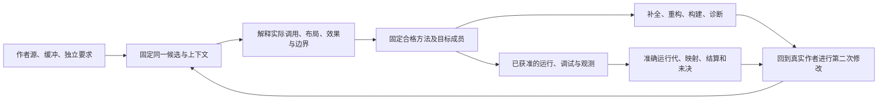

# 跨语言开发面接合

本篇拥有开发工具怎样消费跨语言能力的接合，不重新定义语言、执行器或 IDE。编辑、分析、重构、构建、调试、性能、协作和退出仍消费[现有开发面](编辑审查与客户端.md)、原六工具及十职责。额外语言/原生能力的完整语义由[能力合同](../作者/需求关系与能力边界.md#cross-language-control-decisions)拥有；不能把“可生成某段代码”误报为 IDE、下游原生 API 或实际设备已支持。

## 正向交接与最小请求

作者在现有源、定义、配置或需求中只维护独特差异。workspace固定源与未保存缓冲的基础；semantics给出调用、类型、效果和真实控制要求；compiler选择实际供给并返回可定位的绑定、目标成员和缺项；assurance解释独立检查；application协调本次目的；execution只在真实作用时准入与结算。entry提供同一结果的客户端表示，adapters连接成熟工具，bootstrap组合所选实例。它们不必是十个服务，也不形成新的操作词表。

一次普通修改可以是一个本地补丁和一次检查；机器提出候选时使用原 propose/preview/check/apply 流程；query读取真实结果与合同；运行和外部工具属于原 operation。入口可以在内存中组合，不强制每步联网。细节通过原固定引用取得，而不为新增能力向每个工具增加必填 capabilityTable、sessionId 或 proofGraph。

箭头是数据/调用交接，不代表每次编辑都要运行全部功能。调试器、Profiler、Notebook 内核或外部 Agent 的响应均不能重写原要求或自行取得下一步写权。

## 各开发能力怎样消费新增区别

### 语义搜索、补全与跨语言索引

符号身份绑定来源、解释、实例化参数及使用点。返回定义、成员、调用候选或错误时保留当前基础和覆盖；反射、特化和默认参数读取的成员集合/候选集合及缺失事实都成为真实依赖。文本搜索、精确引用搜索和动态调用近似不是同一结果，索引没有命中不能补成全程序不存在。

SCIP/LSP 或原生索引器仅输出其能表达的部分，命名路径与范围映射不代替完整子对象、借用、效果和 ABI。协议装不下的必要区别，通过原准确引用提供、限制该动作或明确返回损失；不能填默认 `safe`。补全可以列候选，只有实际选择与前提核对后才形成调用绑定，不能用完成项的显示顺序决议重载。

### 重构、格式化与 TransformationPlan

更名、移动、提取、内联和签名变化先固定原声明及所有需要保持的观察，形成原候选批次与前像。处理泛型实例、关联定制点、私有最佳重载、资源捕获、外向控制出口、隐式转换和生成引用时，保持各自规则；不能只批量替换名字或把几条测试通过当语义保持证明。

跨语言重构的共同计划是现有 EditPlan/候选语义的交接，不是一套并行编辑权威。一个受管区域抽取为函数后，原 break/return 不能静默改目标；原位构造不能先生成临时再搬到目的地；格式化不能改有作用的导入顺序或重选特化。局部组只能在共同不变量成立时部分接受；不确定动态/外部引用按真实范围保留，允许与其无关的准确小修改继续。

### 构建、BSP 与泛型成员分发

构建任务固定候选、目标工具链、依赖、根和实际生成成员。BSP 或其他构建适配描述其真实任务图与结果；源生成、目标编译、链接、运行准备和发行不是一个成功。有限预生成实例的清单、外部实例符号、反射生成源、原生 shim、设备内核及其配置必须进入产物闭包。

同一语言名字不证明相同 ABI，类型检查成功不证明导出符号存在；缺一个原生库不取消独立纯函数的分析结果。静态展开造成的代码体积和编译开销、字典调用造成的运行差额，都按实际约束比较。缓存读取绑定真实正负依赖与目标方法，不因同一源文本就复用另一套数值或布局结果。

### 断点、堆栈、内存与高级调试

运行引用固定真实可执行内容、模块代与来源；继承投影、协程帧、泛型特化、内联和生成 helper 的多对一/一对多位置关系都保留。不能让旧二进制的栈跳到新源后仍叫精确定位。读取被优化掉的值、缺页或未冻结线程时，返回相应不可得或局部观察，而非猜值。

求值、getter、条件断点、日志点、寄存器/内存修改和热替换按原调试能力分别准入；“可显示 ValueRef”不产生任意执行权。强制地址稳定、原子访问域和不变量在调试修改中仍有效；修改后的暂停/状态引用失效，旧 FrameRef 不再控制新代。无合格读取能力时拒绝相交展开，不影响独立静态源查看。

### 性能观测与 ObservationIR

观测绑定真实运行、输入、环境、方法、采样/覆盖、时钟域和模块来源；ObservationIR只是有类型的观测交换，不成为另一份行为规范。采样缺栈、丢事件、内联合并和异步等待必须可见。耗时较少可能来自少做工作、不同分配/数值保证或另一缓存状态，不能据总时间直接替换实现。

将问题定位回资源、分派、布局、复制或 ISA 后，重新在同等要求的可行候选中选择。性能观测不改变 ABI、原子进展或误差硬约束；没有代表性负载与同口径证据不宣布最快。纯观测同样可能披露秘密和扰动时序，使用原披露/执行范围及预算。

### 记录重放、逆向执行与热替换

记录只覆盖所捕获的输入、调度、时间、随机源和外部通道；未捕获内容不由 source map 补齐。对记录域中的逆向定位，不宣称撤销现实付款、文件写入或设备作用。新未来形成新运行/重放代，原记录和已发生作用保留自身身份。

热替换按既有运行代切换进行：旧对象布局、模块析构器、回调、协程帧、TLS 与在途调用必须有兼容/迁移/驻留方案，不能只替换函数地址。回退也核实际状态和旧成员是否仍在；无安全切面或未知关闭时保留旧实例及准确阻塞，而不是试卸载后再恢复。

### Notebook、REPL 与交互进程

文档单元身份、源修订、一次执行身份和内核状态代分别绑定。顺序改变、重复执行、外部变量或闭包改变时，使实际依赖结果陈旧；不能按显示单元号或相同文本恢复旧值。TS 的类型擦除、Rust/原生资源寿命和跨语言值句柄都通过原拥有者解释。

输出结束、内核空闲、控制命令确认和资源已释放分别判断。重启内核会使原生句柄及借用失效，但不会抹去此前外部作用；旧输出可作为带来源历史保留，不能混入新执行的当前结果。stdin、终端 resize 与交互调试仍走原会话协议，没有新原生消息透传隧道。

### 协作、CRDT、版本控制与远程工作区

CRDT/OT 可以在其支持的文本/结构域内协调编辑，不因此保证程序可编译、合并不变量成立或新增调用获得权限。各参与者的未保存缓冲、工作树、索引和远端树保留层次；共同变化在原候选上合并、解释并核准，不能把文本收敛作为业务或源码变更采纳。

原生 Git 继续拥有版本历史的实际操作；不重造 Git，不自动 stage/stash/reset 用户工作。远端断线后按准确操作身份与实际 refs 读回，不能把客户端超时当没有提交。Dev Container/远程宿主的建立、挂载、凭证、端口和生命周期是独立作用；停止客户端不终止其他消费者使用的进程或释放仍被访问的 native 对象。

### Agent 适配、上下文与协议损失

人、模型和脚本消费同一源与能力结果。协议映射记录输入/输出字段、解释、作用边界及无法表达的损失；ProjectionReceipt仅证明该次映射与来源对应，不证明语言性质或实际成功。模型文本、文件中的指令及提供者自报能力不能自签权限，也不能改变独立的验收期望。

上下文按真实任务切片，包含相交规则、版本、前像和未决；不把所有资料拼成可变全局 Context 或将所有局部值永久实体化。并行 Agent 共享纯计算可复用，写入仍有唯一对象/范围的当前拥有者；子预算、重试及外部调用不可复制父额度。缺字段不能静默转成 `unknown=false`。

### 测试、Provider 符合性与证据接纳

发现测试、选定测试、执行断言、获取目标证据和清理环境分别判断；零测试、跳过或加载失败不冒充通过。更换期望、snapshot/golden 或抑制 finding 属于判据/处置变化，不把它们当修复已经发生。对照数据保持独立要求，而不是与错误生成器共享同一错误编码。

Provider 符合性检验协议、身份映射、失败、取消、重连与清理，只支持这些边界；不能从 BSP/DAP/Agent 适配通过得到产品业务正确。跨语言差分应比较允许行为/错误/资源与相关观察，输入域、数值环境或执行策略不同先解释差异。有限完整模型的证明只在其明确范围内成立，真实驱动与 ABI 仍需各自依据。

### 供应链、VEX、需求与数据工具

源码、生成物、原生库、工具链、构建配置和运行镜像保留来源与实际成员闭包。SBOM、签名和 VEX 分别是组成、完整性/来源、特定漏洞状态的声明，不自动证明安全或部署已采用。风险接受、抑制和真实修复分别处理；源/方法/环境改变时相交结论重评。

需求管理保留独立接受条件与实现映射，不让生成器改掉自己的判据。数据库/数据工具保留模式、事务、查询、数据切面和实际迁移权限，不将可解析 SQL 当作已安全执行。统计、科学和数值使用点还保留单位、精度、联合分布、输入数据与可重复条件，不能被普通类型签名吞掉。

### 浏览器、移动端、设备与运行维护

浏览器、移动端、设备或部署工具的适配先固定实际目标实例、权限、工具能力与可观察输入；截图、页面完成或设备连接不等于目标业务完成。实际运行所需的网络、传感器、GPU/驱动、地址/时序和资源限制由对应宿主合同承担，不放进所有程序的基础依赖。

SRE/运行维护复用发布、诊断、回滚和恢复的原机制；度量变好不证明用户结果变好，降级不能暗改硬约束。事故后的旧凭证、未结算操作、遗留数据、在途调用和恢复容量仍有拥有者。可用前述因果策略设计控制器，但控制器只能使用当时可见且获准的信息，不能冒领事后最优策略。

## 结果交付、取消与第二次修改

上述工具共同消费[分片完成屏障](工具协议/客户端与并行会话.md#result-stream-completion)：完整诊断分区的空结果才能清该分区，搜索的未收齐页不能证明不存在，Notebook/调试结束消息不代替实际停止。当前返回代、固定主体、可见范围、已收到成员与原操作结算分别保持；完整结果身份、展示内容身份和传输字节摘要不能强求相同。

一次运行发现地址稳定冲突时，修改真正作者要求或合格方法，形成新候选；旧运行不随新源换版。一次优化改变浮点误差、重试层或分派策略时，先核原接受范围和共享预算；不因某页显示“成功”自动采纳。重构、构建、调试及证据都继续指向同一个准确版本闭包。具体连续实例见[跨语言能力连续开发](../../examples/连续开发/跨语言能力连续开发.md)。
