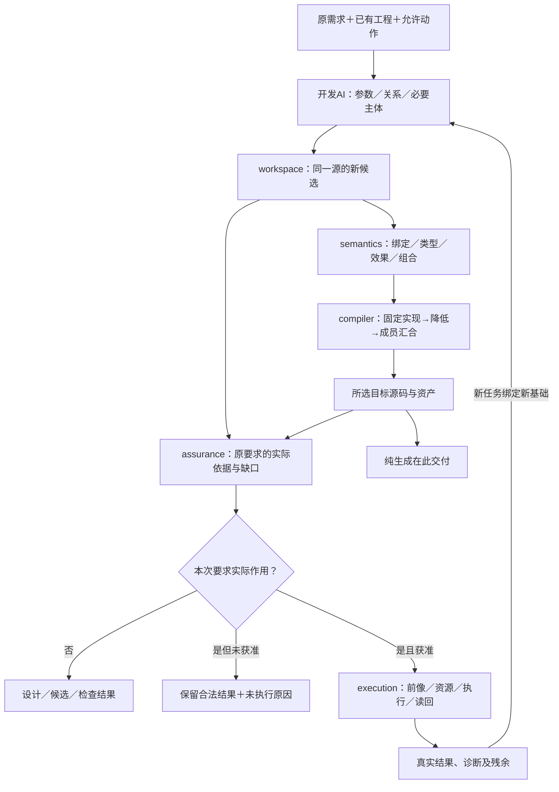

# 需求到交付主链

> **阅读范围**：采用范围内的设计规范；实现状态另查未决 · [共同上下文](用途与任务范围.md)。

本页内容

- [从需求到可持续工程的确定交接](#从需求到可持续工程的确定交接)
- [从任务目标到一次可完成开发工作的操作协议](#从任务目标到一次可完成开发工作的操作协议)
- [完整开发任务的正向操作：准备、创作、验证、交付和再进入](#完整开发任务的正向操作准备创作验证交付和再进入)
- [全开发面的实际入口、产物与完成边界](#全开发面的实际入口产物与完成边界)

## 从需求到可持续工程的确定交接

本节是产品操作的唯一主链，复用[I0—I8的补全与委派](../作者/组合/跨软件需求合同.md#11-意图进入同一作者源的完成与缺省算法)、[库的编译路径](../作者/组合/模块封装与复用库.md#普通库与编译型定义的共同路径)和原P阶段，不另造并行状态机。用户并不需要提交这里的内部数据表。

### 当前请求和程序不是一个状态对象

| 已有对象／拥有者 | 本次消费的实际字段含义 | 写入时点与保持项 |
|---|---|---|
| Task／application | 目的、请求源、输入基础、输出根、允许选择与动作、预算 | 只接收真实任务与委派变化；子计划不自授权限 |
| Requirement／semantics与assurance | 输入域、正常与失败结果、保持关系、硬限制及接受来源 | 仅保留独立约束；候选代码不能改其接受关系 |
| Candidate／workspace | 精确文本／结构／资产内容、解释、父基础及源映射 | 成组修改产生新候选；失败不覆盖旧源 |
| Binding／compiler | 定义、库、语义方法、目标、布局与真实依赖的精确选择 | 新选择单独固定；普通重建沿用合格选择 |
| ArtifactSet／compiler | 所需成员、字节、来源和生成输入 | 完整成员才发布该根；不包含伪造检查绿色 |
| CheckRecord／assurance | 对象、方法、前提、实际结果与覆盖 | 不修改被检查的字节，不替换原任务期望 |
| Operation／execution | 事前身份、当前准入、目标前后像、尝试与残余 | 真实作用时存在；纯创作不逐表达式持久记录 |

字段来自各自现行合同；本表只规定交接。Task不是新的需求文件，Requirement不是所有函数都必须复制的规格，Binding不是作者需要重填的AST。

### 一次任务的执行责任与合法返回

| 步骤 | 承担者与正向动作 | 必须交给下一步的结果 | 不能继续时的具体结果 |
|---|---|---|---|
| 1 固定要求 | application取得原请求、已知工程及权限；I0—I3区分要求、提醒和采用 | 已有Task/Requirement引用与准确基础 | 保留原目标；未取得历史不伪称全知 |
| 2 制作候选 | 开发AI按操作选择修改参数、组合或主体，使用`propose` | 精确Candidate与源差异；独立假设显式标识 | 允许错误草稿；无权或协议错不污染原源 |
| 3 检查含义 | semantics检查绑定、类型、效果、资源与组合；assurance核原要求 | 每个相交要求的满足依据或开放义务 | 不把类型通过、样例通过或自述升为全任务满足 |
| 4 固定实现 | compiler沿合格Binding，缺少时进行有界选择 | 合格普通主体或领域方法及其前提 | 未找到不是无解；硬限制不足不选非法回退 |
| 5 生成成员 | compiler按实际目标降低和汇合代码、配置及资源 | 按根ArtifactSet、来源及未完成范围 | 独立目标可返回；共同发行不能缺必需成员 |
| 6 取得所需检查 | assurance复用已有合格依据，必要时经execution运行检查 | 精确CheckRecord | 方法、环境或预算缺失只限制相交声明 |
| 7 保存或使用 | 用户任务确实要求时才执行apply/operation | 原源保存或目标的实际结果及读回 | 冲突保留现场；取消不等于资源已释放 |
| 8 再次修改 | 新任务绑定当前真实基础，继承未变要求 | 新Candidate或新的运行输入；旧结果仍可解释 | 不通过旧函数名、旧票据或旧摘要更新新实例 |

合法零修改返回无变化；只设计到具体规范与候选说明结束；纯生成到源码结束；运行有其单独输入和结束条件。可以批量完成获准步骤，不要求八次调用或八次人工确认。

### 行为改变与实现选择不能互相偷换

以下不是新的字段列表，而是I2/I5在实际任务中的分类：

- 输入值改变但程序不变：进入运行参数，不重写程序；某值原本是作者常量时，修改常量才形成新候选。
- 已接受的行为改变：修改唯一作者含义，并核独立要求的接受关系；不能因为改动只有一个词就称无行为变化。
- 普通实现替换：保持已接受可观察结果、错误、顺序和效果；对齐真实资源与目标控制后固定新Binding。
- 表示或视图改变：不增加另一份可写源；仅改排版不改变语义，结构作者迁移另按合同。
- 外部文件、权限、设备或操作改变：取得当前事实和准入；不能从编译模型中“推导”现实已经发生。

### 需求不完整时也要产出有用成果

已接受默认直接继承；可机械推导的由工具计算；任务已委派的设计取舍由开发AI作出一个有依据的选择并保存，不逐项询问。尚未委派且会改变公开行为的差异，形成带具体结果差别的候选建议，相关强声明保持未定；独立设计继续。不能用沉默、变量同名或“要完美”补出权限。

语义层可以确定的转换直接执行；AI合成或启发式搜索得到的是候选，不能当成程序等价证明。对无法一般判定的性质，保留运行检查、明确输入域或对应未知，而不要求所有任务先证明一切程序性质。

### 端到端图：创作与确定生成分开

实线表示候选与结果交接；检查是所需声明的义务而非全部任务的必经测试。自然语言进入开发AI，只有固定作者内容进入编译器；图没有自动扩大作用权限的边。非法源、缺目标、预算结束及失败按上表从其实际拥有者返回；此图不将这些不同对象合成一个总生命周期。

### 状态不回填成绿色

语法草稿、语义合格、已生成、经过某项检查、已写回、已运行、满足任务分别可定位。只返回本次相关状态，不按最大成功阶段覆盖整个工程。旧检查仍指向旧对象；新源码失败不会被旧产物“补成成功”。完整示例见[离线区间工具](../../examples/实现校准/成熟供给与计算工具.md#interval-product-example)。

## 从任务目标到一次可完成开发工作的操作协议

一个工作开始时，应用层从用户请求、当前任务和已接受工程设置建立四项明确内容：当前要交付的对象、保持条件、允许作用、完成判据。它们可以内存保存并引用已有内容，不要求AI重新填写任务卡。相互冲突的要求以具体对象和冲突点返回；能够在不变条件下并行继续的部分仍然继续。

**第一步，取得当前材料。** 已有候选按其精确基础读取，新建工作直接收取作者文本。工具先解析可机械取得的名称、类型和依赖，不要求AI先搜索每个已知能力。当前任务之外的敏感内容不为“全局最优”扩大读取。

**第二步，划定真正的变化。** 将相关信息分为已决定、可确定推导、已委派选择和未决含义。已决定项引用来源；可推导项交给工具；已委派项按当前政策选择并记录；未决项由AI形成明确候选或提交有权选择。没有变化也是一种合法结果，但必须说明检查了哪一请求目标，而不直接等同所有问题已解决。

**第三步，形成可审查候选。** 设计任务直接修改定义、合同、算法与理由；实现候选修改所选作者程序；需要重新组织文件时连同受影响导入和公开引用作一个批次。先保持原始文字和精确基础，再建立有效语义视图。语法不完整不覆盖成旧AST，独立非法路径不进入候选。

**第四步，进行目的相关的复核。** 设计复核检查对象、成功路径、并发和失败分支、反例与取舍；不自动创建参考软件。预览复核目标闭包与产物；检查动作复核实际方法与主体。检查失败由诊断定位到候选内容、规则/生成器或环境，分别修相应拥有者，而不是反复让AI重写正确需求。

**第五步，结束或应用。** 只设计，到设计文件和准确状态交付为止；只预览，到内存源码为止。实际保存或应用再比较目标前像与当前许可。成功、冲突、部分作用、取消和需要恢复分别返回。后续工作以新候选和真实结果继续，而不是依赖模型记忆中的“刚才大概成功”。

完整工作用一条成功轨迹和最有杀伤力的失败轨迹检查：纯设计不得需要运行目标才能结束；合格纯生成不能因没有部署证据永久pending；同一已有工作区出现外部修改时，旧候选不能直接覆盖；响应丢失后不能把原写入再当全新请求。具体转换由[应用模型](../架构/协作与状态边界.md#一次请求的正向执行模型)和各工具处理器承担。

## 完整开发任务的正向操作：准备、创作、验证、交付和再进入

本节采用[完整开发动作面](编辑审查与客户端.md#developer-surface-contract)，细化既有主链，不另立一套候选、产物或操作状态。作者可以停在草稿、可用源、生成物、已运行结果或实际发行中的任一被请求出口；未请求出口不变成强制流程。

### T0 选择入口，保留最小工程

**空白片段。**给完整模块即可；没有目标后端时仍能保存草稿和检查已支持源语义。有目标才生成；需要重复开发或落盘时，宿主才把真实上下文、模块名与必要项目控制保存成可复用工程，不提前创建所有十模块目录。

**新项目。**先确定期望交付（库、CLI、服务或多个根）及必须约束，再选实际模板/供给及准确修订；只展开它真实提供且被需要的成员。静态模板替换可以纯生成；模板需要执行脚本、联网、生成密钥或探测系统时先形成实际作用计划。已有目录先捕获，碰撞进入差异，不默删内容。生成的许可证、帮助、配置和资源与源码一起有实际拥有者，不能用空文件凑成“全工程”。

**已有项目/多根/远程项目。**保留原语言、目录、构建与VCS；先看获准根、未保存缓冲、忽略范围和项目控制，再按任务取得实际消费者。源码可读不等于工具链就绪；部分原生语义无法取得时，仍可文本深维护和调用准确原工具，但结果覆盖明确。只为本次需要初始化适配，工作区打开不加载并运行任意插件/构建配置。远程连接失败不销毁已保留草稿。

### T1 形成够用的任务基础，不替用户作不可推导的决定

宿主从实际内容形成原projectView/context，保存被选输出根、作用范围和当前预算。记录“要什么”和“不得改什么”，以及哪些取舍已委派；由真实项目默认可推导的参数不再问一遍。存在会改变含义的竞争解释时，返回最少缺项和每个方案影响，并继续独立可做部分。只改变实现成本、且已经有可用偏好规则的选择可以自动完成。

任务中的目标、约束、作者内容、当前选择和已执行操作分别引用已有对象；不要求一个新的强制任务数据库。短CLI可以只在内存中持有，退出时返回应保存的源及未决操作引用；团队暖服务才按实际恢复需要持久化。本次输出要反映已完成、保留的独立草稿、准确阻塞及能继续的路径，不返回一份忽略用户目标的“内部阶段全绿”。

### T2 按真实责任创作和比较实现

能复用成熟库就直接取得其真实合同/版本并绑定；有独特差额才写函数、结构、状态、关系或其他领域内容。需求可由不同实现满足时，先排除不符合硬约束者，再对实际代价、能力、依赖和保持范围作选择。可生成候选不代表该供给已经安装或可执行；不存在的函数体/适配不能靠短名字代替。

修改分为源语义变化、供给绑定变化、目标组织变化和运行参数变化。例如调大一次程序运行输入，不修改常量；改变公开算法要求才修改作者；改变TS导出位置不默改其他目标和领域语义。局部控制覆盖共同默认时展示准确作用域与继承来源；撤销覆盖回到仍存在的上级值，而不是把null当作通用“恢复默认”。跨使用点的规则改变先展示全部相交消费者，单次出现的改变不扩成定义全局改变。

直接原文编辑与结构/参数编辑都进入原批次。解析失败保留原文，局部已解释部分可导航；语义编辑只有在定位/保持条件成立时可用。普通编辑保存不要求先通过生产发布门禁，权限和前像保护却不因此取消。

### T3 把候选审查变成可继续的选择

源差异、语义差异、生成物差异分别显示相同基础和同一候选；缺对应时不假造一致。审查最少展示改变的行为/资产、与任务有关的保持条件、真实相交消费者和仍未知范围，精确文本可展开。未知不是必然拒绝，可在明确接受的有限范围继续；不能让简短摘要隐去无法满足的必需条件。

部分选择按原semantic-change的依赖组重新物化。改接口和同步调用者通常是同一逻辑组；只接受其中一半时重新检查，并允许保留一个明确非法草稿，但不得称为可运行已通过变更。相互独立的文档改动不因另一个根失败而丢弃。多人/多AI候选分别保留基础；集成时以当前读写集重基，不因不同文件就宣称语义独立，也不因无关文件变化就全量驳回。

已经批准候选C1不等于批准后来的C2。完整输入/策略未变且证据满足时可复用原审查；变化后只复核受影响部分，但需要覆盖新的真实结果。审查者能直接看完整源和前提，不被强制只读AI摘要。

### T4 检查和修复构成有进展的循环

先做本次需要且成本合适的方法：源类型、目标工具、选定案例、性质或性能；方法并非固定全部执行。定位到诊断的真实作者后生成修复候选，再重跑受影响检查。冻结测试期望与被测实现分开；要求确实变化时，代码和期望可以在同一有说明的变更中共同修改，不能偷偷改期望、删案例或弱化规则来制造通过。

重复修复采用准确的源/诊断原因/策略组合判断进展，而不是只看错误条数。两个修复轮流撤销对方、同一前提反复缺失、或资源预算用尽时，保留最佳已得候选和具体冲突，不无限调用。可以保留多种解释和候选做有限比较，不把第一种绿色结果当全任务合格。

### T5 生成、运行、调试和数据采样

生成只做要求的根；输入已在现有编辑器保存就不再次apply。构建取准确生成物和工具，运行取实际入口和参数。测试/运行参数可以是显式值、文件或获准秘密引用，由宿主规范化为原argumentsRef；不让开发者手算引用。交互CLI与服务按[运行输入与连续开发](../运行/发布运行与资源生命周期.md#developer-runtime-cycle)结算。

调试/日志/覆盖/基准按实际制品定位原源；插桩版本不与无插桩版本混成性能基线。旧运行可以继续使用旧制品，新的源不会自动改旧运行。只有被选热更新方法真实支持其状态/资源变化时才采用；否则提供重启或并行新实例的准确方案，仍需处理现有端口、数据和资源责任。

### T6 保存、集成与交付各自结束

草稿保存、源写回、受管生成物写回、VCS提交、评审采纳、合并、推送、制品发布和部署分别使用已有合同。用户只要修改源，就不自动stage或commit；只要commit，就不顺带push。交付的实际范围是选定源/产物/报告，而不是把整个临时工作目录压进去。

已有未提交工作先保全。独立临时索引/隔离工作区可用于验证精确选择，但它不能因此覆盖用户真实index；最后发布ref仍需真实前提。源码树、提交历史与构建输入的关系见[集成操作](原生维护/导入观察与原生资产.md#developer-vcs-integration)。

### T7 中断、恢复、交接及下一次开发

客户端断线后先恢复真实工作集、准确候选和已有operationRef，再判断哪些计算可重做、哪些操作必须查回；不把聊天中的“已经成功”当回执。不自动重复运行测试发现、安装、Git hook、进程输入或发布等可能有作用的过程。原操作存在未决时，显示待结算的目标和当前可做的独立工作，而不是锁死整个开发面。

交接至少保留任务目标/已委派取舍、当前真实源/候选、未接纳的独立差异、仍有效证据、正在运行/未决的操作和必要下一步；不复制整段私聊、不把工具输出变成新指令。继任者以当前权限重新取得引用，需要的内容未保留就报告缺项；摘要不能重建丢失的源。

撤销必须选层：编辑器缓冲undo；候选放弃/恢复旧草稿；已保存源上的新反向候选；版本控制revert/另行授权历史改写；目标程序中的领域补偿。旧回执与历史不会被删除来伪造“从未发生”。新一轮任务沿同一作者文件增量继续，不重搭一套展示工程。

## 全开发面的实际入口、产物与完成边界

本节把开发面限定为**开发者表达、理解、改变、检查、使用和交付软件时直接消费的行为**，不把它缩成图形界面，也不把其内部所有领域算法再展开一遍。以下范围覆盖当前已经识别的开发用例；高级语言构造是否能保持、某个真实宿主是否可接入，仍在原领域与U条目判断。操作面有明确路线不等于所有语言都已实现该路线。

同一开发任务可以用已知源码一次成批完成；辅助查询只在实际缺少定位/语义时调用。表中“入口”是目的到原六工具或直接源码路径的映射，不是需要依次执行的新菜单和审批链。

| 开发用例 | 开发者提供什么、实际得到什么 | 负责规范与不应隐藏的分支 |
|---|---|---|
| 冷启动、小片段与无工程探索 | 一段合法源或明确语言；取得候选、相交诊断或内联目标；不先建工程服务 | [客户端入口](编辑审查与客户端.md#developer-entry-contract)；未给生成目标时不猜，纯阅读不索要目标 |
| 打开/导入已有工程 | 真实根和读取范围；取得内容角色、可见覆盖、语言/构建绑定及未解释资产 | [原生捕获](原生维护/导入观察与原生资产.md#developer-workset-handoff)；未知保全，不用“全部导入”掩盖未取得范围 |
| 新建模块、调用成熟供给 | 直接作者源码/原生导入及真实独特规则；现成绑定足够就不生成包装 | [作者路线](用途与任务范围.md#authoring-route)；库缺少、合同不匹配和下载未获准是三种问题 |
| 字符级编辑、未完成草稿 | 当前缓冲或files/edits，形成一个完整候选；语法破损仍能保存和继续 | [编辑协作](编辑审查与客户端.md#developer-edit-interaction)；旧语义只能标旧，不能覆盖当前不完整文本 |
| 补全、签名、悬停说明、缺省解释 | 当前源位置；取得可用名字、所需类型/效果、缺省来源和必要导入 | [作者辅助](工具协议/作者辅助接口.md#authoring-assist-contract)；建议不是采用，更不是执行命令 |
| 定义、引用、实现及跨源导航 | 当前符号或位置；准确源位置和查找覆盖；生成源可追到作者 | 同一作者辅助及[往返](../编译/表示/编辑与受管回源.md#managed-edit-roundtrip)；动态调用不伪造静态全集 |
| 诊断、修复与再次检查 | 当前候选/制品；根因、约束、相交位置和可实行修复 | [诊断投影](编辑审查与客户端.md#developer-diagnostics)；空结果不能清除其他范围或生产者的错误 |
| 格式化、导入整理、名字与接口重构 | 明确编辑范围和保持/改义目标；整批作者变化与影响 | [重构边界](../作者/组合/结构编辑与身份保持.md#developer-refactor-completion)；格式化和删导入也不能偷删注释、改变初始化顺序 |
| 控制流、状态、关系、流和数值创作 | 普通源、组合与相交库；推导结构/类型/效果，不强迫写内部计划 | 原语言与领域规范；不支持的具体构造给局部缺口，其余源与结果保留 |
| 改公开契约、迁移消费者 | 实际接受的新要求/签名与变更组；同时更新调用、测试依据和兼容说明 | [改签名算法](../作者/组合/结构编辑与身份保持.md#developer-refactor-completion)；修改源码权不等于放宽原要求权 |
| 文件/目录/二进制/链接/配置联合修改 | 原asset-change及实际内容；同一候选、来源和资源消费者 | [全工程资产](../作者/工程源/资产与非源码.md#developer-asset-route)；移动保身份需真实对应，空目录持久性另核 |
| 依赖升级、工具链与环境排错 | 既有清单、锁、配置和明确变化；有效绑定、来源及相交重建 | [环境路线](编辑检查与失败继续.md#developer-environment-and-choices)；不复制第二锁、不暗中安装、不把缺工具归咎作者逻辑 |
| 原生/中立混合与受管目标修改 | 改该区域唯一真源；目标变更走generated-edit回源 | [来源捕获](原生维护/导入观察与原生资产.md#developer-workset-handoff)；不要求全工程迁成.sec，也不覆盖未回源目标草稿 |
| 选择目标、预览差异与按根生成 | 候选及实际目标键，得到精确源码/资产成员和来源 | [预览消费](../编译/目标/成员布局与完整产物.md#developer-artifact-consumption)；未选根不删除，共享成员需共同协调 |
| 类型检查、案例发现、运行测试及覆盖 | 当前候选、选择和真实方法；得到绑定制品、环境及覆盖的分项结果 | [开发检查](测试发现与执行.md#developer-check-loop)；动态发现需要执行资格，未保存源不能假测磁盘旧版 |
| 构建、普通运行、交互进程 | 当前产物、入口、固定参数与作用许可；真实输出和操作状态 | 原compute-run/process-session；编译成功不等于安装/运行，stdin关闭与目标退出分开 |
| 调试、剖析、失败最小化 | 当前运行/暂停或测量目标；源定位、实际值、成本及重建建议 | [运行开发衔接](../运行/发布运行与资源生命周期.md#developer-run-trace)；旧栈不指新源，profile不是无观察运行成本 |
| 局部采纳、撤销、变更审查 | 真实改动组与接受范围；新候选、差异和重新检查结论 | [协作审查](编辑审查与客户端.md#developer-review-integration)；删一半可保存错误草稿但不称完整重构 |
| 暂存、分支、并行AI与合并 | 各自准确基础与写集；新组合候选及冲突，不替人做破坏性reset | 同上与[AI回路](AI协作/委派安全与持续交接.md#developer-agent-loop)；工作树通过不证明暂存/合并内容通过 |
| CI、发行、安装与验收交接 | 精确合并源、构建及交付根；检查、发布、目标采用分别结算 | [交付路线](../演进/开源协作与支持.md#developer-delivery-route)；生成代码不是部署，签名/许可失败不伪装整体成功 |
| 文档、消息、多语言与可用性 | 相交API/行为的说明与资源修改；同候选保全用户可观察行为 | [资产路线](../作者/工程源/资产与非源码.md#developer-asset-route)；说明是设计还是已可运行必须分清，不能自动捏造译文正确性 |
| 会话继续、离线、断线与退出 | 保留精确源/作用引用或可重建输入；可查回状态和可导出作者内容 | [寿命合同](编辑审查与客户端.md#developer-entry-contract)；失效内存引用不变latest，退出不杀不属于本会话的进程 |

### 最少输入与渐进展开不是删掉能力

普通纯函数仅输入源即可成候选；已知工程直接修改现有文件，目标、解释和库从准确上下文取得。只有真正可反转行为的未知选择才需问：例如整数溢出语义、原生资源所有权、运行许可或不同库的顺序合同。可由实际文件/方法推得的信息主动读取，不逐项问开发者；不可推得的私有授权不编造。

默认输出首先回答“现在得到哪个源/产物/结果、哪些要求还未满足、接下来可以改变哪里”。小源直接内联，大结果按真实范围展开；高级类型/效果/布局只在发生关联或用户要求时给出。折叠不删除真实内容，未读也不变已审计。显示全部能力不意味着默认把所有能力都启动。

支持面逐项区分：有明确作者/工具合同；对应实现存在；在确切语言/目标/宿主范围验证；实际采用和净收益。表中保留高级领域的开发入口，不把“其语言机制仍开放”变成整条普通作者链不能实施，也不把“六工具可接”称作所有领域已支持。

## Authoring Delta、实际 Delta 与 Impact 的交接

一次开发变化不能把“用户想改什么”“canonical 含义实际变了什么”“实现绑定变了什么”“哪些消费者受影响”“最后运行结果怎样”压成一个 diff。开发主链至少保持这些对象独立：

| 对象 | 本层交付的含义 | 不等于 |
|---|---|---|
| Authoring Delta | 作者源、Contract、Policy、配置或原生源输入变化 | 已采用的 semantic Fact 变化 |
| Fact / semantic Delta | 两个独立验证语义端点之间的实体/事实/断言变化 | changed files |
| Implementation Binding Delta | exact Provider/package/config/dependency/Target closure 的变化 | semver 文本变化 |
| Artifact / repository Delta | 源、配置、包、资源等物理结果变化 | 产品意图或兼容裁决 |
| Runtime observation Delta | 某 exact environment 的实际观察变化 | 全局行为事实 |
| Verification Result | 某 Claim 在 exact subject/environment 上的判定 | Delta 或 Compatibility |
| Compatibility / Migration decision | 有权演进 owner 对旧/新消费者的裁决 | comparator 或测试自动推断 |

canonical Delta 只能比较 independently validated 的 `from → to` 端点；端点 scope、lineage、解释版本或映射无法证明时返回 unsupported/unresolved，不能生成“空变化”。同名、同路径、相同 semver、API 看起来相似或文本 diff 很小都不能替代 stable identity 比较。

预览阶段产生 predicted Delta/Impact，用于解释和选择检查；真实 apply 后必须从重新读取、重新解释的 actual endpoints 重算 actual Delta。required change 缺失、forbidden change 出现、额外 semantic/Binding 变化无明确 allowance、mapping stale 等都阻断相应发布；不能用测试绿色把 unexplained actual change 降成 warning。

Impact 是沿现行关系和规则对 Delta seed 做保守闭包，不是兼容性、风险评分或运行结果。每项影响保留 `definite | possible | unknown`、可核 witness 和 frontier；缺规则、缺引用、覆盖不全、Provider freshness 不足、冲突或预算耗尽都扩大 unknown，不返回假 complete。cycle 采用有限身份与单调 fixpoint；增量和 clean 计算对同一输入应得到等价结果。

开发面只消费该闭包来决定需要重新读取、重新生成、检查或迁移什么；具体增量算法与缓存归[查询增量与性能](../编译/查询增量与性能.md)，兼容与迁移归[兼容迁移与退役](../演进/兼容迁移与退役.md)，Evidence 与执行归运行保证 owner。工具、AI、Review 或测试选择器可以提交 expectation 和消费 canonical Delta，不能自行提交 actual Delta 或兼容结论。
