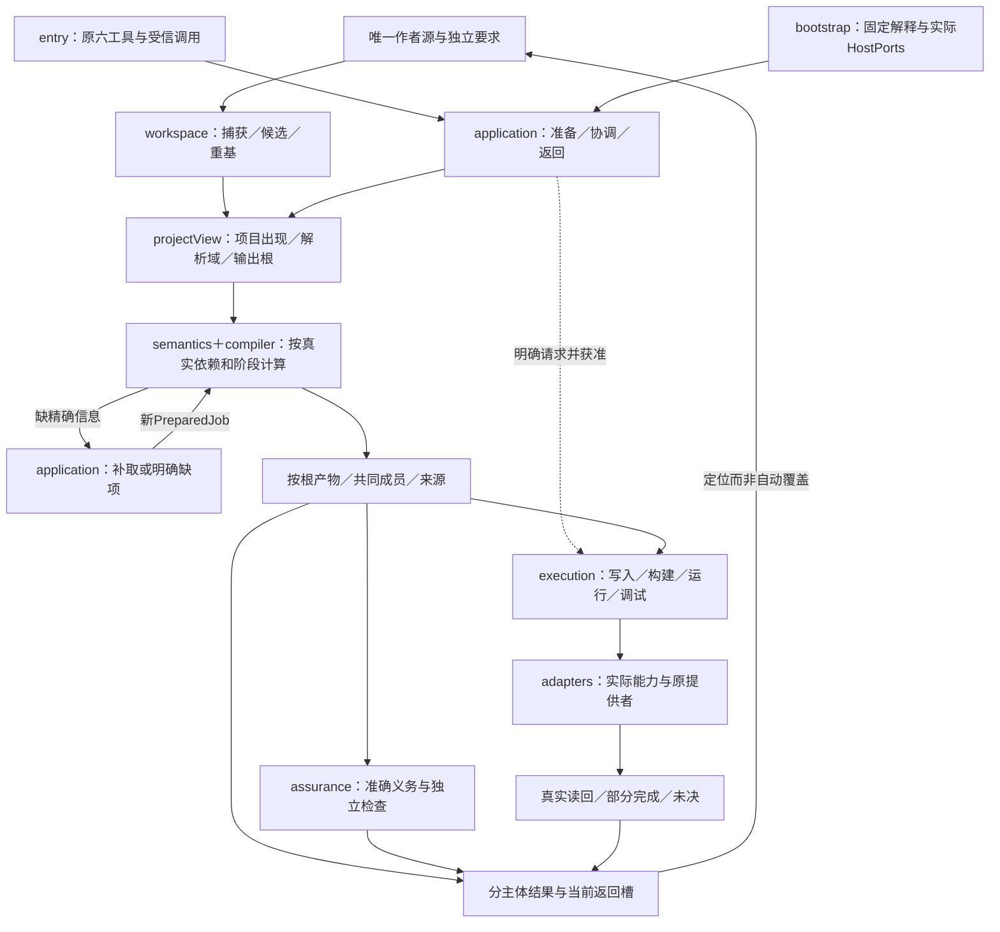
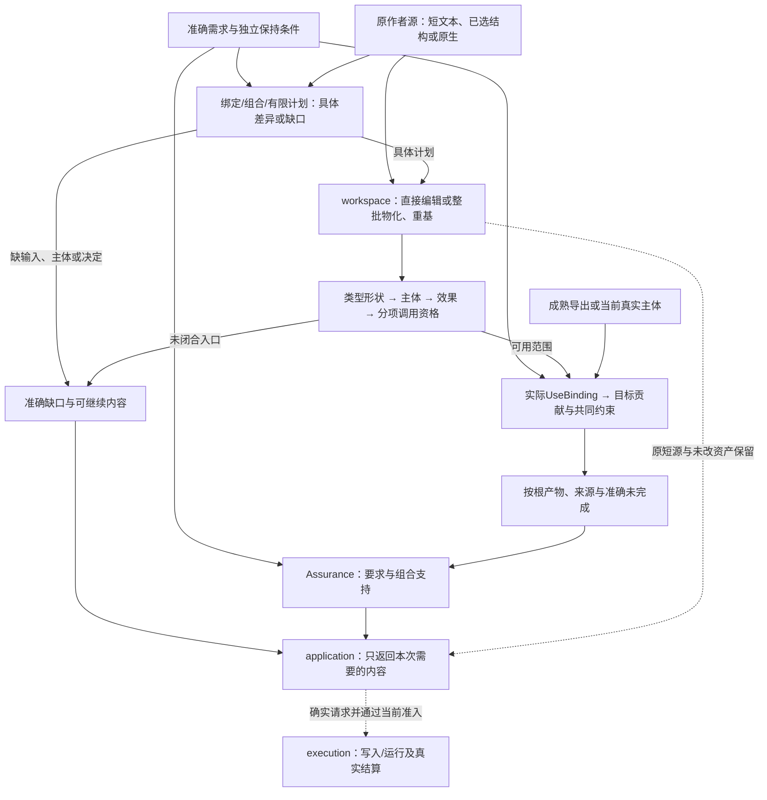
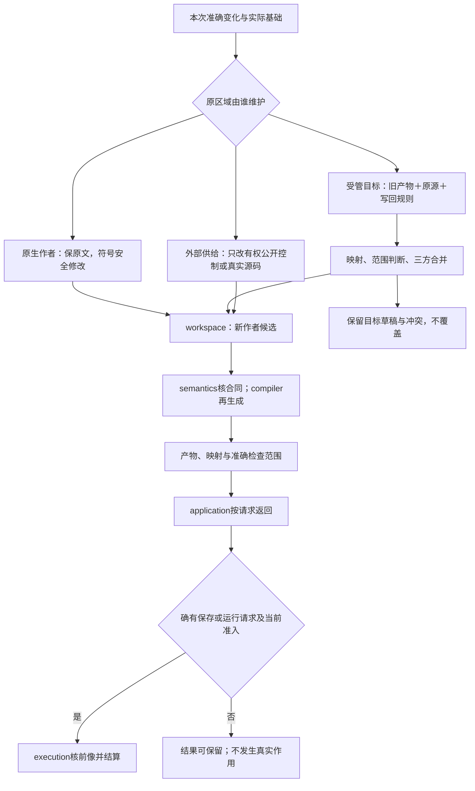
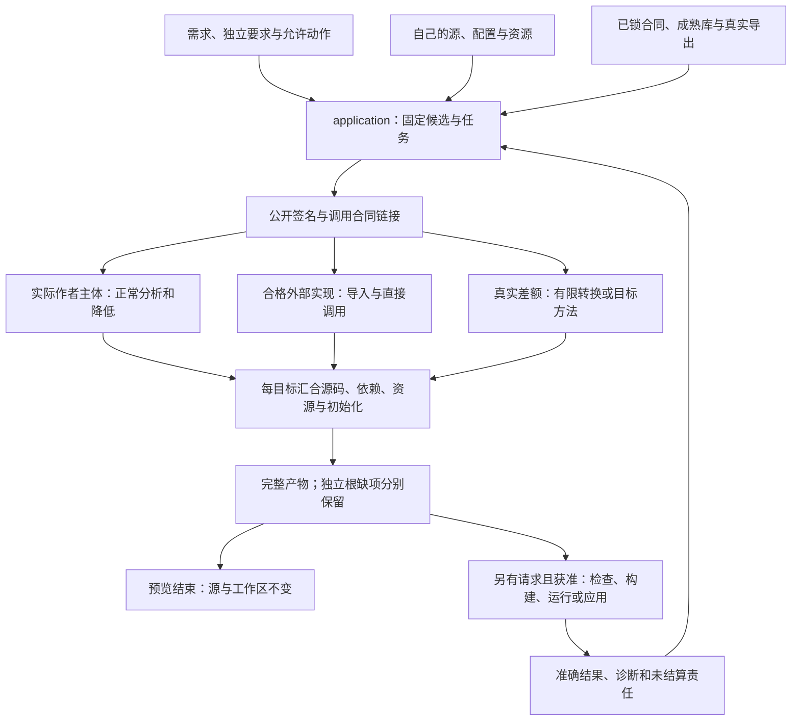
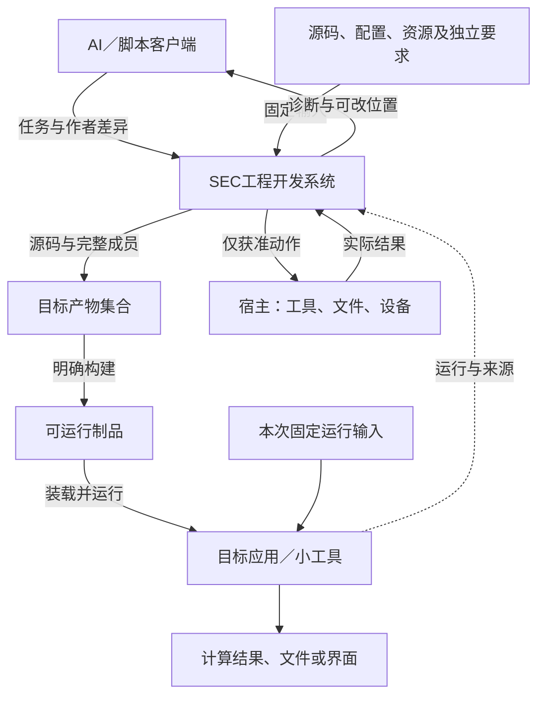
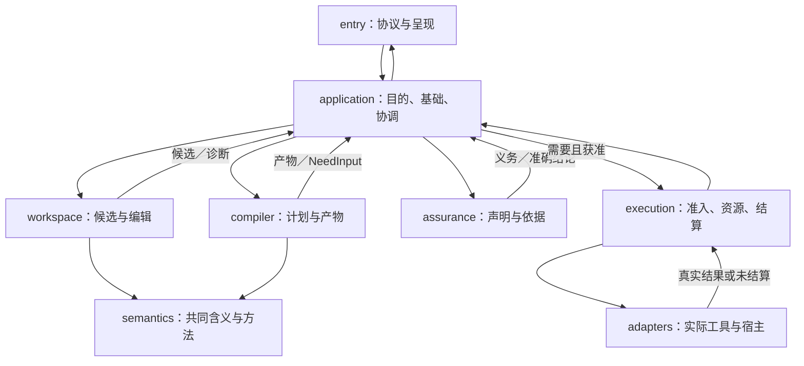
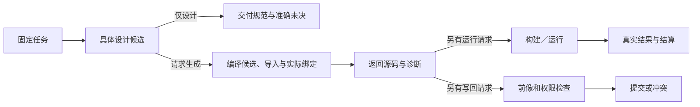

# 系统协作与状态边界

<a id="统一架构与责任边界"></a>

> **阅读范围**：采用范围内的设计规范；实现状态另查未决。

本篇是系统级交接的详细合同。第一次理解产品与部署时先读[总体设计](总体设计.md)；这里保留原精确值、方法、状态、消费者和失败边界，不把它们全部堆回总览。

<details>
<summary>本页内容</summary>

- [全工程成品总装：一份作者工程、一个协调内核、按需接入真实能力](#全工程成品总装一份作者工程一个协调内核按需接入真实能力)
- [需求、作者形式与实现共同收敛，而不是彼此替代](#需求作者形式与实现共同收敛而不是彼此替代)
- [当前成品的作者与执行关系](#当前成品的作者与执行关系)
- [当前纵向闭环：以编辑深度组织语言支持](#当前纵向闭环以编辑深度组织语言支持)
- [当前计算主线与两套成品架构](#当前计算主线与两套成品架构)
- [1. 成品到底是什么](#1-成品到底是什么)
- [2. 一幅完整的运行结构](#2-一幅完整的运行结构)
- [3. 各种“真相”分别放在哪里](#3-各种真相分别放在哪里)
- [4. 一次解释装配：使成品不因插件加载顺序改变含义](#4-一次解释装配使成品不因插件加载顺序改变含义)
- [5. 一次请求的正向执行模型](#5-一次请求的正向执行模型)
- [6. 动态补输入、工具调用与快照闭合](#6-动态补输入工具调用与快照闭合)
- [7. 所有领域怎样接到同一系统，而不只是接口名字相同](#7-所有领域怎样接到同一系统而不只是接口名字相同)
- [8. 跨域计划和产物怎样共同发布](#8-跨域计划和产物怎样共同发布)
- [9. 作者、工作区与目标运行的三个更新边界](#9-作者工作区与目标运行的三个更新边界)
- [10. 一项变化贯穿全系统的具体轨迹](#10-一项变化贯穿全系统的具体轨迹)
- [11. 统一架构的主动反例与当前处理](#11-统一架构的主动反例与当前处理)
- [12. 什么稳定，什么可以变，怎样避免无谓返工](#12-什么稳定什么可以变怎样避免无谓返工)
- [13. 当前设计完成到哪里，未决怎样继续](#13-当前设计完成到哪里未决怎样继续)
- [即时执行与低层控制如何使用同一架构](#即时执行与低层控制如何使用同一架构)
- [14. 规范归属与旧入口](#14-规范归属与旧入口)
- [同一编译和变更主链中的领域能力](#同一编译和变更主链中的领域能力)
- [作者入口的确定装配](#作者入口的确定装配)
- [开发面完整性不等于把所有客户端做成同一产品](#开发面完整性不等于把所有客户端做成同一产品)

</details>


本章定义 SEC 成品的总体形态、模块交接、数据归属和端到端行为，不以现有仓库布局为前提。[物理架构](装配/模块与运行实例.md)拥有目录与装配合同，语言与领域规范拥有各自含义；[实施设计](../演进/实施/主线前沿与准入.md)定义实现顺序及条件性迁移。


<a id="whole-system-assembly"></a>
## 全工程成品总装：一份作者工程、一个协调内核、按需接入真实能力

全工程范围首先是SEC自己的完整开发系统，而不是任一业务范本或某个IDE功能。稳定的是职责、输入输出和保持关系，不是把所有组件预先建成服务，也不是承诺第一次设计后永远不出现新的根反例。现有十职责继续成立；本节把入口、内存对象、全工程编译、实际作用与下一轮开发接为同一成品。各算法只有下表的机制拥有者，本节不复制另一份接口或运行状态库。

### 装配与调用的实际落位

| 接合 | 进入时已有的真实对象 | 负责者及必须完成的转移 | 完成后不能冒称的事情 |
|---|---|---|---|
| 宿主进入产品 | 当前Runtime配置、实际HostPorts、已支持合同 | bootstrap装配并封存解释；entry校验协议和受信调用上下文；application选择原六工具处理器 | 项目中的权限声明不是宿主授权；十目录不等于十进程 |
| 作者工程进入任务 | 原生/中立源、资产、清单/锁或临时UnitInput | workspace捕获唯一来源与实际版本，形成候选；application准备只读projectView和本次根 | 已捕获不证明跨文件原子，也不表示全部语义已知 |
| 需求或直接变化进入新源 | 独立要求、原基础、当前工作集或直接文件差异 | semantics处理准确含义，application选择真实供给/方法，workspace联合物化与重基 | 任意自然语言没有因保存成文件就变成确定程序；短源不展开为另一份作者 |
| 一份候选进入多个目标 | 项目出现、解析域、语言规则、所选根和阶段 | compiler完成声明/主体/效果、必要生成源、目标降低和共同成员组织；缺事实通过application补取 | 一个根成功不等于AND任务完成；原生依赖不是复制成SEC库 |
| 检查进入可用结论 | 精确候选、产物、原要求、方法及实际环境 | assurance按声明取得检查结果；application关联原主体并按当前许可返回 | 源合法、生成、目标检查、运行与利益达成各自判断 |
| 候选/产物进入真实作用 | 真实写目标、前像、当前权限或可运行制品 | execution准入、执行和分项结算；adapters仅在窄能力边界操作实际宿主 | 纯预览不写文件，源码输出不安装运行，超时不代表作用未发生 |
| 结果进入客户端及下一次修改 | 本请求代、精确主体、来源映射和真实作用状态 | application/entry检查返回槽；作者修改形成后继，旧运行继续绑定原制品 | 不把旧回调当新结果，不用新源解释旧暂停，不把历史产物改成当前 |

[Runtime对象作用域](装配/模块与运行实例.md#runtime-assembly-scopes)给出实际工厂、文件/函数、创建/借用/释放关系；[工程准备视图](../作者/工程源/清单模块与绑定锁.md#project-prepared-view)给出全工程输入；[编译过程](../编译/内核/领域方法与整体根.md#whole-project-compilation)拥有按根和按阶段算法。三个接口彼此消费，而非先分别做三个样机后再猜怎么合并。

<a id="fig-whole-system-assembly"></a>

下面的箭头区分数据和真实能力调用；读取器可以请求缺项，但没有直接连到磁盘写入、网络安装或目标程序启动的边。



### 可裁剪的是未使用能力，不是已有责任

纯内联函数：解释、候选、编译和必要内存结果即可，没有磁盘项目、守护进程、数据库或调试器。普通本地工程：增加实际文件捕获、源/输出保存和已请求的工具执行；默认仍可以一个进程内Runtime。多客户端：共享合格内容/计算，不共享“当前候选”；每次调用和真实operation保持各自身份。跨进程/远程：仅已选择的传输、平台、权限和恢复画像进入，不能因为有远程章节而默认启动服务。

调用生命周期和对象状态不能被统一成一个job.done。源候选可以有效但尚未生成；产物可以完整但目标工具未到；某检查失败但原稿仍可保存；已保存作者可以继续修改而旧制品仍运行；客户端已断开而子进程仍在结算。它们分别由候选、ArtifactSet、CheckRecord、Operation/RunRecord和返回槽拥有。相同字段值、相同字节或相同路径不消除这些主体差异。

### 同源、兼容与替换如何贯穿成品

公开接口/语言升级先形成精确候选与绑定，再检查真实消费者，不热改在途任务的EngineImage。兼容的新内部实现可以复用旧作者源；改变含义、输入格式或实际宿主能力时必须给相交迁移和检查。已经开始的保存/运行恢复仍由其原意图处理，不能交给被替换候选自批或改写自己的证据。

原生工程的深维护、短中立源的生成、受管目标回源是并列入口，最终共用相同作者和目标身份。目标源码映射只提供定位；逆向变更仍需原[回源合同](../编译/表示/编辑与受管回源.md#managed-edit-roundtrip)。当前不以全工程设计为由重新选择作者语言、删除简洁写法，或把所有算法迁入SEC自己维护的标准库。

全工程的连续设计与实现交付，以[成品自身多模块范本](../../examples/连续开发/全工程连续开发.md#whole-engineering-development-fixture)和[真实剩余](../状态/前沿与登记规则.md#whole-project-frontier)检验。Code-OSS校准原生编辑/宿主接入，纯计算、状态、关系、对象、流和AD范本保留各自独立证明责任；任何一个范本都不能独自代表全产品完成。

<a id="意图抽象位于现有工程主链不增设第二个平台"></a>
<a id="需求作者语义补全与目标产物的实际交接"></a>
## 需求、作者形式与实现共同收敛，而不是彼此替代

成品把四个对象接在一起：**原要求规定可接受行为；作者源保存真正独立的定义和决定；派生分析补齐能确定的信息；目标程序落实实际实现。** 跨软件关系抽象决定需要改变什么，短文本/参数/结构编辑决定怎样少写且准确地表达，编译器与成熟供给决定怎样实现。新增前者不能撤销后者，也不要求把一份短函数重新展开成全注解源或永久意图树。

当前仍采用原workspace/semantics/compiler/assurance/application/execution及其适配责任：真实源归workspace，需求/类型/效果归semantics，计划协调归application，实际生成归compiler，支持范围归assurance，现实作用归execution。语言路线、唯一作者来源、成熟供给直达、函数值、按需管脚和TS深度往返不因跨软件抽象而另选一次。

<a id="fig-integrated-change-closure"></a>

图中实线是数据/调用，虚线是保全或条件动作；没有从需求或compiler直接写工作区的边。直接编辑与需求驱动最终接到同一个作者候选，不强制每次都先建立完整需求组。



共同关系使用[需求合同](../作者/组合/跨软件需求合同.md#cross-software-intent-contract)；实际计划使用[可落实计划](../编译/实现选择与设计搜索.md#executable-intent-plan)；整批源操作使用[物化与重基](../作者/组合/结构编辑与身份保持.md#whole-change-materialization)。每段只有一个算法拥有者，总图不再定义第二套处理步骤。

**同一轮的三个检查边界：** 计划必须有真实差异或可执行生成方法，而非一句“以后实现”；短源必须经类型和效果闭合而非假定全签名已写；各产物必须共同满足所需成员及关系而非“每个文件都通过”。同一接受要求贯穿这些边界，类型通过、生成完成和满足任务仍分别返回。

<a id="本次作者闭环的实际接合"></a>
<a id="目标与最小核心"></a>
<a id="当前设计决定怎样成为可执行产品边界"></a>
<a id="一次变化中的作者决定与派生结构"></a>
<a id="作者派生与控制状态的唯一来源"></a>
<a id="一件工程变化中的意图语义控制和实现"></a>
<a id="先固定三份引用而不是再造三份作者源"></a>
<a id="同一工程的意图语义实现和现实如何接合"></a>
<a id="三种循环一个任务目标"></a>
<a id="本版作者表面的唯一落位"></a>
<a id="意图到全工程产物两个作者入口与一个实现选择点"></a>
<a id="管脚多作者表示和稳定生成的一条主线"></a>
<a id="从产品目标到设计工作再到编译动作的三层接合"></a>
<a id="需求复用与精化如何进入共同主链"></a>
<a id="高层block在成品中的实际位置"></a>
<a id="编译型定义体系与现有模块的关系"></a>
## 当前成品的作者与执行关系

**SEC将准确要求、作者自己的差异和已接受的实现供给，链接为可持续维护的目标工程。** 作者并不需要拥有全部算法源码：一项功能已经由合格库提供，就保留它的公开合同和精确绑定；存在真正的新行为时，先在作者工程保留准确含义与未满足义务，再由供给维护者或获准实现工作补定义、组合或真实主体；产品作者不被迫先写完底层程序。编译器同时接受这两类输入，不把外部实现改装成假函数体后才允许进入。

[操作协议](../开发/需求到交付主链.md#intent-to-product)负责需求创作与六工具交接；[编译值合同](../编译/内核/编译值服务.md#supply-aware-compile)负责作者模块、导入视图和使用点实现的实际分支；[物理实现](装配/源绑定与解释映像.md#supply-physical-layout)负责代码、数据和可写范围。本章给出完整产品与这些机制的关系，不再维护一条仅用于总览的竞争算法。

### 底层存在不等于底层由SEC重建

公开含义由准确语言、接口或领域合同解释。成熟实现可以没有任何同名`.sec`主体；用户自己的主体也可以没有专用生成器。两者在同一个调用使用点取得正确类型、效果、表示和实际实现。已有实现只支持调用，就只取得调用资格，不自动取得可内联、可微分或可迁到另一目标的资格。

当前不将可选文本意图语法、嵌套作者SDK、独立BlockManager、强制全图开发界面或通用Host运行容器设为前置。可复用定义和有型接口仍是作者组合的既有含义，不因拒绝新增管理服务而删除。已有`.sec`和结构源负责作者实际需要写出的内容；图负责相交的关系查看与编辑；已绑定的原生模块由成熟工具读取。根要求由开发AI或当前任务提供，固定构建不再次用AI补猜。

## 当前纵向闭环：以编辑深度组织语言支持

原生/计算维护路径覆盖TS/JS工程及中立计算源到TS的双向维护；它不取代结构化产品源直接生成的主线。Java不自动进入当前新实现前沿，不预定C、Rust或其他第二目标。直接作者编辑与结构修改共用候选，真实需求缺口决定是否接入额外供给。唯一采用理由和边界见[语言路线](../演进/实施/主线前沿与准入.md#language-roadmap)。多目标仍是架构能力，不是每次任务必须有两个语言。

三类编辑由application根据现有拥有者路由：原生作者源直接由workspace和成熟前端处理；受管目标改动由workspace固定旧目标及来源、生成作者候选，再由compiler重生成；只有公开接口的外部供给，修改自己的根/控制或实际有权源，不造一个虚假内部body。不是要求AI先认识全部模式，也不新增一个总逆向引擎。

compiler生成实际EditCorrespondence，workspace按精确规则写回，semantics核保持，assurance对具体结果给依据，execution负责最后采用。source map属于定位信息，不签发唯一写回或权限。完整数据与算法由[往返规范](../编译/表示/编辑与受管回源.md#managed-edit-roundtrip)拥有，工具入口由[generated-edit](../开发/工具协议/六工具与请求.md#generated-edit-request)拥有。



图中“目标可改”是形成候选的能力，不是双作者源。产生新需求仍可从自然语言创作；固定编译与回源只消费已经固定且可核查的内容。未知来源的程序能正常作为原生工程维护，而不伪称恢复了原作者的全部心理意图。

## 当前计算主线与两套成品架构

当前优先的是小工具、普通业务、文件和媒体处理、交互及复杂计算的完整开发。数据库、中间件与分布式设施只在真实消费者需要时接入；已发生作用的恢复责任继续保留。

**SEC开发程序**拥有作者与候选、导入解析、使用点检查、实现选择、生成、运行协调和准确诊断。**用户目标程序**只拥有自己的公开入口、真正的业务差异、直接库调用、必要数据表示和运行资源。目标程序不带SEC的任务记录、规则目录、全生态注册器或编译查询图。

<a id="supply-product-shape"></a>
### 三种工程都使用同一产品

| 工程实际内容 | 持久作者内容 | 生成与运行方式 |
|---|---|---|
| 已有能力完全满足 | 输出根、公开接口要求、必要目标控制与精确实现绑定；可以没有算法作者文件 | 从合格导入出口生成重导出、目标调用或所要求的公开门面 |
| 只有输入/输出表示或调用边界不同 | 前项内容，加真正需要的适配选择；能机械生成的适配不手写 | 对真实差额插入转换，保持原求值、失败、初始化和资源范围 |
| 本项目具有独特行为 | 自己的`.sec`/结构/既有原生作者模块，加已引用能力与资产 | 普通主体与库调用共同编译，必要时采用已合格的领域降低 |

这些是一个工程内不同使用点的情况，不是三种互斥项目类型。一个模块中可以同时存在自定义规则、标准库调用和有资源责任的FFI；相邻操作能安全共用原生表示时不来回转换。所有路径最终形成同一种按根产物与依赖贡献。

### 使用者工程与生成工程分别长什么样

```text
使用者维护的工程（按实际需要出现）
  sec.project.json      源范围、模块定位、输出根与独立控制
  sec.lock.json         已选择的语言、合同、实现、目标和依赖
  src/                  仅自己的新行为或既有作者源码；可为空/不存在
  assets/               实际图片、数据、样式和不透明内容
  design/               仅独立且仍有效的要求或理由；无重复则不存在

派生结果（在内存或明确输出目录）
  typescript/           公共入口＋自己的算法＋必要直接调用
  java/                 相应目标入口＋自己的算法＋必要直接调用
  所需依赖/构建材料      每个目标一个拥有者，与实际选择一致
  所需资源              明确复制/转换的内容，不复制整个源工作区
```

小片段不需要这些文件。完整持久工程使用清单和锁时，模块定位为空是合法情况：输出根可以来自当前已锁定、具有公开出口的导入模块，具体准入见[导入出口作为生成根](../作者/工程源/清单模块与绑定锁.md#imported-output-roots)。不能为满足`modules`字段而生成空`main.sec`、虚假函数体或供应商源码副本。

每目标的公开门面只在真实用户接口需要时生成。能够直接重导出则重导出；目标要求稳定类名、调用规约或错误形态时生成必要门面。门面是生成物，不是要求用户长期维护的同义包装库。只有调用方主动接管某个生成区域，它才按既有协议转为作者源。

## 1. 成品到底是什么

成品是一套**读取和编辑真实工程、链接语义与实现、生成普通目标工程的本地可嵌入工具**，外加按需装配的目标和宿主适配。首期具体实现继续采用TS/Bun与模块化单体；目标运行时可以是Node、JVM或其他已选择环境，不要求目标程序使用Bun或保持SEC服务在线。

<a id="fig-supply-product"></a>
### 图解：两类定义供给，一条产物与操作路径

实线表示准确内容或结果交付，不表示读取即获权。已有实现没有经“重写SEC算法”再进入编译器；图中的三个实现分支可以在同一输出根中共同使用。



### 成品交付而不是强制经过全部阶段

| 本次目的 | 必须得到的实际对象 | 不自动发生 |
|---|---|---|
| 理解、设计或创作 | 准确来源、可修改候选、当前决定与具体未决 | 不运行库、不执行包脚本 |
| 生成 | 合格使用点实现、目标源码、必要依赖与资产 | 不写工作树、不检查全部目标 |
| 检查 | 针对精确源或产物的方法结果 | 不改需求、不把上游测试贴到本地适配 |
| 构建/运行 | 固定制品、入口、输入及实际结果 | 不偷偷下载新版本、不热改在途实例 |
| 应用/保存 | 当前前像、写入计划与真实提交结果 | 不覆盖用户修改、不用新算法重演旧作用 |
| 演进/退出 | 可导出的作者内容、依赖和准确残余 | 不要求带走整个SEC控制平台 |

六工具沿已有协议消费这些对象。自然语言属于创作入口，源码/结构/控制/根选择是已经接受的具体内容；工具不要求作者再维护完整类型表、实现树或供应商接口副本。传统语言中的普通库调用本来就可能很短；SEC额外承担的是单源多目标、跨资产变化、精准编辑和真实作用。相应价值必须在同等能力与库的比较下取得，不以目录和对象名称作证明。

<a id="工程实体与开发客户端"></a>
<a id="固定核心与开放定义的接合"></a>
<a id="整体设计的实际检查单位"></a>
<a id="四个现有责任之间的实际接合"></a>
<a id="合法路径怎样结束"></a>
<a id="统一性的反向验收"></a>
<a id="对不同失败定位到真正拥有者"></a>
<a id="应用层步骤"></a>
<a id="唯一编辑来源按区域和上下文确定"></a>
<a id="不是一张万能图"></a>
<a id="四个交接点必须保留什么"></a>
<a id="跨阶段对象怎样接合"></a>
<a id="复用三类机制但保留真实责任"></a>
<a id="共同失效规则与长期变化"></a>
<a id="第一版的实际实现投影"></a>
<a id="根承诺与可替换实现"></a>
<a id="变更分类与当前处理算法"></a>
<a id="可以检验的局部性保证"></a>
<a id="最强替代与成本"></a>
<a id="开放与退出"></a>
<a id="小片段到整体工程的统一验收矩阵"></a>
<a id="全局优化判据与反转条件"></a>
<a id="中立语义的一次解释贯穿生成与保证"></a>
<a id="同一候选的调用证明缓存和交付接缝"></a>


## 2. 一幅完整的运行结构

<a id="fig-product-context"></a>

### 图解：产品上下文与目标运行边界

边表示调用或内容交付；虚线是准确来源关系，不是授权。源到源预览可以直接结束，目标应用不依赖SEC开发控制面常驻。



```text
AI / 脚本 / 已有工具客户端
            │ 六工具及其已协商分支
entry：协议、编码与有限呈现
            │
application：固定任务并协调当前用例
  ├─ 调用 workspace：作者与候选
  ├─ 调用 compiler：查询与生成
  │     └─ 使用 semantics：实际语言与领域含义
  ├─ 调用 assurance：相交声明、方法与依据
  │
  ├─ 接收上述结果／需补输入／动作需求 → 返回设计、候选或产物
  └─ 仅在本次请求需要时调用 execution
           ├─ 核当前准入、资源、前像与原意图
           └─ adapters：实际文件、工具、存储和设备
                         │
                  真实工作区与外部环境
                         │ 实际结果或准确未结算
                    返回 application

contracts：轻量公共引用与结果原语
bootstrap：选定具体实现并装配，不复制需求或程序
```

这是**模块协作图**，不是所有箭头都必须经过网络，也不是每个请求必须访问最下方。默认在一个可嵌入的模块化进程内装配；严格无I/O调用只带固定内容和已绑定的纯适配。真实工具、并行worker、持久控制和远程服务按实际请求装入。

独立部署单位由信任、容量、故障和寿命决定，不由图中有几个框决定。目标应用也不复制这张图：一个纯函数库可以没有SEC运行依赖；一个事务应用只带自己的必要运行辅助、数据库和交付机制。

### 六类稳定接缝如何落在模块中

基础接缝包括作者/身份、定义/组合、观察/绑定、查询/变化、降低/产物和作用/保证。workspace承担作者变更，semantics承担含义，compiler承担查询/解析/降低，assurance承担声明判断，application组合用例，execution履行真实作用；具体实现置于adapters。它们不是新增六套业务引擎。

[物理模块合同](装配/模块与运行实例.md#最终逻辑模块与公开接口)唯一规定接口签名、依赖和可写状态。本章不再同时维护kernel/domain/control等多套互相竞争的包树。

### 统一性的具体判据

统一不是把所有对象放进一种图或一个成功枚举，而是让同一变化遵守相同的来源、解释、阶段与作用边界。本文和物理接口共同检查：

| 接缝 | 必须保持的对应 | 不能由它直接推出 |
|---|---|---|
| 作者源与视图 | 文本、结构、管脚修改回到该区域唯一作者来源，引用保留准确基础 | 显示整齐或节点连通不等于语义正确 |
| 候选与编译结果 | 实际读取、方法、阶段输出及产物根一致 | 某阶段缓存命中不等于全部后续阶段可跳过 |
| 产物与检查 | 检查针对那份实际产物，前提和范围独立保存 | 产物存在不等于通过；两实现同错不证明任务满足 |
| 计划与实际作用 | 由application协调，execution在当前边界执行并结算 | 解析成功、冻结回执或文档箭头不产生权限 |
| 不同领域 | 值、错误、时序、效果和资源在实际连接处可检查 | 状态图、调用图和等待图不能共用一种环规则 |
| 规范与呈现 | 正文、图、状态表、伪代码和例子表达相同的适用条件 | 链接和图语法通过不证明实现或全部领域闭合 |

图的类型和投影规则在[共享关系规范](../作者/共同语义关系.md#图的角色投影与消费合同)拥有；模块接口在物理章拥有。本表只定义跨模块检查单位，不另建总图引擎。已给出的共同架构与具体领域仍分别验收，开放的对象、时间流、微分及各目标范围在问题登记中保持。

## 3. 各种“真相”分别放在哪里

<a id="fig-system-modules"></a>

### 图解：运行调用图与纯值返回

箭头表示一次请求的调用和返回，不是包依赖图；只有execution到宿主的路径可执行实际作用，其他模块通过application请求该动作。



| 内容 | 写入责任与取得方式 | 消费者可以做什么 | 不能由它代替什么 |
|---|---|---|---|
| 作者资产、区域作者权和候选 | workspace接管字节/结构，创建不可变候选；真实保存由execution执行 | 读取、构造下一候选、派生视图 | 当前权限、已运行状态 |
| 任务要求与接受关系 | application定位真实要求来源；有权变更才形成新关系 | 作为本次判断基准 | 候选不能靠改测试自动修改它 |
| 语言/领域定义及精确工具绑定 | 固定的解释装配，内容由库和提供者取得 | 按绑定解释、检查和生成 | 安装名字不证明已实现或有权执行 |
| 类型、效果、引用、来源与局部IR | semantics与compiler按实际输入派生 | 只读复用、按依赖失效 | 不成为另一份可手工维护的作者源 |
| 实现选择与布局基础 | compiler在要求与委派内选定，形成精确绑定 | 重建、比较、明确重选 | 不携带永久执行权 |
| 目标产物 | compiler发布满足成员条件的不可变内容清单 | 查看、构建、检查和有权应用 | 内容存在不等于检查通过或已部署 |
| 检查记录与当前适用性 | assurance保存针对对象的方法结果；当前适用性按需计算 | 继承合格依据，呈现准确结论 | 不修改产物字节，不签执行许可 |
| 当前作者头、装配头与目标状态 | 对应HeadStore或真实目标，仅由其提交协议推进 | 按前像比较、固定快照和读回 | 不用一个全局revision统一全部 |
| 在途操作、尝试、恢复资料 | execution保存原可信意图、实际步骤和结算 | 按原意图继续/撤回/协调 | 不作为可任意丢弃的查询缓存 |
| 问题、原则和研究采用理由 | 对应文档/实际任务系统的单一登记 | 按本次目的读取和更新 | 不因记录存在就成为运行强制或已证明事实 |

**具体收敛：ArtifactSet只拥有产物内容和来源，不拥有可变的“检查已通过”事实。** `RootResult.targetCheck`是应用根据独立检查记录形成的返回投影。删除、增加或撤销一份检查，不改变同一产物的内容身份；对a1检查通过不能贴到a2。同一结论也不能同时由缓存、产物和UI三个位置各自改写。

同一内容可以有多来源观察；被接受定义在其范围内有明确写入协议。“唯一拥有者”不是全世界只能有一个事实来源。库维护者可以改自己的私有源，普通使用者只依赖公开合同，编译器可以在有权范围分析私有实现并记录真实依赖。

## 4. 一次解释装配：使成品不因插件加载顺序改变含义

一项请求固定当前实际使用的语言定义、领域体合同、模块解析规则、库要求、控制描述符、分析/降低方法、目标工具和默认政策。它们形成**只读解释装配视图**，在物理章称为`EngineImage`。这只是已有绑定与实现对象的聚合，不是新增作者文件、全平台注册数据库或永久大IR。

装配先解析依赖和兼容范围，检查同一公开标识是否被两个不同含义抢占，再建立完整实例。声明互引可以按其规则成组处理；具有副作用的插件初始化不以“有环可求SCC”掩盖。需要外部进程或数据时先取得相应条件；普通导入不能直接执行不受信代码。

一次请求拿到image引用后，不在中途改动它。更新建立新image，新请求选择新image；旧请求保留旧解释，除非当前安全边界要求取消其相交作用。新增不相关库不能使当前任务默认改类型、函数绑定或输出。

**后续才发现新语言或工具时。** 不为了冻结而预加载全部生态。仅缺普通内容时，在原image下形成PreparedJob后继；若新内容确实需要未装载的解释/方法，由bootstrap在本次允许范围建立新image，并形成新的准备输入代际。旧image不修改，已有阶段结果只在实际消费的解释与依赖仍相同时复用。新要求需要改动已经固定的语言含义、超出依赖政策或执行许可时，返回明确的采用/能力缺项，不静默继续。公共请求可以协调这个有记录的续接，但同一编译动作键不混用两代方法。

编译键只包含实际消费的方法与定义，不把整个全局目录摘要塞进每个查询。旧方法结果不能因为接口名字相同就给新方法使用；需要适配时，它自身也有版本、输入、输出与保持条件。

这项设计借鉴[MLIR对并行Pass及依赖方言装载的约束](https://mlir.llvm.org/docs/PassManagement/)：可复用的方法不应该依赖全局可变状态或未受控的装载时序。SEC不因此必须使用MLIR，其领域合同也没有自动获得证明。

<a id="从任务要求到可兑现实现的根接合"></a>
<a id="新知识怎样进入而不改变旧操作"></a>
<a id="一次请求的正向执行模型"></a>
<a id="用户工作与机器操作的关系"></a>
<a id="任务族作用域与最小实现"></a>
<a id="计算算法与事务操作的共同接缝"></a>
<a id="一次联合变更如何正常完成"></a>


## 5. 一次请求的正向执行模型

本节合并原A流程与历轮根流程。内部解析请求包含目的、作者基础、要求引用、输出根、目标、布局和预算；已知内容由上下文取得，不让AI重填。当前访问与执行许可属于外部准入事实，不由这个记录签发。

**A1 接收并固定。** 检查公开分支互斥和有限载荷；定位准确候选或一次接管原文；验证当前读取范围。内联新源没有项目壳也可以形成候选。旧引用失效就返回准确缺项，不改用latest。

**A2 形成唯一候选。** source、files、text edits、结构操作、control-change和asset-change都降低为同一个作者增量。workspace先在暂态builder构造完整批次，再封存新候选；协议错误整批拒绝，合法位置的程序错误可以成为草稿。没有真实作用时外部工作区保持原状。

**A3 固定解释及输出问题。** 绑定EngineImage、相交要求、输出根和布局基础。通过I0—I8合并显式、继承、推导、缺省和委派；运行参数不是缺决定。原任务要求不随候选前置条件或测试答案自动改变。

**A4 求值并补所需输入。** compiler消费固定值，返回实际结果或类型化的缺输入。application负责取得合法读取或工具结果，形成新的准备输入。内容不得在原快照里原地变化；新增事实影响哪个根，就重开哪个计算。具体续接见下一节。

**A5 组合和生成。** semantics提供真实边界；compiler闭合输入域、效果、寿命、资源和公开关系，选择或复用完整路线。合法独立根可以先产生，AND组仍保留全部共同义务。高层结构按其领域规则降低，不能一律压成函数或事务。

**A6 选择性检查和作用。** assurance从当前任务确定实际义务及可继承依据，需运行的方法变成明确动作。execution重新核当前许可、前像和资源后执行；纯类型结果不获得写权限。preview不因想得到更多证据就部署目标。

**A7 返回和移交。** application按每根的源分析、生成、检查、保存/运行分别汇总；输出短视图但不隐去影响请求的缺口。结果引用取得必要存活关系，其余暂态释放；还在工作的worker和未结算作用交给明确拥有者，不能因请求已经返回就销毁其输入。

所有步骤既有成功路线又有有限结束：推进一个新节点、得到一份新输入、满足一个返回条件或给出准确失败。没有事实变化的同一NeedInput不反复重跑；等待AI决定时不持有目标写锁。任意源递归不要求先证明终止；目标运行检查需要相应隔离与预算。

<a id="输入对象产出与不变部分"></a>
<a id="从输入到输出的编译责任"></a>

## 6. 动态补输入、工具调用与快照闭合

`compileFrozen`的纯性不能通过把任意网络/文件操作藏进只读回调取得。`NeedInput`区分**缺内容**与**缺外部分析/生成结果**：前者定位内容或解析请求，后者引用有明确类型的工具合同及其固定输入。二者都是描述数据，不能携带任意命令让协调者照抄执行。

application用已装配的获准解析器处理：已锁的内容读取精确版本；未选依赖可在允许集合解析一次并固化选择；外部工具执行经execution，结果带真实输入、方法和覆盖。普通纯生成不因此允许联网、安装或运行作者模块。

补入过程使用已有PreparedJob及其输入修订的后继，不另建一套快照模型：

1. 固定本次作者基础、解释与需求；未捕获项明确保留为未捕获。
2. 将请求按准确定位与作用角色去重，关联所有真正消费者。
3. 执行允许的取得方法；得到精确内容、该范围准确不存在、拒绝、暂不可得或工具失败。
4. 只增加此前未固定的内容。已经固定的同一来源出现不同版本时，返回捕获冲突；需要新基础就显式重建，不覆盖旧值。
5. 若输入集合产生了新身份，后续结果绑定新输入；真正未变的子查询可以复用。全局图谱不存在时，不为每次补读重建无关领域。
6. 一个目标需要同一时刻的一致快照时，使用有能力的快照提供者；普通工作区的逐次读取只能声明真实的合成捕获范围。

严格同一快照的缺失读与稍后变化不可混用。第一次确认不存在、后来发现同一名对象出现，说明范围或版本改变；不能在同一动作键下同时声称二者真实。Bazel把环境隔离和源身份共同用于封闭构建，支持这里不能只固定源码、仍从任意宿主读取工具和库的判断；具体设计并不要求SEC使用Bazel。见[Hermeticity](https://bazel.build/basics/hermeticity)。

## 7. 所有领域怎样接到同一系统，而不只是接口名字相同

每个被采用的语言/领域包提供自己的类型、体结构、作用域/激活、公开能力以及必要的方法。方法分别承担读取、绑定、检查、边界摘要、转换、编辑投影或演进；缺哪项只限制实际依赖它的动作。完整方法合同见[领域方法的共同调用协议](../编译/内核/领域方法与整体根.md#领域方法的共同调用协议)。

| 领域内容 | 保留的高层结构 | 编译时接合 | 目标运行或后端责任 |
|---|---|---|---|
| 通用计算与用户库 | 有序表达式、绑定、类型、契约、公开门面 | 原签名与效果规则、实际库/目标映射 | 普通模块、合法循环/数据表示；无强制SEC服务 |
| 网格/数值/设备 | 形状、索引关系、精度、边界、访问与预算 | 计算域摘要和合法调度/表示策略 | 成熟算子、循环、缓冲、设备提交和真实同步 |
| 对象与接口 | 身份、字段、构造、分派、访问与生命周期 | 对象合同、目标特有控制和ABI适配 | 实际类/接口/句柄；仅class外形不冒充对象行为 |
| 事务应用 | 聚合、决定、操作、订阅、共同提交义务 | 规则检查、存储能力与交付绑定 | 目标应用自己的事务/出站/认证；不借开发权限运行 |
| 层级状态 | 活跃配置、转移冲突、进入退出和历史 | 状态域规则与代码生成 | 规定的微步/宏步、取消、持久或瞬态状态 |
| 关系查询 | 集合/多重集、空值、键、顺序和聚合 | 类型化查询图与合法计划选择 | 实际数据库/本地集合和对应一致性 |
| 时间流与实时 | 时基、水位、窗口、背压、期限与资源 | 有界流/时间接口及目标条件 | 队列、调度、计时和真实设备保证 |
| 微分与近似 | 导数意义、不可微点、随机/状态和记录寿命 | 微分规则、数值合同与变换保持 | tape/检查点/内核及真实内存、误差 |
| 配置、资源与文档 | 格式树或原字节、成员与引用、作者归属 | 选定格式适配与完整资产闭包 | 打包、复制、合法转换和许可资料 |

表中后四类的某些便捷作者形式与详细算法仍有已登记缺项；本章给出它们进入总体的固定接口和状态责任，不谎称表格已经替它们完成领域设计。不支持一类高级表面不应导致核心重新设计，也不允许通过任意JSON把缺少语义伪装成已支持。

跨域连接生成显式义务：上游正常结果能否进入下游输入，失败/取消怎样交接，资源能否跨边界活到最后消费者，实际适配是否改变精度/顺序/作用。互相假设不能自证成立；必要时合并相交检查域。转换不是免费的箭头。

包描述或接口语言可以说明类型形状，但不能独自证明行为。例如[WIT](https://component-model.bytecodealliance.org/design/wit.html)定义接口合同而不定义函数执行行为；SEC因此把shape校验、语义方法、目标实现与实际准入分别接合，而不是指望注册表自动补全一切。

## 8. 跨域计划和产物怎样共同发布

编译器使用每个领域返回的候选贡献，统一取得输入需求、生成输出、连接条件与成本。完整域计划的算法由各域拥有；共同链接器负责真实跨域连接、公共符号、产物路径和AND/OR根，不修改业务规则来消除冲突。

每个逻辑输出在同一绑定中只有一个选定生产者，或一个显式组合器。独立贡献争写同一路径时报告竞争；相同字节也不能自动合并两份不同的生成权。共享声明需要合并时，指定一个拥有公共符号表的生成步骤，其他贡献提供结构，不在文件尾按完成顺序拼接。

产物先写隔离的成员builder，检查路径、类型、引用、源码布局及要求的资源。封存ArtifactSet后再对外发布引用。代码生成成功但必需图标没取得：可独立返回代码根，完整包根保持缺项。没有需要的资源或运行功能，不制造空目录/数据库/工作器。

缓存命中只能提供同键合格内容；作者当前可读、结果当前可披露、产物当前满足哪些检查，分别判定。合法历史内容可以保留，但不能由旧操作更新当前头。两个确定动作同键输出不同，隔离相交结果并调查输入、方法或环境，而不是采用后到者或最快者。

<a id="关闭工单的完整作用合同"></a>

## 9. 作者、工作区与目标运行的三个更新边界

**内存作者变化。** workspace封存C2，只增加新的候选和映射，不原地改变C1。分析错误可以保留在C2；派生C1的A1仍然属于C1。

**作者保存或产物应用。** workspace/compiler给出精确写集与保持范围，execution取得当前目标前像、权限和实际提交能力。小型已有目录可以使用可恢复多文件协议；具备版本目录/指针的提供者可以原子切换。普通目录的原始读者可能观察中间态，不能把逻辑候选原子性扩大成全部磁盘物理原子。

**目标程序运行。** 生成的软件有自己的状态、输入、权限与寿命；开发工具的apply(write-output)不会调用里面的业务函数。需要构建、部署或业务调用时，分别使用该实际动作和目标协议。执行成功不证明业务正确，契约失败也不撤回已经发出的外部作用。

同一个作用域的可变头由一个提交协议拥有，不允许workspace、compiler和UI分别写同一个head。物理上可以合并在一个数据库事务里，但逻辑角色和前提不混淆。多来源观察与独立版本可以共存，不用全局revision将C2、A1、检查E1和部署D0压成一个状态。

## 10. 一项变化贯穿全系统的具体轨迹

<a id="fig-system-phases"></a>

### 图解：同一任务的四个合法结束点

图只分离交付目的；结束设计、返回源码、运行完成与实际采用都不是彼此的自动授权。



本节使用[字节指纹完整范本](../../examples/实现校准/成熟供给与计算工具.md#native-supply-product-example)核对整体变化，详细API与目标源码由该范本拥有。

| 前态与刺激 | 经过的责任 | 后态与保持范围 |
|---|---|---|
| 请求已有SHA-256字节能力，输出Node/Java，只预览 | application固定要求；workspace形成根/目标/导入候选C1；不造同义算法源 | C1包含准确选择；现有README和图标不变 |
| 读取公共合同与实际导出 | 导入适配产生ImportedModuleView；semantics链接类型/效果/寿命 | 导出签名与已接受合同分别可追踪，无假body |
| 两目标解析实现 | resolveUse选择各自真实调用序列；生成者提供导入/工厂/格式/依赖 | 每次运行的hash状态不在编译期创建或全局共享 |
| 所有必要成员已得 | composeTarget分别形成A-node、A-java | 各目标源码和依赖独立完整；缺某目标不代签共同任务 |
| 只改Java公开名 | 通过现有target.public-name形成C2，复用算法供给，更新Java门面/消费者 | Node产物和未改资产保留；对外旧名兼容按实际要求处理 |
| 只改运行输入 | operation固定对应制品和新输入，execution实际运行 | 代码可复用；只有运行结果变化，旧结果不更新新头 |
| 新增自定义报告政策 | workspace加入真实项目主体，调用已有导入；共链分析生成 | 只维护新政策，不移植成熟算法 |
| 用户要求写入某目标，工作区已被他人改动 | planSave后execution复核当前前像 | 冲突保留现场；不因产物合格自动覆盖 |

需求、候选、语义、具体绑定、字节产物、检查和运行各有关系，不能由“摘要函数名相同”合成一个身份。独特控制/图分析/反馈算法继续见原范本，它们通过同一接口工作，不因成熟复用路径增加而被排除。

## 11. 统一架构的主动反例与当前处理

| 触发 | 具体处理 | 保留的独立结果 |
|---|---|---|
| 插件在请求中途升级 | 新建image，不改旧请求；必要安全撤销只限制相交执行 | 旧内容、旧解释和已发生事实 |
| 补读返回与已固定源冲突 | 新建显式输入基础或返回捕获冲突，不覆盖旧输入 | 合格的旧快照查询 |
| 新规则连接两个原独立区域 | 从新图加旧消费者求影响，必要时共同检查 | 不相交根的结果 |
| 两个生成器争同一输出 | 由显式选择或组合合同裁决；没有则阻断该根 | 独立输出成员 |
| 一份检查被撤销 | 重新计算资格，不改产物字节和历史执行 | 原产物可按真实权限继续读取 |
| 单模块错误与另一目标缺项并存 | 按模块语言规则和根分别返回，不用最高/最低状态代替 | 真正不依赖错误模块的产物 |
| 计算父任务等待子项且占满内存 | 同一宿主预算准入、挂起续体、合法释放或降低并发 | 未受影响的已完成只读值 |
| 真实写回中途取消 | 停止新准入并按原意图读回/恢复，未停止任务继续计资源 | 当前外部状态的准确记录 |
| 外部作者修改与旧候选应用竞争 | 按目标比较发现冲突或协作协议处理，不盲目覆盖 | 双方候选及原资产 |
| 语义包只有接口没有lower | 可分析/保全，所需生成明确缺能力 | 不需要该lower的查询 |
| 目标代码缺必需运行辅助 | 根包不完整；纳入真实依赖或准确拒绝目标 | 独立的语义分析 |
| 关闭过的功能仍有未交付责任 | 停止新工作并排空/停放/转交，再退役实现 | 必需恢复与历史解释 |

这些扰动用于检验正向协议与边界。不能只修拒绝路径：在所有前提成立时，上述正常轨迹必须能到达所请求结果。

<a id="语言体系与工程系统的边界"></a>
<a id="生态成熟也保留选择和不确定性的准确边界"></a>
<a id="进展条件和资源边界"></a>
<a id="先稳定什么怎样限制返工"></a>

## 12. 什么稳定，什么可以变，怎样避免无谓返工

稳定对象是公开语义、作者归属、版本化交接和真实副作用责任。公共要求不变时，私有算法、数据结构、目标打印器、存储实现和并发方式可以在对应边界内替换。扩展包新增能力不能迫使所有消费者重新写源；可见行为、ABI、持久数据或运行假设改变时，必须处理真实迁移，不能用一个adapter名称掩盖。

本版选定模块化单体，不先建设一套分布式平台；选择稀疏作者源和局部投影，不先物化全世界图；复用成熟解析器、数据库与目标工具，不重做已具备的能力；保存实际新增的规则与接缝，不把上游测试成绩当作SEC全体系证明。

没有无条件的“任何未来要求都不会大改”保证。可以检验的是：遵守公开合同的消费者，在替代实现保持该使用域合同、ABI和环境要求时，不必因为私有改变而重写作者源。无需重写、无需重编译、无需迁数据和无需更改部署仍然分别判断。

六类基础接缝按产品目标和机制定义。旧实现符合合同就复用，不符合则适配或替换；迁移用于评估实际成本和路径，不能反过来决定用户必须怎样创作。

## 13. 当前设计完成到哪里，未决怎样继续

本章已经给出最终模块、唯一数据拥有者、固定解释、补输入、领域调用、跨域生成、保存和目标运行的共同机制；相应接口和原子发布点在物理章与编译章给出。它们不再留给未来实现者临时猜。

领域的完整作者表面、某类原生映射或特定设备的保证仍可能缺详细设计；这些按[单一问题登记](../状态/前沿与登记规则.md)继续存在。设计子范围一旦闭合，问题记录改为实际剩余的实现或扩展，不保留失效待办。也不能因为设计子项闭合就将整项实现、运行和收益全部关闭。

当前闭合的判据是：对明确支持范围，每个入口能落到数据、方法、允许变化、成功、错误、取消、释放和后续修改；每个数据有唯一写入责任；每个跨域连接有消费者与检查；不适用机制能省掉；真实作用需要时能接入。此判据是本设计的检验范围，不是全域最优或没有任何未知反例的证明。

## 即时执行与低层控制如何使用同一架构

作者的函数、普通控制和需求封装保持同一来源；局部var是目标计算状态，不是workspace当前头。常量的模块可见性、对象的运行寿命、设备的停止责任由各自合同决定，不用“变量都在统一模型里”混同。

发行请求生成所需源码与制品集合；明确compute-eval请求只准备所选入口的必要闭包，然后进入相同Runner。检查器、数值/错误规则、资源准入和真实操作身份仍相同。直接运行的轻量路径来自缩小实际输出和复用阶段，不来自绕过检查、执行原作者文件或关闭安全规则。

本地模块和库不要求公开包注册；新多模块工程默认src并保留旧路径。显式项目声明与机器解析锁分别承担要求和结果，普通编辑不同时维护另一份“意图配置”。目录、执行方式和存储策略都不改变全工程资产的唯一作者归属。

## 14. 规范归属与旧入口

总架构只维护本章这一套关系。物理模块与接口、编译算法、语言/领域、操作、执行、来源及问题分别拥有细则。历史代码观察留在来源章；具体迁移材料移至实施章的条件附录，不进入成品的定义。

旧锚点已归入上文相应段落，仅用于既有链接定位；不维护第二份历轮根架构。

<a id="层级状态作为成品总装的具体领域"></a>
<a id="关系计算对成品主链的具体校准"></a>
<a id="对象流与微分的共同接合"></a>

## 同一编译和变更主链中的领域能力

新通用工程使用[一次固定的语言组合](../领域/计算基础/紧凑表示与程序范式.md#合同标识默认语言组合与按需能力)，普通作者不逐类选择画像或为每个库创建另一份模型。领域规范可以分章，但不因此产生第二套候选、类型、接口、头或权限系统。语义族ID、库入口、编码和实现修订分别承担精确解释，不混成一个全局开关。

对象、状态、关系、流和AD经同一semantics方法进入compiler产物贡献；其[状态所有者](装配/能力接合与文件责任.md#领域共享编译责任运行状态由目标拥有)属于目标程序，而非SEC开发库。关系源读取与状态活动要经真实宿主取得，静态库导入不执行它们。ChartSnapshot、ViewState、对象实例、窗口修订和tape各自有含义，不因都叫状态就合并存储。

组合仍检查具体边界：对象读取形成不可变输入后才能合法重算AD；取消流不能使求导器失去仍在借读的内存；同一请求内旧窗口导数只结算原资源，不能覆盖新修订；关系结果可读不自动允许公开聚合，跨源版本向量不冒充全局同时快照。源定义改变需要迁移或重算目标状态，不能假装是一条数据delta。

完整小工具不依赖每个领域先完成；高层领域也不被降成无合同函数黑盒。新功能如果只是更多定义或方法，沿现有边界进入；真的改变公共含义，则修改相交规则与兼容条件。模块图、类图或更多适配名称都不能替代这一步。

## 作者入口的确定装配

当前新产品从[结构化意图与Block](../作者/结构化源码.md)直接进入共同语义，计算文本与原生区域沿各自已选解释。application不会为每个请求重新评选`.sec`、SDK与JSON；已有区域要改变作者表示须经过显式迁移。EngineImage按所请求范围装配真实读取能力，不声明未采用的host-builder，也不要求普通协议客户端导入作者构造SDK。

扩展接口保留可替换性，但可替换不等于所有实现都需要现在交付。候选出现、方案可行、当前采用和实际装载分别处理；采用决定由对应正文和D理由记录，不由适配器安装顺序产生。


<a id="developer-entry-unification"></a>
## 开发面完整性不等于把所有客户端做成同一产品

[完整动作面](../开发/编辑审查与客户端.md#developer-surface-contract)把源、工程控制、测试、运行和交付接到同一架构；新增的是具体消费者和缺少的有限交互输入合同，而非第十一模块或万能工作台。源码/语义批次仍由workspace/semantics/compiler承担，检查由assurance，真实环境、VCS、进程和发布由execution/真实适配承担，entry/application归一并返回。

直接文件编辑、六工具API、SDK辅助和既有原生工具可以共同构成一个开发者可用的完整环境；它们的行为必须准确对应，不能为了声称“一站式”对未注册动作伪造公共API。远端仅提供六工具时，能力边界也必须真实可发现；安装/发行等缺少宿主操作通路的功能不能标已支持。按需接合和故障恢复不改变生成程序独立运行的目标。

开发面优先完善当前所有动作族的正常路径与明确停止点，不把高级语义内核未实现和GUI未选当成同一个缺项。凡某动作需要尚未设计完的具体跨语言/资源重构或实时等语义，沿原U保留该能力的真实义务；共同入口设计完成不为它代签。

