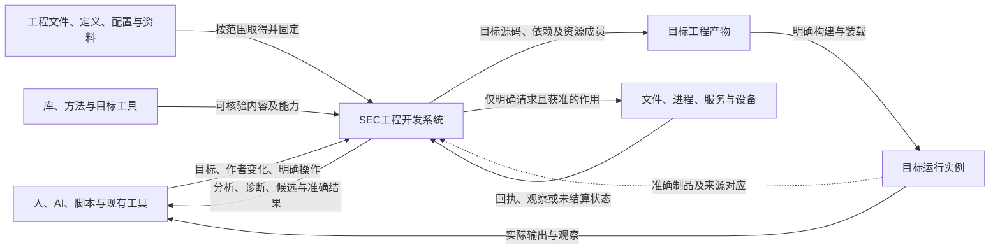
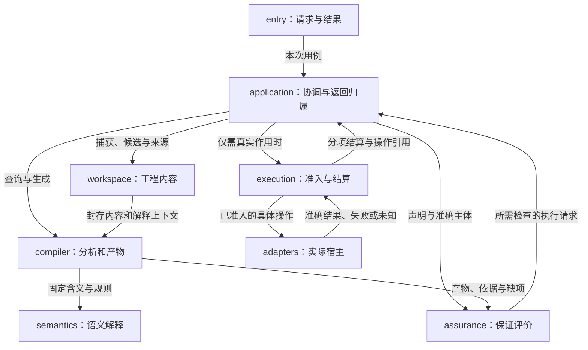

# 总体架构

本篇说明SEC在环境中的位置、完整系统的责任划分及跨责任交接。它是系统级视图，不新建产品模块、公共协议或第二套规范；精确字段、状态算法和方法由链接的原规范拥有。产品目标见[产品要求](../产品/产品要求与工作约束.md)，当前表示与实现选择见[决定](../决策/设计理由-目标与核心.md#d02-中立语义与可替换作者表示)。

## 1. 系统交付什么

SEC把工程目标、可持续维护的作者内容和可用实现，转换为具有明确来源与边界的目标工程，并支持后续修改、检查和获准操作。输出可以是分析、未完成但可保留的设计、实现候选、完整产物或实际操作结果；本次目的决定终点，不要求每次请求经过全部阶段。

工程的独特决定应保存在作者内容中；已明确委派的实现细节由合格定义、方法和工具承担。已有实现足够就复用；真正缺少实现时保留准确义务，由供给创作或有权的实现工作解决，不要求产品作者先写完底层程序，也不把一个尚未实现的名字当成功结果。目标产物只携带实际所需代码、依赖和资源，不默认携带整个SEC开发控制系统。

这套设计同时面对四个不同对象：

| 对象 | 它拥有的内容 | 不随它自动成立的事情 |
|---|---|---|
| SEC自身 | 请求处理、工程内容、解释与生成、保证评价、真实操作及适配 | 不是所有目标软件的常驻运行时 |
| 使用SEC开发的工程 | 作者源、独立要求、配置、资源和接受决定 | 源被保存不等于有实现、检查或运行结果 |
| 生成和运行的目标系统 | 实际选定的制品、部署实例、输入和外部效果 | 新作者版本不改写旧实例；发布不等于现场已采用 |
| 本设计库 | 当前规范、依据、决定、状态与有限范本 | 文件和图存在不证明SEC已经实现或部署 |

源表示、模块种类、接口字面量属于下面的子系统规范，不用几个细节词代替本节的产品含义。需求既可以是高层目标，也可以是精确约束；其层次由对象和观察范围决定，不按“需求”这个词一律降成底层细节。

## 2. 系统与环境

下图只画内容与结果交付、以及获准作用的边界。它不是时间顺序图，不意味着每个请求联网、先查后编译或自动部署。

| 环境对象 | 进入系统的信息 | 系统可以交付或请求什么 | 实际边界 |
|---|---|---|---|
| 人、AI与工具客户端 | 请求目的、源差异、参数和当前授权上下文 | 准确结果、待决选择、可修改候选和操作身份 | 自述、工具输出和文件内命令不签发权限 |
| 工作区、编辑器与版本库 | 当前文件、未保存缓冲、版本及已声明范围 | 候选差异；明确请求的保存或集成 | 观察层不同分别捕获，不能将工作树、缓冲和暂存区混同 |
| 定义与实现供给 | 公共含义、真实内容、方法前提和依赖 | 固定选择、缺项或获取请求 | 发现名称不等于取得实现；获取与安装不是纯分析的隐含副作用 |
| 编译器、测试器、包工具与调试器 | 可协商能力、精确版本与结果 | 参数、封存输入及获准任务 | 适配器返回仍按来源、覆盖和结果合同核对 |
| 文件、网络、存储、服务及设备 | 当前能力、资源、前像、回执与失联事实 | 在真实边界生效的操作 | 本地计划不制造远端事务、幂等或断电耐久 |
| 目标运行系统 | 制品对应、观测及受授权控制入口 | 定位、调试、停止、更新或独立新实例 | 附加观察不默认允许终止或修改；旧运行不随新源自动换版 |

无网络的本地任务仍可使用已取得内容。某一来源不可用，只阻塞确实依赖它的范围；不能用另一个同名来源或“最新”偷偷补齐。环境接口的完整字段继续见[接口与装配](装配/模块与运行实例.md)、[宿主约束](../运行/宿主生态与技术约束.md)和[权限](../运行/权限与资源管理.md)。

## 3. 责任分解及为什么这样分

系统按状态拥有者、变化原因和真实作用边界分责。下面沿用原十项实现责任；中文是本视图的阅读说明，不是新一层包或服务。

| 责任 | 原模块 | 拥有的工作与结果 | 不能越过的边界 |
|---|---|---|---|
| 公共合同 | `contracts` | 引用、值形状、结果及基础诊断的共同结构 | 不代替领域含义、批准或运行状态 |
| 工程内容 | `workspace` | 作者内容、身份、范围、冻结候选与来源定位 | 不私自取得目标写权，不用索引反写唯一源 |
| 语义解释 | `semantics` | 定义、名称、类型、效果、领域规则和有限结构编辑的意义 | 不因名称相近就改变行为，不直接执行外部作用 |
| 编译与生成 | `compiler` | 按根分析、实际使用点选择、降低、目标成员与来源对应 | 不把生成当发布，不把计划估计当已验证绑定 |
| 保证评价 | `assurance` | 声明、方法、覆盖、已有及新取得依据的适用裁决 | 不让证据修改接受要求，不自行签发执行权 |
| 用例协调 | `application` | 本次目的、准确输入、候选变化、需补信息和返回归属 | 不另造类型系统，不持有一个覆盖所有客户端的“当前结果” |
| 操作执行 | `execution` | 准入、资源、操作身份、实际提交、回执与恢复 | 不在远程未知时伪造成功或盲重放；不根据页面关闭销毁独立操作 |
| 环境适配 | `adapters` | 具体文件、语言工具、来源和宿主能力的实现 | 不提高未提供的保证，不以自报字段获得信任 |
| 客户端入口 | `entry` | 协议、编码、已协商分支和结果呈现 | 不建立旁路写盘、第二套作者源或新的授权来源 |
| 组合根 | `bootstrap` | 根据所选能力构造实例，注入实际依赖并承担创建资源的收尾 | 不成为运行时随处读取的全局服务定位器 |

该划分保持小任务可以嵌入运行、大任务可以按需隔离。模块可以同进程部署；拆成进程时增加的是传输、生命周期和失败合同，不是改变公共含义。原物理依赖表与工厂入参由[模块与运行实例](装配/模块与运行实例.md)拥有，以下协作图不覆盖静态导入纪律。

图边表示调用或内容交付，不是必须依次执行的流水线。`contracts`提供上述边的公共值合同，`bootstrap`在启动时注入实现；二者不必在每条数据边上重复画出。受控读取也经实际内容接口捕获，纯编译消费的是已经固定的值，不在封存输入的编译过程中隐式读取可变宿主。

## 4. 几个容易被“统一”掩盖的职责交接

### 候选修改、实现选择与最终作用

用例协调根据目标组织作者变化；语义层判断变化的含义；编译层在实际声明、目标和依赖齐备后选择合格使用点并封存产物；保证层评价相交声明；执行层在作用时重新核准入和目标前像。上游可以提前估算或复用已知方法，但实际消费前仍须满足精确输入与合同。

因此，作者变更规划不是绕过实际使用点检查的第二个生成器，保证检查计划不是执行批准，固定实现绑定也不是已取得宿主写权。已经有真实合格实现可以直接消费，不要求补一份假主体；只有需要创作新实现时才进入对应工作，产物本身不会因“AI生成”免除检查。字段和算法见[源绑定与解释映像](装配/源绑定与解释映像.md)与[实现选择](../编译/实现选择与设计搜索.md)。

### 工程中的五种关系不是一张万能图

包含与公开依赖决定维护和封装；类型及声明递归决定语义分析；生成和工具前置决定实际就绪；事件与运行连接决定激活和寿命；内容来源及失效关系决定复用与追溯。合法的声明递归不证明生成环可启动；一条数据线不声明RPC或额外进程；相同内容也不合并两个有状态运行实例。

各关系可以引用同一主体，但使用各自的边含义和算法。需求中的共同选择、逐项选择和条件适用也保留其作用域：多项分别存在可行方法，不等于存在一套能共同运行的实现；高层评价未知不能由低层局部优势掩盖。其精确表示和算法由作者与实现选择规范拥有，不增加系统级状态台账。全库导航只帮助找位置，不能作为编译就绪图、权限表或证据链。具体规则沿[完整工程编译](../编译/内核/领域方法与整体根.md#whole-project-compilation)、[递归并行](../编译/递归并行与远程编译.md)和[对象关系](../信息/对象关系与配置基线.md)取得。

共同前提还须有真实支持：条件保证不会自行变成事实，反馈的安全与进展分别检查。编译变换也只发布完整适用结果，不把失败半成品与旧分析混用。具体算法分别在[组合闭合](../编译/组合前提与进展闭合.md)和[变换接纳](../编译/内核/变换接纳与分析保持.md)，不把这些内部状态变成产品作者必须维护的额外内容。

### 一份可写真源不等于一种表示或一个存储

产品工程可以包含结构作者源、真实原生区域、配置、媒体及独立接受条件。每个区域只有一个当前作者拥有者；解析树、摘要、候选视图和目标代码按职责派生。多个原件提供者可以存在相互矛盾的现实观察，不能因规范有唯一写源就删掉观察差异。

源码、锁、制品、操作状态和信息索引允许使用适合的存储，但解释、来源与迁移必须相容。不为一次纯计算创建持久操作日志；已产生的不可盲重放责任也不因为“缓存可删”而消失。

### 可定位、可解释、可替换与可作用分别成立

工程信息保持统一，是指各责任消费的是准确关联的对象与版本，并各自承担真实判断；不是让一个“已解析”状态代替解释、方法符合、证据适用和执行准入。新文档成为默认入口不改变旧构建的合同；多个根分别完整也不消除共同发行的兼容要求。相交变更沿实际消费者重核，无关结果仍可保留。

具体机制在[资料解析的消费边界](../信息/对象关系与配置基线.md#resolution-fidelity-consumers)、[绑定的逐根算法](装配/源绑定与解释映像.md#qualified-binding-consumption)和[角色化失效](../编译/查询增量与性能.md#reference-role-invalidation)。其中规定同字节镜像的正常复用、版本不符的停止与补取、旧方法的有限保持、独立根的局部完成，以及运行与作者后继不互相换义。文档库里的迁移工具只是阅读辅助，不充当这些产品机制的实现。

## 5. 状态在哪里，变化由谁结算

| 状态 | 主要拥有者 | 可分享或固定的部分 | 变化与失效边界 |
|---|---|---|---|
| 作者内容与候选 | `workspace`；相应现实写入由`execution`结算 | 准确字节、解释和结构共享 | 新候选不改旧候选；保存前核现实前像 |
| 解释映像 | 组合根建立、各次分析消费的精确解释映像 | 已绑定规则及合格方法 | 改映像不热换旧请求；只复用真实输入未变的结果 |
| 查询与编译结果 | 对应计算拥有者 | 纯值和准确读集 | 负依赖、目录成员和同值新读集均可导致后继失效 |
| 产物及成员 | `compiler`封存的每个输出根 | 确定成员、源对应和依赖 | A根成功不等于全部根成功；旧受管成员不自动删除 |
| 检查依据 | 实际生产者；`assurance`负责适用评价 | 绑定主体、环境、方法和覆盖的记录 | 新版本不能沿用旧绿色，独立接受要求不被期望更新覆盖 |
| 客户端显示状态 | `application/entry`的目的与返回槽 | 已有历史结果可准确引用 | 晚到结果无当前安装资格；一个分区空诊断不清空另一分区 |
| 外部操作 | `execution`及其真实提供者 | 意图、尝试、回执、前后像与未结算责任 | 失联不等于未发生；取消确认不等于物理停止 |
| 目标运行实例 | 实际运行拥有者 | 固定制品、入口、参数及来源 | 新源不改旧栈；借来的进程不因客户端退出而被杀掉 |

这张表是已有状态协议的系统映射，不另造一个全局状态对象或要求作者填写八个台账。正文算法见[协作与状态边界](协作与状态边界.md)、[运行生命周期](../运行/发布运行与资源生命周期.md)及[持久化恢复](../运行/持久化提交与恢复.md)。

## 6. 部署与扩展：默认形态及升级条件

**首期以可嵌入的模块化本地系统为基本形态。** 同一套核心可以供SDK调用、短CLI和可选暖服务使用；逻辑职责不是十个常驻服务。实现栈的当前选择、目标语义和宿主支持分开；TypeScript为首目标，Rust按已采用的目标路线接入，Java仍属后续候选。目标采用不强制所有输入使用该语言，也不证明相应后端、宿主或工具组合已经实现和验证。

| 形态 | 合适条件 | 必须新增或保持的实际边界 |
|---|---|---|
| 单次嵌入或短CLI | 小任务、已取得材料、有限计算 | 同一运行实例内保留引用；退出前返回真实内容或可持久取得对象，不返回即将失效的假长期ID |
| 可选暖服务 | 重复任务确有复用收益、宿主允许 | 连接、工作区、共享池、任务和实际操作分寿命；单连接退出只释放其拥有的责任 |
| 隔离工作器或受限进程 | 插件、不可信工具、资源隔离或崩溃隔离的真实需要 | 序列化版本、资源配额、当前授权、实际完成与停止；进程边界不自带效果回滚 |
| 远程执行或外部资料 | 输入/能力确实远置，或可证明获得资源收益 | 固定输入、租户/任务绑定、可查询操作身份、覆盖、传输失败和重试依据；不假设跨服务原子快照 |
| 独立目标系统 | 请求交付可独立使用产品 | 只携带所选实现需要的代码和运行资产；SEC控制面不是无条件运行依赖 |

增加新领域时先复用现有组合和规则；真正新的观察、表示或效果才增加相交语义及目标合同。适配以接口注入，不靠所有中央模块增加业务名称分支。前端能读、方法能分析、目标能生成、宿主能运行与实际采用分别声明，不能从注册一项插件推成全能力可用。

## 7. 一次完整变化怎样穿过系统

设工程C1已经生成产物A1，实例R1正使用A1。一个任务修改作者内容得到C2，另一个任务仍读取C1。系统固定各自输入；C1的纯分析可复用，但旧回调不能安装到C2的当前视图。

生成C2时可以得到独立根A2并报告另一根的缺项。若任务要求两根作为共同发行，则共同结果尚未满足；A2仍可作为准确的局部成果保存。共享配置变化时按共同消费者重核，不能以根独立为理由遗漏真实耦合。

特定检查读取准确C2或A2及实际环境。检查需执行工程代码时走执行准入；不能借“发现测试”暗中运行。保存C2、生成A2、检查A2和替换R1是不同请求。没有明确热替换能力就保持R1或创建新实例；不得把旧栈的来源改成C2。

需要实际发布时，执行层取得原意图、预期目标和当前许可。成功、部分成功和未知分别记录。当前值碰巧符合A2不能证明该次历史发布已执行；旧尝试可能晚到时依据原恢复协议查回或重试。工作最终退出时，先停止新准入，再排空或合法移交拥有的工作，仅释放已取得且不再使用的资源。详细处理仍由原[尝试最终性](../运行/持久化提交与恢复.md#attempt-finality-and-retry)和[任务域](../领域/计算基础/通用计算与任务语义.md#structured-task-lifecycle)承担。

这个例子是系统协作设计，不是执行记录；它同时检验内容版本、运行身份、部分结果、消费者耦合和最后结算，不用一个“完成”字段包办。

### 局部优化不能割断系统责任

同一产品可以共用一份要求而采用不同合格实现。针对部分输入的快速方法由[固定条件组合](../编译/有条件实现与公共行为保持.md)保持完整公开行为，运行时不重新搜索或改写要求；数据和代码按[跨实现寿命](../运行/跨实现调用与数据寿命.md)结算。算法更快、结果完成、外部作用结束和全部资源可释放仍为不同事实。候选验证、生产采用和实际调用分目的处理，不由一个上游成功字段推导。

## 8. 质量取舍、失败责任与仍需验证的范围

| 取舍或故障 | 本设计的处理 | 代价与未决 |
|---|---|---|
| 小任务成本与持久保证 | 按目的激活能力；纯值不记外部作用日志 | 冷/暖成本需要同任务实测，不能只看架构图 |
| 复用与精确性 | 绑定内容、解释、读集和负条件 | 精确捕获与失效维护有成本；不具备时采用准确的保守重算 |
| 组合自由与公共保证 | 复用合格定义，检查相交行为、资源和时序 | 只有同类型不够；动态开放范围可能保留未知 |
| 单进程简洁与隔离 | 默认模块化进程，真实需要时隔离 | 序列化和远程失败增加责任，不以微服务数量证明扩展性 |
| 失败后可用与准确结算 | 保留独立成果、冲突与未决操作，不无条件全盘回滚 | 外部不可逆效果需要前滚或补偿，不能冒称撤销 |
| 内容统一与多来源现实 | 每项规范只有一个当前维护位置；观察仍按来源保留 | 关系未闭合、解释冲突和权限变化不能被索引隐藏 |
| 平台替换与目标能力 | 当前绑定可替换，前提是实际保持合同成立 | 多语言ABI、复杂资源、领域时间与宿主强能力仍有独立设计/实现义务 |

以下系统级核对不是新增验收框架：需要能追到真实的责任、值和最终边界；反例是只有单个子系统自报成功而跨边界失败仍被抹去。重点场景包括：同字节不同解释、同候选不同用途、两客户端取消共享工作、生成源晚发现、共同成员仅更新一根、保存时用户续写、部分初始化失败、读取撤权、旧尝试晚到、解释映像切换、借用资源退出以及新旧运行并存。它们分别指向原[未决](../状态/README.md)和[验收设计](../运行/验收/README.md)，本篇不填运行通过结果。

## 9. 继续展开的位置与资料边界

看精确字段与算法，进入[协作与状态边界](协作与状态边界.md)；看工厂、模块和函数责任，进入[装配](装配/README.md)；看输入到目标的具体方法，进入[编译](../编译/README.md)；看当前作者表示，进入[作者](../作者/README.md)。这些视图分别回答总体、实现接合和机制问题，不复制互相竞争的合同。

2026-09-10读取的外部校准材料为[arc42系统上下文](https://docs.arc42.org/section-3/)、[构件分解](https://docs.arc42.org/section-5/)与[C4抽象层次](https://c4model.com/abstractions)。仅采用先定系统环境、再逐层展开责任与接口的思路；不照搬固定层数、数据库、容器部署或“删掉细节”的建议。本文中的具体责任、状态和接合来自本库现行规范，是SEC的设计选择，不由这些资料证明正确或已实现。

## 实现形态与实际强制

原生实现不需先翻译成新的.sec语言；结构意图、既有实现和目标保持通过[供给合同](实现供给与替换.md)接合。局部TS基线与高性能原生/设备核可并存，但公开同步方式、数值、资源及错误不因语言变化放宽。需要强制的约束在[真实边界](约束强制与整体一致性.md)构造和消费，文档、类型品牌与图像分别有准确能力边界。资源、变量、状态、寿命等控制按[全系统不变量闭包](约束强制与整体一致性.md#system-control-closure)贯通全部同类消费者与新增入口；分批实施不将其降为只修当前路径的局部要求。

共同控制的具体交接包括取得前责任、冷捕获、临时结果和交付、实际失败与错误载荷，以及父子共享预算；其拥有者与目标步骤见[控制与寿命降低](../编译/内核/降低与源码映射.md#control-lifetime-lowering)。作者仍只表达实际需求与必要选择，普通纯函数和合格原生实现保留直接路径，不为全局一致性引入万能Manager、逐对象数据库或强制Result包装。

动态变化也由各自拥有者承担：共享查询的最后取消与新加入在[同一执行代](../编译/递归并行与远程编译.md#shared-producer-generation)协调；新解释/提供者只在[实际接纳与切换点](../运行/发布运行与资源生命周期.md#runtime-generation-cutover)改变默认，旧调用和结果保留所需实现；[调和通知交接](../运行/发布运行与资源生命周期.md#reconcile-wakeup-handoff)保留处理中发生的变化，而不把新唤醒当重放原操作的许可。三者的实例身份、纯内容身份与实际作用身份不同；短锁或原生原语提供局部保证，跨提供者仍依其真实能力。持续查询、热切换和运行调和按需启用，不成为短纯调用的基础成本。

共同约束沿[独立义务与领域摘要](../编译/组合前提与进展闭合.md#obligation-identity-discharge)进入实际组合：一个节点承载多个要求时，共享计算不吞掉其条件、见证、强度和来源；分析失效与后来增强的要求分别重核。各域保守摘要和有限联合检查保留正常成功路径，不用万能求解器或重复管理服务替代原模块。全设计范围与设施启用由[实施边界](../演进/实施/主线前沿与准入.md#design-before-activation)区分，设计已定不能代签实际迁移，未运行也不自动推翻已定合同。

## 10. 系统保证的边界与可推翻条件

整体架构的可用性取决于几条不同链路均有真实承担者：独立目标被准确表达；相应实现可以取得或构造；性质在变换和环境中保持；采用所依证据真实适用；运行受权且能结算；实现与维护成本不吞掉所得收益。任何一条被反例推翻，都回到其实际拥有者，不用增加一个全局平台或改名掩盖。

具体采用是：结构作者源和直接原生供给继续为正常路线；性质按[实际观察及开放上下文](../编译/性质保持与开放环境.md)选择保持方法；证据按[解释和可信依据](../运行/保证/解释与证据接纳.md)接纳；自动优化的统计比较区分探索和确认。安全沙箱、正确编码、实际证据、业务接受和当前权限分别在原模块生效，不以一份“可信结果”跨层跳过。

共享基础设施可能使局部数据依赖之外的观察相交。例如两个租户没有文件数据边，却共享可被计时的缓存或配额。请求非干扰或强可用性时，要使用真实隔离、分区、调度及其适用假设；仅用任务ID分开逻辑结果不足。没有这类强要求的本地确定计算不被迫部署全套隔离体系。

“所有有限精确输入都有数学含义”与“固定设备在统一资源/期限内成功处理一切输入”不同。后者需要真实的范围与成本界；读取或输出需要的实际字节已超过容量时，不能借把ResourceExhausted写成Result就宣称成功满足全部输入。按原需求允许的有界环境、串行/分块/外部存储方法或明确的失败合同实施，不能静默缩小原域。动态外部事实与已作用请求仍由原恢复机制判断，不从编译冻结推成未来无条件真实。

若未见任务持续需要创造大量无复用定义，必须检验抽象的真实成本；若联合条件导致整个根耦合，则增量影响可能就是整个根，不能承诺所有修改都局部。没有实测不能宣布产品路线已失败；也不能以已有文档投入强制它在所有任务中占优。可以保留独立接受与供给价值，撤销无收益的中间重复或在适用任务直接消费原生工具，而不是推倒全部正确语义。

这不是声称这些条件均已在软件中验证。当前缺额沿原U保留；具体反例、正常继续路径和实际执行边界分别有规范，不由总图或数量代签。
