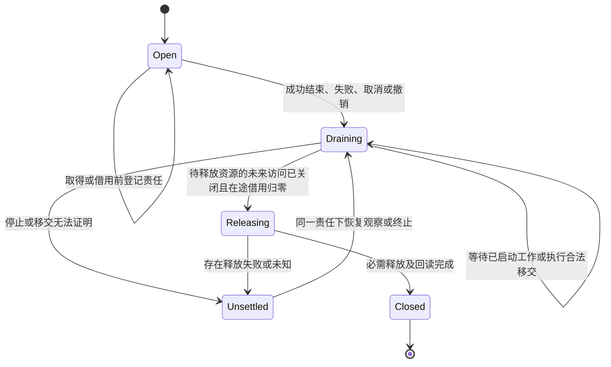

# 约束强制与整体一致性

本篇拥有各层保证如何接到真实结构和执行边界，以及当前设计怎样成为同一套可实现系统。它不承诺以静态文档控制未接入的模型或外部软件，也不建立全局审批服务。具体值与协议仍由[系统装配](装配/模块与运行实例.md)、[需求解释](../作者/结构化源码.md)、[保证](../运行/保证/README.md)和[执行](../运行/README.md)拥有。

## 1. 五种“已经完成”不能互换

结构可读、语义一致、实现合格、真实运行完成、满足产品目的，是不同断言。统一是每个断言能找到真实输入、拥有者和消费者，不是所有阶段共享一个绿色状态。文档与图必须构成整体，但整体中可以准确包含等待实现的边界；不能为画一幅完整图编造运行事实。

所有已知U条目都有当前选择、作用点与剩余验证；“选择已定”不代表该条所有目标、反例和运行符合性已完成。未知私有权限、设备实测、所有语言的ABI或未来需求不能由设计文档猜定。已有标准和成熟成果提供的结果可以按真实适用范围复用，不要求为每项结论从零证明。

## 2. 把不允许的状态尽量做成不能构造的状态

原生模块提供的私有构造器/品牌、不可变值和分阶段句柄用来防止受信实现误用；跨进程/外部输入通过真实解码与解析重新取得资格，不接受客户端伪造`approved:true`。品牌不是对恶意原生代码的沙箱；权限隔离仍在真实宿主。

| 要防止的问题 | 真实结构/算法拥有者 | 强制点和拒绝结果 | 尚不能靠它保证的范围 |
|---|---|---|---|
| 两份作者源相互覆盖 | workspace的区域拥有者和候选私有builder | 捕获时唯一写源；派生区编辑先成为目标草稿/回源或显式接管 | 无能力控制的外部编辑器仍可能改盘，提交前必须重读 |
| 未绑定的名字被当实现 | semantics与compiler的分阶段结果 | 只有准确解码和绑定、并满足所求用途前提的方法才能形成相应用途的UseBinding；验证候选保留剩余命题，草稿/Needs及仅验证资格不能走生产发射入口 | 借类型断言强转的受信代码错误仍需测试与封装审查 |
| 证据修改要求或自签成功 | assurance读取独立Claim与生产者回执 | 原要求引用不可由候选修改替代；证据按对象/版本/环境/范围评价 | 不完整试验和错误理论仍可能误导，需要独立反证 |
| 纯编译隐式联网/执行 | bootstrap不向纯阶段注入I/O能力 | 只读取已固定输入；缺项以Needs返回，实际工具动作经execution | 同进程第三方不可信代码必须隔离，否则封装不能防恶意调用 |
| 绕过权限直接写入 | execution持有真实宿主能力 | 最后作用边界核目标、载荷、当前许可、前像、围栏/去重 | 提供者不支持原子边界时不得宣称更强保证 |
| 旧结果装入新任务 | application/entry的每任务返回槽 | 候选/实例/请求代共同匹配再安装；空诊断只清自身完整分区 | 已披露旧数据无法由界面刷新撤回 |
| 一次取消摧毁共享工作 | 生产者与等待者拥有权分离 | 撤等待与停止生产分别计数；最后消费者也须等真实停止/移交再释放 | 远端不停止、失联和不可抢占工作保留未结算责任 |
| 换实现重放已有副作用 | 原意图与尝试集合 | 真实去重或所有旧尝试最终关闭后才重发；失败恢复不采用新的便宜方法绕开 | 无去重/关闭事实就保持未知或协调，不能用本地超时代替 |
| 低层性能补偿高层未知 | compiler成本比较 | 高优先级相等才进入下一层；未知保持可行未排序 | 无代表性数据不能给出普遍“最快” |
| 同配置资源被错误去重 | 实例身份与共享声明 | 只共享允许的不可变值；独占资源移动/借用按实际寿命 | ABI违约或外部未受控别名仍需隔离/宿主约束 |
| 完成结果导致过早释放/卸载 | 调用拥有者、驱动和结果拥有者 | [N0—N8](../运行/跨实现调用与数据寿命.md#call-lifetime)分开结果、未来访问关闭、在途引用和释放代码；验证句柄与取得占用一起完成 | 违规同进程原生代码需真实隔离，不能靠计数猜已无访问 |
| 为局部加速缩小原合法域 | 原实现选择与目标降低 | [H0—H8](../编译/有条件实现与公共行为保持.md#guarded-selection)固定纯守卫、完整域覆盖、同义分支和可达成员 | 未取得域覆盖或成本依据时，不标成完整或更快 |
| 部分根成功冒领完整发行 | Artifact按根成员及共同消费关系 | 独立根分项返回，共同配置/发行条件另核 | 下游实际安装与采用仍须真实回执 |
| 图文各写一份规则 | 原机制正文、图源及派生构建器 | 同版捕获，链接/引用/全部图源检查；失效缓存拒绝，图显示状态显式 | 一条箭头是否完整表达正文仍需语义审查，不能由散列证明 |

不为每个简单函数建立永久日志和十张表。只在某个边界需要时携带最小资格与占用；无I/O任务不激活操作库。规则应放在无法绕过的真实消费点，而不是每个调用者抄一遍同义if。

### 2.1 控制的完成单位是不变量及其全系统实现闭包

资源、变量、状态、寿命、权限、预算、并发、依赖、缓存、配置、外部作用、错误、证据、产物、恢复与退役，只要需要控制，就必须有结构承担其合法状态和转换。一次工作涉及少量文件，不缩小该机制的产品责任；发现共同缺陷后，应沿同类生产者、消费者、替代实现、失败路径和恢复入口处理，不能把修复几个调用点称为该类控制已经完成。

这里的“全系统”同时检查SEC实现、其所管理的作者工程、生成及导入的目标成员、工具/插件和实际运行接口；各层的控制对象与保证仍不同。规范覆盖的要求、实施覆盖的对象、实际验证的输入与环境分别报告。真实写入/披露授权仍限制动作，不因系统责任扩大而扩大权限；资料暂缺不能取消可完成的独立分析和实现义务。

结构级控制不等于所有对象登记到一个全局Manager。纯局部值可由宿主语言的作用域、类型和控制流承担；跨边界值由准确捕获与解码承担；独占资源由实际拥有者和生命周期合同承担；持久操作由原意图、提供者状态与恢复合同承担。只有存在无法由下层保证覆盖的独立约束，才增加上层控制对象。控制器本身使用的队列、内存、日志、权限、计时器和恢复余量也必须进入同一检查，不能置于成本和寿命账外。

### 2.2 对象及应由结构承担的控制

下表用于检查独立义务，不是封闭的类型枚举，也不要求作者填写一份最大记录。具体字段和算法仍由表中原规范唯一维护；发现不能容纳的新对象时扩展其真实领域合同，不靠归入“其他”跳过。

| 控制对象 | 必须保持的结构关系与消费约束 | 既有规范拥有者及不能混淆的保证 |
|---|---|---|
| 局部变量、常量、成员与闭包捕获 | 绑定身份、类型、初始化/赋值规则、作用域、可变性与捕获方式；跨异步使用不得超过所属值或借用寿命 | [计算与任务语义](../领域/计算基础/通用计算与任务语义.md)；常量绑定不等于其可达对象深度不可变，词法作用域不等于存储/资源寿命 |
| 可变对象、共享状态与状态机 | 当前版本、合法转换和写入权威；共享写入走该对象实际的同步或事务，私有状态不能由外部别名绕过 | [协作与状态边界](协作与状态边界.md)；一个逻辑写者不代替跨进程围栏，多字段分别合法不证明联合不变量 |
| 请求、配置、环境和策略 | 入口取得精确值与解释，方法/接收者按合同绑定；可热更新者有显式代际/切换点，其余请求继续原快照 | [装配](装配/模块与运行实例.md)；readonly不冻结运行时对象，动态读取必须成为声明依赖而非隐式全局状态 |
| 内存、缓冲、文件描述符、连接和设备句柄 | 创建、拥有、借用、移动/共享、最后使用、释放和释放失败；借用关系保留真实对象和代际，不只保存路径/数值句柄 | [跨实现数据寿命](../运行/跨实现调用与数据寿命.md)；GC回收可达对象不代签外部资源已释放，零拷贝不能省去借用资格 |
| 子任务、Promise、线程、进程、回调和订阅 | 启动前归属到任务域；停止接纳、取消请求、在途join、合法移交和终结分别发生；资源释放晚于最后真实使用 | [任务合同](../领域/计算基础/通用计算与任务语义.md)、[运行寿命](../运行/发布运行与资源生命周期.md)；等待超时、取消确认和真实停止不同，脱离任务必须有明确后继拥有者 |
| CPU/GPU时间、费用、传输与调用次数 | 按相应消耗模式累计；子任务/重试/备用提供者继承同一预算域，不重复借出全额或取消后退款 | [资源管理](../运行/权限与资源管理.md)；可复用槽与已消耗额度不能共用归还语义 |
| 内存/磁盘占用、并发槽、速率和外部配额 | 各自容量、测量、预留与释放依据；并发预留不能超卖，外部额度由外部权威回读 | [资源管理](../运行/权限与资源管理.md)；平均值不代替峰值，速率令牌不代替在途容量 |
| 队列、背压、公平、优先级与时限 | 有界接纳和实际进展条件；根时钟域与剩余期限传递；多资源取得顺序或联合预留；恢复容量不被普通任务耗尽 | [资源管理](../运行/权限与资源管理.md)、[递归并行](../编译/递归并行与远程编译.md)；安全不自动证明无死锁、无饥饿或实时完成 |
| 权限、秘密、凭证及实际效果 | 能力只能由真实拥有者签发并按委派收窄；执行/披露点核当前资格、对象与载荷；秘密的副本、日志和退役同样受控 | [权限管理](../运行/权限与资源管理.md)；类型品牌、配置和可用token都不自动产生授权，不可信原生代码需要真实隔离 |
| 文件、数据库、网络及外部不可逆操作 | 原意图、尝试、前后像、去重/围栏、部分成功和结果未知；重放必须有可核实依据，清理不等于补偿 | [提交与恢复](../运行/持久化提交与恢复.md)；本地事务不产生远端原子性，进程退出不撤销已提交作用 |
| 源、规则、模块、工具链及供应依赖 | 唯一语义/写入责任、真实进口和精确绑定；替换保持上游保证与下游前提，初始化/动态加载也属于依赖和效果 | [实现供给](实现供给与替换.md)、[完整编译](../编译/内核/领域方法与整体根.md)；同名、同版本标签或依赖图无环不证明可替换或行为正确 |
| 缓存、索引、派生图及延迟结果 | 输入、解释、读集/负依赖和安装资格；失效、共享、淘汰与再计算按各自寿命；新代不能被旧回调覆盖 | [查询与失效](../编译/查询增量与性能.md)；内容相同不保证当前权限或计算依赖相同，缓存不是第二份可写真源 |
| 错误、取消、部分结果和终态 | 用有标签的状态区分成功与失败发生，再携带错误值；业务失败、清理失败、停止未知不能互相覆盖 | [失败与恢复](../运行/持久化提交与恢复.md)；undefined/null/false/0都可能是抛出的值，不能以载荷真值或空值判定“未失败” |
| 证据、验证器、接受要求与完成声明 | 要求与被测候选分离；证据绑定对象/版本/方法/环境及可信依据；整体结论从真实覆盖而不是通过数量生成 | [保证](../运行/保证/README.md)；测试、静态分析、真实作用回读分别支持不同命题，未评估不是通过 |
| 产物、部署、备份、迁移和退役 | 成员完整性与共同消费条件；新旧实例并存/切换、恢复前像、残留责任与旧路径退出 | [运行与退役](../运行/发布运行与资源生命周期.md)、[成员协调](../编译/目标/成员布局与完整产物.md)；取消配置不撤销已产生的资源和恢复责任 |
| 优化、控制策略与控制器本身 | 硬不变量先满足，再按相同任务与成本域选方案；反馈、迟滞、饱和、反弹、控制冲突及恢复成本进入整体判断 | [实现选择](../编译/实现选择与设计搜索.md)、[组合进展](../编译/组合前提与进展闭合.md)；不能用局部更快抵消语义、安全、内存峰值或其他主体的损失 |

### 2.3 共同控制合同与最小传递

每种需要控制的能力必须能从现有结构回答：控制哪个对象/代际、由谁建立和转换、哪些使用是合法的、共享/借用是否允许、消费什么预算、何时失效、怎样证明完成、失败后由谁恢复。纯值不增加租约字段，无持久效果不增加操作日志；这些答案可由类型、私有构造、已有关系或固定提供者合同推导，不再复制成同义字段。

实现的分工为：contracts保存公共值和诊断形状；workspace固定源/候选；semantics拥有变量、状态、效果及借用含义；compiler检查使用关系并保持到目标；execution拥有获准操作、资源与结算；adapters在宿主真正生效；assurance检查相应命题；application/entry只能返回满足该目的的结果；bootstrap持有工厂而不是向任意位置暴露万能服务。资源域、控制域和结果域可有不同寿命，不能通过共用一个context对象假定三者一致。

无论入口是CLI、SDK、脚本、插件、回调、恢复器、迁移器还是受管生成代码，真正消费受控能力的路径都须承接同一不变量。普通能力入口只接受该拥有者能验证的句柄或精确值，不公开可绕过必要生命周期/预算的原始操作。受信库内部需要原语时，由其真实边界拥有者使用；测试替身不能进入生产装配。跨进程传输仅传引用/值，接收方重新取得资格，不能反序列化一个“已授权”对象便执行。

### 2.4 生命周期先形成结构，再允许使用

对拥有外部资源的域，正常次序为：建立边界与恢复余量；登记取得责任；取得成功后交给使用者；每个借用/子任务在开始前归属；结束时停止新接纳，等待已启动工作真正终结或完成有权移交，按依赖逆序释放，最后分别发布结果和结算状态。部分取得失败由已取得资源的拥有者清理；未取得的对象不能被清理，正在使用的对象不能被虚报释放。

该图是共同寿命关系，不强制每个对象采用同名枚举。存在独立持久操作时，移交必须保留操作身份、预算/费用归属、后继拥有者、当前状态与恢复入口；不能把丢弃Promise当作移交。移交工作仍要用某资源时，必须同时转交或继续保留该资源的使用/结算责任；后继取得和交接回读未完成，旧拥有者不能释放。Releasing只处理本域仍拥有且已无使用者的资源，不释放已合法转交的对象。关闭失败不重复执行已完成的不可重放清理。低层句柄的业务操作在关闭/代际失效后拒绝；只有回调外壳而底层仍允许任意使用，不算建立完整边界。

状态转换、异步访问和终态判定由一处共同实现承担。调用方不再手写一套“try后记录错误、finally清理、根据error是否为空返回”的协议。同步和异步释放、清理与业务补偿仍使用各自合同；不能为统一名称而把同步动作变异步或忽略实际顺序。方法与接收者在其合同规定的捕获点固定，不能在等待之后重新读取可变对象并调用不同的释放方法。

这不等于全局禁用try/catch，处理边界按[失败与载荷](../运行/保证/系统不变量与组合.md#failure-boundary-contract)决定。Open到Draining必须带入[尚在取得的责任](../领域/对象与控制/控制流与存储寿命.md#acquisition-custody)；冷任务已经移动的捕获、未被交付的Own结果与联合领取也属于真实拥有链，不因未启动或计算成功而消失。累计预算的层级投影必须消费[同一预留与结算](../运行/权限与资源管理.md#budget-reservation-settlement)，而非每层各检查一次余额。具体义务通过[降低接合](../编译/内核/降低与源码映射.md#control-lifetime-lowering)传至所选目标，不由每个业务调用者复制协议。

### 2.5 组合闭包：不只沿代码导入边检查

从本次被改变的不变量出发，取同类构造者、读写者、工厂、能力进口、启动点、最后使用/释放点、证据消费者和恢复/退役入口。继续检查它们的共享资源、配置、时钟、租户与外部提供者；无代码导入边不表示没有共同预算、并发冲突或外部性。替代实现、平台分支、插件和生成成员属于同一检查，而非额外名单里的可选善后。

沿每条交接验证生产者保证是否满足消费者前提；传播目标/对象代际、授权收窄、借用期限、预算预留、失效及未结算责任，不传播一个无语义的全局“通过”。循环声明需独立初始支持与一步保持，进展还需检查等待/唤醒和资源竞争；各项局部安全不能相加为整体可用。

例如两项任务单独都未超内存，但同时启动会超过共同容量，属于组合准入失败；父任务占住唯一执行槽等待子任务属于进展失败；重试各自使用新的完整预算属于累计核算失败；缓存命中返回已撤权数据属于资格失败。它们不因只修改了一个调度器文件而降为范围外问题。

### 2.6 从全量发现到不可绕过的接纳检查

复用当前源码模型、编译器事实、模块合同、实际工厂和已有验收通路，不建立第二套手填资源/变量登记库。初次迁移按明确源码及产物成员根作全量发现，保存准确版本和方法覆盖；日常变更可使用已证明完整的依赖闭包，但新增成员、新的构造/调用方式、动态边、宿主或规则变化必须重新展开受影响义务。仅按这次diff中的已知关键词搜索，不能证明全类迁移完成。

检查分层生效：类型/私有构造拒绝非法状态；编译和模块边界拒绝静态可确定的越权进口、丢失借用或资格；运行时拥有者拒绝已关闭句柄、预算超卖和旧代使用；真实提供者处理物理作用与回读。静态事实不能证明的动态调用、反射、原生扩展或未建模宿主，标为准确未知，并按实际需要隔离或取得额外依据，不通过名称匹配作安全认证。

新模块、新资源类型和新入口的必要控制若没有生产者/消费者、真实强制点和正常成功路径，不能接纳为已满足该保证的生产能力。若只是分析覆盖未知，不虚报已存在漏洞；但未知也不能计入“全系统已受控”。发现的同类旧路径必须迁移、以独立保持依据复用、按真实产品决定退役，或列为阻断整体完成的剩余义务；禁止通过默认批准、新增路径白名单、降低约束或删除验证制造清零。

检查器自身需覆盖正常使用与绕过：别名/再导出、回调捕获、平台分支、关闭后调用、跨代/跨主体句柄、部分初始化、晚到异步、取消不停止、同时超卖、恢复空间耗尽、主错误与清理错误并存。未知源码或未接入工具必须在输出中保留，而不是从分母移除。静态拦截、运行边界与跨模块/宿主验证各有证据，任何一种不能替代另外两种。

### 2.7 何时才算该类控制完成

关闭一类已经投入使用的控制，需要共同合同、实际强制机制、同类现有消费者迁移、原始旁路处置、组合/故障/恢复验证，以及对新增消费者持续生效的接纳检查共同成立。检查依据绑定实际对象和输入；准确披露验证边界不是缩小产品义务。只完成其中一项，报告其真实结果，同时保留该类控制未完成状态；旧的局部修复仍有效，但不能作为全局完成凭据。

架构设计、实现接入和实际控制完成使用不同的闭包。对明确设计范围，须已确定所需控制域、对象与状态、唯一规则责任、强制位置、生产者/消费者接口、正常算法、绕过与失败恢复、条件宿主方案、启用触发及验收方法；已知缺算法、冲突接口或没有成功路径时，该设计仍未闭合。仅缺尚未执行的实现/宿主符合性证据，不使已经完整的设计倒退成未决定；但不能据此声明现实已受控。物理能力未知且会改变可实施方案时，先给条件方案和准确能力缺口，不能把未知写成必定具备。

全体系设计完成需覆盖本次全部已接受设计目标及实际发现的独立域，不只检查最近修改文件；实际控制完成则另须满足上段全部迁移与证据条件。两者都不能从“本轮未发现新问题”推出未知未来已经穷尽。分阶段提交是恢复边界，不是缩小发现范围；开放义务沿[U016](../状态/编译与目标.md#u016)及相交U保留，不用一个总布尔值吞并不同阶段。

## 3. Q0—Q7：从要求到结果的可实现资格链

**Q0 捕获。** 入口校验请求分支、字节范围、预算及作用目的，workspace固定源与独立要求。JSON中的身份是请求引用，不是已持有对象或权限。

**Q1 解释。** semantics取得精确规则，形成有作用域、类型、主体与引用的值；错误草稿可以保存，但不进入可调用状态。结构作者不转成新文本语言后才解释。

**Q2 选择。** compiler在真实域、方法、目标及共享条件下选择供给；得到准确且带用途及残余义务的UseBinding或未满足结果。准确绑定不是无条件生产许可；验证候选具备结构/类型、目标和隔离前提时可以进入Q3取得被测对象，但不能以此进入生产消费者。方法之间的条件保证沿[组合支持与进展](../编译/组合前提与进展闭合.md)闭合，不凭互相引用自证。

**Q3 发射。** 生产可用根只消费该用途合格的绑定及真实输入；产物成员、进口、效果和来源由原结果记录。待验证方法可以在明确的验证目的下生成候选测试产物，但不因此取得生产资格，运行检查仍另行准入；不能要求先有该运行的成功证据才允许生成被测候选。类型能解码不等于目标支持。

**Q4 评价。** assurance分别评价语义、实际检查、宿主和本次目的；测试要执行就生成实际动作请求，不把字段写成`tested`。

各遍的私有结果和[分析保持](../编译/内核/变换接纳与分析保持.md)也在这条资格链内：结构合法不代签行为保持，变换失败不发布半成品，CFG未变不保留已经失效的值域；声明preserved或purpose不能由不可信插件自行签发资格。

**Q5 作用。** execution重新检查当时许可、目标前像、已占用资源与实际方法，再调用宿主。前面的所有资格都不授予未来写权，计划的安全与实际作用的安全分开。

**Q6 结算。** 原回执、实际观察和未结算状态按原合同记录，application只投影准确范围。断线、取消确认和进程退出的不同事实不合并。

**Q7 后继。** 变更只产生新候选/绑定/制品，旧实例保持自己版本。失效按真实读集，保留新旧责任，最终退出或迁移由拥有者结算。

这些是原六工具共用的内部阶段，不要求用户执行八次命令。实际已知输入可以从合适阶段进入，同一进程可以普通函数调用完成相应子链；不能绕过该用途必需的检查。

## 4. 单进程结构保证与隔离

模块边界先由公开出口和依赖方向实现：semantics不导入compiler，compiler不导入execution实现，entry不持有业务写入适配器，真实I/O端口只由组合根在合法处注入。静态import检查在构建时执行；不同运行调用/反馈边有单独含义，不能据协作图反推静态循环。

一个模块加载任意JS库并不自然纯净。对受信自有代码，禁止危险导入和工厂参数边界可以发现常见误用；对不可信解析器、插件或原生库，实际使用进程/Wasm/系统权限隔离，并限制文件、网络、CPU、内存和回传数据。动态执行、反射和原生调用使静态扫描不完备，不能把字符串扫描叫沙箱。

权限变化需要消费点核验和真实提供者支持。已持有文件句柄可能越过路径级撤权，已在远端排队的操作也不随本地token删除自动结束。接口应撤销未来准入并按相应协议排空/拒旧，不能通过文档“禁止”宣称物理立即停止。

## 5. 设计与图组成整体的具体完成条件

入口必须能从产品目标进入当前作者源、解释规则、共同编译、实际供给、目标成员和最终作用。每个规范主题有唯一责任、直接消费者、准确失败边界；同概念的不同视图可以存在，但接口字段和独立规则不能互相竞争。

每幅图由所在文档及最近完整标题拥有；图源在原位置，图像按同一捕获派生。结构图表依赖，时序图表消息，状态图表后继，不强行转换成一张万能执行图。图未画出某项条件时，相邻正文说明省略范围；若少了某条失败路径会反转解释，就必须补图或补清楚边界，不以“总览”掩盖。

文档工具实际检查成员、全部链接、引用式地址、唯一片段、状态条目、模块依赖表及全部图源，并从**同一模块表**派生静态依赖视图；不另维护图的第二套边。当前阅读构建与核验器能拒绝所检范围中的断链、缺采用/执行字段的条目、明显非法静态依赖和过期图缓存，不能证明任意自然语言模型完备或真实软件已经执行了该边界。

图像可视检查、结构一致、语义论证、实际运行和工程净收益分别交付。没有工具能只读所有Markdown，就自动证明所有未来故障都被覆盖。已知缺口仍须落到原U，而不允许把不完整内容以一个“整体完成”标签掩盖。

## 6. 失败与恢复的验证对象

必须覆盖伪造合格对象、错误主体/画像、越域引用、私有出口、依赖循环、共享资源取消、过期缓存/页、旧操作晚到、方法替换中断、图源改变但缓存未更新、未知协议与超预算等反例。验证器本身也测试正常路径，不能以拒绝全部请求获得形式安全。

对当前文档库，运行只读核验和阅读构建是已经可执行的工具工作；对未来SEC产品，私有构造器、能力注入、系统沙箱、驱动及最终提交检查仍须实际实现并以真实反例验证。本篇不能强制当前对话模型阅读材料，不能冒称已经部署平台限制。

## 7. 不能用结构权限替代语义可信度

Q1—Q4分别取得准确解释、性质所需保持依据、被测或生产用途和证据强度。执行准入只说明工具可以在该范围运行；从工具输出产生Verdict必须经过[解释与证据接纳](../运行/保证/解释与证据接纳.md)。未验证公理、未知规则或incomplete输出不能因退出0自动晋级。新的推理规则由真实语义/信任采用路径处理，候选不能修改自己的唯一判据或信任设置。

[性质保持](../编译/性质保持与开放环境.md)让`resolveUse`和降低接纳按真实Claim匹配：单次轨迹、概率和开放环境各自有依据；未声明需要的强性质不额外制造平台成本。统计排序使用探索/确认分开的原证据引用，不要求每个纯函数新建试验数据库。全部边界仍由原十职责实现，类型品牌和校验脚本不能控制未接入的外部运行与当前对话模型。
