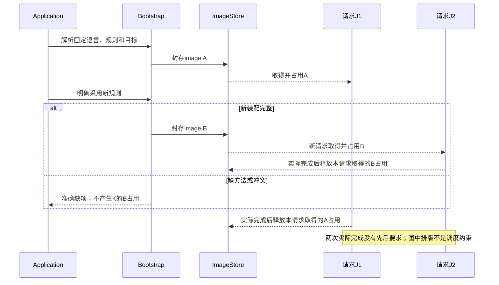
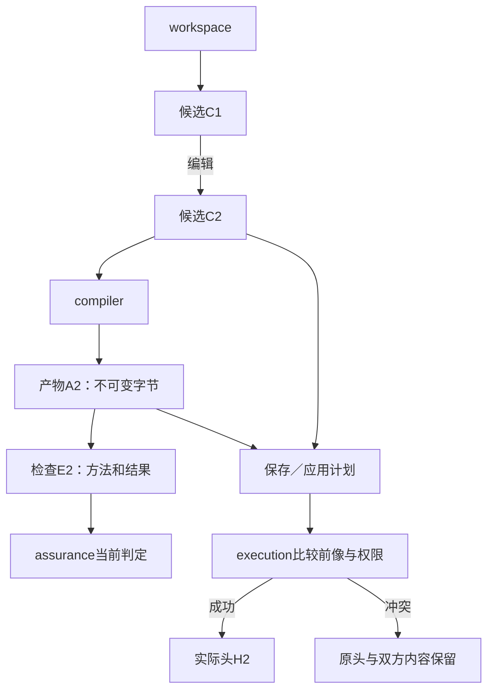

# 物理架构与模块责任

> **阅读范围**：采用范围内的设计规范；实现状态另查未决。

<details>
<summary>相关主题与上下文</summary>

- [最终逻辑模块与公开接口](#最终逻辑模块与公开接口)
- [成品装配、实际对象作用域与入口闭合](#成品装配实际对象作用域与入口闭合)
- [源、导入视图与实现使用点的物理落位](源绑定与解释映像.md#源导入视图与实现使用点的物理落位)
- [EngineImage：解释装配和更新协议](源绑定与解释映像.md#engineimage解释装配和更新协议)
- [工作区内容、可变头、证据和作用的物理归属](#工作区内容可变头证据和作用的物理归属)
- [四类部署画像与具体装配](#四类部署画像与具体装配)
- [进程、内存、调度和取消的真正生命周期](#进程内存调度和取消的真正生命周期)
- [实现语言、成熟工具与可执行架构约束](#实现语言成熟工具与可执行架构约束)
- [局部控制、托管值与即时运行的共同装配](能力接合与文件责任.md#局部控制托管值与即时运行的共同装配)
- [需求开发请求在既有模块中的调度](能力接合与文件责任.md#需求开发请求在既有模块中的调度)
- [成品架构的符合性检查与重开条件](#成品架构的符合性检查与重开条件)
- [现有生产入口到纯编译服务的迁移](#现有生产入口到纯编译服务的迁移)
- [旧入口和重复表的承接](#旧入口和重复表的承接)
- [领域共享编译责任，运行状态由目标拥有](能力接合与文件责任.md#领域共享编译责任运行状态由目标拥有)
- [完整计算产品的运行与观察装配](能力接合与文件责任.md#完整计算产品的运行与观察装配)
- [合同目录与可调用方法的装配边界](源绑定与解释映像.md#合同目录与可调用方法的装配边界)
- [全体系信息的实际模块接合](能力接合与文件责任.md#全体系信息的实际模块接合)
- [完成边界的物理接合与调用责任](能力接合与文件责任.md#完成边界的物理接合与调用责任)
- [完整开发面的实际接合点与较小实现](能力接合与文件责任.md#完整开发面的实际接合点与较小实现)
- [开发面的具体文件、函数和交接责任](能力接合与文件责任.md#开发面的具体文件函数和交接责任)
- [意图作者根的实施位置](能力接合与文件责任.md#意图作者根的实施位置)

</details>

### 分题阅读

- [源绑定与解释映像](源绑定与解释映像.md)
- [能力接合与文件责任](能力接合与文件责任.md)

<details>
<summary>本页内容</summary>

- [最终逻辑模块与公开接口](#最终逻辑模块与公开接口)
- [成品装配、实际对象作用域与入口闭合](#成品装配实际对象作用域与入口闭合)
- [工作区内容、可变头、证据和作用的物理归属](#工作区内容可变头证据和作用的物理归属)
- [四类部署画像与具体装配](#四类部署画像与具体装配)
- [进程、内存、调度和取消的真正生命周期](#进程内存调度和取消的真正生命周期)
- [实现语言、成熟工具与可执行架构约束](#实现语言成熟工具与可执行架构约束)
- [成品架构的符合性检查与重开条件](#成品架构的符合性检查与重开条件)
- [现有生产入口到纯编译服务的迁移](#现有生产入口到纯编译服务的迁移)
- [旧入口和重复表的承接](#旧入口和重复表的承接)
- [工程物理落位与原生边界](#physical-placement-contract)

</details>


本章选择 SEC 成品本身的模块、接口、状态、存储和装配方式，不按现有仓库反向定义目标，也不把此包树复制进用户生成的程序。逻辑任务和系统行为见[总架构](../协作与状态边界.md)，目标源码结构见[目标生成](../../编译/目标/成员布局与完整产物.md)。

[Code-OSS 纵向接合](../../../examples/原生维护/Code-OSS搜索替换.md#sec-pipeline)使用本章原十职责：workspace 管作者候选，compiler 管产物，execution 管获准作用，adapters 给真实宿主能力；目标程序自己的 SearchEpoch、ReplacePlan、模型版本与保存状态不并成 SEC Candidate。新增目标行为放在实际目标及适配中，不为每类工具新增平台模块。


<a id="本章只设计sec自身的实现"></a>
<a id="1-定位"></a>
<a id="3-目标包结构"></a>
<a id="14-完成条件"></a>
<a id="一般编译器的工程实现位置"></a>
<a id="目录与根架构的减法约束"></a>
<a id="核心包接口与依赖方向"></a>
<a id="责任边界先于包树"></a>
<a id="默认组合与依赖"></a>
<a id="第一条产品闭环的实际最小形态"></a>
<a id="机制复用与不合并清单"></a>
<a id="接口与数据收敛"></a>
<a id="模块拓扑端口与代码放置"></a>
<a id="1-责任优先"></a>
<a id="2-模块类型"></a>
<a id="3-依赖规则"></a>
<a id="5-端口粒度"></a>
<a id="7-目录不是语义身份"></a>
<a id="12-与核心层次的对应"></a>
<a id="设计位置"></a>
<a id="2-建议职责"></a>
<a id="7-验证"></a>

<a id="当前实际符号与采用方式"></a>
<a id="独立模块不伪造block的实际适配"></a>

## 最终逻辑模块与公开接口

### 一棵包树和一张依赖表

默认是可嵌入的模块化单体。以下目录是所选目标代码责任，不是十个服务或必须独立发布的十个包。相邻责任可以共处一个发布包，但入口、写权和单元依赖仍保持；拆出远程进程不能改变这些含义。

```text
src/
  contracts/       轻量引用、量纲、诊断和边界结果原语
  workspace/       作者资产、不可变候选、源映射与编辑计划
  semantics/       类型、语言/领域合同、绑定、检查和边界摘要
  compiler/        查询、实现选择、展开、降低、布局与产物集合
  assurance/       声明义务、方法计划、依据适用性和结论聚合
  application/     六工具用例、任务目的、输入补取和有限返回
  execution/       当前权限、资源、工具动作、提交、恢复和结算
  adapters/        前端/领域/目标/格式/宿主的实际实现与成熟工具
  entry/           CLI与协议客户端的编码和呈现适配
  bootstrap/       配置选择、验证装配、进程启动与交接
```

`semantics`不是所有语言的巨大中央switch。它拥有共同类型化交接和当前基础语言规则；领域包通过明确方法提供自己的结构与语义。`adapters`也不表示每个业务都包成进程端口：普通SEC函数或库沿既有语言解释即可；真实不同语义、外部能力或目标工具才形成适配。

| 模块 | 可以静态依赖 | 公开方法与结果 | 唯一可写内容 |
|---|---|---|---|
| contracts | 无 | 内容/对象/版本引用、Span、量纲、Result和Diagnostic | 无共享可变状态；不放业务定义或万能Config |
| workspace | contracts | `read`、`fork`、`pin`、`planSave`；返回固定源或新候选及编辑诊断 | 本次builder、候选索引和引用保留；不直接写目标工作树 |
| semantics | contracts | `decode`、`analyzeHeaders`、`check`、`summary`、`planEdit` | 当前语义builder、类型统一和分析表；发布后只读 |
| compiler | contracts, workspace, semantics | `evaluate`/`compileFrozen`；返回按根结果、依赖、Needs | 查询表、计划、局部生成builder；不更新作者头或权限 |
| assurance | contracts, workspace, semantics, compiler | `plan`、`assess`；返回义务、动作需求与声明结果 | 新检查/推导记录及派生适用性；不改作者要求和产物字节 |
| application | contracts, workspace, semantics, compiler, assurance, execution | `handle`；完成六工具的一次用例 | 当前任务会话、候选/动作关联和返回投影；不复制领域checker |
| execution | contracts | `run`、`observe`、`cancel`、`recover` | 当前准入、资源份额、作用意图、尝试、可变头与结算 |
| adapters | contracts, workspace, semantics, compiler, assurance, execution | 各自合同的具体实现 | 端口限定的局部工具状态；不暗改其他模块状态 |
| entry | contracts, application | 解码请求、编码结果、流式进度 | 传输会话，不能自己写库或发业务动作 |
| bootstrap | contracts, workspace, semantics, compiler, assurance, application, execution, adapters, entry | 构建Runtime和EngineImage，显式切换运行画像 | 装配实例和切换点，不拥有用户业务要求 |

表中第二列只列直接静态模块依赖，是当前依赖视图的唯一边源；模块自身端口及其无I/O基础库仍在原责任内。`check_design.py`从这张表核有限无环与已定义禁止方向，HTML可从同一表派生依赖图，不另写第二套边。适配器只导入所实现的端口/公开值，不能因为允许依赖某模块就取得全部私有状态；表验证不是对尚未实现产品的import扫描。

没有反向依赖：semantics不导入compiler和application；compiler不导入execution实现或assurance策略实现；execution不导入某目标AST来重写程序。需要另一职责的结果时，返回数据或由application先取得并注入只读值。公共方法调用关系与静态import图不是一回事，接口回调也不能通过字符串服务定位器伪装成无环。

端口在提出该需求的模块中拥有，不再设第二个巨大`ports/PlatformService`。公共库入口显式列出；不用递归barrel把内部SDK类型传播出去。模块移动不改变语义身份，私有文件名不成为公共协议。

### 需求关系、变更计划与实现的实际接合

现有Task/Requirement不是先变成另一门语言才能使用。`CompletionView`临时引用准确对象、关系约束、保持帧与实际来源；没有独立要求的普通源直接按该源分析，不强制建立一张镜像表。共同类型和算法由[跨软件意图合同](../../作者/组合/跨软件需求合同.md#cross-software-intent-contract)拥有。

| 代码责任 | 具体函数 | 输入与输出、拥有者 |
|---|---|---|
| `semantics/requirements.ts` | `bindIntentScope`、`composeIntentConstraints` | 固定候选、Requirement、实际解释方法；产生有类型的有效要求、帧、读集和未判定项。只写当前分析值，不执行目标作用 |
| `application/plan-change.ts` | `planIntentChange` | 将有效要求与当前源、供给、委派匹配；返回带基础/读集/具体差异/供给关联的既有计划，或NeedsAuthorContent、输入/决定/预算等准确出口。供给搜索复用原J/R算法，调用semantics而非复制checker |
| `workspace/semantic-edits.ts` | `materializeIntentChange` | 消费原计划基础及当前作者基础，以真实前像和语义读集重基，在私有分支上经源/结构适配形成AuthorDelta；协议冲突、语义重规划和错误草稿分开，不写当前头 |
| `compiler/resolve-use.ts` | 现有`resolveUse` | 将计划的selectedUses在实际候选与合格调用头上复核为UseBinding；规划选择不冒充已可调用，新声明不造假body |
| `assurance/requirements.ts` | 现有`plan/assess`的相交处理 | 将准确关系变成与方法相符的义务；方法、有限覆盖和实际结果分别保存，不能改要求 |

文件名给出当前实现职责，不是要求每个接口独立建包；已有合适文件可承接。领域关系通过原MethodSpec提供型别、合法组合、有限检查、实际变更/生成和来源映射；普通函数不因加入本节而必须注册新插件。

数据生命周期是：workspace固定源，semantics产生只读需求视图，application选有权变更，workspace形成新候选，compiler解析实际实现，assurance报告真实支持，execution只处理所请求的现实动作。开发用户不手填这些中间记录；需要跨任务保持的独立要求通过原作者位置与接受关系持久化。

### 整体变化的请求协调与修复归属

首个实现仍可同进程使用只读值与普通函数调用，不建立Planner服务或消息总线。`application/plan-change.ts`负责已选任务中的计划调用；`workspace/semantic-edits.ts`只落实具体作者差异；`semantics/requirements.ts`解释关系，`semantics/author-elaboration.ts`补全短源；`compiler/compose-artifacts.ts`汇合实际成员；`assurance/requirements.ts`承担从要求到真实支持的核查。

既有application协调器的精确调用顺序是：

```text
固定当前作者/要求与请求目的；直接文本输入先捕获，不要求先反推一张需求图
如需需求驱动改动：bindIntentScope → composeIntentConstraints → planIntentChange
计划需要外部输入：按许可补取并形成新固定准备态；无新信息不循环重试
计划缺实际主体：向现有开发AI返回有限创作内容；收到真实差异后重新入链
materializeIntentChange(plan, currentBase, methods, budget) → 作者候选或准确冲突/未完成
若请求源检查/目标：compileFrozen使用该候选、原要求与实际UseBinding
Assurance.plan/assess读取准确对象与支持范围；需要新工具检查时由execution执行
按本次目的返回；只在确实请求并重新准入后保存、构建或运行
```

这是几个既有内部合同的总装，不在纯compiler里创建模型回调。application不能以“需写主体”为由扩大公开API、启用新语言或自行安装工具；当前委派允许的创作可以继续自动完成，不要求人逐步批准。候选/结果可以在内存保留，只在既有持久要求成立时存储，不给一次局部修改强制建立永久操作账本。

诊断须带实际生产者和修复范围：原要求冲突回要求位置，源错误回原源码，降低违义回规则/适配，资产缺失回目标组合，缺设备或权限回execution。源代码已经正确时，不让AI每次失败都重写需求和算法。并行阶段的中间反馈标进度，不先将某个已完成局部任务概括成整个工程成功。


<a id="runtime-assembly-scopes"></a>
## 成品装配、实际对象作用域与入口闭合

### 对象寿命落在真实工厂，不放进一个全局容器

十职责是逻辑分工；进程数、发布包数和对象寿命是另外三个维度。当前默认选择一个本地可嵌入Runtime、按需创建的工作区与任务、不可变EngineImage、独立作用实例。CLI可以每次创建并关闭Runtime；长期机器连接可以复用同一实例，不强制每个调用启动十个进程，也不强制短请求安装守护服务。

| 创建位置与作用域 | 持有什么 | 明确不持有 | 结束或更新方式 |
|---|---|---|---|
| `bootstrap/create-runtime.ts`，一次Runtime | 已验证工厂、宿主端口、实际共享资源池、按需存储提供者、允许采用的EngineImage引用 | 全局当前候选、当前编辑器、目标软件的用户状态、任意SDK服务字典 | 停接新调用后排空/结算；不能销毁调用者拥有的工作区或宿主池 |
| `entry/session.ts`，一个连接/CLI调用 | 编码版本、已协商能力、真实认证绑定、有限响应/进度路由 | 领域类型表、可自行签发的权限、所有用户共享的latest结果 | 断开先结束传输责任；是否取消执行由既有任务政策决定 |
| `workspace/workspace.ts`，一个明确工作区绑定 | 内容提供者、源范围与身份定位、可选观察订阅、候选/保留访问 | 不可变候选内部的可变文件对象、直接写权、全仓自动监控 | 解除绑定不删源；仍被操作占用的内容延迟释放或移交 |
| `application/prepare-job.ts`，一次准备态 | projectView、当前任务/要求、固定候选与根、解释/布局、实际输入与预算 | 可在纯编译期间改变的解析选项、隐式下载授权 | 输入补取形成后继准备态；旧态结果按真实依赖复用 |
| `compiler/query-session.ts`，一次计算需求及共享查询 | 局部工作项、等待关系、只读结果和实际读集、资源份额 | 作者头、目标文件句柄、共享可变AST builder | 消费者退出只撤其等待；最后真实使用结束再结算 |
| `execution/operation.ts`，一次获准作用 | 精确意图、当前准入、尝试、资源、真实结果与恢复责任 | 可替换的latest候选、任意重新编译权、自动扩大写集的脚本 | 明确终态或责任移交后释放；传输返回不等于作用终结 |

这些拟定文件名给实施者明确落点；可以在保持依赖与拥有关系的前提下合并文件，不要求每个表格项成为新类。复用现有CandidateIndex、TaskViewStore和OperationStore；不再创建WorkspaceSession数据库、全局事件总线或每AST节点的永久状态。

### 一次Runtime怎样建出来

`createRuntime`的输入分为**配置请求**与**受信宿主端口**。前者只包含已选发行/规则、存储与资源策略、允许的入口和本次默认；后者由真实宿主提供内容读取、当前授权判断、有限执行、时钟/取消以及按需持久化。客户端JSON中的`trusted=true`不能充当受信端口。普通纯请求可只提供内存内容与拒绝真实作用的宿主；这是一条完整的受限运行方式，不是半初始化平台。

工厂返回`RuntimeHandle`：公开`handle(request, callContext)`与`close(closeIntent)`，以及给本地调用者使用的已协商能力说明。`callContext`由entry/宿主建立，包含请求身份、当前认证和披露上下文、接受的任务引用、返回路由及取消关联；不是用户每次要填的第二个工具信封。普通函数库调用仍可直接通过typed应用接口，不必序列化成JSON再解析回来。

装配按下列顺序执行：

1. **验证静态请求。** 核字段、版本、已选提供者和所需能力；未知必需能力返回明确诊断，未知可保全字段不被执行。此步不打开用户输出目录，不加载工作区脚本。
2. **构造最低共同依赖。** 建contracts值与内容读取、预算和拒绝式作用端口；由实际配置按需建立元数据/内容存储。内存短请求不创建SQLite文件，已有存储不可访问不默默另建空库冒充原数据。
3. **准备解释映像。** 沿原E0—E6取得并核相交方法、类型、依赖和能力，确认工厂不会在声明阶段执行用户顶层代码。按端口依赖装配，静态import无环不替代真实工厂依赖检查。
4. **注入消费链。** workspace与semantics先接只读内容和方法；compiler取得其公开值及查询调度；assurance取得只读对象和方法需求；execution取得受信作用端口；application取得以上公开接口；最后entry接application。bootstrap构造接口实现，业务模块不回查bootstrap服务定位器。
5. **封存与开放。** EngineImage不再原地增加方法。运行实例仅在必需依赖齐全后接新请求；声明支持、实际方法已装配和当前作用获准分别显示。启动成功不意味着所有未来提供者在线，也不意味着任意目标都可生成。
6. **失败清理。** 仅逆序清理本次工厂实际创建并拥有的资源；调用者传入资源不得擅自关闭，用户目录和现有数据库不得按“启动失败”删除。已开始的外部动作必须沿operation结算，不靠析构函数抹掉。

工厂中没有长期运行循环也可以成功返回；轮询、文件订阅、后台进程只有被请求且有实际消费者时才启动。需要共享同一资源池时由宿主传入，并标明释放责任；两个Runtime不能各自把全机资源容量当独占额度。

步骤2—4使用[取得交接](../../领域/对象与控制/控制流与存储寿命.md#acquisition-custody)保护部分初始化；步骤5的RuntimeHandle在真正交给宿主前仍是工厂的[临时结果](../../领域/对象与控制/控制流与存储寿命.md#provisional-result-ownership)。调用者取消、响应编码失败或交付被拒绝时，不把“工厂已构造”当宿主已经接管。步骤6同时处理尚在进行的取得与未交付Handle，不关闭借用宿主池，也不删除已有数据。重复close只加入原关闭/结算过程，不并发执行第二套析构；失败/未知关闭需要有依据的恢复，不能反复调用裸释放函数试探。

### 输入、计算、返回、作用的单一调用链

| 实际文件职责 | 输入→输出 | 消费者；失败时保留什么 |
|---|---|---|
| `application/prepare-job.ts` | 当前请求、固定作者/上下文、真实内容→PreparedJob或准确缺项 | compiler/assurance；保留原请求、原源和可独立取得内容 |
| `workspace/project-view.ts` | 清单/原生成员、锁、缓冲与文件观察→[projectView](../../作者/工程源/清单模块与绑定锁.md#project-prepared-view) | prepare-job；未知配置只保全，不伪造完整工程图 |
| `compiler/root-plan.ts` | projectView、请求阶段→按种类的根闭包与结果需求 | 原查询调度；严格前置环不被类型SCC掩盖 |
| `application/resolve-needs.ts` | Needs、原基础、当前许可及已取得事实→PreparedJob后继或有限未完成 | compiler重入；不原地改旧查询的输入或默默切换语言 |
| `compiler/compose-artifacts.ts` | 实际贡献、目标/布局与必需成员→ArtifactSet或分项缺口 | preview、assurance和execution；不把部分文件冒充完整包 |
| `application/present-result.ts` | 精确分项结果、披露上下文、当前路由→协议允许的响应/进度 | entry；旧结果仍可作为历史读取，不覆盖当前会话选择 |
| `execution/prepare-operation.ts` | 精确内容、作用目标、许可、资源与现有意图→可执行准备或拒绝/原操作 | 原run/apply；准备失败不重建另一份产物凑成功 |
| `execution/reconcile.ts` | 原意图、尝试与权威读回→真实终态/残余及合法下一步 | operation和关闭流程；响应丢失不重放已发生作用 |

`project-view`与`root-plan`不是两个镜像数据库：前者只说明已经取得什么以及如何解释，后者是本次要做什么的派生计算。语义算法、贡献合并和恢复算法仍各归原章节；这里落实谁调用谁、何时获得什么，而不是复制三套checker。

### 解释升级与关闭的实际转换

新映像装配成功后，只改变**未来新准备态**可选择的默认；旧候选继续原解释。用户要求升级旧工程时，经原锁/解释变更候选检查再采用。旧任务不能在完成一半时被全局容器替换checker；新版本被撤销时可以阻止新执行，但历史读回与未结算责任仍按安全政策保留。

实际接纳与切换消费[运行代C0—C5](../../运行/发布运行与资源生命周期.md#runtime-generation-cutover)：`bootstrap/create-runtime.ts`准备独立代与共存预算，Runtime入口在同一协调点读取路由并取得固定保护；`application/prepare-job.ts`消费这个准确引用，不再读取全局latest。关闭无保护新入口后，旧有限任务仍可完成自身已绑定且获准的子调用；回调、输出与析构各自保留真实旧代。旧候选的新请求需明确仍开放的兼容入口或获准重新装配，不允许重新开放已回收中的实例。

`close`先把Runtime入口置为不接新请求，再按被接受的关闭政策处理在途纯计算与operation：可取消的工作发取消；共享生产者按[J代际交接](../../编译/递归并行与远程编译.md#shared-producer-generation)先撤本Runtime消费者；已有作用读回或移交；最后释放实际已结束者的输入、订阅和自有资源。返回包含已关闭范围及仍待结算的operation/资源，不把超时说成全部关闭。

一个嵌入式宿主不能强杀借用的整个进程。没有强隔离能力的失控任务，只能报告未终止和限制再准入；具备独立进程/设备隔离时才执行真实中止并核结果。崩溃恢复沿现有持久意图进行；没有持久化的纯计算可以丢失并明确重算，有外部作用但缺恢复记录是未决风险，不伪称没有执行。


### 可选调试的装配增量仍在原模块内

`execution/debug-session.ts`拥有一次调试操作的phase、配置代、暂停代与精确命令记录；`adapters/debug`拥有实际Driver，`entry`只解码/展示，`application`固定目标与协调，`compiler`提供固定来源，`workspace`维护修改后的作者。不能把当前暂停存在单例语言服务，或让一个适配器跨会话复用裸frameId。

Runtime工厂只注册真实已供给的Driver/profile；普通编译不创建调试连接。调试状态默认随实际会话按需内存保存，跨崩溃恢复需要原OperationStore及真实可重连/查回能力，不能新增一个假的“调试耐久数据库”来掩盖提供者不支持。具体方法与状态由[DebugDriver](../../运行/发布运行与资源生命周期.md#debug-driver-lifecycle)和[公开合同](../../开发/工具协议/交互调试接口.md#debug-session-contract)唯一拥有。

### 方法的具体输入和出错责任

下表是内部调用合同，不是要求AI直接填这些记录；源/目标数据细节仍由原规范拥有。

```text
Workspace.fork(base?, authorDelta, representationMethods, readPermit)
  -> CandidateRevision + SourceMapDelta + Diagnostics
  | InvalidRequest | StaleReference | MappingConflict
Workspace.planSave(candidate, observedTarget, saveSelection)
  -> SavePlan(expectedObjects, writes, removals, unchanged, contentRefs)

Semantics.analyzeHeaders(authorModules, importedViews, importBindings, image, limits)
  -> CallableFreezeResult(headers, callables, perDeclarationIssues, moduleConditions, actualReads)
Semantics.check(module, signatureTypes, existingBodySummaries, image, limits)
  -> BodyAnalysis + actualReads + Needs
Semantics.planEdit(candidateView, semanticDelta, representationBinding)
  -> AuthorDelta + requiredCorrespondence | MappingConflict

Compiler.evaluate(preparedJob, frozenMethods, limits)
  -> CompileOutcome(perModule, perRoot, actualReads, nextInputs)
Assurance.plan(subjectRefs, acceptedRequirements, availableEvidence, scope)
  -> Obligations + CheckRequests
Assurance.assess(subjectRefs, obligations, actualResults, currentConditions)
  -> ClaimResults(satisfied/violated/unknown/not-applicable, supportRefs)

Execution.run(actionContract, exactInputs, targetPreconditions,
              currentAuthority, resourceScope, requestIdentity?)
  -> Completed | Failed | PendingSettlement | Rejected
Execution.observe(operationRef, currentReadAuthority) -> ActualOperationView
Execution.cancel(operationRef, currentAuthority) -> CancellationDisposition
Execution.recover(operationRef, currentAuthority, recoveryBudget)
  -> Settled | PendingSettlement | Conflict | Rejected
```

`fork`封存完整批次，允许合法位置的错误程序作为草稿；它不能令真实路径改变。`planSave`只准备动作；execution在提交时重新核当前前像和权限。`Semantics`不读取任意cwd；还没捕获的输入是Needs，不是空模块。`Assurance.plan`产生的运行请求不是已通过结果；`assess`消费真实对象与方法覆盖，不按成功标签相加。

execution不接受任意“method:string＋args:any”来取得系统权限。actionContract必须解析到已登记的动作种类、类型、允许目标和宿主处理器；未知类型拒绝执行并保留需求。一次只读本地捕获也使用实际读取许可，但不必建立持久业务操作。真正可能需要恢复的动作在外部效果发生前持久保存必要身份和意图。

实现者可合并纯函数调用减少开销，但不得改变这些接口的可写范围与返回责任。错误字段分别定位请求、作者、规则/实现、环境、资源和实际作用；包装函数不能把缺工具标准库改报源程序类型错。


<a id="11-持久化"></a>
<a id="应用接合与可选持久宿主"></a>
<a id="6-所有权"></a>
<a id="存储和恢复模式"></a>
<a id="三种状态的落位与未选依赖"></a>

## 工作区内容、可变头、证据和作用的物理归属

<a id="fig-image-rotation"></a>

### 图解：解释装配的固定与换代时序

每个请求固定自己的解释实例；新实例准备失败不影响旧请求。权限撤销可限制实际动作，但不倒改已消费的语言含义。



### 先分对象，再决定是否持久化

| 存储职责 | 持有什么 | 默认物理实现与一致性 |
|---|---|---|
| ContentStore | 固定源、资产、产物、布局和必要前后像字节 | 纯请求内存；本地关键恢复小内容可同库；大对象按发布协议外置 |
| CandidateIndex | 候选到作者集合、解释、源映射及父关系 | 会话可用有限Map；长期引用可用数据库索引，源仍只有一份作者拥有者 |
| HeadStore | 指定工程/区域的已保存或采纳引用 | 只接受比较前像的commit；无持久头时不实例化 |
| EvidenceStore | 具体方法、对象和结果；来源可多份 | 可选内存/文件/数据库，结果不可因内容相同转贴另一主体 |
| OperationStore | 实际请求、前像/后像、尝试、方向和结算 | 有恢复义务时持久保存；不是缓存 |
| QueryCache | 可重建的分析与纯生成结果、实际读集 | 可丢失；命中不证明执行或当前授权 |
| TaskViewStore | editRef等短句柄、分页游标和按需投影 | 有界会话索引；取得和pin原内容协调完成 |

这些是存储责任，不是七套必建数据库，也不是所有阶段都要写Schema。物理上可共享一份事务数据库；逻辑上不允许检查结果覆盖产物字节、查询命中完成真实操作、同内容摘要改变作者谱系。

### 可变头只有一个提交路径

workspace决定候选的内容，application决定当前用户操作，execution通过HeadStore/目标Provider进行提交。compiler返回产物，不能直接更新`currentCandidate`、工作树或默认部署。

`HeadStore.commit`接受实际头范围、期望修订、下一引用、当前授权见证以及所需操作身份，返回新修订或准确冲突；它不通过时间戳判后到者胜出。权限与头同提交域时在短事务内复查；不在同域时要求对应有效见证或明确租约窗口，不能伪称跨系统即时撤权原子。

两个合法候选可以共存。只能一个成功比较推进同一头，失败者保留自己的内容并重新观察。多个头共同变化时仅在提供者真的支持该组提交时承诺一起切换；否则给出分组作用与残余，不用同一个Candidate ID伪造全局原子。 一处协议拥有者不要求所有副本由一台机器串行写。明确允许的可交换作者操作可以按已定义合并代数进入副本，再形成相应头；必须保持该使用域不变量并准确声明一致性，不能由“能集合并集”推导任意业务无需协调。当前普通非交换编辑仍使用比较与冲突协议。

### 内容发布和头提交的顺序

**纯内存结果：** 分配完整字节，验证成员与结构，封存，然后发布结果引用。取消前未形成完整成员的builder不冒充ArtifactSet。

**同库关键内容：** 小型恢复将必要内容、操作意图和头变更放在同一事务；计算、AI、网络和子进程在事务外完成。存在则复用，不要求所有源码再作为可编辑记录复制一份。

**外置内容：** 先stage并pin，检查完整字节/成员及需要的耐久性，再publish不可变对象，最后在元数据事务中提交引用。若事务失败，新对象是可回收孤儿但有准备保留；若已提交而返回丢失，按原操作身份读回。引用尚可达时GC不能回收它。外置内容丢失时是存储失效，不由重新初始化一个空文件补成同一真相。

**文件输出：** 使用既有前后像和可恢复写回，版本目录可用真实指针切换。SQL提交不意味着普通目录多文件原子，文件写完也不等于数据库或外部服务一起成功。具体序列由[持久化规范](../../运行/持久化提交与恢复.md)拥有。

SQLite支持多读者而一次仅一个写事务；它可以承担合格的本地元数据事务，但不能替文件系统和外部消息承诺共同原子。参见[事务合同](https://www.sqlite.org/lang_transaction.html)。

### 故障切点和选择

| 切点/观察 | 当前处理 |
|---|---|
| stage中止，头未改 | 保留需要的诊断；无引用且保留窗口结束后回收部分对象 |
| 内容已发布，头提交失败 | 原头不变；固定失败原因，准备对象可在合法窗口复用/回收 |
| 头已提交，响应丢失 | 严格作用使用事前请求身份读回；不重新生成另一次业务操作 |
| 发布后检查失败 | 产物仍是那份字节；新增失败记录和采用限制，不篡改内容摘要 |
| 文件只写一部分 | 按原B/A/X与固定方向继续、反向或冲突，不用最新编译器重算恢复目标 |
| 数据库损坏或内容失联 | 隔离相交写入，按备份/权威协议恢复；只读的独立输入仍可使用 |
| 外部权限已撤销 | 停止新的越权作用；按真实读取与恢复权限处理已发生事实 |
| worker取消未完成 | 保留仍被使用的内容和资源计量，直到停止/隔离/移交 |

证据索引可以重建，必需恢复内容不能按普通缓存随意删除。检查失败可以促使新候选，但assurance本身不修改源，也不改验收期望。


<a id="物理实现画像与可逆落位方案"></a>
<a id="本地受控工程"></a>
<a id="团队与托管控制面"></a>
<a id="离线边缘与断续连接"></a>
<a id="工程作者画像不要求新建四个服务"></a>

## 四类部署画像与具体装配

<a id="fig-state-ownership"></a>

### 图解：作者、产物、检查与实际头的写入归属

不同对象用各自引用连接；箭头表示生产或评价，不代表修改被评价对象。只有比较提交路径推进实际头。



### 纯库与无状态编译

进程内装配workspace的内存内容视图、当前语义方法和compiler。固定输入可直接调用compileFrozen；需要公共工具时加application/entry。无持久头、无外部效果就没有StateStore、数据库、消息或模型SDK前置。结果由调用方接管或取得有限内容引用；不让内存解析自动访问文件环境。

缺输入可以返回给调用者；给定的读取提供者必须有明确范围。分析失败不修改原源，运行预算结束不将残缺目标标成完整。纯调用没有必要为每个中间值创建摘要或回执。

### 本地受控工作区

默认一个短CLI或可选暖进程拥有用例协调，冲突域允许并行只读和非冲突操作。需要跨重启恢复时接本地事务存储；数据库作者模式与文件作者模式分别选择，不能同时维护两份可编辑定义。

小型本地优先SQLite关键内容同库。现行默认回滚日志和明确同步策略，启用外键；需要合格并发读的环境再选择WAL，不同时强制两种模式。备份、检查点和真实耐久范围依持久化规范，不仅看模式名称。WAL的同宿主共享内存要求不能被网络文件共享当成分布式数据库。

`BUSY`在明确预算内退避；前像冲突重观察而非盲重试；权威变化重新准入；元数据坏了不创建同身份空状态。普通编译不使用`claimOutbox`：目标事务应用确需交付时，由该领域的交付适配承担这项接口，而不是所有StateStore的必需方法。

### 团队与托管

真实跨机器共享写入时，采用一个事务服务拥有对应冲突域，可由PostgreSQL等合格Provider实现，内容用不可变对象存储。隔离级别与锁/约束按共同不变量选，串行化冲突重做相交完整决定，不只重发最后一条语句。资源worker不能直接推进团队头或合并源。

租户、数据驻留、秘密、执行主体与内容共享分别处理。共享内容缓存不合并两个用户的读取权。跨域硬原子要求使用真能参加的共同提交或有明确语义的协调，不能因应用只有一个协调者就声称全局原子。

从本地换到团队属于有条件实施：冻结相交新写、结算/转交在途、复制合格快照及可达内容、核对权限/身份与读写兼容、启动新Provider、读回后切换路由。没有真实消费者就不强制双写；需要旧解释与恢复时保留；新写旧版本不能解读时不假回滚，采用前向修复。

### 离线与边缘

默认可以读取固定源、创作候选和生成本地结果，重新联网后比较当前状态。需要离线真实写入时，单独规定授权、预留资源、时间有效性、冲突后果和不可逆动作；没有这些合同不能从“离线支持”推导全权自治。

重连先检查版本、身份、撤销、墓碑与旧写者资格，再合并候选。可交换性须对实际不变量成立，不因用了CRDT名字就放行唯一资源或余额冲突。永久失联时按合同到达本地自治、隔离或准确结束，不让一个节点卡住全工程。设备作用不能用数据库回滚从现实中撤销。


<a id="8-不可变性"></a>
<a id="9-异步与取消"></a>
<a id="10-worker-与进程"></a>
<a id="worker沙箱与语言热点"></a>
<a id="编译服务守护进程工作进程与远程节点"></a>
<a id="1-进程拓扑是实现不是语义"></a>
<a id="3-daemon"></a>
<a id="4-worker"></a>
<a id="5-watcher"></a>
<a id="6-远程"></a>
<a id="模块化单体的装配启动与替换协议"></a>
<a id="启动和一次请求"></a>
<a id="一套预算下的嵌套任务与宿主总容量"></a>
<a id="数据接管"></a>
<a id="资源和中止"></a>

## 进程、内存、调度和取消的真正生命周期

### 阶段值的物理所有权与取消

SourceBlob在入口复制外部可变字节一次，或真正转移所有权；共享可写buffer未受相应协议保护时不作为固定输入。内部可信阶段借读固定内容，不逐阶段深复制。builder封存撤销外部可写别名；readonly标注和摘要都不是内存隔离。可复用数组/类型表按实际寿命管理，返回不能泄漏可写后备存储。

来自目标工具的坐标须按该工具单位映射到冻结源；只读字符串处理的UTF-16索引不能当UTF-8字节偏移。大文件用固定分块与内容引用，不能为方便转换将整工程反复复制。

### CPU、内存和嵌套执行

宿主总池约束所有请求，每个请求与其子工作还要受本次预算。父任务等待时保存续体让出CPU，仍保留的输入与堆对象继续计入内存。只有依赖图无环并不能保证进展；内存不足时降低并发、合法释放重算或准确结束，不无限加线程。

资源池、PreparedJob和operation通过[共同预留与结算](../../运行/权限与资源管理.md#budget-reservation-settlement)引用同一实际份额；共享查询、多个Runtime或嵌套工具不能复制余额。纯阶段只得到需要的预算/取消视图，不从该引用取得授权、写权或全局服务定位能力。真实消费点检查与代码依赖方向分开，不能为传一个资源量让semantics反向导入execution实现。

嵌套外部编译器按真实jobserver支持共享令牌，否则限制启动数与内部并行；每层独占满核是假预算。高风险远程读取/执行分别核发送许可、execution/target平台、固定工具和结果归属。没有资格或收益时继续本地，远程不是纯函数的前置。具体S调度由[递归并行与远程编译](../../编译/递归并行与远程编译.md)拥有。

### 不可信方法与硬截止期

可信纯方法可以同进程；计算隔离可以使用worker；不可信插件按要求使用真正限制文件、网络、秘密和资源的进程/容器/解释器Provider。子进程名称不等于沙箱，模块依赖门禁也不约束恶意JavaScript全局。

自有算法在token、节点、统一、图工作项和输出边界检查取消。第三方同步API可能不响应；硬期限使用可中止执行器。Promise超时只结束等待，实际线程继续运行时不得释放其输入或报告从未执行。杀进程只能结束这次进程，不补偿已发出的业务作用。

### 启动、监听、升级与退出

短CLI无需Daemon。重复任务真正获益时才保留暖缓存、受限editRef和文件观察器。Watcher只提供变化提示；重复、漏报或溢出后在有限范围重新捕获，不把事件序列直接当完整作者内容。相交通知由[原调和队列](../../运行/发布运行与资源生命周期.md#reconcile-wakeup-handoff)合并与交接，处理期间的新变化不会被旧完成清除。队列满以有界重同步或准确停止处理，不再给每个事件创建一个Runtime；纯单次捕获仍无需Watcher。

退出顺序为停止新准入，允许已经具备完成条件的有限任务结束，取消或转交剩余工作，结算结果和必要持久引用，释放没有消费者的image/内容/连接。持久动作先有恢复者再解除原拥有者；普通可重建查询可以直接丢失，二者不能共用同一TTL。

旧请求迟到不能推进新头。其固定纯结果经过内容、动作、方法和当前披露验证后仍可复用，不要求无意义销毁正确字节。C0/C1/C2自举实例分别构建与采用，不是在旧进程热改函数后沿用旧正确性记录；第一自用对象依据真实消费者和风险选择，不自动取得合并/发布权。


<a id="typescript-与-bun-参考实现架构"></a>
<a id="2-编译设置"></a>
<a id="4-bun-边界"></a>
<a id="5-node-兼容"></a>
<a id="6-类型模式"></a>
<a id="7-schema"></a>
<a id="12-测试"></a>
<a id="13-性能"></a>
<a id="迁移与验收"></a>
<a id="4-公共表面"></a>
<a id="8-共享代码"></a>
<a id="9-依赖门禁"></a>
<a id="11-验收"></a>
<a id="验收与重开"></a>

## 实现语言、成熟工具与可执行架构约束

当前保留TypeScript实现与Bun默认宿主的选择；它不是中立语义、用户运行环境或所有目标的前提。实际工具版本在所选发行和安装时固定，本章不把历史package声明当已运行事实。目标工具API族在adapter内，公共语义不导入TS AST/Type、数据库行或某SDK实例。

实现设置采用strict、exactOptionalPropertyTypes、noUncheckedIndexedAccess；边界从unknown解码；品牌或封装区分对象身份、内容摘要、修订、字节范围和资源量；判别联合明确状态。穷尽分支与构造器验证不能由任意as、非空断言或checked:true绕过。普通结构交换选择一处规范并派生读取/模式，Zod、JSON Schema或成熟解析器可复用，不同时手写两份竞争定义。进程内临时值无需全部编码。

Bun专用I/O限于宿主适配、启动和明确的热点实现；纯语言与编译规则不读取环境、cwd或Bun.file。只有真实Node消费者才加入其宿主画像和兼容测试，不让假想双运行时占满首版工作。热点改为Rust/Go/WASM需保持批量协议、数值、错误、取消和总成本，不以内核快一点代替端到端收益。

实现层的准入包括：导入方向、公共签名、禁止共享可写头、SDK泄漏、隐式I/O、声明的能力与实际方法、外部调用范围、许可证与依赖体积。检查机制可以采用项目引用、导出边界和静态规则；它只证明其实际检查范围，不冒充恶意代码隔离。


## 成品架构的符合性检查与重开条件

| 检查轨迹 | 应取得的结果 |
|---|---|
| 全部外部执行适配未安装，处理闭合纯函数 | 能完成源检查和已装载纯目标生成，无数据库/AI/网络初始化 |
| 并发请求分别固定旧、新image | 各自按准确版本处理，不混合默认与方法 |
| 补读发现同一固定引用不同内容 | 明确冲突或新输入基础，旧键不承载两份内容 |
| 任务明确选择多目标时，同一候选产生对应源码与资源包 | 各根独立状态，完整成员和AND要求仍正确 |
| a1检查通过后追加检查失败或撤销依据 | a1内容身份不变，当前适用性准确变化 |
| c1的写回与外部改动竞争 | 当前前像冲突，双方内容保留；不把纯fork当提交 |
| 重启、Watcher溢出、缓存删除 | 从实际内容/持久状态恢复；缓存丢失不丢作者工作 |
| worker迟到、取消或远程失联 | 旧尝试不推进当前头，真实资源与未结算责任保留 |
| 关闭领域功能 | 未使用方法不加载；旧数据/交付责任有退役路径 |
| 更换内部数据结构或目标API族 | 公共合同保持；实际实现/方法键与符合性相应更新 |

这里给的是可复查的设计与预期。Windows/Linux文件保持、特定数据库、团队隔离、远程和离线只在相应支持范围参加验证。问题严重但未启用，不强迫无关任务先部署它；功能已被要求，则不能借可选标签忽略。


<a id="15-当前可执行见证与迁入条件"></a>
<a id="10-移动与拆分"></a>
<a id="明确的迁移顺序及每步成果"></a>

## 现有生产入口到纯编译服务的迁移

旧代码接入按[版本化来源适配](../../演进/实施/仓库迁移与自托管.md#旧来源归属的版本化适配)取得真实接口与消费者。旧入口的有效保护不能为了预览直接删除，独立模块也不应伪造 Block。适配只约束对应旧输入，不成为所有新工程的永久字段。


## 旧入口和重复表的承接

本章唯一维护物理模块、依赖方向、状态所有者与装配生命周期。已发布接口、持久数据、原生语义、离线授权与故障责任由相应合同约束；内部包名和目录调整不能改变这些对外承诺。

<a id="physical-placement-contract"></a>
## 工程物理落位与原生边界

### 目录层级的实际责任

本章的十职责和直接静态依赖表保持唯一；不再增加model、platform、tooling、graph、index或verification作为平行顶层产品模块。下列是SEC自身仓库的物理角色，不是十职责之外新增的业务层，也不是给所有用户工程强加的模板。

| 位置 | 唯一维护的实际内容 | 落位与禁止事项 |
|---|---|---|
| `src/<十职责>/` | 产品源码及该责任自己的端口、内部算法和局部测试 | 先按状态/语义/效果责任，再在责任内按真实概念聚合；不能按谁调用最多决定归属 |
| `src/adapters/<提供者或能力>/` | 原生工具、宿主、存储和外部系统接合 | 工具API留在对应adapter；`self-hosting/`是SEC仓库自身控制/开发消费者，不晋升为产品核心 |
| `tests/` | 跨职责或真实发行/宿主场景、共用测试支持与样本 | 按被观察边界或用户场景组织；unit/security/slow等维度不强行压成一棵互斥分类树 |
| `docs/` | 当前产品、作者、架构、编译、运行、开发等规范及决定/依据/未决 | 专题拥有规则；模块README只能索引相关规范和局部使用，不能复制第二份规则 |
| `examples/` | 独立范本工程、真实作者材料与对应使用轨迹 | 保持各范本自己的根与解释，不作为主程序的隐式源码包或全量测试输入 |
| `alternatives/` | 仍有明确范围和取舍价值的未采用方案 | 默认导航与采用主面区分；未采用不等于可无依据删除 |
| `catalog/` | 当前目录供给的实际声明、生成物或受控策略 | 逐生产者区分作者源与投影，不因JSON格式全部归入contracts；派生物只由原生产者刷新 |
| `config/` | 仓库、环境和所选工具的实际配置 | 不承载另一份产品状态、命令实现或同义架构规则 |
| `tools/documentation/` | 文档枚举、核验与阅读构建工具及其局部测试 | 不把产品/自托管开发命令移进文档工具层；原生工具调用与可执行权限分别核 |
| `.documentation/` | 当前设计库身份、边界与派生材料 | 当前身份注册不是可丢缓存；清单/索引是派生；不加通用对象数据库 |
| `.github/`、`.githooks/`、`.agents/`、`.codex/`及根清单 | 相应平台实际发现的配置、入口、工具规则与发行/许可材料 | 服从原生发现位置和适用作用域；不能为目录美观搬走或因此授予文件内命令执行权 |
| 生成输出、运行状态、恢复日志、缓存与秘密 | 原ArtifactSet、状态/恢复Provider、缓存和秘密拥有者 | 不混入作者源码宇宙；是否受版本控制取决于具体发布/保留合同，而非统一扩展名黑名单 |

只有存在相应材料才创建目录。`src`是维护根，不是必需的npm包边界。`module.json`描述的架构单元、原生BUILD包、TypeScript项目、公开发行包和运行实例不能仅因路径相同被认为是同一实体；它们的关系可派生并交叉核对，不各自维护一份同义依赖表。

### 新文件的确定过程

第一，辨明这是SEC产品源码、用户作者资产、生成物、规范、测试、原生配置还是运行记录，选真实根与写入协议。第二，按它定义的状态不变量、含义、对外效果或实际适配选择本章既有责任；一次涉及多个职责的功能不作为新顶层owner。第三，核其公开地址、包解析/初始化、资源装载、平台、权限和生成者约束。第四，在合法范围内同真实概念及经常共同修改的私有消费者聚合；只有独立责任、可见性或独立输入/构建边界需要时增加目录或包。

第五，已有文件能清楚承担该责任就扩展已有文件；拆分由独立变化/读取/实例寿命驱动，不由固定行数或一个导出一个文件驱动。第六，更新原生导出/发现配置和相交测试、文档链接；从这些真源重建投影，不人工更新一个全仓文件注册表。第七，不能确定归属时返回具体冲突/未知及所缺证据，保留原字节；不得以临时shared作为“已分类”。这是确定放置的判据，不要求每次加函数都生成一份持久计划。

同一个文件如果真正混合了相互独立的可写责任，可以按真实边界拆分；不能安全分离的原始材料整体保全并用精确片段关联。相同底层算法可以复用无I/O窄库，调用它的identity、integrity或协议语义仍由各自拥有者承担。不是所有hash都必须进入一个业务identity模块，也不是禁止一切有明确合同的共享库。

### 命名、入口和兼容地址

采用当前作用域内足够区分含义的短名。名字需独立出现在诊断、搜索、堆栈或公开导出时保留足够辨识度；不能把所有文件都缩为index、core或types。`index.ts`只用于确有边界的显式出口，不能递归通配转导。不按固定字符数判错，也不为了免重名重复完整祖先路径。

`sec`作为公开CLI、已有环境变量、持久schema、外部命名域和真实协议的一部分可以合法存在。内部重复前缀、next/new/final以及纯实现代际后缀没有独立含义时可退役，但需同时处理所有消费者。协议版本、迁移解码器和并行支持格式的版本不可被“去v”误删。当前名字和目录在合法边界内同一语义切片一起改，不保留两套作者实现；真实公开地址的薄兼容转发可继续存在。

薄转发只有一个明确委托目标，不拥有额外状态、策略、执行路线或递归聚合导出；其保留依据是实际支持合同和仍存消费者。它可以位于原稳定入口地址，不因不在十个目录中而成为第十一个核心模块。去掉最后消费者且支持/恢复义务结束后才退役。长期聚合门面用转发掩盖重复职责，属于不同问题，不得到这条例外。

### 原生边界与声明准入

架构放置检查继续消费准确Source Program、原module描述和真实能力/入口合同，使用已有声明责任与placement admission；路径只定位事实，不能独自赋予语义责任。未知/冲突声明不能在文件移动后被名称伪装为resolved。路径前缀、循环计数、跨层行数和聚合门面数量可以提示问题，但不证明架构已最优。

原生包定义、相对导入、package条件、初始化、副作用、fixture与资源寻址、生成模板及工具发现约束共同限定合法位置。纯类型边、值导入、初始化顺序、回调调用和真实作用等待分开检查；不能靠type-only、事件总线或字符串查找掩盖实际循环依赖。对确实支持的递归/SCC按原语言合同求解；严格必须先于关系的环则拒绝，不通过折叠成一个节点宣布问题消失。

独立发布、权限隔离、工具链或可验证增量边界确有需要才拆包/进程；否则仍可同包同进程维护。测试依赖不泄漏为产品运行依赖。原生构建目标和类型项目的组织见[构建与验证](../../演进/实施/安全构建发布与环境.md#native-build-organization)，文件变更的实际前像和恢复见[资产变更](../../作者/工程源/资产与非源码.md#placement-change-contract)。
