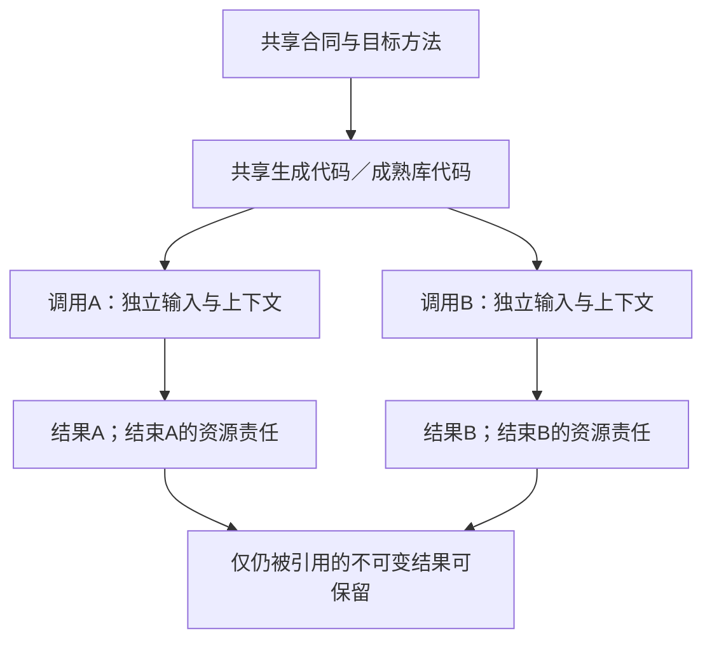
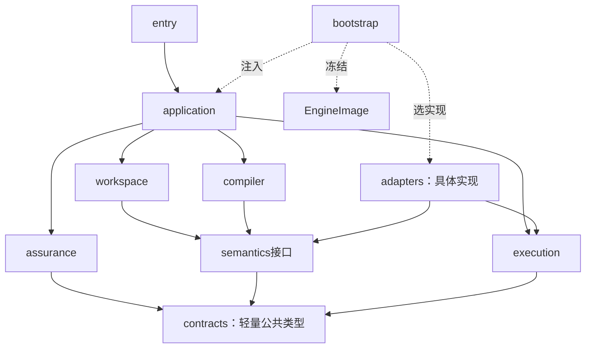

# 源绑定与解释映像

> **阅读范围**：采用范围内的设计规范；实现状态另查未决 · [共同上下文](模块与运行实例.md)。

<details>
<summary>本页内容</summary>

- [源、导入视图与实现使用点的物理落位](#源导入视图与实现使用点的物理落位)
- [EngineImage：解释装配和更新协议](#engineimage解释装配和更新协议)
- [合同目录与可调用方法的装配边界](#合同目录与可调用方法的装配边界)

</details>


<a id="根接合机制的最小物理装配"></a>
<a id="可替换接缝与默认宿主"></a>
<a id="源前端与目标后端不得反向拥有公共模型"></a>
<a id="更换一个内部实现"></a>
<a id="接口边界的落实与自用装配"></a>
<a id="能力控制和全资产支持如何装配"></a>
<a id="意图完成与问题管理的实际装配"></a>
<a id="任务投影与上游适配的实际装配"></a>

<a id="supply-physical-layout"></a>
## 源、导入视图与实现使用点的物理落位

十个原模块保持，核心内部采用下列文件责任。此树是确定的实现起点，允许不改变公开接口的局部拆并；不是新建同名服务。具体工具私有类型止于adapter，普通业务名不进入中央switch。

```text
semantics/
  modules.ts             作者模块与导入模块的共同公开符号入口
  callable-contracts.ts  值域、错误、效果、寿命与所需观察的只读合同索引
  author-elaboration.ts  声明种子、有限类型约束、潜在效果联动及原作者省略来源
  checking/              现有语言/领域的实际作者主体分析
compiler/
  resolve-use.ts         为准确使用点与目标解析已有Binding，形成内部UseBinding
  lower-call.ts          统一编排主体、直接调用和必要适配
  edit-correspondence.ts  记录实际写回能力与补充，输出布局后封存映射
  compose-artifacts.ts   目标级符号、初始化、成员和依赖汇合
  dependency-roles.ts    构建、运行、检查、生成期及资源的贡献与选择核对
workspace/
  imported-view.ts       将真实导出/声明/准确合同组成只读ImportedModuleView
  generated-edit.ts      固定目标草稿与源基础，调用映射写回并形成作者候选
adapters/
  native/typescript/     使用成熟符号与类型服务读取导出，不执行模块顶层
  target/node/           Node目标导入、接收者、调用/格式/生命周期规则
  target/<selected>/    仅已被真实任务选择的额外目标/ABI适配；不预建C/Rust等目录
  packages/              已选择包工具的精确解析、锁与实际安装结果接口
application/
  prepare-job.ts         固定任务、源和导入内容，处理Needs后建立新准备代
  present-change.ts      按作者变化与实际依赖呈现结果，不抄内部UseBinding
```

`ImportedModuleView`是已有SignatureView在模块边界的只读集合；`UseBinding`是已有Binding在“调用/导出使用点×目标”上的内部解析结果。它们不是新作者文件、工具参数、永久IR或公共包注册记录。无长期消费者时只存在于本次查询结果；缓存时记录实际来源和解释依赖。本章唯一拥有 ImportedModuleView 的字段和能力投影，导入流程只消费该对象，不能另增同名合同。

### 数据所有者与不可伪造的完成范围

| 数据 | 必要内容 | 产生与失效 |
|---|---|---|
| 作者`ModuleRevision` | 原源、实际声明/主体、解释、来源与编辑映射 | 真正读取作者文本或结构；没有主体就不造空body |
| `ImportedModuleView` | 模块与精确提供者引用、source language 与 syntax capability、symbols/public surface、types、可引用 contracts/effects、dependencies、assumptions/invariants、source mapping、round-trip capability、成员 coverage、来源与 unknown frontier | 原生前端或被接受的合同导入器；来源、语言/语法能力、条件导出、依赖、合同、映射或 round-trip 能力变化使相交视图失效 |
| `CallableIndex` | 作者fn/静态函数值及外部合同的引用，和当前可用/未知范围 | P2记录声明，P3类型与效果等合格后冻结；导入类型可用不等于运行实现就绪 |
| `UseBinding` | 使用点、定义与目标、实现分支、调用安排/表示、必要适配、依赖与资格引用 | P4由真实Binding解析；不手工复制每个字段的完整合同 |
| 目标贡献 | 本使用点的声明/导入/调用/资源/初始化/依赖及来源 | 既有LoweringResult；目标组合器唯一汇合 |
| 运行实例 | 某次调用实际创建的上下文、句柄、输入与停止责任 | 目标程序或执行适配器；编译缓存不拥有它 |

ImportedModuleView 对每个实际能力范围记录已证投影：`opaque → structural → typed → contract-aware → semanticized → managed`。`opaque`只保全可读取内容与边界；`structural`增加结构、声明和公开成员；`typed`增加合格类型与签名；`contract-aware`增加可引用合同、效果和适用前提；`semanticized`表示相交含义已被有权关系接纳；`managed`再要求编辑映射、round-trip、影响与变更责任闭合。后一级必须保留前一级的来源和 unknown，不能由默认值补齐。该序列是逐能力的已证范围，不是模块总体成熟度；同一模块可以在不同成员或操作上处于不同范围，首次导入也不要求全仓达到最高一级。

成熟库API的私有checker符号不能越过固定工具实例寿命被另一个版本复用。导入器在受信边界将它们变成有来源的只读值或在工具会话内保留受限句柄；不能深冻结一个外部SDK对象就宣称已经得到跨版本公共模型。

### 内部函数的具体交接

```text
resolveModule(ref, exactBindings, capturedInputs, image)
  -> AuthorModule(ModuleRevision)
   | ImportedModule(ImportedModuleView)
   | Needs | ModuleFailure

linkHeaders(authorModules, importedViews, scope, semanticRules, limits)
  -> ModuleSemanticResult（HeaderIndex、CallableIndex、主体摘要、Diagnostics和Needs）

resolveUse(useSite, acceptedContract, target, existingBindings, allowedChoices)
  -> Resolved(UseBinding) | Needs | ContractConflict | Unsupported

lowerBoundUse(useBinding, evaluatedArguments, region, targetRules)
  -> LoweringResult | Needs | LoweringFailure

composeTarget(rootSet, contributions, existingDependencyResolution, layout)
  -> CompleteArtifactRoot | DependencyResolutionNeed | CompositionFailure
```

`resolveModule`不安装包、不运行作者顶层或目标工厂。外部符号无行为资料时仍可保全和作有限类型读取；跨目标使用需要相应公开合同与采用依据。`linkHeaders`委托`Semantics.analyzeHeaders`，内部先collectHeaderSeeds，再对作者采用类型补全、主体与效果检查及freezeCallableHeaders，返回分项结果；无作者body的外部导出使用已固定合同，不制造待推导空主体。`resolveUse`不从名称猜语义；未知与冲突明确返回。新增适配引入的新控制、效果与借用由语义层补查。

`lowerBoundUse`只生成目标动作，不能在编译进程创建目标运行的hash对象、文件或数据库连接。它取得已按源码次序计算的值引用；目标参数重排只排列这些值，接收者求值一次。目标运行工厂在声明的调用/会话/应用范围执行；相同库版本只允许共享代码，不自动共享可变实例。

<a id="fig-supply-ownership"></a>
### 图解：供给代码共享与调用状态分离

框内是只读的编译内容；两个调用分别创建运行状态。箭头不表示状态可以从编译缓存恢复。



正常全内存预览只装配固定内容、相关读取/检查/生成方法。真实工具结果需外部执行时返回Needs，由application请求execution；不用给compiler注入任意I/O回调。工具调用成功、输入固定、供给可调用、优化资格与本次写权限仍是不同条件。

### 有限作者组合在装配中的交接

结构读取器消费绑定到实际内容的[有限组合合同](../../作者/结构化源码.md#finite-requirement-composition)，在原prepare-job/模块读取过程中取得完整参数与Rule头；能力表只能声称已实现的构造，不从同一草案名称推断字段支持。实例化结果保留静态外部缺参、有限待选见证和真正运行输入的区别，不能要求先运行产品才能读它的需求。

原resolveUse及其联合计划消费完整作用域和共享主体，绑定选择与假设必须回到准确根。编译器需要选择时先复用合格现有绑定；高层指标未知不由低层数字偷偷裁决。partial根可以保留，共同资源/配置有冲突时不能以分项成功对外宣布整体完成。lowerBoundUse消费的是同一选定分支和见证，方法新增前提后须返回相交核验，不由后端自行换一项要求。

结构源、候选解析、方法选择、实际检查和运行作用分别留在原拥有者。新组合不增加第十一模块、公共工具或持久求解服务；简单任务可以单进程、有界全量检查，更大任务在真实读集与预算下共享分析。完整算法见[作用域选择与偏好](../../编译/实现选择与设计搜索.md#scoped-realization)。

<a id="qualified-binding-consumption"></a>
### 从取得资料到可消费绑定的逐根算法

这是`prepare-job.ts`、`resolveModule`、`linkHeaders`、`resolveUse`和`composeTarget`的共同接合，不新增对外步骤或另一种绑定文件。用户仍给结构源、已有引用及本次目标；内部将准确选择送到实际消费者，而不是要求作者逐一填写资料、实现和证明的关系台账。

**B0 取准确输入。** application在原PreparedJob中固定本次输出根、使用画像和源层。workspace解析清单/锁及已取得内容；外部位置、搜索摘要、文档旧址只提供取得线索，不能覆盖锁内精确选择。纯编译遇到新外部读取或执行需求仍返回原Needs，经有权的补取形成新准备代，不在旧代中偷读latest。

**B1 解引用和解释。** `resolveModule`取得该命名域、主体、修订、内容域与实际规则。别名迁移到同字节的合格镜像可以继续；若得到的是新版本、不同来源角色或缺必要上下文，则保持ModuleFailure/Needs或相交冲突，不能因导出名字一样而接受。合同目录只表达其已有字段和含义，不提供缺失的可调用方法。私有SDK句柄仍受原工具实例寿命限制。

**B2 形成共同头与主体关系。** `linkHeaders`按固定规则检查类型、潜在效果、公开合同和结构实例化；用实际源/编辑映射连接发生位置。两个use都传入同一subject时保持共同主体，各自产生的私有subject不能被内容去重合并。数组重排只能改变该快照的位置索引，不能自动把正在运行的状态转移给另一使用点；对应不唯一时保留作者/迁移缺项。

**B3 核每个使用点的供给。** `resolveUse`将本使用点实际接受的合同与方法支持的合同修订、目标、资源和作用前提比较。M@2针对Q@2成立，不能凭Q@3与Q@2同签名就免查语义、数值、失败和进展。旧方法若有范围明确且可取得的保持依据，可以合法支持后继；没有时选择其他合格方法、在已委派范围创作并检查，或返回原Needs/ContractConflict/Unsupported。不将需求降级来凑成功，也不统一拒绝仍合格的旧供给。

**B4 降低与共享成员汇合。** `lowerBoundUse`消费已经满足本次用途前提的UseBinding，不再次以目录别名选择方法。验证用途可以带明确未证明义务形成被测候选；生产消费者仍须核其要求的资格，不能由同一引用的存在推断。新适配的类型/效果/资源重新经过原检查；`composeTarget`按共享配置、类型身份、初始化和真实成员核多根兼容。一个根完整而另一根缺宿主时可以保存前者；若任务要求共同发行，则共同完成条件仍未满足。共享必需成员有冲突时，不能以“各根分别成功”消除冲突。

**B5 证据与用途裁决。** 编译器提供实际源对应和构造依据，assurance按声明所需的Claim、被测对象、环境及方法评价。语义保持能承接某些纯值性质，不自动承接安装、权限、性能和外部效果证据。检查需要现实执行时交原执行边界；文档链接、签名目录或本包核验通过都不自造CheckRecord。已经取得的独立合格结果可复用，不为形式齐全强造一次新测试。

**B6 发布准确结果及后继。** application返回分根结果、残余义务和准确输入身份；当前显示另核请求代与披露。真实保存/运行/发布使用该制品及当前准入，不把旧读权当新写权。输入或实际解释变化形成后继PreparedJob/image，旧工作、旧制品和旧运行不原地换义；取得失败只释放本次实际拥有且无消费者的资源，保留在途操作的原恢复责任。

这条算法在没有外部资料、只有一个已绑定纯函数时可以退化为固定内容和直接调用；不强制先查旧址、启动服务或创建持久操作。依赖粒度由真实读集决定：文档库整体散列负责该库交付完整性，不天然属于每个用户程序的动作键。具体失效条件由[依赖角色](../../编译/查询增量与性能.md#reference-role-invalidation)拥有。

B3的跨部件前提由[组合闭合](../../编译/组合前提与进展闭合.md)处理：支持带主体、分支和实际条件，有状态环需要初态/保持依据，进展另证。B4中的原生Pass按[变换接纳](../../编译/内核/变换接纳与分析保持.md)取得私有写域并发布新IR及适用分析；失败保留原合格基础，不用半变换对象继续发射。原十职责和方法接口不增加平行平台。

**可检查的正反情景。** 库根K采用Q@2/M@2，说明默认移到Q@3，调试根D还缺工具。K继续沿准确@2完成，D返回缺项，联合发行仍不完整。明确把K改到Q@3后，只重核相交绑定及消费者；若保持依据不成立，不把旧生成物贴上新源标识。保存新说明位置不能触发目标程序重新执行，恢复旧运行则仍按其原制品与当前控制资格处理。

### 编辑器/工作区的联合捕获接口

在既有workspace读取责任中实现内部`captureWorkingSet`，不新增公开工具或专用编辑器：输入是准确工程根、内容层绑定、版本化变更/完整内容、元数据基础、读取许可和预算；输出是已固定候选及覆盖/一致性说明，或准确的缺内容、层冲突和拒绝原因。具体E0—E5由[原生观察](../../开发/原生维护/导入观察与原生资产.md#text-workspace-capture)唯一维护。

entry/已有工具适配取得编辑器版本或文件捕获，application协调输入与任务，workspace建立SourceBlob、声明映射和候选；compiler只读取固定结果。语法/类型诊断在共享semantics方法中按需运行。待处理改动可在客户端缓冲合并，不需要每个按键创建Operation；不同客户端基础不能由共享lastCandidate覆盖。

已经写盘的输入只是新前像，不再调用execution重复保存。要将另一个候选回写工作区才进入原提交机制。观察回调不能自带隐式运行或网络权限；普通watch失效事件不能直接覆盖未接纳的生成文件草稿。

对无来源的恢复，adapters提供实际语言/二进制观察，semantics产生有范围的行为及高层候选，assurance记录相应支持；workspace仅在合法采用时改变作者归属。候选规则不是历史作者事实，compiler不在普通构建时重新推测它。

### 逆向编辑在既有模块中的具体接口

```text
classifyEditOwnership(artifactOrSource, capturedChanges, exactImage)
  -> NativeAuthor | ManagedTarget | ImportedPublic | UnknownOrigin

prepareGeneratedEdit(baseC1, artifactG0, changes, scope, retainedOrigins)
  -> TargetDraft(C0, C1, G0, Tstar, mapping) | NeedOrigin | RequestFailure

putBackRegion(targetDraft, correspondence, allowedChanges)
  -> AuthorPatch | PresentationPatch | NeedsDecision | Unmapped | RuleFailure

reconcileAuthorPatch(baseC0, patch, currentC1, semanticChecks)
  -> CandidateC2 | SourceConflict | NeedsInput

verifyRegeneration(candidateC2, targetDraft, fixedTargetRules)
  -> MappedResult | PreservationFailure | TargetFailure
```

这些函数是实现合同，不是已存在SDK。`prepareGeneratedEdit`在引用保留协议内同时固定输入，之后锁外解析；`putBackRegion`只返回补丁，不能直接写作者头。语义层检查作用域、求值、效果与公共要求；compiler再生成；application汇总准确结果；实际保存仍由execution承担。

原生TS读取/重构使用绑定版本的语言服务，在源切片上应用变化，不将任意TS AST对象保存成跨版本协议。高级目标没有相应写回规则时，`ImportedModuleView`仍可供调用和诊断，但不能被转换器当成内部源码。

`EditCorrespondence`与源补充附着于既有生成结果/内容引用；正常运行目标不携带编辑器。只有承诺可恢复编辑的维护内容需要保留来源。回收前由原内容服务核有效保留根，不增加另一个逆向数据库或权限体系。

### 简洁作者补全的具体文件和调用交接

`semantics/author-elaboration.ts`在现有semantics模块中拥有声明种子、签名依赖和有限约束补全；调用`TypeStore`及当前推断/作用域接口，不拥有内容存储或执行器。`semantics/modules.ts`先汇合真实声明和导入；`callable-contracts.ts`在freezeCallableHeaders后只发布类型、效果和来源均合格的fn/函数值入口；仅type-ready的分析态不能流入resolveUse或execution。上述是代码责任设计，不是已经存在的新软件文件。

```text
workspace.captureWorkingSet -> 固定ModuleRevision/ImportedModuleView
semantics.collectHeaderSeeds -> 名字、显式类型和待推导头
semantics.completeCallableSignatures -> 类型就绪视图/约束 | Needs | AnnotationRequired | 类型冲突
semantics.check(module, signatureTypes, summaries, rules, limits) -> 主体约束
semantics.closeEffects(analyses, signatureTypes, importedContracts, rules, limits) -> 效果摘要/准确未知
semantics.freezeCallableHeaders -> CallableFreezeResult：合格头/调用索引＋逐项问题
compiler.resolveUse/lowerBoundUse -> 普通函数或合法静态函数值的目标入口
workspace.edit -> 依据原源和对应作最小修改；不覆盖成推导展开文本
```

分析状态属于当前不可变输入的一次工作，不能把一个请求的类型变量塞进共享已发布TypeStore。变化函数体的签名推导是语言分析，不执行第三方库或取得新权限。application返回局部注解位置或实际依赖缺项；根结果只在真实类型闭合后成为可调用。执行层仍消费精确制品，不能凭作者名字或export标签运行未检查值。

解析器支持这套短写法以后，工作区、CallableIndex、输出根和compute-eval必须同批接合；只做前端而让后端要求作者再写一份fn，不算本能力完成。


## EngineImage：解释装配和更新协议

<a id="fig-package-dependencies"></a>

### 图解：静态代码依赖与装配注入

实线A→B表示A引用B的公开合同；bootstrap虚线表示装配注入，不是运行期绕过权限。接口可以同进程部署，不要求每框独立服务。



`EngineImage`是实际解释绑定及其已装载方法的只读聚合，复用已有Binding与内容引用，不新增作者语言、全局注册服务或每请求的序列化文件。

| 必要部分 | 具体保存 | 何时决定 |
|---|---|---|
| image本地引用与内容来源 | 组成的精确版本及创建记录；引用不是执行权 | 装配时 |
| 语言/领域入口 | 语言ID、体编码合同、版本、语法/类型/效果规则及支持表 | 按所选能力解析 |
| 方法分发表 | 接口ID、方法ID、输入输出合同、阶段、运行类别、实际实现 | 激活前检查 |
| 控制与默认 | 描述符、值域、来源顺序、互斥和目标消费者 | 与其解释内容绑定 |
| 目标和格式能力 | 合格目标、AST/工具API族、格式编辑器和后端职责 | 按当前目标与资产加载 |
| 可用性记录 | 哪些方法缺实现或缺环境；不把空函数当合格支持 | 构建与实际使用时 |

仅固定已知依赖，不要求一次发现全世界方法。运行中的纯编译发现新增语言/工具要求时，先返回类型化Needs；application请bootstrap按原任务许可构建新image，形成新的PreparedJob。只有新image对旧已消费接口保持相同解释时才复用旧分析；否则相交重算。原请求中的image实例保持只读，新代际和结果身份明确，不在同一ActionKey内混代。新增能力不能借续接扩大下载/执行许可。

### 一种装配机制，不为每个语义族建平台

合同名、库名、结构编码与执行方法不是四个都要常驻的组件。默认语言组合在解析前固定，方法按所需阶段与输出根装配；`EngineImage`继续是已有绑定与可调用方法的只读视图，不因为`sec.object/1`存在再增加对象Profile服务。首个本地实现可用进程内只读表和直接函数调用；动态插件、远程发现、独立服务只在真实需求下启用。

一个简单函数只消费基础方法；class使对象检查与实际目标实现进入闭包；流和AD调用使各自方法进入闭包。方法所需依赖沿现有Done/Needs/Stopped继续取得，未安装方法不能由目录声明补成成功。解析可见性、静态分析与目标运行装配分别裁剪，相关合同的标识由[语言组合](../../领域/计算基础/紧凑表示与程序范式.md#合同标识默认语言组合与按需能力)唯一解释。

### E0至E6的完整装配过程

**E0 选择。** bootstrap取得当前配置与接受的语言/目标要求。已有image仍合格可复用；纯调用可直接由调用者提供固定方法，不启动扫描市场或联网取最新。

**E1 解析。** 按包角色、公开出口和精确内容取得定义与实际实现。缺项保持解析失败或部分可用，不能执行作者模块来猜配置。接口签名加载不等于执行插件初始化。

**E2 验证。** 检查同ID同版本是否出现不同内容、声明的能力是否有真实方法、参数/结果类型是否兼容、目标是否接受该语义。不可变规则按自身身份去重；两个有状态提供者即使配置相同也不自动合成一个实例。

**E3 构造。** 建立方法依赖图。纯声明可按合法SCC装载；运行初始化按自己的前置顺序进行。严格初始化循环没有种子时返回装配失败，不补空句柄。受信方法可同进程装入；不可信过程的实际启动走宿主隔离，不能让任意模块顶层代码先跑完再声称已审查。

**E4 封存。** 在builder内补齐分发表和默认，封存后不暴露可写Map或SDK后备对象。按实际可用能力发布image；没有Java后端可以发布仅支持其他目标的image，但不得把Java列成合格能力。

**E5 使用与替换。** 每个请求在[运行代接纳点](../../运行/发布运行与资源生命周期.md#runtime-generation-cutover)同段取得选定image的引用保护，不先读指针再补pin。升级构建另一个image，按预期旧路由切换新请求默认；旧请求不被热替换，锁定旧解释的新请求使用明确保留的合格入口或独立新装配。真实安全撤销可以阻断旧方法的新作用；不能借升级改写旧任务的类型或恢复意图。

**E6 释放。** 旧代未来无保护入口已关闭，且没有请求、缓存中的运行引用、依赖其代码的结果、回调/设备或恢复责任还引用旧实例时，才释放实际可释放部分。进程/连接必须实际停止或转移；仅image引用计数为零不证明外部设备已结束。宿主不支持独立卸载时保留到真实退出或按有权的进程边界替换，不用移出分发表冒称卸载。失联资源转入对应未结算责任，不阻塞不相交纯结果释放；连续新代的共存峰值和待退役积压受同一预算约束。

image整体引用便于装配生命周期管理，**不把全image摘要作为所有编译查询唯一键**。方法、规则、默认、库与环境的实际读集决定失效；新增无关语言不重算已有纯函数。 但方法发现若查询了“满足条件的候选集合”，集合成员和不存在条件本身也是输入：按该查询域的目录修订记录，不仅记录最后选中的方法。新增相关候选可能使“最佳”判断需重评，已有合格固定绑定是否更换仍按采用政策；不能为保持局部缓存而漏掉候选集合变化。来源、控制和任务可读资格不因缓存共享而合并。

MLIR要求Pass在多线程期间遵守局部可变范围，并提前声明依赖方言；其分析失效机制也与已保留分析分开。这支持当前固定装配与显式失效的机制选择，不表示SEC采用了其全套对象模型或继承了正确性。参见[PassManagement](https://mlir.llvm.org/docs/PassManagement/)。


## 合同目录与可调用方法的装配边界

`semantics`持有本请求可读取的语言/领域定义；`compiler`和相应适配通过实际MethodSpec执行其支持阶段。目录中的Definition可以没有已安装方法：源与接口可分析到已支持范围，需求到达缺失方法才返回明确Needs/Stopped。`bootstrap`不为缺方法构造always-success对象，`application`也不以返回空值代表完成。

当前装配提供文本parser、结构decoder和已选原生读取器。新前端需要先改变作者基线的采用决定，再增加adapter；公共contracts不暴露宿主AST。未采用SDK不增加reader、依赖或发行项。

内部实现替换按公开合同、错误/取消、资源、数据和实际版本作组合检查；旧请求固定原image，新的方法只进入新装配。方法是否存在与执行当时是否有权分别判定。完整外部协议由实际需求拥有者给出，未决定的未来协议不得以宽泛method参数伪装全覆盖。

## 作者表示选择与供给复用的实际消费

本节沿既有绑定函数工作，不增加表示管理器。`prepare-job.ts`按真实源范围捕获结构作者、计算文本或原生区域及其编辑拥有者；`resolveModule`选择实际解释与模块环境；结构源不经文本打印中转。`linkHeaders`得到公开边界但不提升成行为证明；`resolveUse`同时消费需求、原生/中立实现、画像、实际适配和证据；`lowerBoundUse`生成必要差额；`composeTarget`闭合本次交付应当解决的成员，保留合法公共宿主输入。

同一源字节可以共享合格解析；原语言、锁、画像或公开接受条件不同，不得共享未经核对的语义结论。选择原生实现不要求新建同义中立主体。无相交方法时仍可保存作者意图；已经完整的独立输出不被另一目标缺能力抹去。正式拥有权转移及原生使用点步骤由[混合作者与供给](../../开发/原生维护/导入观察与原生资产.md#mixed-author-supply)拥有。

阅读构建不是用户产品编译的一条隐含阶段。文档工具有自己的输入清单、渲染依赖与产物；只有任务确实消费这份文档、规则或工具时，其变化才进入对应读集。HTML成功不产生SEC产品的CheckRecord，不取得发布或运行权。

## 方法适用域与运行访问的接合

`resolveUse`可以固定[有条件实现](../../编译/有条件实现与公共行为保持.md)的守卫与全部实际分支，而不是把子域方法注册为全域实现。守卫读取哪份值、前提来自哪个能力、分支的错误/资源/同步合同和全部依赖都属于该UseBinding的输入；无独立`dispatch.json`或第二个方法库。

`lowerBoundUse`消费同一捕获实参，只求值一次，再按固定条件进入分支；`composeTarget`汇合所有运行可达分支成员。验证用途的候选产物与生产可用绑定分开，不因需要候选运行证据形成“先证明再生成被测对象”的循环。实际检测需要原执行准入。

`prepare-operation.ts`和实际适配将合同落实为[访问与生命周期](../../运行/跨实现调用与数据寿命.md)：复制/借用/转移的取得、回调登记、接受未知、结果拥有及最后释放。不注入目标原生库到纯编译器以探测能力；装载和初始化通过获准边界进行。这里只规定原阶段的消费者，不给使用者增加必填对象。
