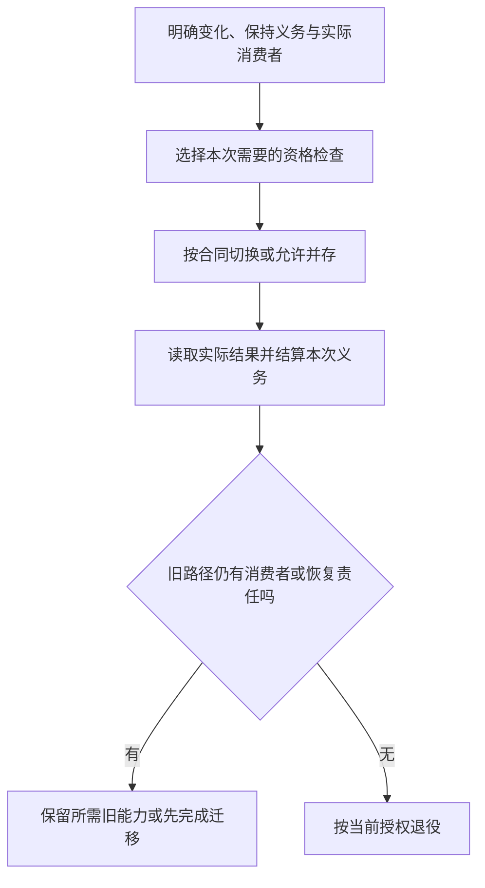
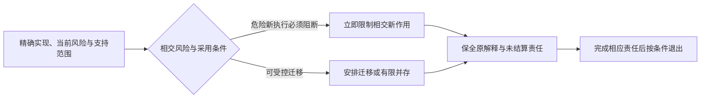

# 兼容迁移与退役

> **阅读范围**：采用范围内的设计规范；实现状态另查未决。

<details>
<summary>本页内容</summary>

- [目标编辑规则与维护来源的版本演进](#目标编辑规则与维护来源的版本演进)
- [从旧合同到新合同的变更分类](#从旧合同到新合同的变更分类)
- [事故驱动设计修正与保证降级](#事故驱动设计修正与保证降级)
- [依赖、工具链、Provider 与后端替换](#依赖工具链provider-与后端替换)
- [兼容层、适配器与退役期限](#兼容层适配器与退役期限)
- [兼容、迁移、切换与退役](#兼容迁移切换与退役)
- [分阶段发布、金丝雀、回滚与向前修复](#分阶段发布金丝雀回滚与向前修复)
- [删除、墓碑、备份复活与遗忘权](#删除墓碑备份复活与遗忘权)
- [历史证据、知识保全与来源迁移](#历史证据知识保全与来源迁移)
- [工程文档的多语言设计](#工程文档的多语言设计)
- [扩展机制与生态边界](#扩展机制与生态边界)
- [支持生命周期与历史解释](#支持生命周期与历史解释)
- [数据模式、双版本、回填、切换与收缩](#数据模式双版本回填切换与收缩)
- [模型、策略与知识更新的失效传播](#模型策略与知识更新的失效传播)
- [法律、政策、组织与权限演进](#法律政策组织与权限演进)
- [语义模式与中间表示版本迁移](#语义模式与中间表示版本迁移)
- [长期支持、分支回移与版本矩阵](#长期支持分支回移与版本矩阵)
- [作者主路径纠偏不是自动迁移用户工程](#作者主路径纠偏不是自动迁移用户工程)
- [草案澄清与实际采用兼容](#草案澄清与实际采用兼容)
- [工程定义变更与在途实例](#工程定义变更与在途实例)
- [没有持久业务的计算演进](#没有持久业务的计算演进)
- [由旧状态到新状态的正向迁移决策](#由旧状态到新状态的正向迁移决策)
- [库与基础架构的有条件局部升级](#库与基础架构的有条件局部升级)
- [默认和解释版本的升级也有迁移对象](#默认和解释版本的升级也有迁移对象)
- [表示迁移、布局演进与原则改变分别处理](#表示迁移布局演进与原则改变分别处理)
- [成品装配和旧请求的双版本交接](#成品装配和旧请求的双版本交接)
- [层级状态实例的稳定切面迁移](#层级状态实例的稳定切面迁移)
- [查询定义、源模式与视图状态的升级](#查询定义源模式与视图状态的升级)
- [对象槽、窗口状态与导数规则的版本变化](#对象槽窗口状态与导数规则的版本变化)
- [信息结构迁移与实际兼容](#信息结构迁移与实际兼容)

</details>


## 目标编辑规则与维护来源的版本演进

来源、映射、写回规则和生成器是有版本的共同输入。旧目标改动按旧规则解码，进入当前作者前先核真实接受关系和语义迁移；不因为两份规则同名就复用节点位置。候选重基以当前作者为保持基础，未改资产和并发合法修改继续保留。

撤下Java的当前实现优先级不撤销任何已采用实例的合同与恢复责任；保留的条件示例不继续要求新项目交付Java。C/Rust供应接入不自动改变作者语言或SEC实现核心。

退役旧生成器前，已承诺可编辑的目标要么继续保留其所需原源/规则，要么有合格的映射迁移。只保留最终源码的发行包不伪称具有原维护包的全部逆向能力。明确转为原生作者时移交唯一写权并保存未知/人工内容；不得以工具暂不支持为由自动接管。

## 从旧合同到新合同的变更分类

兼容比较的单位是实际使用域及其观察，不是仅比较文本字段。按顺序识别：表示变化是否保义；输入域是否收窄；正常/错误结果是否改变；环境和资源前提是否增强；权限与隐私是否扩大；任务目标是否本身获准改变；在途数据和操作绑定哪个旧合同。比较不能机械完成时保留有范围的未知，并给可用检查、合法自动选择或实际有权主体的裁决路径。

仅实现体改变而公共关系和使用点需要均保持，可以复用该接口层证据；目标代码仍取得新内容及相交构建证据。加强实现保证可能兼容，但不得增加未接受的成本/环境硬前置。要求改变时形成新接受关系，不能通过升级库悄悄让旧请求失去原来合法的输入。

迁移选择默认优先保留正确工作和已有合法绑定。新候选的经济优势包含迁移、回归、恢复与维护成本，方案切换与静态重新排名是两个事件；性能证明失效不一定使原程序行为失效。硬权限或安全条件变化则优先停止受影响的新作用，不为了避免返工继续使用失效资格。

旧事件、旧结果和已准备的恢复仍按原固定语义解释。新要求被采用，不会使旧字节自动改格式，也不会使运行中的旧执行器停止。切换点、旧解释保留和退出条件由相应目标协议完成；没有需求的不启用迁移设施，但已经有责任时必须完成明确结算。

## 事故驱动设计修正与保证降级

### 1. 事故不是只修代码

事故可能推翻观测、模型、权限、恢复、验证和组织假设。修复 leaf bug 后仍需检查最高错误前提。

### 2. IncidentRecord

```text
IncidentRecord = exact {
  affectedSubjectsAndStakeholders,
  intendedAndObservedOutcomes,
  timelineAndCausalRelations,
  contributingAndLatentConditions,
  failedControlsAndUnknowns,
  containmentAndRecovery,
  evidenceAndSourceQuality,
  impactedClaimsAndMaturity,
  redesignAndRetirementActions
}
```

### 3. 保证降级

先定位事故推翻的前提、对象与时间范围：被直接反证的声明失效；可能受影响但尚未确定的资格进入受限/待核查状态，阻止依赖它的动作；未受影响且仍有依据的结果可继续。历史执行事实不改写，资格撤销与实现成熟度也不使用同一个自动回退标签。测试仍绿不能覆盖已有反证，事故名称相似也不能证明所有工程同一根因。

### 4. 根因

区分触发事件、直接原因、共同原因、系统性条件、检测失败和恢复失败。禁止“人为错误”终止分析。

### 5. 修正

优先修改 owner、contract、state machine、admission 或 verification；只在局部实现错误时做局部 patch。每个措施有反例和防回归证据。

### 6. 关闭

事故关闭需要恢复用户影响、数据/安全义务、临时 bypass 退役、证据更新和长期责任。RCA 文档本身不是完成。

### 7. 验证

事故重放、险情、竞争解释、控制故障注入、恢复演练、相似系统攻击和普通后继操作。

## 依赖、工具链、Provider 与后端替换

### 1. 替换按能力而非包名

一个依赖可能同时提供解析、执行、缓存、网络或 UI。采用/替换前先拆 capability，避免整包获得超出需要的 authority。

### 2. AdoptionTransaction

```text
real consumer and problem
→ current mechanism and defect/cost evidence
→ capability decomposition
→ candidate identity/version/integrity/license/security
→ physical compatibility
→ conformance and failure tests
→ decision and exact binding
→ adapter only where a real boundary requires it
→ scoped consumer cutover or bounded coexistence
→ old active use drained, migrated or explicitly refused
→ scoped retirement and required historical/recovery retention
```

### 3. 双平面

SEC 自身开发工具和用户目标工程的 Implementation Provider 分离。测试 runner、build cache 不应进入生成项目；目标框架也不应污染 SEC Core。

### 4. Fallback

fallback 是新的 resolution decision，需要重新检查 hard eligibility、data、authority、semantics 和 evidence。不能在 runtime 因 Provider unavailable 静默换实现。

### 5. 后端替换

Backend 只要保持 TargetIR conformance、source mapping、determinism 和 runtime contract，可以替换而不改变上层语义；证据和 physical binding 会变化。

### 6. package/lock

依赖变更只在共享可变 workspace/锁文件/解析闭包内竞争。该范围有一个提交协调 owner，多个候选可合成受控 batch 或经 CAS 重验；隔离工程与不共享状态的闭包可并行。单写不等于禁止全平台所有独立依赖工作。

### 7. 验证

Provider 消失、接口相同但语义不同、许可证变化、运行时不兼容、性能回归、回退范围扩大、旧依赖仍被加载和回滚。

## 兼容层、适配器与退役期限

### 1. 临时兼容与长期协议适配分开

临时 `CompatibilitySeam`（旧接口 alias、双读写、legacy route）必须绑定真实旧消费者、支持范围、风险、期限和退役条件。

长期 `ProtocolAdapter` 是端口对外部协议的实现；只要独立协议边界与消费者持续存在，就不因“adapter”这个名字被要求删除。它仍需版本、owner、符合性和维护成本证据。临时兼容与永久集成可以共用代码，但两种责任分别标注，不能为赶退役日期毁掉必要边界，也不能借长期适配掩盖旧竞争 writer。

### 2. CompatibilitySeam

```text
CompatibilitySeam = exact {
  seamRef,
  oldAndNewContractRefs,
  supportedDirections,
  consumerRefs,
  translationAndLossSemantics,
  authorityAndEffectCeiling,
  monitoringAndFailure,
  activationAndExpiry,
  migrationOwner,
  retirementPredicate
}
```

### 3. 限制

两种适配都不取得被转换领域的 owner，不能扩权或把 unsupported 静默变默认成功。协议适配不偷偷重新选择 Provider；必要重新解析经明确编排合同进行。临时兼容不得无限延长竞争双写。

### 4. 退役

按声明支持范围停止新使用，并确认旧writer已经排空或被实际端点拒绝；相关数据已有合法迁移、隔离或保留安排，才删除对应临时层。支持窗口到期不自动删除数据或延长许可；显示未完成义务，按风险政策限制动作。必要的长期协议适配不随临时层一起退役。

### 5. 验证

有损转换、未知字段、旧客户端、仅新版本可表达的语义、回退环、权限扩大、期限到期、动态加载隐藏消费者和旧 writer 复活。

## 兼容、迁移、切换与退役

### 1. 兼容是多维的

```text
SourceCompatibility
BinaryCompatibility
SchemaCompatibility
ProtocolCompatibility
BehaviorCompatibility
DataCompatibility
OperationalCompatibility
SecurityCompatibility
```

一个“兼容”布尔值不足以描述工程变化。

### 2. 变化产品

```text
TargetDesignGeneration
ObservedImplementationGeneration
ReconciliationResult
MigrationPlan
TransitionExecution
ConformanceEvidence
```

目标、当前事实和迁移不能混成同一文档或状态。

### 3. 迁移路线不是固定长流程



这是已请求迁移时的控制图；并存和退役由实际消费者决定。正常设计或纯生成不执行此图，失败与未结算分支使用本章迁移协议。
影子运行、双读写、分批流量、数据回填和恢复演练，只在对应风险与前提成立时加入。无状态保持修改可以直接经充分检查切换；具有不可逆外部效果的影子执行不允许重复产生真实作用，需观察/模拟或隔离端口。影子结果不等于所有输入等价。

阶段失败保留实际状态，不无限循环“直到消费者清零”。关闭旧在线入口可以先于处理离线历史读者；后者采用明确的兼容、离线迁移或拒绝政策。活动代码退役不删除仍必要的恢复内容。

### 读写组合与迁移准入

兼容至少绑定生产者、消费者、方向、格式版本和要求保持的含义。同名字段能解析，不说明默认值、未知变体、溢出、权限或回写保持。

| 组合 | 准入必须检查 | 不满足时的路线 |
|---|---|---|
| 旧写者 → 新读者 | 旧值、缺省、单位、异常和排序按新读者仍保留原含义 | 先扩展新读能力或明确转换；不能凭新版本号放行 |
| 新写者 → 旧读者 | 新字段/变体、范围、编码和默认含义是否被旧读者支持 | 限制新写能力、隔离旧读者或先升级读者 |
| 新值 → 旧读改写 → 新读者 | 中间路径是否保留未知字段、变体、精度和存在性 | 旧写端只读化、原字节转发或有保全能力的版本；不能只测解码 |
| 当前数据 → 回滚版本 | 新写入是否仍可解释，安全修复与外部状态是否允许退回 | 采用前向修复，或在切换前建立确实可用的逆变换/备份恢复 |
| 旧备份/离线节点 → 当前系统 | 读取版本、删除/撤权记录、外部资源身份与再准入条件 | 受控恢复/迁移，不让旧writer和已删除内容无条件复活 |

例如新增一个和类型分支，可能保持字节格式可读却破坏旧代码的穷尽匹配。字段“缺失”、显式null与默认值不同；旧读者把未知字段删掉后重新编码，会造成信息损失，即使新旧双方都成功解析。ProtoJSON的未知字段能力不同于Protobuf二进制，经过JSON转换不能继承二进制保全结论；具体协议映射见[来源](../依据/来源/语言编译与目标工具.md#语言编译与目标工具)。

持久字段/变体的标识在支持范围内不复用给不同含义；显示名、序列化名和稳定语义ID分别迁移。开放未知变体要保留标签与原载荷，并允许显式unknown处理；不能由旧代码给未知值补一个看似成功的已知分支。任意自描述数据不能自动授权加载解释器或运行迁移。

一次演进使用上表导出真实前置。例如旧writer仍可能覆写新字段时，先停止/升级旧writer或启用无损中转，再允许新写；不是所有项目都按“读切换然后写切换”排列。最低协议版本只有在真实端点强制才有约束力；清单声明本身不围住离线写者。

<a id="authority-bearing-format-migration"></a>
### 授权与证据载体的版本解释

一个作用域内的规范责任和最终准入必须明确，不等于所有持久载体永久使用一种 schema。格式演进先按上面的读写组合检查；没有真实不兼容变化时不制造新版本，有真实不兼容变化时也不能仅为维持版本号而把新增含义强塞入旧默认或额外制品。

授权、签名、摘要、回执及证据载体的版本路径按以下边界处理：只在受支持的有限解释集合中选择与载体或其已绑定外层描述符相符的版本；选择解码路径本身不授予可信地位，也不允许从载荷动态装载任意代码。先按该版本原规定的字节、签名/摘要域及规范化算法验真，再做内部表示转换；不能把重编码后的对象当成旧字节已经验真的证据。版本选择只使用有界解码及受信的静态解释映像，不在验真前执行载荷回调。版本选择失败或验真失败时，不试用更宽松解析器寻找可接受结果。转换保留原版本、来源和缺失/null/未知的区别，只有原含义确实支持时才能补出相应值。

新字段影响准入而旧执行者不理解时，字节可读、未知字段可往返或旧签名有效都不足以让旧执行者继续作用。例如加入地域、收款人或最大额度约束后，忽略字段的旧处理者不能据此执行未经约束的操作。真实作用点应按所选迁移路线限制写者、隔离或升级消费者，并取得必要的新授权；没有新授权不从旧载体默认出新增权利。关键未知字段不能被忽略后继续准入；只读保全或无损转发不获得执行资格。新 schema 被正确解析仍须满足当前对象、载荷、撤销和作用前提，历史授权不因转换自动恢复有效。

是否独立为 owner artifact/receipt，按独立签发者、更新/保留周期、原子提交关系和真实消费者判断。同一责任、同一更新周期且需要原子保持的字段，可以采用一份有版本的载体；有独立权威或生命周期的事实可以采用受绑定的独立载体。两种方式都须保留真实身份、完整性和组合验真；不得把拆分文件当成隔离证明，也不得合并本应分别授权的动作。取舍与迁移沿原拥有者完成，不新设版本总控服务。

切换前列明实际接受、签发、回写、重放和恢复的方向；切换失败保留已发生效果和准确在途操作，不把解码失败改成“未执行”。旧格式退出以所支持读者和未结算责任为界：旧在线执行入口可以因安全要求先行拒绝，必要的只读历史解释与受限恢复仍按原合同保留。只读解释不取得再次执行权；当约定支持和恢复义务均已结束时才退役相应解释路径，不为了历史兼容永久维持可写旁路。

### 函数契约与闭合类型的演进

同名函数及同一参数类型不等于行为可替换。前置变强、正常结果或错误集合改变、潜在效果扩大、契约入口被移除，都要按实际调用者范围审查；函数存进容器、经回调或跨模块传递后仍是消费者，不只扫描直接文本调用。用户明确收紧业务输入是合法产品变更，却不能被标为无行为变化的实现替换。

名义类型的公开合同、构造器集合及依赖解释参与兼容判断。新增变体使旧的模式覆盖结果陈旧；旧程序有通配分支也只说明它有一条运行路径，不证明它理解新增业务。旧缓存的构造器全集、已专门化函数和省去的guard按实际依赖失效。纯私有布局优化在保持公共合同的情况下不必更换作者身份或强制所有消费者迁移。

这类变化不预设双写或永久兼容壳。先选择同源重建、显式适配、限制旧写者或独立版本；无法满足保持条件才阻断相交采用，其他独立模块和设计仍可继续。

### 4. 数据迁移

按读写矩阵选择扩展、回填、校验、切换与收缩的依赖次序。每阶段明确可逆、需补偿、只能前向或未知；不可逆点之前取得相应许可和可用恢复方案，不承诺任意阶段都能回到原状。临时双写要说明一致性、对账与退出，不能让同一业务副作用被两路重复结算。

### 5. 协议迁移

- 能力协商；
- 双读/双写仅在必要范围；
- 旧客户端支持窗口；
- 错误和完成语义保持；
- 版本桥可观测；
- 不兼容请求明确拒绝；
- 最终移除旧协议。

### 6. IR 和定义迁移

持久 IR 带 schema revision。迁移记录原字节、算法、输出和有损字段。不可无损迁移时保留旧解释器或要求重新观测/决定。

### 7. 实现替换

先确定候选身份、目标与保持范围，再选择满足范围的资格检查。可证明的局部重构不强制双跑；状态或环境敏感迁移可采用隔离影子、独立检查或分批真实流量。验证与切换绑定精确候选，切换后读回，旧活动绑定按支持域排空、迁移或拒绝。必要历史解释与恢复材料独立保留，不因为旧提供项撤销就全部删除。

### 方案代价与重新裁决

完整双运行增加资源与共同原因风险；直接切换减少过渡状态却扩大一次失败范围。当前默认是选择足以承担已声明风险的最小路线，不凭没有生产证据停止设计；未知影响实际准入。观测无法区分新旧行为、对账不能收敛或旧writer不能有效限制时，回到读写矩阵和权威边界，不能只延长超时。

### 8. 回滚和前滚

回滚只在旧版本仍兼容当前数据、协议和安全状态时合法。不可逆数据或外部效果优先前滚修复。迁移计划必须标记不可逆点。

### 9. 消费者清零

清点范围包括：

- 在线读写者；
- 后台作业；
- 缓存和索引；
- 消息和重放；
- 备份与灾难恢复；
- 离线节点；
- Provider 和插件；
- 权限和审计；
- 文档、工具、脚本和支持流程。

上述集合按项目实际支持和观察域清点；开放世界未知消费者不能被伪装成零，也不构成永远不能停止不安全版本的理由。到期或安全撤销可在端点拒绝旧接入，并记录仍需处理的历史/合同义务。所谓consumer-zero仅在该封闭集合、版本与时间条件内使用。

### 10. 退役

活动能力退役不是删除文件。按资源和承诺选择下列适用步骤，依赖来自实际风险，不把它套给删重文字或未启用候选：

1. 阻止新绑定；
2. 迁移和排空活动实例；
3. 撤销权限、密钥和发布入口；
4. 保留必要历史解释和数据读取；
5. 清理缓存、索引和监控；
6. 验证所声明范围的消费者迁移、排空或拒绝；
7. 删除不再承载活动、历史读取或恢复义务的代码和物理资源；
8. 发布退役证据。

### 11. 局部性

迁移按责任、契约或消费者闭包分片。公共身份和协议根变化可能广泛，但影响图、双版本窗口和退出条件必须可计算。

### 12. 验收

- 当前和目标分开；
- 迁移每阶段可判定；
- 有不可逆点和恢复策略；
- 按路线适用的静态、独立检查、影子或差分证据；
- 切换后权威读回；
- 旧写权撤销；
- 支持范围内消费者处理完整，未知边界与保留责任明确；
- 退役后旧机制不能复活；
- 历史制品仍可按支持策略解释。

## 分阶段发布、金丝雀、回滚与向前修复

### 1. 发布不是一个布尔值

```text
built
→ verified artifact
→ staged
→ canary
→ ring rollout
→ broadly deployed
→ supported
```

每层绑定 exact artifact、环境、配置、流量和 Evidence。

### 2. RolloutPlan

```text
RolloutPlan = exact {
  artifactAndEnvironmentRefs,
  populationAndRingPolicy,
  trafficAndDataCompatibility,
  preconditionsAndGuardrails,
  monitoringAndDecisionWindows,
  rollbackAndForwardFixOptions,
  authorityAndCommunication,
  completionAndRetirement
}
```

### 3. 金丝雀代表性

内部低风险流量不能代表峰值、关键租户、长尾数据和特殊地域。每个 Claim 指明 canary 支持的外推范围。

### 4. 回滚

代码可回滚不代表数据、外部 Effect 和客户端兼容可回滚。回滚前检查 schema、消息、缓存、凭证和第三方状态。

### 5. 向前修复

当回滚更危险或不可能时，进入 forward recovery：冻结进一步变化、限制 blast radius、发布最小修复、验证和清理残留。

### 6. 验证

金丝雀样本选择错误、监控延迟、回滚与新模式不兼容、部分区域发布、新旧客户端并存、功能开关漂移、制品不匹配、沟通失败和回滚后残留。

## 删除、墓碑、备份复活与遗忘权

### 1. 删除不是只从主库移除

数据可能存在于副本、缓存、索引、日志、导出、模型、备份、离线节点和第三方 Provider。删除需要传播和防复活。

### 2. DeletionObligation

```text
DeletionObligation = exact {
  subjectAndDataScope,
  authorityAndLegalBasis,
  storageAndConsumerInventory,
  deletionOrAnonymizationMethod,
  propagationAndTombstone,
  backupAndOfflinePolicy,
  verificationAndExceptions,
  completionAndRetentionEvidence
}
```

### 3. Tombstone

墓碑有 identity、subject、deletion generation、scope、retention 和 authority。恢复旧备份、离线节点或迟到消息时，墓碑优先阻止数据重新激活。

### 4. 备份

立即物理改写所有备份可能不可行；策略可在恢复时过滤、限制保留期和隔离访问。例外如法律 hold 必须明确 authority 和 expiry。

### 5. 派生数据和模型

删除原始记录不一定能从聚合或模型中完全移除。必须说明可识别性、可逆性、重新训练/机器遗忘能力和 residual risk，不能虚假承诺。

### 6. 验证

缓存与索引、搜索、分析、日志、导出、第三方、备份恢复、离线同步、迟到事件、法律保留到期和租户删除。

## 历史证据、知识保全与来源迁移

### 1. 删除 active 文档不等于删除历史价值

旧设计、事故、对话、PR、日志和测试可能包含唯一事实，但它们不能继续作为当前 authority。需要分类、提炼和可定位保全。

### 2. SourceDisposition

```text
migrated-canonical
code-owned
contract-owned
test-owned
machine-ledger
historical-only
extract-required
superseded-duplicate
rejected
unknown
```

### 3. 提炼

按 claim、diagram、state machine、scenario、failure、tradeoff 和 decision 粒度映射到新 owner，不只按文件填一个 destination。无法证明等价的内容保留为 extract-required 或 historical evidence。

### 4. 迁移依据与当前状态

使用 exact repository/ref/path/blob/digest 和时间，避免复制整个旧 corpus 到 active docs。外部或丢失 source 保留可验证摘要和限制。

### 5. 当前事实

历史运行SHA、临时计划和“当前已完成”不散入稳定规范；需要当前工程状态时重新观察。用于定义协议、解释规则、具体算法或固定来源的版本与身份可以是必要设计条件，保留精确范围，不能因包含版本号就删掉。引用版本不自动证明当前采用或运行成功。

### 6. 文档迁移

标题、路径和语言变化不改变 `DocumentUnit` identity；翻译和 projection 是派生物。旧链接可用有界 redirect，但有 retirement。

### 7. 验证

来源文件清点、标题与声明映射、仅对已知语料达到未映射为零、当前真值重复、历史精确引用、被删除的唯一声明、旧动态状态和来源损坏。

### 8. 历史执行与当前重跑

历史报告绑定旧源码，不随当前实现升级而改写。当前运行另存新回执，并允许同一测试ID在不同源码快照下重跑；不同版本的重复运行不计为新性质。保存历史成员摘要和修改前后块，可核对已经取得的父内容；未保存的派生阅读器不能仅凭摘要恢复，父ZIP仍独立存在。

## 工程文档的多语言设计

### 中文源与后续译文

当前维护的规范正文是中文。类型、字段、枚举、错误码、命令、路径、协议和标准名称保留原文。未来译文是带来源版本的派生视图；翻译服务或审查者不能以改译文的方式改变源规范。

这是文档工具链设计，不要求 SEC 编译器本体首先实现多语言网站。没有实际目标语言使用者时只维护中文，不制造空的语言目录。

### 文档与单元身份

翻译单元可以是段落、完整表格、图或具备完整作用域的规范片段。引用包含文档身份、单元身份、源内容摘要、上下文摘要和依赖引用。稳定身份由受版本管理的旁路映射保存，不能每次由标题、行号或文本摘要重新生成。

内容摘要用于判断内容变化；身份用于判断“还是同一个单元”。两者分开。移动章节保留身份并更新位置；拆分生成新单元并记录 `splitFrom`；合并记录所有 `mergedFrom`；删除保留墓碑及历史版本。匹配歧义转入有权的映射复核或明确待决；自动证据足以消歧时可以自动完成，实际政策要求时由人工参与，不把最高相似度当确定身份。

### 翻译状态与发布

```text
缺失 → 候选 → 适用检查通过 → 满足发布政策所要求的复核 → 可发布
                     ↘ 失败，退回候选
可发布 → 源或上下文改变 → 陈旧 → 重新处理
可发布 → 发现错误/撤销 → 不可用
```

发布门检查源版本、上下文、术语、代码保护规则和审查证据。已翻译状态不等于对应当前版本；已审核译文也可能因源变更而陈旧。

按指定语言构建一个发布 generation，包含页面、导航、搜索与引用路由。指针只在全套输出验证后切换，避免页面和搜索指向不同版本。源版本与译文版本均在页面可见。

### 什么变化使译文失效

单元文本变化、被引用的术语或定义变义、上级否定/例外作用域变化、表格单位变化和链接目标语义变化均影响翻译。只跟踪段落自身字节会漏掉上下文；把整个中文仓库摘要加入所有单元又会造成无谓全量重译。

因此翻译键由单元内容、必要上下文、目标语言、术语版本、保护规则、翻译方法和检查策略构成。位置只是渲染依赖；不影响含义的移动不必重译，但需要重建导航。未知上下文依赖可保守扩大审查，不能标为无影响。

### 保护与检查

数字、范围、单位、逻辑否定、主体、条件、例外、时间作用域与规范强度单独比对。代码和协议字面量不做自然语言改写；可翻译的是注释或解释，并保持其代码关系。图的可见标签可译，内部节点身份和边语义保持。表格行列合并、排序和空值都需结构检查。

自动检查发现歧义时生成源澄清建议；同源错误不能因为翻译流畅而通过。机器检查只提供结构与差异证据，不声称证明自然语言完全等价。

### 缺失、陈旧和回退

不存在当前译文时明确回退中文并显示原因。历史译文可以在选定旧版本下阅读，不冒充当前规范。用户提交英文修订建议时，先形成中文语义变更，再生成对应译文；不是拒绝其他语言贡献，而是保持一个明确的规范采纳流程。

法律上分别生效的文本不使用普通译文关系；它需要独立权威、适用地域、差异解决和版本合同。此类个案由有权主体决定，不由文档生成器裁判。

### 验收与替代方案

验证单元移动、重命名、拆并、上下文否定、数值单位、图边标签、跨页引用、发布切换失败、源与审查版本不符、缺译回退和旧版本阅读。简单逐文件翻译成本低，但粒度粗且难以独立演进；稳定单元增加索引维护，因此只在真实多语言需求形成后实现。

## 扩展机制与生态边界

### 1. 扩展原则

新增语言、Provider、Pass、后端、验证器、领域模块和界面通过类型化扩展点接入。扩展不得复制核心 owner、绕过权限或扩大可信计算基。

### 2. 扩展包

```text
ExtensionPackage = {
  extensionIdentity,
  revision,
  extensionKinds,
  manifests,
  schemas,
  capabilities,
  requiredKernelRange,
  permissions,
  resources,
  artifacts,
  provenance,
  licenses,
  conformanceSuites,
  migrations,
  retirement
}
```

### 3. 扩展类型

```text
LanguageFrontend
CompilerPass
CandidateSource
ConstraintSolver
Backend
ProviderAdapter
VerificationAction
DomainModule
InterfaceProjection
DocumentationLocaleGenerator
```

每类有独立合同，不能用万能插件 API。

### 4. 接入流程

读取Manifest与来源 → 检查版本、类型与所需能力 → 根据代码/数据性质选择隔离与资格方法 → 有权采纳 → 需要执行时才准入 → 按真实使用观察、升级或退役。

纯声明包的读取不执行注册脚本，也不必创建一个沙箱进程。过程插件根据来源与威胁模型选择同进程受信函数、受限运行时或强宿主；影子运行只在有相应比较和隔离收益时启用。不允许候选声明自己可信、声明影子却执行真实写入，或用下载量代替资格。

### 5. 核心修改判据

仅当新需求无法由：

- 现有公共语义；
- 命名空间化扩展；
- 新领域模块；
- 新 Provider/Backend；
- 适配和验证；

无损表达时，才考虑内核演进。需要给出反例和迁移范围。

### 6. 插件隔离

不可信过程默认通过具备实际文件/网络/进程/秘密/资源约束的宿主执行；独立进程本身不是完整沙箱。受信纯分析可以在进程内运行，但必须遵守完整输入与状态隔离合同；纯数据定义加载不执行代码。输出先检查格式、预算与解释资格再进入候选；未知是否已产生效果时保留恢复责任，不能凭进程退出保证核心或外部世界未受影响。

### 7. 版本协调

扩展声明支持的 Kernel、IR 和协议范围。系统选择共同版本或拒绝；不能以“尽力兼容”静默解释未知字段。

### 8. 生态发现

注册表和市场只提供候选发现，不授予资格。排名、下载量和评分属于偏好证据，不能替代安全、许可证和语义符合性。

### 9. 撤销

恶意或有缺陷扩展：

- 阻止新绑定；
- 终止或隔离活动会话；
- 撤销相关证据和认证；
- 计算派生影响；
- 轮换秘密；
- 替换或回退；
- 在支持范围迁移或拒绝旧活动消费者，另处理历史与恢复责任；
- 保留审计和事件响应材料。

### 10. 验收

- 新扩展不修改无关核心；
- Manifest 完整；
- 沙箱和资源强制；
- 符合性可重现；
- 版本不兼容明确失败；
- 撤销可传播；
- 注册表不成为权威；
- 扩展退役有范围明确的迁移/拒绝与保留安排；
- 核心扩展判据有对抗复核。

## 支持生命周期与历史解释

### 1. 目标

通用工程编译器会长期解释旧工程、旧 IR、旧锁文件、旧制品和旧验证证据。支持生命周期必须同时解决两个相反目标：当前系统不能被所有历史实现永久拖住，历史工程又不能因升级而失去可解释、可迁移和可审计能力。

### 2. 支持对象

支持状态绑定精确对象和范围：

```ts
interface SupportDeclaration {
  readonly subjectRef: SubjectRef;
  readonly subjectRevisionRange: RevisionRange;
  readonly supportedHostProfiles: readonly HostProfileRef[];
  readonly supportedInputSchemas: readonly SchemaRange[];
  readonly supportedOutputSchemas: readonly SchemaRange[];
  readonly capabilityScope: readonly CapabilityRef[];
  readonly supportLevel: SupportLevel;
  readonly effectiveFrom: LogicalTime;
  readonly reviewAt: LogicalTime;
  readonly endAt?: LogicalTime;
  readonly migrationPaths: readonly MigrationRef[];
  readonly historicalInterpreterRefs: readonly InterpreterRef[];
}
```

“支持某版本”必须说明支持哪些输入、能力、平台、错误修复、安全更新和迁移路径。

### 3. 生命周期状态

```text
Experimental → Preview → Supported
Supported → MaintenanceOnly → EndOfSupport
Supported → LongTermSupported → MaintenanceOnly
Experimental / Preview → Withdrawn
EndOfSupport → HistoricalInterpretationOnly
HistoricalInterpretationOnly → Uninterpretable（解释材料确实不可获得时）
```

`LongTermSupported` 是显式维护承诺，不是每个版本必经状态；`Deprecated` 是对能力/接口的弃用标记，可以与多个支持状态并存。`RevokedForSecurity` 是执行资格限制，不自动删除历史读取资格。各维度分别附生效范围、责任和证据。

`HistoricalInterpretationOnly` 表示可以读取、审计或迁移旧制品，但禁止创建新的活动绑定。`Uninterpretable` 只在密钥、格式、依赖或法律限制使解释不再可能时使用，并必须记录原因和影响。

### 4. 支持维度

| 维度 | 可能的支持承诺 |
| --- | --- |
| 输入读取 | 可解析、可诊断、可迁移 |
| 输出生成 | 可新建、可更新、仅只读 |
| 行为 | 兼容、修复、安全补丁 |
| 数据 | 读取、写入、迁移、删除 |
| 协议 | 客户端范围、协商和桥接 |
| Host | 操作系统、架构、Runtime |
| Provider | 版本、能力和替代路径 |
| 验证 | 旧证据解释和重新验证 |
| 文档 | 中文规范 revision 与派生译文 |
| 运维 | 安装、恢复、安全响应和支持期限 |

单一“支持/不支持”状态无法表达这些差异。

### 5. 历史解释包

```text
HistoricalInterpretationPackage = {
  subject schemas,
  canonical encodings,
  migration graph,
  required dependencies,
  trust material,
  interpreters,
  verification rules,
  known defects,
  data classifications,
  legal constraints
}
```

历史解释包内容寻址并可离线验证。它不自动获得执行权限；解释器默认只读、隔离、资源受限。

### 6. 可重建与必须保留

优先保留规范源和可重建材料，而不是永久保存所有派生物：

- 规范定义和 Schema；
- 迁移器；
- 内容寻址源码和依赖锁；
- 构建和来源证明；
- 必要密钥或可验证信任链；
- 删除墓碑和法律保留；
- 关键 Evidence；
- 已知缺陷和适用边界。

缓存、索引、普通日志和可重生成制品可按策略清理，但清理不能破坏承诺的历史解释。

### 7. 兼容解释与迁移

读取旧对象时按顺序选择：

1. 当前解释器直接支持；
2. 兼容解释器读取并投影；
3. 无损迁移到当前 Schema；
4. 有损迁移并要求显式决定；
5. 在隔离旧环境中只读解释；
6. 返回结构化不支持或不可解释。

禁止把未知字段丢弃后宣称无损迁移。所有迁移记录原输入摘要、迁移器 revision、输出摘要、损失和验证结果。

### 8. 退役触发

支持降级或退役可由以下事实触发：

- 上游维护终止；
- 安全缺陷无法修复；
- Host 或 Runtime 无法继续运行；
- 许可证或法律条件变化；
- 使用者和消费者接近清零；
- 维护成本超过有权阈值；
- 替代路径已成熟；
- 验证基础不再可信；
- 密钥或签名算法退役。

触发只启动评估，不能自动删除历史能力。

### 支持与历史解释分流



这是支持演进的分支关系，不要求所有旧实现先迁移后才能撤权。保留历史解释不授予继续执行权。

### 9. 退役计划

计划记录支持对象、通知与时间条件、消费者观察范围、替代/迁移/拒绝路线、回退边界、历史保留以及负责的角色。普通弃用可以先迁移再撤销；安全撤销可先停止危险执行，再处理受影响消费者，不等待开放世界消费者全部消失。

离线节点、备份、支持工具、恢复脚本、审计导出和历史环境分别安排。仍须读取旧对象不意味着旧版本能继续联网写入。物理删除在相交义务解除后进行，不把只读解释自动当成无风险，仍须隔离、数据许可与资源预算。

### 10. 安全修复与旧版本

安全事件时需要区分：

- 立即撤销新执行；
- 是否仍允许只读解释；
- 是否必须重新构建历史制品；
- 旧 Evidence 是否可信；
- 是否需要迁移数据或轮换秘密；
- 哪些用户或项目必须通知；
- 何时允许例外以及谁有权接受风险。

支持期限不能成为继续运行已知危险版本的自动理由。

### 11. 多语言和文档历史

中文规范文档按 generation 保留。未来译文只绑定源文档单元和术语 generation。旧译文可以用于历史阅读，但：

- 必须显示对应中文源 revision；
- 陈旧状态不可隐藏；
- 不能用于签发新决定；
- 法律独立文本必须另建权威对象；
- 术语变化不应改写旧审计记录。

### 12. 可观测与支持证据

支持状态的运行证据包括：

- 活跃消费者和版本分布；
- 迁移成功率与失败分类；
- 安全和可靠性事件；
- 维护成本和修复时延；
- 历史解释成功率；
- 未迁移离线节点；
- 支持例外和到期；
- 旧执行权限残留。

遥测缺失不能解释为消费者清零。

### 13. 故障场景

- 删除旧解释器后发现备份只能用该格式恢复；
- 旧 Provider 消失导致历史 Evidence 无法重放；
- 升级迁移静默丢弃未知字段；
- 已宣告退役但离线节点继续写旧协议；
- 安全撤销只更新注册表，活动进程仍持有能力；
- 历史签名算法失效但审计仍依赖它；
- 旧译文被当作当前规范；
- “零活跃用户”源于遥测中断；
- 许可证变化使历史分发不再合法。

### 14. 验收条件

- 支持声明绑定精确范围和时间；
- 支持维度不压成一个布尔值；
- 历史解释与新执行权限分离；
- 迁移明确无损、有损和不可解释；
- 退役包含备份、离线、恢复和支持消费者；
- 安全事件能撤销活动能力和相关证据；
- 中文规范历史可追踪，译文不形成第二权威；
- 消费者清零由多源证据证明；
- 物理删除不破坏承诺的历史解释；
- 所有例外具有 owner、期限和反转条件。

## 数据模式、双版本、回填、切换与收缩

### 1. 数据迁移是长事务

大规模模式和数据变化通常跨多次部署，不能假设一次原子完成。

### 2. 由读写兼容导出的阶段

扩展模式、升级读者/写者、回填、校验、切换、观察和收缩是可选步骤库，顺序由[读写组合](#读写组合与迁移准入)及真实数据依赖决定，不是所有工程的固定十步。

新字段出现前先确保旧写者不会把它丢掉；回填与在线写并行时采用版本条件或可解释的变更捕获；完整性检查后才切换相应读者；收缩前确认仍适用的读、写与历史读取安排。纯无状态替换可以不回填，单写派生同步能满足要求时不设双写。每一步列出输入前提、预期后像、失败与恢复能力；步骤只有在适用条件不成立时才标不适用；适用但尚未运行、被拒、取消、失败或合格复用分别记录，不能用“不适用”掩盖未执行。

### 3. 双写

双写有失败顺序、重试、幂等和 divergence 风险。只有无法用单一写路径和派生同步解决时才采用，并绑定 reconcile/readback 和截止。

### 4. Backfill

绑定 snapshot/watermark、batch identity、resource budget、checkpoint、retry 和 idempotency。业务继续变化时使用 CDC 或版本条件，不能覆盖新数据。

### 5. 切换

read/write switch 是独立有权 decision；feature flag、routing 和 schema state 需要同代际绑定。回滚必须检查新数据是否已无法由旧 schema 表达。

### 6. 收缩

删除旧字段、索引、表或代码之前，在声明范围内确认活动reader/writer/report/export/analytics已迁移或有效拒绝；备份和历史读取另有可用解释或迁移安排，删除与撤权记录继续生效。无法完整枚举的边界标明未知，并限制相交接入，不能声称全球consumer-zero，也不默认保留所有活动旧代码。

### 7. 验证

部分回填、批次重复、迟到写入、版本混用、仅新版本数据产生后的回滚、索引构建、资源压力、副本延迟、备份恢复和旧客户端。

## 模型、策略与知识更新的失效传播

### 1. 非代码依赖也必须失效

语义模型、规则、风险政策、术语库、AI 模型、评测集、文档源和外部标准变化都可能改变结果。

### 2. KnowledgeDependency

```text
KnowledgeDependency = exact {
  consumerRef,
  knowledgeSubjectRef,
  usedRevisionAndScope,
  dependencyKind,
  interpretationOrPolicyRef,
  invalidationPredicate,
  freshnessAndReview
}
```

### 3. 变化类型

事实更新、定义修订、政策变化、Evidence 撤销、模型漂移、术语更正和法律更新分别传播。不能统一用全局 `knowledgeVersion`。

### 4. 局部失效

按[可达输入闭包与负依赖](../编译/查询增量与性能.md#可达输入声明依赖证据与负依赖)中的依赖声明传播。必须覆盖正读取、负事实、候选/目录成员、选择器、解释规则和实时资格；不能只看最后一次实际读取。精确闭包只失效反向可达项，健全过近似允许扩大，无关且已证明独立的结果保持。

### 5. Reconciliation

新知识与 current canonical conflict 时保留两者、产生 finding 和有权 owner decision。外部来源不能直接覆盖内部 Definition。

### 6. 验证

策略变化、证据撤回、模型别名更新、术语改名、法律生效时间、外部来源更正、摘要陈旧和无关知识更新。

## 法律、政策、组织与权限演进

### 1. 非代码变化也会使系统失效

法律、合同、组织、角色、支持承诺和安全政策变化可能在代码不变时改变合法操作和数据处理。

### 2. PolicyEvolution

```text
PolicyEvolution = exact {
  oldAndNewAuthorityRefs,
  jurisdictionAndApplicability,
  changedObligationsProhibitionsExceptions,
  affectedSubjectsOperationsData,
  grantAndSessionInvalidation,
  migrationAndCommunication,
  effectiveDateAndTransitionWindow,
  auditAndAppeal
}
```

### 3. 权限撤销

角色移除、组织转移、账号禁用和法域变化必须使相关 Grant、session、cache、approval 和 long-running operation stale。物理 credential 也要撤销和读回。

### 4. 组织迁移

owner 变更不自动改变 semantic identity。责任移交需要新 assignment、知识/证据交接、运行权限和旧 owner 退役。

### 5. 政策冲突

新政策与既有合同冲突时，阻断相关能力或进入有权决策；不能通过默认值保留旧行为。

### 6. 验证

操作中角色被移除、法域迁移、政策未来生效、紧急例外过期、申诉待决、凭证缓存、所有权转移和旧批准重放。

## 语义模式与中间表示版本迁移

### 1. Schema 可解析不等于语义兼容

新增字段、收紧验证、改变默认值、重命名 predicate、拆分类型或重解释状态都会改变含义。版本必须服务真实多态，不是营销标签。

### 2. 变化分类

```text
SchemaChange =
  additive-compatible
  | validation-tightening
  | validation-loosening
  | rename-with-same-meaning
  | semantic-reinterpretation
  | split
  | merge
  | replacement
  | removal
```

### 3. 迁移协议

先清点实际对象和支持范围，定义旧新含义，再形成方向明确的兼容判断；不改变持久含义时可直接读取，不要求空迁移器。有变化时提供对应迁移或保全旧解释方案，按读写矩阵安排升级、回填、作用和验证。影子解析、往返和差分是可能的方法，不承担“所有语义都可逆”的保证。

切换写者前先确保必要读者和中转不会丢值；某些路线允许受限旧读或禁用旧写，具体顺序由合同决定。历史对象保留解释路径，不凭版本号删除；旧活动语法的退役不要求所有历史文件消失。

### 4. Unknown 字段

旧 reader 对未知字段必须按合同保留、拒绝或 opaque 转发，不能静默丢弃后再写回。新 reader 不能把旧 unknown 自动解释成合法新语义。

### 5. Stable identity

同一语义对象迁移可保持 SubjectRef，但 revision 改变；split/merge/replacement 使用新 identity 和 lineage。path/heading/ordinal 不能承担身份。

### 6. 版本协商

协议、存储和插件使用明确 supported range 和 capability negotiation，防 downgrade。单实现状态不需要永久 V1/V2 facade。

### 7. 验证

新旧读写者矩阵、往返一致性、未知字段、验证规则变化、拆分与合并、部分迁移、回滚、缓存或索引陈旧和旧快照历史解释。

### 8. 内部目标计划的具体迁移

历史有限open-program/1与sec.open-target-plan/2属于不同合同；该目标计划设计增加实际引用端口、验证范围与可核对的分析信息，后端拒绝把旧/1猜成新/2。已有作者包可重新编译得到新计划。只保留旧计划而没有原输入时，应使用旧解释器或显式迁移并验证，不能补造缺失的源采纳事实。

Host的own-data-function-snapshot/1定义在输出回执中；新原生绑定独立使用sec.native-bindings/1。参数、属性来源、失败时机和同步语义变化均属于真实ABI约束，不能用输入JSON语法未变来否认运行接口变化。

## 长期支持、分支回移与版本矩阵

### 1. 多版本支持只在真实消费者需要时激活

没有同时维护多条 support line 的产品，不预建复杂 backport 系统。激活后，每条线有独立 source、toolchain、dependency、security 和 support profile。

### 2. SupportLine

```text
SupportLine = exact {
  lineRef,
  sourceAndArtifactBranches,
  supportedEnvironmentMatrix,
  maintenanceAndSecurityPolicy,
  compatibilityAndDataRules,
  backportEligibility,
  releaseAndVerificationPlan,
  endOfSupportAndMigration
}
```

### 3. Backport

不能按 commit cherry-pick 是否成功判定。先提取 semantic delta 和 dependencies，再在目标线重新解析、实现和验证。新 API、schema、toolchain 和 security assumptions 可能不存在。

### 4. 矩阵

版本矩阵只保留真实支持 cells；unknown/untested 不能显示绿色。组合爆炸通过产品画像、用户数据和风险裁剪。

### 5. 安全

高严重漏洞可能要求升级依赖或终止旧平台；支持承诺不能要求维持已知不可接受风险。

### 6. 退役

EOL 包含通知、迁移工具、数据导出、最后安全更新、文档和旧线关闭。分支存在不代表仍支持。

### 7. 验证

语义级回移、旧工具链、依赖不可获得、数据模式、新旧客户端混用、安全修复、发布制品、用户迁移和生命周期终止强制。

## 作者主路径纠偏不是自动迁移用户工程

撤销未被实际采用的提案，修改的是当前规范、接口和任务，不据此执行用户源码迁移或删除。已有原生 TS 仍是合法作者资产；某种作者前端确实被采用时，按其真实合同保全并独立设计迁移。

将任意.ts/.sec.ts改名为.sec不是语义迁移。只有已支持的构造能经有来源的转换进入中立层；JS数值、访问器、类身份、异常和异步等未保持部分留在显式原生区域，不能静默近似。转换保留前像与恢复选择，不默认双写两份权威源。

默认source解释从TS变为中立文本属于可观察协议变化，采用新工具版本并明确sourceLanguage；旧客户端不能在不知情时继续被按新语义解析。目标切换形成新Binding/Artifact，旧目标的检查不会自动适用于新目标，物理应用仍需当前前像和授权。

## 草案澄清与实际采用兼容

当前sec.semantic/1和sec.ai-tools/2仍是文档草案；产生式闭合、效果归属、返回字段与定义性条件需要明确修订身份。没有实际采用者的文档纠错不虚构一次部署迁移；一旦有消费者依赖旧解释，必须按其真实输入、读写与保证重新判断兼容。相同草案号不是允许静默改变已部署语义的许可。

特别检查语法接受集合、推断效果、契约执行顺序、目标错误映射与请求默认。新增导出形式通常不使旧合法程序失效，但旧解析器不一定认识它；把原本含糊的输入定为错误，需要保存原源并明确诊断。不能以“现在文档更严”自动覆写或删除目标工程。

## 工程定义变更与在途实例

工程operation和subscription的具体作者迁移由[工程画像](../领域/状态关系与流/事务与交付.md#旧实例旧事件与新定义并存)映射到本章。修改源代码默认影响新采用的操作版本，不重新解释已经提交的幂等结果、旧事件或等待中的业务实例。

迁移必须分别选定：数据格式及存量不变量；公开输入/返回与错误优先级；已准备或已提交操作的解释；待交付事件schema；订阅身份与起始偏移；活动复核或timer的相关身份；实际权限和旧写者隔离。不能把这七项合并成提高一个semver。

允许的路线是明确兼容旧值、显式转换、保留所需旧处理版本、排空或有权停放。没有这一选择时，新处理器不能按latest执行历史负载。安全失效需要停止旧执行，可以先隔离并保全历史解释；保留字节不等于保留执行权限。

新增invariant若只保证未来写入，不能宣传全库已经满足；需要全存量满足时安排实际检测和迁移，或限制含该强保证的采用。数据升级不能自动附带业务政策升级，恢复备份也不能恢复已撤销的主体权力。

普通纯函数没有在途持久实例，不需要这套迁移负担；只有真实跨部署、消息和数据消费者出现才启用相应步骤。

## 没有持久业务的计算演进

仅改变私有循环布局的计算模块，不自动要求数据回填、双写和消息排空。仍要检查公共数值/ABI、缓冲寿命、初始化、动态加载者和在执行的设备任务；某些边界消失前须等待真实最后使用。改模型或边界规则是含义变化，不以二进制接口相同免除兼容判断。

卸载或撤掉一个尚未启用的可选能力，可不产生恢复流程；撤掉已使用的缓存可重新构建，但正在被任务引用的内存/内容不能删除；撤掉已有持久运行义务必须按其原协议处理。三种处置不要统一成“关开关并删除目录”。范围选择与前提归[适用性](适用性与能力协商.md#不需要部分的处置与退出协议)，本章承担真实迁移与退役。

## 由旧状态到新状态的正向迁移决策

迁移输入包括旧/新合同、真实读者与写者范围、数据/消息/在途操作快照、新目标Binding、许可和可接受的停机/共存窗口。输出不是一张固定阶段清单，而是一条已选择的迁移路线、每步完成证据、失败后的剩余责任以及退役条件。

**M1 比较改变的含义。**分别检查输入域、输出/错误、值表示、公开身份、端口、依赖与所需权限。排版或私有布局变化不自动变成数据迁移；业务范围改变也不能伪装成后端优化。

**M2 检查具体读写组合。**至少检查旧写→新读、新写→旧读、新数据经旧读者改写再回到新读者、回滚程序读取当前数据、离线/备份重新加入。记录未知字段、重复项、精度和删除状态如何保全。能够解码但改写丢字段的组合判为不兼容。

**M3 选择可行路线。**无状态、接口保持且可直接替换时使用一次验证后的切换；存在旧读者但新格式可兼容时先升级读者；旧写者会破坏新含义时先阻断或迁走旧写者；需要数据转换时采用可恢复回填及明确版本标记；跨不可原子系统且允许中间态时才采用相应协调/补偿。每条路线绑定实际消费者，不将影子、双写、回填强制串成所有升级的仪式。

**M4 准备和验证切换条件。**固定迁移输入和转换器，保存需要的恢复资产，运行所请求的验证。许可、消费者和数据在准备后变化时重新核对相交条件。缺少必要前像或目标能力时保持旧可用路径，并说明不能开始的新步骤；安全撤销可立即停用危险路径，但仍保留有权恢复方向。

**M5 切换与观察。**在实际目标提供的切换点改变有效绑定，读回新状态；新请求按新版本，旧逻辑请求和消息沿其原身份解释或经明确转换。成功部署新代码不等于旧队列、数据和活动流程都已迁移。

**M6 收缩与退役。**核对所声明支持范围内的旧消费者、旧写入口、在途引用、恢复资产和删除前沿。满足条件后删除旧活动路径和重复适配；必须保留的历史解释与业务证据移交对应保留策略。关闭源码中的订阅不自动删除待交付义务，回滚也不能重新开放已撤销授权。

### 失败后的选择不是一律回滚

若新写入已经使用旧程序不理解的表示，直接切回可能更危险；应选择向前修复或有实际逆转换的回退。若切换尚未发生且准备失败，丢弃临时候选并保持旧绑定。若切换是否发生不明，先按真实发布引用/目标读回定位，再决定续做，不用分支名或请求超时猜阶段。

例：只改变锐化块尺寸，没有改变公开数值/边界合同和持久状态，迁移路线只需新产物的保持检查与目标切换；增加带新字段的持久事件，则需要确认旧订阅的解码和改写能力。两者复用版本与结果引用，不复用同一强制事务迁移流程。

记录中同时保存当前选择、被拒替代与重开条件。真实消费者清单不闭合时，不能声称全部旧使用已归零；可以限定支持窗口和接入纪元，以目标强制旧写拒绝取得可检查的边界。

## 库与基础架构的有条件局部升级

公开合同保持、消费者只依赖该合同、替代实现确实满足它时，内部更换不要求客户重写作者源。这是有条件可检查的局部性，不是“任意未来改变都不影响外部”的无条件保证。内部改变可能仍需重编译；已内联旧实现的产物不因接口未变而自动得到新修复。

一次替换依次核对七个相交面：**行为和合法输入；作者编码与导入；公开目标结构/ABI；交换协议；持久格式与已有句柄；资源、时序和生命周期；当前权威与数据披露。**这些维度可以省略不适用者，不能将它们压成一个版本号或“同类型”判断。相同签名允许不同错误、初始化和副作用的情况，要按真实合同认定变化。

先对旧合同和消费者取固定基础，列出实际改变；计算实现和证明依赖；选择内部替换、转换适配、独立新接口或显式迁移；预览相交源/产物/数据变化；在许可下采用；保持旧在途动作和必要恢复路径。软偏好可以触发新选型，硬要求冲突不能靠最新版本覆盖。

例如不透明Range内部从上下界改为起点与宽度，公开构造和includes行为保持时用户源可以不改；已公开底层字节布局、持久编码或原生反射承诺则另须保持/迁移。远程decoder代替本地decoder，即使类型相同，也要处理网络披露、失败与取消承诺。无法实现等价适配时明确报告；不无限堆兼容壳，也不直接把破坏性行为叫内部重构。

未实现提供者沿[暂缓边界](适用性与能力协商.md#暂缓实现时仍然完整的外部边界)保留合同与缺方法，不生成成功stub。表示迁移与前端切换另外固定源归属，同一语义不要求`.sec`永久唯一。维护者改变私有实现是正常权限内工作，使用者不能因此任意依赖私有字段；两项角色同时成立。

Cargo兼容指南对公开API、类型表示、行为、环境和依赖变化分别讨论，支持上述检查维度；它不替SEC证明任何一次替换。实际采用仍核本次承诺、版本和消费者。[采用来源](../依据/来源/设计依据与资料边界.md#研究结论的保存复用与失效协议)。

## 默认和解释版本的升级也有迁移对象

库默认、控制合并规则、语言解释或AI提出的语义修订，先形成新的候选解释关系。当前源已固定在旧版本时，普通重建继续旧含义；重新采用新版本才生成语义差异。显式同值固定仍有冻结意图，不因它恰等于旧默认而删除；reset只撤销本层覆盖。

迁移比较明确要求、原有效值和新有效值。源字节不变但有效行为改变，也属于语义变化，不得只报告“锁更新”。行为未变而私有实现改变，仍使真正依赖旧实现的产物/资格更新。原始自然语言作为来源不自动被重新解释成当前意图，更不覆盖后续有权修改。

主问题记录的开放义务继续跟随对应支持范围；某画像本次不启用，只说明本次不承担那项运行依赖，不自动关闭其设计。旧操作用原可信意图结算，新的选择用于新操作。

## 表示迁移、布局演进与原则改变分别处理

改变作者表示先走[唯一写权转移](../作者/工程源/清单模块与绑定锁.md#作者方式切换是一次明确的迁移)，检查语义、注释、未知和身份；它不等于改变目标代码布局。改变目标布局先保持公共接口、原生区域与真实消费者，已有硬路径或ABI需要迁移时说明相交范围，不能仅改文件名。

丢失布局历史时可以重建合法程序，不自动证明重建了旧文件结构。调用者要精确复现历史结构，须保存并解析相应基础和工具；缺失时报告缺项，不能用最新缓存补造历史。旧操作恢复继续使用原产物与意图，新的布局优化不得进入旧恢复链。

新用户原则和新外部证据改变的对象也不同：新安全条件可能立即限制当前作用，但不改写过去动作；新推导前提使相交决定重开，不将所有旧研究失效。仅有来源新版本而命题未变，可以限定复核后保持旧设计，避免不必要的大改。

## 成品装配和旧请求的双版本交接

升级不在活动EngineImage内原地替换解析、默认、类型或后端方法。先解析并验证新image，在请求接纳边界切换；旧请求固定旧版本，旧纯内容按其键与当前披露规则可继续使用。严重安全撤销可以限制新作用，但不能把历史字节改写成未生成或未执行。

接口不变的内部替换先检查实际消费者和方法依赖；新方法结果使用新实现身份，不能盗用旧检查。改变语义、作者格式、ABI、持久数据或权限假设时，分别采用对应迁移。一个“v2”标签不能使所有对象一起兼容。

成品架构不依赖某一旧仓库快照。具体迁移任务重新取得当前调用者、前像、支持范围和安全退出条件，不将过期文件路径写成永久接口。

## 层级状态实例的稳定切面迁移

模型修改属于作者变化；运行实例采用是另一动作。默认新实例用新模型，旧实例固定原模型与解释。迁移只在stable切面开始，取得当前snapshot、活动/计时记录与目标版本，依明确映射处理状态、上下文、历史、完成轮次和输入解码。

同名状态不能证明原完成保证满足新要求。state从atomic拆成compound要选择合法子态，deep历史含被删叶需要真实映射或被接受fallback。改变转移次序是行为变更，不能作为普通格式升级；只改显示标签不应迁移状态身份。

活动未结算时选择排空、保留旧实例、真实接管或隔离。接管须保持Provider与输入/结果合同，不复制旧权限；旧结果可以结算原账但不能触发新activation。转换失败保持旧稳定快照，同时按当前安全条件限制新作用；不强制所有运行实例与新源码同时切换。

## 查询定义、源模式与视图状态的升级

源数据变化采用固定查询的[差量协议](../领域/状态关系与流/关系查询与维护.md)；谓词、ValueOps、codec、空值、排序、字段含义或当前权限变化则是解释/接口变化。现有维护状态不能只换版本标签继续应用数据delta。

默认以新定义和固定源切面重建新代；有精确可验证映射时允许迁移既有索引。发布前核新结果与需要的输入边界，旧读者仍绑定旧结果，游标按其实际快照和权限处理。旧比较编码下形成的分组、distinct支持与唯一键必须重验；字段同名不代表单位和NULL含义不变。

停止维护时先停止新批次准入，处理未结算批次和活动读者，再释放索引及可重建结果；源数据和作者库不随缓存退役删除。历史结果内容可以保留，当前权限不可由旧快照恢复。

## 对象槽、窗口状态与导数规则的版本变化

对象私有布局变化先核公开合同与ABI/序列化消费者；方法覆盖关系改变须重新核可能目标和旧实例。流定义变化先核时间域、窗口键、迟到和输出最终性，不能用相同字段名直接续用旧游标。导数规则或数值策略变化使相交导数与tape失效，不自动撤销没有改变的原值程序。

默认新实例采用新定义，旧实例按原固定合同结束。确有在线迁移时给准确映射、输入切面和未结算责任；未知映射保持原实例或报告迁移缺项。稳定ID不意味着旧数据和新含义兼容，丢掉旧tape不能宣称旧设备已停止。


<a id="information-migration-compatibility"></a>
## 信息结构迁移与实际兼容

文档迁移按[重组协议](../维护/文档身份与重组协议.md)，存储提供者迁移按[保留恢复](../信息/存储保留与恢复.md#7-存储索引工具迁移)。原逻辑身份、语义版本、字节版本、路径和展示布局分开；换路径不授权换主体，换存储不自动重新签发旧Grant。

用户目标工程明确承担长期文档地址兼容时，才由其出版方案维护必要别名/重定向，并核实际部署；没有取得的外部引用不能宣称已修好。本设计库只更新当前正文和内部链接，不承诺历轮设计稿地址兼容，也不维护静态历史映射。产品的精确依赖、数据迁移、证据与旧运行来源仍按各自合同保留。索引可以双读比对，真实写入保持一个已确定的当前拥有者；没有冲突/故障协议不启用无约束双写。

档案退出时的责任转移要有新保管者的实际接受和完整性/权限条件；导出一个文件不等于源系统可以立即删除唯一前像。退役的接口仍被旧发行明确固定时，按其支持责任维持准确读取或报告取回缺口，不让“非默认版本”静默失效。
