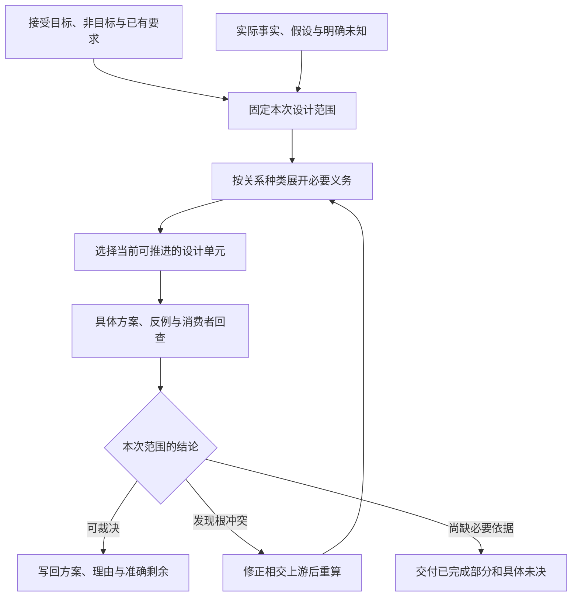
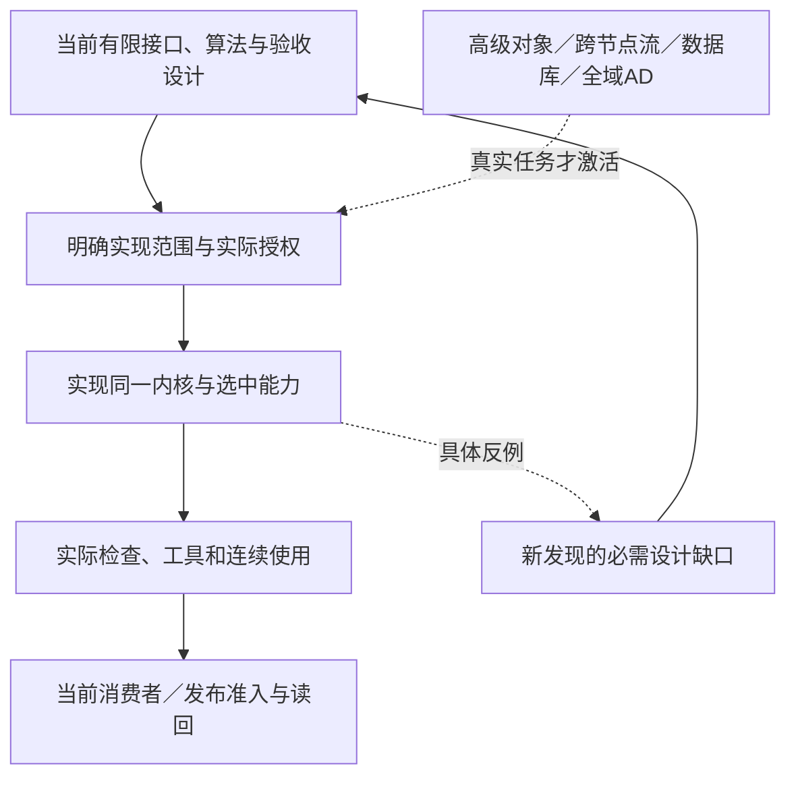

# 工程演进与实施设计

> **阅读范围**：采用范围内的设计规范；实现状态另查未决。

<details>
<summary>相关主题与上下文</summary>

- [全工程实现设计的接合单元与当前落位](#全工程实现设计的接合单元与当前落位)
- [当前作者核心交付包含需求关系与修改，不止语法补全](#当前作者核心交付包含需求关系与修改不止语法补全)
- [当前路线与整段成熟供给的采用边界](#当前路线与整段成熟供给的采用边界)
- [当前语言路线：结构作者与原生供给，按需扩目标](#当前语言路线结构作者与原生供给按需扩目标)
- [实现交付按同一主链闭合，不再先建设一套库生态](#实现交付按同一主链闭合不再先建设一套库生态)
- [问题优先级与当前可推进前沿](#问题优先级与当前可推进前沿)
- [安全工程、威胁建模、审计与响应](安全构建发布与环境.md#安全工程威胁建模审计与响应)
- [实现成熟度、证据与不可绕过门禁](#实现成熟度证据与不可绕过门禁)
- [工程工作编制与实现准入](#工程工作编制与实现准入)
- [当前仓库到目标系统的重构总图](仓库迁移与自托管.md#当前仓库到目标系统的重构总图)
- [性能测量、基线、剖析、预算与回归](安全构建发布与环境.md#性能测量基线剖析预算与回归)
- [持续集成、合并授权、主分支健康与发布](安全构建发布与环境.md#持续集成合并授权主分支健康与发布)
- [测试目录、责任元数据与验证动作编译](安全构建发布与环境.md#测试目录责任元数据与验证动作编译)
- [现有仓库迁移方法](仓库迁移与自托管.md#现有仓库迁移方法)
- [纵向切片与自举计划](仓库迁移与自托管.md#纵向切片与自举计划)
- [自托管、逐步接管与旧机制清零](仓库迁移与自托管.md#自托管逐步接管与旧机制清零)
- [设计闭包、冻结与未来义务](#设计闭包冻结与未来义务)
- [配置、密钥、环境与部署画像](安全构建发布与环境.md#配置密钥环境与部署画像)
- [错误码、接口模式与兼容策略](安全构建发布与环境.md#错误码接口模式与兼容策略)
- [验收门禁与证据计划](#验收门禁与证据计划)
- [从明确合同到实际交付的唯一接合](#从明确合同到实际交付的唯一接合)
- [旧来源归属的版本化适配](仓库迁移与自托管.md#旧来源归属的版本化适配)
- [状态领域的实施单元和下一设计选择](独立能力的实施单元.md#状态领域的实施单元和下一设计选择)
- [有限关系的实现交付顺序与当前设计边界](独立能力的实施单元.md#有限关系的实现交付顺序与当前设计边界)
- [有限对象、流与微分的当前采用边界](独立能力的实施单元.md#有限对象流与微分的当前采用边界)
- [当前主链的实施交付，不以主面重命名代替能力](#当前主链的实施交付不以主面重命名代替能力)
- [信息体系的实施接合而非新平台项目](独立能力的实施单元.md#信息体系的实施接合而非新平台项目)
- [有限完成协议的实施接合](独立能力的实施单元.md#有限完成协议的实施接合)
- [开发面优先的实施接合与验收出口](#开发面优先的实施接合与验收出口)
- [作者成果先行的相交实现单元](#作者成果先行的相交实现单元)
- [开发面优先的实施单元和验收次序](#开发面优先的实施单元和验收次序)
- [先实现最终需求作者源，而不是先把IDE工具全部做完](#先实现最终需求作者源而不是先把ide工具全部做完)

</details>

### 分题阅读

- [仓库迁移与自托管](仓库迁移与自托管.md)
- [安全构建发布与环境](安全构建发布与环境.md)
- [独立能力的实施单元](独立能力的实施单元.md)

<details>
<summary>本页内容</summary>

- [全工程实现设计的接合单元与当前落位](#全工程实现设计的接合单元与当前落位)
- [当前作者核心交付包含需求关系与修改，不止语法补全](#当前作者核心交付包含需求关系与修改不止语法补全)
- [当前路线与整段成熟供给的采用边界](#当前路线与整段成熟供给的采用边界)
- [当前语言路线：结构作者与原生供给，按需扩目标](#当前语言路线结构作者与原生供给按需扩目标)
- [实现交付按同一主链闭合，不再先建设一套库生态](#实现交付按同一主链闭合不再先建设一套库生态)
- [问题优先级与当前可推进前沿](#问题优先级与当前可推进前沿)
- [实现成熟度、证据与不可绕过门禁](#实现成熟度证据与不可绕过门禁)
- [工程工作编制与实现准入](#工程工作编制与实现准入)
- [设计闭包、冻结与未来义务](#设计闭包冻结与未来义务)
- [验收门禁与证据计划](#验收门禁与证据计划)
- [从明确合同到实际交付的唯一接合](#从明确合同到实际交付的唯一接合)
- [当前主链的实施交付，不以主面重命名代替能力](#当前主链的实施交付不以主面重命名代替能力)
- [开发面优先的实施接合与验收出口](#开发面优先的实施接合与验收出口)
- [作者成果先行的相交实现单元](#作者成果先行的相交实现单元)
- [开发面优先的实施单元和验收次序](#开发面优先的实施单元和验收次序)
- [先实现最终需求作者源，而不是先把IDE工具全部做完](#先实现最终需求作者源而不是先把ide工具全部做完)

</details>


当前全工程工作沿[成品总装](../../架构/协作与状态边界.md#whole-system-assembly)、[完整编译](../../编译/内核/领域方法与整体根.md#whole-project-compilation)及[多模块连续开发](../../../examples/连续开发/全工程连续开发.md#whole-engineering-development-fixture)推进。Code-OSS的[F0—F6](../../../examples/原生维护/Code-OSS搜索替换.md#implementation-frontier)只细化该真实原生工程的接入，不能固定全产品剩余工作的范围或先后。原生TS深维护、简洁作者、可靠回源和其他独立领域均保留；不另建可视化平台。

成品形态先由[总架构](../../架构/协作与状态边界.md)与[最终模块合同](../../架构/装配/模块与运行实例.md)确定。本章安排实现、采用、自举和特定历史迁移；不反向规定产品只能适应当前代码。实际运行步骤只在相应任务与权限成立时执行。


<a id="whole-project-delivery"></a>
## 全工程实现设计的接合单元与当前落位

当前设计已将以下相交空白落到原拥有者，实施时直接消费其接口/算法，不再首先输出同名总架构。每个单元的编码、接入、实测和正式采用仍分别完成；设计子范围明确并不表示全产品其余设计已经做完。

| 接合单元 | 具体设计输入与实现责任 | 必须同时交出的正向结果与失败出口 |
|---|---|---|
| Runtime与入口 | createRuntime/handle/close、实际HostPorts、固定EngineImage、连接/项目/任务/operation作用域 | 纯任务可零持久设施完成；两个客户端隔离；关闭不丢在途责任或杀借用资源 |
| 工程准备与解析 | projectView的W0—W6、项目出现、sourceScopes、解析域、原生/中立/生成来源 | 多项目同名不同版本正确，已有原生配置继续使用；未知覆盖不伪造不存在 |
| 全工程编译 | 原P0—P7、G0—G7、各类边、真实根和Needs | 单根与AND组准确完成；生成源返回原前端；严格环有种子则正常，无种子准确诊断 |
| 共享查询与请求返回 | 分阶段键、真实读集、返回代、Needs取得/无进展判定 | 减少相同计算但不串对象与权限；旧结果不覆盖新请求，取消不提前释放未停资源 |
| 产物与连续写回 | ArtifactSet角色、共同配置、B/D/X成员协调、受管草稿与回源 | 源/类型/资源/入口完整，未选旧根/人工文件保留；版本冲突有恢复而非覆盖 |
| 构建运行与有限调试 | 原compute-run加可选sec.debug-session/1、DebugDriver、暂停来源 | 能真实停/读/继续并改作者再运行；未协商能力不影响普通生成，不安全读取准确拒绝 |
| 全工程收益与采用 | 实际原生消费者或产品自用、准确实现前像、W案例与既有领域案例 | 从首次改变到第二次改变保留需求/资产；按真实成本比较，不以文档或图数代替效果 |

前五项是普通完整工程共享的实现接合；调试是需要该能力时必须闭合的独立分支，不成为每个纯函数的前置。已有小范本可验证独立算法，Code-OSS可验证真实宿主，成品自身多入口范本检验共同开发；三者不争夺“唯一全产品”身份。

实现顺序由硬依赖决定：先让真实作者/引用/固定输入可进入，再取得正确全量语义/单目标成员，然后将已有增量、并行、运行和恢复按声明范围接入。已存在的正确实现可以直接复用，不要求重写一遍或退回小玩具；缺性能数据时先保留正确较粗粒度路径，不为宣称全面而猜时间、吞吐和收益。


## 当前作者核心交付包含需求关系与修改，不止语法补全

TS深度工程读改、已有中立源生成和可靠回源的前沿不变。共同作者能力同时包括[跨软件意图合同](../../作者/组合/跨软件需求合同.md#cross-software-intent-contract)：固定对象/域，组合结果、保持和进展，匹配真实供给，形成已有候选差异，分别生成与执行。

本范围实现采用已经定下的[可落实计划](../../编译/实现选择与设计搜索.md#executable-intent-plan)、[整批物化](../../作者/组合/结构编辑与身份保持.md#whole-change-materialization)与[无循环调用资格封存](../../编译/内核/编译值服务.md#callable-effect-closure)：Requirement语义与检查方法分离；bind/compose给准确含义；plan给真实差异/供给或有限创作缺口；materialize按原/当前基础成组回写；短源类型、主体、效果闭合后按根生成。编译不重新解释自然语言，也不要求原作者补完整内部签名。以批量名称映射、当前结果发布与反向关系的有限合同检验共用结构、独立叶语义和第二次修改。它们是验收关系，不是三个必须发布的独立产品。

有准确源修改时可直走原链，无需每次建立完整需求图；新要求有准确定义与方法才走直接实例化，缺差额主体正常创作。先做一个只会定价或只会改数字的演示，不能关闭跨软件作者控制。仅完成该有限族也不宣称所有需求自动综合、所有目标满足或作者净成本已证实。

代码准入仍按原分层门槛，设计文件修改不授权实施。当前设计交付结束的是共同合同/接口/算法缺口，读取器、编辑器、方法实现和实际采用分别留为下一交付，不等待全部高级主题清零。


## 当前路线与整段成熟供给的采用边界

按[D02](../../决策/设计理由-目标与核心.md#d02-中立语义与可替换作者表示)实施可编译定义体系：一份作者源，合格成熟供给可直接绑定，独特主体可编译，额外领域方法按需。第一条产品交付同时检验“已有算法不需重写”和“没有官方封装的新算法仍可创作”，不是先移植一个SEC标准库全集。先实现已定结构读取与供给接合；可选有限计算语言只随明确方法需求启用，不把研究所有语言特性或自建前端作为前置。

现有多目标编译器与语言工作台属于真实整段替代，而非只能做追加插件。取得它的输入语义、目标、接口和维护条件后，按[供给替换](../../作者/组合/模块封装与复用库.md#替换整段编译供给的准确入口)判断直接复用、窄适配或继续现有方法。只知道项目名和支持列表不足以生成新的安装、迁写和发行义务。

当前没有切换到Fable、Haxe、MPS或Terra，没有新增作者SDK／统一VM实施线。可先按原有限前端与首目标合同开展获准工作；某段成熟供给确能减少总工作时替换该段，不要求先把已有工程全部转成另一种源。无实例、ABI或格式变动的内部替换不编造迁移任务；确有变化则不得省略。


<a id="language-roadmap"></a>
## 当前语言路线：结构作者与原生供给，按需扩目标

**当前实施前沿是结构作者直接绑定真实供给、形成TS目标及完成连续修改；TS/JS原文维护和受管回源是实际任务需要时的独立能力，不是新产品意图主面的前置。** 没有预定第二个完整目标语言，Java按已接受范围暂缓。C/Rust/Wasm等可作为当前真实热点的供给实现，按调用边界采用，不要求全工程换语言；出现某个名字也不会自动形成新后端工作项。

| 范围 | 当前处置 | 准确交付边界 |
|---|---|---|
| TS/JS原生工程 | 原生供给优先；原文深维护按所选任务实施 | 保留原文、配置、资产及真实语言语义，完成相交编辑；不自动恢复历史意图 |
| 结构定义到TS | 当前实施，不经过新文本语言 | 原生供给、必要适配、共同要求和目标成员；需要目标回源时保留准确映射 |
| 无来源源码的行为和抽象恢复 | 对当前实际输入按需分析 | 利用原生前端、合同和已知模式形成有依据的高层候选；不要求先建设通用机器码反编译器 |
| C、Rust及其他源语言/目标 | 未预定实施先后 | 有明确消费者后分别判断读取、调用、生成、往返、交付与维护；不将一种可调用ABI宣称成完整语言支持 |
| Java | 暂缓新增深化 | 已有正确条件例、规则和真实兼容责任保留，不是当前校准或验收前置 |

### 新供给只从实际缺口进入

采用本章W0—W7和既有实现解析，不另建技术评分平台。先写清新增交付要求：需要的是源码还是二进制、原有生态还是新算法、完整应用还是内核、哪些平台和资源、是否需要原文维护及回源。然后排除不满足硬要求的路线，在余下路线中比较实际适配、运行、调试、分发与长期维护成本。没有新的未满足要求时，结果就是沿当前路径工作，而不是自动增加第二目标。

| 已成立的新要求 | 必须比较的路线 | 不能跳过的判断 |
|---|---|---|
| 需要精确原生ABI或既有C/C++组件 | 成熟本机工具链、直接绑定、FFI、窄原生目标 | 容量、对齐、分配/释放、错误、回调及源码交付；不推定C天然更安全或更快 |
| 需要可控长期状态、并发或无GC资源边界 | 合格Rust/C++/其他原生供给及当前宿主可行实现 | 实际工具支持、所有权接口、跨边界复制和同步；不将Rust名称代替安全证明 |
| 已有专门数值/科学/媒体生态 | 原生态直接复用、离线转换、服务或原生桥等合法选项 | 数制、数据规模、传输、部署与许可；Python等宿主可能承载成熟原生内核，不按语言标签估速 |
| 要求隔离且只需可调用二进制 | Wasm或其他合格运行载体，以及本地隔离 | 可用系统接口、启动和调用成本；不冒称生成指定高级源码 |
| 大批量并行计算或设备实时约束 | 向量化、本机库、GPU/设备方法与现有实现 | 传输、内存、调度、同步、数值/期限与回收；不是见到大数组就采用GPU |
| 维护一个具体语言的存量工程 | 该语言成熟前端及精确编辑能力 | 原始配置、宏/生成物、未知保全；能调用该语言库不等于能维护其源 |

表中是触发条件与比较范围，不是新增实施队列。任务接受某条路线以后，固定其具体支持域、输入和验收；没有新反证就沿其绑定推进。窄C示例只说明[原生边界合同](../../运行/宿主生态与技术约束.md#native-kernel-boundary)怎样写完整，不能充当其自身的采用理由。

多语言的调用、源码维护、共同定义生成和带来源往返分别有价值与成本。原生维护任务追求准确的编辑深度；新产品先完成结构作者与真实供给，不把“任意反编译尚未完成”当作其它目标的前置。强逆向各自的可行性和默认路径由[恢复范围](../../开发/原生维护/导入观察与原生资产.md#recovery-purpose)承担。


## 实现交付按同一主链闭合，不再先建设一套库生态

当前有限本地产品以结构作者、原生供给、TS成品和连续消费闭环结束，不等待未选的计算文本前端或其它完整目标语言。获准编码时沿下列交付推进；设计任务仍只修改规范。成熟供给、自己的新主体和现有TS工程共同使用同一内容、候选、绑定与实际作用协议。

| 交付 | 实际产出 | 结束条件 |
|---|---|---|
| 1. 固定工程与真实读取 | 结构模块、真实TS/JS供给、配置、依赖、原始字节与覆盖；按实际角色形成ModuleRevision/ImportedModuleView | 缺输入、缺语义、缺环境分别返回；不执行模块或配置脚本来猜结构 |
| 2. 原作者源可靠修改 | 结构参数/主体/引用和原生语义安全修改；完整草稿、导入/公开路径及相交资产 | 无改动保字节；有改动保绑定与未改范围；失败草稿可继续 |
| 3. 简洁作者与需求计划共编译 | 固定结构要求与具体差异、准确绑定和读集；按供给合同取得类型/效果与调用资格，进入UseBinding及TS目标 | 原短源不扩写；相交共同约束不漏；缺主体/输入/效果分别定位；不建镜像算法或无用Host |
| 4. 受管目标编辑回源（相应任务启用） | EditCorrespondence、来源保留、generated-edit、三方合并与再生成；不是所有新产品必须从目标逆向开始 | [往返合同](../../编译/表示/编辑与受管回源.md#managed-edit-roundtrip)列明的正常操作都进入实际作者候选，不以所有操作“不支持”冒充安全 |
| 5. 完整工程运行和第二次修改 | 目标成员、构建/运行、当前前像、诊断、取消与资源结算 | 原作者、生成物、运行输入和检查不串代，代码与资源没有竞争写源 |
| 6. 消费者与恢复检验 | 同一工具的首次使用、目标修改、回源、再次运行、并发变化和来源缺失 | 按编辑类别公布有效范围与具体失败；取得真实成本，不凭目标数量结束 |

首读[结构化工作台](../../../examples/结构化工作台/README.md)和[同一行为的成品根](../../../examples/成品形态/README.md)，固定直接作者源和供给的真实差额。实现/原生维护任务再以[同一工程的联合变化](../../../examples/连续开发/全工程连续开发.md#integrated-graph-editor-example)检验跨模块共同约束，同时以[简洁需求开发](../../../examples/实现校准/简洁计算与TS往返.md#compact-author-example)验证实际作者负担；[TS工程的完整往返](../../../examples/实现校准/简洁计算与TS往返.md#ts-roundtrip-product-example)共同验证来源与持续修改。字节指纹的Node分支仍用于检验成熟供给不需重写；其中Java分支是明确选择双目标时的条件示例，不是当前门禁。

完成上述范围后从实际消费者和问题前沿选择下一交付，不自动开始C或Rust。窄原生例不占用排程席位；公共包市场、统一VM、远程编译、多租户和数据库同样只在实际需求下激活。

### 简洁主面不是实现之后的可选整理

当前代码准入已有：结构字段、参数/主体、条件与公开边界、固定绑定、HeaderSeed/ClosedHeaders、可消费根和准确错误。原生内部类型/控制交成熟工具；有限签名、lambda和计算文本文法仅在选定画像中适用。共用原编译接口，不让作者填满派生字段或实现一门新语言才通过。

先实现直接复用与两文件参数化需求，随后扩展实际需要的原生供给与已选计算方法；没有新关键词需求不建设扩展平台。宣布此有限产品可用前，必须完成首次读取、参数改变、歧义注解、上游合同变化、目标编辑回源与短源保存。运行速度/模型用量尚需真实任务测量，不以缺测量取消当前设计选择，也不把纸面短源码叫作已证净收益。

更广对象、流、设备、其他语言的独立欠账保留，不阻塞这个同域作者闭环。核心简洁性如果再次只能靠隐藏长源或额外JSON实现，应修改这一范围的源表面/补全规则，不能将它延期为视觉界面工作。


## 问题优先级与当前可推进前沿

当前采用[作者基线](../../作者/可替换表示与适用范围.md#当前作者面实施基线与决策状态)：新产品意图/Block由分片JSON直接进入同一编译链；明确选择的计算源与原生资产保留，不交付嵌套作者SDK。广义小工具、业务和复杂算法共用成品职责；数据库/中间件内部深化是否暂缓按具体任务，外部合同及已发生作用的责任不撤销。

当前规划先区分三种真实交付：尚缺算法/接口的事项继续设计；已有完整规格的事项进入实现与符合性；真实环境与收益通过对应运行取得。设计任务只推进第一类及必要的规范维护，不通过改名把它自动变成产品编码。技术比较线索不增加实施项。

下一设计交付由问题条目的实际剩余决定。有限私有函数抽取/内联已由[语义编辑](../../作者/组合/结构编辑与身份保持.md#私有函数抽取与局部内联)给出；有限对象、流和AD已有独立规范，下一步区分其实现/符合性与尚未纳入的高级子域。没有新反例，不重开已经选定的公共架构。

本节拥有**设计与工程工作的选择算法**。[自主发现](../工程挑战与覆盖边界.md#目标到义务的自主发现主循环)负责产生和攻击义务；[问题主登记](../../状态/前沿与登记规则.md#目标到问题的总览)保存实际目标、问题、相交依赖和当前规划属性。编译期间调度已经固定的查询/动作，由[编译调度](../../编译/递归并行与远程编译.md)负责。产品规划、编译动作和目标程序运行不能共享一个含义不明的priority。

### 先拆开必要性重要性紧迫性与优先级

**必要性**说明某项义务为什么进入所选目标：不可绕过的语义/安全前提、所选方案引出的实现义务、可替代方案之一、可选改进，或没有已确认消费者。一个具体组件不是目标本身；存在合格更小替代时，不能把原组件标成永远必须。

**重要性**描述遗漏或错误的后果：会改变哪个结果，影响哪些主体与范围，是否泄露或破坏内容，是否能恢复，以及发现时已经投入多少相交成本。后果可以很严重却暂未激活；远程数据泄露在选择远程执行时是硬边界，不使完全离线的纯生成必须先建远程身份平台。

**紧迫性**来自真实期限、正在累积的损害、不可逆点和延期成本。没有日期就不捏造截止期；未来可能很重要不等于现在发生事故。

**就绪度**回答本次允许的动作能否推进：完整设计可能只需要已有材料，而修改仓库还需要当前前像与另行授权。缺运行结果通常不阻止给出设计方案；设计尚未说明类型或错误，则不能把它伪装成纯实现问题。

**不确定性与工作量**分别记录。未知不是零风险、无穷困难或无收益。没有可靠工时就记录需先决定的变量和下一份可交付内容，不用任意小时、百分数或1至10打分制造精确感。

**优先级**是本次范围下，综合上述事实、前置关系与机会成本形成的工作顺序，不是问题永久属性。优先级可以降低，但问题和其真实必要性继续存在。

### W0至W7：从问题全集得到当前可执行选择

W编号只定位工作规划；编译章的P0—P7仍专指产品编译阶段，二者不混用对象。

**W0 固定当前目的与约束。** 确定本次只设计、允许实施、允许检查还是实际恢复；读入已接受目标、当前问题和本次新事实。仅有假设事故时做情景设计，不按正在发生的事故抢占。实际已发生且仍有不可逆后果的作用，先按其真实权威与恢复合同处理。

**W1 激活义务。** 从本次选中的结果根，沿必须共同满足的AND关系展开；OR关系保留合格替代，不同时要求完成所有备选；条件关系先检查条件；未来可选能力保留问题但不进入本次阻塞集合。禁止项是过滤条件，不因看起来成本更低而进入备用路线。

**W2 检查前置与共同设计。** 只有“这份交付在逻辑上必须先使用那个结果”才建立硬前置。共同讨论的接口与实现方案采用协同组，不强制先后；生产者/消费者、验证、冲突、失效和历史来源分别有型。硬前置形成环时，先检查是不是误把协同当顺序；真实联合问题建立一个可裁决的工作组，不能任意打断一条依赖来画成DAG。

**W3 计算当前工作前沿。** 取当前目的允许、所需事实可以取得、必要前置已满足或可以在同组完成的交付。只设计时，前沿可以包含协议、算法、反例与迁移选择，不包含未经授权的程序执行。阻塞项保留缺的具体输入、取得责任和允许独立继续的子域；不得因为某个问题没有完整方案就从表里删除。

**W4 排当前设计档位。** D0处理会使本次既有目标/公共含义/作用安全错误，或者使大量下一步建立在错误基础上的设计；D1处理已经选定范围中的具体能力闭合与真实消费者；D2处理有条件的后续画像、增强与优化设计。这里是设计工作顺序，不是漏洞严重性评级。强实时、远程或多租户一旦成为本次硬要求，其相交D2义务随激活进入必要前沿。

**W5 在同档内作明确选择。** 先解除当前真实阻塞和会使后续返工的决定，再完成能让整条路径成立的缺口。比较实际解锁的交付和能否用一项有限阅读或设计区分最强备选。存在已接受期限时计入延期；不存在可比较成本时，采用稳定的发现顺序/问题编号作为最后平局规则，并写明没有最优性证据。原本相交的父项需要某个较低档前置时，只提升那项必需子交付，不把整个主题宇宙一起提升。

**W6 执行一份闭合交付。** 工作包写明当前输入、要作出的决定、所属规范、相交消费者、成功路径、失败分支和可检查的结束条件。一个工作包可以解决多个协同问题，也可以只关闭一个大问题的明确子范围。不能为了多报完成项，把一份必须共同成立的合同按段落拆开；也不能让一个题为“完成所有语言”的任务永久吞掉所有进展。

**W7 重新计算而非机械下移一行。** 完成后更新真实决定、未决和依赖；发现新根前提就回到相应上游，扩展影响；已有方案仍成立就直接沿用。下一项从新的就绪前沿选，未激活的严重问题不被伪称已解决。相同主题在没有新材料和反例时不再无限重审；无实际进展的重复迭代必须改换取得信息的方法或准确结束当前路径。

算法产出是一份**本次选择与理由**，不是一份新的永久产品账本。完整问题内容在主登记，当前工作包引用它；改变顺序不改需求含义。未进行代价测量时，只给条件性的当前排序，不给“重要度87%”或假精确总分。

### 当前总表怎样阅读与何时更新

[总览](../../状态/前沿与登记规则.md#目标到问题的总览)由当前12个目标和当前全部U记录的对应关系形成；[总表](../../状态/前沿与登记规则.md#全部问题排程总表)显示目标、必要性/激活及设计档位；遗漏后果、关系、下一份交付和完整方案只在对应条目保存一次。索引由对应条目派生，不能手工改一个表而不改真实记录。

第一次读可以看到全景；具体工作只读取根、相交问题、规范及反例。没有要求每个AI请求发送整份问题记录，更不因为以后问题增多就增加工具表或作者字段。新增项目、语言、画像或真实事故会增加对应义务；问题总数没有固定上限，但新增要有可定位的独立需求、机制、反例或决定价值。

当前D档记录只表明需要优先处理的**设计范围**。它不代表整条U问题仍然完全无方案，也不代表已经实现的软件存在漏洞。U056／U057的发现与规划协议已定义；其实际自动装载、映射质量、长期消重和运行工具支持继续开放。U058—U064同样是已定调度方案及尚需落实的支持范围，不得以“文档已写”关闭实现与性能。


### 当前首先推进的具体交付组

下面是当前已知资料下的工作前沿，不是五项永不改变的产品阶段。相交设计可以同组裁决；具体实现需明确代码范围与授权，修改现有资产时读取其当前内容和消费者，独立新模块不先做无关迁移。已定范围直接进入相应获准实现，不以所有未来问题清零为条件。

| 工作组 | 要形成的完整交付 | 为什么在这里 | 关联问题及顺序 |
|---|---|---|---|
| 作者与基础合同 | 对已声明支持的一个库/模块，固定文本与结构可表达范围、公开类型与契约、库导入、草稿和正常错误；每种操作给完整输入/输出 | 这是后端和AI操作共同消费的含义，错误会复制到后续实现 | U001/U006/U008/U009/U033/U034/U037/U049/U051协同；先解决缺定义的合同，不为保住旧关键词数删必要能力 |
| 意图与控制接合 | 用同一作者内容承载当前意图、继承规则、局部覆盖和未决；给管脚/源码相同变化与后端控制的完整例 | 避免高层名称和低层行为脱节，也避免让AI手填推导 | U002/U004/U010/U031/U042/U046/U047/U050/U052；与上一组共享正式定义而不重复编写 |
| 一条完整生成与连续变化 | 声明链接、表示保持、原生/目标边界、文件与资源、稳定布局、错误定位及第二次修改连成一条真实产品路径 | 不让解析器、库、工具分别成功却没有实际使用闭环 | U012/U013/U014/U028/U032/U043/U053；先正确顺序版，U058—U064按实际并行/远程选择激活 |
| 首个真实消费者与自用 | 固定真实消费者合同，完成封装替换与后续修改；比较同等保证的原生基线；SEC自身选一个可隔离单元自用 | 验证作者负担、库演进和架构边界，而不是只累积示例 | U019/U035/U036/U037；读当前源码属于实施前事实，不借设计任务运行消费者 |
| 条件增强与高层画像 | 由所选真实目标触发对象、层级状态、关系、流/实时、微分以及权限/发布/恢复的完整合同 | 保留全产品覆盖，但不把所有未来能力并入当前简单编译前置 | U015—U024/U025/U027/U030/U038—U041以及远程义务；按激活和前置晋级，不按主题知名度 |

当前文本/结构体、局部修改、私有抽取与CST回写已有具体规则；实现按既定读取器、共同检查与目标接口进行，不重新以SDK作为备选队列。当前只设计时，继续从条目中真正缺少的高级子域、实现接缝或新根反例形成下一完整合同，不重复起草已有有限对象/流/AD接口；历史版本的进展不另作一套当前路线。

如果任务明确要求有状态服务，其实际外部合同及相交作用义务立即进入当前交付；内部深化按本次范围安排，不等待“计算库成功以后才准设计”，也不要求先实现全部中间件。如果当前任务是图像算法，身份平台和Outbox保持未激活。产品目标不由本表最新一个案例改写。

### 一个从目标到排程的可复查例

以下是**另行明确选择双目标时**的排程反例，不是当前路线前置：AI对一个两模块中立库作局部修改；生成TS与Java两套源码和一个包含图标的发行候选；公共接口保持；不联网，不写真实工作树。

从目标得到AND义务：源解释、跨模块绑定、公开合同、两个目标映射、资产存在与成员闭包、稳定布局和准确返回。目标执行方式有OR备选：顺序本地、并行本地，以及只有取得相应新授权才可考虑的远程；当前禁止网络使远程不进入本次候选。无需账户数据库、生产部署和消息投递。

首先补共同模块的类型与语言映射缺项，然后TS和Java后端/图标观察在输入齐全后可以独立推进；完整发行必须等所需三份结果。只完成TS时，可以发布准确标注的TS独立结果，但不把全发行标成完成。新增一个事务画像不进入本次闭包；图标确实缺失却不能以“它不是源码”从发行义务里删除。

发生一个问题时先定位责任：Java类型映射缺项修后端合同；AI没有说明要改变公共接口则保留原接口；不支持并行时采用正确串行；没有布局基础时不能声称历史结构保持。这样产生实际先后与可并行工作，而不是把全部U编号排序后机械逐个解决。

### 如何避免发现与管理本身吞掉产品

每轮至少形成一项明确设计决定或一个精确缺口及取得办法；仅将问题换标题、增加总纲、重复搜索同一稳定命题不算进展。这个要求不强制捏造新问题：发现的变化只有同义重复时，应交付已复用依据和当前没有新独立结论的范围。

反例检查由同一模型也可以承担，但不得声称获得了独立人员或独立实现验证。任务分工可以分别从成功轨迹、失败条件、最小替代和消费者倒推，再核对交叉结果。真正需要独立证据时保持那项义务，不用给一个角色起名“审计员”代替。

发现器、问题表和排程都只拥有自己的知识与工作状态，不能自动扩大实现、执行、发布或数据访问权限。明确的设计续作请求足以授权继续文档设计；是否运行目标、安装工具和修改仓库仍依其真实边界。新结果写回当前包，使下一次任务可以读取；没有实际后台执行能力时，不承诺会话结束后持续工作。


- [安全工程、威胁建模、审计与响应](安全构建发布与环境.md#安全工程威胁建模审计与响应)
- [实现成熟度、证据与不可绕过门禁](#实现成熟度证据与不可绕过门禁)
- [工程工作编制与实现准入](#工程工作编制与实现准入)
- [当前仓库到目标系统的重构总图](仓库迁移与自托管.md#当前仓库到目标系统的重构总图)
- [性能测量、基线、剖析、预算与回归](安全构建发布与环境.md#性能测量基线剖析预算与回归)
- [持续集成、合并授权、主分支健康与发布](安全构建发布与环境.md#持续集成合并授权主分支健康与发布)
- [测试目录、责任元数据与验证动作编译](安全构建发布与环境.md#测试目录责任元数据与验证动作编译)
- [现有仓库迁移方法](仓库迁移与自托管.md#现有仓库迁移方法)
- [纵向切片与自举计划](仓库迁移与自托管.md#纵向切片与自举计划)
- [自托管、逐步接管与旧机制清零](仓库迁移与自托管.md#自托管逐步接管与旧机制清零)
- [设计闭包、冻结与未来义务](#设计闭包冻结与未来义务)
- [配置、密钥、环境与部署画像](安全构建发布与环境.md#配置密钥环境与部署画像)
- [错误码、接口模式与兼容策略](安全构建发布与环境.md#错误码接口模式与兼容策略)
- [验收门禁与证据计划](#验收门禁与证据计划)


## 实现成熟度、证据与不可绕过门禁

本节区分设计依据、实现依据和实际采用，不另设一条每项工作都必须到部署的状态机。[准入与完成](#验收门禁与证据计划)唯一规定本次采用的条件。普通解析器的编码可以依据已定接口和验收设计开始，不先取得尚不存在的程序通过记录。

高价值要求追踪到其设计拥有者、实际接口和消费者；开始编码后再关联实现符号与检查结果。只有要求涉及真实安全边界、旧消费者替换或部署时，才继续关联强制机制、迁移与读回。未相交不是一条失败状态，更不能伪造Evidence来补齐固定链。

候选可以按已接受的验证方法自测、修错，不能靠修改原要求、验收期望或授权根取得通过。独立复核只在真实声明和政策要求时启用。主分支写入、合并、发布和目标部署分别有当前准入，设计选择不自动授权这些动作。真实旁路、新旧解释冲突或依据失效只撤销相交资格，历史事实不被改写。


## 工程工作编制与实现准入

### 工作描述跟随目的，不强迫每项任务进入生产流水线

工作描述是当前任务的可执行投影，不是第二套需求源，也不是所有任务都要填满的工作流表单。它引用任务目的、所选设计、真实输入、范围、预算和完成条件；独有的实现前像、迁移、效果、验证、恢复字段仅在相应动作需要时存在。

只设计时，输入可以是需求、现有设计与显式假设，输出为设计及理由；不伪造尚未读取的生产仓库修订。要修改实际源码，才要求精确仓库或缓冲区观察、可定位写集和当前能力。需要写入共享模型、交付、迁移或部署，再分别增加其不变量和前后像。设计文档本身不是这些动作的授权。

### 从要求得到工作范围

先按[目标到义务的主循环](../工程挑战与覆盖边界.md#目标到义务的自主发现主循环)还原本次要改变的行为或资料，再查询相应语义责任、实际实现绑定、物理位置、消费者和验收。文件名不单独决定责任；没有可靠细粒度映射时，以较大区域保守协调，不假称可以对任意 AST 节点安全并发。

只有会影响所请求结果的条件才进入工作前置。尚无迁移、不产生外部效果的纯设计任务，不应被要求提供生产恢复通道。新建工程没有现存权威前像时，记录目标不存在和新建范围即可；不能为了沿用一个公式先创造虚假仓库。

实现准入同时检查本次目的允许实现、当前输入适用、读写范围明确、必要约束和效果合法、资源可用、适用验收与恢复已安排。缺项指出受影响动作，不把全项目标成禁止。查询或生成候选可先返回部分结果；不把未知当作无影响。

### 并行、子任务与重规划

任务依赖、语义共享不变量、物理冲突、环境占用和原子提交组分别建模。不同文件可能因同一数据库约束冲突；同一文件的精确独立区域在宿主支持时也可组合。只读分析、候选实现、独立复核和实际外部操作使用不同委派权限。

子任务不能扩大目的、数据范围或工具能力。它可以在上级明确委派的设计自由度内决定实现细节；不能一概禁止任何新设计选择，也不能自己修改上级验收、签发权限或替换可信验证规则。独立复核者不能偷偷修改被审对象，建议作为另一个候选返回。

基础内容、需求或证据变化时，仅重新规划受影响范围。重规划产生新候选和新的适用性检查；不会把一次重试变成无限加大预算，也不会因无关变化无条件丢弃所有已得结果。并行执行中发现共享不变量，先停止相应冲突动作并协调，不通过最后写入者覆盖。

### 按任务结束，不按默认分支结束

| 请求目的 | 可以完成的条件 | 不自动要求 |
|---|---|---|
| 审查 | 交付有依据的问题、裁决和未知范围 | 编写修复、创建 PR |
| 设计 | 所要求的语义、接口、例外、理由与操作逻辑已写入指定文档；冲突已解释 | 创建参考项目、执行构建、合并 main |
| 生成候选 | 指定输入下生成了可辨识候选及未决项 | 采纳设计、覆盖工作树 |
| 实现候选 | 实际改动与目标一致，完成被要求的检查或明确未完成项 | 合并主分支、发布、删除全部临时历史 |
| 整合到指定分支 | 相关候选、主分支前像、合并结果与适用检查成立 | 上线或受监管认证 |
| 发布或恢复 | 所要求环境中实际作用已结算，未决或不可逆状态说明清楚 | 其他环境同时完成 |

“Agent 返回了”不是自动完成；但当用户确实只要求设计文档时，文档和必要审查交付就可以完成。不能为了否定空泛完成声明，反过来要求每个任务一直运行到 main 健康、部署和旧系统退役。

### 失败与恢复

仓库前像变化时重观测；设计假设被反例推翻时修改对应设计；候选错误时重新设计或实现；验证工具本身错误时修复工具而不是放宽验收；写集冲突时分组或串行；资源不足时在既定范围内缩小工作、释放资源或报告缺口。实际效果不确定时按目标合同选择查询，或在真实同键去重保证下重试原操作；两者都没有时保留未结算状态。不能用重新运行整项需求替代恢复原意图。

临时分支、环境、凭证和资源按明确所有权处理。长期适配器可以长期保留；本次确实替换的旧消费者才有相应退出条件。为了宣称“清零”删除仍在使用的资产，属于破坏而不是优化。

### 实施时才需要的真实映射

在得到实施授权并取得当前仓库后，建立目标责任与实际符号、消费者和测试的对应，区分缺项、冲突、冗余和未知。不要按文档目录先创建大量空文件；也不要把旧独立原型原样塞进生产仓库。选一个实际消费者完成纵向变化，是实施策略，不是设计任务必须偷偷实现的义务。

验收设计包括范围升级拒绝、未读输入不作缺失、并行共享约束、前像变化、同操作重试、工具与验收分离、取消后真实效果、任务只设计的正常结束和当前权限撤销。具体状态和动作接口见[操作语义接口与批处理](../../开发/工具协议/六工具与请求.md)。


## 设计闭包、冻结与未来义务

### 1. 设计闭包的意义

工程设计不需要在实施前回答整个未来，但必须对即将实现的影响闭包给出足够完整的合同。设计闭包回答：哪些问题已经具有可实施答案，哪些问题仍未知，未知是否会改变本次实现，以及未来发现新事实时如何局部回退。

### 2. 闭包对象

```ts
interface DesignClosure {
  readonly targetScope: ScopeRef;
  readonly acceptedGoals: readonly GoalRef[];
  readonly nonGoals: readonly GoalRef[];
  readonly normativeDefinitions: readonly DefinitionRef[];
  readonly constraints: readonly ConstraintRef[];
  readonly decisions: readonly DecisionRef[];
  readonly boundaryContracts: readonly ContractRef[];
  readonly failureModels: readonly FailureModelRef[];
  readonly migrationObligations: readonly MigrationRef[];
  readonly verificationObligations: readonly ClaimRef[];
  readonly assumptions: readonly AssumptionRef[];
  readonly unknowns: readonly KnowledgeGapRef[];
  readonly futureObligations: readonly FutureObligationRef[];
  readonly dependencyClosure: DependencyClosureRef;
}
```

闭包不是“文档写完”。机器检查已声明的有限合同、依赖和义务是否闭合；它不判断所有自然语言需求是否完整，也不能从缺少生产证据推出设计不可继续。冻结必须注明针对哪个动作和哪类声明。

### 3. 闭包维度

每个准备实施的范围至少检查：

- 语义：对象、关系、状态和不变量；
- 责任：谁定义、谁决定、谁实现、谁验证；
- 接口：输入、输出、版本、错误和取消；
- 数据：身份、持久化、模式、迁移、保留和删除；
- 效果：物理写入、网络、进程、秘密和外部系统；
- 权限：签发、委派、撤销和读回；
- 资源：预算、背压、结算和恢复余量；
- 并发：冲突域、原子性、顺序和围栏；
- 故障：失败、部分完成、不确定完成和恢复；
- 兼容：当前消费者、双版本和退役；
- 验证：声明、方法、环境、证据和独立性；
- 局部性：实际输入、反向依赖和失效边界。

### 4. 知识缺口分型

缺口的**原因、对当前动作的影响、处理时点和解决状态**是四个不同维度。将延期、阻塞和缺依据放进同一个互斥状态，会把无需与未做、局部缺口与全局不可用混淆。本设计按实际使用点分别记录：

| 维度 | 允许内容 | 正常处理 |
|---|---|---|
| 缺什么 | 观察、语义决定、算法/接口规格、实现、目标能力、权限、方法/证据、采用收益 | 对应责任域取得信息、作决定、设计或实现，不用一个unknown吞掉 |
| 影响哪里 | 当前输出/动作及所需前提、可用替代、已闭合范围 | 只限制必需依赖；共享不变量的真实组仍共同处理 |
| 何时处理 | 当前必须、已批准延期及触发、未来范围、已证明不适用 | 延期保持存在；不适用需要明确条件，不能由未运行推导 |
| 已做到哪步 | 待分析、方案未定、有限方案已定、实现未核验、待相应验证、限定范围关闭 | 状态不互相代签；设计写完不变成已部署 |

这些信息是现有工作描述和问题引用的投影，不要求每个表达式实例化四个状态对象。当前全产品已知问题由[主登记](../../状态/前沿与登记规则.md#已知问题主登记)保存；运行任务只取相交子集。

观察缺口有权可读则采集，不可读时保留明确假设/条件路径，不把假设记作事实。决定缺口先确认是否真的存在未委派行为差异；多个合法实现本来可以由策略选择。缺算法或接口时继续设计输入、状态、步骤、资源和验收，尚无完整方案也必须保持记录。研究可行性不明时提出有限可检验方案，而不把取得运行证据当成默认写产品的授权。

合法替代或已闭合独立根可以继续；原任务必要条件没有满足且无替代时，保留所影响动作的明确缺项。问题延期不改变其严重性，纯设计完成也不要求提前拥有将来所有实际环境。

### 5. 安全工作前沿

具体选择算法由本章[问题优先级与当前可推进前沿](#问题优先级与当前可推进前沿)统一拥有；本节限定设计闭包的动作资格，不再维护第二份排程。

对动作a收集其真实必需前提P(a)，按当前范围、版本和信任判断是否已有材料或可用替代。设计草稿需要实际任务和可用资料，不以产品运行证据为前置；实现需要实现授权和真实源码范围；实验需要实验本身的隔离、资源与许可，不需要先有实验成功；发布需要真实当前资格和目标；结算需要已发生操作的原意图与读回材料。

缺现场延迟数据可阻止硬实时保证，不阻止设计调度器、离线生成和有权仿真。缺仓库revision可阻止直接写仓库，不阻止完成设计；范围适合且另有实施授权后才进入实际程序修改。非相交实现切片可以继续，但当前只设计请求不因此自动取得实施权。分析、观察、接口候选与故障设计按自己的真实前提完成，未知不被替换为无来源默认。

### 6. 未来义务

```ts
interface FutureObligation {
  readonly obligationId: ObligationId;
  readonly trigger: TriggerExpression;
  readonly affectedScopes: readonly ScopeRef[];
  readonly requiredDecisionOrEvidence: RequirementRef;
  readonly defaultSafeBehavior: SafeBehavior;
  readonly owner: AuthorityRef;
  readonly deadlinePolicy?: DeadlinePolicyRef;
  readonly retirementCondition: PredicateRef;
}
```

典型未来义务：

- 在持久化或跨边界交换出现时即明确协议版本；第二个外部消费者不是开始版本化的前提；
- 首次支持离线节点时补充撤销同步；
- 首次增加第二后端时启用跨后端符合性套件；
- 数据规模超过单机上限时重新评估分片；
- 高风险效果首次启用时检查该范围已采纳的职责分离政策；确实要求两个独立有权角色时分别批准，不把所有高风险工作硬编码为两个人点击；
- 某 Provider 失去维护时启动替代迁移。

未来义务必须由真实触发条件激活，不能成为无限期拖延当前必要设计的借口。

### 7. 设计冻结

```ts
interface DesignFreezeReceipt {
  readonly candidateRef: DesignCandidateRef;
  readonly closureRef: DesignClosureRef;
  readonly targetScope: ScopeRef;
  readonly acceptedConstraints: readonly ConstraintRef[];
  readonly acceptedDecisions: readonly DecisionRef[];
  readonly boundedUnknowns: readonly KnowledgeGapRef[];
  readonly futureObligations: readonly FutureObligationRef[];
  readonly rejectedAlternatives: readonly RejectedCandidateRef[];
  readonly requiredImplementationEvidence: readonly ClaimRef[];
  readonly authoritySignatures?: readonly AuthoritySignature[];
  readonly expiresOnChange: readonly InvalidationRule[];
}
```

冻结表示设计输入和选择足以进入指定范围的实现工作，而不是需要运行编译器再次挑选作者语言。小型设计可用本版规范、明确范围和理由记录这一决定；上述回执只是将来确有机读审查需要时的内部投影。可选authoritySignatures仅在实际政策要求签名时填写；字段名不产生授权，当前文档不伪造签名。它不意味着：

- 所有未知都消失；
- 实现已完成；
- 测试已通过；
- 运行风险为零；
- 未来不能修订设计。

### 8. 局部冻结

冻结应按稳定责任和影响闭包进行，而不是冻结整个系统：

```text
Freeze(scope A)
≠ Freeze(all SEC)
```

局部冻结需要：

- A 的边界接口稳定；
- A 所依赖的上游合同已冻结或版本化；
- A 对下游暴露的契约明确；
- A 内部未知不会泄漏到边界；
- A 的实现和验证义务可枚举。

邻域之外的设计继续演进，不应使 A 自动解冻。

### 9. 解冻和回退

以下变化使相交的选择或资格记录需要重新检查；运行权限的变化本身不使无关语言规格变义，也不改写历史事实：

- 目标或非目标改变；
- 根约束改变；
- 新事实推翻关键假设；
- 权限或安全边界改变；
- 目标平台表达能力改变；
- 组合反例发现边界合同不闭合；
- 实现试验证明候选不可行；
- 当前方法不足以满足该范围真正要求的关键声明，且没有已经接受的替代方法；
- 迁移或退役不可实现。

回退必须定位到最早受影响阶段：

```text
事实错误 → 重新观测
语义错误 → 重建 SemanticIR
设计约束错误 → 重做 DesignIR
候选不可用 → 重新解析实现
后端表达失败 → 调整 TargetProfile 或 lowering
验证不足 → 重编 VerificationIR
```

禁止仅在下游追加例外维持已被推翻的冻结。

### 设计闭包编译



这是有预算的设计工作流程。写回规范即可完成设计交付；实现、运行或发布须有独立授权，不以冻结回执、签名或已画出下一阶段取得。

### 10. 闭包算法

```text
seed = requested implementation scope
closure = transitive dependencies by typed relation
for each node in closure:
  identify the relevant responsibility, content/version and contract
  require persistent global identity only at actual shared or effect boundaries
  collect constraints, failures, effects, resources and claims
  classify unknowns
  propagate blocking gaps by relation semantics
  generate boundary obligations
return Closed | PartiallyClosed | Blocked
```

闭包计算必须输出解释：哪个对象因哪条关系被纳入，哪个缺口阻止了哪项工作。

### 11. 设计审查

冻结前进行两类独立攻击：

#### 11.1 结构攻击

- 是否有第二规范 owner；
- 是否把物理位置当身份；
- 是否有无类型依赖；
- 是否遗漏边界输入输出；
- 是否把合法程序递归、静态固定点与等待死锁混同；要求结束的阶段是否具有预算或可兑现进展条件；
- 是否将运行状态放入稳定设计身份。

#### 11.2 情景攻击

- 高并发；
- 资源耗尽；
- Provider 消失；
- 权限撤销；
- 网络分区；
- 部分提交；
- 旧消费者存在；
- 不完整源码观测；
- 恶意输入；
- 恢复环境不可信。

攻击产生根级反证时必须回到上游重算。

### 12. 验收条件

- 实施范围及必要依赖可由已有规范和实际接口定位；系统具备机读能力时由这些内容派生闭包，不要求先实现闭包平台才准实施；
- 每个缺口完成分型；
- 阻断只传播到受影响范围；
- 未来义务有真实触发器和安全默认行为；
- 选择记录绑定实际范围与内容；采用机读回执时，同样绑定exact candidate，不为普通设计强制创建第二记录；
- 设计变化能使相关冻结局部陈旧；
- 反例能触发正确阶段回退；
- 设计冻结与实现、验证、部署状态分离；
- 所有边界义务都能降低为实现需求和验证声明。

### 13. 缺口的可执行闭环

每个当前缺口都输出：默认候选、适用假设、被阻断的动作、仍可执行的动作、证据生产任务、独立验收方式、失败回退和重开条件。状态不只是“待证据”；具体交换计划和无自证环检查见[证据缺口驱动的设计与取证闭环](../../运行/保证/要求证据与裁决.md#证据缺口驱动的设计与取证闭环)。物理映射已经给出四类默认实现，见[物理实现画像与可逆落位方案](../../架构/装配/模块与运行实例.md#物理实现画像与可逆落位方案)，不得把等待生产测量当成不写接口和恢复方案的理由。

当前设计默认给出一个可供实施的选择及明确假设，不把假设伪装成已取得的环境事实。确有机读回执时记录该选择的相关假设revision、替代分支与触发器；只有关键条件尚不能选择且没有已授权默认时，才保留相交备选和具体待决。非相交的作者基线继续有效，执行权限仍在实际宿主独立取得。


## 验收门禁与证据计划

本节是**何时结束设计、开始代码、声明可用以及采用运行**的唯一判据。接口、方法、错误分支、替代和反例由其规范拥有；此处按当前范围选择它们，不再复制完整字段或按问题数量清零。

### 1. 三个不同的完成边界

| 边界 | 进入前必须成立 | 不作为这一边界的通用前置 |
|---|---|---|
| 相应代码可以开始实现 | 明确的已接受目标；所选作者形式和固定含义；数据/接口/所有者；可执行的正常、失败和结束算法；一份可独立核对的验收设计；本次代码权限 | 产品运行已通过、所有高级领域、正式发布签名、数据库、多租户、迁移、生产部署读回 |
| 有限本地产品可以声明可用 | 承诺构造有实际实现；解析/编辑/生成/构建/运行的相交链闭合；真实输入、目标和结果对应；未支持范围准确返回；所需检查已执行 | 未承诺的全部语言与库、云服务、任意实时、全部性能优越性、完整自编译 |
| 真实消费者可以采用或发布 | 上一层所需资格；实际环境/权限/依赖；这次读写或发布的前像；旧消费者、数据、在途操作的相交兼容/恢复；实际作用后的必要读回 | 与此次目标无关的服务、状态或审计设施；任意人的默认审批 |

三者不是一个统一Gate，也不是每项修改必须依次重复。纯内存读取到自己的结果就结束；只有实际写入工作区才取得该工作区前像；全新独立模块没有待迁数据，就不编造迁移任务。修改现有代码时当然先读取其真实内容和消费者，但这不成为最终架构本身存在的前提。

### 2. 当前已经确定的实施输入

| 项目 | 当前采用 | 对应尚待取得的结果 |
|---|---|---|
| 共同内核 | 固定SourceBlob/ModuleRevision、声明先行、类型与效果工作表、契约入口、按根结果 | 实际parser/checker与符合性；不是重新决定基础架构 |
| 作者面 | `.sec`与已有结构编辑；新工程一次绑定基础＋有限局部控制＋对象组合；不实现嵌套作者SDK | 有限读取/编辑处理器，精确语言内容与工具版本 |
| 对象 | 现有类表面、单父链和接口；确定初始化、槽合同与before前态捕获 | 对象检查和目标实现；完整反射、多实现继承等不在本有限承诺 |
| 首个目标与宿主 | 合格TS工具族、封闭Host、确定输出；默认本地进程和内存内容 | 实际安装输入、ABI、工具结果及本地权限；当前TS回源闭环、后续窄C按语言路线校准 |
| 第一完整消费 | 原[TSV转换规格](../../领域/计算基础/计算结构与算法.md)或已经被实际任务指定的等价小工具；自己封装模块、修改参数/逻辑、诊断、构建/运行和结果返回 | 合法输入、错误输入、保存后继续及真实消费者；不把一个例子升格产品范围 |
| 可用性与净收益 | 同库同要求比较首次创作、再次变化和错误修复 | 实测后作效果判断；不因无收益数据而重新悬置可实施的接口决定 |

第一内部提交可以只贯通一条基础函数到TS，准确称内部进展；它不提前获得有限本地产品的完整支持声明。后续实现按真实依赖扩展到模块/库、对象及所选工具；不用先把所有领域都写完才能第一次运行，也不能把原承诺的对象支持从最终发行清单里静默删掉。有限流、关系、状态、AD的实现按当前任务激活，不是实现上述内核的硬前置。

### 3. 对当前设计能作出的裁决

共同内核、作者/产物归属、有限对象接合及首目标路线已有具体设计输入，**不存在必须先清空全部U主题才能开始这部分实现的规则**。当前对话仍只授权设计，因此此裁决不触发编码或运行。得到明确实现任务后直接按该范围落代码，不再增加一轮只改名的总架构研究。

实现前若发现当前必需构造没有真实文法、接口或正常/失败算法，就先补其最小相交缺口；判断的对象是具体阻塞，不能只写“系统还不完美”。新的根反例可以重开对应设计，但实现尚未存在、未测性能、未来有更多语言，不是同一类设计阻塞。

### 4. 验收设计先于结果，检查范围由声明决定

设计中给出输入域、期望、反例、Oracle来源、故障切点和停止条件。实现后按对应变更选择类型、单元、属性、契约、差分、故障或性能方法；没有采用增量就不强制先造增量差分，没有持久作用就不强制数据库恢复，没有租户就不伪造租户隔离测试。真实功能采用后，相交的取消、输入保全、权限和资源条件仍是必须，不能以“小工具”为由省掉。

独立性是检查方法的条件，不等同于另请一个AI。成熟工具已经承担的部分按前提复用，新增转换和组合检验其真实残余。结构/类型通过不代签行为，行为样例通过不代签全域，运行正常不代签任务满足。

### 5. 采用与失败的正向处理

工作描述固定实际候选、允许写集和接受要求；提交/发布仅在相应权限和资格成立时进行。作用响应未知，按原操作身份读回或执行有真实去重保障的同键重试；都不具备就保留责任，不换新身份盲试。不可物理约束管理员的环境，只报告能够成立的边界，不能由一个hook宣称不可绕过。

一项保证没有依据时，保留原要求和未满足范围；允许另给有明确范围的较弱结果，但不将它改贴为原任务完成。确需改变要求，由实际接受关系决定。报告区分设计选择、实现内容、检查范围、现场作用和当前未知，不用单一进度百分比替代。

<a id="fig-implementation-closure"></a>

#### 图解：编码、本地可用与采用的三个边界

旁列的扩展能力按真实请求激活，不是编码必须经过的串行门禁；当前设计任务在规范交付结束。



### 6. 反向审查与收束

交付前检查竞争规范拥有者、隐藏输入、初始化和依赖旁路、未处理返回、错误资格、长期双写、未结算作用及当前作用相关的旧消费者。结果为三类：已在原规范修正；明确的代码/验证任务；当前范围之外但仍有价值的扩展义务。不能用保留问题编号代替更新状态，也不能为了结束设计批量删掉后两类。


## 从明确合同到实际交付的唯一接合

首期范围和步骤只由[当前MVP范围](仓库迁移与自托管.md#当前mvp范围与支持清单)、[首期生产路径](仓库迁移与自托管.md#首期生产路径)维护；下述条件说明如何使用它们，不再建立第二套“第一/第二/第三”路线。首次提交可以较小，但最终验收是一次完整创作、检查、产物、保存/采用与再次修改，不是多个孤立模板相加。

当前文本和结构入口共用中立含义，按照已定采用范围接通，不由实现者再次任选第三前端。对启用构造先给合法/错误/目标规则，商余、Unicode、契约和泛型按既有合同；未采用证明器不先实现全部逻辑编码。已有原生工具和库优先复用，真正差额才实现，不拿历史Python原型替代产品接口。

第一条完整消费同时覆盖：自己定义库、客户只依赖公开合同、自动选合格目标实现、局部参数和结构变化、不相交作者字节与资产保持。精确目标控制必须有有效默认/覆盖/复位及真实产物核对，不能只接一个任意字典。需要新增前端时完成真实reader、binding与源回写，而不是仅增加扩展名。首次可采用模块级正确全量、局部CST、内存候选和一个目标；第二目标检查公共含义，不要求所有语言预先实现。

生成稳定性要比较固定输入与布局，并改变私有参数、新符号和目标；源身份、临时句柄和产物字节分开。任务投影的短入口走同一候选协议；完整算法编辑仍允许展开源，不以短操作代替全部作者能力。一个图标/配置变更要进入真实成员和前像，不据此增加无关CI或数据库。

需求、代码、实验与运行事实分责：相交设计未定义就补接口/算法；实际输入或权限未知就指出取得对象；实现未授权就止于设计。已有有效成果保留，失败对象和错误诊断有准确版本。新的优化不介入旧动作恢复，旧工作仍按原意图结算。明确不使用的设施不实例化，未结算资料不按缓存清空。

具体迁移或产品实施任务才读取当前仓库、消费者与并发写集。工具版本和已安装能力由实际环境取得，包声明不签发安装成功。运行后再记录实现与符合性，不用文档链接统计作为产品成绩。

每个设计缺项写出尚缺对象、原因、当前可用范围和下一份决策。有限设计已经完成就更新状态；父问题仍有实现/高级扩展不代表又回到“没有方案”。不同客户端、前端和成熟库是可比较实现，不因“追求极致”每次重选整个核心。当前之后优先选择真正未闭合而有消费者的合同，不再重复生成总体图或治理表。

成品模块、解释装配、补输入、独立产物和检查以及作用边界共同承担基础；有限状态、关系、计算启动与观察按各自规范接入。对象、完整流／实时和微分的剩余范围由问题记录承担；旧实现按下节的版本化来源规则适配。


## 当前主链的实施交付，不以主面重命名代替能力

当前首个相应实现采用已有中立前端和直接TS目标，成熟工具承担其解析／打印／目标检查等已定义职责。这里不选择新的GUI、构造SDK、全局block运行时或全部语言特性重写。代码实施仍需实际授权，当前设计任务不因此运行产品。

| 交付单位 | 必需的具体内容 | 可独立判断的退出条件 |
|---|---|---|
| 作者与目标主链 | 固定源、签名与模块、类型/效果、准确错误、合格TS输出 | 同一输入有真实产物；非法根不产出假成功 |
| 需求到候选接合 | 既有AI客户端、I0—I8、最小操作路由、接受关系与候选保存 | 参数改变与新主体创作都能完成；提醒不变成采用命令 |
| 连续修改与资产 | 文本差异、必要结构映射、明确控制、稳定布局、所需非源码成员 | 第二次修改不覆盖无关源或旧结果，不手修生成物 |
| 目标和运行校准 | TS原生与受管回源、精确输入、cases、compute-build/run/eval及取消 | 当前先完成TS同源反复开发；第二语言依真实消费者另定，C与Java都不是自动后续或前置 |
| 实际采用 | 首个真实工具、自用候选及相交环境 | 完整需求、输出和下一次改变可取得；未用中间件不成为前置 |

这些是依赖明确的增量交付，不是五套产品。不等全部66项主题清零，也不因某个实现目前存在就省略接口和反例。必需根缺关键类型、清理或目标映射时先补该缺口；可选域和纯展示缺项不封锁无关工作。

[区间工具](../../../examples/实现校准/成熟供给与计算工具.md#interval-product-example)可作为独特算法、结果关系和多目标的验收载荷，既有TSV、媒体和图工具继续检验其他机制；不为了每条主线再创建没有消费者的试验工程。若已有真实项目提供同等更好的载荷，复用它的准确版本与目标。

实现后比较同要求、同库和连续修改的完整成本；一个普通框架在单目标任务中更小是有效结果，但不能偷换单源多目标要求。没有这项实际数据，不宣传当前源形式全域最优；有明确设计合同，则允许对应代码开始，而不再无限重复方案名称讨论。


<a id="developer-surface-delivery"></a>
## 开发面优先的实施接合与验收出口

本阶段先实现/核验[完整开发面](../../开发/编辑审查与客户端.md#developer-surface-contract)，不继续用另一个算法细节替代开发者动作。这里只规定实施设计，当前文档任务不授权创建产品代码/测试工程或修改真实仓库。

| 实施单元 | 可实际交付的完整用户任务 | 必须相交的拥有者与出口 |
|---|---|---|
| D0输入与源基础 | 临时源/新工程/原生多根的打开、直接修改、草稿保存及恢复 | entry/workspace、真实格式/前像；源+context和base+edits分支正确，无后台安装 |
| D1作者服务 | 查询说明、补全、局部值、格式化、重命名及有限抽取，形成同一候选 | semantics/CST/原生服务和诊断；附加编辑、非法草稿、动态未知不丢 |
| D2选择与检查 | 语义组审查/部分选择、源类型、目标检查、真实案例发现/选择/复跑 | application/assurance、固定casesRef/oracle和覆盖；失败不被删测试修绿 |
| D3完整运行开发 | 多根生成/构建、参数、CLI/服务、输入输出、有限调试与第二次修改 | compiler/execution/真实Driver；新旧产物、输入队列、阶段与资源各自结算 |
| D4环境与工程交付 | 固定依赖准备、源码/生成物写回、准确index/tree、提交/集成及包交付 | 真实Provider/宿主；合法通路与能力协商，未支持公共分支不编造 |
| D5长期连续使用 | watch、多客户端/多AI、断线、交接、回退和清理 | 原共享查询/operation/保留和授权；独立工作继续，真实在途不能随客户端丢弃 |

小型内存/串行实现可以先完成共同范围，不强制远端服务和GUI。成熟IDE、测试器、包管理器、VCS、调试器和运行库优先复用，差额落到[具体物理接合](../../架构/装配/能力接合与文件责任.md#developer-surface-physical)。不能以“调用Adapter”代替真实参数、源/结果绑定和失败处理；也不必重建Adapter背后的完整产品。

每个单元按DEV案例取得正例、反例、恢复和第二次修改证据，再标其支持范围。仅有协议解码、设计文档、函数文件或演示截图均不能关闭实际采用。Web/设备/数据等画像按真实要求逐个具备准确入口和运行事实，不因通用动作表存在而宣称所有平台已支持。非TS目标和更高级语义仍保留原U，不能借本轮开发面优先擅自选第二语言。


## 作者成果先行的相交实现单元

当前先把[作者成果](../../领域/计算基础/作者表示与实现分工.md)和完整源作为语言/工具实现的共同输入，而非继续只扩大工作台动作。记录更新只需接入现有前端、结构读写、类型/资源、降低和来源方法，不新增程序运行平台。静态和类型构造器允许被动建值，普通顶层调用仍拒绝；局部let按现行无隐式全称泛化解释，不为通过样例临时放宽。

有限源码单元从解析/公开名解析，推进到实际类型/效果检查、目标生成和真实宿主验证；每一层单独声明。三个Text原语绑定与宿主IO合同取得之前，不宣称生成后工作台可运行。完整IDE其他能力和原开放语义保留自己的设计单元，不以“source完成”把它们改成仅测试缺项。


<a id="developer-surface-delivery-entry-adapters"></a>
## 开发面优先的实施单元和验收次序

当前先完善[全部开发用例](../../开发/需求到交付主链.md#developer-surface-coverage)所需要的设计，不继续优先深化无关内部高级机制。已有正确接口、源和实现可以复用；下列单元安排实际产品实现时的依赖，不意味着本次文档修订已执行它们。

| 单元 | 可直接实施的输入 | 同一单元需要交出的完整结果 |
|---|---|---|
| D0 文本/库/脚本入口 | Runtime寿命、CLI分帧/退出、原source/files/edits和工作集捕获 | 小源一次出可读结果，已存在工程直接读改；临时引用不能跨进程伪活，错误草稿保留 |
| D1 全候选反馈 | 准确配置/语言/成员，原前端与诊断请求槽 | 同一多文件候选、必要类型/绑定错误与当前结果；旧空诊断不清新错，不用新GUI作门槛 |
| D2 可选作者辅助 | authoring-assist/1、位置规范化、原EditPlan/结构方法 | 补全/导航/有限重构可用或准确不支持；接受主插入与import为整组，普通文本路线始终可用 |
| D3 全工程生成与检查 | ArtifactSet、未保存源物化、实际测试发现/CasePlan | 源/配置/资源/案例真实一致，至少两个输出根；精确检查结果与覆盖，不偷测磁盘旧版 |
| D4 运行、调试与再次修改 | 原compute/process/debug、准确来源与环境 | 原生与中立定位回源、修改后新运行，旧运行不变，新旧结果不串；profile/运行资格分别体现 |
| D5 协作、CI、交付与迁出 | 工作树/index/merge分层、部分采纳和实际发行合同 | 合并候选重新检查，完整制品/说明/许可及准确采用状态；移出源码不被可选服务锁住 |

D2不是D0/D3的语义前置：没有辅助实现仍能按已知源开发、生成和检查。其他领域的正向作者入口可并行细化；某一领域需要的特定语义未定，准确阻断它的强支持声明，而非无限等待“所有领域完美”才交付普通完整开发面。真正要发行作者辅助时，其协议/消费者和DF案例是硬前提，不能只发布函数名。

每个单元用首次和第二次修改验证：编辑→相关消费者→结果→再改→恢复/退出。典型任务至少含小片段、新自定义算法、成熟供给复用、两根工程、多文件接口变化、未保存测试、原生/生成回源、并行合并和交付；不只用成功小函数。测实际冷暖成本和失误，不以文件数或新规则数证明收益。


## 先实现最终需求作者源，而不是先把IDE工具全部做完

新产品作者接合以[完整工作台结构化意图源](../../../examples/结构化工作台/说明.md)为范本，不要求逆向目标文件，也不要求先实现`design/use/prefer`词法。先让原结构入口解码Definition、主体、管脚实参及RequirementTerm，固定共享身份与义务，再沿P0—P7取得真实方法。编辑器补全、原生深逆向和所有协作能力不是该入口前置；已有目标、类型、效果、恢复与成熟工具继续复用。有限范本不替整个SEC或所有目标的完成状态作证明。

第一条垂直实现可从同一完整源选择编辑/搜索/预览/写入的已有明确子范围，其他义务保留为未实现，不删除根要求以冒称全产品完成。随后补语言、执行/调试、扩展隔离、UI与分发等供给。每期使用同一最终源和公开合同，不重新设计一种MVP语言。后端缺能力与语法缺义分开；新的通用语义/ABI/实时/数值义务仍按原U保留。

## 原生接合的最小交付与逐能力增加

先贯通准确作者需求、现成TS/原生方法和一个真实消费根。采用复制值的同步小接口可先闭合；异步、设备、零拷贝与热卸载只在实际消费者需要时增加。对应具体实现分别由[H0—H8](../../编译/有条件实现与公共行为保持.md)与[N0—N8](../../运行/跨实现调用与数据寿命.md)约束，不以新的语言前端或全功能缓冲平台为先决。

强资格必须能够在明确验证目的下取得：先形成可隔离检查的候选，再运行被允许的检查、评价实际证据和生产采用；不把需验证的实现直接标合格，也不让资格依赖形成永远无法启动的循环。静态结构检查、有限算例和真实适配/运行验证分别结算。
